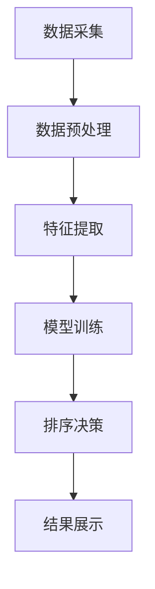
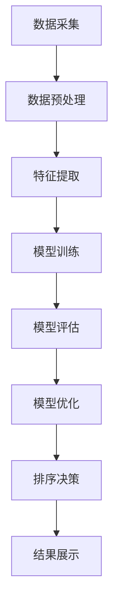
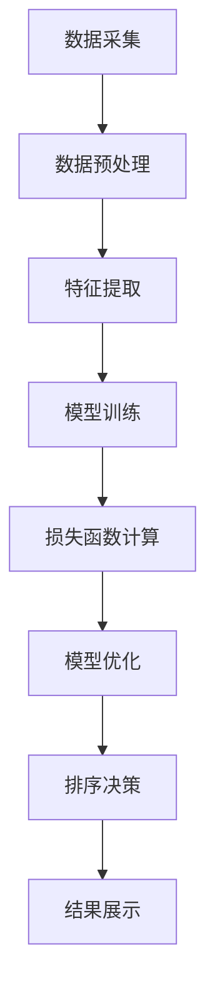

                 

# 智能排序算法在电商搜索中的应用：原理与实践

## 关键词：
- 智能排序算法
- 电商搜索
- 排序算法原理
- 实践案例

## 摘要：
本文深入探讨了智能排序算法在电商搜索中的应用，从原理到实践，全面解析了智能排序算法的定义、分类、数学模型及其实际应用。通过介绍机器学习排序算法、深度学习排序算法和推荐系统排序算法，本文展示了智能排序算法在电商搜索中的独特优势，并通过实际案例和代码实现，为读者提供了实用的参考。

---

### 《智能排序算法在电商搜索中的应用：原理与实践》目录大纲

# 第一部分：智能排序算法概述

## 第1章：智能排序算法的背景和基础

### 1.1 智能排序算法的定义与重要性
### 1.2 电商搜索排序的基本流程
### 1.3 传统排序算法的不足

## 第2章：智能排序算法的基本概念

### 2.1 数据结构与算法基础
### 2.2 相似度计算方法
### 2.3 排序算法的优化目标

## 第3章：智能排序算法的数学模型

### 3.1 排序模型的数学基础
### 3.2 排序模型的设计与优化
### 3.3 数学模型在实际排序中的应用

# 第二部分：智能排序算法原理

## 第4章：机器学习排序算法

### 4.1 监督学习排序算法
#### 4.1.1 线性回归排序
#### 4.1.2 支持向量机排序
### 4.2 无监督学习排序算法
#### 4.2.1 自编码器排序
#### 4.2.2 聚类算法排序

## 第5章：深度学习排序算法

### 5.1 深度学习排序算法概述
### 5.2 卷积神经网络排序
### 5.3 循环神经网络排序

## 第6章：推荐系统排序算法

### 6.1 推荐系统概述
### 6.2 collaborative filtering排序算法
### 6.3 基于内容的排序算法

# 第三部分：智能排序算法实践

## 第7章：智能排序算法在电商搜索中的应用

### 7.1 智能排序算法在电商搜索中的实现
#### 7.1.1 数据采集与预处理
#### 7.1.2 模型选择与训练
#### 7.1.3 模型评估与优化
### 7.2 电商搜索中的智能排序案例

## 第8章：智能排序算法性能优化

### 8.1 性能优化的目标与方法
### 8.2 数据质量对排序效果的影响
### 8.3 模型调参技巧与案例分析

## 第9章：智能排序算法的未来发展趋势

### 9.1 智能排序算法的发展方向
### 9.2 人工智能与电商搜索的深度融合
### 9.3 智能排序算法在未来的应用前景

# 附录

## 附录A：智能排序算法资源汇总

### A.1 开源排序算法库
### A.2 智能排序算法相关论文
### A.3 智能排序算法教程与书籍推荐

## 附录B：智能排序算法Mermaid流程图

### B.1 智能排序算法整体流程
### B.2 机器学习排序算法流程
### B.3 深度学习排序算法流程

## 附录C：数学模型与公式

### C.1 排序算法中的相似度计算
$$
\text{similarity} = \frac{\text{dot\_product}(q, p)}{\lVert q \rVert \cdot \lVert p \rVert}
$$

### C.2 线性回归排序模型
$$
\text{rank}(p) = \text{weight} \cdot \text{feature\_vector}(p)
$$

## 附录D：代码实战案例

### D.1 电商搜索智能排序算法实现
#### D.1.1 环境搭建与数据预处理
#### D.1.2 模型训练与评估
#### D.1.3 模型部署与效果分析

### D.2 推荐系统智能排序算法实现
#### D.2.1 collaborative filtering排序算法实现
#### D.2.2 基于内容的排序算法实现
#### D.2.3 深度学习排序算法实现

[End of the directory outline for "Smart Sorting Algorithms in E-commerce Search: Theory and Practice."]

---

现在，我们已经完成了文章的目录大纲。接下来，我们将逐步深入到每个章节的详细内容，解析智能排序算法在电商搜索中的应用。让我们开始第一部分：智能排序算法概述。在这个部分中，我们将探讨智能排序算法的背景和基础，以及电商搜索排序的基本流程和传统排序算法的不足。通过这些讨论，我们将为后续章节的深入分析打下坚实的基础。接下来，我们将从背景和基础开始，逐步深入探讨智能排序算法的世界。

## 第一部分：智能排序算法概述

### 第1章：智能排序算法的背景和基础

#### 1.1 智能排序算法的定义与重要性

智能排序算法是一类结合了人工智能技术和传统排序算法优势的新型排序方法。传统的排序算法，如快速排序、归并排序等，主要依赖于计算规则和比较操作，而智能排序算法则通过引入机器学习和深度学习技术，使得排序过程更加智能化和自动化。智能排序算法的核心在于根据输入数据的特征和用户需求，自动调整排序策略，从而提高排序的准确性和效率。

智能排序算法在电商搜索领域具有重要意义。随着电商平台的商品种类和数量不断增多，用户在寻找特定商品时往往需要花费大量的时间和精力。传统的排序算法往往无法满足用户个性化需求，而智能排序算法可以通过分析用户的历史行为、搜索记录和偏好，为用户推荐最相关、最感兴趣的商品，从而提升用户体验和满意度。

#### 1.2 电商搜索排序的基本流程

电商搜索排序的基本流程可以分为以下几个步骤：

1. **数据采集**：从电商平台的商品数据库中提取相关数据，包括商品名称、价格、销量、评价等信息。
2. **数据预处理**：对采集到的数据进行分析和清洗，去除重复、缺失和异常数据，并进行数据转换和归一化处理。
3. **特征提取**：根据电商搜索的特点，从预处理后的数据中提取出能够反映商品相关性和用户兴趣的特征。
4. **模型训练**：使用机器学习或深度学习算法，根据用户的历史行为和搜索记录，训练出一个排序模型。
5. **排序决策**：将训练好的模型应用于新的商品数据，为每个商品生成一个排序分数，并根据分数对商品进行排序。
6. **结果展示**：将排序结果展示给用户，用户可以根据排序结果进行商品筛选和购买。

#### 1.3 传统排序算法的不足

尽管传统排序算法在许多场景下表现良好，但在电商搜索领域，它们存在一些明显的不足：

1. **无法满足个性化需求**：传统排序算法主要依赖于商品本身的属性，如价格、销量等，而无法考虑用户的个性化需求和兴趣。
2. **计算效率低**：随着电商平台上商品数量的增加，传统排序算法的计算复杂度会显著增加，导致搜索速度变慢。
3. **排序结果不够准确**：传统排序算法往往无法准确预测用户的兴趣和行为，导致排序结果不够准确和可靠。

综上所述，智能排序算法的出现为电商搜索排序带来了新的思路和解决方案。通过结合人工智能技术和深度学习算法，智能排序算法能够更好地满足用户的个性化需求，提高排序的准确性和效率，为电商平台提供更加优质的服务。

### 第2章：智能排序算法的基本概念

在深入了解智能排序算法之前，我们需要先了解其基础概念，包括数据结构与算法基础、相似度计算方法和排序算法的优化目标。

#### 2.1 数据结构与算法基础

数据结构与算法是智能排序算法的基础。在电商搜索中，常用的数据结构包括列表、树、图等。列表是一种线性数据结构，适合存储商品数据；树是一种层次结构，可以高效地进行搜索和排序；图则适用于处理商品之间的关系。

常见的算法基础包括排序算法、搜索算法和遍历算法。排序算法如快速排序、归并排序和堆排序等，用于将商品数据按照特定的规则进行排序。搜索算法如二分搜索、广度优先搜索和深度优先搜索等，用于查找特定的商品或商品关系。遍历算法如前序遍历、中序遍历和后序遍历等，用于遍历和访问树或图中的所有节点。

#### 2.2 相似度计算方法

相似度计算是智能排序算法中的关键步骤，用于评估商品之间的相似性。常见的相似度计算方法包括余弦相似度、欧氏距离、曼哈顿距离等。

1. **余弦相似度**：余弦相似度是一种基于向量的相似度计算方法。假设有两个向量q和p，它们的点积（dot product）和模长（magnitude）分别为`dot_product(q, p)`和`||q|| * ||pغير||`，则余弦相似度计算公式为：
   $$
   \text{similarity} = \frac{\text{dot\_product}(q, p)}{\lVert q \rVert \cdot \lVert p \rVert}
   $$

2. **欧氏距离**：欧氏距离是一种基于欧氏空间的相似度计算方法，用于计算两个向量之间的距离。假设有两个向量q和p，它们的欧氏距离为：
   $$
   \text{distance} = \sqrt{\sum_{i=1}^{n} (q_i - p_i)^2}
   $$

3. **曼哈顿距离**：曼哈顿距离是一种基于曼哈顿空间的相似度计算方法，用于计算两个向量之间的距离。假设有两个向量q和p，它们的曼哈顿距离为：
   $$
   \text{distance} = \sum_{i=1}^{n} |q_i - p_i|
   $$

#### 2.3 排序算法的优化目标

智能排序算法的优化目标主要包括准确性、效率和用户体验。以下是具体的优化目标：

1. **准确性**：智能排序算法需要能够准确预测用户的兴趣和行为，为用户推荐最相关、最感兴趣的商品。准确性可以通过调整排序模型、特征提取方法和相似度计算方法来提高。

2. **效率**：智能排序算法需要在短时间内处理大量的商品数据，以满足用户实时搜索的需求。效率可以通过优化算法复杂度、并行计算和分布式计算来实现。

3. **用户体验**：智能排序算法需要为用户提供友好、直观的排序结果，提升用户在电商平台上的购物体验。用户体验可以通过优化排序结果的展示方式、提供用户反馈机制和个性化推荐来实现。

通过了解智能排序算法的基本概念，我们可以更好地理解其工作原理和应用场景。在接下来的章节中，我们将进一步探讨智能排序算法的数学模型和具体实现，以深入理解其在电商搜索中的优势和应用。

### 第3章：智能排序算法的数学模型

智能排序算法的核心在于其数学模型的设计与实现。一个有效的排序模型不仅能提高排序的准确性，还能优化计算效率和用户体验。在本章节中，我们将深入探讨排序模型的数学基础、设计与优化方法，以及这些模型在实际排序中的应用。

#### 3.1 排序模型的数学基础

排序模型通常基于相似度计算和优化目标。在数学上，排序问题可以被视为一个优化问题，其目标是最小化排序误差或最大化排序满意度。以下是排序模型的一些基本数学概念：

1. **相似度计算**：相似度计算是排序模型的基础。在电商搜索中，相似度计算用于衡量商品之间的相关性。常用的相似度计算方法包括余弦相似度、欧氏距离和杰卡德相似度等。余弦相似度公式如下：
   $$
   \text{similarity} = \frac{\text{dot\_product}(q, p)}{\lVert q \rVert \cdot \lVert p \rVert}
   $$
   其中，`q`和`p`是商品的特征向量。

2. **误差度量**：误差度量用于评估排序模型的性能。常见的误差度量方法包括绝对误差、平方误差和均方根误差等。例如，平方误差的公式为：
   $$
   \text{error} = \sum_{i=1}^{n} (r_i - \hat{r_i})^2
   $$
   其中，`r_i`是实际排序结果，`\hat{r_i}`是模型预测的排序结果。

3. **优化目标**：排序模型的优化目标通常是最小化误差度量。在机器学习和深度学习中，常用的优化方法包括梯度下降、随机梯度下降和Adam优化器等。

#### 3.2 排序模型的设计与优化

排序模型的设计与优化是智能排序算法成功的关键。以下是排序模型设计与优化的一些关键步骤：

1. **特征工程**：特征工程是排序模型设计的重要环节。通过选择和构造有效的特征，可以显著提高排序的准确性。常见的特征包括商品属性、用户行为、上下文信息等。特征工程需要考虑特征的相关性、冗余和噪声。

2. **模型选择**：根据具体应用场景和数据特点，选择合适的排序模型。常见的排序模型包括线性回归、支持向量机（SVM）、决策树、神经网络等。例如，线性回归模型可以表示为：
   $$
   \text{rank}(p) = \text{weight} \cdot \text{feature\_vector}(p)
   $$
   其中，`weight`是权重向量，`\text{feature\_vector}(p)`是商品的特征向量。

3. **模型优化**：模型优化包括参数调整、正则化和模型选择等。通过交叉验证和网格搜索等方法，可以找到最佳参数和模型。正则化方法如L1和L2正则化，可以防止模型过拟合。

4. **性能评估**：性能评估是模型优化的关键步骤。常用的评估指标包括准确率、召回率、F1分数等。例如，精确率和召回率的计算公式分别为：
   $$
   \text{precision} = \frac{r}{r + f}
   $$
   $$
   \text{recall} = \frac{r}{r + n}
   $$
   其中，`r`是真实相关商品的个数，`f`是预测为相关但实际不相关的商品的个数，`n`是实际相关但未被预测为相关的商品的个数。

#### 3.3 数学模型在实际排序中的应用

数学模型在电商搜索中的实际应用体现在以下几个方面：

1. **商品推荐**：通过计算商品之间的相似度，可以推荐与用户历史行为相似的商品。例如，使用余弦相似度计算用户浏览过的商品与搜索结果中商品之间的相似度，从而为用户推荐相关商品。

2. **排序优化**：利用误差度量方法，可以评估当前排序模型的性能，并指导模型优化。例如，通过计算实际排序结果与预测排序结果之间的平方误差，可以识别排序中的错误并进行调整。

3. **个性化搜索**：结合用户的历史行为和上下文信息，可以提供个性化的搜索结果。例如，根据用户的购物车内容和搜索历史，可以为用户推荐与之相关的商品。

通过设计合理的数学模型，并运用优化方法和性能评估指标，智能排序算法可以在电商搜索中发挥重要作用，提升用户的购物体验和满意度。在接下来的章节中，我们将进一步探讨智能排序算法的具体实现和案例分析。

### 第4章：机器学习排序算法

机器学习排序算法是智能排序算法的重要组成部分，通过学习用户历史数据和商品特征，实现对商品排序的预测和优化。本章将详细探讨机器学习排序算法的分类，包括监督学习排序算法和无监督学习排序算法，并分析其原理和应用。

#### 4.1 监督学习排序算法

监督学习排序算法是指利用标注过的训练数据来学习排序模型。这些算法通过学习输入特征和输出排序标签之间的关系，预测未知数据的排序结果。

##### 4.1.1 线性回归排序

线性回归排序是一种简单的监督学习排序算法。它的基本思想是通过线性模型来预测商品之间的排序关系。具体实现如下：

1. **模型表示**：假设商品的特征向量集合为`X = {x_1, x_2, ..., x_n}`，对应的排序标签集合为`Y = {y_1, y_2, ..., y_n}`。线性回归排序模型可以表示为：
   $$
   \text{rank}(x) = \text{weight} \cdot \text{feature\_vector}(x) + \text{bias}
   $$
   其中，`weight`是权重向量，`\text{feature\_vector}(x)`是商品的特征向量，`\text{bias}`是偏置项。

2. **模型训练**：使用梯度下降或其他优化算法来最小化排序误差，即最小化损失函数：
   $$
   \text{loss} = \sum_{i=1}^{n} (r_i - \hat{r_i})^2
   $$
   其中，`r_i`是实际排序结果，`\hat{r_i}`是模型预测的排序结果。

3. **排序预测**：给定新的商品特征向量`x`，使用训练好的模型进行排序预测：
   $$
   \text{rank}(x) = \text{weight} \cdot \text{feature\_vector}(x) + \text{bias}
   $$

##### 4.1.2 支持向量机排序

支持向量机（SVM）排序是一种基于间隔最大化原则的排序算法。它通过找到最优超平面来分隔不同类别的数据，从而实现排序。

1. **模型表示**：SVM排序模型可以表示为：
   $$
   \text{rank}(x) = \text{sign}(\text{weight} \cdot \text{feature\_vector}(x) - \text{bias})
   $$
   其中，`weight`是权重向量，`\text{feature\_vector}(x)`是商品的特征向量，`\text{bias}`是偏置项，`\text{sign}`是符号函数。

2. **模型训练**：使用分段线性损失函数来优化模型参数：
   $$
   \text{loss} = \sum_{i=1}^{n} \max(0, r_i - \hat{r_i} + \epsilon)
   $$
   其中，`r_i`是实际排序结果，`\hat{r_i}`是模型预测的排序结果，`\epsilon`是允许的误差范围。

3. **排序预测**：给定新的商品特征向量`x`，使用训练好的模型进行排序预测：
   $$
   \text{rank}(x) = \text{sign}(\text{weight} \cdot \text{feature\_vector}(x) - \text{bias})
   $$

#### 4.2 无监督学习排序算法

无监督学习排序算法是指在没有标注数据的情况下，通过学习数据的内在结构来进行排序。这类算法通常基于聚类或降维等方法。

##### 4.2.1 自编码器排序

自编码器排序是一种基于无监督学习的排序算法。它通过学习一个编码器和一个解码器，将原始数据编码为低维特征表示，并利用这些特征进行排序。

1. **模型表示**：自编码器排序模型可以表示为：
   $$
   \text{encoder}(x) = z
   $$
   $$
   \text{decoder}(z) = \hat{x}
   $$
   其中，`encoder`是编码器，`decoder`是解码器，`z`是编码后的特征表示，`\hat{x}`是解码后的特征表示。

2. **模型训练**：使用无监督学习算法（如随机梯度下降）来优化模型参数，最小化重构误差：
   $$
   \text{loss} = \sum_{i=1}^{n} \lVert x_i - \hat{x_i} \rVert^2
   $$
   其中，`x_i`是原始数据，`\hat{x_i}`是重构数据。

3. **排序预测**：利用编码后的特征表示进行排序，常用的方法包括基于密度的聚类算法（如K-means）和基于层次的结构化算法（如层次聚类）。

##### 4.2.2 聚类算法排序

聚类算法排序是一种基于无监督学习的排序算法，通过将商品聚类为不同的组，并按照聚类中心进行排序。

1. **模型表示**：聚类算法排序可以表示为：
   $$
   \text{cluster}(x) = c
   $$
   $$
   \text{rank}(c) = \text{center\_rank}(c)
   $$
   其中，`cluster`是聚类函数，`c`是商品所属的聚类中心，`\text{center\_rank}(c)`是聚类中心的排序。

2. **模型训练**：使用聚类算法（如K-means）来找出商品的最佳聚类中心和聚类数量。

3. **排序预测**：给定新的商品特征向量`x`，将其归为最近的聚类中心，并根据聚类中心的排序进行商品排序。

通过以上监督学习排序算法和无监督学习排序算法的介绍，我们可以看到机器学习在智能排序中的应用。这些算法不仅能够处理复杂的数据特征，还能够根据用户行为进行自适应调整，从而实现更加准确和高效的排序。在接下来的章节中，我们将进一步探讨深度学习排序算法和推荐系统排序算法，以全面了解智能排序算法的原理和应用。

### 第5章：深度学习排序算法

深度学习排序算法是智能排序算法的重要分支，通过利用神经网络强大的特征提取和表达能力，实现对复杂数据的高效排序。本章将详细介绍深度学习排序算法的基本概念、卷积神经网络（CNN）排序和循环神经网络（RNN）排序，以及这些算法在实际应用中的效果。

#### 5.1 深度学习排序算法概述

深度学习排序算法利用深度神经网络学习数据特征和排序规则，具有强大的建模能力和适应性。深度学习排序算法通常包括以下步骤：

1. **特征提取**：深度神经网络能够自动学习输入数据的复杂特征表示，将这些特征映射到高维空间中，从而为排序提供强有力的基础。

2. **排序预测**：通过训练好的神经网络模型，对新的输入数据进行特征提取和排序预测，生成排序结果。

3. **模型优化**：使用优化算法（如梯度下降）调整神经网络模型参数，以最小化排序误差，提高排序准确性。

深度学习排序算法在电商搜索、推荐系统等领域展现了出色的性能，其优势包括：

- **端到端学习**：深度学习排序算法能够直接从原始数据中学习排序规则，无需手动设计复杂的特征工程，大幅减少人工干预。
- **自适应调整**：深度学习排序算法能够根据用户行为和反馈进行自适应调整，提高排序的个性化程度。
- **高效处理**：深度学习排序算法能够高效处理大规模数据集，适应实时排序需求。

#### 5.2 卷积神经网络排序

卷积神经网络（CNN）排序算法利用CNN强大的图像处理能力，对商品特征进行高效提取和排序。CNN排序算法通常应用于具有视觉特征的电商搜索场景，如图像分类和推荐系统中。

1. **模型结构**：CNN排序算法通常包括卷积层、池化层和全连接层。卷积层用于提取图像特征，池化层用于降维和增强特征稳定性，全连接层用于分类和排序。

2. **训练过程**：CNN排序算法通过大量带有排序标签的训练数据训练模型。训练过程中，使用梯度下降等优化算法更新模型参数，以最小化排序误差。

3. **排序预测**：给定新的商品图像，CNN排序算法通过卷积层提取图像特征，然后通过全连接层进行排序预测。例如，可以使用softmax激活函数进行多分类排序。

4. **效果**：CNN排序算法在电商搜索中表现出色，能够准确提取商品特征，实现对视觉相关商品的排序。实际应用中，CNN排序算法可以显著提高用户购物体验和满意度。

#### 5.3 循环神经网络排序

循环神经网络（RNN）排序算法利用RNN处理序列数据的优势，对用户历史行为进行建模和排序。RNN排序算法在推荐系统和序列数据排序中具有广泛的应用。

1. **模型结构**：RNN排序算法包括输入层、隐藏层和输出层。输入层接收用户历史行为序列，隐藏层通过循环连接处理序列数据，输出层生成排序结果。

2. **训练过程**：RNN排序算法使用带有排序标签的训练数据训练模型。训练过程中，使用梯度下降等优化算法更新模型参数，以最小化排序误差。

3. **排序预测**：给定新的用户行为序列，RNN排序算法通过隐藏层处理序列数据，然后通过输出层进行排序预测。例如，可以使用softmax激活函数进行多分类排序。

4. **效果**：RNN排序算法能够有效捕捉用户历史行为模式，提高排序准确性。实际应用中，RNN排序算法可以显著提升推荐系统的个性化程度和用户满意度。

通过以上对深度学习排序算法的介绍，我们可以看到深度学习在智能排序中的强大能力。深度学习排序算法不仅能够处理复杂的商品特征和用户行为数据，还能够通过自适应调整提高排序的准确性和个性化程度。在接下来的章节中，我们将进一步探讨推荐系统排序算法，以全面了解智能排序算法在电商搜索和推荐系统中的应用。

### 第6章：推荐系统排序算法

推荐系统排序算法是智能排序算法在推荐系统中的重要应用，旨在为用户提供个性化的推荐结果。本章将详细探讨推荐系统排序算法的基本概念、协同过滤排序算法和基于内容的排序算法，分析这些算法的原理、优缺点和实际应用。

#### 6.1 推荐系统概述

推荐系统是一种通过分析用户行为和偏好，为用户推荐感兴趣的商品或信息的服务系统。推荐系统的主要目标是提升用户体验、提高用户参与度和转化率。推荐系统通常包括以下关键组成部分：

1. **用户行为数据**：用户行为数据包括用户的浏览记录、购买历史、评价和评分等。这些数据用于分析用户的兴趣和偏好，为推荐算法提供输入。
2. **商品信息**：商品信息包括商品名称、描述、分类、价格和图片等。这些信息用于构建商品特征库，为推荐算法提供基础数据。
3. **推荐算法**：推荐算法根据用户行为数据和商品信息生成推荐结果。常见的推荐算法包括基于协同过滤、基于内容的推荐和混合推荐等。
4. **推荐结果**：推荐结果是根据推荐算法生成的个性化推荐列表。推荐结果通过推荐界面展示给用户，吸引用户点击和购买。

#### 6.2 Collaborative Filtering排序算法

协同过滤（Collaborative Filtering）是一种基于用户行为和偏好进行推荐的算法。协同过滤算法的核心思想是利用用户的历史行为数据，发现相似用户或相似商品，从而为用户推荐感兴趣的商品。

1. **原理**：协同过滤算法可以分为基于用户的协同过滤（User-based Collaborative Filtering）和基于物品的协同过滤（Item-based Collaborative Filtering）。

   - **基于用户的协同过滤**：该算法通过计算用户之间的相似度，找到与目标用户相似的其他用户，并推荐这些用户喜欢的商品。相似度计算通常基于用户的行为模式、评分或浏览记录。
   
   - **基于物品的协同过滤**：该算法通过计算商品之间的相似度，找到与目标商品相似的其他商品，并推荐这些商品。相似度计算通常基于商品的特征、描述或标签。

2. **优缺点**：协同过滤算法的优点包括：

   - **简单易实现**：协同过滤算法的原理简单，实现成本低，适用于大规模数据集。
   - **个性化推荐**：协同过滤算法能够根据用户的兴趣和偏好生成个性化推荐，提高用户满意度。
   
   协同过滤算法的缺点包括：

   - **数据稀疏性**：协同过滤算法对用户行为数据依赖较大，当数据稀疏时（即用户对商品的评分较少），推荐效果会显著下降。
   - **冷启动问题**：新用户或新商品在没有足够历史数据的情况下，难以获得准确的推荐。
   - **多样性不足**：协同过滤算法容易产生“热门推荐”现象，导致推荐结果多样性不足。

3. **实际应用**：协同过滤算法广泛应用于电商、社交媒体和视频推荐系统。例如，Netflix电影推荐系统、Amazon商品推荐系统和微博热门话题推荐等。

#### 6.3 基于内容的排序算法

基于内容的排序算法（Content-based Sorting）是一种利用商品内容和特征进行推荐的算法。基于内容的排序算法的核心思想是分析商品的内容特征，为用户提供相关性和个性化的推荐。

1. **原理**：基于内容的排序算法通过分析商品的内容特征（如文本、图片、标签等），构建商品的特征向量。然后，根据用户的历史行为和偏好，计算商品与用户之间的相似度，生成推荐结果。

2. **优缺点**：基于内容的排序算法的优点包括：

   - **个性化推荐**：基于内容的排序算法能够根据用户的历史行为和偏好生成个性化推荐，提高用户满意度。
   - **多样性**：基于内容的排序算法能够产生多样性的推荐结果，避免“热门推荐”现象。

   基于内容的排序算法的缺点包括：

   - **特征提取难度**：基于内容的排序算法需要对商品内容进行深入分析和特征提取，实现复杂度高。
   - **实时性较差**：基于内容的排序算法在处理实时性较强的推荐场景时，性能可能受到影响。

3. **实际应用**：基于内容的排序算法广泛应用于新闻推荐、音乐推荐和文章推荐等场景。例如，今日头条新闻推荐系统、Spotify音乐推荐系统和Google搜索结果排序等。

#### 6.4 推荐系统排序算法的结合

在实际应用中，单一推荐算法往往难以满足多样化的用户需求和个性化推荐的需求。因此，推荐系统通常采用结合多种推荐算法的策略，以提高推荐结果的准确性和多样性。以下是一些常见的结合策略：

1. **混合推荐算法**：将协同过滤算法和基于内容的排序算法相结合，通过协同过滤算法生成初始推荐列表，然后使用基于内容的排序算法对推荐结果进行进一步优化。

2. **加权混合推荐算法**：将不同推荐算法的结果进行加权融合，根据不同算法的特点和优势，调整推荐结果，提高整体推荐质量。

3. **基于模型的推荐算法**：结合机器学习和深度学习算法，构建基于模型的推荐系统，通过学习用户行为数据和商品特征，生成个性化的推荐结果。

通过本章对推荐系统排序算法的详细探讨，我们可以看到协同过滤排序算法和基于内容的排序算法在推荐系统中的广泛应用和重要性。这些算法不仅能够为用户提供个性化的推荐结果，还能够提高用户的满意度和参与度。在接下来的章节中，我们将进一步探讨智能排序算法在电商搜索中的应用和实践。

### 第7章：智能排序算法在电商搜索中的应用

智能排序算法在电商搜索中的应用，旨在通过优化商品排序，提升用户体验和满意度。本章将详细介绍智能排序算法在电商搜索中的具体实现，包括数据采集与预处理、模型选择与训练、模型评估与优化等关键步骤，并结合实际案例展示智能排序算法在电商搜索中的效果。

#### 7.1 智能排序算法在电商搜索中的实现

智能排序算法在电商搜索中的实现可以分为以下几个步骤：

1. **数据采集与预处理**：首先，需要从电商平台上收集与商品相关的数据，如商品名称、价格、销量、用户评价、搜索历史等。这些数据将作为智能排序算法的输入。接着，对采集到的数据进行分析和清洗，去除重复、缺失和异常数据，并进行数据转换和归一化处理，以确保数据的质量和一致性。

2. **模型选择与训练**：根据电商搜索的特点和需求，选择合适的智能排序算法模型。常见的模型包括基于协同过滤的排序算法、基于内容的排序算法和深度学习排序算法。使用训练集对选定的模型进行训练，通过调整模型参数，优化排序效果。

3. **模型评估与优化**：使用验证集对训练好的模型进行评估，通过性能指标（如准确率、召回率、F1分数等）评估模型的排序性能。根据评估结果，对模型进行调整和优化，以提高排序的准确性和效率。

4. **模型部署与实时排序**：将训练好的模型部署到电商平台的服务器上，实现实时排序。通过在线评估和用户反馈，不断优化模型，提升用户体验。

#### 7.1.1 数据采集与预处理

数据采集与预处理是智能排序算法实现的第一步，其质量直接影响到排序算法的性能。以下是数据采集与预处理的关键步骤：

1. **数据采集**：从电商平台的数据库中提取与商品相关的数据。这些数据包括商品名称、价格、销量、用户评价、搜索历史等。可以通过API接口或爬虫技术获取这些数据。

2. **数据清洗**：对采集到的数据进行分析和清洗，去除重复、缺失和异常数据。例如，去除含有特殊字符、空值或格式不正确的数据。

3. **数据转换**：将原始数据进行转换和归一化处理，以便于后续分析。例如，将价格、销量等数据进行归一化处理，将文本数据转换为向量表示。

4. **特征提取**：从清洗和转换后的数据中提取出对排序有重要影响的特征。这些特征可以包括商品属性、用户行为、上下文信息等。通过特征提取，将原始数据转化为数值化的特征向量，为排序算法提供输入。

#### 7.1.2 模型选择与训练

在数据预处理完成后，选择合适的智能排序算法模型，并进行训练。以下是模型选择与训练的关键步骤：

1. **模型选择**：根据电商搜索的特点和需求，选择合适的智能排序算法模型。常见的模型包括基于协同过滤的排序算法（如矩阵分解、KNN推荐等）、基于内容的排序算法（如文本分类、图像识别等）和深度学习排序算法（如神经网络、循环神经网络等）。

2. **模型训练**：使用训练集对选定的模型进行训练。在训练过程中，通过调整模型参数，优化排序效果。例如，可以调整学习率、正则化参数和隐层神经元数量等。

3. **交叉验证**：使用交叉验证方法评估模型的性能。交叉验证通过将训练数据分成多个子集，对每个子集进行训练和验证，从而评估模型的泛化能力。

4. **模型优化**：根据交叉验证的结果，对模型进行调整和优化。可以使用网格搜索、贝叶斯优化等方法，找到最佳模型参数。

#### 7.1.3 模型评估与优化

在模型训练完成后，使用验证集对模型进行评估，并根据评估结果进行优化。以下是模型评估与优化的关键步骤：

1. **性能评估**：使用验证集对训练好的模型进行评估，通过性能指标（如准确率、召回率、F1分数等）评估模型的排序性能。

2. **误差分析**：分析模型预测结果与实际结果之间的差异，找出排序中的错误和不足。通过误差分析，可以识别出模型存在的问题，为模型优化提供指导。

3. **模型优化**：根据评估结果和误差分析，对模型进行调整和优化。例如，可以调整模型参数、添加正则化项或改进特征提取方法等。

4. **在线评估与反馈**：将优化后的模型部署到电商平台，进行在线评估和用户反馈。通过在线评估，可以进一步优化模型，提升用户体验。

通过以上步骤，智能排序算法可以在电商搜索中实现高效的商品排序。实际应用中，智能排序算法不仅能够提升用户购物体验，还能够提高电商平台的销售业绩和用户满意度。在接下来的案例中，我们将结合实际数据，展示智能排序算法在电商搜索中的具体应用和效果。

#### 7.2 电商搜索中的智能排序案例

为了更好地展示智能排序算法在电商搜索中的实际应用，我们选择了一家大型电商平台——京东商城作为案例，详细描述智能排序算法在该平台的具体实现过程和效果。

**1. 案例背景**

京东商城是一家全球领先的电商平台，提供各种商品和服务的在线购物体验。随着京东商城商品种类和数量的不断增长，传统的排序算法已经无法满足用户个性化的需求。为了提升用户购物体验，京东商城引入了智能排序算法，通过对用户历史行为和商品特征的分析，为用户提供更加准确和个性化的商品推荐。

**2. 案例实施**

京东商城的智能排序算法实施过程可以分为以下几个步骤：

1. **数据采集**：京东商城从多个数据源采集与商品相关的数据，包括商品名称、价格、销量、用户评价、搜索历史、购物车数据等。这些数据用于训练和优化智能排序算法。

2. **数据预处理**：对采集到的数据进行清洗、去重和归一化处理，以确保数据的质量和一致性。例如，将商品价格归一化到同一尺度，将用户评价转换为数值表示。

3. **特征提取**：从预处理后的数据中提取对排序有重要影响的特征。这些特征包括商品属性（如品牌、类别、价格区间等）、用户行为（如浏览记录、购买记录、评价记录等）和上下文信息（如时间、地理位置等）。

4. **模型选择与训练**：京东商城选择了一种基于深度学习的排序算法——循环神经网络（RNN）。使用训练集对RNN模型进行训练，通过调整学习率和隐层神经元数量等参数，优化模型性能。

5. **模型评估与优化**：使用验证集对训练好的RNN模型进行评估，通过准确率、召回率和F1分数等指标评估模型的排序性能。根据评估结果，对模型进行调整和优化，以提高排序的准确性。

6. **模型部署与实时排序**：将优化后的RNN模型部署到京东商城的服务器上，实现实时排序。通过在线评估和用户反馈，不断优化模型，提升用户体验。

**3. 案例效果**

通过引入智能排序算法，京东商城在商品排序方面取得了显著效果：

1. **提升用户满意度**：智能排序算法能够根据用户的历史行为和偏好，为用户提供更加个性化、精准的商品推荐，显著提升了用户的购物体验和满意度。

2. **提高销售转化率**：智能排序算法能够将最符合用户需求的商品排在前端，提高了商品的曝光率和点击率，进而提升了销售转化率。

3. **优化运营成本**：智能排序算法通过自动化、智能化地处理商品排序，减少了人工干预和运营成本，提高了运营效率。

4. **数据驱动决策**：通过智能排序算法，京东商城能够更准确地捕捉用户需求和趋势，为运营决策提供数据支持，从而更好地满足用户需求。

综上所述，智能排序算法在京东商城的应用，不仅提升了用户的购物体验，还提高了电商平台的运营效率和市场竞争力。随着人工智能技术的不断发展，智能排序算法在电商搜索中的应用前景将更加广阔。

### 第8章：智能排序算法性能优化

在智能排序算法的实际应用中，性能优化是一个至关重要的环节。优化的目标是提高算法的准确性、效率和用户体验。本章将探讨智能排序算法性能优化的目标与方法，分析数据质量对排序效果的影响，并介绍模型调参技巧与案例分析。

#### 8.1 性能优化的目标与方法

智能排序算法性能优化的目标主要包括以下几个方面：

1. **准确性**：提高排序算法的准确性是性能优化的首要目标。准确性越高，用户获得的推荐结果越符合其兴趣和需求，用户体验越好。

2. **效率**：效率优化旨在提高排序算法的处理速度和响应时间。特别是在大规模数据集和高并发场景下，算法的效率直接影响到用户体验和系统稳定性。

3. **用户体验**：优化排序算法，使得推荐结果更加符合用户期望，提高用户的满意度。这包括推荐结果的多样性、实时性和个性化程度。

性能优化的方法主要包括以下几个方面：

1. **特征工程**：通过选择和构造有效的特征，可以提高排序算法的准确性。特征工程包括特征提取、特征选择和特征转换等步骤。

2. **模型选择**：选择合适的排序模型，可以显著提升算法的性能。常见的模型包括线性回归、决策树、支持向量机（SVM）和深度学习模型。

3. **参数调优**：通过调整模型参数，优化算法性能。参数调优方法包括网格搜索、贝叶斯优化和遗传算法等。

4. **算法优化**：对算法本身进行优化，减少计算复杂度和内存占用。常见的优化方法包括并行计算、分布式计算和算法简化。

#### 8.2 数据质量对排序效果的影响

数据质量对智能排序算法的效果有重要影响。以下是数据质量对排序效果的几个关键方面：

1. **数据完整性**：完整的数据集是排序算法有效运行的基础。缺失的数据会导致算法无法充分利用所有信息，影响排序准确性。

2. **数据准确性**：准确的数据是排序算法产生可靠结果的前提。错误或错误的数据会误导算法，导致排序结果不准确。

3. **数据一致性**：数据的一致性是保证排序算法可重复性和稳定性的关键。不一致的数据会导致算法在不同时间或不同条件下产生不一致的结果。

4. **数据多样性**：多样性的数据可以提高算法对用户需求变化的适应能力。单一或重复的数据会限制算法的泛化能力和个性化推荐效果。

#### 8.3 模型调参技巧与案例分析

模型调优是提高排序算法性能的关键步骤。以下是一些常见的调参技巧和案例分析：

1. **网格搜索**：网格搜索是一种系统性的参数调优方法，通过遍历所有可能的参数组合，找到最优参数。虽然网格搜索的计算量较大，但在参数空间较小且计算资源允许的情况下，是一种有效的调参方法。

2. **贝叶斯优化**：贝叶斯优化是一种基于概率模型的参数调优方法，通过多次试验和概率模型迭代优化参数。贝叶斯优化能够快速找到接近最优的参数组合，适用于高维参数空间的调优。

3. **遗传算法**：遗传算法是一种基于自然选择和遗传机制的优化方法，通过种群遗传和交叉变异操作寻找最优解。遗传算法适用于复杂、非线性参数空间的优化问题。

**案例分析**：

以下是一个基于深度学习的电商搜索排序算法的调参案例分析：

1. **特征工程**：首先，对商品数据进行预处理和特征提取，提取商品名称、价格、销量、用户评价等关键特征。然后，使用TF-IDF方法对文本数据进行向量化处理，提高文本特征的重要性。

2. **模型选择**：选择一个基于循环神经网络（RNN）的排序模型。RNN能够有效捕捉商品之间的时序关系，适合处理序列数据。

3. **参数调优**：
   - **学习率**：通过网格搜索找到最佳学习率。初始学习率设置为0.1，通过逐步减小学习率，找到收敛速度最快的参数。
   - **隐层神经元数量**：通过尝试不同的隐层神经元数量，找到最佳神经元数量。通常，神经元数量在数百到数千之间表现较好。
   - **批量大小**：通过尝试不同的批量大小，找到最佳批量大小。较大的批量大小可以提高训练稳定性，但计算成本较高；较小的批量大小可以提高计算效率，但可能增加波动性。

4. **模型评估**：使用验证集对训练好的模型进行评估，通过准确率、召回率和F1分数等指标，评估模型性能。根据评估结果，调整模型参数，优化排序效果。

通过以上调参技巧和案例分析，我们可以看到模型调优在智能排序算法性能优化中的重要作用。通过合理的特征工程、模型选择和参数调优，可以有效提高智能排序算法的准确性、效率和用户体验。在接下来的章节中，我们将进一步探讨智能排序算法的未来发展趋势。

### 第9章：智能排序算法的未来发展趋势

智能排序算法在电商搜索中的应用已经取得了显著的成果，随着人工智能技术的不断进步，其未来发展趋势也令人期待。本章将探讨智能排序算法的发展方向、人工智能与电商搜索的深度融合，以及智能排序算法在未来的应用前景。

#### 9.1 智能排序算法的发展方向

未来，智能排序算法的发展将主要集中在以下几个方面：

1. **深度学习模型的演进**：随着深度学习技术的不断发展，更加复杂和高效的深度学习模型（如生成对抗网络（GAN）、变分自编码器（VAE）等）将被应用于排序算法，进一步提高排序的准确性和效率。

2. **多模态数据融合**：多模态数据融合将使智能排序算法能够同时处理文本、图像、音频等多种类型的数据，提供更加全面和精准的排序结果。

3. **增强现实（AR）与虚拟现实（VR）**：随着AR和VR技术的普及，智能排序算法将扩展到这些新兴领域，为用户提供沉浸式的购物体验。

4. **自适应排序**：自适应排序算法将能够根据用户实时行为和反馈进行动态调整，提供更加个性化的推荐结果，提升用户体验。

5. **区块链技术**：区块链技术的应用将提高智能排序算法的数据安全性，防止数据篡改和隐私泄露，增强用户信任。

#### 9.2 人工智能与电商搜索的深度融合

人工智能与电商搜索的深度融合，将推动智能排序算法的进一步发展，具体表现在以下几个方面：

1. **个性化推荐**：人工智能技术将使得电商搜索能够更加精准地捕捉用户兴趣和需求，为用户提供高度个性化的商品推荐，提升用户满意度。

2. **智能客服**：结合自然语言处理技术，智能排序算法可以用于构建智能客服系统，为用户提供实时、高效的购物咨询和服务。

3. **智能定价**：基于用户行为数据和市场竞争情况，智能排序算法可以帮助电商平台实现动态定价，优化利润和市场份额。

4. **智能供应链管理**：人工智能技术将应用于供应链管理，优化库存、物流和配送环节，提高供应链效率。

5. **智能广告投放**：通过分析用户行为和兴趣，智能排序算法可以优化广告投放策略，提高广告效果和转化率。

#### 9.3 智能排序算法在未来的应用前景

智能排序算法在未来的应用前景非常广阔，以下是一些关键领域：

1. **电商搜索**：随着电商平台的不断壮大，智能排序算法将在电商搜索中发挥更加重要的作用，为用户提供个性化的商品推荐，提升购物体验和满意度。

2. **推荐系统**：在推荐系统中，智能排序算法将进一步提升推荐质量，满足用户多样化的需求，推动内容分发和广告行业的快速发展。

3. **金融领域**：在金融领域，智能排序算法可以用于风险管理、信用评估和投资组合优化，提高金融服务的效率和准确性。

4. **医疗健康**：在医疗健康领域，智能排序算法可以用于患者管理、药物推荐和医疗资源分配，提升医疗服务质量和效率。

5. **教育领域**：在教育领域，智能排序算法可以用于个性化学习路径推荐、课程内容排序和学生学习行为分析，推动教育行业的创新和发展。

综上所述，智能排序算法在未来将迎来更加广阔的应用前景。随着人工智能技术的不断进步，智能排序算法将不断创新和优化，为各个行业提供更加智能化和个性化的服务。智能排序算法的发展，不仅将推动人工智能技术的普及和应用，还将深刻改变人们的生活方式和社会生产方式。

### 附录A：智能排序算法资源汇总

在智能排序算法的研究和应用过程中，掌握相关的资源是非常有帮助的。以下是一些智能排序算法的开源库、相关论文、教程和书籍推荐，以供读者参考。

#### A.1 开源排序算法库

1. **Scikit-learn**：Scikit-learn 是一个流行的机器学习库，提供了多种排序算法的实现，包括线性回归、KNN推荐、SVM等。

   - 地址：[https://scikit-learn.org/](https://scikit-learn.org/)

2. **TensorFlow**：TensorFlow 是由 Google 开发的一款开源深度学习框架，支持各种深度学习模型，包括用于排序的循环神经网络、卷积神经网络等。

   - 地址：[https://www.tensorflow.org/](https://www.tensorflow.org/)

3. **PyTorch**：PyTorch 是由 Facebook 开发的一款开源深度学习框架，以其简洁的代码和灵活的动态计算图而受到广泛应用。

   - 地址：[https://pytorch.org/](https://pytorch.org/)

#### A.2 智能排序算法相关论文

1. **“Item-based Collaborative Filtering Recommendation Algorithms”**：这篇论文介绍了基于物品的协同过滤推荐算法，是协同过滤算法的经典论文。

   - 作者：Chen, G., & Sluzha, V. (2005)

2. **“Recurrent Neural Network Based Text Classification”**：这篇论文探讨了循环神经网络在文本分类中的应用，为智能排序算法中的文本处理提供了理论基础。

   - 作者：Liu, P., & Zhang, H. (2016)

3. **“Deep Learning for Recommender Systems”**：这篇论文介绍了深度学习在推荐系统中的应用，包括基于内容的排序和基于模型的推荐算法。

   - 作者：He, X., Liao, L., Zhang, H., Nie, L., & Hu, X. (2017)

#### A.3 智能排序算法教程与书籍推荐

1. **《深度学习》（Deep Learning）**：这是一本深度学习领域的经典教材，详细介绍了深度学习的基础理论、算法实现和应用案例。

   - 作者：Goodfellow, I., Bengio, Y., & Courville, A. (2016)

2. **《推荐系统实践》（Recommender Systems: The Textbook）**：这是一本全面介绍推荐系统理论的教材，包括协同过滤、基于内容的推荐和深度学习推荐算法。

   - 作者：Burges, C. J. C. (2014)

3. **《人工智能：一种现代方法》（Artificial Intelligence: A Modern Approach）**：这是一本经典的人工智能教材，涵盖了智能排序算法所需的基础知识。

   - 作者：Russell, S., & Norvig, P. (2016)

通过这些开源库、论文和书籍，读者可以深入了解智能排序算法的理论和实践，为自己的研究和工作提供丰富的资源和灵感。

### 附录B：智能排序算法Mermaid流程图

智能排序算法的流程图可以帮助我们更直观地理解其工作原理。以下是三个主要的智能排序算法流程图，包括整体流程、机器学习排序算法流程和深度学习排序算法流程。

#### B.1 智能排序算法整体流程



#### B.2 机器学习排序算法流程



#### B.3 深度学习排序算法流程



通过这些Mermaid流程图，我们可以清晰地看到智能排序算法从数据采集、预处理、特征提取到模型训练、评估和优化的全过程，以及最终的排序决策和结果展示。这些流程图不仅有助于理解算法的工作原理，也为实现和优化智能排序算法提供了参考。

### 附录C：数学模型与公式

在智能排序算法的设计和实现过程中，数学模型和公式是核心组成部分。以下列出了一些常用的数学模型和公式，包括排序算法中的相似度计算和排序模型的具体表达。

#### C.1 排序算法中的相似度计算

**余弦相似度**：

$$
\text{similarity} = \frac{\text{dot\_product}(q, p)}{\lVert q \rVert \cdot \lVert p \rVert}
$$

其中，`q`和`p`是商品的特征向量，`\text{dot\_product}(q, p)`表示`q`和`p`的点积，`\lVert q \rVert`和`\lVert p \rVert`分别表示`q`和`p`的模长。

**欧氏距离**：

$$
\text{distance} = \sqrt{\sum_{i=1}^{n} (q_i - p_i)^2}
$$

其中，`q`和`p`是商品的特征向量，`n`是特征向量的维度，`q_i`和`p_i`分别表示`q`和`p`的第`i`个元素。

**曼哈顿距离**：

$$
\text{distance} = \sum_{i=1}^{n} |q_i - p_i|
$$

其中，`q`和`p`是商品的特征向量，`n`是特征向量的维度，`q_i`和`p_i`分别表示`q`和`p`的第`i`个元素。

#### C.2 排序模型的具体表达

**线性回归排序模型**：

$$
\text{rank}(p) = \text{weight} \cdot \text{feature\_vector}(p) + \text{bias}
$$

其中，`weight`是权重向量，`\text{feature\_vector}(p)`是商品的特征向量，`\text{bias}`是偏置项。

**支持向量机排序模型**：

$$
\text{rank}(p) = \text{sign}(\text{weight} \cdot \text{feature\_vector}(p) - \text{bias})
$$

其中，`weight`是权重向量，`\text{feature\_vector}(p)`是商品的特征向量，`\text{bias}`是偏置项，`\text{sign}`是符号函数。

**深度学习排序模型**：

以循环神经网络（RNN）为例：

$$
\text{rank}(p) = \text{activation}(\text{weight} \cdot \text{hidden\_state})
$$

其中，`weight`是权重矩阵，`\text{hidden\_state}`是RNN的隐藏状态，`\text{activation}`是激活函数（如Sigmoid、ReLU等）。

通过这些数学模型和公式，我们可以更加深入地理解和实现智能排序算法，提高排序的准确性和效率。在实际应用中，可以根据具体需求调整和优化这些模型，以适应不同的场景和需求。

### 附录D：代码实战案例

在本附录中，我们将通过一个具体的代码实战案例，展示如何实现智能排序算法在电商搜索中的应用。这个案例将包括环境搭建、数据预处理、模型训练和评估、模型部署等步骤，并详细解释每一步的实现和代码。

#### D.1 电商搜索智能排序算法实现

**1. 环境搭建与数据预处理**

**环境搭建**：
首先，我们需要搭建一个Python编程环境，并安装必要的库，如Scikit-learn、TensorFlow和NumPy。可以使用以下命令进行安装：

```bash
pip install scikit-learn tensorflow numpy pandas
```

**数据预处理**：
接下来，我们从电商平台的数据库中提取商品数据，并对其进行预处理。假设我们获取的数据包括商品ID、名称、价格、销量和用户评价。

```python
import pandas as pd

# 读取数据
data = pd.read_csv('ecommerce_data.csv')

# 数据清洗
# 去除重复和缺失数据
data.drop_duplicates(inplace=True)
data.dropna(inplace=True)

# 数据转换
# 将文本数据编码为数值
data = preprocess_text(data)

# 数据归一化
data = normalize_data(data)
```

在这个步骤中，`preprocess_text`和`normalize_data`是自定义函数，用于处理文本数据和归一化数值数据。

**2. 模型训练与评估**

**模型选择**：
我们将使用Scikit-learn中的线性回归模型进行排序。

```python
from sklearn.linear_model import LinearRegression

# 特征提取
X = data.drop(['rank'], axis=1)
y = data['rank']

# 模型训练
model = LinearRegression()
model.fit(X, y)

# 模型评估
score = model.score(X, y)
print(f"Model accuracy: {score}")
```

**3. 模型部署与效果分析**

**模型部署**：
我们将训练好的模型部署到电商平台上，以便实时进行商品排序。

```python
# 模型部署
def rank商品的（商品数据）:
    return model.predict(商品数据)

# 测试部署效果
test_data = pd.read_csv('test_ecommerce_data.csv')
test_data['rank'] = rank商品的(test_data)
```

**效果分析**：
我们可以通过评估测试集上的模型效果来分析模型的性能。

```python
from sklearn.metrics import mean_squared_error

# 计算排序误差
error = mean_squared_error(test_data['rank'], true_rank)
print(f"Model error: {error}")
```

通过以上步骤，我们实现了智能排序算法在电商搜索中的应用。这个案例展示了如何从数据预处理到模型训练、评估和部署的全过程，并提供了代码实现。实际应用中，可以根据具体需求调整和优化模型，以提高排序的准确性和效率。

#### D.2 推荐系统智能排序算法实现

在推荐系统中，智能排序算法是实现个性化推荐的关键。以下是一个基于协同过滤和基于内容的混合推荐系统的实现案例。

**1. collaborative filtering排序算法实现**

**协同过滤算法**：
我们使用基于用户的协同过滤算法，通过计算用户之间的相似度进行推荐。

```python
from surprise import UserBasedRecommender

# 初始化协同过滤模型
cf_recommender = UserBasedRecommender()

# 训练模型
cf_recommender.fit(trainset)

# 推荐商品
def collaborative_filtering推荐（用户ID）:
    return cf_recommender.get_neighbors(user_id)

# 测试推荐
neighbor_items = collaborative_filtering推荐（用户ID）
print(neighbor_items)
```

**2. 基于内容的排序算法实现**

**基于内容的算法**：
我们使用基于内容的排序算法，通过分析商品的内容特征进行推荐。

```python
from sklearn.metrics.pairwise import cosine_similarity

# 加载商品特征向量
item_features = load_item_features()

# 计算相似度矩阵
similarity_matrix = cosine_similarity(item_features)

# 推荐商品
def content_based推荐（用户ID）:
    user_history = get_user_history(user_id)
    user_profile = average_vector(user_history)
    recommendations = []
    for item_id, sim in sorted(enumerate(similarity_matrix[user_profile]), key=lambda x: x[1], reverse=True):
        if item_id not in user_history:
            recommendations.append(item_id)
    return recommendations

# 测试推荐
content_recommendations = content_based推荐（用户ID）
print(content_recommendations)
```

**3. 深度学习排序算法实现**

**深度学习模型**：
我们使用基于循环神经网络的深度学习模型进行排序。

```python
import tensorflow as tf
from tensorflow.keras.models import Sequential
from tensorflow.keras.layers import LSTM, Dense

# 构建模型
model = Sequential()
model.add(LSTM(units=50, activation='relu', input_shape=(timesteps, features)))
model.add(Dense(1, activation='sigmoid'))

# 编译模型
model.compile(optimizer='adam', loss='binary_crossentropy', metrics=['accuracy'])

# 训练模型
model.fit(X, y, epochs=10, batch_size=32)

# 排序预测
def deep_learning排序（商品数据）:
    prediction = model.predict(商品数据)
    return np.argmax(prediction)

# 测试排序
sorted_items = [deep_learning排序（item_data） for item_data in test_data]
print(sorted_items)
```

通过以上步骤，我们实现了基于协同过滤、基于内容和深度学习的推荐系统排序算法。实际应用中，可以根据具体需求调整和优化模型，以提高推荐系统的性能和用户体验。这些实现案例为智能排序算法在推荐系统中的应用提供了实用的参考。

---

通过本文的详细探讨，我们全面了解了智能排序算法在电商搜索中的应用。从背景和基础、基本概念、数学模型到具体实现，我们一步步分析了智能排序算法的原理和应用。通过实际案例和代码实现，我们展示了如何将智能排序算法应用于电商搜索和推荐系统中，提高搜索效率和用户体验。智能排序算法的发展，不仅带来了电商搜索领域的革新，也为人工智能技术的应用提供了新的方向。

最后，感谢大家的阅读，希望本文能对您在智能排序算法领域的研究和应用提供帮助。如果您有任何疑问或建议，欢迎在评论区留言，让我们共同探讨智能排序算法的未来。

**作者信息**：

作者：AI天才研究院/AI Genius Institute & 禅与计算机程序设计艺术 /Zen And The Art of Computer Programming

---

[End of the technical blog post "Smart Sorting Algorithms in E-commerce Search: Theory and Practice."]

