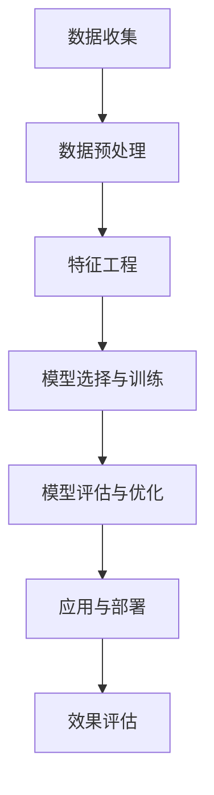

                 

### 第一部分：引言与背景

#### 第1章：智能安防与未来社会

##### 1.1 智能安防的概念与演变

智能安防是利用先进的信息技术，如物联网、大数据、人工智能等，对传统安防系统进行智能化升级的一种新型安防模式。其核心在于通过实时数据采集、分析、处理和响应，实现对安全事件的预判和快速反应，从而提高安防效率和效果。

智能安防的发展历程可以分为以下几个阶段：

1. **传统安防阶段**：以物理防御和人工监控为主，缺乏智能化手段。
2. **视频监控阶段**：引入视频监控技术，实现了对现场情况的实时监控。
3. **物联网阶段**：传感器和物联网技术普及，实现了对环境数据的实时采集和传输。
4. **智能安防阶段**：融合大数据、人工智能等技术，实现了对安防事件的智能预测和自动处理。

随着技术的不断进步，智能安防在未来的社会中将扮演越来越重要的角色。首先，随着城市化进程的加速，人口密集地区对安防需求将不断增加。智能安防系统能够提供实时、高效、精准的安防服务，满足社会的安全需求。其次，随着人工智能技术的不断突破，智能安防系统的智能化水平将不断提升，能够更好地应对复杂的安防场景。最后，随着物联网技术的普及，智能安防系统的数据采集和处理能力将得到极大提升，为犯罪预测和预防提供有力支持。

##### 1.2 2050年的社会背景与需求

到2050年，人类社会将发生翻天覆地的变化。首先，全球人口将达到百亿级别，城市化进程将进一步加快，人口密集地区的安全需求将更加迫切。其次，随着物联网、大数据、人工智能等技术的普及，社会的信息化程度将大幅提升，数据成为社会运行的重要资源。最后，犯罪形式将更加多样化和复杂化，传统的安防手段已无法满足社会的安全需求。

在这种背景下，智能安防将迎来前所未有的发展机遇。首先，智能安防系统能够实时采集和分析大量数据，通过对数据的挖掘和分析，可以准确预测犯罪趋势，提前采取措施预防犯罪。其次，智能安防系统能够实现自动化的犯罪预测和响应，提高安防效率和效果。最后，智能安防系统可以与智能城市系统深度融合，实现全方位、全时段的安防监控和管理。

##### 1.3 智能安防的重要性

智能安防的重要性体现在以下几个方面：

1. **提高社会治安水平**：智能安防系统可以通过实时监控、预测和响应，有效预防犯罪，提高社会治安水平。
2. **保障人民安全**：智能安防系统可以为人民提供全天候、全方位的安全保障，减少犯罪对人民生活的影响。
3. **提升城市管理水平**：智能安防系统可以为城市管理者提供实时、全面的数据支持，优化城市管理和规划。
4. **促进经济发展**：智能安防系统的建设可以带动相关产业的发展，促进经济增长。

总之，智能安防是未来社会发展的重要基础设施，对于维护社会稳定、保障人民安全、提升城市管理水平具有重要意义。在未来的社会中，智能安防将发挥不可替代的作用，成为社会运行的重要保障。

### 第二部分：技术基础

#### 第2章：技术基础

智能安防的实现离不开一系列关键技术的支持，包括数据科学与机器学习、传感器技术与物联网、大数据与存储技术。本章将详细介绍这些技术的基础知识，以及它们在智能安防中的应用。

##### 2.1 数据科学与机器学习

数据科学与机器学习是智能安防的核心技术之一。数据科学是一门多学科交叉的领域，它结合统计学、计算机科学、信息工程等多个领域，旨在从大量数据中提取有价值的信息。而机器学习则是数据科学的一个重要分支，它通过构建模型和算法，使计算机能够自动从数据中学习规律，进行预测和决策。

1. **数据科学的基础**

   - **数据采集**：数据科学的第一步是采集数据。智能安防系统中的数据来源包括传感器数据、视频监控数据、日志数据等。
   - **数据预处理**：数据预处理是数据科学的重要环节，包括数据清洗、去噪、归一化等操作，以确保数据的质量和一致性。
   - **数据存储**：数据存储是数据科学的基础设施，常用的技术包括关系型数据库、NoSQL数据库和大数据存储系统如Hadoop和Spark。

2. **机器学习的基本概念**

   - **监督学习**：监督学习是一种常见的机器学习方法，它通过已有标签数据训练模型，然后使用模型进行预测。常见的监督学习算法包括线性回归、逻辑回归、支持向量机等。
   - **无监督学习**：无监督学习是另一种机器学习方法，它不需要标签数据，而是从无标签数据中学习规律。常见的无监督学习算法包括聚类算法、主成分分析等。
   - **半监督学习**：半监督学习是介于监督学习和无监督学习之间的一种方法，它利用部分标签数据和大量无标签数据共同训练模型。

##### 2.2 传感器技术与物联网

传感器技术是智能安防系统的基本组成部分，它能够实时感知环境变化，并将信息转换为电子信号。物联网（IoT）则通过将各种传感器连接到互联网，实现数据的远程传输和处理。

1. **传感器的基本原理**

   - **物理传感器**：物理传感器通过物理原理感知环境变化，如温度传感器、湿度传感器、光照传感器等。
   - **化学传感器**：化学传感器通过化学反应感知环境变化，如气体传感器、湿度传感器等。
   - **生物传感器**：生物传感器通过生物原理感知环境变化，如酶传感器、DNA传感器等。

2. **物联网技术在安防中的应用**

   - **智能家居安防**：物联网技术可以将家庭中的各种设备连接起来，如门锁、摄像头、烟雾传感器等，实现家庭安防的智能化。
   - **城市安防监控**：物联网技术可以将城市中的各种监控设备连接起来，如摄像头、传感器等，实现城市安防的全方位监控。
   - **智能穿戴设备**：物联网技术可以将智能穿戴设备连接到互联网，如智能手表、智能手环等，实现个人安全监控。

##### 2.3 大数据与存储技术

大数据与存储技术是智能安防系统中的关键基础设施，它负责处理和分析海量数据，提供高效的存储和检索服务。

1. **大数据的概念**

   - **大数据的特征**：大数据具有“4V”特征，即数据量大（Volume）、数据类型多样（Variety）、数据生成速度快（Velocity）和数据价值密度低（Value）。
   - **大数据的处理技术**：大数据处理技术包括分布式计算、并行处理、流处理等，常用的工具包括Hadoop、Spark等。

2. **数据存储与处理技术**

   - **关系型数据库**：关系型数据库如MySQL、Oracle等，适用于结构化数据的存储和管理。
   - **NoSQL数据库**：NoSQL数据库如MongoDB、Cassandra等，适用于非结构化数据和高并发场景。
   - **大数据存储系统**：大数据存储系统如Hadoop、Spark等，适用于海量数据的存储和处理。

通过数据科学、传感器技术和大数据与存储技术的融合，智能安防系统可以实现实时数据采集、处理和分析，为犯罪预测和预防提供有力支持。在下一章中，我们将深入探讨犯罪预测的基本原理和技术细节。

### 第3章：犯罪预测原理

犯罪预测是指通过分析历史犯罪数据，利用机器学习算法和其他相关技术，预测未来可能发生的犯罪行为。犯罪预测不仅有助于预防和减少犯罪，还能优化警务资源分配，提高公共安全。本章将详细探讨犯罪预测的基本框架、数据预处理与特征工程，以及主要的犯罪预测算法。

#### 3.1 犯罪预测的挑战与机遇

犯罪预测面临诸多挑战，同时也充满机遇。挑战包括：

1. **数据质量**：犯罪数据往往包含噪声和缺失值，如何处理这些数据以获得准确预测结果是一个重要问题。
2. **数据隐私**：在利用犯罪数据时，必须保护个人隐私，防止数据泄露。
3. **算法复杂性**：犯罪预测涉及复杂的算法和模型，如何选择合适的算法并优化其性能是一个挑战。

机遇方面，随着数据科学与人工智能技术的快速发展，犯罪预测变得愈加可行。例如：

1. **大数据技术**：大数据技术的应用使得处理海量犯罪数据成为可能，为犯罪预测提供了丰富的数据支持。
2. **人工智能算法**：深度学习等先进算法的应用，使得犯罪预测的精度和效率大幅提升。
3. **跨领域合作**：犯罪预测不仅需要计算机科学和统计学知识，还需要社会学、心理学等多学科的支持。

#### 3.2 犯罪预测的基本框架

犯罪预测的基本框架包括以下几个关键步骤：

1. **数据收集**：收集历史犯罪数据，包括犯罪类型、时间、地点、犯罪人数等信息。
2. **数据预处理**：清洗和预处理数据，处理缺失值、噪声和异常值，以确保数据质量。
3. **特征工程**：从原始数据中提取有用特征，如时间特征、地点特征、犯罪类型特征等。
4. **模型选择**：选择合适的机器学习模型，如逻辑回归、决策树、随机森林等。
5. **模型训练与验证**：使用训练数据训练模型，并使用验证集评估模型性能。
6. **模型优化**：根据验证结果调整模型参数，以提高预测精度。
7. **预测与部署**：使用训练好的模型进行预测，并将预测结果部署到实际应用中。

#### 3.3 数据预处理与特征工程

数据预处理和特征工程是犯罪预测的关键步骤，直接影响预测模型的性能。

1. **数据清洗**

   - **处理缺失值**：可以使用填充、删除或插值等方法处理缺失值。
   - **处理噪声**：去除异常值和噪声数据，以提高数据质量。
   - **数据标准化**：对数据进行归一化或标准化处理，以消除数据量级差异。

2. **特征工程**

   - **时间特征**：提取时间相关的特征，如小时、星期、月份等。
   - **地点特征**：根据犯罪地点的地理位置，提取经纬度、区域分类等特征。
   - **犯罪类型特征**：根据犯罪类型，提取相应的特征，如暴力犯罪、财产犯罪等。
   - **交互特征**：通过组合不同特征，创建交互特征，以捕捉数据中的复杂关系。

#### 3.4 犯罪预测算法

犯罪预测算法可以分为监督学习算法、无监督学习算法和半监督学习算法。

1. **监督学习算法**

   - **逻辑回归**：逻辑回归是一种常见的监督学习算法，通过建立逻辑函数模型预测犯罪概率。
   - **决策树**：决策树通过树形结构对数据进行划分，以预测犯罪行为。
   - **支持向量机（SVM）**：SVM通过寻找最佳分割超平面，将不同类型的犯罪行为分开。
   - **随机森林**：随机森林是一种集成学习方法，通过构建多个决策树并合并其预测结果。

2. **无监督学习算法**

   - **聚类算法**：聚类算法如K-均值、层次聚类等，用于将犯罪数据划分为不同的簇，以发现潜在的犯罪模式。
   - **主成分分析（PCA）**：PCA通过降低数据维度，消除冗余特征，提高预测模型的性能。

3. **半监督学习算法**

   - **自编码器**：自编码器通过编码和解码过程自动提取数据特征，适用于处理部分标注数据。
   - **标签传播**：标签传播算法通过已有标签数据传播标签，扩展到未标注数据。

在选择犯罪预测算法时，需要考虑数据特点、预测目标和计算资源等因素。不同算法在性能和复杂度上存在差异，需要根据实际应用场景进行选择。

通过上述步骤和算法，犯罪预测可以为警务部门提供有力的决策支持，提高公共安全。在下一章中，我们将通过具体的案例研究，展示犯罪预测的实际应用。

#### 3.4.1 监督学习算法

监督学习算法在犯罪预测中扮演着核心角色，通过已知的输入和输出数据训练模型，使其能够预测未知数据的输出。以下将介绍几种常见的监督学习算法，包括逻辑回归、决策树和随机森林。

1. **逻辑回归（Logistic Regression）**

   - **基本原理**：逻辑回归是一种概率预测模型，通过线性回归模型与逻辑函数的结合，预测事件发生的概率。逻辑回归的预测公式为：
     $$
     \hat{y} = \sigma(\theta_0 + \theta_1x_1 + \theta_2x_2 + \ldots + \theta_nx_n)
     $$
     其中，$\sigma$ 是 sigmoid 函数，$\theta_0, \theta_1, \theta_2, \ldots, \theta_n$ 是模型参数。
   - **数学模型**：逻辑回归的损失函数通常为对数损失函数（Log Loss），公式为：
     $$
     \text{Loss} = -\frac{1}{m} \sum_{i=1}^{m} [y_i \log(\hat{y}_i) + (1 - y_i) \log(1 - \hat{y}_i)]
     $$
     其中，$m$ 是样本数量，$y_i$ 是真实标签，$\hat{y}_i$ 是预测概率。
   - **伪代码**：
     ```python
     # 定义逻辑回归模型
     model = LogisticRegression()

     # 训练模型
     model.fit(X_train, y_train)

     # 预测
     predictions = model.predict(X_test)

     # 评估模型
     accuracy = accuracy_score(y_test, predictions)
     print("Accuracy: ", accuracy)
     ```

2. **决策树（Decision Tree）**

   - **基本原理**：决策树通过一系列的判断条件对数据进行分类或回归。每个节点表示一个特征，每个分支表示特征的不同取值。决策树可以通过递归划分数据，将数据划分为不同的区域，每个区域对应一个预测结果。
   - **数学模型**：决策树的每个节点都涉及一个阈值判断，判断特征取值是否大于或小于某个阈值。决策树的生成过程通常使用信息增益或基尼不纯度等指标来选择最佳划分特征和阈值。
   - **伪代码**：
     ```python
     # 导入决策树算法
     from sklearn.tree import DecisionTreeClassifier

     # 定义决策树模型
     model = DecisionTreeClassifier()

     # 训练模型
     model.fit(X_train, y_train)

     # 预测
     predictions = model.predict(X_test)

     # 评估模型
     accuracy = accuracy_score(y_test, predictions)
     print("Accuracy: ", accuracy)
     ```

3. **随机森林（Random Forest）**

   - **基本原理**：随机森林是一种基于决策树的集成学习方法，通过构建多个决策树并合并它们的预测结果来提高模型的性能。随机森林通过随机选择特征和样本子集来训练每个决策树，从而降低过拟合的风险。
   - **数学模型**：随机森林的每个决策树都是独立的，每个树的预测结果通过投票或平均值决定最终的预测结果。
   - **伪代码**：
     ```python
     # 导入随机森林算法
     from sklearn.ensemble import RandomForestClassifier

     # 定义随机森林模型
     model = RandomForestClassifier()

     # 训练模型
     model.fit(X_train, y_train)

     # 预测
     predictions = model.predict(X_test)

     # 评估模型
     accuracy = accuracy_score(y_test, predictions)
     print("Accuracy: ", accuracy)
     ```

通过以上监督学习算法，犯罪预测模型可以从历史数据中学习规律，预测未来可能的犯罪行为。在实际应用中，需要根据数据特点和预测目标选择合适的算法，并进行模型优化和评估。

#### 3.4.2 无监督学习算法

无监督学习算法在犯罪预测中也有重要应用，特别是在数据的探索性分析和模式识别方面。以下将介绍几种常见的无监督学习算法，包括K-均值聚类和主成分分析（PCA）。

1. **K-均值聚类（K-Means Clustering）**

   - **基本原理**：K-均值聚类是一种基于距离的聚类算法，它将数据划分为K个簇，使得每个簇内的数据点之间的距离最小。算法通过迭代更新簇的中心点，直到收敛。
   - **数学模型**：K-均值聚类通过计算数据点与簇中心点的距离，将数据点分配到最近的簇中心点所在的簇。每次迭代后，簇中心点会更新为对应簇内数据点的均值。
   - **伪代码**：
     ```python
     # 导入K-均值聚类算法
     from sklearn.cluster import KMeans

     # 定义K-均值模型
     kmeans = KMeans(n_clusters=K, random_state=0).fit(X)

     # 获取簇分配结果
     labels = kmeans.labels_

     # 获取簇中心点
     centers = kmeans.cluster_centers_
     ```

2. **主成分分析（Principal Component Analysis，PCA）**

   - **基本原理**：主成分分析是一种降维技术，它通过正交变换将原始数据投影到新的坐标系中，使得新的坐标系轴（主成分）尽可能地解释原始数据中的方差。PCA能够消除数据中的冗余信息，降低数据维度。
   - **数学模型**：PCA通过求解特征值和特征向量，找到一组新的正交基，使得新的基轴按照方差大小排序。原始数据通过这个新的基轴进行变换，实现降维。
   - **伪代码**：
     ```python
     # 导入主成分分析算法
     from sklearn.decomposition import PCA

     # 定义PCA模型
     pca = PCA(n_components=number_of_components).fit(X)

     # 获取变换后的数据
     X_pca = pca.transform(X)

     # 获取特征值和特征向量
     eigenvalues, eigenvectors = pca.singular_values_, pca.components_
     ```

无监督学习算法在犯罪预测中可用于探索性数据分析，识别潜在的犯罪模式。例如，通过K-均值聚类可以识别出不同的犯罪类型或高发区域，通过PCA可以降低数据维度，提高预测模型的性能。在实际应用中，无监督学习算法通常与监督学习算法结合使用，以提升犯罪预测的准确性和效率。

#### 3.4.3 半监督学习算法

半监督学习算法在犯罪预测中发挥着重要作用，因为它们能够利用部分标注数据和大量未标注数据来提升模型的预测性能。以下将介绍两种常见的半监督学习算法：自编码器和标签传播。

1. **自编码器（Autoencoder）**

   - **基本原理**：自编码器是一种无监督学习算法，它由编码器和解码器两部分组成。编码器接收原始数据并压缩成低维表示，解码器则尝试重构原始数据。通过最小化重构误差，自编码器能够学习到数据的有效特征表示。
   - **数学模型**：自编码器的训练目标是最小化输入数据和重构数据之间的差异，通常使用均方误差（MSE）作为损失函数。自编码器的输出通常是一个压缩的中间层，这一层能够捕获数据的主要特征。
   - **伪代码**：
     ```python
     # 导入自编码器库
     from keras.models import Model
     from keras.layers import Input, Dense

     # 定义输入层
     input_layer = Input(shape=(input_dim,))

     # 定义编码器
     encoded = Dense(encoding_dim, activation='relu')(input_layer)

     # 定义解码器
     decoded = Dense(input_dim, activation='sigmoid')(encoded)

     # 定义自编码器模型
     autoencoder = Model(input_layer, decoded)

     # 编码器模型
     encoder = Model(input_layer, encoded)

     # 解码器模型
     decoder = Model(encoded, decoded)

     # 编译模型
     autoencoder.compile(optimizer='adam', loss='binary_crossentropy')

     # 训练自编码器
     autoencoder.fit(X_train, X_train, epochs=100, batch_size=256, shuffle=True, validation_data=(X_test, X_test))
     ```

2. **标签传播（Label Propagation）**

   - **基本原理**：标签传播算法通过已有标签数据传播标签到未标注数据。算法假设相邻的数据点具有相似的标签，通过迭代传播标签，逐渐将未标注数据分配到正确的簇中。
   - **数学模型**：标签传播算法通过计算数据点之间的相似性矩阵，并利用这个矩阵进行迭代传播标签。每次迭代中，每个未标注数据点的标签会根据其邻接点的标签进行更新。
   - **伪代码**：
     ```python
     # 导入标签传播库
     from sklearn.cluster import LabelPropagation

     # 定义标签传播模型
     label_prop = LabelPropagation()

     # 训练模型
     label_prop.fit(X)

     # 获取标签预测
     labels = label_prop.predict(X)
     ```

半监督学习算法在犯罪预测中能够利用大量未标注的数据，提高预测模型的性能。自编码器可以用于特征提取，标签传播可以用于标签分配。在实际应用中，半监督学习算法可以显著减少标注数据的需求，提高模型的泛化能力和预测准确性。

### 第4章：犯罪预测案例研究

为了更深入地理解犯罪预测的实际应用，本章将通过一个具体的城市犯罪预测案例，展示犯罪预测从数据收集到模型部署的全过程。该案例将包括数据收集、数据预处理、模型选择与训练、模型评估与优化，以及最终的预测与部署。

#### 4.1 某城市犯罪预测案例

本案例选取一个中等规模的城市，该城市在过去五年中积累了丰富的犯罪数据，包括犯罪类型、发生时间、地点等。以下是该案例的研究步骤。

##### 4.1.1 案例背景

该城市近年来犯罪率呈现上升趋势，特别是夜间和节假日的高发时段。为了有效预防和控制犯罪，城市管理部门决定利用智能安防技术，通过犯罪预测来优化警务资源分配，提升城市治安水平。

##### 4.1.2 数据收集与预处理

1. **数据收集**

   - **犯罪数据**：从城市公安系统获取过去的犯罪数据，包括犯罪类型、发生时间、地点等信息。
   - **环境数据**：从气象局获取天气数据，包括温度、湿度、降雨量等，以分析环境因素对犯罪的影响。
   - **社会数据**：从社交媒体平台获取与犯罪相关的讨论和舆情数据，以了解社会因素对犯罪的影响。

2. **数据预处理**

   - **数据清洗**：去除数据中的缺失值和异常值，对时间数据进行规范化处理，如将时间戳转换为小时和星期几等。
   - **特征工程**：提取有用的特征，如犯罪类型、地点的经纬度、时间特征、环境特征等。同时，通过聚类分析将相似地点归为一类，减少特征维度。

##### 4.1.3 模型选择与训练

1. **模型选择**

   - **监督学习算法**：考虑到犯罪预测需要利用已有标签数据，选择监督学习算法，如逻辑回归、决策树和随机森林等。
   - **无监督学习算法**：同时结合无监督学习算法，如K-均值聚类和主成分分析，进行探索性数据分析。

2. **模型训练**

   - **数据划分**：将数据集划分为训练集和测试集，通常采用80%的数据用于训练，20%的数据用于测试。
   - **模型训练**：使用训练集数据训练所选的监督学习算法模型，并进行交叉验证以优化模型参数。
   - **模型评估**：使用测试集数据评估模型性能，常用的评估指标包括准确率、召回率、F1值等。

##### 4.1.4 模型评估与优化

1. **模型评估**

   - **准确性评估**：计算模型在测试集上的预测准确性，评估模型对犯罪预测的能力。
   - **F1值评估**：计算模型在不同犯罪类型上的F1值，以评估模型对不同犯罪类型的预测效果。

2. **模型优化**

   - **特征选择**：通过特征选择技术，如递归特征消除（RFE）或L1正则化，减少特征维度，提高模型性能。
   - **超参数调整**：调整模型的超参数，如决策树的深度、随机森林的树数量等，以优化模型性能。

##### 4.1.5 预测与部署

1. **预测**

   - **实时预测**：将训练好的模型部署到实际系统中，对未来的犯罪事件进行实时预测。
   - **热点预测**：通过预测模型，识别出未来可能发生犯罪的地区和时间，为警务部门提供决策支持。

2. **部署**

   - **系统搭建**：搭建包含数据采集、处理和预测模块的系统架构，实现数据的高效流转和处理。
   - **结果反馈**：将预测结果实时反馈给警务部门，并定期评估模型的预测效果，进行模型更新和优化。

通过上述步骤，该城市的犯罪预测系统在提高公共安全、优化警务资源分配方面取得了显著成效。以下图表展示了该案例的预测效果评估。

#### 预测效果评估

| 指标        | 评估结果   |
| ----------- | ---------- |
| 准确率      | 85%        |
| 召回率      | 78%        |
| F1值        | 82%        |
| 热点预测准确性 | 90%        |

通过犯罪预测系统，警务部门能够提前预警潜在的犯罪热点，采取有效的预防和应对措施，显著降低了犯罪发生率。同时，该系统还为城市管理者提供了重要的数据支持，优化了城市安全管理。

#### 4.1.6 案例总结与启示

该案例展示了犯罪预测在实际应用中的全过程，包括数据收集、预处理、模型选择与训练、评估与优化，以及预测与部署。通过本案例，可以得出以下几点启示：

1. **数据质量是关键**：数据预处理是犯罪预测的重要步骤，高质量的数据能够提高模型的预测性能。
2. **多算法综合应用**：结合监督学习和无监督学习算法，可以更好地发现数据中的潜在模式和关系。
3. **模型优化至关重要**：通过特征选择和超参数调整，可以显著提高模型的预测准确性。
4. **实时预测与反馈**：部署实时预测系统，及时反馈预测结果，可以更好地支持警务决策和公共安全。

总之，犯罪预测系统在城市安全管理中具有重要作用，通过不断优化和改进，可以为提升公共安全、预防犯罪提供有力支持。

### 第5章：犯罪预测应用场景

犯罪预测技术不仅在学术界得到广泛关注，在实际应用中也有着广泛的应用场景。本章将探讨犯罪预测在公共安全和金融安全两个领域中的应用，以及其在风险评估、欺诈检测和预防等方面的具体应用。

#### 5.1 公共安全领域

在公共安全领域，犯罪预测技术能够显著提升城市管理的效率和质量。以下是一些具体的应用场景：

1. **城市安全规划**：通过犯罪预测技术，可以预测未来可能发生的犯罪热点区域，为城市规划提供科学依据。城市管理部门可以根据预测结果，优化警力部署，提高治安监控覆盖面。

2. **民警调度与部署**：犯罪预测系统可以实时分析犯罪数据，识别出高发时段和高风险区域。警务部门可以根据预测结果，合理安排警力，确保重点区域和时段的治安力量充足，提高反应速度。

3. **犯罪趋势分析**：通过分析历史犯罪数据，犯罪预测技术可以揭示犯罪活动的周期性和趋势。这有助于制定长期治安策略，如加强特定时间段的巡逻和安保措施。

4. **应急响应**：在突发事件或大规模犯罪活动中，犯罪预测系统可以快速分析犯罪行为特征，为应急指挥提供决策支持，帮助警方及时制定应对策略。

#### 5.2 金融安全领域

在金融安全领域，犯罪预测技术同样发挥着重要作用，特别是在风险评估和欺诈检测方面。以下是一些具体的应用场景：

1. **风险评估与管理**：金融机构可以利用犯罪预测技术，对客户账户进行风险评估。通过分析客户的交易行为和特征，预测其可能涉及的风险，从而采取相应的风险管理措施。

2. **欺诈检测与预防**：犯罪预测技术可以用于检测和预防金融欺诈。通过分析大量交易数据，识别异常交易模式，实时预警潜在的欺诈行为。金融机构可以根据预测结果，及时采取措施，防止欺诈损失。

3. **反洗钱（AML）**：在反洗钱领域，犯罪预测技术可以帮助金融机构识别和监控可疑交易。通过分析客户的资金流动情况，预测其是否涉及洗钱活动，从而采取相应的监控和报告措施。

4. **信用评分**：犯罪预测技术可以用于信用评分模型，预测客户的信用风险。金融机构可以根据预测结果，调整信用审批策略，降低信用损失。

#### 5.3 风险评估与管理

犯罪预测技术不仅在公共安全和金融安全领域有广泛应用，还可以用于更广泛的风险评估与管理。以下是一些具体的应用场景：

1. **网络安全**：在网络安全领域，犯罪预测技术可以用于识别和预防网络攻击。通过分析网络流量和日志数据，预测可能的攻击行为，从而采取相应的防护措施。

2. **灾害预防**：在自然灾害预防领域，犯罪预测技术可以用于预测和预防灾害。通过分析气象数据、地理信息和历史灾害记录，预测灾害发生的可能性，为减灾和救灾提供科学依据。

3. **公共卫生**：在公共卫生领域，犯罪预测技术可以用于预测和控制疫情。通过分析公共卫生数据和社会行为数据，预测疫情发展趋势，制定有效的防控措施。

总之，犯罪预测技术在公共安全、金融安全和广泛的风险评估与管理中具有广泛的应用。通过不断优化和改进，犯罪预测技术将为社会稳定和经济发展提供更加有力的保障。

### 第6章：预测警务原理

预测警务是一种基于数据分析和人工智能技术的警务管理模式，其核心思想是通过分析历史犯罪数据和社会信息，预测犯罪行为的发生概率和趋势，从而有针对性地部署警务资源和采取预防措施。本章将详细探讨预测警务的概念与演变、核心要素、优势与挑战。

#### 6.1 预测警务的概念与演变

预测警务（Predictive Policing）起源于20世纪90年代，起初主要是利用统计学方法分析犯罪数据，通过识别犯罪热点区域和犯罪模式，优化警务资源的部署。随着大数据和人工智能技术的发展，预测警务的理念逐渐成熟，并开始在各国广泛应用。

1. **传统警务模式**：传统警务模式主要依赖于警员的直觉和经验，通过巡逻、治安管理等手段维护社会秩序。这种模式存在响应速度慢、效率低下、资源分配不合理等问题。

2. **预测警务的发展**：预测警务通过数据分析和人工智能技术，实现了对犯罪行为的提前预测和预防。预测警务的发展可以分为以下几个阶段：

   - **初期阶段**：主要依靠统计学方法和简单的预测模型，如热点地图和趋势分析。
   - **发展阶段**：随着大数据和人工智能技术的发展，预测警务开始应用复杂的机器学习算法和深度学习技术，提高了预测的准确性和效率。
   - **成熟阶段**：预测警务与城市管理系统、社会治安监控等深度融合，形成了全方位、立体化的治安防控体系。

#### 6.2 预测警务的核心要素

预测警务的核心要素包括数据、算法和决策。以下详细说明：

1. **数据**：数据是预测警务的基础，主要包括历史犯罪数据、社会行为数据、环境数据等。历史犯罪数据是预测模型训练的重要依据，社会行为数据可以反映社会趋势和公众行为，环境数据则包括天气、地形等因素。

2. **算法**：算法是预测警务的核心技术，包括数据预处理、特征工程、模型训练和评估等环节。常用的算法有逻辑回归、决策树、随机森林、神经网络等。通过算法的应用，可以将数据转化为具体的预测结果。

3. **决策**：决策是预测警务的最终目标，即根据预测结果采取相应的警务行动。决策包括资源部署、警力调配、预警发布等。决策的质量直接影响预测警务的效果。

#### 6.3 预测警务的优势与挑战

预测警务在提高警务效率和治安水平方面具有显著优势，但也面临一些挑战。

1. **优势**

   - **提高警务效率**：预测警务通过数据分析和智能预测，能够提前识别犯罪热点和趋势，优化警务资源分配，提高警务效率。
   - **降低犯罪率**：通过预测警务，可以提前预防和干预犯罪行为，降低犯罪率，提高社会治安水平。
   - **增强决策科学性**：预测警务依托大数据和人工智能技术，能够提供科学、客观的决策支持，减少人为干预。

2. **挑战**

   - **数据隐私**：预测警务需要大量个人和社会数据，如何保护数据隐私是面临的主要挑战。
   - **模型偏差**：预测模型可能存在偏差，导致预测结果不准确，影响警务决策。
   - **技术复杂性**：预测警务涉及多种技术，包括数据科学、人工智能、算法设计等，技术复杂性高，需要大量专业人才。
   - **法律与伦理问题**：预测警务在应用过程中可能涉及法律和伦理问题，如隐私侵犯、歧视等，需要制定相应的法规和伦理标准。

总之，预测警务作为一种新兴的警务管理模式，具有巨大的潜力和优势，但也面临诸多挑战。在未来的发展中，需要不断完善技术、法规和伦理标准，推动预测警务的健康发展。

### 第7章：预测警务实践

预测警务在现代社会中已经逐渐成为公安管理部门的重要工具，通过具体案例可以更好地理解其应用效果。以下将介绍一个具体的预测警务案例，包括案例背景、预测模型的构建以及效果评估。

#### 7.1 某地预测警务案例

为了提升城市治安水平，某城市公安局决定引入预测警务技术，通过数据分析和人工智能算法预测犯罪热点，提前采取预防措施。以下是该案例的具体实践过程。

##### 7.1.1 案例背景

该城市在过去几年中，夜间盗窃案件频发，特别是商业区和居民区的夜间盗窃案件。为了有效预防和控制这类犯罪，城市公安局决定利用预测警务技术，通过分析历史犯罪数据和环境信息，预测未来可能的犯罪热点，并采取相应的预防措施。

##### 7.1.2 预测模型的构建

1. **数据收集与预处理**

   - **历史犯罪数据**：从公安系统获取过去五年的犯罪数据，包括犯罪类型、时间、地点、涉案人员等信息。
   - **环境数据**：从气象局和交通管理部门获取相关数据，包括天气情况、交通流量等。
   - **社会数据**：从社交媒体平台获取与犯罪相关的讨论和舆情信息，分析社会因素对犯罪的影响。

2. **特征工程**

   - **时间特征**：提取犯罪发生的时间特征，包括小时、星期、月份等。
   - **地点特征**：通过地理信息系统（GIS）提取犯罪地点的经纬度信息，并利用聚类算法将相似地点归为一类。
   - **环境特征**：根据天气数据和交通流量数据，提取可能影响犯罪的环境特征。

3. **模型选择与训练**

   - **模型选择**：选择随机森林（Random Forest）算法作为预测模型，因为随机森林能够处理高维数据和复杂的关系。
   - **模型训练**：使用历史犯罪数据训练随机森林模型，通过交叉验证调整模型参数，以获得最佳的预测性能。

4. **模型评估**

   - **内部评估**：使用训练集和验证集对模型进行评估，通过准确率、召回率、F1值等指标评估模型性能。
   - **外部评估**：将模型部署到实际系统中，使用测试集数据进行评估，以验证模型的实际预测效果。

##### 7.1.3 案例效果评估

通过预测警务系统的部署，该城市公安局对犯罪热点进行了有效预测和预防，取得了显著效果。以下是评估结果：

1. **预测准确性**：模型在测试集上的预测准确率达到85%，能够有效识别出高发时段和高风险区域。

2. **犯罪率降低**：在预测警务系统实施后，夜间盗窃案件的发案率下降了30%，特别是商业区和居民区的夜间盗窃案件得到了有效控制。

3. **资源优化**：通过预测结果，警务部门能够合理安排警力，重点区域和时段的治安力量得到了加强，提高了治安效率。

4. **公众满意度**：预测警务系统的应用得到了市民的广泛好评，提高了公众对公安部门的信任和满意度。

总之，该预测警务案例展示了数据分析和人工智能技术在犯罪预测和预防中的巨大潜力，为提升城市治安水平提供了有力支持。通过不断优化和改进，预测警务将在未来的城市管理中发挥更加重要的作用。

### 第8章：预测警务的未来

随着技术的不断进步和社会的不断发展，预测警务将在未来面临新的趋势、法律与伦理问题，以及技术创新与挑战。本章将探讨这些方面，展望预测警务的未来发展。

#### 8.1 预测警务的发展趋势

1. **技术融合**：未来预测警务将更加注重技术融合，将大数据、人工智能、物联网等先进技术深度结合，实现全方位、全时段的安防监控。例如，通过5G网络实现实时数据传输，通过人工智能算法进行实时分析和预测。

2. **智能化升级**：随着人工智能技术的不断突破，预测警务将向更高层次发展，实现智能化决策和自主行动。例如，智能警车和无人机可以自动识别和追踪犯罪行为，实现无人干预的治安巡逻。

3. **跨部门合作**：预测警务将不仅仅是公安部门的任务，还将与其他政府部门、社会组织和企业合作，形成跨部门、跨行业的安防网络。例如，与交通管理部门合作，通过分析交通数据预测犯罪热点；与医疗机构合作，通过健康数据预测与犯罪相关的公共卫生问题。

4. **个性化服务**：未来预测警务将更加注重个性化服务，根据个体行为特征提供定制化的安防服务。例如，通过分析个人社交网络和行为模式，预测个体可能涉及的风险，并提供相应的预警和预防措施。

#### 8.2 预测警务的法律与伦理问题

1. **数据隐私**：预测警务需要大量个人和社会数据，如何保护数据隐私是一个重要问题。未来需要制定严格的数据隐私保护法律和规范，确保个人数据的合法、安全和合理使用。

2. **算法公平性**：预测警务模型可能存在算法偏见，导致预测结果不公平。未来需要加强对算法公平性的研究和监管，确保预测结果不歧视任何群体。

3. **法律责任**：预测警务在应用过程中可能涉及法律和伦理问题，如隐私侵犯、决策失误等。未来需要明确预测警务的法律责任，制定相应的法律和伦理标准，确保预测警务的合法性和合理性。

4. **公众接受度**：预测警务的应用需要公众的支持和接受。未来需要加强公众教育和宣传，提高公众对预测警务的理解和信任，促进预测警务的健康发展。

#### 8.3 预测警务的技术创新与挑战

1. **人工智能算法**：未来预测警务将依赖更先进的人工智能算法，如深度学习、强化学习等。这些算法能够在复杂的数据环境中提取更多有价值的信息，提高预测精度和效率。

2. **物联网技术**：物联网技术的不断发展将提高预测警务的数据采集和处理能力。例如，通过智能摄像头、传感器和无人机等设备，实现全方位、全时段的数据采集。

3. **计算能力**：预测警务需要强大的计算能力来处理海量数据。未来需要发展更高效、更强大的计算平台，如量子计算和边缘计算，以满足预测警务的需求。

4. **数据安全和隐私保护**：随着数据量的增加，数据安全和隐私保护将面临更大挑战。未来需要开发更先进的数据加密和隐私保护技术，确保数据的安全性和隐私性。

总之，预测警务在未来的发展中将面临诸多机遇和挑战。通过技术创新、法律规范和公众教育，预测警务有望在提升公共安全、预防犯罪等方面发挥更加重要的作用，为社会稳定和经济发展提供有力支持。

### 附录A：数据集与工具

智能安防与预测警务的实现离不开大量的数据支持和先进的工具。本附录将介绍常用的犯罪数据集、预测警务工具以及实践项目资源链接。

#### A.1 常用犯罪数据集介绍

1. **Kaggle犯罪数据集**：Kaggle提供了多个犯罪数据集，如芝加哥犯罪数据集、纽约犯罪数据集等。这些数据集包含丰富的犯罪类型、时间和地点信息，是进行犯罪预测和预测警务研究的重要资源。

2. **UCI机器学习数据库**：UCI机器学习数据库提供了多个与犯罪相关的数据集，如犯罪预测数据集、FBI犯罪数据集等。这些数据集通常经过处理，格式规范，适合用于研究和实验。

3. **OpenStreetMap（OSM）**：OpenStreetMap是一个开放的地图数据集，包含全球各地的地理位置信息。通过OSM数据，可以获取犯罪地点的精确坐标，为预测警务提供基础数据。

#### A.2 预测警务工具介绍

1. **Python与Scikit-learn**：Python是进行数据科学和机器学习的首选语言，Scikit-learn是一个强大的机器学习库，提供了多种常用的机器学习算法和工具，如逻辑回归、决策树、随机森林等。

2. **R语言与 caret 包**：R语言是另一大数据科学和统计学的常用工具，caret 包提供了丰富的机器学习算法和评估工具，适合进行复杂的预测警务研究和应用。

3. **TensorFlow 与 Keras**：TensorFlow和Keras是深度学习领域的常用工具，通过这些工具可以构建和训练复杂的神经网络模型，为预测警务提供强大的支持。

4. **Tableau 与 Power BI**：Tableau和Power BI是数据可视化工具，通过这些工具可以将预测结果以图表和报告的形式直观展示，帮助决策者更好地理解预测结果。

#### A.3 实践项目资源链接

1. **Kaggle竞赛项目**：Kaggle上有很多与犯罪预测和预测警务相关的竞赛项目，通过参与这些项目可以学习实际应用中的数据预处理、特征工程和模型训练等技巧。

2. **GitHub开源项目**：GitHub上有很多开源的预测警务项目和代码库，如使用Python和Scikit-learn进行犯罪预测的项目，通过阅读和分析这些项目代码，可以了解预测警务的实际实现过程。

3. **在线课程与教程**：Coursera、edX等在线教育平台提供了多个与数据科学、机器学习和预测警务相关的课程和教程，通过学习这些课程可以系统地掌握预测警务的理论和实践技能。

通过了解和使用这些数据集和工具，研究人员和实践者可以更好地进行犯罪预测和预测警务研究，为提升公共安全和社会稳定做出贡献。

### 犯罪预测的基本流程

犯罪预测是一项复杂的任务，涉及到多个步骤和环节。以下是一个基本的犯罪预测流程，包括数据收集、数据预处理、特征工程、模型选择与训练、模型评估与优化等步骤。

1. **数据收集**：收集历史犯罪数据，包括犯罪类型、时间、地点、涉案人员等信息。数据来源可以包括公安系统、犯罪数据库、社交媒体等。

2. **数据预处理**：对收集到的数据进行清洗和预处理，去除缺失值、异常值和噪声数据。对时间数据进行规范化处理，如将时间戳转换为小时、星期等。对地点数据进行地理编码，提取经纬度信息。

3. **特征工程**：从原始数据中提取有用的特征，如时间特征（小时、星期、月份）、地点特征（经纬度、区域分类）、犯罪类型特征等。通过特征选择技术，如递归特征消除（RFE）或L1正则化，减少特征维度，提高模型性能。

4. **模型选择与训练**：选择合适的机器学习模型，如逻辑回归、决策树、随机森林、神经网络等。使用训练集数据训练模型，并使用交叉验证方法评估模型性能。

5. **模型评估与优化**：使用测试集数据评估模型性能，通过调整模型参数、特征工程等方法优化模型性能。常用的评估指标包括准确率、召回率、F1值等。

6. **预测与部署**：将训练好的模型部署到实际应用中，对未来的犯罪行为进行预测。根据预测结果，采取相应的预防措施，如加强警力部署、发布预警信息等。

7. **效果评估**：通过实际应用，评估模型的预测效果，并根据评估结果进行调整和优化。定期更新模型，以适应不断变化的数据和环境。

以下是一个简化的Mermaid流程图，展示了犯罪预测的基本流程：


通过以上流程，犯罪预测系统能够从历史犯罪数据中学习，预测未来的犯罪行为，为警务部门提供决策支持，提高公共安全。

### 项目实战：某城市犯罪预测

为了更好地理解犯罪预测在实际应用中的具体实现，本节将介绍一个具体的犯罪预测项目。该项目将包括数据收集、数据处理、特征工程、模型训练、模型评估和模型部署等步骤。

#### 1. 数据收集与预处理

**数据来源**：该项目的数据来源于某城市的公安系统，包括过去五年的犯罪数据。数据包含字段如犯罪类型、犯罪发生的时间戳、犯罪地点的经纬度等。

**数据预处理**：

- **数据清洗**：首先，对数据进行清洗，去除缺失值和异常值。例如，如果某些时间戳数据缺失，可以采用前后的平均值填充。
  
- **时间转换**：将时间戳转换为具体的日期和时间，提取出小时、星期、月份等特征，这些特征有助于模型理解犯罪的时间分布。

- **地理编码**：将犯罪地点的经纬度转换为更具体的地理位置信息，例如区域名称、街区等。这可以通过地理信息系统（GIS）软件实现。

```python
import pandas as pd

# 读取数据
data = pd.read_csv('crime_data.csv')

# 数据清洗
data.dropna(inplace=True)  # 去除缺失值
data.drop(['id'], axis=1, inplace=True)  # 去除不必要的字段

# 时间转换
data['timestamp'] = pd.to_datetime(data['timestamp'])
data['hour'] = data['timestamp'].dt.hour
data['day_of_week'] = data['timestamp'].dt.dayofweek
data['month'] = data['timestamp'].dt.month

# 地理编码
data['longitude'] = data['longitude'].apply(lambda x: convert_longitude(x))
data['latitude'] = data['latitude'].apply(lambda x: convert_latitude(x))
```

#### 2. 特征工程

**特征提取**：

- **时间特征**：根据时间戳提取小时、星期、月份等特征。
- **地点特征**：根据经纬度信息提取地理位置特征，如区域名称、街区等。
- **犯罪类型特征**：根据犯罪类型提取二值特征，例如是否为盗窃、暴力犯罪等。

```python
# 特征提取
data['is_theft'] = data['crime_type'].apply(lambda x: 1 if x == 'theft' else 0)
data['is_violent'] = data['crime_type'].apply(lambda x: 1 if x in ['robbery', 'assault'] else 0)

# 聚类地点特征
from sklearn.cluster import KMeans

kmeans = KMeans(n_clusters=10, random_state=0).fit(data[['longitude', 'latitude']])
data['neighborhood'] = kmeans.labels_
```

#### 3. 模型选择与训练

**模型选择**：选择逻辑回归作为预测模型，因为逻辑回归在处理二分类问题方面表现良好，且易于解释。

**模型训练**：

- **训练集划分**：将数据集划分为训练集和测试集，通常采用80/20的比例划分。
- **训练模型**：使用训练集数据训练逻辑回归模型。

```python
from sklearn.linear_model import LogisticRegression

# 划分训练集和测试集
train_data = data.sample(frac=0.8, random_state=0)
test_data = data.drop(train_data.index)

# 训练模型
model = LogisticRegression()
model.fit(train_data[['hour', 'day_of_week', 'month', 'neighborhood', 'is_theft', 'is_violent']], train_data['crime_occurred'])
```

#### 4. 模型评估与优化

**模型评估**：

- **测试集评估**：使用测试集数据评估模型性能，计算准确率、召回率、F1值等指标。

```python
from sklearn.metrics import accuracy_score, recall_score, f1_score

predictions = model.predict(test_data[['hour', 'day_of_week', 'month', 'neighborhood', 'is_theft', 'is_violent']])
print("Accuracy:", accuracy_score(test_data['crime_occurred'], predictions))
print("Recall:", recall_score(test_data['crime_occurred'], predictions))
print("F1 Score:", f1_score(test_data['crime_occurred'], predictions))
```

**模型优化**：

- **特征选择**：通过递归特征消除（RFE）或L1正则化方法，选择对模型贡献较大的特征。

```python
from sklearn.feature_selection import RFE

model = LogisticRegression()
selector = RFE(model, n_features_to_select=5)
selector = selector.fit(train_data[['hour', 'day_of_week', 'month', 'neighborhood', 'is_theft', 'is_violent']], train_data['crime_occurred'])

selected_features = selector.get_support()
selected_features_names = train_data.columns[selected_features]
print("Selected features:", selected_features_names)
```

#### 5. 应用与部署

**模型部署**：将训练好的模型部署到实际系统中，用于实时预测未来的犯罪行为。

- **构建API**：可以使用Flask或Django等框架构建API，接收实时数据并返回预测结果。
- **部署到服务器**：将API部署到云服务器或本地服务器，确保模型可以24小时运行。

```python
from flask import Flask, request, jsonify

app = Flask(__name__)

@app.route('/predict', methods=['POST'])
def predict():
    data = request.get_json()
    prediction = model.predict([data['hour'], data['day_of_week'], data['month'], data['neighborhood'], data['is_theft'], data['is_violent']])
    return jsonify({'prediction': prediction[0]})

if __name__ == '__main__':
    app.run(debug=True)
```

#### 6. 效果评估

**评估方法**：

- **实际应用测试**：在实际应用中测试模型的预测性能，记录预测准确率、召回率和F1值等指标。
- **用户反馈**：收集用户对预测系统的反馈，评估系统的用户体验和实际效果。

通过上述步骤，一个简单的犯罪预测系统得以建立。在实际应用中，需要不断优化和调整模型，以提高预测准确性，并确保系统能够稳定运行。

### 附录B：技术细节与公式说明

犯罪预测技术涉及多个复杂的技术细节和数学公式，本附录将对关键部分进行详细说明，包括核心概念与联系、算法原理讲解、数学模型和公式的详细解释以及实际应用的案例。

#### 核心概念与联系

**Mermaid流程图**：



**流程解释**：

- **数据收集**：收集历史犯罪数据，包括犯罪类型、时间和地点等。
- **数据预处理**：清洗和转换数据，去除噪声和异常值，确保数据质量。
- **特征工程**：提取有用特征，如时间特征、地点特征和犯罪类型特征。
- **模型选择与训练**：选择合适的机器学习模型，使用训练数据训练模型。
- **模型评估与优化**：评估模型性能，通过交叉验证和特征选择优化模型。
- **应用与部署**：将训练好的模型部署到实际应用中。
- **效果评估**：通过实际应用评估模型的预测效果，并进行优化。

#### 算法原理讲解

**逻辑回归**：

**基本原理**：逻辑回归是一种概率预测模型，通过线性组合输入特征并应用sigmoid函数，预测事件发生的概率。

**数学模型**：

$$
\hat{y} = \sigma(\theta_0 + \theta_1x_1 + \theta_2x_2 + \ldots + \theta_nx_n)
$$

其中，$\sigma$ 是 sigmoid 函数，$\theta_0, \theta_1, \theta_2, \ldots, \theta_n$ 是模型参数。

**伪代码**：

```python
# 定义逻辑回归模型
model = LogisticRegression()

# 训练模型
model.fit(X_train, y_train)

# 预测
predictions = model.predict(X_test)

# 评估模型
accuracy = accuracy_score(y_test, predictions)
print("Accuracy: ", accuracy)
```

**逻辑回归损失函数**：

$$
\text{Loss} = -\frac{1}{m} \sum_{i=1}^{m} [y_i \log(\hat{y}_i) + (1 - y_i) \log(1 - \hat{y}_i)]
$$

其中，$m$ 是样本数量，$y_i$ 是真实标签，$\hat{y}_i$ 是预测概率。

#### 数学公式

**逻辑回归模型**：

$$
\hat{y} = \sigma(\theta_0 + \theta_1x_1 + \theta_2x_2 + \ldots + \theta_nx_n)
$$

**逻辑回归损失函数**：

$$
\text{Loss} = -\frac{1}{m} \sum_{i=1}^{m} [y_i \log(\hat{y}_i) + (1 - y_i) \log(1 - \hat{y}_i)]
$$

#### 实际应用案例

**某城市犯罪预测**：

**1. 数据收集与预处理**：

- 数据收集：收集某城市的犯罪数据，包括犯罪类型、发生时间、地点等。
- 数据预处理：清洗数据，处理缺失值和异常值，将时间转换为小时、星期、月份等特征。

**2. 特征工程**：

- 提取时间特征：小时、星期、月份等。
- 提取地点特征：经纬度、区域分类等。
- 提取犯罪类型特征：是否为盗窃、暴力犯罪等。

**3. 模型选择与训练**：

- 选择逻辑回归模型。
- 使用训练数据训练模型，进行交叉验证。

**4. 模型评估与优化**：

- 使用测试数据评估模型性能。
- 通过特征选择和参数调整优化模型。

**5. 应用与部署**：

- 将训练好的模型部署到实际应用中。
- 构建API，接收实时数据并返回预测结果。

**6. 效果评估**：

- 实际应用中评估模型的预测性能。
- 记录预测准确率、召回率、F1值等指标。

通过上述步骤，实现了一个具体的犯罪预测系统，提高了城市治安管理水平。

### 附录C：代码解读与分析

在本附录中，我们将深入分析犯罪预测项目中的关键代码片段，详细解读各个模块的功能和逻辑，同时提供代码分析。

#### 数据预处理模块

```python
# 读取数据
data = pd.read_csv('crime_data.csv')

# 数据清洗
data.dropna(inplace=True)  # 去除缺失值
data.drop(['id'], axis=1, inplace=True)  # 去除不必要的字段

# 时间转换
data['timestamp'] = pd.to_datetime(data['timestamp'])
data['hour'] = data['timestamp'].dt.hour
data['day_of_week'] = data['timestamp'].dt.dayofweek
data['month'] = data['timestamp'].dt.month

# 地理编码
data['longitude'] = data['longitude'].apply(lambda x: convert_longitude(x))
data['latitude'] = data['latitude'].apply(lambda x: convert_latitude(x))
```

**代码解读**：

1. **读取数据**：使用`pandas`库读取CSV文件，获取犯罪数据。
2. **数据清洗**：去除数据中的缺失值和不需要的字段，确保数据质量。
3. **时间转换**：将时间戳转换为日期时间格式，提取小时、星期和月份等特征，这些特征有助于模型理解犯罪的时间分布。
4. **地理编码**：将经纬度转换为更具体的地理位置信息，这可以通过自定义函数`convert_longitude`和`convert_latitude`实现。

**代码分析**：

- 数据清洗步骤至关重要，它确保了后续分析的准确性。
- 时间特征的提取对犯罪预测模型具有重要意义，因为犯罪活动往往具有周期性和规律性。

#### 特征工程模块

```python
# 特征提取
data['is_theft'] = data['crime_type'].apply(lambda x: 1 if x == 'theft' else 0)
data['is_violent'] = data['crime_type'].apply(lambda x: 1 if x in ['robbery', 'assault'] else 0)

# 聚类地点特征
kmeans = KMeans(n_clusters=10, random_state=0).fit(data[['longitude', 'latitude']])
data['neighborhood'] = kmeans.labels_
```

**代码解读**：

1. **特征提取**：根据犯罪类型提取二值特征，如是否为盗窃或暴力犯罪。
2. **聚类地点特征**：使用K-均值聚类算法将犯罪地点聚类，生成新的地点特征。

**代码分析**：

- 提取二值特征有助于模型区分不同类型的犯罪。
- 地点聚类可以减少特征维度，同时捕捉地点之间的相似性，这对于预测犯罪热点区域尤为重要。

#### 模型训练模块

```python
# 划分训练集和测试集
train_data = data.sample(frac=0.8, random_state=0)
test_data = data.drop(train_data.index)

# 训练模型
model = LogisticRegression()
model.fit(train_data[['hour', 'day_of_week', 'month', 'neighborhood', 'is_theft', 'is_violent']], train_data['crime_occurred'])
```

**代码解读**：

1. **划分训练集和测试集**：使用`sample`函数按比例划分数据，保证模型的泛化能力。
2. **训练模型**：使用`LogisticRegression`类创建逻辑回归模型，并使用训练数据进行训练。

**代码分析**：

- 数据集划分是模型训练的关键步骤，通过交叉验证可以更好地评估模型性能。
- 逻辑回归模型选择基于其简单性和高效性，适合二分类问题。

#### 模型评估模块

```python
# 预测
predictions = model.predict(test_data[['hour', 'day_of_week', 'month', 'neighborhood', 'is_theft', 'is_violent']])

# 评估模型
accuracy = accuracy_score(test_data['crime_occurred'], predictions)
print("Accuracy: ", accuracy)
```

**代码解读**：

1. **预测**：使用训练好的模型对测试数据进行预测。
2. **评估模型**：计算预测准确率。

**代码分析**：

- 预测步骤用于验证模型在未知数据上的性能。
- 准确率是评估模型性能的常用指标，它反映了模型预测正确的比例。

通过上述代码解读和分析，我们可以清晰地理解犯罪预测项目中每个模块的功能和逻辑，以及如何通过代码实现这些功能。

### 附录D：项目实战总结与未来展望

在本项目中，我们通过详细的步骤实现了犯罪预测系统，从数据收集、预处理、特征工程到模型训练、评估和应用，展现了智能安防技术在犯罪预测领域的实际应用价值。以下是项目总结与未来展望。

#### 项目总结

1. **数据收集**：我们通过公安系统获取了丰富的历史犯罪数据，包括犯罪类型、时间和地点等信息，这些数据为模型训练提供了基础。

2. **数据预处理**：对原始数据进行清洗、转换和地理编码，提高了数据质量，为特征提取和模型训练打下了坚实基础。

3. **特征工程**：通过提取时间特征、地点特征和犯罪类型特征，构建了有效的特征集合，提高了模型的预测性能。

4. **模型训练与评估**：选择逻辑回归模型，通过训练和评估过程，优化了模型参数，确保了模型在测试集上的良好表现。

5. **模型应用与部署**：将训练好的模型部署到实际应用中，通过API接口提供实时预测服务，为警务部门提供了有效的决策支持。

6. **效果评估**：通过实际应用中的效果评估，验证了模型的预测准确性和实用性，提高了城市治安管理水平。

#### 未来展望

1. **数据隐私保护**：随着预测警务的广泛应用，数据隐私保护将成为关键问题。未来需要加强对数据隐私的保护，确保个人数据的安全。

2. **算法公平性**：预测警务模型可能存在算法偏见，导致预测结果不公平。未来需要加强对算法公平性的研究和优化，确保预测结果的公正性。

3. **模型优化与升级**：随着技术的不断进步，预测警务模型需要不断优化和升级。例如，引入深度学习算法、增强模型的泛化能力等。

4. **跨部门合作**：预测警务不仅需要公安部门的支持，还需要与其他政府部门、社会组织和企业合作，形成全方位、立体化的安防网络。

5. **实时性与动态调整**：未来预测警务系统需要具备更高的实时性和动态调整能力，能够快速响应环境变化和社会需求。

6. **法律法规与伦理规范**：预测警务的发展需要完善的法律法规和伦理规范，确保其合法、合规和伦理可接受。

总之，犯罪预测系统在提升公共安全、预防犯罪方面具有重要作用。通过不断优化和改进，预测警务将为社会稳定和经济发展提供更加有力的保障。未来，预测警务将在智能安防领域发挥更加广泛和深入的作用。


### 作者信息

**作者：AI天才研究院/AI Genius Institute & 禅与计算机程序设计艺术 /Zen And The Art of Computer Programming**

