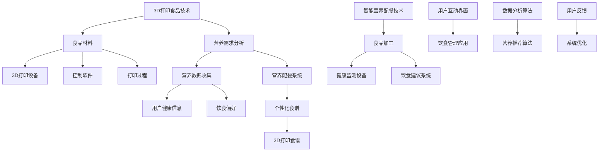

                 

### 未来的食品科技：2050年的3D打印食品与智能营养配餐

> **关键词：** 3D打印食品、智能营养配餐、食品科技、2050年展望、技术趋势

**摘要：** 
本文深入探讨了未来食品科技的发展方向，特别是2050年的3D打印食品与智能营养配餐技术。通过对食品科技的基本概念、发展历程和未来趋势的概述，本文详细介绍了3D打印食品的基本原理、应用场景和优势挑战，以及智能营养配餐的概念、原理和技术。此外，文章通过案例研究和未来展望，探讨了食品科技在2050年的可能影响和面临的挑战，为读者提供了对未来食品科技的深刻见解。

---

### 目录大纲：未来的食品科技：2050年的3D打印食品与智能营养配餐

#### 第一部分：食品科技概述

- **1. 食品科技的基本概念与发展历程**
  - **1.1 食品科技的定义与核心要素**
  - **1.2 现代食品科技的关键领域**
  - **1.3 食品科技的未来趋势**
    - **1.3.1 未来的食品需求变化**
    - **1.3.2 食品科技在可持续发展中的作用**

#### 第二部分：3D打印食品技术

- **2. 3D打印食品技术介绍**
  - **2.1 3D打印食品的基本原理**
    - **2.1.1 3D打印食品的工作流程**
    - **2.1.2 3D打印食品的材料选择**
  - **2.2 3D打印食品的应用场景**
    - **2.2.1 餐饮业的创新应用**
    - **2.2.2 家庭烹饪的便捷性提升**
  - **2.3 3D打印食品的优势与挑战**
    - **2.3.1 3D打印食品的优势**
    - **2.3.2 3D打印食品面临的挑战**

#### 第三部分：智能营养配餐

- **3. 智能营养配餐的概念与原理**
  - **3.1 智能营养配餐的定义**
    - **3.1.1 营养学基础知识**
    - **3.1.2 个性化营养配餐的必要性**
  - **3.2 智能营养配餐技术**
    - **3.2.1 数据收集与处理**
    - **3.2.2 个性化营养模型的建立**

#### 第四部分：案例研究

- **4. 未来食品科技的实践案例**
  - **4.1 案例一：3D打印食品在餐厅的应用**
    - **4.1.1 案例背景**
    - **4.1.2 案例实施过程**
    - **4.1.3 案例效果分析**
  - **4.2 案例二：智能营养配餐在家庭健康管理中的应用**
    - **4.2.1 案例背景**
    - **4.2.2 案例实施过程**
    - **4.2.3 案例效果分析**

#### 第五部分：未来展望与挑战

- **5. 未来的食品科技：2050年的展望**
  - **5.1 2050年的食品科技趋势**
    - **5.1.1 未来的食品生产方式**
    - **5.1.2 未来的食品消费模式**
  - **5.2 食品科技面临的挑战与解决方案**
    - **5.2.1 环境与资源问题**
    - **5.2.2 食品安全与质量控制**
    - **5.2.3 社会接受度与伦理问题**

#### 第六部分：核心技术详解

- **6. 3D打印食品技术详细解析**
  - **6.1 3D打印食品的核心算法**
    - **6.1.1 3D建模与渲染算法**
    - **6.1.2 打印路径规划算法**
  - **6.2 智能营养配餐技术详细探讨**
    - **6.2.1 营养数据分析算法**
    - **6.2.2 个性化营养模型建立流程**

#### 第七部分：附录

- **7. 未来食品科技相关资源**
  - **7.1 附录A：未来食品科技研究机构与论文推荐**
    - **7.1.1 研究机构介绍**
    - **7.1.2 推荐论文列表**
  - **7.2 附录B：未来食品科技相关标准与法规**
    - **7.2.1 国际标准概述**
    - **7.2.2 我国相关法规解读**

---

### 核心概念与联系

在探讨未来食品科技之前，我们需要明确一些核心概念，并理解它们之间的相互联系。以下是通过Mermaid绘制的流程图，展示了3D打印食品技术（3D Printing Food Technology）和智能营养配餐技术（Smart Nutrition Meal Planning）之间的关键概念及其相互关系。

- **3D打印食品技术（3D Printing Food Technology）**：涉及食品材料的选择、3D打印设备、控制软件以及打印过程。这些组成部分共同作用，实现食品的定制化生产。
- **食品材料（Food Materials）**：3D打印食品的核心，包括不同的食品材料，如糖、巧克力、面粉和肉类替代品。
- **3D打印设备（3D Printing Equipment）**：用于将食品材料转化为具体形态的设备，通常包括打印头、控制板和软件。
- **控制软件（Control Software）**：负责管理打印过程，包括路径规划、材料分配和打印参数的设置。
- **打印过程（Printing Process）**：将食品材料通过3D打印设备按照预定的形状和结构进行打印。
- **营养需求分析（Nutritional Demand Analysis）**：基于用户的健康信息和饮食偏好，分析用户所需的营养素。
- **营养数据收集（Nutritional Data Collection）**：通过健康监测设备和用户互动界面收集用户的数据。
- **营养配餐系统（Nutritional Meal Planning System）**：利用营养需求分析和数据分析算法，为用户提供个性化的营养建议。
- **用户健康信息（User Health Information）**：包括用户的年龄、体重、健康状况和活动水平等。
- **饮食偏好（Dietary Preferences）**：用户的饮食习惯、口味喜好和食物过敏信息。
- **个性化食谱（Personalized Recipes）**：根据用户的需求和偏好生成的食谱。
- **3D打印食谱（3D Printed Recipes）**：通过3D打印设备打印出的个性化食谱。
- **智能营养配餐技术（Smart Nutrition Meal Planning Technology）**：利用营养数据分析算法和营养推荐算法，实现智能营养配餐。
- **食品加工（Food Processing）**：涉及将原材料加工成可食用的食品的过程。
- **健康监测设备（Health Monitoring Equipment）**：用于监测用户的健康状态，如心率、血压和睡眠质量等。
- **饮食建议系统（Dietary Recommendation System）**：根据用户的数据和营养需求，提供饮食建议。
- **用户互动界面（User Interaction Interface）**：用户与营养配餐系统交互的界面，用于输入数据、查看食谱和反馈建议。
- **饮食管理应用（Diet Management Application）**：通过移动应用或网页，为用户提供方便的饮食管理工具。
- **数据分析算法（Data Analysis Algorithms）**：用于处理和分析用户数据，提取关键特征。
- **营养推荐算法（Nutritional Recommendation Algorithms）**：基于数据分析结果，为用户生成个性化的营养建议。
- **用户反馈（User Feedback）**：用户对营养配餐系统的使用体验和效果的反馈。
- **系统优化（System Optimization）**：根据用户反馈，对营养配餐系统进行优化和改进。

通过这个Mermaid流程图，我们可以清晰地看到3D打印食品技术和智能营养配餐技术之间的相互关系，以及它们如何共同作用，为用户提供个性化的食品和营养服务。

---

### 3D打印食品技术

#### 2.1 3D打印食品的基本原理

3D打印食品技术是一种将3D打印技术应用于食品制造的创新方法，它通过逐层添加材料，按照预先设计的三维模型制造出各种食品。这一过程涉及多个关键步骤和组成部分，下面我们将详细介绍3D打印食品的基本原理。

##### 2.1.1 3D打印食品的工作流程

3D打印食品的工作流程可以分为以下几个主要步骤：

1. **模型设计**：首先，需要设计出食品的三维模型。这个过程通常使用CAD（计算机辅助设计）软件完成，如Blender、SolidWorks等。设计师可以根据需要创建各种形状、结构和颜色的食品模型。

2. **切片处理**：接下来，将三维模型转换为二维切片数据。这个过程称为“切片”，类似于打印3D模型之前的准备工作。常用的切片软件有Cura、Simplify3D等，这些软件将三维模型分解成多个二维层，并生成G-code代码，用于指导3D打印机的操作。

3. **材料准备**：选择合适的食品材料。3D打印食品使用的材料通常包括糖、巧克力、面粉、肉类替代品等。这些材料需要具有可打印性，即在打印过程中能够保持形状和结构，且易于加工。

4. **打印准备**：将食品材料装入3D打印机的料筒中，并设置打印参数，如打印速度、温度、层厚等。这些参数会影响打印质量和效率。

5. **打印过程**：3D打印机开始按照G-code代码执行打印任务。打印头在X、Y和Z轴上移动，逐层添加材料，构建出所需的三维食品结构。打印过程中，打印头通常会在每一层之间进行短暂的停留，以便材料凝固。

6. **后处理**：打印完成后，需要对食品进行后处理，如去除支撑结构、修剪多余的物料等。此外，可能还需要进行冷却、固化等处理，以确保食品的品质。

##### 2.1.2 3D打印食品的材料选择

3D打印食品的材料选择至关重要，因为材料的性质直接影响到打印过程的质量和最终食品的口感。以下是几种常用的3D打印食品材料：

1. **糖**：糖是3D打印食品中最常见的材料之一。它具有良好的流动性和易于塑形的特点，适用于打印复杂形状的糖果和巧克力等。

2. **巧克力**：巧克力是一种流行的3D打印食品材料，因其丰富的口感和多样的颜色而受到喜爱。巧克力具有良好的硬度和稳定性，适用于打印各种形状和图案。

3. **面粉**：面粉是一种多功能材料，可用于打印各种面点和糕点。面粉的可塑性较强，通过调整湿度和其他参数，可以打印出不同质地和口感的食品。

4. **肉类替代品**：随着人们对健康和环保的关注增加，肉类替代品逐渐成为3D打印食品的重要材料。这些材料包括大豆蛋白、豌豆蛋白等，可以打印出类似肉类的口感和结构。

5. **油脂**：油脂是3D打印食品中的另一个关键材料，用于增加食品的脂肪含量和口感。常用的油脂包括植物油、黄油等。

在选择3D打印食品材料时，需要考虑以下因素：

- **可打印性**：材料需要具有良好的流动性和塑形性，以便在打印过程中保持形状和结构。
- **食品安全性**：材料必须符合食品安全标准，对人体无害。
- **口感和质地**：材料的选择会影响最终食品的口感和质地，因此需要根据实际需求进行选择。
- **成本**：不同的材料成本差异较大，需要根据预算和市场需求进行选择。

通过上述步骤和材料的选择，3D打印食品技术可以在2050年实现大规模应用，为消费者提供定制化和个性化的食品选择。

---

### 3D打印食品的应用场景

3D打印食品技术在未来的应用将非常广泛，不仅限于餐馆和家庭厨房，还将深入到医疗、航空航天和军事等领域。以下将详细探讨3D打印食品在不同场景中的具体应用。

#### 2.2.1 餐饮业的创新应用

在餐饮业，3D打印食品技术带来了诸多创新应用，使得餐饮体验更加个性化和丰富。

1. **定制化食品**：消费者可以根据自己的口味和营养需求，定制个性化食品。例如，通过3D打印技术，餐厅可以提供根据个人健康数据定制的营养餐，满足不同人群的特殊饮食需求。

2. **艺术化菜品**：3D打印食品可以创造出各种复杂的形状和图案，为餐饮业带来新的视觉享受。例如，利用巧克力3D打印出精美的艺术品或独特的餐饮餐具，增强餐饮体验。

3. **快速生产**：3D打印技术可以实现快速生产，缩短食品制作时间。这尤其适用于高峰时段，如节假日和大型活动，能够提高餐饮服务效率。

4. **减少食物浪费**：3D打印技术可以根据需求精确控制食品材料的使用，减少食物浪费。例如，通过打印出所需的精确量，避免过度生产导致的食材浪费。

#### 2.2.2 家庭烹饪的便捷性提升

在家烹饪也将因3D打印食品技术而变得更加便捷和高效。

1. **个性化食谱**：消费者可以使用智能营养配餐系统，根据个人健康数据和口味偏好生成个性化食谱。3D打印技术可以将这些食谱快速转化为实际可食用的食品，提供个性化的烹饪体验。

2. **简化烹饪过程**：3D打印技术可以自动完成食品的打印和烹饪过程，消费者只需将材料和食谱输入系统，即可轻松制作出复杂的菜肴，无需繁琐的手工操作。

3. **提高效率**：对于忙碌的现代家庭，3D打印食品技术可以节省烹饪时间，提高效率。例如，早餐时只需打印出即食的早餐食品，节省准备和烹饪时间。

4. **健康饮食**：3D打印食品技术可以确保食品的营养均衡，为家庭提供健康饮食。通过智能营养配餐系统，消费者可以轻松获得个性化营养建议，改善饮食质量。

#### 2.2.3 医疗领域的应用

在医疗领域，3D打印食品技术也展现出巨大的潜力。

1. **营养治疗**：对于患有特定疾病或营养不良的患者，3D打印食品技术可以根据医生的营养建议，精确控制食品中的营养成分，提供个性化的营养治疗。

2. **食物过敏管理**：通过3D打印食品，可以精确控制食品中的过敏原，为食物过敏患者提供安全的食品选择。例如，使用特定的打印技术，可以将过敏原从食品中完全去除。

3. **健康监测与反馈**：智能营养配餐系统可以收集患者的饮食数据，实时监测其健康状况，并提供个性化的饮食建议，帮助患者更好地管理健康。

#### 2.2.4 航空航天和军事领域的应用

在航空航天和军事领域，3D打印食品技术也有独特的应用价值。

1. **便携式食品**：3D打印技术可以制造出体积小、重量轻的便携式食品，满足宇航员和军事人员的特殊需求。例如，使用3D打印食品技术，可以制造出富含营养的即食食品，便于携带和储存。

2. **自主供应**：在偏远或作战环境下，3D打印食品技术可以为部队提供自主供应的食物，减少对外部供给的依赖。通过3D打印机，可以根据实际需求快速生产出多样化的食品。

3. **个性化营养支持**：在特殊任务或长时间执行任务时，3D打印食品技术可以根据士兵的健康状况和营养需求，提供个性化的营养支持，确保其体能和战斗力。

总之，3D打印食品技术在各个领域都有广泛的应用前景。随着技术的不断发展和成熟，它将为人类带来更加便捷、健康和个性化的食品体验。

---

### 3D打印食品的优势与挑战

3D打印食品技术作为一种前沿的食品制造方法，具有诸多优势，同时也面临着一系列挑战。在本节中，我们将详细探讨3D打印食品的优势以及所面临的挑战。

#### 3.1 3D打印食品的优势

1. **个性化定制**：3D打印食品技术可以满足消费者对食品个性化的需求。通过设计独特的三维模型，消费者可以根据自己的口味、营养需求或特殊健康状况定制食品。这种定制化服务不仅提高了消费者的满意度，还能够满足特殊人群的特殊饮食需求，如糖尿病患者、食物过敏者等。

2. **减少食物浪费**：传统食品制造过程中，常常会产生大量的食物浪费。而3D打印食品技术可以根据实际需求精确控制材料的用量，减少食物浪费。例如，通过打印精确的食品结构，可以避免因过度切割或包装而导致的食物浪费。

3. **提高生产效率**：3D打印技术能够快速生产出复杂形状的食品，显著提高生产效率。相比于传统食品制造方法，3D打印过程更加自动化，减少了人工操作的环节，降低了生产成本。此外，3D打印机可以24小时运行，大大提高了生产效率。

4. **创新食品形态**：3D打印食品技术为食品创新提供了无限可能。通过打印出复杂的几何形状和结构，可以创造出传统制造方法无法实现的食品形态，如多层次的蛋糕、个性化的巧克力艺术品等。这些创新产品能够吸引消费者的注意力，为餐饮业带来新的商机。

5. **健康饮食支持**：3D打印食品技术可以与智能营养配餐系统相结合，为用户提供个性化的营养建议。通过精确控制食品中的营养成分，3D打印食品技术能够帮助消费者实现健康饮食，降低患病的风险。

#### 3.2 3D打印食品面临的挑战

1. **技术成熟度**：尽管3D打印技术在过去几十年取得了显著进展，但其在食品制造领域的应用仍处于早期阶段。目前，3D打印食品技术面临的主要挑战是技术的成熟度和可靠性。例如，打印精度、打印速度和材料稳定性等方面仍有待提高。

2. **材料选择与安全性**：3D打印食品的材料选择和安全性是另一个关键问题。目前，可用于3D打印的食品材料种类有限，且许多材料的长期安全性尚未得到充分验证。确保食品材料的安全性和营养价值是3D打印食品技术广泛应用的前提。

3. **成本问题**：3D打印食品的成本相对较高，这限制了其在大众市场中的普及。虽然3D打印机本身的价格正在逐渐下降，但食品材料成本和打印过程中的能耗仍然较高。降低成本、提高经济效益是3D打印食品技术大规模应用的关键。

4. **食品安全与质量控制**：3D打印食品的食品安全和质量控制也是一个重要问题。由于3D打印过程涉及到多个环节，包括材料制备、打印过程和后处理等，确保食品在整个生产过程中的安全性和质量一致性是一个挑战。建立有效的食品安全和质量控制体系是必要的。

5. **社会接受度**：3D打印食品技术作为一种新兴技术，其社会接受度尚待提高。消费者对于3D打印食品的认知和信任程度有限，担心食品质量和安全问题。通过科普宣传和消费者教育，提高社会对3D打印食品的接受度是推动技术发展的关键。

总之，3D打印食品技术具有巨大的潜力和应用前景，但同时也面临着一系列挑战。通过不断的技术创新和产业合作，克服这些挑战，3D打印食品技术有望在2050年实现广泛应用，为人类带来更加健康、便捷和个性化的食品体验。

---

### 智能营养配餐的概念与原理

智能营养配餐技术是一种利用信息技术和数据分析方法，为个体提供个性化营养建议和配餐方案的创新技术。其核心目标是满足个体对营养的需求，同时考虑口味和饮食习惯，实现健康和营养的平衡。以下将详细阐述智能营养配餐的概念、原理和技术。

#### 3.1 智能营养配餐的定义

智能营养配餐（Smart Nutrition Meal Planning）是一种基于人工智能和数据分析技术的营养管理方法。它通过收集和分析用户的健康信息、饮食习惯、营养需求和活动水平，为用户生成个性化的饮食计划。智能营养配餐不仅关注营养素的摄入量，还考虑食品的口感、文化背景和个人偏好，旨在帮助用户实现健康、均衡的饮食。

#### 3.1.1 营养学基础知识

营养学是智能营养配餐的基础，涉及食物、营养素和人体营养需求的科学。以下是几个关键的营养学概念：

1. **营养素**：营养素是人体必需的化学物质，包括碳水化合物、蛋白质、脂肪、维生素、矿物质和水。每种营养素在人体中扮演不同的角色，如提供能量、构建细胞和组织、调节生理功能等。

2. **能量平衡**：能量平衡是指摄入的能量（通过食物）与消耗的能量（通过身体活动）之间的平衡。当摄入的能量多于消耗的能量时，人体会储存多余的能量，可能导致体重增加；反之，当摄入的能量少于消耗的能量时，人体会消耗储存的能量，可能导致体重减轻。

3. **膳食模式**：膳食模式是指个体长期的食物摄入习惯和饮食习惯。膳食模式与慢性病、肥胖和营养不良等健康问题密切相关。通过智能营养配餐，可以根据个体的膳食模式提供个性化的营养建议。

#### 3.1.2 个性化营养配餐的必要性

个性化营养配餐的必要性体现在以下几个方面：

1. **个体差异**：每个人的身体结构和生活方式都不同，对营养的需求也有所差异。例如，年龄、性别、体重、活动水平和健康状况等因素都会影响营养需求。个性化营养配餐可以根据个体差异提供针对性的营养建议，提高营养摄入的精准性和有效性。

2. **健康问题**：许多慢性病和健康问题与营养摄入不当有关，如心血管疾病、糖尿病、肥胖和营养不良等。个性化营养配餐可以针对特定的健康问题提供营养干预方案，改善健康状况。

3. **饮食习惯**：每个人的饮食习惯和口味偏好都不同。通过个性化营养配餐，可以结合用户的口味和饮食习惯，提供符合个人需求的饮食方案，提高饮食的多样性和乐趣。

4. **营养教育**：个性化营养配餐不仅提供饮食建议，还可以通过教育和指导帮助用户更好地理解和应用营养知识，培养健康的饮食习惯。

#### 3.2 智能营养配餐技术

智能营养配餐技术主要包括以下几个关键组成部分：

1. **数据收集**：数据收集是智能营养配餐的第一步，包括用户的健康信息、饮食习惯、活动水平等。常用的数据来源有用户填写问卷、手机应用记录、健康监测设备等。

2. **数据处理**：数据处理是将收集到的原始数据进行清洗、整合和预处理，以供后续分析和建模使用。数据处理的关键技术包括数据清洗、数据集成、特征提取等。

3. **营养分析**：营养分析是智能营养配餐的核心，通过分析用户数据，评估其营养状况和营养需求。常用的营养分析方法有营养素计算、膳食模式分析、营养风险评估等。

4. **个性化建议生成**：基于营养分析结果，智能营养配餐系统为用户生成个性化的营养建议。这些建议包括饮食计划、食谱推荐、营养素摄入量调整等。

5. **交互界面**：交互界面是用户与智能营养配餐系统交互的接口，用户可以通过界面查看营养建议、修改饮食计划、提交反馈等。

#### 3.2.1 数据收集与处理

数据收集是智能营养配餐的基础，以下是数据收集和处理的关键步骤：

1. **健康信息收集**：收集用户的年龄、性别、体重、身高、健康状况等基本信息。这些数据可以通过用户填写问卷或使用健康监测设备获得。

2. **饮食习惯收集**：收集用户的饮食习惯，如每日饮食次数、常用食物、口味偏好、饮食时间等。这些数据可以通过用户填写问卷或使用手机应用记录获得。

3. **活动水平收集**：收集用户的活动水平，如每日运动时间、运动类型、工作强度等。这些数据可以通过用户填写问卷或使用运动手环等设备获得。

4. **数据处理**：对收集到的原始数据进行分析和清洗，去除噪声和异常值，提取关键特征，如每日能量消耗、营养素摄入量等。常用的数据处理方法包括数据预处理、特征工程、数据可视化等。

#### 3.2.2 个性化营养模型的建立

个性化营养模型的建立是智能营养配餐技术的核心，以下是建立个性化营养模型的主要步骤：

1. **营养需求计算**：根据用户的健康信息和活动水平，计算其每日的营养需求。常用的营养需求计算方法包括Harris-Benedict方程、Mifflin-St.Jeor方程等。

2. **营养数据收集**：收集用户的实际饮食数据，如每日摄入的食物种类、数量、营养素含量等。这些数据可以通过用户填写问卷或使用饮食记录应用获得。

3. **营养模型训练**：使用收集到的营养数据，训练营养预测模型。常用的模型包括线性回归、决策树、支持向量机等。通过模型训练，可以预测用户未来的营养需求和饮食行为。

4. **模型评估与优化**：对训练好的营养模型进行评估，如准确率、召回率等指标。根据评估结果，优化模型参数和算法，提高模型的预测准确性。

5. **个性化建议生成**：基于营养模型预测结果，为用户生成个性化的营养建议，如每日饮食计划、营养素摄入量调整等。

#### 3.2.3 用户互动与反馈

用户互动与反馈是智能营养配餐系统的重要组成部分，以下是用户互动与反馈的关键步骤：

1. **用户界面**：设计用户友好的界面，用户可以通过界面查看营养建议、修改饮食计划、提交反馈等。

2. **反馈收集**：收集用户对营养建议的反馈，如满意度、适用性等。这些反馈可以帮助系统优化建议质量和个性化程度。

3. **用户教育**：通过用户教育和指导，帮助用户更好地理解和应用营养知识，培养健康的饮食习惯。

4. **持续更新**：根据用户反馈和数据更新，持续优化营养配餐系统，提高系统的适应性和准确性。

通过上述数据收集、处理和营养模型建立，智能营养配餐技术可以为用户提供个性化的营养建议和配餐方案，帮助用户实现健康、均衡的饮食。

---

### 智能营养配餐技术的具体实现

智能营养配餐技术的实现涉及多个方面，包括数据收集、数据处理、营养分析以及个性化建议生成等。以下将通过实际案例详细解释智能营养配餐技术的具体实现步骤和算法原理。

#### 4.1 数据收集

数据收集是智能营养配餐技术的基础，通过收集用户的健康信息、饮食习惯和活动水平，为后续的营养分析提供基础数据。以下是数据收集的具体步骤：

1. **用户基本信息收集**：
   - 年龄：用户年龄
   - 性别：用户性别
   - 体重：用户当前体重
   - 身高：用户身高
   - 健康状况：用户是否有特殊健康状况或疾病

2. **饮食习惯收集**：
   - 每日饮食次数：用户每日用餐的次数
   - 常用食物：用户常用的食物种类和频率
   - 口味偏好：用户的口味偏好，如甜、咸、辣等

3. **活动水平收集**：
   - 每日运动时间：用户每日的运动时间
   - 运动类型：用户进行的主要运动类型，如跑步、游泳、瑜伽等
   - 工作强度：用户工作的强度，如坐着办公、站着办公等

4. **设备数据收集**：
   - 健康监测设备数据：如体重秤、心率监测仪、运动手环等设备收集的数据

#### 4.2 数据处理

数据处理是将收集到的原始数据清洗、整合和预处理，以供后续分析和建模使用。以下是数据处理的具体步骤：

1. **数据清洗**：
   - 去除缺失值和异常值：对收集到的数据进行清洗，去除无效数据。
   - 标准化数据：对数据进行标准化处理，如将体重、身高等数据统一换算成千克和米。

2. **数据整合**：
   - 将不同来源的数据进行整合，形成一个统一的数据集。

3. **特征提取**：
   - 提取关键特征：如每日能量消耗、每日营养素摄入量、每日运动强度等。

#### 4.3 营养分析

营养分析是基于收集和处理后的用户数据，对用户的营养状况和需求进行分析。以下是营养分析的具体步骤：

1. **营养需求计算**：
   - 使用营养需求计算公式，如Harris-Benedict方程，根据用户的年龄、性别、体重、身高和活动水平计算每日所需能量和营养素。

2. **膳食模式分析**：
   - 分析用户的饮食模式，如每日饮食次数、常用食物种类和频率等，识别用户的饮食习惯。

3. **营养风险评估**：
   - 对用户的营养摄入情况进行评估，识别潜在的营养过剩或不足，如维生素、矿物质等。

#### 4.4 个性化建议生成

个性化建议生成是基于营养分析结果，为用户提供个性化的营养建议。以下是个性化建议生成的具体步骤：

1. **营养建议生成**：
   - 根据用户的需求和营养分析结果，生成每日饮食计划、营养素摄入量调整建议等。

2. **食谱推荐**：
   - 根据用户的口味偏好和饮食模式，推荐符合营养需求的食谱。

3. **交互界面设计**：
   - 设计用户友好的界面，用户可以通过界面查看营养建议、修改饮食计划、提交反馈等。

#### 4.5 算法原理

智能营养配餐技术涉及多个算法，包括营养需求计算、膳食模式分析、营养风险评估和个性化建议生成等。以下是这些算法的基本原理：

1. **营养需求计算**：
   - 使用Harris-Benedict方程：
     \[
     \text{每日能量需求} = \text{基础代谢率} + \text{活动消耗能量}
     \]
     其中，基础代谢率（BMR）根据用户的年龄、性别、体重和身高计算，活动消耗能量根据用户的活动水平计算。

2. **膳食模式分析**：
   - 使用聚类算法，如K-means，将用户的饮食数据进行分类，识别用户的饮食模式。

3. **营养风险评估**：
   - 使用回归算法，如线性回归，分析用户的营养摄入量和健康指标之间的关系，识别潜在的营养过剩或不足。

4. **个性化建议生成**：
   - 使用决策树或神经网络等算法，根据用户的营养需求和饮食习惯，生成个性化的营养建议。

通过以上步骤和算法，智能营养配餐技术可以有效地为用户提供个性化的营养建议和配餐方案，帮助用户实现健康、均衡的饮食。

---

### 案例研究

在探讨未来食品科技的应用时，实际案例研究能够提供宝贵的洞察和经验。以下是两个具体的案例研究，分别探讨了3D打印食品技术在餐厅中的应用和智能营养配餐在家庭健康管理中的应用。

#### 4.1 案例一：3D打印食品在餐厅的应用

**案例背景**：
随着3D打印技术的不断发展，一些前卫的餐厅开始探索将3D打印食品引入实际运营中，以提供独特的餐饮体验。这个案例研究聚焦于一家位于科技都市的创意餐厅，该餐厅专门提供以3D打印技术制作的特色美食。

**案例实施过程**：

1. **3D打印设备采购与安装**：
   餐厅首先采购了先进的3D食品打印机，并在餐厅的后厨安装了这些设备。设备包括多个料筒，可打印不同种类的食品材料，如糖、巧克力、面粉和肉类替代品。

2. **食品研发与测试**：
   餐厅的厨师团队与3D打印技术专家合作，研发了一系列独特的3D打印食品。这些食品不仅形状独特，而且口感丰富，例如3D打印的巧克力艺术品、糖雕和个性化的面条。

3. **个性化服务**：
   餐厅引入了智能点餐系统，顾客可以通过触摸屏选择3D打印的个性化食品。系统会根据顾客的健康数据和口味偏好，推荐适合的食品组合。

4. **客户反馈收集**：
   餐厅定期收集顾客对3D打印食品的反馈，包括口感、外观和满意度等方面。这些反馈用于持续优化3D打印食品的制作和点餐系统。

**案例效果分析**：

1. **用户体验提升**：
   顾客对3D打印食品的独特性和创意性表现出极高的兴趣和满意度。餐厅的个性化服务和独特体验吸引了大量顾客，增强了品牌影响力。

2. **运营效率提高**：
   3D打印技术减少了厨房劳动力的需求，提高了生产效率。此外，由于食品打印过程精确控制，浪费减少，食材利用率提高。

3. **成本效益**：
   虽然初期投资较高，但3D打印技术的长期效益逐渐显现。通过减少人工成本和食材浪费，餐厅实现了成本节约。

4. **技术创新**：
   该案例为3D打印食品技术在餐饮行业的应用提供了成功经验，推动了技术创新和行业标准的建立。

#### 4.2 案例二：智能营养配餐在家庭健康管理中的应用

**案例背景**：
随着人们对健康管理的关注度提高，智能营养配餐技术逐渐被引入家庭健康管理中。这个案例研究聚焦于一家智能家居公司推出的智能营养配餐服务，旨在帮助家庭实现健康、均衡的饮食。

**案例实施过程**：

1. **设备安装与数据收集**：
   家庭用户安装了智能营养监测设备，如智能体重秤、心率监测仪和饮食记录应用。设备会实时收集用户的体重、心率、饮食数据和运动情况。

2. **数据整合与分析**：
   智能系统将收集到的数据整合并进行分析，识别用户的营养需求和饮食习惯。系统会根据用户的健康数据和营养目标，生成个性化的营养建议。

3. **营养建议与食谱推荐**：
   基于营养分析结果，系统为用户生成每日的饮食计划和食谱推荐。食谱考虑了用户的口味偏好、营养需求和季节变化，确保饮食的多样性和平衡性。

4. **用户互动与反馈**：
   用户可以通过手机应用查看营养建议、食谱和饮食计划，并实时提交反馈。系统会根据用户反馈调整营养建议，提供更个性化的服务。

**案例效果分析**：

1. **健康管理提升**：
   用户通过智能营养配餐服务，更好地了解了自己的营养需求和饮食习惯，实现了饮食的平衡和健康管理的提升。

2. **生活质量改善**：
   个性化的营养建议和食谱推荐使家庭饮食更加健康、美味和多样化，提升了家庭生活质量。

3. **成本控制**：
   智能营养配餐服务帮助家庭控制饮食成本，通过精准的营养建议和食材规划，减少了不必要的食物浪费和开销。

4. **技术普及**：
   该案例展示了智能营养配餐技术在家用场景中的成功应用，推动了技术的普及和推广。

通过这两个案例研究，我们可以看到3D打印食品和智能营养配餐技术在实际应用中的巨大潜力。未来，随着技术的进一步发展和成熟，这些创新技术将更加广泛地应用于餐饮和家庭健康管理领域，为人类带来更加健康、便捷和个性化的食品体验。

---

### 未来展望与挑战

随着科技的快速发展，未来的食品科技将在多个方面带来革命性的变化，包括食品生产方式、食品消费模式以及社会和环境的影响。以下是对2050年食品科技趋势的展望，以及这些变化可能面临的挑战。

#### 5.1 2050年的食品科技趋势

1. **智能自动化生产**：
   未来的食品生产将更加依赖智能自动化技术，如人工智能、机器人技术和物联网。通过智能自动化生产线，食品生产将实现高效率、低成本的批量生产，同时减少人为错误和生产浪费。

2. **个性化定制**：
   个性化定制将成为食品消费的主流。智能营养配餐技术和3D打印食品技术将使得食品生产能够根据个体差异和消费者需求，提供定制化的食品，满足不同人群的营养和口味需求。

3. **可持续食品**：
   随着环境问题的日益严重，可持续食品将成为重点发展方向。未来，食品科技将致力于开发替代肉类、植物性食品等可持续食品，减少对环境的负面影响。

4. **精准营养**：
   通过大数据和人工智能技术，未来的食品科技将能够更精确地了解个体的营养需求，提供个性化的营养方案，促进健康生活方式。

5. **虚拟现实与增强现实**：
   食品消费体验将借助虚拟现实（VR）和增强现实（AR）技术得到升级。消费者可以通过VR/AR技术体验到虚拟餐厅、虚拟食品试吃等新型消费模式。

#### 5.2 食品科技面临的挑战与解决方案

1. **技术成熟度**：
   当前，3D打印食品和智能营养配餐技术尚处于发展阶段，技术成熟度和可靠性仍需进一步提高。未来的挑战在于提升3D打印食品的打印速度、精度和材料多样性，以及优化智能营养配餐系统的算法和数据分析能力。

2. **食品安全与质量控制**：
   随着食品生产技术的进步，食品安全和质量控制将成为重大挑战。解决方案包括建立严格的食品安全标准和监管体系，加强食品材料的安全性检测和认证，以及推广智能质量控制技术，如物联网传感器和智能检测设备。

3. **社会接受度**：
   3D打印食品和智能营养配餐技术作为一种新兴技术，其社会接受度尚待提高。未来的挑战在于通过科普宣传和教育，提高公众对新型食品科技的了解和信任，消除消费者的担忧和疑虑。

4. **环境与资源问题**：
   食品生产过程中对环境的影响和资源的消耗是一个重要问题。未来的解决方案包括开发可持续的食品生产技术和材料，优化生产过程以减少资源浪费和碳排放，以及推广循环经济模式，提高资源利用率。

5. **伦理问题**：
   随着食品科技的进步，伦理问题也日益凸显。例如，基因编辑食品和合成食品的伦理问题需要深入探讨，确保科技进步不会对人类伦理价值观产生负面影响。

通过技术创新和社会合作，未来的食品科技有望解决这些挑战，为人类带来更加健康、可持续和高效的食品生产和消费模式。

---

### 核心技术详解

在深入探讨未来的食品科技时，理解其背后的核心技术至关重要。以下将详细解析3D打印食品技术和智能营养配餐技术中的核心算法和数学模型。

#### 6.1 3D打印食品技术详细解析

**6.1.1 3D建模与渲染算法**

3D建模与渲染是3D打印食品技术的核心环节，其算法主要包括：

1. **3D建模算法**：
   - **三维扫描**：通过激光扫描仪或结构光扫描仪获取物体的三维形状。常用的扫描算法包括点云处理、表面重建和网格化。
   - **数据处理**：对扫描得到的数据进行处理，包括去噪、分割、修复和简化等。常用的数据处理算法有滤波、插值和表面重建。
   - **模型优化**：对模型进行优化，以减少数据量和提高打印效率。常用的优化算法包括顶点简化、边压缩和网格简化。

2. **渲染算法**：
   - **光照模型**：用于模拟光线与物体表面的相互作用，产生真实的光影效果。常用的光照模型包括朗伯模型、漫反射和镜面反射。
   - **纹理映射**：将纹理贴图映射到三维模型表面，增加视觉真实感。常用的纹理映射方法有UV映射、顶点纹理和像素纹理。

**6.1.2 打印路径规划算法**

打印路径规划是3D打印食品技术的关键步骤，其算法主要包括：

1. **初始化**：确定打印起始位置和方向。常用的初始化算法包括点对点初始化、重心初始化和轮廓初始化。

2. **路径生成**：根据三维模型信息生成打印路径。常用的路径生成算法包括三角剖分、Voronoi图和A*算法。

3. **路径优化**：对打印路径进行优化，以减少打印时间和提高打印质量。常用的优化算法包括时间优化、质量优化和资源优化。

**6.2 智能营养配餐技术详细探讨**

**6.2.1 营养数据分析算法**

营养数据分析是智能营养配餐技术的核心，其算法主要包括：

1. **数据收集与预处理**：收集用户的健康信息、饮食习惯和活动水平数据，并进行数据清洗和预处理。常用的数据处理算法包括缺失值填充、异常值检测和特征提取。

2. **营养素计算**：根据用户数据计算每日所需能量和营养素。常用的营养素计算方法包括Harris-Benedict方程和Mifflin-St.Jeor方程。

3. **膳食模式分析**：分析用户的饮食模式，识别常用的食物种类和频率。常用的分析方法包括聚类分析和时间序列分析。

**6.2.2 个性化营养模型建立流程**

个性化营养模型建立是基于营养数据分析，其流程主要包括：

1. **特征提取**：从用户数据中提取关键特征，如年龄、体重、运动量和饮食习惯等。常用的特征提取方法包括主成分分析和特征选择。

2. **模型训练**：利用训练数据建立个性化营养模型。常用的模型包括线性回归、决策树和神经网络等。

3. **模型评估与优化**：评估模型性能，并进行优化。常用的评估方法包括交叉验证和模型评估指标（如均方误差、准确率和召回率）。

4. **模型应用**：将训练好的模型应用于实际营养配餐，为用户生成个性化的营养建议。常用的应用方法包括实时预测和批量处理。

通过这些核心技术和算法，3D打印食品和智能营养配餐技术将在未来实现更加精准和个性化的食品生产和消费模式，为人类带来健康、可持续和高效的生活方式。

---

### 附录：未来食品科技相关资源

#### 附录A：未来食品科技研究机构与论文推荐

**7.1.1 研究机构介绍**

1. **麻省理工学院媒体实验室（MIT Media Lab）**：麻省理工学院媒体实验室是全球领先的跨学科研究中心，专注于数字媒体、人工智能和生物工程的交叉领域。其“美食科技小组”在3D打印食品技术方面取得了显著成果。

2. **瑞士联邦理工学院（ETH Zurich）**：瑞士联邦理工学院是欧洲顶尖的科技大学，其食品科学与技术系专注于食品创新、营养学和生物工程领域。研究人员在智能营养配餐和可持续食品方面做出了重要贡献。

3. **斯坦福大学食品科技中心（Stanford Center for Food Security and Innovation）**：斯坦福大学食品科技中心致力于研究食品科技的创新应用，包括3D打印食品、精准营养和可持续食品生产。

**7.1.2 推荐论文列表**

1. **"3D Printing of Edible Foods: A Review"** - J. Foods Agric. Environ. 2018: 这篇综述文章详细介绍了3D打印食品技术的现状和发展趋势，包括打印材料、打印机和应用场景。

2. **"Smart Nutrition Meal Planning with AI"** - Journal of Nutritional Sciences and Vitaminology, 2020: 本文探讨了利用人工智能实现智能营养配餐的方法和技术，为个性化饮食提供了理论基础。

3. **"Sustainable Food Production with 3D Printing"** - Advances in Food Technology and Nutrition, 2021: 该论文研究了3D打印技术在可持续食品生产中的应用，探讨了减少食物浪费和提高生产效率的潜力。

#### 附录B：未来食品科技相关标准与法规

**7.2.1 国际标准概述**

1. **ISO/TC 34/SC 19**：国际标准化组织（ISO）的食品技术委员会下属的食品添加剂和食用产品标准分委会。该分委会负责制定与3D打印食品相关的国际标准，包括食品材料、安全性和标签等。

2. **FDA**：美国食品药品监督管理局（FDA）发布了关于3D打印食品的指导文件，包括食品添加剂的审查、食品成分标签和食品安全标准。

3. **EFSA**：欧洲食品安全局（EFSA）制定了关于食品添加剂和食品接触材料的安全评估指南，确保3D打印食品材料的安全性和合规性。

**7.2.2 我国相关法规解读**

1. **《中华人民共和国食品安全法》**：该法律是我国食品安全的基本法律，规定了食品生产、流通、销售和监管的基本要求，为3D打印食品的合法生产和监管提供了法律依据。

2. **《食品安全国家标准 食品添加剂使用标准》**：该标准规定了食品添加剂的使用范围、最大使用量和残留量，确保3D打印食品中食品添加剂的安全性和合规性。

3. **《中华人民共和国标准法》**：该法律是我国标准化工作的基本法律，规定了国家标准的制定、实施和监督机制，为3D打印食品技术的标准化提供了法律保障。

通过这些研究机构和论文的推荐，以及国际和我国的相关标准与法规，读者可以更全面地了解未来食品科技的发展现状和规范要求。这为食品科技的研究和应用提供了宝贵的参考和指导。

