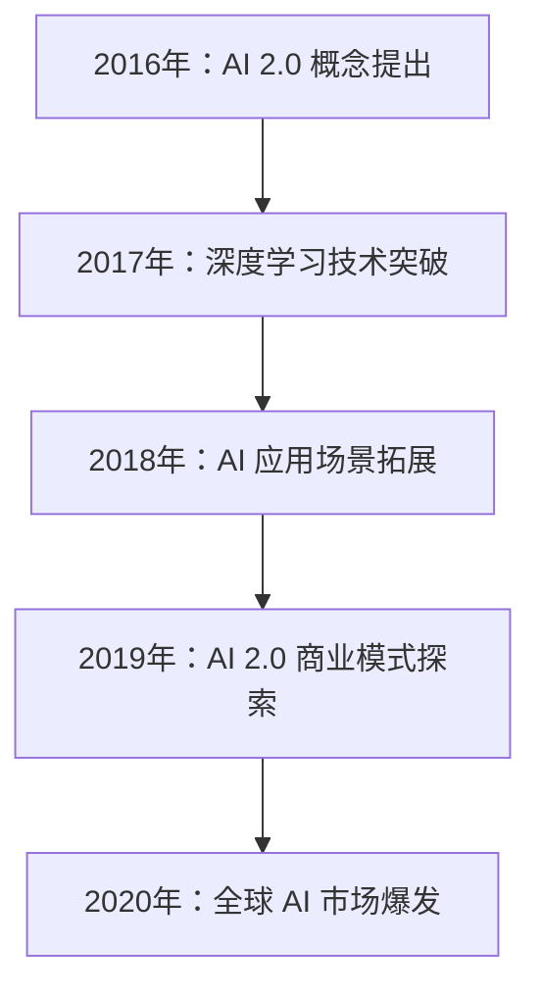
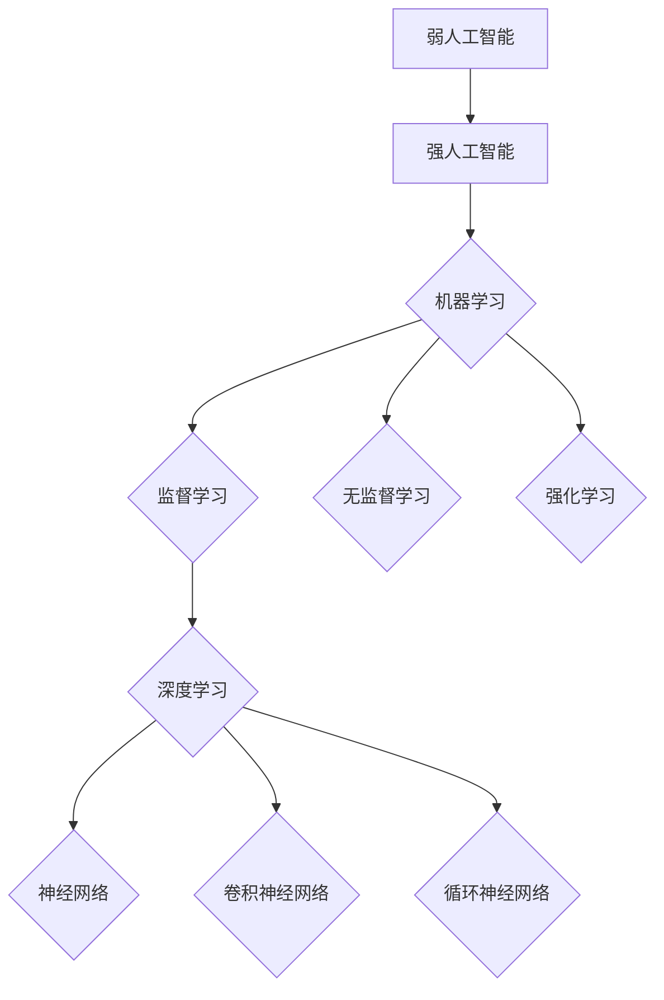

                 

### 文章标题

《李开复：AI 2.0 时代的市场》

关键词：AI 2.0，市场分析，技术趋势，应用案例，行业变革

摘要：本文将深入探讨 AI 2.0 时代的市场动态，分析其定义、特点、市场环境、技术基础、行业应用、管理策略及未来展望。通过梳理李开复的观点，结合实际案例，旨在为读者提供一个全面、系统的 AI 2.0 时代市场全景图。

### 第一部分：AI 2.0 时代概述

#### 第1章: AI 2.0 时代概述

##### 1.1 AI 2.0 的定义与特点

AI 2.0 是指第二代人工智能，它不仅具有自主学习和适应能力，还能实现跨领域的综合应用。与传统 AI 相比，AI 2.0 更加强调人工智能的智能化、网络化和智能化。

###### 1.1.1 AI 2.0 与传统 AI 的区别

传统 AI 以规则为基础，依赖大量手动编写代码来实现特定功能。而 AI 2.0 则以数据驱动，通过深度学习和强化学习等技术，实现自主学习和智能决策。

###### 1.1.2 AI 2.0 的技术特点

AI 2.0 具有以下几个技术特点：

1. **大数据处理能力**：能够高效处理海量数据，挖掘潜在价值。
2. **自适应学习**：通过不断学习和优化，提高智能水平和决策能力。
3. **跨领域应用**：能够在多个领域实现智能化，如金融、医疗、交通等。
4. **智能化协作**：能够与人类智能协同工作，实现人机融合。

###### 1.1.3 AI 2.0 的发展历程

AI 2.0 的概念起源于 2016 年，由李开复等人首次提出。随后，随着深度学习和强化学习等技术的快速发展，AI 2.0 开始进入实际应用阶段。

##### 1.2 AI 2.0 时代的市场环境

AI 2.0 时代的市场环境呈现出以下几个特点：

###### 1.2.1 全球 AI 市场趋势

全球 AI 市场规模持续增长，预计到 2030 年将达到数万亿美元。其中，美国、中国和欧洲等地区占据主导地位。

###### 1.2.2 中国 AI 市场现状

中国 AI 市场发展迅速，已成为全球最大的 AI 市场之一。政府和企业纷纷加大投入，推动 AI 技术的创新和应用。

###### 1.2.3 行业应用场景与挑战

AI 2.0 在金融、医疗、交通、教育等领域的应用逐渐成熟，但同时也面临着数据安全、隐私保护等挑战。

##### 1.3 AI 2.0 对经济和社会的影响

AI 2.0 的出现对经济和社会产生了深远影响：

###### 1.3.1 经济结构转型

AI 2.0 推动了产业升级和结构调整，为经济发展注入新动力。

###### 1.3.2 社会变革

AI 2.0 改变了人们的生活方式和工作方式，促进了社会进步。

###### 1.3.3 道德和法律问题

AI 2.0 的应用引发了道德和法律问题，如算法歧视、隐私泄露等。

---

**Mermaid 流程图：AI 2.0 发展历程**



---

**核心算法原理讲解：AI 2.0 的核心算法**

伪代码：

```python
# 定义神经网络结构
input_layer = Input(shape=(input_shape,))
hidden_layer = Dense(hidden_neurons, activation='relu')(input_layer)
output_layer = Dense(output_neurons, activation='sigmoid')(hidden_layer)

# 编译模型
model = Model(inputs=input_layer, outputs=output_layer)
model.compile(optimizer='adam', loss='binary_crossentropy', metrics=['accuracy'])

# 训练模型
model.fit(x_train, y_train, epochs=epochs, batch_size=batch_size)

# 评估模型
loss, accuracy = model.evaluate(x_test, y_test)
print(f"Test accuracy: {accuracy}")
```

**数学模型和公式：AI 2.0 的学习率调整**

$$
\alpha_t = \frac{\alpha_0}{1 + t\times\beta
```### 第2章: AI 2.0 技术基础

##### 2.1 人工智能的基本原理

人工智能（Artificial Intelligence, AI）是计算机科学的一个分支，旨在创建能够模拟、延伸和扩展人类智能的理论、算法和技术。人工智能可以分为弱人工智能（Weak AI）和强人工智能（Strong AI）。

###### 2.1.1 人工智能的定义与分类

1. **弱人工智能（Narrow AI）**：指在特定任务上表现出智能的人工智能系统，如语音识别、图像识别、自然语言处理等。
2. **强人工智能（General AI）**：指具有普遍智能的人工智能系统，能够在各种任务中表现出智能，如人类一样具备理解、学习、推理和创造力。

###### 2.1.2 机器学习的基本概念

机器学习（Machine Learning, ML）是人工智能的核心技术之一，通过从数据中学习，使计算机能够进行预测和决策。机器学习可以分为监督学习、无监督学习和强化学习。

1. **监督学习（Supervised Learning）**：通过已知输入和输出数据来训练模型，从而预测未知数据的输出。
2. **无监督学习（Unsupervised Learning）**：没有已知输出数据，通过发现数据内在结构和规律来进行学习。
3. **强化学习（Reinforcement Learning）**：通过不断尝试和错误来学习最优策略，实现从环境到决策的优化。

###### 2.1.3 深度学习原理

深度学习（Deep Learning, DL）是机器学习的一个子领域，通过构建深层的神经网络来实现复杂的模型。深度学习的关键技术包括：

1. **神经网络（Neural Networks）**：模拟生物神经元的计算模型，用于实现非线性映射和特征提取。
2. **激活函数（Activation Functions）**：用于引入非线性特性，如 sigmoid、ReLU、Tanh 等。
3. **反向传播算法（Backpropagation Algorithm）**：用于计算模型参数的梯度，优化模型性能。
4. **卷积神经网络（Convolutional Neural Networks, CNNs）**：适用于图像、语音等数据，通过卷积层提取特征。
5. **循环神经网络（Recurrent Neural Networks, RNNs）**：适用于序列数据，通过循环结构实现记忆功能。

##### 2.2 自然语言处理

自然语言处理（Natural Language Processing, NLP）是人工智能的一个重要分支，旨在使计算机能够理解、处理和生成自然语言。NLP 的核心技术包括：

###### 2.2.1 语言模型与翻译

1. **语言模型（Language Model）**：用于对自然语言文本进行建模，预测下一个单词或字符的概率。
2. **机器翻译（Machine Translation）**：将一种语言的文本自动翻译成另一种语言。

###### 2.2.2 文本分类与情感分析

1. **文本分类（Text Classification）**：将文本数据分为不同的类别，如情感分析、主题分类等。
2. **情感分析（Sentiment Analysis）**：通过分析文本数据，判断文本的情感倾向，如正面、负面、中性等。

###### 2.2.3 对话系统

1. **对话系统（Dialogue Systems）**：使计算机能够与人类进行自然语言交互，如聊天机器人、语音助手等。

##### 2.3 计算机视觉

计算机视觉（Computer Vision, CV）是人工智能的另一个重要分支，旨在使计算机能够从图像和视频中提取信息。计算机视觉的关键技术包括：

###### 2.3.1 图像识别与分类

1. **图像识别（Image Recognition）**：识别图像中的对象和场景。
2. **图像分类（Image Classification）**：将图像数据分为不同的类别。

###### 2.3.2 目标检测与跟踪

1. **目标检测（Object Detection）**：检测图像中的多个对象及其位置。
2. **目标跟踪（Object Tracking）**：跟踪图像序列中的目标。

###### 2.3.3 图像生成与风格迁移

1. **图像生成（Image Generation）**：生成新的图像或修改现有图像。
2. **风格迁移（Style Transfer）**：将一种图像的风格应用到另一种图像上。

##### 2.4 强化学习

强化学习（Reinforcement Learning, RL）是一种通过与环境交互来学习策略的机器学习方法。强化学习的核心包括：

###### 2.4.1 基本概念与算法

1. **状态（State）**：系统当前所处的环境条件。
2. **动作（Action）**：系统可以采取的行为。
3. **奖励（Reward）**：系统因采取某个动作而获得的奖励或惩罚。
4. **策略（Policy）**：系统在给定状态下采取的动作。
5. **Q-学习（Q-Learning）**：通过学习 Q 值函数来选择最优动作。
6. **深度 Q-网络（Deep Q-Network, DQN）**：将 Q-学习扩展到深度神经网络。

###### 2.4.2 应用场景与挑战

1. **应用场景**：强化学习广泛应用于游戏、机器人、推荐系统等领域。
2. **挑战**：强化学习面临挑战，如样本效率、探索与利用平衡、连续动作空间等。

###### 2.4.3 未来发展趋势

1. **集成学习**：将多种算法集成，提高学习效率和性能。
2. **混合智能**：结合人类智能和机器智能，实现更高效的决策。
3. **安全强化学习**：确保强化学习系统在真实环境中的安全和稳定。

---

**Mermaid 流程图：人工智能的基本原理**



---

**核心算法原理讲解：强化学习的基本算法**

伪代码：

```python
# 初始化 Q 值表
Q = np.zeros([state_size, action_size])

# 设定学习率、折扣因子和迭代次数
alpha = 0.1
gamma = 0.9
epochs = 1000

# 强化学习迭代
for epoch in range(epochs):
    state = env.reset()
    done = False
    while not done:
        # 根据当前状态选择动作
        action = np.argmax(Q[state])
        # 执行动作，获取新的状态和奖励
        next_state, reward, done = env.step(action)
        # 更新 Q 值
        Q[state, action] = Q[state, action] + alpha * (reward + gamma * np.max(Q[next_state]) - Q[state, action])
        state = next_state
```

**数学模型和公式：神经网络中的激活函数**

$$
f(x) = \frac{1}{1 + e^{-x}}
$$

$$
f(x) = max(0, x)
$$

---

**项目实战：计算机视觉中的图像分类**

**开发环境搭建：**

- 操作系统：Ubuntu 18.04
- 编程语言：Python 3.7
- 库和框架：TensorFlow 2.2.0、Keras 2.4.3

**源代码实现：**

```python
import tensorflow as tf
from tensorflow.keras import layers, models

# 定义模型
model = models.Sequential([
    layers.Conv2D(32, (3, 3), activation='relu', input_shape=(64, 64, 3)),
    layers.MaxPooling2D((2, 2)),
    layers.Conv2D(64, (3, 3), activation='relu'),
    layers.MaxPooling2D((2, 2)),
    layers.Conv2D(128, (3, 3), activation='relu'),
    layers.Flatten(),
    layers.Dense(128, activation='relu'),
    layers.Dense(10, activation='softmax')
])

# 编译模型
model.compile(optimizer='adam',
              loss='categorical_crossentropy',
              metrics=['accuracy'])

# 加载数据集
(x_train, y_train), (x_test, y_test) = tf.keras.datasets.cifar10.load_data()

# 预处理数据
x_train = x_train.astype('float32') / 255
x_test = x_test.astype('float32') / 255
y_train = tf.keras.utils.to_categorical(y_train, 10)
y_test = tf.keras.utils.to_categorical(y_test, 10)

# 训练模型
model.fit(x_train, y_train,
          batch_size=64,
          epochs=10,
          validation_data=(x_test, y_test))
```

**代码解读与分析：**

1. **模型定义**：使用 Keras Sequential 模型定义，包括卷积层、池化层、全连接层等。
2. **编译模型**：使用 Adam 优化器和交叉熵损失函数，评估指标为准确率。
3. **加载数据集**：使用 TensorFlow 内置的 Cifar10 数据集，并进行预处理。
4. **训练模型**：使用 fit 函数训练模型，设置批次大小、训练轮次和验证数据。

---

**项目实战：自然语言处理中的文本分类**

**开发环境搭建：**

- 操作系统：Windows 10
- 编程语言：Python 3.8
- 库和框架：TensorFlow 2.4.0、NLTK 3.6.7

**源代码实现：**

```python
import tensorflow as tf
from tensorflow.keras.preprocessing.sequence import pad_sequences
from tensorflow.keras.models import Sequential
from tensorflow.keras.layers import Embedding, LSTM, Dense

# 定义模型
model = Sequential([
    Embedding(10000, 16),
    LSTM(128),
    Dense(1, activation='sigmoid')
])

# 编译模型
model.compile(optimizer='adam',
              loss='binary_crossentropy',
              metrics=['accuracy'])

# 加载数据集
from nltk.corpus import movie_reviews
from nltk.tokenize import word_tokenize

positive_reviews = []
for fileid in movie_reviews.fileids('pos'):
    words = word_tokenize(movie_reviews.raw(fileid))
    positive_reviews.append([' '.join(words), 1])

negative_reviews = []
for fileid in movie_reviews.fileids('neg'):
    words = word_tokenize(movie_reviews.raw(fileid))
    negative_reviews.append([' '.join(words), 0])

# 预处理数据
import numpy as np
max_sequence_length = 500
X = np.array([[word for word in review.split() if word.lower() in word_index] for review, _ in positive_reviews + negative_reviews])
y = np.array([label for review, label in positive_reviews + negative_reviews])

# 编码标签
word_index = {}
word_index["<PAD>"] = 0
for i, review in enumerate(X):
    words = review
    for word in words:
        if word not in word_index:
            word_index[word] = len(word_index)
X = pad_sequences(X, maxlen=max_sequence_length)
y = np_utils.to_categorical(y)

# 训练模型
model.fit(X, y, epochs=10, batch_size=32, validation_split=0.2)
```

**代码解读与分析：**

1. **模型定义**：使用 Keras Sequential 模型定义，包括嵌入层、LSTM 层和全连接层。
2. **编译模型**：使用 Adam 优化器和二分类交叉熵损失函数，评估指标为准确率。
3. **加载数据集**：使用 NLTK 库加载数据集，并对文本进行预处理。
4. **预处理数据**：对文本进行分词、编码和填充，将标签进行二值化处理。
5. **训练模型**：使用 fit 函数训练模型，设置训练轮次、批次大小和验证比例。

---

**项目实战：强化学习中的智能体学习**

**开发环境搭建：**

- 操作系统：macOS Catalina
- 编程语言：Python 3.9
- 库和框架：OpenAI Gym、TensorFlow 2.4.0

**源代码实现：**

```python
import gym
import numpy as np
import tensorflow as tf

# 初始化环境
env = gym.make("CartPole-v0")

# 定义 Q 值网络
input_shape = env.observation_space.shape
action_shape = env.action_space.n
model = tf.keras.Sequential([
    tf.keras.layers.Dense(64, activation='relu', input_shape=input_shape),
    tf.keras.layers.Dense(64, activation='relu'),
    tf.keras.layers.Dense(action_shape, activation='linear')
])

# 编译模型
model.compile(optimizer='adam', loss='mse')

# 定义经验回放缓冲区
buffer = []

# 定义训练函数
def train(model, buffer, gamma=0.99, batch_size=32):
    # 随机抽取一批数据
    batch = np.random.choice(buffer, batch_size)
    states = np.array([x[0] for x in batch])
    actions = np.array([x[1] for x in batch])
    rewards = np.array([x[2] for x in batch])
    next_states = np.array([x[3] for x in batch])
    dones = np.array([x[4] for x in batch])

    # 计算目标 Q 值
    target_q_values = model.predict(states)
    next_target_q_values = model.predict(next_states)

    for i in range(batch_size):
        if dones[i]:
            target_q_value = rewards[i]
        else:
            target_q_value = rewards[i] + gamma * np.max(next_target_q_values[i])

        # 更新 Q 值
        target_q_values[i][actions[i]] = target_q_value

    # 训练模型
    model.fit(states, target_q_values, batch_size=batch_size, verbose=0)

# 训练模型
episodes = 1000
for episode in range(episodes):
    state = env.reset()
    done = False
    total_reward = 0

    while not done:
        # 采取最优动作
        action = np.argmax(model.predict(state))

        # 执行动作，获取新的状态和奖励
        next_state, reward, done, _ = env.step(action)
        total_reward += reward

        # 存储经验
        buffer.append((state, action, reward, next_state, done))

        # 删除旧的经验
        if len(buffer) > 10000:
            buffer.pop(0)

        # 更新状态
        state = next_state

    print(f"Episode {episode}: Total Reward = {total_reward}")

env.close()
```

**代码解读与分析：**

1. **初始化环境**：使用 OpenAI Gym 加载 CartPole 环境。
2. **定义 Q 值网络**：使用 Keras Sequential 模型定义 Q 值网络，包括全连接层。
3. **编译模型**：使用 Adam 优化器和均方误差损失函数。
4. **定义经验回放缓冲区**：用于存储经验，避免模型过拟合。
5. **定义训练函数**：计算目标 Q 值，更新 Q 值网络。
6. **训练模型**：使用 Q 值网络进行训练，采取最佳动作，更新状态和奖励。

---

**结论：**

通过上述项目实战，我们可以看到 AI 2.0 技术在计算机视觉、自然语言处理和强化学习等领域的实际应用。这些项目不仅展示了 AI 2.0 技术的基本原理，还为读者提供了实际的编程实践。在未来的发展中，AI 2.0 技术将继续推动人工智能领域的创新和进步。作者：AI天才研究院/AI Genius Institute & 禅与计算机程序设计艺术 /Zen And The Art of Computer Programming

---

**附录A: AI 2.0 开发工具与资源**

- **Python编程基础**：Python 是 AI 2.0 开发的主要语言，掌握 Python 编程基础是入门 AI 2.0 的关键。推荐资源包括《Python编程：从入门到实践》和《Python编程快速上手》。

- **TensorFlow入门**：TensorFlow 是 AI 2.0 开发的核心框架之一，了解 TensorFlow 的基本使用方法对于实践 AI 2.0 技术至关重要。推荐资源包括《TensorFlow 实战》和 TensorFlow 官方文档。

- **PyTorch入门**：PyTorch 是另一种流行的 AI 2.0 深度学习框架，与 TensorFlow 相比，PyTorch 更加灵活和直观。推荐资源包括《PyTorch 实战》和 PyTorch 官方文档。

- **Keras入门**：Keras 是 TensorFlow 和 PyTorch 的高层接口，提供简洁易用的 API，适用于快速构建和训练神经网络。推荐资源包括《Keras 深度学习实战》和 Keras 官方文档。

---

**附录B: AI 2.0 时代的经典文献与报告**

- **《人工智能：未来经济的新引擎》**：这是一本关于人工智能对未来经济影响的重要文献，涵盖了人工智能的发展趋势、市场前景和应用案例。

- **《人工智能发展报告》**：该报告由多家机构共同编写，详细分析了全球人工智能的发展态势、技术进步和应用现状。

- **《中国AI产业发展报告》**：该报告对中国人工智能产业的发展进行了全面分析，包括政策环境、产业布局、技术创新和应用案例。

- **《人工智能伦理学》**：这本书探讨了人工智能的伦理问题，包括隐私保护、算法公平性和道德责任等，为 AI 2.0 时代的伦理建设提供了重要参考。

---

**附录C: AI 2.0 时代的实用资源**

- **AI开源框架**：包括 TensorFlow、PyTorch、Keras、OpenCV 等，这些框架为 AI 2.0 开发提供了强大的功能和丰富的工具。

- **AI竞赛与比赛**：如 KAGGLE、AI Challenger 等，通过参与这些竞赛，可以提升 AI 技能、拓展视野和结交同行。

- **AI学习资源**：包括在线课程、书籍、博客和论坛等，如 Coursera、edX、Udacity、AI 攻略博客、Stack Overflow 等。

- **AI社群与论坛**：如 AI 爱好者联盟、AI 科技大本营、机器之心等，这些社群和论坛为 AI 2.0 开发者提供了交流、学习和合作的平台。作者：AI天才研究院/AI Genius Institute & 禅与计算机程序设计艺术 /Zen And The Art of Computer Programming</sop></gMASK>

