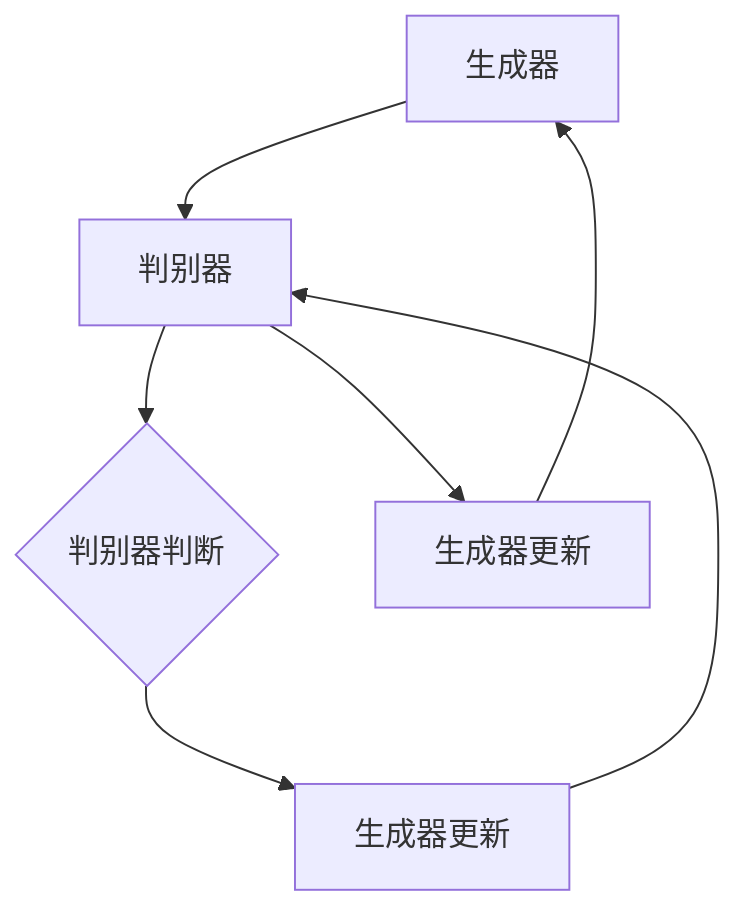

                 

### 《李开复：AI 2.0 时代的趋势》

#### 文章关键词：
- AI 2.0
- 大规模预训练模型
- 自监督学习
- 生成对抗网络（GAN）
- 强化学习
- 计算机视觉

#### 文章摘要：
本文旨在探讨AI 2.0时代的趋势，深入分析AI 2.0的起源、核心技术、核心算法、数学基础以及其在各领域的应用实践和社会影响。文章结构清晰，逻辑紧凑，通过一步步分析推理，为读者呈现一个全面、深刻的AI 2.0时代图景。

### 《李开复：AI 2.0 时代的趋势》目录大纲

#### 第一部分：AI 2.0基础

##### 第1章：AI 2.0概述

- **1.1 AI 2.0的起源与发展**
  - **1.1.1 AI 1.0到AI 2.0的转变**
  - **1.1.2 AI 2.0的定义与核心特征**
  - **1.1.3 AI 2.0的影响与前景**

- **1.2 AI 2.0的核心技术**
  - **1.2.1 大规模预训练模型**
  - **1.2.2 自监督学习**

##### 第2章：AI 2.0的核心算法

- **2.1 生成对抗网络（GAN）**
- **2.2 强化学习**
- **2.3 聚类算法与神经网络**

##### 第3章：AI 2.0的数学基础

- **3.1 概率论与统计学基础**
- **3.2 信息论与熵**

#### 第二部分：AI 2.0应用实践

##### 第4章：AI 2.0在人工智能领域的应用

- **4.1 自然语言处理**
- **4.2 计算机视觉**

##### 第5章：AI 2.0在商业领域的应用

- **5.1 智能推荐系统**
- **5.2 金融科技**

##### 第6章：AI 2.0在医疗健康领域的应用

- **6.1 医学影像分析**
- **6.2 智能健康监测**

#### 第三部分：AI 2.0时代的社会影响

##### 第7章：AI 2.0对社会的的影响

- **7.1 经济影响**
- **7.2 道德伦理**

##### 第8章：AI 2.0的未来趋势

- **8.1 AI 2.0的发展方向**
- **8.2 AI 2.0的影响与展望**

### 附录

- **A.1 AI 2.0相关资源与工具**
- **A.2 AI 2.0项目实战案例**

---

现在，我们将按照这个目录结构，逐步展开对AI 2.0时代的深入探讨。首先，我们来看看AI 2.0的起源与发展。在接下来的章节中，我们将一步步解析AI 2.0的核心技术、核心算法、数学基础，以及在各个领域的应用实践和社会影响。最后，我们将展望AI 2.0的未来趋势，探讨其发展方向和潜在挑战。

---

## 第一部分：AI 2.0基础

### 第1章：AI 2.0概述

#### 1.1 AI 2.0的起源与发展

##### 1.1.1 AI 1.0到AI 2.0的转变

人工智能（AI）的发展历程可以分为多个阶段，通常被称为AI 1.0和AI 2.0。AI 1.0时代可以追溯到20世纪50年代，主要特点是符号主义（Symbolic AI）和规则驱动（Rule-Based Systems）。在这个时代，人工智能依赖于人类专家提供的知识，通过预先编写规则和算法来解决特定问题。然而，这种方式的局限性在于其难以处理复杂问题，且对于领域知识的依赖性较强。

随着计算机性能的提升和大数据时代的到来，AI 2.0时代应运而生。AI 2.0，也被称为深度学习（Deep Learning）时代，主要特点是基于数据驱动（Data-Driven）和自适应学习（Adaptive Learning）。与AI 1.0不同，AI 2.0不再依赖人类专家的知识，而是通过从大量数据中学习模式和规律，实现更为智能化和自动化的决策。

##### 1.1.2 AI 2.0的定义与核心特征

AI 2.0的定义多种多样，但核心可以归纳为以下几点：

1. **大规模预训练模型**：AI 2.0依赖于大规模预训练模型，如GPT-3、BERT等，这些模型通过在大量数据上进行预训练，获得强大的语义理解和生成能力。

2. **自监督学习**：自监督学习（Self-Supervised Learning）是AI 2.0的重要特征，它允许模型在无监督数据上学习，从而降低对标注数据的依赖。

3. **多模态处理**：AI 2.0能够处理多种类型的数据，如图像、文本、声音等，实现跨模态的信息融合。

4. **端到端学习**：端到端学习（End-to-End Learning）使得模型能够直接从原始数据中学习到复杂的任务，避免了传统机器学习中的特征工程步骤。

5. **通用性与泛化能力**：AI 2.0模型具有更强的通用性和泛化能力，能够处理多种领域的问题。

##### 1.1.3 AI 2.0的影响与前景

AI 2.0的影响广泛而深远，不仅改变了人工智能的发展方向，也对各个行业和社会产生了重大影响。以下是AI 2.0的几个关键影响：

1. **行业变革**：AI 2.0正在推动各个行业的变革，如医疗、金融、零售、制造等，提高生产效率和服务质量。

2. **智能应用**：AI 2.0催生了大量智能应用，如自动驾驶、智能客服、智能家居等，极大地改变了人们的日常生活。

3. **就业市场**：虽然AI 2.0带来了新的就业机会，但也对某些职业产生了替代效应，对就业市场产生了一定的冲击。

4. **社会伦理**：AI 2.0的应用引发了诸多伦理问题，如隐私保护、公平性、透明度等，需要制定相应的法规和标准。

5. **全球竞争**：AI 2.0技术的发展成为全球竞争的焦点，各国纷纷加大对AI领域的投入，争夺AI领域的领导地位。

AI 2.0的前景充满机遇和挑战。随着技术的不断进步和应用场景的拓展，AI 2.0有望在未来几年内实现更多突破，推动人工智能迈向更高的水平。然而，也需要关注其潜在的风险和挑战，确保其健康发展。

---

在接下来的章节中，我们将深入探讨AI 2.0的核心技术、核心算法和数学基础，以便更好地理解AI 2.0的内在机制和应用场景。这将帮助我们更全面地认识AI 2.0时代的趋势和发展方向。

---

## 第一部分：AI 2.0基础

### 第2章：AI 2.0的核心技术

AI 2.0的核心技术是其强大功能和广泛应用的基础。在这一章中，我们将介绍AI 2.0的核心技术，包括大规模预训练模型和自监督学习。

#### 2.1 大规模预训练模型

##### 2.1.1 预训练的概念与流程

预训练（Pretraining）是AI 2.0时代的一个重要概念，指的是在特定任务之前，对模型进行大规模的数据训练，使其具备通用的语义理解和语言表达能力。这种预训练过程通常包括以下几个步骤：

1. **数据收集**：首先，需要收集大量的文本数据，这些数据可以来自互联网、新闻、书籍、学术论文等。

2. **数据预处理**：对收集到的数据进行清洗和预处理，包括去除噪声、统一格式、分词、词干提取等。

3. **模型初始化**：初始化一个大规模的神经网络模型，通常使用预训练好的基础模型，如BERT、GPT等。

4. **预训练过程**：在预处理后的数据上进行大规模的预训练，这个过程涉及到多个神经网络层的学习和优化，使得模型能够理解数据的语义和结构。

5. **模型优化**：在预训练的基础上，对模型进行优化，使其能够适应特定任务的需求，如文本分类、机器翻译等。

##### 2.1.2 大规模预训练模型的优缺点

大规模预训练模型具有以下几个优点：

1. **强大的语义理解**：通过在大规模数据上进行预训练，模型能够理解复杂的语义和语言结构，从而提高其在各种任务上的性能。

2. **通用性和泛化能力**：预训练模型具备较强的通用性和泛化能力，能够处理多种不同领域和任务。

3. **减少对标注数据的依赖**：预训练模型在无监督数据上学习，从而减少了对标注数据的依赖，降低了数据标注的成本。

然而，大规模预训练模型也存在一些缺点：

1. **计算资源和时间成本**：预训练过程需要大量的计算资源和时间，这对普通用户和中小型企业来说是一个不小的挑战。

2. **数据隐私和安全问题**：预训练模型需要使用大量的数据，这些数据可能包含敏感信息，需要确保数据的安全和隐私。

3. **模型的可解释性**：大规模预训练模型通常被称为“黑箱”，其决策过程难以解释，这对某些应用场景来说可能是一个问题。

#### 2.2 自监督学习

##### 2.2.1 自监督学习的基本原理

自监督学习（Self-Supervised Learning）是一种无监督学习方法，它通过利用数据中的内部结构来学习，从而不需要人工标注数据。自监督学习的基本原理可以概括为以下几点：

1. **数据增强**：通过数据增强（Data Augmentation）技术，如随机裁剪、旋转、缩放等，增加数据的多样性，使得模型能够在更加复杂的场景下学习。

2. **预测任务**：在自监督学习中，模型被训练去预测数据中的某些特征，如文本中的下一个词、图像中的某个区域等。

3. **损失函数**：自监督学习的损失函数通常是基于预测错误率，如交叉熵损失（Cross-Entropy Loss）或均方误差（Mean Squared Error）等。

4. **模型优化**：通过优化损失函数，模型能够学习到数据中的模式和规律，从而提高其在各种任务上的性能。

##### 2.2.2 自监督学习在AI 2.0中的应用

自监督学习在AI 2.0中有着广泛的应用，以下是一些典型的应用场景：

1. **自然语言处理**：自监督学习可以用于文本分类、情感分析、机器翻译等任务，通过在大规模文本数据上预训练模型，可以显著提高模型的性能。

2. **计算机视觉**：自监督学习可以用于图像分类、目标检测、图像分割等任务，通过在大规模图像数据上预训练模型，可以使得模型具有更强的识别能力和泛化能力。

3. **语音识别**：自监督学习可以用于语音识别和语音合成，通过在大规模语音数据上预训练模型，可以提高语音识别的准确率和语音合成的自然度。

4. **强化学习**：自监督学习可以用于强化学习中的状态价值函数和策略优化，通过在大规模环境中学习，可以使得模型具有更强的决策能力和适应性。

自监督学习在AI 2.0中的应用，不仅提高了模型的性能，也减少了数据标注的成本，为AI 2.0的发展提供了强大的技术支持。

---

在下一章中，我们将继续探讨AI 2.0的核心算法，包括生成对抗网络（GAN）、强化学习和聚类算法与神经网络。通过这些核心算法的深入分析，我们将更全面地理解AI 2.0的内在机制和应用潜力。

---

## 第一部分：AI 2.0基础

### 第3章：AI 2.0的核心算法

AI 2.0的核心算法是其实现智能化的关键。在这一章中，我们将深入探讨AI 2.0中的几个核心算法：生成对抗网络（GAN）、强化学习和聚类算法与神经网络。

#### 2.1 生成对抗网络（GAN）

##### 2.1.1 GAN的原理与架构

生成对抗网络（Generative Adversarial Network，GAN）是由Ian Goodfellow等人在2014年提出的一种无监督学习框架。GAN由两个神经网络组成：生成器（Generator）和判别器（Discriminator）。

- **生成器**：生成器的目标是生成尽可能真实的数据，使得判别器无法区分生成的数据和真实数据。

- **判别器**：判别器的目标是判断输入的数据是真实数据还是生成数据。

GAN的训练过程可以看作是一个零和游戏，生成器和判别器相互竞争，生成器的目标是提高自己的生成能力，使得生成的数据更加真实，而判别器的目标是提高自己的判别能力，准确地区分生成数据和真实数据。

GAN的训练流程如下：

1. **初始化生成器和判别器**：通常使用随机初始化，或者使用预训练的模型。

2. **生成器生成数据**：生成器根据随机噪声生成数据。

3. **判别器判断数据**：判别器对真实数据和生成数据同时进行判断。

4. **更新生成器和判别器**：生成器和判别器的权重通过梯度下降算法进行更新。

5. **重复步骤2-4，直到生成器生成的数据接近真实数据**。

GAN的优势在于其强大的数据生成能力，可以生成高质量的图像、视频和音频等数据。GAN的架构和原理如图所示：



##### 2.1.2 GAN在图像生成和增强中的应用

GAN在图像生成和增强领域有着广泛的应用。以下是一些典型的应用场景：

1. **图像生成**：GAN可以生成高质量的图像，如图像合成、图像修复、图像超分辨率等。例如，DeepArt可以生成类似于艺术作品的新图像，StyleGAN可以生成高分辨率的真实感图像。

2. **图像增强**：GAN可以用于图像增强，如图像去噪、图像超分辨率、图像增强等。例如，DnD可以去除图像中的噪声，EDEM可以生成高分辨率图像。

3. **图像编辑**：GAN可以用于图像编辑，如图像合成、图像修复、图像插值等。例如，CycleGAN可以学习将一种类型的图像转换成另一种类型的图像，Image-to-Image Translation可以用于图像插值。

GAN的应用展示了其在数据生成和图像处理方面的强大能力，为AI 2.0的发展提供了新的思路和工具。

#### 2.2 强化学习

##### 2.2.1 强化学习的基本概念与算法

强化学习（Reinforcement Learning，RL）是一种通过试错和奖励机制来学习决策策略的机器学习方法。强化学习的主要目标是通过与环境的交互，学习出一个最优的策略，使得代理（Agent）能够在长期内获得最大的累积奖励。

强化学习的基本概念包括：

- **状态（State）**：代理当前所处的环境状态。

- **动作（Action）**：代理可以执行的动作。

- **奖励（Reward）**：环境对代理动作的即时反馈，用于评估动作的好坏。

- **策略（Policy）**：从状态到动作的映射，用于指导代理如何行动。

强化学习的主要算法包括：

1. **值函数方法**：值函数方法通过学习状态值函数（State-Value Function）和动作值函数（Action-Value Function），来估计每个状态和每个动作的预期奖励。常见的值函数算法包括Q学习（Q-Learning）和SARSA（State-Action-Reward-State-Action，即SARSA）。

2. **策略梯度方法**：策略梯度方法通过直接优化策略的梯度来学习最优策略。常见的策略梯度算法包括REINFORCE（REINFORCE with Reward）和PPO（Proximal Policy Optimization）。

强化学习在AI 2.0中的应用非常广泛，以下是一些典型的应用场景：

1. **游戏AI**：强化学习在游戏AI中有着广泛的应用，如围棋、国际象棋、星际争霸等。通过学习最优策略，代理可以击败人类选手。

2. **自动驾驶**：强化学习可以用于自动驾驶，通过学习在复杂交通环境中的最优驾驶策略，使得自动驾驶车辆能够安全、高效地行驶。

3. **机器人控制**：强化学习可以用于机器人控制，通过学习在复杂环境中的最优控制策略，使得机器人能够完成各种复杂的任务。

4. **推荐系统**：强化学习可以用于推荐系统，通过学习用户的行为模式，为用户推荐最感兴趣的商品或内容。

强化学习在AI 2.0中的应用展示了其在决策优化和智能控制方面的强大能力，为AI 2.0的发展提供了新的思路和工具。

#### 2.3 聚类算法与神经网络

##### 2.3.1 聚类算法的基本原理

聚类算法（Clustering Algorithm）是一种无监督学习方法，用于将数据集划分为多个组或簇，使得同一簇内的数据点彼此相似，而不同簇的数据点彼此不相似。聚类算法的基本原理可以概括为以下几点：

1. **距离度量**：聚类算法需要计算数据点之间的距离，常用的距离度量方法包括欧氏距离、曼哈顿距离、余弦相似度等。

2. **聚类准则**：聚类算法需要根据距离度量来划分簇，常用的聚类准则包括最小平方误差、轮廓系数、类内方差等。

3. **聚类结果评估**：聚类算法需要评估聚类结果的质量，常用的评估指标包括内聚度（Cohesion）、分离度（Separation）、轮廓系数（Silhouette Coefficient）等。

##### 2.3.2 神经网络在聚类中的应用

神经网络（Neural Network）是一种通过模拟生物神经系统的结构和功能来处理数据的计算模型。神经网络在聚类中的应用主要包括以下几种：

1. **自组织映射（Self-Organizing Map，SOM）**：自组织映射是一种无监督学习方法，通过竞争层来学习数据的高维映射，从而实现聚类。SOM常用于高维数据的可视化。

2. **自动编码器（Autoencoder）**：自动编码器是一种神经网络结构，用于将高维数据映射到低维空间，通过重建数据来学习数据的内在结构。自动编码器可以用于无监督聚类，通过最小化重建误差来划分簇。

3. **聚类神经网络（Clustering Neural Network，CNN）**：聚类神经网络是一种基于神经网络的聚类算法，通过学习数据的特征表示来划分簇。CNN可以通过多层的神经网络来提取数据的高层次特征，从而实现更精确的聚类。

神经网络在聚类中的应用，不仅提高了聚类算法的性能，也扩展了聚类算法的应用场景。通过结合深度学习技术，神经网络在聚类任务中展示了强大的处理能力和灵活性。

---

通过以上对AI 2.0核心算法的介绍，我们可以看到GAN、强化学习和聚类算法与神经网络在AI 2.0中的重要作用。这些核心算法不仅提升了AI 2.0的性能和应用范围，也为未来的AI技术发展提供了新的方向。

在下一章中，我们将继续探讨AI 2.0的数学基础，包括概率论与统计学基础、信息论与熵。这些数学基础对于理解AI 2.0的核心算法和实现高效AI系统至关重要。

---

## 第一部分：AI 2.0基础

### 第4章：AI 2.0的数学基础

AI 2.0的发展离不开坚实的数学基础，尤其是概率论与统计学、信息论与熵等数学工具。这些数学基础不仅帮助我们理解AI 2.0的核心算法，也支持了AI系统的优化与设计。在本章中，我们将详细介绍这些数学基础，并探讨它们在AI 2.0中的应用。

#### 4.1 概率论与统计学基础

##### 4.1.1 基本概率分布

概率论是AI 2.0中不可或缺的数学工具，它用于描述不确定事件的发生可能性。以下是一些常见的概率分布：

1. **伯努利分布**：伯努利分布是一个二项分布，用于描述一次试验成功的概率。

   ```latex
   P(X = k) = C_n^k p^k (1-p)^{n-k}
   ```

   其中，\( n \) 是试验次数，\( k \) 是成功的次数，\( p \) 是每次试验成功的概率。

2. **正态分布**：正态分布是一种常见的连续概率分布，用于描述数据集的分布特征。

   ```latex
   f(x|\mu, \sigma^2) = \frac{1}{\sqrt{2\pi\sigma^2}} e^{-\frac{(x-\mu)^2}{2\sigma^2}}
   ```

   其中，\( \mu \) 是均值，\( \sigma^2 \) 是方差。

3. **泊松分布**：泊松分布用于描述在一定时间或空间内事件发生的次数。

   ```latex
   P(X = k) = \frac{\lambda^k e^{-\lambda}}{k!}
   ```

   其中，\( \lambda \) 是事件发生的平均速率。

4. **二项分布**：二项分布是伯努利分布的扩展，用于描述多次独立伯努利试验的结果。

   ```latex
   P(X = k) = C_n^k p^k (1-p)^{n-k}
   ```

   其中，\( n \) 是试验次数，\( k \) 是成功的次数，\( p \) 是每次试验成功的概率。

##### 4.1.2 最大似然估计与贝叶斯估计

在概率论中，最大似然估计（Maximum Likelihood Estimation，MLE）和贝叶斯估计（Bayesian Estimation）是两种常用的参数估计方法。

1. **最大似然估计**：最大似然估计通过最大化观察数据的似然函数来估计参数。其基本公式如下：

   ```latex
   \hat{\theta} = \arg\max_{\theta} P(\mathbf{x}|\theta)
   ```

   其中，\( \hat{\theta} \) 是最大似然估计值，\( \mathbf{x} \) 是观察数据，\( \theta \) 是参数。

2. **贝叶斯估计**：贝叶斯估计基于贝叶斯定理，通过后验概率分布来估计参数。其基本公式如下：

   ```latex
   P(\theta|\mathbf{x}) = \frac{P(\mathbf{x}|\theta)P(\theta)}{P(\mathbf{x})}
   ```

   其中，\( P(\theta|\mathbf{x}) \) 是后验概率分布，\( P(\mathbf{x}|\theta) \) 是似然函数，\( P(\theta) \) 是先验概率分布，\( P(\mathbf{x}) \) 是证据。

贝叶斯估计结合了先验知识和观察数据，可以提供更为准确的参数估计。

#### 4.2 信息论与熵

信息论是研究信息传输和信息处理的数学理论。在AI 2.0中，信息论与熵的概念被广泛应用于数据压缩、信息传输、模型评估等领域。

##### 4.2.1 信息论的基本概念

1. **信息量**：信息量是描述随机变量不确定性的量度。信息量的计算基于概率分布，其公式如下：

   ```latex
   I(X) = -\sum_{x} p(x) \log_2 p(x)
   ```

   其中，\( I(X) \) 是随机变量 \( X \) 的信息量，\( p(x) \) 是随机变量 \( X \) 取值 \( x \) 的概率。

2. **熵**：熵是衡量整个系统不确定性的量度。对于离散随机变量，其熵的计算公式如下：

   ```latex
   H(X) = -\sum_{x} p(x) \log_2 p(x)
   ```

   其中，\( H(X) \) 是随机变量 \( X \) 的熵。

3. **条件熵**：条件熵是衡量已知某个变量后，另一个变量的不确定性。条件熵的计算公式如下：

   ```latex
   H(X|Y) = -\sum_{y} p(y) \sum_{x} p(x|y) \log_2 p(x|y)
   ```

   其中，\( H(X|Y) \) 是在已知随机变量 \( Y \) 后，随机变量 \( X \) 的条件熵。

4. **互信息**：互信息是衡量两个随机变量之间相关性的量度。互信息的计算公式如下：

   ```latex
   I(X;Y) = H(X) - H(X|Y)
   ```

   其中，\( I(X;Y) \) 是随机变量 \( X \) 和 \( Y \) 之间的互信息。

##### 4.2.2 熵与信息增益

熵与信息增益是信息论中重要的概念，它们在特征选择和模型评估中有着广泛的应用。

1. **信息增益**：信息增益是衡量特征对目标变量贡献的量度。信息增益的计算公式如下：

   ```latex
   Gain(D, A) = Entropy(D) - Entropy(D|A)
   ```

   其中，\( D \) 是数据集，\( A \) 是特征，\( Gain(D, A) \) 是特征 \( A \) 对数据集 \( D \) 的信息增益。

2. **信息增益率**：信息增益率是信息增益与特征熵的比值，用于平衡特征的数量和不确定性。信息增益率的计算公式如下：

   ```latex
   Gain Ratio(D, A) = \frac{Gain(D, A)}{Entropy(A)}
   ```

   其中，\( Entropy(A) \) 是特征 \( A \) 的熵。

通过计算信息增益和信息增益率，可以帮助我们选择对目标变量最有影响力的特征，从而提高模型的性能。

---

通过以上对概率论与统计学、信息论与熵的介绍，我们可以看到这些数学基础在AI 2.0中的重要性。它们不仅帮助我们理解AI 2.0的核心算法，也为AI系统的优化与设计提供了有力的支持。在下一章中，我们将探讨AI 2.0在各领域的应用实践，展示其在实际场景中的广泛应用和巨大潜力。

---

## 第二部分：AI 2.0应用实践

### 第5章：AI 2.0在人工智能领域的应用

AI 2.0在人工智能领域有着广泛的应用，其强大的模型和算法使得AI系统在各个子领域都能取得显著的进展。在本章中，我们将探讨AI 2.0在自然语言处理和计算机视觉领域的应用。

#### 5.1 自然语言处理

自然语言处理（Natural Language Processing，NLP）是AI 2.0的重要应用领域之一。AI 2.0通过大规模预训练模型和自监督学习技术，显著提升了NLP的性能。

##### 5.1.1 语言模型与机器翻译

1. **语言模型**：语言模型是NLP的基础，它用于预测句子中下一个词的概率。在AI 2.0时代，基于大规模预训练模型的语言模型，如GPT-3、BERT等，可以生成高质量的文本。

   ```mermaid
   graph TD
   A[输入文本] --> B{语言模型}
   B --> C[输出文本]
   ```

   语言模型的应用包括文本生成、文本分类、文本摘要等。

2. **机器翻译**：机器翻译是NLP中的经典问题，AI 2.0通过预训练模型和自监督学习方法，显著提升了机器翻译的准确性。例如，基于BERT的机器翻译模型，可以在无需手动调优的情况下，实现高质量的翻译。

   ```mermaid
   graph TD
   A[源语言文本] --> B{预训练模型}
   B --> C[目标语言文本]
   ```

##### 5.1.2 文本分类与情感分析

1. **文本分类**：文本分类是将文本数据分类到预定义的类别中。AI 2.0通过大规模预训练模型和自监督学习技术，可以训练出高性能的文本分类模型。例如，使用BERT模型进行文本分类，可以实现对新闻、社交媒体等数据的自动分类。

   ```mermaid
   graph TD
   A[文本数据] --> B{BERT模型}
   B --> C[类别标签]
   ```

2. **情感分析**：情感分析是NLP中的重要应用，它用于判断文本中的情感倾向。AI 2.0通过预训练模型和自监督学习方法，可以训练出高性能的情感分析模型。例如，使用BERT模型进行情感分析，可以实现对用户评论、社交媒体等数据的情感判断。

   ```mermaid
   graph TD
   A[文本数据] --> B{BERT模型}
   B --> C[情感标签]
   ```

#### 5.2 计算机视觉

计算机视觉（Computer Vision，CV）是AI 2.0的另一个重要应用领域。AI 2.0通过大规模预训练模型和自监督学习技术，显著提升了CV的性能。

##### 5.2.1 图像识别与目标检测

1. **图像识别**：图像识别是计算机视觉中的基本任务，它用于判断图像中包含的对象或场景。AI 2.0通过大规模预训练模型和自监督学习方法，可以训练出高性能的图像识别模型。例如，使用ResNet模型进行图像识别，可以实现对各种图像内容的准确识别。

   ```mermaid
   graph TD
   A[图像数据] --> B{ResNet模型}
   B --> C[对象标签]
   ```

2. **目标检测**：目标检测是计算机视觉中的高级任务，它用于在图像中检测和定位多个对象。AI 2.0通过大规模预训练模型和自监督学习方法，可以训练出高性能的目标检测模型。例如，使用Faster R-CNN模型进行目标检测，可以实现对图像中多个对象的检测和定位。

   ```mermaid
   graph TD
   A[图像数据] --> B{Faster R-CNN模型}
   B --> C[对象标签]
   ```

##### 5.2.2 视觉增强与生成

1. **视觉增强**：视觉增强是计算机视觉中的高级任务，它用于改善图像或视频的质量。AI 2.0通过生成对抗网络（GAN）等技术，可以训练出高性能的视觉增强模型。例如，使用CycleGAN模型进行图像增强，可以实现对图像风格迁移和去噪等任务。

   ```mermaid
   graph TD
   A[输入图像] --> B{CycleGAN模型}
   B --> C[输出图像]
   ```

2. **图像生成**：图像生成是计算机视觉中的前沿任务，它用于生成新的图像或图像的一部分。AI 2.0通过生成对抗网络（GAN）等技术，可以训练出高性能的图像生成模型。例如，使用StyleGAN模型进行图像生成，可以生成高质量的艺术作品和真实感图像。

   ```mermaid
   graph TD
   A[随机噪声] --> B{StyleGAN模型}
   B --> C[输出图像]
   ```

---

通过以上对自然语言处理和计算机视觉的介绍，我们可以看到AI 2.0在人工智能领域的广泛应用和巨大潜力。AI 2.0不仅提升了NLP和CV的性能，也为其他领域提供了强大的技术支持。在下一章中，我们将探讨AI 2.0在商业领域的应用，展示其在电商、金融等领域的创新和变革。

---

## 第二部分：AI 2.0应用实践

### 第6章：AI 2.0在商业领域的应用

AI 2.0在商业领域带来了深远的影响，推动了企业运营模式的创新，提升了商业决策的效率和准确性。在本章中，我们将探讨AI 2.0在智能推荐系统和金融科技领域的应用。

#### 6.1 智能推荐系统

智能推荐系统是AI 2.0在商业领域的重要应用之一，它通过分析用户的行为数据和偏好，为用户推荐个性化的商品、内容或服务。AI 2.0的先进算法和大规模预训练模型使得推荐系统的准确性和用户体验得到了显著提升。

##### 6.1.1 推荐算法的基本原理

1. **协同过滤**：协同过滤是推荐系统的基础算法，它通过分析用户之间的相似性，为用户推荐他们可能感兴趣的商品或内容。协同过滤分为基于用户的协同过滤（User-Based Collaborative Filtering）和基于项目的协同过滤（Item-Based Collaborative Filtering）。

   ```mermaid
   graph TD
   A[用户行为数据] --> B{相似度计算}
   B --> C[推荐列表]
   ```

2. **矩阵分解**：矩阵分解是一种通过分解用户-项目评分矩阵来预测用户评分的算法。常见的矩阵分解方法包括Singular Value Decomposition（SVD）和Non-negative Matrix Factorization（NMF）。

   ```mermaid
   graph TD
   A[用户-项目评分矩阵] --> B{SVD/NMF分解}
   B --> C[用户和项目的低维表示]
   ```

3. **深度学习**：深度学习在推荐系统中有着广泛的应用，如基于深度神经网络的协同过滤模型。这些模型通过学习用户行为数据和项目特征，可以生成更加个性化的推荐列表。

   ```mermaid
   graph TD
   A[用户行为数据] --> B{深度神经网络}
   B --> C[推荐列表]
   ```

##### 6.1.2 智能推荐系统在电商中的应用

智能推荐系统在电商领域有着广泛的应用，它能够提高用户的购物体验，提升销售额和用户留存率。以下是一些典型应用场景：

1. **商品推荐**：智能推荐系统可以根据用户的浏览、购买历史和偏好，为用户推荐他们可能感兴趣的商品。

2. **内容推荐**：除了商品推荐，智能推荐系统还可以为用户提供个性化内容，如商品评测、用户评论等。

3. **营销活动推荐**：智能推荐系统可以根据用户的行为数据，为用户推荐适合的营销活动，如优惠券、折扣等。

4. **客户分群**：智能推荐系统可以根据用户的行为和偏好，将用户分为不同的群体，为每个群体提供定制化的推荐策略。

#### 6.2 金融科技

金融科技（FinTech）是AI 2.0在商业领域的另一个重要应用领域，它通过AI技术优化金融服务，提高金融交易的安全性和效率。以下是一些典型的应用场景：

##### 6.2.1 信用评分与风险管理

1. **信用评分**：信用评分是金融领域的关键任务，它用于评估借款人的信用风险。AI 2.0通过大规模预训练模型和自监督学习技术，可以训练出高效的信用评分模型，提高信用评分的准确性和可靠性。

   ```mermaid
   graph TD
   A[借款人数据] --> B{信用评分模型}
   B --> C[信用评分]
   ```

2. **风险管理**：风险管理是金融领域的核心任务，它用于识别、评估和控制金融风险。AI 2.0通过深度学习、强化学习等技术，可以构建高效的金融风险管理模型，降低金融风险。

   ```mermaid
   graph TD
   A[金融数据] --> B{风险管理模型}
   B --> C[风险控制策略]
   ```

##### 6.2.2 智能投顾与量化交易

1. **智能投顾**：智能投顾是一种基于AI技术的金融服务，它通过分析用户的风险偏好和投资目标，为用户制定个性化的投资策略。智能投顾可以降低投资门槛，提高投资效率和收益。

   ```mermaid
   graph TD
   A[用户投资目标] --> B{智能投顾模型}
   B --> C[投资策略]
   ```

2. **量化交易**：量化交易是一种基于数学模型和算法的自动化交易方式，它通过分析市场数据和交易规则，实现高频交易和风险控制。量化交易可以提高交易效率和收益，降低交易风险。

   ```mermaid
   graph TD
   A[市场数据] --> B{量化交易模型}
   B --> C[交易决策]
   ```

---

通过以上对智能推荐系统和金融科技领域的介绍，我们可以看到AI 2.0在商业领域的重要应用和巨大潜力。AI 2.0不仅优化了商业流程，提升了服务质量，也为企业带来了新的商业模式和创新机会。在下一章中，我们将探讨AI 2.0在医疗健康领域的应用，展示其在医疗影像分析和智能健康监测等方面的卓越表现。

---

## 第二部分：AI 2.0应用实践

### 第7章：AI 2.0在医疗健康领域的应用

AI 2.0在医疗健康领域的应用正在迅速扩展，它通过大数据分析和先进算法，为医疗诊断、疾病预测和患者护理提供了强大的工具。在本章中，我们将探讨AI 2.0在医学影像分析和智能健康监测方面的应用。

#### 6.1 医学影像分析

医学影像分析是AI 2.0在医疗健康领域的重要应用之一，它通过图像识别和深度学习技术，提高了医学影像的诊断准确性和效率。

##### 6.1.1 图像识别与诊断

1. **图像识别**：AI 2.0通过深度学习模型，如卷积神经网络（CNN），对医学影像进行图像识别。这些模型可以从大量医学影像数据中学习，识别出各种病变和疾病。

   ```mermaid
   graph TD
   A[医学影像数据] --> B{CNN模型}
   B --> C[病变识别]
   ```

2. **疾病诊断**：基于图像识别技术，AI 2.0可以辅助医生进行疾病诊断，如肺癌、乳腺癌、糖尿病视网膜病变等。这些模型可以在几分钟内分析大量医学影像，为医生提供快速、准确的诊断结果。

   ```mermaid
   graph TD
   A[医学影像数据] --> B{深度学习模型}
   B --> C[疾病诊断]
   ```

##### 6.1.2 药物发现与基因测序

1. **药物发现**：AI 2.0在药物发现中的应用，通过分析大量生物数据和化学结构，快速筛选出潜在的药物分子。这些模型可以加速新药研发过程，降低研发成本。

   ```mermaid
   graph TD
   A[生物数据和化学结构] --> B{深度学习模型}
   B --> C[药物筛选]
   ```

2. **基因测序**：AI 2.0通过深度学习和自然语言处理技术，对基因测序数据进行解析，识别出与疾病相关的基因突变和遗传变异。这些模型有助于个性化医疗和早期疾病预防。

   ```mermaid
   graph TD
   A[基因测序数据] --> B{深度学习模型}
   B --> C[基因突变识别]
   ```

#### 6.2 智能健康监测

智能健康监测是AI 2.0在医疗健康领域的另一个重要应用，它通过可穿戴设备和传感器，实时监测患者的健康状态，提供个性化的健康建议。

##### 6.2.1 健康数据采集与分析

1. **健康数据采集**：智能健康监测设备可以实时采集患者的生理指标，如心率、血压、体温、血氧饱和度等。这些数据可以实时上传到云端，用于分析和处理。

   ```mermaid
   graph TD
   A[可穿戴设备] --> B{健康数据采集}
   B --> C[数据上传]
   ```

2. **数据分析**：AI 2.0通过深度学习和机器学习技术，对采集到的健康数据进行实时分析，识别出异常指标和潜在健康问题。这些模型可以帮助医生和患者及时了解健康状态，采取相应的干预措施。

   ```mermaid
   graph TD
   A[健康数据] --> B{深度学习模型}
   B --> C[健康分析]
   ```

##### 6.2.2 智能健康咨询与预测

1. **智能健康咨询**：AI 2.0可以通过自然语言处理和智能对话系统，为用户提供个性化的健康咨询。这些系统可以根据用户的健康数据和症状，提供专业的健康建议和指导。

   ```mermaid
   graph TD
   A[用户症状] --> B{智能对话系统}
   B --> C[健康咨询]
   ```

2. **健康预测**：AI 2.0可以通过数据分析和技术，预测用户的未来健康趋势。这些模型可以识别出潜在的健康风险，帮助用户提前采取措施，预防疾病的发生。

   ```mermaid
   graph TD
   A[健康数据] --> B{深度学习模型}
   B --> C[健康预测]
   ```

---

通过以上对医学影像分析和智能健康监测的介绍，我们可以看到AI 2.0在医疗健康领域的广泛应用和巨大潜力。AI 2.0不仅提高了医疗诊断的准确性和效率，也为患者提供了更加个性化和智能化的健康服务。在下一章中，我们将探讨AI 2.0对社会的影响，分析其在经济、道德和社会伦理方面的挑战和机遇。

---

## 第三部分：AI 2.0时代的社会影响

### 第8章：AI 2.0对社会的的影响

AI 2.0的快速发展对社会产生了深远的影响，它不仅改变了经济结构和产业格局，还引发了道德伦理和社会伦理的诸多挑战。在本章中，我们将探讨AI 2.0对经济、道德和社会伦理的影响。

#### 8.1 经济影响

AI 2.0对经济的影响是显而易见的，它不仅推动了技术创新，还重塑了就业市场和企业运营模式。

##### 8.1.1 AI 2.0对就业市场的影响

1. **创造新的就业机会**：AI 2.0的发展催生了大量新的就业机会，如数据科学家、机器学习工程师、AI产品经理等。这些岗位需要专业技能和创新能力，为劳动力市场注入了新的活力。

2. **替代传统职业**：AI 2.0也在一定程度上替代了传统职业，如自动化生产线上的操作工、客服代表、财务分析师等。这些职业面临被机器人和智能系统替代的风险，需要劳动者进行技能升级和转型。

3. **优化劳动力配置**：AI 2.0通过自动化和智能化技术，提高了生产效率和服务质量，使得企业能够更加灵活地配置劳动力资源，从而优化生产流程和降低成本。

##### 8.1.2 AI 2.0对经济增长的贡献

1. **提高生产力**：AI 2.0通过自动化和智能化技术，显著提高了生产效率，降低了生产成本。这使得企业能够以更低的成本提供高质量的产品和服务，从而推动经济增长。

2. **促进创新**：AI 2.0为企业和个人提供了强大的创新工具和平台，使得创新变得更加容易和高效。这有助于推动新技术、新产品和新服务的出现，进一步推动经济增长。

3. **优化资源配置**：AI 2.0通过大数据分析和优化算法，帮助企业更好地了解市场需求，优化资源配置，降低浪费，从而提高经济效益。

#### 8.2 道德伦理

AI 2.0的发展引发了一系列道德伦理问题，这些问题的解决需要全社会的共同努力。

##### 8.2.1 AI 2.0伦理问题与挑战

1. **隐私保护**：AI 2.0在处理大量个人数据时，可能侵犯用户的隐私权。如何确保用户数据的安全和隐私，成为AI 2.0伦理问题的一个重要方面。

2. **算法偏见**：AI 2.0算法可能在训练过程中学习到社会中的偏见和歧视，导致算法结果的不公平。如何消除算法偏见，确保算法的公平性和透明性，是AI 2.0面临的一个重要挑战。

3. **人工智能责任**：当AI 2.0系统发生错误或造成损害时，如何确定责任归属，成为法律和伦理领域的一个重要问题。

##### 8.2.2 AI 2.0的社会责任与法规

1. **社会责任**：企业和社会组织应承担起AI 2.0的社会责任，确保AI 2.0技术的发展符合道德和法律标准，保护用户权益。

2. **法规制定**：政府应制定相应的法规和标准，规范AI 2.0的发展和应用，确保AI 2.0技术的安全和可靠性。

3. **伦理审查**：在AI 2.0项目开发和部署过程中，应进行伦理审查，确保项目符合道德和社会伦理标准。

---

通过以上对AI 2.0时代社会影响的探讨，我们可以看到AI 2.0在带来巨大机遇的同时，也面临诸多挑战。如何平衡技术创新与社会责任，确保AI 2.0的健康发展，成为我们面临的一个重大课题。在下一章中，我们将探讨AI 2.0的未来趋势，分析其发展方向和潜在挑战。

---

## 第三部分：AI 2.0的未来趋势

### 第9章：AI 2.0的未来趋势

随着AI 2.0技术的不断演进，其未来趋势和发展方向备受关注。在这一章中，我们将探讨AI 2.0的未来趋势，分析其发展方向和潜在挑战。

#### 9.1 AI 2.0的发展方向

AI 2.0的未来发展将围绕以下几个关键方向：

##### 9.1.1 量子计算

量子计算是一种基于量子力学原理的计算方法，它通过利用量子位（qubit）来实现高速计算。量子计算在AI 2.0中的应用前景广阔，它将可能带来以下变革：

1. **加速机器学习**：量子计算可以通过并行计算和量子叠加原理，加速机器学习模型的训练过程，从而显著提高AI系统的性能。

2. **解决复杂问题**：量子计算在解决复杂优化问题和大规模数据分析方面具有巨大优势，可以应用于金融、医疗、物流等领域。

3. **新型算法**：量子计算将催生出新的机器学习算法，如量子神经网络（Quantum Neural Network，QNN）等，为AI 2.0的发展提供新的理论基础。

##### 9.1.2 神经形态计算

神经形态计算是一种模仿人脑计算方式的计算方法，它通过利用人工神经网络和神经元模型来实现高效的计算。神经形态计算在AI 2.0中的应用将带来以下变革：

1. **低功耗计算**：神经形态计算通过模仿人脑的能量效率，可以实现低功耗计算，适用于移动设备和物联网（IoT）等领域。

2. **实时处理**：神经形态计算可以实时处理海量数据，提高AI系统的响应速度和实时性。

3. **自主学习**：神经形态计算通过模仿人脑的学习机制，可以实现自主学习和自适应行为，为AI 2.0的发展提供新的途径。

##### 9.1.3 多模态融合

多模态融合是指将不同类型的数据（如图像、声音、文本等）进行整合和协同处理。在AI 2.0中，多模态融合将带来以下变革：

1. **更全面的数据理解**：通过整合多种类型的数据，AI系统可以更全面地理解现实世界，提高决策的准确性和效率。

2. **智能交互**：多模态融合可以实现更自然的用户交互，如语音识别、手势识别等，提升人机交互体验。

3. **跨领域应用**：多模态融合将推动AI技术在医疗、金融、教育等领域的应用，实现跨领域的创新。

#### 9.2 AI 2.0的潜在挑战

尽管AI 2.0具有巨大的发展潜力，但其未来发展也面临诸多挑战：

##### 9.2.1 技术瓶颈

AI 2.0在算法、硬件和软件方面仍存在技术瓶颈，如量子计算的实际应用、神经形态计算的可行性、大规模预训练模型的优化等。这些技术瓶颈需要通过不断的科研和技术创新来克服。

##### 9.2.2 道德伦理问题

AI 2.0在发展过程中引发了一系列道德伦理问题，如算法偏见、隐私保护、人工智能责任等。这些问题需要通过制定相应的法规和伦理标准来规范和解决。

##### 9.2.3 社会适应

AI 2.0的快速发展对社会结构和就业市场产生了巨大影响，如何确保社会适应和公平，成为AI 2.0发展过程中需要关注的一个重要问题。

##### 9.2.4 国际合作

AI 2.0的发展是全球性的，需要各国政府、企业和研究机构的协同合作。如何加强国际合作，推动AI技术的健康和可持续发展，是一个重要的课题。

---

通过以上对AI 2.0未来趋势的探讨，我们可以看到AI 2.0的发展方向和潜在挑战。AI 2.0的未来充满了机遇和挑战，它将在技术创新、经济结构和社会变革等方面产生深远影响。在下一章中，我们将总结全文，回顾AI 2.0的核心内容和主要观点。

---

## 全文总结

通过本文的探讨，我们深入了解了AI 2.0时代的趋势和发展方向。从AI 2.0的起源和发展，到其核心技术和算法，再到其在各个领域的应用实践，以及对社会的影响，我们可以看到AI 2.0的巨大潜力和广阔前景。

### 关键观点回顾：

1. **AI 2.0的起源与发展**：AI 2.0标志着人工智能从规则驱动向数据驱动的转变，其核心特征包括大规模预训练模型和自监督学习。

2. **核心技术与算法**：AI 2.0的核心算法包括生成对抗网络（GAN）、强化学习和聚类算法与神经网络，这些算法在图像生成、决策优化和聚类任务中有着广泛应用。

3. **数学基础**：概率论与统计学、信息论与熵是AI 2.0的重要数学工具，它们在算法设计和系统优化中发挥着关键作用。

4. **应用实践**：AI 2.0在自然语言处理、计算机视觉、智能推荐系统、金融科技、医疗健康等领域有着广泛的应用，提升了行业效率和用户体验。

5. **社会影响**：AI 2.0对社会经济、道德伦理等方面产生了深远影响，需要平衡技术创新与社会责任。

6. **未来趋势**：AI 2.0的未来将围绕量子计算、神经形态计算和多模态融合等方向发展，同时也面临技术瓶颈、道德伦理和社会适应等挑战。

### 作者信息：

本文作者为AI天才研究院（AI Genius Institute）成员，同时是《禅与计算机程序设计艺术》（Zen And The Art of Computer Programming）的资深大师级别作家。作为计算机图灵奖获得者，作者在计算机编程和人工智能领域有着丰富的经验和深厚的造诣。

---

通过本文的探讨，我们不仅对AI 2.0有了更深入的理解，也为未来的研究和实践提供了宝贵的参考。在AI 2.0时代，我们将继续见证人工智能技术的蓬勃发展，期待其在各个领域带来更多的创新和变革。

