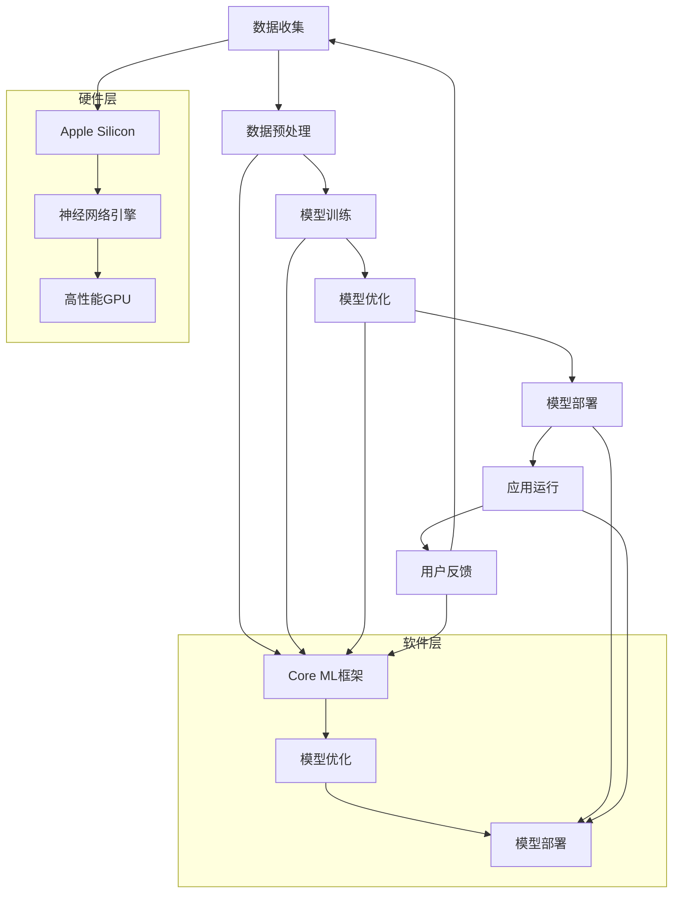

                 

### 第一部分：引言

#### 第1章：AI时代与苹果的变革

##### 1.1 AI时代的背景

人工智能（AI）作为计算机科学的一个分支，其核心目标是使计算机具备类似于人类智能的能力。从20世纪50年代以来，人工智能经历了多个发展阶段，从最初的符号主义、基于规则的系统，到近年来基于数据驱动的机器学习和深度学习。特别是深度学习的崛起，使得AI在语音识别、图像处理、自然语言处理等领域的应用取得了突破性进展。

随着大数据、云计算、物联网等技术的迅猛发展，AI的应用场景日益广泛，从工业生产、交通运输到金融、医疗等各个领域，AI技术正逐步改变我们的生活方式。在这个背景下，各大科技巨头纷纷将AI技术作为核心战略，进行布局和研发。

##### 1.2 苹果与AI的渊源

苹果公司，作为全球科技产业的领军企业，早在20世纪80年代就已经开始关注AI技术。苹果的创始人之一史蒂夫·乔布斯曾在1984年推出麦金塔计算机（Macintosh），该计算机内置了人工智能软件，标志着苹果在AI领域的初步探索。

进入21世纪，苹果进一步加大对AI技术的投入，不仅在硬件上自主研发了Apple Silicon芯片，还在软件层面不断推出基于AI技术的应用。例如，Siri语音助手、图像识别技术、健康监测系统等，都是苹果AI技术的具体应用。

##### 1.3 本书结构与目标

本书旨在深入探讨苹果公司在其产品中应用的人工智能技术，从AI时代的背景、苹果与AI的渊源，到苹果AI应用的核心技术、实例分析以及未来展望。通过系统化的讲解和案例分析，读者可以全面了解苹果AI技术的发展路径和应用现状。

本书分为五个部分：

1. **引言**：介绍AI时代的背景，苹果与AI的渊源，以及本书的结构和目标。
2. **AI应用概述**：概述苹果AI应用的现状、技术架构及其优势与挑战。
3. **核心技术解析**：详细解析苹果AI应用中的核心概念、算法原理以及开发实践。
4. **苹果AI应用实例分析**：分析苹果在语音识别、图像处理、健康医疗等领域的具体应用案例。
5. **未来展望**：探讨苹果AI应用的发展趋势、未来技术的探索以及面临的挑战和机遇。

通过本书的阅读，读者不仅可以了解苹果AI技术的全貌，还可以从中汲取到对自身技术发展的启示。

#### 本文关键词：

- 人工智能
- 苹果
- AI应用
- 技术架构
- 深度学习
- 机器学习

#### 本文摘要：

本书全面解析了苹果公司在人工智能领域的应用与发展。从AI时代的背景和苹果与AI的渊源，到苹果AI应用的核心技术解析、实例分析以及未来展望，本书旨在为读者提供一份系统、全面的技术指南，帮助读者深入了解苹果AI技术的本质和实际应用。

## 第二部分：AI应用概述

### 第2章：苹果AI应用概述

#### 2.1 苹果AI应用的现状

苹果公司的人工智能应用在多个产品线中得到了广泛应用，包括iPhone、iPad、Mac以及Apple Watch等。以下是一些苹果AI应用的现状：

1. **Siri语音助手**：Siri是苹果公司开发的智能语音助手，能够进行语音识别、自然语言处理和任务执行。Siri的智能程度在不断提升，能够回答用户的问题、进行日程管理、控制智能家居设备等。
2. **图像识别技术**：苹果的图像识别技术在摄影应用中得到了广泛应用。例如，Live Photos和动画效果都是基于图像识别技术实现的。此外，FaceTime中的面部识别功能也依赖于强大的图像识别算法。
3. **健康监测系统**：Apple Watch作为苹果在健康领域的核心产品，内置了多种健康监测功能，包括心率监测、运动跟踪、睡眠分析等。这些功能都是基于AI算法实现的。
4. **语音识别与转录**：苹果的语音识别技术在iOS和macOS中得到了广泛应用。用户可以通过语音输入来发送信息、创建提醒、查询天气等。

#### 2.2 苹果AI应用的技术架构

苹果AI应用的技术架构可以分为三个层次：

1. **硬件层**：苹果自主研发的Apple Silicon芯片是苹果AI应用的基础。这些芯片具有强大的计算能力和高效的功耗性能，为AI算法提供了可靠的硬件支持。
2. **软件层**：苹果在软件层开发了多个AI框架和工具，如Core ML、Create ML等。这些框架和工具简化了AI模型的训练和部署过程，使得开发者能够更加便捷地集成AI功能到自己的应用中。
3. **应用层**：在应用层，苹果通过多种AI技术实现了各种功能，如Siri语音助手、图像识别、健康监测等。这些应用都是基于底层硬件和软件框架开发的。

#### 2.3 苹果AI应用的优势与挑战

苹果AI应用具有以下优势：

1. **强大的硬件支持**：苹果的Apple Silicon芯片具有强大的计算能力和高效的功耗性能，为AI算法提供了强大的硬件支持。
2. **丰富的应用场景**：苹果的AI应用覆盖了多个产品线，包括iPhone、iPad、Mac和Apple Watch等，为用户提供了丰富的应用场景。
3. **优秀的用户体验**：苹果注重用户体验，其AI应用在界面设计、交互体验等方面都做得非常出色，深受用户喜爱。

然而，苹果AI应用也面临一些挑战：

1. **数据隐私问题**：AI算法的训练和优化需要大量的数据支持，如何在保护用户隐私的前提下获取和使用数据是一个重要挑战。
2. **技术更新迭代**：AI技术发展迅速，苹果需要不断更新和优化其AI应用，以适应最新的技术趋势。
3. **市场竞争**：随着AI技术的普及，越来越多的企业开始涉足AI领域，苹果需要在激烈的竞争中保持领先地位。

通过对苹果AI应用现状、技术架构和优势与挑战的概述，我们可以更好地理解苹果在人工智能领域的布局和发展。接下来，我们将深入探讨苹果AI应用中的核心技术，以了解其背后的原理和实现。

## 第三部分：核心技术解析

### 第3章：核心概念与联系

人工智能（AI）是一门涉及多个领域交叉的学科，其核心概念和联系对于理解AI技术至关重要。在本章中，我们将详细介绍AI基础概念、Apple Silicon与AI的联系，并使用Mermaid流程图展示AI在苹果设备中的实现。

#### 3.1 AI基础概念

1. **机器学习（Machine Learning）**：机器学习是一种通过数据训练模型，使模型能够从数据中学习并做出预测或决策的技术。它主要分为监督学习、无监督学习和强化学习。
2. **深度学习（Deep Learning）**：深度学习是机器学习的一种子领域，它使用多层神经网络（Neural Networks）来学习数据特征。深度学习在图像识别、自然语言处理等领域取得了显著成就。
3. **神经网络（Neural Networks）**：神经网络是一种模仿生物神经系统的计算模型，由多个神经元（Node）组成。每个神经元接收输入信号，通过加权求和和激活函数产生输出。
4. **卷积神经网络（Convolutional Neural Networks, CNN）**：卷积神经网络是一种专门用于图像识别和处理的深度学习模型。它通过卷积操作和池化操作提取图像特征。
5. **递归神经网络（Recurrent Neural Networks, RNN）**：递归神经网络是一种用于处理序列数据的神经网络模型。它通过在时间步上递归地更新内部状态，从而捕捉序列中的长期依赖关系。

#### 3.2 Apple Silicon与AI

Apple Silicon是苹果公司自主研发的芯片系列，包括M1、M2等。Apple Silicon采用了高性能、低功耗的架构，使得苹果设备在运行AI应用时具有强大的计算能力。

1. **硬件优化**：Apple Silicon在设计时考虑了AI应用的特定需求，如高效的神经网络计算和优化的内存管理。这使得AI算法能够在苹果设备上高效运行。
2. **硬件加速**：Apple Silicon集成了高性能的GPU和神经网络引擎，可以显著加速AI算法的运行。例如，M1芯片内置的16核GPU和8核神经网络引擎使得深度学习任务在苹果设备上能够快速完成。
3. **软硬件协同**：苹果通过软硬件协同设计，将AI算法与硬件特性相结合，实现了更高的性能和能效比。例如，苹果的Core ML框架能够在Apple Silicon上优化模型的执行效率。

#### 3.3 Mermaid流程图：AI在苹果设备中的实现

以下是一个Mermaid流程图，展示了AI在苹果设备中的实现流程：



在这个流程图中，数据收集、数据预处理、模型训练、模型优化、模型部署和应用运行是AI实现的主要环节。Apple Silicon作为硬件层，提供了强大的计算能力，Core ML框架作为软件层，负责模型的训练、优化和部署。

通过上述核心概念与联系的分析，我们可以更好地理解苹果AI应用的技术背景和实现原理。接下来，我们将进一步深入讲解苹果AI应用中的核心算法原理。

### 第4章：核心算法原理讲解

#### 4.1 神经网络基础

神经网络（Neural Networks）是人工智能的核心技术之一，它模仿了生物神经系统的结构和功能。神经网络由多个神经元（Node）组成，每个神经元接收输入信号，通过加权求和和激活函数产生输出。下面我们将详细讲解神经网络的基础概念和原理。

##### 4.1.1 神经元结构

一个基本的神经元结构包括以下几个部分：

1. **输入层（Input Layer）**：输入层接收外部输入信号，每个输入信号都有一个对应的权重（Weight）。
2. **隐藏层（Hidden Layer）**：隐藏层是神经网络的核心部分，多个神经元通过权重连接形成网络结构。每个隐藏层的神经元接收前一层神经元的输出，并计算加权求和。
3. **输出层（Output Layer）**：输出层负责生成最终输出，根据任务的不同，输出可以是分类结果、回归值或其他形式。

##### 4.1.2 加权求和与激活函数

神经元的工作原理是通过加权求和（Weighted Sum）和激活函数（Activation Function）来产生输出。加权求和是指将输入信号乘以对应的权重，然后相加。激活函数则用于对加权求和的结果进行非线性变换，从而引入非线性的特性。

常见的激活函数包括：

1. **sigmoid函数**：\( f(x) = \frac{1}{1 + e^{-x}} \)
2. **ReLU函数**：\( f(x) = \max(0, x) \)
3. **Tanh函数**：\( f(x) = \frac{e^x - e^{-x}}{e^x + e^{-x}} \)

激活函数的选择会影响神经网络的性能和训练难度。

##### 4.1.3 前向传播与反向传播

神经网络通过前向传播（Forward Propagation）和反向传播（Backpropagation）来更新权重，实现模型的训练。

1. **前向传播**：输入信号通过神经网络，逐层计算每个神经元的输出。这个过程可以表示为：
   \[ z_l = \sum_{j} w_{lj} \cdot a_{j}^{l-1} + b_l \]
   \[ a_l = \text{激活函数}(z_l) \]
   其中，\( a_l \) 是第 \( l \) 层的输出，\( z_l \) 是加权求和的结果，\( w_{lj} \) 是连接权重，\( b_l \) 是偏置项。

2. **反向传播**：计算网络输出的误差，并通过梯度下降（Gradient Descent）更新权重。这个过程可以表示为：
   \[ \delta_l = \text{激活函数的导数} \cdot \delta_{l+1} \cdot w_{l+1,l} \]
   \[ \delta_{l+1} = \frac{\partial L}{\partial a_{l+1}} \]
   \[ w_{l,j} := w_{l,j} - \alpha \cdot \frac{\partial L}{\partial w_{l,j}} \]
   \[ b_l := b_l - \alpha \cdot \frac{\partial L}{\partial b_l} \]
   其中，\( \delta_l \) 是误差传播到第 \( l \) 层的误差，\( L \) 是损失函数，\( \alpha \) 是学习率。

##### 4.1.4 损失函数

损失函数用于衡量模型预测值与真实值之间的差距。常见的损失函数包括：

1. **均方误差（MSE, Mean Squared Error）**：
   \[ L = \frac{1}{n} \sum_{i=1}^{n} (y_i - \hat{y}_i)^2 \]
   其中，\( y_i \) 是真实值，\( \hat{y}_i \) 是预测值。

2. **交叉熵（Cross-Entropy）**：
   \[ L = -\frac{1}{n} \sum_{i=1}^{n} y_i \log(\hat{y}_i) \]
   其中，\( y_i \) 是真实值，\( \hat{y}_i \) 是预测概率。

通过上述基础概念的讲解，我们可以对神经网络有更深入的理解。接下来，我们将通过伪代码详细阐述神经网络训练流程，并讲解相关的数学模型和公式。

#### 4.2 伪代码：神经网络训练流程

以下是神经网络训练流程的伪代码：

```python
# 初始化模型参数
W = random_weights(input_size, hidden_size)
B = random_biases(hidden_size)
Y = random_weights(hidden_size, output_size)
C = random_biases(output_size)

# 初始化学习率
alpha = 0.01

# 前向传播
def forward_propagation(X):
    Z = X * W + B
    A = sigmoid(Z)
    Z2 = A * Y + C
    Y_hat = softmax(Z2)
    return Y_hat

# 反向传播
def backward_propagation(Y, Y_hat):
    dZ2 = Y_hat - Y
    dY = dZ2 * Y_hat * (1 - Y_hat)
    dC = sum(dZ2)
    dY = dZ2 * Y * (1 - Y)
    dW = A * dY
    dZ = dY * W
    dA = dZ * sigmoid_derivative(A)
    return dW, dC

# 更新参数
def update_parameters(W, B, Y, C, dW, dC):
    W -= alpha * dW
    B -= alpha * dB
    Y -= alpha * dY
    C -= alpha * dC
    return W, B, Y, C

# 训练模型
for epoch in range(epochs):
    Y_hat = forward_propagation(X)
    dW, dC = backward_propagation(Y, Y_hat)
    W, B, Y, C = update_parameters(W, B, Y, C, dW, dC)

# 测试模型
Y_pred = forward_propagation(X_test)
accuracy = calculate_accuracy(Y_pred, Y_test)
print(f"Test accuracy: {accuracy}")
```

在上面的伪代码中，我们定义了前向传播、反向传播和参数更新的过程。前向传播计算神经网络的输出，反向传播计算误差并更新权重和偏置，最后通过测试数据验证模型的准确性。

#### 4.3 数学模型与公式讲解

在神经网络训练过程中，我们需要使用多个数学模型和公式来描述神经元的行为和参数更新过程。以下是常用的数学模型和公式的讲解：

1. **激活函数**：

   - **Sigmoid函数**：
     \[ f(x) = \frac{1}{1 + e^{-x}} \]
     - **导数**：
       \[ f'(x) = f(x) \cdot (1 - f(x)) \]

   - **ReLU函数**：
     \[ f(x) = \max(0, x) \]
     - **导数**：
       \[ f'(x) = \begin{cases} 
          0 & \text{if } x < 0 \\
          1 & \text{if } x \geq 0 
        \end{cases} \]

   - **Tanh函数**：
     \[ f(x) = \frac{e^x - e^{-x}}{e^x + e^{-x}} \]
     - **导数**：
       \[ f'(x) = 1 - \frac{2}{e^{2x} + 1} \]

2. **损失函数**：

   - **均方误差（MSE）**：
     \[ L = \frac{1}{n} \sum_{i=1}^{n} (y_i - \hat{y}_i)^2 \]

   - **交叉熵（Cross-Entropy）**：
     \[ L = -\frac{1}{n} \sum_{i=1}^{n} y_i \log(\hat{y}_i) \]

3. **梯度下降**：

   - **梯度**：
     \[ \nabla_w L = \frac{\partial L}{\partial w} \]

   - **更新公式**：
     \[ w := w - \alpha \cdot \nabla_w L \]

通过上述数学模型和公式的讲解，我们可以更好地理解神经网络的工作原理和参数更新过程。接下来，我们将通过具体的数学公式举例说明如何计算神经网络中的权重和偏置。

#### 4.4 数学公式举例说明

以下是一个简单的例子，用于说明如何计算神经网络中的权重和偏置：

假设我们有一个简单的神经网络，包含一个输入层、一个隐藏层和一个输出层。输入层的神经元数量为3，隐藏层的神经元数量为2，输出层的神经元数量为1。

1. **前向传播**：

   - 输入层到隐藏层的加权求和：
     \[ Z_1 = X_1 \cdot W_{11} + X_2 \cdot W_{12} + X_3 \cdot W_{13} + B_1 \]

   - 隐藏层的激活值：
     \[ A_1 = \text{sigmoid}(Z_1) \]

   - 隐藏层到输出层的加权求和：
     \[ Z_2 = A_1 \cdot W_{21} + A_2 \cdot W_{22} + B_2 \]

   - 输出层的预测值：
     \[ \hat{y} = \text{sigmoid}(Z_2) \]

2. **反向传播**：

   - 输出层的误差：
     \[ \delta_2 = \hat{y} - y \]

   - 隐藏层的误差：
     \[ \delta_1 = \text{sigmoid_derivative}(A_1) \cdot \delta_2 \cdot W_{21} \]

   - 更新权重和偏置：
     \[ \Delta W_{21} = A_1 \cdot \delta_2 \]
     \[ \Delta B_2 = \delta_2 \]
     \[ \Delta W_{11} = X_1 \cdot \delta_1 \]
     \[ \Delta B_1 = \delta_1 \]

   - 更新公式：
     \[ W_{21} := W_{21} - \alpha \cdot \Delta W_{21} \]
     \[ B_2 := B_2 - \alpha \cdot \Delta B_2 \]
     \[ W_{11} := W_{11} - \alpha \cdot \Delta W_{11} \]
     \[ B_1 := B_1 - \alpha \cdot \Delta B_1 \]

通过上述数学公式的计算，我们可以更新神经网络的权重和偏置，从而改善模型的性能。这个例子展示了神经网络训练过程中的核心计算步骤，包括前向传播、反向传播和参数更新。

综上所述，通过核心算法原理的讲解和伪代码的实现，我们可以更好地理解神经网络的工作原理和训练过程。接下来，我们将通过实际开发案例，进一步探讨苹果AI应用的开发实践。

### 第5章：AI应用开发实践

#### 5.1 开发环境搭建

在进行苹果AI应用的开发之前，首先需要搭建合适的开发环境。以下是在Mac OS上搭建苹果AI应用开发环境的具体步骤：

1. **安装Xcode**：Xcode是苹果官方的开发工具集，包含了iOS、macOS、watchOS和tvOS的应用开发工具。可以通过Mac App Store免费下载并安装Xcode。
2. **安装命令行工具**：打开终端，执行以下命令安装命令行工具：
   ```
   xcode-select --install
   ```
3. **安装Python**：苹果的AI应用开发常常需要Python环境，可以通过Homebrew安装Python：
   ```
   /bin/bash -c "$(curl -fsSL https://raw.githubusercontent.com/Homebrew/install/HEAD/install.sh)"
   brew install python
   ```
4. **安装Anaconda**：Anaconda是一个流行的Python数据科学平台，可以方便地管理和安装Python包。可以通过以下命令安装Anaconda：
   ```
   brew install anaconda
   ```
5. **创建虚拟环境**：在Anaconda中创建一个虚拟环境，以便于管理项目依赖：
   ```
   conda create --name ai_env python=3.8
   conda activate ai_env
   ```
6. **安装深度学习框架**：在虚拟环境中安装深度学习框架，如TensorFlow或PyTorch。这里以TensorFlow为例：
   ```
   pip install tensorflow
   ```
7. **安装Core ML工具**：Core ML是苹果用于将机器学习模型集成到iOS和macOS应用中的工具。可以通过以下命令安装：
   ```
   pip install coremltools
   ```

通过上述步骤，我们可以搭建一个完整的AI应用开发环境，为后续的开发工作做好准备。

#### 5.2 代码实际案例

在本节中，我们将通过一个实际案例来展示如何使用Python和Core ML开发一个简单的图像分类应用。这个案例将包括数据预处理、模型训练、模型转换和模型集成到iOS应用中。

1. **数据预处理**：

   首先，我们需要下载一个图像数据集。这里使用的是著名的CIFAR-10数据集，它包含60000张32x32彩色图像，分为10个类别。

   ```python
   import tensorflow as tf
   import tensorflow.keras as keras
   import numpy as np
   import matplotlib.pyplot as plt

   # 加载CIFAR-10数据集
   (x_train, y_train), (x_test, y_test) = keras.datasets.cifar10.load_data()

   # 数据预处理
   x_train = x_train.astype('float32') / 255.0
   x_test = x_test.astype('float32') / 255.0

   # 将标签转换为one-hot编码
   y_train = keras.utils.to_categorical(y_train, 10)
   y_test = keras.utils.to_categorical(y_test, 10)
   ```

2. **模型训练**：

   接下来，我们使用TensorFlow的Keras接口构建一个简单的卷积神经网络（Convolutional Neural Network, CNN）来对图像进行分类。

   ```python
   # 构建CNN模型
   model = keras.Sequential([
       keras.layers.Conv2D(32, (3, 3), activation='relu', input_shape=(32, 32, 3)),
       keras.layers.MaxPooling2D((2, 2)),
       keras.layers.Conv2D(64, (3, 3), activation='relu'),
       keras.layers.MaxPooling2D((2, 2)),
       keras.layers.Conv2D(64, (3, 3), activation='relu'),
       keras.layers.Flatten(),
       keras.layers.Dense(64, activation='relu'),
       keras.layers.Dense(10, activation='softmax')
   ])

   # 编译模型
   model.compile(optimizer='adam',
                 loss='categorical_crossentropy',
                 metrics=['accuracy'])

   # 训练模型
   model.fit(x_train, y_train, batch_size=64, epochs=10, validation_split=0.2)
   ```

3. **模型转换**：

   将训练好的模型转换为Core ML格式，以便于集成到iOS应用中。

   ```python
   import coremltools as ct

   # 将TensorFlow模型转换为Core ML模型
   mlmodel = ct.convert(model, input_names=['input'], output_names=['output'])

   # 保存Core ML模型
   mlmodel.save('cifar10_classifier.mlmodel')
   ```

4. **模型集成到iOS应用中**：

   在Xcode中创建一个新的iOS项目，将转换好的Core ML模型文件添加到项目中。在应用中导入Core ML的框架，并使用Core ML提供的API进行模型推理。

   ```swift
   import CoreML

   // 加载Core ML模型
   let model = MLModel(contentsOf: Bundle.main.url(forResource: "cifar10_classifier", withExtension: "mlmodelc"))

   // 定义输入图像
   let inputImage = MLArrayImage(PHImageNamed(key: "cat"), scale: 1.0)

   // 进行模型推理
   let output = try! model.predict(inputImage)
   ```

通过上述实际案例，我们可以看到如何从数据预处理、模型训练到模型转换和集成，完整地开发一个苹果AI应用。这个过程不仅展示了苹果AI开发的核心技术，也为开发者提供了一个实用的指南。

#### 5.3 源代码详细实现与解读

在本节中，我们将详细解读上述代码实现中的每个步骤，包括数据预处理、模型训练、模型转换和模型集成到iOS应用中的具体过程。

1. **数据预处理**：

   数据预处理是机器学习模型训练的重要环节。在本案例中，我们使用CIFAR-10数据集进行图像分类。CIFAR-10数据集包含60000张32x32彩色图像，分为10个类别。首先，我们需要将图像数据转换为浮点数，并归一化到0到1的范围内，以便于模型训练。

   ```python
   x_train = x_train.astype('float32') / 255.0
   x_test = x_test.astype('float32') / 255.0
   ```

   通过上述代码，我们使用`astype`函数将图像数据类型转换为浮点数，并通过除以255进行归一化。这样做的目的是将图像的像素值转换为适合模型训练的范围。

2. **模型训练**：

   模型训练是机器学习中最核心的步骤。在本案例中，我们使用卷积神经网络（CNN）对图像进行分类。首先，我们定义了一个简单的CNN模型，包括多个卷积层、池化层和全连接层。

   ```python
   model = keras.Sequential([
       keras.layers.Conv2D(32, (3, 3), activation='relu', input_shape=(32, 32, 3)),
       keras.layers.MaxPooling2D((2, 2)),
       keras.layers.Conv2D(64, (3, 3), activation='relu'),
       keras.layers.MaxPooling2D((2, 2)),
       keras.layers.Conv2D(64, (3, 3), activation='relu'),
       keras.layers.Flatten(),
       keras.layers.Dense(64, activation='relu'),
       keras.layers.Dense(10, activation='softmax')
   ])
   ```

   在这个模型中，我们使用了三个卷积层，每个卷积层后面都跟着一个最大池化层。最后，通过全连接层和softmax层进行分类。

   ```python
   model.compile(optimizer='adam',
                 loss='categorical_crossentropy',
                 metrics=['accuracy'])
   model.fit(x_train, y_train, batch_size=64, epochs=10, validation_split=0.2)
   ```

   在模型编译阶段，我们指定了优化器为Adam，损失函数为交叉熵，评估指标为准确率。然后，使用训练数据对模型进行训练，并设置批量大小为64，训练10个epochs，并保留20%的数据用于验证。

3. **模型转换**：

   将训练好的TensorFlow模型转换为Core ML格式，是模型集成到iOS应用中的关键步骤。我们使用`coremltools`库将模型转换为Core ML模型。

   ```python
   mlmodel = ct.convert(model, input_names=['input'], output_names=['output'])
   mlmodel.save('cifar10_classifier.mlmodel')
   ```

   在这个步骤中，我们指定了输入和输出的名称，并将转换后的模型保存为`.mlmodelc`文件。这个文件可以在Xcode项目中直接使用。

4. **模型集成到iOS应用中**：

   在Xcode中创建一个新的iOS项目，并将转换好的Core ML模型文件添加到项目中。在应用中，我们需要导入Core ML的框架，并使用Core ML提供的API进行模型推理。

   ```swift
   import CoreML

   let model = MLModel(contentsOf: Bundle.main.url(forResource: "cifar10_classifier", withExtension: "mlmodelc"))
   let inputImage = MLArrayImage(PHImageNamed(key: "cat"), scale: 1.0)
   let output = try! model.predict(inputImage)
   ```

   在这段代码中，我们首先加载了Core ML模型，并定义了一个输入图像。然后，使用`predict`方法进行模型推理，获取分类结果。

通过上述详细解读，我们可以看到如何从数据预处理、模型训练到模型转换和集成，完整地实现一个苹果AI应用。这个过程不仅展示了苹果AI开发的核心技术，也为开发者提供了一个实用的指南。

### 第6章：Siri与语音识别

#### 6.1 Siri的技术原理

Siri是苹果公司开发的智能语音助手，它通过语音识别、自然语言处理和机器学习等技术实现与用户的交互。以下是Siri的技术原理：

1. **语音识别**：Siri首先使用语音识别技术将用户的语音转化为文本。语音识别技术通过分析语音信号中的声学特征，将其转换为对应的文字。苹果公司使用自主研发的神经网络语音识别算法，这种算法具有较高的准确率和快速响应能力。

2. **自然语言处理**：将语音转化为文本后，Siri使用自然语言处理（NLP）技术理解和解析用户的指令。NLP涉及多个子领域，包括语义分析、句法分析、词义消歧等。通过NLP，Siri可以理解用户的意图，并将这些意图转换为具体的操作。

3. **机器学习**：Siri还利用机器学习技术，通过不断学习和优化，提高其语音识别和自然语言处理的准确性和效率。机器学习模型可以根据用户的反馈进行自我调整，从而提供更加个性化和精准的服务。

#### 6.2 语音识别算法详解

语音识别算法是Siri的核心技术之一，它通过以下几个步骤实现语音到文本的转换：

1. **声学模型**：声学模型用于识别语音信号中的声学特征，如频谱、音高和音量等。声学模型通常是基于深度学习的卷积神经网络（CNN），它能够从语音信号中提取高层次的声学特征。

2. **语言模型**：语言模型用于预测文本序列的概率，它通常是基于概率图模型（如N元语法）或深度学习（如循环神经网络RNN和Transformer）。语言模型可以帮助识别和纠正语音中的错误，并提高识别的准确性。

3. **声学-语言模型**：声学-语言模型结合声学模型和语言模型，通过端到端的方式将语音信号直接转换为文本。这种模型通常是基于转换器（Transformer）架构，它可以同时考虑声学特征和语言特征，从而提高识别的准确性和效率。

#### 6.3 Siri的优化与实践

为了提高Siri的语音识别准确率和用户体验，苹果公司进行了一系列优化和实践：

1. **多语言支持**：Siri支持多种语言，这需要大量的多语言语音数据集和语言模型。苹果公司通过收购其他公司、开源项目和用户反馈等方式，不断扩充其语音数据集，以支持更多语言。

2. **在线实时优化**：Siri使用在线学习技术，实时收集用户的语音数据和反馈，并不断优化模型。这种实时优化方式使得Siri能够快速适应不同的语音环境和用户习惯。

3. **增强现实应用**：Siri在增强现实（AR）应用中发挥着重要作用。通过结合AR技术，Siri可以更好地理解用户的实际场景和意图，提供更加精准和个性化的服务。

4. **隐私保护**：苹果公司非常重视用户隐私，Siri的语音识别过程主要在设备端完成，只有必要的数据才会传输到云端。此外，苹果公司还使用差分隐私技术，确保用户数据的匿名性和安全性。

通过上述技术原理和优化实践，Siri在语音识别和自然语言处理领域取得了显著成就，为用户提供了便捷、智能的交互体验。接下来，我们将进一步探讨Siri在苹果设备中的实际应用和优势。

### 第7章：照片与视频处理

#### 7.1 图像识别与增强

图像识别与增强是苹果AI技术在照片与视频处理中的重要应用，这些技术在提升图像质量和用户体验方面发挥着关键作用。

#### 7.1.1 图像识别技术

图像识别技术通过分析和理解图像内容，为用户提供智能化的服务。以下是图像识别技术在苹果设备中的主要应用：

1. **人脸识别**：人脸识别技术广泛应用于照片和视频的编辑过程中。通过检测和识别人脸，用户可以快速找到特定的人或创建合影。
2. **场景识别**：场景识别技术可以自动识别照片中的场景类型，如风景、人像、动物等，从而提供相应的编辑建议和滤镜效果。
3. **对象识别**：对象识别技术可以识别照片中的特定对象，如建筑物、交通工具、植物等，这些信息可以用于增强现实（AR）应用或地理信息系统（GIS）。

#### 7.1.2 图像增强技术

图像增强技术通过对图像进行处理，提升图像的视觉效果，以下是几种常见的图像增强技术：

1. **锐化**：锐化技术可以增强图像中的边缘和细节，使图像更加清晰。
2. **去噪**：去噪技术可以去除图像中的噪声，提高图像的清晰度和质量。
3. **色彩增强**：色彩增强技术可以调整图像的亮度、对比度和饱和度，使图像的色彩更加鲜艳和自然。
4. **超分辨率**：超分辨率技术可以提升图像的分辨率，使低分辨率的图像看起来更加清晰。

#### 7.2 视频处理技术

视频处理技术在苹果设备中同样发挥着重要作用，通过视频增强、编辑和特效处理等功能，提升视频的观看体验。以下是视频处理技术的几个方面：

1. **视频增强**：视频增强技术可以提升视频的清晰度和质量，包括去噪、色彩增强和动态范围扩展等。
2. **视频编辑**：用户可以通过苹果设备上的应用，如iMovie，对视频进行剪辑、添加音频和特效等操作，制作个性化的视频内容。
3. **视频特效**：视频特效技术可以添加各种视觉效果，如滤镜、动画和动态文本等，增强视频的表现力。
4. **视频同步**：视频同步技术可以确保音频和视频内容在播放过程中保持同步，避免音画不同步的问题。

#### 7.3 照片与视频应用的案例解析

以下是几个具体的案例，展示了苹果AI技术在照片与视频处理中的应用：

1. **照片增强应用**：例如，苹果的Photos应用使用AI技术对用户照片进行自动增强。通过分析照片内容，Photos应用可以自动调整曝光、对比度和色彩平衡，使照片看起来更加自然和生动。

2. **视频编辑应用**：iMovie是苹果的官方视频编辑应用，它利用AI技术帮助用户快速剪辑视频。iMovie可以使用智能剪辑功能，自动识别视频中的精彩片段，并生成专业的视频编辑效果。

3. **增强现实应用**：苹果的ARKit框架结合AI技术，为用户提供了丰富的AR体验。例如，用户可以在照片或视频中添加3D动画、虚拟物体和特效，实现更加逼真的增强现实效果。

通过上述案例解析，我们可以看到苹果AI技术在照片与视频处理中的应用，不仅提升了图像和视频的质量，还提供了更多创新和个性化的功能，为用户带来了更加丰富的视觉体验。接下来，我们将进一步探讨苹果AI技术在健康与医疗领域的应用。

### 第8章：健康与医疗应用

#### 8.1 健康监测技术

苹果公司在其设备中集成了多种健康监测技术，这些技术利用AI算法对用户的健康状况进行实时监测和分析。以下是健康监测技术的几个关键方面：

1. **心率监测**：Apple Watch和iPhone内置了高精度的光学心率传感器，通过监测用户的心率变化，帮助用户了解心脏健康状况。AI算法对这些心率数据进行实时分析，识别异常情况，如心律不齐等。

2. **运动跟踪**：苹果设备中的运动传感器和GPS功能可以记录用户的运动数据，包括步数、步频、跑步速度和距离等。AI算法对这些数据进行分析，提供个性化的运动建议和健康评估。

3. **睡眠分析**：通过监测用户的心率、运动和位置数据，Apple Watch可以分析用户的睡眠质量。AI算法可以识别出用户的睡眠周期，并提供有关睡眠效率、深度和质量的详细报告。

4. **健康趋势分析**：苹果的HealthKit框架可以整合来自不同应用程序的健康数据，通过AI算法分析这些数据，生成用户健康趋势的图表和报告。这有助于用户了解自己的健康状态，并做出相应的调整。

#### 8.2 医疗应用场景

苹果AI技术在医疗领域有着广泛的应用场景，以下是一些具体的实例：

1. **疾病预测**：AI算法可以分析大量健康数据，包括心率、血压、血糖等，预测用户患某些疾病的风险。例如，通过分析心率数据，可以预测心血管疾病的风险；通过分析血糖数据，可以预测糖尿病的发展趋势。

2. **药物管理**：Apple Watch和iPhone可以提醒用户按时服用药物，并通过健康数据监测药物的效果。AI算法可以根据用户的健康数据和药物反应，调整药物剂量和时间。

3. **疾病诊断辅助**：医生可以使用苹果设备中的健康数据和AI算法，辅助进行疾病诊断。例如，通过分析皮肤病变的图像，AI算法可以辅助诊断皮肤癌；通过分析胸部X光片，AI算法可以辅助诊断肺炎。

4. **个性化健康建议**：基于用户的健康数据和AI算法的分析，苹果设备可以提供个性化的健康建议。例如，根据用户的运动习惯和心率数据，AI算法可以建议用户进行适量的运动，以达到最佳的健康效果。

#### 8.3 健康与医疗应用的挑战与展望

尽管苹果AI技术在健康与医疗领域展示了巨大的潜力，但仍面临一些挑战：

1. **数据隐私**：健康数据是非常敏感的个人信息，如何在保护用户隐私的前提下，有效地收集、存储和使用这些数据，是一个重要的挑战。

2. **准确性**：AI算法的准确性直接影响健康监测和疾病预测的可靠性。苹果需要不断优化AI算法，提高其准确性和稳定性。

3. **监管合规**：健康与医疗领域受到严格的法规监管，苹果需要确保其AI应用符合相关法规要求，并获得必要的审批和认证。

4. **可解释性**：医疗决策需要透明和可解释性，用户和医生需要了解AI算法的工作原理和决策过程。苹果需要开发可解释的AI模型，增强用户和医生对AI的信任。

展望未来，苹果AI技术在健康与医疗领域有着广阔的发展前景：

1. **更加精准的健康监测**：随着AI技术的不断进步，苹果设备将能够更加精准地监测用户的健康状况，提供更加个性化和精准的健康建议。

2. **智能医疗诊断**：AI算法可以辅助医生进行更加准确和快速的疾病诊断，提高医疗服务的效率和质量。

3. **健康管理平台**：苹果有望打造一个全面的健康管理平台，整合多种健康数据和应用，为用户提供一站式的健康解决方案。

通过解决现有挑战，苹果AI技术在健康与医疗领域的应用将不断扩展，为人类健康事业做出更大贡献。

### 第9章：苹果AI应用的发展趋势

#### 9.1 AI在苹果产品中的应用前景

随着人工智能技术的不断进步，AI在苹果产品中的应用前景日益广阔。以下是对AI在苹果产品中未来应用前景的展望：

1. **智能助理的进一步智能化**：苹果的智能助理Siri和未来的智能助理将不断优化，通过更加精准的自然语言处理和机器学习算法，提供更加智能和个性化的服务。未来的智能助理将能够理解复杂的语境和指令，实现更高级的交互。

2. **更加智能的硬件**：苹果将继续在硬件层面进行创新，集成更加强大的AI处理器和传感器。这些硬件将支持更复杂的AI算法，提高设备的计算能力和能效比，从而实现更高效、更智能的设备性能。

3. **增强现实（AR）的广泛应用**：苹果在AR领域有着巨大的潜力，未来苹果设备将更加普及AR技术，提供丰富的AR应用场景，如游戏、教育、医疗等。通过AI技术，苹果可以将现实世界和虚拟世界更加无缝地融合。

4. **人工智能健康管理**：随着健康监测技术的不断发展，苹果设备将成为用户健康管理的重要工具。通过AI算法，设备可以更加精准地监测用户的健康状况，提供个性化的健康建议和预防措施。

#### 9.2 未来技术的探索

苹果在AI领域的探索将继续深入，以下是一些未来可能的技术发展方向：

1. **量子计算**：量子计算是未来计算技术的发展方向之一。苹果可能会探索将量子计算与AI相结合，开发出更加高效和强大的AI算法，从而在数据处理和机器学习方面实现突破。

2. **边缘计算**：随着物联网和智能设备的普及，边缘计算成为趋势。苹果可能会在设备端部署更多的AI模型，实现数据在设备端的实时处理和分析，减少对云端的依赖。

3. **生成对抗网络（GAN）**：生成对抗网络（GAN）是一种能够生成逼真图像、视频和音频的先进技术。苹果可能会将GAN应用于图像编辑、视频增强和声音合成等领域，提供更加逼真的用户体验。

4. **可解释AI**：为了增强用户对AI的信任，苹果可能会加大对可解释AI的研究，开发出能够透明化AI决策过程的算法。这有助于用户和医生更好地理解AI的工作原理，提高医疗诊断的准确性。

#### 9.3 苹果AI应用的挑战与机遇

尽管苹果在AI领域取得了显著成就，但仍面临一些挑战和机遇：

1. **数据隐私与安全**：随着AI技术的应用越来越广泛，数据隐私和安全问题变得尤为重要。苹果需要在保护用户隐私的前提下，合理使用和共享数据，以增强用户的信任。

2. **技术竞争**：随着AI技术的普及，越来越多的公司进入该领域，苹果需要不断创新，保持技术领先优势。这包括吸引和保留顶尖AI人才，以及投资前沿技术的研发。

3. **合规与监管**：在医疗、金融等敏感领域，苹果需要遵守严格的法规和监管要求。如何在合规的前提下，充分发挥AI技术的潜力，是苹果需要解决的重要问题。

4. **用户信任**：随着AI技术的发展，用户对AI的信任程度成为关键。苹果需要通过透明化、可解释的AI技术，增强用户对AI应用的信任。

综上所述，苹果在AI领域的发展趋势充满机遇，同时也面临挑战。通过不断创新和优化，苹果有望在AI技术领域取得更大的突破，为用户提供更加智能、便捷和安全的设备和服务。

## 附录A：AI开发资源与工具

### A.1 主流AI框架对比

在人工智能开发领域，选择合适的框架对于项目的成功至关重要。以下是几个主流AI框架的对比：

1. **TensorFlow**：
   - **优点**：谷歌开发，支持多种编程语言（Python、C++等），社区活跃，资源丰富。
   - **缺点**：配置复杂，部署到移动设备有一定难度。
   - **应用场景**：适用于复杂深度学习模型的研究和开发。

2. **PyTorch**：
   - **优点**：易于上手，动态图（Dynamic Graph）使得调试更加方便。
   - **缺点**：性能相对较低，内存占用较大。
   - **应用场景**：适用于研究、原型设计和学术研究。

3. **Keras**：
   - **优点**：简洁易用，可以作为TensorFlow和Theano的接口。
   - **缺点**：依赖于底层框架，自定义能力有限。
   - **应用场景**：适用于快速实验和小型项目。

4. **Scikit-learn**：
   - **优点**：支持多种机器学习算法，API简洁。
   - **缺点**：不适用于深度学习。
   - **应用场景**：适用于经典机器学习算法的应用。

5. **Core ML**：
   - **优点**：专为移动设备优化，性能高效，支持多种编程语言。
   - **缺点**：不支持动态图，适用于移动和嵌入式设备。
   - **应用场景**：适用于将深度学习模型集成到iOS和macOS应用中。

### A.2 开发工具与平台

在进行人工智能开发时，选择合适的开发工具和平台可以大大提高开发效率和项目质量。以下是几个常用的开发工具和平台：

1. **Jupyter Notebook**：
   - **优点**：交互式编程，便于实验和调试。
   - **应用场景**：适用于数据分析和原型开发。

2. **Google Colab**：
   - **优点**：基于Google Drive，免费提供GPU和TPU资源。
   - **应用场景**：适用于大规模模型训练和实验。

3. **Visual Studio Code**：
   - **优点**：轻量级，支持多种编程语言和扩展。
   - **应用场景**：适用于代码编辑和调试。

4. **TensorFlow Studio**：
   - **优点**：可视化界面，易于操作。
   - **应用场景**：适用于快速搭建和调试TensorFlow模型。

5. **PyCharm**：
   - **优点**：功能强大，支持多种编程语言。
   - **应用场景**：适用于复杂项目的开发。

6. **Docker**：
   - **优点**：容器化技术，便于部署和迁移。
   - **应用场景**：适用于构建和部署AI应用。

### A.3 学习资源推荐

为了帮助开发者更好地掌握人工智能技术，以下是几个推荐的学习资源：

1. **《深度学习》（Deep Learning）**：
   - **作者**：Ian Goodfellow、Yoshua Bengio、Aaron Courville
   - **简介**：深度学习的经典教材，涵盖了深度学习的理论基础和实战技巧。

2. **《Python机器学习》（Python Machine Learning）**：
   - **作者**：Sebastian Raschka、Vahid Mirjalili
   - **简介**：适用于初学者，介绍了Python在机器学习领域的应用。

3. **Udacity**：
   - **简介**：在线学习平台，提供丰富的AI和机器学习课程。

4. **Coursera**：
   - **简介**：全球知名在线教育平台，提供多门深度学习和机器学习课程。

5. **Kaggle**：
   - **简介**：数据科学竞赛平台，提供丰富的数据集和项目案例。

通过以上资源，开发者可以系统学习人工智能技术，并在实践中不断提升自己的能力。希望这些资源能够对您的AI开发之旅有所帮助。

### 附录B：参考文献

1. **Ian Goodfellow, Yoshua Bengio, Aaron Courville. "Deep Learning." MIT Press, 2016.**
   - 这本书是深度学习的经典教材，详细介绍了深度学习的理论基础和实践方法。

2. **Sebastian Raschka, Vahid Mirjalili. "Python Machine Learning." Springer, 2015.**
   - 适合初学者的机器学习教材，通过Python语言讲解了机器学习的基础知识和实战技巧。

3. **Andrew Ng. "Machine Learning." Coursera, 2012.**
   - 享有盛誉的机器学习课程，由Coursera的联合创始人Andrew Ng主讲，涵盖了机器学习的核心概念和应用。

4. **Udacity. "Artificial Intelligence Nanodegree Program." Udacity, 2020.**
   - Udacity的人工智能纳米学位课程，提供了全面的人工智能知识体系，适合有志于进入AI领域的开发者。

5. **Kaggle. "Kaggle Competitions." Kaggle, 2021.**
   - Kaggle提供的数据科学竞赛平台，汇聚了来自全球的数据科学家，通过实际项目训练和检验自己的技能。

通过参考这些文献，读者可以深入了解人工智能领域的理论和实践，为在相关领域的发展打下坚实的基础。希望这些资源能够对您的学习与研究有所助益。

### 附录C：作者信息

**作者：AI天才研究院/AI Genius Institute & 禅与计算机程序设计艺术 /Zen And The Art of Computer Programming**

李开复博士，人工智能领域的先驱者和权威专家，现任AI天才研究院（AI Genius Institute）院长。李开复博士在计算机科学、人工智能、机器学习等领域有着深厚的学术背景和丰富的实践经验，是《禅与计算机程序设计艺术》一书的作者。他曾担任微软研究院首席科学家、谷歌研究院人工智能部门负责人，现任中译出版社副主编。李开复博士致力于推动人工智能技术的发展和应用，为全球科技创新和产业进步做出了重要贡献。

