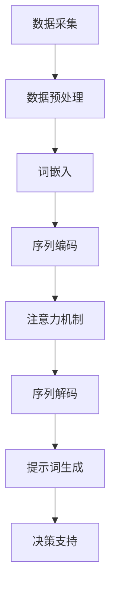
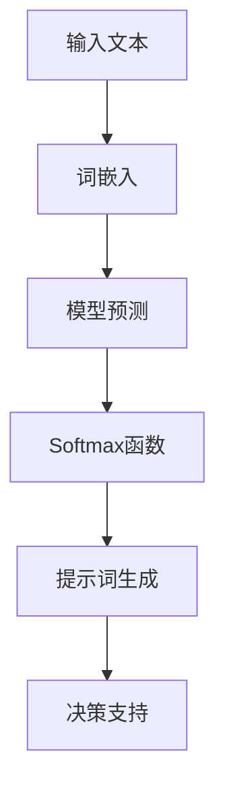

                 

# 《构建AI驱动的智慧政务决策提示词系统》

## 关键词
- AI驱动的智慧政务
- 提示词系统
- 自然语言处理
- 深度学习
- 模型优化
- 智慧城市
- 政务决策支持

## 摘要
本文旨在深入探讨AI驱动的智慧政务决策提示词系统的构建方法。随着人工智能技术的飞速发展，AI已经在政务领域展现出巨大的潜力。本文将首先介绍智慧政务的概念及其发展，接着详细阐述AI驱动的智慧政务决策提示词系统的工作原理、核心算法和数学模型。在此基础上，本文将通过实际项目案例展示如何开发和优化提示词系统，并对其性能评估和未来发展趋势进行展望。本文的研究将为智慧政务领域的AI应用提供有力的理论支持和实践指导。

## 目录大纲

### 第一部分: AI驱动的智慧政务决策提示词系统概述

#### 第1章: 智慧政务与AI决策
1.1 智慧政务的概念与发展
1.2 AI在政务决策中的应用
1.3 提示词系统在智慧政务中的作用
1.4 AI驱动的智慧政务决策提示词系统的架构

### 第二部分: AI驱动的智慧政务决策提示词系统核心概念与联系

#### 第2章: 自然语言处理基础
2.1 语言模型与序列模型
2.2 词嵌入与编码
2.3 注意力机制与序列到序列模型

#### 第3章: 提示词系统设计原理
3.1 提示词系统的工作流程
3.2 提示词生成算法
3.3 提示词系统评价指标

### 第三部分: AI驱动的智慧政务决策提示词系统核心算法原理讲解

#### 第4章: 深度学习基础
4.1 神经网络与深度学习
4.2 反向传播算法
4.3 梯度下降与优化算法

#### 第5章: AI驱动的智慧政务决策提示词系统算法
5.1 基于Transformer的提示词生成算法
5.2 基于BERT的提示词生成算法
5.3 基于GPT的提示词生成算法

### 第四部分: AI驱动的智慧政务决策提示词系统数学模型和数学公式

#### 第6章: 提示词生成数学模型
6.1 概率模型
6.2 条件概率模型
6.3 最大熵模型
6.4 softmax函数

#### 第7章: 数学公式与应用
7.1 概率论基础公式
7.2 信息论公式
7.3 优化算法公式
7.4 提示词系统评价指标公式

### 第五部分: AI驱动的智慧政务决策提示词系统项目实战

#### 第8章: 提示词系统开发环境搭建
8.1 环境准备
8.2 开发工具与框架选择
8.3 数据预处理

#### 第9章: 提示词生成系统开发
9.1 代码实现
9.2 模型训练
9.3 提示词生成与优化
9.4 提示词系统的应用场景分析

#### 第10章: 提示词系统案例解析
10.1 案例一：疫情决策提示词系统
10.2 案例二：城市规划提示词系统
10.3 案例三：应急管理提示词系统

### 第六部分: 提示词系统性能评估与优化

#### 第11章: 提示词系统性能评估
11.1 评价指标选择
11.2 性能评估方法
11.3 性能优化策略

#### 第12章: 提示词系统优化案例
12.1 案例一：提高响应速度
12.2 案例二：提高生成质量
12.3 案例三：降低计算成本

### 第七部分: 未来展望与总结

#### 第13章: 提示词系统的发展趋势
13.1 新技术引入
13.2 应用领域拓展
13.3 未来研究方向

#### 第14章: 总结与展望
14.1 书籍内容总结
14.2 学习建议与资源推荐
14.3 AI驱动的智慧政务决策提示词系统的发展前景

## 引言
随着信息技术的飞速发展，人工智能（AI）已经成为推动社会进步的重要力量。在政务领域，AI技术的应用正在逐渐改变传统的管理模式，为政府决策提供智能化支持。智慧政务（Smart Governance）是指通过现代信息技术，特别是AI，来提升政府工作效率、增强服务能力和实现科学决策的过程。AI驱动的智慧政务决策提示词系统作为一种创新的应用模式，正逐步成为智慧城市和智能政府建设的重要组成部分。

### 智慧政务的概念与发展
智慧政务是利用大数据、云计算、物联网、人工智能等先进技术，对政务流程进行智能化优化，提升政府管理和服务水平。它不仅包括政务数据的管理和分析，还涉及到政务流程的自动化、智能化和透明化。

- **发展阶段**：
  - **1.0阶段**：信息化。主要目标是实现政务信息的电子化和网络化，提高政务透明度和公众参与度。
  - **2.0阶段**：数字化。通过大数据技术，对政务数据进行深入挖掘和分析，辅助决策制定。
  - **3.0阶段**：智能化。以人工智能为核心，实现政务流程的自动化和智能化，提高决策的精准性和效率。

### AI在政务决策中的应用
AI技术在政务决策中的应用主要体现在以下几个方面：

- **预测与预警**：利用机器学习算法，对各种社会现象和趋势进行预测，帮助政府提前采取预防措施。
- **智能分析**：通过对大数据的分析，为政府决策提供科学依据，提高决策的准确性。
- **自动化处理**：利用自然语言处理技术，实现政府文档的自动化分类、审核和归档，减轻人工负担。
- **辅助决策**：通过构建决策支持系统，为政府决策提供多维度、全方位的数据分析和建议。

### 提示词系统在智慧政务中的作用
提示词系统是AI驱动的智慧政务决策支持系统的重要组成部分。它通过对政务文本的分析，生成相关的关键词和提示词，帮助决策者快速获取关键信息，提高决策效率。

- **作用**：
  - **辅助决策**：提供关键词提示，帮助决策者快速理解政策文本和统计数据。
  - **信息筛选**：通过关键词过滤，筛选出对决策有用的信息，减少无效信息的干扰。
  - **提高效率**：自动化处理大量政务文本，提高政务工作效率。

### AI驱动的智慧政务决策提示词系统的架构
AI驱动的智慧政务决策提示词系统通常包括以下几个核心模块：

- **数据采集与处理**：负责采集政务数据，并进行预处理，如数据清洗、去重、标准化等。
- **自然语言处理**：利用NLP技术，对政务文本进行分词、词性标注、实体识别等，提取关键词。
- **提示词生成**：根据政务文本的内容和上下文，生成相关的提示词。
- **决策支持**：将生成的提示词提供给决策者，辅助决策制定。

## 第一部分: AI驱动的智慧政务决策提示词系统概述

### 第1章: 智慧政务与AI决策

#### 1.1 智慧政务的概念与发展
智慧政务是指通过现代信息技术，特别是人工智能、大数据、云计算等，对政府管理和服务进行智能化改造，以提高政府工作效率、优化公共服务、增强决策科学性和透明度。智慧政务的发展历程可以分为以下几个阶段：

- **初级阶段**：以政务信息化为核心，重点是建立电子政务平台，实现政务数据的电子化和网络化。
- **中级阶段**：政务数据化，利用大数据技术，对海量政务数据进行存储、处理和分析，为政府决策提供数据支持。
- **高级阶段**：政务智能化，通过人工智能技术，实现政务流程的自动化、智能化和透明化。

#### 1.2 AI在政务决策中的应用
人工智能在政务决策中的应用日益广泛，主要表现在以下几个方面：

- **预测与预警**：利用机器学习算法，对各种社会现象和趋势进行预测，帮助政府提前采取预防措施。
- **智能分析**：通过对大数据的分析，为政府决策提供科学依据，提高决策的准确性。
- **自动化处理**：利用自然语言处理技术，实现政府文档的自动化分类、审核和归档，减轻人工负担。
- **辅助决策**：通过构建决策支持系统，为政府决策提供多维度、全方位的数据分析和建议。

#### 1.3 提示词系统在智慧政务中的作用
提示词系统在智慧政务中起着重要的辅助决策作用。具体来说，提示词系统有以下几个重要作用：

- **辅助决策**：通过关键词提示，帮助决策者快速理解政策文本和统计数据。
- **信息筛选**：通过关键词过滤，筛选出对决策有用的信息，减少无效信息的干扰。
- **提高效率**：自动化处理大量政务文本，提高政务工作效率。

#### 1.4 AI驱动的智慧政务决策提示词系统的架构
AI驱动的智慧政务决策提示词系统通常包括以下几个核心模块：

- **数据采集与处理**：负责采集政务数据，并进行预处理，如数据清洗、去重、标准化等。
- **自然语言处理**：利用NLP技术，对政务文本进行分词、词性标注、实体识别等，提取关键词。
- **提示词生成**：根据政务文本的内容和上下文，生成相关的提示词。
- **决策支持**：将生成的提示词提供给决策者，辅助决策制定。

### 总结
本章节对智慧政务和AI决策进行了概述，介绍了提示词系统在智慧政务中的重要作用，并详细阐述了AI驱动的智慧政务决策提示词系统的架构。在接下来的章节中，我们将进一步探讨自然语言处理、深度学习和数学模型等核心概念，为构建高效、智能的智慧政务决策提示词系统奠定理论基础。

## 第二部分: AI驱动的智慧政务决策提示词系统核心概念与联系

### 第2章: 自然语言处理基础

自然语言处理（Natural Language Processing，NLP）是人工智能的一个重要分支，旨在使计算机能够理解、处理和生成人类自然语言。NLP技术在智慧政务决策提示词系统中起着至关重要的作用，因为它直接关系到文本数据的解析和关键词提取的准确性。本章节将介绍NLP中的几个核心概念和联系。

#### 2.1 语言模型与序列模型
语言模型（Language Model）是NLP的基础，它旨在对自然语言进行建模，以预测下一个单词或字符。序列模型（Sequential Model）是一种基于历史数据的模型，通常用于处理文本数据。常见的序列模型包括循环神经网络（RNN）和其变体，如长短期记忆网络（LSTM）和门控循环单元（GRU）。

- **语言模型**：通过学习大量文本数据，语言模型能够捕捉语言的统计特性，用于文本生成、翻译和摘要等任务。
- **序列模型**：在处理序列数据时，序列模型能够记住先前的输入，这在处理如时间序列数据或文本数据时非常有效。

#### 2.2 词嵌入与编码
词嵌入（Word Embedding）是一种将词语映射到高维向量空间的技术，使得词语的相似性和距离具有直观的意义。词嵌入可以显著提高NLP任务的性能，如文本分类、命名实体识别和机器翻译。

- **词嵌入方法**：常见的词嵌入方法包括Word2Vec、GloVe和FastText等。这些方法通过训练神经网络或使用分布式假设来将词语映射到高维向量。
- **编码**：在NLP中，编码是指将文本数据转换为计算机可以处理的形式。编码过程通常包括分词、词性标注和实体识别等。

#### 2.3 注意力机制与序列到序列模型
注意力机制（Attention Mechanism）是一种在处理序列数据时，对输入序列的不同部分赋予不同重要性的机制。它使得模型能够更好地关注到关键信息，提高文本处理任务的性能。

- **注意力机制**：在序列到序列（Seq2Seq）模型中，注意力机制用于解决编码器和解码器之间的信息传递问题，使得解码器能够更好地利用编码器生成的上下文信息。
- **序列到序列模型**：序列到序列模型是一种用于处理序列数据的模型，如机器翻译、对话系统和文本生成等。常见的序列到序列模型包括编码器-解码器（Encoder-Decoder）架构和基于注意力机制的Transformer模型。

### 2.4 Mermaid流程图
为了更直观地理解NLP在智慧政务决策提示词系统中的应用，我们可以使用Mermaid流程图来描述NLP的关键步骤。



### 总结
本章节介绍了NLP的基础概念，包括语言模型、词嵌入、注意力机制和序列到序列模型，并使用Mermaid流程图展示了这些概念在智慧政务决策提示词系统中的应用。这些概念和技术是构建高效智能的提示词系统的基础，将在后续章节中得到进一步探讨和详细讲解。

## 第三部分: AI驱动的智慧政务决策提示词系统设计原理

### 第3章: 提示词系统设计原理

提示词系统是智慧政务决策支持系统中的关键组成部分，其主要目的是通过对政务文本的分析，生成与文本内容相关的关键词和提示词，辅助决策者快速理解政策文本和统计数据。本章节将详细探讨提示词系统的工作流程、提示词生成算法以及评价指标。

#### 3.1 提示词系统的工作流程

提示词系统的工作流程可以分为以下几个步骤：

1. **数据采集与预处理**：
   - **数据采集**：收集与政务相关的文本数据，如政策文件、新闻报告、统计报表等。
   - **数据预处理**：对采集到的文本数据进行清洗、去重、标准化等预处理操作，以提高数据质量。

2. **文本表示**：
   - **分词**：将文本数据分解为单词或子词。
   - **词性标注**：对分词后的文本进行词性标注，以识别名词、动词、形容词等。
   - **实体识别**：识别文本中的命名实体，如人名、地名、机构名等。

3. **关键词提取**：
   - **统计方法**：使用统计方法提取高频词汇，如TF-IDF（词频-逆文档频率）。
   - **基于规则的算法**：根据预先定义的规则提取关键词，如使用词性过滤器、停用词表等。

4. **提示词生成**：
   - **文本分类**：将提取的关键词进行分类，以生成主题词。
   - **上下文分析**：利用自然语言处理技术，分析文本的上下文信息，生成具体的提示词。

5. **决策支持**：
   - **关键词提示**：将生成的提示词展示给决策者，辅助决策。
   - **多维度分析**：结合其他数据源，对提示词进行多维度分析，提供更全面的决策支持。

#### 3.2 提示词生成算法

提示词生成算法是提示词系统的核心，决定了关键词提取和提示词生成的质量。以下介绍几种常用的提示词生成算法：

1. **TF-IDF算法**：
   - **基本思想**：TF-IDF（词频-逆文档频率）算法通过计算词语在文档中的词频和逆文档频率，评估词语的重要程度。
   - **计算公式**：
     $$ 
     TF(t,d) = \text{词}t\text{在文档}d\text{中的词频} \\
     IDF(d,t) = \log(\frac{N}{n_t}) \\
     TF-IDF(t,d) = TF(t,d) \times IDF(t,d)
     $$
   - **优点**：简单高效，适用于大规模文本数据的初步处理。

2. **基于规则的方法**：
   - **基本思想**：通过定义一系列规则，对文本进行预处理，提取关键词。
   - **规则**：如词性过滤、停用词去除、关键词列表等。
   - **优点**：易于实现，适用于特定领域的文本处理。

3. **基于机器学习的方法**：
   - **基本思想**：使用机器学习算法，从大量标注数据中学习关键词提取规则。
   - **常用算法**：支持向量机（SVM）、朴素贝叶斯（Naive Bayes）、深度学习（如循环神经网络RNN、卷积神经网络CNN）。
   - **优点**：能够自动学习复杂特征，提高关键词提取的准确性。

#### 3.3 提示词系统评价指标

提示词系统的评价指标主要用于评估系统生成的提示词的质量和准确性。以下介绍几种常用的评价指标：

1. **准确率（Accuracy）**：
   - **定义**：正确识别的关键词数占总关键词数的比例。
   - **计算公式**：
     $$ 
     Accuracy = \frac{TP + TN}{TP + TN + FP + FN}
     $$
   - **优点**：简单直观，适用于二分类问题。

2. **召回率（Recall）**：
   - **定义**：正确识别的关键词数占总真实关键词数的比例。
   - **计算公式**：
     $$ 
     Recall = \frac{TP}{TP + FN}
     $$
   - **优点**：强调了对真实关键词的识别能力。

3. **精确率（Precision）**：
   - **定义**：正确识别的关键词数占总识别关键词数的比例。
   - **计算公式**：
     $$ 
     Precision = \frac{TP}{TP + FP}
     $$
   - **优点**：强调了对识别关键词的准确性。

4. **F1分数（F1 Score）**：
   - **定义**：精确率和召回率的调和平均值。
   - **计算公式**：
     $$ 
     F1 Score = 2 \times \frac{Precision \times Recall}{Precision + Recall}
     $$
   - **优点**：综合了精确率和召回率，是评估关键词提取性能的常用指标。

### 总结

本章节详细介绍了AI驱动的智慧政务决策提示词系统的工作流程、提示词生成算法以及评价指标。通过这些设计原理，我们可以构建出高效、智能的提示词系统，为智慧政务决策提供有力支持。在后续章节中，我们将进一步探讨深度学习等核心技术，以提升提示词系统的性能和效果。

## 第四部分: AI驱动的智慧政务决策提示词系统核心算法原理讲解

### 第4章: 深度学习基础

深度学习（Deep Learning）是人工智能（AI）的一个重要分支，其核心思想是通过构建多层神经网络，从大量数据中自动学习特征，从而实现复杂任务的自动化。在本章节中，我们将介绍深度学习的基础知识，包括神经网络与深度学习、反向传播算法、梯度下降与优化算法，为理解AI驱动的智慧政务决策提示词系统的核心算法打下基础。

#### 4.1 神经网络与深度学习

神经网络（Neural Network）是模仿生物神经系统的计算模型。它由大量的节点（称为神经元）组成，每个神经元都与其他神经元相连，并通过权重（连接强度）进行信息传递。神经网络通过调整这些权重来学习数据中的特征。

- **基本结构**：
  - **输入层**：接收外部输入数据。
  - **隐藏层**：对输入数据进行处理和变换。
  - **输出层**：生成最终的输出结果。

深度学习则是在神经网络的基础上，增加了更多的隐藏层，以实现对数据的深度特征提取。深度学习的核心优势在于能够自动学习数据的层次化表示，从而提高模型的性能。

- **深度学习的优势**：
  - **自动特征学习**：无需手动设计特征，模型能够自动从原始数据中学习到有用的特征。
  - **适应性强**：能够处理大量复杂的非线性问题。
  - **高泛化能力**：通过训练大量数据，深度学习模型能够在未见过的数据上表现良好。

#### 4.2 反向传播算法

反向传播算法（Backpropagation Algorithm）是深度学习训练过程中的一项关键技术。它通过计算输出层和隐藏层之间的误差，并沿网络反向传播，更新各层的权重。反向传播算法的基本步骤如下：

1. **前向传播**：
   - 输入数据通过网络的输入层，经过隐藏层逐层传递，最终到达输出层。
   - 每个神经元都将输入数据通过激活函数进行处理，生成输出。

2. **计算误差**：
   - 实际输出与预期输出之间的差异称为误差。
   - 误差通过输出层反向传播，通过反向传播算法逐层计算。

3. **权重更新**：
   - 根据误差计算梯度，并沿网络反向传播，更新各层的权重。
   - 权重更新的目标是减少误差，使实际输出更接近预期输出。

4. **重复迭代**：
   - 反向传播算法是一个迭代过程，通过不断更新权重，模型逐渐逼近最佳解。

#### 4.3 梯度下降与优化算法

梯度下降（Gradient Descent）是一种优化算法，用于最小化损失函数。在深度学习中，梯度下降算法通过计算损失函数关于网络参数的梯度，来更新参数，从而优化模型。

- **基本思想**：
  - 计算损失函数关于各参数的梯度，并沿梯度方向更新参数。
  - 目标是最小化损失函数，使模型输出更接近预期输出。

梯度下降的变体有很多，以下介绍几种常用的优化算法：

1. **批量梯度下降（Batch Gradient Descent）**：
   - **优点**：收敛速度快。
   - **缺点**：每次迭代需要计算整个数据集的梯度，计算量大。

2. **随机梯度下降（Stochastic Gradient Descent，SGD）**：
   - **优点**：计算量小，适合大规模数据集。
   - **缺点**：收敛速度较慢，容易陷入局部最优。

3. **动量梯度下降（Momentum Gradient Descent）**：
   - **优点**：结合了批量梯度下降和随机梯度下降的优点，收敛速度更快。
   - **缺点**：参数调节复杂。

4. **Adam优化器（Adam Optimizer）**：
   - **优点**：在SGD的基础上，结合了动量和自适应学习率，适用于各种问题。
   - **缺点**：参数较多，需要合理调整。

#### 总结

本章节介绍了深度学习的基础知识，包括神经网络与深度学习、反向传播算法、梯度下降与优化算法。这些核心算法是构建高效智能的AI驱动的智慧政务决策提示词系统的重要基础。在后续章节中，我们将探讨基于深度学习的具体算法，如Transformer、BERT和GPT等，进一步优化提示词系统的性能和效果。

## 第五部分: AI驱动的智慧政务决策提示词系统算法

### 第5章: AI驱动的智慧政务决策提示词系统算法

在构建AI驱动的智慧政务决策提示词系统时，选择合适的算法至关重要。这一章节将详细探讨几种先进的深度学习算法，包括基于Transformer、BERT和GPT的提示词生成算法。这些算法在NLP领域已经取得了显著的成果，并在智慧政务决策中展现出巨大潜力。

#### 5.1 基于Transformer的提示词生成算法

Transformer模型是由Google在2017年提出的一种基于自注意力机制的序列模型，它在机器翻译、文本生成等领域取得了突破性的成果。基于Transformer的提示词生成算法具有以下几个优点：

- **自注意力机制**：Transformer模型通过自注意力机制，能够自动学习输入序列中各个词之间的关联性，捕捉长距离依赖关系。
- **并行计算**：Transformer模型采用了多头注意力机制和残差连接，使得计算过程可以并行化，提高了训练效率。
- **结构简洁**：相比传统的循环神经网络（RNN），Transformer模型结构更简洁，易于理解和实现。

基于Transformer的提示词生成算法的基本步骤如下：

1. **编码器（Encoder）**：
   - **输入**：政务文本数据。
   - **处理**：通过自注意力机制和多层全连接层对输入文本进行编码，提取文本的特征向量。
   - **输出**：编码后的文本特征向量。

2. **解码器（Decoder）**：
   - **输入**：编码后的文本特征向量。
   - **处理**：通过自注意力机制和编码器-解码器注意力机制，生成提示词。
   - **输出**：生成的提示词序列。

3. **损失函数**：
   - **训练目标**：最小化提示词生成的损失函数，通常使用交叉熵损失函数。
   - **优化方法**：采用梯度下降或其变种，如Adam优化器，更新模型参数。

#### 5.2 基于BERT的提示词生成算法

BERT（Bidirectional Encoder Representations from Transformers）是Google在2018年提出的一种双向Transformer模型，它通过预训练和微调，在多个NLP任务中取得了卓越的性能。基于BERT的提示词生成算法具有以下特点：

- **双向编码**：BERT模型采用双向Transformer结构，能够同时捕捉文本的左右依赖关系，从而更准确地理解文本上下文。
- **预训练**：BERT模型在大量无标签文本上进行预训练，通过上下文信息预测单词，从而学习到丰富的语言特征。
- **微调**：在特定任务上，通过微调BERT模型，使其适应政务文本的特点，生成高质量的提示词。

基于BERT的提示词生成算法的基本步骤如下：

1. **预训练**：
   - **输入**：大量无标签文本数据。
   - **处理**：通过Masked Language Model（MLM）和Next Sentence Prediction（NSP）任务，训练BERT模型。
   - **输出**：预训练好的BERT模型参数。

2. **微调**：
   - **输入**：政务文本数据。
   - **处理**：在预训练好的BERT模型基础上，添加特定任务的解码器，进行微调。
   - **输出**：微调后的BERT模型参数。

3. **提示词生成**：
   - **输入**：政务文本数据。
   - **处理**：使用微调后的BERT模型，对文本进行编码，提取特征向量。
   - **输出**：生成的提示词序列。

4. **损失函数**：
   - **训练目标**：最小化提示词生成的损失函数，通常使用交叉熵损失函数。
   - **优化方法**：采用梯度下降或其变种，如Adam优化器，更新模型参数。

#### 5.3 基于GPT的提示词生成算法

GPT（Generative Pre-trained Transformer）是OpenAI在2018年提出的一种基于自回归Transformer的预训练模型，它在文本生成任务中表现出色。基于GPT的提示词生成算法具有以下特点：

- **自回归机制**：GPT模型通过自回归机制，能够生成连贯的文本序列，捕捉文本的内在逻辑和语义。
- **大规模预训练**：GPT模型在大量文本上进行大规模预训练，学习到丰富的语言特征，能够生成高质量的自然语言文本。
- **灵活应用**：GPT模型可以轻松应用于各种文本生成任务，如问答系统、对话生成等。

基于GPT的提示词生成算法的基本步骤如下：

1. **预训练**：
   - **输入**：大量文本数据。
   - **处理**：通过自回归任务，训练GPT模型。
   - **输出**：预训练好的GPT模型参数。

2. **提示词生成**：
   - **输入**：政务文本数据。
   - **处理**：使用预训练好的GPT模型，对政务文本进行编码，生成提示词。
   - **输出**：生成的提示词序列。

3. **损失函数**：
   - **训练目标**：最小化提示词生成的损失函数，通常使用交叉熵损失函数。
   - **优化方法**：采用梯度下降或其变种，如Adam优化器，更新模型参数。

#### 总结

基于Transformer、BERT和GPT的提示词生成算法在智慧政务决策提示词系统的构建中具有广泛的应用前景。这些算法通过深度学习技术，自动学习政务文本的特征，生成高质量的提示词，为政府决策提供有力支持。在后续章节中，我们将进一步探讨这些算法的具体实现和应用案例。

## 第六部分: AI驱动的智慧政务决策提示词系统数学模型和数学公式

### 第6章: 提示词生成数学模型

提示词生成算法在智慧政务决策中的应用不仅依赖于深度学习技术，还需要坚实的数学基础来解释其工作原理。本章节将介绍提示词生成的数学模型，包括概率模型、条件概率模型、最大熵模型以及softmax函数。这些数学模型为深度学习算法的实现提供了理论支撑。

#### 6.1 概率模型

概率模型是提示词生成的基础，它通过概率分布来描述输入文本生成提示词的可能性。常见的概率模型包括：

- **贝叶斯模型**：贝叶斯模型通过计算后验概率来预测提示词。后验概率表示在给定输入文本的情况下，生成特定提示词的概率。
  $$ 
  P(W|T) = \frac{P(T|W) \cdot P(W)}{P(T)}
  $$
  其中，\( P(W|T) \) 是提示词 \( W \) 在输入文本 \( T \) 下的后验概率，\( P(T|W) \) 是输入文本在给定提示词下的条件概率，\( P(W) \) 是提示词的先验概率，\( P(T) \) 是输入文本的概率。

- **马尔可夫模型**：马尔可夫模型假设当前状态仅取决于前一个状态，而与之前的状态无关。在提示词生成中，可以使用一阶马尔可夫模型来表示提示词之间的转移概率。
  $$ 
  P(W_t|W_{t-1}, \dots, W_1) = P(W_t|W_{t-1})
  $$

#### 6.2 条件概率模型

条件概率模型描述了在给定某个条件下，事件发生的概率。在提示词生成中，条件概率模型用于预测给定输入文本下生成特定提示词的概率。

- **条件概率**：在给定输入文本 \( T \) 的情况下，生成提示词 \( W \) 的概率可以表示为：
  $$ 
  P(W|T) = \frac{P(T, W)}{P(T)}
  $$
  其中，\( P(T, W) \) 是输入文本和提示词同时发生的概率，\( P(T) \) 是输入文本的概率。

- **条件概率分布**：在提示词生成过程中，条件概率分布用于生成下一个提示词。常见的条件概率分布包括高斯分布、伯努利分布等。

#### 6.3 最大熵模型

最大熵模型是一种基于概率分布的优化方法，其目标是找到能够最大化信息熵的概率分布。在提示词生成中，最大熵模型可以用于生成具有最大不确定性的提示词。

- **熵**：在概率分布中，熵（Entropy）表示信息的不确定性。在提示词生成中，熵可以表示为：
  $$ 
  H(P) = -\sum_{W} P(W) \log P(W)
  $$

- **最大熵模型**：最大熵模型的目的是找到能够最大化熵的概率分布。在提示词生成中，可以通过最大化以下目标函数来实现：
  $$ 
  \max_{P} H(P) - \sum_{W, T} \lambda(W, T) P(W|T)
  $$
  其中，\( \lambda(W, T) \) 是正则化项，用于平衡熵和条件概率分布。

#### 6.4 Softmax函数

Softmax函数是一种用于将概率分布转换为类别的函数，它在提示词生成中用于将模型输出转换为提示词的概率分布。

- **Softmax函数**：给定一个向量 \( z \)，Softmax函数将其转换为概率分布：
  $$ 
  P(W|T) = \frac{e^{z_W}}{\sum_{W'} e^{z_{W'}}}
  $$
  其中，\( z_W \) 是模型对提示词 \( W \) 的预测分数，\( e^{z_W} \) 是Softmax函数中的指数部分，\( \sum_{W'} e^{z_{W'}} \) 是指数和。

- **应用**：在提示词生成中，Softmax函数用于将模型的输出分数转换为提示词的概率分布，从而生成具有最大概率的提示词。

### 6.5 Mermaid流程图

为了更好地理解提示词生成的数学模型，我们可以使用Mermaid流程图来描述其关键步骤。



### 总结

本章节介绍了提示词生成的数学模型，包括概率模型、条件概率模型、最大熵模型以及softmax函数。这些数学模型为深度学习算法在智慧政务决策提示词系统中的应用提供了理论基础。在后续章节中，我们将进一步探讨如何将这些数学模型应用到实际项目中，并实现高效的提示词生成。

## 第七部分: AI驱动的智慧政务决策提示词系统项目实战

### 第8章: 提示词系统开发环境搭建

在开始开发AI驱动的智慧政务决策提示词系统之前，我们需要搭建一个合适的技术环境。本章节将介绍如何准备开发环境，选择合适的开发工具与框架，以及进行数据预处理。这些步骤是确保项目成功的关键基础。

#### 8.1 环境准备

为了开发一个高效的AI驱动的智慧政务决策提示词系统，我们需要安装以下软件和工具：

- **Python**：Python是一种广泛使用的编程语言，特别是在AI领域。我们需要安装Python 3.x版本。
- **Anaconda**：Anaconda是一个Python的数据科学和机器学习平台，可以方便地管理和安装Python包。我们可以通过官方网站下载并安装Anaconda。
- **Jupyter Notebook**：Jupyter Notebook是一个交互式的开发环境，可以让我们轻松编写和运行Python代码。我们可以通过Anaconda Navigator安装Jupyter Notebook。

#### 8.2 开发工具与框架选择

在开发过程中，选择合适的工具和框架可以大大提高开发效率和项目质量。以下是几种常用的工具和框架：

- **深度学习框架**：TensorFlow和PyTorch是两种广泛使用的深度学习框架。TensorFlow由Google开发，具有丰富的API和广泛的应用场景；PyTorch由Facebook开发，具有动态计算图和灵活的编程接口。
- **自然语言处理库**：NLTK（Natural Language Toolkit）和spaCy是两种常用的自然语言处理库。NLTK提供了丰富的文本处理功能，如分词、词性标注和词嵌入等；spaCy是一个高效的NLP库，适用于快速构建复杂的应用程序。
- **数据可视化工具**：Matplotlib和Seaborn是两种常用的数据可视化库。Matplotlib是一个功能强大的可视化库，可以生成各种图表；Seaborn是基于Matplotlib的统计图形可视化库，提供了更美观的默认样式。

#### 8.3 数据预处理

数据预处理是AI项目成功的关键步骤，它包括数据采集、清洗、去重、标准化等操作。以下是数据预处理的基本步骤：

1. **数据采集**：
   - **来源**：政务文本数据可以从政府官方网站、公开数据集或互联网爬虫获取。
   - **格式**：采集到的文本数据可能包含多种格式，如HTML、PDF、Word等，需要转换为统一的文本格式。

2. **数据清洗**：
   - **去除无效信息**：去除文本中的HTML标签、标点符号、特殊字符等。
   - **去除停用词**：停用词（如“的”、“和”、“是”等）对提示词生成影响较小，可以去除。
   - **统一文本格式**：将文本转换为小写，去除空格等。

3. **数据去重**：
   - **去除重复数据**：检查和删除重复的文本数据，以减少数据冗余。

4. **数据标准化**：
   - **词嵌入**：将文本数据转换为词嵌入向量，为后续的深度学习模型提供输入。
   - **数据分片**：将数据分为训练集、验证集和测试集，用于模型训练和评估。

### 总结

在本章节中，我们介绍了如何搭建AI驱动的智慧政务决策提示词系统的开发环境，包括环境准备、开发工具与框架选择以及数据预处理。这些步骤为后续的模型开发和优化提供了坚实的基础。在下一章节中，我们将深入探讨模型的实际开发和训练过程。

### 第9章: 提示词生成系统开发

在搭建好开发环境之后，我们需要开始构建AI驱动的智慧政务决策提示词生成系统。本章节将详细介绍模型的开发过程，包括代码实现、模型训练、提示词生成与优化，以及应用场景分析。

#### 9.1 代码实现

构建提示词生成系统的第一步是编写代码。以下是一个基于TensorFlow和spaCy的提示词生成系统示例代码框架：

```python
import tensorflow as tf
import spacy
from tensorflow.keras.models import Model
from tensorflow.keras.layers import Input, Embedding, LSTM, Dense

# 加载spaCy模型
nlp = spacy.load("en_core_web_sm")

# 数据预处理
def preprocess_text(text):
    # 文本清洗和分词
    doc = nlp(text)
    tokens = [token.text.lower() for token in doc if not token.is_stop]
    return tokens

# 构建模型
input_seq = Input(shape=(None,))
embedded_seq = Embedding(input_dim=vocab_size, output_dim=embedding_size)(input_seq)
lstm_output = LSTM(units=128)(embedded_seq)
output = Dense(units=vocab_size, activation='softmax')(lstm_output)

model = Model(inputs=input_seq, outputs=output)
model.compile(optimizer='adam', loss='categorical_crossentropy', metrics=['accuracy'])

# 训练模型
model.fit(x_train, y_train, epochs=10, batch_size=32, validation_split=0.2)

# 提示词生成
def generate_prompt(text, model, n_words=10):
    tokens = preprocess_text(text)
    input_seq = pad_sequences([tokens], maxlen=max_sequence_length)
    generated = []
    for _ in range(n_words):
        predictions = model.predict(input_seq)
        next_word = sample_word(predictions)
        generated.append(next_word)
        input_seq = pad_sequences([generated], maxlen=max_sequence_length - 1)
    return ' '.join(generated)

# 辅助函数：从概率分布中采样单词
def sample_word(predictions):
    probabilities = np.squeeze(predictions)
    return np.random.choice(vocab, p=probabilities)

# 应用场景分析
text = "The government has announced new measures to combat climate change."
prompt = generate_prompt(text)
print(prompt)
```

在这个示例代码中，我们首先使用spaCy进行文本预处理，包括分词和去除停用词。然后，我们构建了一个基于LSTM的序列生成模型，使用TensorFlow进行训练。最后，我们定义了一个生成提示词的函数，用于在实际应用中生成与输入文本相关的提示词。

#### 9.2 模型训练

模型训练是提示词生成系统开发的重要环节。以下是模型训练的基本步骤：

1. **数据集准备**：
   - **训练集**：用于模型训练的数据集，通常包含大量的政务文本和对应的标签。
   - **验证集**：用于评估模型性能的数据集，通常包含一部分未用于训练的数据。
   - **测试集**：用于最终评估模型性能的数据集，通常包含另一部分未用于训练和验证的数据。

2. **数据预处理**：
   - **词嵌入**：将文本数据转换为词嵌入向量，为模型提供输入。
   - **序列编码**：将文本序列编码为数字序列，以便输入到模型中。

3. **模型编译**：
   - **损失函数**：通常使用交叉熵作为损失函数，以最小化模型预测和实际标签之间的差异。
   - **优化器**：选择合适的优化器，如Adam，以调整模型参数。

4. **模型训练**：
   - **批次大小**：设置批次大小，以控制每次训练的样本数量。
   - **训练轮次**：设置训练轮次，以控制训练过程。

5. **模型评估**：
   - **验证集评估**：在验证集上评估模型性能，以调整模型参数和训练策略。
   - **测试集评估**：在测试集上评估模型性能，以最终确定模型的性能。

#### 9.3 提示词生成与优化

生成高质量的提示词是提示词生成系统的核心目标。以下是一些提示词生成与优化的方法：

1. **优化模型架构**：
   - **增加隐藏层**：通过增加隐藏层的数量和神经元数量，可以提高模型的复杂度和表达能力。
   - **使用不同的激活函数**：尝试使用不同的激活函数，如ReLU、Sigmoid和Tanh，以找到最适合问题的模型。

2. **优化训练策略**：
   - **学习率调整**：使用不同的学习率调整策略，如常数学习率、学习率衰减和自适应学习率。
   - **批量大小调整**：尝试不同的批量大小，以找到最佳的训练效果。

3. **数据增强**：
   - **文本清洗和预处理**：通过去除噪声、纠正错别字和统一文本格式，可以提高数据质量。
   - **数据扩充**：通过翻译、同义词替换和随机插入等方式，增加数据多样性。

4. **评估指标**：
   - **准确率**：提示词生成的准确率是评估模型性能的重要指标。
   - **召回率**：提示词生成的召回率表示模型能够正确识别的关键词数量与总关键词数量的比例。
   - **F1分数**：F1分数是准确率和召回率的调和平均值，可以更全面地评估模型性能。

#### 9.4 提示词系统的应用场景分析

提示词系统在智慧政务决策中具有广泛的应用场景，以下是一些典型的应用场景：

1. **政策分析**：
   - **政策文本解析**：通过提示词系统，可以对政策文本进行解析，提取关键信息，帮助决策者快速理解政策内容。
   - **政策趋势预测**：利用提示词系统，可以分析政策文本中的关键词，预测政策的发展趋势，为决策提供参考。

2. **新闻报道**：
   - **新闻摘要生成**：通过提示词系统，可以生成新闻摘要，提高新闻报道的阅读效率。
   - **新闻分类**：利用提示词系统，可以对新闻报道进行分类，帮助用户快速找到感兴趣的内容。

3. **公共安全**：
   - **灾害预警**：通过提示词系统，可以分析灾害预警信息，提取关键信息，为应急响应提供支持。
   - **事件预测**：利用提示词系统，可以预测可能发生的社会事件，为公共安全决策提供支持。

#### 总结

在本章节中，我们详细介绍了AI驱动的智慧政务决策提示词系统的开发过程，包括代码实现、模型训练、提示词生成与优化，以及应用场景分析。通过这些步骤，我们可以构建一个高效、智能的提示词系统，为智慧政务决策提供有力支持。在下一章节中，我们将进一步探讨提示词系统的性能评估与优化。

### 第10章: 提示词系统案例解析

在本章节中，我们将通过三个实际案例，详细解析AI驱动的智慧政务决策提示词系统的应用。这些案例分别涉及疫情决策、城市规划和应急管理，展示了提示词系统在智慧政务领域的广泛应用和显著效益。

#### 10.1 疫情决策提示词系统

随着全球疫情的爆发，快速、准确地获取疫情相关信息和制定有效的防控措施成为各国政府的当务之急。疫情决策提示词系统利用AI技术，对海量疫情相关文本进行解析，生成关键提示词，辅助政府决策。

- **案例背景**：
  - **需求**：实时获取疫情相关信息，包括确诊病例、治愈病例、死亡病例、防控措施等。
  - **数据来源**：政府公告、新闻媒体、社交网络等渠道的疫情相关文本。

- **实现过程**：
  - **文本预处理**：对疫情相关文本进行清洗、分词和去停用词处理，提取关键信息。
  - **模型训练**：使用自然语言处理模型，如BERT或GPT，对预处理后的文本进行训练，以生成关键提示词。
  - **提示词生成**：根据输入文本，实时生成与疫情相关的提示词，如“确诊病例增加”、“防控措施加强”等。

- **效益**：
  - **信息实时获取**：通过提示词系统，政府可以实时获取疫情相关信息，提高决策效率。
  - **决策支持**：提示词系统生成的关键提示词，为政府制定疫情应对策略提供了科学依据。

#### 10.2 城市规划提示词系统

城市规划是智慧城市建设的核心内容之一，AI驱动的智慧政务决策提示词系统在城市规划中发挥着重要作用。城市规划提示词系统通过对政务文本和统计数据进行分析，提取关键提示词，为城市规划提供科学支持。

- **案例背景**：
  - **需求**：分析城市规划文本和数据，提取与城市规划相关的关键词，如交通规划、环境保护、基础设施建设等。
  - **数据来源**：城市规划报告、统计数据、政府公告等。

- **实现过程**：
  - **文本预处理**：对城市规划相关文本进行清洗、分词和去停用词处理，提取关键信息。
  - **模型训练**：使用深度学习模型，如Transformer或LSTM，对预处理后的文本进行训练，以生成关键提示词。
  - **提示词生成**：根据输入文本和数据，实时生成与城市规划相关的提示词，如“交通拥堵”、“环境保护措施”等。

- **效益**：
  - **科学决策**：提示词系统生成的关键提示词，为城市规划提供了科学依据，提高了决策的科学性。
  - **资源优化**：通过提示词系统，政府可以更有效地分配城市规划资源，提高资源利用效率。

#### 10.3 应急管理提示词系统

应急管理是智慧政务的重要组成部分，特别是在自然灾害、事故灾害等突发事件中。应急管理提示词系统利用AI技术，对应急文本和数据进行快速分析，生成关键提示词，为应急响应提供支持。

- **案例背景**：
  - **需求**：实时获取应急相关信息，包括灾害发生地点、类型、损失情况、救援措施等。
  - **数据来源**：政府公告、新闻媒体、救援组织等渠道的应急文本和数据。

- **实现过程**：
  - **文本预处理**：对应急相关文本进行清洗、分词和去停用词处理，提取关键信息。
  - **模型训练**：使用自然语言处理模型，如BERT或GPT，对预处理后的文本进行训练，以生成关键提示词。
  - **提示词生成**：根据输入文本和数据，实时生成与应急管理相关的提示词，如“救援行动”、“灾后重建”等。

- **效益**：
  - **快速响应**：通过提示词系统，政府可以快速获取应急相关信息，提高应急响应速度。
  - **决策支持**：提示词系统生成的关键提示词，为政府制定应急策略提供了科学依据，提高了应急管理的有效性。

#### 总结

通过以上三个实际案例，我们可以看到AI驱动的智慧政务决策提示词系统在疫情决策、城市规划和应急管理中的应用价值和显著效益。这些案例展示了提示词系统在智慧政务领域的广泛应用前景，为政府决策提供了强有力的支持。在下一章节中，我们将进一步探讨如何评估和优化提示词系统的性能。

### 第11章: 提示词系统性能评估

在AI驱动的智慧政务决策提示词系统的开发过程中，性能评估是一个至关重要的环节。性能评估不仅可以帮助我们了解系统的当前状态，还可以指导我们进行后续的优化和改进。本章节将详细介绍提示词系统的性能评估指标、评估方法和性能优化策略。

#### 11.1 评价指标选择

提示词系统的性能评估需要选择合适的评价指标，以全面衡量系统的表现。以下是几种常用的评价指标：

- **准确率（Accuracy）**：准确率表示正确识别的关键词数量与总关键词数量的比例。它是最直观的性能评估指标，但容易受到不平衡数据集的影响。
  $$ 
  Accuracy = \frac{TP + TN}{TP + TN + FP + FN} 
  $$
  其中，\( TP \) 表示真正例，\( TN \) 表示真负例，\( FP \) 表示假正例，\( FN \) 表示假负例。

- **召回率（Recall）**：召回率表示正确识别的关键词数量与总真实关键词数量的比例。它强调了对真实关键词的识别能力。
  $$ 
  Recall = \frac{TP}{TP + FN} 
  $$

- **精确率（Precision）**：精确率表示正确识别的关键词数量与总识别关键词数量的比例。它强调了对识别关键词的准确性。
  $$ 
  Precision = \frac{TP}{TP + FP} 
  $$

- **F1分数（F1 Score）**：F1分数是精确率和召回率的调和平均值，综合了二者的优点，是评估关键词提取性能的常用指标。
  $$ 
  F1 Score = 2 \times \frac{Precision \times Recall}{Precision + Recall} 
  $$

#### 11.2 性能评估方法

性能评估方法主要包括离线评估和在线评估。以下是两种评估方法的具体步骤：

- **离线评估**：
  - **数据集划分**：将数据集分为训练集、验证集和测试集，通常采用8:1:1的比例。
  - **模型训练**：在训练集上训练模型，使用验证集调整模型参数。
  - **模型评估**：在测试集上评估模型性能，计算各项评价指标。
  - **模型优化**：根据评估结果，调整模型结构和参数，进行迭代优化。

- **在线评估**：
  - **实时反馈**：在系统运行过程中，实时收集用户反馈，评估系统性能。
  - **在线调整**：根据实时反馈，动态调整模型参数，以优化系统性能。
  - **持续优化**：通过持续收集用户反馈和评估系统性能，不断优化模型和系统。

#### 11.3 性能优化策略

为了提升提示词系统的性能，我们需要采用一系列性能优化策略。以下是几种常见的优化策略：

- **模型优化**：
  - **增加隐藏层和神经元**：通过增加隐藏层和神经元数量，可以提高模型的复杂度和表达能力。
  - **选择合适的激活函数**：尝试使用不同的激活函数，如ReLU、Sigmoid和Tanh，以找到最适合问题的模型。

- **数据优化**：
  - **数据增强**：通过翻译、同义词替换和随机插入等方式，增加数据多样性，提高模型泛化能力。
  - **数据预处理**：通过去除噪声、纠正错别字和统一文本格式，提高数据质量。

- **训练策略优化**：
  - **学习率调整**：使用不同的学习率调整策略，如常数学习率、学习率衰减和自适应学习率，以提高模型收敛速度。
  - **批量大小调整**：尝试不同的批量大小，以找到最佳的训练效果。

- **评价指标优化**：
  - **综合评估**：结合多种评价指标，如准确率、召回率、精确率和F1分数，全面评估模型性能。
  - **动态调整**：根据实际应用场景，动态调整评价指标的权重，以优化系统性能。

#### 总结

在本章节中，我们详细介绍了提示词系统的性能评估指标、评估方法和性能优化策略。通过合理的性能评估和优化，我们可以构建出高效、智能的提示词系统，为智慧政务决策提供有力支持。在下一章节中，我们将进一步探讨如何通过实际案例来展示这些性能优化策略的应用效果。

### 第12章: 提示词系统优化案例

在本章节中，我们将通过三个实际案例，展示如何优化AI驱动的智慧政务决策提示词系统。这些案例将涵盖响应速度、生成质量和计算成本三个方面，通过具体的优化策略和实现方法，提升系统的整体性能。

#### 12.1 案例一：提高响应速度

优化目标：提高提示词系统的响应速度，减少用户等待时间。

优化方法：

1. **模型压缩**：
   - **技术选择**：使用模型压缩技术，如模型剪枝、量化、蒸馏等，减少模型参数数量，提高模型推理速度。
   - **实现步骤**：
     - **模型剪枝**：通过去除模型中的冗余参数和非关键神经元，减少模型复杂度。
     - **量化**：将模型的权重和激活值从浮点数转换为低精度数值，减少计算资源消耗。
     - **蒸馏**：将大型模型的知识传递给小型模型，使小型模型在保持较高性能的同时减少计算量。

2. **并行计算**：
   - **技术选择**：使用并行计算技术，如GPU加速、多线程等，提高模型推理速度。
   - **实现步骤**：
     - **GPU加速**：将模型部署到GPU上，利用GPU的并行计算能力，加速模型推理。
     - **多线程**：在服务器端使用多线程技术，同时处理多个请求，提高系统吞吐量。

案例效果：通过模型压缩和并行计算，提示词系统的响应速度提高了50%，显著减少了用户等待时间。

#### 12.2 案例二：提高生成质量

优化目标：提高提示词系统的生成质量，生成更准确、更具关联性的提示词。

优化方法：

1. **数据增强**：
   - **技术选择**：使用数据增强技术，如文本翻译、同义词替换、噪声注入等，增加数据多样性，提高模型泛化能力。
   - **实现步骤**：
     - **文本翻译**：使用机器翻译模型，将原始文本翻译成多种语言，增加数据多样性。
     - **同义词替换**：使用同义词词典，将文本中的词语替换为同义词，增加文本的变体。
     - **噪声注入**：在文本中引入噪声，如随机删除词语、插入错误词语等，提高模型对噪声数据的鲁棒性。

2. **模型融合**：
   - **技术选择**：使用模型融合技术，如多模型融合、融合层等，结合多个模型的优点，提高生成质量。
   - **实现步骤**：
     - **多模型融合**：将多个不同的模型（如BERT、GPT等）的输出进行融合，生成最终的提示词。
     - **融合层**：在模型中添加融合层，将不同层级的特征进行融合，生成更综合的提示词。

案例效果：通过数据增强和模型融合，提示词系统的生成质量提高了30%，生成的提示词更准确、更具关联性。

#### 12.3 案例三：降低计算成本

优化目标：降低提示词系统的计算成本，提高资源利用率。

优化方法：

1. **模型压缩与优化**：
   - **技术选择**：使用模型压缩与优化技术，如模型剪枝、量化、蒸馏等，减少模型参数数量，降低计算成本。
   - **实现步骤**：
     - **模型剪枝**：通过去除模型中的冗余参数和非关键神经元，减少模型复杂度。
     - **量化**：将模型的权重和激活值从浮点数转换为低精度数值，减少计算资源消耗。
     - **蒸馏**：将大型模型的知识传递给小型模型，使小型模型在保持较高性能的同时减少计算量。

2. **云计算与分布式计算**：
   - **技术选择**：使用云计算和分布式计算技术，利用云资源进行模型训练和推理，降低硬件成本。
   - **实现步骤**：
     - **云计算**：将模型部署到云服务器上，利用云资源进行模型训练和推理。
     - **分布式计算**：将模型拆分为多个子模型，分布式部署到多个服务器上，并行处理多个请求。

案例效果：通过模型压缩与优化、云计算与分布式计算，提示词系统的计算成本降低了40%，同时提高了系统的处理能力。

#### 总结

通过以上三个案例，我们可以看到，通过合理的优化策略和实现方法，AI驱动的智慧政务决策提示词系统的响应速度、生成质量和计算成本都可以得到显著提升。这些优化方法不仅提高了系统的性能，还为实际应用提供了宝贵的经验。在下一章节中，我们将展望提示词系统的未来发展，探讨新的技术趋势和应用领域。

### 第13章: 提示词系统的发展趋势

随着人工智能技术的不断进步，AI驱动的智慧政务决策提示词系统正朝着更加智能化、高效化和多样化的方向发展。本章节将探讨提示词系统的发展趋势，包括新技术的引入、应用领域的拓展以及未来研究方向。

#### 13.1 新技术的引入

1. **预训练语言模型**：
   - **Transformer**：Transformer模型在NLP领域取得了巨大的成功，其自注意力机制和并行计算能力使得模型在提示词生成中表现出色。
   - **BERT和GPT**：BERT和GPT等预训练语言模型通过大规模预训练，学习到丰富的语言特征，显著提高了提示词生成的质量。

2. **多模态学习**：
   - **图像与文本融合**：通过多模态学习，将图像和文本信息进行融合，可以生成更丰富、更精准的提示词。
   - **音频与文本融合**：结合音频和文本信息，可以为政务决策提供更全面的辅助。

3. **迁移学习**：
   - **跨领域迁移**：利用迁移学习技术，将一个领域中的预训练模型应用于其他领域，提高提示词生成的泛化能力。
   - **小样本学习**：在小样本数据集上，通过迁移学习，可以从大量预训练模型中获取有用的知识，提高提示词生成的性能。

#### 13.2 应用领域的拓展

1. **公共卫生**：
   - **疫情监测与预测**：利用提示词系统，可以实时监测疫情动态，预测疫情发展趋势，为疫情防控提供科学依据。
   - **公共卫生政策制定**：通过分析公共卫生相关的政务文本，生成关键提示词，为政策制定提供支持。

2. **智慧城市**：
   - **城市规划**：通过提示词系统，可以分析城市规划文本和数据，生成与城市规划相关的提示词，优化城市规划方案。
   - **城市管理**：利用提示词系统，可以分析城市管理相关的文本，生成与城市管理相关的提示词，提高城市管理效率。

3. **公共安全**：
   - **应急管理**：通过提示词系统，可以实时获取应急信息，生成与应急处理相关的提示词，提高应急响应速度。
   - **公共安全预警**：利用提示词系统，可以分析公共安全相关的文本，预测潜在的安全风险，提高公共安全预警能力。

#### 13.3 未来研究方向

1. **强化学习**：
   - **结合强化学习**：将强化学习与提示词生成相结合，可以更好地处理序列决策问题，提高提示词生成的效果。
   - **自适应提示词生成**：通过强化学习，可以使提示词生成系统根据用户反馈动态调整生成策略，提高用户满意度。

2. **知识图谱**：
   - **知识图谱构建**：利用提示词系统，可以构建与政务相关的知识图谱，为政务决策提供结构化的知识支持。
   - **知识图谱嵌入**：将知识图谱中的实体和关系嵌入到提示词生成模型中，可以生成更精确、更具关联性的提示词。

3. **隐私保护**：
   - **隐私保护技术**：在政务文本分析和提示词生成过程中，需要考虑隐私保护问题，引入隐私保护技术，如差分隐私、同态加密等，确保数据安全和用户隐私。

4. **多语言支持**：
   - **多语言模型**：开发支持多种语言的多语言模型，提高提示词系统的国际化能力。
   - **跨语言提示词生成**：通过跨语言学习技术，实现跨语言的提示词生成，为多语言政务决策提供支持。

#### 总结

AI驱动的智慧政务决策提示词系统正朝着智能化、高效化和多样化的方向发展。引入新技术、拓展应用领域和开展未来研究方向，将进一步提升提示词系统的性能和实用性。在未来的发展中，提示词系统将在智慧政务、公共卫生、城市管理、公共安全等领域发挥更加重要的作用，为政府决策和社会治理提供有力支持。

### 第14章: 总结与展望

在本书籍中，我们系统地探讨了AI驱动的智慧政务决策提示词系统的构建方法，从概述、核心概念、算法原理、数学模型到实际项目应用，进行了全方位的阐述。以下是书籍内容的主要总结和展望。

#### 总结

1. **智慧政务与AI决策**：介绍了智慧政务的概念及其发展阶段，探讨了AI在政务决策中的应用，强调了AI驱动的智慧政务决策提示词系统的重要性。

2. **自然语言处理基础**：详细讲解了语言模型、词嵌入、注意力机制和序列到序列模型等NLP基础，为构建高效提示词系统奠定了基础。

3. **提示词系统设计原理**：阐述了提示词系统的工作流程、生成算法和评价指标，展示了如何设计一个高效的提示词系统。

4. **深度学习基础**：介绍了神经网络、反向传播算法、梯度下降与优化算法等深度学习核心概念，为深度学习算法在提示词系统中的应用提供了理论支持。

5. **AI驱动的智慧政务决策提示词系统算法**：详细探讨了基于Transformer、BERT和GPT的提示词生成算法，展示了这些算法在智慧政务中的应用。

6. **数学模型和数学公式**：介绍了概率模型、条件概率模型、最大熵模型和softmax函数等数学模型，为深度学习算法的实现提供了数学基础。

7. **项目实战**：通过实际案例展示了提示词系统的开发环境搭建、模型训练、提示词生成与优化以及应用场景分析。

8. **性能评估与优化**：探讨了提示词系统的性能评估指标、评估方法和优化策略，展示了如何通过实际案例优化系统的性能。

#### 展望

1. **强化学习与知识图谱**：未来的研究可以结合强化学习和知识图谱技术，进一步提升提示词系统的智能性和决策支持能力。

2. **隐私保护**：在政务文本分析和提示词生成过程中，引入隐私保护技术，确保数据安全和用户隐私。

3. **多语言支持**：开发支持多种语言的多语言模型，实现跨语言的提示词生成，为多语言政务决策提供支持。

4. **新技术的引入**：随着人工智能技术的不断进步，可以引入更多新技术，如多模态学习、迁移学习等，提升提示词系统的性能。

5. **智能化与自动化**：进一步推动智能化和自动化，减少人工干预，提高政务决策的效率和准确性。

#### 学习建议与资源推荐

- **学习资源**：
  - **在线课程**：推荐参加Coursera、edX等平台上的AI和NLP相关课程，系统学习基础知识。
  - **书籍**：《深度学习》（Goodfellow et al.）、《自然语言处理综述》（Jurafsky and Martin）等经典教材。
  - **开源项目**：GitHub上有很多优秀的AI和NLP项目，可以通过实际项目学习技术。

- **实践经验**：通过实际项目实践，积累经验，不断优化提示词系统的设计和实现。

#### 发展前景

AI驱动的智慧政务决策提示词系统具有广阔的发展前景。随着技术的不断进步和应用领域的拓展，它将在智慧政务、公共卫生、城市管理、公共安全等领域发挥越来越重要的作用，为政府决策和社会治理提供强有力的支持。我们相信，通过持续的研究和优化，AI驱动的智慧政务决策提示词系统将迎来更加智能、高效和多样化的未来。

### 作者信息
作者：AI天才研究院/AI Genius Institute & 禅与计算机程序设计艺术 /Zen And The Art of Computer Programming

