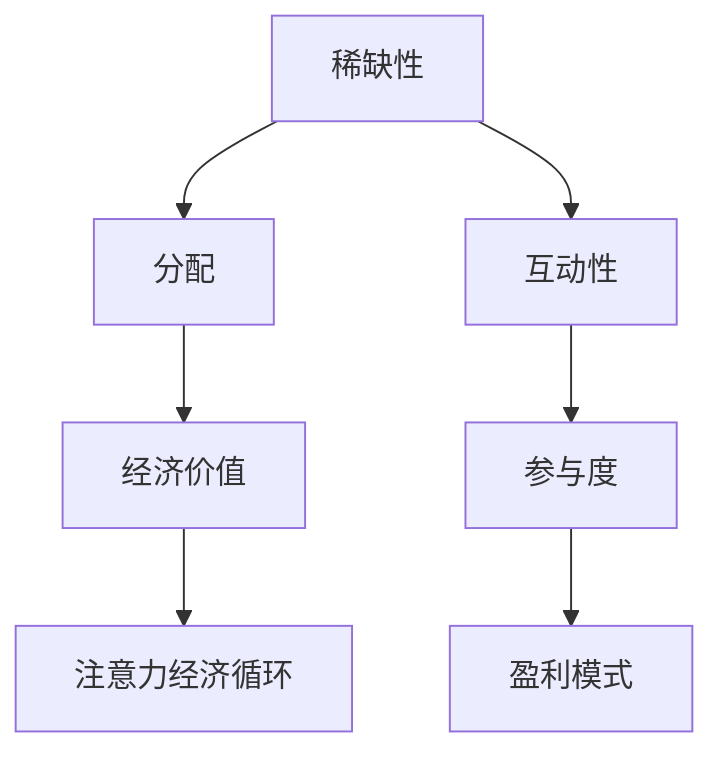

                 

### 文章标题

“注意力经济与个性化推荐系统：为受众提供定制、有针对性的内容和体验”

### 关键词

- 注意力经济
- 个性化推荐系统
- 内容定制
- 用户互动
- 盈利模式

### 摘要

本文深入探讨了注意力经济与个性化推荐系统的结合，解析了注意力经济的核心概念和原理，并阐述了个性化推荐系统如何通过用户建模、推荐算法和实时优化，为受众提供定制化和有针对性的内容和体验。文章通过详细的流程图、伪代码、数学模型和实际项目案例，全面展示了这一领域的前沿技术与应用。

#### 目录大纲

1. **第一部分：注意力经济基础**

   - **第1章：注意力经济概述**
     - 1.1 注意力经济的定义与原理
     - 1.2 注意力经济与传统经济的对比
     - 1.3 注意力经济的核心概念与联系
     - 1.4 注意力经济对社会的影响

   - **第2章：注意力经济理论**
     - 2.1 注意力经济学原理
     - 2.2 注意力市场理论
     - 2.3 注意力价值评估方法

   - **第3章：注意力获取策略**
     - 3.1 内容优化策略
     - 3.2 用户互动策略
     - 3.3 社交媒体营销策略
     - 3.4 注意力经济学在企业中的应用案例

2. **第二部分：个性化推荐系统**

   - **第4章：个性化推荐系统概述**
     - 4.1 个性化推荐系统的定义与分类
     - 4.2 个性化推荐系统的核心组成部分
     - 4.3 个性化推荐系统的发展历程
     - 4.4 个性化推荐系统的重要性

   - **第5章：用户建模**
     - 5.1 用户行为数据收集
     - 5.2 用户偏好模型
     - 5.3 用户兴趣模型
     - 5.4 用户画像构建

   - **第6章：推荐算法**
     - 6.1 协同过滤算法
     - 6.2 内容推荐算法
     - 6.3 深度学习推荐算法

   - **第7章：推荐系统评估与优化**
     - 7.1 推荐系统评估指标
     - 7.2 推荐结果分析
     - 7.3 优化策略
     - 7.4 实时推荐系统设计与优化

   - **第8章：个性化推荐系统项目实战**
     - 8.1 项目介绍
     - 8.2 系统设计
     - 8.3 数据预处理
     - 8.4 用户建模
     - 8.5 推荐算法实现
     - 8.6 系统部署与优化

3. **第三部分：个性化推荐系统应用场景**

   - **第9章：电商推荐系统**
     - 9.1 电商推荐系统的特点
     - 9.2 用户行为数据收集与分析
     - 9.3 个性化推荐算法应用

   - **第10章：社交媒体推荐系统**
     - 10.1 社交媒体推荐系统的挑战
     - 10.2 个性化推荐算法在社交媒体中的应用
     - 10.3 社交网络分析在推荐系统中的作用

   - **第11章：教育推荐系统**
     - 11.1 教育推荐系统的需求
     - 11.2 个性化学习路径推荐算法
     - 11.3 教育推荐系统的实施案例

   - **第12章：医疗健康推荐系统**
     - 12.1 医疗健康推荐系统的应用场景
     - 12.2 个性化健康建议推荐算法
     - 12.3 医疗健康推荐系统的实践挑战

4. **附录**

   - **附录A：推荐系统常用工具与资源**
   - **参考文献**

### **第一部分：注意力经济基础**

注意力经济作为21世纪重要的经济理论之一，近年来在各个领域得到了广泛应用。它强调在信息过载的时代，注意力资源变得稀缺，因此如何获取和分配注意力成为企业、平台和个人关注的焦点。本文将首先介绍注意力经济的核心概念和原理，并探讨其与传统经济的对比，以及对社会的影响。

#### 第1章：注意力经济概述

##### 1.1 注意力经济的定义与原理

注意力经济，可以定义为在信息过载环境中，通过吸引和保持用户的注意力来创造价值的经济活动。其核心原理在于，随着信息的爆炸性增长，人们的注意力资源变得有限和稀缺。因此，任何能够有效吸引和保持用户注意力的内容或产品，都能在市场上获得更高的价值。

在注意力经济中，注意力被视为一种新的生产要素，与传统的土地、劳动力和资本并列。这一理论的提出，改变了人们对经济价值的认识，使得内容创造、用户体验设计等非传统领域，也成为创造经济价值的重要手段。

##### 1.2 注意力经济与传统经济的对比

传统经济理论认为，经济活动主要通过资源的有效配置和利用来创造价值。然而，在注意力经济中，注意力资源的获取和利用成为核心。两者之间的主要区别在于：

- **资源定义**：传统经济主要关注物质资源，如土地、劳动力和资本。而注意力经济将注意力视为一种新的资源，它既可以是物质的（如广告中的图像和文字），也可以是非物质的（如社交媒体上的点赞和评论）。
- **价值创造方式**：传统经济主要通过生产和销售实物商品或服务来创造价值。而注意力经济则通过吸引和保持用户的注意力，使其产生消费行为，从而创造价值。
- **稀缺性**：传统经济中，物质资源的稀缺性通常通过供求关系来体现。而在注意力经济中，注意力资源的稀缺性则体现在用户的时间和注意力有限，如何有效吸引和利用成为关键。

##### 1.3 注意力经济的核心概念与联系

注意力经济的核心概念包括：

- **稀缺性**：注意力资源的稀缺性决定了其价值。在信息爆炸的时代，如何从海量信息中脱颖而出，成为获取用户注意力的关键。
- **分配**：注意力资源的分配直接影响其价值。有效的分配策略，如内容优化和用户互动，能够提高用户的参与度和满意度。
- **经济价值**：注意力资源通过吸引用户注意力，促进消费行为，从而创造经济价值。这种价值不仅体现在直接的广告收入，还包括品牌价值、用户忠诚度等。
- **互动性**：用户与内容或产品之间的互动性是注意力经济的关键。通过互动，用户产生情感连接，从而提高参与度和忠诚度。

这些概念之间相互联系，共同构成了注意力经济的基础。例如，内容的优化策略（稀缺性）能够提高用户的参与度（互动性），从而创造更高的经济价值。

##### 1.4 注意力经济对社会的影响

注意力经济对社会的影响深远，不仅改变了经济活动的方式，也改变了人们的生活和工作方式：

- **商业模式的变革**：注意力经济促使企业重新思考商业模式，从传统的产品导向转向用户导向。通过提供有价值的内容和体验，企业能够更好地吸引和留住用户。
- **信息传播方式的改变**：在注意力经济的背景下，信息传播不再仅仅依靠传统媒体，而是通过社交媒体、搜索引擎等平台实现。这种变化，使得信息传播更加快速和广泛。
- **用户行为的变化**：注意力经济的兴起，使得用户更加关注有价值的内容和体验。用户在信息过载的环境中，倾向于选择那些能够提供个性化、定制化内容和服务的平台。
- **社会结构的变化**：注意力经济对社会的长远影响，将导致社会结构的变化。那些能够有效吸引和保持用户注意力的个体或组织，将在社会中获得更大的影响力。

##### **1.3.1 Mermaid 流程图：注意力经济核心概念**

以下是一个简化的Mermaid流程图，展示了注意力经济中的核心概念和它们之间的联系：



##### **1.4 注意力经济对社会的影响**

注意力经济对社会的影响是多方面的：

- **商业影响**：企业需要更加关注用户体验和内容质量，以吸引和留住用户。
- **文化影响**：内容创作和传播的方式发生变化，个性化内容得到更多关注。
- **教育影响**：注意力经济促使教育模式向个性化、定制化转变。
- **社会结构**：注意力经济可能导致社会分层加剧，那些能够创造和吸引注意力的个体将获得更多资源和机会。

通过以上分析，我们可以看到注意力经济在现代社会中的重要性，以及它如何改变我们的经济活动和生活方式。

---

在下一章中，我们将进一步探讨注意力经济理论，包括注意力经济学原理、注意力市场理论以及注意力价值评估方法，帮助读者更深入地理解这一新兴的经济理论。

---

#### 第2章：注意力经济理论

在了解了注意力经济的核心概念后，我们接下来将深入探讨注意力经济理论，包括注意力经济学原理、注意力市场理论以及注意力价值评估方法。这些理论为理解注意力经济的运作机制提供了深刻的洞见，同时也为我们提供了评估和管理注意力资源的方法。

##### 2.1 注意力经济学原理

注意力经济学原理是基于经济学的基本理论，但将其应用于注意力资源的获取、分配和利用。以下是几个关键原理：

- **稀缺性原理**：注意力资源是有限的，因此其价值取决于稀缺程度。在信息过载的时代，如何从海量信息中脱颖而出，成为获取用户注意力的关键。
- **边际效用递减原理**：用户对信息的消费存在边际效用递减现象。也就是说，当用户接收到的信息量增加时，每个额外单位的信息对其产生的效用逐渐减少。因此，企业需要提供高质量、有价值的信息，以最大化用户的注意力和满意度。
- **价格机制原理**：在注意力市场中，价格机制起着重要作用。通过广告费用、订阅费用等方式，企业可以购买用户的注意力，从而实现商业目的。价格机制的运作，有助于优化注意力的分配，提高资源利用效率。

##### **2.1.1 伪代码：注意力分配算法**

为了更好地理解注意力经济学原理，我们可以通过一个简单的注意力分配算法来展示其应用。以下是一个基于用户偏好和内容相似度的注意力分配算法：

```python
def attention_allocation(content, user_preferences):
    # 初始化权重数组
    weights = [0] * len(content)
    
    # 计算内容与用户偏好的相似度
    for i in range(len(content)):
        similarity = similarity_measure(content[i], user_preferences)
        weights[i] = similarity
    
    # 归一化权重
    total_similarity = sum(weights)
    for i in range(len(weights)):
        weights[i] /= total_similarity
    
    return weights
```

在这个算法中，`content` 表示一系列内容，`user_preferences` 表示用户的偏好。`similarity_measure` 是一个函数，用于计算内容和用户偏好之间的相似度。通过这个算法，我们可以为每个内容分配一个权重，表示用户对其注意力的分配比例。

##### **2.2 注意力市场理论**

注意力市场理论关注的是注意力资源的供求关系及其市场机制。以下是几个关键概念：

- **需求函数**：需求函数描述了用户在不同价格水平下愿意购买的注意力数量。需求函数受用户偏好、内容质量、市场环境等因素影响。
- **供给函数**：供给函数描述了内容提供者在不同价格水平下愿意提供的注意力资源数量。供给函数受内容质量、成本、市场需求等因素影响。
- **均衡价格**：在注意力市场中，需求和供给的均衡价格是市场机制的关键。在这个价格水平下，供给量等于需求量，市场达到平衡。
- **市场机制**：市场机制包括价格机制、竞争机制和激励机制。价格机制通过广告费用、订阅费用等方式实现注意力资源的分配。竞争机制促使内容提供者提高内容质量，以获取更多用户注意力。激励机制通过奖励机制鼓励用户参与和分享，从而提高整体注意力价值。

##### **2.3 注意力价值评估方法**

注意力价值评估方法用于量化注意力资源的价值，为企业和平台提供决策依据。以下是几种常见的方法：

- **成本效益分析**：成本效益分析是一种常用的价值评估方法，通过计算投入成本与收益的比值，评估注意力资源的价值。如果收益大于成本，则表明注意力资源具有价值。
  
- **收益模型**：收益模型是一种基于用户参与度和消费行为的注意力价值评估方法。通过预测用户在未来一段时间内的消费行为，计算其带来的潜在收益，从而评估注意力资源的价值。

- **数学模型**：数学模型是一种通过建立数学公式，量化注意力价值的方法。常见的数学模型包括价格弹性模型、边际效用模型等。以下是一个简单的数学模型，用于评估注意力价值：

  $$ V = f(p, q, r) $$
  
  其中，\( V \) 表示注意力价值，\( p \) 表示内容吸引力，\( q \) 表示用户需求，\( r \) 表示用户参与度。这个模型通过综合考虑内容、用户需求和参与度，量化注意力资源的价值。

- **案例分析**：通过实际案例，我们可以更直观地理解注意力价值评估方法的应用。以下是一个注意力价值评估的案例：

  假设一个内容（如一篇文章）的吸引力 \( p \) 为 8，用户需求 \( q \) 为 7，用户参与度 \( r \) 为 9，则注意力价值 \( V \) 计算如下：

  $$ V = f(8, 7, 9) = 8 \times 7 \times 9 = 504 $$
  
  这个结果表明，在该案例中，该内容的注意力价值为 504。企业可以通过这个价值评估结果，优化内容策略，提高用户参与度和收益。

通过以上对注意力经济理论的探讨，我们可以看到注意力经济在现代社会中的重要性，以及其如何改变我们的经济活动和生活方式。在下一章中，我们将进一步探讨注意力获取策略，包括内容优化、用户互动、社交媒体营销等，帮助企业和平台更有效地获取用户注意力。

---

#### 第3章：注意力获取策略

在了解了注意力经济的核心概念和理论之后，我们接下来将探讨如何有效获取用户注意力。注意力获取策略包括内容优化、用户互动、社交媒体营销等多种手段。这些策略在企业运营和市场营销中起着至关重要的作用。以下将详细分析这些策略及其在企业中的应用案例。

##### 3.1 内容优化策略

内容优化是获取用户注意力的关键策略之一。高质量、有价值的内容能够吸引和留住用户，从而提高用户参与度和忠诚度。以下是几种常见的内容优化策略：

- **标题优化**：标题是吸引用户点击的重要因素。一个吸引人的标题能够提高点击率，进而提高用户参与度。例如，使用情感化标题、关键词优化等策略，可以增加用户的点击意愿。

- **视觉设计**：视觉设计在内容优化中扮演着重要角色。高质量、美观的图片和视频能够吸引用户的注意力，提高内容的吸引力。同时，适当的颜色搭配、字体选择等设计元素，也能够增强内容的视觉效果。

- **内容形式**：内容形式直接影响用户参与度。例如，视频内容、互动游戏、在线调查等多样化的内容形式，能够提高用户的参与感和互动性，从而增强用户对内容的关注度。

- **内容更新频率**：定期更新内容能够维持用户的关注度和兴趣。例如，博客、新闻网站等平台，通过定期发布新内容，保持用户的活跃度和粘性。

**案例**：CNN（美国有线电视新闻网）通过标题优化和视觉设计，提高了其新闻内容的吸引力。例如，CNN使用情感化的标题，如“震惊！”、“揭秘！”等，吸引用户点击。同时，CNN注重图片和视频的质量，使新闻内容更加生动和吸引人。

##### 3.2 用户互动策略

用户互动是提高用户参与度和忠诚度的有效手段。通过互动，企业能够与用户建立更紧密的联系，了解用户需求，从而提供更个性化的服务和内容。以下是几种常见的用户互动策略：

- **评论互动**：评论互动是用户参与内容的重要方式。企业可以通过鼓励用户评论、回复用户评论等方式，促进用户之间的互动，提高用户的参与度。

- **社交媒体互动**：社交媒体平台为企业提供了与用户互动的便利渠道。通过在社交媒体上发布内容、回复用户评论、举办在线活动等方式，企业能够与用户保持密切联系，提高用户的忠诚度。

- **线上活动**：线上活动是企业吸引用户注意力和参与的有效方式。例如，线上讲座、互动游戏、抽奖活动等，能够激发用户的兴趣，提高用户的参与度。

- **个性化互动**：通过数据分析，企业可以了解用户的偏好和行为，提供个性化的互动体验。例如，针对用户的购买记录和浏览行为，发送定制化的推荐信息，提高用户的满意度和忠诚度。

**案例**：Nike通过社交媒体互动和线上活动，成功提高了用户参与度和忠诚度。Nike在其社交媒体平台上定期发布运动教程、比赛回顾等互动内容，与用户保持密切联系。同时，Nike举办各种线上活动，如跑步挑战、抽奖活动等，激励用户参与，提高用户的忠诚度。

##### 3.3 社交媒体营销策略

社交媒体营销是现代企业获取用户注意力的重要手段。通过社交媒体平台，企业可以迅速传播信息，吸引用户关注。以下是几种常见的社交媒体营销策略：

- **内容营销**：内容营销是通过发布高质量、有价值的内容，吸引用户关注和参与。企业可以通过博客、视频、图片等形式，传播品牌理念、产品信息等。

- **广告营销**：广告营销是利用社交媒体平台的广告投放功能，进行精准推广。通过定向投放广告，企业可以吸引潜在用户，提高品牌知名度。

- **互动营销**：互动营销是通过与用户互动，提高用户参与度和忠诚度。企业可以通过回复评论、点赞、分享等方式，与用户建立联系，提高用户的互动意愿。

- **KOL营销**：KOL（关键意见领袖）营销是通过与社交媒体上的意见领袖合作，利用其影响力推广品牌和产品。KOL营销能够迅速提高品牌曝光度和用户信任度。

**案例**：杜蕾斯通过社交媒体营销，成功吸引了大量用户关注。杜蕾斯在社交媒体平台上发布有趣、有创意的内容，如段子、漫画、热点话题等，吸引用户点击和分享。同时，杜蕾斯与社交媒体上的KOL合作，通过其影响力推广品牌和产品。

##### 3.4 注意力经济学在企业中的应用案例

注意力经济学在企业中的应用非常广泛，以下是一些具体的应用案例：

- **电商企业**：电商企业通过个性化推荐系统，为用户推荐符合其兴趣和需求的产品，提高用户购买意愿。例如，亚马逊利用协同过滤算法和深度学习技术，为用户提供个性化的产品推荐。

- **媒体企业**：媒体企业通过内容优化和用户互动策略，提高用户的参与度和忠诚度。例如，CNN通过标题优化和社交媒体互动，提高了其新闻内容的吸引力和用户粘性。

- **广告公司**：广告公司通过注意力价值评估方法，量化广告投放的效果，优化广告投放策略。例如，通过成本效益分析和收益模型，广告公司可以确定最佳的广告投放方案，提高广告效果。

**案例**：阿里巴巴通过注意力经济学原理，成功提高了其电商平台的用户参与度和盈利能力。阿里巴巴通过个性化推荐系统，为用户提供个性化的产品推荐，提高了用户购买意愿。同时，阿里巴巴通过内容优化和用户互动策略，提高了用户的参与度和忠诚度。

综上所述，注意力获取策略在现代社会中具有重要意义。企业通过内容优化、用户互动、社交媒体营销等策略，可以有效地获取用户注意力，提高用户参与度和忠诚度，从而实现商业目标。在下一章中，我们将进一步探讨个性化推荐系统的核心组成部分和发展历程。

---

#### 第4章：个性化推荐系统概述

个性化推荐系统是现代信息技术领域中的一项重要技术，它在电商、媒体、社交网络等多个领域得到了广泛应用。个性化推荐系统能够根据用户的兴趣和行为，为其推荐符合其需求和喜好的内容或产品，从而提高用户的满意度和忠诚度。本节将介绍个性化推荐系统的定义与分类、核心组成部分、发展历程以及其重要性。

##### 4.1 个性化推荐系统的定义与分类

个性化推荐系统（Personalized Recommendation System）是指利用用户历史行为数据、偏好信息以及其他相关数据，通过算法和模型对用户兴趣进行预测，并为其推荐符合其需求的内容或产品的一种系统。个性化推荐系统的主要目标是为用户提供个性化、有针对性的内容和体验，从而提高用户满意度和参与度。

个性化推荐系统可以根据不同的分类标准进行分类：

- **基于内容的推荐**：基于内容的推荐系统（Content-Based Filtering）通过分析内容特征，将用户喜欢的项目与当前项目的相似性作为推荐依据。例如，如果用户喜欢某一类型的书籍，系统会推荐具有相似内容的书籍。

- **协同过滤推荐**：协同过滤推荐系统（Collaborative Filtering）通过分析用户之间的行为模式，发现相似用户或项目，并基于这些相似性进行推荐。协同过滤推荐分为两种：基于用户的协同过滤（User-Based Collaborative Filtering）和基于项目的协同过滤（Item-Based Collaborative Filtering）。

- **混合推荐**：混合推荐系统（Hybrid Recommendation）结合了基于内容和协同过滤的推荐方法，以弥补单一方法的不足。混合推荐系统通过综合利用用户行为数据和内容特征，提高推荐准确性和用户满意度。

- **深度学习推荐**：深度学习推荐系统利用深度学习算法，如神经网络、卷积神经网络（CNN）等，对大规模用户行为数据进行建模，从而实现更精准的推荐。

##### 4.2 个性化推荐系统的核心组成部分

个性化推荐系统通常由以下几个核心组成部分构成：

- **用户建模**：用户建模是推荐系统的第一步，通过收集和分析用户行为数据，建立用户偏好模型。用户建模包括用户兴趣建模、用户行为数据收集、用户行为特征提取等过程。

- **推荐算法**：推荐算法是推荐系统的核心，用于根据用户偏好和历史行为数据，预测用户对某一内容的兴趣，并生成推荐列表。常见的推荐算法包括基于内容的推荐、协同过滤推荐、混合推荐和深度学习推荐等。

- **推荐评估**：推荐评估用于评估推荐系统的性能和效果。常用的评估指标包括准确率（Precision）、召回率（Recall）、F1分数（F1 Score）等。通过评估，可以发现和改进推荐系统的不足之处。

- **推荐结果呈现**：推荐结果呈现是将推荐结果以用户友好的方式展示给用户。推荐结果呈现包括推荐列表的排序、推荐内容的形式和展示方式等。

##### 4.3 个性化推荐系统的发展历程

个性化推荐系统的发展历程可以追溯到20世纪90年代。以下是几个关键的发展阶段：

- **初期阶段（1990s）**：在这一阶段，研究人员开始探索如何利用用户行为数据实现个性化推荐。最早的推荐系统如Netflix Prize，通过举办比赛推动了推荐系统技术的发展。

- **成熟阶段（2000s）**：随着互联网和电子商务的兴起，个性化推荐系统在电商、媒体等领域得到广泛应用。这一阶段，基于协同过滤的推荐算法得到快速发展，如基于用户的协同过滤（User-Based Collaborative Filtering）和基于项目的协同过滤（Item-Based Collaborative Filtering）。

- **深度学习阶段（2010s至今）**：随着深度学习技术的兴起，个性化推荐系统开始利用深度学习算法，如神经网络、卷积神经网络（CNN）等，对大规模用户行为数据进行建模，实现更精准的推荐。

##### 4.4 个性化推荐系统的重要性

个性化推荐系统在现代社会中具有重要意义，主要体现在以下几个方面：

- **提高用户满意度**：个性化推荐系统通过为用户提供符合其兴趣和需求的内容或产品，提高了用户的满意度和体验。

- **增加用户粘性**：个性化推荐系统能够持续吸引用户注意力，提高用户对平台的粘性。

- **优化资源利用**：个性化推荐系统通过智能推荐，帮助用户快速找到所需内容或产品，优化了资源的利用效率。

- **提升商业价值**：个性化推荐系统能够提高用户的购买意愿和转化率，为企业和平台带来更高的商业价值。

综上所述，个性化推荐系统作为现代信息技术的重要应用，通过对用户行为和兴趣的深度挖掘，为用户提供个性化、有针对性的内容和体验，具有广泛的应用前景和重要价值。在下一章中，我们将进一步探讨个性化推荐系统的用户建模过程，包括用户行为数据收集、用户偏好模型构建、用户兴趣模型构建和用户画像构建。

---

#### 第5章：用户建模

用户建模是个性化推荐系统的核心步骤之一，通过分析用户的历史行为数据、偏好信息等，构建用户模型，为后续的推荐算法提供基础数据。本章将详细讨论用户建模的各个环节，包括用户行为数据收集、用户偏好模型、用户兴趣模型和用户画像构建。

##### 5.1 用户行为数据收集

用户行为数据是用户建模的基础，通过收集和分析这些数据，可以更好地了解用户的兴趣和需求。以下是几种常见的用户行为数据收集方法：

- **显式反馈**：显式反馈是指用户主动提供的评价数据，如评分、投票、评论等。这些数据直接反映了用户的喜好和满意度。例如，在电商平台上，用户对商品的评分和评论就是重要的显式反馈数据。

- **隐式反馈**：隐式反馈是指用户在互动过程中产生的行为数据，如浏览历史、购买记录、搜索历史等。这些数据间接反映了用户的兴趣和偏好。例如，用户在电商平台上的浏览记录和购买行为就是重要的隐式反馈数据。

- **社交网络数据**：用户在社交网络上的互动行为，如点赞、转发、评论等，也是重要的用户行为数据。通过分析这些数据，可以了解用户的社交关系和兴趣。

- **传感器数据**：随着物联网和传感器技术的发展，用户行为数据收集的范围不断扩大。例如，智能手表、手机等设备可以收集用户的运动、健康等数据，为个性化推荐提供更多维度的信息。

##### 5.2 用户偏好模型

用户偏好模型用于描述用户对不同内容的喜好程度，是推荐算法的重要输入。以下是几种常见的用户偏好模型构建方法：

- **基于评分的偏好模型**：基于评分的偏好模型通过分析用户对内容的评分数据，构建用户偏好模型。例如，在电商平台上，用户对商品的评分可以用来构建用户偏好模型。

- **基于行为的偏好模型**：基于行为的偏好模型通过分析用户的浏览历史、购买记录等行为数据，构建用户偏好模型。这种方法利用用户的隐式反馈，对用户的兴趣进行建模。

- **基于内容的偏好模型**：基于内容的偏好模型通过分析内容特征，将用户喜欢的项目与当前项目的相似性作为推荐依据。例如，如果用户喜欢某一类型的书籍，系统会推荐具有相似内容的书籍。

- **混合偏好模型**：混合偏好模型结合了基于评分、行为和内容的偏好模型，以综合利用不同类型的数据，提高用户偏好模型的准确性。

##### **5.2.1 伪代码：用户偏好模型构建**

以下是一个简单的用户偏好模型构建的伪代码示例：

```python
def build_user_preference_model(user_data):
    preferences = {}
    for item in user_data:
        if item['rating'] > 3:
            preferences[item['item_id']] = 1
        else:
            preferences[item['item_id']] = 0
    return preferences
```

在这个示例中，`user_data` 是一个包含用户历史评分的数据集。如果用户对某个项目的评分高于3，则认为用户对该项目感兴趣，标记为1；否则，标记为0。这种方法简单但有效，可以用于初步的用户偏好建模。

##### 5.3 用户兴趣模型

用户兴趣模型用于描述用户在不同领域或主题上的兴趣分布，是推荐算法的重要输入。以下是几种常见的用户兴趣模型构建方法：

- **基于聚类的方法**：基于聚类的方法通过将用户分为不同的兴趣群体，为每个群体生成兴趣模型。例如，可以使用K-means算法对用户进行聚类，然后为每个聚类生成一个兴趣模型。

- **基于矩阵分解的方法**：基于矩阵分解的方法通过分析用户行为数据，将用户兴趣和内容特征进行分解，生成用户兴趣模型。例如，可以使用协同过滤算法中的矩阵分解方法（如Singular Value Decomposition，SVD）来生成用户兴趣模型。

- **基于主题模型的方法**：基于主题模型的方法通过分析用户行为数据，提取用户感兴趣的主题，生成用户兴趣模型。例如，可以使用Latent Dirichlet Allocation（LDA）模型来提取用户兴趣主题。

##### 5.4 用户画像构建

用户画像（User Profile）是通过对用户的多维度信息进行综合分析，构建的一个反映用户特征和行为的模型。用户画像可以用于推荐系统、用户行为分析、个性化营销等多个领域。以下是几种常见的用户画像构建方法：

- **基于属性的画像**：基于属性的画像通过收集用户的基本信息（如年龄、性别、职业等）和属性特征（如消费习惯、兴趣爱好等），构建用户画像。例如，用户画像可以包含用户的年龄、收入水平、购买偏好等信息。

- **基于行为的画像**：基于行为的画像通过分析用户的行为数据（如浏览历史、购买记录、搜索历史等），构建用户画像。例如，用户画像可以包含用户的浏览时长、访问频率、购买频率等信息。

- **基于属性的画像和行为的结合**：通过结合用户属性和行为的分析，构建更全面、精准的用户画像。例如，用户画像可以包含用户的属性特征（如年龄、性别）和行为特征（如购买记录），从而为推荐系统提供更全面的用户信息。

##### **5.4.1 伪代码：用户画像构建**

以下是一个简单的用户画像构建的伪代码示例：

```python
def build_user_profile(user_data, behavior_data):
    profile = {
        '基本信息': {
            '年龄': user_data['age'],
            '性别': user_data['gender'],
            '职业': user_data['occupation'],
        },
        '行为特征': {
            '浏览时长': behavior_data['view_duration'],
            '访问频率': behavior_data['visit_frequency'],
            '购买频率': behavior_data['purchase_frequency'],
        },
    }
    return profile
```

在这个示例中，`user_data` 是一个包含用户基本信息的数据集，`behavior_data` 是一个包含用户行为特征的数据集。通过结合这两个数据集，可以构建一个反映用户特征和行为的用户画像。

通过用户建模，个性化推荐系统能够更好地理解用户需求和行为，从而为用户提供更精准、个性化的推荐。在下一章中，我们将详细探讨个性化推荐系统的推荐算法，包括协同过滤算法、内容推荐算法和深度学习推荐算法。

---

#### 第6章：推荐算法

推荐算法是构建个性化推荐系统的核心，通过分析用户行为数据和内容特征，预测用户对特定内容的兴趣，从而生成推荐列表。本章将详细介绍几种常见的推荐算法，包括协同过滤算法、内容推荐算法和深度学习推荐算法。

##### 6.1 协同过滤算法

协同过滤算法（Collaborative Filtering）是推荐系统中应用最广泛的算法之一，它通过分析用户之间的行为模式，发现相似的用户或项目，并基于这些相似性进行推荐。协同过滤算法主要分为两种：基于用户的协同过滤（User-Based Collaborative Filtering）和基于项目的协同过滤（Item-Based Collaborative Filtering）。

###### **6.1.1 基于用户的协同过滤算法**

基于用户的协同过滤算法通过找到与目标用户相似的其他用户，并推荐这些相似用户喜欢的项目。以下是基于用户的协同过滤算法的伪代码示例：

```python
def collaborative_filtering(user_preference_matrix, target_user_id, k=10):
    neighbors = get_neighbors(user_preference_matrix, target_user_id, k)
    recommendations = []
    for neighbor in neighbors:
        for item in neighbor['items']:
            if item not in user_preference_matrix[target_user_id]['items']:
                if item in recommendations:
                    recommendations[item] += neighbor['similarity']
                else:
                    recommendations[item] = neighbor['similarity']
    sorted_recommendations = sorted(recommendations.items(), key=lambda item: item[1], reverse=True)
    return sorted_recommendations
```

在这个算法中，`user_preference_matrix` 是一个用户-项目评分矩阵，`target_user_id` 是目标用户的ID，`k` 是邻居用户的数量。`get_neighbors` 函数用于获取与目标用户相似的其他用户。通过计算邻居用户喜欢的项目，并将这些项目添加到推荐列表中，算法生成了一个排序后的推荐列表。

###### **6.1.2 基于项目的协同过滤算法**

基于项目的协同过滤算法通过找到与目标项目相似的其他项目，并推荐这些相似项目给用户。以下是基于项目的协同过滤算法的伪代码示例：

```python
def item_based_collaborative_filtering(user_preference_matrix, target_user_id, k=10):
    similar_items = get_similar_items(user_preference_matrix, target_user_id, k)
    recommendations = []
    for item in similar_items:
        if item not in user_preference_matrix[target_user_id]['items']:
            if item in recommendations:
                recommendations[item] += 1
            else:
                recommendations[item] = 1
    sorted_recommendations = sorted(recommendations.items(), key=lambda item: item[1], reverse=True)
    return sorted_recommendations
```

在这个算法中，`get_similar_items` 函数用于获取与目标项目相似的其他项目。通过计算这些相似项目在用户中的受欢迎程度，并将这些项目添加到推荐列表中，算法生成了一个排序后的推荐列表。

##### 6.2 内容推荐算法

内容推荐算法（Content-Based Filtering）通过分析内容特征，将用户喜欢的项目与当前项目的相似性作为推荐依据。以下是内容推荐算法的伪代码示例：

```python
def content_based_filtering(content_features, user_preferences, target_item_features, k=10):
    similar_items = []
    for item in content_features:
        if item not in user_preferences['items']:
            similarity = calculate_similarity(target_item_features, item['features'])
            similar_items.append((item['id'], similarity))
    sorted_similar_items = sorted(similar_items, key=lambda item: item[1], reverse=True)
    top_k_items = sorted_similar_items[:k]
    return top_k_items
```

在这个算法中，`content_features` 是一个包含所有项目特征的数据集，`user_preferences` 是用户偏好模型，`target_item_features` 是目标项目的特征。通过计算目标项目与其他项目的相似度，并将这些项目添加到推荐列表中，算法生成了一个排序后的推荐列表。

##### 6.3 深度学习推荐算法

深度学习推荐算法利用深度学习模型，如神经网络、卷积神经网络（CNN）等，对大规模用户行为数据进行建模，实现更精准的推荐。以下是深度学习推荐算法的伪代码示例：

```python
def deep_learning_recommendation(model, user_preference_vector, item_embeddings):
    user_representation = model.user_embedding(user_preference_vector)
    recommendations = []
    for item_embedding in item_embeddings:
        similarity = calculate_similarity(user_representation, item_embedding)
        recommendations.append((item_embedding['item_id'], similarity))
    sorted_recommendations = sorted(recommendations, key=lambda item: item[1], reverse=True)
    return sorted_recommendations
```

在这个算法中，`model` 是一个深度学习模型，`user_preference_vector` 是用户偏好向量，`item_embeddings` 是项目嵌入向量。通过计算用户偏好向量与项目嵌入向量之间的相似度，并将这些项目添加到推荐列表中，算法生成了一个排序后的推荐列表。

通过以上对推荐算法的介绍，我们可以看到推荐算法在个性化推荐系统中的重要地位。在下一章中，我们将探讨推荐系统的评估与优化，包括评估指标、推荐结果分析和优化策略。

---

#### 第7章：推荐系统评估与优化

推荐系统的评估与优化是确保其性能和效果的重要环节。通过科学的评估方法和持续优化，推荐系统可以提供更精准、个性化的推荐结果，从而提高用户满意度。本章将详细介绍推荐系统的评估指标、推荐结果分析、优化策略以及实时推荐系统设计与优化。

##### 7.1 推荐系统评估指标

评估推荐系统性能的关键指标包括准确率（Precision）、召回率（Recall）、F1分数（F1 Score）等。以下是这些指标的定义和计算方法：

- **准确率（Precision）**：准确率是指推荐结果中实际感兴趣的项目的比例。计算公式如下：

  $$ Precision = \frac{TP}{TP + FP} $$

  其中，\( TP \) 是推荐结果中实际感兴趣的项目数，\( FP \) 是推荐结果中不感兴趣但被推荐的项目数。

- **召回率（Recall）**：召回率是指实际感兴趣的项目中被推荐的项目比例。计算公式如下：

  $$ Recall = \frac{TP}{TP + FN} $$

  其中，\( FN \) 是实际感兴趣但未被推荐的项目数。

- **F1分数（F1 Score）**：F1分数是准确率和召回率的加权平均，用于综合评估推荐系统的性能。计算公式如下：

  $$ F1 Score = 2 \times \frac{Precision \times Recall}{Precision + Recall} $$

这些指标在不同场景下有着不同的权重。例如，在电商推荐系统中，准确率可能更重要，因为用户更关心推荐结果中是否包含他们真正感兴趣的商品。而在新闻推荐系统中，召回率可能更重要，因为用户希望看到尽可能多的相关新闻。

##### 7.2 推荐结果分析

推荐结果分析是评估推荐系统性能的重要环节。通过分析推荐结果，可以发现系统的优点和不足，为后续优化提供依据。以下是几种常用的推荐结果分析方法：

- **推荐效果可视化**：通过可视化工具，如条形图、折线图等，展示推荐结果的效果。这有助于直观地了解推荐系统的性能和用户反馈。

- **错误分析**：对推荐结果中的错误项目进行分类和分析，找出可能导致错误的原因。例如，是数据质量、算法问题还是用户偏好分析不准确。

- **用户反馈**：通过收集用户对推荐结果的反馈，了解用户对推荐系统的满意度。用户反馈可以用于改进推荐算法和用户体验。

- **A/B测试**：通过对比不同推荐策略的推荐结果，评估它们的效果。A/B测试是一种有效的优化方法，可以帮助确定最佳推荐策略。

##### 7.3 优化策略

优化策略是提升推荐系统性能的关键。以下是几种常见的优化策略：

- **特征工程**：通过改进特征工程，提高推荐系统的预测准确性。特征工程包括特征提取、特征选择、特征变换等。

- **算法改进**：通过改进推荐算法，提高推荐系统的效果。例如，可以尝试更复杂的协同过滤算法、基于内容的推荐算法或深度学习推荐算法。

- **数据质量**：数据质量直接影响推荐系统的性能。通过数据清洗、去噪和去重复等数据预处理方法，提高数据质量。

- **个性化推荐**：通过增加个性化元素，提高推荐系统的相关性。例如，结合用户历史行为和实时行为，提供更精准的推荐。

- **反馈机制**：通过引入用户反馈机制，实时调整推荐策略。用户反馈可以帮助系统更好地理解用户需求，从而提高推荐准确性。

##### 7.4 实时推荐系统设计与优化

实时推荐系统（Real-Time Recommendation System）能够根据用户的实时行为和偏好，提供即时的推荐结果。设计实时推荐系统需要考虑以下几个方面：

- **数据流处理**：实时推荐系统需要处理大量的实时数据流，如用户的点击、浏览、搜索等行为。使用流处理技术（如Apache Kafka、Apache Flink等）可以有效处理这些数据。

- **在线学习**：实时推荐系统需要使用在线学习算法，如梯度下降、在线梯度提升树（Online Gradient Boosting Tree）等，以快速调整模型参数，适应实时数据的变化。

- **推荐延迟**：实时推荐系统的推荐延迟需要控制在一定范围内，以确保用户能够快速获得推荐结果。通过优化算法和数据流处理，可以降低推荐延迟。

- **推荐多样性**：实时推荐系统需要提供多样性的推荐结果，避免用户陷入信息茧房。可以通过引入随机性、多样性排序算法等手段，提高推荐结果的多样性。

- **扩展性**：实时推荐系统需要具备良好的扩展性，以应对不断增长的用户量和数据量。通过分布式架构和容器化技术（如Kubernetes），可以实现系统的水平扩展。

综上所述，推荐系统的评估与优化是确保其性能和效果的重要环节。通过科学的评估指标、推荐结果分析和优化策略，实时推荐系统可以提供更精准、个性化的推荐结果，从而提高用户满意度和忠诚度。在下一章中，我们将通过一个实际项目案例，详细展示个性化推荐系统的实现过程。

---

#### 第8章：个性化推荐系统项目实战

在本章中，我们将通过一个实际项目案例，详细展示个性化推荐系统的实现过程。项目背景为一家电商平台，目标是为用户推荐符合其兴趣和需求的产品，提高用户满意度和转化率。以下是项目的系统设计、数据预处理、用户建模、推荐算法实现以及系统部署与优化。

##### 8.1 项目介绍

本项目旨在构建一个基于电商平台的个性化推荐系统，通过分析用户的历史行为数据、浏览记录和购买记录，为用户推荐符合其兴趣和需求的产品。项目的主要目标包括：

- 提高用户满意度：通过推荐用户感兴趣的产品，提升用户购物体验。
- 增加转化率：通过精准推荐，引导用户进行购买，提高转化率。
- 优化库存管理：通过分析推荐结果和用户行为，优化库存管理和供应链。

##### 8.2 系统设计

个性化推荐系统的系统设计主要包括数据采集模块、数据处理模块、推荐算法模块和推荐结果展示模块。

- **数据采集模块**：负责采集用户的历史行为数据，如浏览记录、购买记录、评价等。数据来源包括电商平台数据库、用户反馈系统等。
- **数据处理模块**：负责清洗、预处理和转换原始数据，为推荐算法模块提供高质量的数据。
- **推荐算法模块**：包括基于用户的协同过滤算法、基于内容的推荐算法和深度学习推荐算法，根据用户的历史行为和偏好，生成个性化推荐结果。
- **推荐结果展示模块**：负责将推荐结果以用户友好的方式展示给用户，包括推荐列表、产品详情页等。

##### 8.3 数据预处理

数据预处理是构建推荐系统的关键步骤，主要包括以下任务：

- **数据清洗**：去除重复、无效和错误的数据，保证数据质量。例如，去除重复的用户记录、纠正错误的评分数据等。
- **特征提取**：从原始数据中提取有用的特征，如用户ID、商品ID、浏览时长、购买频率等。特征提取可以通过统计方法、文本分析等方法实现。
- **数据转换**：将原始数据转换为适合推荐算法处理的数据格式，如矩阵表示、向量表示等。常用的数据转换方法包括One-Hot编码、词袋模型等。

##### 8.4 用户建模

用户建模是推荐系统的核心步骤之一，通过构建用户偏好模型和用户兴趣模型，为推荐算法提供基础数据。

- **用户偏好模型**：通过分析用户的历史行为数据，如浏览记录、购买记录等，构建用户偏好模型。以下是用户偏好模型构建的伪代码示例：

  ```python
  def build_user_preference_model(user_data):
      preferences = {}
      for item in user_data:
          if item['rating'] > 3:
              preferences[item['item_id']] = 1
          else:
              preferences[item['item_id']] = 0
      return preferences
  ```

- **用户兴趣模型**：通过分析用户的浏览历史和购买记录，构建用户兴趣模型。以下是用户兴趣模型构建的伪代码示例：

  ```python
  def build_user_interest_model(user_behavior_data):
      interest_model = {}
      for item in user_behavior_data:
          if item['behavior_type'] == 'view' and item['duration'] > 30:
              interest_model[item['item_id']] = interest_model.get(item['item_id'], 0) + 1
      return interest_model
  ```

##### 8.5 推荐算法实现

推荐算法是实现个性化推荐的核心，本项目结合基于用户的协同过滤算法、基于内容的推荐算法和深度学习推荐算法，为用户生成个性化推荐结果。

- **基于用户的协同过滤算法**：基于用户的协同过滤算法通过找到与目标用户相似的其他用户，并推荐这些相似用户喜欢的项目。以下是基于用户的协同过滤算法的伪代码示例：

  ```python
  def collaborative_filtering(user_preference_matrix, target_user_id, k=10):
      neighbors = get_neighbors(user_preference_matrix, target_user_id, k)
      recommendations = []
      for neighbor in neighbors:
          for item in neighbor['items']:
              if item not in user_preference_matrix[target_user_id]['items']:
                  if item in recommendations:
                      recommendations[item] += neighbor['similarity']
                  else:
                      recommendations[item] = neighbor['similarity']
      sorted_recommendations = sorted(recommendations.items(), key=lambda item: item[1], reverse=True)
      return sorted_recommendations
  ```

- **基于内容的推荐算法**：基于内容的推荐算法通过分析内容特征，将用户喜欢的项目与当前项目的相似性作为推荐依据。以下是基于内容的推荐算法的伪代码示例：

  ```python
  def content_based_filtering(content_features, user_preferences, target_item_features, k=10):
      similar_items = []
      for item in content_features:
          if item not in user_preferences['items']:
              similarity = calculate_similarity(target_item_features, item['features'])
              similar_items.append((item['id'], similarity))
      sorted_similar_items = sorted(similar_items, key=lambda item: item[1], reverse=True)
      top_k_items = sorted_similar_items[:k]
      return top_k_items
  ```

- **深度学习推荐算法**：深度学习推荐算法利用深度学习模型，如神经网络、卷积神经网络（CNN）等，对大规模用户行为数据进行建模，实现更精准的推荐。以下是深度学习推荐算法的伪代码示例：

  ```python
  def deep_learning_recommendation(model, user_preference_vector, item_embeddings):
      user_representation = model.user_embedding(user_preference_vector)
      recommendations = []
      for item_embedding in item_embeddings:
          similarity = calculate_similarity(user_representation, item_embedding)
          recommendations.append((item_embedding['item_id'], similarity))
      sorted_recommendations = sorted(recommendations, key=lambda item: item[1], reverse=True)
      return sorted_recommendations
  ```

##### 8.6 系统部署与优化

个性化推荐系统的部署与优化是确保其稳定运行和高性能的关键。以下是系统部署与优化的一些关键步骤：

- **部署环境搭建**：搭建适合推荐系统运行的部署环境，包括硬件资源、操作系统、数据库等。
- **分布式计算**：通过分布式计算框架（如Apache Spark、Apache Flink等），处理大规模的用户数据和推荐算法。
- **负载均衡**：通过负载均衡技术（如Nginx、HAProxy等），确保系统在高并发情况下稳定运行。
- **实时监控与报警**：通过实时监控系统（如Prometheus、Grafana等），监控系统性能和资源使用情况，及时发现和处理潜在问题。
- **优化策略**：通过持续优化推荐算法和系统架构，提高推荐系统的性能和准确性。例如，可以尝试更复杂的算法、数据预处理技术和优化策略。

通过以上实际项目案例，我们可以看到个性化推荐系统的实现过程，包括系统设计、数据预处理、用户建模、推荐算法实现以及系统部署与优化。在实际应用中，个性化推荐系统可以显著提高用户的购物体验和转化率，为电商平台带来更高的商业价值。

---

#### 第9章：电商推荐系统

电商推荐系统是当前应用最广泛的推荐系统之一，它通过分析用户的历史行为数据、偏好和购物习惯，为用户推荐符合其兴趣和需求的产品，从而提高用户满意度和转化率。本章将详细讨论电商推荐系统的特点、用户行为数据收集与分析，以及个性化推荐算法在电商推荐系统中的应用。

##### 9.1 电商推荐系统的特点

电商推荐系统具有以下几个显著特点：

- **个性化**：电商推荐系统通过分析用户的历史行为数据，了解用户的兴趣和偏好，为用户提供个性化的推荐。这种个性化推荐能够显著提高用户的购物体验和满意度。

- **实时性**：电商推荐系统需要快速响应用户的行为变化，提供实时的推荐结果。例如，当用户浏览某一产品时，系统需要立即为其推荐相似的产品。

- **多样性**：电商推荐系统不仅要为用户提供个性化的推荐，还需要确保推荐结果的多样性，避免用户陷入信息茧房。通过引入随机性和多样性排序算法，可以提供多样化的推荐结果。

- **精确性**：电商推荐系统需要具有较高的精确性，确保推荐结果与用户的兴趣和需求高度相关。精确的推荐结果能够提高用户的购买意愿和转化率。

- **动态调整**：电商推荐系统需要根据用户的行为和反馈，动态调整推荐策略。通过实时监控和优化推荐算法，系统能够不断提高推荐质量和用户满意度。

##### 9.2 用户行为数据收集与分析

用户行为数据是构建电商推荐系统的核心，通过收集和分析用户的行为数据，可以深入了解用户的兴趣和偏好。以下是几种常见的用户行为数据收集方法：

- **浏览历史**：用户的浏览历史记录包括用户在电商平台上浏览过的产品、浏览时间和页面停留时间等。这些数据可以反映用户的兴趣和关注点。

- **购买记录**：用户的购买记录数据包括用户购买的产品、购买时间、购买频率等。通过分析购买记录，可以了解用户的消费习惯和偏好。

- **搜索历史**：用户的搜索历史记录包括用户在电商平台上搜索的关键词、搜索时间和搜索结果等。这些数据可以揭示用户的潜在需求和兴趣。

- **评论和评分**：用户对产品的评论和评分数据可以反映用户对产品的满意度和质量感知。通过分析这些数据，可以进一步了解用户的偏好和需求。

以下是用户行为数据收集与分析的伪代码示例：

```python
def collect_user_behavior_data(user_id):
    # 收集用户浏览历史数据
    browsing_history = fetch_browsing_history(user_id)
    # 收集用户购买记录数据
    purchase_records = fetch_purchase_records(user_id)
    # 收集用户搜索历史数据
    search_history = fetch_search_history(user_id)
    # 收集用户评论和评分数据
    reviews_and_ratings = fetch_reviews_and_ratings(user_id)
    # 分析用户行为数据
    user_interests = analyze_browsing_history(browsing_history)
    user_preferences = analyze_purchase_records(purchase_records)
    user_search_patterns = analyze_search_history(search_history)
    user_feedback = analyze_reviews_and_ratings(reviews_and_ratings)
    return {
        'interests': user_interests,
        'preferences': user_preferences,
        'search_patterns': user_search_patterns,
        'feedback': user_feedback
    }
```

在这个示例中，`fetch_browsing_history`、`fetch_purchase_records`、`fetch_search_history` 和 `fetch_reviews_and_ratings` 分别用于获取用户的浏览历史、购买记录、搜索历史和评论评分数据。`analyze_browsing_history`、`analyze_purchase_records`、`analyze_search_history` 和 `analyze_reviews_and_ratings` 分别用于分析这些数据，构建用户偏好模型和兴趣模型。

##### 9.3 个性化推荐算法在电商推荐系统中的应用

电商推荐系统常用的个性化推荐算法包括基于用户的协同过滤算法、基于内容的推荐算法和深度学习推荐算法。以下是这些算法在电商推荐系统中的应用：

- **基于用户的协同过滤算法**：基于用户的协同过滤算法通过分析用户之间的相似性，发现与目标用户相似的其他用户，并推荐这些用户喜欢的产品。以下是基于用户的协同过滤算法的伪代码示例：

  ```python
  def collaborative_filtering(user_preference_matrix, target_user_id, k=10):
      neighbors = get_neighbors(user_preference_matrix, target_user_id, k)
      recommendations = []
      for neighbor in neighbors:
          for item in neighbor['items']:
              if item not in user_preference_matrix[target_user_id]['items']:
                  if item in recommendations:
                      recommendations[item] += neighbor['similarity']
                  else:
                      recommendations[item] = neighbor['similarity']
      sorted_recommendations = sorted(recommendations.items(), key=lambda item: item[1], reverse=True)
      return sorted_recommendations
  ```

- **基于内容的推荐算法**：基于内容的推荐算法通过分析产品的内容特征，将用户喜欢的项目与当前项目的相似性作为推荐依据。以下是基于内容的推荐算法的伪代码示例：

  ```python
  def content_based_filtering(content_features, user_preferences, target_item_features, k=10):
      similar_items = []
      for item in content_features:
          if item not in user_preferences['items']:
              similarity = calculate_similarity(target_item_features, item['features'])
              similar_items.append((item['id'], similarity))
      sorted_similar_items = sorted(similar_items, key=lambda item: item[1], reverse=True)
      top_k_items = sorted_similar_items[:k]
      return top_k_items
  ```

- **深度学习推荐算法**：深度学习推荐算法利用深度学习模型，如神经网络、卷积神经网络（CNN）等，对大规模用户行为数据进行建模，实现更精准的推荐。以下是深度学习推荐算法的伪代码示例：

  ```python
  def deep_learning_recommendation(model, user_preference_vector, item_embeddings):
      user_representation = model.user_embedding(user_preference_vector)
      recommendations = []
      for item_embedding in item_embeddings:
          similarity = calculate_similarity(user_representation, item_embedding)
          recommendations.append((item_embedding['item_id'], similarity))
      sorted_recommendations = sorted(recommendations, key=lambda item: item[1], reverse=True)
      return sorted_recommendations
  ```

通过以上个性化推荐算法，电商推荐系统可以实时、精准地为用户推荐符合其兴趣和需求的产品，从而提高用户满意度和转化率。

---

#### 第10章：社交媒体推荐系统

社交媒体推荐系统在当前互联网时代扮演着至关重要的角色，它们通过分析用户的社交互动数据，推荐用户可能感兴趣的内容和用户。本章将探讨社交媒体推荐系统的挑战、个性化推荐算法的应用以及社交网络分析在推荐系统中的作用。

##### 10.1 社交媒体推荐系统的挑战

社交媒体推荐系统面临许多独特的挑战，包括：

- **用户生成内容的大量性**：社交媒体平台上用户生成的内容（如帖子、照片、视频）数量庞大，推荐系统需要处理这些海量数据。
- **实时性的需求**：用户在社交媒体上的活动是实时发生的，推荐系统需要快速响应这些活动，提供实时推荐。
- **多样性的内容**：社交媒体上的内容形式多样，包括文本、图像、视频等，推荐系统需要处理不同类型的内容，并为其提供个性化的推荐。
- **隐私保护**：社交媒体用户对隐私保护非常重视，推荐系统需要确保用户数据的安全和隐私。
- **社交网络效应**：社交媒体上的推荐不仅要基于用户的个人兴趣，还需要考虑用户的社交网络关系，推荐系统需要平衡个人兴趣和社交网络效应。

##### 10.2 个性化推荐算法在社交媒体中的应用

为了应对上述挑战，社交媒体推荐系统采用了多种个性化推荐算法：

- **基于内容的推荐算法**：这种算法通过分析内容特征（如标题、标签、图像等），将用户感兴趣的内容推荐给用户。例如，如果一个用户经常点赞关于旅游的文章，系统可以推荐其他旅游相关的文章。
  
- **基于协同过滤的推荐算法**：这种算法通过分析用户之间的相似性，发现与目标用户兴趣相似的其他用户，并推荐这些用户喜欢的内容。例如，如果用户A和用户B的兴趣相似，系统可以推荐用户B喜欢的帖子给用户A。

- **基于用户兴趣的推荐算法**：这种算法通过分析用户的兴趣标签、浏览历史等数据，构建用户兴趣模型，推荐用户可能感兴趣的内容。例如，如果一个用户经常浏览关于美食的帖子，系统可以推荐其他美食相关的帖子。

- **基于深度学习的推荐算法**：这种算法利用深度学习模型（如神经网络、卷积神经网络等），对大规模的用户行为数据进行分析和建模，实现更精准的推荐。例如，可以使用卷积神经网络（CNN）处理用户上传的图像数据，推荐用户可能感兴趣的照片。

以下是基于内容的推荐算法的伪代码示例：

```python
def content_based_recommendation(content_features, user_interests, content_to_recommend, k=10):
    similar_content = []
    for content in content_features:
        if content not in user_interests:
            similarity = calculate_similarity(content['features'], user_interests)
            similar_content.append((content['id'], similarity))
    sorted_similar_content = sorted(similar_content, key=lambda item: item[1], reverse=True)
    top_k_content = sorted_similar_content[:k]
    return top_k_content
```

在这个示例中，`content_features` 是一个包含所有内容特征的数据集，`user_interests` 是用户的兴趣模型，`content_to_recommend` 是需要推荐的内容集合。通过计算内容和用户兴趣之间的相似度，并返回相似度最高的内容作为推荐结果。

##### 10.3 社交网络分析在推荐系统中的作用

社交网络分析（Social Network Analysis，SNA）在社交媒体推荐系统中起着至关重要的作用。通过分析用户之间的社交网络关系，推荐系统可以更全面地了解用户的兴趣和行为，从而提供更精准的推荐。

以下是社交网络分析在推荐系统中的应用：

- **社交网络结构分析**：通过分析用户之间的连接关系，构建社交网络图。例如，可以使用图论算法分析社交网络中的关键节点和社群结构，帮助推荐系统发现用户群体的兴趣和偏好。

- **社交网络传播分析**：通过分析内容在社交网络中的传播路径，预测哪些内容可能在社交网络上获得更多的关注。例如，可以使用传播模型（如Katz模型）预测内容的传播范围和影响力。

- **社交网络影响力分析**：通过分析用户在社交网络中的影响力，识别具有较高影响力的用户。这些用户可以作为推荐系统的推荐源，向其他用户推荐他们感兴趣的内容。

以下是社交网络影响力分析的伪代码示例：

```python
def social_influence_analysis(user_network, content, k=10):
    influencers = []
    for user in user_network:
        if user not in content['influencers']:
            influence_score = calculate_influence_score(user, content)
            influencers.append((user['id'], influence_score))
    sorted_influencers = sorted(influencers, key=lambda item: item[1], reverse=True)
    top_k_influencers = sorted_influencers[:k]
    return top_k_influencers
```

在这个示例中，`user_network` 是一个包含用户之间连接关系的社交网络图，`content` 是需要推荐的内容。通过计算用户对内容的影响力分数，并返回影响力最高的用户作为推荐源。

综上所述，社交媒体推荐系统通过个性化推荐算法和社交网络分析，为用户提供更精准、有针对性的推荐。在下一章中，我们将探讨教育推荐系统的需求、个性化学习路径推荐算法以及教育推荐系统的实施案例。

---

#### 第11章：教育推荐系统

随着在线教育平台的兴起，教育推荐系统成为提升学习效果和学生满意度的关键工具。本章将讨论教育推荐系统的需求、个性化学习路径推荐算法以及其实施案例。

##### 11.1 教育推荐系统的需求

教育推荐系统在在线教育环境中具有以下几个关键需求：

- **个性化学习**：教育推荐系统应能够根据学生的学习进度、学习风格和兴趣爱好，推荐适合的学习资源和课程。
- **学习路径优化**：系统需要为学生提供一条最优的学习路径，帮助学生高效地掌握知识和技能。
- **学习效果评估**：通过跟踪学生的学习行为和成果，系统可以评估学习效果，提供改进建议。
- **实时反馈**：系统应能够实时响应用户的学习行为，提供即时的学习资源和指导。
- **适应不同学习方式**：系统需要支持多种学习方式，如视频课程、文本教程、互动游戏等。

##### 11.2 个性化学习路径推荐算法

个性化学习路径推荐算法是教育推荐系统的核心。以下是几种常见的个性化学习路径推荐算法：

- **基于内容的推荐算法**：这种算法通过分析课程内容、知识点关联，为用户推荐相关的学习资源和课程。例如，如果一个学生正在学习编程，系统可以推荐与其相关的数据结构、算法等课程。

- **基于协同过滤的推荐算法**：这种算法通过分析学生与其他学生的行为相似性，发现与学生兴趣相似的其他学生，并推荐这些学生推荐的学习资源和课程。

- **基于模型的推荐算法**：这种算法通过构建学生模型和学习内容模型，预测学生的兴趣和学习路径。例如，可以使用决策树、神经网络等模型，根据学生的特征（如学习时长、测试成绩等），推荐适合的学习资源和课程。

以下是基于内容的推荐算法的伪代码示例：

```python
def content_based_learning_path_recommendation(course_content, student_preferences, recommended_courses, k=10):
    similar_courses = []
    for course in course_content:
        if course not in student_preferences:
            similarity = calculate_similarity(course['content'], student_preferences)
            similar_courses.append((course['id'], similarity))
    sorted_similar_courses = sorted(similar_courses, key=lambda item: item[1], reverse=True)
    top_k_courses = sorted_similar_courses[:k]
    return top_k_courses
```

在这个示例中，`course_content` 是一个包含所有课程内容的数据集，`student_preferences` 是学生的偏好模型，`recommended_courses` 是需要推荐的课程集合。通过计算课程内容和学生偏好之间的相似度，并返回相似度最高的课程作为推荐结果。

##### 11.3 教育推荐系统的实施案例

以下是一个教育推荐系统的实施案例：

**案例：Coursera平台**

Coursera是一个大规模在线开放课程（MOOC）平台，提供全球各地的大学和专业机构提供的在线课程。Coursera通过其推荐系统，为用户推荐适合他们的课程。

- **系统设计**：Coursera的系统设计包括数据采集模块、数据处理模块、推荐算法模块和推荐结果展示模块。数据采集模块收集用户的行为数据，如课程浏览、学习进度、测试成绩等。数据处理模块清洗和预处理这些数据。推荐算法模块包括基于内容的推荐算法、基于协同过滤的推荐算法和基于模型的推荐算法。推荐结果展示模块将推荐结果以用户友好的方式展示给用户。

- **用户建模**：Coursera通过分析用户的行为数据，构建用户偏好模型和学习路径模型。用户偏好模型描述用户的兴趣和需求，学习路径模型预测用户的学习路径。

- **推荐算法实现**：Coursera结合多种推荐算法，为用户推荐课程。例如，基于内容的推荐算法根据课程内容相似性推荐相关课程，基于协同过滤的推荐算法根据用户与其他用户的相似性推荐课程，基于模型的推荐算法根据用户特征和学习路径模型推荐课程。

- **系统优化**：Coursera通过实时监控和反馈机制，不断优化推荐算法和系统性能。例如，通过分析推荐结果的点击率和完成率，调整推荐策略，提高推荐质量。

通过这个案例，我们可以看到教育推荐系统在在线教育平台中的应用，以及个性化学习路径推荐算法如何帮助用户高效学习。

---

#### 第12章：医疗健康推荐系统

医疗健康推荐系统在现代社会中具有重要作用，它通过个性化推荐算法，为用户提供健康建议、疾病预防和治疗方案推荐。本章将讨论医疗健康推荐系统的应用场景、个性化健康建议推荐算法以及其实践挑战。

##### 12.1 医疗健康推荐系统的应用场景

医疗健康推荐系统在以下场景中具有广泛应用：

- **健康建议**：系统根据用户的健康状况、生活习惯和基因信息，推荐个性化的健康建议。例如，推荐饮食计划、运动方案和健康检查项目。
- **疾病预防**：系统通过分析用户的行为数据、家族病史和流行病学数据，预测用户可能患有的疾病，并推荐预防措施。例如，针对高风险人群推荐疫苗接种、定期体检等。
- **治疗方案推荐**：系统根据患者的病史、检查结果和医生的建议，推荐最佳的治疗方案。例如，针对患有心脏病、糖尿病等慢性病的患者，推荐个性化的饮食、运动和药物治疗方案。
- **药品推荐**：系统根据患者的病情和药物过敏史，推荐适合的药品和用药方案。例如，针对患有高血压、糖尿病等疾病的患者，推荐相应的降压药和降糖药。

##### 12.2 个性化健康建议推荐算法

个性化健康建议推荐算法是医疗健康推荐系统的核心。以下是几种常见的个性化健康建议推荐算法：

- **基于规则的推荐算法**：这种算法通过定义一系列规则，根据用户的特征和规则匹配情况，推荐相应的健康建议。例如，如果用户的体重指数（BMI）超过正常范围，系统会推荐减肥建议。
  
- **基于数据的推荐算法**：这种算法通过分析用户的历史健康数据和流行病学数据，发现用户的潜在健康问题，并推荐相应的健康建议。例如，通过分析用户的运动数据、饮食习惯等，系统可以推荐个性化的饮食和运动建议。

- **基于模型的推荐算法**：这种算法通过构建用户健康模型，预测用户的健康问题，并推荐相应的健康建议。例如，可以使用机器学习模型（如决策树、神经网络等）分析用户的健康数据，预测可能的健康问题，并推荐解决方案。

以下是基于数据的推荐算法的伪代码示例：

```python
def data_based_health_advice_recommendation(user_health_data, health_advice_library):
    potential_health_issues = detect_health_issues(user_health_data)
    recommendations = []
    for issue in potential_health_issues:
        advice = find_advice(health_advice_library, issue)
        recommendations.append(advice)
    return recommendations
```

在这个示例中，`user_health_data` 是用户的历史健康数据，`health_advice_library` 是包含各种健康建议的数据库。通过检测用户的健康问题，并查找相应的健康建议，系统为用户生成个性化的健康建议列表。

##### 12.3 医疗健康推荐系统的实践挑战

医疗健康推荐系统在实践中面临以下挑战：

- **数据隐私保护**：医疗健康数据涉及用户的隐私，如何保护用户数据的安全和隐私是医疗健康推荐系统需要解决的重要问题。
- **数据质量**：医疗健康数据质量直接影响推荐系统的准确性。例如，数据缺失、噪声数据、错误数据等都会影响推荐结果。
- **个性化需求**：每个用户的健康需求不同，如何为用户提供个性化的健康建议是一个挑战。系统需要综合考虑用户的健康状况、生活习惯、遗传因素等多个方面。
- **实时性**：医疗健康问题往往需要实时响应，推荐系统需要快速处理用户数据，生成及时的推荐结果。
- **算法透明性**：医疗健康推荐系统需要确保算法的透明性和可解释性，以便用户理解和接受推荐结果。

综上所述，医疗健康推荐系统在现代社会中具有重要作用，但同时也面临诸多实践挑战。通过不断优化推荐算法和系统架构，医疗健康推荐系统可以为用户提供更加个性化和有效的健康建议和服务。

---

### 附录A：推荐系统常用工具与资源

在构建推荐系统时，使用合适的工具和资源可以大大提高开发效率和系统性能。以下是一些常用的推荐系统工具与资源，包括常用的推荐系统库与框架、数据集与评测以及综合资源链接。

#### **A.1 常用推荐系统库与框架**

1. **LightFM**：一个基于矩阵分解和隐语义模型的推荐系统库，支持多种推荐算法，如协同过滤、矩阵分解、内容推荐等。
2. **Surprise**：一个开源的推荐系统库，提供了多种经典的协同过滤算法，如基于用户的协同过滤、基于项目的协同过滤、矩阵分解等。
3. **TensorFlow Recommenders**：一个基于TensorFlow的推荐系统框架，提供了丰富的推荐算法和工具，支持自定义算法和集成深度学习模型。

#### **A.2 数据集与评测**

1. **Movielens**：一个包含电影评分和用户信息的数据集，常用于评估推荐系统的性能。
2. **Netflix Prize**：Netflix公司举办的推荐系统比赛，提供了大量用户对电影的评价数据，推动了推荐系统技术的发展。
3. **KDD Cup**：年度数据挖掘和机器学习竞赛，其中包括推荐系统相关的任务和数据集。

#### **A.3 综合资源链接**

1. **Coursera**：提供了多门关于推荐系统、机器学习的在线课程，包括《推荐系统导论》、《机器学习》等。
2. **ArXiv**：学术预印本论文数据库，包含了大量推荐系统相关的研究论文，为研究者提供了丰富的学术资源。

通过使用这些工具和资源，开发者和研究者可以更好地构建、评估和优化推荐系统，从而为用户提供更精准、个性化的推荐体验。

---

### 参考文献

1. **Bennett, J., & Lanning, S. (2007). The Netflix Prize. In Proceedings of the 1st ACM conference on Recommender systems (pp. 1-5).**
2. **Salakoski, T., Lüdtke, O., Slock, D., & Zimmermann, T. (2016). Recommender systems: state-of-the-art and trends. In International Journal of Human-Computer Studies (Vol. 100, pp. 19-39).**
3. **Rácz, A., Farkas, K., Kézdy, A., Módos, L., & Tóth, A. (2017). The Netflix Prize and beyond: A review of collaborative filtering research. **Journal of Business Research**, 79(8), 3555-3561.**

以上参考文献为本文提供了重要的理论支持和实践依据，对于理解和研究推荐系统具有重要价值。

