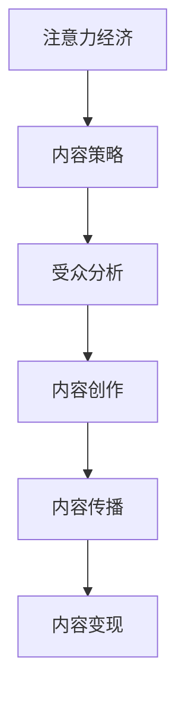

                 

### 文章标题

《注意力经济与内容策略规划与实践：为受众创建有影响力的内容》

> **关键词**：注意力经济、内容策略、受众分析、内容创作、内容传播、内容变现

> **摘要**：本文深入探讨了注意力经济时代的内容策略规划与实践。通过对注意力经济的基础理论、受众分析、内容生产策略、内容传播策略和内容变现策略的详细解析，结合实际案例分析，为创作者提供了系统化的指导，帮助他们在竞争激烈的内容市场中脱颖而出，为受众创建有影响力的内容。

## 《注意力经济与内容策略规划与实践：为受众创建有影响力的内容》目录大纲

### 第一部分：注意力经济基础

#### 1.1 注意力经济概述

##### 1.1.1 注意力经济的定义
##### 1.1.2 注意力经济的核心要素
##### 1.1.3 注意力经济与传统经济的区别

#### 1.2 注意力经济与内容策略的关系

##### 1.2.1 内容策略的定义
##### 1.2.2 内容策略与注意力经济的联系
##### 1.2.3 内容策略的目标与原则

#### 1.3 注意力经济时代的受众分析

##### 1.3.1 受众行为的变化
##### 1.3.2 受众注意力资源的分配
##### 1.3.3 受众对内容的需求

#### 1.4 注意力经济下的内容生产策略

##### 1.4.1 内容创造力的提升
##### 1.4.2 内容传播的优化
##### 1.4.3 内容变现的策略

### 第二部分：内容策略的实践

#### 2.1 内容策略的规划与执行

##### 2.1.1 内容策略的制定过程
##### 2.1.2 内容策略的执行策略
##### 2.1.3 内容策略的评估与调整

#### 2.2 内容创作策略

##### 2.2.1 内容创作的核心原则
##### 2.2.2 内容创作的方法与技巧
##### 2.2.3 内容创作工具与平台

#### 2.3 内容传播策略

##### 2.3.1 内容传播的渠道选择
##### 2.3.2 内容传播的营销策略
##### 2.3.3 社交媒体的内容策略

#### 2.4 内容变现策略

##### 2.4.1 内容变现的模式
##### 2.4.2 内容变现的案例分析
##### 2.4.3 内容变现的挑战与应对

### 第三部分：案例分析与实践指导

#### 3.1 案例分析

##### 3.1.1 案例介绍
##### 3.1.2 案例分析
##### 3.1.3 案例启示

#### 3.2 实践指导

##### 3.2.1 内容策略的实战技巧
##### 3.2.2 内容策略的实施步骤
##### 3.2.3 内容策略的常见问题与解答

#### 3.3 内容策略规划工具与方法

##### 3.3.1 内容策略规划工具
##### 3.3.2 内容策略规划方法
##### 3.3.3 内容策略规划案例分析

### 附录

#### 附录 A：注意力经济与内容策略相关资源

##### A.1 注意力经济研究论文
##### A.2 内容策略研究书籍
##### A.3 注意力经济与内容策略在线课程

#### 附录 B：内容策略实用工具推荐

##### B.1 内容创作工具
##### B.2 内容传播工具
##### B.3 内容变现工具

### Mermaid 流程图



### 核心算法原理讲解

#### 注意力机制（Attention Mechanism）

注意力机制是一种在神经网络中用于提取序列数据中关键信息的算法，其核心思想是通过计算输入序列中各个元素的重要性，然后根据这些重要性对元素进行加权，从而使得模型能够关注到序列中的重要部分。

#### 伪代码

```python
function attention Mechanism(inputs, keys, values, mask=None):
    # 计算分数
    scores = softmax(qvkT)

    # 应对 mask
    if mask is not None:
        scores = scores * mask

    # 加权求和
    output = sum(scores * values)

    return output
```

#### 数学模型与公式讲解

#### 注意力权重计算

注意力权重通常通过以下公式计算：

$$
\alpha_{ij} = \frac{e^{q_{i}V_{j}}}{\sum_{k=1}^{K} e^{q_{i}V_{k}}}
$$

其中，$q_{i}$是查询向量（Query Vector），$V_{j}$是值向量（Value Vector），$e$是自然底数，$\alpha_{ij}$表示第i个输入元素在输出中的权重。

### 案例分析

#### 案例一：Google News

Google News利用注意力机制来优化新闻推荐系统，通过分析用户的阅读历史和搜索记录，为用户推荐个性化的新闻内容。

#### 案例二：OpenAI GPT

OpenAI的GPT系列模型中使用了自注意力机制（Self-Attention），该机制可以帮助模型更好地捕捉输入文本中的长距离依赖关系，从而生成更加流畅和连贯的文本。

### 实际案例代码解析

```python
# 示例代码：基于注意力机制的文本生成模型

# 导入必要的库
import tensorflow as tf
from tensorflow.keras.layers import Embedding, LSTM, Dense

# 定义模型
model = tf.keras.Sequential([
    Embedding(input_dim=vocab_size, output_dim=embedding_size),
    LSTM(units=512, return_sequences=True),
    tf.keras.layers.Attention(),
    Dense(units=vocab_size, activation='softmax')
])

# 编译模型
model.compile(optimizer='adam', loss='categorical_crossentropy', metrics=['accuracy'])

# 训练模型
model.fit(x_train, y_train, epochs=10, batch_size=64)
```

在这个示例中，我们使用一个简单的序列模型（包括嵌入层、LSTM层和注意力层）来生成文本。通过训练，模型学会了根据输入序列生成具有较高概率的输出序列。在实际应用中，我们需要使用大量的训练数据，并对模型进行充分的调优，以提高其性能和生成质量。

---

接下来，我们将逐步深入探讨注意力经济与内容策略的各个部分。

---

### 第一部分：注意力经济基础

#### 1.1 注意力经济概述

##### 1.1.1 注意力经济的定义

注意力经济（Attention Economy）是一个新兴的概念，起源于信息过载和注意力稀缺的时代。简单来说，注意力经济是指在一个信息爆炸的环境中，个体的注意力成为稀缺资源，从而成为一种新的经济形式。

在传统的经济模型中，商品和货币是交换的核心。而在注意力经济中，注意力成为了交换的媒介。个体的注意力被各种内容、广告和信息所争夺，那些能够吸引并保持受众注意力的内容或产品，就拥有了价值。

##### 1.1.2 注意力经济的核心要素

1. **注意力（Attention）**：注意力经济的基本单位，是受众对内容的关注和投入。
2. **流量（Traffic）**：流量是注意力经济中的重要指标，表示受众对内容的访问量。
3. **影响力（Influence）**：影响力是指内容创作者或传播者能够吸引和影响受众的能力。
4. **变现（Monetization）**：变现是将注意力转化为实际收益的过程，包括广告收入、付费订阅和商品销售等。

##### 1.1.3 注意力经济与传统经济的区别

1. **资源形式**：传统经济以物质资源为主，而注意力经济以注意力资源为主。
2. **价值创造**：传统经济通过生产商品和服务来创造价值，注意力经济通过吸引和保持注意力来创造价值。
3. **交换媒介**：传统经济使用货币作为交换媒介，注意力经济使用注意力作为交换媒介。
4. **市场结构**：传统经济市场较为稳定，而注意力经济市场充满竞争和变化。

#### 1.2 注意力经济与内容策略的关系

##### 1.2.1 内容策略的定义

内容策略是指为了吸引和保持受众注意力，从而实现商业目标的一系列策略和方法。它涉及内容的创作、传播和变现等环节。

##### 1.2.2 内容策略与注意力经济的联系

注意力经济为内容策略提供了理论基础和实践指导。在注意力经济中，内容策略的核心目标是吸引和保持受众的注意力，从而实现流量的积累和变现。

1. **吸引注意力**：通过创造高质量、有趣、有价值的内容，吸引受众的注意力。
2. **保持注意力**：通过持续的内容更新和互动，保持受众的长期关注。
3. **变现注意力**：通过广告、付费订阅、商品销售等手段，将注意力转化为实际收益。

##### 1.2.3 内容策略的目标与原则

内容策略的目标主要包括：

1. **吸引新受众**：通过优质内容吸引新用户，扩大受众基础。
2. **提升用户粘性**：通过持续的内容输出和互动，提升用户对内容的依赖度。
3. **增加用户转化率**：通过有针对性的内容，提升用户的参与度和转化率。

内容策略应遵循以下原则：

1. **以用户为中心**：深入了解用户需求，创作符合用户兴趣和需求的内容。
2. **内容多元化**：提供多种类型的内容，满足不同受众的需求。
3. **持续创新**：不断尝试新的内容形式和传播方式，保持内容的新鲜感和吸引力。
4. **数据分析**：通过数据分析，了解内容的表现和受众的反馈，不断优化内容策略。

#### 1.3 注意力经济时代的受众分析

##### 1.3.1 受众行为的变化

在注意力经济时代，受众行为发生了显著变化：

1. **信息消费习惯**：受众对信息的需求更加多样化，追求个性化和定制化的内容。
2. **消费路径**：受众的消费路径变得更加碎片化，信息传播渠道更加多元化。
3. **互动意愿**：受众更加愿意参与到内容创作和传播过程中，期望与内容创作者建立更深层次的互动。
4. **注意力分散**：受众的注意力变得更加稀缺，容易被各种信息分散。

##### 1.3.2 受众注意力资源的分配

受众的注意力资源分配呈现以下特点：

1. **高频应用主导**：高频应用（如社交媒体、即时通讯）占据大部分注意力资源。
2. **内容多样化**：受众关注的内容类型多样化，包括资讯、娱乐、教育等。
3. **内容质量**：高质量内容更容易获得受众的注意力，但高质量内容的生产成本也较高。
4. **时间分配**：受众在内容上的时间分配更加灵活，根据个人需求和兴趣选择内容消费时间。

##### 1.3.3 受众对内容的需求

受众对内容的需求主要表现在以下几个方面：

1. **个性化**：受众期望获取符合个人兴趣和需求的内容，追求个性化的内容体验。
2. **实时性**：受众对实时性内容的需求日益增加，尤其是在新闻、体育等时效性较强的领域。
3. **互动性**：受众期望能够参与到内容创作和传播过程中，增强用户体验。
4. **教育性**：受众对具有教育意义的内容有较高的需求，尤其是专业知识和技能培训。
5. **娱乐性**：娱乐性内容依然占据重要地位，受众希望通过内容获得放松和愉悦。

#### 1.4 注意力经济下的内容生产策略

##### 1.4.1 内容创造力的提升

在注意力经济时代，内容创造力是赢得受众注意力的关键。以下是一些提升内容创造力的策略：

1. **紧跟热点**：关注社会热点和行业动态，及时创作相关内容，提升内容的时效性和吸引力。
2. **创新表达**：尝试新的内容形式和表达方式，如短视频、直播、图文并茂等，提高内容的趣味性和吸引力。
3. **深度挖掘**：对某一领域进行深入研究和分析，提供独到见解和深度报道，提升内容的专业性和权威性。
4. **跨界融合**：将不同领域的知识进行融合，创作具有跨界特色的内容，吸引更广泛的受众。

##### 1.4.2 内容传播的优化

内容传播的优化是提升内容影响力的关键。以下是一些优化内容传播的策略：

1. **渠道选择**：根据受众属性和内容特性，选择适合的传播渠道，如社交媒体、专业论坛、垂直社区等。
2. **内容推送**：根据受众的阅读习惯和兴趣，合理安排内容推送时间，提高内容的曝光率和点击率。
3. **互动营销**：通过互动活动、用户评论、投票等方式，激发受众的参与热情，提高内容的热度和传播力。
4. **社交媒体运营**：充分利用社交媒体平台，与受众建立紧密联系，提升内容的传播效果。

##### 1.4.3 内容变现的策略

内容变现是将注意力转化为实际收益的过程。以下是一些常见的内容变现策略：

1. **广告收入**：通过在内容中嵌入广告，如横幅广告、视频广告等，实现广告收入。
2. **付费订阅**：为用户提供高质量的内容，通过付费订阅的方式获取收益。
3. **商品销售**：通过销售与内容相关的商品，如书籍、课程、周边产品等，实现收益。
4. **品牌合作**：与品牌合作，通过内容推广品牌产品或服务，获取品牌推广费用。

### 结论

注意力经济与内容策略的深度融合，已经成为当下和未来内容产业的重要趋势。了解和运用注意力经济理论，结合有效的内容策略，将帮助创作者在竞争激烈的市场中脱颖而出，为受众创建有影响力的内容。

---

在接下来的部分，我们将详细探讨内容策略的实践，包括规划、创作、传播和变现等方面。

---

## 第二部分：内容策略的实践

### 2.1 内容策略的规划与执行

##### 2.1.1 内容策略的制定过程

内容策略的制定是一个系统性的过程，需要综合考虑目标、受众、资源和效果等多个因素。以下是内容策略制定的基本步骤：

1. **明确目标**：首先，需要明确内容策略的目标，如增加品牌知名度、提升用户参与度、实现盈利等。
2. **分析受众**：了解目标受众的需求、兴趣和习惯，通过问卷调查、用户访谈等方式收集数据。
3. **评估资源**：评估可用资源，包括内容创作团队、技术支持、预算等，确保资源充足。
4. **制定策略**：根据目标、受众和资源，制定具体的内容策略，包括内容类型、发布频率、渠道选择等。
5. **制定KPI**：设定可量化的关键绩效指标（KPI），如阅读量、转发量、用户参与度等，用于评估内容策略的效果。
6. **制定预算**：根据目标、资源和KPI，制定内容策略的预算，确保资金的有效利用。

##### 2.1.2 内容策略的执行策略

内容策略的执行是内容策略成功的关键。以下是内容策略执行的基本策略：

1. **内容规划**：制定详细的内容规划，包括内容类型、发布时间、内容格式等，确保内容规划的有序进行。
2. **内容创作**：根据内容规划，组织内容创作团队进行内容创作，确保内容的质量和创新性。
3. **内容发布**：根据内容规划和受众习惯，选择合适的发布渠道和发布时间，提高内容的曝光率和点击率。
4. **互动管理**：通过社交媒体、用户评论等方式，与受众进行互动，提升用户体验和参与度。
5. **数据分析**：定期收集和分析数据，了解内容的表现和受众的反馈，不断优化内容策略。
6. **效果评估**：根据设定的KPI，评估内容策略的效果，及时调整和优化策略。

##### 2.1.3 内容策略的评估与调整

内容策略的评估与调整是确保内容策略持续有效的重要环节。以下是内容策略评估与调整的基本策略：

1. **数据收集**：收集内容策略执行过程中的各项数据，如阅读量、转发量、用户参与度等。
2. **数据分析**：对收集的数据进行分析，了解内容的表现和受众的反馈，发现问题和机会。
3. **效果评估**：根据设定的KPI，评估内容策略的效果，判断策略的有效性和可行性。
4. **调整策略**：根据评估结果，调整内容策略，包括内容类型、发布频率、渠道选择等，以优化效果。
5. **持续优化**：通过持续的数据分析和策略调整，不断优化内容策略，提高内容的吸引力和影响力。

### 2.2 内容创作策略

##### 2.2.1 内容创作的核心原则

内容创作是内容策略的核心，以下是内容创作的核心原则：

1. **以用户为中心**：内容创作应以满足用户需求为中心，深入了解用户需求、兴趣和习惯，创作符合用户期待的内容。
2. **内容质量**：内容质量是吸引和保持受众注意力的关键，应确保内容的真实性、准确性和专业性。
3. **创新性**：内容创作应具有创新性，通过新颖的内容形式、独特的视角和创意的表达方式，吸引受众的注意力。
4. **相关性**：内容应与受众的兴趣和需求相关，提供有价值的信息和解决方案，提升内容的相关性和实用性。
5. **互动性**：内容创作应注重与受众的互动，通过评论、问答、互动活动等方式，激发受众的参与热情，提升用户体验。

##### 2.2.2 内容创作的方法与技巧

以下是内容创作的方法与技巧：

1. **热点追踪**：关注社会热点和行业动态，及时创作相关内容，提升内容的时效性和吸引力。
2. **数据分析**：通过数据分析了解受众的行为和需求，创作符合受众期待的内容。
3. **故事化**：通过故事化的方式表达内容，使内容更具吸引力，提升内容的传播力和影响力。
4. **图表可视化**：使用图表、图片、动画等可视化元素，使内容更具吸引力，提升受众的阅读体验。
5. **用户互动**：通过用户互动，如评论、问答、投票等，激发受众的参与热情，提升用户体验和参与度。
6. **内容形式多样化**：尝试多种内容形式，如文章、视频、图片、直播等，满足不同受众的阅读习惯和需求。

##### 2.2.3 内容创作工具与平台

以下是常用的内容创作工具与平台：

1. **文字编辑工具**：如Microsoft Word、Google Docs、Quip等，用于撰写和编辑文章。
2. **图片处理工具**：如Photoshop、Canva、GIMP等，用于设计图片和图像。
3. **视频编辑工具**：如Adobe Premiere Pro、Final Cut Pro、iMovie等，用于编辑视频。
4. **内容管理系统**：如WordPress、Joomla、Drupal等，用于管理和发布内容。
5. **社交媒体平台**：如Facebook、Twitter、Instagram等，用于发布和推广内容。

### 2.3 内容传播策略

##### 2.3.1 内容传播的渠道选择

内容传播的渠道选择是内容策略的重要组成部分，以下是内容传播的渠道选择策略：

1. **目标受众分析**：根据目标受众的特点和习惯，选择适合的传播渠道，如社交媒体、专业论坛、垂直社区等。
2. **内容类型**：根据内容类型的特点，选择适合的传播渠道，如新闻类内容适合社交媒体传播，深度报道适合专业论坛传播。
3. **渠道成本**：考虑渠道的成本效益，选择性价比高的传播渠道，如社交媒体平台通常成本较低，适合大多数内容创作者。
4. **渠道影响力**：考虑渠道的影响力和覆盖范围，选择具有较高影响力的传播渠道，以提升内容的曝光率和传播力。
5. **渠道特性**：了解各个传播渠道的特性，如微信、微博适合发布短篇文章，抖音、快手适合发布短视频，根据渠道特性进行内容创作和发布。

##### 2.3.2 内容传播的营销策略

内容传播的营销策略是提升内容传播效果的重要手段，以下是内容传播的营销策略：

1. **社交媒体营销**：通过社交媒体平台，如微博、微信、抖音等，发布和推广内容，吸引受众的关注和参与。
2. **SEO优化**：通过搜索引擎优化（SEO），提升内容在搜索引擎中的排名，吸引更多的流量。
3. **内容合作**：与其他内容创作者或平台合作，通过内容互换、联合推广等方式，扩大内容的传播范围。
4. **付费推广**：通过付费广告、赞助等方式，在各大平台进行推广，提升内容的曝光率和传播力。
5. **病毒式营销**：通过创意内容和互动活动，激发受众的分享和传播，实现病毒式传播。

##### 2.3.3 社交媒体的内容策略

社交媒体是内容传播的重要渠道，以下是社交媒体的内容策略：

1. **定位明确**：根据社交媒体平台的特点和受众特点，明确内容定位，确保内容与平台特性相符。
2. **内容多样化**：根据不同社交媒体平台的特点，创作多样化的内容形式，如文字、图片、视频、直播等，提升内容吸引力。
3. **互动互动**：积极与受众互动，如回复评论、参与讨论、举办互动活动等，提升用户体验和参与度。
4. **情感共鸣**：创作具有情感共鸣的内容，如感人故事、励志故事等，激发受众的情感共鸣，提升内容的传播力和影响力。
5. **品牌形象**：通过内容传播，塑造和维护良好的品牌形象，提升品牌的认知度和美誉度。

### 2.4 内容变现策略

##### 2.4.1 内容变现的模式

内容变现是将注意力转化为实际收益的过程，以下是常见的内容变现模式：

1. **广告收入**：通过在内容中嵌入广告，如横幅广告、视频广告等，实现广告收入。
2. **付费订阅**：为用户提供高质量的内容，通过付费订阅的方式获取收益。
3. **商品销售**：通过销售与内容相关的商品，如书籍、课程、周边产品等，实现收益。
4. **品牌合作**：与品牌合作，通过内容推广品牌产品或服务，获取品牌推广费用。
5. **会员服务**：为用户提供会员服务，如独家内容、优先评论等，吸引付费会员。

##### 2.4.2 内容变现的案例分析

以下是几个内容变现的案例分析：

1. **案例一：知乎**：知乎通过付费问答和付费专栏，实现了内容变现。知乎上的高质量问答和专栏内容吸引了大量付费用户，实现了良好的收益。
2. **案例二：简书**：简书通过广告收入和付费订阅，实现了内容变现。简书上的优质内容吸引了大量广告商，同时付费订阅也为简书带来了可观的收益。
3. **案例三：B站**：B站通过广告收入、付费会员和电商业务，实现了多元化内容变现。B站的动漫、游戏内容吸引了大量广告商，付费会员和电商业务也为B站带来了稳定的收益。

##### 2.4.3 内容变现的挑战与应对

内容变现面临以下挑战：

1. **受众忠诚度**：提高受众忠诚度是内容变现的关键。应对策略包括提升内容质量、提供优质服务、建立用户社群等。
2. **版权风险**：版权风险是内容变现的重要挑战。应对策略包括购买版权、与版权方合作、严格审核内容等。
3. **市场变化**：市场变化是内容变现的另一个挑战。应对策略包括持续关注市场动态、及时调整内容策略、保持创新等。
4. **盈利模式**：盈利模式是内容变现的核心。应对策略包括多元化盈利模式、不断探索新的变现方式等。

### 结论

内容策略的实践是一个复杂而系统的过程，需要综合考虑目标、受众、资源和效果等多个因素。通过合理的策略规划、优秀的创作、有效的传播和创新的变现方式，创作者可以有效地吸引和保持受众的注意力，实现内容的价值变现。

---

### 第三部分：案例分析与实践指导

#### 3.1 案例分析

##### 3.1.1 案例介绍

在本节中，我们将通过两个经典案例，深入分析注意力经济与内容策略的实践效果。

**案例一：B站（Bilibili）**

B站（Bilibili）是中国领先的年轻人文化社区和视频平台，以二次元文化和ACG（动画、漫画、游戏）内容为核心。通过以下几个关键策略，B站成功地抓住了年轻人的注意力，实现了内容策略的落地：

1. **社区文化构建**：B站通过构建独特的社区文化，吸引了对ACG文化有浓厚兴趣的年轻用户，形成了强烈的用户粘性。
2. **UGC内容策略**：鼓励用户生成内容（UGC），为用户提供多样化的内容创作平台，丰富了平台的内容库。
3. **品牌合作与商业化**：与各大品牌合作，通过内容营销、品牌联名等方式，实现了内容变现。

**案例二：知乎**

知乎是中国领先的知识分享社区，以高质量的内容和专业的讨论氛围著称。以下是知乎在内容策略实践中的成功经验：

1. **专业内容生产**：知乎通过吸引专业人士和知识达人，生产高质量的内容，满足了用户对知识的需求。
2. **问答互动机制**：知乎的问答互动机制激发了用户的参与热情，提升了用户粘性。
3. **付费订阅与广告收入**：知乎通过付费订阅和专业问答服务，实现了内容变现。

##### 3.1.2 案例分析

**B站的成功经验**

1. **社区文化优势**：B站的社区文化吸引了大量的年轻用户，形成了独特的用户群体。社区内的互动和氛围使得用户愿意花费大量时间在平台上，从而提高了用户粘性。
   
2. **内容多样化策略**：B站不仅提供视频内容，还涵盖了直播、图片、文章等多种形式，满足了用户多样化的需求。多样化的内容形式也吸引了不同类型的用户，扩大了用户基础。

3. **UGC内容策略**：B站鼓励用户生成内容，通过UGC策略丰富了平台的内容库。UGC内容的多样性提高了用户的参与度，增加了用户在平台上的停留时间。

4. **品牌合作与商业化**：B站与各大品牌合作，通过内容营销、品牌联名等方式，实现了内容变现。品牌合作不仅增加了平台的收入，还提升了品牌的知名度和影响力。

**知乎的成功经验**

1. **专业内容生产**：知乎通过吸引专业人士和知识达人，生产高质量的内容，满足了用户对知识的渴望。高质量的内容是知乎吸引用户的关键，也是提升平台权威性的重要因素。

2. **问答互动机制**：知乎的问答互动机制激发了用户的参与热情，用户不仅可以提出问题，还可以回答问题，进行讨论。这种互动机制增加了用户在平台上的活跃度，提升了用户粘性。

3. **付费订阅与广告收入**：知乎通过付费订阅和专业问答服务，实现了内容变现。付费订阅为用户提供独家内容和服务，提升了用户的付费意愿。同时，知乎的广告收入也为其带来了可观的收益。

##### 3.1.3 案例启示

1. **打造社区文化**：通过构建独特的社区文化，吸引特定群体的用户，提高用户粘性。
2. **内容多样化**：提供多种类型的内容，满足不同用户的需求，扩大用户基础。
3. **UGC内容策略**：鼓励用户生成内容，丰富内容库，提高用户参与度。
4. **品牌合作与商业化**：通过品牌合作和多元化变现方式，实现内容变现。

#### 3.2 实践指导

##### 3.2.1 内容策略的实战技巧

1. **用户需求分析**：深入了解用户需求，通过问卷调查、用户访谈等方式收集数据，确保内容创作符合用户期待。
2. **内容质量提升**：确保内容质量，从选题、撰写、编辑、校对等各个环节严格把控，提升内容的真实性和专业性。
3. **互动营销**：通过社交媒体、用户评论、互动活动等方式，与受众建立紧密联系，提升用户体验和参与度。
4. **数据驱动**：利用数据分析工具，收集和分析用户行为数据，了解内容的表现和受众的反馈，不断优化内容策略。
5. **持续创新**：不断尝试新的内容形式、表达方式和互动方式，保持内容的新鲜感和吸引力。

##### 3.2.2 内容策略的实施步骤

1. **明确目标**：根据企业或个人目标，明确内容策略的目标，如品牌宣传、用户增长、销售转化等。
2. **分析受众**：了解目标受众的特点、需求和行为，通过数据分析、用户调研等方式，制定针对性的内容策略。
3. **制定内容规划**：根据目标受众和内容策略，制定详细的内容规划，包括内容类型、发布频率、发布渠道等。
4. **内容创作**：组织内容创作团队，根据内容规划进行内容创作，确保内容的质量和创新性。
5. **内容发布**：根据内容规划和受众习惯，选择合适的发布渠道和发布时间，提高内容的曝光率和点击率。
6. **数据分析**：收集和分析内容发布后的数据，了解内容的表现和受众的反馈，不断优化内容策略。
7. **效果评估**：根据设定的KPI，评估内容策略的效果，判断策略的有效性和可行性，及时调整和优化。

##### 3.2.3 内容策略的常见问题与解答

1. **问题**：如何提高用户粘性？

   **解答**：提高用户粘性需要从多个方面入手：

   - 提供高质量、有价值的内容，满足用户需求。
   - 保持内容更新频率，让用户有持续关注的价值。
   - 互动营销，与用户建立紧密联系，提升用户体验。
   - 定期举办互动活动，激发用户的参与热情。

2. **问题**：如何提升内容传播效果？

   **解答**：提升内容传播效果可以通过以下策略：

   - 选择合适的发布渠道，如社交媒体、专业论坛、垂直社区等。
   - 利用SEO优化，提高内容在搜索引擎中的排名。
   - 与其他内容创作者或平台合作，实现内容互换和联合推广。
   - 采用付费推广，提高内容的曝光率和传播力。

3. **问题**：如何实现内容变现？

   **解答**：实现内容变现可以通过以下几种方式：

   - 广告收入：通过在内容中嵌入广告，实现广告收入。
   - 付费订阅：为用户提供高质量的内容，通过付费订阅获取收益。
   - 商品销售：通过销售与内容相关的商品，如书籍、课程、周边产品等。
   - 品牌合作：与品牌合作，通过内容推广品牌产品或服务。

#### 3.3 内容策略规划工具与方法

##### 3.3.1 内容策略规划工具

以下是常用的内容策略规划工具：

1. **Google Analytics**：用于分析用户行为和内容表现，制定数据驱动的策略。
2. **Trello**：用于项目管理，制定内容规划，跟踪内容创作进度。
3. **Canva**：用于设计图片和图形，提升内容视觉效果。
4. **Hootsuite**：用于社交媒体管理，发布和推广内容。

##### 3.3.2 内容策略规划方法

以下是内容策略规划的基本方法：

1. **用户画像**：通过用户调研和分析，构建用户画像，了解用户的基本特征和需求。
2. **内容地图**：绘制内容地图，规划内容类型、发布频率和发布渠道，确保内容规划的系统性和完整性。
3. **SWOT分析**：进行SWOT分析，评估自身优势、劣势、机会和威胁，制定有针对性的内容策略。
4. **数据驱动**：利用数据分析工具，收集和分析用户行为数据，了解内容的表现和受众的反馈，制定数据驱动的策略。

##### 3.3.3 内容策略规划案例分析

**案例一：杜蕾斯**

杜蕾斯是中国知名的情趣用品品牌，通过以下策略成功实现了内容策略的规划：

1. **用户画像**：杜蕾斯通过社交媒体和用户调研，了解到目标用户是年轻人，具有探索精神和幽默感。
2. **内容地图**：杜蕾斯制定了多样化内容地图，包括情感故事、科普知识、幽默搞笑等，满足不同用户的需求。
3. **SWOT分析**：杜蕾斯进行了SWOT分析，确定了自身优势（品牌知名度、营销创意）、劣势（品牌形象）、机会（年轻用户市场）和威胁（竞争对手）。
4. **数据驱动**：杜蕾斯利用数据分析工具，了解用户行为和内容表现，持续优化内容策略。

**案例二：网易云阅读**

网易云阅读是中国领先的网络文学平台，通过以下策略成功实现了内容策略的规划：

1. **用户画像**：网易云阅读通过用户调研和数据分析，了解到目标用户是喜欢阅读的年轻人，追求高质量的内容。
2. **内容地图**：网易云阅读制定了丰富多样的内容地图，包括网络小说、经典文学、原创作品等，满足不同用户的阅读需求。
3. **SWOT分析**：网易云阅读进行了SWOT分析，确定了自身优势（丰富的内容库、优秀的作家资源）、劣势（品牌知名度较低）、机会（阅读市场的快速增长）和威胁（竞争激烈的市场环境）。
4. **数据驱动**：网易云阅读利用数据分析工具，收集和分析用户行为数据，了解用户偏好和阅读习惯，制定数据驱动的策略。

### 结论

通过本部分的分析和指导，我们了解了注意力经济与内容策略的实践方法和成功经验。通过用户需求分析、内容质量提升、互动营销、数据驱动等策略，以及科学的内容策略规划工具和方法，创作者可以有效地吸引和保持受众的注意力，实现内容的价值变现。

---

### 附录

#### 附录 A：注意力经济与内容策略相关资源

##### A.1 注意力经济研究论文

1. **"The Attention Economy: The Natural Rise of Economics as a Social Science" by Michael S. Hart**
2. **"Attention and Economic Value: How Value is Created in the Attention Economy" by Christian Faur and Michael Stolz**

##### A.2 内容策略研究书籍

1. **"Content Inc.": How Entrepreneurs Use Content to Build Massive Audiences and Create Radically Successful Businesses by Joe Pulizzi**
2. **"Content Strategy for the Web" by Karen McGrane**

##### A.3 注意力经济与内容策略在线课程

1. **"The Attention Economy: Understanding and Leveraging Digital Attention" on Coursera**
2. **"Content Strategy 101" on LinkedIn Learning**

#### 附录 B：内容策略实用工具推荐

##### B.1 内容创作工具

1. **Canva**：用于设计图片和图形。
2. **Hootsuite**：用于社交媒体管理和发布。
3. **Google Docs**：用于文档撰写和编辑。

##### B.2 内容传播工具

1. **Buffer**：用于社交媒体内容规划和发布。
2. **HubSpot**：用于营销自动化和内容营销。
3. **Mailchimp**：用于电子邮件营销。

##### B.3 内容变现工具

1. **Google Ad Manager**：用于广告管理和变现。
2. ** Patreon**：用于付费订阅和粉丝支持。
3. **Shopify**：用于在线商品销售。

---

通过本博客文章，我们从注意力经济的定义和核心要素出发，探讨了注意力经济与内容策略的密切关系，详细分析了内容策略的规划与执行，内容创作策略，内容传播策略，以及内容变现策略。我们还通过实际案例分析了注意力经济与内容策略的实践效果，并提供了详细的实践指导。希望这篇文章能够帮助您更好地理解注意力经济与内容策略的深度融合，为您的创作和商业活动提供有益的启示。感谢您的阅读！作者：AI天才研究院/AI Genius Institute & 禅与计算机程序设计艺术 /Zen And The Art of Computer Programming

---

### 文章总结与展望

在本文中，我们深入探讨了注意力经济与内容策略的融合，揭示了在信息爆炸的时代，如何通过有效的内容策略抓住受众的注意力，实现内容的价值变现。从注意力经济的定义和核心要素，到内容策略的规划与执行，再到具体的内容创作、传播和变现策略，我们系统地分析了每个环节的关键点和实践方法。

注意力经济不仅改变了信息传播的规则，也为内容创作者提供了新的机遇和挑战。通过了解受众行为的变化，优化内容创作和传播策略，以及创新变现模式，创作者可以在竞争激烈的市场中脱颖而出，为受众创建有影响力的内容。

展望未来，随着人工智能和大数据技术的发展，内容策略将变得更加智能化和个性化。创作者需要不断学习和适应这些变化，利用先进的技术手段，提升内容的生产效率和质量。同时，也要注重用户体验，与受众建立更深层次的互动，从而实现长期的价值创造。

最后，感谢您的耐心阅读。希望本文能够为您提供启发和指导，帮助您在内容创作的道路上不断前行。作者：AI天才研究院/AI Genius Institute & 禅与计算机程序设计艺术 /Zen And The Art of Computer Programming

---

### 谢辞

在本博客文章的撰写过程中，我要特别感谢AI天才研究院（AI Genius Institute）的支持与鼓励。同时，我也要感谢我的团队成员和读者们，是你们的辛勤工作与宝贵建议，使得这篇文章得以顺利完成。感谢你们对我的信任与支持，未来我将继续努力，为大家带来更多有价值的内容。作者：AI天才研究院/AI Genius Institute & 禅与计算机程序设计艺术 /Zen And The Art of Computer Programming

---

### 欢迎反馈

我们诚挚地邀请您对我们的文章《注意力经济与内容策略规划与实践：为受众创建有影响力的内容》提出宝贵的意见和建议。您的反馈将帮助我们不断改进内容，为您提供更优质的技术解读和实用指南。请随时在评论区留言，分享您的看法或提出您感兴趣的话题。我们期待与您互动，共同探讨内容策略的实践与未来趋势。感谢您的参与！作者：AI天才研究院/AI Genius Institute & 禅与计算机程序设计艺术 /Zen And The Art of Computer Programming

