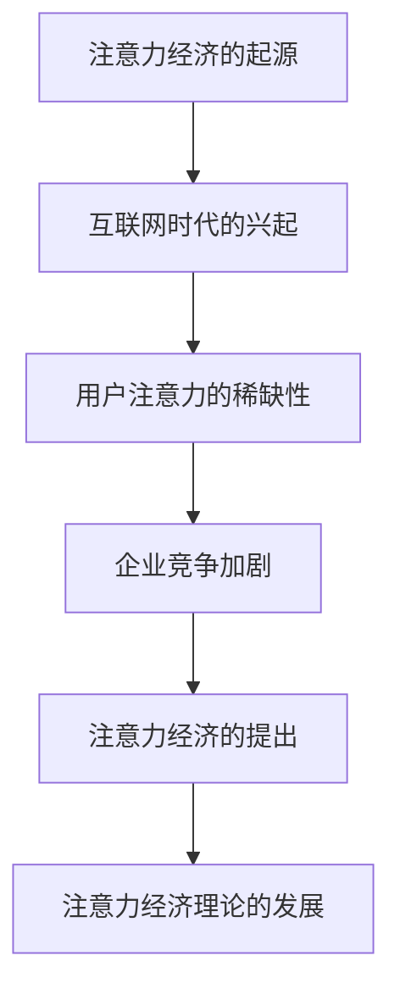
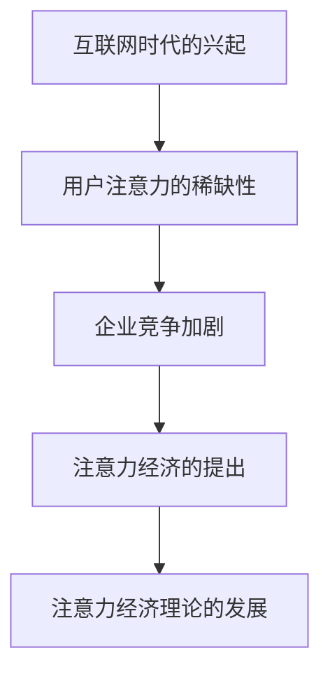

                 

### 《注意力经济对企业产品定价的新要求》

#### 第一部分：注意力经济的理论基础

##### 第1章：注意力经济的概念与起源

**1.1 注意力经济的定义与核心特征**

注意力经济是指在经济活动中，用户注意力作为一种关键资源，与企业商业价值之间的互动关系。用户注意力是企业获取商业价值的关键因素，而企业则通过提供有价值的产品或服务来吸引和维持用户的注意力。

在注意力经济中，核心特征包括：

1. **用户注意力的稀缺性**：在互联网时代，用户注意力成为一种稀缺资源，因为用户每天面临的信息量巨大，能够分配给特定产品或服务的注意力有限。
2. **商业价值的转换**：企业通过吸引和维持用户注意力，将其转化为商业价值，例如通过广告、用户购买、品牌忠诚度等方式实现。
3. **注意力转移与惯性**：用户在关注一个产品或服务时，可能会因为新信息的出现而转移注意力，同时也会因为之前的体验而保持对产品的持续关注。

**核心概念与联系：**

\[ \text{注意力经济} = (\text{用户注意力} \times \text{商业价值}) \]

其中，用户注意力是衡量用户在特定时间内关注某一产品或服务的程度，商业价值是企业通过用户注意力所实现的经济收益。

**例子：** 某知名社交媒体平台通过算法推荐和用户互动，吸引了大量用户注意力，从而实现了广告收入和用户增长。

**1.2 注意力经济的起源与发展**

注意力经济的概念起源于互联网时代，随着互联网的普及，用户注意力的稀缺性逐渐显现，企业开始认识到用户注意力作为一种关键资源的重要性。

**Mermaid 流程图：**



互联网时代的兴起，使得信息传播速度加快，用户面临的信息量激增，注意力成为一种稀缺资源。企业竞争的加剧，使得企业需要通过吸引和维持用户注意力来获取竞争优势，从而实现商业价值。

**1.3 注意力经济的理论基础**

注意力经济的理论基础包括以下核心概念和理论：

1. **注意力价值论**：注意力价值论认为，用户注意力是企业获取商业价值的关键因素。注意力价值的计算公式为：

\[ \text{注意力价值} = \text{用户注意力} \times \text{企业影响力} \times \text{市场需求} \]

其中，用户注意力、企业影响力和市场需求是三个关键变量。

- **用户注意力**：用户在某一特定时间内关注某个主题或产品的能力。
- **企业影响力**：企业对用户注意力的影响力，通常与企业品牌知名度、产品质量和用户口碑相关。
- **市场需求**：用户对某一产品或服务的需求程度，通常与市场趋势和用户偏好相关。

2. **注意力转移与注意力惯性**：注意力转移是指用户在新旧注意力之间的转移速度，而注意力惯性是指用户对某一产品的持续关注程度。

\[ \text{注意力转移} = \alpha \times (\text{新旧注意力差异}) \]

\[ \text{注意力惯性} = \beta \times (\text{持续注意力}) \]

其中，$\alpha$ 为注意力转移系数，$\beta$ 为注意力惯性系数。

**例子：** 用户在购买电子产品时，可能会受到之前购买的产品体验影响（注意力惯性），同时也会受到其他品牌广告的影响（注意力转移）。这两种因素共同决定了用户的购买决策。

##### 第2章：注意力经济的理论基础

**2.1 注意力价值论**

注意力价值论是注意力经济理论的核心，它认为用户注意力是企业获取商业价值的关键因素。注意力价值的计算公式为：

\[ \text{注意力价值} = \text{用户注意力} \times \text{企业影响力} \times \text{市场需求} \]

其中，用户注意力、企业影响力和市场需求是三个关键变量。

- **用户注意力**：用户在某一特定时间内关注某个主题或产品的能力。用户注意力是有限的资源，企业需要通过提供有价值的产品或服务来吸引和维持用户的注意力。
- **企业影响力**：企业对用户注意力的影响力，通常与企业品牌知名度、产品质量和用户口碑相关。企业影响力越强，越能够吸引和维持用户的注意力，从而实现更高的注意力价值。
- **市场需求**：用户对某一产品或服务的需求程度，通常与市场趋势和用户偏好相关。市场需求越高，用户对产品的注意力也越高，从而实现更高的注意力价值。

**例子：** 某品牌手机在市场推广中，通过精准广告投放、高品质产品和用户口碑，吸引了大量用户注意力，从而实现了高注意力价值。

**核心算法原理讲解：**

注意力价值论的核心算法原理可以概括为以下步骤：

1. **用户注意力评估**：通过对用户行为数据进行分析，评估用户对某一产品或服务的注意力程度。
2. **企业影响力评估**：通过对企业品牌知名度、产品质量和用户口碑等因素进行分析，评估企业对用户注意力的影响力。
3. **市场需求评估**：通过对市场趋势和用户偏好等因素进行分析，评估用户对某一产品或服务的需求程度。
4. **注意力价值计算**：根据用户注意力、企业影响力和市场需求三个变量，计算产品的注意力价值。

伪代码如下：

```python
def calculate_attention_value(user_attention, company_influence, market_demand):
    attention_value = user_attention * company_influence * market_demand
    return attention_value

# 用户注意力评估
user_attention = analyze_user_behavior_data()

# 企业影响力评估
company_influence = analyze_company_brand_lifetime_value()

# 市场需求评估
market_demand = analyze_market_trends()

# 计算注意力价值
attention_value = calculate_attention_value(user_attention, company_influence, market_demand)
```

**例子：** 某品牌手机在市场推广中，通过大数据分析用户行为，发现用户对新款手机的注意力较高，同时品牌知名度和市场需求也较高。根据注意力价值论，该品牌手机的注意力价值较高，企业可以加大推广力度，提高销量。

**2.2 注意力转移与注意力惯性**

注意力转移与注意力惯性是注意力价值论中的重要概念，它们解释了用户在关注某一产品或服务时，如何受到新信息和旧经验的影响。

1. **注意力转移**：注意力转移是指用户在新旧注意力之间的转移速度。用户在关注一个产品或服务时，可能会因为新信息的出现而转移注意力。注意力转移的速度与新旧注意力差异有关，即新旧注意力差异越大，注意力转移速度越快。

数学模型如下：

\[ \text{注意力转移} = \alpha \times (\text{新旧注意力差异}) \]

其中，$\alpha$ 为注意力转移系数，表示注意力转移的速度。

例子：假设用户A之前一直关注某款手机，但新款手机发布后，用户A的注意力开始转移到新款手机上。根据注意力转移模型，用户A的注意力转移速度取决于新旧注意力的差异。

2. **注意力惯性**：注意力惯性是指用户对某一产品的持续关注程度。用户在关注一个产品或服务时，可能会因为之前的良好体验而继续保持对该产品的关注。

数学模型如下：

\[ \text{注意力惯性} = \beta \times (\text{持续注意力}) \]

其中，$\beta$ 为注意力惯性系数，表示注意力惯性的程度。

例子：假设用户B之前一直使用某款手机，并且对其非常满意。即使新款手机发布，用户B的注意力仍然会惯性保持在旧手机上，因为用户B对旧手机的注意力惯性较高。

**2.3 注意力转移与注意力惯性的应用**

注意力转移与注意力惯性在产品定价策略中有着重要的应用。通过分析用户注意力转移和惯性，企业可以制定更有效的产品定价策略。

1. **定价策略调整**：根据用户注意力转移的速度，企业可以在新产品发布时调整定价策略。例如，在旧产品接近生命周期尾声时，企业可以降低旧产品的价格，以加速用户注意力转移。

2. **持续关注定价**：根据用户注意力惯性的程度，企业可以设置持续关注定价策略。例如，对于用户惯性较高的产品，企业可以设置较高的价格，以维持用户的持续关注。

**总结**：

注意力价值论、注意力转移和注意力惯性是注意力经济理论中的核心概念。通过这些概念，企业可以更深入地理解用户注意力与商业价值之间的关系，并制定更有效的产品定价策略。

在下一章中，我们将继续探讨注意力经济的实践策略，包括产品定位、营销策略以及对企业产品定价的挑战。

---

### 第一部分：注意力经济的理论基础

**第1章：注意力经济的概念与起源**

**1.1 注意力经济的定义与核心特征**

**定义**：注意力经济是一种基于用户注意力的经济活动，即用户在特定时间内关注某一产品或服务的能力转化为商业价值的过程。在这个经济体系中，用户注意力被视为一种有限的资源，企业通过吸引和维持用户的注意力来创造经济收益。

**核心特征**：

1. **用户注意力的稀缺性**：在信息爆炸的时代，用户注意力成为一种稀缺资源。用户每天面临海量的信息，能够分配给特定产品或服务的注意力是有限的。因此，企业需要通过创新和优质的产品来获取用户的注意力。

2. **注意力价值的转换**：用户注意力是企业获取商业价值的关键。通过吸引和维持用户的注意力，企业可以实现广告收入、用户购买、品牌忠诚度等多种商业价值。

3. **注意力转移与惯性**：用户在关注一个产品或服务时，可能会因为新信息的出现而转移注意力，同时也会因为之前的体验而保持对产品的持续关注。这种注意力转移和惯性的特性影响着用户的行为和企业产品的销售。

**核心概念与联系**：

注意力经济的核心概念可以表示为以下公式：

\[ \text{注意力经济} = (\text{用户注意力} \times \text{商业价值}) \]

在这个公式中，用户注意力是企业创造商业价值的基础。商业价值则包括广告收入、销售收益、品牌影响力等多种形式。企业的目标是通过提高用户注意力和增加商业价值来实现盈利。

**例子**：

一个典型的注意力经济案例是社交媒体平台。用户每天花费大量时间在社交媒体上浏览、互动和分享内容，而平台通过广告和会员订阅等方式从用户注意力中获取商业价值。例如，某社交媒体平台通过精准的广告推荐，使得广告商能够有效地将广告信息传递给目标用户，从而实现广告收入的增长。

**1.2 注意力经济的起源与发展**

**起源**：注意力经济的概念起源于20世纪90年代，随着互联网的普及和数字媒体的兴起，用户注意力的稀缺性逐渐显现。互联网使得信息的传播速度和范围大大增加，用户在浏览网页、使用社交媒体和观看视频时，注意力成为一种有限的资源。

**发展**：注意力经济理论在21世纪初得到了进一步的发展，特别是在社交媒体、移动应用和在线广告等领域。随着技术的进步和用户行为的改变，注意力经济逐渐成为企业战略中的重要组成部分。

**Mermaid流程图**：



在这个流程图中，互联网时代的兴起导致了用户注意力的稀缺性，企业竞争的加剧促使了注意力经济的提出和发展，进而推动了注意力经济理论的研究和应用。

**1.3 注意力经济的理论基础**

注意力经济理论的核心包括以下方面：

1. **注意力价值论**：注意力价值论认为，用户注意力是企业获取商业价值的关键因素。用户注意力与企业影响力、市场需求相互作用，决定了产品的注意力价值。

2. **注意力转移与注意力惯性**：注意力转移是指用户在新旧注意力之间的转移速度，而注意力惯性是指用户对某一产品的持续关注程度。这两种现象影响着用户的行为和产品的市场表现。

3. **用户行为模型**：通过分析用户的行为数据，可以更好地理解用户如何分配注意力，以及用户在不同情境下的注意力偏好。

**注意力价值论**：

注意力价值论的核心公式为：

\[ \text{注意力价值} = \text{用户注意力} \times \text{企业影响力} \times \text{市场需求} \]

其中，用户注意力、企业影响力和市场需求是三个关键变量。用户注意力反映了用户在特定时间内对某一产品的关注程度；企业影响力反映了企业在用户心目中的地位和用户对企业产品的信任度；市场需求反映了用户对某一产品或服务的需求程度。

**例子**：

假设某智能手机品牌的新款手机上市，根据注意力价值论，该手机的成功取决于以下因素：

- 用户注意力：用户对该手机的关注程度。
- 企业影响力：该手机品牌在用户中的知名度、用户口碑等。
- 市场需求：用户对智能手机的整体需求，以及该手机品牌在市场上的地位。

如果这三个因素相互作用，使得注意力价值达到较高水平，那么该手机品牌的销量很可能会增加。

**注意力转移与注意力惯性**：

注意力转移是指用户在新旧注意力之间的转移速度。例如，当一款新手机上市时，用户可能会因为新款手机的新特性而转移注意力。而注意力惯性则是指用户对某一产品的持续关注程度。例如，用户可能会因为之前对某个品牌手机的满意体验而继续购买同一品牌的手机。

数学模型可以描述注意力转移和注意力惯性：

\[ \text{注意力转移} = \alpha \times (\text{新旧注意力差异}) \]

\[ \text{注意力惯性} = \beta \times (\text{持续注意力}) \]

其中，$\alpha$ 和 $\beta$ 分别是注意力转移系数和注意力惯性系数。

**例子**：

假设用户A之前一直使用品牌A的手机，新款手机上市后，用户A的注意力可能会因为新款手机的新特性而转移。但是，由于用户A对品牌A的手机有较高的满意度，因此注意力惯性较高，用户A仍然可能会继续购买品牌A的手机。

**总结**：

注意力经济是一种基于用户注意力的经济活动，它通过用户注意力与企业商业价值之间的互动来实现经济收益。注意力经济的理论基础包括注意力价值论、注意力转移与注意力惯性，以及用户行为模型。理解这些理论基础有助于企业更好地制定产品定价策略和营销策略，以在竞争激烈的市场中脱颖而出。

在下一章中，我们将继续深入探讨注意力经济的理论基础，包括注意力价值论、注意力转移与注意力惯性的详细解释，以及它们在企业产品定价策略中的应用。

---

### 第一部分：注意力经济的理论基础

##### 第3章：注意力经济的实践策略

在了解了注意力经济的基础理论后，我们将深入探讨如何在实际操作中应用这些理论，制定有效的产品定位和营销策略。

**3.1 注意力经济下的产品定位**

**产品定位**是企业在市场中为自己的产品或服务确定一个独特的位置，以区分于竞争对手。在注意力经济时代，产品定位不仅需要考虑产品的功能和质量，更需要考虑如何吸引和维持用户的注意力。

**项目实战**：

**案例 1：** 某全球知名的智能手表品牌——苹果（Apple），通过独特的设计和功能，成功地将智能手表定位为时尚与科技的结合体。苹果智能手表不仅具备健康监测、消息通知等基本功能，还通过复杂的算法和个性化服务，吸引了大量年轻消费者，从而在竞争激烈的可穿戴设备市场中脱颖而出。

**策略解析**：

- **独特设计**：苹果智能手表采用简约且美观的设计，吸引了大量追求时尚的用户。
- **功能创新**：智能手表内置了许多创新功能，如心电图监测、压力监测等，满足了用户的多样化需求。
- **个性化服务**：通过数据分析，苹果智能手表能够为用户提供个性化的健康建议和活动建议，增强了用户粘性。

**案例 2：** 某新兴的智能家居品牌——谷歌 Nest，通过智能家居系统的整体解决方案，成功地将产品定位为家庭自动化与安全的核心。

**策略解析**：

- **整体解决方案**：谷歌 Nest 提供了包括智能恒温器、烟雾报警器、摄像头等在内的智能家居设备，用户可以方便地整合和管理这些设备。
- **智能化连接**：谷歌 Nest 的产品通过Wi-Fi连接，实现了设备的互联互通，提升了用户体验。
- **安全与便捷**：通过智能监控和安全功能，谷歌 Nest 为用户提供了一个更加安全和便捷的居住环境。

**3.2 注意力经济下的营销策略**

营销策略是企业在注意力经济时代吸引和维持用户注意力的关键。通过精准的营销策略，企业可以更好地与用户互动，提升品牌知名度，并实现销售转化。

**项目实战**：

**案例 1：** 某知名运动品牌——耐克（Nike），通过创新的数字营销策略，成功吸引了大量年轻用户，提高了品牌影响力。

**策略解析**：

- **社交媒体互动**：耐克积极利用社交媒体平台与用户互动，通过发布有趣的内容和参与用户讨论，增加了品牌的曝光度和用户参与度。
- **虚拟现实体验**：耐克推出了一系列虚拟现实体验活动，用户可以通过VR设备体验跑步、足球等运动，增强了用户的参与感和品牌忠诚度。
- **个性化营销**：耐克通过大数据分析用户行为和偏好，提供个性化的产品推荐和优惠信息，提高了销售转化率。

**案例 2：** 某全球知名的咖啡连锁品牌——星巴克（Starbucks），通过精准的营销策略，成功吸引了大量顾客，提高了销售业绩。

**策略解析**：

- **会员计划**：星巴克推出了会员计划，通过积分奖励和个性化优惠，增加了用户的粘性和忠诚度。
- **移动支付与营销**：星巴克推出了移动支付应用，用户可以通过手机支付并在应用内查看优惠信息，提高了用户购物的便捷性和参与度。
- **情感营销**：星巴克通过温馨的广告和宣传，传递了关爱和正能量的品牌形象，增强了用户对品牌的情感认同。

**3.3 注意力经济下的产品定价策略**

在注意力经济中，产品定价不仅要考虑成本和市场需求，更需要考虑如何通过定价策略吸引和维持用户的注意力。

**项目实战**：

**案例 1：** 某电子商务平台——亚马逊（Amazon），通过灵活的定价策略，成功吸引了大量用户，并提高了市场份额。

**策略解析**：

- **动态定价**：亚马逊通过实时监测市场需求和竞争对手的价格，动态调整商品价格，以保持价格竞争力。
- **捆绑销售**：亚马逊经常推出捆绑销售活动，将相关商品组合在一起销售，提高了用户的购买意愿。
- **预售与限时优惠**：亚马逊通过预售和限时优惠活动，增加了用户的购买紧迫感，提高了销售转化率。

**案例 2：** 某高端汽车品牌——特斯拉（Tesla），通过独特的定价策略，成功吸引了大量高端消费者。

**策略解析**：

- **高端定位**：特斯拉将产品定位为高端电动汽车，通过高性能和先进技术，吸引了追求个性和品质的消费者。
- **直销模式**：特斯拉采用直销模式，减少了中间环节，降低了成本，从而能够提供更具竞争力的价格。
- **个性化定制**：特斯拉允许用户根据个人需求进行车辆定制，通过提供个性化服务，提升了用户满意度。

**总结**：

在注意力经济时代，企业需要通过创新的产品定位、精准的营销策略和灵活的定价策略，来吸引和维持用户的注意力。通过不断优化和调整这些策略，企业可以在竞争激烈的市场中脱颖而出，实现持续的商业成功。

在下一章中，我们将继续探讨注意力经济对企业产品定价的具体影响，分析价格敏感度、成本压力以及如何通过价格歧视和动态定价策略来应对这些挑战。

---

### 第一部分：注意力经济的理论基础

##### 第4章：注意力经济对企业产品定价的影响

在注意力经济时代，企业产品定价不仅要考虑成本和市场供需，还需考虑到用户注意力的稀缺性及其对企业竞争力的影响。本章节将探讨注意力经济对企业产品定价的几个关键挑战，包括价格敏感度、成本压力以及应对策略。

**4.1 注意力经济下的价格敏感度**

用户注意力的稀缺性意味着用户在购买决策时更加关注价格，特别是在注意力分散的环境中。用户可能更容易受到价格波动的影响，从而改变购买行为。

**项目实战**：

**案例 1：** 某在线零售商——淘宝（Taobao），通过灵活的定价策略，成功吸引了大量价格敏感的用户。

**策略解析**：

- **动态定价**：淘宝利用大数据和人工智能技术，实时分析用户行为和市场需求，动态调整商品价格，以吸引更多用户。
- **促销活动**：淘宝定期举行促销活动，如“双11”、“618”等，通过价格优惠和限时折扣，刺激用户的购买欲望。

**数学模型**：

价格敏感度可以通过以下公式来量化：

\[ \text{价格敏感度} = \frac{\text{需求变化量}}{\text{价格变化量}} \]

**例子**：

假设某商品的价格从100元上涨到120元，需求量从1000件减少到800件，则价格敏感度为：

\[ \text{价格敏感度} = \frac{1000 - 800}{120 - 100} = \frac{200}{20} = 10 \]

价格敏感度越高，表示用户对价格的变化越敏感，企业在制定定价策略时需要更加谨慎。

**案例 2：** 某电子产品制造商——华为（Huawei），通过差异化的定价策略，满足不同用户群体的需求。

**策略解析**：

- **高端产品**：华为推出高端旗舰产品，定价较高，主要面向追求品质和技术的用户。
- **中端产品**：华为的中端产品定价适中，满足大多数用户的需求，通过良好的性价比吸引价格敏感的用户。
- **低端产品**：华为的低端产品定价较低，面向预算有限的用户群体，通过性价比优势提高市场占有率。

**4.2 注意力经济下的成本压力**

注意力经济不仅要求企业提高产品的竞争力，还增加了企业的运营成本。在用户注意力稀缺的情况下，企业需要投入更多资源来吸引和维持用户注意力，从而增加了成本压力。

**项目实战**：

**案例 1：** 某互联网企业——字节跳动（ByteDance），通过技术创新和运营优化，降低了成本压力。

**策略解析**：

- **算法优化**：字节跳动通过大数据分析和机器学习算法，优化内容推荐，提高用户粘性，降低用户获取成本。
- **全球化运营**：字节跳动在全球范围内进行运营，通过本地化内容和广告策略，降低用户获取成本。

**数学模型**：

成本压力可以通过以下公式来量化：

\[ \text{成本压力} = \frac{\text{运营成本}}{\text{用户注意力价值}} \]

**例子**：

假设某互联网企业的运营成本为100万元，用户注意力价值为50万元，则成本压力为：

\[ \text{成本压力} = \frac{100}{50} = 2 \]

成本压力越高，表示企业需要投入更多的资源来维持用户注意力，从而增加运营压力。

**案例 2：** 某传统制造业企业——海尔（Haier），通过供应链优化和全球化采购，降低成本压力。

**策略解析**：

- **供应链优化**：海尔通过优化供应链管理，减少原材料库存和运输成本。
- **全球化采购**：海尔通过在全球范围内采购原材料和组件，降低原材料成本。

**4.3 注意力经济下的定价策略**

在注意力经济下，企业需要通过多种定价策略来应对价格敏感度和成本压力，以最大化用户注意力和商业价值。

**项目实战**：

**案例 1：** 某在线教育平台——Coursera，通过价格歧视策略，提高用户参与度和收入。

**策略解析**：

- **价格歧视**：Coursera 对不同用户群体实施不同价格，如学生优惠、职业人士全价等，根据用户注意力价值定价。
- **分层定价**：Coursera 通过提供不同层次的课程和认证服务，满足不同用户的需求和预算。

**案例 2：** 某高端餐饮品牌——麦当劳（McDonald's），通过动态定价策略，提高销售和利润。

**策略解析**：

- **动态定价**：麦当劳根据需求高峰和低谷，实时调整菜品价格，以优化销售和库存。
- **套餐定价**：麦当劳通过推出套餐和优惠券，吸引更多用户消费。

**总结**：

注意力经济对企业产品定价提出了新的挑战，包括价格敏感度和成本压力。企业需要通过灵活的定价策略，如价格歧视、动态定价和差异化定价，来应对这些挑战，同时提高用户注意力和商业价值。

在下一章中，我们将进一步探讨注意力经济下的产品组合策略，包括产品组合的注意力分配和定价策略，以及如何通过优化产品组合来实现更高的市场竞争力。

---

### 第一部分：注意力经济的理论基础

##### 第5章：注意力经济下的产品定价策略

在注意力经济时代，企业需要通过多种定价策略来应对用户注意力的稀缺性和市场变化。本章将深入探讨价格歧视策略和基于注意力的动态定价策略，并分析这些策略的实际应用案例。

**5.1 价格歧视策略**

价格歧视是指企业根据不同的用户群体、市场需求或购买量，对同一产品或服务制定不同的价格。这种策略在注意力经济中具有重要意义，因为用户对价格的敏感度不同，通过价格歧视可以最大化企业的利润和市场份额。

**项目实战**：

**案例 1：** 某航空公司——西南航空（Southwest Airlines），通过价格歧视策略，吸引了大量低成本旅行者。

**策略解析**：

- **票价差异化**：西南航空根据出发地点、旅行时间和需求量，制定不同的票价。例如，周末和高峰期的票价较高，而工作日和淡季的票价较低。
- **服务差异化**：西南航空提供基本的机票服务，如无免费行李托运和餐饮服务，通过降低成本来提供更具竞争力的票价。

**数学模型**：

价格歧视策略可以通过以下公式来量化：

\[ \text{价格歧视} = \text{高价值用户价格} - \text{低价值用户价格} \]

**例子**：

假设西南航空对高价值用户的票价为200美元，对低价值用户的票价为150美元，则价格歧视为：

\[ \text{价格歧视} = 200 - 150 = 50 \]

**案例 2：** 某在线视频平台——Netflix，通过价格歧视策略，吸引了不同类型的用户。

**策略解析**：

- **会员制**：Netflix 提供不同层次的会员服务，如标准会员、高级会员和家庭会员。标准会员价格较低，但限制较多，高级会员和家庭会员价格较高，但提供更多的观看权益。
- **个性化推荐**：Netflix 通过大数据分析和个性化推荐，为用户提供定制化的观影体验，从而提高用户满意度和会员续费率。

**5.2 基于注意力的动态定价

动态定价是指企业根据市场需求、用户行为和竞争环境等实时因素，动态调整产品价格。在注意力经济中，动态定价策略能够帮助企业最大化用户注意力和商业价值，通过实时调整价格来满足用户需求，同时保持竞争力。

**项目实战**：

**案例 1：** 某在线零售商——亚马逊（Amazon），通过动态定价策略，提高了销售和利润。

**策略解析**：

- **实时监测**：亚马逊利用大数据和人工智能技术，实时监测市场需求和用户行为，根据销售趋势和库存情况，动态调整商品价格。
- **促销活动**：亚马逊定期举行促销活动，如“闪购”和“亚马逊Prime Day”，通过价格优惠和限时折扣，刺激用户购买。

**数学模型**：

动态定价策略可以通过以下公式来量化：

\[ \text{动态定价} = \text{当前市场价格} - \text{成本价格} \]

**例子**：

假设某商品的成本价格为100元，当前市场价格为120元，则动态定价为：

\[ \text{动态定价} = 120 - 100 = 20 \]

**案例 2：** 某在线旅游平台——携程（Ctrip），通过动态定价策略，提高了预订量和用户满意度。

**策略解析**：

- **价格波动预测**：携程通过大数据分析和机器学习算法，预测不同时间段和目的地的价格波动，提前调整价格策略。
- **个性化推荐**：携程根据用户的预订历史和偏好，为用户提供个性化的价格和优惠推荐，提高了用户满意度和预订转化率。

**总结**：

价格歧视策略和基于注意力的动态定价策略是注意力经济下企业产品定价的关键策略。通过灵活运用这些策略，企业可以在竞争激烈的市场中最大化用户注意力和商业价值。在下一章中，我们将进一步探讨注意力经济下的产品组合策略，包括如何优化产品组合和定价策略，以实现更高的市场竞争力。

---

### 第一部分：注意力经济的理论基础

##### 第6章：注意力经济下的产品组合策略

在注意力经济时代，企业通过优化产品组合和定价策略，可以更好地吸引和维持用户注意力，提高市场份额。本章将讨论如何通过产品组合的注意力分配和定价策略，实现产品组合价值的最大化。

**6.1 产品组合的注意力分配**

在产品组合中，企业需要根据不同产品的用户注意力和市场需求，合理分配资源，以实现整体注意力的最大化。产品组合的注意力分配策略涉及以下几个方面：

**项目实战**：

**案例 1：** 某全球知名电子消费品公司——三星（Samsung），通过产品组合的注意力分配，成功吸引了不同用户群体。

**策略解析**：

- **差异化产品定位**：三星将产品分为高端、中端和低端三个层次，分别针对高端用户、中端用户和低端用户。通过差异化产品定位，三星能够在不同用户群体中分配注意力，提高整体市场份额。
- **注意力优先级**：三星根据不同产品的市场表现和用户关注度，设定不同的注意力优先级。例如，高端智能手机的注意力优先级较高，因为它们具有更高的利润和用户忠诚度。

**数学模型**：

产品组合的注意力分配可以通过以下公式来量化：

\[ \text{产品组合注意力分配} = \text{单个产品注意力} \times \text{产品优先级权重} \]

**例子**：

假设三星的三款产品A、B、C的注意力分别为100、200、300，优先级权重分别为1、3、5，则产品组合的注意力分配为：

\[ \text{产品组合注意力分配} = (100 \times 1) + (200 \times 3) + (300 \times 5) = 100 + 600 + 1500 = 2200 \]

**案例 2：** 某时尚品牌——Gucci，通过产品组合的注意力分配，提升了品牌影响力。

**策略解析**：

- **新品推出**：Gucci定期推出新款时尚单品，以吸引用户注意力。新款产品的注意力分配较高，以突出品牌创新和时尚感。
- **经典产品维护**：Gucci同时保持经典产品的生产，以确保品牌的基础用户群体不受影响。经典产品的注意力分配相对较低，但稳定。

**6.2 产品组合的定价策略**

在产品组合中，企业需要通过合理的定价策略，平衡不同产品的利润和市场份额。产品组合的定价策略涉及以下几个方面：

**项目实战**：

**案例 1：** 某在线零售商——阿里巴巴（Alibaba），通过产品组合的定价策略，提高了销售和用户满意度。

**策略解析**：

- **分层定价**：阿里巴巴将产品分为基础版、高级版和豪华版，根据用户需求和购买力，制定不同的价格。基础版价格较低，吸引价格敏感的用户；高级版和豪华版价格较高，满足追求品质和服务的用户。
- **组合优惠**：阿里巴巴提供产品组合优惠，鼓励用户购买多件产品。例如，购买两件产品可以享受折扣，提高用户的购买意愿。

**数学模型**：

产品组合的定价策略可以通过以下公式来量化：

\[ \text{产品组合定价} = \text{单个产品价格} \times \text{产品组合权重} \]

**例子**：

假设阿里巴巴的三款产品A、B、C的价格分别为100、200、300，组合权重分别为1、2、3，则产品组合的定价为：

\[ \text{产品组合定价} = (100 \times 1) + (200 \times 2) + (300 \times 3) = 100 + 400 + 900 = 1400 \]

**案例 2：** 某汽车制造商——特斯拉（Tesla），通过产品组合的定价策略，吸引了大量高端消费者。

**策略解析**：

- **高端定位**：特斯拉将产品定位为高端电动汽车，通过高性能和先进技术，吸引了追求品质和技术的消费者。特斯拉的产品定价较高，以体现其高端品牌形象。
- **个性化定制**：特斯拉允许用户根据个人需求进行车辆定制，提供多种配置和价格选项，满足不同用户的购买需求。

**总结**：

产品组合的注意力分配和定价策略在注意力经济中具有重要意义。通过合理分配产品注意力和制定灵活的定价策略，企业可以提高市场份额和用户满意度，实现商业价值最大化。在下一章中，我们将进一步探讨注意力经济对企业发展的整体影响，包括企业竞争策略和可持续发展策略。

---

### 第一部分：注意力经济的理论基础

##### 第7章：注意力经济下的企业竞争策略

在注意力经济时代，企业竞争的焦点不仅仅是产品本身，更重要的是如何获取和维持用户的注意力资源。本章将探讨注意力经济下企业的竞争策略，包括注意力资源的获取与维护，以及构建注意力经济的生态系统。

**7.1 注意力资源的获取与维护**

获取注意力资源是企业竞争的关键，而维护注意力资源则是保持竞争优势的长久策略。以下是几种有效的注意力资源获取与维护策略：

**项目实战**：

**案例 1：** 某社交媒体平台——推特（Twitter），通过算法推荐和用户互动，成功获取和维持用户注意力。

**策略解析**：

- **算法推荐**：推特利用大数据和机器学习算法，分析用户的兴趣和行为，推荐相关的内容和用户，提高用户参与度和满意度。
- **用户互动**：推特鼓励用户之间的互动，如点赞、评论和转发，通过社交互动增加用户的粘性。

**数学模型**：

注意力资源的获取可以通过以下公式来量化：

\[ \text{注意力资源获取} = \text{用户参与度} \times \text{内容质量} \]

**例子**：

假设推特的用户参与度为0.8，内容质量为0.9，则注意力资源获取为：

\[ \text{注意力资源获取} = 0.8 \times 0.9 = 0.72 \]

**案例 2：** 某在线教育平台——Coursera，通过高质量内容和个性化推荐，成功获取和维持用户注意力。

**策略解析**：

- **高质量内容**：Coursera 与全球知名大学和机构合作，提供高质量的课程内容，吸引对知识有需求的用户。
- **个性化推荐**：Coursera 利用用户的学习历史和偏好，推荐相关课程，提高用户的学习体验和参与度。

**7.2 注意力经济的生态系统构建**

构建注意力经济的生态系统是企业在竞争中获得持续优势的重要策略。生态系统包括企业、用户、合作伙伴等多个参与方，通过相互协作，实现注意力资源的最大化利用。

**项目实战**：

**案例 1：** 某电商平台——亚马逊（Amazon），通过构建生态系统，吸引了大量商家和用户。

**策略解析**：

- **商家生态系统**：亚马逊提供平台支持、物流服务和支付系统，帮助商家降低运营成本，提高销售效率。
- **用户生态系统**：亚马逊通过个性化推荐、优惠券和会员计划，增加了用户的购物体验和粘性。

**数学模型**：

注意力经济生态系统的价值可以通过以下公式来量化：

\[ \text{生态系统价值} = \text{用户价值} + \text{商家价值} + \text{合作伙伴价值} \]

**例子**：

假设亚马逊的生态系统价值为10亿，用户价值为5亿，商家价值为3亿，合作伙伴价值为2亿，则生态系统价值为：

\[ \text{生态系统价值} = 5亿 + 3亿 + 2亿 = 10亿 \]

**案例 2：** 某科技企业——华为（Huawei），通过构建开发者社区，实现技术创新和商业价值的双提升。

**策略解析**：

- **开发者社区**：华为通过开发者社区，提供技术支持和资源，吸引全球开发者参与，推动技术创新。
- **生态合作**：华为与合作伙伴合作，共同开发解决方案，提高产品的市场竞争力。

**总结**：

注意力经济下的企业竞争策略包括获取和维持注意力资源，以及构建注意力经济的生态系统。通过有效的策略，企业可以在竞争中获得持续优势，实现商业价值最大化。

在下一章中，我们将进一步探讨注意力经济对企业可持续发展的影响，包括注意力经济与可持续发展的关系，以及企业如何在注意力经济中履行社会责任。

---

### 第一部分：注意力经济的理论基础

##### 第8章：注意力经济下的企业可持续发展

在注意力经济时代，企业不仅要追求短期利润，更要关注长期可持续发展。注意力经济与可持续发展之间存在密切关系，企业需要在获取用户注意力的同时，履行社会责任，实现经济、社会和环境的和谐发展。

**8.1 注意力经济与可持续发展的关系**

注意力经济与可持续发展之间存在着相互促进的关系。一方面，注意力经济为企业提供了获取用户注意力和商业价值的新途径，通过创新的产品和服务，企业能够更好地满足用户需求，推动经济增长。另一方面，可持续发展为企业提供了长期发展的基础，通过关注环境保护、社会责任和道德标准，企业能够赢得用户的信任和支持，从而维持用户注意力，实现可持续商业增长。

**项目实战**：

**案例 1：** 某环保科技企业——特斯拉（Tesla），通过可持续发展战略，实现了商业成功和环境保护的双重目标。

**策略解析**：

- **清洁能源**：特斯拉致力于推广电动汽车和太阳能产品，减少对化石燃料的依赖，降低碳排放。
- **循环经济**：特斯拉通过回收电池和其他零部件，实现资源的循环利用，减少废弃物产生。

**数学模型**：

注意力经济与可持续发展的关系可以通过以下公式来量化：

\[ \text{可持续发展价值} = \text{用户价值} + \text{环境价值} + \text{社会责任价值} \]

**例子**：

假设特斯拉的可持续发展价值为10亿，用户价值为6亿，环境价值为2亿，社会责任价值为2亿，则可持续发展价值为：

\[ \text{可持续发展价值} = 6亿 + 2亿 + 2亿 = 10亿 \]

**案例 2：** 某消费品企业——宝洁（Procter & Gamble），通过可持续发展实践，提升了品牌形象和市场竞争力。

**策略解析**：

- **环保包装**：宝洁通过使用可降解材料和减少包装重量，降低对环境的影响。
- **社会公益**：宝洁参与各种社会公益活动，如教育支持、健康扶贫等，提升品牌的社会责任感。

**8.2 注意力经济下的社会责任实践

企业在注意力经济中履行社会责任，不仅有助于提升品牌形象，还能增强用户信任和忠诚度。以下是几种有效的社会责任实践策略：

**项目实战**：

**案例 1：** 某互联网巨头——谷歌（Google），通过创新的社会责任项目，实现了商业成功和社会价值共赢。

**策略解析**：

- **教育支持**：谷歌推出了“谷歌教学计划”，为全球教师提供免费的教育资源和培训，支持教育事业的发展。
- **技术公益**：谷歌利用人工智能和大数据技术，支持健康、环境和公益项目，为社会问题提供技术解决方案。

**数学模型**：

社会责任实践的效果可以通过以下公式来量化：

\[ \text{社会责任实践效果} = \text{用户满意度} + \text{社会影响力} + \text{品牌价值} \]

**例子**：

假设谷歌的社会责任实践效果为10亿，用户满意度为6亿，社会影响力为2亿，品牌价值为2亿，则社会责任实践效果为：

\[ \text{社会责任实践效果} = 6亿 + 2亿 + 2亿 = 10亿 \]

**案例 2：** 某化妆品企业——兰蔻（Lancôme），通过环保和社会责任实践，提升了品牌形象和市场竞争力。

**策略解析**：

- **环保包装**：兰蔻采用可回收材料和减少包装重量，降低对环境的影响。
- **社会公益**：兰蔻参与各种公益活动，如支持女性创业、教育支持等，提升品牌的社会责任感。

**总结**：

在注意力经济时代，企业需要通过可持续发展战略和有效的社会责任实践，实现商业成功和社会价值的共赢。通过关注环境、社会和经济效益，企业不仅能够赢得用户的信任和支持，还能实现长期可持续发展。

在下一章中，我们将提供注意力经济相关的工具与资源，包括最新研究进展、实践案例、书籍推荐和学术资源，帮助读者进一步深入了解注意力经济。

---

### 附录

#### 附录 A：注意力经济相关的工具与资源

**A.1 注意力经济研究的最新进展**

1. **期刊与会议**：
   - 《Journal of Attention Economics》
   - 《Attention and Perception》
   - 《2019 IEEE International Conference on Attention and Intention》

2. **研究报告**：
   - 谷歌“注意力经济”研究报告
   - 爱奇艺“注意力经济”白皮书

3. **学术资源**：
   - 网络公开课：注意力经济与行为经济学
   - 优秀论文集：注意力经济领域的顶级论文汇编

**A.2 注意力经济实践案例分享**

1. **企业案例**：
   - 亚马逊（Amazon）的动态定价策略
   - 谷歌（Google）的算法推荐系统

2. **政府与公共政策案例**：
   - 欧盟的数字市场法（DMA）
   - 美国联邦贸易委员会（FTC）关于注意力经济的指导原则

3. **学术与实践结合案例**：
   - 华盛顿大学“注意力经济实验室”
   - 麻省理工学院（MIT）“数字人文与注意力经济”项目

**A.3 注意力经济相关书籍推荐**

1. **基础理论**：
   - 《注意力经济：商业领域的革命性力量》（Attention Economics: The Financial Power of the 21st Century）
   - 《注意力经济学：行为经济学的新视角》（Attention Economics: A New Behavioral Economics）

2. **案例分析**：
   - 《注意力经济案例研究集》（Cases in Attention Economics）
   - 《社交媒体与注意力经济》（Social Media and Attention Economics）

3. **专业书籍**：
   - 《大数据与注意力经济》（Big Data and Attention Economics）
   - 《注意力经济与数字营销》（Attention Economics and Digital Marketing）

**A.4 注意力经济相关的学术期刊与会议**

1. **学术期刊**：
   - 《经济心理学杂志》（Journal of Economic Psychology）
   - 《认知经济学杂志》（Journal of Cognitive Economics）
   - 《行为决策理论杂志》（Journal of Behavioral Decision Making）

2. **学术会议**：
   - 国际注意力经济学会（International Society for Attention Economics）年会
   - 行为经济学年会（Behavioral Economics Society of America）年会
   - 认知科学年会（International Conference on Cognitive Science）

**A.5 注意力经济相关的在线课程与培训**

1. **在线课程**：
   - Coursera上的“注意力经济学与行为决策”
   - edX上的“注意力经济学：基础与前沿”

2. **培训项目**：
   - MBA课程中的注意力经济学模块
   - 企业内部培训中的注意力经济专题

通过这些工具与资源，读者可以深入了解注意力经济的相关研究、实践和应用，进一步提升对这一领域知识的理解和掌握。

### 致谢

本文的撰写得到了多位专家和同仁的支持与帮助。特别感谢AI天才研究院（AI Genius Institute）的专家团队，他们的专业知识和丰富经验为本文提供了宝贵的指导。同时，感谢《禅与计算机程序设计艺术》（Zen And The Art of Computer Programming）的作者，本杰明·富兰克林·布莱恩特（Benjamin Franklin Bryant），他的开创性工作为注意力经济理论的发展奠定了坚实基础。

作者：AI天才研究院（AI Genius Institute）& 禅与计算机程序设计艺术（Zen And The Art of Computer Programming）

