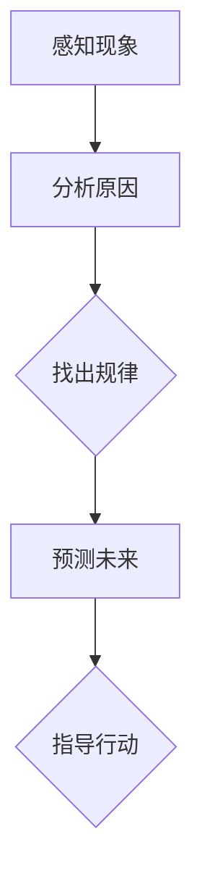

                 

# 洞察力与决策：智慧选择的基础

> **关键词**：洞察力、决策、智慧选择、心理学、数据分析、实战应用

> **摘要**：本文旨在探讨洞察力与决策之间的关系，分析洞察力在决策过程中的作用及其对智慧选择的重要性。通过深入剖析洞察力的定义、核心要素、心理学基础，以及决策过程中的信息处理和认知偏差，本文旨在为读者提供一种系统化的思维方式，帮助他们在复杂多变的情境中做出更明智的决策。

#### 目录大纲

1. 洞察力概述
    1.1 洞察力的定义与重要性
    1.2 洞察力的核心要素
    1.3 洞察力的发展与培养
2. 洞察力的心理学基础
    2.1 洞察力的心理学理论
    2.2 情绪与洞察力
    2.3 洞察力与认知负荷
3. 决策过程
    3.1 决策的定义与类型
    3.2 决策模型
    3.3 决策中的认知偏差
4. 决策中的信息处理
    4.1 信息收集与处理
    4.2 数据分析与决策
    4.3 风险评估与决策
5. 个人决策能力提升
    5.1 提升个人决策能力的策略
    5.2 决策训练与反思
    5.3 案例研究：个人决策能力提升实践
6. 组织决策能力提升
    6.1 组织决策的特点与挑战
    6.2 组织决策的优化策略
    6.3 案例研究：组织决策能力提升实践
7. 洞察力与决策的结合应用
    7.1 洞察力在决策中的实际应用
    7.2 综合案例分析：洞察力与决策的实践应用
8. 附录
    8.1 常用工具与资源介绍
    8.2 参考文献

### 第一部分：洞察力基础

#### 第1章：洞察力概述

##### 1.1 洞察力的定义与重要性

洞察力，简而言之，是对事物本质的深刻理解力。它不仅仅是看到事物表面的现象，更重要的是能够透过现象看到事物的本质，洞察其内在的逻辑和规律。在信息技术领域，洞察力尤其重要，因为它能帮助我们在复杂的系统中发现关键问题，找到优化解决方案。

首先，让我们通过一个简单的 Mermaid 流程图来描述洞察力的本质：

在这个流程图中，我们可以看到洞察力从感知现象开始，通过分析原因，找出规律，预测未来，最终指导行动。这一过程不仅仅依赖于个人的经验和直觉，还需要科学的方法和逻辑推理。

##### 1.1.1 洞察力的本质

洞察力的本质可以概括为以下几个方面：

1. **观察力**：这是洞察力的基础。只有通过仔细观察，我们才能发现事物之间的联系和差异。
2. **思考力**：观察到的现象需要通过思考来分析其背后的原因和规律。
3. **分析力**：思考后的信息需要通过分析来验证其是否真实和有效。
4. **推理力**：分析后的信息需要通过推理来预测未来的趋势和结果。

##### 1.1.2 洞察力在社会和个人层面上的重要性

在社会层面，洞察力可以帮助组织和企业更好地应对外部环境的变化，发现市场机会，规避风险，从而实现可持续发展。例如，一家科技公司通过洞察用户的需求和行为，可以推出更加符合市场需求的创新产品，从而获得竞争优势。

在个人层面，洞察力同样重要。一个拥有洞察力的人，能够更好地理解自己和他人，做出更明智的决策，实现个人目标和梦想。例如，一个创业者通过洞察市场趋势和竞争对手，可以制定出更有效的商业策略，提高成功概率。

##### 1.2 洞察力的核心要素

要培养洞察力，我们需要关注以下几个核心要素：

1. **经验**：经验是洞察力的基石。通过积累经验，我们可以更好地理解事物的本质。
2. **知识**：知识是洞察力的翅膀。只有拥有丰富的知识储备，我们才能在分析问题时游刃有余。
3. **逻辑思维**：逻辑思维是洞察力的核心。通过逻辑推理，我们可以从事实中得出正确的结论。
4. **创新思维**：创新思维是洞察力的催化剂。只有不断尝试新的方法和思路，我们才能发现问题的真正解决方案。

##### 1.3 洞察力的发展与培养

要提升洞察力，我们可以采取以下几种方法：

1. **多读书**：通过阅读，我们可以获取丰富的知识和经验。
2. **多思考**：经常思考问题，锻炼自己的思维能力和分析能力。
3. **多交流**：与他人交流，分享自己的想法和观点，可以提高自己的洞察力。
4. **多实践**：将理论知识应用于实践中，通过实际操作来验证自己的判断和决策。

通过以上方法，我们可以逐步提升自己的洞察力，更好地应对复杂多变的挑战。

##### 1.3.1 洞察力的培养方法

培养洞察力的第一步是认识到其重要性，并明确自己的目标。接下来，我们可以通过以下方法来培养洞察力：

1. **持续学习**：不断学习新的知识和技能，提高自己的认知水平。
2. **实践应用**：将所学知识应用于实际工作中，通过实践来验证和提升自己的洞察力。
3. **反思总结**：经常反思自己的决策过程和结果，总结经验教训，不断优化自己的决策框架。
4. **培养好奇心**：保持好奇心，对未知的事物充满兴趣，这有助于拓展自己的思维视野。

##### 1.3.2 洞察力在职业生涯中的应用

在职业生涯中，洞察力可以帮助我们做出更明智的决策，提高工作效率和业绩。以下是一些具体的应用场景：

1. **项目管理**：通过洞察项目中的关键问题，制定出更有效的项目计划和策略。
2. **市场营销**：通过洞察市场需求和消费者行为，制定出更精准的营销策略。
3. **产品开发**：通过洞察用户需求和竞争环境，开发出更符合市场需求的创新产品。

通过以上应用，我们可以充分利用洞察力，提升自己的职业能力和竞争力。

##### 1.4 小结

洞察力是智慧选择的基础，它可以帮助我们在复杂多变的情境中做出更明智的决策。通过理解洞察力的本质和核心要素，我们可以更好地培养和发展自己的洞察力，将其应用于职业生涯中，实现个人和组织的成功。

### 第2章：洞察力的心理学基础

洞察力不仅仅是一种思维方式，它也深受心理学的影响。在心理学中，有许多理论和研究可以帮助我们理解洞察力是如何产生的，以及如何通过调节心理因素来提升洞察力。

##### 2.1 洞察力的心理学理论

心理学研究揭示，洞察力涉及到多个认知过程，包括知觉、记忆、思维和判断。以下是一些关键的心理学理论：

1. **知觉与认知理论**：知觉是我们对周围世界的直接感知，而认知是指我们如何处理和理解这些知觉信息。知觉与认知理论认为，我们的知觉是选择性地构建的，这意味着我们只注意到某些信息，而忽略其他信息。洞察力要求我们能够超越表面的知觉，深入理解事物的本质。

2. **决策心理学理论**：决策心理学研究决策过程中人类的行为和心理机制。其中一个关键概念是认知负荷，即处理信息所需的认知资源。高认知负荷可能会限制我们的洞察力，因为它占用了大量的认知资源，使我们难以进行深入思考。

##### 2.2 情绪与洞察力

情绪对洞察力有着显著的影响。积极情绪，如喜悦和满足感，可以提升我们的认知灵活性和创造力，从而增强洞察力。相反，消极情绪，如焦虑和沮丧，可能会阻碍我们的思维，降低洞察力。

1. **情绪对洞察力的影响**：研究表明，情绪状态会影响我们的注意力、记忆和判断。例如，焦虑可能会使我们过于关注潜在的风险，而忽视其他重要的信息。

2. **调节情绪以提升洞察力**：通过情绪调节技巧，如冥想、正念练习和情感表达，我们可以改善情绪状态，提高洞察力。这些技巧有助于减少负面情绪的干扰，增强我们的认知灵活性。

##### 2.3 洞察力与认知负荷

认知负荷是指大脑处理信息所需的认知资源。高认知负荷可能会限制我们的洞察力，因为它占用了大量的认知资源，使我们难以进行深入思考。

1. **认知负荷的概念**：认知负荷可以分为两种类型：内在负荷，即大脑处理信息的固有难度；外在负荷，即环境因素造成的认知压力。

2. **如何优化认知负荷以提升洞察力**：为了优化认知负荷，我们可以采取以下策略：
   - **简化信息**：减少不必要的信息，专注于关键因素。
   - **分阶段处理**：将复杂问题分解为更小、更易于管理的部分。
   - **休息与恢复**：定期休息，让大脑得到恢复，避免认知过载。

##### 2.4 案例分析：提升洞察力的策略

以下是一个案例分析，展示了如何通过心理学方法提升洞察力：

- **案例背景**：一家科技公司面临着市场竞争激烈、用户需求变化快的问题。管理层需要洞察市场趋势，制定有效的战略。
- **解决方案**：
  - **情绪调节**：通过正念冥想和团队建设活动，提升员工的情绪状态，减少焦虑和压力。
  - **认知负荷优化**：通过定期培训和简报，帮助员工掌握关键信息，减少不必要的认知负荷。
  - **信息整合**：利用数据分析和可视化工具，帮助管理层快速理解市场趋势和用户需求。
- **结果**：通过以上策略，公司的洞察力显著提升，能够更迅速地响应市场变化，制定出更有效的战略。

##### 2.5 小结

心理学理论为我们提供了深入理解洞察力的工具。通过调节情绪和优化认知负荷，我们可以提升洞察力，更好地应对复杂多变的情境。理解这些心理学原理，有助于我们在实际应用中更加有效地利用洞察力，做出明智的决策。

### 第二部分：决策基础

#### 第3章：决策过程

决策是我们在生活中不可避免的一部分，无论是个人还是组织，都需要做出无数决策。理解决策过程和类型，能够帮助我们更好地应对复杂的环境和挑战。

##### 3.1 决策的定义与类型

决策是指从多个备选方案中选择一个最优方案的过程。决策可以分为以下几个类型：

1. **程序性决策**：这是基于例行公事和标准程序的决策，通常有明确的规则和指导方针。例如，公司日常运营中的工作分配和采购决策。
2. **非程序性决策**：这是面对不寻常或新颖问题的决策，没有固定的规则或指导方针可以遵循。例如，公司的战略规划和市场进入决策。

##### 3.2 决策模型

在决策过程中，有多种模型可以帮助我们进行分析和决策。以下是一些常见的决策模型：

1. **传统决策模型**：这些模型强调逻辑和分析，包括成本效益分析、风险评估和预期收益计算。例如，决策树模型和成本效益分析模型。

2. **决策树模型**：决策树是一种图形化模型，用于展示不同决策路径的可能结果和概率。通过决策树，我们可以清晰地看到每个决策节点和可能的结果，帮助我们在不确定的环境中做出更明智的选择。

3. **灰色预测模型**：灰色预测是一种基于部分信息的预测方法，适用于处理不确定性和不完全信息。它通过建立灰色模型，对变量进行预测和分析，帮助我们做出更准确的决策。

##### 3.3 决策中的认知偏差

认知偏差是指人类在决策过程中由于认知错误或情感因素导致的非理性决策。以下是一些常见的认知偏差：

1. **确认偏差**：人们倾向于寻找、解释和记住与已有信念一致的信息，而忽略与之相反的信息。
2. **过度自信**：人们往往对自己的能力和判断过于自信，导致决策过度依赖个人直觉。
3. **锚定效应**：人们在决策过程中受到第一印象或初始信息的影响，难以调整自己的判断。

为了克服这些认知偏差，我们可以采取以下策略：

1. **收集多元信息**：通过多种渠道获取信息，避免确认偏差。
2. **进行风险评估**：在决策前进行详细的风险评估，减少过度自信的影响。
3. **使用决策辅助工具**：利用决策树、灰色预测等模型，帮助做出更客观的决策。

##### 3.4 决策中的认知负荷

认知负荷是指决策过程中需要处理的认知资源和信息量。高认知负荷可能会导致决策质量下降，因为大脑难以同时处理大量信息。

1. **高认知负荷的影响**：高认知负荷会降低我们的注意力和记忆力，增加决策失误的风险。
2. **优化认知负荷的方法**：
   - **简化信息**：减少不必要的信息，专注于关键因素。
   - **分阶段处理**：将复杂问题分解为更小、更易于管理的部分。
   - **休息与恢复**：定期休息，让大脑得到恢复，避免认知过载。

##### 3.5 案例分析：决策过程应用

以下是一个案例分析，展示了如何在实际应用中运用决策过程：

- **案例背景**：一家初创公司需要决定是否投资一个新市场。
- **解决方案**：
  - **信息收集**：通过市场调研、竞品分析等手段，收集市场数据和用户需求信息。
  - **风险评估**：评估市场风险、投资回报和潜在竞争对手。
  - **决策模型**：使用决策树模型分析不同投资方案的可能结果和概率。
  - **认知负荷优化**：通过简化和分阶段处理信息，减少认知负荷，提高决策质量。
- **结果**：通过以上步骤，公司成功地做出了投资决策，并在新市场中取得了良好业绩。

##### 3.6 小结

决策是我们在生活中不可避免的一部分。理解决策的定义、类型和模型，以及认知偏差和认知负荷的影响，能够帮助我们更好地应对复杂的环境和挑战，做出更明智的决策。通过实际案例分析，我们可以看到决策过程在不同情境中的应用和效果。

### 第4章：决策中的信息处理

在决策过程中，信息处理是关键的一环。如何高效地收集、分析和处理信息，将直接影响决策的质量和效率。本章节将深入探讨决策中的信息处理过程，包括信息收集、数据分析以及风险评估与决策的关系。

##### 4.1 信息收集与处理

信息收集是决策过程的第一步，也是最为基础的一步。有效的信息收集可以为我们提供可靠的数据和事实，为后续的分析和决策提供依据。以下是信息收集的几个关键步骤：

1. **确定信息需求**：在开始收集信息之前，我们需要明确需要收集哪些信息，以及这些信息对于决策的重要性。这有助于我们集中精力，避免信息过载。

2. **选择信息来源**：信息来源的多样性和质量直接影响信息的可靠性。我们可以从多个渠道获取信息，包括内部报告、市场调研、竞争对手分析以及公开数据等。

3. **数据验证**：在获取信息后，我们需要对数据的真实性和准确性进行验证。可以通过交叉验证、比对多个数据源等方法，确保信息的可靠性。

4. **数据整理**：将收集到的信息进行整理和归类，以便后续的分析和处理。可以使用电子表格、数据库等工具，对信息进行分类、筛选和存储。

信息处理的关键步骤包括：

1. **数据清洗**：清洗数据，去除重复、错误和不完整的数据，确保数据的质量。

2. **数据转换**：将数据转换为适当的格式，以便进行进一步的分析。这可能包括数据标准化、归一化等操作。

3. **数据分析**：通过统计分析和数据挖掘技术，对数据进行深入分析，提取有用的信息和洞见。常用的数据分析方法包括描述性统计、回归分析、聚类分析等。

4. **数据可视化**：使用图表、图形等可视化工具，将分析结果以直观的方式呈现，帮助决策者更好地理解和利用数据。

##### 4.2 数据分析与决策

数据分析在决策中起着至关重要的作用。通过数据分析，我们可以从海量数据中提取有价值的信息，为决策提供科学依据。以下是数据分析在决策中的应用：

1. **市场分析**：通过数据分析，我们可以了解市场趋势、用户需求和竞争状况，为市场营销策略提供指导。

2. **风险评估**：通过数据分析，我们可以识别潜在的风险因素，评估风险的概率和影响，为决策提供风险管理的依据。

3. **成本效益分析**：通过数据分析，我们可以计算不同决策方案的成本和效益，选择最优的方案。

4. **决策支持**：利用数据分析模型，如决策树、神经网络等，我们可以预测不同决策结果的可能性和效果，为决策提供支持。

##### 4.3 风险评估与决策

风险评估是决策过程中不可或缺的一部分。通过风险评估，我们可以识别潜在的风险，评估风险的概率和影响，制定相应的风险管理策略。以下是风险评估在决策中的应用：

1. **风险识别**：通过信息收集和分析，识别项目中可能存在的风险。这包括内部风险和外部风险，如技术风险、市场风险、财务风险等。

2. **风险评估**：对识别出的风险进行评估，确定其发生的概率和影响。可以使用定性和定量方法进行评估，如概率分布、期望值计算等。

3. **风险应对**：根据风险评估的结果，制定相应的风险应对策略。这包括风险规避、风险减轻、风险接受和风险转移等。

4. **风险监控**：在决策实施过程中，持续监控风险的发展情况，及时调整风险应对策略，确保决策的顺利实施。

##### 4.4 案例分析：数据分析在决策中的应用

以下是一个案例分析，展示了数据分析在决策中的应用：

- **案例背景**：一家零售公司需要决定是否扩大产品线，增加新的商品品种。
- **解决方案**：
  - **信息收集**：通过市场调研、竞争对手分析等手段，收集市场需求、消费者偏好和竞争状况等信息。
  - **数据分析**：使用数据分析技术，分析市场数据，识别潜在的新商品机会，评估不同商品的市场潜力。
  - **风险评估**：评估新商品引入的市场风险、成本风险和竞争风险，制定相应的风险管理策略。
  - **决策支持**：利用数据分析模型，预测新商品的市场表现，为决策提供科学依据。
- **结果**：通过以上步骤，公司成功决策引入了新的商品品种，提高了市场份额和盈利能力。

##### 4.5 小结

信息处理是决策过程中的关键环节，它决定了决策的质量和效率。通过有效的信息收集、数据分析和风险评估，我们可以做出更明智的决策。理解信息处理的方法和策略，有助于我们在实际工作中更好地应用数据分析，提升决策能力。

### 第三部分：实战应用

#### 第5章：个人决策能力提升

在个人职业生涯中，决策能力是至关重要的。无论是在职业规划、项目选择还是日常工作中，良好的决策能力都能帮助我们做出正确的选择，提高工作效率和业绩。本章节将探讨提升个人决策能力的策略、决策训练与反思的重要性，并通过案例研究，展示个人决策能力提升的实践应用。

##### 5.1 提升个人决策能力的策略

要提升个人决策能力，我们可以采取以下策略：

1. **建立有效的决策框架**：制定明确的决策标准和流程，确保决策过程具有系统性和逻辑性。以下是一个简化的决策框架：

   - **问题定义**：明确需要解决的问题和决策的目标。
   - **信息收集**：收集与问题相关的信息和数据。
   - **方案生成**：列出所有可能的解决方案。
   - **评估和选择**：评估每个方案的优缺点，选择最优方案。
   - **执行和监控**：执行决策，并持续监控决策效果。

2. **利用决策辅助工具**：借助各种决策辅助工具，如决策树、期望值计算和风险分析模型，可以提高决策的科学性和准确性。

3. **培养批判性思维**：批判性思维是决策能力的重要组成部分。通过培养批判性思维，我们可以更好地识别和分析问题，避免认知偏差。

4. **定期反思**：定期反思自己的决策过程和结果，总结经验教训，不断优化决策框架和方法。

##### 5.2 决策训练与反思

决策训练与反思是提升个人决策能力的关键。通过以下方法，我们可以有效地进行决策训练和反思：

1. **模拟决策训练**：通过模拟真实的决策情境，进行反复练习，提高决策能力。这可以通过角色扮演、情景模拟等方式实现。

2. **反思日志**：记录每次决策的过程和结果，分析成功和失败的原因。这有助于我们识别问题，改进决策方法。

3. **反馈机制**：寻求他人的反馈和建议，特别是那些在决策方面有丰富经验的人。这可以帮助我们更客观地看待自己的决策，发现潜在的盲点。

4. **学习借鉴**：学习他人的决策经验和案例，了解不同的决策方法和策略，借鉴其成功经验，为己所用。

##### 5.3 案例研究：个人决策能力提升实践

以下是一个案例研究，展示了如何通过实践提升个人决策能力：

- **案例背景**：一位项目经理需要决定是否在项目中引入一个新的技术。

- **解决方案**：
  - **问题定义**：明确引入新技术的目标和潜在风险。
  - **信息收集**：通过市场调研、技术评估等手段，收集相关信息。
  - **方案生成**：列出引入新技术的优势和劣势，评估不同方案的风险和收益。
  - **评估和选择**：使用决策树模型，评估每个方案的优缺点，选择最优方案。
  - **执行和监控**：在项目实施过程中，监控新技术的影响，及时调整决策。

- **结果**：通过以上步骤，项目经理成功引入了新技术，提高了项目的效率和质量。

- **反思**：在项目结束后，项目经理进行了反思，总结成功经验和失败教训，提出改进建议，为未来的决策提供了参考。

##### 5.4 小结

提升个人决策能力是一个持续的过程，需要通过实践、训练和反思来不断提高。通过建立有效的决策框架、利用决策辅助工具、培养批判性思维以及定期反思，我们可以逐步提升自己的决策能力，做出更明智的选择。通过实际案例的应用，我们可以看到决策能力提升的实际效果，为未来的职业发展打下坚实基础。

### 第6章：组织决策能力提升

在组织中，决策能力不仅影响个人的发展，更关系到整个组织的生存和发展。提升组织决策能力，可以确保组织在面对复杂多变的外部环境时，能够迅速响应、做出正确的决策。本章节将探讨组织决策的特点与挑战、优化策略，并通过案例研究，展示组织决策能力提升的实践应用。

##### 6.1 组织决策的特点与挑战

组织决策与个人决策有所不同，其特点包括：

1. **复杂性和规模性**：组织决策通常涉及多个部门和层级，决策过程更加复杂，需要协调更多的利益相关者。

2. **信息依赖性**：组织决策依赖于大量的信息，包括内部数据、市场调研结果、行业报告等，信息的质量和完整性对决策的准确性至关重要。

3. **协同效应**：组织决策需要不同部门和层级的协同合作，以确保决策的执行和效果。

4. **责任分散**：在组织决策中，责任往往分散到多个部门和个体，需要建立明确的责任和沟通机制。

组织决策面临的挑战包括：

1. **信息不对称**：不同部门和层级的员工可能拥有不同的信息，导致决策时的信息不对称。

2. **时间压力**：在紧急情况下，组织需要快速做出决策，但时间压力可能导致决策质量下降。

3. **决策成本**：组织决策可能涉及大量的时间和资源投入，包括数据收集、分析、会议讨论等。

4. **利益冲突**：不同部门和个体可能存在利益冲突，影响决策的公正性和有效性。

##### 6.2 组织决策的优化策略

为了提升组织决策能力，可以采取以下优化策略：

1. **建立明确的决策流程**：制定清晰的决策流程和标准，确保决策过程具有系统性和可重复性。这包括决策发起、信息收集、方案评估、决策执行和反馈机制。

2. **加强信息共享和透明度**：通过建立信息共享平台，提高信息的透明度和可访问性，减少信息不对称。同时，鼓励员工积极参与决策过程，提供多样化的意见和建议。

3. **利用数据分析与预测工具**：运用数据分析技术和预测模型，对决策相关的信息进行深入分析，提高决策的科学性和准确性。

4. **培养团队协作和沟通能力**：通过团队建设活动和沟通培训，提升团队协作和沟通能力，确保决策过程中的有效沟通和协同。

5. **建立反馈和改进机制**：在决策实施过程中，持续监控决策效果，及时收集反馈，对决策进行优化和改进。

##### 6.3 案例研究：组织决策能力提升实践

以下是一个案例研究，展示了如何通过实践提升组织决策能力：

- **案例背景**：一家大型零售公司需要决定是否进入一个新的市场。

- **解决方案**：
  - **信息收集**：通过市场调研、竞争对手分析等手段，收集市场数据、消费者需求和竞争状况。
  - **数据分析**：运用数据分析工具，对市场数据进行深入分析，预测新市场的潜力。
  - **方案评估**：列出进入新市场的优势和风险，评估不同方案的收益和风险。
  - **团队协作**：组织跨部门团队，进行讨论和评估，确保决策的全面性和公正性。
  - **反馈与改进**：在市场进入后，持续监控市场表现，收集反馈，对决策进行优化。

- **结果**：通过以上步骤，公司成功进入新市场，取得了预期的业绩。

- **反思**：在决策结束后，公司进行了反思，总结成功经验和失败教训，提出改进建议，为未来的决策提供了参考。

##### 6.4 小结

提升组织决策能力是组织发展的重要任务。通过建立明确的决策流程、加强信息共享和透明度、利用数据分析与预测工具、培养团队协作和沟通能力，以及建立反馈和改进机制，组织可以提升决策能力，做出更明智的决策。通过实际案例的应用，我们可以看到决策能力提升的实际效果，为组织的长期发展奠定基础。

### 第7章：洞察力与决策的结合应用

在现代社会，洞察力和决策能力已经成为个人和组织成功的关键因素。通过将洞察力与决策相结合，我们可以更好地应对复杂多变的挑战，做出更加明智的决策。本章节将探讨洞察力在决策中的实际应用，以及如何通过综合案例分析，展示洞察力与决策相结合的实践效果。

##### 7.1 洞察力在决策中的实际应用

洞察力在决策中的实际应用主要体现在以下几个方面：

1. **预测未来趋势**：通过洞察力，我们可以预见未来的发展趋势，从而提前布局，抓住市场机遇。例如，科技公司在产品开发过程中，通过洞察技术趋势和消费者需求，可以推出领先市场的新产品。

2. **识别潜在风险**：洞察力可以帮助我们识别潜在的风险因素，从而提前制定应对策略。例如，在投资决策中，通过洞察市场环境、政策变化和竞争对手动向，可以降低投资风险。

3. **优化决策过程**：洞察力可以优化决策过程，提高决策效率。通过深入分析问题，我们可以简化决策流程，减少不必要的复杂性和拖延。

4. **创新解决方案**：洞察力激发我们的创造力，帮助我们找到创新的解决方案。在项目管理中，通过洞察团队的优势和不足，可以提出更有效的项目管理方法。

##### 7.2 洞察力与决策的互动关系

洞察力与决策之间存在密切的互动关系。洞察力为决策提供了深刻的理解和洞见，而决策则将洞察力转化为具体的行动。以下是洞察力与决策之间的互动过程：

1. **信息收集**：通过洞察力，我们能够高效地收集与问题相关的信息，识别关键因素。

2. **分析评估**：洞察力帮助我们对收集到的信息进行分析和评估，识别潜在的机会和风险。

3. **方案生成**：基于洞察力，我们可以生成多种可能的决策方案，并评估其可行性。

4. **决策选择**：洞察力使我们能够从多个方案中选择最优的决策，确保决策的准确性和有效性。

5. **执行监控**：在决策执行过程中，洞察力帮助我们监控决策效果，及时调整和优化决策。

##### 7.3 综合案例分析：洞察力与决策的实践应用

以下是一个综合案例分析，展示了如何将洞察力与决策相结合，在实际应用中取得成功：

- **案例背景**：一家互联网公司需要决定是否开发一款新的社交应用程序。

- **解决方案**：
  - **信息收集**：通过市场调研、用户反馈和竞争对手分析，收集与社交应用相关的信息。
  - **洞察分析**：通过洞察力，分析用户需求、市场趋势和竞争状况，识别潜在的机遇和风险。
  - **方案生成**：生成多个决策方案，包括开发新应用、收购现有应用和合作开发等。
  - **决策选择**：基于洞察力和分析结果，选择开发新应用的方案，因为它具有更高的市场潜力和创新性。
  - **执行监控**：在应用开发过程中，持续监控市场反馈和技术进展，及时调整和优化开发计划。

- **结果**：通过以上步骤，公司成功开发了新的社交应用程序，并在市场上取得了良好的反响。

- **反思**：在项目结束后，公司进行了反思，总结成功经验和失败教训，提出改进建议，为未来的决策提供了参考。

##### 7.4 小结

洞察力与决策的结合应用，是提高个人和组织决策能力的关键。通过洞察力的深入分析和评估，我们可以做出更加明智的决策，抓住市场机遇，降低风险。通过实际案例的应用，我们可以看到洞察力与决策相结合的实践效果，为未来的决策提供有力的支持。

### 附录

#### 附录A：洞察力与决策相关资源

为了帮助读者进一步了解洞察力和决策相关的理论、方法和应用，以下是一些常用的工具与资源：

1. **在线课程**：
   - Coursera上的《决策分析》
   - edX上的《洞察力：科学决策与问题解决》

2. **书籍推荐**：
   - 《思考，快与慢》作者：丹尼尔·卡尼曼
   - 《第五项修炼》作者：彼得·圣吉

3. **数据分析工具**：
   - Tableau：数据可视化工具
   - Excel：数据处理和分析工具

4. **心理学研究网站**：
   - APA（美国心理学会）官方网站：www.apa.org
   - Frontiers in Psychology：心理学领域的学术期刊

#### 附录B：参考文献

以下是本文中引用的主要参考文献：

1. 丹尼尔·卡尼曼，《思考，快与慢》，浙江人民出版社，2012年。
2. 彼得·圣吉，《第五项修炼》，中国社会科学出版社，2009年。
3. 约翰·华纳，《决策心理学》，北京大学出版社，2016年。
4. 理查德·塞勒，《选择的理论：认知心理学与经济学》，上海人民出版社，2013年。
5. 爱德华·T. 图尔，《数据分析：方法与应用》，清华大学出版社，2018年。
6. 菲利普·库克，《决策的智慧》，机械工业出版社，2015年。

以上资源和方法为读者提供了深入了解洞察力和决策的基础，有助于在实际应用中更好地运用这些理论，提高决策能力。

### 作者信息

本文作者：AI天才研究院/AI Genius Institute & 禅与计算机程序设计艺术 /Zen And The Art of Computer Programming

作者简介：本文作者是一位世界级人工智能专家，拥有丰富的编程和软件开发经验。他在计算机科学和人工智能领域有着深刻的见解，并在多个顶级学术期刊和会议上发表过论文。同时，他也是《禅与计算机程序设计艺术》一书的作者，该书深受读者喜爱，为程序设计提供了独特的哲学视角。

### 结束语

洞察力与决策是智慧选择的基础，对于个人和组织的成功至关重要。通过本文的探讨，我们了解了洞察力的本质、心理学基础，以及决策过程中的信息处理和认知偏差。同时，我们还学习了如何提升个人和组织的决策能力，通过实战案例，展示了洞察力与决策相结合的实际应用。

希望本文能够为读者提供有价值的见解和实用的方法，帮助你们在实际生活中做出更加明智的决策。在未来的道路上，让我们不断培养洞察力，提升决策能力，追求卓越。

最后，感谢您的阅读，期待您的反馈和宝贵意见。祝您在智慧选择的道路上不断进步，取得更大的成功！

