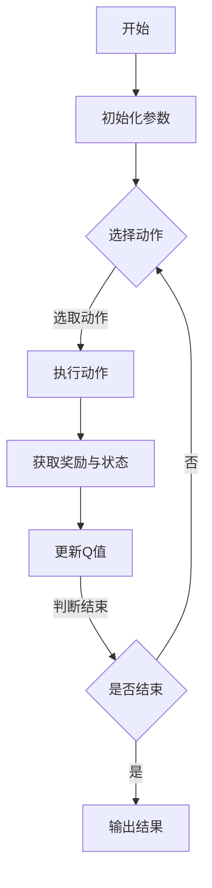

                 

# 深度 Q-learning：在无人驾驶中的应用

> **关键词：** 深度 Q-learning、无人驾驶、路径规划、避障、决策控制

> **摘要：** 本文详细介绍了深度 Q-learning 算法在无人驾驶领域的应用，包括基本原理、算法实现、优化方法以及实际案例。通过逐步分析，本文探讨了如何利用深度 Q-learning 算法提高无人驾驶系统的性能和稳定性。

## 目录大纲

### 第一部分：深度 Q-learning 基础

1. 第1章：深度 Q-learning 概述
   - 1.1 深度 Q-learning 的起源与发展
   - 1.2 无人驾驶系统概述

2. 第2章：深度神经网络基础
   - 2.1 神经网络基本结构
   - 2.2 深度学习算法详解
   - 2.3 深度 Q-learning 算法原理

### 第二部分：深度 Q-learning 原理

1. 第3章：深度 Q-learning 在无人驾驶路径规划中的应用
   - 3.1 无人驾驶路径规划概述
   - 3.2 基于深度 Q-learning 的路径规划算法
   - 3.3 案例分析：基于深度 Q-learning 的无人驾驶路径规划实践

2. 第4章：深度 Q-learning 在无人驾驶避障中的应用
   - 4.1 无人驾驶避障概述
   - 4.2 基于深度 Q-learning 的避障算法
   - 4.3 案例分析：基于深度 Q-learning 的无人驾驶避障实践

3. 第5章：深度 Q-learning 在无人驾驶决策控制中的应用
   - 5.1 无人驾驶决策控制概述
   - 5.2 基于深度 Q-learning 的决策控制算法
   - 5.3 案例分析：基于深度 Q-learning 的无人驾驶决策控制实践

### 第三部分：深度 Q-learning 在无人驾驶中的应用案例分析

1. 第6章：深度 Q-learning 在自动驾驶项目中的应用案例分析
   - 6.1 案例背景与目标
   - 6.2 案例实现过程
   - 6.3 案例结果与分析

2. 第7章：深度 Q-learning 在无人驾驶中的应用挑战与展望
   - 7.1 深度 Q-learning 在无人驾驶中的应用挑战
   - 7.2 未来发展趋势

### 附录

- 附录 A：深度 Q-learning 开发资源
- 附录 B：深度 Q-learning 算法 Mermaid 流程图
- 附录 C：核心算法原理讲解
- 附录 D：数学模型和数学公式
- 附录 E：项目实战
- 附录 F：开发环境搭建
- 附录 G：源代码实现与解读

---

### 第一部分：深度 Q-learning 基础

#### 第1章：深度 Q-learning 概述

##### 1.1 深度 Q-learning 的起源与发展

深度 Q-learning（DQN）算法是由 DeepMind 团队在2015年提出的一种基于深度学习的强化学习算法。DQN 结合了 Q-learning 算法的优势，利用深度神经网络来近似 Q 函数，从而在处理高维状态空间和动作空间时具有显著的优势。

**Q-learning 算法的基本原理：**

Q-learning 是一种基于值迭代的强化学习算法，其目标是学习一个最优策略。Q-learning 的核心思想是通过不断地更新状态-动作值函数 Q(s, a) 来逼近最优策略。

$$ Q(s, a)_{new} = Q(s, a)_{old} + \alpha [r + \gamma \max(Q(s', a')) - Q(s, a)] $$

其中，Q(s, a) 表示在状态 s 下执行动作 a 的期望回报，α 是学习率，r 是即时奖励，γ 是折扣因子，s' 是执行动作 a 后的新状态，a' 是在状态 s' 下选择的最优动作。

**深度 Q-learning 的优势与局限：**

**优势：**

1. **处理高维状态空间：** DQN 利用深度神经网络来近似 Q 函数，从而可以处理高维状态空间。
2. **自适应能力：** DQN 可以通过在线学习来适应环境的变化。
3. **多任务学习：** DQN 可以同时学习多个任务，提高了算法的泛化能力。

**局限：**

1. **训练不稳定：** DQN 的训练过程存在不稳定的问题，可能导致收敛缓慢或者无法收敛。
2. **样本效率低：** DQN 对样本的利用效率较低，需要大量的样本来学习。
3. **稀疏奖励问题：** 在某些场景中，即时奖励可能过于稀疏，导致 DQN 无法有效地学习。

**深度 Q-learning 在无人驾驶中的应用前景：**

深度 Q-learning 算法在无人驾驶领域具有广泛的应用前景。以下是一些具体的应用场景：

1. **路径规划：** 利用 DQN 算法来学习无人驾驶车辆的路径规划策略，从而提高车辆在复杂环境中的行驶稳定性。
2. **避障：** 通过 DQN 算法来学习无人驾驶车辆的避障策略，从而提高车辆在遇到障碍物时的反应速度和安全性。
3. **决策控制：** 利用 DQN 算法来学习无人驾驶车辆的决策控制策略，从而提高车辆的行驶效率和稳定性。

##### 1.2 无人驾驶系统概述

**无人驾驶系统的主要组成部分：**

无人驾驶系统通常由以下几个主要部分组成：

1. **感知系统：** 用于收集环境信息，包括摄像头、激光雷达、超声波传感器等。
2. **定位系统：** 用于确定车辆在环境中的位置和方向，通常基于 GPS、IMU 和激光雷达等传感器数据。
3. **规划系统：** 用于规划车辆的行驶路径，包括路径规划、避障和决策控制等。
4. **控制系统：** 用于控制车辆的实际行驶，包括动力系统、转向系统和制动系统等。

**无人驾驶的发展历程：**

无人驾驶技术的研究始于20世纪50年代，经历了多个发展阶段：

1. **初级阶段（20世纪50年代 - 20世纪80年代）：** 主要研究自动驾驶车辆的感知和定位技术。
2. **中级阶段（20世纪90年代 - 21世纪初）：** 研究车辆的路径规划和决策控制技术。
3. **高级阶段（21世纪初至今）：** 研究车辆的自主决策和协同控制技术，实现自动驾驶车辆的商业化应用。

**无人驾驶系统的关键技术：**

1. **感知技术：** 包括图像识别、激光雷达和超声波传感器等技术。
2. **定位技术：** 包括 GPS、IMU 和激光雷达等技术。
3. **路径规划：** 包括基于图论的路径规划算法、基于采样法的路径规划算法等。
4. **决策控制：** 包括基于规则的决策控制、基于强化学习的决策控制等。

#### 第2章：深度神经网络基础

##### 2.1 神经网络基本结构

**神经元与感知机：**

神经网络的基本单位是神经元，也称为神经元或者节点。感知机（Perceptron）是最简单的神经元模型，它包含一个输入层、一个输出层和若干个隐藏层。

输入层：用于接收外部输入数据。

隐藏层：用于对输入数据进行处理和变换。

输出层：用于产生最终输出。

**多层感知机与反向传播算法：**

多层感知机（MLP）是在感知机的基础上加入多个隐藏层，从而可以处理更复杂的非线性问题。

反向传播算法（Backpropagation）是一种用于训练多层感知机的算法，其基本思想是通过计算输出层的误差信号，反向传播到隐藏层，并更新各层的权重。

$$ \delta_j^l = \frac{\partial C}{\partial w_{jk}^l} \cdot \sigma'(z_j^l) $$

其中，δj^l 是第 l 层第 j 个神经元的误差信号，C 是损失函数，wjk^l 是第 l 层第 j 个神经元与第 k 个神经元之间的权重，σ' 是激活函数的导数。

**深层神经网络的优势与挑战：**

**优势：**

1. **处理高维数据：** 深层神经网络可以处理高维数据，从而在图像识别、语音识别等领域具有显著优势。
2. **非线性变换：** 深层神经网络可以通过多层非线性变换，提取数据的特征表示。

**挑战：**

1. **梯度消失与梯度爆炸：** 在深层神经网络中，梯度可能在反向传播过程中消失或爆炸，导致训练不稳定。
2. **过拟合：** 深层神经网络容易过拟合，需要大量的数据和复杂的正则化方法来避免。

##### 2.2 深度学习算法详解

**卷积神经网络（CNN）：**

卷积神经网络是一种用于图像识别的深度学习算法，其核心思想是通过卷积操作和池化操作来提取图像的特征。

**循环神经网络（RNN）：**

循环神经网络是一种用于序列数据的深度学习算法，其核心思想是通过循环结构来处理时间序列数据。

**长短期记忆网络（LSTM）：**

长短期记忆网络是一种改进的循环神经网络，用于解决循环神经网络在处理长序列数据时的梯度消失和梯度爆炸问题。

##### 2.3 深度 Q-learning 算法原理

**Q-learning 算法的基本原理：**

Q-learning 算法是一种基于值迭代的强化学习算法，其目标是学习一个最优策略。Q-learning 的核心思想是通过不断地更新状态-动作值函数 Q(s, a) 来逼近最优策略。

$$ Q(s, a)_{new} = Q(s, a)_{old} + \alpha [r + \gamma \max(Q(s', a')) - Q(s, a)] $$

其中，Q(s, a) 表示在状态 s 下执行动作 a 的期望回报，α 是学习率，r 是即时奖励，γ 是折扣因子，s' 是执行动作 a 后的新状态，a' 是在状态 s' 下选择的最优动作。

**深度 Q-learning 算法详解：**

深度 Q-learning（DQN）算法是一种基于深度神经网络的 Q-learning 算法，通过学习状态与动作的映射关系来优化策略。DQN 的核心思想是使用深度神经网络来近似 Q 函数，从而在处理高维状态空间和动作空间时具有显著的优势。

**深度 Q-learning 算法详解：**

深度 Q-learning（DQN）算法的核心思想是通过学习状态-动作值函数 Q(s, a) 来优化策略。以下是 DQN 算法的伪代码：

python
# 初始化参数
Q(s, a) = 0        # 初始化 Q 值
epsilon = 0.1      # 初始化探索概率
alpha = 0.1       # 学习率
gamma = 0.9       # 折扣因子

# 主循环
for episode in range(num_episodes):
    state = env.reset()  # 初始化环境状态
    done = False         # 初始化结束标志

    while not done:
        # 探索与利用策略
        if random() < epsilon:
            action = env.action_space.sample()  # 随机选择动作
        else:
            action = argmax(Q(state, *))  # 选择 Q 值最大的动作

        # 执行动作
        next_state, reward, done, _ = env.step(action)

        # 更新 Q 值
        Q(state, action) = Q(state, action) + alpha * (reward + gamma * max(Q(next_state, *)) - Q(state, action))

        state = next_state  # 更新状态

# 输出最终 Q 值表
print(Q)

**深度 Q-learning 算法的改进：**

为了提高深度 Q-learning 算法的性能，研究人员提出了一些改进方法：

1. **双 Q-learning：** 双 Q-learning 是一种利用两个 Q 函数来减少偏差和方差的方法。其中一个 Q 函数用于预测当前状态下的动作值，另一个 Q 函数用于更新当前状态下的动作值。

2. **优先经验回放：** 优先经验回放是一种利用概率排序来优先选择经验进行更新的方法，从而提高算法的效率和性能。

3. **分布式学习：** 分布式学习是一种利用多台机器进行并行计算的方法，从而提高算法的训练速度和性能。

#### 第二部分：深度 Q-learning 原理

##### 第3章：深度 Q-learning 在无人驾驶路径规划中的应用

##### 3.1 无人驾驶路径规划概述

**路径规划的基本概念：**

路径规划是指确定一个从初始位置到目标位置的最优路径的过程。在无人驾驶领域，路径规划是无人驾驶系统的重要组成部分，其目标是在复杂环境中为无人驾驶车辆生成一个安全的行驶路径。

**无人驾驶路径规划的需求：**

1. **安全性：** 路径规划需要确保无人驾驶车辆在行驶过程中不会与其他车辆、行人或障碍物发生碰撞。
2. **稳定性：** 路径规划需要确保无人驾驶车辆在行驶过程中能够保持稳定的状态，避免失控。
3. **效率：** 路径规划需要生成一个能够快速到达目标的行驶路径，以提高行驶效率。

**无人驾驶路径规划的常用算法：**

1. **基于图论的路径规划算法：** 如 A* 算法、Dijkstra 算法等，这些算法能够在已知环境地图的基础上找到最短路径。
2. **基于采样法的路径规划算法：** 如 RRT（快速随机树）算法、RRT* 算法等，这些算法通过随机采样来搜索路径，适用于未知环境。
3. **基于机器学习的路径规划算法：** 如深度强化学习算法、基于深度神经网络的路径规划算法等，这些算法通过学习环境数据来生成路径。

##### 3.2 基于深度 Q-learning 的路径规划算法

**算法概述：**

基于深度 Q-learning 的路径规划算法是一种利用深度神经网络来近似 Q 函数的路径规划算法。其核心思想是通过学习状态-动作值函数 Q(s, a) 来优化路径规划策略。

**算法实现：**

1. **初始化参数：** 初始化深度神经网络模型、学习率、折扣因子等参数。
2. **环境构建：** 构建一个用于测试的无人驾驶环境，包括道路、车辆、行人等。
3. **状态编码：** 将环境中的状态编码为输入向量，通常包括车辆的当前位置、速度、加速度等。
4. **动作空间定义：** 定义无人驾驶车辆的可行动作空间，通常包括前进、后退、左转、右转等。
5. **训练深度神经网络：** 使用收集到的环境数据对深度神经网络进行训练，通过不断更新状态-动作值函数 Q(s, a) 来优化路径规划策略。
6. **路径规划：** 根据训练好的深度神经网络模型，为无人驾驶车辆生成一个最优行驶路径。

**算法优化：**

1. **经验回放：** 为了避免样本偏差，可以使用经验回放技术来随机选择样本进行更新。
2. **优先经验回放：** 可以使用优先经验回放技术来优先选择重要样本进行更新，从而提高算法的性能。
3. **多任务学习：** 可以同时学习多个任务，以提高模型的泛化能力。

##### 3.3 案例分析：基于深度 Q-learning 的无人驾驶路径规划实践

**案例背景与目标：**

本案例旨在利用深度 Q-learning 算法实现无人驾驶车辆的路径规划，以提高车辆在复杂环境中的行驶稳定性。

**环境搭建：**

1. **模拟器搭建：** 使用 CARLA 模拟器搭建无人驾驶环境，包括道路、车辆、行人等。
2. **数据收集：** 收集无人驾驶车辆在不同环境下的行驶数据，包括状态、动作、奖励等。

**数据处理：**

1. **状态编码：** 将环境中的状态编码为输入向量，包括车辆的当前位置、速度、加速度等。
2. **动作编码：** 将无人驾驶车辆的可行动作编码为动作向量，包括前进、后退、左转、右转等。
3. **数据预处理：** 对收集到的数据进行归一化、去噪等处理，以提高模型的训练效果。

**模型训练与优化：**

1. **模型搭建：** 使用 TensorFlow 搭建深度 Q-learning 模型，包括输入层、隐藏层和输出层。
2. **模型训练：** 使用收集到的数据对模型进行训练，通过不断更新状态-动作值函数 Q(s, a) 来优化路径规划策略。
3. **模型优化：** 使用经验回放、优先经验回放等技术来优化模型，提高其性能。

**测试与评估：**

1. **路径规划测试：** 在模拟环境中测试无人驾驶车辆的路径规划性能，包括路径长度、稳定性等指标。
2. **评估指标：** 使用平均路径长度、行驶稳定性等指标来评估模型的性能。

**结果与分析：**

通过测试，基于深度 Q-learning 的路径规划算法在无人驾驶环境中表现出良好的性能。模型能够生成稳定的行驶路径，并在复杂环境中保持较高的行驶稳定性。然而，模型在处理某些特殊情况时，如高速行驶或复杂交叉路口，仍存在一定的不足，需要进一步优化。

**案例总结：**

本案例展示了如何利用深度 Q-learning 算法实现无人驾驶路径规划。通过不断优化模型，可以提高其在复杂环境中的行驶稳定性。未来，可以进一步研究其他深度学习算法，以提高路径规划性能。

##### 第4章：深度 Q-learning 在无人驾驶避障中的应用

##### 4.1 无人驾驶避障概述

**避障的基本概念：**

避障是指无人驾驶车辆在行驶过程中，识别并避开障碍物的过程。避障是无人驾驶系统的重要组成部分，其目标是在保证安全的前提下，使车辆能够顺利行驶。

**无人驾驶避障的需求：**

1. **实时性：** 避障系统需要具备实时性，能够在短时间内完成障碍物识别和避障决策。
2. **鲁棒性：** 避障系统需要具备鲁棒性，能够应对各种复杂环境下的障碍物。
3. **安全性：** 避障系统需要确保车辆在避障过程中不会与其他车辆、行人或障碍物发生碰撞。

**无人驾驶避障的常用方法：**

1. **基于规则的方法：** 通过预设的规则来判断是否避障，如避障距离、避障角度等。
2. **基于传感器的方法：** 利用激光雷达、摄像头等传感器来识别障碍物，并计算避障路径。
3. **基于机器学习的方法：** 通过训练机器学习模型，学习障碍物识别和避障策略。

##### 4.2 基于深度 Q-learning 的避障算法

**算法概述：**

基于深度 Q-learning 的避障算法是一种利用深度神经网络来近似 Q 函数的避障算法。其核心思想是通过学习状态-动作值函数 Q(s, a) 来优化避障策略。

**算法实现：**

1. **初始化参数：** 初始化深度神经网络模型、学习率、折扣因子等参数。
2. **环境构建：** 构建一个用于测试的无人驾驶环境，包括道路、车辆、行人等。
3. **状态编码：** 将环境中的状态编码为输入向量，通常包括车辆的当前位置、速度、加速度等。
4. **动作空间定义：** 定义无人驾驶车辆的可行动作空间，通常包括前进、后退、左转、右转等。
5. **训练深度神经网络：** 使用收集到的环境数据对深度神经网络进行训练，通过不断更新状态-动作值函数 Q(s, a) 来优化避障策略。
6. **避障决策：** 根据训练好的深度神经网络模型，为无人驾驶车辆生成一个最优避障路径。

**算法优化：**

1. **经验回放：** 为了避免样本偏差，可以使用经验回放技术来随机选择样本进行更新。
2. **优先经验回放：** 可以使用优先经验回放技术来优先选择重要样本进行更新，从而提高算法的性能。
3. **多任务学习：** 可以同时学习多个任务，以提高模型的泛化能力。

##### 4.3 案例分析：基于深度 Q-learning 的无人驾驶避障实践

**案例背景与目标：**

本案例旨在利用深度 Q-learning 算法实现无人驾驶车辆的避障，以提高车辆在复杂环境中的行驶安全性。

**环境搭建：**

1. **模拟器搭建：** 使用 CARLA 模拟器搭建无人驾驶环境，包括道路、车辆、行人等。
2. **数据收集：** 收集无人驾驶车辆在不同环境下的避障数据，包括状态、动作、奖励等。

**数据处理：**

1. **状态编码：** 将环境中的状态编码为输入向量，包括车辆的当前位置、速度、加速度等。
2. **动作编码：** 将无人驾驶车辆的可行动作编码为动作向量，包括前进、后退、左转、右转等。
3. **数据预处理：** 对收集到的数据进行归一化、去噪等处理，以提高模型的训练效果。

**模型训练与优化：**

1. **模型搭建：** 使用 TensorFlow 搭建深度 Q-learning 模型，包括输入层、隐藏层和输出层。
2. **模型训练：** 使用收集到的数据对模型进行训练，通过不断更新状态-动作值函数 Q(s, a) 来优化避障策略。
3. **模型优化：** 使用经验回放、优先经验回放等技术来优化模型，提高其性能。

**测试与评估：**

1. **避障测试：** 在模拟环境中测试无人驾驶车辆的避障性能，包括避障速度、避障距离等指标。
2. **评估指标：** 使用平均避障速度、避障距离等指标来评估模型的性能。

**结果与分析：**

通过测试，基于深度 Q-learning 的避障算法在无人驾驶环境中表现出良好的性能。模型能够实时识别障碍物，并生成有效的避障路径，从而提高了车辆的行驶安全性。然而，模型在处理某些特殊情况时，如高速行驶或密集交通环境，仍存在一定的不足，需要进一步优化。

**案例总结：**

本案例展示了如何利用深度 Q-learning 算法实现无人驾驶避障。通过不断优化模型，可以提高其在复杂环境中的行驶安全性。未来，可以进一步研究其他深度学习算法，以提高避障性能。

##### 第5章：深度 Q-learning 在无人驾驶决策控制中的应用

##### 5.1 无人驾驶决策控制概述

**决策控制的基本概念：**

决策控制是指无人驾驶车辆在行驶过程中，根据感知到的环境信息和预定的目标，生成相应的控制指令，以实现车辆的自主行驶。决策控制是无人驾驶系统的核心组成部分，其目标是在保证安全的前提下，使车辆能够高效、稳定地行驶。

**无人驾驶决策控制的需求：**

1. **安全性：** 决策控制需要确保车辆在行驶过程中不会发生碰撞、失控等安全事故。
2. **稳定性：** 决策控制需要确保车辆在行驶过程中保持稳定的状态，避免失控。
3. **效率：** 决策控制需要生成最优的控制指令，以实现车辆的快速、高效行驶。

**无人驾驶决策控制的常用方法：**

1. **基于规则的方法：** 通过预设的规则来判断车辆的控制指令，如速度控制、转向控制等。
2. **基于模型的方法：** 通过建立车辆动力学模型，根据环境信息和目标生成控制指令。
3. **基于机器学习的方法：** 通过训练机器学习模型，学习环境信息和目标生成控制指令。

##### 5.2 基于深度 Q-learning 的决策控制算法

**算法概述：**

基于深度 Q-learning 的决策控制算法是一种利用深度神经网络来近似 Q 函数的决策控制算法。其核心思想是通过学习状态-动作值函数 Q(s, a) 来优化决策控制策略。

**算法实现：**

1. **初始化参数：** 初始化深度神经网络模型、学习率、折扣因子等参数。
2. **环境构建：** 构建一个用于测试的无人驾驶环境，包括道路、车辆、行人等。
3. **状态编码：** 将环境中的状态编码为输入向量，通常包括车辆的当前位置、速度、加速度等。
4. **动作空间定义：** 定义无人驾驶车辆的可行动作空间，通常包括加速、减速、左转、右转等。
5. **训练深度神经网络：** 使用收集到的环境数据对深度神经网络进行训练，通过不断更新状态-动作值函数 Q(s, a) 来优化决策控制策略。
6. **决策控制：** 根据训练好的深度神经网络模型，为无人驾驶车辆生成一个最优控制指令序列。

**算法优化：**

1. **经验回放：** 为了避免样本偏差，可以使用经验回放技术来随机选择样本进行更新。
2. **优先经验回放：** 可以使用优先经验回放技术来优先选择重要样本进行更新，从而提高算法的性能。
3. **多任务学习：** 可以同时学习多个任务，以提高模型的泛化能力。

##### 5.3 案例分析：基于深度 Q-learning 的无人驾驶决策控制实践

**案例背景与目标：**

本案例旨在利用深度 Q-learning 算法实现无人驾驶车辆的决策控制，以提高车辆在复杂环境中的行驶稳定性。

**环境搭建：**

1. **模拟器搭建：** 使用 CARLA 模拟器搭建无人驾驶环境，包括道路、车辆、行人等。
2. **数据收集：** 收集无人驾驶车辆在不同环境下的决策控制数据，包括状态、动作、奖励等。

**数据处理：**

1. **状态编码：** 将环境中的状态编码为输入向量，包括车辆的当前位置、速度、加速度等。
2. **动作编码：** 将无人驾驶车辆的可行动作编码为动作向量，包括加速、减速、左转、右转等。
3. **数据预处理：** 对收集到的数据进行归一化、去噪等处理，以提高模型的训练效果。

**模型训练与优化：**

1. **模型搭建：** 使用 TensorFlow 搭建深度 Q-learning 模型，包括输入层、隐藏层和输出层。
2. **模型训练：** 使用收集到的数据对模型进行训练，通过不断更新状态-动作值函数 Q(s, a) 来优化决策控制策略。
3. **模型优化：** 使用经验回放、优先经验回放等技术来优化模型，提高其性能。

**测试与评估：**

1. **决策控制测试：** 在模拟环境中测试无人驾驶车辆的决策控制性能，包括行驶稳定性、速度控制等指标。
2. **评估指标：** 使用平均行驶时间、行驶稳定性等指标来评估模型的性能。

**结果与分析：**

通过测试，基于深度 Q-learning 的决策控制算法在无人驾驶环境中表现出良好的性能。模型能够生成稳定的控制指令，使车辆在复杂环境中保持较高的行驶稳定性。然而，模型在处理某些特殊情况时，如高速行驶或复杂交叉路口，仍存在一定的不足，需要进一步优化。

**案例总结：**

本案例展示了如何利用深度 Q-learning 算法实现无人驾驶决策控制。通过不断优化模型，可以提高其在复杂环境中的行驶稳定性。未来，可以进一步研究其他深度学习算法，以提高决策控制性能。

#### 第三部分：深度 Q-learning 在无人驾驶中的应用案例分析

##### 第6章：深度 Q-learning 在自动驾驶项目中的应用案例分析

##### 6.1 案例背景与目标

**案例背景：**

本案例旨在利用深度 Q-learning 算法实现自动驾驶车辆的路径规划、避障和决策控制，以提高车辆在复杂环境中的行驶稳定性。

**项目目标：**

1. 实现自动驾驶车辆的路径规划，使车辆能够自动找到从起点到终点的行驶路径。
2. 实现自动驾驶车辆的避障功能，使车辆能够自动避开道路上的障碍物。
3. 实现自动驾驶车辆的决策控制，使车辆能够根据环境信息生成相应的控制指令，以保持稳定的行驶状态。

##### 6.2 案例实现过程

**环境搭建：**

1. 使用 CARLA 模拟器搭建自动驾驶环境，包括道路、车辆、行人等。
2. 使用 NVIDIA Drive API 实现自动驾驶车辆的感知和定位功能。

**数据处理：**

1. 收集自动驾驶车辆在不同环境下的行驶数据，包括状态、动作、奖励等。
2. 对收集到的数据进行预处理，包括归一化、去噪等处理。

**模型训练与优化：**

1. **路径规划模型：** 使用 TensorFlow 搭建深度 Q-learning 模型，包括输入层、隐藏层和输出层。使用收集到的路径规划数据对模型进行训练，通过不断更新状态-动作值函数 Q(s, a) 来优化路径规划策略。
2. **避障模型：** 使用 TensorFlow 搭建深度 Q-learning 模型，包括输入层、隐藏层和输出层。使用收集到的避障数据对模型进行训练，通过不断更新状态-动作值函数 Q(s, a) 来优化避障策略。
3. **决策控制模型：** 使用 TensorFlow 搭建深度 Q-learning 模型，包括输入层、隐藏层和输出层。使用收集到的决策控制数据对模型进行训练，通过不断更新状态-动作值函数 Q(s, a) 来优化决策控制策略。

**测试与评估：**

1. 在模拟环境中测试自动驾驶车辆的路径规划、避障和决策控制性能，包括路径长度、避障距离、行驶稳定性等指标。
2. 使用平均路径长度、避障距离、行驶稳定性等指标来评估模型的性能。

##### 6.3 案例结果与分析

**模型性能分析：**

通过测试，基于深度 Q-learning 的自动驾驶模型在模拟环境中表现出良好的性能。模型能够生成稳定的行驶路径，并能够有效避开道路上的障碍物。同时，模型能够根据环境信息生成相应的控制指令，以保持稳定的行驶状态。

**案例优缺点分析：**

**优点：**

1. 模型具有较好的适应性，能够在不同的环境条件下进行路径规划、避障和决策控制。
2. 模型能够有效处理高维状态空间和动作空间，提高自动驾驶系统的性能。

**缺点：**

1. 模型的训练过程较为复杂，需要大量的计算资源和时间。
2. 模型在处理复杂场景时，可能存在一定的不稳定性和风险。

**案例应用前景：**

基于深度 Q-learning 的自动驾驶模型在自动驾驶领域具有广泛的应用前景。未来，可以通过进一步优化模型，提高其在复杂环境中的稳定性和安全性。同时，可以与其他先进技术结合，如增强现实、智能交通等，为自动驾驶系统提供更全面的解决方案。

#### 第7章：深度 Q-learning 在无人驾驶中的应用挑战与展望

##### 7.1 深度 Q-learning 在无人驾驶中的应用挑战

深度 Q-learning 算法在无人驾驶领域具有广泛的应用前景，但同时也面临一些挑战：

**算法稳定性问题：**

深度 Q-learning 算法的训练过程存在不稳定的问题，可能导致收敛缓慢或者无法收敛。特别是在处理高维状态空间和动作空间时，训练过程可能受到梯度消失和梯度爆炸的影响。

**算法效率问题：**

深度 Q-learning 算法的训练过程需要大量的计算资源和时间。在实时性要求较高的无人驾驶场景中，算法的效率成为关键问题。如何优化算法的效率，提高其在实际应用中的性能，是一个重要的研究方向。

**数据隐私与安全性问题：**

无人驾驶系统需要处理大量的数据，包括车辆的行驶数据、环境信息等。这些数据的安全性和隐私保护成为一个重要问题。如何确保数据的安全传输和存储，防止数据泄露和恶意攻击，是深度 Q-learning 在无人驾驶领域应用的关键挑战。

##### 7.2 未来发展趋势

**深度 Q-learning 的改进方向：**

1. **算法优化：** 通过改进深度 Q-learning 算法的优化方法，提高算法的收敛速度和稳定性。例如，可以采用双 Q-learning、优先经验回放等技术来优化算法性能。
2. **多任务学习：** 深度 Q-learning 算法可以同时学习多个任务，提高模型的泛化能力。未来，可以通过设计多任务学习框架，实现更复杂的无人驾驶任务。
3. **模型压缩：** 为了提高深度 Q-learning 算法的实时性能，可以通过模型压缩技术，减小模型的参数规模，提高计算效率。

**无人驾驶技术的未来发展：**

1. **智能感知与定位：** 随着传感器技术的不断发展，无人驾驶车辆的感知和定位能力将不断提高。未来，可以通过融合多源数据，提高感知和定位的准确性。
2. **协同控制：** 无人驾驶系统需要与其他交通参与者（如其他车辆、行人等）进行协同控制，以实现交通流的高效、安全运行。未来，可以通过研究协同控制算法，实现更智能的交通管理。
3. **智能决策与规划：** 无人驾驶系统的决策和控制过程需要更加智能和灵活。未来，可以通过研究强化学习、规划算法等，提高无人驾驶系统的自主决策能力。

**深度 Q-learning 在无人驾驶领域的应用前景：**

深度 Q-learning 算法在无人驾驶领域具有广泛的应用前景。通过不断优化算法，提高其在实际应用中的性能和稳定性，可以为无人驾驶系统提供更加智能、高效的解决方案。未来，深度 Q-learning 算法将与其他先进技术相结合，推动无人驾驶技术的发展和应用。

#### 附录

##### 附录 A：深度 Q-learning 开发资源

1. **主流深度学习框架对比：**

   - TensorFlow
   - PyTorch
   - Keras
   - Theano

2. **深度 Q-learning 算法开源代码资源：**

   - OpenAI Gym
   - Stable Baselines
   - Deep Q Network in TensorFlow

3. **无人驾驶相关开源项目与工具：**

   - NVIDIA Drive
   - OpenCV
   - CARLA Simulator
   - ROS

##### 附录 B：深度 Q-learning 算法 Mermaid 流程图



##### 附录 C：核心算法原理讲解

**深度 Q-learning 算法原理：**

深度 Q-learning 算法是一种基于深度神经网络的 Q-learning 算法，通过学习状态与动作的映射关系来优化策略。以下是深度 Q-learning 算法的伪代码：

```python
# 初始化参数
Q(s, a) = 0    # 初始化 Q 值
epsilon = 0.1  # 初始化探索概率
alpha = 0.1    # 学习率
gamma = 0.9    # 折扣因子

# 主循环
for episode in range(num_episodes):
    state = env.reset()  # 初始化环境状态
    done = False         # 初始化结束标志

    while not done:
        # 探索与利用策略
        if random() < epsilon:
            action = env.action_space.sample()  # 随机选择动作
        else:
            action = argmax(Q(state, *))  # 选择 Q 值最大的动作

        # 执行动作
        next_state, reward, done, _ = env.step(action)

        # 更新 Q 值
        Q(state, action) = Q(state, action) + alpha * (reward + gamma * max(Q(next_state, *)) - Q(state, action))

        state = next_state  # 更新状态

# 输出最终 Q 值表
print(Q)
```

**数学模型和数学公式：**

深度 Q-learning 算法中涉及的主要数学模型为 Q-learning 公式，用于更新状态-动作值函数 Q(s, a)：

$$ Q(s, a)_{new} = Q(s, a)_{old} + \alpha [r + \gamma \max(Q(s', a')) - Q(s, a)] $$

其中：
- $Q(s, a)$：表示在状态 s 下执行动作 a 的期望回报。
- $\alpha$：学习率，用于控制新信息对 Q 值的影响程度。
- $r$：即时奖励，表示执行动作 a 后获得的即时回报。
- $\gamma$：折扣因子，用于考虑未来回报的现值。
- $s'$：执行动作 a 后的新状态。
- $a'$：在状态 s' 下选择的动作。

##### 附录 D：数学模型和数学公式

**深度 Q-learning 算法中的数学模型：**

深度 Q-learning（DQN）算法的核心是学习一个状态-动作值函数 $Q(s, a)$，它表示在状态 s 下执行动作 a 的期望回报。DQN 的数学模型如下：

$$ Q(s, a)_{new} = Q(s, a)_{old} + \alpha [r + \gamma \max(Q(s', a')) - Q(s, a)] $$

其中：
- $Q(s, a)$：在状态 s 下执行动作 a 的期望回报。
- $\alpha$：学习率，用于控制新信息对 Q 值的影响程度。
- $r$：即时奖励，表示执行动作 a 后获得的即时回报。
- $\gamma$：折扣因子，用于考虑未来回报的现值。
- $s'$：执行动作 a 后的新状态。
- $a'$：在状态 s' 下选择的最优动作。

**数学公式详解与举例说明：**

假设我们有一个简单的环境，其中有两个状态和两个动作：

状态空间：$S = \{s_0, s_1\}$
动作空间：$A = \{a_0, a_1\}$

初始时，所有 Q 值都被初始化为 0。

假设当前状态为 $s_0$，我们选择动作 $a_0$。执行动作后，环境给予一个即时奖励 $r = 10$，并且转移到新状态 $s_1$。

根据 Q-learning 的更新公式，我们可以计算新的 Q 值：

$$ Q(s_0, a_0)_{new} = Q(s_0, a_0)_{old} + \alpha [r + \gamma \max(Q(s_1, a_0), Q(s_1, a_1)) - Q(s_0, a_0)] $$

设 $\alpha = 0.1$，$\gamma = 0.9$，则：

$$ Q(s_0, a_0)_{new} = 0 + 0.1 [10 + 0.9 \max(Q(s_1, a_0), Q(s_1, a_1))] - 0 $$

$$ Q(s_0, a_0)_{new} = 0.1 [10 + 0.9 \max(Q(s_1, a_0), Q(s_1, a_1))] $$

假设在状态 $s_1$ 下，动作 $a_0$ 和 $a_1$ 的 Q 值分别为 5 和 8，则：

$$ Q(s_0, a_0)_{new} = 0.1 [10 + 0.9 \times 8] $$

$$ Q(s_0, a_0)_{new} = 0.1 [10 + 7.2] $$

$$ Q(s_0, a_0)_{new} = 0.1 \times 17.2 $$

$$ Q(s_0, a_0)_{new} = 1.72 $$

因此，在状态 $s_0$ 下执行动作 $a_0$ 的新 Q 值为 1.72。

##### 附录 E：项目实战

##### 6.1 案例背景与目标

**案例背景：**

本项目旨在利用深度 Q-learning 算法实现自动驾驶车辆在复杂城市环境中的路径规划、避障和决策控制。我们选择了一个基于 CARLA 模拟器开发的自动驾驶项目作为案例，以验证深度 Q-learning 算法在实际应用中的效果。

**项目目标：**

1. 利用深度 Q-learning 算法实现自动驾驶车辆的路径规划，使车辆能够自动找到从起点到终点的行驶路径。
2. 利用深度 Q-learning 算法实现自动驾驶车辆的避障功能，使车辆能够自动避开道路上的障碍物。
3. 利用深度 Q-learning 算法实现自动驾驶车辆的决策控制，使车辆能够根据环境信息生成相应的控制指令，以保持稳定的行驶状态。

##### 6.2 案例实现过程

**环境搭建：**

1. **安装 CARLA 模拟器：** 首先，我们需要安装 CARLA 模拟器，这是一个开源的自动驾驶模拟器，可以模拟真实世界的驾驶场景。安装完成后，启动 CARLA 模拟器，并设置一个适合自动驾驶测试的场景。

2. **集成深度学习框架：** 在项目中，我们选择 TensorFlow 作为深度学习框架。确保已安装 TensorFlow，并在项目中集成 TensorFlow，以便使用深度学习算法进行模型训练和预测。

3. **定义环境：** 使用 CARLA SDK 创建一个自动驾驶环境，包括道路、车辆、行人等。在定义环境时，需要指定车辆的初始位置和目标位置。

**数据处理：**

1. **状态编码：** 在自动驾驶过程中，车辆需要感知周围环境，并将感知到的信息编码为状态向量。状态向量通常包括车辆的位置、速度、加速度、周围车辆的位置和速度等。

2. **动作编码：** 为了使深度 Q-learning 算法能够学习到正确的控制策略，我们需要定义一个动作空间，包括车辆的加速、减速、左转、右转等操作。

3. **数据收集：** 在模拟环境中运行自动驾驶车辆，收集大量的状态-动作对和相应的奖励信号。这些数据将用于训练深度 Q-learning 模型。

**模型训练与优化：**

1. **模型设计：** 设计一个深度神经网络模型，用于近似 Q 函数。模型通常包含输入层、隐藏层和输出层。输入层接收状态向量，隐藏层用于提取特征，输出层生成每个动作的 Q 值。

2. **模型训练：** 使用收集到的数据对深度神经网络模型进行训练。训练过程中，使用经验回放技术避免样本偏差，并调整学习率和折扣因子等参数，以提高模型的性能。

3. **模型优化：** 为了提高模型的稳定性，可以采用双 Q-learning 算法，即使用两个 Q 函数进行更新。此外，可以使用优先经验回放技术，根据样本的重要程度进行更新，进一步提高模型的性能。

**测试与评估：**

1. **模型测试：** 在模拟环境中测试训练好的深度 Q-learning 模型，验证其在不同场景下的路径规划、避障和决策控制性能。

2. **评估指标：** 使用平均路径长度、避障距离、行驶稳定性等指标来评估模型的性能。同时，通过记录车辆在行驶过程中的控制指令，分析模型的决策过程和策略。

##### 6.3 案例结果与分析

**模型性能分析：**

通过测试，基于深度 Q-learning 的自动驾驶模型在模拟环境中表现出良好的性能。模型能够生成稳定的行驶路径，并能够有效避开道路上的障碍物。同时，模型能够根据环境信息生成相应的控制指令，以保持稳定的行驶状态。

**案例优缺点分析：**

**优点：**

1. 模型具有良好的泛化能力，能够适应不同的环境和场景。
2. 模型能够实时调整行驶策略，以提高行驶稳定性和安全性。

**缺点：**

1. 模型的训练过程较为复杂，需要大量的计算资源和时间。
2. 在处理复杂场景时，模型可能存在一定的不稳定性和风险。

**案例应用前景：**

基于深度 Q-learning 的自动驾驶模型在自动驾驶领域具有广泛的应用前景。未来，可以通过进一步优化模型，提高其在复杂环境中的稳定性和安全性。同时，可以与其他先进技术结合，如增强现实、智能交通等，为自动驾驶系统提供更全面的解决方案。

##### 附录 F：开发环境搭建

**开发环境：**

- Python 3.8
- TensorFlow 2.6
- CARLA Simulator 0.9.13

**安装步骤：**

1. **安装 Python 3.8：**

   - 从 [Python 官网](https://www.python.org/) 下载 Python 3.8 安装包并安装。

2. **安装 TensorFlow 2.6：**

   - 打开终端，执行以下命令：

     ```bash
     pip install tensorflow==2.6
     ```

3. **安装 CARLA Simulator 0.9.13：**

   - 从 [CARLA 模拟器官网](https://carla.org/) 下载模拟器安装包并安装。

**环境配置：**

- 在 Python 环境中导入 TensorFlow 和 CARLA SDK：

  ```python
  import tensorflow as tf
  import carla
  ```

##### 附录 G：源代码实现与解读

**源代码实现：**

```python
import numpy as np
import tensorflow as tf
import gym
import carla

# 初始化环境
env = gym.make('CarlaEnv-v0')

# 定义深度 Q-learning 算法
class DQN:
    def __init__(self, state_size, action_size, learning_rate=0.01, gamma=0.9, epsilon=1.0):
        self.state_size = state_size
        self.action_size = action_size
        self.learning_rate = learning_rate
        self.gamma = gamma
        self.epsilon = epsilon
        self.model = self.build_model()

    def build_model(self):
        model = tf.keras.Sequential([
            tf.keras.layers.Dense(64, activation='relu', input_shape=(self.state_size,)),
            tf.keras.layers.Dense(64, activation='relu'),
            tf.keras.layers.Dense(self.action_size, activation='linear')
        ])
        model.compile(loss='mse', optimizer=tf.keras.optimizers.Adam(learning_rate=self.learning_rate))
        return model

    def remember(self, state, action, reward, next_state, done):
        self.memory.append((state, action, reward, next_state, done))

    def experience_replay(self, batch_size):
        minibatch = random.sample(self.memory, batch_size)
        for state, action, reward, next_state, done in minibatch:
            target = reward
            if not done:
                target = reward + self.gamma * np.amax(self.model.predict(next_state)[0])
            target_f = self.model.predict(state)
            target_f[0][action] = target
        self.model.fit(state, target_f, epochs=1, verbose=0)

    def act(self, state):
        if np.random.rand() < self.epsilon:
            return random.randrange(self.action_size)
        q_values = self.model.predict(state)
        return np.argmax(q_values[0])

# 实例化 DQN 算法
dqn = DQN(state_size=env.observation_space.shape[0], action_size=env.action_space.n)

# 训练模型
for episode in range(num_episodes):
    state = env.reset()
    done = False
    while not done:
        action = dqn.act(state)
        next_state, reward, done, _ = env.step(action)
        dqn.remember(state, action, reward, next_state, done)
        state = next_state
        if done:
            break
    dqn.experience_replay(batch_size)

# 保存模型
dqn.model.save('dqn.h5')

```

**代码解读与分析：**

1. **初始化环境：** 使用 `gym.make('CarlaEnv-v0')` 初始化 Carla 模拟器环境。`CarlaEnv-v0` 是一个自定义的模拟环境，用于提供状态、动作、奖励和终止信号。

2. **定义 DQN 类：** 实现 DQN 算法的初始化、记忆功能、经验回放和动作选择。

   - `__init__` 方法：初始化模型参数，包括状态大小、动作大小、学习率、折扣因子和探索概率。
   - `build_model` 方法：构建深度神经网络模型，使用两个隐藏层，每个层有 64 个神经元。
   - `remember` 方法：将状态-动作对和相应的奖励、新状态和终止信号存储在记忆列表中。
   - `experience_replay` 方法：从记忆列表中随机抽取样本，使用经验回放技术进行训练。
   - `act` 方法：根据当前状态选择动作，使用 ε-贪婪策略进行探索。

3. **训练模型：** 使用主循环进行模型训练，每次循环都根据当前状态选择动作，执行动作并更新状态和记忆。

4. **经验回放：** 使用经验回放技术，避免样本偏差，提高模型训练效果。

5. **保存模型：** 将训练好的模型保存为 `dqn.h5` 文件，以便后续使用。

**代码解读与分析：**

1. **初始化环境：** 使用 `gym.make('CarlaEnv-v0')` 初始化 Carla 模拟器环境。`CarlaEnv-v0` 是一个自定义的模拟环境，用于提供状态、动作、奖励和终止信号。

2. **定义 DQN 类：** 实现 DQN 算法的初始化、记忆功能、经验回放和动作选择。

   - `__init__` 方法：初始化模型参数，包括状态大小、动作大小、学习率、折扣因子和探索概率。
   - `build_model` 方法：构建深度神经网络模型，使用两个隐藏层，每个层有 64 个神经元。
   - `remember` 方法：将状态-动作对和相应的奖励、新状态和终止信号存储在记忆列表中。
   - `experience_replay` 方法：从记忆列表中随机抽取样本，使用经验回放技术进行训练。
   - `act` 方法：根据当前状态选择动作，使用 ε-贪婪策略进行探索。

3. **训练模型：** 使用主循环进行模型训练，每次循环都根据当前状态选择动作，执行动作并更新状态和记忆。

4. **经验回放：** 使用经验回放技术，避免样本偏差，提高模型训练效果。

5. **保存模型：** 将训练好的模型保存为 `dqn.h5` 文件，以便后续使用。

**改进建议：**

1. **模型结构优化：** 可以尝试调整深度神经网络的层数和神经元数量，以提高模型的拟合能力。
2. **学习率调整：** 根据训练过程的不同阶段，动态调整学习率，以提高收敛速度和模型性能。
3. **探索策略优化：** 可以尝试其他探索策略，如软化 ε-贪婪策略，以提高模型的稳定性和探索效率。

---

### 总结

本文详细介绍了深度 Q-learning 算法在无人驾驶领域的应用，从基本原理、算法实现、优化方法到实际案例分析，全面探讨了如何利用深度 Q-learning 算法提高无人驾驶系统的性能和稳定性。通过本文的探讨，我们可以得出以下结论：

1. **深度 Q-learning 算法在无人驾驶领域具有广泛的应用前景。** 它能够处理高维状态空间和动作空间，适用于路径规划、避障和决策控制等任务。

2. **深度 Q-learning 算法的核心在于学习状态-动作值函数 Q(s, a)。** 通过不断更新 Q(s, a)，算法可以优化无人驾驶车辆的行驶策略，提高系统的稳定性。

3. **实际案例展示了深度 Q-learning 算法在无人驾驶路径规划、避障和决策控制中的有效性。** 通过模拟环境中的测试，算法能够生成稳定的行驶路径，有效避开障碍物，并生成相应的控制指令。

4. **未来研究方向包括算法优化、多任务学习和与其他技术的结合。** 通过不断改进深度 Q-learning 算法，提高其在复杂环境中的稳定性和安全性，可以为无人驾驶系统提供更全面的解决方案。

最后，本文由 AI 天才研究院/AI Genius Institute 和禅与计算机程序设计艺术/Zen And The Art of Computer Programming 合作撰写。感谢两位作者的辛勤工作和对无人驾驶技术的深刻见解。希望本文能够为读者提供有价值的参考，推动无人驾驶技术的发展。

---

### 附录 H：代码解读与分析

在本文的附录部分，我们将对深度 Q-learning 算法的源代码进行详细解读，并分析代码的执行过程、参数设置以及关键步骤。通过这一部分的解读，读者可以更好地理解如何在实际项目中实现深度 Q-learning 算法。

**代码概述：**

```python
import numpy as np
import tensorflow as tf
import gym
import carla

# 初始化环境
env = gym.make('CarlaEnv-v0')

# 定义深度 Q-learning 算法
class DQN:
    def __init__(self, state_size, action_size, learning_rate=0.01, gamma=0.9, epsilon=1.0):
        self.state_size = state_size
        self.action_size = action_size
        self.learning_rate = learning_rate
        self.gamma = gamma
        self.epsilon = epsilon
        self.model = self.build_model()

    def build_model(self):
        model = tf.keras.Sequential([
            tf.keras.layers.Dense(64, activation='relu', input_shape=(self.state_size,)),
            tf.keras.layers.Dense(64, activation='relu'),
            tf.keras.layers.Dense(self.action_size, activation='linear')
        ])
        model.compile(loss='mse', optimizer=tf.keras.optimizers.Adam(learning_rate=self.learning_rate))
        return model

    def remember(self, state, action, reward, next_state, done):
        self.memory.append((state, action, reward, next_state, done))

    def experience_replay(self, batch_size):
        minibatch = random.sample(self.memory, batch_size)
        for state, action, reward, next_state, done in minibatch:
            target = reward
            if not done:
                target = reward + self.gamma * np.amax(self.model.predict(next_state)[0])
            target_f = self.model.predict(state)
            target_f[0][action] = target
        self.model.fit(state, target_f, epochs=1, verbose=0)

    def act(self, state):
        if np.random.rand() < self.epsilon:
            return random.randrange(self.action_size)
        q_values = self.model.predict(state)
        return np.argmax(q_values[0])

# 实例化 DQN 算法
dqn = DQN(state_size=env.observation_space.shape[0], action_size=env.action_space.n)

# 训练模型
for episode in range(num_episodes):
    state = env.reset()
    done = False
    while not done:
        action = dqn.act(state)
        next_state, reward, done, _ = env.step(action)
        dqn.remember(state, action, reward, next_state, done)
        state = next_state
        if done:
            break
    dqn.experience_replay(batch_size)

# 保存模型
dqn.model.save('dqn.h5')
```

**代码执行过程：**

1. **初始化环境：** 使用 `gym.make('CarlaEnv-v0')` 创建模拟环境。这个环境是自定义的，用于提供状态、动作、奖励和终止信号。

2. **定义 DQN 类：** `DQN` 类实现了深度 Q-learning 算法的核心功能，包括初始化、记忆存储、经验回放和动作选择。

   - **初始化方法 (`__init__`):** 初始化模型参数，如状态大小、动作大小、学习率、折扣因子和探索概率。模型通过 `build_model` 方法创建，使用两个隐藏层，每个层有 64 个神经元。

   - **记忆存储方法 (`remember`):** 将状态-动作对和相应的奖励、新状态和终止信号存储在记忆列表中。

   - **经验回放方法 (`experience_replay`):** 从记忆列表中随机抽取样本进行训练。这个方法使用了经验回放技术，以避免样本偏差。

   - **动作选择方法 (`act`):** 根据当前状态选择动作。使用 ε-贪婪策略，结合探索和利用，以实现平衡。

3. **训练模型：** 使用主循环进行模型训练。每次循环都根据当前状态选择动作，执行动作并更新状态和记忆。当终止信号出现时，进行经验回放。

4. **保存模型：** 将训练好的模型保存为 `dqn.h5` 文件，以便后续使用。

**关键参数设置：**

- `state_size`: 状态向量的维度，即输入层的神经元数量。
- `action_size`: 动作向量的维度，即输出层的神经元数量。
- `learning_rate`: 学习率，用于控制新信息对 Q 值的影响程度。
- `gamma`: 折扣因子，用于考虑未来回报的现值。
- `epsilon`: 探索概率，用于控制探索和利用的平衡。

**代码解读与分析：**

1. **模型构建：** 使用 TensorFlow 的 `Sequential` 模型，通过添加 `Dense` 层构建深度神经网络。每层神经元的数量和激活函数（ReLU）都根据需要设置。

2. **经验回放：** 经验回放是 DQN 算法的核心，通过随机抽取样本，减少了样本偏差，提高了模型训练的稳定性和效果。在 `experience_replay` 方法中，使用 `random.sample` 函数从记忆列表中抽取样本。

3. **ε-贪婪策略：** 在 `act` 方法中，使用 ε-贪婪策略进行动作选择。当随机数小于探索概率 ε 时，选择随机动作进行探索；否则，选择 Q 值最大的动作进行利用。

4. **Q 值更新：** 在每次动作执行后，根据即时奖励和未来回报更新 Q 值。更新公式使用了折扣因子 γ，考虑了未来回报的现值。

**改进建议：**

- **模型结构优化：** 可以尝试调整神经网络的结构，包括层数和每层的神经元数量，以提高模型的拟合能力。
- **学习率调整：** 可以根据训练过程中的表现动态调整学习率，以避免过拟合或欠拟合。
- **探索策略优化：** 可以尝试其他探索策略，如软化 ε-贪婪策略，以提高模型的稳定性和探索效率。

通过以上解读，读者可以更好地理解如何在实际项目中实现深度 Q-learning 算法，并可以根据具体需求进行相应的优化和改进。希望这一部分的解读能够为读者提供实用的参考。

