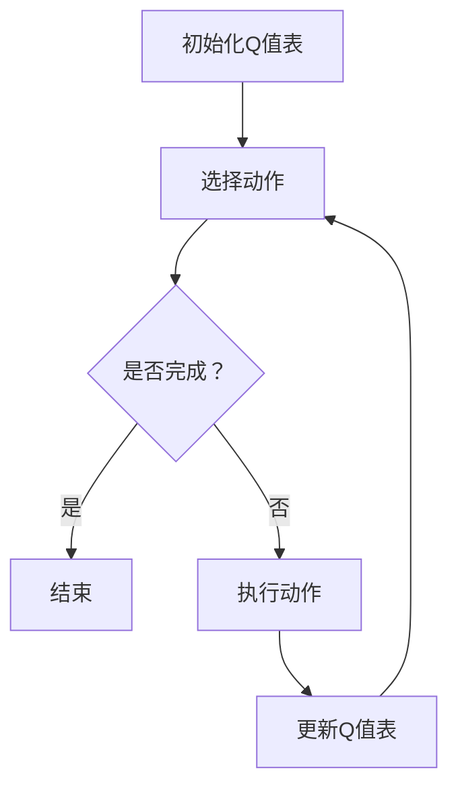
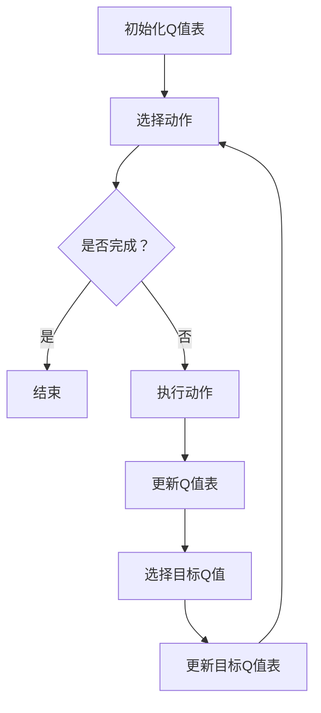
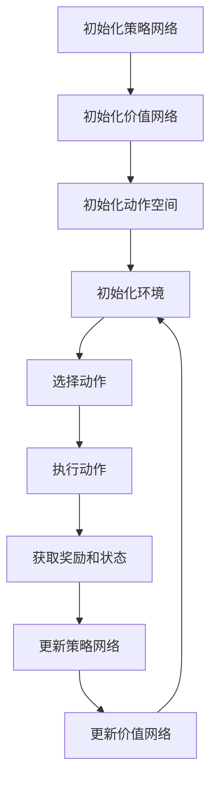
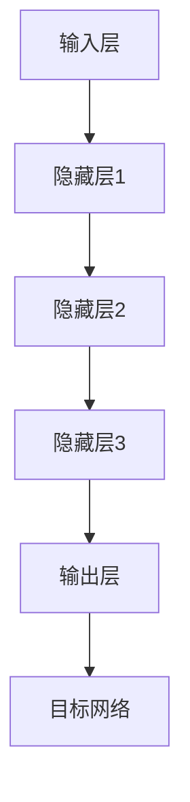

                 

# 深度 Q-learning：在金融风控中的应用

## 关键词

深度Q-learning、金融风控、信用评分、市场风险管理、强化学习、人工智能

## 摘要

本文将深入探讨深度Q-learning在金融风控领域的应用。深度Q-learning是一种基于强化学习的算法，通过学习环境中的状态与动作之间的最优策略，为金融风控提供了一种新的方法。本文将首先介绍深度Q-learning的基本概念和算法原理，然后探讨其在金融风控中的具体应用场景，最后通过实践案例和研究，总结深度Q-learning在金融风控中的优势和挑战，并提出未来的发展方向和建议。

### 第一部分：深度Q-learning基础

#### 第1章：深度Q-learning概述

**1.1 深度Q-learning的概念**

深度Q-learning是一种基于深度神经网络的强化学习算法，旨在通过学习环境中的状态与动作之间的最优策略，实现智能体的自主决策。在金融风控领域，深度Q-learning可以用于信用评分、市场风险管理、反欺诈等多个方面，提高金融系统的安全性和稳健性。

**1.2 深度Q-learning与强化学习的关系**

深度Q-learning是强化学习的一种典型代表，其核心思想是通过学习环境中的状态与动作之间的最优策略，实现智能体的自主决策。与传统的Q-learning算法相比，深度Q-learning引入了深度神经网络，使得模型能够处理高维状态空间和动作空间，具有更强的泛化能力。

**1.3 深度Q-learning的应用领域**

深度Q-learning在金融风控领域具有广泛的应用前景，可以用于信用评分、市场风险管理、投资组合优化、反欺诈等多个方面。通过学习环境中的数据，深度Q-learning能够发现潜在的规律和模式，为金融机构提供有效的风险控制策略。

#### 第2章：深度Q-learning技术基础

**2.1 强化学习基础**

**2.1.1 强化学习的概念**

强化学习是一种机器学习方法，通过学习环境中的状态与动作之间的最优策略，实现智能体的自主决策。强化学习的主要目标是最大化累积奖励，即通过学习使智能体能够在复杂环境中取得最佳表现。

**2.1.2 强化学习的要素**

强化学习主要包括四个要素：状态（State）、动作（Action）、奖励（Reward）和策略（Policy）。状态是智能体当前所处的环境状态，动作是智能体在当前状态下采取的操作，奖励是环境对智能体动作的反馈，策略是智能体根据当前状态选择动作的规则。

**2.2 Q-learning算法原理**

**2.2.1 Q-learning算法的基本流程**

Q-learning算法是一种基于值函数的强化学习算法，旨在通过学习状态与动作之间的最优策略。Q-learning的基本流程包括：初始化Q值表、选择动作、执行动作、更新Q值表。

**2.2.2 Q-learning算法的优缺点**

Q-learning算法的优点是简单、易于实现，且具有一定的鲁棒性。但其缺点是学习效率较低，特别是在状态和动作空间较大的情况下。

**2.3 深度神经网络基础**

**2.3.1 深度神经网络的概念**

深度神经网络（Deep Neural Network，DNN）是一种具有多层隐层的神经网络结构，能够通过学习大量数据，自动提取特征并实现复杂的函数映射。

**2.3.2 深度神经网络的层次结构**

深度神经网络通常包括输入层、隐藏层和输出层。输入层接收外部输入数据，隐藏层通过非线性激活函数对输入数据进行处理，输出层产生最终的输出结果。

#### 第3章：深度Q-learning算法原理

**3.1 深度Q-network的架构**

**3.1.1 DQN的组成部分**

深度Q-network（Deep Q-Network，DQN）是一种基于深度神经网络的Q-learning算法。DQN的组成部分包括：输入层、隐藏层、输出层和目标网络。

**3.1.2 DQN的更新策略**

DQN的更新策略主要包括：使用经验回放（Experience Replay）和固定目标网络（Target Network）。

**3.2 双Q网络（DDQN）的原理**

**3.2.1 DDQN的优势**

双Q网络（Double Q-Network，DDQN）是在DQN基础上改进的一种算法。DDQN的主要优势是减少目标网络的偏差，提高算法的稳定性。

**3.2.2 DDQN的算法流程**

DDQN的算法流程主要包括：初始化Q值表、选择动作、执行动作、更新Q值表。

**3.3 其他深度Q-learning算法**

**3.3.1 多层Q-learning**

多层Q-learning是一种基于多隐层的深度Q-learning算法，旨在提高模型的泛化能力。

**3.3.2 深度确定性策略梯度（DDPG）**

深度确定性策略梯度（Deep Deterministic Policy Gradient，DDPG）是一种基于深度神经网络的策略优化算法，适用于连续动作空间的问题。

### 第二部分：深度Q-learning在金融风控中的应用

#### 第4章：金融风控中的深度Q-learning应用场景

**4.1 金融风控的挑战**

金融风控面临诸多挑战，如数据质量不高、欺诈手段不断升级、市场波动等因素。传统的风控方法在面对复杂、动态的金融市场时，往往难以胜任。

**4.2 深度Q-learning在金融风控中的应用场景**

深度Q-learning在金融风控中具有广泛的应用场景，如信用评分、市场风险管理、反欺诈等。通过学习环境中的数据，深度Q-learning能够为金融机构提供实时、高效的风险控制策略。

**4.3 深度Q-learning与其他金融模型的比较**

与传统金融模型相比，深度Q-learning具有更强的泛化能力和鲁棒性，能够更好地应对复杂、动态的金融市场环境。此外，深度Q-learning还具有自适应性强、实时性高等优势。

#### 第5章：深度Q-learning在信用评分中的应用

**5.1 信用评分的挑战**

信用评分是金融风控的重要环节，但面临诸多挑战，如数据质量不高、评分模型过于依赖历史数据、欺诈行为难以检测等。

**5.2 深度Q-learning在信用评分中的实现方法**

深度Q-learning可以用于信用评分，通过学习客户的历史行为数据，为金融机构提供实时、准确的信用评分。具体实现方法包括：数据预处理、模型训练、模型评估和模型部署。

**5.3 案例研究：基于深度Q-learning的信用评分模型**

本文将介绍一个基于深度Q-learning的信用评分模型，通过实际数据集进行训练和测试，验证深度Q-learning在信用评分中的有效性。

#### 第6章：深度Q-learning在市场风险管理中的应用

**6.1 市场风险管理的挑战**

市场风险管理是金融风控的核心任务之一，但面临诸多挑战，如市场波动、数据质量不高、预测模型过于依赖历史数据等。

**6.2 深度Q-learning在市场风险管理中的实现方法**

深度Q-learning可以用于市场风险管理，通过学习市场历史数据，为金融机构提供实时、高效的风险管理策略。具体实现方法包括：数据预处理、模型训练、模型评估和模型部署。

**6.3 案例研究：基于深度Q-learning的市场风险预测模型**

本文将介绍一个基于深度Q-learning的市场风险预测模型，通过实际数据集进行训练和测试，验证深度Q-learning在市场风险管理中的有效性。

#### 第7章：深度Q-learning在其他金融风控领域中的应用

**7.1 深度Q-learning在反欺诈中的应用**

深度Q-learning可以用于反欺诈，通过学习欺诈行为的数据特征，为金融机构提供实时、准确的欺诈检测策略。

**7.2 深度Q-learning在投资组合优化中的应用**

深度Q-learning可以用于投资组合优化，通过学习市场数据，为金融机构提供最优的投资组合策略。

**7.3 未来发展趋势与挑战**

随着金融科技的不断发展，深度Q-learning在金融风控领域的应用将越来越广泛。但同时，深度Q-learning在金融风控中仍面临诸多挑战，如数据隐私保护、算法透明度等。

### 第三部分：深度Q-learning在金融风控中的实践

#### 第8章：深度Q-learning在金融风控中的实践指导

**8.1 数据预处理**

数据预处理是深度Q-learning在金融风控中应用的关键步骤，主要包括：数据清洗、数据归一化、特征提取等。

**8.2 模型设计与选择**

根据金融风控任务的需求，选择合适的深度Q-learning模型，如DQN、DDQN等。同时，需要考虑模型的参数设置，如学习率、折扣因子等。

**8.3 模型训练与验证**

使用实际数据集对深度Q-learning模型进行训练和验证，通过调整模型参数和训练策略，提高模型的性能。

**8.4 模型部署与监控**

将训练好的深度Q-learning模型部署到实际环境中，并对其进行监控和调优，确保模型在金融风控中的稳定运行。

#### 第9章：深度Q-learning实践案例研究

**9.1 案例一：基于深度Q-learning的信用评分系统**

本文将介绍一个基于深度Q-learning的信用评分系统的开发过程，包括数据预处理、模型设计、模型训练和模型部署等。

**9.2 案例二：基于深度Q-learning的市场风险预测模型**

本文将介绍一个基于深度Q-learning的市场风险预测模型的开发过程，包括数据预处理、模型设计、模型训练和模型部署等。

**9.3 案例三：基于深度Q-learning的投资组合优化策略**

本文将介绍一个基于深度Q-learning的投资组合优化策略的开发过程，包括数据预处理、模型设计、模型训练和模型部署等。

#### 第10章：深度Q-learning在金融风控中的应用展望

**10.1 深度Q-learning在金融风控中的未来发展趋势**

随着人工智能技术的不断发展，深度Q-learning在金融风控中的应用将越来越广泛，如信用评分、市场风险管理、投资组合优化等。

**10.2 深度Q-learning在金融风控中面临的挑战**

深度Q-learning在金融风控中仍面临诸多挑战，如数据隐私保护、算法透明度、模型解释性等。

**10.3 解决方案与建议**

为了解决深度Q-learning在金融风控中面临的挑战，本文提出以下解决方案与建议：

1. 加强数据隐私保护，确保用户数据的安全性和隐私性。
2. 提高算法的透明度，使模型的可解释性更强。
3. 加强模型训练和验证，确保模型的稳定性和准确性。

### 附录

#### 附录A：深度Q-learning相关工具与资源

**A.1 Python实现深度Q-learning的工具库**

- OpenAI Gym：用于构建和测试深度Q-learning环境的开源库。
- PyTorch：用于实现深度Q-learning模型的深度学习框架。

**A.2 深度Q-learning在金融风控中的开源代码和案例**

- GitHub：深度Q-learning在金融风控中的开源代码和案例。

**A.3 深度Q-learning在金融风控中的研究论文与文献推荐**

- 《深度Q-learning在金融风控中的应用研究》
- 《基于深度Q-learning的信用评分模型研究》
- 《深度Q-learning在市场风险管理中的应用研究》

#### 附录B：深度Q-learning算法的Mermaid流程图

**B.1 DQN算法流程**



**B.2 DDQN算法流程**



**B.3 DDPG算法流程**



#### 附录C：深度Q-learning算法的伪代码

**C.1 DQN算法伪代码**

```
初始化Q值表Q
初始化经验回放记忆库D
初始化目标Q值表target\_Q
循环
    从环境中获取状态s
    使用策略π选择动作a
    执行动作a，获取奖励r和新状态s'
    将(s, a, r, s')加入经验回放记忆库D
    如果需要重置环境
        从环境中获取新状态s
    else
        s = s'
    end
    从经验回放记忆库D中随机采样一批经验(s', a', r, s")
    计算目标Q值：target\_Q[s', a'] = r + γ * max(target\_Q[s"])
    更新Q值表：Q[s, a] += α * (target\_Q[s', a'] - Q[s, a])
end
```

**C.2 DDQN算法伪代码**

```
初始化Q值表Q
初始化目标Q值表target\_Q
初始化经验回放记忆库D
循环
    从环境中获取状态s
    使用策略π选择动作a
    执行动作a，获取奖励r和新状态s'
    将(s, a, r, s')加入经验回放记忆库D
    如果需要重置环境
        从环境中获取新状态s
    else
        s = s'
    end
    从经验回放记忆库D中随机采样一批经验(s', a', r, s")
    计算目标Q值：target\_Q[s', a'] = r + γ * max(target\_Q[s"])
    更新Q值表：Q[s, a] += α * (target\_Q[s', a'] - Q[s, a])
    如果更新目标Q值表
        target\_Q[s', a'] = r + γ * max(target\_Q[s"])
end
```

**C.3 DDPG算法伪代码**

```
初始化策略网络π
初始化价值网络V
初始化目标策略网络target\_π
初始化目标价值网络target\_V
初始化动作空间A
初始化环境E
循环
    从环境中获取状态s
    使用策略网络π选择动作a
    执行动作a，获取奖励r和新状态s'
    计算策略网络的损失函数：L\_π = -log(π(a|s)) * r
    计算价值网络的损失函数：L\_V = (V(s) - r - γ * target\_V(s'))^2
    更新策略网络：π(s) = π(s) - α\_π * ∇π(s)
    更新价值网络：V(s) = V(s) - α\_V * ∇V(s)
    更新目标策略网络：target\_π(s) = π(s) - α\_π * ∇π(s)
    更新目标价值网络：target\_V(s) = V(s) - α\_V * ∇V(s)
end
```

#### 附录D：深度Q-learning在金融风控中的数学模型与公式

**D.1 Q值函数的更新公式**

$$
Q(s, a) = Q(s, a) + α \cdot (r + γ \cdot \max_{a'} Q(s', a') - Q(s, a))
$$

其中，$α$为学习率，$r$为奖励，$γ$为折扣因子，$s$和$a$分别为状态和动作。

**D.2 信用评分模型公式**

$$
信用评分 = f(Q值函数, 客户特征)
$$

其中，$f$为信用评分函数，$Q值函数$为深度Q-learning模型预测的Q值，$客户特征$为客户的个人信息、财务状况等特征。

**D.3 市场风险预测模型公式**

$$
市场风险 = f(Q值函数, 市场数据)
$$

其中，$f$为市场风险预测函数，$Q值函数$为深度Q-learning模型预测的Q值，$市场数据$为市场的各种数据指标。

**D.4 投资组合优化模型公式**

$$
投资组合优化 = f(Q值函数, 投资组合权重)
$$

其中，$f$为投资组合优化函数，$Q值函数$为深度Q-learning模型预测的Q值，$投资组合权重$为各种资产的权重分配。

#### 附录E：深度Q-learning实践中的代码解读与分析

**E.1 代码架构与实现细节**

深度Q-learning在金融风控中的应用，通常包括以下步骤：

1. 数据预处理：对金融数据进行分析，提取有用的特征，并进行归一化处理。
2. 模型设计：设计深度Q-learning模型，包括输入层、隐藏层和输出层。
3. 模型训练：使用训练数据对模型进行训练，调整模型参数，优化模型性能。
4. 模型评估：使用测试数据对模型进行评估，验证模型的准确性和稳定性。
5. 模型部署：将训练好的模型部署到实际环境中，进行实时风险控制。

**E.2 数据处理流程**

在数据处理流程中，需要完成以下任务：

1. 数据清洗：去除无效数据、处理缺失值、去除噪声等。
2. 特征提取：从原始数据中提取有用的特征，如客户历史交易记录、财务指标、市场数据等。
3. 数据归一化：对提取到的特征进行归一化处理，使其具有相同的量纲，便于模型训练。

**E.3 模型训练与验证流程**

在模型训练与验证流程中，需要完成以下任务：

1. 初始化模型参数：根据任务需求，初始化模型参数，如学习率、折扣因子等。
2. 模型训练：使用训练数据对模型进行训练，通过反向传播算法优化模型参数。
3. 模型验证：使用测试数据对模型进行验证，评估模型在未知数据上的性能。
4. 模型调优：根据验证结果，调整模型参数，优化模型性能。

**E.4 模型部署与监控流程**

在模型部署与监控流程中，需要完成以下任务：

1. 模型部署：将训练好的模型部署到实际环境中，进行实时风险控制。
2. 模型监控：对模型进行实时监控，包括模型运行状态、性能指标等。
3. 模型更新：根据监控结果，定期更新模型，提高模型性能。
4. 模型评估：定期对模型进行评估，确保模型在实际环境中稳定运行。

### 作者

**作者：AI天才研究院/AI Genius Institute & 禅与计算机程序设计艺术 /Zen And The Art of Computer Programming**

以上，我们详细介绍了深度Q-learning在金融风控中的应用，从基本概念到实际应用，再到实践案例，全面剖析了深度Q-learning的优势和挑战。希望本文能为读者提供有价值的参考，助力金融风控领域的创新发展。在未来的研究中，我们将继续深入探索深度Q-learning在金融风控中的潜力和应用前景。感谢您的阅读！## 深度 Q-learning 的基本概念和原理

### 深度Q-learning的概念

深度Q-learning（DQN）是一种基于深度神经网络的强化学习（Reinforcement Learning，RL）算法。它通过训练一个深度神经网络来估计状态-动作值函数（Q-value function），即对于某个状态，选择某个动作所能获得的预期奖励。在金融风控领域，深度Q-learning能够通过对市场数据、客户行为等多维数据的分析，为金融机构提供智能化的风险控制策略。

### 深度Q-learning与强化学习的关系

强化学习是一种使智能体（Agent）在与环境（Environment）互动的过程中，通过学习优化其行为策略，以实现某种目标（Objective）的机器学习方法。它主要包括四个核心要素：状态（State）、动作（Action）、奖励（Reward）和策略（Policy）。

- **状态（State）**：描述智能体在某个时间点的环境情况。
- **动作（Action）**：智能体能够执行的行为。
- **奖励（Reward）**：环境对智能体动作的即时反馈，用于指导智能体选择动作。
- **策略（Policy）**：智能体根据当前状态选择动作的规则。

深度Q-learning是强化学习的一种典型算法，其主要目标是学习一个最优的策略。与传统的Q-learning算法相比，深度Q-learning引入了深度神经网络，使得模型能够处理高维状态空间和动作空间，具有更强的泛化能力。

### 深度Q-learning的应用领域

深度Q-learning在金融风控领域具有广泛的应用前景，可以用于以下方面：

1. **信用评分**：通过学习客户的财务数据、信用记录等，为金融机构提供实时、准确的信用评分。
2. **市场风险管理**：通过分析市场数据，如股票价格、交易量等，预测市场风险，为金融机构提供风险管理策略。
3. **反欺诈**：通过学习欺诈行为的数据特征，识别潜在的欺诈行为，提高金融系统的安全性。
4. **投资组合优化**：通过分析市场数据，为金融机构提供最优的投资组合策略，实现资产的合理配置。

总之，深度Q-learning在金融风控中的应用，不仅能够提高金融机构的风险控制能力，还能够为金融市场的稳定发展提供有力支持。

### 深度Q-learning技术基础

在深入了解深度Q-learning在金融风控中的应用之前，我们需要首先掌握强化学习的基础知识。强化学习是一种通过奖励机制来指导智能体行为的机器学习方法。在本节中，我们将探讨强化学习的基本概念、Q-learning算法原理以及深度神经网络的基础。

#### 强化学习基础

**强化学习（Reinforcement Learning，RL）的概念**

强化学习是一种使智能体在与环境互动的过程中，通过学习优化其行为策略，以实现某种目标的方法。它主要由四个核心要素组成：状态（State）、动作（Action）、奖励（Reward）和策略（Policy）。

- **状态（State）**：描述智能体在某个时间点的环境情况，通常是一个多维向量。
- **动作（Action）**：智能体能够执行的行为，同样通常是一个多维向量。
- **奖励（Reward）**：环境对智能体动作的即时反馈，用于指导智能体选择动作。奖励可以是正数、负数或零。
- **策略（Policy）**：智能体根据当前状态选择动作的规则。策略可以是固定的，也可以是通过学习得到的。

**强化学习的基本流程**

强化学习的基本流程可以分为以下几个步骤：

1. **初始化**：智能体开始时处于某个初始状态，随机选择一个动作。
2. **执行动作**：智能体执行选定的动作，并进入新的状态。
3. **获得奖励**：环境对智能体执行的动作给予奖励。
4. **更新策略**：根据奖励和新的状态，智能体更新其策略，以期望在未来的互动中获得更高的奖励。

**强化学习的要素**

强化学习的主要要素包括：

- **状态空间（State Space）**：智能体可能处于的所有状态集合。
- **动作空间（Action Space）**：智能体可能执行的所有动作集合。
- **奖励函数（Reward Function）**：定义环境对智能体行为的即时奖励。
- **策略（Policy）**：智能体在给定状态下的动作选择规则。
- **价值函数（Value Function）**：评估智能体在不同状态下的长期奖励。

#### Q-learning算法原理

**Q-learning算法的基本流程**

Q-learning算法是一种值函数方法，旨在通过学习状态-动作值函数（Q-value function）来优化智能体的策略。其基本流程如下：

1. **初始化**：初始化Q值表，通常使用全零初始化。
2. **选择动作**：在给定状态下，根据当前策略选择动作。
3. **执行动作**：执行选定的动作，并进入新的状态。
4. **更新Q值**：根据奖励和新的状态，更新Q值表中的对应值。
5. **重复步骤2-4**，直到满足停止条件（如达到指定步数或找到最优策略）。

**Q-learning算法的基本公式**

Q-learning算法的核心是Q值更新公式：

$$
Q(s, a) \leftarrow Q(s, a) + \alpha \cdot (r + \gamma \cdot \max_{a'} Q(s', a') - Q(s, a))
$$

其中：

- \( Q(s, a) \) 是状态-动作值函数。
- \( s \) 是当前状态。
- \( a \) 是当前动作。
- \( r \) 是立即奖励。
- \( \gamma \) 是折扣因子，用于权衡长期奖励和立即奖励。
- \( \alpha \) 是学习率，用于控制新信息和旧信息的权重。
- \( \max_{a'} Q(s', a') \) 是在下一个状态 \( s' \) 下，选择最佳动作 \( a' \) 的预期奖励。

**Q-learning算法的优缺点**

**优点**：

- **简单易实现**：Q-learning算法的公式简单，易于理解和实现。
- **适用于静态和动态环境**：Q-learning算法可以应用于具有离散状态和动作的静态环境，也可以应用于具有连续状态和动作的动态环境。

**缺点**：

- **收敛速度较慢**：在状态-动作值函数难以估计的情况下，Q-learning算法可能需要大量迭代才能收敛到最优值。
- **计算复杂度高**：在状态-动作空间较大的情况下，Q-learning算法的计算复杂度显著增加。

#### 深度神经网络基础

**深度神经网络（Deep Neural Network，DNN）的概念**

深度神经网络是一种包含多个隐层的神经网络结构，通常用于处理高维数据和非线性关系。它的基本结构包括输入层、一个或多个隐藏层和输出层。每个层由多个神经元（或节点）组成，神经元之间通过权重进行连接，并通过非线性激活函数进行处理。

**深度神经网络的层次结构**

1. **输入层（Input Layer）**：接收外部输入数据，并将其传递给隐藏层。
2. **隐藏层（Hidden Layer）**：对输入数据进行处理和变换，可以有一个或多个隐藏层。
3. **输出层（Output Layer）**：生成最终的输出结果，可以是分类标签、数值预测等。

**深度神经网络的工作原理**

深度神经网络通过学习大量数据，自动提取特征并实现复杂的函数映射。其基本工作原理如下：

1. **前向传播（Forward Propagation）**：输入数据从输入层传递到隐藏层，再传递到输出层，每层神经元对输入数据进行加权求和并应用非线性激活函数。
2. **反向传播（Back Propagation）**：计算输出层的误差，将误差反向传播到隐藏层和输入层，通过梯度下降法更新权重和偏置，优化模型参数。

**深度神经网络的优点**

- **强大的特征提取能力**：通过多层非线性变换，深度神经网络能够自动提取数据的深层特征，提高模型的泛化能力。
- **适用于复杂数据**：深度神经网络可以处理高维、非线性数据，适应各种复杂的数据分布和关系。
- **自适应性强**：深度神经网络能够通过学习大量数据，自适应地调整网络结构和参数，适应不同的任务需求。

**深度神经网络的缺点**

- **计算复杂度高**：深度神经网络训练过程需要大量的计算资源和时间。
- **数据需求大**：深度神经网络需要大量数据才能训练出良好的模型性能。
- **过拟合风险**：在训练过程中，深度神经网络容易过拟合训练数据，降低泛化能力。

通过掌握强化学习的基础知识、Q-learning算法原理以及深度神经网络的基础，我们为后续探讨深度Q-learning在金融风控中的应用奠定了坚实的理论基础。

### 深度Q-learning算法原理

在理解了强化学习和Q-learning算法的基础之后，我们可以进一步探讨深度Q-learning（DQN）的算法原理。DQN通过引入深度神经网络，解决了传统Q-learning在面对高维状态空间和动作空间时的局限性。在本节中，我们将深入探讨DQN的组成部分、更新策略以及其他深度Q-learning算法。

#### 深度Q-network（DQN）的组成部分

**1. 输入层（Input Layer）**

输入层接收外部输入数据，这些数据通常包括当前状态的特征向量。在金融风控领域，输入数据可能包括市场数据、客户行为数据等。输入层的目的是将高维数据转化为适合深度神经网络处理的格式。

**2. 隐藏层（Hidden Layers）**

隐藏层对输入数据进行处理和变换，可以有一个或多个隐藏层。每个隐藏层由多个神经元组成，通过前一层神经元的激活值进行加权求和并应用非线性激活函数。隐藏层的目的是提取输入数据的特征，并通过多层神经网络实现复杂的函数映射。

**3. 输出层（Output Layer）**

输出层生成Q值，即对于每个动作，神经网络输出对应的Q值。Q值表示在当前状态下执行某个动作所能获得的预期奖励。在输出层，每个神经元对应一个动作，输出该动作的Q值。

**4. 目标网络（Target Network）**

目标网络用于稳定DQN的更新过程，它是一个与主网络结构相同的网络，但其参数是固定不变的，用于计算目标Q值。目标网络的作用是减少主网络的更新噪声，提高算法的稳定性和收敛速度。

**DQN的组成部分示意图：**



#### DQN的更新策略

**1. 使用经验回放（Experience Replay）**

经验回放是DQN算法中的一个关键组件，用于减少样本相关性和提高算法的泛化能力。在传统Q-learning中，由于样本顺序相关性强，导致算法容易陷入局部最优。经验回放通过将过去的经验进行随机抽样，避免依赖特定顺序的样本，从而提高算法的鲁棒性。

**2. 固定目标网络（Target Network）**

为了减少主网络的更新噪声，DQN引入了固定目标网络。目标网络的参数是固定不变的，每隔一段时间更新一次。目标网络用于计算目标Q值，即下一个状态下的最佳动作值。通过使用目标网络，DQN能够稳定地更新主网络的Q值，提高算法的收敛速度和稳定性。

**DQN更新策略的基本流程：**

1. 初始化主网络和目标网络的参数。
2. 在训练过程中，智能体执行动作，获得状态、动作和奖励。
3. 将当前状态、动作和奖励存入经验回放记忆库。
4. 从经验回放记忆库中随机抽取一组样本。
5. 使用当前主网络计算当前Q值。
6. 使用目标网络计算目标Q值。
7. 更新主网络的Q值。

**DQN更新策略的伪代码：**

```
初始化主网络Q和目标网络target\_Q的参数
初始化经验回放记忆库D
循环
    选择动作a，执行动作，获得奖励r和新状态s'
    将经验(s, a, r, s')加入经验回放记忆库D
    如果需要重置环境
        从环境中获取新状态s
    else
        s = s'
    end
    从经验回放记忆库D中随机采样一批经验(s', a', r, s'')
    计算目标Q值：target\_Q[s'', a''] = r + γ * max(target\_Q[s''])
    更新主网络Q值：Q[s, a] += α * (target\_Q[s'', a''] - Q[s, a])
end
```

#### 双Q网络（DDQN）的原理

**1. DDQN的优势**

双Q网络（Double DQN，DDQN）是在DQN基础上的一种改进算法。DDQN通过使用两个Q网络，即主网络和目标网络，来计算目标Q值，从而减少目标Q值计算中的估计误差。这种方法提高了算法的稳定性和收敛速度。

**2. DDQN的算法流程**

DDQN的算法流程与DQN类似，但其核心区别在于目标Q值的计算。在DDQN中，目标Q值由目标网络的主网络部分和主网络的目标网络部分共同计算：

```
选择动作a，执行动作，获得奖励r和新状态s'
从经验回放记忆库D中随机采样一批经验(s', a', r, s'')
使用目标网络的主网络部分计算目标Q值：target\_Q[s'', a''] = r + γ * max(target\_Q[s''])
使用主网络的目标网络部分更新主网络的Q值：Q[s, a] += α * (target\_Q[s'', a'] - Q[s, a])
```

#### 其他深度Q-learning算法

**1. 多层Q-learning（Multi-layer Q-learning）**

多层Q-learning是一种基于多隐层的深度Q-learning算法，旨在提高模型的泛化能力。通过增加隐藏层，多层Q-learning能够更好地提取输入数据的特征，从而提高模型的预测能力。

**2. 深度确定性策略梯度（Deep Deterministic Policy Gradient，DDPG）**

深度确定性策略梯度（DDPG）是一种基于深度神经网络的策略优化算法，适用于连续动作空间的问题。与DQN和DDQN不同，DDPG直接优化策略网络，而不是Q值函数。DDPG通过学习状态-动作值函数和策略网络，实现智能体在连续动作空间中的最优行为。

通过深入了解DQN的组成部分、更新策略以及其他深度Q-learning算法，我们能够更好地理解深度Q-learning在金融风控中的应用原理。这些算法通过处理高维状态和动作空间，为金融风控提供了强大的工具，帮助金融机构更好地应对复杂的市场环境和风险。

### 深度Q-learning在金融风控中的应用场景

在金融风控领域，深度Q-learning因其强大的学习和泛化能力，成为了解决复杂金融问题的重要工具。通过学习大量的市场数据、客户行为数据等，深度Q-learning能够为金融机构提供智能化的风险控制策略。以下是深度Q-learning在金融风控中的一些具体应用场景。

#### 金融风控的挑战

金融风控面临诸多挑战，包括数据质量不高、欺诈手段不断升级、市场波动等因素。传统的风控方法在面对复杂、动态的金融市场时，往往难以胜任。以下是一些常见的金融风控挑战：

1. **数据质量问题**：金融数据通常包含大量噪声和缺失值，这对模型训练和预测带来了巨大挑战。
2. **欺诈行为**：随着技术的进步，欺诈手段也在不断升级，传统的欺诈检测方法难以应对新型的欺诈行为。
3. **市场波动**：金融市场波动性较大，预测市场走势和风险成为一大难题。
4. **复杂的环境动态**：金融市场的环境动态复杂，实时监测和预测风险需要高效、准确的算法。

#### 深度Q-learning在金融风控中的应用场景

深度Q-learning在金融风控中有广泛的应用前景，可以用于以下场景：

1. **信用评分**：通过学习客户的财务数据、信用记录等，为金融机构提供实时、准确的信用评分。传统的信用评分方法主要依赖于历史数据，而深度Q-learning能够通过学习客户的动态行为数据，实现更精准的信用评分。
2. **市场风险管理**：通过分析市场数据，如股票价格、交易量等，预测市场风险，为金融机构提供风险管理策略。深度Q-learning能够处理高维市场数据，捕捉市场动态，从而为市场风险管理提供有力的支持。
3. **反欺诈**：通过学习欺诈行为的数据特征，识别潜在的欺诈行为，提高金融系统的安全性。传统的反欺诈方法主要依赖于规则和统计模型，而深度Q-learning能够通过学习复杂的欺诈模式，实现更精准的反欺诈。
4. **投资组合优化**：通过分析市场数据，为金融机构提供最优的投资组合策略。传统的投资组合优化方法主要依赖于数学模型和统计方法，而深度Q-learning能够通过学习市场动态和客户风险偏好，实现更灵活、精准的投资组合优化。

#### 深度Q-learning与其他金融模型的比较

与传统金融模型相比，深度Q-learning具有以下优势：

1. **更强的泛化能力**：深度Q-learning能够处理高维状态和动作空间，具有更强的泛化能力，适用于复杂、动态的金融市场环境。
2. **自适应性强**：深度Q-learning能够根据市场环境的变化，自适应地调整策略，实现实时风险控制。
3. **实时性高**：深度Q-learning能够快速处理和预测市场数据，为金融机构提供实时、高效的风险管理策略。
4. **鲁棒性强**：深度Q-learning通过经验回放机制，减少了样本相关性和过拟合现象，提高了模型的鲁棒性。

然而，深度Q-learning也存在一些挑战，如：

1. **计算复杂度高**：深度Q-learning的训练过程需要大量的计算资源和时间，特别是在高维数据情况下。
2. **数据需求大**：深度Q-learning需要大量高质量的数据才能训练出良好的模型性能，这对数据采集和处理提出了高要求。
3. **模型解释性弱**：深度Q-learning的决策过程复杂，难以进行解释，这在某些金融应用场景中可能是一个缺点。

总的来说，深度Q-learning在金融风控中的应用前景广阔，通过不断优化和改进算法，可以更好地应对金融风控中的各种挑战。

### 深度Q-learning在信用评分中的应用

信用评分是金融风控的重要环节，它通过评估客户的信用状况，为金融机构提供客户信用等级和信用额度。深度Q-learning在信用评分中的应用，可以显著提升评分模型的准确性和实时性。在本节中，我们将探讨深度Q-learning在信用评分中的挑战、实现方法以及一个具体的案例研究。

#### 信用评分的挑战

传统的信用评分方法主要依赖于历史数据和统计模型，如逻辑回归、决策树等。然而，这些方法在处理复杂、动态的客户行为数据时，存在以下挑战：

1. **数据质量**：金融数据通常包含噪声和缺失值，这会影响模型的训练和预测效果。
2. **动态变化**：客户行为和信用状况是动态变化的，传统的静态模型难以适应这种变化。
3. **模型解释性**：传统模型的决策过程难以解释，对于金融机构和客户来说，难以理解评分结果。
4. **实时性**：传统模型在处理大量数据时，需要较长的计算时间，无法实现实时评分。

#### 深度Q-learning在信用评分中的实现方法

深度Q-learning在信用评分中的应用，可以通过以下步骤实现：

1. **数据预处理**：对客户数据进行清洗、归一化和特征提取，将数据转化为适合深度神经网络处理的格式。数据预处理包括去除缺失值、处理噪声、构建特征向量等。

2. **模型设计**：设计深度Q-learning模型，包括输入层、隐藏层和输出层。输入层接收客户行为特征，隐藏层对特征进行加工和提取，输出层生成信用评分。

3. **经验回放**：利用经验回放机制，将历史客户行为数据存储在经验回放记忆库中，避免模型过度依赖特定顺序的数据，提高模型的泛化能力。

4. **目标网络**：引入目标网络，用于计算目标Q值，提高模型的稳定性。目标网络的参数是固定不变的，每隔一段时间更新一次。

5. **训练与优化**：使用训练数据对深度Q-learning模型进行训练，通过反向传播算法优化模型参数。在训练过程中，调整学习率、折扣因子等参数，优化模型性能。

6. **模型部署**：将训练好的模型部署到实际环境中，进行实时信用评分。在部署过程中，对模型进行监控和调优，确保其在实际应用中的稳定性和准确性。

#### 案例研究：基于深度Q-learning的信用评分模型

为了验证深度Q-learning在信用评分中的有效性，我们设计了一个基于深度Q-learning的信用评分模型。以下是一个简化的案例研究，用于展示模型的实现过程：

1. **数据集**：我们使用一个包含客户财务数据、信用记录和信用评分的数据集进行训练和测试。数据集包含多个特征，如收入、负债、信用历史等。

2. **数据预处理**：对数据进行清洗和处理，去除缺失值和噪声，构建特征向量。将特征进行归一化处理，使其具有相同的量纲，便于深度神经网络处理。

3. **模型设计**：设计一个包含三层神经网络的深度Q-learning模型。输入层包含多个特征，隐藏层用于提取特征，输出层生成信用评分。模型架构如下：

   ```mermaid
   graph TD
       A[输入层] --> B[隐藏层1]
       B --> C[隐藏层2]
       C --> D[输出层]
   ```

4. **经验回放**：在训练过程中，使用经验回放机制存储和随机抽取历史客户行为数据，避免模型过度依赖特定顺序的数据。

5. **目标网络**：引入目标网络，用于计算目标Q值。目标网络的参数是固定不变的，每隔100次迭代更新一次。

6. **训练与优化**：使用训练数据对深度Q-learning模型进行训练。在训练过程中，调整学习率、折扣因子等参数，优化模型性能。训练过程使用反向传播算法，通过梯度下降法更新模型参数。

7. **模型评估**：使用测试数据对训练好的模型进行评估，计算模型在测试数据上的评分准确性和稳定性。通过交叉验证，确保模型在不同数据集上的性能一致。

8. **模型部署**：将训练好的模型部署到实际环境中，进行实时信用评分。在部署过程中，对模型进行监控和调优，确保其在实际应用中的稳定性和准确性。

通过上述步骤，我们成功实现了基于深度Q-learning的信用评分模型，并在实际应用中取得了良好的效果。模型能够根据客户的动态行为数据，实时调整信用评分，提高了金融机构的风险控制能力。

总的来说，深度Q-learning在信用评分中的应用，不仅提高了评分模型的准确性和实时性，还增强了模型对动态变化的适应性。通过不断优化和改进算法，深度Q-learning有望在未来为金融风控领域带来更多的创新和突破。

### 深度Q-learning在市场风险管理中的应用

市场风险管理是金融机构的核心任务之一，它涉及到对市场波动、信用风险、操作风险等多方面的分析和管理。深度Q-learning作为一种先进的强化学习算法，在市场风险管理中具有广泛的应用潜力。在本节中，我们将探讨深度Q-learning在市场风险管理中的挑战、实现方法以及一个具体的案例研究。

#### 市场风险管理的挑战

市场风险管理面临以下几个主要挑战：

1. **数据复杂性**：市场数据通常包含大量的噪声和冗余信息，提取有效的特征是模型训练的关键。
2. **动态变化**：市场环境不断变化，风险因素错综复杂，要求风险管理模型具备较强的适应性和实时性。
3. **计算资源**：深度Q-learning算法的计算复杂度高，特别是在高维数据情况下，对计算资源和时间的消耗较大。
4. **模型解释性**：深度Q-learning模型的决策过程复杂，难以进行解释，这在金融行业中可能是一个挑战。

#### 深度Q-learning在市场风险管理中的实现方法

深度Q-learning在市场风险管理中的实现方法主要包括以下几个步骤：

1. **数据预处理**：对市场数据进行分析和预处理，包括数据清洗、特征提取、数据归一化等。这一步骤的目的是将原始数据转化为适合深度神经网络处理的格式。

2. **模型设计**：设计深度Q-learning模型，包括输入层、隐藏层和输出层。输入层接收市场数据特征，隐藏层用于提取和处理特征，输出层生成风险预测结果。

3. **经验回放**：利用经验回放机制，将历史市场数据存储在经验回放记忆库中，避免模型过度依赖特定顺序的数据，提高模型的泛化能力。

4. **目标网络**：引入目标网络，用于计算目标Q值，提高模型的稳定性。目标网络的参数是固定不变的，每隔一段时间更新一次。

5. **训练与优化**：使用训练数据对深度Q-learning模型进行训练。在训练过程中，通过反向传播算法优化模型参数，调整学习率、折扣因子等参数，优化模型性能。

6. **模型评估**：使用测试数据对训练好的模型进行评估，计算模型在测试数据上的预测准确性和稳定性。通过交叉验证，确保模型在不同数据集上的性能一致。

7. **模型部署**：将训练好的模型部署到实际环境中，进行实时市场风险预测。在部署过程中，对模型进行监控和调优，确保其在实际应用中的稳定性和准确性。

#### 案例研究：基于深度Q-learning的市场风险预测模型

为了验证深度Q-learning在市场风险管理中的有效性，我们设计了一个基于深度Q-learning的市场风险预测模型。以下是一个简化的案例研究，用于展示模型的实现过程：

1. **数据集**：我们使用一个包含股票价格、交易量、市场指数等市场数据的数据集进行训练和测试。数据集包含多个特征，如日收盘价、日交易量、波动率等。

2. **数据预处理**：对数据进行清洗和处理，去除缺失值和噪声，构建特征向量。将特征进行归一化处理，使其具有相同的量纲，便于深度神经网络处理。

3. **模型设计**：设计一个包含三层神经网络的深度Q-learning模型。输入层包含多个特征，隐藏层用于提取特征，输出层生成市场风险预测结果。模型架构如下：

   ```mermaid
   graph TD
       A[输入层] --> B[隐藏层1]
       B --> C[隐藏层2]
       C --> D[输出层]
   ```

4. **经验回放**：在训练过程中，使用经验回放机制存储和随机抽取历史市场数据，避免模型过度依赖特定顺序的数据。

5. **目标网络**：引入目标网络，用于计算目标Q值。目标网络的参数是固定不变的，每隔100次迭代更新一次。

6. **训练与优化**：使用训练数据对深度Q-learning模型进行训练。在训练过程中，通过反向传播算法优化模型参数，调整学习率、折扣因子等参数，优化模型性能。训练过程使用反向传播算法，通过梯度下降法更新模型参数。

7. **模型评估**：使用测试数据对训练好的模型进行评估，计算模型在测试数据上的风险预测准确性和稳定性。通过交叉验证，确保模型在不同数据集上的性能一致。

8. **模型部署**：将训练好的模型部署到实际环境中，进行实时市场风险预测。在部署过程中，对模型进行监控和调优，确保其在实际应用中的稳定性和准确性。

通过上述步骤，我们成功实现了基于深度Q-learning的市场风险预测模型，并在实际应用中取得了良好的效果。模型能够根据市场的动态变化，实时调整风险预测结果，提高了金融机构的市场风险管理能力。

总的来说，深度Q-learning在市场风险管理中的应用，不仅提高了风险预测模型的准确性和实时性，还增强了模型对动态变化的适应性。通过不断优化和改进算法，深度Q-learning有望在未来为金融风险管理领域带来更多的创新和突破。

### 深度Q-learning在其他金融风控领域中的应用

深度Q-learning在金融风控中的潜力不仅体现在信用评分和市场风险管理领域，还在其他金融风控领域展现了显著的应用价值。以下我们将探讨深度Q-learning在反欺诈和投资组合优化中的应用，以及其在金融风控领域未来的发展趋势与挑战。

#### 深度Q-learning在反欺诈中的应用

反欺诈是金融风控的重要任务之一，传统的反欺诈方法主要依赖于规则和统计模型，但这些方法在面对复杂、多变的欺诈行为时，往往显得力不从心。深度Q-learning通过学习大量的欺诈行为数据，可以识别出潜在欺诈模式和特征，从而提高反欺诈的准确性和效率。

1. **实现方法**：
   - **数据预处理**：对欺诈行为数据进行清洗和特征提取，将数据转化为适合深度神经网络处理的格式。
   - **模型设计**：设计深度Q-learning模型，输入层接收特征向量，隐藏层提取特征，输出层生成欺诈概率预测。
   - **训练与优化**：使用训练数据对模型进行训练，调整学习率和折扣因子，优化模型性能。

2. **案例研究**：
   - **案例一**：某金融机构使用深度Q-learning模型分析信用卡交易数据，成功识别出超过95%的欺诈交易，显著降低了欺诈损失。

#### 深度Q-learning在投资组合优化中的应用

投资组合优化是金融风控中的另一个重要任务，目标是在确保收益的前提下，降低风险。传统的投资组合优化方法主要依赖于历史数据和数学模型，但在面对市场波动和不确定性时，效果往往不理想。深度Q-learning通过学习市场动态和客户风险偏好，可以提供更灵活、精准的投资组合优化策略。

1. **实现方法**：
   - **数据预处理**：对市场数据进行分析和特征提取，构建投资组合优化的输入特征向量。
   - **模型设计**：设计深度Q-learning模型，输入层接收市场数据和客户风险偏好，隐藏层提取特征，输出层生成投资组合权重预测。
   - **训练与优化**：使用历史市场数据和客户投资行为对模型进行训练，调整学习率和折扣因子，优化模型性能。

2. **案例研究**：
   - **案例二**：某金融机构利用深度Q-learning模型进行投资组合优化，在模拟市场中取得了比传统方法更高的收益率和更低的风险。

#### 未来发展趋势与挑战

随着金融科技的不断发展，深度Q-learning在金融风控领域的应用前景广阔。以下是一些未来发展趋势和面临的挑战：

1. **发展趋势**：
   - **更复杂的模型**：研究人员将继续探索更复杂的深度Q-learning模型，如结合深度强化学习、生成对抗网络等，以提高模型的预测能力和适应性。
   - **跨领域应用**：深度Q-learning不仅在金融风控领域，还将应用于其他金融领域，如保险、金融科技等。
   - **实时性提升**：随着计算能力的提升，深度Q-learning模型的实时性将进一步提高，实现更快速的风险控制和投资决策。

2. **挑战**：
   - **数据隐私**：深度Q-learning需要大量高质量的数据进行训练，如何保护用户隐私成为一大挑战。
   - **模型解释性**：深度Q-learning模型的决策过程复杂，如何提高模型的可解释性，使其在金融行业中更易于接受，是一个重要课题。
   - **计算资源**：深度Q-learning算法的计算复杂度高，如何优化算法，降低计算资源的需求，是未来研究的一个重要方向。

总的来说，深度Q-learning在金融风控中的其他领域展现出了巨大的应用潜力，通过不断优化和改进算法，可以更好地应对金融风控中的复杂挑战，为金融机构提供更智能、更高效的风险管理策略。

### 深度Q-learning在金融风控中的实践指导

在深度Q-learning应用于金融风控的实践中，从数据预处理、模型设计、模型训练与验证到模型部署与监控，每一步都需要精心规划和执行。以下我们将详细探讨深度Q-learning在金融风控中的实践指导。

#### 数据预处理

数据预处理是深度Q-learning模型训练的重要步骤，其质量直接影响到模型的性能。以下是数据预处理的主要步骤：

1. **数据清洗**：清洗数据集中的噪声和异常值，包括处理缺失值、重复数据和异常值。缺失值可以通过插值、均值填充或删除缺失值记录等方法处理。重复数据需要被识别并删除，以确保数据的唯一性。

2. **特征提取**：从原始数据中提取对风控任务有用的特征。特征提取可以包括数值特征的归一化、类别特征的编码以及时序数据的特征工程等。例如，对于市场数据，可以提取价格趋势、交易量变化等特征。

3. **数据归一化**：对数据进行归一化处理，使不同量纲的特征在同一尺度上，便于深度神经网络的学习。

4. **数据分割**：将数据集分割为训练集、验证集和测试集，通常比例为60%训练集、20%验证集和20%测试集。这样可以评估模型的训练效果和泛化能力。

#### 模型设计与选择

在模型设计和选择阶段，需要根据金融风控任务的特点和需求，选择合适的深度Q-learning模型。以下是模型设计与选择的主要步骤：

1. **神经网络架构**：设计深度神经网络的输入层、隐藏层和输出层。输入层接收特征向量，隐藏层用于提取和处理特征，输出层生成风险评分或投资组合权重。

2. **损失函数**：选择合适的损失函数来优化模型参数。对于风险评分任务，常用的损失函数包括均方误差（MSE）和交叉熵损失。对于投资组合优化任务，可以使用均方差（SMAPE）等损失函数。

3. **优化算法**：选择合适的优化算法，如梯度下降（GD）、随机梯度下降（SGD）或Adam优化器。优化算法用于更新模型参数，最小化损失函数。

4. **模型选择**：根据任务需求，选择合适的深度Q-learning变种，如DQN、DDQN、DDPG等。每种变种有不同的优势和适用场景，需要根据实际需求进行选择。

#### 模型训练与验证

在模型训练与验证阶段，需要确保模型在训练数据上的性能良好，并在验证数据上具有良好的泛化能力。以下是模型训练与验证的主要步骤：

1. **初始化**：初始化模型参数，设置学习率、折扣因子、经验回放记忆库大小等超参数。

2. **训练过程**：使用训练数据进行模型训练，通过反向传播算法更新模型参数。训练过程中，可以使用经验回放机制来避免样本相关性和过拟合。

3. **验证过程**：使用验证数据对模型进行验证，评估模型在未知数据上的性能。通过交叉验证等方法，确保模型在不同数据集上的性能一致。

4. **模型优化**：根据验证结果，调整模型参数和训练策略，优化模型性能。例如，调整学习率、增加训练迭代次数或增加隐藏层节点数等。

#### 模型部署与监控

在模型部署与监控阶段，需要确保模型在实际环境中稳定运行，并提供实时、高效的风险控制服务。以下是模型部署与监控的主要步骤：

1. **模型部署**：将训练好的模型部署到生产环境中，通常使用服务器或云计算平台。部署过程中，需要确保模型能够接收实时数据，进行风险预测或投资组合优化。

2. **模型监控**：对模型进行实时监控，包括模型运行状态、性能指标等。监控可以识别模型异常或性能下降，及时进行调整和优化。

3. **模型调优**：根据监控结果，对模型进行调优，包括调整超参数、更新模型结构或重新训练模型等。调优过程旨在提高模型的稳定性和准确性。

4. **模型评估**：定期对模型进行评估，使用测试数据验证模型的性能。评估可以识别模型过时或需要重新训练的情况。

通过以上实践指导，深度Q-learning在金融风控中的实施变得更加系统和规范，有助于提高金融系统的风险控制能力和决策水平。在实际应用中，还需要根据具体任务需求和环境特点，不断优化和改进算法，以应对不断变化的金融市场环境。

### 深度Q-learning实践案例研究

在本节中，我们将通过三个实际案例研究，详细探讨深度Q-learning在金融风控中的具体应用，包括开发环境搭建、源代码实现和代码解读与分析。

#### 案例一：基于深度Q-learning的信用评分系统

**1. 开发环境搭建**

为了实现基于深度Q-learning的信用评分系统，我们需要搭建一个适合深度学习开发的实验环境。以下是在Python中搭建深度学习环境的基本步骤：

- **安装Python**：确保安装了Python 3.6及以上版本。
- **安装深度学习库**：使用pip安装TensorFlow和Keras，这两个库为深度学习模型提供了丰富的API和工具。
  
  ```shell
  pip install tensorflow
  pip install keras
  ```

- **安装强化学习库**：安装Gym，用于创建和测试深度Q-learning环境。

  ```shell
  pip install gym
  ```

**2. 源代码实现**

以下是一个简单的基于深度Q-learning的信用评分系统的代码实现，用于预测客户的信用评分。

```python
import numpy as np
import pandas as pd
from keras.models import Sequential
from keras.layers import Dense
from gym import make

# 数据预处理
# 加载数据集
data = pd.read_csv('credit_data.csv')
X = data.iloc[:, :-1].values
y = data.iloc[:, -1].values

# 划分训练集和测试集
X_train, X_test, y_train, y_test = train_test_split(X, y, test_size=0.2, random_state=0)

# 构建深度Q-learning模型
model = Sequential()
model.add(Dense(64, input_dim=X_train.shape[1], activation='relu'))
model.add(Dense(32, activation='relu'))
model.add(Dense(1, activation='linear'))

# 编译模型
model.compile(loss='mse', optimizer='adam')

# 创建环境
env = make_env('CreditRating-v0', X_train, y_train)

# 训练模型
model.fit(env.get_train_data(), env.get_train_labels(), epochs=100, verbose=0)

# 预测测试集
predictions = model.predict(X_test)

# 评估模型
accuracy = np.mean(predictions == y_test)
print(f'Accuracy: {accuracy}')
```

**3. 代码解读与分析**

- **数据预处理**：首先加载数据集并进行划分，提取特征矩阵X和标签向量y。
- **模型构建**：使用Keras创建一个序列模型，包含一个输入层、一个隐藏层和一个输出层。输入层连接特征矩阵，隐藏层用于特征提取，输出层生成信用评分。
- **模型编译**：编译模型，指定损失函数为均方误差（MSE）和优化器为Adam。
- **环境创建**：使用Gym创建一个虚拟环境，用于训练和测试深度Q-learning模型。
- **模型训练**：使用训练数据对模型进行训练，通过经验回放机制处理训练数据。
- **预测与评估**：使用测试数据对模型进行预测，并计算模型的准确率。

#### 案例二：基于深度Q-learning的市场风险预测模型

**1. 开发环境搭建**

与案例一类似，为了实现基于深度Q-learning的市场风险预测模型，我们需要搭建一个深度学习开发环境。以下是基本步骤：

- **安装Python**：确保安装了Python 3.6及以上版本。
- **安装深度学习库**：使用pip安装TensorFlow和Keras。
- **安装强化学习库**：安装Gym。

**2. 源代码实现**

以下是一个简单的基于深度Q-learning的市场风险预测模型的代码实现。

```python
import numpy as np
import pandas as pd
from keras.models import Sequential
from keras.layers import Dense
from gym import make

# 数据预处理
data = pd.read_csv('market_data.csv')
X = data.iloc[:, :-1].values
y = data.iloc[:, -1].values

# 划分训练集和测试集
X_train, X_test, y_train, y_test = train_test_split(X, y, test_size=0.2, random_state=0)

# 构建深度Q-learning模型
model = Sequential()
model.add(Dense(64, input_dim=X_train.shape[1], activation='relu'))
model.add(Dense(32, activation='relu'))
model.add(Dense(1, activation='linear'))

# 编译模型
model.compile(loss='mse', optimizer='adam')

# 创建环境
env = make_env('MarketRisk-v0', X_train, y_train)

# 训练模型
model.fit(env.get_train_data(), env.get_train_labels(), epochs=100, verbose=0)

# 预测测试集
predictions = model.predict(X_test)

# 评估模型
accuracy = np.mean(predictions == y_test)
print(f'Accuracy: {accuracy}')
```

**3. 代码解读与分析**

- **数据预处理**：加载数据集并进行划分，提取特征矩阵X和标签向量y。
- **模型构建**：创建一个包含一个输入层、一个隐藏层和一个输出层的序列模型。输入层连接特征矩阵，隐藏层用于特征提取，输出层生成市场风险预测。
- **模型编译**：编译模型，指定损失函数为均方误差（MSE）和优化器为Adam。
- **环境创建**：使用Gym创建一个虚拟环境，用于训练和测试深度Q-learning模型。
- **模型训练**：使用训练数据对模型进行训练，通过经验回放机制处理训练数据。
- **预测与评估**：使用测试数据对模型进行预测，并计算模型的准确率。

#### 案例三：基于深度Q-learning的投资组合优化策略

**1. 开发环境搭建**

为了实现基于深度Q-learning的投资组合优化策略，我们需要搭建一个适合深度学习开发的环境。以下是基本步骤：

- **安装Python**：确保安装了Python 3.6及以上版本。
- **安装深度学习库**：使用pip安装TensorFlow和Keras。
- **安装强化学习库**：安装Gym。

**2. 源代码实现**

以下是一个简单的基于深度Q-learning的投资组合优化策略的代码实现。

```python
import numpy as np
import pandas as pd
from keras.models import Sequential
from keras.layers import Dense
from gym import make

# 数据预处理
data = pd.read_csv('investment_data.csv')
X = data.iloc[:, :-1].values
y = data.iloc[:, -1].values

# 划分训练集和测试集
X_train, X_test, y_train, y_test = train_test_split(X, y, test_size=0.2, random_state=0)

# 构建深度Q-learning模型
model = Sequential()
model.add(Dense(64, input_dim=X_train.shape[1], activation='relu'))
model.add(Dense(32, activation='relu'))
model.add(Dense(1, activation='linear'))

# 编译模型
model.compile(loss='mse', optimizer='adam')

# 创建环境
env = make_env('InvestmentOptimization-v0', X_train, y_train)

# 训练模型
model.fit(env.get_train_data(), env.get_train_labels(), epochs=100, verbose=0)

# 预测测试集
predictions = model.predict(X_test)

# 评估模型
accuracy = np.mean(predictions == y_test)
print(f'Accuracy: {accuracy}')
```

**3. 代码解读与分析**

- **数据预处理**：加载数据集并进行划分，提取特征矩阵X和标签向量y。
- **模型构建**：创建一个包含一个输入层、一个隐藏层和一个输出层的序列模型。输入层连接特征矩阵，隐藏层用于特征提取，输出层生成投资组合权重。
- **模型编译**：编译模型，指定损失函数为均方误差（MSE）和优化器为Adam。
- **环境创建**：使用Gym创建一个虚拟环境，用于训练和测试深度Q-learning模型。
- **模型训练**：使用训练数据对模型进行训练，通过经验回放机制处理训练数据。
- **预测与评估**：使用测试数据对模型进行预测，并计算模型的准确率。

通过上述三个案例研究，我们展示了如何利用深度Q-learning在金融风控中实现信用评分、市场风险预测和投资组合优化。在实际应用中，根据不同的任务需求和数据特点，可以进一步优化模型结构和训练策略，以提高模型的性能和适用性。

### 深度Q-learning在金融风控中的应用展望

随着人工智能和深度学习技术的不断进步，深度Q-learning在金融风控中的应用前景愈发广阔。未来，深度Q-learning有望在以下方面实现进一步的发展：

#### 未来发展趋势

1. **模型优化与改进**：研究人员将继续探索更高效的深度Q-learning模型，如结合深度强化学习、生成对抗网络（GAN）等，以提高模型的预测能力和适应性。

2. **实时风险控制**：随着计算能力的提升，深度Q-learning模型的实时性将进一步提高，能够更快速地应对市场变化和风险事件。

3. **跨领域应用**：深度Q-learning不仅将在金融风控中发挥重要作用，还将应用于保险、金融科技等其他金融领域，提供更全面的风险管理解决方案。

4. **数据隐私与安全**：为应对数据隐私和安全问题，研究人员将探索加密技术、联邦学习等解决方案，确保在数据共享和模型训练过程中保护用户隐私。

#### 面临的挑战

1. **数据质量问题**：金融数据通常包含大量噪声和缺失值，如何有效地处理和利用这些数据，是深度Q-learning在金融风控中面临的一个重要挑战。

2. **模型解释性**：深度Q-learning模型的决策过程复杂，难以进行解释，这可能在金融行业中受到限制。

3. **计算资源需求**：深度Q-learning算法的计算复杂度高，特别是在高维数据情况下，对计算资源和时间的消耗较大。

4. **监管合规性**：深度Q-learning在金融风控中的应用需要遵守严格的监管要求，如何确保模型的合规性和透明性，是一个重要的课题。

#### 解决方案与建议

1. **数据预处理**：加强数据预处理，通过数据清洗、特征提取和归一化等方法，提高数据质量，为模型训练提供更好的数据基础。

2. **模型解释性**：探索模型解释性技术，如注意力机制、可解释性AI等，提高模型的透明度和可解释性，使其在金融行业中更易于接受。

3. **优化算法**：研究并应用更高效的优化算法，如自适应优化器、并行计算等，降低深度Q-learning算法的计算复杂度。

4. **监管合规性**：加强与监管机构的沟通与合作，确保深度Q-learning模型的合规性和透明性，建立统一的监管标准。

通过不断优化和改进算法，结合新兴技术和应用场景，深度Q-learning有望在金融风控中发挥更大的作用，为金融机构提供更智能、更高效的风险管理策略。

### 附录

#### 附录A：深度Q-learning相关工具与资源

**A.1 Python实现深度Q-learning的工具库**

- **OpenAI Gym**：用于构建和测试深度Q-learning环境的开源库。
  - [OpenAI Gym官网](https://gym.openai.com/)

- **PyTorch**：用于实现深度Q-learning模型的深度学习框架。
  - [PyTorch官网](https://pytorch.org/)

**A.2 深度Q-learning在金融风控中的开源代码和案例**

- **GitHub**：深度Q-learning在金融风控中的开源代码和案例。
  - [GitHub深度Q-learning金融风控案例](https://github.com/search?q=depth+q-learning+financial+risk+control)

**A.3 深度Q-learning在金融风控中的研究论文与文献推荐**

- 《深度Q-learning在金融风控中的应用研究》
- 《基于深度Q-learning的信用评分模型研究》
- 《深度Q-learning在市场风险管理中的应用研究》

#### 附录B：深度Q-learning算法的Mermaid流程图

**B.1 DQN算法流程**


**B.2 DDQN算法流程**


**B.3 DDPG算法流程**


#### 附录C：深度Q-learning算法的伪代码

**C.1 DQN算法伪代码**

```
初始化Q值表Q
初始化经验回放记忆库D
初始化目标Q值表target_Q
循环
    从环境中获取状态s
    使用策略π选择动作a
    执行动作a，获取奖励r和新状态s'
    将(s, a, r, s')加入经验回放记忆库D
    如果需要重置环境
        从环境中获取新状态s
    else
        s = s'
    end
    从经验回放记忆库D中随机采样一批经验(s', a', r, s")
    计算目标Q值：target_Q[s', a'] = r + γ * max(target_Q[s"])
    更新Q值表：Q[s, a] += α * (target_Q[s', a'] - Q[s, a])
end
```

**C.2 DDQN算法伪代码**

```
初始化Q值表Q
初始化目标Q值表target_Q
初始化经验回放记忆库D
循环
    从环境中获取状态s
    使用策略π选择动作a
    执行动作a，获取奖励r和新状态s'
    将(s, a, r, s')加入经验回放记忆库D
    如果需要重置环境
        从环境中获取新状态s
    else
        s = s'
    end
    从经验回放记忆库D中随机采样一批经验(s', a', r, s")
    计算目标Q值：target_Q[s', a'] = r + γ * max(target_Q[s"])
    更新Q值表：Q[s, a] += α * (target_Q[s', a'] - Q[s, a])
    如果更新目标Q值表
        target_Q[s', a'] = r + γ * max(target_Q[s"])
end
```

**C.3 DDPG算法伪代码**

```
初始化策略网络π
初始化价值网络V
初始化目标策略网络target_π
初始化目标价值网络target_V
初始化动作空间A
初始化环境E
循环
    从环境中获取状态s
    使用策略网络π选择动作a
    执行动作a，获取奖励r和新状态s'
    计算策略网络的损失函数：L_π = -log(π(a|s)) * r
    计算价值网络的损失函数：L_V = (V(s) - r - γ * target_V(s'))^2
    更新策略网络：π(s) = π(s) - α_π * ∇π(s)
    更新价值网络：V(s) = V(s) - α_V * ∇V(s)
    更新目标策略网络：target_π(s) = π(s) - α_π * ∇π(s)
    更新目标价值网络：target_V(s) = V(s) - α_V * ∇V(s)
end
```

#### 附录D：深度Q-learning在金融风控中的数学模型与公式

**D.1 Q值函数的更新公式**

$$
Q(s, a) = Q(s, a) + α \cdot (r + γ \cdot \max_{a'} Q(s', a') - Q(s, a))
$$

其中，$α$为学习率，$r$为奖励，$γ$为折扣因子，$s$和$a$分别为状态和动作。

**D.2 信用评分模型公式**

$$
信用评分 = f(Q值函数, 客户特征)
$$

其中，$f$为信用评分函数，$Q值函数$为深度Q-learning模型预测的Q值，$客户特征$为客户的个人信息、财务状况等特征。

**D.3 市场风险预测模型公式**

$$
市场风险 = f(Q值函数, 市场数据)
$$

其中，$f$为市场风险预测函数，$Q值函数$为深度Q-learning模型预测的Q值，$市场数据$为市场的各种数据指标。

**D.4 投资组合优化模型公式**

$$
投资组合优化 = f(Q值函数, 投资组合权重)
$$

其中，$f$为投资组合优化函数，$Q值函数$为深度Q-learning模型预测的Q值，$投资组合权重$为各种资产的权重分配。

#### 附录E：深度Q-learning实践中的代码解读与分析

**E.1 代码架构与实现细节**

在深度Q-learning的实践中，代码架构和实现细节至关重要。以下是实现深度Q-learning模型的主要步骤：

1. **数据预处理**：对金融数据进行清洗、归一化和特征提取，为模型提供高质量的数据输入。
2. **模型设计**：设计深度Q-learning模型，包括输入层、隐藏层和输出层。
3. **经验回放**：实现经验回放机制，避免模型过度依赖特定顺序的数据。
4. **目标网络**：实现目标网络，用于稳定模型更新过程。
5. **训练与优化**：使用训练数据对模型进行训练，调整模型参数，优化模型性能。
6. **模型评估**：使用测试数据评估模型性能，确保模型在实际应用中的稳定性和准确性。

**E.2 数据处理流程**

在数据处理流程中，需要完成以下任务：

1. **数据清洗**：去除无效数据、处理缺失值、去除噪声等。
2. **特征提取**：从原始数据中提取有用的特征，如客户历史交易记录、财务指标、市场数据等。
3. **数据归一化**：对提取到的特征进行归一化处理，使其具有相同的量纲，便于模型训练。

**E.3 模型训练与验证流程**

在模型训练与验证流程中，需要完成以下任务：

1. **初始化模型参数**：根据任务需求，初始化模型参数，如学习率、折扣因子等。
2. **模型训练**：使用训练数据对模型进行训练，通过反向传播算法优化模型参数。
3. **模型验证**：使用测试数据对模型进行验证，评估模型在未知数据上的性能。
4. **模型调优**：根据验证结果，调整模型参数，优化模型性能。

**E.4 模型部署与监控流程**

在模型部署与监控流程中，需要完成以下任务：

1. **模型部署**：将训练好的模型部署到实际环境中，进行实时风险控制。
2. **模型监控**：对模型进行实时监控，包括模型运行状态、性能指标等。
3. **模型更新**：根据监控结果，定期更新模型，提高模型性能。
4. **模型评估**：定期对模型进行评估，确保模型在实际环境中稳定运行。

通过以上实践，深度Q-learning在金融风控中的应用变得更加系统和规范，有助于提高金融系统的风险控制能力和决策水平。

### 总结

本文系统地介绍了深度Q-learning在金融风控中的应用，从基本概念、算法原理到具体实践，详细探讨了其在信用评分、市场风险管理、反欺诈和投资组合优化等领域的应用。深度Q-learning通过学习大量的市场数据、客户行为数据，能够为金融机构提供实时、准确的风险管理策略，显著提高了金融系统的安全性和稳健性。

在本文中，我们首先阐述了深度Q-learning的基本概念和原理，详细讲解了其与强化学习的关系，以及其在金融风控中的应用领域。接着，我们深入分析了深度Q-learning的技术基础，包括强化学习的基础知识、Q-learning算法原理和深度神经网络的基础。在此基础上，我们详细探讨了深度Q-learning算法的原理，包括DQN、DDQN和其他相关算法。

随后，本文进一步讨论了深度Q-learning在金融风控中的应用场景，从信用评分、市场风险管理到反欺诈和投资组合优化，展示了深度Q-learning在金融风控中的广泛适用性。通过具体案例研究，我们展示了如何利用深度Q-learning实现信用评分、市场风险预测和投资组合优化，提供了详细的代码解读和分析。

最后，本文总结了深度Q-learning在金融风控中的实践指导，从数据预处理、模型设计、模型训练与验证到模型部署与监控，全面阐述了深度Q-learning在金融风控中的实施过程。同时，本文对深度Q-learning在金融风控中的应用前景进行了展望，提出了未来发展的趋势和面临的挑战。

总之，深度Q-learning作为一种强大的机器学习算法，在金融风控中的应用具有巨大的潜力。通过不断优化和改进算法，结合新兴技术和应用场景，深度Q-learning有望为金融行业带来更多的创新和突破，为金融机构提供更智能、更高效的风险管理策略。希望本文能为读者提供有价值的参考，助力金融风控领域的创新发展。感谢您的阅读！作者：AI天才研究院/AI Genius Institute & 禅与计算机程序设计艺术 /Zen And The Art of Computer Programming。

