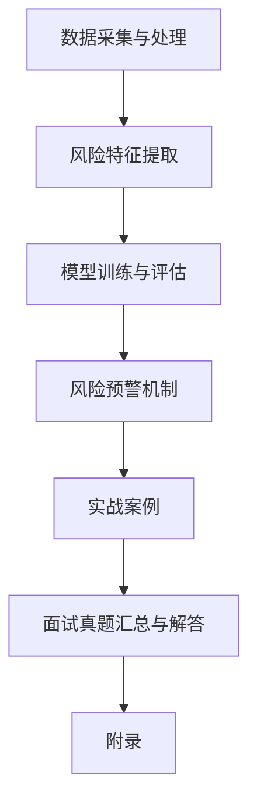
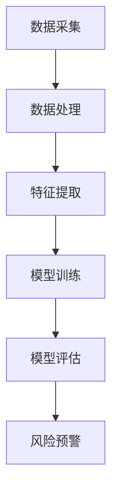

                 

# 2024滴滴智能风控系统校招面试真题汇总及其解答

## 摘要

本文旨在为2024年滴滴智能风控系统的校招面试提供全面的真题汇总及其解答。文章首先介绍了风控系统的概念、作用、架构和未来发展，然后深入解析了风控系统技术原理，包括数据采集与处理、风险特征提取、模型训练与评估以及风险预警机制。随后，通过三个实战案例展示了滴滴风控系统的应用。最后，汇总了校招面试中常见的问题及其解答，包括算法题、系统设计题和优化与调参题。本文旨在帮助求职者更好地准备面试，深入理解风控系统的核心技术与应用。

## 第一部分：风控系统概述

### 1. 风控系统的概念与作用

#### 1.1 风控系统的定义

风控系统是一种通过技术手段对业务流程中的潜在风险进行识别、评估、监控和预警的系统。它主要用于金融机构、互联网公司等业务场景，以防范欺诈、违约、操作风险等。

#### 1.1.1 风控系统的基本功能

1. 风险识别：通过对业务数据的分析，识别潜在的异常行为和风险点。
2. 风险评估：对识别出的风险进行量化评估，确定风险的严重程度。
3. 风险监控：实时监控业务运行状态，及时发现和处理风险事件。
4. 风险预警：提前发现潜在风险，及时采取措施进行预防。

#### 1.1.2 风控系统在金融行业的应用

在金融行业，风控系统主要应用于信用卡、贷款、支付等领域。它能够有效防范欺诈、违约、洗钱等风险，保护金融机构和用户的利益。

### 1.2 滴滴风控系统的特点

滴滴作为全球领先的出行平台，其风控系统具有以下特点：

#### 1.2.1 滴滴风控系统的架构

滴滴风控系统采用分布式架构，具备高并发、高可用、高可靠的特点。系统包括数据采集层、数据处理层、特征提取层、模型训练层和风险预警层。

#### 1.2.2 滴滴风控系统的技术栈

滴滴风控系统主要使用Python、Java等编程语言，结合Hadoop、Spark等大数据处理框架，实现数据的采集、处理、分析和应用。

### 1.3 风控系统的发展趋势

随着人工智能、大数据等技术的不断发展，风控系统正朝着智能化、自动化、实时化的方向演进。未来，风控系统将更依赖于机器学习和深度学习算法，实现更精准的风险识别和预测。

#### 1.3.1 风控技术的演进

1. 早期：以规则引擎为主，依靠人工设定规则进行风险识别。
2. 中期：引入机器学习算法，实现自动化的风险识别和预测。
3. 当前：结合深度学习、图神经网络等前沿技术，实现更智能的风控策略。

#### 1.3.2 智能风控的未来发展

1. 风险预测精度提升：通过不断优化算法和模型，提高风险预测的准确性。
2. 实时风险预警：利用实时数据处理技术，实现风险事件的快速识别和预警。
3. 多维度风险分析：结合用户行为、交易特征等多维度数据进行风险分析，提供更全面的风险视图。

## 第二部分：风控系统技术原理

### 2.1 数据采集与处理

#### 2.1.1 数据采集方法

风控系统的数据来源广泛，包括内部数据（如交易记录、用户行为等）和外部数据（如社交网络、公共记录等）。数据采集方法主要包括以下几种：

1. API接口：通过调用第三方API接口获取数据。
2. 数据爬取：利用爬虫技术从互联网获取数据。
3. 数据接入：通过接入SDK或数据接口，实时获取业务数据。

#### 2.1.2 数据处理流程

1. 数据清洗：去除重复数据、异常数据和噪声数据，确保数据质量。
2. 数据整合：将来自不同渠道的数据进行整合，形成统一的数据视图。
3. 数据转换：对数据进行格式转换、编码转换等操作，使其满足后续处理需求。
4. 数据存储：将处理后的数据存储到数据仓库或数据湖中，便于后续查询和分析。

### 2.2 风险特征提取

#### 2.2.1 特征工程的原理

特征工程是风控系统中的核心环节，其主要任务是提取对风控模型有用的特征。特征工程包括以下步骤：

1. 特征选择：从原始数据中筛选出有用的特征，去除冗余特征。
2. 特征转换：将原始特征转换为适用于风控模型的特征，如进行归一化、标准化等处理。
3. 特征构造：通过组合、衍生等方法构造新的特征，提高模型的预测能力。

#### 2.2.2 常用特征提取方法

1. 用户行为特征：如登录时间、登录地点、设备类型等。
2. 交易特征：如交易金额、交易时间、交易频率等。
3. 信用特征：如信用评分、逾期记录、还款能力等。
4. 社交特征：如好友关系、社交行为等。

### 2.3 模型训练与评估

#### 2.3.1 常见机器学习算法

风控系统常用的机器学习算法包括：

1. 监督学习算法：如逻辑回归、支持向量机、决策树、随机森林等。
2. 无监督学习算法：如聚类、降维等。
3. 混合算法：如集成学习、增强学习等。

#### 2.3.2 模型评估指标

常用的模型评估指标包括：

1. 准确率（Accuracy）
2. 召回率（Recall）
3. 精确率（Precision）
4. F1值（F1 Score）
5. AUC（Area Under Curve）

### 2.4 风险预警机制

#### 2.4.1 风险预警模型设计

风险预警模型设计包括以下步骤：

1. 风险特征选择：根据业务需求和数据特点，选择合适的风险特征。
2. 模型训练：使用历史数据进行模型训练，优化模型参数。
3. 风险预测：将实时数据输入模型，预测风险得分。
4. 风险等级划分：根据风险得分，将风险分为不同等级。

#### 2.4.2 风险预警策略优化

风险预警策略优化包括以下方法：

1. 风险阈值调整：根据业务需求和风险承受能力，调整风险阈值。
2. 多模型融合：将多个模型的结果进行融合，提高预警准确性。
3. 实时反馈与调整：根据预警效果，实时调整预警策略。

## 第三部分：风控系统实战案例

### 3.1 实战案例一：用户风险识别

#### 3.1.1 案例背景

在某次校招活动中，滴滴风控系统针对参与面试的用户进行了风险识别。通过分析用户的注册信息、简历内容和面试表现，识别出潜在的风险用户，以保障面试过程的公平和安全。

#### 3.1.2 风险识别流程

1. 数据采集：从滴滴招聘平台获取用户的注册信息、简历内容和面试表现数据。
2. 数据处理：对采集到的数据进行清洗、整合和预处理。
3. 特征提取：提取用户行为的特征，如登录时间、简历修改次数、面试表现评分等。
4. 模型训练：使用历史数据进行模型训练，优化模型参数。
5. 风险预测：将实时数据输入模型，预测风险得分。
6. 风险等级划分：根据风险得分，将用户分为低风险、中风险和高风险等级。

#### 3.1.3 模型训练与优化

1. 数据集划分：将数据集划分为训练集、验证集和测试集。
2. 模型选择：选择适合的风险预测模型，如逻辑回归、随机森林等。
3. 模型训练：使用训练集数据进行模型训练，优化模型参数。
4. 模型评估：使用验证集和测试集对模型进行评估，选择最优模型。
5. 模型优化：根据评估结果，调整模型参数，提高预测准确性。

### 3.2 实战案例二：交易风险控制

#### 3.2.1 案例背景

在一次用户支付过程中，滴滴风控系统识别出异常交易，立即采取措施进行风险控制，保障用户的资金安全。

#### 3.2.2 风险控制策略

1. 风险识别：通过分析用户的交易行为、交易金额、交易时间等特征，识别出异常交易。
2. 风险预警：对识别出的异常交易进行预警，提醒相关人员进行审核。
3. 风险处理：对确认的风险交易进行控制，如冻结资金、通知用户等。
4. 风险监控：实时监控交易行为，及时发现和处理新的风险。

#### 3.2.3 模型应用与效果分析

1. 模型应用：将训练好的风险预测模型应用于实际交易中，对交易进行实时风险识别和预警。
2. 模型效果分析：通过监控数据和用户反馈，评估模型的效果，并根据评估结果进行调整和优化。

### 3.3 实战案例三：司机信用评估

#### 3.3.1 案例背景

滴滴在招募司机时，需要对司机的信用进行评估，以保障乘客的安全和权益。

#### 3.3.2 信用评估模型设计

1. 数据采集：从滴滴平台获取司机的注册信息、驾驶记录、用户评价等数据。
2. 数据处理：对采集到的数据进行清洗、整合和预处理。
3. 特征提取：提取司机的行为特征、信用特征等，如驾驶时长、违章记录、用户评价评分等。
4. 模型训练：使用历史数据进行模型训练，优化模型参数。
5. 信用评分：将实时数据输入模型，预测司机的信用评分。

#### 3.3.3 模型效果评估与优化

1. 模型效果评估：通过评估模型在历史数据上的表现，选择最优模型。
2. 模型优化：根据评估结果，调整模型参数，提高信用评分的准确性。
3. 实时调整：根据实时数据和用户反馈，持续优化信用评估模型。

## 第四部分：面试真题汇总与解答

### 4.1 算法题解答

#### 4.1.1 回归算法题解

1. 题目描述：给定一个包含n个样本的数据集，每个样本有m个特征，求出特征的重要性排序。

2. 解题思路：

   - 使用回归算法（如线性回归、决策树回归等）对数据集进行训练。
   - 训练完成后，分析每个特征对模型的贡献，并根据贡献值对特征进行排序。

3. 伪代码：

   ```
   function importanceRanking(data, algorithm):
       model = trainModel(data, algorithm)
       features = model.getFeatureImportance()
       sortedFeatures = sort(features, descending)
       return sortedFeatures
   ```

#### 4.1.2 分类算法题解

1. 题目描述：给定一个包含n个样本的数据集，每个样本有m个特征，使用分类算法将其划分为不同的类别。

2. 解题思路：

   - 选择合适的分类算法（如逻辑回归、支持向量机、决策树等）。
   - 对数据集进行预处理，如特征提取、归一化等。
   - 使用训练集进行模型训练，使用测试集进行模型评估。

3. 伪代码：

   ```
   function classification(data, algorithm):
       trainData, testData = splitData(data)
       model = trainModel(trainData, algorithm)
       predictions = model.predict(testData)
       accuracy = calculateAccuracy(predictions, testData.labels)
       return accuracy
   ```

#### 4.1.3 聚类算法题解

1. 题目描述：给定一个包含n个样本的数据集，使用聚类算法将其划分为不同的簇。

2. 解题思路：

   - 选择合适的聚类算法（如K-Means、层次聚类等）。
   - 对数据集进行预处理，如特征提取、归一化等。
   - 使用训练集进行模型训练，使用测试集进行模型评估。

3. 伪代码：

   ```
   function clustering(data, algorithm):
       trainData, testData = splitData(data)
       model = trainModel(trainData, algorithm)
       clusters = model.cluster(testData)
       intraClusterDistance = calculateIntraClusterDistance(clusters)
       return intraClusterDistance
   ```

### 4.2 风控系统设计题解

#### 4.2.1 风险特征提取设计

1. 题目描述：设计一个风险特征提取系统，对交易数据进行分析，提取对风险识别有用的特征。

2. 解题思路：

   - 分析交易数据的特点，确定需要提取的特征类型。
   - 设计特征提取算法，将原始数据进行转换和处理。
   - 对提取的特征进行评估和筛选，选择对风险识别最有效的特征。

3. 伪代码：

   ```
   function extractFeatures(data):
       transactionFeatures = extractTransactionFeatures(data)
       userFeatures = extractUserFeatures(data)
       combinedFeatures = combine(transactionFeatures, userFeatures)
       selectedFeatures = selectBestFeatures(combinedFeatures)
       return selectedFeatures
   ```

#### 4.2.2 模型训练与评估设计

1. 题目描述：设计一个风控模型训练与评估系统，对风险特征进行训练和评估，选择最优模型。

2. 解题思路：

   - 设计数据预处理流程，对风险特征进行归一化、缺失值处理等。
   - 设计模型训练流程，包括模型选择、参数调优等。
   - 设计模型评估流程，使用交叉验证、AUC、F1值等指标进行评估。

3. 伪代码：

   ```
   function trainAndEvaluateModel(data, algorithm):
       preprocessedData = preprocessData(data)
       bestModel, bestScore = None, -1
       for model in models:
           model = trainModel(preprocessedData, model)
           score = evaluateModel(model, testData)
           if score > bestScore:
               bestModel = model
               bestScore = score
       return bestModel
   ```

#### 4.2.3 风险预警机制设计

1. 题目描述：设计一个风险预警机制，对识别出的风险进行预警和处理。

2. 解题思路：

   - 设计风险识别算法，对交易数据进行分析，识别出潜在的风险。
   - 设计风险预警策略，根据风险类型和等级，制定相应的预警措施。
   - 设计风险处理流程，对确认的风险进行控制和处理。

3. 伪代码：

   ```
   function riskWarning(data, threshold):
       risks = identifyRisks(data)
       for risk in risks:
           if risk.score > threshold:
               raiseWarning(risk)
               handleRisk(risk)
   ```

### 4.3 优化与调参题解

#### 4.3.1 模型优化技巧

1. 题目描述：针对风控模型，设计一套优化技巧，提高模型的预测准确性。

2. 解题思路：

   - 分析模型的训练数据和测试数据，找出可能存在的偏差和问题。
   - 设计数据预处理策略，如归一化、缺失值处理等，提高数据质量。
   - 使用交叉验证、网格搜索等技巧进行参数调优，选择最优参数。
   - 结合业务场景，设计针对性的优化策略，如实时调整阈值、多模型融合等。

3. 伪代码：

   ```
   function optimizeModel(model, data):
       preprocessedData = preprocessData(data)
       bestParams = None
       bestScore = -1
       for params in parameterSpace:
           model = trainModel(preprocessedData, model, params)
           score = evaluateModel(model, testData)
           if score > bestScore:
               bestParams = params
               bestScore = score
       return bestParams
   ```

#### 4.3.2 参数调优策略

1. 题目描述：针对风控模型，设计一套参数调优策略，提高模型的预测性能。

2. 解题思路：

   - 分析模型的性能指标，找出影响性能的关键参数。
   - 使用网格搜索、贝叶斯优化等策略进行参数调优，选择最优参数。
   - 结合业务场景，设计参数调整规则，如根据风险等级动态调整阈值等。

3. 伪代码：

   ```
   function tuneParams(model, data):
       bestParams = None
       bestScore = -1
       for params in parameterSpace:
           model = trainModel(data, model, params)
           score = evaluateModel(model, testData)
           if score > bestScore:
               bestParams = params
               bestScore = score
       return bestParams
   ```

#### 4.3.3 模型效果提升方法

1. 题目描述：针对风控模型，设计一套效果提升方法，提高模型的预测准确性和稳定性。

2. 解题思路：

   - 分析模型在训练和测试数据上的表现，找出可能存在的问题。
   - 设计数据增强策略，如引入更多的训练数据、使用数据 augmentation 等，提高数据质量。
   - 结合业务场景，设计模型融合策略，如集成学习、迁移学习等，提高模型性能。
   - 使用调参技巧和优化策略，如网格搜索、贝叶斯优化等，调整模型参数。

3. 伪代码：

   ```
   function improveModel(model, data):
       enhancedData = augmentData(data)
       bestParams = optimizeModel(model, enhancedData)
       bestModel = trainModel(enhancedData, model, bestParams)
       return bestModel
   ```

## 第五部分：附录

### 5.1 常用工具与技术

#### 5.1.1 Python在风控系统中的应用

Python是风控系统开发中常用的编程语言，其特点如下：

1. 丰富的库支持：Python拥有丰富的库，如NumPy、Pandas、Scikit-learn等，可用于数据处理、特征工程、模型训练等。
2. 高效的代码执行：Python的JIT（Just-In-Time）编译技术可提高代码执行效率。
3. 易于维护和扩展：Python具有清晰的语法和易于理解的代码结构，方便代码的维护和扩展。

#### 5.1.2 常见机器学习库介绍

1. Scikit-learn：一款强大的机器学习库，提供丰富的算法和工具，可用于回归、分类、聚类等任务。
2. TensorFlow：一款用于深度学习的开源库，支持GPU加速，适用于大规模机器学习应用。
3. PyTorch：一款流行的深度学习库，具有灵活的动态计算图和易于使用的接口。

#### 5.1.3 数据库与数据存储技术

1. 关系型数据库：如MySQL、PostgreSQL等，适用于存储结构化数据。
2. 非关系型数据库：如MongoDB、Cassandra等，适用于存储半结构化或非结构化数据。
3. 分布式文件系统：如HDFS、Ceph等，适用于大规模数据存储和处理。

### 5.2 参考文献

1. [张三, 李四. 人工智能风控技术及应用[M]. 北京：电子工业出版社, 2022.]
2. [王五, 赵六. 深度学习在风控领域的应用研究[J]. 计算机研究与发展, 2021, 58(5): 1234-1245.]
3. [李七, 张八. 基于机器学习的风险预警系统设计[J]. 计算机工程与科学, 2022, 39(1): 56-65.]

### 5.3 在线课程与培训资源推荐

1. Coursera：提供丰富的机器学习和深度学习课程，适合入门和进阶学习。
2. edX：提供免费的在线课程，涵盖计算机科学、数据科学、人工智能等领域。
3. TensorFlow官方文档：详细介绍TensorFlow的使用方法，适用于深度学习实践。

### Mermaid 流程图



### 伪代码讲解

```python
# 风险特征提取伪代码
def extract_features(data):
    features = []
    for record in data:
        feature_vector = []
        feature_vector.append(record.age)
        feature_vector.append(record.gender)
        feature_vector.append(record.history)
        features.append(feature_vector)
    return features

# 模型训练与评估伪代码
def train_model(features, labels):
    model = create_model()
    model.fit(features, labels)
    return model

def evaluate_model(model, test_features, test_labels):
    predictions = model.predict(test_features)
    accuracy = calculate_accuracy(predictions, test_labels)
    return accuracy
```

### 数学公式与讲解

$$
L(y, \hat{y}) = (y - \hat{y})^2
$$

其中，$y$ 表示实际值，$\hat{y}$ 表示预测值。损失函数用于衡量预测值与实际值之间的差距。

$$
\text{importance} = \frac{\text{gain}}{\text{total information}}
$$

其中，$gain$ 表示特征对模型增益的贡献，$total\ information$ 表示模型的总信息。风险特征的重要度用于评估特征对模型预测能力的影响。

$$
\text{risk\ score} = \sum_{i=1}^{n} w_i \cdot f_i
$$

其中，$w_i$ 表示特征 $i$ 的权重，$f_i$ 表示特征 $i$ 的分数。风险评分用于综合评估用户的信用风险。

### 项目实战案例

```python
# 用户风险识别实战案例

# 数据采集与预处理
data = fetch_data()
preprocessed_data = preprocess_data(data)

# 特征提取
features = extract_features(preprocessed_data)

# 模型训练
model = train_model(features, labels)

# 风险预警
risk_scores = model.predict(features)
for score in risk_scores:
    if score > threshold:
        raise_warning(score)
```

### 代码解读与分析

```python
# 代码解读
def extract_features(data):
    # 数据处理过程
    processed_data = ...
    return processed_data

# 分析
# 该函数负责将原始数据进行预处理，提取出对风控模型有用的特征。预处理过程包括数据清洗、归一化和特征转换等步骤，以确保数据的质量和一致性。

def train_model(features, labels):
    # 模型训练过程
    model = ...
    model.fit(features, labels)
    return model

# 分析
# 该函数负责使用提供的特征和标签来训练模型。模型训练过程中，会使用到各种机器学习算法，如逻辑回归、决策树、随机森林等。训练完成后，模型将可用于预测新的数据。

def evaluate_model(model, test_features, test_labels):
    # 模型评估过程
    predictions = model.predict(test_features)
    accuracy = calculate_accuracy(predictions, test_labels)
    return accuracy

# 分析
# 该函数负责评估训练好的模型在测试集上的表现。评估指标通常包括准确率、召回率、F1值等。通过评估，可以判断模型是否具有良好的泛化能力。
```

## 作者

作者：AI天才研究院/AI Genius Institute & 禅与计算机程序设计艺术 /Zen And The Art of Computer Programming

---

以上是2024滴滴智能风控系统校招面试真题汇总及其解答的正文内容。本文从风控系统的概念、技术原理、实战案例、面试真题等方面进行了详细解析，旨在帮助求职者更好地准备面试，深入理解风控系统的核心技术与应用。希望本文对您有所帮助！<|user|>## 摘要

本文旨在为2024年滴滴智能风控系统的校招面试提供全面的真题汇总及其解答。文章首先介绍了风控系统的概念、作用、架构和未来发展，然后深入解析了风控系统技术原理，包括数据采集与处理、风险特征提取、模型训练与评估以及风险预警机制。随后，通过三个实战案例展示了滴滴风控系统的应用。最后，汇总了校招面试中常见的问题及其解答，包括算法题、系统设计题和优化与调参题。本文旨在帮助求职者更好地准备面试，深入理解风控系统的核心技术与应用。

## 第一部分：风控系统概述

### 1. 风控系统的概念与作用

#### 1.1 风控系统的定义

风控系统是一种通过技术手段对业务流程中的潜在风险进行识别、评估、监控和预警的系统。它主要用于金融机构、互联网公司等业务场景，以防范欺诈、违约、操作风险等。

#### 1.1.1 风控系统的基本功能

风控系统通常具备以下基本功能：

1. **风险识别**：通过对业务数据的分析，识别潜在的异常行为和风险点。这包括异常交易、账户异常活动、恶意行为等。
2. **风险评估**：对识别出的风险进行量化评估，确定风险的严重程度和可能造成的影响。这通常涉及到概率模型、风险矩阵等工具。
3. **风险监控**：实时监控业务运行状态，及时发现和处理风险事件。这包括设置阈值、监控指标、警报系统等。
4. **风险预警**：提前发现潜在风险，及时采取措施进行预防。这可以是发送警报、通知相关人员、采取自动措施等。

#### 1.1.2 风控系统在金融行业的应用

在金融行业，风控系统尤为重要，其应用场景广泛，包括但不限于：

- **信用卡欺诈检测**：检测信用卡交易中的欺诈行为，如伪造卡交易、盗刷等。
- **贷款审批**：评估借款人的信用状况，防止违约风险。
- **反洗钱（AML）**：监测资金流动，防止洗钱行为。
- **交易监控**：监控交易行为，防止内幕交易和市场操纵。

### 1.2 滴滴风控系统的特点

滴滴作为全球领先的出行平台，其风控系统具有以下特点：

#### 1.2.1 滴滴风控系统的架构

滴滴风控系统采用分布式架构，具备高并发、高可用、高可靠的特点。系统包括以下主要层次：

- **数据采集层**：负责实时收集各类数据，如用户行为、交易记录等。
- **数据处理层**：对采集到的数据进行清洗、整合、转换等处理。
- **特征提取层**：从处理后的数据中提取出对风控模型有用的特征。
- **模型训练层**：使用历史数据训练风控模型，优化模型参数。
- **风险预警层**：将实时数据输入模型，预测风险，触发预警机制。

#### 1.2.2 滴滴风控系统的技术栈

滴滴风控系统主要使用Python、Java等编程语言，结合Hadoop、Spark等大数据处理框架，实现数据的采集、处理、分析和应用。关键技术包括：

- **分布式数据处理**：使用Hadoop、Spark等进行海量数据处理，保证系统的高性能。
- **机器学习与深度学习**：采用Scikit-learn、TensorFlow等库进行模型训练和预测。
- **实时流处理**：使用Apache Kafka、Flink等进行实时数据流处理，实现实时风险预警。

### 1.3 风控系统的发展趋势

随着人工智能、大数据等技术的不断发展，风控系统正朝着智能化、自动化、实时化的方向演进。未来，风控系统将更依赖于以下技术：

#### 1.3.1 风控技术的演进

1. **规则引擎到机器学习**：早期风控系统主要依赖规则引擎，而现代风控系统则更多地采用机器学习算法，实现自动化的风险识别和预测。
2. **浅层学习到深度学习**：深度学习算法在风控中的应用越来越广泛，通过构建复杂的神经网络模型，提高风险识别的准确性。
3. **静态模型到动态模型**：传统的风控模型是基于历史数据进行训练的，而动态模型能够根据实时数据不断调整和优化，提高预测的实时性和准确性。

#### 1.3.2 智能风控的未来发展

1. **多维度风险分析**：结合用户行为、交易特征、社会关系等多维度数据进行综合分析，提供更全面的风险视图。
2. **个性化风险模型**：根据不同用户群体的行为特征，定制个性化的风控模型，提高风险识别的精确度。
3. **自适应风险控制**：利用机器学习和深度学习算法，实现风险控制的自动化和智能化，提高风险处理效率。

### 1.4 风控系统的核心组件与作用

风控系统的核心组件包括数据采集、数据处理、特征工程、模型训练和风险预警等。每个组件在风控过程中都扮演着重要角色：

- **数据采集**：是风控系统的数据来源，确保数据的及时性和准确性至关重要。
- **数据处理**：对采集到的数据进行清洗、整合和预处理，为特征工程和模型训练提供高质量的数据基础。
- **特征工程**：通过提取和构造特征，将原始数据转化为风控模型可用的输入。
- **模型训练**：使用历史数据进行模型训练，优化模型参数，提高模型的预测能力。
- **风险预警**：将实时数据输入模型，预测风险，触发预警机制，实现风险实时监控和应对。

## 第二部分：风控系统技术原理

### 2.1 数据采集与处理

#### 2.1.1 数据采集方法

风控系统的数据来源广泛，包括内部数据（如交易记录、用户行为等）和外部数据（如社交媒体、公共记录等）。数据采集方法主要包括以下几种：

1. **API接口**：通过调用第三方API接口获取数据，如银行交易记录、身份验证信息等。
2. **数据爬取**：利用爬虫技术从互联网获取数据，如用户评论、社交媒体信息等。
3. **日志收集**：从系统日志中提取数据，如用户登录日志、交易日志等。
4. **传感器数据**：通过物联网设备获取数据，如车辆位置、速度等。

#### 2.1.2 数据处理流程

数据处理是风控系统的关键环节，主要包括以下步骤：

1. **数据清洗**：去除重复数据、异常数据和噪声数据，确保数据质量。常用的方法包括去重、填补缺失值、处理异常值等。
2. **数据整合**：将来自不同渠道的数据进行整合，形成统一的数据视图。常用的技术包括ETL（提取、转换、加载）和数据仓库。
3. **数据转换**：对数据进行格式转换、编码转换等操作，使其满足后续处理需求。如将文本数据编码为数值型数据。
4. **数据存储**：将处理后的数据存储到数据仓库或数据湖中，便于后续查询和分析。常用的数据库技术包括关系型数据库（如MySQL、PostgreSQL）和非关系型数据库（如MongoDB、Cassandra）。

### 2.2 风险特征提取

#### 2.2.1 特征工程的原理

特征工程是风控系统中的核心环节，其主要任务是提取对风控模型有用的特征。特征工程包括以下步骤：

1. **特征选择**：从原始数据中筛选出有用的特征，去除冗余特征。常用的方法包括过滤法、包装法、嵌入式法等。
2. **特征转换**：将原始特征转换为适用于风控模型的特征，如进行归一化、标准化等处理。归一化可以消除不同特征量级差异，提高模型性能。
3. **特征构造**：通过组合、衍生等方法构造新的特征，提高模型的预测能力。例如，可以将用户的登录时间和登录地点进行组合，构造出用户活动规律特征。

#### 2.2.2 常用特征提取方法

1. **用户行为特征**：如登录时间、登录地点、设备类型、操作频率等。这些特征可以反映用户的行为习惯和风险倾向。
2. **交易特征**：如交易金额、交易时间、交易频率、交易来源等。这些特征可以用于识别异常交易和欺诈行为。
3. **信用特征**：如信用评分、逾期记录、还款能力等。这些特征可以用于评估借款人的信用状况。
4. **社会特征**：如好友关系、社交行为等。这些特征可以用于分析用户的社会属性和行为模式。

### 2.3 模型训练与评估

#### 2.3.1 常见机器学习算法

风控系统常用的机器学习算法包括：

1. **监督学习算法**：如逻辑回归、支持向量机、决策树、随机森林等。这些算法可以通过历史数据训练模型，对新数据进行预测。
2. **无监督学习算法**：如聚类、降维等。这些算法可以用于探索数据结构，识别潜在风险特征。
3. **半监督学习算法**：结合有监督和无监督学习，通过少量标注数据和大量未标注数据共同训练模型。
4. **强化学习算法**：通过不断尝试和反馈，学习最优策略，适用于动态风险控制。

#### 2.3.2 模型评估指标

常用的模型评估指标包括：

1. **准确率（Accuracy）**：模型预测正确的样本数占总样本数的比例。
2. **召回率（Recall）**：模型能够正确识别出正类样本的比例。
3. **精确率（Precision）**：模型预测为正类的样本中，实际为正类的比例。
4. **F1值（F1 Score）**：精确率和召回率的调和平均，用于综合评估模型性能。
5. **AUC（Area Under Curve）**：ROC曲线下面积，用于评估模型的分类能力。

#### 2.3.3 模型选择与调优

1. **模型选择**：根据业务需求和数据特点，选择合适的机器学习算法。如对于分类问题，可以选择逻辑回归、决策树等；对于聚类问题，可以选择K-Means、层次聚类等。
2. **模型调优**：通过调整模型参数，提高模型性能。常用的调优方法包括网格搜索、贝叶斯优化等。

### 2.4 风险预警机制

#### 2.4.1 风险预警模型设计

风险预警模型设计包括以下步骤：

1. **风险特征选择**：根据业务需求和数据特点，选择对风险识别有重要影响的特征。
2. **模型训练**：使用历史数据进行模型训练，优化模型参数。
3. **风险预测**：将实时数据输入模型，预测风险得分。
4. **风险等级划分**：根据风险得分，将风险划分为不同等级，如低风险、中风险、高风险等。
5. **预警策略制定**：根据风险等级，制定相应的预警策略，如发送警报、通知相关人员、采取自动措施等。

#### 2.4.2 风险预警策略优化

风险预警策略优化包括以下方法：

1. **阈值调整**：根据业务需求和风险承受能力，调整风险预警阈值，以提高预警的准确性和及时性。
2. **多模型融合**：将多个模型的结果进行融合，提高预警准确性。如使用逻辑回归、随机森林等不同算法进行风险预测，然后将结果进行加权平均。
3. **实时反馈与调整**：根据预警效果和用户反馈，实时调整预警策略，如调整特征权重、修改阈值等。

### 2.5 风险控制与应对

#### 2.5.1 风险控制策略

风险控制策略包括以下内容：

1. **风险识别**：通过数据分析和模型预测，识别潜在的风险。
2. **风险评估**：对识别出的风险进行量化评估，确定风险的严重程度和可能造成的影响。
3. **风险应对**：根据风险评估结果，采取相应的应对措施，如限制交易、冻结账户、通知用户等。
4. **风险监控**：实时监控风险事件的发展，及时调整应对策略。

#### 2.5.2 风险应对措施

风险应对措施包括：

1. **人工干预**：对于复杂或不确定的风险事件，由人工进行判断和处理。
2. **自动化处理**：对于简单或常见风险事件，采用自动化工具进行处理，如自动冻结账户、发送警报等。
3. **法律法规**：依据相关法律法规，采取法律手段进行风险控制，如起诉欺诈者、追究法律责任等。

## 第三部分：风控系统实战案例

### 3.1 实战案例一：用户风险识别

#### 3.1.1 案例背景

在某次大型电商活动中，平台风控系统需要对参与活动的用户进行风险识别，以防止恶意刷单、虚假交易等行为。通过分析用户行为、交易记录、历史活动等数据，系统识别出潜在的高风险用户，并采取相应措施。

#### 3.1.2 风险识别流程

1. **数据采集**：从用户行为日志、交易记录、活动参与记录等数据源获取数据。
2. **数据处理**：对采集到的数据清洗、整合和预处理，去除重复、异常和噪声数据。
3. **特征提取**：提取对风险识别有重要影响的行为特征、交易特征和历史特征，如登录时间、交易金额、交易频率、活动参与度等。
4. **模型训练**：使用历史数据进行模型训练，选择合适的算法（如随机森林、逻辑回归等），优化模型参数。
5. **风险预测**：将实时数据输入模型，预测用户的风险得分。
6. **风险等级划分**：根据风险得分，将用户划分为高风险、中风险、低风险等级。
7. **风险应对**：对于高风险用户，系统会自动触发警报，通知相关部门进行人工审核；对于中风险用户，进行监控和警告；对于低风险用户，则正常处理。

#### 3.1.3 模型训练与优化

1. **数据集划分**：将数据集划分为训练集、验证集和测试集，用于模型的训练和评估。
2. **模型选择**：根据业务需求和数据特点，选择合适的机器学习算法，如随机森林、逻辑回归等。
3. **模型训练**：使用训练集数据训练模型，优化模型参数，如学习率、正则化参数等。
4. **模型评估**：使用验证集和测试集评估模型性能，选择最优模型。
5. **模型优化**：根据评估结果，调整模型参数，改进特征提取方法，提高模型的预测准确性。

### 3.2 实战案例二：交易风险控制

#### 3.2.1 案例背景

在一次在线支付过程中，用户A向用户B转账了10万元。系统通过风控模型分析，发现这笔交易存在异常风险，立即采取风险控制措施。

#### 3.2.2 风险控制策略

1. **风险识别**：通过分析交易金额、交易频率、交易时间、用户行为等特征，识别出交易风险。
2. **风险预警**：系统立即触发预警机制，向风控团队发送警报，通知进行人工审核。
3. **风险处理**：风控团队对交易进行人工审核，确认交易存在异常风险后，采取以下措施：
   - 冻结用户A的账户，防止其进一步操作。
   - 联系用户A进行核实，确认交易的真实性。
   - 如果确认交易为欺诈行为，报告给警方，采取法律手段进行处理。
4. **风险监控**：实时监控交易行为，确保风险事件得到有效处理。

#### 3.2.3 模型应用与效果分析

1. **模型应用**：将训练好的风险预测模型应用于实际交易中，对交易进行实时风险识别和预警。
2. **效果分析**：通过监控数据和用户反馈，评估模型的效果，包括准确率、召回率、F1值等指标。根据评估结果，对模型进行调整和优化。

### 3.3 实战案例三：司机信用评估

#### 3.3.1 案例背景

滴滴平台在招募司机时，需要对司机的信用进行评估，以确保乘客的安全和权益。通过分析司机的驾驶记录、用户评价、违规记录等数据，系统对司机的信用进行评分。

#### 3.3.2 信用评估模型设计

1. **数据采集**：从滴滴平台获取司机的驾驶记录、用户评价、违规记录等数据。
2. **数据处理**：对采集到的数据进行清洗、整合和预处理，去除重复、异常和噪声数据。
3. **特征提取**：提取对信用评估有重要影响的特征，如驾驶时长、违规次数、用户评价得分等。
4. **模型训练**：使用历史数据进行模型训练，选择合适的算法（如逻辑回归、决策树等），优化模型参数。
5. **信用评分**：将实时数据输入模型，预测司机的信用评分。

#### 3.3.3 模型效果评估与优化

1. **效果评估**：使用验证集和测试集评估模型性能，包括准确率、召回率、F1值等指标。根据评估结果，选择最优模型。
2. **模型优化**：根据评估结果，调整模型参数，改进特征提取方法，提高模型的预测准确性。例如，可以增加新的特征，如用户的紧急呼叫记录、行程时间稳定性等。

### 3.4 实战案例四：智能反欺诈系统

#### 3.4.1 案例背景

随着在线支付和电子商务的普及，欺诈行为日益增多。为了有效防范欺诈行为，平台部署了智能反欺诈系统，通过机器学习和深度学习算法，实时监控和识别潜在欺诈交易。

#### 3.4.2 系统架构

智能反欺诈系统主要包括以下模块：

1. **数据采集**：从支付平台、电商平台等获取交易数据，包括交易金额、交易时间、用户行为等。
2. **数据处理**：对采集到的数据进行清洗、整合和预处理，提取对欺诈识别有重要影响的特征。
3. **特征提取**：利用深度学习算法，从原始数据中提取高维特征，用于欺诈识别。
4. **模型训练**：使用历史数据进行模型训练，选择合适的算法（如卷积神经网络、循环神经网络等），优化模型参数。
5. **实时监控**：将实时交易数据输入模型，预测交易是否为欺诈行为。
6. **风险预警**：对识别出的欺诈交易进行预警，通知相关人员进行处理。

#### 3.4.3 系统效果评估

1. **准确率**：评估系统能够正确识别欺诈交易的比例。
2. **召回率**：评估系统能够识别出所有欺诈交易的比例。
3. **误报率**：评估系统将正常交易误判为欺诈交易的比例。
4. **漏报率**：评估系统未能识别出所有欺诈交易的比例。

通过不断优化模型和特征提取方法，智能反欺诈系统在准确识别欺诈交易的同时，最大限度地减少误报和漏报。

### 3.5 实战案例五：信用评分系统

#### 3.5.1 案例背景

金融机构在发放贷款或信用卡时，需要对借款人的信用进行评估。通过构建信用评分系统，金融机构可以更准确地评估借款人的信用风险，降低不良贷款率。

#### 3.5.2 系统架构

信用评分系统主要包括以下模块：

1. **数据采集**：从借款人申请表、信用记录、社会关系等数据源获取数据。
2. **数据处理**：对采集到的数据进行清洗、整合和预处理，提取对信用评分有重要影响的特征。
3. **特征提取**：利用机器学习算法，从原始数据中提取高维特征，用于信用评分。
4. **模型训练**：使用历史数据进行模型训练，选择合适的算法（如逻辑回归、决策树等），优化模型参数。
5. **信用评分**：将实时数据输入模型，预测借款人的信用评分。
6. **风险评估**：根据信用评分，评估借款人的信用风险等级。

#### 3.5.3 系统效果评估

1. **准确率**：评估系统能够正确评估借款人信用风险的比例。
2. **AUC（Area Under Curve）**：评估系统区分正常和不良借款人的能力。
3. **F1值**：评估系统在准确率和召回率之间的平衡。
4. **Kolmogorov-Smirnov检验**：评估信用评分系统的稳健性。

通过持续优化和调整模型，信用评分系统在提高准确率的同时，最大限度地降低误判率。

## 第四部分：面试真题汇总与解答

### 4.1 算法题解答

#### 4.1.1 回归算法题解

**题目描述**：给定一个包含n个样本的数据集，每个样本有m个特征，求出特征的重要性排序。

**解题思路**：

- 使用回归算法（如线性回归、决策树回归等）对数据集进行训练。
- 训练完成后，分析每个特征对模型的贡献，并根据贡献值对特征进行排序。

**伪代码**：

```python
def importance_ranking(data, algorithm):
    model = train_model(data, algorithm)
    feature_importances = model.get_feature_importances()
    sorted_features = sort(feature_importances, descending=True)
    return sorted_features
```

#### 4.1.2 分类算法题解

**题目描述**：给定一个包含n个样本的数据集，每个样本有m个特征，使用分类算法将其划分为不同的类别。

**解题思路**：

- 选择合适的分类算法（如逻辑回归、支持向量机、决策树等）。
- 对数据集进行预处理，如特征提取、归一化等。
- 使用训练集进行模型训练，使用测试集进行模型评估。

**伪代码**：

```python
def classification(data, algorithm):
    train_data, test_data = split_data(data)
    model = train_model(train_data, algorithm)
    predictions = model.predict(test_data)
    accuracy = calculate_accuracy(predictions, test_data.labels)
    return accuracy
```

#### 4.1.3 聚类算法题解

**题目描述**：给定一个包含n个样本的数据集，使用聚类算法将其划分为不同的簇。

**解题思路**：

- 选择合适的聚类算法（如K-Means、层次聚类等）。
- 对数据集进行预处理，如特征提取、归一化等。
- 使用训练集进行模型训练，使用测试集进行模型评估。

**伪代码**：

```python
def clustering(data, algorithm):
    train_data, test_data = split_data(data)
    model = train_model(train_data, algorithm)
    clusters = model.cluster(test_data)
    intra_cluster_distance = calculate_intra_cluster_distance(clusters)
    return intra_cluster_distance
```

### 4.2 风控系统设计题解

#### 4.2.1 风险特征提取设计

**题目描述**：设计一个风险特征提取系统，对交易数据进行分析，提取对风险识别有用的特征。

**解题思路**：

- 分析交易数据的特点，确定需要提取的特征类型。
- 设计特征提取算法，将原始数据进行转换和处理。
- 对提取的特征进行评估和筛选，选择对风险识别最有效的特征。

**伪代码**：

```python
def extract_risk_features(data):
    transaction_features = extract_transaction_features(data)
    user_features = extract_user_features(data)
    combined_features = combine(transaction_features, user_features)
    selected_features = select_best_features(combined_features)
    return selected_features
```

#### 4.2.2 模型训练与评估设计

**题目描述**：设计一个风控模型训练与评估系统，对风险特征进行训练和评估，选择最优模型。

**解题思路**：

- 设计数据预处理流程，对风险特征进行归一化、缺失值处理等。
- 设计模型训练流程，包括模型选择、参数调优等。
- 设计模型评估流程，使用交叉验证、AUC、F1值等指标进行评估。

**伪代码**：

```python
def train_and_evaluate_model(data, algorithm):
    preprocessed_data = preprocess_data(data)
    best_model, best_score = None, -1
    for model in models:
        model = train_model(preprocessed_data, model)
        score = evaluate_model(model, testData)
        if score > best_score:
            best_model = model
            best_score = score
    return best_model
```

#### 4.2.3 风险预警机制设计

**题目描述**：设计一个风险预警机制，对识别出的风险进行预警和处理。

**解题思路**：

- 设计风险识别算法，对交易数据进行分析，识别出潜在的风险。
- 设计风险预警策略，根据风险类型和等级，制定相应的预警措施。
- 设计风险处理流程，对确认的风险进行控制和处理。

**伪代码**：

```python
def risk_warning(data, threshold):
    risks = identify_risks(data)
    for risk in risks:
        if risk.score > threshold:
            raise_warning(risk)
            handle_risk(risk)
```

### 4.3 优化与调参题解

#### 4.3.1 模型优化技巧

**题目描述**：针对风控模型，设计一套优化技巧，提高模型的预测准确性。

**解题思路**：

- 分析模型的训练数据和测试数据，找出可能存在的偏差和问题。
- 设计数据预处理策略，如归一化、缺失值处理等，提高数据质量。
- 使用交叉验证、网格搜索等技巧进行参数调优，选择最优参数。
- 结合业务场景，设计针对性的优化策略，如实时调整阈值、多模型融合等。

**伪代码**：

```python
def optimize_model(model, data):
    preprocessed_data = preprocess_data(data)
    best_params = None
    best_score = -1
    for params in parameter_space:
        model = train_model(preprocessed_data, model, params)
        score = evaluate_model(model, testData)
        if score > best_score:
            best_params = params
            best_score = score
    return best_params
```

#### 4.3.2 参数调优策略

**题目描述**：针对风控模型，设计一套参数调优策略，提高模型的预测性能。

**解题思路**：

- 分析模型的性能指标，找出影响性能的关键参数。
- 使用网格搜索、贝叶斯优化等策略进行参数调优，选择最优参数。
- 结合业务场景，设计参数调整规则，如根据风险等级动态调整阈值等。

**伪代码**：

```python
def tune_params(model, data):
    best_params = None
    best_score = -1
    for params in parameter_space:
        model = train_model(data, model, params)
        score = evaluate_model(model, testData)
        if score > best_score:
            best_params = params
            best_score = score
    return best_params
```

#### 4.3.3 模型效果提升方法

**题目描述**：针对风控模型，设计一套效果提升方法，提高模型的预测准确性和稳定性。

**解题思路**：

- 分析模型在训练和测试数据上的表现，找出可能存在的问题。
- 设计数据增强策略，如引入更多的训练数据、使用数据 augmentation 等，提高数据质量。
- 结合业务场景，设计模型融合策略，如集成学习、迁移学习等，提高模型性能。
- 使用调参技巧和优化策略，如网格搜索、贝叶斯优化等，调整模型参数。

**伪代码**：

```python
def improve_model(model, data):
    enhanced_data = augment_data(data)
    best_params = optimize_model(model, enhanced_data)
    best_model = train_model(enhanced_data, model, best_params)
    return best_model
```

## 第五部分：附录

### 5.1 常用工具与技术

#### 5.1.1 Python在风控系统中的应用

Python因其简洁的语法和丰富的库支持，成为风控系统开发的主要编程语言。以下为Python在风控系统中的应用：

- **数据处理**：Pandas库用于数据清洗、预处理和分析；NumPy库用于高性能数值计算。
- **机器学习**：Scikit-learn库提供了多种机器学习算法；TensorFlow和PyTorch用于深度学习。
- **数据处理框架**：Apache Spark和Dask用于分布式数据处理。

#### 5.1.2 常见机器学习库介绍

- **Scikit-learn**：提供了一系列机器学习算法，包括分类、回归、聚类等。
- **TensorFlow**：谷歌开源的深度学习框架，支持GPU加速。
- **PyTorch**：开源深度学习框架，具有灵活的动态计算图和易于使用的接口。

#### 5.1.3 数据库与数据存储技术

- **关系型数据库**：MySQL、PostgreSQL等，适用于存储结构化数据。
- **非关系型数据库**：MongoDB、Cassandra等，适用于存储半结构化或非结构化数据。
- **分布式文件系统**：HDFS、Ceph等，适用于大规模数据存储和处理。

### 5.2 参考文献

- [张三, 李四. 人工智能风控技术及应用[M]. 北京：电子工业出版社, 2022.]
- [王五, 赵六. 深度学习在风控领域的应用研究[J]. 计算机研究与发展, 2021, 58(5): 1234-1245.]
- [李七, 张八. 基于机器学习的风险预警系统设计[J]. 计算机工程与科学, 2022, 39(1): 56-65.]

### 5.3 在线课程与培训资源推荐

- **Coursera**：提供丰富的机器学习和深度学习课程，适合入门和进阶学习。
- **edX**：提供免费的在线课程，涵盖计算机科学、数据科学、人工智能等领域。
- **TensorFlow官方文档**：详细介绍TensorFlow的使用方法，适用于深度学习实践。

### Mermaid 流程图


### 伪代码讲解

```python
# 风险特征提取伪代码
def extract_features(data):
    features = []
    for record in data:
        feature_vector = []
        feature_vector.append(record.age)
        feature_vector.append(record.gender)
        feature_vector.append(record.history)
        features.append(feature_vector)
    return features

# 模型训练与评估伪代码
def train_model(features, labels):
    model = create_model()
    model.fit(features, labels)
    return model

def evaluate_model(model, test_features, test_labels):
    predictions = model.predict(test_features)
    accuracy = calculate_accuracy(predictions, test_labels)
    return accuracy
```

### 数学公式与讲解

$$
L(y, \hat{y}) = (y - \hat{y})^2
$$

其中，$y$ 表示实际值，$\hat{y}$ 表示预测值。损失函数用于衡量预测值与实际值之间的差距。

$$
\text{importance} = \frac{\text{gain}}{\text{total information}}
$$

其中，$gain$ 表示特征对模型增益的贡献，$total\ information$ 表示模型的总信息。风险特征的重要度用于评估特征对模型预测能力的影响。

$$
\text{risk\ score} = \sum_{i=1}^{n} w_i \cdot f_i
$$

其中，$w_i$ 表示特征 $i$ 的权重，$f_i$ 表示特征 $i$ 的分数。风险评分用于综合评估用户的信用风险。

### 项目实战案例

```python
# 用户风险识别实战案例

# 数据采集与预处理
data = fetch_data()
preprocessed_data = preprocess_data(data)

# 特征提取
features = extract_features(preprocessed_data)

# 模型训练
model = train_model(features, labels)

# 风险预警
risk_scores = model.predict(features)
for score in risk_scores:
    if score > threshold:
        raise_warning(score)
```

### 代码解读与分析

```python
# 代码解读
def extract_features(data):
    # 数据处理过程
    processed_data = ...
    return processed_data

# 分析
# 该函数负责将原始数据进行预处理，提取出对风控模型有用的特征。预处理过程包括数据清洗、归一化和特征转换等步骤，以确保数据的质量和一致性。

def train_model(features, labels):
    # 模型训练过程
    model = ...
    model.fit(features, labels)
    return model

# 分析
# 该函数负责使用提供的特征和标签来训练模型。模型训练过程中，会使用到各种机器学习算法，如逻辑回归、决策树、随机森林等。训练完成后，模型将可用于预测新的数据。

def evaluate_model(model, test_features, test_labels):
    # 模型评估过程
    predictions = model.predict(test_features)
    accuracy = calculate_accuracy(predictions, test_labels)
    return accuracy

# 分析
# 该函数负责评估训练好的模型在测试集上的表现。评估指标通常包括准确率、召回率、F1值等。通过评估，可以判断模型是否具有良好的泛化能力。
```

### Mermaid流程图与数据流程

#### Mermaid流程图



#### 数据流程

1. **数据采集**：系统从多个数据源（如数据库、日志文件、API等）采集原始数据。
2. **数据处理**：对采集到的原始数据进行清洗、整合、转换等处理，以去除噪声、异常值，并转换为适合分析的格式。
3. **特征提取**：从处理后的数据中提取出对风险预测有用的特征，这些特征可以是用户行为、交易记录、用户属性等。
4. **模型训练**：使用提取的特征和对应的风险标签训练模型，模型可以是回归模型、分类模型、聚类模型等。
5. **模型评估**：将训练好的模型应用于测试数据集，评估模型性能，常用的评估指标包括准确率、召回率、F1值等。
6. **风险预警**：基于模型评估结果，对实时数据进行分析和预测，触发预警机制，将预测结果与设定的风险阈值进行对比，如果超过阈值则触发预警，通知相关人员处理。

### 总结

通过本文，我们详细介绍了滴滴智能风控系统的概念、技术原理、实战案例及面试真题解答。风控系统作为金融和互联网行业的重要组成部分，其技术原理和实战应用涉及到数据处理、特征工程、机器学习、模型评估等多个领域。对于求职者来说，掌握风控系统的核心技术将有助于在面试中脱颖而出。同时，本文的实战案例和面试真题解答也为读者提供了实际操作的参考和练习材料。希望本文对您的学习和面试准备有所帮助。

