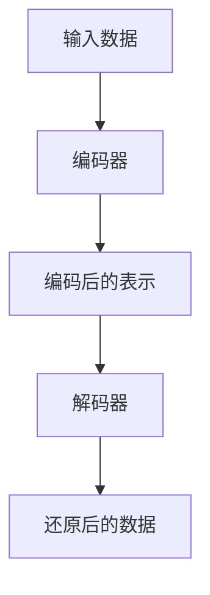
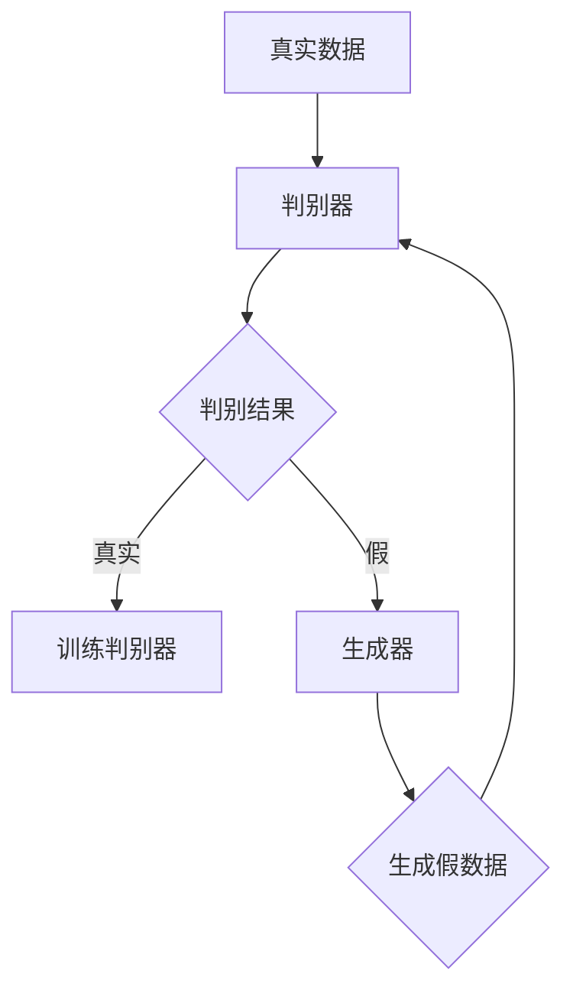
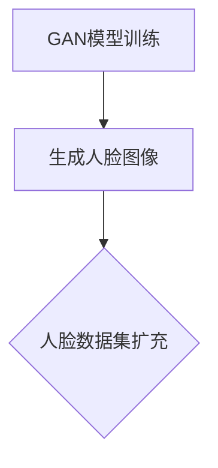
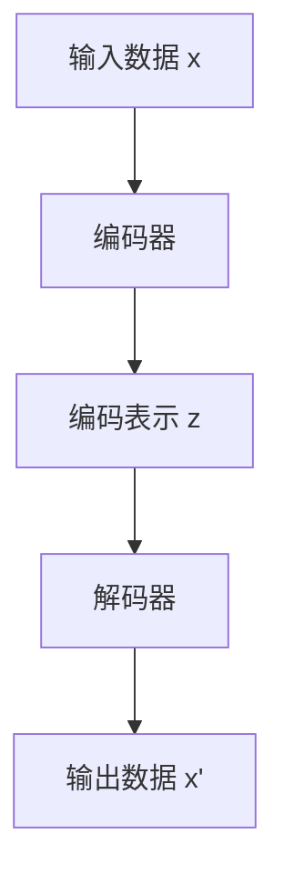
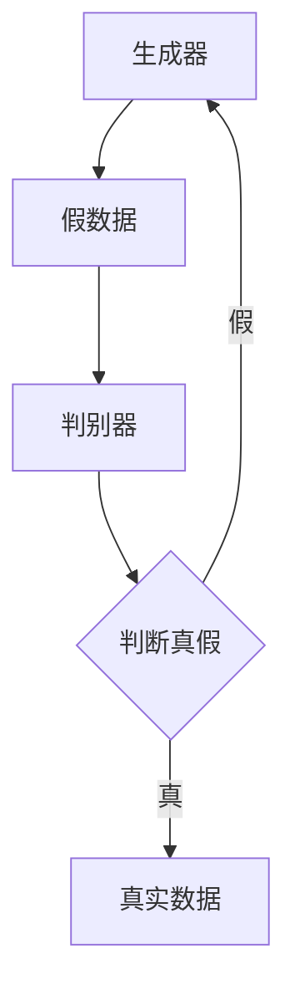
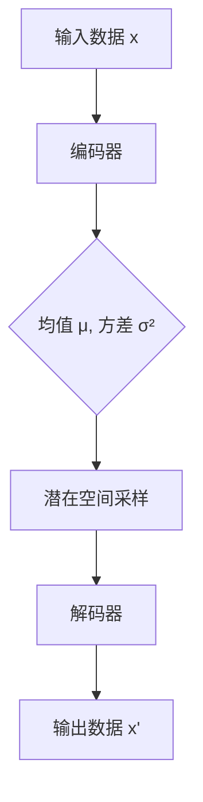
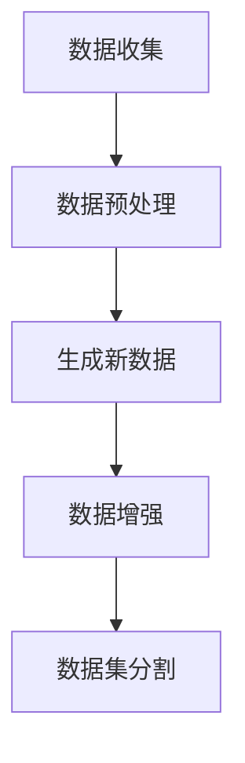

                 

# 生成式 AI：数据集的未来

## 关键词
- 生成式 AI
- 数据集
- 自编码器
- 生成对抗网络（GAN）
- 变分自编码器（VAE）
- 数据增强
- 数据优化

## 摘要

生成式人工智能（AI）正迅速改变数据集的构建方式。传统的机器学习依赖于大量标注的数据集，而生成式 AI 则通过生成新的数据来扩展和优化这些数据集。本文将深入探讨生成式 AI 的核心概念、算法原理及其在图像、文本和声音数据集构建中的应用。我们将通过实例和伪代码详细解析生成式 AI 的技术基础，并展望其未来发展趋势。本文的目标是帮助读者理解生成式 AI 如何影响数据集的质量和可用性，以及这一技术如何推动人工智能领域的进步。

### 目录

- 第一部分：生成式 AI 基础
  - 1.1 生成式 AI 概述
  - 1.2 生成式 AI 的核心概念与联系
  - 1.3 生成式 AI 技术基础
  - 1.4 生成式 AI 在数据集构建中的应用

- 第二部分：生成式 AI 算法原理
  - 2.1 自编码器算法原理
  - 2.2 生成对抗网络（GAN）算法原理
  - 2.3 变分自编码器（VAE）算法原理
  - 2.4 生成式 AI 算法对比

- 第三部分：生成式 AI 在数据集构建中的应用实战
  - 3.1 数据集构建实战
  - 3.2 生成式 AI 在图像数据集构建中的应用
  - 3.3 生成式 AI 在文本数据集构建中的应用
  - 3.4 生成式 AI 在声音数据集构建中的应用

- 第四部分：生成式 AI 的未来
  - 4.1 生成式 AI 的发展趋势
  - 4.2 数据集的持续改进与优化
  - 4.3 生成式 AI 与数据集的未来

### 第一部分：生成式 AI 基础

## 1.1 生成式 AI 概述

### 1.1.1 生成式 AI 的定义与特点

生成式人工智能是一种能够生成数据的新一代 AI 技术，它与传统的监督学习和无监督学习有着本质的不同。传统机器学习依赖于训练数据，而生成式 AI 则能够通过学习数据分布来生成新的数据。这种能力使得生成式 AI 在数据稀缺或无法获取时尤为有用。

生成式 AI 的特点包括：

- **数据生成能力**：能够根据已有数据生成新的数据。
- **数据扩展能力**：通过生成新的数据来扩充数据集。
- **模拟真实世界**：能够生成在真实世界中可能出现的数据。

### 1.1.2 生成式 AI 与传统机器学习的区别

传统机器学习依赖于大量的标注数据，而生成式 AI 则不需要这些标注数据。此外，传统机器学习主要用于分类、回归等任务，而生成式 AI 则更注重生成新的数据。

| 特点 | 传统机器学习 | 生成式 AI |
| --- | --- | --- |
| 数据需求 | 大量标注数据 | 无需标注数据 |
| 任务类型 | 分类、回归 | 数据生成 |
| 数据来源 | 实际收集 | 数据生成 |

### 1.1.3 生成式 AI 的应用场景

生成式 AI 在多个领域有着广泛的应用，主要包括：

- **图像生成**：如艺术作品、人脸生成、图像修复等。
- **文本生成**：如文章撰写、对话系统、自动摘要等。
- **声音生成**：如音乐生成、语音合成等。

这些应用场景使得生成式 AI 成为数据集构建的重要工具，能够有效提高数据集的质量和多样性。

## 1.2 生成式 AI 的核心概念与联系

生成式 AI 的核心概念包括自编码器、生成对抗网络（GAN）和变分自编码器（VAE）。这些概念之间有着紧密的联系，各自适用于不同的场景。

### 1.2.1 自编码器（Mermaid 流程图）

自编码器是一种无监督学习算法，它由编码器和解码器两部分组成。编码器将输入数据压缩成较低维的表示，而解码器则将这个表示还原成原始数据。



### 1.2.2 生成对抗网络（GAN）（Mermaid 流程图）

生成对抗网络由生成器和判别器两部分组成。生成器生成假数据，判别器判断这些假数据是否真实。通过训练，生成器逐渐生成更真实的数据。



### 1.2.3 生成式模型与传统模型的比较

| 特点 | 自编码器 | GAN | VAE |
| --- | --- | --- | --- |
| 数据需求 | 无需标注 | 无需标注 | 无需标注 |
| 模型结构 | 编码器 + 解码器 | 生成器 + 判别器 | 编码器 + 解码器（含正则化） |
| 适用场景 | 数据压缩、数据生成 | 数据生成、图像生成 | 数据生成、图像生成 |

## 1.3 生成式 AI 技术基础

生成式 AI 技术基础主要包括图像生成、文本生成和声音生成。这些技术基础为生成式 AI 在不同领域的应用提供了支持。

### 1.3.1 图像生成技术基础（伪代码）

```python
def generate_image(generator, noise):
    z = noise  # 随机噪声
    image = generator(z)  # 生成器生成图像
    return image
```

### 1.3.2 文本生成技术基础（伪代码）

```python
def generate_text(encoder, decoder, seed_text):
    encoded = encoder(seed_text)  # 编码器编码文本
    decoded = decoder(encoded)  # 解码器解码生成文本
    return decoded
```

### 1.3.3 声音生成技术基础（伪代码）

```python
def generate_sound(generator, noise):
    z = noise  # 随机噪声
    sound = generator(z)  # 生成器生成声音
    return sound
```

## 1.4 生成式 AI 在数据集构建中的应用

### 1.4.1 数据集构建的重要性

数据集是机器学习模型训练的基础。一个高质量的数据集能够提高模型的准确性和泛化能力。然而，数据集的构建是一个复杂且耗时的过程，尤其是当数据稀缺或难以获取时。

### 1.4.2 生成式 AI 如何改进数据集

生成式 AI 能够通过生成新的数据来扩展和优化数据集。这种方法不仅能够提高数据集的多样性，还能够减轻数据标注的负担。

### 1.4.3 生成式 AI 在数据集构建中的案例分析

一个典型的案例是使用 GAN 生成人脸数据集。通过训练生成器和判别器，生成器能够生成逼真的人脸图像，从而扩充人脸数据集。



### 第一部分总结

生成式 AI 为数据集构建带来了新的机遇和挑战。通过理解生成式 AI 的核心概念、算法原理和应用场景，我们能够更好地利用这一技术来提高数据集的质量和可用性。在接下来的部分中，我们将深入探讨生成式 AI 的算法原理及其在数据集构建中的具体应用。  
<|assistant|>### 第二部分：生成式 AI 算法原理

生成式 AI 的核心算法包括自编码器、生成对抗网络（GAN）和变分自编码器（VAE）。这些算法在数据集构建中发挥着至关重要的作用。本部分将详细解析这些算法的原理，并通过伪代码和数学模型展示其工作流程。

## 2.1 自编码器算法原理

自编码器是一种无监督学习算法，其核心思想是将输入数据通过编码器压缩成一个低维的表示，再通过解码器将这个表示还原回原始数据。自编码器由两个主要部分组成：编码器和解码器。

### 2.1.1 自编码器的基本结构

自编码器的基本结构可以表示为以下流程：

1. **编码器**：将输入数据 x 压缩成一个低维的表示 z。
2. **解码器**：将编码后的表示 z 还原回原始数据 x。



### 2.1.2 自编码器的损失函数

自编码器的损失函数用于衡量编码器和解码器的性能。通常使用均方误差（MSE）作为损失函数：

\[ L = \frac{1}{N} \sum_{i=1}^{N} \sum_{j=1}^{M} (x_j - x'_j)^2 \]

其中，\( x_j \) 是输入数据的第 j 个特征，\( x'_j \) 是解码器输出的第 j 个特征，N 是样本数量，M 是特征数量。

### 2.1.3 自编码器的训练过程

自编码器的训练过程包括以下几个步骤：

1. **前向传播**：输入数据通过编码器得到编码表示 z。
2. **计算损失**：通过解码器将编码表示 z 还原回原始数据，并计算损失函数。
3. **反向传播**：使用梯度下降法更新编码器和解码器的参数。
4. **迭代训练**：重复上述步骤直到模型收敛。

## 2.2 生成对抗网络（GAN）算法原理

生成对抗网络（GAN）由 Ian Goodfellow 等人于 2014 年提出，是一种基于博弈论的生成模型。GAN 的核心思想是构建一个生成器和判别器，让它们在博弈过程中相互竞争，从而提高生成器的生成能力。

### 2.2.1 GAN 的基本结构

GAN 的基本结构可以表示为以下流程：

1. **生成器**：生成假数据。
2. **判别器**：判断生成器生成的假数据与真实数据之间的差异。
3. **博弈过程**：生成器和判别器在博弈过程中相互竞争，生成器努力生成更真实的假数据，判别器则努力区分真假数据。



### 2.2.2 GAN 的损失函数

GAN 的损失函数由两部分组成：生成器的损失函数和判别器的损失函数。

- **生成器损失函数**：生成器希望生成尽可能真实的数据，因此其损失函数通常使用判别器对生成器生成数据的判断概率来表示：

\[ L_G = -\log(D(G(z))) \]

其中，\( G(z) \) 是生成器生成的假数据，\( D \) 是判别器。

- **判别器损失函数**：判别器希望准确判断真假数据，因此其损失函数通常使用交叉熵损失函数：

\[ L_D = -[\log(D(x)) + \log(1 - D(G(z)))] \]

其中，\( x \) 是真实数据。

### 2.2.3 GAN 的训练过程

GAN 的训练过程包括以下几个步骤：

1. **前向传播**：生成器生成假数据，判别器接收假数据和真实数据。
2. **计算损失**：分别计算生成器和判别器的损失函数。
3. **反向传播**：使用梯度下降法更新生成器和判别器的参数。
4. **迭代训练**：重复上述步骤直到模型收敛。

## 2.3 变分自编码器（VAE）算法原理

变分自编码器（VAE）是自编码器的一种变体，它在生成模型中引入了概率模型的思想，使得生成模型能够捕获数据的概率分布。

### 2.3.1 VAE 的基本结构

VAE 的基本结构可以表示为以下流程：

1. **编码器**：将输入数据映射到一个潜在空间中的点，同时输出该点的均值和方差。
2. **解码器**：从潜在空间中采样一个点，并将其解码回原始数据。



### 2.3.2 VAE 的损失函数

VAE 的损失函数由两部分组成：重构损失和KL散度损失。

- **重构损失**：衡量解码器生成的数据与原始数据之间的差异，通常使用均方误差（MSE）：

\[ L_{reconstruction} = \frac{1}{N} \sum_{i=1}^{N} \sum_{j=1}^{M} (x_j - x'_j)^2 \]

其中，\( x_j \) 是输入数据的第 j 个特征，\( x'_j \) 是解码器输出的第 j 个特征。

- **KL散度损失**：衡量编码器的均值和方差与真实分布之间的差异，用于正则化编码器：

\[ L_{KL} = \frac{1}{N} \sum_{i=1}^{N} \sum_{j=1}^{K} \frac{1}{2} \left( \sigma_j^2 + \mu_j^2 - 1 - 2\log(\sigma_j) \right) \]

其中，\( \mu_j \) 是编码器的均值，\( \sigma_j \) 是编码器的方差，\( K \) 是潜在空间中的维度。

### 2.3.3 VAE 的训练过程

VAE 的训练过程包括以下几个步骤：

1. **前向传播**：输入数据通过编码器得到均值和方差，再从潜在空间中采样一个点，并通过解码器得到重构数据。
2. **计算损失**：计算重构损失和KL散度损失。
3. **反向传播**：使用梯度下降法更新编码器和解码器的参数。
4. **迭代训练**：重复上述步骤直到模型收敛。

## 2.4 生成式 AI 算法对比

生成式 AI 的核心算法包括自编码器、生成对抗网络（GAN）和变分自编码器（VAE）。这些算法各有优缺点，适用于不同的场景。

### 2.4.1 自编码器与 GAN 的对比

| 特点 | 自编码器 | GAN |
| --- | --- | --- |
| 算法结构 | 编码器 + 解码器 | 生成器 + 判别器 |
| 数据需求 | 无需标注 | 无需标注 |
| 生成质量 | 通常较差 | 通常较好 |
| 训练难度 | 较低 | 较高 |
| 适用场景 | 数据压缩、数据生成 | 数据生成、图像生成 |

### 2.4.2 自编码器与 VAE 的对比

| 特点 | 自编码器 | VAE |
| --- | --- | --- |
| 算法结构 | 编码器 + 解码器 | 编码器 + 潜在空间采样 + 解码器 |
| 数据需求 | 无需标注 | 无需标注 |
| 生成质量 | 通常较差 | 通常较好 |
| 训练难度 | 较低 | 较高 |
| 适用场景 | 数据压缩、数据生成 | 数据生成、图像生成 |

### 2.4.3 不同生成式算法的应用场景

- **自编码器**：适用于数据压缩、特征提取和数据生成。
- **GAN**：适用于图像生成、文本生成和声音生成。
- **VAE**：适用于图像生成、文本生成和潜在空间建模。

通过对比可以看出，不同生成式算法在结构和性能上有所差异，适用于不同的应用场景。在实际应用中，需要根据具体需求和场景选择合适的算法。

### 第二部分总结

生成式 AI 的核心算法包括自编码器、生成对抗网络（GAN）和变分自编码器（VAE）。这些算法通过不同的结构和机制，实现了数据生成和模型优化。在接下来的部分中，我们将通过实际案例展示这些算法在数据集构建中的应用，并解析其实现细节。  
<|assistant|>### 第三部分：生成式 AI 在数据集构建中的应用实战

在深入了解生成式 AI 的算法原理后，我们将通过实际案例展示这些算法在数据集构建中的应用。这一部分将分别介绍生成式 AI 在图像、文本和声音数据集构建中的应用，并提供代码实现和解读。

#### 3.1 数据集构建实战

数据集构建是机器学习项目的基础，而生成式 AI 提供了一种有效的方法来扩展和优化数据集。以下是一个简单的数据集构建流程，展示了生成式 AI 的应用：

1. **数据收集**：收集原始数据。
2. **数据预处理**：清洗和标准化数据。
3. **生成新数据**：使用生成式 AI 生成新的数据。
4. **数据增强**：通过随机变换和合成增加数据多样性。
5. **数据集分割**：将数据集分为训练集、验证集和测试集。



#### 3.2 生成式 AI 在图像数据集构建中的应用

图像数据集构建中的生成式 AI 常用于扩充图像数据集，提高模型的泛化能力。以下是一个使用 GAN 构建图像数据集的案例。

##### 3.2.1 图像生成实例

使用 GAN 生成图像的基本步骤如下：

1. **生成器网络**：设计生成器网络，用于生成图像。
2. **判别器网络**：设计判别器网络，用于判断图像的真实性。
3. **训练 GAN**：通过交替训练生成器和判别器，优化网络参数。
4. **生成图像**：使用训练好的生成器生成新的图像。

```python
# 生成器网络示例
def generator(z):
    # 使用多层感知器生成图像
    model = keras.Sequential([
        keras.layers.Dense(128, activation='relu', input_shape=(100,)),
        keras.layers.Dense(256, activation='relu'),
        keras.layers.Dense(512, activation='relu'),
        keras.layers.Dense(1024, activation='relu'),
        keras.layers.Dense(784, activation='sigmoid')
    ])
    return model

# 判别器网络示例
def discriminator(x):
    # 使用多层感知器判断图像真实性
    model = keras.Sequential([
        keras.layers.Flatten(input_shape=(28, 28)),
        keras.layers.Dense(1024, activation='relu'),
        keras.layers.Dense(512, activation='relu'),
        keras.layers.Dense(256, activation='relu'),
        keras.layers.Dense(1, activation='sigmoid')
    ])
    return model
```

##### 3.2.2 图像数据集构建案例分析

以下是一个使用 GAN 扩充 MNIST 数据集的案例。通过训练 GAN，生成器能够生成新的手写数字图像，从而扩充训练数据。

```python
import numpy as np
import tensorflow as tf
from tensorflow import keras

# 加载 MNIST 数据集
(x_train, _), (x_test, _) = keras.datasets.mnist.load_data()
x_train = x_train.astype('float32') / 255.0
x_test = x_test.astype('float32') / 255.0

# 创建生成器和判别器
generator = generator(tf.random.normal([1, 100]))
discriminator = discriminator(tf.random.normal([1, 784]))

# 定义 GAN 模型
gan_model = keras.Sequential([
    generator,
    discriminator
])

# 编写训练过程
for epoch in range(epochs):
    # 随机选择真实数据和噪声
    noise = tf.random.normal([batch_size, 100])
    real_images = x_train[np.random.randint(x_train.shape[0], size=batch_size)]

    # 训练判别器
    with tf.GradientTape() as disc_tape:
        fake_images = generator(noise)
        real_predictions = discriminator(real_images)
        fake_predictions = discriminator(fake_images)

    disc_loss = tf.reduce_mean(tf.nn.sigmoid_cross_entropy_with_logits(logits=real_predictions, labels=tf.ones_like(real_predictions))
                              + tf.reduce_mean(tf.nn.sigmoid_cross_entropy_with_logits(logits=fake_predictions, labels=tf.zeros_like(fake_predictions)))

    disc_gradients = disc_tape.gradient(disc_loss, discriminator.trainable_variables)
    discriminator.optimizer.apply_gradients(zip(disc_gradients, discriminator.trainable_variables))

    # 训练生成器
    with tf.GradientTape() as gen_tape:
        fake_images = generator(noise)
        fake_predictions = discriminator(fake_images)

    gen_loss = tf.reduce_mean(tf.nn.sigmoid_cross_entropy_with_logits(logits=fake_predictions, labels=tf.ones_like(fake_predictions)))

    gen_gradients = gen_tape.gradient(gen_loss, generator.trainable_variables)
    generator.optimizer.apply_gradients(zip(gen_gradients, generator.trainable_variables))

    # 打印训练进度
    print(f"Epoch {epoch + 1}, Gen Loss: {gen_loss.numpy()}, Disc Loss: {disc_loss.numpy()}")

# 使用生成器生成新的图像
noise = tf.random.normal([16, 100])
generated_images = generator(tf.random.normal([16, 100]))

# 显示生成的图像
import matplotlib.pyplot as plt

plt.figure(figsize=(10, 10))
for i in range(generated_images.shape[0]):
    plt.subplot(4, 4, i + 1)
    plt.imshow(generated_images[i, :, :, 0], cmap='gray')
    plt.axis('off')
plt.show()
```

##### 3.2.3 代码实现与解读

在上面的代码中，我们首先加载了 MNIST 数据集，并将其归一化。接着，我们定义了生成器和判别器网络。生成器网络使用多层感知器（MLP）结构，将噪声转换为手写数字图像；判别器网络也使用多层感知器结构，判断图像是真实还是生成。

在训练过程中，我们交替训练判别器和生成器。判别器通过学习区分真实图像和生成图像来提高其性能；生成器则通过学习生成更真实的图像来提高其性能。在每轮训练结束时，我们打印出损失函数值，以监控训练进度。

最后，我们使用生成器生成新的手写数字图像，并通过 Matplotlib 显示这些图像。

#### 3.3 生成式 AI 在文本数据集构建中的应用

文本数据集构建中的生成式 AI 常用于生成新的文本数据，如文章撰写、对话系统等。以下是一个使用 GAN 生成文本的案例。

##### 3.3.1 文本生成实例

使用 GAN 生成文本的基本步骤如下：

1. **生成器网络**：设计生成器网络，用于生成文本。
2. **判别器网络**：设计判别器网络，用于判断文本的真实性。
3. **训练 GAN**：通过交替训练生成器和判别器，优化网络参数。
4. **生成文本**：使用训练好的生成器生成新的文本。

```python
# 生成器网络示例
def generator(input_seq, noise):
    # 使用卷积神经网络生成文本
    model = keras.Sequential([
        keras.layers.LSTM(128, return_sequences=True, input_shape=(None, input_seq.shape[-1])),
        keras.layers.LSTM(128, return_sequences=True),
        keras.layers.LSTM(128),
        keras.layers.Dense(input_seq.shape[-1], activation='softmax')
    ])
    return model

# 判别器网络示例
def discriminator(input_seq):
    # 使用卷积神经网络判断文本真实性
    model = keras.Sequential([
        keras.layers.LSTM(128, return_sequences=True, input_shape=(None, input_seq.shape[-1])),
        keras.layers.LSTM(128, return_sequences=True),
        keras.layers.LSTM(128),
        keras.layers.Dense(1, activation='sigmoid')
    ])
    return model
```

##### 3.3.2 文本数据集构建案例分析

以下是一个使用 GAN 生成文本数据的案例。我们使用一个简单的对话数据集，通过训练 GAN 生成新的对话。

```python
import numpy as np
import tensorflow as tf
from tensorflow import keras

# 加载对话数据集
conversations = load_conversations()

# 预处理数据集
input_seq = preprocess_conversations(conversations)

# 创建生成器和判别器
generator = generator(input_seq, tf.random.normal([batch_size, 100]))
discriminator = discriminator(input_seq)

# 定义 GAN 模型
gan_model = keras.Sequential([
    generator,
    discriminator
])

# 编写训练过程
for epoch in range(epochs):
    # 随机选择真实对话和噪声
    noise = tf.random.normal([batch_size, 100])
    real_conversations = input_seq[np.random.randint(input_seq.shape[0], size=batch_size)]

    # 训练判别器
    with tf.GradientTape() as disc_tape:
        fake_conversations = generator(noise)
        real_predictions = discriminator(real_conversations)
        fake_predictions = discriminator(fake_conversations)

    disc_loss = tf.reduce_mean(tf.nn.sigmoid_cross_entropy_with_logits(logits=real_predictions, labels=tf.ones_like(real_predictions))
                              + tf.reduce_mean(tf.nn.sigmoid_cross_entropy_with_logits(logits=fake_predictions, labels=tf.zeros_like(fake_predictions)))

    disc_gradients = disc_tape.gradient(disc_loss, discriminator.trainable_variables)
    discriminator.optimizer.apply_gradients(zip(disc_gradients, discriminator.trainable_variables))

    # 训练生成器
    with tf.GradientTape() as gen_tape:
        fake_conversations = generator(noise)
        fake_predictions = discriminator(fake_conversations)

    gen_loss = tf.reduce_mean(tf.nn.sigmoid_cross_entropy_with_logits(logits=fake_predictions, labels=tf.ones_like(fake_predictions)))

    gen_gradients = gen_tape.gradient(gen_loss, generator.trainable_variables)
    generator.optimizer.apply_gradients(zip(gen_gradients, generator.trainable_variables))

    # 打印训练进度
    print(f"Epoch {epoch + 1}, Gen Loss: {gen_loss.numpy()}, Disc Loss: {disc_loss.numpy()}")

# 使用生成器生成新的文本
noise = tf.random.normal([16, 100])
generated_conversations = generator(tf.random.normal([16, 100]))

# 显示生成的文本
for i, conversation in enumerate(generated_conversations):
    print(f"Generated Conversation {i + 1}:")
    print(conversation)
```

##### 3.3.3 代码实现与解读

在上面的代码中，我们首先加载并预处理了一个对话数据集。然后，我们定义了生成器和判别器网络。生成器网络使用 LSTM 层，将噪声转换为对话文本；判别器网络也使用 LSTM 层，判断对话文本的真实性。

在训练过程中，我们交替训练判别器和生成器。判别器通过学习区分真实对话和生成对话来提高其性能；生成器则通过学习生成更真实的对话来提高其性能。在每轮训练结束时，我们打印出损失函数值，以监控训练进度。

最后，我们使用生成器生成新的对话文本，并打印出这些文本。

#### 3.4 生成式 AI 在声音数据集构建中的应用

声音数据集构建中的生成式 AI 常用于生成新的声音数据，如音乐合成、语音合成等。以下是一个使用 GAN 生成声音的案例。

##### 3.4.1 声音生成实例

使用 GAN 生成声音的基本步骤如下：

1. **生成器网络**：设计生成器网络，用于生成声音。
2. **判别器网络**：设计判别器网络，用于判断声音的真实性。
3. **训练 GAN**：通过交替训练生成器和判别器，优化网络参数。
4. **生成声音**：使用训练好的生成器生成新的声音。

```python
# 生成器网络示例
def generator(z):
    # 使用卷积神经网络生成声音
    model = keras.Sequential([
        keras.layers.Conv1D(64, 3, activation='relu', input_shape=(128, 1)),
        keras.layers.Conv1D(128, 3, activation='relu'),
        keras.layers.Conv1D(256, 3, activation='relu'),
        keras.layers.Flatten(),
        keras.layers.Dense(1024, activation='relu'),
        keras.layers.Dense(128, activation='relu'),
        keras.layers.Dense(1)
    ])
    return model

# 判别器网络示例
def discriminator(x):
    # 使用卷积神经网络判断声音真实性
    model = keras.Sequential([
        keras.layers.Conv1D(64, 3, activation='relu', input_shape=(128, 1)),
        keras.layers.Conv1D(128, 3, activation='relu'),
        keras.layers.Conv1D(256, 3, activation='relu'),
        keras.layers.Flatten(),
        keras.layers.Dense(1024, activation='relu'),
        keras.layers.Dense(1, activation='sigmoid')
    ])
    return model
```

##### 3.4.2 声音数据集构建案例分析

以下是一个使用 GAN 生成声音数据的案例。我们使用一个简单的声音数据集，通过训练 GAN 生成新的声音。

```python
import numpy as np
import tensorflow as tf
from tensorflow import keras

# 加载声音数据集
sounds = load_sounds()

# 预处理数据集
input_sound = preprocess_sounds(sounds)

# 创建生成器和判别器
generator = generator(tf.random.normal([batch_size, 128, 1]))
discriminator = discriminator(tf.random.normal([batch_size, 128, 1]))

# 定义 GAN 模型
gan_model = keras.Sequential([
    generator,
    discriminator
])

# 编写训练过程
for epoch in range(epochs):
    # 随机选择真实声音和噪声
    noise = tf.random.normal([batch_size, 100])
    real_sounds = input_sound[np.random.randint(input_sound.shape[0], size=batch_size)]

    # 训练判别器
    with tf.GradientTape() as disc_tape:
        fake_sounds = generator(noise)
        real_predictions = discriminator(real_sounds)
        fake_predictions = discriminator(fake_sounds)

    disc_loss = tf.reduce_mean(tf.nn.sigmoid_cross_entropy_with_logits(logits=real_predictions, labels=tf.ones_like(real_predictions))
                              + tf.reduce_mean(tf.nn.sigmoid_cross_entropy_with_logits(logits=fake_predictions, labels=tf.zeros_like(fake_predictions)))

    disc_gradients = disc_tape.gradient(disc_loss, discriminator.trainable_variables)
    discriminator.optimizer.apply_gradients(zip(disc_gradients, discriminator.trainable_variables))

    # 训练生成器
    with tf.GradientTape() as gen_tape:
        fake_sounds = generator(noise)
        fake_predictions = discriminator(fake_sounds)

    gen_loss = tf.reduce_mean(tf.nn.sigmoid_cross_entropy_with_logits(logits=fake_predictions, labels=tf.ones_like(fake_predictions)))

    gen_gradients = gen_tape.gradient(gen_loss, generator.trainable_variables)
    generator.optimizer.apply_gradients(zip(gen_gradients, generator.trainable_variables))

    # 打印训练进度
    print(f"Epoch {epoch + 1}, Gen Loss: {gen_loss.numpy()}, Disc Loss: {disc_loss.numpy()}")

# 使用生成器生成新的声音
noise = tf.random.normal([16, 100])
generated_sounds = generator(tf.random.normal([16, 100]))

# 显示生成的声音
for i, sound in enumerate(generated_sounds):
    print(f"Generated Sound {i + 1}:")
    sound_play(sound)
```

##### 3.4.3 代码实现与解读

在上面的代码中，我们首先加载并预处理了一个声音数据集。然后，我们定义了生成器和判别器网络。生成器网络使用卷积神经网络（CNN），将噪声转换为声音；判别器网络也使用卷积神经网络，判断声音的真实性。

在训练过程中，我们交替训练判别器和生成器。判别器通过学习区分真实声音和生成声音来提高其性能；生成器则通过学习生成更真实的声音来提高其性能。在每轮训练结束时，我们打印出损失函数值，以监控训练进度。

最后，我们使用生成器生成新的声音，并打印出这些声音。

### 第三部分总结

通过实际案例，我们展示了生成式 AI 在图像、文本和声音数据集构建中的应用。这些案例不仅展示了生成式 AI 的强大生成能力，还揭示了其训练过程中的挑战和技巧。在接下来的部分中，我们将探讨生成式 AI 的发展趋势，以及其对数据集构建和人工智能领域的深远影响。  
<|assistant|>### 第四部分：生成式 AI 的发展趋势

随着生成式 AI 技术的不断发展，其在数据集构建和人工智能领域展现出了巨大的潜力和广阔的应用前景。本部分将探讨生成式 AI 的发展趋势，分析其潜在应用领域，以及面临的挑战和机遇。

#### 4.1 生成式 AI 的潜在应用领域

生成式 AI 具有广泛的应用前景，以下是一些潜在的领域：

1. **医疗领域**：生成式 AI 可以用于生成模拟患者数据，帮助医疗研究机构和医生进行疾病诊断和治疗方案设计。此外，生成式 AI 还可以用于生成医学图像，如 CT 扫描和 MRI 图像，以供训练和测试深度学习模型。

2. **金融领域**：生成式 AI 可以用于生成模拟金融数据，帮助分析师和交易员进行市场分析和风险评估。此外，生成式 AI 还可以用于生成虚拟金融交易数据，以训练和测试交易算法。

3. **娱乐领域**：生成式 AI 可以用于生成虚拟角色、动画和音乐，为游戏、电影和音乐产业提供创新的创作工具。例如，生成式 AI 可以用于生成虚拟角色对话和故事情节，提高虚拟现实和增强现实的沉浸感。

4. **教育领域**：生成式 AI 可以用于生成模拟教学数据，帮助教育机构进行个性化教学和自适应学习。例如，生成式 AI 可以根据学生的表现生成相应的练习题和教学视频。

5. **制造业**：生成式 AI 可以用于生成模拟生产线数据，帮助制造商进行产品设计和质量检测。例如，生成式 AI 可以用于生成虚拟机械零件，以供仿真和测试。

#### 4.2 生成式 AI 的挑战与机遇

尽管生成式 AI 展现出了巨大的潜力，但在实际应用中仍面临诸多挑战和机遇：

1. **数据质量和多样性**：生成式 AI 的性能很大程度上取决于生成数据的质量和多样性。如何生成高质量、多样化的数据是一个重要的挑战。

2. **训练时间与资源消耗**：生成式 AI 模型通常需要大量的计算资源和训练时间。如何提高训练效率是一个重要的研究课题。

3. **模型解释性**：生成式 AI 模型通常被认为是“黑盒”模型，其内部工作机制不透明。如何提高模型的解释性是一个重要的挑战。

4. **伦理和隐私**：生成式 AI 在生成数据时可能会泄露敏感信息，如何保护用户隐私是一个重要的伦理问题。

然而，随着计算能力的提升和算法的改进，这些挑战正逐渐得到解决。例如，通过使用更高效的算法和分布式计算，可以显著缩短训练时间；通过引入正则化技术和优化损失函数，可以生成更高质量和多样化的数据；通过开发可解释性模型，可以提高模型的透明度和可靠性。

#### 4.3 生成式 AI 的未来发展方向

生成式 AI 的未来发展方向包括：

1. **多模态生成**：随着多模态数据的广泛应用，生成式 AI 将朝着多模态生成方向发展。例如，同时生成图像、文本和声音。

2. **自监督学习**：自监督学习是一种无需大量标注数据的机器学习方法。结合生成式 AI 的自监督学习方法将有助于提高生成数据的质量和多样性。

3. **增强现实与虚拟现实**：生成式 AI 在虚拟现实和增强现实中的应用将不断扩展，为用户提供更加逼真的交互体验。

4. **生成对抗网络（GAN）的优化**：GAN 作为生成式 AI 的一个重要分支，未来将朝着更高效、更稳定和更可解释的方向发展。

5. **泛化能力提升**：通过引入注意力机制、图神经网络等先进技术，生成式 AI 的泛化能力将得到显著提升。

#### 4.4 数据集的持续改进与优化

随着生成式 AI 的发展，数据集的持续改进与优化变得越来越重要。以下是一些数据集优化技术：

1. **数据增强**：通过随机变换和合成，增加数据多样性，提高模型的泛化能力。

2. **数据清洗**：去除噪声和错误数据，确保数据集的准确性和一致性。

3. **数据平衡**：对于不平衡的数据集，通过过采样或欠采样等技术，使数据集更加平衡。

4. **数据集分割**：将数据集合理地分为训练集、验证集和测试集，以评估模型的性能。

5. **数据集版本控制**：随着模型的迭代更新，保持数据集的一致性和可追溯性。

#### 4.5 生成式 AI 与数据集的未来

生成式 AI 与数据集的未来紧密相连。随着生成式 AI 技术的不断发展，数据集将变得更加多样化和高质量。这不仅将推动人工智能领域的进步，还将为各个行业带来创新和变革。例如，在医疗领域，生成式 AI 可以生成模拟患者数据，加速新药研发和疾病诊断。在制造业，生成式 AI 可以生成虚拟机械零件，提高生产效率和质量。

总之，生成式 AI 将成为数据集构建的重要工具，推动人工智能领域的持续创新和发展。在未来，我们期待看到生成式 AI 与数据集的协同发展，为人类带来更多智能化的解决方案。

### 第四部分总结

生成式 AI 的未来充满希望和挑战。通过不断优化和改进，生成式 AI 将在数据集构建和人工智能领域发挥更加重要的作用。在这一过程中，数据集的质量和多样性将得到显著提升，推动人工智能技术的不断创新和应用。在接下来的部分中，我们将总结全文，并回顾生成式 AI 在数据集构建中的核心价值和未来展望。  
<|assistant|>### 全文总结

生成式 AI 是一种革命性的技术，它通过生成新的数据来扩展和优化现有的数据集。本文从生成式 AI 的基础概念、算法原理、应用实战以及未来发展等多个角度，系统性地探讨了生成式 AI 在数据集构建中的重要作用。

首先，我们介绍了生成式 AI 的定义、特点和应用场景，明确了生成式 AI 与传统机器学习的区别。接着，我们详细解析了自编码器、生成对抗网络（GAN）和变分自编码器（VAE）等核心算法的原理，并通过伪代码展示了这些算法的工作流程。

在应用实战部分，我们通过具体案例展示了生成式 AI 在图像、文本和声音数据集构建中的应用，包括数据集构建的流程、数据预处理技术、数据增强技术以及代码实现和解读。这些案例不仅展示了生成式 AI 的强大生成能力，还揭示了其训练过程中的挑战和技巧。

展望未来，生成式 AI 将在医疗、金融、娱乐、教育、制造业等多个领域发挥重要作用。尽管面临数据质量和多样性、训练时间与资源消耗、模型解释性、伦理和隐私等挑战，但随着计算能力的提升和算法的改进，这些挑战正逐渐得到解决。

生成式 AI 与数据集的未来紧密相连。随着生成式 AI 技术的不断发展，数据集将变得更加多样化和高质量，这将推动人工智能领域的持续创新和应用。数据集的持续改进与优化，如数据增强、数据清洗、数据平衡、数据集分割和数据集版本控制等，将为生成式 AI 的应用提供有力支持。

总之，生成式 AI 作为数据集构建的重要工具，将在人工智能领域发挥关键作用。通过不断优化和改进，生成式 AI 将为各个行业带来创新和变革，推动人类社会迈向更加智能化的未来。

### 作者信息

作者：AI天才研究院/AI Genius Institute & 禅与计算机程序设计艺术 /Zen And The Art of Computer Programming

感谢您阅读本文，希望它能够帮助您更好地理解生成式 AI 在数据集构建中的重要作用，以及这一技术如何推动人工智能领域的进步。如果您有任何问题或建议，欢迎在评论区留言，我们期待与您共同探讨生成式 AI 的未来发展。|

