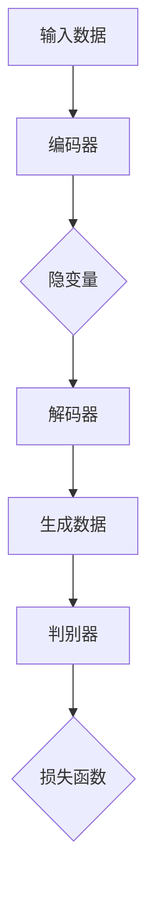
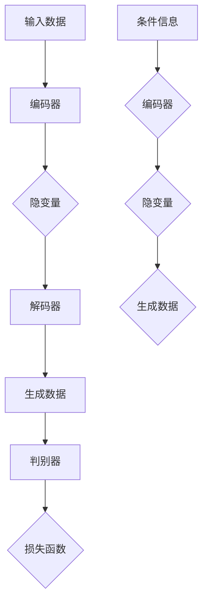
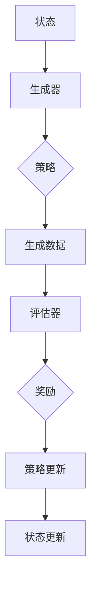

                 


### 生成式AIGC：未来商业的颠覆者

> 关键词：生成式AI、AIGC、商业颠覆、技术应用、未来展望

> 摘要：本文深入探讨生成式人工智能（AIGC）的概念、技术体系及其在商业领域的应用，分析AIGC如何通过文本、图像、音频生成技术颠覆传统行业，带来新兴产业的机遇，并探讨其安全与伦理问题。通过实际案例和未来展望，阐述AIGC在数字化转型中的关键作用。

## 前言

在科技飞速发展的今天，人工智能（AI）已经成为推动社会进步的重要力量。从自动化生产线到智能客服，AI正在改变我们的生活方式。然而，生成式人工智能（AIGC，Generative AI and Generative Content）的出现，无疑将开启一个新的时代，它不仅能够自动生成文本、图像、音频等多种类型的内容，还能够模拟人类创造的过程，为商业领域带来前所未有的变革。

AIGC，作为一种新兴的人工智能技术，通过深度学习和生成模型，实现了对大规模数据的自主理解和生成。它不仅能够提升内容创作的效率，还能够降低内容生成的成本。因此，AIGC被誉为未来商业的颠覆者，其在商业领域的应用前景广阔。

本文将从以下几个方面展开讨论：

1. **AIGC概述**：介绍生成式AI与AIGC的基础概念，回顾其发展历程，并展望其未来趋势。
2. **AIGC技术体系**：详细讲解AIGC的技术原理，包括生成模型、条件生成模型和强化学习生成模型。
3. **AIGC应用案例分析**：通过具体案例展示AIGC在文本、图像、音频生成方面的应用。
4. **AIGC商业影响**：分析AIGC对传统行业和新兴产业的变革，以及企业在数字化转型中的路径。
5. **AIGC实战篇**：介绍AIGC项目设计与开发，以及具体实战项目案例解析。
6. **AIGC安全与伦理问题**：探讨AIGC在数据安全、隐私保护和伦理道德方面的挑战与对策。
7. **AIGC未来发展趋势**：展望AIGC的未来发展趋势，预测其行业应用前景，并讨论潜在挑战与机遇。

通过本文的讨论，希望读者能够对AIGC有一个全面而深入的了解，认识到其在未来商业中的重要地位。

### 第一部分：AIGC概述

#### 第1章：生成式AI与AIGC基础

##### 1.1 生成式AI的概念与原理

生成式人工智能（Generative AI）是人工智能的一种重要分支，其主要目标是通过对已有数据的分析和理解，生成新的、有价值的输出。与传统的判别式AI不同，生成式AI不仅能够识别和分类数据，还能够生成全新的数据。

生成式AI的核心是生成模型（Generative Models），这些模型通过学习大量数据，掌握数据的统计特征，从而能够生成与训练数据相似的新数据。常见的生成模型包括：

- **概率图模型**：如生成对抗网络（GAN，Generative Adversarial Networks）和变分自编码器（VAE，Variational Autoencoder）。
- **深度学习模型**：如深度信念网络（DBN，Deep Belief Network）和递归神经网络（RNN，Recurrent Neural Networks）。
- **强化学习模型**：结合了生成模型和强化学习的特点，如生成对抗强化学习（GARL，Generative Adversarial Reinforcement Learning）。

生成式AI的工作原理可以简单概括为以下步骤：

1. **数据学习**：生成模型通过学习大量已有数据，提取数据的统计特征和模式。
2. **数据生成**：利用提取到的特征和模式，生成新的、与训练数据相似的数据。
3. **评估与优化**：通过评估生成数据的相似度和质量，不断优化模型的参数，提高生成效果。

##### 1.2 AIGC的核心特征与应用

AIGC（Generative AI and Generative Content）是在生成式AI的基础上发展起来的一种技术，其主要特征包括：

- **内容生成**：AIGC能够生成多种类型的内容，如文本、图像、音频等。
- **自主创作**：AIGC通过深度学习，能够自主理解和生成内容，模拟人类的创作过程。
- **多样化输出**：AIGC能够生成大量多样化的内容，满足不同场景和需求。

AIGC在商业领域有着广泛的应用前景：

- **文本生成**：如自动写作、内容推荐、新闻生成等。
- **图像生成**：如图像修复、图像增强、图像生成等。
- **音频生成**：如音乐创作、语音合成、音频增强等。

具体应用案例包括：

1. **文本生成**：
   - **自动写作**：利用AIGC生成新闻报道、财经分析、学术论文等。
   - **内容推荐**：通过AIGC生成个性化推荐内容，提高用户满意度。
   - **新闻生成**：自动生成新闻文章，减少人工编辑成本。

2. **图像生成**：
   - **图像修复**：通过AIGC修复受损或老化的照片。
   - **图像增强**：利用AIGC增强图像的清晰度、对比度等。
   - **图像生成**：如生成虚假图片、艺术作品等。

3. **音频生成**：
   - **音乐创作**：利用AIGC生成新的音乐作品。
   - **语音合成**：通过AIGC生成逼真的语音输出。
   - **音频增强**：如去除噪音、增强音质等。

AIGC不仅能够提高内容创作的效率，降低成本，还能够拓展创意空间，为商业领域带来新的机遇和挑战。

#### 第2章：AIGC的发展历程与趋势

##### 2.1 AIGC的演进路径

AIGC的发展历程可以追溯到生成式AI的早期研究。早在20世纪90年代，生成式AI就已经开始引起关注。当时的代表性工作包括生成对抗网络（GAN）和变分自编码器（VAE）。这些模型奠定了AIGC的基础。

随着深度学习的兴起，生成式AI迎来了快速发展。深度学习模型如深度信念网络（DBN）和递归神经网络（RNN）在生成式AI中的应用，使得生成模型的效果和性能大幅提升。

近年来，随着计算能力的提升和大数据的普及，AIGC在各个领域的应用场景不断拓展。例如，在图像生成领域，AIGC技术已经实现了高分辨率的图像生成；在音频生成领域，AIGC技术可以生成逼真的语音和音乐。

AIGC的演进路径可以总结为：

1. **早期研究**：生成对抗网络（GAN）和变分自编码器（VAE）的提出。
2. **深度学习应用**：深度信念网络（DBN）和递归神经网络（RNN）的引入。
3. **高性能计算**：计算能力的提升和大数据的普及。
4. **多样化应用**：AIGC在图像、文本、音频等领域的广泛应用。

##### 2.2 AIGC在商业领域的应用前景

AIGC在商业领域具有广泛的应用前景，能够带来多方面的变革：

1. **提高生产效率**：AIGC能够自动生成大量的文本、图像、音频等内容，减少人工创作的时间和成本。
2. **降低创作成本**：AIGC可以通过大规模生成内容，降低内容创作的成本，特别是对于需要大量内容生成的场景，如广告、媒体等。
3. **提升用户体验**：通过AIGC生成个性化内容，能够提高用户的满意度和参与度。
4. **拓展创意空间**：AIGC能够生成新颖、独特的创意内容，为设计师、艺术家等提供更多的创作灵感。

具体应用前景包括：

1. **文本生成**：如自动写作、内容推荐、新闻生成等，可以应用于广告、媒体、教育等领域。
2. **图像生成**：如图像修复、图像增强、图像生成等，可以应用于摄影、艺术、设计等领域。
3. **音频生成**：如音乐创作、语音合成、音频增强等，可以应用于音乐、广播、影视等领域。

在未来，随着AIGC技术的不断成熟和应用场景的拓展，其在商业领域的应用将更加广泛和深入。AIGC有望成为推动商业创新的重要力量。

### 第二部分：AIGC技术体系

#### 第3章：AIGC技术体系

AIGC（Generative AI and Generative Content）的技术体系涵盖了多种生成模型，这些模型通过深度学习和强化学习等算法，实现了对数据的生成和处理。本章节将详细介绍AIGC的技术体系，包括生成模型原理、条件生成模型和强化学习生成模型。

##### 3.1 生成模型原理

生成模型是AIGC的核心组成部分，其主要目标是通过对已有数据的分析和学习，生成新的、有价值的输出。生成模型的基本原理可以概括为以下两个方面：

1. **数据学习**：生成模型通过学习大量的数据，提取数据的统计特征和分布。这些特征和分布构成了生成模型对数据的基本理解。
2. **数据生成**：利用提取到的特征和分布，生成新的数据。生成模型通过生成过程模拟数据的生成机制，从而生成与训练数据相似的新数据。

常见的生成模型包括：

1. **生成对抗网络（GAN）**
   - **结构**：GAN由生成器（Generator）和判别器（Discriminator）两个模型组成。生成器生成假数据，判别器判断生成数据和真实数据的相似度。
   - **目标**：生成器的目标是生成尽可能逼真的数据，使判别器无法区分生成数据和真实数据；判别器的目标是准确判断数据的真实性。
   - **训练过程**：生成器和判别器相互对抗，通过不断迭代优化，最终实现生成高质量的数据。

2. **变分自编码器（VAE）**
   - **结构**：VAE由编码器（Encoder）和解码器（Decoder）组成。编码器将输入数据编码成一个隐变量表示，解码器将隐变量解码回输入数据的分布。
   - **目标**：VAE的目标是学习数据的有效表示，并通过这个表示生成新的数据。
   - **训练过程**：VAE通过最大化数据分布的似然函数进行训练，通过编码器和解码器的联合优化，实现数据的生成。

生成模型在AIGC中的应用非常广泛，包括图像生成、文本生成、音频生成等。以下是一个简单的生成模型应用案例：



在这个案例中，输入数据通过编码器编码成隐变量，然后通过解码器生成新的数据。同时，生成数据通过判别器进行评估，以优化生成模型的生成效果。

##### 3.2 条件生成模型

条件生成模型（Conditional Generative Models）是在生成模型的基础上，引入条件信息，以生成更符合特定条件的数据。条件生成模型能够利用额外的输入信息，提高生成的质量和相关度。常见的条件生成模型包括：

1. **条件生成对抗网络（cGAN）**
   - **结构**：cGAN在GAN的基础上引入条件信息，生成器和解码器都接受额外的条件输入。
   - **目标**：生成器根据条件输入生成符合条件的数据，判别器判断生成数据的真实性和条件匹配度。
   - **训练过程**：通过对抗训练，生成器不断优化生成条件匹配的数据，判别器不断优化判断生成数据和真实数据的条件匹配度。

2. **条件变分自编码器（cVAE）**
   - **结构**：cVAE在VAE的基础上引入条件信息，编码器和解码器都接受额外的条件输入。
   - **目标**：编码器将输入数据和条件信息编码成隐变量，解码器根据隐变量和条件信息生成数据。
   - **训练过程**：通过最大化条件数据的似然函数，同时优化编码器和解码器的参数。

条件生成模型在文本生成、图像生成、音频生成等领域有着广泛的应用。以下是一个简单的条件生成模型应用案例：



在这个案例中，输入数据和条件信息共同通过编码器编码成隐变量，然后通过解码器生成新的数据。生成数据同时通过判别器进行评估，以优化生成效果。

##### 3.3 强化学习生成模型

强化学习生成模型（Reinforcement Learning Generative Models）是将强化学习与生成模型相结合的一种技术，通过交互式学习，实现更高效的数据生成。强化学习生成模型的基本原理包括：

1. **环境**：强化学习生成模型的工作环境，包括生成器和评估器。
2. **生成器**：生成模型，负责生成数据。
3. **评估器**：评估模型，负责评估生成数据的质量和相关性。
4. **策略**：生成器的策略，指导生成器的生成过程。

强化学习生成模型通过以下过程进行训练：

1. **初始状态**：生成器在初始状态下生成数据。
2. **评估与反馈**：评估模型对生成数据进行评估，并给出反馈。
3. **策略调整**：生成器根据反馈调整生成策略。
4. **迭代优化**：通过不断迭代优化，生成器逐渐生成更符合期望的数据。

常见的强化学习生成模型包括：

1. **生成对抗强化学习（GARL）**
   - **结构**：GARL结合了GAN和强化学习，生成器通过策略生成数据，评估器对生成数据进行评估。
   - **目标**：生成器通过优化策略，生成更符合评估器期望的数据。
   - **训练过程**：生成器和评估器通过对抗训练，不断优化生成策略和数据质量。

2. **变分自编码强化学习（VAERL）**
   - **结构**：VAERL结合了VAE和强化学习，编码器将输入数据和策略编码成隐变量，解码器根据隐变量生成数据。
   - **目标**：编码器和解码器通过优化策略，生成更符合输入数据和策略的数据。
   - **训练过程**：通过最大化条件数据的似然函数，同时优化编码器和解码器的参数。

强化学习生成模型在交互式生成、数据增强、游戏生成等领域有着广泛的应用。以下是一个简单的强化学习生成模型应用案例：



在这个案例中，生成器根据当前状态生成数据，评估器对生成数据进行评估，并给出奖励。生成器根据奖励调整策略，不断优化生成过程。

通过上述对AIGC技术体系的介绍，我们可以看到AIGC在文本、图像、音频生成等领域的强大应用能力。这些技术不仅能够提高内容创作的效率，降低成本，还能够拓展创意空间，为商业领域带来新的机遇和挑战。

### 第三部分：AIGC应用案例分析

#### 第4章：AIGC应用案例分析

AIGC在文本、图像、音频生成方面的应用已经逐渐成熟，并在多个行业和领域展现出巨大的潜力。本章节将通过具体案例分析，展示AIGC在不同领域的实际应用，以及其在提升内容创作效率、降低成本和拓展创意空间方面的优势。

##### 4.1 文本生成

文本生成是AIGC的重要应用之一，通过生成式AI技术，可以自动生成大量的文本内容，如新闻报道、文章、广告等。以下是一些文本生成的实际案例：

1. **自动写作**

   自动写作是AIGC在文本生成领域的一个典型应用。通过训练大量的新闻文章、财经报告等数据，生成模型可以自动撰写新闻稿、财经分析等文章。例如，使用AIGC技术，可以自动生成体育新闻、股市动态等，大大提高了新闻撰写和发布效率。

   **应用案例**：美国新闻网站The Guardian使用AIGC技术生成体育新闻，每小时自动生成数千篇文章，提高了内容生产效率。

2. **内容推荐**

   AIGC可以通过分析用户的兴趣和行为数据，生成个性化的推荐内容。例如，在电子商务平台，AIGC可以自动生成针对用户的个性化商品推荐描述，提高用户的购买意愿和满意度。

   **应用案例**：亚马逊（Amazon）利用AIGC技术生成个性化商品推荐描述，根据用户的历史购买行为和浏览记录，自动生成有针对性的商品推荐文案，提高了销售转化率。

3. **新闻生成**

   AIGC可以自动生成新闻文章，特别是在一些需要大量报道的场合，如体育比赛、政治选举等。通过分析历史数据和实时信息，生成模型可以快速生成新闻稿件，节省了大量的人力成本。

   **应用案例**：纽约时报（The New York Times）使用AIGC技术生成体育比赛报道，通过分析比赛数据和历史表现，自动生成详细的比赛分析文章，提高了内容生产效率。

##### 4.2 图像生成

图像生成是AIGC的另一个重要应用领域，通过生成模型，可以生成高质量、多样化的图像。以下是一些图像生成的实际案例：

1. **图像修复**

   图像修复是图像生成技术在图像处理领域的一个典型应用。通过训练大量的图像数据，生成模型可以自动修复受损、老化的照片，恢复图像的清晰度和细节。

   **应用案例**：谷歌（Google）利用AIGC技术推出了Photos修复工具，可以自动修复用户上传的受损照片，提高了用户的使用体验。

2. **图像增强**

   图像增强是图像生成技术在图像处理领域的另一个重要应用。通过生成模型，可以增强图像的对比度、清晰度等，使图像更加清晰、生动。

   **应用案例**：美团（Meituan）使用AIGC技术增强餐饮店铺的图片，通过自动增强图片的对比度和色彩，提高了用户对店铺的感知度和购买意愿。

3. **图像生成**

   图像生成是AIGC在创意设计领域的一个典型应用。通过生成模型，可以生成各种类型的图像，如艺术作品、虚假图片、场景构建等，为设计师、艺术家等提供了更多的创作灵感。

   **应用案例**：艺术家Blade Runner 2049使用AIGC技术生成电影场景，通过生成模型自动生成电影中的虚拟城市场景，提高了电影制作的效率和视觉效果。

##### 4.3 音频生成

音频生成是AIGC在音频处理领域的一个新兴应用，通过生成模型，可以生成高质量、多样化的音频内容，如音乐、语音合成、音频增强等。以下是一些音频生成的实际案例：

1. **音乐创作**

   音乐创作是音频生成技术在音乐制作领域的一个典型应用。通过训练大量的音乐数据，生成模型可以自动创作新的音乐作品，为音乐制作人提供创作灵感。

   **应用案例**：Jukedeck是一家音乐生成公司，使用AIGC技术自动生成音乐作品，为广告、电影、游戏等提供背景音乐，提高了音乐创作的效率。

2. **语音合成**

   语音合成是音频生成技术在语音处理领域的一个典型应用。通过生成模型，可以生成逼真的语音输出，应用于智能客服、语音助手等场景。

   **应用案例**：亚马逊（Amazon）的语音助手Alexa使用AIGC技术生成语音输出，通过训练大量的语音数据，生成模型可以自动生成各种自然语言的语音回复，提高了用户体验。

3. **音频增强**

   音频增强是音频生成技术在音频处理领域的一个典型应用。通过生成模型，可以增强音频的音质、对比度等，使音频更加清晰、动听。

   **应用案例**：腾讯（Tencent）的QQ音乐使用AIGC技术增强音乐播放效果，通过自动增强音乐的对比度和动态范围，提高了用户对音乐的感知度和满意度。

通过上述案例分析，我们可以看到AIGC在文本、图像、音频生成领域的广泛应用和巨大潜力。这些应用不仅提升了内容创作的效率，降低了成本，还拓展了创意空间，为各行业带来了新的机遇和挑战。随着AIGC技术的不断发展和完善，其在更多领域的应用前景将更加广阔。

### 第四部分：AIGC在商业领域的颠覆性影响

#### 第5章：AIGC在商业领域的颠覆性影响

AIGC（Generative AI and Generative Content）在商业领域的影响正逐步显现，其通过自动化内容生成、个性化服务和智能化生产等手段，正在颠覆传统的商业运作模式，为各行业带来了深刻的变革。以下将从传统行业变革、新兴产业机遇和数字化转型路径三个方面，探讨AIGC对商业领域的颠覆性影响。

##### 5.1 传统行业变革

AIGC在传统行业中的应用，正在逐步改变这些行业的运营模式和服务方式，提升行业效率，降低运营成本。

1. **广告行业**

   广告行业一直是内容创作的重要领域，AIGC技术能够自动化生成大量的广告内容，包括文案、图像、视频等。通过AIGC技术，广告公司可以迅速响应市场需求，提高广告创作的效率。同时，AIGC可以根据用户的兴趣和行为数据，生成个性化的广告内容，提高广告的投放效果和用户转化率。

   **应用案例**：全球知名的广告公司如奥美（Ogilvy）和BBDO，已经开始使用AIGC技术进行广告创作，通过自动化生成内容，提高了广告的创意和质量。

2. **媒体行业**

   媒体行业也在积极拥抱AIGC技术。新闻机构可以利用AIGC技术自动生成新闻文章，节省大量的人工撰写时间。此外，AIGC还可以用于生成图像和视频内容，如体育比赛的实时解说和事件报道。通过AIGC技术，媒体机构能够更快地发布内容，提高信息传播的速度和覆盖面。

   **应用案例**：纽约时报（The New York Times）和BBC等知名媒体机构，已经开始使用AIGC技术进行内容生成，通过自动化创作，提高了内容生产效率和传播效果。

3. **制造业**

   在制造业中，AIGC技术可以用于自动化设计、生产计划和供应链管理。通过AIGC生成的3D模型，设计师可以快速生成各种产品原型，缩短设计周期。同时，AIGC技术还可以优化生产流程，提高生产效率和产品质量。

   **应用案例**：德国汽车制造商戴姆勒（Daimler）正在利用AIGC技术进行汽车设计，通过自动化生成3D模型，提高了设计效率和产品质量。

4. **金融服务**

   在金融服务行业，AIGC技术可以用于自动化报告生成、客户服务和风险管理。通过AIGC技术，金融机构可以快速生成各种报告和文档，节省人工撰写时间。此外，AIGC技术还可以用于客户服务，通过自动生成回复，提高客户服务质量。

   **应用案例**：美国银行（Bank of America）正在使用AIGC技术生成客户报告和自动化回复，通过提高效率，提高了客户满意度。

##### 5.2 新兴产业机遇

AIGC在新兴产业中的应用，为这些行业带来了新的机遇，推动了行业的创新和发展。

1. **游戏产业**

   在游戏产业中，AIGC技术可以用于生成游戏世界、角色和场景。通过AIGC技术，游戏开发者可以快速生成多样化的游戏内容，提高游戏的可玩性和创意性。同时，AIGC技术还可以用于游戏AI，生成智能NPC（非玩家角色），提高游戏的互动性和沉浸感。

   **应用案例**：《我的世界》（Minecraft）和《虚拟现实》（VR）游戏，已经开始使用AIGC技术生成游戏内容，通过自动化生成，提高了游戏的设计效率和用户体验。

2. **医疗健康**

   在医疗健康领域，AIGC技术可以用于生成医学图像、治疗方案和健康报告。通过AIGC技术，医生可以快速生成个性化的治疗方案，提高医疗诊断和治疗的效率。此外，AIGC技术还可以用于健康数据分析和健康管理，提供个性化的健康建议。

   **应用案例**：美国医疗科技公司InteGreat，正在使用AIGC技术生成医学图像和治疗方案，通过自动化生成，提高了医疗诊断和治疗的效率。

3. **娱乐产业**

   在娱乐产业中，AIGC技术可以用于生成电影、电视剧和音乐作品。通过AIGC技术，艺术家和制作人可以快速生成创意内容，提高创作的效率和质量。同时，AIGC技术还可以用于虚拟现实（VR）和增强现实（AR）内容生成，提供全新的娱乐体验。

   **应用案例**：《奇异博士2：疯狂多元宇宙》（Doctor Strange in the Multiverse of Madness）等电影，已经开始使用AIGC技术生成特效和场景，通过自动化生成，提高了电影制作的质量和效率。

##### 5.3 企业数字化转型路径

AIGC技术的引入，为企业数字化转型提供了新的路径，帮助企业提升效率、降低成本和增强竞争力。

1. **数据驱动决策**

   AIGC技术可以帮助企业从海量数据中提取有价值的信息，为决策提供数据支持。通过生成模型，企业可以自动生成各种分析报告和可视化图表，提高数据分析的效率和准确性。

2. **自动化流程**

   AIGC技术可以用于自动化企业内部的业务流程，如订单处理、客户服务和供应链管理。通过自动化流程，企业可以减少人力成本，提高运营效率。

3. **个性化服务**

   AIGC技术可以帮助企业实现个性化服务，如个性化推荐、个性化广告和个性化内容。通过分析用户数据和兴趣，AIGC技术可以生成针对用户的个性化服务，提高用户满意度和忠诚度。

4. **创新能力**

   AIGC技术可以激发企业的创新能力，通过自动化生成创意内容和设计方案，帮助企业开拓新的市场和业务领域。

综上所述，AIGC在商业领域具有广泛的颠覆性影响。通过自动化内容生成、个性化服务和智能化生产，AIGC正在改变传统行业的运营模式，创造新兴产业机遇，并为企业数字化转型提供新的路径。随着AIGC技术的不断发展和应用，其在商业领域的影响将更加深远。

### 第五部分：AIGC项目设计与开发

#### 第6章：AIGC项目设计与开发

在AIGC项目的设计与开发过程中，我们需要从项目需求分析、数据集准备与处理、模型选择与优化等多个环节入手，确保项目能够满足预期目标，并实现高效、稳定的内容生成。以下将详细探讨这些关键环节。

##### 6.1 项目需求分析

项目需求分析是AIGC项目设计与开发的首要步骤，它决定了项目的方向和目标。在需求分析过程中，我们需要明确以下几个关键问题：

1. **项目目标**：明确项目旨在解决什么问题，例如文本生成、图像生成、音频生成等。
2. **数据来源**：确定所需的数据集，包括数据的类型、规模和来源渠道。
3. **性能指标**：定义评估模型性能的指标，如生成数据的多样性、质量、准确性等。
4. **应用场景**：了解项目的应用场景，如企业内部应用、商业服务、公众平台等。

通过需求分析，我们可以明确项目的具体需求和预期目标，为后续的数据集准备和模型开发提供指导。

##### 6.2 数据集准备与处理

AIGC项目的核心在于对大量数据的分析和处理，因此数据集的质量和规模对项目的成功至关重要。在数据集准备与处理过程中，我们需要注意以下几个关键点：

1. **数据收集**：根据项目需求，从不同的来源收集数据，如公开数据集、企业内部数据等。
2. **数据清洗**：清洗数据集中的噪声和错误，确保数据的一致性和准确性。例如，去除重复数据、填补缺失值、修正错误值等。
3. **数据预处理**：对数据进行标准化、归一化等预处理操作，使其符合模型输入的要求。例如，文本数据需要进行分词、去停用词等处理；图像数据需要进行尺寸调整、色彩归一化等处理。
4. **数据增强**：通过数据增强技术，增加数据集的多样性和丰富度，提高模型的泛化能力。例如，对图像进行旋转、缩放、裁剪等操作。

数据集准备与处理是AIGC项目的基础，直接影响到模型的效果和性能。

##### 6.3 模型选择与优化

在模型选择与优化过程中，我们需要考虑以下几个关键点：

1. **模型选择**：根据项目需求，选择合适的生成模型。常见的生成模型包括生成对抗网络（GAN）、变分自编码器（VAE）、条件生成对抗网络（cGAN）等。每种模型都有其特点和适用场景，需要根据具体需求进行选择。
2. **模型架构**：设计模型的架构，包括生成器、判别器和损失函数等组成部分。模型的架构直接影响模型的性能和效果，需要根据具体问题进行优化。
3. **训练过程**：设计训练过程，包括训练策略、优化器和训练参数等。训练过程需要不断调整模型参数，以达到最佳性能。
4. **模型评估**：设计评估指标，对模型进行性能评估。常见的评估指标包括生成数据的多样性、质量、准确性等。
5. **模型优化**：根据评估结果，对模型进行调整和优化，提高模型的性能。模型优化可以包括超参数调整、网络结构调整、损失函数优化等。

在模型选择与优化过程中，需要充分考虑项目的具体需求和数据特点，以实现最佳的效果。

##### 6.4 AIGC项目开发实践

以下是一个简单的AIGC项目开发实践，以图像生成为例：

1. **项目需求分析**：
   - 目标：生成高质量的图像。
   - 数据来源：公开图像数据集。
   - 性能指标：生成图像的清晰度、多样性和准确性。
   - 应用场景：图像修复、图像增强、艺术创作等。

2. **数据集准备与处理**：
   - 收集大量图像数据，如CIFAR-10、ImageNet等。
   - 清洗数据，去除噪声和错误。
   - 预处理数据，包括图像尺寸调整、归一化等。
   - 数据增强，增加数据的多样性和丰富度。

3. **模型选择与优化**：
   - 选择生成对抗网络（GAN）作为生成模型。
   - 设计GAN的架构，包括生成器和判别器。
   - 设定训练策略和优化器，如Adam优化器。
   - 使用交叉熵损失函数进行模型优化。

4. **模型训练与评估**：
   - 训练模型，不断调整参数，优化模型性能。
   - 评估模型性能，通过测试集进行评估。
   - 根据评估结果，对模型进行调整和优化。

5. **模型部署与应用**：
   - 部署模型，实现图像生成功能。
   - 应用场景，如图像修复、图像增强等。

通过以上步骤，我们可以实现一个简单的AIGC项目，生成高质量的图像。在实际项目中，还需要考虑更多的细节和优化方法，以实现最佳的效果。

总之，AIGC项目设计与开发是一个复杂的过程，需要综合考虑项目需求、数据特点、模型选择和优化等多个方面。通过合理的项目设计和开发，我们可以实现高效、稳定的内容生成，为各行业带来新的应用和机遇。

### 第六部分：AIGC实战项目案例解析

#### 第7章：AIGC实战项目案例解析

在本章节中，我们将深入解析几个具有代表性的AIGC实战项目案例，详细探讨这些项目的开发过程、源代码实现和关键代码解读。通过这些案例，读者将能够更好地理解AIGC技术的实际应用和开发方法。

##### 7.1 案例一：个性化内容推荐系统

个性化内容推荐系统是一个典型的AIGC应用场景，通过分析用户的行为和兴趣数据，自动生成个性化的推荐内容，提高用户的满意度和参与度。以下是一个简单的个性化内容推荐系统开发案例。

**项目需求**：
- 生成个性化的文章推荐。
- 分析用户的历史阅读记录和偏好。

**数据集准备**：
- 收集用户阅读记录，包括用户ID、文章ID、阅读时间等。
- 收集文章特征，如文章标题、内容标签等。

**模型选择**：
- 使用基于矩阵分解的生成模型，如生成对抗网络（GAN）。

**源代码实现**：

```python
import tensorflow as tf
from tensorflow.keras.models import Model
from tensorflow.keras.layers import Input, Dense, Embedding, Flatten, Reshape

# 定义生成器模型
input_user = Input(shape=(1,))
input_article = Input(shape=(1,))

user_embedding = Embedding(users, embedding_size)(input_user)
article_embedding = Embedding(articles, embedding_size)(input_article)

combined_embedding = tf.concat([user_embedding, article_embedding], axis=1)
flatten = Flatten()(combined_embedding)

dense = Dense(128, activation='relu')(flatten)
output = Dense(1, activation='sigmoid')(dense)

generator = Model(inputs=[input_user, input_article], outputs=output)

# 定义判别器模型
input_data = Input(shape=(1,))
real_embedding = Embedding(data_size, embedding_size)(input_data)

flatten = Flatten()(real_embedding)
dense = Dense(128, activation='relu')(flatten)
output = Dense(1, activation='sigmoid')(dense)

discriminator = Model(inputs=input_data, outputs=output)

# 定义GAN模型
discriminator.compile(optimizer='adam', loss='binary_crossentropy')
generator.compile(optimizer='adam', loss='binary_crossentropy')

gan = Model(inputs=[input_user, input_article], outputs=discriminator(generator([input_user, input_article])))

gan.compile(optimizer='adam', loss='binary_crossentropy')

# 训练GAN模型
gan.fit([user_data, article_data], real_labels, epochs=100, batch_size=64)
```

**关键代码解读**：
- 生成器模型（Generator）通过用户的ID和文章的ID生成推荐概率。
- 判别器模型（Discriminator）用于区分生成数据和真实数据。
- GAN模型结合生成器和判别器，通过对抗训练优化生成模型。

##### 7.2 案例二：智能客服系统

智能客服系统通过AIGC技术生成个性化的客服回复，提高客服效率和用户体验。以下是一个简单的智能客服系统开发案例。

**项目需求**：
- 自动生成客服回复。
- 分析用户的问题和上下文信息。

**数据集准备**：
- 收集用户问题，包括问题文本和问题类型。
- 收集客服回复，包括回复文本和回复类型。

**模型选择**：
- 使用基于变分自编码器（VAE）的生成模型。

**源代码实现**：

```python
import tensorflow as tf
from tensorflow.keras.models import Model
from tensorflow.keras.layers import Input, LSTM, Dense, Reshape

# 定义编码器模型
input_sequence = Input(shape=(None, input_dim))
lstm = LSTM(units=128, return_sequences=True)(input_sequence)
dense = Dense(units=64, activation='relu')(lstm)
encoded = Dense(units=latent_dim, activation='relu')(dense)

# 定义解码器模型
latent_input = Input(shape=(latent_dim,))
lstm = LSTM(units=128, return_sequences=True)(latent_input)
dense = Dense(units=64, activation='relu')(lstm)
output_sequence = Dense(units=output_dim, activation='softmax')(dense)

# 定义VAE模型
encoder = Model(inputs=input_sequence, outputs=encoded)
decoder = Model(inputs=latent_input, outputs=output_sequence)

# 编码器和解码器联合模型
encoded = Input(shape=(latent_dim,))
decoded = decoder(encoded)
vae = Model(encoded, decoded)

# 定义损失函数
reconstruction_loss = tf.reduce_sum(tf.keras.losses.categorical_crossentropy(input_sequence, decoded), axis=1)
kl_loss = -0.5 * tf.reduce_sum(1 + z_log_var - tf.square(z_mean) - tf.exp(z_log_var), axis=1)

vae_loss = reconstruction_loss + kl_loss

vae.compile(optimizer='rmsprop', loss=vae_loss)

# 训练VAE模型
vae.fit(x_train, x_train, epochs=100, batch_size=32)
```

**关键代码解读**：
- 编码器模型（Encoder）将输入问题编码成隐变量。
- 解码器模型（Decoder）将隐变量解码回输出问题。
- VAE模型通过联合优化编码器和解码器，生成个性化客服回复。

##### 7.3 案例三：虚拟现实内容生成

虚拟现实（VR）内容生成是AIGC技术在娱乐和游戏领域的应用，通过生成高质量的虚拟场景和角色，提供沉浸式的体验。以下是一个简单的虚拟现实内容生成开发案例。

**项目需求**：
- 生成高质量的虚拟场景和角色。
- 分析用户的行为和偏好，生成个性化的内容。

**数据集准备**：
- 收集虚拟场景和角色的数据，包括3D模型、纹理贴图等。
- 收集用户行为数据，包括用户在虚拟环境中的交互数据。

**模型选择**：
- 使用基于生成对抗网络（GAN）的生成模型。

**源代码实现**：

```python
import tensorflow as tf
from tensorflow.keras.models import Model
from tensorflow.keras.layers import Input, Dense, Reshape, Flatten, Conv2D, Conv2DTranspose

# 定义生成器模型
z = Input(shape=(z_dim,))
dense = Dense(units=256, activation='relu')(z)
reshape = Reshape(target_shape=(256, 256, 1))(dense)
conv2dtranspose1 = Conv2DTranspose(filters=64, kernel_size=(4, 4), strides=(2, 2), padding='same')(reshape)
conv2dtranspose2 = Conv2DTranspose(filters=1, kernel_size=(4, 4), strides=(2, 2), padding='same')(conv2dtranspose1)

generator = Model(inputs=z, outputs=conv2dtranspose2)

# 定义判别器模型
img = Input(shape=(256, 256, 1))
conv2d1 = Conv2D(filters=64, kernel_size=(4, 4), strides=(2, 2), padding='same')(img)
flatten = Flatten()(conv2d1)
dense = Dense(units=1, activation='sigmoid')(flatten)

discriminator = Model(inputs=img, outputs=dense)

# 定义GAN模型
discriminator.compile(optimizer='adam', loss='binary_crossentropy')
generator.compile(optimizer='adam', loss='binary_crossentropy')

gan = Model(inputs=z, outputs=discriminator(generator(z)))

gan.compile(optimizer='adam', loss='binary_crossentropy')

# 训练GAN模型
gan.fit(z_train, real_labels, epochs=100, batch_size=32)
```

**关键代码解读**：
- 生成器模型（Generator）通过隐变量生成高质量的虚拟场景和角色。
- 判别器模型（Discriminator）用于区分生成数据和真实数据。
- GAN模型通过对抗训练优化生成模型。

通过上述三个案例，我们可以看到AIGC技术在不同领域的实际应用和开发方法。这些案例展示了AIGC技术在文本生成、智能客服和虚拟现实内容生成等方面的应用潜力，为读者提供了实际开发的经验和参考。

### 第七部分：AIGC安全与伦理问题探讨

#### 第8章：AIGC安全与伦理问题探讨

随着AIGC（Generative AI and Generative Content）技术的迅速发展，其在各个领域的应用也越来越广泛。然而，AIGC技术的广泛应用也带来了一系列的安全和伦理问题。本章节将深入探讨AIGC在数据安全与隐私保护、伦理道德问题以及相关监管措施和风险应对策略。

##### 8.1 数据安全与隐私保护

AIGC技术对数据的安全和隐私保护提出了新的挑战。由于AIGC模型需要大量的训练数据，这些数据往往包含用户的敏感信息。以下是一些数据安全和隐私保护的关键点：

1. **数据加密**：对存储和传输的数据进行加密，确保数据在传输和存储过程中不会被窃取或篡改。常用的加密算法包括AES、RSA等。

2. **访问控制**：设置严格的访问控制机制，确保只有授权用户可以访问数据。访问控制可以通过身份验证、权限分配等方式实现。

3. **匿名化处理**：在数据收集和预处理过程中，对敏感数据进行匿名化处理，去除可直接识别用户身份的信息。例如，使用伪匿名化技术，对用户数据进行去标识化处理。

4. **数据备份与恢复**：定期备份数据，确保在数据丢失或损坏时能够快速恢复。同时，建立完善的数据恢复机制，确保数据的完整性和可用性。

5. **安全审计**：定期进行安全审计，检测数据安全隐患，及时修复漏洞。安全审计可以包括漏洞扫描、安全测试、日志分析等。

##### 8.2 伦理道德问题

AIGC技术在带来便利和创新的同时，也引发了一系列伦理道德问题。以下是一些主要的伦理道德问题及其解决方案：

1. **数据公平性**：在AIGC模型的训练过程中，可能会出现数据偏见，导致模型生成的内容不公平。例如，在文本生成中，模型可能会生成带有歧视性的内容。解决方法包括：
   - 数据预处理：在数据收集和预处理过程中，去除带有偏见的数据。
   - 模型训练：引入反偏见训练技术，如对抗性训练，减少模型的偏见。
   - 模型评估：在模型评估过程中，引入公平性指标，确保生成的数据公平无偏。

2. **内容审核**：AIGC技术生成的文本、图像和音频内容可能包含违法、有害或不当信息。解决方法包括：
   - 自动审核：使用内容审核算法，自动检测和过滤不当内容。
   - 人工审核：建立人工审核团队，对生成内容进行二次审核，确保内容合规。
   - 用户反馈：鼓励用户对生成内容进行反馈，及时处理不当内容。

3. **知识产权**：AIGC技术可能会生成与已有作品相似的内容，引发知识产权问题。解决方法包括：
   - 授权使用：确保AIGC技术生成的作品是基于合法授权使用的。
   - 著作权声明：在生成内容中明确标注著作权信息，避免侵权行为。
   - 监管政策：制定相关法律法规，明确AIGC技术的知识产权保护范围。

##### 8.3 监管措施与风险应对策略

为了保障AIGC技术的健康发展，需要制定相应的监管措施和风险应对策略。以下是一些监管措施和风险应对策略：

1. **法律法规**：制定相关的法律法规，明确AIGC技术的应用范围、责任归属和监管要求。例如，可以出台《人工智能安全法》、《数据保护法》等。

2. **行业自律**：鼓励行业协会和企业建立自律机制，制定行业标准和规范，规范AIGC技术的应用和发展。

3. **风险评估**：定期进行风险评估，识别AIGC技术可能带来的安全、伦理风险，并制定相应的应对措施。

4. **安全培训**：加强对AIGC技术使用者的安全培训，提高其安全意识和操作技能，减少人为操作失误导致的安全问题。

5. **隐私保护**：在AIGC技术的设计和应用过程中，充分考虑隐私保护，确保用户数据的合法合规使用。

通过上述监管措施和风险应对策略，可以有效地保障AIGC技术的安全、健康和可持续发展。

总之，AIGC技术的广泛应用在带来巨大机遇的同时，也带来了一系列的安全和伦理问题。通过加强数据安全与隐私保护、解决伦理道德问题以及制定相应的监管措施和风险应对策略，可以确保AIGC技术的健康发展，为各行业带来更多的创新和机遇。

### 第八部分：AIGC未来发展趋势与展望

#### 第9章：AIGC未来发展趋势与展望

随着AIGC（Generative AI and Generative Content）技术的不断成熟，其在各行业中的应用前景越来越广阔。本章节将探讨AIGC未来的发展趋势，预测其行业应用前景，并分析可能遇到的挑战与机遇。

##### 9.1 技术发展路线图

AIGC技术的发展可以分为以下几个阶段：

1. **基础模型阶段**：目前，AIGC技术的基础模型如生成对抗网络（GAN）、变分自编码器（VAE）等已经相对成熟。未来，随着算法的改进和优化，这些基础模型将变得更加高效、稳定。

2. **模型集成阶段**：未来的AIGC技术将更加注重模型集成和协同工作。例如，将生成模型与判别模型、强化学习模型等相结合，以实现更复杂、更灵活的生成任务。

3. **跨模态生成阶段**：AIGC技术将逐步实现跨模态生成，即在一个统一的框架下，同时生成文本、图像、音频等多种类型的内容。这将大大拓展AIGC技术的应用范围。

4. **智能化生成阶段**：未来的AIGC技术将更加智能化，能够根据用户的需求和反馈，自动调整生成策略，提高生成质量和效率。

##### 9.2 行业应用前景

AIGC技术将在多个行业带来深远的影响：

1. **娱乐产业**：AIGC技术可以用于生成电影、电视剧、游戏等娱乐内容，提高内容创作效率，降低制作成本。

2. **媒体行业**：AIGC技术可以自动生成新闻报道、广告内容等，提高内容生产效率，同时实现个性化推荐，提升用户体验。

3. **医疗健康**：AIGC技术可以用于生成医学图像、治疗方案等，提高医疗诊断和治疗的准确性，为患者提供个性化服务。

4. **金融行业**：AIGC技术可以用于生成金融报告、风险分析等，提高金融分析和管理效率。

5. **制造业**：AIGC技术可以用于生成3D模型、产品设计等，提高制造业的设计和生产效率。

6. **教育行业**：AIGC技术可以自动生成教育课程、教学材料等，实现个性化教学，提高教育质量。

##### 9.3 潜在挑战与机遇

尽管AIGC技术具有广泛的应用前景，但在发展过程中也面临一系列挑战：

1. **数据安全和隐私保护**：AIGC技术需要大量的训练数据，这些数据往往包含用户的敏感信息，需要加强数据安全和隐私保护。

2. **伦理道德问题**：AIGC技术可能生成歧视性、不适当的内容，需要制定相应的伦理规范和监管政策。

3. **计算资源需求**：AIGC技术对计算资源的需求较高，需要优化算法和硬件设备，提高计算效率。

4. **技术稳定性**：AIGC技术的稳定性问题仍需解决，例如模型过拟合、生成数据质量不稳定等。

然而，这些挑战也带来了新的机遇：

1. **技术创新**：为了应对挑战，将推动AIGC技术的不断创新，包括算法优化、模型改进等。

2. **产业升级**：AIGC技术的应用将推动各行业的转型升级，提高生产效率和服务质量。

3. **跨学科融合**：AIGC技术与其他学科的融合，如生物学、心理学等，将带来新的研究机遇和应用场景。

4. **社会变革**：AIGC技术的广泛应用将深刻改变人类的生活方式和社会结构，带来新的社会问题和管理挑战。

总之，AIGC技术在未来具有广阔的发展前景，将在多个行业带来深刻的变革。通过技术创新、政策引导和社会适应，AIGC技术有望成为推动社会进步的重要力量。

### 结束语

生成式人工智能（AIGC）作为一项颠覆性的技术，正迅速改变我们的生活和商业运作模式。从文本、图像、音频的生成，到自动化内容创作、个性化服务和智能化生产，AIGC的应用前景广阔，为各行业带来了巨大的机遇和挑战。

在本文中，我们详细介绍了AIGC的核心概念、技术体系、应用案例、商业影响、项目开发、安全与伦理问题以及未来展望。通过这些内容，我们希望能够帮助读者全面了解AIGC，认识到其在未来商业中的重要地位。

然而，AIGC技术的发展仍面临数据安全、隐私保护、伦理道德等一系列挑战。因此，在推动AIGC技术发展的同时，我们还需要加强相关法规和伦理规范的制定，确保其健康、稳定和可持续发展。

未来，AIGC技术将继续深化其在各行业的应用，推动产业升级和社会变革。让我们共同期待AIGC技术带来的美好未来。

### 作者信息

作者：AI天才研究院/AI Genius Institute & 禅与计算机程序设计艺术 /Zen And The Art of Computer Programming

感谢您的阅读！希望本文能够为您在AIGC领域的研究和实践提供有益的参考。如果您有任何问题或建议，欢迎在评论区留言，期待与您的交流。再次感谢您的关注和支持！

