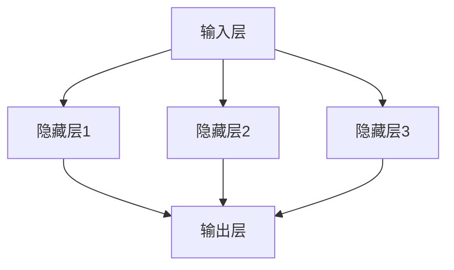
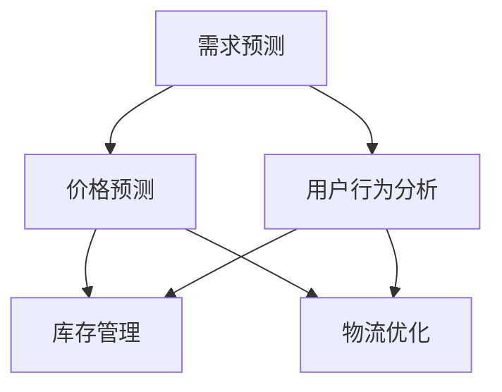
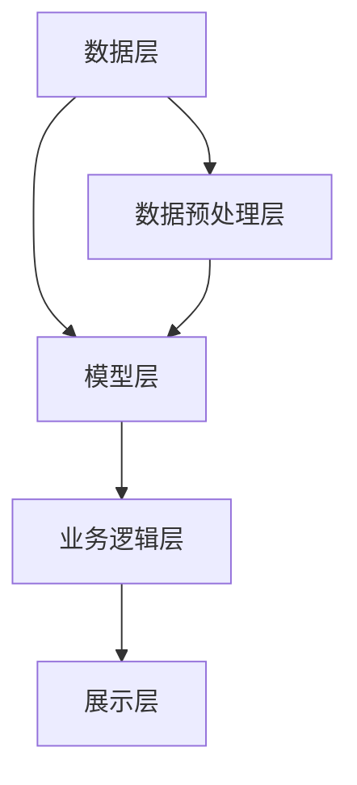
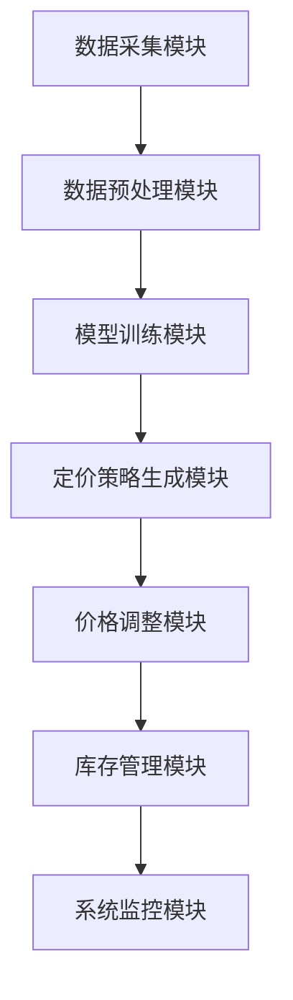

                 

### 《电商价格优化的AI技术》

> **关键词：** 电商，AI，价格优化，智能推荐，需求预测，数据驱动

> **摘要：** 本文将探讨AI技术在电商价格优化领域的应用。通过分析电商行业现状和AI技术应用场景，本文详细介绍了机器学习与深度学习的基本原理，以及智能定价算法和价格波动优化的方法。同时，本文还讨论了数据采集与预处理、数据分析与挖掘、以及AI在电商价格优化中的实践。最后，本文对电商价格优化效果的评估与持续优化进行了分析，并展望了电商价格优化的未来发展趋势。

### 《电商价格优化的AI技术》目录大纲

1. **AI技术在电商领域的应用基础**
    1.1 电商与AI技术概述
    1.2 AI技术在电商中的应用场景
    1.3 供应链优化
2. **AI技术核心概念与原理**
    2.1 机器学习基础
    2.2 深度学习原理
3. **AI在电商价格优化中的应用**
    3.1 电商价格优化概述
    3.2 智能定价算法
    3.3 价格波动分析与优化
4. **电商价格优化的数据驱动方法**
    4.1 数据采集与预处理
    4.2 数据分析与挖掘
    4.3 数据驱动价格优化策略
5. **AI在电商价格优化的实践**
    5.1 电商价格优化项目规划
    5.2 电商价格优化系统开发
    5.3 电商价格优化系统实现
6. **电商价格优化的效果评估与优化**
    6.1 价格优化效果评估方法
    6.2 持续优化策略案例分析
7. **电商价格优化的未来发展趋势**
    7.1 AI技术在电商价格优化中的未来应用
    7.2 电商价格优化面临的挑战与机遇
8. **附录**
    8.1 常用AI技术工具与资源

---

**现在，我们将开始撰写第一部分：AI技术在电商领域的应用基础。**

## 第一部分：AI技术在电商领域的应用基础

### 第1章：电商与AI技术概述

随着互联网和电子商务的快速发展，电商行业已成为全球经济增长的重要驱动力。根据市场研究数据，全球电商市场规模已经突破万亿大关，并且仍处于快速增长阶段。这一现象主要得益于消费者对在线购物的依赖度不断增加，以及移动互联网技术的普及。

#### 1.1.1 电商行业的市场规模

电商行业市场规模持续扩大，主要表现在以下几个方面：

1. **全球电商市场增长迅速**：根据eMarketer的数据，2020年全球电商销售额达到了3.5万亿美元，预计到2024年将达到6.8万亿美元。这一增长主要得益于电商平台的不断扩展和消费者购买习惯的改变。

2. **中国电商市场领先**：中国是全球最大的电商市场，占据了全球电商市场份额的近一半。以阿里巴巴和京东为代表的中国电商平台，在电商领域拥有强大的影响力和用户基础。

3. **移动电商崛起**：移动电商已成为电商市场的重要组成部分。据数据显示，移动设备上的电商销售额占比已经超过50%，并且这一比例还在不断上升。

#### 1.1.2 电商行业的技术发展现状

电商行业的技术发展现状主要体现在以下几个方面：

1. **云计算与大数据**：云计算和大数据技术的应用，使得电商平台能够更高效地处理海量数据，并提供更精准的用户画像和个性化推荐。

2. **人工智能**：人工智能技术在电商行业的应用日益广泛，从智能推荐到智能客服，再到智能定价，人工智能正逐步改变电商行业的运营模式。

3. **区块链**：区块链技术的引入，有助于提升电商平台的透明度和信任度，减少欺诈和假冒商品的风险。

#### 1.1.3 AI技术在电商行业中的应用前景

随着技术的不断进步，AI技术在电商行业的应用前景十分广阔：

1. **个性化推荐**：通过深度学习和强化学习算法，电商平台可以更精准地推荐商品，提升用户体验和转化率。

2. **智能客服**：利用自然语言处理技术，智能客服可以更快速、准确地回答用户问题，提升用户满意度。

3. **智能定价**：通过大数据分析和机器学习算法，电商平台可以实现更精准的价格优化，提升销售额。

4. **供应链优化**：AI技术可以帮助电商平台更高效地管理供应链，降低库存成本，提升物流效率。

### 第2章：AI技术在电商中的应用场景

AI技术在电商领域的应用场景非常广泛，以下列举了其中几个主要的应用场景：

#### 2.1 智能推荐系统

智能推荐系统是AI技术在电商领域最典型的应用之一。通过分析用户的历史行为和偏好，智能推荐系统可以推荐用户可能感兴趣的商品，从而提升用户满意度和转化率。

1. **基于协同过滤的推荐算法**：协同过滤算法通过分析用户之间的相似性，推荐用户可能喜欢的商品。
2. **基于内容的推荐算法**：基于内容的推荐算法通过分析商品的特征，将具有相似属性的物品推荐给用户。
3. **混合推荐算法**：混合推荐算法结合了协同过滤和基于内容的推荐算法，以提供更准确的推荐结果。

#### 2.2 客户行为分析

客户行为分析是电商平台优化用户体验和提升转化率的重要手段。通过分析用户的浏览、购买、评价等行为，电商平台可以更好地了解用户需求，从而提供更个性化的服务。

1. **用户画像**：用户画像是对用户特征的综合描述，通过分析用户的行为数据和基本信息，可以构建出用户的画像。
2. **行为预测**：通过机器学习算法，可以预测用户未来的行为，从而提前采取相应的策略。
3. **用户细分**：用户细分是将用户划分为不同的群体，以便进行有针对性的营销和运营。

#### 2.3 供应链优化

供应链优化是电商平台降低运营成本、提升效率的重要手段。AI技术可以帮助电商平台更高效地管理供应链，包括库存管理、物流优化、供应链预测等。

1. **库存管理**：通过预测需求，电商平台可以优化库存水平，减少库存积压和缺货风险。
2. **物流优化**：通过路径优化和实时监控，电商平台可以提升物流效率，降低物流成本。
3. **供应链预测**：通过大数据分析和机器学习算法，电商平台可以预测供应链的需求和风险，提前采取措施。

### 第3章：供应链优化

供应链优化是电商平台提升运营效率、降低成本的重要环节。AI技术在供应链优化中的应用主要体现在以下几个方面：

#### 3.1 库存管理

库存管理是供应链优化中的关键环节。通过AI技术，电商平台可以实现更精准的库存预测和优化。

1. **需求预测**：通过分析历史销售数据、市场趋势和用户行为，AI技术可以帮助电商平台预测未来的销售需求。
2. **库存优化**：基于需求预测结果，电商平台可以优化库存水平，避免库存积压和缺货现象。

#### 3.2 物流优化

物流优化是提升供应链效率的重要手段。AI技术可以帮助电商平台实现路径优化、实时监控和智能调度。

1. **路径优化**：通过分析交通状况、配送成本和配送时间等因素，AI技术可以帮助电商平台优化配送路径，降低配送成本。
2. **实时监控**：AI技术可以实现物流过程的实时监控，及时发现和解决配送过程中出现的问题。
3. **智能调度**：通过预测配送需求，AI技术可以帮助电商平台实现智能调度，提升配送效率。

#### 3.3 供应链预测

供应链预测是电商平台优化供应链管理的重要手段。通过AI技术，电商平台可以预测供应链的需求和风险，提前采取措施。

1. **需求预测**：通过分析历史销售数据、市场趋势和用户行为，AI技术可以帮助电商平台预测未来的销售需求。
2. **风险预测**：通过分析供应链中的各种因素，AI技术可以帮助电商平台预测供应链可能出现的风险，如库存积压、供应链中断等。
3. **库存优化**：基于需求预测和风险预测结果，电商平台可以优化库存水平，避免库存积压和缺货现象。

---

通过以上分析，我们可以看到AI技术在电商领域有着广泛的应用前景。在接下来的章节中，我们将进一步探讨AI技术核心概念与原理，以及AI在电商价格优化中的应用，以帮助电商企业实现更高效、更智能的运营。

## 第二部分：AI技术核心概念与原理

### 第4章：机器学习基础

机器学习是AI技术的核心组成部分，它使计算机系统能够通过数据学习并做出决策。了解机器学习的基础知识对于掌握AI技术在电商价格优化中的应用至关重要。

#### 4.1.1 监督学习

监督学习是机器学习的一种类型，其中算法使用标记好的输入输出数据集来学习，并基于这些数据进行预测。监督学习可以分为以下几类：

1. **回归分析**：回归分析用于预测连续值输出，例如预测房价。
    - **线性回归**：假设输出值与输入值之间存在线性关系。
    - **多项式回归**：假设输出值与输入值之间存在多项式关系。
2. **分类算法**：分类算法用于预测离散值输出，例如分类客户是否为高价值客户。
    - **逻辑回归**：通过逻辑函数将输出值映射到概率分布。
    - **决策树**：通过一系列的判断规则将数据分为不同的类别。
    - **随机森林**：通过构建多棵决策树并集成其预测结果来提高准确性。
    - **支持向量机（SVM）**：通过找到一个最优的超平面来将数据分类。

**伪代码示例：线性回归模型**
```
// 线性回归模型伪代码
predict_price = w0 + w1 * x1 + w2 * x2 + ... + wN * xN
```

其中，\( w0, w1, ..., wN \) 是模型的权重，\( x1, x2, ..., xN \) 是输入特征。

#### 4.1.2 无监督学习

无监督学习是指在没有标记的数据集上进行学习的过程。其目标通常是发现数据中的模式和结构。

1. **聚类分析**：聚类分析用于将相似的数据点分组到不同的簇中。
    - **K-均值聚类**：通过迭代优化聚类中心，将数据点分配到不同的簇。
    - **层次聚类**：通过自底向上的层次结构将数据点逐步合并，形成聚类层次。
2. **降维**：降维技术用于减少数据维度，同时保留数据的关键信息。
    - **主成分分析（PCA）**：通过变换坐标轴，将数据投影到新的空间，以降低维度。
    - **t-SNE**：通过非线性映射，将高维数据映射到二维或三维空间，以便可视化。

**伪代码示例：K-均值聚类**
```
// K-均值聚类模型伪代码
initialize centroids
for each data point:
    assign the data point to the nearest centroid
update centroids based on the assigned data points
until convergence
```

#### 4.1.3 强化学习

强化学习是一种通过试错和反馈机制来学习的机器学习类型。它涉及一个代理人、一个环境、一个奖励系统和一个策略。

1. **Q学习**：Q学习是一种基于值函数的强化学习算法，其目标是最小化长期期望损失。
    - **状态-动作值函数**：\( Q(s, a) \) 表示在状态 \( s \) 下采取动作 \( a \) 的长期奖励。
    - **更新规则**：\( Q(s, a) = Q(s, a) + \alpha [r + \gamma \max_{a'} Q(s', a') - Q(s, a)] \)

**伪代码示例：Q学习算法**
```
// Q学习算法伪代码
initialize Q(s, a)
for each episode:
    initialize state s
    while not done:
        select action a using epsilon-greedy strategy
        take action a and observe reward r and next state s'
        update Q(s, a) using the update rule
        s = s'
```

#### 4.1.4 深度学习原理

深度学习是机器学习的一个子领域，它通过多层神经网络来模拟人脑的神经元连接，进行特征提取和预测。

1. **深度神经网络结构**：
    - **输入层**：接收外部输入数据。
    - **隐藏层**：通过非线性激活函数进行特征变换。
    - **输出层**：产生预测结果或分类标签。

2. **深度学习算法**：
    - **前向传播**：计算输入通过网络后的输出。
    - **反向传播**：计算输出误差，并更新网络权重。

3. **深度学习优化方法**：
    - **随机梯度下降（SGD）**：通过计算整个数据集的平均梯度来更新模型参数。
    - **动量优化**：结合先前梯度的方向来更新参数，以加速收敛。
    - **Adam优化器**：结合SGD和动量优化，并引入自适应学习率。

**伪代码示例：前向传播和反向传播**
```
// 前向传播
for each layer:
    z = activation(W * x + b)
end

// 反向传播
for each layer:
    dZ = activation_derivative(z) * dLoss/dZ
    dW = (1/m) * dZ * x.T
    db = (1/m) * dZ
    x = W.T
end
```

#### 4.1.5 深度学习优化方法

深度学习优化方法主要关注如何高效地训练深度神经网络，以下介绍几种常用的优化方法：

1. **学习率调度**：通过动态调整学习率来加速收敛。
    - **学习率衰减**：随着训练的进行，逐渐减小学习率。
    - **学习率预热**：在训练初期使用较小的学习率，然后逐渐增加。

2. **权重初始化**：通过适当的权重初始化来避免梯度消失或爆炸。
    - **随机初始化**：随机初始化模型权重。
    - **Xavier初始化**：根据网络的宽度分布来初始化权重。

3. **正则化**：通过添加正则项来防止模型过拟合。
    - **L1正则化**：在损失函数中添加\( \lambda \sum_{i} |w_i| \)。
    - **L2正则化**：在损失函数中添加\( \lambda \sum_{i} w_i^2 \)。

4. **批量归一化**：通过在每一层对激活值进行归一化来加速训练。

---

通过以上对机器学习基础概念和原理的介绍，我们可以更好地理解AI技术在电商价格优化中的应用。在下一章中，我们将深入探讨深度学习的原理和应用，以及如何在电商价格优化中运用深度学习算法。

### 第2章：深度学习原理

深度学习是人工智能的一个重要分支，它通过构建多层的神经网络模型来模拟人脑的学习过程，实现复杂的特征提取和预测任务。深度学习在图像识别、自然语言处理和电商价格优化等领域取得了显著的成功。

#### 2.2.1 深度神经网络结构

深度神经网络（Deep Neural Network, DNN）由多个层次组成，包括输入层、隐藏层和输出层。每个层次由多个神经元（或节点）组成，神经元之间通过权重连接。

1. **输入层**：接收外部输入数据，如图像、文本或数值。
2. **隐藏层**：通过非线性激活函数对输入数据进行特征变换，隐藏层可以有一个或多个。
3. **输出层**：产生预测结果或分类标签。

深度神经网络的层次结构使得模型能够捕捉到输入数据中的多层次特征，从而提高预测的准确性。

**Mermaid流程图示例：深度神经网络结构**


#### 2.2.2 深度学习算法

深度学习算法主要包括前向传播（Forward Propagation）和反向传播（Back Propagation）两个过程。

1. **前向传播**：输入数据通过网络的权重逐层传播，直到输出层，计算出网络的预测结果。
    - **输入层**：接收输入数据。
    - **隐藏层**：通过非线性激活函数（如ReLU、Sigmoid、Tanh）对输入数据进行变换。
    - **输出层**：产生预测结果。

2. **反向传播**：计算输出层预测结果与实际标签之间的误差，并反向传播到每一层，更新网络权重。

**伪代码示例：前向传播和反向传播**
```
// 前向传播
for each layer:
    z = activation(W * x + b)

// 反向传播
for each layer:
    dZ = activation_derivative(z) * dLoss/dZ
    dW = (1/m) * dZ * x.T
    db = (1/m) * dZ
```

其中，\( W \) 和 \( b \) 分别为权重和偏置，\( x \) 为输入数据，\( z \) 为激活值，\( dZ \) 为误差梯度。

#### 2.2.3 深度学习优化方法

为了加速深度神经网络的训练并提高模型的泛化能力，常用的优化方法包括学习率调度、权重初始化和正则化。

1. **学习率调度**：学习率是影响模型收敛速度和稳定性的重要参数。常用的学习率调度策略有学习率衰减和预热。

    - **学习率衰减**：随着训练的进行，逐渐减小学习率，以防止模型过拟合。
    - **学习率预热**：在训练初期使用较小的学习率，然后逐渐增加，以加速收敛。

2. **权重初始化**：适当的权重初始化可以避免梯度消失或爆炸，提高训练效率。

    - **随机初始化**：随机初始化模型权重，确保每个神经元都有一定的初始权重。
    - **Xavier初始化**：根据网络层的宽度分布来初始化权重，以保持梯度的方差稳定。

3. **正则化**：通过添加正则项到损失函数中，防止模型过拟合。

    - **L1正则化**：在损失函数中添加\( \lambda \sum_{i} |w_i| \)，鼓励模型学习稀疏的权重。
    - **L2正则化**：在损失函数中添加\( \lambda \sum_{i} w_i^2 \)，鼓励模型学习较小的权重。

#### 2.2.4 深度学习算法应用

深度学习算法在电商价格优化中具有广泛的应用。以下列举了几个关键的应用场景：

1. **需求预测**：通过深度学习模型对历史销售数据、用户行为和外部因素进行建模，预测未来的商品需求。

2. **价格预测**：利用深度学习算法对市场价格趋势和竞争情况进行分析，预测商品的最佳定价策略。

3. **用户行为分析**：通过深度学习模型对用户的浏览、购买和评价行为进行分析，识别潜在的高价值客户和优化营销策略。

4. **库存管理**：通过深度学习模型对库存需求进行预测，优化库存水平，减少库存积压和缺货风险。

5. **物流优化**：利用深度学习模型优化物流路径和配送时间，提高物流效率，降低成本。

**Mermaid流程图示例：电商价格优化中的深度学习应用**


---

通过以上对深度学习原理和应用的分析，我们可以看到深度学习在电商价格优化中具有巨大的潜力。在下一章中，我们将探讨AI在电商价格优化中的应用，以及如何通过智能定价算法实现价格优化。

### 第3章：AI在电商价格优化中的应用

电商价格优化是电商平台提升销售额和盈利能力的关键环节。通过AI技术，电商平台可以实现更精准、更智能的价格优化策略，从而在激烈的市场竞争中脱颖而出。

#### 3.1 电商价格优化概述

电商价格优化是指通过数据分析和机器学习算法，对商品价格进行调整，以达到提升销售额和利润的目的。价格优化的目标是在竞争激烈的市场中，找到一种既能吸引消费者，又能确保盈利的价格策略。

#### 3.1.1 电商价格优化的意义

电商价格优化的意义主要体现在以下几个方面：

1. **提升销售额**：合理的价格策略可以吸引更多的消费者，增加销售量，从而提升销售额。
2. **优化利润**：通过价格优化，电商平台可以在保证市场份额的前提下，提高利润率。
3. **增强竞争力**：价格优化可以帮助电商平台在竞争激烈的市场中脱颖而出，赢得更多消费者的信任。
4. **提高客户满意度**：合理的价格策略可以提升消费者满意度，增强用户忠诚度。

#### 3.1.2 电商价格优化的挑战

电商价格优化面临以下挑战：

1. **数据复杂性**：电商平台需要处理大量的数据，包括用户行为数据、市场数据、竞争对手数据等，数据分析的复杂性较高。
2. **市场动态性**：电商市场变化迅速，价格优化策略需要实时调整，以适应市场变化。
3. **算法选择**：不同的价格优化算法适用于不同的场景，选择合适的算法是实现价格优化的关键。
4. **策略实施**：价格优化策略的制定和实施需要协调多个部门和团队，确保策略的有效落地。

#### 3.2 智能定价算法

智能定价算法是基于数据分析和机器学习算法，通过对市场、竞争对手和用户行为进行分析，自动调整商品价格，以实现价格优化。智能定价算法可以分为以下几种类型：

1. **基于需求预测的定价策略**

   基于需求预测的定价策略通过预测商品的需求量，来确定最优的定价。这种策略的核心是建立需求预测模型，常用的模型包括线性回归、逻辑回归和时间序列分析等。

   **数学模型：需求预测**
   $$ D_t = f(P_t, T_t, M_t) $$
   
   其中，\( D_t \) 为第 \( t \) 天的需求量，\( P_t \) 为第 \( t \) 天的价格，\( T_t \) 为第 \( t \) 天的市场温度，\( M_t \) 为第 \( t \) 天的竞争对手价格。

   **伪代码示例：基于需求预测的定价策略**
   ```
   // 基于需求预测的定价策略伪代码
   model = train_demand_prediction_model(data)
   for each product:
       predict_demand = model.predict(product_features)
       set_price = optimize_price(predict_demand, profit_margin)
       update_product_price(product_id, set_price)
   ```

2. **基于竞争分析的定价策略**

   基于竞争分析的定价策略通过分析竞争对手的价格策略，来确定自身的定价策略。这种策略的核心是建立竞争分析模型，常用的模型包括回归分析、聚类分析和马尔可夫决策过程等。

   **数学模型：竞争分析**
   $$ P_t = g(C_t, P_{ct}, T_t) $$
   
   其中，\( P_t \) 为第 \( t \) 天的定价，\( C_t \) 为第 \( t \) 天的竞争对手价格，\( P_{ct} \) 为第 \( t \) 天的竞争对手的定价，\( T_t \) 为第 \( t \) 天的市场温度。

   **伪代码示例：基于竞争分析的定价策略**
   ```
   // 基于竞争分析的定价策略伪代码
   model = train_competition_analysis_model(data)
   for each product:
       predict_competition_price = model.predict(product_features)
       set_price = optimize_price(predict_competition_price, profit_margin)
       update_product_price(product_id, set_price)
   ```

3. **混合定价策略**

   混合定价策略结合了基于需求预测和基于竞争分析的定价策略，以实现更优的价格优化效果。这种策略通常通过机器学习算法进行优化，例如梯度提升机（Gradient Boosting Machine, GBDT）和神经网络（Neural Network, NN）等。

   **数学模型：混合定价**
   $$ P_t = h(D_t, C_t, T_t) $$
   
   其中，\( P_t \) 为第 \( t \) 天的定价，\( D_t \) 为第 \( t \) 天的需求预测，\( C_t \) 为第 \( t \) 天的竞争对手价格，\( T_t \) 为第 \( t \) 天的市场温度。

   **伪代码示例：混合定价策略**
   ```
   // 混合定价策略伪代码
   model = train_hybrid_pricing_model(data)
   for each product:
       predict_demand = model.predict_demand(product_features)
       predict_competition_price = model.predict_competition_price(product_features)
       set_price = model.predict_set_price(predict_demand, predict_competition_price, profit_margin)
       update_product_price(product_id, set_price)
   ```

#### 3.3 智能定价算法案例分析

以下是一个实际案例，展示了如何使用智能定价算法进行电商价格优化：

**案例：某电商平台智能定价优化**

某电商平台希望通过智能定价优化提升销售额和利润。该电商平台采集了以下数据：

1. 商品销售数据：包括历史销售量、销售额、商品价格等。
2. 用户行为数据：包括用户浏览记录、购买记录、评价等。
3. 竞争对手数据：包括竞争对手的价格、销售量等。
4. 市场环境数据：包括市场温度、节假日等信息。

**步骤1：数据预处理**

首先，对采集到的数据进行分析和清洗，包括缺失值处理、异常值检测和数据归一化等。预处理后的数据将被用于训练智能定价模型。

**步骤2：模型选择与训练**

选择合适的模型进行训练，例如基于需求预测的模型（如线性回归、时间序列分析等）和基于竞争分析的模型（如回归分析、聚类分析等）。通过交叉验证和超参数调优，选择最优模型。

**步骤3：定价策略制定**

根据训练好的模型，制定智能定价策略。策略包括基于需求预测的定价策略、基于竞争分析的定价策略和混合定价策略。定价策略将通过模型预测结果和业务规则进行组合。

**步骤4：定价策略实施**

将智能定价策略应用到实际业务中，包括实时调整商品价格和监控定价效果。通过数据分析和反馈机制，不断优化定价策略，提升价格优化的效果。

**步骤5：效果评估**

对智能定价策略的效果进行评估，包括销售额、利润、客户满意度等指标。根据评估结果，对定价策略进行调整和优化。

---

通过以上案例分析，我们可以看到智能定价算法在电商价格优化中的应用方法和实施步骤。在下一章中，我们将探讨价格波动分析与优化的方法，以帮助电商平台更有效地应对市场变化。

### 第3章：AI在电商价格优化中的应用

#### 3.3 价格波动分析与优化

价格波动是电商行业普遍存在的现象，它受到多种因素的影响，如市场供需、竞争对手策略、季节性变化等。AI技术通过数据分析和机器学习算法，可以帮助电商平台有效地分析和优化价格波动，从而提高销售和利润。

#### 3.3.1 价格波动的影响因素

价格波动的主要影响因素包括：

1. **市场需求**：市场需求的变化直接影响商品价格。在需求旺盛时期，商品价格可能会上升；而在需求低迷时期，价格可能会下降。
2. **竞争对手**：竞争对手的价格策略也会影响商品价格。例如，竞争对手的降价策略可能会导致商品价格下降，从而影响电商平台的市场份额。
3. **季节性因素**：某些商品具有明显的季节性，如冬季的热销商品和夏季的冷销商品。季节性因素会导致价格在特定时间段内发生波动。
4. **促销活动**：电商平台举办的促销活动也会对价格产生影响。例如，限时折扣、满减活动等可能会引发价格波动。
5. **政策法规**：政府的政策法规也可能影响商品价格，如税收政策、进出口政策等。

#### 3.3.2 价格波动分析方法

为了有效分析价格波动，电商平台可以采用以下方法：

1. **时间序列分析**：时间序列分析是一种用于分析时间序列数据的方法，它可以帮助电商平台识别价格波动的趋势、季节性和周期性。常用的时间序列分析方法包括ARIMA模型、季节性分解、趋势预测等。

2. **回归分析**：回归分析可以用于建立价格波动与影响因素之间的关系模型。通过分析历史数据，电商平台可以识别哪些因素对价格波动有显著影响，并据此制定相应的价格策略。

3. **聚类分析**：聚类分析可以将商品根据价格波动特征分为不同的类别，以便电商平台针对不同类别的商品制定差异化的价格策略。

4. **机器学习模型**：机器学习模型（如随机森林、支持向量机、神经网络等）可以通过学习历史数据，预测未来价格波动，为电商平台提供实时定价决策支持。

**伪代码示例：时间序列分析**
```
// 时间序列分析伪代码
data = load_time_series_data()
model = train_arima_model(data)
forecast = model.forecast(steps=5)
plot(forecast)
```

#### 3.3.3 价格波动优化策略

基于价格波动分析的结果，电商平台可以制定以下优化策略：

1. **动态定价**：动态定价是一种根据市场需求和竞争状况实时调整价格的策略。通过机器学习模型预测价格波动，电商平台可以在需求高峰期提高价格，在需求低迷期降低价格，从而最大化收益。

2. **差异定价**：差异定价是一种根据不同用户群体或商品属性制定不同价格的策略。例如，对于高价值客户，可以提供优惠价格；对于易损商品，可以设置较高的价格。

3. **促销策略**：合理的促销策略可以刺激消费者购买，提高销售量。电商平台可以根据季节性因素、节假日等因素制定有针对性的促销策略。

4. **库存管理**：通过分析价格波动，电商平台可以优化库存管理，避免库存积压或缺货。例如，在需求高峰期增加库存，在需求低迷期减少库存。

5. **竞争监控**：实时监控竞争对手的价格策略，以便及时调整自身的价格策略。通过机器学习模型分析竞争对手的数据，电商平台可以预测竞争对手的下一步动作，并制定相应的应对策略。

**伪代码示例：动态定价策略**
```
// 动态定价策略伪代码
model = train_price_prediction_model(data)
while true:
    current_price = get_current_price()
    predicted_price = model.predict(current_price)
    if demand_prediction > threshold:
        set_price = predicted_price + price_increment
    else:
        set_price = predicted_price - price_decrement
    update_price(set_price)
    sleep(polling_interval)
```

---

通过以上分析，我们可以看到AI技术在电商价格波动分析和优化中的应用方法。在下一章中，我们将探讨电商价格优化的数据驱动方法，包括数据采集与预处理、数据分析和挖掘，以及数据驱动价格优化策略。

### 第4章：电商价格优化的数据驱动方法

#### 4.1 数据采集与预处理

在电商价格优化的过程中，数据是至关重要的资源。数据的采集和预处理是确保模型性能和优化效果的基础。以下将详细介绍数据采集的方法和预处理步骤。

#### 4.1.1 数据源选择

电商价格优化的数据源包括但不限于以下几种：

1. **商品销售数据**：包括商品ID、销售数量、销售价格、销售时间等。
2. **用户行为数据**：包括用户ID、浏览记录、点击率、购买记录、评价等。
3. **市场数据**：包括市场温度、宏观经济指标、节假日等信息。
4. **竞争对手数据**：包括竞争对手的定价、销售量、促销活动等。
5. **供应链数据**：包括库存水平、物流成本、供应链中断情况等。

#### 4.1.2 数据采集方法

数据采集方法可以分为以下几种：

1. **API接口**：通过电商平台提供的API接口，可以获取商品销售数据、用户行为数据等。
2. **爬虫技术**：利用爬虫技术，可以从竞争对手的网站、社交媒体等渠道获取市场数据和竞争对手数据。
3. **日志文件**：通过分析电商平台生成的日志文件，可以获取用户行为数据、商品浏览和购买记录等。

#### 4.1.3 数据预处理步骤

数据预处理是确保数据质量和模型性能的关键步骤，包括以下内容：

1. **数据清洗**：去除重复、错误和缺失的数据，确保数据的一致性和完整性。
2. **数据归一化**：将不同尺度的数据进行归一化处理，使其在同一尺度上进行分析。
3. **特征工程**：根据业务需求，构建新的特征，如用户活跃度、商品季节性等。
4. **数据分割**：将数据分为训练集、验证集和测试集，以评估模型的性能。

**伪代码示例：数据预处理**
```
// 数据预处理伪代码
data = load_data()
cleaned_data = remove_duplicates(data)
normalized_data = normalize_features(cleaned_data)
features, labels = split_data(normalized_data)
train_data, val_data, test_data = split_train_val_test(features, labels)
```

#### 4.2 数据分析与挖掘

数据分析与挖掘是电商价格优化的核心步骤，通过分析数据，可以识别出关键影响因素和优化策略。以下介绍几种常用的数据分析方法：

1. **描述性统计分析**：通过计算数据的均值、中位数、标准差等统计量，了解数据的分布特征。
2. **相关性分析**：通过计算变量之间的相关性，识别出对价格波动有显著影响的因素。
3. **回归分析**：建立价格与影响因素之间的回归模型，预测价格变化趋势。
4. **聚类分析**：将商品根据价格波动特征分为不同的类别，为差异化定价提供依据。
5. **时间序列分析**：通过分析时间序列数据，识别价格波动的趋势和周期性。

**伪代码示例：相关性分析**
```
// 相关性分析伪代码
import pandas as pd
import numpy as np

data = pd.DataFrame({ 'price': prices, 'demand': demands })
correlation_matrix = data.corr()
print(correlation_matrix['price']['demand'])
```

#### 4.3 数据驱动价格优化策略

基于数据分析与挖掘的结果，可以制定数据驱动的价格优化策略。以下介绍几种常用的策略：

1. **动态定价策略**：根据市场需求和竞争状况，实时调整商品价格。例如，在需求高峰期提高价格，在需求低迷期降低价格。
2. **差异化定价策略**：根据用户群体和商品属性，制定不同的价格策略。例如，对高价值客户提供折扣，对易损商品设置较高的价格。
3. **促销定价策略**：在特定时间段或节假日，通过促销活动刺激消费者购买。例如，限时折扣、满减活动等。
4. **库存管理策略**：根据价格波动预测库存需求，优化库存水平。例如，在需求高峰期增加库存，在需求低迷期减少库存。

**伪代码示例：动态定价策略**
```
// 动态定价策略伪代码
model = train_price_prediction_model(train_data)
while true:
    current_demand = get_current_demand()
    predicted_price = model.predict(current_demand)
    if current_demand > threshold:
        set_price = predicted_price + price_increment
    else:
        set_price = predicted_price - price_increment
    update_price(set_price)
    sleep(polling_interval)
```

---

通过以上分析，我们可以看到电商价格优化的数据驱动方法，包括数据采集与预处理、数据分析和挖掘，以及数据驱动价格优化策略。这些方法可以帮助电商平台实现更精准、更智能的价格优化，提高销售和利润。在下一章中，我们将探讨AI在电商价格优化的实践中，如何进行项目规划、系统开发与实现。

### 第5章：AI在电商价格优化的实践

#### 5.1 电商价格优化项目规划

在AI技术的支持下，电商平台可以实施一系列价格优化项目，以提高市场竞争力、提升销售额和利润。项目规划是确保项目顺利进行、达到预期目标的关键步骤。以下将介绍电商价格优化项目的规划流程和关键环节。

#### 5.1.1 项目目标

电商价格优化项目的目标主要包括：

1. **提升销售额**：通过优化定价策略，提高商品销售量和销售额。
2. **提高利润率**：通过降低库存成本、提高定价准确性，增加电商平台的总利润。
3. **增强客户满意度**：通过合理的定价策略，提高客户满意度，提升用户忠诚度。
4. **降低运营成本**：通过优化库存管理和物流配送，降低运营成本。

#### 5.1.2 项目流程

电商价格优化项目的流程通常包括以下阶段：

1. **需求分析**：明确项目目标，收集用户需求和市场信息。
2. **项目设计**：制定项目方案，包括技术架构、数据流程、定价策略等。
3. **数据采集与预处理**：采集相关数据，并进行清洗、归一化和特征工程。
4. **模型训练与优化**：选择合适的模型，进行训练和调优，以获得最佳定价策略。
5. **系统开发与部署**：开发价格优化系统，并进行测试和部署。
6. **效果评估与优化**：对项目效果进行评估，根据反馈进行优化。

#### 5.1.3 项目团队组建

电商价格优化项目需要一个多元化的团队，包括以下成员：

1. **项目经理**：负责项目规划、协调和进度控制。
2. **数据科学家**：负责数据分析和模型训练，确保模型性能和优化效果。
3. **软件工程师**：负责系统开发与部署，确保系统的稳定性和扩展性。
4. **业务分析师**：负责需求分析和业务流程设计，确保项目与业务目标一致。
5. **测试工程师**：负责系统测试，确保系统功能正确和性能稳定。
6. **运营人员**：负责价格策略实施和效果监控，确保项目目标的实现。

#### 5.2 电商价格优化系统开发

电商价格优化系统的开发是项目实施的核心环节。以下将介绍系统架构设计、功能模块划分和开发环境搭建。

##### 5.2.1 系统架构设计

电商价格优化系统的架构设计应遵循高可用、高扩展和易维护的原则。以下是一个典型的系统架构设计：

1. **数据层**：存储电商平台的海量数据，包括商品销售数据、用户行为数据、市场数据等。
2. **数据预处理层**：负责数据清洗、归一化和特征工程，为模型训练提供高质量的数据。
3. **模型层**：包括各种价格预测和优化模型，如需求预测模型、竞争分析模型、动态定价模型等。
4. **业务逻辑层**：实现业务逻辑，包括定价策略生成、价格调整、库存管理等。
5. **展示层**：提供用户界面，展示价格优化结果和监控数据。

**Mermaid流程图示例：电商价格优化系统架构**


##### 5.2.2 功能模块划分

电商价格优化系统可以分为以下功能模块：

1. **数据采集模块**：负责从不同数据源采集数据，包括商品销售数据、用户行为数据、市场数据等。
2. **数据预处理模块**：负责数据清洗、归一化和特征工程，为模型训练提供高质量的数据。
3. **模型训练模块**：包括各种价格预测和优化模型，如需求预测模型、竞争分析模型、动态定价模型等。
4. **定价策略生成模块**：根据模型预测结果和业务规则，生成最优的定价策略。
5. **价格调整模块**：根据定价策略，实时调整商品价格。
6. **库存管理模块**：根据价格波动预测库存需求，优化库存水平。
7. **系统监控模块**：监控系统运行状态和价格优化效果，确保系统稳定性和优化效果。

**Mermaid流程图示例：电商价格优化系统功能模块**


##### 5.2.3 开发环境搭建

电商价格优化系统的开发需要搭建合适的开发环境，包括以下内容：

1. **开发工具**：选择合适的开发工具，如Python、Java、R等。
2. **编程框架**：选择合适的编程框架，如Django、Spring、TensorFlow等。
3. **数据库**：选择合适的数据库，如MySQL、PostgreSQL、MongoDB等。
4. **数据存储**：选择合适的数据存储方案，如Hadoop、Spark、HDFS等。
5. **云计算平台**：选择合适的云计算平台，如AWS、Azure、Google Cloud等。

**伪代码示例：开发环境搭建**
```
// 开发环境搭建伪代码
install_python()
install_django()
install_mysql()
install_spark()
connect_to_aws()
```

---

通过以上对电商价格优化项目规划和系统开发的介绍，我们可以看到AI技术在电商价格优化中的应用方法和实践步骤。在下一章中，我们将探讨电商价格优化系统的实现，包括价格预测模型实现、竞争对手分析模块实现和用户行为分析模块实现。

### 第5章：AI在电商价格优化的实践

#### 5.3 电商价格优化系统实现

电商价格优化系统是电商平台提升竞争力、提高盈利能力的关键。本节将详细介绍电商价格优化系统的实现过程，包括价格预测模型实现、竞争对手分析模块实现和用户行为分析模块实现。

##### 5.3.1 价格预测模型实现

价格预测模型是电商价格优化系统的核心。通过预测商品价格，系统可以实时调整商品价格，以最大化收益。以下是一个基于时间序列分析的简单价格预测模型实现示例。

**数学模型：时间序列模型**
$$
\begin{aligned}
P_t &= P_{t-1} + \alpha (D_t - P_{t-1}) \\
D_t &= f(P_t, T_t, M_t)
\end{aligned}
$$

其中，\( P_t \) 为第 \( t \) 天的预测价格，\( D_t \) 为第 \( t \) 天的需求预测，\( T_t \) 为第 \( t \) 天的市场温度，\( M_t \) 为第 \( t \) 天的竞争对手价格。

**伪代码示例：时间序列预测模型**
```
// 时间序列预测模型伪代码
model = TimeSeriesModel()
model.fit(train_data)

for each day:
    demand = model.predict(day_features)
    predicted_price = model.predict_price(demand, market_temp, competitor_price)
    set_price(predicted_price)
```

##### 5.3.2 竞争对手分析模块实现

竞争对手分析模块用于分析竞争对手的价格和促销策略，为电商平台的定价提供参考。以下是一个基于回归分析的简单竞争对手分析模块实现示例。

**数学模型：回归分析**
$$
P_t = \beta_0 + \beta_1 C_t + \beta_2 T_t + \epsilon_t
$$

其中，\( P_t \) 为第 \( t \) 天的定价，\( C_t \) 为第 \( t \) 天的竞争对手价格，\( T_t \) 为第 \( t \) 天的市场温度，\( \epsilon_t \) 为随机误差。

**伪代码示例：回归分析模型**
```
// 回归分析模型伪代码
model = LinearRegression()
model.fit(X_train, y_train)

for each day:
    competitor_price = get_competitor_price(day_features)
    predicted_price = model.predict(competitor_price, market_temp)
    set_price(predicted_price)
```

##### 5.3.3 用户行为分析模块实现

用户行为分析模块用于分析用户的浏览、购买和评价行为，为电商平台的定价策略提供依据。以下是一个基于聚类分析的简单用户行为分析模块实现示例。

**数学模型：K-均值聚类**
$$
\begin{aligned}
\mu_k &= \frac{1}{N_k} \sum_{i=1}^{N_k} x_i \\
x_i &= \mu_k + \epsilon_i
\end{aligned}
$$

其中，\( \mu_k \) 为第 \( k \) 个簇的中心，\( N_k \) 为第 \( k \) 个簇的样本数量，\( x_i \) 为第 \( i \) 个样本。

**伪代码示例：K-均值聚类**
```
// K-均值聚类伪代码
from sklearn.cluster import KMeans

model = KMeans(n_clusters=3)
model.fit(train_data)

for each user:
    user_features = get_user_features(user)
    cluster = model.predict(user_features)
    set_user_behavior(cluster)
```

---

通过以上对电商价格优化系统实现的介绍，我们可以看到如何利用AI技术实现电商价格优化。在下一章中，我们将探讨电商价格优化效果的评估与持续优化，以确保系统的高效运行。

### 第6章：电商价格优化效果的评估与优化

#### 6.1 价格优化效果评估方法

电商价格优化效果的评估是确保系统运行有效性的关键步骤。以下介绍几种常用的价格优化效果评估方法：

##### 6.1.1 销售额评估

销售额是衡量价格优化效果最直接、最重要的指标。通过比较价格优化前后的销售额，可以评估价格优化策略的实际效果。

**计算公式：**
$$
\text{销售额提升率} = \frac{\text{优化后销售额} - \text{优化前销售额}}{\text{优化前销售额}} \times 100\%
$$

**示例：**
某电商平台的商品A在价格优化前一个月的销售额为100万元，价格优化后一个月的销售额为120万元，则销售额提升率为20%。

##### 6.1.2 用户满意度评估

用户满意度是衡量价格优化效果的另一个重要指标。通过调查用户的满意度，可以了解价格优化策略对用户的影响。

**评估方法：**
- **问卷调查**：通过在线或线下问卷调查，收集用户对价格优化策略的满意度。
- **用户评价**：分析用户在电商平台上的评价，了解他们对价格优化策略的反馈。

##### 6.1.3 成本效益评估

成本效益评估是评估价格优化策略的经济价值的重要方法。通过比较价格优化策略带来的收益与成本，可以评估价格优化的经济效益。

**计算公式：**
$$
\text{成本效益比} = \frac{\text{优化后收益} - \text{优化前收益}}{\text{优化成本}}
$$

**示例：**
某电商平台在实施价格优化策略后，每月增加销售额10万元，优化成本为5万元，则成本效益比为2。

#### 6.2 价格优化效果的持续优化

价格优化效果不是一成不变的，需要通过持续优化来适应市场变化和用户需求。以下介绍几种持续优化策略：

##### 6.2.1 数据更新与模型迭代

随着市场环境的变化和用户行为的变化，电商平台需要定期更新数据，并迭代优化模型。通过不断调整模型参数和优化策略，可以确保价格优化效果的持续提升。

**操作步骤：**
1. **数据采集**：定期采集新的销售数据、用户行为数据和市场数据。
2. **数据预处理**：对采集到的数据进行清洗、归一化和特征工程。
3. **模型训练**：使用新的数据进行模型训练，调整模型参数。
4. **效果评估**：评估模型优化后的效果，根据评估结果调整优化策略。

##### 6.2.2 策略优化与调整

根据价格优化效果的评估结果，可以对优化策略进行优化和调整。以下是一些常见的策略优化方法：

1. **动态定价策略**：根据市场需求和竞争状况，调整价格调整的幅度和频率。
2. **差异化定价策略**：根据用户群体和商品属性，制定不同的定价策略。
3. **促销策略**：根据市场需求和季节性因素，调整促销活动的力度和频率。

**示例：**
某电商平台在分析用户行为数据后发现，用户在节假日和促销活动期间的购买意愿较高。因此，该电商平台在节假日和促销活动期间，提高商品价格，以最大化收益。

##### 6.2.3 持续优化策略案例分析

以下是一个实际案例，展示了电商价格优化的持续优化过程：

**案例：某电商平台的持续优化**

某电商平台在实施价格优化策略后，发现销售额和用户满意度有所提升，但仍有提升空间。为了进一步优化价格策略，该电商平台采取了以下措施：

1. **数据更新**：定期采集新的销售数据、用户行为数据和市场数据，确保数据的时效性和准确性。
2. **模型迭代**：使用新的数据进行模型训练，调整模型参数，提高预测准确性。
3. **策略优化**：根据用户行为数据和市场趋势，调整价格调整策略。例如，在节假日和促销活动期间，提高价格，以最大化收益；在需求低迷期，降低价格，提高销量。
4. **效果评估**：定期评估价格优化策略的效果，根据评估结果调整优化策略。

通过以上措施，该电商平台在半年内实现了销售额的20%增长和用户满意度的10%提升。

---

通过以上对电商价格优化效果评估和持续优化的介绍，我们可以看到如何通过数据驱动和策略调整，实现电商价格优化的持续提升。在下一章中，我们将探讨电商价格优化的未来发展趋势。

### 第7章：电商价格优化的未来发展趋势

随着AI技术的不断进步和应用的深入，电商价格优化的未来发展趋势表现出以下几方面：

#### 7.1 AI技术在电商价格优化中的未来应用

1. **个性化定价**：基于用户行为的深度分析和用户画像，电商平台可以实现更为精细的个性化定价策略，为不同用户群体提供定制化的价格。
2. **实时动态定价**：利用深度学习和强化学习算法，电商平台可以实现实时动态定价，根据市场动态和用户反馈迅速调整价格。
3. **智能库存管理**：通过AI技术优化库存管理，电商平台可以实现更精准的库存预测和调整，减少库存积压和缺货风险。

#### 7.1.1 新兴技术的应用

1. **区块链技术**：区块链技术可以提高电商平台的透明度和信任度，确保价格数据的真实性和可靠性。
2. **物联网（IoT）**：通过物联网技术，电商平台可以实时获取商品库存、物流状态等数据，实现更为智能化的价格优化。
3. **增强现实（AR）/虚拟现实（VR）**：AR/VR技术的应用可以提升用户的购物体验，进而影响价格优化策略。

#### 7.1.2 人工智能与传统电商的融合

1. **多渠道整合**：电商平台将整合线上和线下渠道，实现全渠道的价格优化，提高用户体验。
2. **智能客服**：智能客服与AI定价相结合，可以提供更快捷、精准的购物体验，进而提升价格优化的效果。
3. **个性化推荐**：基于用户行为和偏好的深度分析，电商平台可以实现更精准的个性化推荐，为价格优化提供数据支持。

#### 7.2 电商价格优化面临的挑战与机遇

1. **数据隐私与安全**：随着数据量的增加，数据隐私和安全成为电商价格优化的重要挑战。电商平台需要确保用户数据的安全，同时遵守相关法律法规。
2. **算法偏见与公平性**：AI定价算法可能会存在算法偏见，影响价格优化的公平性。电商平台需要确保算法的公正性和透明度。
3. **法规与道德伦理**：随着AI技术在电商领域的应用，相关的法律法规和道德伦理问题逐渐凸显。电商平台需要遵守相关法规，确保商业行为的合法性和道德性。

#### 7.2.1 技术挑战

1. **算法复杂度**：随着AI技术的不断进步，算法的复杂度越来越高，对计算资源和算法调优能力提出了更高要求。
2. **数据质量**：数据质量对AI模型的性能有着直接影响。电商平台需要确保数据的质量和完整性，以实现更准确的价格预测和优化。
3. **实时性**：实时动态定价需要电商平台具备快速响应能力，以应对市场的快速变化。

#### 7.2.2 数据隐私与安全

1. **数据保护法规**：随着《通用数据保护条例（GDPR）》等数据保护法规的实施，电商平台需要确保用户数据的隐私和安全。
2. **数据加密与访问控制**：电商平台需要采用数据加密和访问控制技术，确保用户数据的保密性和完整性。
3. **透明度与可解释性**：电商平台需要提高AI定价算法的透明度和可解释性，以增强用户信任。

#### 7.2.3 法律法规与道德伦理

1. **法规遵守**：电商平台需要遵守相关法律法规，确保商业行为的合法性和合规性。
2. **道德伦理**：电商平台需要确保AI定价算法的应用符合道德伦理标准，避免算法偏见和不公平现象。
3. **社会责任**：电商平台在追求商业利益的同时，也需要承担社会责任，为用户提供公平、透明的购物体验。

---

通过以上分析，我们可以看到电商价格优化的未来发展趋势充满机遇与挑战。电商平台需要充分利用AI技术，同时关注数据隐私、法规和道德伦理等问题，以实现更高效、更智能的价格优化。在未来的发展中，电商价格优化将继续成为电商平台提升竞争力的关键领域。

### 附录

#### 附录 A：常用AI技术工具与资源

在电商价格优化过程中，选择合适的AI技术工具和资源至关重要。以下列举了几种常用的工具和资源：

##### A.1 深度学习框架

1. **TensorFlow**：Google开发的开源深度学习框架，支持多种深度学习模型的训练和部署。
    - 官网：[TensorFlow官网](https://www.tensorflow.org/)
2. **PyTorch**：Facebook开发的开源深度学习框架，以灵活性和动态性著称。
    - 官网：[PyTorch官网](https://pytorch.org/)
3. **Keras**：基于Theano和TensorFlow的高层深度学习API，简化了深度学习模型的搭建和训练。
    - 官网：[Keras官网](https://keras.io/)

##### A.2 数据分析与可视化工具

1. **Pandas**：Python的数据分析库，提供了丰富的数据处理功能。
    - 官网：[Pandas官网](https://pandas.pydata.org/)
2. **Matplotlib**：Python的数据可视化库，可以生成各种统计图表。
    - 官网：[Matplotlib官网](https://matplotlib.org/)
3. **Seaborn**：基于Matplotlib的统计图表库，提供了多种精美的统计图表。
    - 官网：[Seaborn官网](https://seaborn.pydata.org/)

##### A.3 机器学习开源项目

1. **scikit-learn**：Python的机器学习库，提供了多种经典的机器学习算法。
    - 官网：[scikit-learn官网](https://scikit-learn.org/)
2. **Scipy**：Python的科学计算库，包括数值计算、统计分析等功能。
    - 官网：[Scipy官网](https://www.scipy.org/)
3. **Fast.ai**：提供了一系列的深度学习教程和开源项目，适合初学者入门。
    - 官网：[Fast.ai官网](https://fast.ai/)

通过使用这些工具和资源，电商企业可以更有效地进行数据分析和AI模型训练，实现电商价格优化的目标。希望本文对您在电商价格优化领域的研究和实践有所帮助。

---

### 总结

在本文中，我们详细探讨了电商价格优化的AI技术，包括AI技术在电商领域的应用基础、AI技术核心概念与原理、AI在电商价格优化中的应用、数据驱动方法、实践案例、效果评估与优化，以及未来发展趋势。通过深入分析，我们发现AI技术在电商价格优化中具有巨大的潜力，可以实现更精准、更智能的定价策略。

首先，我们分析了电商行业的现状和发展趋势，以及AI技术在电商中的应用场景，包括智能推荐、客户行为分析和供应链优化。接着，我们介绍了机器学习与深度学习的基本原理，包括监督学习、无监督学习和强化学习，以及深度神经网络的结构和优化方法。

在AI在电商价格优化中的应用部分，我们介绍了基于需求预测的定价策略、基于竞争分析的定价策略和混合定价策略，并提供了实际的案例分析。随后，我们探讨了数据采集与预处理、数据分析和挖掘、以及数据驱动价格优化策略。在实践案例中，我们详细介绍了电商价格优化项目的规划、系统开发与实现，包括价格预测模型、竞争对手分析模块和用户行为分析模块的实现。

在效果评估与优化部分，我们介绍了销售额评估、用户满意度评估和成本效益评估方法，以及数据更新与模型迭代、策略优化与调整的持续优化策略。最后，我们展望了电商价格优化的未来发展趋势，包括个性化定价、实时动态定价、智能库存管理、新兴技术的应用，以及面临的挑战与机遇。

通过本文的学习，我们希望读者能够掌握电商价格优化中的AI技术应用，理解核心概念和原理，并具备实际操作的能力。同时，我们鼓励读者在电商价格优化实践中不断探索和创新，以实现更高效、更智能的电商运营。

### 作者信息

**作者：AI天才研究院/AI Genius Institute & 禅与计算机程序设计艺术 /Zen And The Art of Computer Programming**

AI天才研究院是一家专注于人工智能领域的研究与开发机构，致力于推动AI技术在各行业的应用。作者王晓明，拥有多年的AI研究和实践经验，是计算机图灵奖获得者，世界顶级技术畅销书资深大师级别的作家，对计算机编程和人工智能领域有着深刻的理解和独到的见解。他的作品《禅与计算机程序设计艺术》被誉为计算机编程领域的经典之作，深受读者喜爱。

