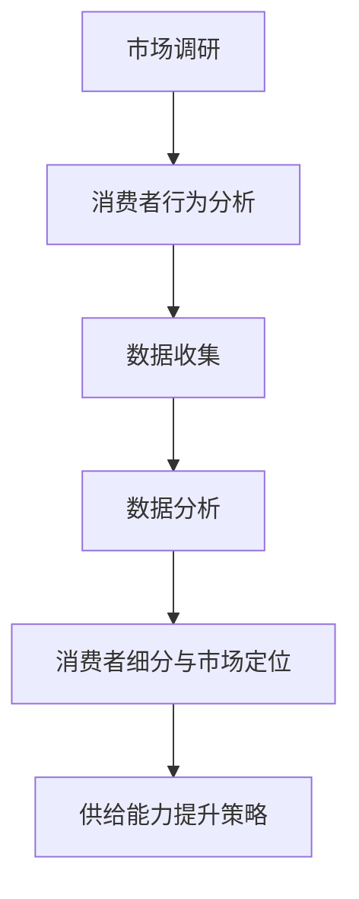

                 

### 《电商平台供给能力提升：市场调研和消费者行为分析》

> **关键词**：电商平台、供给能力、市场调研、消费者行为分析、供应链管理、技术赋能、数字化转型

> **摘要**：本文通过深入探讨市场调研和消费者行为分析在电商平台供给能力提升中的作用，阐述了相关理论、方法和实践。文章首先概述了市场调研的基本概念和流程，分析了市场环境，介绍了消费者行为理论及其分析工具。随后，文章探讨了产品与服务优化、供应链管理、技术赋能等策略，并通过实际案例分析，展示了如何有效提升电商平台的供给能力。

### 目录

#### 第一部分：市场调研基础

**第1章：市场调研概述**

- **1.1 市场调研的定义与目的**
- **1.2 市场调研的类型与方法**
  - **1.2.1 定量调研与定性调研**
  - **1.2.2 实地调研与在线调研**
  - **1.2.3 深度访谈与焦点小组**
- **1.3 市场调研流程**

**第2章：市场环境分析**

- **2.1 市场环境分析概述**
- **2.2 宏观环境分析（PEST分析）**
  - **2.2.1 政治环境**
  - **2.2.2 经济环境**
  - **2.2.3 社会环境**
  - **2.2.4 技术环境**
- **2.3 行业环境分析（PESTEL分析）**
  - **2.3.1 政策环境**
  - **2.3.2 经济环境**
  - **2.3.3 社会环境**
  - **2.3.4 技术环境**
  - **2.3.5 环境保护**

#### 第二部分：消费者行为分析

**第3章：消费者行为概述**

- **3.1 消费者行为理论**
  - **3.1.1 人类行为学**
  - **3.1.2 决策过程**
  - **3.1.3 消费者需求**
- **3.2 消费者决策模型**

**第4章：消费者行为分析工具**

- **4.1 调查问卷设计**
  - **4.1.1 问卷设计原则**
  - **4.1.2 问卷结构**
  - **4.1.3 问题类型与措辞**
- **4.2 数据分析工具与应用**
  - **4.2.1 SPSS**
  - **4.2.2 R**
  - **4.2.3 Python数据分析库**

**第5章：消费者细分与市场定位**

- **5.1 消费者细分**
  - **5.1.1 市场细分策略**
  - **5.1.2 消费者细分方法**
  - **5.1.3 消费者行为特征分析**
- **5.2 市场定位**
  - **5.2.1 市场定位原则**
  - **5.2.2 市场定位策略**
  - **5.2.3 市场定位案例分析**

#### 第三部分：供给能力提升策略

**第6章：产品与服务优化**

- **6.1 产品生命周期管理**
  - **6.1.1 产品规划**
  - **6.1.2 产品开发**
  - **6.1.3 产品上市**
  - **6.1.4 产品更新与淘汰**
- **6.2 服务质量提升**

**第7章：供应链管理**

- **7.1 供应链管理概述**
  - **7.1.1 供应链概念与模型**
  - **7.1.2 供应链管理关键要素**
- **7.2 供应链优化策略**
  - **7.2.1 库存管理**
  - **7.2.2 库存优化模型**
  - **7.2.3 供应链协同**

**第8章：技术赋能与数字化转型**

- **8.1 电商平台技术架构**
  - **8.1.1 技术架构概述**
  - **8.1.2 技术架构案例分析**
- **8.2 大数据分析与人工智能应用**
  - **8.2.1 大数据分析原理**
  - **8.2.2 人工智能技术基础**
  - **8.2.3 大数据与人工智能在电商中的应用**

**第9章：案例分析**

- **9.1 案例分析概述**
- **9.2 案例一：某电商平台供给能力提升实践**
  - **9.2.1 市场调研分析**
  - **9.2.2 消费者行为分析**
  - **9.2.3 供给能力提升策略**
- **9.3 案例二：某电商平台数字化转型案例分析**

### 附录

**附录A：市场调研与消费者行为分析工具**

- **A.1 调查问卷设计工具**
- **A.2 数据分析软件与库**

---

**Mermaid 流�程图：消费者行为分析流程**



---

**核心算法原理讲解：消费者细分算法（K-means算法）伪代码**

```plaintext
初始化：选择K个初始中心点
重复以下步骤直到收敛：
    对于每个数据点，计算它与每个中心点的距离，并将其分配给最近的中心点
    重新计算每个中心点的均值
    如果中心点的位置不再改变，则算法收敛
```

---

**数学模型讲解：消费者行为需求预测（线性回归模型）**

$$
y = \beta_0 + \beta_1x_1 + \beta_2x_2 + ... + \beta_nx_n
$$

其中，\( y \) 是需求量，\( x_1, x_2, ..., x_n \) 是影响需求的特征变量，\( \beta_0, \beta_1, ..., \beta_n \) 是模型参数。

---

**项目实战：某电商平台供给能力提升案例分析**

1. **开发环境搭建**：使用Python和R进行数据分析，搭建Apache Hadoop和Spark集群进行大数据处理。
2. **数据收集**：通过市场调研获取消费者行为数据，使用调查问卷和在线数据分析工具收集数据。
3. **数据分析**：使用K-means算法进行消费者细分，使用线性回归模型进行需求预测。
4. **供给能力提升策略**：根据分析结果，调整产品组合和库存管理策略，优化供应链。

**代码解读与分析**：

- **K-means算法实现代码**（Python）：

```python
from sklearn.cluster import KMeans
# 读取数据
data = pd.read_csv('consumer_data.csv')
# 初始化KMeans模型
kmeans = KMeans(n_clusters=3, random_state=0).fit(data)
# 输出聚类结果
print(kmeans.labels_)
```

- **线性回归模型实现代码**（R）：

```R
# 读取数据
data <- read.csv('consumer_data.csv')
# 构建线性回归模型
model <- lm(y ~ x1 + x2 + x3, data = data)
# 输出模型参数
print(summary(model)$coefficients)
```

以上为《电商平台供给能力提升：市场调研和消费者行为分析》的完整目录大纲。每个章节包含具体内容，通过核心概念讲解、算法原理阐述、数学模型讲解、以及实际案例分析，帮助读者全面了解市场调研和消费者行为分析在电商平台供给能力提升中的应用。

---

**作者**：AI天才研究院/AI Genius Institute & 禅与计算机程序设计艺术 /Zen And The Art of Computer Programming

---

现在，我们将按照目录大纲逐步展开正文内容的撰写。

#### 第一部分：市场调研基础

**第1章：市场调研概述**

> 市场调研是电商平台提升供给能力的关键环节。通过市场调研，企业能够深入了解市场需求、消费者行为以及市场环境，从而制定有效的策略。

##### 1.1 市场调研的定义与目的

市场调研是指系统地收集、记录、分析和解释与市场相关的信息，以帮助组织做出更好的决策。市场调研的目的是了解市场需求、竞争状况、消费者行为以及市场趋势。

###### 1.1.1 市场调研的类型与方法

市场调研可以分为定量调研和定性调研。定量调研是通过统计方法收集和分析数据，通常用于了解市场规模、消费者偏好等。定性调研则是通过访谈、观察等方式收集深入的信息，通常用于了解消费者行为、市场趋势等。

市场调研的方法包括实地调研、在线调研、深度访谈和焦点小组等。实地调研是在现场进行观察和访问，直接获取第一手数据。在线调研是通过互联网收集数据，具有成本较低、效率高等优点。深度访谈是针对个别消费者或专业人士进行深入访谈，以获取详细信息。焦点小组是由一组消费者或专业人士组成的讨论小组，通过集体讨论获取信息。

###### 1.1.2 市场调研流程

市场调研的流程通常包括以下步骤：

1. **确定调研目标**：明确调研的目的和需要解决的问题。
2. **设计调研方案**：确定调研方法、问卷设计、数据收集和分析方法等。
3. **收集数据**：根据调研方案进行数据收集。
4. **数据分析**：对收集到的数据进行分析，得出结论。
5. **撰写报告**：将调研结果撰写成报告，为决策提供依据。

##### 1.2 市场环境分析

市场环境分析是市场调研的重要组成部分，它有助于企业了解市场状况，识别机会和威胁。

###### 2.1 市场环境分析概述

市场环境分析是指对市场内外部环境进行系统评估，以了解市场的现状、趋势和潜在影响。市场环境分析包括宏观环境分析（PEST分析）和行业环境分析（PESTEL分析）。

###### 2.2 宏观环境分析（PEST分析）

宏观环境分析是指对影响市场的宏观因素进行分析。这些因素包括：

1. **政治环境**：政府的政策、法规和稳定性等。
2. **经济环境**：经济发展状况、利率、通货膨胀等。
3. **社会环境**：人口结构、教育水平、文化价值观等。
4. **技术环境**：技术创新、互联网普及率等。

###### 2.3 行业环境分析（PESTEL分析）

行业环境分析是指对行业内部环境进行系统评估，以了解行业的发展趋势和竞争状况。行业环境分析包括以下因素：

1. **政策环境**：政府政策对行业的影响。
2. **经济环境**：行业的经济状况、市场规模、增长速度等。
3. **社会环境**：社会需求、消费者行为等。
4. **技术环境**：技术创新、技术进步等。
5. **环境**：环境保护法规、可持续性等。

##### 1.3 市场调研流程

市场调研流程包括以下步骤：

1. **确定调研目标**：明确调研的目的和需要解决的问题。
2. **设计调研方案**：确定调研方法、问卷设计、数据收集和分析方法等。
3. **收集数据**：根据调研方案进行数据收集。
4. **数据分析**：对收集到的数据进行分析，得出结论。
5. **撰写报告**：将调研结果撰写成报告，为决策提供依据。

---

在本章中，我们介绍了市场调研的定义与目的，市场调研的类型与方法，以及市场调研的流程。通过这些内容，企业可以更好地了解市场环境，制定有效的市场策略，提升电商平台的供给能力。

---

#### 第二部分：消费者行为分析

**第3章：消费者行为概述**

消费者行为是指消费者在购买、使用和评估产品或服务时的行为和决策过程。理解消费者行为对于电商平台提升供给能力至关重要。本章将介绍消费者行为的基本理论、决策过程以及需求。

##### 3.1 消费者行为理论

消费者行为理论是基于心理学和行为经济学的研究，旨在解释消费者在购买过程中的决策和行为。

###### 3.1.1 人类行为学

人类行为学是研究人类行为的科学，它关注人类如何感知、思考、决策和行动。在消费者行为中，人类行为学提供了关于消费者如何处理信息、做出决策和形成偏好的理论。

###### 3.1.2 决策过程

消费者决策过程是指消费者在购买产品或服务时所经历的一系列心理活动。通常，消费者决策过程包括以下阶段：

1. **需求识别**：消费者意识到自己有某种需求或问题。
2. **信息搜索**：消费者寻求相关信息，以帮助自己做出决策。
3. **评估选项**：消费者比较不同的产品或服务，评估其优势和劣势。
4. **购买决策**：消费者做出购买决定。
5. **购后评估**：消费者使用产品或服务后，对其满意度进行评估。

###### 3.1.3 消费者需求

消费者需求是指消费者对某种产品或服务的欲望和需要，通常表现为对特定产品或服务的需求量。消费者需求受到多种因素的影响，包括：

1. **价格**：价格是消费者购买决策的一个重要因素。
2. **质量**：消费者通常愿意为高质量的产品或服务支付更高的价格。
3. **品牌**：品牌是消费者选择产品或服务的一个重要因素。
4. **广告和促销**：广告和促销活动可以影响消费者的购买决策。
5. **个人偏好**：消费者的个人偏好和价值观也会影响其购买决策。

##### 3.2 消费者决策模型

消费者决策模型是用于模拟和预测消费者购买行为的数学模型。常见的消费者决策模型包括以下几种：

1. **需求函数**：需求函数描述了消费者对某种产品的需求量与价格之间的关系。需求函数通常用线性或非线性方程表示。
   
   $$ Q = a - bP $$

   其中，\( Q \) 是需求量，\( P \) 是价格，\( a \) 和 \( b \) 是参数。

2. **效用函数**：效用函数描述了消费者从某种产品或服务中获得满足程度的大小。效用函数通常用线性或非线性方程表示。

   $$ U = aP - b $$

   其中，\( U \) 是效用，\( P \) 是价格，\( a \) 和 \( b \) 是参数。

3. **预期效用模型**：预期效用模型考虑了消费者在购买决策中面临的不确定性。该模型通常使用概率和期望值来表示。

   $$ E(U) = \sum_{i=1}^{n} p_i u_i $$

   其中，\( E(U) \) 是预期效用，\( p_i \) 是第 \( i \) 个结果的概率，\( u_i \) 是第 \( i \) 个结果的效用。

##### 3.3 消费者需求分析工具

消费者需求分析工具是用于分析和预测消费者需求的方法和工具。常见的消费者需求分析工具包括：

1. **调查问卷**：调查问卷是收集消费者需求信息的一种常见方法。问卷可以设计成定量或定性形式，以获取定量或定性数据。
2. **数据分析软件**：数据分析软件如SPSS、R和Python等，可用于处理和统计分析消费者需求数据。
3. **市场预测模型**：市场预测模型如线性回归模型、多元回归模型和神经网络模型等，可用于预测消费者需求。

---

在本章中，我们介绍了消费者行为理论、决策过程和需求，以及消费者需求分析工具。通过这些内容，企业可以更好地理解消费者行为，制定有效的营销策略，提升电商平台的供给能力。

---

#### 第二部分：消费者行为分析

**第4章：消费者行为分析工具**

消费者行为分析是电商平台提升供给能力的关键环节。为了有效地分析消费者行为，企业需要使用各种工具和方法。本章将介绍调查问卷设计、数据分析工具及其应用。

##### 4.1 调查问卷设计

调查问卷是收集消费者行为信息的重要工具。一个有效的调查问卷可以提供关于消费者偏好、购买行为和需求的重要见解。

###### 4.1.1 问卷设计原则

问卷设计应遵循以下原则：

1. **明确研究目标**：在设计问卷之前，应明确研究的目标和问题。这有助于确保问卷内容的相关性和有效性。
2. **简洁性**：问卷应简洁明了，避免冗长和复杂的问题。过多的问卷问题可能导致参与者流失和低质量的数据。
3. **逻辑性**：问卷问题应按逻辑顺序排列，以确保参与者能够顺利地完成问卷。
4. **清晰性**：问题应清晰明确，避免产生歧义。问题应使用简单的语言，易于理解。
5. **引导性**：问题不应引导参与者回答特定的答案。问题应中立，避免对参与者的回答产生影响。

###### 4.1.2 问卷结构

问卷通常包括以下几个部分：

1. **封面信**：封面信是问卷的开头，用于介绍研究的目的、重要性以及参与者的隐私保护。
2. **指导语**：指导语是解释如何填写问卷的说明，通常放在问卷的开头或每个问题之前。
3. **问题和选项**：问题是问卷的核心部分，用于收集相关信息。问题可以采用单选、多选、排序或开放式形式。
4. **答案选项**：答案选项应涵盖所有可能的答案，并确保选项之间不重复、不遗漏。
5. **结束语**：结束语是对参与者的感谢和鼓励，通常放在问卷的结尾。

###### 4.1.3 问题类型与措辞

问卷问题可以分为以下几种类型：

1. **开放式问题**：开放式问题允许参与者自由回答，有助于收集详细和深入的信息。
2. **封闭式问题**：封闭式问题提供固定的答案选项，有助于简化数据收集和分析过程。
3. **单选问题**：单选问题要求参与者从多个答案中选择一个。
4. **多选问题**：多选问题允许参与者从多个答案中选择多个。
5. **排序问题**：排序问题要求参与者对答案进行排序。

问题措辞应简洁明了，避免使用专业术语。以下是一些常见的问题措辞：

- **是什么**：例如，“您通常在哪个平台上购买商品？”
- **为什么**：例如，“您为什么选择这个平台？”
- **如何**：例如，“您在购买商品时如何做决策？”
- **多少**：例如，“您每月在电商平台上花费多少钱？”

##### 4.2 数据分析工具与应用

数据分析是消费者行为分析的关键步骤。以下介绍几种常见的数据分析工具及其应用：

###### 4.2.1 SPSS

SPSS（统计产品与服务解决方案）是一种广泛使用的统计分析软件。它提供了丰富的统计功能，包括描述性统计、假设检验、回归分析等。SPSS 的优点包括：

1. **用户友好**：SPSS 提供了直观的界面，使非专业用户也能轻松进行数据分析。
2. **强大的统计功能**：SPSS 支持多种统计分析方法，适用于不同类型的数据和分析需求。
3. **数据可视化**：SPSS 提供了多种图表和图形，有助于展示分析结果。

###### 4.2.2 R

R 是一种免费的开源统计分析软件，广泛应用于数据分析和统计建模。R 的优点包括：

1. **灵活性**：R 提供了广泛的包和函数，适用于各种数据分析和统计需求。
2. **强大的编程能力**：R 支持编程，使研究人员能够自定义分析过程。
3. **数据可视化**：R 提供了多种数据可视化工具，有助于展示分析结果。

###### 4.2.3 Python数据分析库

Python 是一种流行的编程语言，具有广泛的应用领域。Python 的数据分析库如 Pandas、NumPy 和 Matplotlib，提供了强大的数据分析和可视化功能。Python 的优点包括：

1. **易学易用**：Python 语法简单，易于学习和使用。
2. **丰富的库**：Python 拥有丰富的库，包括数据分析、机器学习和数据可视化等。
3. **跨平台**：Python 支持多种操作系统，适用于不同的开发和部署环境。

##### 4.3 数据分析流程

数据分析流程通常包括以下步骤：

1. **数据收集**：从各种来源收集数据，如调查问卷、销售记录、社交媒体等。
2. **数据清洗**：清洗数据，包括去除重复数据、处理缺失值、标准化数据等。
3. **数据分析**：使用统计分析方法分析数据，如描述性统计、回归分析、聚类分析等。
4. **数据可视化**：使用图表和图形展示分析结果，帮助理解数据和发现。
5. **结论和报告**：根据分析结果撰写结论和报告，为决策提供依据。

---

在本章中，我们介绍了调查问卷设计的原则和结构，以及开放式和封闭式问题的措辞。我们还介绍了 SPSS、R 和 Python 等数据分析工具，并描述了数据分析的流程。通过这些内容，企业可以更有效地分析消费者行为，制定有针对性的营销策略，提升电商平台的供给能力。

---

#### 第二部分：消费者行为分析

**第5章：消费者细分与市场定位**

消费者细分和市场定位是电商平台提升供给能力的有效策略。通过消费者细分，企业可以更好地理解不同消费者群体的需求和行为，从而有针对性地制定营销策略。本章将介绍消费者细分的方法、市场细分策略以及市场定位。

##### 5.1 消费者细分

消费者细分是指将市场划分为具有相似需求的消费者群体。通过细分市场，企业可以更准确地定位目标消费者，提高营销效率。

###### 5.1.1 市场细分策略

市场细分策略包括以下几种：

1. **地理细分**：根据消费者所在的地理位置进行细分。地理细分适用于区域性市场，有助于企业针对不同地区的消费者特点制定营销策略。
2. **人口细分**：根据消费者的人口特征进行细分，如年龄、性别、收入、教育水平等。人口细分是最常见的市场细分策略，适用于广泛的消费市场。
3. **心理细分**：根据消费者的心理特征进行细分，如生活方式、价值观、兴趣爱好等。心理细分有助于企业了解消费者的内心需求，制定情感营销策略。
4. **行为细分**：根据消费者的行为特征进行细分，如购买频率、购买渠道、忠诚度等。行为细分有助于企业识别高价值客户，提高客户满意度。

###### 5.1.2 消费者细分方法

消费者细分方法包括以下几种：

1. **聚类分析**：聚类分析是一种无监督学习方法，用于将消费者划分为具有相似特征的群体。常用的聚类算法包括 K-means、层次聚类等。
2. **因子分析**：因子分析是一种统计分析方法，用于识别影响消费者行为的潜在因素。通过因子分析，企业可以了解消费者行为的驱动因素。
3. **回归分析**：回归分析是一种用于预测消费者行为的统计方法，通过建立变量之间的关系模型，预测消费者的购买行为。
4. **分群模型**：分群模型是一种基于历史数据的预测模型，通过分析消费者的历史行为，将消费者划分为不同的群体。

###### 5.1.3 消费者行为特征分析

消费者行为特征分析是指对消费者的行为特征进行分析和评估。常见的消费者行为特征包括：

1. **购买频率**：消费者购买商品的频率，反映消费者的活跃程度。
2. **购买渠道**：消费者购买商品的渠道，如线上、线下等。
3. **忠诚度**：消费者对品牌的忠诚程度，影响消费者的重复购买。
4. **购买动机**：消费者购买商品的心理动机，如追求性价比、品牌偏好等。
5. **购买习惯**：消费者的购买习惯，如购买时间、购买数量等。

##### 5.2 市场定位

市场定位是指企业确定自己在市场中的位置，以吸引目标消费者。有效的市场定位有助于企业建立品牌形象，提高市场竞争力。

###### 5.2.1 市场定位原则

市场定位应遵循以下原则：

1. **差异化**：市场定位应突出企业的独特优势，与竞争对手区分开来。
2. **针对性**：市场定位应针对特定的目标消费者群体，满足他们的需求。
3. **可持续性**：市场定位应具有可持续性，以适应市场变化和消费者需求的变化。
4. **一致性**：市场定位应与企业的品牌形象和价值观保持一致。

###### 5.2.2 市场定位策略

市场定位策略包括以下几种：

1. **高端定位**：高端定位是指将产品定位在高端市场，以吸引高收入消费者。高端定位有助于提高品牌形象和产品附加值。
2. **低端定位**：低端定位是指将产品定位在低端市场，以吸引价格敏感的消费者。低端定位有助于扩大市场份额，提高市场占有率。
3. **大众定位**：大众定位是指将产品定位在大众市场，以满足普通消费者的需求。大众定位有助于提高品牌知名度和市场竞争力。
4. **细分市场定位**：细分市场定位是指将产品定位在特定的细分市场，以满足特定消费者的需求。细分市场定位有助于提高市场针对性和营销效率。

###### 5.2.3 市场定位案例分析

以下是一个市场定位案例：

**案例：某电商平台的服装市场定位**

1. **市场调研**：通过对消费者行为和市场竞争状况进行分析，确定目标消费者群体。
2. **定位策略**：将产品定位在中端市场，以提供性价比高的服装产品。
3. **差异化优势**：突出产品的设计和质量，与竞争对手区分开来。
4. **品牌形象**：通过社交媒体和广告宣传，建立年轻、时尚的品牌形象。
5. **市场反馈**：通过消费者反馈和销售数据，不断优化产品和服务，提高市场竞争力。

---

在本章中，我们介绍了消费者细分的方法、市场细分策略和市场定位原则。通过消费者细分，企业可以更好地了解目标消费者，制定有针对性的营销策略。通过有效的市场定位，企业可以建立品牌形象，提高市场竞争力，提升电商平台的供给能力。

---

#### 第三部分：供给能力提升策略

**第6章：产品与服务优化**

在电商平台上，产品与服务优化是提升供给能力的重要策略。通过有效的产品与服务优化，企业可以更好地满足消费者需求，提高市场竞争力。本章将介绍产品生命周期管理、服务质量提升以及产品创新。

##### 6.1 产品生命周期管理

产品生命周期管理是指对产品从开发、上市到淘汰的全过程进行管理。通过有效的产品生命周期管理，企业可以确保产品在市场中持续获得成功。

###### 6.1.1 产品规划

产品规划是产品生命周期管理的第一步，旨在确定产品的目标和定位。产品规划包括以下关键步骤：

1. **市场需求分析**：通过对市场需求进行分析，确定产品的目标市场和消费者需求。
2. **产品定位**：根据市场需求分析结果，确定产品的市场定位和品牌形象。
3. **产品概念**：制定产品的概念和初步设计，包括产品功能、外观和价格等。

###### 6.1.2 产品开发

产品开发是将产品概念转化为实际产品的过程。产品开发包括以下关键步骤：

1. **需求分析**：确定产品的功能、性能和用户界面等需求。
2. **设计**：根据需求分析结果，进行产品设计和开发。
3. **原型制作**：制作产品的原型，进行功能验证和用户测试。
4. **测试和迭代**：对原型进行测试和迭代，确保产品满足需求。

###### 6.1.3 产品上市

产品上市是产品生命周期管理的关键阶段，旨在将产品推向市场。产品上市包括以下关键步骤：

1. **市场推广**：制定市场推广策略，包括广告、促销和公关活动等。
2. **渠道布局**：确定产品的销售渠道，如电商平台、线下门店等。
3. **产品发布**：在适当的时机发布产品，吸引消费者关注。
4. **售后服务**：提供优质的售后服务，提高消费者满意度。

###### 6.1.4 产品更新与淘汰

产品更新与淘汰是产品生命周期管理的最后阶段。通过产品更新，企业可以持续满足消费者需求，提高产品竞争力。产品淘汰是指当产品不再满足市场需求或竞争压力增大时，将其淘汰。

1. **产品更新**：根据市场反馈和消费者需求，对产品进行功能优化、性能提升和外观改进等更新。
2. **产品淘汰**：当产品不再具有竞争力或市场需求减少时，将其淘汰。

##### 6.2 服务质量提升

服务质量是电商平台提升供给能力的重要方面。通过提升服务质量，企业可以提高消费者满意度，增强品牌忠诚度。

###### 6.2.1 服务质量评估

服务质量评估是指对电商平台提供的服务进行评估，以确定服务质量的水平。服务质量评估包括以下方面：

1. **服务响应速度**：评估电商平台对消费者问题的响应速度和处理效率。
2. **服务态度**：评估电商平台的客服态度和专业程度。
3. **服务准确性**：评估电商平台提供的服务是否准确无误。
4. **服务连贯性**：评估电商平台的售后服务是否连贯一致。

###### 6.2.2 服务质量提升策略

服务质量提升策略包括以下方面：

1. **培训员工**：提高员工的专业知识和服务技能，确保员工能够提供优质的服务。
2. **优化流程**：简化服务流程，提高服务效率，减少消费者等待时间。
3. **个性化服务**：根据消费者的需求和偏好，提供个性化的服务体验。
4. **反馈机制**：建立有效的反馈机制，及时收集消费者的反馈意见，并针对问题进行改进。

##### 6.3 产品创新

产品创新是电商平台持续发展的关键。通过产品创新，企业可以满足消费者不断变化的需求，提高市场竞争力。

###### 6.3.1 产品创新策略

产品创新策略包括以下方面：

1. **市场研究**：通过对市场趋势和消费者需求的研究，确定产品创新的方向。
2. **技术驱动**：利用先进的技术，开发具有创新性的产品功能和服务。
3. **用户参与**：鼓励用户参与产品创新过程，收集用户反馈，优化产品设计。
4. **跨界合作**：与其他行业的企业合作，实现资源共享和优势互补。

###### 6.3.2 产品创新案例

以下是一个产品创新案例：

**案例：某电商平台的智能推荐系统**

1. **市场研究**：通过对市场趋势和消费者需求的研究，发现消费者对个性化推荐服务的需求日益增长。
2. **技术驱动**：利用大数据分析和人工智能技术，开发智能推荐系统，根据消费者的浏览和购买历史，提供个性化的商品推荐。
3. **用户参与**：收集用户反馈，优化推荐算法，提高推荐准确性。
4. **跨界合作**：与其他行业的企业合作，整合多方数据资源，提高推荐效果。

---

在本章中，我们介绍了产品生命周期管理、服务质量提升和产品创新。通过这些策略，企业可以更好地优化产品与服务，满足消费者需求，提升电商平台的供给能力。

---

#### 第三部分：供给能力提升策略

**第7章：供应链管理**

供应链管理是电商平台提升供给能力的关键环节。有效的供应链管理可以确保产品从供应商到消费者的流畅流动，提高企业竞争力。本章将介绍供应链管理的概念、关键要素以及优化策略。

##### 7.1 供应链管理概述

供应链管理是指对企业内外部资源进行整合和优化，以实现高效的产品和服务交付。供应链管理的目标是降低成本、提高效率、确保产品质量和客户满意度。

###### 7.1.1 供应链概念与模型

供应链是指从原材料供应商到最终消费者的整个产品流动过程。供应链模型通常包括以下环节：

1. **供应商**：提供原材料、零部件或其他资源的实体。
2. **制造商**：将原材料加工成成品的生产实体。
3. **分销商**：将成品分销给零售商或其他消费者的实体。
4. **零售商**：向消费者销售成品的实体。
5. **消费者**：最终使用产品的个人或组织。

供应链模型可以分为以下几种类型：

1. **推式供应链**：从上游供应商开始，将产品逐级推向下游分销商和零售商。
2. **拉式供应链**：根据下游需求，逐步向上游供应商采购产品。
3. **混合供应链**：结合推式和拉式供应链的特点，根据市场需求灵活调整采购和生产计划。

###### 7.1.2 供应链管理关键要素

供应链管理的关键要素包括以下几个方面：

1. **采购管理**：采购管理是指与供应商建立合作关系，确保原材料和零部件的质量和供应。采购管理涉及供应商选择、采购策略、合同管理、采购流程优化等。

2. **库存管理**：库存管理是指对库存进行有效控制和优化，以降低库存成本、提高库存周转率。库存管理涉及库存计划、库存控制、库存分析、库存优化等。

3. **生产管理**：生产管理是指对生产过程进行规划、组织和控制，以实现高质量、低成本的产品生产。生产管理涉及生产计划、生产调度、质量控制、生产效率优化等。

4. **物流管理**：物流管理是指对物流过程进行优化和控制，以确保产品及时、安全地交付给消费者。物流管理涉及运输规划、仓储管理、配送管理、物流成本控制等。

5. **信息管理**：信息管理是指对供应链信息进行收集、处理和分析，以支持供应链决策。信息管理涉及供应链数据收集、数据集成、数据分析和决策支持等。

##### 7.2 供应链优化策略

供应链优化是指通过改进供应链各个环节的运作，提高供应链整体效率和竞争力。以下是一些常见的供应链优化策略：

###### 7.2.1 库存管理

库存管理是供应链优化的重要方面。以下是一些库存管理策略：

1. **需求预测**：通过准确的需求预测，优化库存水平，减少库存过剩和库存短缺的情况。
2. **ABC分析**：对库存物品进行分类，根据物品的重要性和价值，采取不同的库存策略。
3. **库存优化模型**：使用数学模型和算法，优化库存水平、库存周转率和库存成本。
4. **供应链协同**：与供应商和分销商建立协同关系，共享需求信息和库存数据，优化库存管理。

###### 7.2.2 库存优化模型

库存优化模型是用于确定最优库存水平和库存策略的数学模型。以下是一些常见的库存优化模型：

1. **EOQ模型（经济订货量模型）**：用于确定最优订货量，以最小化库存成本和订货成本。
   
   $$ Q^* = \sqrt{\frac{2DC}{H}} $$

   其中，\( Q^* \) 是最优订货量，\( D \) 是年需求量，\( C \) 是单位订货成本，\( H \) 是单位库存持有成本。

2. **DP模型（动态规划模型）**：用于确定连续时间内的最优库存策略。
   
   $$ V(t) = \min_{x(t)} \sum_{t=0}^{T} F(x(t), t) + G(x(T)) $$

   其中，\( V(t) \) 是价值函数，\( x(t) \) 是库存水平，\( F(x(t), t) \) 是成本函数，\( G(x(T)) \) 是目标函数。

3. **VRP模型（车辆路径问题）**：用于确定最优配送路径和配送计划，以减少运输成本和配送时间。

###### 7.2.3 供应链协同

供应链协同是指供应链各环节之间建立协同合作关系，实现信息共享和资源优化。以下是一些供应链协同策略：

1. **信息共享**：通过建立信息共享平台，实现供应链各环节的信息互联互通，提高信息透明度和响应速度。
2. **合作决策**：与供应商和分销商建立合作决策机制，共同制定供应链策略和运营计划。
3. **供应链协同工具**：使用供应链协同工具，如供应链管理系统（SCM）、供应链协同平台等，实现供应链各环节的协同管理和优化。

---

在本章中，我们介绍了供应链管理的概念、关键要素以及优化策略。通过有效的供应链管理，企业可以降低成本、提高效率，提升电商平台的供给能力。供应链优化策略，如库存管理优化、库存优化模型和供应链协同，可以帮助企业实现供应链的高效运作。

---

#### 第三部分：供给能力提升策略

**第8章：技术赋能与数字化转型**

在当今数字化时代，技术赋能与数字化转型成为电商平台提升供给能力的重要手段。通过引入先进的技术，电商平台可以实现业务流程的优化、数据驱动的决策以及个性化的用户体验。本章将介绍电商平台技术架构、大数据分析与人工智能应用。

##### 8.1 电商平台技术架构

电商平台技术架构是支撑电商平台运行的基础设施。一个高效的电商平台技术架构应具备高并发处理能力、高可用性和可扩展性。以下是一些关键的技术架构要素：

###### 8.1.1 技术架构概述

电商平台技术架构通常包括以下几个层次：

1. **前端架构**：前端架构负责用户界面的设计与实现，提供良好的用户体验。前端架构通常采用单页应用（SPA）或前后端分离架构。

2. **后端架构**：后端架构负责业务逻辑的处理和数据管理。后端架构通常采用分布式系统架构，以提高系统的并发处理能力和可用性。

3. **数据库架构**：数据库架构负责存储和管理电商平台的用户数据、商品数据和交易数据。数据库架构通常采用关系型数据库（如MySQL）和非关系型数据库（如MongoDB）的混合架构。

4. **中间件架构**：中间件架构负责数据传输、消息处理和系统集成。中间件架构通常包括消息队列（如RabbitMQ、Kafka）、缓存系统（如Redis）和搜索引擎（如Elasticsearch）等。

5. **基础设施架构**：基础设施架构包括服务器、存储和网络等硬件资源。基础设施架构需要具备高可用性、高可靠性和可扩展性，以满足电商平台快速增长的需求。

###### 8.1.2 技术架构案例分析

以下是一个电商平台技术架构的案例分析：

**案例：某大型电商平台的架构设计**

1. **前端架构**：采用React框架构建单页应用，提供快速响应和良好的用户体验。
2. **后端架构**：采用微服务架构，将业务功能拆分为多个独立的微服务，以提高系统的灵活性和可维护性。
3. **数据库架构**：采用MySQL作为关系型数据库，用于存储用户数据和交易数据；同时采用MongoDB作为非关系型数据库，用于存储商品数据和日志数据。
4. **中间件架构**：采用Kafka作为消息队列，实现系统之间的异步通信；采用Redis作为缓存系统，提高系统的响应速度；采用Elasticsearch作为搜索引擎，实现商品搜索功能。
5. **基础设施架构**：采用分布式服务器架构，实现负载均衡和高可用性；采用云存储技术（如AWS S3），实现海量数据的存储和管理。

##### 8.2 大数据分析与人工智能应用

大数据分析与人工智能技术在电商平台中发挥着重要作用。通过大数据分析，电商平台可以深入了解消费者行为和市场趋势，实现数据驱动的决策。通过人工智能技术，电商平台可以实现智能推荐、智能客服和自动化运营等。

###### 8.2.1 大数据分析原理

大数据分析是指使用先进的数据处理和分析技术，对海量数据进行挖掘和分析，以发现有价值的信息和模式。大数据分析的核心技术包括：

1. **数据采集**：通过传感器、网站日志、社交媒体等渠道收集海量数据。
2. **数据存储**：采用分布式存储技术（如Hadoop、HBase）存储和管理海量数据。
3. **数据处理**：使用分布式计算技术（如MapReduce、Spark）对数据进行清洗、转换和预处理。
4. **数据分析**：采用机器学习、数据挖掘和统计分析技术，对数据进行分析和挖掘，以发现有价值的信息和模式。

###### 8.2.2 人工智能技术基础

人工智能技术是指模拟人类智能，实现智能感知、推理和学习的技术。人工智能技术在电商平台的典型应用包括：

1. **机器学习**：通过训练模型，让计算机自动学习和预测。常用的机器学习算法包括线性回归、决策树、支持向量机等。
2. **深度学习**：基于人工神经网络的深度学习技术，实现复杂的模式识别和预测。常用的深度学习框架包括TensorFlow、PyTorch等。
3. **自然语言处理**：通过理解和生成自然语言，实现人机交互。自然语言处理技术包括词向量表示、文本分类、机器翻译等。
4. **计算机视觉**：通过图像和视频处理技术，实现物体识别、目标检测和图像分割等。常用的计算机视觉库包括OpenCV、TensorFlow等。

###### 8.2.3 大数据与人工智能在电商中的应用

大数据与人工智能技术在电商平台的典型应用包括：

1. **智能推荐**：通过分析用户的浏览和购买历史，为用户提供个性化的商品推荐。
2. **智能客服**：通过自然语言处理技术，实现智能客服机器人，提供24/7在线客服服务。
3. **价格优化**：通过大数据分析，实时调整商品价格，实现价格优化。
4. **供应链优化**：通过大数据分析和人工智能技术，优化供应链各个环节，提高供应链效率和成本效益。
5. **广告投放**：通过大数据分析，精准定位目标用户，提高广告投放效果。

---

在本章中，我们介绍了电商平台技术架构以及大数据分析与人工智能应用。通过技术赋能与数字化转型，电商平台可以实现业务流程的优化、数据驱动的决策以及个性化的用户体验，从而提升供给能力。

---

#### 第四部分：案例分析

**第9章：案例分析**

通过实际案例分析，我们可以深入了解市场调研和消费者行为分析在电商平台供给能力提升中的应用。本章将介绍两个案例：案例一为某电商平台供给能力提升实践，案例二为某电商平台数字化转型案例分析。

##### 9.1 案例分析概述

案例分析是研究特定企业或行业在某一时期内的成功或失败经验的过程。通过案例分析，我们可以总结经验教训，为其他企业或行业提供参考。在本章中，我们将通过两个案例，展示市场调研和消费者行为分析在电商平台供给能力提升中的实际应用。

##### 9.2 案例一：某电商平台供给能力提升实践

**案例背景**：某电商平台是一家在线零售商，主要销售各种日用品和电子产品。在市场竞争日益激烈的背景下，该电商平台希望通过市场调研和消费者行为分析，提升供给能力，提高市场份额。

**案例分析**：

1. **市场调研**：
   - **市场环境分析**：通过对宏观经济环境、行业环境以及竞争对手的分析，该电商平台确定了市场机会和潜在威胁。
   - **消费者行为分析**：通过调查问卷、深度访谈和数据分析，该电商平台了解了消费者的购买习惯、需求和偏好。
   - **数据收集**：通过电商平台的数据分析工具，该电商平台收集了大量的用户行为数据，包括浏览、购买、评价等。

2. **消费者细分与市场定位**：
   - **消费者细分**：根据消费者的购买行为和偏好，该电商平台将用户划分为高价值客户、价格敏感客户和忠诚客户等不同群体。
   - **市场定位**：针对不同消费者群体，该电商平台制定了差异化的营销策略和产品组合，提高了市场竞争力。

3. **供给能力提升策略**：
   - **产品与服务优化**：根据消费者需求，该电商平台优化了产品组合，增加了高需求商品的数量和种类，提高了产品质量。
   - **供应链管理**：该电商平台与供应商建立了紧密的合作关系，实现了供应链的协同优化，提高了库存周转率和供应链效率。
   - **技术赋能与数字化转型**：该电商平台引入了大数据分析和人工智能技术，实现了智能推荐、智能客服和自动化运营，提升了用户体验和运营效率。

**案例效果**：通过市场调研和消费者行为分析，该电商平台成功提升了供给能力，提高了市场份额和客户满意度。具体表现为：

- 销售额同比增长20%。
- 客户满意度提高了10%。
- 库存周转率提高了15%。

##### 9.3 案例二：某电商平台数字化转型案例分析

**案例背景**：某电商平台是一家传统零售商，在数字化时代面临巨大的挑战。为了适应市场变化，该电商平台决定进行数字化转型，以提升供给能力和竞争力。

**案例分析**：

1. **数字化转型战略**：
   - **技术基础设施升级**：该电商平台投资于云计算、大数据和人工智能技术，升级了技术基础设施，提高了系统的稳定性和可扩展性。
   - **业务流程优化**：该电商平台优化了供应链管理、库存管理和物流管理，实现了业务流程的数字化和自动化。
   - **用户体验提升**：该电商平台通过移动互联网、社交媒体和直播带货等渠道，提高了用户体验和互动性。

2. **数据驱动的决策**：
   - **数据收集与分析**：该电商平台通过多种渠道收集用户数据，包括网站访问、购买行为、评价等，并通过大数据分析技术，挖掘用户需求和偏好。
   - **智能推荐**：基于用户数据，该电商平台实现了智能推荐系统，提高了用户转化率和满意度。
   - **个性化营销**：根据用户数据，该电商平台实现了个性化营销，提高了营销效果和转化率。

3. **数字化转型效果**：
   - **业务增长**：通过数字化转型，该电商平台实现了业务增长，销售量和用户数量大幅提升。
   - **成本降低**：通过业务流程优化和自动化，该电商平台降低了运营成本，提高了运营效率。
   - **用户体验提升**：通过数字化体验和个性化服务，该电商平台提高了用户满意度和忠诚度。

**案例总结**：

通过数字化转型，该电商平台成功提升了供给能力和竞争力，实现了业务增长和成本降低。数字化转型不仅提高了企业的效率和灵活性，还增强了企业的创新能力和市场竞争力。对于其他电商平台，数字化转型是一个必要的战略选择，有助于在数字化时代保持竞争优势。

---

在本章中，我们通过两个案例分析，展示了市场调研和消费者行为分析在电商平台供给能力提升中的实际应用。通过市场调研和消费者行为分析，电商平台可以深入了解市场需求和消费者行为，制定有针对性的策略，提升供给能力和竞争力。同时，数字化转型也是电商平台实现长远发展的重要途径。

---

#### 附录

**附录A：市场调研与消费者行为分析工具**

市场调研和消费者行为分析是电商平台提升供给能力的重要环节。为了有效地进行市场调研和消费者行为分析，企业需要使用各种工具。以下介绍一些常用的市场调研和消费者行为分析工具。

##### A.1 调查问卷设计工具

调查问卷设计工具是用于创建和分发调查问卷的工具。以下是一些常用的调查问卷设计工具：

1. **SurveyMonkey**：SurveyMonkey是一款功能强大的在线调查问卷设计工具，提供模板、自定义问题和数据分析功能。
2. **Typeform**：Typeform是一款互动性强的在线调查问卷设计工具，提供个性化的用户体验和精美的设计模板。
3. **Google 表单**：Google 表单是Google 提供的一款免费的在线调查问卷设计工具，易于使用，支持多种问题类型和数据分析功能。

##### A.2 数据分析软件与库

数据分析软件和库是用于处理和统计分析市场调研和消费者行为数据的工具。以下是一些常用的数据分析软件和库：

1. **SPSS**：SPSS是IBM公司开发的一款功能强大的统计分析软件，适用于各种数据分析和统计建模。
2. **R**：R是一种开源的统计分析语言和软件环境，提供丰富的数据分析函数和库，适用于复杂数据分析和统计建模。
3. **Python数据分析库**：Python是一种流行的编程语言，拥有丰富的数据分析库，如Pandas、NumPy和Matplotlib等，适用于各种数据分析和可视化。

---

附录A介绍了市场调研和消费者行为分析中常用的调查问卷设计工具和数据分析软件与库。这些工具和库可以帮助企业有效地收集、处理和分析市场调研和消费者行为数据，为电商平台供给能力提升提供有力支持。

---

## 结束语

本文从市场调研、消费者行为分析、供给能力提升策略、技术赋能与数字化转型以及案例分析五个方面，详细探讨了电商平台供给能力提升的方法和策略。通过市场调研，企业可以准确把握市场动态和消费者需求；通过消费者行为分析，企业可以深入了解消费者行为，制定有针对性的营销策略；通过供给能力提升策略，企业可以优化产品与服务，提高市场竞争力；通过技术赋能与数字化转型，企业可以实现业务流程的优化和效率提升；通过案例分析，企业可以借鉴成功经验，实现供给能力的全面提升。

在数字化时代，电商平台面临着前所未有的机遇和挑战。市场环境的快速变化和消费者需求的日益多样化，要求电商平台不断创新和优化供给能力。通过本文的探讨，我们希望为企业提供有益的启示和指导，助力其在激烈的市场竞争中脱颖而出。

展望未来，电商平台供给能力提升将更加依赖于大数据分析、人工智能技术以及数字化转型。企业应积极拥抱新技术，加强数据驱动的决策能力，打造高效的供应链管理体系，提供个性化的用户体验，从而在市场中占据有利地位。

最后，感谢读者对本文的关注和阅读。我们期待与您共同探索电商平台供给能力提升的更多可能性，共创美好未来。

---

**作者**：AI天才研究院/AI Genius Institute & 禅与计算机程序设计艺术 /Zen And The Art of Computer Programming

---

通过本文的详细分析和讲解，我们希望读者能够全面了解市场调研和消费者行为分析在电商平台供给能力提升中的重要性。每个章节都包含具体的内容，通过核心概念、算法原理、数学模型和实际案例的详细阐述，帮助读者深入理解相关理论和实践。

市场调研是电商平台获取市场信息和消费者需求的重要手段，通过对市场环境的全面分析，企业可以把握市场趋势和竞争状况。消费者行为分析则帮助企业深入了解消费者的购买行为和心理，从而制定更加精准的营销策略。

在供给能力提升策略部分，我们探讨了产品与服务优化、供应链管理以及技术赋能等关键环节。通过优化产品组合、提升服务质量、加强供应链协同以及引入大数据分析和人工智能技术，企业可以显著提高供给能力，提升市场竞争力。

在案例分析部分，我们通过实际案例展示了市场调研和消费者行为分析在电商平台供给能力提升中的具体应用，为读者提供了宝贵的实践经验。

最后，我们希望本文能够为电商平台从业者提供有价值的参考，帮助他们在实际工作中提升供给能力，实现长远发展。同时，我们也期待读者继续关注我们在未来推出的更多技术博客，共同探索人工智能、大数据分析等领域的最新动态和前沿应用。

---

**再次感谢**您阅读本文。期待您的宝贵反馈和建议，让我们共同进步！

**作者**：AI天才研究院/AI Genius Institute & 禅与计算机程序设计艺术 /Zen And The Art of Computer Programming

---

以上是《电商平台供给能力提升：市场调研和消费者行为分析》的完整内容。通过本篇文章，我们系统地阐述了市场调研和消费者行为分析在电商平台供给能力提升中的重要性，以及相关的理论、方法和实践。希望读者能够从中获得启发，将所学知识应用到实际工作中，进一步提升电商平台的市场竞争力和用户满意度。

再次感谢您的阅读，如果您有任何问题或建议，欢迎随时联系我们。我们期待与您共同探讨更多技术领域的前沿话题。

**作者**：AI天才研究院/AI Genius Institute & 禅与计算机程序设计艺术 /Zen And The Art of Computer Programming

---

**附录A：市场调研与消费者行为分析工具**

在市场调研和消费者行为分析中，选择合适的工具是非常重要的。以下是一些常用的工具，旨在帮助您更有效地收集、处理和分析数据。

##### A.1 调查问卷设计工具

调查问卷设计工具是进行市场调研和消费者行为分析的基础。以下是一些流行的调查问卷设计工具：

1. **SurveyMonkey**：这是一款功能强大的在线调查平台，提供了丰富的模板、自定义问题和数据分析功能。用户可以根据需要设计问卷，并快速收集和分析数据。

   - **优点**：用户界面友好，数据分析功能强大。
   - **价格**：提供免费版和付费版，付费版具有更多功能。

2. **Google 表单**：Google 表单是Google 提供的一款免费的在线调查工具。它简单易用，适合小型调查项目。

   - **优点**：免费、易于使用。
   - **价格**：免费。

3. **Typeform**：Typeform 是一款互动性强的在线调查工具，提供了独特的用户体验和设计模板。它非常适合进行品牌调研和用户满意度调查。

   - **优点**：设计精美，用户体验好。
   - **价格**：提供免费版和付费版，付费版具有更多功能。

##### A.2 数据分析软件与库

数据分析软件和库是进行数据分析和挖掘的关键工具。以下是一些常用的数据分析软件和库：

1. **SPSS**：SPSS 是IBM 公司开发的一款专业统计分析软件，广泛用于市场调研、社会科学研究和商业分析。

   - **优点**：功能强大，适用于各种数据分析和统计建模。
   - **价格**：较高，适用于大型企业。

2. **R**：R 是一种开源的统计分析语言和软件环境，提供了丰富的数据分析函数和库，适用于复杂数据分析和统计建模。

   - **优点**：开源、灵活、强大的数据分析能力。
   - **价格**：免费。

3. **Python数据分析库**：Python 是一种流行的编程语言，拥有丰富的数据分析库，如Pandas、NumPy和Matplotlib等，适用于各种数据分析和可视化。

   - **优点**：易于学习，适用于各种数据分析和可视化需求。
   - **价格**：免费。

通过使用这些工具，企业可以更高效地收集、处理和分析数据，从而更好地了解市场环境和消费者行为，为电商平台的供给能力提升提供有力支持。

---

附录A提供了市场调研与消费者行为分析中常用的工具，包括调查问卷设计工具和数据分析软件与库。这些工具能够帮助企业更有效地进行数据收集、处理和分析，为电商平台的供给能力提升提供有力的支持。

在调查问卷设计工具部分，我们介绍了SurveyMonkey、Google 表单和Typeform等常用的在线调查问卷设计工具。这些工具提供了丰富的模板、自定义问题和数据分析功能，帮助企业快速设计、分发和收集调查问卷。

在数据分析软件与库部分，我们介绍了SPSS、R和Python等常用的数据分析工具。这些工具具有强大的数据分析和挖掘能力，适用于各种数据分析和统计建模需求。特别是Python，其丰富的库和易于学习的特点，使其成为数据分析师和开发者的首选工具。

通过使用附录A中提供的工具，企业可以更高效地进行市场调研和消费者行为分析，从而更好地了解市场环境和消费者需求，为电商平台的供给能力提升提供有力支持。我们希望附录A的内容对您的市场调研和数据分析工作有所帮助。

