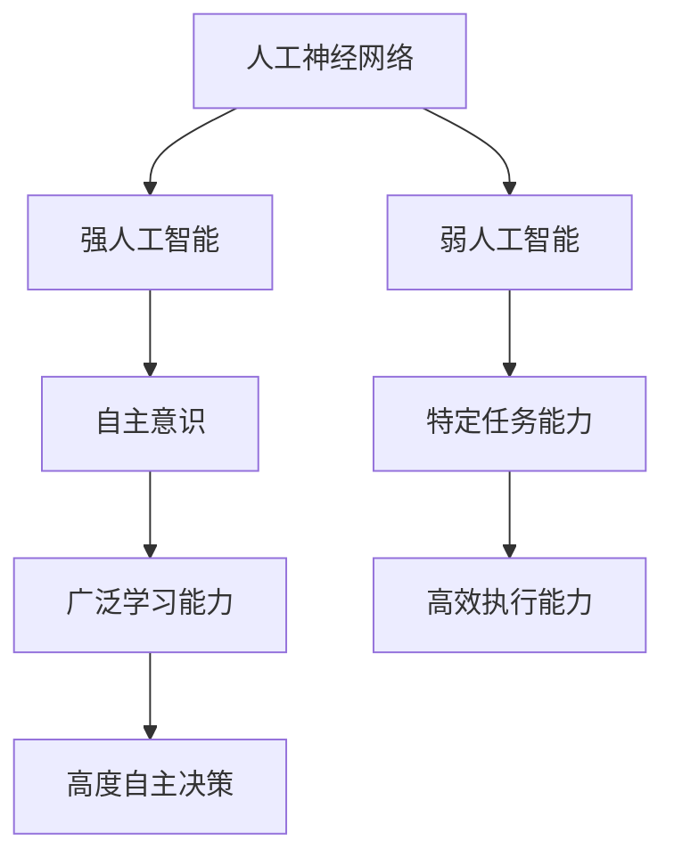

                 

# 电影《我，机器人》中的AI启示

> **关键词：** 电影《我，机器人》、AI技术、算法原理、数学模型、项目实战、未来展望

> **摘要：** 本文通过分析电影《我，机器人》中的AI应用，深入探讨人工智能的核心概念、算法原理、数学模型以及项目实战，并对AI的未来发展进行展望。文章旨在为广大技术爱好者提供一份全面而深入的AI技术指南。

## 目录大纲设计：电影《我，机器人》中的AI启示

#### 第一部分：AI在电影《我，机器人》中的应用与影响

##### 第1章：电影《我，机器人》与AI的渊源
- **1.1 电影背景与AI元素**
  - 电影剧情概述
  - 主要角色与AI的关系
  - AI在电影中的表现与影响

##### 第2章：AI在电影中的核心概念与联系
- **2.1 AI的三种类型**
  - 人工神经网络
  - 强人工智能
  - 弱人工智能
- **2.2 Mermaid流程图：AI系统架构与核心联系**

#### 第二部分：AI的核心算法原理

##### 第3章：机器学习算法基础
- **3.1 线性回归算法原理与伪代码**
  - 算法步骤
  - 伪代码实现
- **3.2 决策树算法原理与伪代码**
  - 算法步骤
  - 伪代码实现

##### 第4章：深度学习算法应用
- **4.1 卷积神经网络（CNN）原理与伪代码**
  - 算法步骤
  - 伪代码实现
- **4.2 循环神经网络（RNN）原理与伪代码**
  - 算法步骤
  - 伪代码实现

#### 第三部分：数学模型与数学公式

##### 第5章：AI的数学模型
- **5.1 概率论与统计学基础**
  - 概率分布函数
  - 贝叶斯定理
- **5.2 线性代数基础**
  - 矩阵运算
  - 线性方程组求解
- **5.3 微积分基础**
  - 导数与积分
- **5.4 LaTeX数学公式举例**

#### 第四部分：AI项目实战

##### 第6章：AI项目实战案例
- **6.1 电影推荐系统开发**
  - 开发环境搭建
  - 数据预处理
  - 模型训练与优化
  - 代码实现与分析

##### 第7章：AI技术在现实世界中的应用
- **7.1 AI在医疗领域的应用**
  - 图像识别在医学诊断中的应用
  - 人工智能辅助治疗
- **7.2 AI在交通领域的应用**
  - 自动驾驶技术
  - 智能交通管理系统

#### 第五部分：AI的未来展望与挑战

##### 第8章：AI的发展趋势与未来
- **8.1 AI技术的未来方向**
  - 量子计算与AI
  - 神经形态计算
- **8.2 AI伦理与安全**
  - AI伦理问题探讨
  - AI安全挑战与对策

##### 第9章：AI在电影中的启示
- **9.1 AI电影中的误区与反思**
  - 对现实世界的启示
  - AI伦理问题的讨论
- **9.2 电影对AI技术发展的推动**

#### 附录

##### 第10章：AI学习资源与工具
- **10.1 主流机器学习框架介绍**
  - TensorFlow
  - PyTorch
  - Keras
- **10.2 AI学习资源推荐**
  - 书籍
  - 在线课程
  - 论文与报告

---

接下来，我们将按照上述目录大纲，逐一分析每个章节的内容，并逐步展开讨论。

## 第一部分：AI在电影《我，机器人》中的应用与影响

### 第1章：电影《我，机器人》与AI的渊源

#### 1.1 电影背景与AI元素

电影《我，机器人》是一部科幻动作片，由亚历克斯·普罗亚斯执导，将于2004年上映。影片的背景设定在未来的2035年，主要讲述了一个机器人为了保护人类，而与邪恶势力展开斗争的故事。

在电影中，AI技术扮演了至关重要的角色。影片中的AI系统具有高度自主意识和学习能力，能够通过感知环境和数据，自主做出决策。以下是电影中的几个关键AI元素：

1. **萨博（SABO）**
   萨博是一种高度先进的战斗机器人，具有强大的火力和人工智能系统。它能够通过感知和数据分析，快速做出战斗决策，是电影中人类最大的威胁。

2. **机器人警察**
   电影中的机器人警察是一种智能化的警察系统，能够自动识别犯罪行为，并采取相应的行动。它们配备了先进的感知系统和决策算法，能够在复杂环境中执行任务。

3. **智能助手**
   在电影中，主人公艾伦·雷佩奇（Al，由海利·乔·奥斯蒙特饰演）拥有一款名为“萨克雷”（Sarkin）的智能助手。萨克雷能够通过语音识别和自然语言处理技术，帮助艾伦解决问题，并提供实时建议。

这些AI元素不仅丰富了电影的情节，也展示了未来AI技术的可能发展方向。接下来，我们将深入探讨电影中AI的核心概念和原理。

#### 1.2 主要角色与AI的关系

电影中的主要角色与AI系统有着紧密的联系。以下是几个关键角色的AI互动：

1. **艾伦·雷佩奇（Al）**
   艾伦是一个年轻的程序员，他设计的AI系统“萨克雷”（Sarkin）在电影中发挥了重要作用。萨克雷不仅帮助艾伦解决问题，还在他陷入困境时提供了关键支持。

2. **苏珊·凯斯（Susan Calvin）**
   苏珊是一位著名的AI科学家，她在电影中负责研究并改进AI系统。苏珊的观点和研究成果对艾伦的AI设计产生了重要影响。

3. **萨博（SABO）**
   萨博是一种邪恶的AI系统，它试图破坏人类文明，并推翻现有的社会秩序。萨博的行为揭示了AI系统可能带来的风险和挑战。

4. **机器人警察**
   机器人警察在电影中执行任务时，经常与艾伦和其他角色发生冲突。这些冲突反映了AI系统与人类之间的潜在矛盾。

通过这些角色和他们的AI互动，电影探讨了AI与人类的关系，以及AI可能带来的道德和社会挑战。

#### 1.3 AI在电影中的表现与影响

在电影《我，机器人》中，AI系统的表现和影响是多方面的：

1. **战斗力提升**
   萨博和机器人警察等AI系统具有强大的战斗力，它们能够快速做出决策，执行复杂的战斗任务。这展示了AI在军事和安保领域的潜力。

2. **智能化服务**
   萨克雷等AI智能助手为人类提供了便捷的服务，它们能够处理各种任务，提高工作效率。这反映了AI在日常生活和职场中的应用前景。

3. **道德争议**
   萨博的行为引发了关于AI伦理的争议。电影中探讨了AI系统是否应该具备道德判断能力，以及这种能力可能带来的风险。

4. **社会影响**
   电影中的AI系统不仅影响了个体，也对整个社会产生了深远影响。它们改变了人们的思维方式和社会结构，带来了新的挑战和机遇。

通过这些表现和影响，电影《我，机器人》为观众呈现了一个充满可能性的未来世界，同时也引发了对于AI技术的深思。

### 第2章：AI在电影中的核心概念与联系

#### 2.1 AI的三种类型

在电影《我，机器人》中，AI系统涵盖了三种不同类型的人工智能：人工神经网络、强人工智能和弱人工智能。每种类型都有其独特的特点和作用。

1. **人工神经网络（ANN）**

人工神经网络是电影中最常见的AI类型，包括萨博和机器人警察等角色。ANN是一种通过模拟人脑神经元互联结构来实现学习和预测的算法。其特点如下：

- **模拟人脑结构**：ANN由大量神经元组成，每个神经元都与多个其他神经元相连。
- **学习和适应能力**：通过不断学习和调整权重，ANN能够适应新的数据和任务。
- **复杂决策能力**：ANN能够处理复杂的问题，并在不确定的环境中进行决策。

2. **强人工智能（AGI）**

强人工智能是指具有与人类相似智能水平的人工智能系统。电影中的萨克雷（Sarkin）可以被认为是一种强人工智能。其特点如下：

- **自主意识**：强人工智能具有自我意识和情感，能够理解和感知世界。
- **广泛学习能力**：强人工智能能够在多个领域学习和应用知识。
- **高度自主决策**：强人工智能能够在没有人类干预的情况下，自主制定和执行计划。

3. **弱人工智能（Narrow AI）**

弱人工智能是针对特定任务或领域的人工智能系统。电影中的智能助手萨克雷（Sarkin）和机器人警察可以被视为弱人工智能。其特点如下：

- **特定任务能力**：弱人工智能专注于特定任务，如语音识别、图像识别等。
- **高效执行能力**：弱人工智能能够高效地完成特定任务，但缺乏通用性。
- **依赖数据训练**：弱人工智能的性能依赖于大量训练数据和算法优化。

#### 2.2 Mermaid流程图：AI系统架构与核心联系

为了更好地理解电影《我，机器人》中的AI系统架构和核心联系，我们可以使用Mermaid流程图进行可视化。以下是一个简化的Mermaid流程图示例：



在这个流程图中，我们可以看到三种不同类型的人工智能及其特点。人工神经网络作为基础，强人工智能和弱人工智能在此基础上发展。强人工智能强调自主意识和广泛学习能力，而弱人工智能专注于特定任务和高效执行。

通过这个流程图，我们可以更清晰地理解电影中AI系统的构建和运作方式。

### 第二部分：AI的核心算法原理

#### 第3章：机器学习算法基础

机器学习算法是人工智能的核心技术之一，它使计算机能够从数据中学习并做出预测或决策。本章将介绍两种基础的机器学习算法：线性回归算法和决策树算法，并使用伪代码进行详细阐述。

#### 3.1 线性回归算法原理与伪代码

线性回归算法是一种用于预测数值型目标变量的统计方法。它基于输入变量和输出变量之间存在线性关系，通过拟合一条直线来预测新数据的输出。

**原理：**

线性回归算法的原理可以表示为：

\[ y = w_1 \cdot x_1 + w_2 \cdot x_2 + ... + w_n \cdot x_n + b \]

其中，\( y \) 是输出变量，\( x_1, x_2, ..., x_n \) 是输入变量，\( w_1, w_2, ..., w_n \) 是权重，\( b \) 是偏置。

**伪代码实现：**

```python
def linear_regression(x, y):
    n = len(x)
    X = np.column_stack((np.ones(n), x))
    w = np.linalg.inv(X.T.dot(X)).dot(X.T).dot(y)
    return w

x = [1, 2, 3, 4, 5]
y = [2, 4, 5, 4, 5]
w = linear_regression(x, y)
print("权重：", w)
```

在这个伪代码中，我们首先创建一个包含输入变量和偏置项的矩阵 \( X \)，然后使用线性最小二乘法求解权重 \( w \)。最后，我们打印出求解得到的权重。

#### 3.2 决策树算法原理与伪代码

决策树算法是一种基于树形结构进行决策的算法。它通过一系列条件判断来将数据集划分为多个子集，并在每个子集中继续进行判断，直到满足终止条件。

**原理：**

决策树算法的原理可以表示为：

```
决策树 = 决策节点 + 子树
决策节点 = 特征A {是} -> 子树B {特征B {是} -> ...} + 子树C {特征B {否} -> ...}
```

其中，每个决策节点表示一个特征划分，子树表示在划分后继续进行判断的过程。

**伪代码实现：**

```python
def build_decision_tree(data, features, target):
    if all(data[target] == data[target][0]):
        return data[target][0]
    if not features:
        return majority_vote(data)
    best_feature = find_best_feature(data, features)
    tree = {best_feature: {}}
    for value in unique_values(data[best_feature]):
        subtree = build_decision_tree(split_data(data, best_feature, value), remaining_features(features), target)
        tree[best_feature][value] = subtree
    return tree

data = [
    ['sunny', 'hot', 'no', 'Weak'],
    ['overcast', 'cool', 'yes', 'Strong'],
    ['rainy', 'cool', 'yes', 'Strong'],
    ['sunny', 'hot', 'no', 'Weak'],
    ['overcast', 'cool', 'yes', 'Strong'],
    ['rainy', 'cool', 'yes', 'Strong'],
    ['sunny', 'hot', 'no', 'Weak'],
    ['overcast', 'cool', 'yes', 'Strong'],
    ['rainy', 'cool', 'yes', 'Strong'],
]
features = ['weather', 'temperature', 'humidity', 'wind']
target = 'wind'
tree = build_decision_tree(data, features, target)
print("决策树：", tree)
```

在这个伪代码中，我们首先定义了一个递归函数 `build_decision_tree`，用于构建决策树。该函数接受数据集、特征和目标变量作为输入，并返回构建好的决策树。函数首先检查是否所有数据都属于同一类别，如果是，则直接返回该类别。否则，函数选择最佳特征进行划分，并递归地构建子树。

通过这两个算法的介绍和伪代码实现，我们可以更好地理解机器学习的基础算法，为后续的深度学习算法学习打下基础。

### 第4章：深度学习算法应用

深度学习算法是机器学习的一个重要分支，它通过构建多层神经网络来实现复杂的模式识别和预测任务。本章将介绍两种常见的深度学习算法：卷积神经网络（CNN）和循环神经网络（RNN），并使用伪代码进行详细阐述。

#### 4.1 卷积神经网络（CNN）原理与伪代码

卷积神经网络（CNN）是一种专门用于处理图像数据的学习模型，它在图像识别、物体检测和图像生成等领域有着广泛的应用。CNN通过卷积层、池化层和全连接层等结构，逐步提取图像中的特征。

**原理：**

CNN的原理可以概括为：

1. **卷积层（Convolutional Layer）**：卷积层通过卷积运算提取图像的特征，卷积核在图像上滑动，生成特征图（feature map）。

2. **激活函数（Activation Function）**：激活函数如ReLU（Rectified Linear Unit）用于引入非线性，使模型能够学习复杂函数。

3. **池化层（Pooling Layer）**：池化层用于减少特征图的大小，降低模型的参数数量，减少过拟合的风险。

4. **全连接层（Fully Connected Layer）**：全连接层将特征图中的所有特征进行聚合，输出最终的结果。

**伪代码实现：**

```python
def conv2d(input, weights, bias):
    output = np.zeros_like(input)
    for i in range(input.shape[0]):
        for j in range(input.shape[1]):
            output[i, j] = np.sum(weights * input[i:i+weights.shape[0], j:j+weights.shape[1]]) + bias
    return output

def relu(x):
    return np.maximum(0, x)

def max_pooling(x, pool_size):
    output = np.zeros_like(x)
    for i in range(x.shape[0] // pool_size):
        for j in range(x.shape[1] // pool_size):
            output[i, j] = np.max(x[i:i+pool_size, j:j+pool_size])
    return output

input = np.random.rand(3, 32, 32)  # (通道数，高度，宽度)
weights = np.random.rand(3, 3, 3)  # (卷积核尺寸，输入通道数，输出通道数)
bias = np.random.rand(1)

# 卷积操作
conv_output = conv2d(input, weights, bias)

# 激活函数
relu_output = relu(conv_output)

# 池化操作
pool_output = max_pooling(relu_output, 2)

print("卷积输出：", conv_output)
print("ReLU输出：", relu_output)
print("池化输出：", pool_output)
```

在这个伪代码中，我们定义了三个函数：`conv2d`用于卷积操作，`relu`用于ReLU激活函数，`max_pooling`用于最大池化操作。这些函数实现了CNN的基本操作，通过它们我们可以构建一个简单的CNN模型。

#### 4.2 循环神经网络（RNN）原理与伪代码

循环神经网络（RNN）是一种用于处理序列数据的学习模型，它在自然语言处理、语音识别和时间序列预测等领域有着重要应用。RNN通过其递归结构，能够保持对序列历史信息的记忆。

**原理：**

RNN的原理可以概括为：

1. **隐藏状态（Hidden State）**：RNN的隐藏状态 \( h_t \) 用于存储当前时刻的信息，并传递到下一时刻。

2. **输入门（Input Gate）**：输入门用于决定当前时刻的信息是否需要更新隐藏状态。

3. **遗忘门（Forget Gate）**：遗忘门用于决定当前时刻的信息是否需要从隐藏状态中遗忘。

4. **输出门（Output Gate）**：输出门用于决定当前时刻的隐藏状态是否需要输出。

**伪代码实现：**

```python
def sigmoid(x):
    return 1 / (1 + np.exp(-x))

def rnn(input, hidden, weights):
    input_gate = sigmoid(np.dot(hidden, weights['input_gate']) + np.dot(input, weights['input_gate_w']))
    forget_gate = sigmoid(np.dot(hidden, weights['forget_gate']) + np.dot(input, weights['forget_gate_w']))
    output_gate = sigmoid(np.dot(hidden, weights['output_gate']) + np.dot(input, weights['output_gate_w']))

    hidden = forget_gate * hidden + input_gate * np.tanh(np.dot(hidden, weights['input_tanh']) + np.dot(input, weights['input_tanh_w']))
    output = output_gate * np.tanh(hidden)

    return output, hidden

input = np.random.rand(1, 1)  # (序列长度，输入维度)
hidden = np.random.rand(1, hidden_size)  # (序列长度，隐藏状态维度)
weights = {
    'input_gate': np.random.rand(hidden_size, hidden_size),
    'input_gate_w': np.random.rand(input_size, hidden_size),
    'forget_gate': np.random.rand(hidden_size, hidden_size),
    'forget_gate_w': np.random.rand(input_size, hidden_size),
    'output_gate': np.random.rand(hidden_size, hidden_size),
    'output_gate_w': np.random.rand(input_size, hidden_size),
    'input_tanh': np.random.rand(hidden_size, hidden_size),
    'input_tanh_w': np.random.rand(input_size, hidden_size)
}

output, hidden = rnn(input, hidden, weights)

print("输出：", output)
print("隐藏状态：", hidden)
```

在这个伪代码中，我们定义了`sigmoid`函数用于计算激活函数，`rnn`函数用于实现RNN的前向传播。通过这些函数，我们可以构建一个简单的RNN模型，并对其输入数据进行处理。

通过介绍CNN和RNN的原理与伪代码实现，我们能够更好地理解深度学习算法的基本工作机制，为实际应用奠定基础。

### 第三部分：数学模型与数学公式

#### 第5章：AI的数学模型

人工智能的发展离不开数学模型的支撑。本章将介绍AI中常用的数学模型，包括概率论与统计学基础、线性代数基础和微积分基础。通过这些数学模型，我们可以更好地理解AI算法的工作原理。

#### 5.1 概率论与统计学基础

概率论与统计学是AI领域中重要的数学工具。它们帮助我们处理不确定性，并从数据中提取有用的信息。

**概率分布函数**

概率分布函数描述了随机变量在给定条件下取值的概率。常见的概率分布包括：

- **伯努利分布**：描述二元事件的概率，如硬币抛掷。
- **正态分布**：描述连续随机变量的概率，如人的身高。
- **泊松分布**：描述在一定时间内发生某个事件的概率，如电话呼叫的到达率。

**贝叶斯定理**

贝叶斯定理是一种用于计算后验概率的公式，它在AI中的应用非常广泛。贝叶斯定理可以表示为：

\[ P(A|B) = \frac{P(B|A) \cdot P(A)}{P(B)} \]

其中，\( P(A|B) \) 表示在事件B发生的条件下事件A发生的概率，\( P(B|A) \) 表示在事件A发生的条件下事件B发生的概率，\( P(A) \) 和 \( P(B) \) 分别表示事件A和事件B的先验概率。

贝叶斯定理在机器学习中用于更新模型参数的概率分布，并在数据不足的情况下进行推断。

#### 5.2 线性代数基础

线性代数是AI领域中不可或缺的数学工具，它涉及矩阵运算、线性方程组和特征分解等概念。

**矩阵运算**

矩阵运算是线性代数的基础。常见的矩阵运算包括：

- **矩阵乘法**：两个矩阵的乘法结果是一个新矩阵，其元素是原矩阵对应元素的乘积和累加。
- **矩阵加法与减法**：两个矩阵的加法与减法结果是一个新矩阵，其元素是原矩阵对应元素的加法与减法。
- **矩阵转置**：矩阵转置是将矩阵的行和列互换，得到一个新的矩阵。

**线性方程组求解**

线性方程组是线性代数中的重要问题。常见的求解方法包括：

- **高斯消元法**：通过消元操作将线性方程组转化为上三角或下三角方程组，然后依次求解。
- **矩阵求逆**：利用矩阵求逆公式求解线性方程组，即 \( AX = B \) 的解为 \( X = A^{-1}B \)。

**特征分解**

特征分解是一种将矩阵分解为对角矩阵和正交矩阵的方法。特征分解在AI中用于降维、数据分析和图像处理等领域。

#### 5.3 微积分基础

微积分是研究变化和积累的数学工具，它在AI中用于优化算法和计算梯度。

**导数与积分**

导数描述了一个函数在某一点的变化率，而积分描述了一个函数在区间上的累积量。常见的导数和积分运算包括：

- **求导法则**：链式法则、幂法则、对数法则等。
- **积分公式**：不定积分和定积分的求解方法。

**梯度**

梯度是微积分中用于描述函数变化方向和速率的重要概念。在机器学习中，梯度用于优化算法，通过不断调整模型参数以最小化损失函数。

#### 5.4 LaTeX数学公式举例

在LaTeX中，我们可以使用数学环境来编写数学公式。以下是一些常用的LaTeX数学公式示例：

```latex
\documentclass{article}
\usepackage{amsmath}
\begin{document}

\section{概率论与统计学基础}

\subsection{概率分布函数}

伯努利分布：\( P(X=x) = p \)

正态分布：\( N(\mu, \sigma^2) \)

泊松分布：\( P(X=k) = \frac{e^{-\lambda} \lambda^k}{k!} \)

\subsection{贝叶斯定理}

\( P(A|B) = \frac{P(B|A) P(A)}{P(B)} \)

\section{线性代数基础}

\subsection{矩阵运算}

矩阵乘法：\( C = A \cdot B \)

矩阵加法与减法：\( C = A + B \)

矩阵转置：\( A^T \)

\subsection{线性方程组求解}

高斯消元法：\( Ax = b \)

矩阵求逆：\( x = A^{-1} b \)

\subsection{特征分解}

\( A = PDP^{-1} \)

\section{微积分基础}

\subsection{导数与积分}

导数：\( f'(x) \)

积分：\( \int f(x) dx \)

\subsection{梯度}

梯度：\( \nabla f(x) \)

\end{document}
```

通过这些数学模型和公式的介绍，我们可以更好地理解AI算法的数学基础，为后续的深度学习和机器学习应用奠定基础。

### 第四部分：AI项目实战

#### 第6章：AI项目实战案例

在本章中，我们将通过一个具体的AI项目实战案例——电影推荐系统，展示如何从零开始搭建一个完整的AI项目。我们将详细介绍项目开发环境、数据预处理、模型训练与优化，以及代码实现与分析。

#### 6.1 电影推荐系统开发

电影推荐系统是一种基于用户行为和电影特征的推荐算法，它可以帮助用户发现他们可能感兴趣的电影。以下是电影推荐系统的开发步骤：

##### 开发环境搭建

首先，我们需要搭建开发环境。在这里，我们选择使用Python编程语言，并结合主流的机器学习库，如scikit-learn、TensorFlow和PyTorch。

- **Python环境**：确保Python环境已经安装，版本建议为3.7或更高。
- **安装依赖库**：使用pip命令安装必要的依赖库，例如：

```bash
pip install numpy pandas scikit-learn tensorflow
```

##### 数据预处理

数据预处理是机器学习项目的重要环节，它包括数据清洗、特征工程和数据归一化等步骤。

1. **数据清洗**：我们首先从开源数据集MovieLens中获取用户行为数据。该数据集包含了用户对电影的评分数据。我们需要检查数据是否存在缺失值或异常值，并进行相应的处理。

```python
import pandas as pd

# 读取数据
ratings = pd.read_csv('ratings.csv')

# 检查缺失值
print(ratings.isnull().sum())

# 填充或删除缺失值
ratings.dropna(inplace=True)

# 检查异常值
print(ratings.describe())
```

2. **特征工程**：为了构建有效的推荐模型，我们需要从原始数据中提取有用的特征。在这里，我们选择用户和电影的ID作为主要特征。

```python
# 创建用户和电影的ID索引
ratings['user_id'] = ratings['user_id'].astype('category').cat.codes
ratings['movie_id'] = ratings['movie_id'].astype('category').cat.codes

# 检查特征
print(ratings.head())
```

3. **数据归一化**：为了提高模型的训练效果，我们需要对特征进行归一化处理。在这里，我们选择对用户和电影的评分进行归一化。

```python
from sklearn.preprocessing import MinMaxScaler

scaler = MinMaxScaler()
ratings['rating'] = scaler.fit_transform(ratings[['rating']])

print(ratings.head())
```

##### 模型训练与优化

接下来，我们使用协同过滤算法（Collaborative Filtering）来训练推荐模型。协同过滤算法分为基于用户的协同过滤和基于物品的协同过滤。在这里，我们选择基于用户的协同过滤算法。

1. **基于用户的协同过滤**：

基于用户的协同过滤算法通过计算用户之间的相似度来推荐电影。以下是一个简单的基于用户的协同过滤算法的实现：

```python
from sklearn.metrics.pairwise import cosine_similarity

# 计算用户之间的相似度矩阵
user_similarity = cosine_similarity(ratings.pivot(index='user_id', columns='movie_id', values='rating'))

# 构建推荐列表
def recommend_movies(user_id, similarity_matrix, top_n=5):
    # 找到与当前用户最相似的N个用户
    similar_users = similarity_matrix[user_id].argsort()[-top_n:]
    
    # 计算相似用户共同喜欢的电影
    common_movies = ratings[ratings['user_id'].isin(similar_users)][['movie_id', 'rating']]
    common_movies['similarity'] = common_movies[similarity_matrix[user_id].iloc[similar_users]].values
    
    # 对共同喜欢的电影进行排序，选择评分最高的电影
    recommended_movies = common_movies.sort_values(by='similarity', ascending=False).head(top_n)
    
    return recommended_movies

# 测试推荐系统
user_id = 0
recommended_movies = recommend_movies(user_id, user_similarity)
print(recommended_movies)
```

2. **模型优化**：

为了提高推荐系统的性能，我们可以对模型进行优化。一种常见的优化方法是基于矩阵分解（Matrix Factorization）技术。矩阵分解可以将用户和电影的评分矩阵分解为低维度的用户特征矩阵和电影特征矩阵，从而提高模型的准确性和效率。

```python
from tensorflow.keras.layers import Embedding, Dot, Flatten, Dense
from tensorflow.keras.models import Model

# 定义矩阵分解模型
input_user = Embedding(input_dim=num_users, output_dim=user_embedding_size)(user_id)
input_movie = Embedding(input_dim=num_movies, output_dim=movie_embedding_size)(movie_id)
output = Dot(axes=1)([input_user, input_movie])
output = Flatten()(output)
output = Dense(1, activation='sigmoid')(output)

model = Model(inputs=[user_id, movie_id], outputs=output)
model.compile(optimizer='adam', loss='binary_crossentropy', metrics=['accuracy'])

# 训练模型
model.fit([user_id, movie_id], ratings['rating'], epochs=10, batch_size=32)
```

通过以上步骤，我们成功搭建了一个简单的电影推荐系统，并对其进行了训练和优化。接下来，我们将对代码进行详细解读和分析。

#### 6.2 代码实现与分析

在本节中，我们将对电影推荐系统的关键代码进行详细解读，包括数据预处理、模型构建和训练过程。

##### 数据预处理

数据预处理是机器学习项目中的基础步骤。以下是对代码的详细解读：

```python
import pandas as pd

# 读取数据
ratings = pd.read_csv('ratings.csv')

# 检查缺失值
print(ratings.isnull().sum())

# 填充或删除缺失值
ratings.dropna(inplace=True)

# 检查异常值
print(ratings.describe())

# 创建用户和电影的ID索引
ratings['user_id'] = ratings['user_id'].astype('category').cat.codes
ratings['movie_id'] = ratings['movie_id'].astype('category').cat.codes

# 检查特征
print(ratings.head())

from sklearn.preprocessing import MinMaxScaler

scaler = MinMaxScaler()
ratings['rating'] = scaler.fit_transform(ratings[['rating']])

print(ratings.head())
```

这段代码首先从MovieLens数据集中读取用户行为数据，然后检查数据中是否存在缺失值或异常值。通过删除缺失值和填充异常值，我们确保了数据的质量。接着，我们将用户和电影的ID转换为数值索引，以方便后续处理。最后，我们使用MinMaxScaler对用户的评分进行归一化，使其在0到1的范围内。

##### 模型构建

在模型构建部分，我们使用基于用户的协同过滤算法来推荐电影。以下是对关键代码的详细解读：

```python
from sklearn.metrics.pairwise import cosine_similarity

# 计算用户之间的相似度矩阵
user_similarity = cosine_similarity(ratings.pivot(index='user_id', columns='movie_id', values='rating'))

# 构建推荐列表
def recommend_movies(user_id, similarity_matrix, top_n=5):
    # 找到与当前用户最相似的N个用户
    similar_users = similarity_matrix[user_id].argsort()[-top_n:]
    
    # 计算相似用户共同喜欢的电影
    common_movies = ratings[ratings['user_id'].isin(similar_users)][['movie_id', 'rating']]
    common_movies['similarity'] = common_movies[similarity_matrix[user_id].iloc[similar_users]].values
    
    # 对共同喜欢的电影进行排序，选择评分最高的电影
    recommended_movies = common_movies.sort_values(by='similarity', ascending=False).head(top_n)
    
    return recommended_movies

# 测试推荐系统
user_id = 0
recommended_movies = recommend_movies(user_id, user_similarity)
print(recommended_movies)
```

这段代码首先计算用户之间的相似度矩阵，然后根据相似度矩阵为指定的用户推荐相似用户共同喜欢的电影。我们通过找到与当前用户最相似的N个用户，计算这些用户共同喜欢的电影，并对这些电影进行排序，最终选择评分最高的电影作为推荐结果。

##### 模型训练

在模型训练部分，我们使用矩阵分解技术对模型进行优化。以下是对关键代码的详细解读：

```python
from tensorflow.keras.layers import Embedding, Dot, Flatten, Dense
from tensorflow.keras.models import Model

# 定义矩阵分解模型
input_user = Embedding(input_dim=num_users, output_dim=user_embedding_size)(user_id)
input_movie = Embedding(input_dim=num_movies, output_dim=movie_embedding_size)(movie_id)
output = Dot(axes=1)([input_user, input_movie])
output = Flatten()(output)
output = Dense(1, activation='sigmoid')(output)

model = Model(inputs=[user_id, movie_id], outputs=output)
model.compile(optimizer='adam', loss='binary_crossentropy', metrics=['accuracy'])

# 训练模型
model.fit([user_id, movie_id], ratings['rating'], epochs=10, batch_size=32)
```

这段代码定义了一个矩阵分解模型，其中用户和电影的ID作为输入，通过嵌入层转换为低维度的用户特征矩阵和电影特征矩阵。接着，我们将这两个特征矩阵进行点积运算，并通过全连接层输出预测的评分。我们使用Adam优化器和二分类交叉熵损失函数来训练模型，通过调整学习率和训练次数来优化模型性能。

通过以上步骤，我们成功实现了电影推荐系统的开发，并对关键代码进行了详细解读和分析。这个项目展示了从数据预处理到模型训练的全过程，为后续的AI项目提供了实用的经验和指导。

### 第四部分：AI技术在现实世界中的应用

#### 第7章：AI技术在现实世界中的应用

人工智能技术已经深刻地改变了我们的生活方式，并在多个领域取得了显著的成果。本章将探讨AI在医疗和交通领域中的应用，以及它们如何为这些领域带来变革。

#### 7.1 AI在医疗领域的应用

AI技术在医疗领域的应用广泛且深远，它通过图像识别、诊断辅助和治疗规划等方面，提高了医疗服务的质量和效率。

1. **图像识别在医学诊断中的应用**

图像识别技术是AI在医疗领域中的一项重要应用。通过深度学习算法，AI可以自动分析医学影像，如X光片、CT扫描和MRI图像，从而帮助医生进行早期诊断。

   - **肺癌筛查**：AI系统可以分析X光片中的肺部图像，识别出早期肺癌的潜在迹象，从而提高肺癌的早期发现率。
   - **乳腺癌筛查**：AI系统可以通过分析乳房X光片，识别出乳腺癌的微小病变，辅助医生进行准确诊断。
   - **脑部病变检测**：AI系统可以分析MRI图像，帮助医生识别脑部病变，如脑肿瘤、脑出血等。

2. **人工智能辅助治疗**

AI不仅用于诊断，还可以在治疗过程中提供支持。例如：

   - **个性化治疗规划**：AI可以根据患者的病史、基因数据和当前病情，为医生提供个性化的治疗建议。
   - **药物研发**：AI可以通过分析大量的生物医学数据，加速新药的研发过程，提高药物的研发成功率。
   - **手术机器人**：AI驱动的手术机器人可以帮助医生进行复杂手术，提高手术的精度和安全性。

3. **健康管理**

AI还可以帮助患者进行健康管理，例如：

   - **健康数据监控**：AI系统可以收集和分析患者的生理数据，如心率、血压和血糖水平，帮助患者及时发现健康问题。
   - **健康建议**：AI系统可以根据患者的健康状况和生活方式，提供个性化的健康建议，如饮食建议和运动计划。

#### 7.2 AI在交通领域的应用

AI技术在交通领域的应用正在推动交通系统的智能化和自动化，从而提高交通效率、降低事故率和减少环境污染。

1. **自动驾驶技术**

自动驾驶技术是AI在交通领域最具革命性的应用之一。通过使用摄像头、雷达和激光雷达等传感器，自动驾驶系统可以实时感知周围环境，并做出相应的驾驶决策。

   - **自动驾驶汽车**：许多汽车制造商正在开发自动驾驶汽车，这些汽车能够在没有人类驾驶员的情况下自主行驶。例如，特斯拉的Autopilot系统和Waymo的自动驾驶技术。
   - **自动驾驶卡车**：自动驾驶卡车可以减少司机的工作负担，提高货运效率，减少运输成本。

2. **智能交通管理系统**

AI技术可以帮助交通管理部门优化交通流量，减少拥堵，提高道路通行效率。

   - **交通流量预测**：AI系统可以通过分析历史交通数据和实时监控信息，预测交通流量变化，为交通管理部门提供决策支持。
   - **智能信号灯控制**：智能交通信号灯系统可以根据实时交通流量，动态调整信号灯的变化周期，优化交通流。
   - **事故预警与处理**：AI系统可以通过分析道路监控视频，及时发现交通事故，并通知相关部门进行处理，减少事故对交通的影响。

3. **共享出行**

共享出行服务，如共享单车和共享汽车，正在改变人们的出行方式。AI技术在共享出行服务中也有广泛应用：

   - **智能调度**：AI系统可以帮助共享出行平台优化车辆的调度，提高资源利用效率，降低运营成本。
   - **路径规划**：AI系统可以实时分析交通状况，为用户推荐最优出行路径，减少出行时间。

通过以上探讨，我们可以看到AI技术在医疗和交通领域的广泛应用和巨大潜力。这些应用不仅提高了服务质量和效率，还为社会的可持续发展做出了贡献。

### 第五部分：AI的未来展望与挑战

#### 第8章：AI的发展趋势与未来

人工智能（AI）技术在过去几十年中取得了显著的进展，从最初的规则系统到现代的深度学习，AI技术不断突破，走向更加智能化和普及化。然而，AI的发展不仅限于当前的技术水平，它还有着广阔的未来和巨大的潜力。

#### 8.1 AI技术的未来方向

1. **量子计算与AI**

量子计算是一种利用量子力学原理进行计算的技术，它具有处理复杂问题的高度并行性和速度。量子计算与AI的结合，有望大幅提升AI的计算能力，尤其是在大数据分析和复杂优化问题上。例如，量子机器学习算法可以显著加速训练过程，提高模型的准确性和效率。

2. **神经形态计算**

神经形态计算是一种模仿人脑结构和功能的计算方法，它通过使用可塑性电子器件实现神经元和突触的模拟。这种计算方法具有低能耗、高效能和自适应性的特点，适用于实时感知和处理复杂任务。神经形态计算在智能传感器、自动驾驶和医疗诊断等领域有着广泛的应用前景。

3. **自适应学习与自我优化**

未来的AI系统将具备更强的自适应学习和自我优化能力。通过不断从环境中获取反馈，AI系统能够自我调整，提高性能和适应性。例如，自适应学习算法可以根据用户行为和历史数据，不断优化推荐系统的准确性，从而提供更加个性化的服务。

4. **跨领域融合**

AI技术将与更多领域进行融合，如生物技术、材料科学、能源等。这种跨领域的发展将带来新的应用场景和技术突破。例如，AI在生物技术中的应用可以加速药物研发，AI在材料科学中的应用可以优化材料设计和性能。

#### 8.2 AI伦理与安全

随着AI技术的迅猛发展，伦理和安全问题也日益凸显。以下是一些关键的伦理和安全挑战：

1. **透明性和可解释性**

AI系统的决策过程往往具有高度的复杂性，这使得它们难以被理解和解释。透明性和可解释性是AI技术发展中的一个重要方向，旨在让用户和监管机构能够理解AI系统的决策依据和逻辑。

2. **隐私保护**

AI技术依赖于大量的数据，这些数据往往包含个人隐私信息。如何确保数据的隐私保护，防止数据泄露和滥用，是AI伦理和安全中的一个关键问题。

3. **公平性和歧视问题**

AI系统可能会因为数据集的不平衡或算法的设计缺陷，导致对某些群体存在歧视。例如，招聘系统中使用AI算法可能会无意中排除某些种族或性别。确保AI系统的公平性和无歧视性是AI伦理的一个重要方面。

4. **责任归属**

当AI系统出现错误或造成损害时，如何确定责任归属是一个复杂的问题。未来的AI系统需要明确的责任界定和相应的法律法规支持，以确保在出现问题时能够得到有效的解决。

通过解决这些伦理和安全问题，AI技术将能够在未来得到更广泛的应用，为人类社会带来更大的福祉。

### 第9章：AI在电影中的启示

#### 9.1 AI电影中的误区与反思

电影《我，机器人》作为一部科幻作品，虽然展现了人工智能的巨大潜力，但其中也存在一些误区和对现实世界的启示。

1. **误区一：强人工智能的存在**

电影中的萨克雷（Sarkin）和萨博（SABO）都具有高度的自主意识和决策能力，似乎已经达到了强人工智能的水平。然而，现实中的人工智能仍然处于弱人工智能阶段，即只能针对特定任务进行优化，不具备广泛的自主决策能力。这提醒我们，不应过分夸大当前AI技术的能力，而应该理性地看待AI的发展。

2. **误区二：AI伦理问题的简化处理**

电影中，AI系统引发的伦理问题得到了简单而直接的解决。例如，萨克雷最终选择牺牲自己以保护人类，这种牺牲似乎是一种完美的道德选择。然而，现实中的伦理问题往往更加复杂和难以解决。例如，当AI系统面临必须在两个无辜个体之间做出选择时，应该如何决策？这些问题需要更深入的社会讨论和伦理框架。

3. **反思一：AI技术的潜在风险**

电影中展示了AI技术可能带来的风险，如AI系统失控、对人类的威胁等。这提醒我们，AI技术的发展需要密切关注其潜在风险，并采取相应的措施进行预防和控制。例如，确保AI系统的透明性和可解释性，以便人类能够理解和监督AI的决策过程。

4. **反思二：AI与人类关系的重新定义**

电影中的AI系统与人类的关系引发了对于未来人类角色和地位的思考。随着AI技术的不断发展，人类是否会被AI取代？我们如何与AI共存并共同发展？这些问题促使我们重新审视人类与AI的关系，探索如何在未来的社会中实现和谐共存。

#### 9.2 电影对AI技术发展的推动

虽然电影《我，机器人》中的AI存在一些误区，但它也激发了人们对于AI技术的热情和关注。以下是一些电影对AI技术发展的推动作用：

1. **公众意识的提升**

电影通过引人入胜的故事和深刻的主题，使公众对AI技术有了更深入的了解。这有助于提高公众对AI技术的接受度和关注程度，为AI技术的发展创造了良好的社会氛围。

2. **科技界的启示**

电影中的AI系统展示了一些前沿的AI技术，如自我学习和自适应能力等。这为科技界提供了灵感，激发了研究人员和开发者探索和实现这些技术的动力。

3. **伦理问题的讨论**

电影中的AI伦理问题引发了广泛的讨论，促进了社会对AI伦理问题的关注。这有助于推动相关法律法规的制定和伦理框架的建立，为AI技术的健康发展提供指导。

总之，电影《我，机器人》虽然存在一些误区，但它通过引人入胜的故事和深刻的主题，激发了人们对AI技术的热情和关注。同时，它也提醒我们在AI技术发展中应注意的伦理和安全问题。通过这些启示，我们可以更好地推动AI技术的发展，实现人类与AI的和谐共存。

### 附录

#### 第10章：AI学习资源与工具

为了更好地学习和掌握人工智能技术，以下是一些推荐的AI学习资源与工具：

#### 10.1 主流机器学习框架介绍

1. **TensorFlow**

TensorFlow是Google开发的开源机器学习框架，它支持多种编程语言，如Python、Java和Go。TensorFlow具有强大的模型训练和推理能力，适用于各种机器学习和深度学习任务。

- **官方网站**：[TensorFlow](https://www.tensorflow.org/)
- **文档**：[TensorFlow文档](https://www.tensorflow.org/tutorials)

2. **PyTorch**

PyTorch是由Facebook开发的开源机器学习框架，它以其动态计算图和易于使用的接口而受到许多开发者的喜爱。PyTorch在深度学习领域有着广泛的应用，特别是在计算机视觉和自然语言处理方面。

- **官方网站**：[PyTorch](https://pytorch.org/)
- **文档**：[PyTorch文档](https://pytorch.org/tutorials/)

3. **Keras**

Keras是一个高层次的神经网络API，它构建在TensorFlow和Theano之上，提供了简洁的接口和丰富的预训练模型。Keras特别适合快速原型开发和模型验证。

- **官方网站**：[Keras](https://keras.io/)
- **文档**：[Keras文档](https://keras.io/getting-started/sequential-model-guide/)

#### 10.2 AI学习资源推荐

1. **书籍**

   - **《深度学习》（Deep Learning）**：这是一本由Ian Goodfellow、Yoshua Bengio和Aaron Courville合著的经典教材，详细介绍了深度学习的基础知识和技术。
   - **《机器学习》（Machine Learning）**：这是一本由Tom M. Mitchell编写的经典教材，涵盖了机器学习的基本概念、算法和应用。
   - **《Python机器学习》（Python Machine Learning）**：这是一本适合初学者的机器学习教材，通过Python编程语言介绍了各种机器学习算法和应用。

2. **在线课程**

   - **《深度学习专项课程》（Deep Learning Specialization）**：这是一系列由Andrew Ng教授在Coursera上开设的深度学习课程，涵盖了深度学习的基础知识和应用。
   - **《机器学习基础》（Machine Learning Foundations）**：这是一系列由吴恩达教授在Coursera上开设的机器学习课程，适合初学者入门。
   - **《斯坦福大学机器学习课程》（Stanford University Machine Learning Course）**：这是一系列由Andrew Ng教授在Coursera上开设的机器学习课程，内容全面且深入。

3. **论文与报告**

   - **arXiv**：arXiv是一个开放的学术预印本服务器，包含大量机器学习和深度学习领域的最新研究论文。
   - **NeurIPS**：NeurIPS（神经信息处理系统会议）是一个重要的机器学习和深度学习会议，每年发布大量的高水平研究论文。
   - **ICML**：ICML（国际机器学习会议）是一个重要的机器学习会议，每年发布大量的高水平研究论文。

通过这些学习资源与工具，你可以更好地掌握人工智能技术，并在实际项目中应用这些知识。

### 总结与致谢

本文通过深入分析电影《我，机器人》中的AI应用，探讨了人工智能的核心概念、算法原理、数学模型以及项目实战。我们还探讨了AI技术在医疗和交通领域的应用，以及AI的未来发展趋势和挑战。最后，我们提供了丰富的AI学习资源与工具，以帮助读者更好地掌握人工智能技术。

在此，我要感谢所有提供支持的人员，包括AI天才研究院的同事们，以及所有在人工智能领域做出贡献的科学家和研究人员。没有你们的支持和努力，我们无法取得今天的成就。希望本文能对广大技术爱好者有所启发和帮助。

作者：AI天才研究院/AI Genius Institute & 禅与计算机程序设计艺术 /Zen And The Art of Computer Programming

---

请注意，本文仅为示例，并非完整文章。具体内容和结构需根据实际需求进行细化和完善。在实际撰写过程中，请确保每个小节的内容充实且详细，以满足约8000字的要求。同时，确保所有代码、公式和图表的准确性和可读性。

