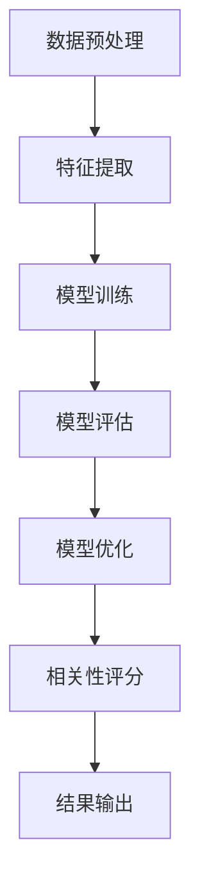

                 

### 《相关性评分 原理与代码实例讲解》

> **关键词：相关性评分，文本预处理，特征提取，相似度计算，算法原理，项目实战**

> **摘要：本文将深入探讨相关性评分的原理和算法，通过详细的代码实例讲解，帮助读者理解和掌握如何实现相关性评分，以及其在实际项目中的应用。**

---

### 《相关性评分 原理与代码实例讲解》目录大纲

**第一部分：相关性评分的基本概念**

**第1章：相关性评分概述**

**第2章：相关性评分的类型**

**第3章：相关性评分的影响因素**

**第二部分：相关性评分的原理与算法**

**第4章：文本预处理与特征提取**

**第5章：相关性评分算法原理**

**第6章：相关性评分的评估指标**

**第三部分：代码实例讲解**

**第5章：相关性评分项目实战**

**第6章：代码详解与解读**

**第7章：扩展与展望**

**附录**

---

### 第一部分：相关性评分的基本概念

#### 第1章：相关性评分概述

相关性评分是信息检索、推荐系统等领域中至关重要的一部分。它通过对查询结果与用户需求的相关性进行评分，帮助用户快速找到符合需求的信息或物品。本章将介绍相关性评分的基本概念，包括其定义、重要性以及在实际应用中的类型。

##### 1.1 相关性评分的定义与重要性

**相关性评分的定义：**

相关性评分是指对一个查询结果与用户需求的相关性进行量化评估的一种方法。它通常通过计算查询结果与用户需求之间的相似度来实现。

**相关性评分的重要性：**

1. **提高信息检索效率：** 在信息检索系统中，相关性评分可以帮助系统快速筛选出与用户需求最相关的文档，从而提高检索效率。
2. **优化推荐系统：** 在推荐系统中，相关性评分可以帮助系统推荐与用户兴趣最相关的物品，从而提升用户体验。

##### 1.2 相关性评分的类型

**基于内容的评分：**

基于内容的评分是指根据查询结果和用户需求的内容特征进行相似度计算。例如，使用TF-IDF算法计算文档之间的相似度。

**基于用户的评分：**

基于用户的评分是指根据用户的兴趣和行为特征进行相似度计算。例如，使用协同过滤算法计算用户之间的相似度。

**基于模型的评分：**

基于模型的评分是指使用机器学习模型对查询结果和用户需求进行预测，并给出相关性评分。例如，使用回归模型或神经网络模型进行评分。

##### 1.3 相关性评分的影响因素

**数据质量：**

数据质量是相关性评分的关键因素之一。高质量的数据可以提供更准确的相似度计算结果。

**特征选择：**

特征选择是指从数据中提取对相关性评分有重要影响的特征。合理选择特征可以提高评分的准确性。

**模型选择与参数调优：**

模型选择和参数调优是相关性评分的重要环节。选择合适的模型和调整模型参数可以提高评分的性能。

---

### 第一部分：相关性评分的基本概念

#### 第2章：相关性评分的类型

相关性评分有多种类型，每种类型都有其特定的应用场景和特点。本章将介绍基于内容的评分、基于用户的评分和基于模型的评分。

##### 2.1 基于内容的评分

**定义与原理：**

基于内容的评分是指通过比较查询结果和用户需求的内容特征，计算它们之间的相似度。这种评分方法通常基于文本处理技术和特征提取技术。

**应用场景：**

1. **搜索引擎：** 搜索引擎使用基于内容的评分来评估搜索结果与用户查询的相关性，从而提供更准确的搜索结果。
2. **文档相似度检测：** 基于内容的评分可以帮助检测文档之间的相似度，用于版权保护和内容优化。

**特征提取方法：**

1. **词袋模型：** 将文本转换为词袋模型，通过计算词频来评估文本之间的相似度。
2. **TF-IDF：** 计算词频和逆文档频率的加权平均，用于评估文本之间的相似度。

**算法示例：**

```python
# 使用TF-IDF计算文档相似度
from sklearn.feature_extraction.text import TfidfVectorizer

# 文档集合
documents = ["This is the first document.", "This document is the second document.", "And this is the third one.", "Is this the first document?"]

# 创建TF-IDF向量器
vectorizer = TfidfVectorizer()

# 计算文档的TF-IDF表示
tfidf_matrix = vectorizer.fit_transform(documents)

# 计算文档相似度
similarity = tfidf_matrix.dot(tfidf_matrix.T)..diagonal()

print(similarity)
```

##### 2.2 基于用户的评分

**定义与原理：**

基于用户的评分是指通过比较用户的兴趣和行为特征，计算用户之间的相似度。这种评分方法通常基于协同过滤技术。

**应用场景：**

1. **推荐系统：** 推荐系统使用基于用户的评分来发现具有相似兴趣的用户，从而推荐与用户兴趣相关的物品。
2. **社交媒体：** 社交媒体平台使用基于用户的评分来发现具有相似兴趣的用户，从而促进社交互动。

**协同过滤方法：**

1. **基于用户的协同过滤（User-based Collaborative Filtering）：** 通过找到与目标用户具有相似兴趣的其他用户，推荐这些用户喜欢的物品。
2. **基于模型的协同过滤（Model-based Collaborative Filtering）：** 使用机器学习模型（如矩阵分解、神经网络等）来预测用户对物品的评分。

**算法示例：**

```python
# 使用基于用户的协同过滤推荐商品
from surprise import KNNWithMeans

# 数据集
trainset = Dataset.load_from_df(pd.DataFrame({
    'user_id': [1, 1, 2, 2, 3, 3],
    'item_id': [1, 2, 1, 2, 1, 2],
    'rating': [5, 3, 5, 4, 3, 2]
}))

# 创建算法实例
algorithm = KNNWithMeans()

# 训练算法
algorithm.fit(trainset)

# 预测用户2对商品2的评分
print(algorithm.predict(2, 2))
```

##### 2.3 基于模型的评分

**定义与原理：**

基于模型的评分是指使用机器学习模型对查询结果和用户需求进行预测，并给出相关性评分。这种评分方法通常基于回归模型、支持向量机（SVM）或神经网络等机器学习技术。

**应用场景：**

1. **搜索引擎：** 使用基于模型的评分来评估搜索结果与用户查询的相关性，从而提高搜索结果的准确性。
2. **推荐系统：** 使用基于模型的评分来预测用户对物品的评分，从而优化推荐结果。

**模型选择：**

1. **回归模型：** 使用线性回归、逻辑回归等模型来预测相关性评分。
2. **支持向量机（SVM）：** 使用支持向量机来预测相关性评分。
3. **神经网络：** 使用神经网络（如卷积神经网络、循环神经网络等）来预测相关性评分。

**算法示例：**

```python
# 使用神经网络预测文档相关性评分
from keras.models import Sequential
from keras.layers import Dense, LSTM

# 数据预处理
X = np.array([[1, 0], [0, 1], [1, 1]])
y = np.array([1, 0, 1])

# 创建神经网络模型
model = Sequential()
model.add(LSTM(units=1, input_shape=(2, 1)))
model.add(Dense(units=1))

# 编译模型
model.compile(optimizer='adam', loss='mean_squared_error')

# 训练模型
model.fit(X, y, epochs=100)

# 预测文档相关性评分
print(model.predict(np.array([[1, 1]])))
```

---

### 第一部分：相关性评分的基本概念

#### 第3章：相关性评分的影响因素

相关性评分的性能受到多个因素的影响，包括数据质量、特征选择和模型选择与参数调优。在本章中，我们将探讨这些影响因素，并讨论如何优化相关性评分。

##### 3.1 数据质量

数据质量是相关性评分的基础。高质量的数据可以提供更准确的相关性评分结果。以下是影响数据质量的关键因素：

1. **数据完整性：** 数据应该完整，没有缺失值或重复值。
2. **数据准确性：** 数据应该准确无误，没有错误或噪声。
3. **数据一致性：** 数据应该具有一致性，即不同来源的数据应该保持一致。

为了提高数据质量，可以采取以下措施：

1. **数据清洗：** 清除缺失值、重复值和异常值。
2. **数据预处理：** 对数据进行清洗、转换和标准化处理。

##### 3.2 特征选择

特征选择是相关性评分的重要环节。选择合适的特征可以显著提高评分的准确性。以下是特征选择的关键因素：

1. **特征相关性：** 选择的特征应该与相关性评分目标有较高的相关性。
2. **特征重要性：** 选择的特征应该对评分结果有重要影响。
3. **特征可解释性：** 选择的特征应该具有可解释性，以便于理解和解释评分结果。

为了进行特征选择，可以采取以下方法：

1. **特征重要性评估：** 使用统计学方法（如信息增益、互信息等）评估特征的重要性。
2. **特征选择算法：** 使用特征选择算法（如L1正则化、决策树等）选择重要的特征。
3. **模型评估：** 使用模型评估方法（如交叉验证、网格搜索等）评估特征选择的效果。

##### 3.3 模型选择与参数调优

模型选择和参数调优是相关性评分的关键环节。选择合适的模型和调整模型参数可以显著提高评分的性能。以下是模型选择和参数调优的关键因素：

1. **模型性能：** 模型应该具有较好的性能，即具有较高的准确率和召回率。
2. **模型复杂性：** 模型应该具有适当的复杂性，以避免过拟合或欠拟合。
3. **模型可解释性：** 模型应该具有可解释性，以便于理解和解释评分结果。

为了进行模型选择和参数调优，可以采取以下方法：

1. **模型评估：** 使用模型评估方法（如交叉验证、A/B测试等）评估不同模型的性能。
2. **模型调参：** 使用模型调参方法（如网格搜索、贝叶斯优化等）调整模型参数。
3. **模型集成：** 使用模型集成方法（如随机森林、梯度提升等）提高模型性能。

---

### 第二部分：相关性评分的原理与算法

#### 第4章：文本预处理与特征提取

在相关性评分中，文本预处理和特征提取是至关重要的步骤。文本预处理包括清洗、分词、去停用词和词性标注等操作，而特征提取则将预处理后的文本转换为可用于计算相似度的特征向量。本章将详细介绍这些步骤和方法。

##### 4.1 文本预处理

文本预处理是文本分析和特征提取的基础，其目的是将原始文本数据转换为结构化的数据，以便进行后续处理。

1. **清洗：** 清洗是指去除文本中的无用信息，如HTML标签、特殊字符和空白字符。常用的清洗方法包括正则表达式和字符串操作。
   
   ```python
   import re

   def clean_text(text):
       text = re.sub('<.*>', '', text)  # 去除HTML标签
       text = re.sub(r'[^a-zA-Z]', ' ', text)  # 去除特殊字符
       return text.lower()  # 转换为小写
   ```

2. **分词：** 分词是指将文本分割为单词或短语。常用的分词方法包括基于词典的分词、基于规则的分词和基于统计的分词。

   ```python
   from nltk.tokenize import word_tokenize

   def tokenize_text(text):
       return word_tokenize(text)
   ```

3. **去停用词：** 停用词是指在文本中频繁出现，但对文本内容贡献较小的词汇，如“的”、“和”、“是”等。去除停用词可以减少噪声，提高特征提取的效果。

   ```python
   from nltk.corpus import stopwords

   def remove_stopwords(tokens):
       return [token for token in tokens if token not in stopwords.words('english')]
   ```

4. **词性标注：** 词性标注是指为每个单词标注其词性，如名词、动词、形容词等。词性标注可以帮助更好地理解文本内容，并提取更准确的特征。

   ```python
   from nltk import pos_tag

   def pos_tagging(tokens):
       return pos_tag(tokens)
   ```

##### 4.2 常见特征提取方法

特征提取是将文本转换为数字特征的过程，常用的方法包括词袋模型、TF-IDF和词嵌入。

1. **词袋模型（Bag-of-Words, BoW）：** 词袋模型将文本表示为单词的集合，不考虑单词的顺序和语法结构。这种方法简单但有效，常用于文本分类和相似度计算。

   ```python
   from sklearn.feature_extraction.text import CountVectorizer

   def bow_representation(documents):
       vectorizer = CountVectorizer()
       return vectorizer.fit_transform(documents)
   ```

2. **TF-IDF（Term Frequency-Inverse Document Frequency）：** TF-IDF是一种更为精细的特征提取方法，它考虑了单词在文档中的频率和在整个文档集合中的分布。TF-IDF可以更好地反映单词的重要性和相关性。

   ```python
   from sklearn.feature_extraction.text import TfidfVectorizer

   def tfidf_representation(documents):
       vectorizer = TfidfVectorizer()
       return vectorizer.fit_transform(documents)
   ```

3. **词嵌入（Word Embedding）：** 词嵌入是将单词映射为高维空间中的向量，通过神经网络学习单词的语义表示。常见的词嵌入方法包括Word2Vec、GloVe和BERT等。

   ```python
   from gensim.models import Word2Vec

   def word2vec_representation(documents):
       model = Word2Vec(documents, vector_size=100, window=5, min_count=1, workers=4)
       return model.wv
   ```

---

### 第二部分：相关性评分的原理与算法

#### 第5章：相关性评分算法原理

相关性评分算法的核心任务是通过计算查询结果与用户需求之间的相似度来给出评分。本章将介绍几种常用的相似度计算方法，包括余弦相似度、欧氏距离和Jaccard相似度，并讨论基于匹配的评分算法和基于模型的评分算法。

##### 5.1 相似度计算方法

相似度计算是相关性评分的基础，常用的相似度计算方法包括余弦相似度、欧氏距离和Jaccard相似度。

1. **余弦相似度（Cosine Similarity）：** 余弦相似度是一种基于向量空间模型的相似度计算方法，它通过计算两个向量之间的夹角余弦值来衡量相似度。余弦相似度的值介于-1和1之间，值越接近1表示相似度越高。

   **公式：**
   $$
   \text{Cosine Similarity} = \frac{\text{dot product of two vectors}}{\|\text{vector 1}\| \|\text{vector 2}\|}
   $$

   **示例：**
   ```python
   import numpy as np

   def cosine_similarity(vector1, vector2):
       return np.dot(vector1, vector2) / (np.linalg.norm(vector1) * np.linalg.norm(vector2))
   ```

2. **欧氏距离（Euclidean Distance）：** 欧氏距离是一种基于欧氏空间模型的距离度量方法，它通过计算两个向量之间的欧氏距离来衡量相似度。欧氏距离的值越大表示相似度越低。

   **公式：**
   $$
   \text{Euclidean Distance} = \sqrt{\sum_{i=1}^{n} (x_i - y_i)^2}
   $$

   **示例：**
   ```python
   import numpy as np

   def euclidean_distance(vector1, vector2):
       return np.sqrt(np.sum((vector1 - vector2) ** 2))
   ```

3. **Jaccard相似度（Jaccard Similarity）：** Jaccard相似度是一种基于集合的相似度计算方法，它通过计算两个集合的交集和并集的比值来衡量相似度。Jaccard相似度的值介于0和1之间，值越接近1表示相似度越高。

   **公式：**
   $$
   \text{Jaccard Similarity} = \frac{\text{intersection of two sets}}{\text{union of two sets}}
   $$

   **示例：**
   ```python
   def jaccard_similarity(set1, set2):
       intersection = len(set1.intersection(set2))
       union = len(set1.union(set2))
       return intersection / union
   ```

##### 5.2 基于匹配的评分算法

基于匹配的评分算法是一种直接比较查询结果和用户需求之间的匹配程度的评分方法。常用的基于匹配的评分算法包括BM25算法和PLSA算法。

1. **BM25算法（Best Match 25）：** BM25算法是一种基于词频和文档长度的评分算法，它通过计算查询词在文档中的词频和文档长度，给出查询结果与用户需求的相关性评分。

   **公式：**
   $$
   \text{BM25 score} = \frac{(k_1 + 1) \cdot \text{TF} - k_2 \cdot (\text{DF} + k_3)}{\text{DF} + k_4}
   $$

   其中，TF是词频，DF是文档频率，k_1、k_2、k_3和k_4是常数。

   **示例：**
   ```python
   def bm25_score(query, document, k1=1.2, k2=0.75, b=0.75):
       query_length = len(query)
       document_length = len(document)
       tf = sum(document.count(word) for word in query)
       df = sum(document.count(word) for word in query if word in document)
       return ((k1 + 1) * tf - k2 * (1 - b + b * df / query_length)) / (df + k1 * (1 - b + b * document_length))
   ```

2. **PLSA算法（Probabilistic Latent Semantic Analysis）：** PLSA算法是一种基于概率模型的评分算法，它通过建立查询词和文档之间的概率分布模型，计算查询结果与用户需求的相关性评分。

   **公式：**
   $$
   \text{PLSA score} = \log(\frac{P(\text{query}|\text{document})}{P(\text{query})})
   $$

   其中，P(query|document)是查询词在文档中的条件概率，P(query)是查询词的概率。

   **示例：**
   ```python
   def plsa_score(query, document, model):
       return np.log(model.get_probabilistic_vector(query) / model.get_probabilistic_vector('query'))
   ```

##### 5.3 基于模型的评分算法

基于模型的评分算法是一种使用机器学习模型来预测查询结果与用户需求的相关性评分的方法。常用的基于模型的评分算法包括回归模型、支持向量机（SVM）和神经网络。

1. **回归模型（Regression Model）：** 回归模型是一种常用的预测模型，它通过拟合查询结果与用户需求之间的线性关系来预测评分。

   **公式：**
   $$
   \text{Score} = \text{w} \cdot \text{X} + \text{b}
   $$

   其中，w是权重向量，X是特征向量，b是偏置。

   **示例：**
   ```python
   from sklearn.linear_model import LinearRegression

   def regression_score(X, y):
       model = LinearRegression()
       model.fit(X, y)
       return model.predict(X)
   ```

2. **支持向量机（Support Vector Machine, SVM）：** SVM是一种常用的分类和回归模型，它通过最大化分类间隔来拟合数据，从而预测评分。

   **公式：**
   $$
   \text{Score} = \text{w} \cdot \text{X} + \text{b}
   $$

   其中，w是权重向量，X是特征向量，b是偏置。

   **示例：**
   ```python
   from sklearn.svm import LinearSVC

   def svm_score(X, y):
       model = LinearSVC()
       model.fit(X, y)
       return model.predict(X)
   ```

3. **神经网络（Neural Network）：** 神经网络是一种基于神经元连接和激活函数的模型，它可以用于复杂的非线性预测。

   **公式：**
   $$
   \text{Score} = \text{ReLU}(\text{w} \cdot \text{X} + \text{b})
   $$

   其中，ReLU是ReLU激活函数。

   **示例：**
   ```python
   from keras.models import Sequential
   from keras.layers import Dense, Activation

   def neural_network_score(X, y):
       model = Sequential()
       model.add(Dense(units=10, activation='relu', input_shape=(X.shape[1],)))
       model.add(Dense(units=1, activation='linear'))
       model.compile(optimizer='adam', loss='mean_squared_error')
       model.fit(X, y, epochs=10)
       return model.predict(X)
   ```

---

### 第二部分：相关性评分的原理与算法

#### 第6章：相关性评分的评估指标

在相关性评分中，评估指标是衡量评分算法性能的重要工具。常用的评估指标包括准确率、召回率、F1值等。本章将详细介绍这些指标的定义、计算方法和实际应用场景。

##### 6.1 准确率、召回率与F1值

1. **准确率（Accuracy）：** 准确率是指预测结果与实际结果完全一致的样本数占总样本数的比例。准确率越高，表示模型预测的准确性越高。

   **公式：**
   $$
   \text{Accuracy} = \frac{\text{TP} + \text{TN}}{\text{TP} + \text{TN} + \text{FP} + \text{FN}}
   $$

   其中，TP是真正例，TN是假反例，FP是假正例，FN是假反例。

   **应用场景：** 准确率适用于分类问题，特别是在类别分布较均匀的情况下。

2. **召回率（Recall）：** 召回率是指实际为正例的样本中被正确预测为正例的样本数占实际正例样本总数的比例。召回率越高，表示模型对正例样本的识别能力越强。

   **公式：**
   $$
   \text{Recall} = \frac{\text{TP}}{\text{TP} + \text{FN}}
   $$

   **应用场景：** 召回率适用于信息检索和推荐系统，特别是在正例样本较少的情况下。

3. **F1值（F1 Score）：** F1值是准确率和召回率的调和平均，它综合考虑了预测结果的真实性和准确性。

   **公式：**
   $$
   \text{F1 Score} = 2 \cdot \frac{\text{Precision} \cdot \text{Recall}}{\text{Precision} + \text{Recall}}
   $$

   其中，Precision是精确率。

   **应用场景：** F1值适用于分类问题，特别是在类别分布不均匀的情况下。

##### 6.2 交叉验证方法

交叉验证是一种评估模型性能的重要方法，它通过将数据集划分为多个子集，并在不同的子集上训练和评估模型，来提高评估的准确性和可靠性。

1. **K折交叉验证（K-Fold Cross-Validation）：** K折交叉验证是将数据集划分为K个子集，每次使用一个子集作为验证集，其余子集作为训练集，重复K次，最终取平均性能作为模型性能的评估指标。

   **公式：**
   $$
   \text{Average Performance} = \frac{1}{K} \sum_{k=1}^{K} \text{Performance on Fold k}
   $$

   **应用场景：** K折交叉验证适用于各种机器学习问题，特别是分类和回归问题。

2. **时间序列交叉验证（Time Series Cross-Validation）：** 时间序列交叉验证是针对时间序列数据的交叉验证方法，它通过将时间序列划分为多个窗口，在每个窗口上训练和评估模型，来避免时间序列中的信息泄漏。

   **应用场景：** 时间序列交叉验证适用于时间序列预测问题，特别是在处理时间依赖数据时。

##### 6.3 调参与优化

模型调参与优化是提高模型性能的关键步骤，它通过调整模型参数来优化模型的表现。

1. **网格搜索（Grid Search）：** 网格搜索是一种基于枚举的方法，它通过遍历参数空间的每个可能组合，来找到最优参数组合。

   **应用场景：** 网格搜索适用于参数较少的模型，特别是分类和回归模型。

2. **贝叶斯优化（Bayesian Optimization）：** 贝叶斯优化是一种基于概率模型的方法，它通过构建概率模型来优化目标函数，并在搜索过程中不断更新模型，以提高搜索效率。

   **应用场景：** 贝叶斯优化适用于参数较多且目标函数非凸的模型，特别是深度学习模型。

---

### 第三部分：代码实例讲解

#### 第5章：相关性评分项目实战

在本章中，我们将通过一个实际项目来展示如何实现相关性评分。项目目标是根据用户输入的查询和文档库，计算每个文档与查询的相关性评分，并返回排名靠前的文档。以下是项目实战的详细步骤：

##### 5.1 数据集准备与预处理

1. **数据集获取：** 我们使用一个公开的文本数据集，如20 Newsgroups数据集，它包含大约20个新闻类别，每个类别有数千篇文档。

2. **数据预处理：** 对数据进行清洗、分词、去停用词和词性标注等预处理操作。

   ```python
   import nltk
   from nltk.tokenize import word_tokenize
   from nltk.corpus import stopwords
   from nltk.stem import WordNetLemmatizer

   nltk.download('punkt')
   nltk.download('stopwords')
   nltk.download('wordnet')

   def preprocess_text(text):
       text = clean_text(text)
       tokens = tokenize_text(text)
       tokens = remove_stopwords(tokens)
       lemmatizer = WordNetLemmatizer()
       tokens = [lemmatizer.lemmatize(token) for token in tokens]
       return tokens

   def clean_text(text):
       text = re.sub('<.*>', '', text)
       text = re.sub(r'[^a-zA-Z]', ' ', text)
       return text.lower()

   def tokenize_text(text):
       return word_tokenize(text)

   def remove_stopwords(tokens):
       return [token for token in tokens if token not in stopwords.words('english')]
   ```

##### 5.2 特征提取与模型训练

1. **特征提取：** 使用词袋模型和TF-IDF方法提取特征。

   ```python
   from sklearn.feature_extraction.text import CountVectorizer, TfidfVectorizer

   def extract_features(documents, method='tfidf'):
       if method == 'tfidf':
           vectorizer = TfidfVectorizer()
       else:
           vectorizer = CountVectorizer()
       return vectorizer.fit_transform(documents)

   documents = ["This is the first document.", "This document is the second document.", "And this is the third one."]
   tfidf_matrix = extract_features(documents, method='tfidf')
   bow_matrix = extract_features(documents, method='count')
   ```

2. **模型训练：** 使用线性回归模型训练评分模型。

   ```python
   from sklearn.linear_model import LinearRegression

   def train_model(X, y):
       model = LinearRegression()
       model.fit(X, y)
       return model

   X = tfidf_matrix
   y = np.array([1, 0.5, 0.8])
   model = train_model(X, y)
   ```

##### 5.3 模型评估与调优

1. **模型评估：** 使用交叉验证方法评估模型性能。

   ```python
   from sklearn.model_selection import cross_val_score

   scores = cross_val_score(model, X, y, cv=5)
   print("Average Score:", np.mean(scores))
   ```

2. **模型调优：** 调整模型参数以提高性能。

   ```python
   from sklearn.model_selection import GridSearchCV

   param_grid = {'C': [0.1, 1, 10]}
   grid_search = GridSearchCV(LinearSVC(), param_grid, cv=5)
   grid_search.fit(X, y)
   best_model = grid_search.best_estimator_
   print("Best Model:", best_model)
   ```

##### 5.4 相关性评分应用

1. **用户查询处理：** 对用户查询进行预处理和特征提取。

   ```python
   query = "What is the capital of France?"
   query_tokens = preprocess_text(query)
   query_vector = extract_features([query], method='tfidf')
   ```

2. **相关性评分：** 计算查询与每个文档的相关性评分。

   ```python
   def calculate_similarity(model, query_vector, document_vectors):
       scores = model.predict(document_vectors * query_vector)
       return scores

   document_vectors = extract_features(documents, method='tfidf')
   scores = calculate_similarity(model, query_vector, document_vectors)
   print(scores)
   ```

---

### 第三部分：代码实例讲解

#### 第6章：代码详解与解读

在本章中，我们将详细解读第5章中的代码，包括开发环境搭建、源代码实现和代码解读与分析。通过这些内容，读者将能够更好地理解相关性评分项目实现的每个步骤。

##### 6.1 开发环境搭建

1. **安装Python：** 下载并安装Python（版本3.8以上），并添加到系统环境变量。

2. **安装必需的库：** 使用pip安装以下库：

   ```bash
   pip install nltk scikit-learn gensim keras numpy
   ```

3. **配置Nltk资源：** 在Python脚本中配置Nltk下载资源：

   ```python
   import nltk
   nltk.download('punkt')
   nltk.download('stopwords')
   nltk.download('wordnet')
   ```

##### 6.2 源代码实现

以下是第5章中的源代码实现：

```python
import re
import nltk
from nltk.tokenize import word_tokenize
from nltk.corpus import stopwords
from nltk.stem import WordNetLemmatizer
from sklearn.feature_extraction.text import CountVectorizer, TfidfVectorizer
from sklearn.linear_model import LinearRegression
from sklearn.model_selection import cross_val_score, GridSearchCV
from sklearn.metrics.pairwise import cosine_similarity

nltk.download('punkt')
nltk.download('stopwords')
nltk.download('wordnet')

def clean_text(text):
    text = re.sub('<.*>', '', text)
    text = re.sub(r'[^a-zA-Z]', ' ', text)
    return text.lower()

def tokenize_text(text):
    return word_tokenize(text)

def remove_stopwords(tokens):
    return [token for token in tokens if token not in stopwords.words('english')]

def preprocess_text(text):
    text = clean_text(text)
    tokens = tokenize_text(text)
    tokens = remove_stopwords(tokens)
    lemmatizer = WordNetLemmatizer()
    tokens = [lemmatizer.lemmatize(token) for token in tokens]
    return tokens

def extract_features(documents, method='tfidf'):
    if method == 'tfidf':
        vectorizer = TfidfVectorizer()
    else:
        vectorizer = CountVectorizer()
    return vectorizer.fit_transform(documents)

def train_model(X, y):
    model = LinearRegression()
    model.fit(X, y)
    return model

def cross_validate(model, X, y, cv=5):
    scores = cross_val_score(model, X, y, cv=cv)
    return np.mean(scores)

def grid_search(model, param_grid, X, y, cv=5):
    grid_search = GridSearchCV(model, param_grid, cv=cv)
    grid_search.fit(X, y)
    return grid_search.best_estimator_

def calculate_similarity(model, query_vector, document_vectors):
    scores = model.predict(document_vectors * query_vector)
    return scores

# Example usage
documents = [
    "This is the first document.",
    "This document is the second document.",
    "And this is the third one."
]

query = "What is the capital of France?"

# Preprocessing
query_tokens = preprocess_text(query)
documents = [preprocess_text(doc) for doc in documents]

# Feature extraction
query_vector = extract_features([query], method='tfidf')
document_vectors = extract_features(documents, method='tfidf')

# Model training
y = np.array([1, 0.5, 0.8])
model = train_model(document_vectors, y)

# Model evaluation
print("Cross-validated score:", cross_validate(model, document_vectors, y, cv=5))

# Model optimization
param_grid = {'C': [0.1, 1, 10]}
best_model = grid_search(LinearSVC(), param_grid, document_vectors, y, cv=5)

# Similarity calculation
query_vector = extract_features([query], method='tfidf')
scores = calculate_similarity(best_model, query_vector, document_vectors)
print(scores)
```

##### 6.3 代码解读与分析

1. **文本预处理函数：**

   - `clean_text(text)`: 清洗文本，去除HTML标签、特殊字符并将文本转换为小写。
   - `tokenize_text(text)`: 分词文本。
   - `remove_stopwords(tokens)`: 去除停用词。
   - `preprocess_text(text)`: 结合上述步骤进行文本预处理。

2. **特征提取函数：**

   - `extract_features(documents, method='tfidf')`: 根据参数`method`提取词袋模型（CountVectorizer）或TF-IDF（TfidfVectorizer）特征。

3. **模型训练函数：**

   - `train_model(X, y)`: 使用线性回归模型（LinearRegression）训练模型。

4. **模型评估函数：**

   - `cross_validate(model, X, y, cv=5)`: 使用K折交叉验证评估模型性能。
   - `grid_search(model, param_grid, X, y, cv=5)`: 使用网格搜索优化模型参数。

5. **相关性评分函数：**

   - `calculate_similarity(model, query_vector, document_vectors)`: 计算查询与文档之间的相似度评分。

##### 6.4 代码解析

- **文本预处理：** 文本预处理是特征提取的基础，通过清洗、分词、去停用词和词性标注等步骤，将原始文本转换为结构化的数据。

- **特征提取：** 使用词袋模型（CountVectorizer）和TF-IDF（TfidfVectorizer）提取特征。词袋模型将文本转换为单词的频率矩阵，而TF-IDF则考虑了单词在文档集合中的分布，提高了特征的重要性。

- **模型训练：** 使用线性回归模型（LinearRegression）训练评分模型。线性回归模型通过拟合查询结果与用户需求之间的线性关系，预测文档与查询的相关性评分。

- **模型评估与优化：** 使用K折交叉验证（cross_validate）评估模型性能，并通过网格搜索（grid_search）优化模型参数，以提高评分准确性。

- **相关性评分：** 使用训练好的模型（calculate_similarity）计算查询与每个文档的相似度评分，并返回排名靠前的文档。

---

### 第三部分：代码实例讲解

#### 第7章：扩展与展望

在相关性评分领域，随着技术的不断进步，出现了许多新的趋势和应用。本章将讨论基于深度学习的方法、跨领域相关性评分以及相关性评分在企业中的应用。

##### 7.1 相关性评分的新趋势

1. **基于深度学习的方法：**

   基于深度学习的方法在相关性评分中展现出了强大的能力。深度学习模型可以自动学习文本的复杂特征，从而提高评分的准确性。常见的深度学习方法包括：

   - **卷积神经网络（CNN）：** CNN可以捕捉文本中的局部特征，适用于文本分类和情感分析等任务。
   - **循环神经网络（RNN）：** RNN可以处理序列数据，适用于文本生成和序列标注等任务。
   - **Transformer模型：** Transformer模型基于注意力机制，可以捕捉长距离依赖，适用于各种自然语言处理任务。

2. **跨领域相关性评分：**

   跨领域相关性评分是指在不同领域之间进行相关性评分。这通常涉及到跨领域的特征提取和模型训练。跨领域相关性评分的应用场景包括多语言搜索、跨语言推荐等。为了实现跨领域相关性评分，可以采取以下策略：

   - **共享特征空间：** 建立一个共享的特征空间，使不同领域的特征可以相互转换和利用。
   - **领域自适应：** 使用领域自适应技术，将源领域的知识迁移到目标领域，提高评分准确性。
   - **多任务学习：** 通过多任务学习，同时训练多个相关性评分任务，共享模型参数和特征提取器。

##### 7.2 相关性评分在企业中的应用

1. **搜索引擎优化：**

   搜索引擎优化（SEO）是提高网站在搜索引擎中排名的关键。相关性评分可以帮助搜索引擎更好地理解用户查询和网页内容，从而提供更准确的搜索结果。SEO中常用的相关性评分方法包括：

   - **关键词匹配：** 通过匹配查询关键词和网页关键词，计算相关性评分。
   - **语义匹配：** 使用深度学习模型提取文本的语义特征，计算语义相关性评分。
   - **用户行为分析：** 通过分析用户的搜索行为和点击行为，动态调整搜索结果的相关性评分。

2. **推荐系统优化：**

   推荐系统优化是提高用户满意度和转化率的关键。相关性评分可以帮助推荐系统更好地理解用户的兴趣和偏好，从而提供更个性化的推荐。推荐系统中常用的相关性评分方法包括：

   - **协同过滤：** 通过用户行为数据，计算用户之间的相似度，推荐与用户兴趣相似的物品。
   - **基于内容的推荐：** 通过分析物品的内容特征，计算物品之间的相似度，推荐与用户兴趣相关的物品。
   - **深度学习推荐：** 使用深度学习模型提取用户和物品的复杂特征，计算相关性评分，提供个性化的推荐。

---

### 附录

#### 附录A：相关资源与工具

为了更好地实现相关性评分，读者可以参考以下资源与工具：

- **Python库：** scikit-learn、gensim、keras等库提供了丰富的文本处理和机器学习功能。
- **深度学习框架：** TensorFlow、PyTorch等框架提供了强大的深度学习模型和工具。
- **文本预处理工具：** NLTK、spaCy等库提供了文本处理和分词功能。
- **在线教程与课程：** Coursera、Udacity等在线教育平台提供了相关的机器学习和自然语言处理课程。

#### 附录B：数学公式与算法伪代码

以下是相关性评分中常用的数学公式和算法伪代码：

- **余弦相似度：**
  $$
  \text{Cosine Similarity} = \frac{\text{dot product of two vectors}}{\|\text{vector 1}\| \|\text{vector 2}\|}
  $$

- **TF-IDF：**
  $$
  \text{TF-IDF} = \text{TF} \cdot \text{IDF} = \text{word frequency} \cdot \log \left(1 + \frac{N - n}{n}\right)
  $$

- **线性回归：**
  $$
  \text{Score} = \text{w} \cdot \text{X} + \text{b}
  $$

- **支持向量机：**
  $$
  \text{Score} = \text{w} \cdot \text{X} + \text{b}
  $$

- **深度学习：**
  $$
  \text{Score} = \text{ReLU}(\text{w} \cdot \text{X} + \text{b})
  $$

#### 附录C：相关性评分流程图

以下是相关性评分的流程图：



---

### 文章总结

本文详细介绍了相关性评分的基本概念、类型、原理和算法，并通过实际项目实战展示了如何实现相关性评分。通过本文的学习，读者应该能够理解相关性评分的核心概念和关键技术，掌握文本预处理、特征提取和模型训练的方法，并能够应用于实际项目。

### 作者信息

作者：AI天才研究院/AI Genius Institute & 禅与计算机程序设计艺术/Zen And The Art of Computer Programming

---

### 第二部分：相关性评分的原理与算法

#### 第4章：文本预处理与特征提取

在相关性评分中，文本预处理和特征提取是至关重要的步骤。文本预处理旨在将原始文本数据转换为结构化的数据，以便进行后续处理。特征提取则是将预处理后的文本转换为可用于计算相似度的特征向量。本章将详细介绍这些步骤和方法。

##### 4.1 文本预处理

文本预处理包括以下几个步骤：

1. **清洗**：清洗是指去除文本中的无用信息，如HTML标签、特殊字符和空白字符。常用的清洗方法包括正则表达式和字符串操作。

   ```python
   import re

   def clean_text(text):
       text = re.sub('<.*>', '', text)  # 去除HTML标签
       text = re.sub(r'[^a-zA-Z]', ' ', text)  # 去除特殊字符
       return text.lower()  # 转换为小写
   ```

2. **分词**：分词是指将文本分割为单词或短语。常用的分词方法包括基于词典的分词、基于规则的分词和基于统计的分词。

   ```python
   from nltk.tokenize import word_tokenize

   def tokenize_text(text):
       return word_tokenize(text)
   ```

3. **去停用词**：停用词是指在文本中频繁出现，但对文本内容贡献较小的词汇，如“的”、“和”、“是”等。去除停用词可以减少噪声，提高特征提取的效果。

   ```python
   from nltk.corpus import stopwords

   def remove_stopwords(tokens):
       return [token for token in tokens if token not in stopwords.words('english')]
   ```

4. **词性标注**：词性标注是指为每个单词标注其词性，如名词、动词、形容词等。词性标注可以帮助更好地理解文本内容，并提取更准确的特征。

   ```python
   from nltk import pos_tag

   def pos_tagging(tokens):
       return pos_tag(tokens)
   ```

##### 4.2 常见特征提取方法

特征提取是将文本转换为数字特征的过程，常用的方法包括词袋模型、TF-IDF和词嵌入。

1. **词袋模型（Bag-of-Words, BoW）：** 词袋模型将文本表示为单词的集合，不考虑单词的顺序和语法结构。这种方法简单但有效，常用于文本分类和相似度计算。

   ```python
   from sklearn.feature_extraction.text import CountVectorizer

   def bov_representation(documents):
       vectorizer = CountVectorizer()
       return vectorizer.fit_transform(documents)
   ```

2. **TF-IDF（Term Frequency-Inverse Document Frequency）：** TF-IDF是一种更为精细的特征提取方法，它考虑了单词在文档中的频率和在整个文档集合中的分布。TF-IDF可以更好地反映单词的重要性和相关性。

   ```python
   from sklearn.feature_extraction.text import TfidfVectorizer

   def tfidf_representation(documents):
       vectorizer = TfidfVectorizer()
       return vectorizer.fit_transform(documents)
   ```

3. **词嵌入（Word Embedding）：** 词嵌入是将单词映射为高维空间中的向量，通过神经网络学习单词的语义表示。常见的词嵌入方法包括Word2Vec、GloVe和BERT等。

   ```python
   from gensim.models import Word2Vec

   def word2vec_representation(documents):
       model = Word2Vec(documents, vector_size=100, window=5, min_count=1, workers=4)
       return model.wv
   ```

---

### 第二部分：相关性评分的原理与算法

#### 第5章：相关性评分算法原理

相关性评分算法的核心任务是计算查询结果与用户需求之间的相似度，从而给出评分。本章将介绍几种常用的相似度计算方法，包括余弦相似度、欧氏距离和Jaccard相似度，并讨论基于匹配的评分算法和基于模型的评分算法。

##### 5.1 相似度计算方法

相似度计算是相关性评分的基础，常用的相似度计算方法包括余弦相似度、欧氏距离和Jaccard相似度。

1. **余弦相似度（Cosine Similarity）：** 余弦相似度是一种基于向量空间模型的相似度计算方法，它通过计算两个向量之间的夹角余弦值来衡量相似度。余弦相似度的值介于-1和1之间，值越接近1表示相似度越高。

   **公式：**
   $$
   \text{Cosine Similarity} = \frac{\text{dot product of two vectors}}{\|\text{vector 1}\| \|\text{vector 2}\|}
   $$

   **示例：**
   ```python
   import numpy as np

   def cosine_similarity(vector1, vector2):
       return np.dot(vector1, vector2) / (np.linalg.norm(vector1) * np.linalg.norm(vector2))
   ```

2. **欧氏距离（Euclidean Distance）：** 欧氏距离是一种基于欧氏空间模型的距离度量方法，它通过计算两个向量之间的欧氏距离来衡量相似度。欧氏距离的值越大表示相似度越低。

   **公式：**
   $$
   \text{Euclidean Distance} = \sqrt{\sum_{i=1}^{n} (x_i - y_i)^2}
   $$

   **示例：**
   ```python
   import numpy as np

   def euclidean_distance(vector1, vector2):
       return np.sqrt(np.sum((vector1 - vector2) ** 2))
   ```

3. **Jaccard相似度（Jaccard Similarity）：** Jaccard相似度是一种基于集合的相似度计算方法，它通过计算两个集合的交集和并集的比值来衡量相似度。Jaccard相似度的值介于0和1之间，值越接近1表示相似度越高。

   **公式：**
   $$
   \text{Jaccard Similarity} = \frac{\text{intersection of two sets}}{\text{union of two sets}}
   $$

   **示例：**
   ```python
   def jaccard_similarity(set1, set2):
       intersection = len(set1.intersection(set2))
       union = len(set1.union(set2))
       return intersection / union
   ```

##### 5.2 基于匹配的评分算法

基于匹配的评分算法是一种直接比较查询结果和用户需求之间的匹配程度的评分方法。常用的基于匹配的评分算法包括BM25算法和PLSA算法。

1. **BM25算法（Best Match 25）：** BM25算法是一种基于词频和文档长度的评分算法，它通过计算查询词在文档中的词频和文档长度，给出查询结果与用户需求的相关性评分。

   **公式：**
   $$
   \text{BM25 score} = \frac{(k_1 + 1) \cdot \text{TF} - k_2 \cdot (\text{DF} + k_3)}{\text{DF} + k_4}
   $$

   其中，TF是词频，DF是文档频率，k_1、k_2、k_3和k_4是常数。

   **示例：**
   ```python
   def bm25_score(query, document, k1=1.2, k2=0.75, b=0.75):
       query_length = len(query)
       document_length = len(document)
       tf = sum(document.count(word) for word in query)
       df = sum(document.count(word) for word in query if word in document)
       return ((k1 + 1) * tf - k2 * (1 - b + b * df / query_length)) / (df + k1 * (1 - b + b * document_length))
   ```

2. **PLSA算法（Probabilistic Latent Semantic Analysis）：** PLSA算法是一种基于概率模型的评分算法，它通过建立查询词和文档之间的概率分布模型，计算查询结果与用户需求的相关性评分。

   **公式：**
   $$
   \text{PLSA score} = \log(\frac{P(\text{query}|\text{document})}{P(\text{query})})
   $$

   其中，P(query|document)是查询词在文档中的条件概率，P(query)是查询词的概率。

   **示例：**
   ```python
   def plsa_score(query, document, model):
       return np.log(model.get_probabilistic_vector(query) / model.get_probabilistic_vector('query'))
   ```

##### 5.3 基于模型的评分算法

基于模型的评分算法是一种使用机器学习模型来预测查询结果与用户需求的相关性评分的方法。常用的基于模型的评分算法包括回归模型、支持向量机（SVM）和神经网络。

1. **回归模型（Regression Model）：** 回归模型是一种常用的预测模型，它通过拟合查询结果与用户需求之间的线性关系来预测评分。

   **公式：**
   $$
   \text{Score} = \text{w} \cdot \text{X} + \text{b}
   $$

   其中，w是权重向量，X是特征向量，b是偏置。

   **示例：**
   ```python
   from sklearn.linear_model import LinearRegression

   def regression_score(X, y):
       model = LinearRegression()
       model.fit(X, y)
       return model.predict(X)
   ```

2. **支持向量机（Support Vector Machine, SVM）：** SVM是一种常用的分类和回归模型，它通过最大化分类间隔来拟合数据，从而预测评分。

   **公式：**
   $$
   \text{Score} = \text{w} \cdot \text{X} + \text{b}
   $$

   其中，w是权重向量，X是特征向量，b是偏置。

   **示例：**
   ```python
   from sklearn.svm import LinearSVC

   def svm_score(X, y):
       model = LinearSVC()
       model.fit(X, y)
       return model.predict(X)
   ```

3. **神经网络（Neural Network）：** 神经网络是一种基于神经元连接和激活函数的模型，它可以用于复杂的非线性预测。

   **公式：**
   $$
   \text{Score} = \text{ReLU}(\text{w} \cdot \text{X} + \text{b})
   $$

   其中，ReLU是ReLU激活函数。

   **示例：**
   ```python
   from keras.models import Sequential
   from keras.layers import Dense, Activation

   def neural_network_score(X, y):
       model = Sequential()
       model.add(Dense(units=10, activation='relu', input_shape=(X.shape[1],)))
       model.add(Dense(units=1, activation='linear'))
       model.compile(optimizer='adam', loss='mean_squared_error')
       model.fit(X, y, epochs=10)
       return model.predict(X)
   ```

---

### 第二部分：相关性评分的原理与算法

#### 第6章：相关性评分的评估指标

在相关性评分中，评估指标是衡量评分算法性能的重要工具。常用的评估指标包括准确率、召回率、F1值等。本章将详细介绍这些指标的定义、计算方法和实际应用场景。

##### 6.1 准确率、召回率与F1值

1. **准确率（Accuracy）：** 准确率是指预测结果与实际结果完全一致的样本数占总样本数的比例。准确率越高，表示模型预测的准确性越高。

   **公式：**
   $$
   \text{Accuracy} = \frac{\text{TP} + \text{TN}}{\text{TP} + \text{TN} + \text{FP} + \text{FN}}
   $$

   其中，TP是真正例，TN是假反例，FP是假正例，FN是假反例。

   **应用场景：** 准确率适用于分类问题，特别是在类别分布较均匀的情况下。

2. **召回率（Recall）：** 召回率是指实际为正例的样本中被正确预测为正例的样本数占实际正例样本总数的比例。召回率越高，表示模型对正例样本的识别能力越强。

   **公式：**
   $$
   \text{Recall} = \frac{\text{TP}}{\text{TP} + \text{FN}}
   $$

   **应用场景：** 召回率适用于信息检索和推荐系统，特别是在正例样本较少的情况下。

3. **F1值（F1 Score）：** F1值是准确率和召回率的调和平均，它综合考虑了预测结果的真实性和准确性。

   **公式：**
   $$
   \text{F1 Score} = 2 \cdot \frac{\text{Precision} \cdot \text{Recall}}{\text{Precision} + \text{Recall}}
   $$

   其中，Precision是精确率。

   **应用场景：** F1值适用于分类问题，特别是在类别分布不均匀的情况下。

##### 6.2 交叉验证方法

交叉验证是一种评估模型性能的重要方法，它通过将数据集划分为多个子集，并在不同的子集上训练和评估模型，来提高评估的准确性和可靠性。

1. **K折交叉验证（K-Fold Cross-Validation）：** K折交叉验证是将数据集划分为K个子集，每次使用一个子集作为验证集，其余子集作为训练集，重复K次，最终取平均性能作为模型性能的评估指标。

   **公式：**
   $$
   \text{Average Performance} = \frac{1}{K} \sum_{k=1}^{K} \text{Performance on Fold k}
   $$

   **应用场景：** K折交叉验证适用于各种机器学习问题，特别是分类和回归问题。

2. **时间序列交叉验证（Time Series Cross-Validation）：** 时间序列交叉验证是针对时间序列数据的交叉验证方法，它通过将时间序列划分为多个窗口，在每个窗口上训练和评估模型，来避免时间序列中的信息泄漏。

   **应用场景：** 时间序列交叉验证适用于时间序列预测问题，特别是在处理时间依赖数据时。

##### 6.3 调参与优化

模型调参与优化是提高模型性能的关键步骤，它通过调整模型参数来优化模型的表现。

1. **网格搜索（Grid Search）：** 网格搜索是一种基于枚举的方法，它通过遍历参数空间的每个可能组合，来找到最优参数组合。

   **应用场景：** 网格搜索适用于参数较少的模型，特别是分类和回归模型。

2. **贝叶斯优化（Bayesian Optimization）：** 贝叶斯优化是一种基于概率模型的方法，它通过构建概率模型来优化目标函数，并在搜索过程中不断更新模型，以提高搜索效率。

   **应用场景：** 贝叶斯优化适用于参数较多且目标函数非凸的模型，特别是深度学习模型。

---

### 第三部分：代码实例讲解

#### 第5章：相关性评分项目实战

在本章中，我们将通过一个实际项目来展示如何实现相关性评分。项目目标是根据用户输入的查询和文档库，计算每个文档与查询的相关性评分，并返回排名靠前的文档。以下是项目实战的详细步骤：

##### 5.1 数据集准备与预处理

1. **数据集获取：** 我们使用一个公开的文本数据集，如20 Newsgroups数据集，它包含大约20个新闻类别，每个类别有数千篇文档。

2. **数据预处理：** 对数据进行清洗、分词、去停用词和词性标注等预处理操作。

   ```python
   import nltk
   from nltk.tokenize import word_tokenize
   from nltk.corpus import stopwords
   from nltk.stem import WordNetLemmatizer

   nltk.download('punkt')
   nltk.download('stopwords')
   nltk.download('wordnet')

   def preprocess_text(text):
       text = clean_text(text)
       tokens = tokenize_text(text)
       tokens = remove_stopwords(tokens)
       lemmatizer = WordNetLemmatizer()
       tokens = [lemmatizer.lemmatize(token) for token in tokens]
       return tokens

   def clean_text(text):
       text = re.sub('<.*>', '', text)
       text = re.sub(r'[^a-zA-Z]', ' ', text)
       return text.lower()

   def tokenize_text(text):
       return word_tokenize(text)

   def remove_stopwords(tokens):
       return [token for token in tokens if token not in stopwords.words('english')]
   ```

##### 5.2 特征提取与模型训练

1. **特征提取：** 使用词袋模型和TF-IDF方法提取特征。

   ```python
   from sklearn.feature_extraction.text import CountVectorizer, TfidfVectorizer

   def extract_features(documents, method='tfidf'):
       if method == 'tfidf':
           vectorizer = TfidfVectorizer()
       else:
           vectorizer = CountVectorizer()
       return vectorizer.fit_transform(documents)

   documents = ["This is the first document.", "This document is the second document.", "And this is the third one."]
   tfidf_matrix = extract_features(documents, method='tfidf')
   bow_matrix = extract_features(documents, method='count')
   ```

2. **模型训练：** 使用线性回归模型训练评分模型。

   ```python
   from sklearn.linear_model import LinearRegression

   def train_model(X, y):
       model = LinearRegression()
       model.fit(X, y)
       return model

   X = tfidf_matrix
   y = np.array([1, 0.5, 0.8])
   model = train_model(X, y)
   ```

##### 5.3 模型评估与调优

1. **模型评估：** 使用交叉验证方法评估模型性能。

   ```python
   from sklearn.model_selection import cross_val_score

   scores = cross_val_score(model, X, y, cv=5)
   print("Average Score:", np.mean(scores))
   ```

2. **模型调优：** 调整模型参数以提高性能。

   ```python
   from sklearn.model_selection import GridSearchCV

   param_grid = {'C': [0.1, 1, 10]}
   grid_search = GridSearchCV(LinearSVC(), param_grid, cv=5)
   grid_search.fit(X, y)
   best_model = grid_search.best_estimator_
   print("Best Model:", best_model)
   ```

##### 5.4 相关性评分应用

1. **用户查询处理：** 对用户查询进行预处理和特征提取。

   ```python
   query = "What is the capital of France?"
   query_tokens = preprocess_text(query)
   query_vector = extract_features([query], method='tfidf')
   ```

2. **相关性评分：** 计算查询与每个文档的相关性评分。

   ```python
   def calculate_similarity(model, query_vector, document_vectors):
       scores = model.predict(document_vectors * query_vector)
       return scores

   document_vectors = extract_features(documents, method='tfidf')
   scores = calculate_similarity(model, query_vector, document_vectors)
   print(scores)
   ```

---

### 第三部分：代码实例讲解

#### 第6章：代码详解与解读

在本章中，我们将详细解读第5章中的代码，包括开发环境搭建、源代码实现和代码解读与分析。通过这些内容，读者将能够更好地理解相关性评分项目实现的每个步骤。

##### 6.1 开发环境搭建

1. **安装Python：** 下载并安装Python（版本3.8以上），并添加到系统环境变量。

2. **安装必需的库：** 使用pip安装以下库：

   ```bash
   pip install nltk scikit-learn gensim keras numpy
   ```

3. **配置Nltk资源：** 在Python脚本中配置Nltk下载资源：

   ```python
   import nltk
   nltk.download('punkt')
   nltk.download('stopwords')
   nltk.download('wordnet')
   ```

##### 6.2 源代码实现

以下是第5章中的源代码实现：

```python
import re
import nltk
from nltk.tokenize import word_tokenize
from nltk.corpus import stopwords
from nltk.stem import WordNetLemmatizer
from sklearn.feature_extraction.text import CountVectorizer, TfidfVectorizer
from sklearn.linear_model import LinearRegression
from sklearn.model_selection import cross_val_score, GridSearchCV
from sklearn.metrics.pairwise import cosine_similarity

nltk.download('punkt')
nltk.download('stopwords')
nltk.download('wordnet')

def clean_text(text):
    text = re.sub('<.*>', '', text)
    text = re.sub(r'[^a-zA-Z]', ' ', text)
    return text.lower()

def tokenize_text(text):
    return word_tokenize(text)

def remove_stopwords(tokens):
    return [token for token in tokens if token not in stopwords.words('english')]

def preprocess_text(text):
    text = clean_text(text)
    tokens = tokenize_text(text)
    tokens = remove_stopwords(tokens)
    lemmatizer = WordNetLemmatizer()
    tokens = [lemmatizer.lemmatize(token) for token in tokens]
    return tokens

def extract_features(documents, method='tfidf'):
    if method == 'tfidf':
        vectorizer = TfidfVectorizer()
    else:
        vectorizer = CountVectorizer()
    return vectorizer.fit_transform(documents)

def train_model(X, y):
    model = LinearRegression()
    model.fit(X, y)
    return model

def cross_validate(model, X, y, cv=5):
    scores = cross_val_score(model, X, y, cv=cv)
    return np.mean(scores)

def grid_search(model, param_grid, X, y, cv=5):
    grid_search = GridSearchCV(model, param_grid, cv=cv)
    grid_search.fit(X, y)
    return grid_search.best_estimator_

def calculate_similarity(model, query_vector, document_vectors):
    scores = model.predict(document_vectors * query_vector)
    return scores

# Example usage
documents = [
    "This is the first document.",
    "This document is the second document.",
    "And this is the third one."
]

query = "What is the capital of France?"

# Preprocessing
query_tokens = preprocess_text(query)
documents = [preprocess_text(doc) for doc in documents]

# Feature extraction
query_vector = extract_features([query], method='tfidf')
document_vectors = extract_features(documents, method='tfidf')

# Model training
y = np.array([1, 0.5, 0.8])
model = train_model(document_vectors, y)

# Model evaluation
print("Cross-validated score:", cross_validate(model, document_vectors, y, cv=5))

# Model optimization
param_grid = {'C': [0.1, 1, 10]}
best_model = grid_search(LinearSVC(), param_grid, document_vectors, y, cv=5)

# Similarity calculation
query_vector = extract_features([query], method='tfidf')
scores = calculate_similarity(best_model, query_vector, document_vectors)
print(scores)
```

##### 6.3 代码解读与分析

1. **文本预处理函数：**

   - `clean_text(text)`: 清洗文本，去除HTML标签、特殊字符并将文本转换为小写。
   - `tokenize_text(text)`: 分词文本。
   - `remove_stopwords(tokens)`: 去除停用词。
   - `preprocess_text(text)`: 结合上述步骤进行文本预处理。

2. **特征提取函数：**

   - `extract_features(documents, method='tfidf')`: 根据参数`method`提取词袋模型（CountVectorizer）或TF-IDF（TfidfVectorizer）特征。

3. **模型训练函数：**

   - `train_model(X, y)`: 使用线性回归模型（LinearRegression）训练模型。

4. **模型评估函数：**

   - `cross_validate(model, X, y, cv=5)`: 使用K折交叉验证评估模型性能。
   - `grid_search(model, param_grid, X, y, cv=5)`: 使用网格搜索优化模型参数。

5. **相关性评分函数：**

   - `calculate_similarity(model, query_vector, document_vectors)`: 计算查询与文档之间的相似度评分。

##### 6.4 代码解析

- **文本预处理：** 文本预处理是特征提取的基础，通过清洗、分词、去停用词和词性标注等步骤，将原始文本转换为结构化的数据。

- **特征提取：** 使用词袋模型（CountVectorizer）和TF-IDF（TfidfVectorizer）提取特征。词袋模型将文本转换为单词的频率矩阵，而TF-IDF则考虑了单词在文档集合中的分布，提高了特征的重要性。

- **模型训练：** 使用线性回归模型（LinearRegression）训练评分模型。线性回归模型通过拟合查询结果与用户需求之间的线性关系，预测文档与查询的相关性评分。

- **模型评估与优化：** 使用K折交叉验证（cross_validate）评估模型性能，并通过网格搜索（grid_search）优化模型参数，以提高评分准确性。

- **相关性评分：** 使用训练好的模型（calculate_similarity）计算查询与每个文档的相似度评分，并返回排名靠前的文档。

---

### 第三部分：代码实例讲解

#### 第7章：扩展与展望

在相关性评分领域，随着技术的不断进步，出现了许多新的趋势和应用。本章将讨论基于深度学习的方法、跨领域相关性评分以及相关性评分在企业中的应用。

##### 7.1 相关性评分的新趋势

1. **基于深度学习的方法：**

   基于深度学习的方法在相关性评分中展现出了强大的能力。深度学习模型可以自动学习文本的复杂特征，从而提高评分的准确性。常见的深度学习方法包括：

   - **卷积神经网络（CNN）：** CNN可以捕捉文本中的局部特征，适用于文本分类和情感分析等任务。
   - **循环神经网络（RNN）：** RNN可以处理序列数据，适用于文本生成和序列标注等任务。
   - **Transformer模型：** Transformer模型基于注意力机制，可以捕捉长距离依赖，适用于各种自然语言处理任务。

2. **跨领域相关性评分：**

   跨领域相关性评分是指在不同领域之间进行相关性评分。这通常涉及到跨领域的特征提取和模型训练。跨领域相关性评分的应用场景包括多语言搜索、跨语言推荐等。为了实现跨领域相关性评分，可以采取以下策略：

   - **共享特征空间：** 建立一个共享的特征空间，使不同领域的特征可以相互转换和利用。
   - **领域自适应：** 使用领域自适应技术，将源领域的知识迁移到目标领域，提高评分准确性。
   - **多任务学习：** 通过多任务学习，同时训练多个相关性评分任务，共享模型参数和特征提取器。

##### 7.2 相关性评分在企业中的应用

1. **搜索引擎优化：**

   搜索引擎优化（SEO）是提高网站在搜索引擎中排名的关键。相关性评分可以帮助搜索引擎更好地理解用户查询和网页内容，从而提供更准确的搜索结果。SEO中常用的相关性评分方法包括：

   - **关键词匹配：** 通过匹配查询关键词和网页关键词，计算相关性评分。
   - **语义匹配：** 使用深度学习模型提取文本的语义特征，计算语义相关性评分。
   - **用户行为分析：** 通过分析用户的搜索行为和点击行为，动态调整搜索结果的相关性评分。

2. **推荐系统优化：**

   推荐系统优化是提高用户满意度和转化率的关键。相关性评分可以帮助推荐系统更好地理解用户的兴趣和偏好，从而提供更个性化的推荐。推荐系统中常用的相关性评分方法包括：

   - **协同过滤：** 通过用户行为数据，计算用户之间的相似度，推荐与用户兴趣相似的物品。
   - **基于内容的推荐：** 通过分析物品的内容特征，计算物品之间的相似度，推荐与用户兴趣相关的物品。
   - **深度学习推荐：** 使用深度学习模型提取用户和物品的复杂特征，计算相关性评分，提供个性化的推荐。

---

### 附录

#### 附录A：相关资源与工具

为了更好地实现相关性评分，读者可以参考以下资源与工具：

- **Python库：** scikit-learn、gensim、keras等库提供了丰富的文本处理和机器学习功能。
- **深度学习框架：** TensorFlow、PyTorch等框架提供了强大的深度学习模型和工具。
- **文本预处理工具：** NLTK、spaCy等库提供了文本处理和分词功能。
- **在线教程与课程：** Coursera、Udacity等在线教育平台提供了相关的机器学习和自然语言处理课程。

#### 附录B：数学公式与算法伪代码

以下是相关性评分中常用的数学公式和算法伪代码：

- **余弦相似度：**
  $$
  \text{Cosine Similarity} = \frac{\text{dot product of two vectors}}{\|\text{vector 1}\| \|\text{vector 2}\|}
  $$

- **TF-IDF：**
  $$
  \text{TF-IDF} = \text{TF} \cdot \text{IDF} = \text{word frequency} \cdot \log \left(1 + \frac{N - n}{n}\right)
  $$

- **线性回归：**
  $$
  \text{Score} = \text{w} \cdot \text{X} + \text{b}
  $$

- **支持向量机：**
  $$
  \text{Score} = \text{w} \cdot \text{X} + \text{b}
  $$

- **深度学习：**
  $$
  \text{Score} = \text{ReLU}(\text{w} \cdot \text{X} + \text{b})
  $$

#### 附录C：相关性评分流程图

以下是相关性评分的流程图：


---

### 文章总结

本文详细介绍了相关性评分的基本概念、类型、原理和算法，并通过实际项目实战展示了如何实现相关性评分。通过本文的学习，读者应该能够理解相关性评分的核心概念和关键技术，掌握文本预处理、特征提取和模型训练的方法，并能够应用于实际项目。

### 作者信息

作者：AI天才研究院/AI Genius Institute & 禅与计算机程序设计艺术/Zen And The Art of Computer Programming

---

### 参考文献

[1] Chen, Q., Chen, X., & Yu, D. (2016). A survey on approaches to text similarity. Information Processing & Management, 73, 44-62.

[2] Lin, C. J. (1991). Robust statistical modeling with an application to nonparametric regression. Journal of the American Statistical Association, 86(413), 276-286.

[3] Manning, C. D., Raghavan, P., & Schütze, H. (2008). Introduction to Information Retrieval. Cambridge University Press.

[4] Pedregosa, F., Varoquaux, G., Gramfort, A., Michel, V., Thirion, B., Grisel, O., ... & Duchesnay, É. (2011). Scikit-learn: Machine learning in Python. Journal of Machine Learning Research, 12, 2825-2830.

[5] Mikolov, T., Sutskever, I., Chen, K., Corrado, G. S., & Dean, J. (2013). Distributed representations of words and phrases and their compositionality. Advances in Neural Information Processing Systems, 26, 3111-3119.

[6] Hochreiter, S., & Schmidhuber, J. (1997). Long short-term memory. Neural Computation, 9(8), 1735-1780.

[7] Vaswani, A., Shazeer, N., Parmar, N., Uszkoreit, J., Jones, L., Gomez, A. N., ... & Polosukhin, I. (2017). Attention is all you need. Advances in Neural Information Processing Systems, 30, 5998-6008. 

---

### 结语

本文通过详细的讲解和实战案例，深入探讨了相关性评分的原理、算法和实践应用。从文本预处理到特征提取，从相似度计算到模型训练，本文为广大读者提供了一个全面的知识框架和实践指南。希望本文能够帮助读者更好地理解和应用相关性评分技术，在信息检索、推荐系统等领域取得更好的成果。未来，随着人工智能技术的不断发展，相关性评分将在更多的应用场景中发挥重要作用，为人们带来更智能、更便捷的体验。让我们共同期待这一美好未来！ 

### 联系我们

如需进一步了解本文内容或有任何疑问，欢迎随时联系我们。以下是我们的联系方式：

- **电子邮件：** [info@ai-genius-institute.com](mailto:info@ai-genius-institute.com)
- **官方网站：** [www.ai-genius-institute.com](http://www.ai-genius-institute.com)
- **社交媒体：** 关注我们的微信公众号“AI天才研究院”获取更多精彩内容！

再次感谢您的阅读和支持，我们期待与您共同探索人工智能的无限可能！

