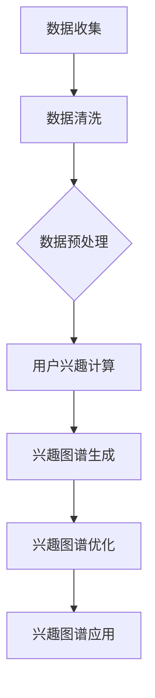

                 

## 《知乎2024用户兴趣图谱构建算法校招面试重点》

### 关键词：
1. 用户兴趣图谱
2. 算法校招
3. 数据挖掘
4. 社交网络分析
5. 深度学习

### 摘要：

本文将深入探讨知乎2024用户兴趣图谱构建算法的相关内容，旨在为读者提供一份全面的校招面试准备指南。文章将分为两部分：第一部分介绍用户兴趣图谱的基础概念和构建算法原理，包括核心算法、数学模型等；第二部分通过实际项目实战，展示如何应用这些算法构建用户兴趣图谱，并解析面试中的难点。通过本文的学习，读者将能够全面了解用户兴趣图谱的构建过程，掌握核心算法原理，并具备解决实际问题的能力。

# 第一部分：引言与背景

## 第1章：知乎2024用户兴趣图谱构建算法概述

### 1.1 知乎2024用户兴趣图谱的概述

知乎2024用户兴趣图谱是对知乎平台上用户兴趣和行为数据的深度挖掘和抽象，通过构建一个图形化的模型来描述用户与内容、用户与用户之间的关系。用户兴趣图谱不仅能够帮助知乎平台更好地了解用户的兴趣和需求，还能为内容推荐、社交推荐、广告投放等业务提供数据支持。

知乎2024用户兴趣图谱的定义如下：

用户兴趣图谱是由用户、内容和关系构成的图形化模型，其中用户是图中的节点，内容是边上的标签，关系是边。用户兴趣图谱通过记录用户在知乎平台上的行为数据，如浏览、点赞、评论、提问等，挖掘出用户的兴趣点，并将这些兴趣点以图谱的形式呈现出来。

用户兴趣图谱的重要性：

1. **个性化推荐**：用户兴趣图谱能够帮助平台更好地理解用户兴趣，从而实现精准的内容推荐和社交推荐。
2. **业务优化**：通过对用户兴趣图谱的分析，可以优化业务流程，提高用户体验。
3. **广告投放**：用户兴趣图谱能够为广告投放提供精准的用户画像，提高广告的投放效果。

知乎2024用户兴趣图谱的应用场景：

1. **内容推荐**：根据用户的兴趣图谱，为用户推荐相关的内容。
2. **社交推荐**：根据用户的兴趣图谱，为用户推荐志同道合的用户。
3. **广告投放**：根据用户的兴趣图谱，为用户推荐相关的广告。

### 1.2 知乎2024用户兴趣图谱构建算法的背景

知乎2024用户兴趣图谱构建算法的背景主要包括以下几个方面：

- **数据来源**：知乎平台积累了大量的用户行为数据，如浏览记录、点赞记录、评论记录、提问记录等，这些数据是构建用户兴趣图谱的基础。
- **用户行为分析**：通过对用户行为数据的分析，可以挖掘出用户的兴趣点，为构建用户兴趣图谱提供依据。
- **数据处理流程**：用户兴趣图谱的构建涉及到数据收集、数据清洗、数据整合、用户兴趣计算、兴趣图谱生成等步骤。

### 1.3 构建用户兴趣图谱的技术挑战

构建用户兴趣图谱面临以下技术挑战：

- **数据量大**：知乎平台积累了海量的用户行为数据，如何高效地处理这些数据是构建用户兴趣图谱的一个挑战。
- **数据质量**：用户行为数据中存在噪声和异常值，如何提高数据质量是构建用户兴趣图谱的关键。
- **跨平台数据融合**：知乎平台不仅有自己的用户行为数据，还与其他平台有数据交换，如何实现跨平台数据融合是构建用户兴趣图谱的难点。

## 第2章：用户兴趣图谱构建的基础概念

### 2.1 用户兴趣的概念与度量

#### 用户兴趣的定义

用户兴趣是指用户在特定场景下对特定主题或内容的喜好程度。在用户兴趣图谱构建中，用户兴趣是一个核心概念，它决定了用户与内容、用户与用户之间的连接关系。

#### 用户兴趣的度量方法

用户兴趣的度量方法主要有以下几种：

1. **基于内容的兴趣度量**：通过分析用户浏览、点赞、评论等行为，计算用户对特定内容的兴趣度。
2. **基于社交的兴趣度量**：通过分析用户与用户之间的关系，计算用户对特定社交对象的兴趣度。
3. **基于行为的兴趣度量**：通过分析用户的历史行为数据，挖掘用户的长期兴趣。

#### 用户兴趣模型

用户兴趣模型是描述用户兴趣的一种数学模型，常用的用户兴趣模型包括：

1. **基于概率的模型**：如贝叶斯网络、马尔可夫模型等。
2. **基于机器学习的模型**：如协同过滤、深度学习等。

### 2.2 用户画像的概念与构建方法

#### 用户画像的定义

用户画像是对用户特征、行为、需求等的综合描述，它能够帮助平台更好地了解用户，为个性化推荐、精准营销等提供数据支持。

#### 用户画像的维度

用户画像的维度包括：

1. **基础信息**：如年龄、性别、地理位置等。
2. **行为信息**：如浏览记录、点赞记录、评论记录等。
3. **需求信息**：如搜索记录、购买记录等。

#### 用户画像的构建方法

用户画像的构建方法主要包括：

1. **基于规则的方法**：通过预设规则，从用户行为数据中提取特征。
2. **基于机器学习的方法**：通过训练模型，自动提取用户特征。
3. **基于深度学习的方法**：利用深度神经网络，自动提取用户特征。

### 2.3 社交网络与信息传播模型

#### 社交网络的基本概念

社交网络是由用户和用户之间的互动关系构成的复杂系统，常见的社交网络模型包括：

1. **无向图**：用户之间的互动关系是无向的。
2. **有向图**：用户之间的互动关系是有向的。

#### 社交网络的拓扑结构

社交网络的拓扑结构包括：

1. **小世界网络**：具有较高的聚类系数和较短的路径长度。
2. **幂律网络**：具有长尾分布的特性。

#### 信息传播模型

信息传播模型是描述信息在社交网络中传播的模型，常见的模型包括：

1. **随机游走模型**：信息在社交网络中随机传播。
2. **阈值模型**：信息传播需要达到一定的阈值才能传播。
3. **多步骤传播模型**：信息传播需要经过多个步骤才能传播。

## 第3章：用户兴趣图谱构建算法原理

### 3.1 用户兴趣图谱构建的算法框架

用户兴趣图谱构建的算法框架主要包括以下几个模块：

1. **数据预处理**：对原始用户行为数据进行清洗、整合等处理。
2. **用户兴趣计算**：根据用户行为数据，计算用户的兴趣度。
3. **用户兴趣融合**：将多个用户兴趣维度进行融合，形成完整的用户兴趣图谱。
4. **兴趣图谱生成**：将用户兴趣数据转化为图形化模型。
5. **兴趣图谱优化**：对兴趣图谱进行优化，提高模型的准确性和鲁棒性。

### 3.2 用户兴趣图谱构建的核心算法

用户兴趣图谱构建的核心算法主要包括以下几个方面：

#### 用户兴趣发现算法

用户兴趣发现算法用于挖掘用户的兴趣点。以下是一个简单的用户兴趣发现算法的伪代码：

```python
function UserInterestDiscovery(data):
    # 数据预处理
    preprocessData(data)
    
    # 用户兴趣计算
    for user in data:
        calculateUserInterest(user)
        
    # 用户兴趣融合
    fuseUserInterests(data)
    
    return data
```

#### 兴趣图谱生成算法

兴趣图谱生成算法用于将用户兴趣数据转化为图形化模型。以下是一个简单的兴趣图谱生成算法的伪代码：

```python
function InterestGraphGeneration(data):
    # 用户兴趣图谱初始化
    initializeGraph()
    
    # 构建用户兴趣图谱
    for edge in data:
        addEdgeToGraph(edge)
        
    return graph
```

#### 用户兴趣图谱优化算法

用户兴趣图谱优化算法用于提高兴趣图谱的准确性和鲁棒性。以下是一个简单的用户兴趣图谱优化算法的伪代码：

```python
function CommunityBasedOptimization(graph):
    # 社区发现
    discoverCommunities(graph)
    
    # 社区内优化
    optimizeWithinCommunities(graph)
    
    # 社区间优化
    optimizeBetweenCommunities(graph)
    
    return graph
```

### 3.3 用户兴趣图谱的优化算法

用户兴趣图谱的优化算法主要包括以下几种：

1. **基于社区结构的优化算法**：通过发现社交网络中的社区结构，对社区内的用户兴趣进行优化，同时优化社区间的兴趣连接。
2. **基于拓扑结构的优化算法**：通过分析社交网络的拓扑结构，对用户兴趣图谱进行优化。
3. **基于机器学习的优化算法**：利用机器学习算法，自动优化用户兴趣图谱。

## 第4章：用户兴趣图谱构建的数学模型与公式

### 4.1 用户兴趣度量的数学模型

用户兴趣度量的数学模型主要包括以下几种：

1. **协同过滤模型**：

协同过滤模型是一种常用的用户兴趣度量方法，它通过计算用户之间的相似度，为用户推荐感兴趣的内容。协同过滤模型的公式如下：

$$
R_{ui} = \frac{\sum_{j \in N(i)} R_{uj} \cdot S_{ij}}{\sum_{j \in N(i)} S_{ij}}
$$

其中，$R_{ui}$表示用户$u$对项目$i$的兴趣度，$N(i)$表示与项目$i$相关的用户集合，$R_{uj}$表示用户$u$对项目$j$的兴趣度，$S_{ij}$表示用户$u$与用户$i$之间的关系强度。

2. **基于内容的推荐模型**：

基于内容的推荐模型通过分析内容的特征，为用户推荐感兴趣的内容。基于内容的推荐模型的公式如下：

$$
R_{ui} = \frac{\sum_{j \in N(i)} w_{ij} \cdot C_{ji}}{\sum_{j \in N(i)} w_{ij}}
$$

其中，$R_{ui}$表示用户$u$对项目$i$的兴趣度，$N(i)$表示与项目$i$相关的用户集合，$w_{ij}$表示用户$i$与用户$u$之间的关系强度，$C_{ji}$表示项目$j$的特征向量。

### 4.2 用户画像构建的数学模型

用户画像构建的数学模型主要用于描述用户特征和兴趣。用户画像的构建模型如下：

$$
User\_Profile = \{FP_{u1}, FP_{u2}, ..., FP_{un}\}
$$

其中，$FP_{ui}$表示用户$u$的属性$i$的值。

### 4.3 用户兴趣图谱优化的数学模型

用户兴趣图谱优化的数学模型主要包括以下几种：

1. **基于社区结构的优化模型**：

基于社区结构的优化模型通过发现社交网络中的社区结构，对社区内的用户兴趣进行优化。基于社区结构的优化模型的公式如下：

$$
C_{ij} = \frac{\sum_{k \in C} w_{ik} \cdot w_{jk}}{\sum_{k \in C} w_{ik}^2}
$$

其中，$C$表示社区集合，$w_{ik}$表示用户$i$与项目$k$之间的权重。

2. **基于拓扑结构的优化模型**：

基于拓扑结构的优化模型通过分析社交网络的拓扑结构，对用户兴趣图谱进行优化。基于拓扑结构的优化模型的公式如下：

$$
T_{ij} = \frac{\sum_{k \in N(i)} w_{ik} \cdot w_{kj}}{\sum_{k \in N(i)} w_{ik}}
$$

其中，$T_{ij}$表示用户$i$与用户$j$之间的拓扑相似度，$N(i)$表示与用户$i$直接相连的用户集合，$w_{ik}$表示用户$i$与用户$k$之间的权重。

## 第5章：项目实战：构建知乎2024用户兴趣图谱

### 5.1 实战环境搭建

#### 数据源准备

知乎平台提供了丰富的用户行为数据，包括用户的浏览记录、点赞记录、评论记录、提问记录等。这些数据可以通过知乎开放平台进行获取。

#### 开发工具和框架选择

开发工具和框架的选择可以根据实际需求进行。常用的开发工具包括Python、Java等，常用的框架包括TensorFlow、PyTorch等。

### 5.2 数据预处理

#### 数据清洗

数据清洗是数据预处理的重要步骤，包括去除噪声数据、填补缺失数据、消除异常值等。数据清洗的方法包括：

1. **去除噪声数据**：通过分析数据分布，去除明显的异常数据。
2. **填补缺失数据**：通过插值、平均值等方法填补缺失数据。
3. **消除异常值**：通过统计方法，识别并消除异常值。

#### 数据整合

数据整合是将不同来源的数据进行整合，形成一个统一的数据集。数据整合的方法包括：

1. **合并数据集**：将多个数据集进行合并，形成一个完整的数据集。
2. **去重**：去除重复的数据。
3. **数据转换**：将不同格式的数据进行转换，形成一个统一的数据格式。

### 5.3 用户兴趣图谱构建

#### 用户兴趣发现

用户兴趣发现是构建用户兴趣图谱的第一步，主要通过分析用户的行为数据，挖掘出用户的兴趣点。用户兴趣发现的方法包括：

1. **协同过滤**：通过计算用户之间的相似度，为用户推荐感兴趣的内容。
2. **基于内容的推荐**：通过分析内容的特征，为用户推荐感兴趣的内容。
3. **深度学习**：通过训练深度学习模型，自动提取用户的兴趣点。

#### 用户兴趣图谱生成

用户兴趣图谱生成是将用户兴趣数据转化为图形化模型。用户兴趣图谱生成的方法包括：

1. **图数据库**：使用图数据库存储用户兴趣数据，形成用户兴趣图谱。
2. **图算法**：使用图算法对用户兴趣数据进行处理，形成用户兴趣图谱。
3. **图可视化**：使用图可视化工具展示用户兴趣图谱。

### 5.4 用户兴趣图谱优化

#### 社区结构分析

社区结构分析是优化用户兴趣图谱的重要步骤，主要通过分析社交网络中的社区结构，优化用户兴趣图谱。社区结构分析的方法包括：

1. **社区发现**：使用社区发现算法，发现社交网络中的社区结构。
2. **社区评估**：使用社区评估算法，评估社区的质量和重要性。
3. **社区优化**：使用社区优化算法，优化社区结构。

#### 优化策略实施

优化策略实施是将社区结构分析的结果应用到用户兴趣图谱的优化中。优化策略实施的方法包括：

1. **社区内优化**：对社区内的用户兴趣进行优化，提高社区的质量。
2. **社区间优化**：对社区间的用户兴趣进行优化，提高社交网络的整体质量。
3. **图结构优化**：对用户兴趣图谱的图结构进行优化，提高图的可解释性和鲁棒性。

## 第6章：面试难点解析

### 6.1 用户兴趣图谱构建算法的面试难点

用户兴趣图谱构建算法的面试难点主要包括以下几个方面：

1. **算法原理深入理解**：需要深入理解用户兴趣图谱构建的核心算法原理，包括协同过滤、基于内容的推荐、深度学习等。
2. **算法性能优化**：需要了解如何优化用户兴趣图谱构建算法的性能，包括数据预处理、算法选择、参数调优等。
3. **实际项目经验**：需要有实际项目经验，能够结合具体场景，设计和实现用户兴趣图谱构建算法。

### 6.2 用户兴趣度量的面试难点

用户兴趣度量的面试难点主要包括以下几个方面：

1. **协同过滤算法的面试难点**：需要深入理解协同过滤算法的原理，包括基于用户的协同过滤和基于物品的协同过滤。
2. **用户画像构建的面试难点**：需要了解用户画像的构建方法，包括基于规则的构建方法和基于机器学习的构建方法。

### 6.3 用户兴趣图谱优化的面试难点

用户兴趣图谱优化的面试难点主要包括以下几个方面：

1. **社区发现算法的面试难点**：需要深入理解社区发现算法的原理，包括基于图论的社区发现算法和基于机器学习的社区发现算法。
2. **优化算法的面试难点**：需要了解各种优化算法的原理，包括基于社区结构的优化算法、基于拓扑结构的优化算法等。

## 第7章：总结与展望

### 7.1 知识点总结

用户兴趣图谱构建算法涉及的知识点包括：

1. **用户兴趣的定义与度量**：了解用户兴趣的定义、度量方法和用户兴趣模型。
2. **用户画像的构建**：了解用户画像的构建方法、维度和数学模型。
3. **社交网络与信息传播模型**：了解社交网络的基本概念、拓扑结构和信息传播模型。
4. **用户兴趣图谱构建算法原理**：了解用户兴趣图谱构建的算法框架、核心算法和优化算法。
5. **数学模型与公式**：了解用户兴趣度量的数学模型、用户画像构建的数学模型和用户兴趣图谱优化的数学模型。

### 7.2 未来发展方向

用户兴趣图谱构建算法的未来发展方向包括：

1. **算法性能优化**：通过优化算法，提高用户兴趣图谱的构建效率。
2. **跨平台数据融合**：实现跨平台数据的融合，提高用户兴趣图谱的准确性。
3. **个性化推荐**：结合用户兴趣图谱，实现更精准的个性化推荐。
4. **社交推荐**：基于用户兴趣图谱，实现更有效的社交推荐。

### 7.3 作者寄语

亲爱的读者，感谢您阅读本文。用户兴趣图谱构建算法是大数据和人工智能领域的一个重要研究方向，它对于提升用户满意度、优化业务流程、实现精准营销具有重要意义。希望本文能够为您在知乎2024用户兴趣图谱构建算法的学习和面试准备提供帮助。祝愿您在未来的学习和工作中取得优异的成绩！如果还有任何疑问，欢迎在评论区留言，我将竭诚为您解答。

### 附录

#### 附录A：相关资源与工具

**知乎2024用户兴趣图谱构建算法相关资源**

- 研究论文：《基于协同过滤的用户兴趣图谱构建方法》、《社交网络中的用户兴趣发现与推荐》
- 开源代码：GitHub上的用户兴趣图谱构建相关项目
- 论坛讨论：知乎论坛中的用户兴趣图谱相关讨论

**用户兴趣图谱构建算法工具**

- 数据处理工具：Python的Pandas库、NumPy库
- 算法实现框架：TensorFlow、PyTorch

**面试准备资源**

- 经典面试题库：《算法面试宝典》、《编程之美》
- 面试技巧指导：面试前的准备、面试过程中的沟通技巧

### Mermaid 流程图示例

以下是构建用户兴趣图谱的流程图示例：



此流程图展示了从数据收集到兴趣图谱应用的完整过程。每个步骤都是构建用户兴趣图谱的重要组成部分。

