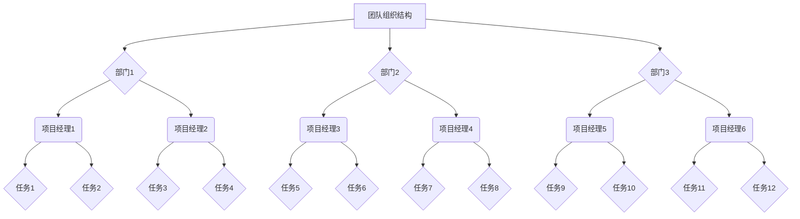
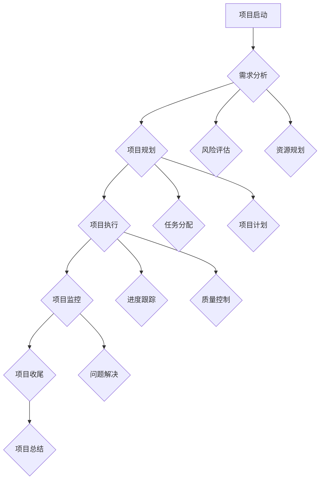
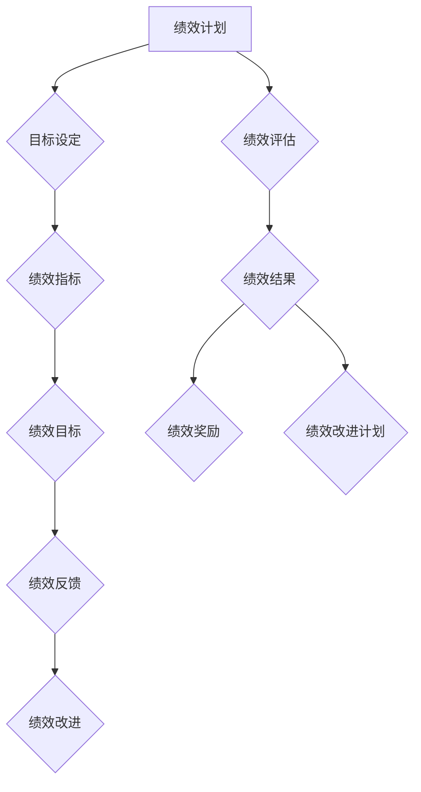

                 

### 《知识付费创业中的团队管理》

> **关键词**：知识付费、团队管理、创业、团队协作、绩效管理、领导力

> **摘要**：本文深入探讨知识付费创业中的团队管理，从团队管理基础、核心技能、实战案例分析以及未来趋势等多个方面，系统性地阐述了团队管理在知识付费创业过程中的重要性，以及如何有效地构建、管理和激励创业团队，以实现创业目标。通过本文，读者可以了解到团队管理的关键原则、策略和方法，为知识付费创业提供有力支持。

---

### 第一部分：团队管理基础

#### 第1章：团队管理概述

##### 1.1 团队管理的基本概念

团队管理是指在特定目标和时间内，通过合理的组织、协调、激励和监督，使团队成员充分发挥个人潜力，共同实现团队目标的过程。团队管理的核心是围绕团队的目标和任务，激发团队成员的积极性、创造性和协作精神，以实现整体绩效的最优化。

**团队的定义**：
团队是由一组相互依存、相互协作的个体组成的正式组织，成员之间具备共同的目标、共同的利益和共同的责任。团队成员通过共同的工作和互动，形成了一种相互依赖的关系，共同追求团队的成功。

**团队管理的目标**：
团队管理的目标是确保团队在既定的时间内，以最优的资源利用，实现既定的团队目标。具体来说，团队管理的目标包括以下几个方面：
- 确保团队成员明确团队的目标和任务；
- 激发团队成员的积极性和创造力；
- 提高团队成员之间的协作效率；
- 实现团队成员的个人成长和职业发展。

##### 1.2 团队管理的原则

团队管理需要遵循一些基本原则，以确保团队管理的有效性。以下是几个重要的团队管理原则：

**全员参与**：
团队管理应该鼓励全员参与，使每个团队成员都有机会表达自己的意见和建议。全员参与可以提高团队成员的积极性和责任感，促进团队决策的科学性和民主性。

**目标导向**：
团队管理应该以目标为导向，明确团队的目标和任务，确保团队成员都清楚自己的工作方向和职责。目标导向可以有效地提高团队的工作效率和成果。

**沟通协作**：
团队管理需要建立良好的沟通协作机制，确保团队成员之间的信息流畅和协同工作。良好的沟通协作可以提高团队的凝聚力和工作效率，减少误解和冲突。

**绩效导向**：
团队管理应该建立以绩效为导向的管理机制，对团队成员的绩效进行科学评估和激励。绩效导向可以激发团队成员的竞争意识和进取心，促进团队整体绩效的提升。

##### 1.3 团队管理的重要性

团队管理对于知识付费创业企业的发展至关重要，主要体现在以下几个方面：

**提高工作效率**：
有效的团队管理可以合理分配资源，提高工作效率。通过明确的任务分工和高效的沟通协作，团队成员可以更加专注于自己的工作，减少时间和资源的浪费。

**增强团队凝聚力**：
团队管理可以促进团队成员之间的交流和互动，增强团队的凝聚力。通过共同的目标和任务，团队成员可以形成一种相互依赖、相互支持的关系，共同为团队的成功努力。

**促进个人成长**：
团队管理可以为团队成员提供职业发展的机会和空间，促进个人的成长和提升。通过培训和激励，团队成员可以不断提升自己的能力和素质，实现自我价值。

---

**总结**：
团队管理是知识付费创业过程中的关键环节，它关乎团队的整体绩效和成员的个人发展。有效的团队管理需要遵循基本原则，注重沟通协作，以目标为导向，科学评估绩效，从而提高团队的工作效率和凝聚力，为创业企业的发展提供有力支持。

---

#### 第2章：团队组织结构设计

##### 2.1 团队组织结构类型

团队组织结构是团队内部成员的配置和关系模式，影响着团队的运作效率和成员间的协作效果。以下是几种常见的团队组织结构类型：

**直线制**：
直线制是最简单的团队组织结构类型，团队成员按照职能或任务进行划分，形成一种直线关系。在这种结构下，每个团队成员都有一个明确的上级，负责对其工作进行指导和监督。

**矩阵制**：
矩阵制是一种更加复杂的组织结构，将团队成员按照职能和项目两个维度进行划分。团队成员既受到职能部门的指导，又参与项目的具体工作。这种结构有助于实现跨职能的协作和资源的最大化利用。

**集权制**：
集权制是指团队的管理权力集中在少数人手中，决策权和管理权高度集中。在这种结构下，团队成员的自主性较低，决策速度较慢，但有利于保持团队的一致性和协调性。

**分权制**：
分权制是指团队的管理权力分散到各个成员手中，每个成员都有一定的决策权和责任。这种结构有助于提高团队成员的自主性和创造性，促进团队成员的积极性和主动性。

##### 2.2 团队组织设计的原则

团队组织设计需要遵循一些基本原则，以确保组织结构的科学性和合理性。以下是几个重要的团队组织设计原则：

**效率原则**：
团队组织设计应该以效率为目标，合理配置团队成员和资源，确保团队的工作效率和成果。通过明确任务分工和职责，避免工作重叠和资源浪费。

**统一原则**：
团队组织设计应该保持组织结构的统一性，确保团队成员之间的沟通畅通和协作有效。通过建立统一的决策和执行机制，避免团队成员之间的矛盾和冲突。

**分工原则**：
团队组织设计应该根据团队成员的特长和技能，合理分配工作任务，实现专业化的分工。通过分工合作，可以提高团队成员的专注度和工作效率。

**激励原则**：
团队组织设计应该考虑团队成员的激励需求，建立激励机制，激发团队成员的积极性和创造力。通过奖励和认可，增强团队成员的归属感和责任感。

##### 2.3 团队组织设计的案例分析

**成功案例：** 
以某知名知识付费平台为例，该平台采用矩阵制组织结构，将团队成员分为产品、技术、市场和运营等多个部门，同时按照项目进行分工。通过矩阵制结构，平台实现了跨职能的协作，提高了项目执行效率，成功推出了多个受欢迎的产品。

**失败案例：** 
以某初创知识付费企业为例，该企业在组织设计上采用直线制结构，但由于团队成员较少，导致任务分工不清，沟通不畅，工作效率低下。此外，企业的管理权力高度集中，决策速度缓慢，难以应对市场的快速变化，最终导致企业的经营困难。

**经验教训：** 
从成功和失败的案例中可以得出以下经验教训：
- 组织结构设计应结合企业的实际情况，避免过度复杂或过于简单；
- 要充分考虑团队成员的特长和技能，实现专业化的分工；
- 建立良好的沟通协作机制，确保团队成员之间的沟通畅通；
- 建立合理的激励机制，激发团队成员的积极性和创造力。

---

**总结**：
团队组织结构设计是团队管理的重要组成部分，它直接影响团队的工作效率和成员间的协作效果。有效的团队组织设计需要遵循效率、统一、分工和激励等原则，结合企业实际情况，科学配置团队成员和资源，以实现团队的目标。

---

### 第二部分：团队管理核心技能

#### 第3章：沟通与协作

##### 3.1 沟通的重要性

沟通是团队管理中至关重要的一环，它直接影响团队的工作效率、协作效果和成员间的信任关系。良好的沟通可以帮助团队成员理解团队的目标和任务，明确自己的工作职责，提高工作效率。以下是沟通在团队管理中的重要性：

**提高工作效率**：
有效的沟通可以确保团队成员之间的信息流畅和协同工作，减少误解和冲突，提高工作效率。通过沟通，团队成员可以及时了解项目的进展情况，调整工作计划，确保项目按时完成。

**减少误解**：
沟通可以消除团队成员之间的误解和分歧，避免因为信息不对称导致的错误决策和工作失误。通过沟通，团队成员可以表达自己的观点和意见，倾听他人的意见和反馈，达成共识，减少冲突。

**增强团队凝聚力**：
良好的沟通可以增强团队成员之间的信任和归属感，提高团队的凝聚力。通过沟通，团队成员可以了解彼此的工作和生活，增进相互的了解和尊重，形成紧密的合作关系。

##### 3.2 沟通技巧

为了提高沟通的效果，团队成员需要掌握一定的沟通技巧。以下是几种常见的沟通技巧：

**倾听技巧**：
倾听是沟通的重要部分，它可以帮助团队成员理解他人的观点和需求。有效的倾听技巧包括：保持专注，避免打断对方；理解对方的观点，提出问题进行澄清；给予积极的反馈，表达自己的理解。

**表达技巧**：
表达技巧是指如何准确、清晰地表达自己的观点和意见。有效的表达技巧包括：使用简单的语言，避免使用专业术语；条理清晰，逻辑严密；明确表达自己的需求和期望。

**非语言沟通**：
非语言沟通是通过身体语言、面部表情和姿态等传递信息的一种方式。有效的非语言沟通可以增强沟通的效果，提高团队的凝聚力。例如，通过点头、微笑和肢体动作等，表达自己的支持和理解。

**跨文化沟通**：
在全球化背景下，团队成员可能来自不同的文化背景。跨文化沟通需要团队成员尊重和理解不同文化的差异，避免因为文化冲突导致的误解和冲突。有效的跨文化沟通包括：了解和尊重不同文化的价值观和习惯；使用简单、清晰的语言；避免使用具有文化含义的词汇和表达方式。

##### 3.3 协作机制

团队协作是团队管理的重要组成部分，它关系到团队的工作效率、创新能力和整体绩效。建立有效的协作机制，可以提高团队成员的协同工作效率，促进团队的创新和发展。以下是几种常见的协作机制：

**分工与协作**：
分工与协作是指根据团队成员的特长和技能，合理分配工作任务，确保每个成员都有明确的职责和目标。通过分工与协作，可以充分发挥团队成员的潜力，提高团队的整体效率。

**团队协作工具**：
团队协作工具是帮助团队成员进行协同工作的工具，例如项目管理工具、协作平台和即时通讯工具等。有效的团队协作工具可以提高团队的沟通效率，确保信息的畅通和工作的协同。

**跨部门协作**：
跨部门协作是指不同部门之间的协同工作，通过跨部门协作，可以实现资源的共享和优势互补，提高团队的整体绩效。跨部门协作需要建立良好的沟通机制，确保信息的透明和及时性。

---

**总结**：
沟通与协作是团队管理中的核心技能，它关系到团队的工作效率、创新能力和整体绩效。有效的沟通可以提高团队成员之间的理解和协作，减少误解和冲突，增强团队的凝聚力。团队协作机制的建设，可以充分发挥团队成员的潜力，提高团队的整体效率，实现团队的目标。

---

### 第4章：绩效管理

##### 4.1 绩效管理概述

绩效管理是团队管理的重要组成部分，它关系到团队的工作效率、创新能力和整体绩效。绩效管理是指通过制定合理的绩效目标、评估团队成员的绩效表现、提供反馈和激励，促进团队成员的持续成长和团队的整体发展。

**绩效管理的定义**：
绩效管理是一种系统性的管理过程，通过设定明确的目标、评估绩效、提供反馈和激励，帮助团队成员实现个人和团队的目标，提高整体绩效。

**绩效管理的目标**：
绩效管理的目标包括以下几个方面：
- 确保团队成员明确自己的工作目标和职责；
- 提高团队成员的工作效率和工作质量；
- 促进团队成员的持续成长和职业发展；
- 增强团队的凝聚力和协作能力；
- 实现团队的整体绩效提升。

##### 4.2 绩效评估方法

绩效评估是绩效管理的关键环节，它通过科学的方法和工具，评估团队成员的绩效表现，为绩效反馈和激励提供依据。以下是几种常见的绩效评估方法：

**定量评估**：
定量评估是通过量化的指标来评估团队成员的绩效表现。这种方法通常用于对工作结果进行评估，例如完成的项目数量、销售额、客户满意度等。定量评估具有客观性和可比性，但可能无法全面反映团队成员的综合能力和潜力。

**定性评估**：
定性评估是通过主观判断来评估团队成员的绩效表现。这种方法通常用于对团队成员的工作过程和工作态度进行评估，例如团队合作能力、沟通能力、创新能力等。定性评估具有主观性和灵活性，但可能存在评估标准不一致的问题。

**综合评估**：
综合评估是将定量评估和定性评估相结合，全面评估团队成员的绩效表现。这种方法可以更全面地反映团队成员的工作表现，但需要平衡定量评估和定性评估的结果，确保评估的公正性和准确性。

##### 4.3 绩效改进策略

绩效改进是绩效管理的核心目标之一，它通过识别团队成员的绩效问题，制定改进计划和措施，提高团队成员的工作效率和绩效。以下是几种常见的绩效改进策略：

**培训与发展**：
培训与发展是通过培训和教育，提高团队成员的技能和知识水平，促进其职业发展。通过培训，可以帮助团队成员掌握新的工作技能和方法，提高工作效率和质量。

**薪酬激励**：
薪酬激励是通过调整团队成员的薪酬水平，激发其工作积极性和创造力。合理的薪酬激励可以激励团队成员努力工作，提高绩效。

**职业生涯规划**：
职业生涯规划是通过制定明确的职业发展路径和目标，帮助团队成员规划其职业生涯，实现个人和团队的目标。通过职业生涯规划，可以帮助团队成员明确自己的发展方向，提高工作动力和职业满意度。

---

**总结**：
绩效管理是团队管理的重要组成部分，它关系到团队的工作效率、创新能力和整体绩效。有效的绩效管理需要制定合理的绩效目标、采用科学的评估方法、提供有效的反馈和激励，促进团队成员的持续成长和团队的整体发展。通过绩效管理，可以激发团队成员的积极性和创造力，提高团队的整体绩效。

---

### 第5章：领导力与团队激励

##### 5.1 领导力的重要性

领导力在团队管理中起着至关重要的作用，它直接影响团队的工作效率、创新能力和整体绩效。有效的领导力可以激发团队成员的积极性和创造力，促进团队的凝聚力和协作能力，实现团队的目标。

**提高团队执行力**：
领导力可以帮助团队成员明确团队的目标和任务，制定合理的行动计划，并确保团队成员按照计划执行。通过有效的领导力，可以确保团队工作的高效执行，提高团队的执行力。

**激发团队成员潜力**：
领导力可以激发团队成员的潜力，帮助他们发掘自身的优势和潜力，发挥最大的价值。通过领导力的激发，可以促进团队成员的个人成长和职业发展，提高团队的总体竞争力。

**增强团队凝聚力**：
领导力可以增强团队成员之间的信任和归属感，提高团队的凝聚力。通过领导力的示范和激励，可以促进团队成员之间的相互支持和合作，形成紧密的合作关系，提高团队的协作效率。

##### 5.2 领导力模型

领导力模型是描述领导行为和领导效果的理论框架，不同的领导力模型有不同的特点和适用场景。以下是几种常见的领导力模型：

**经典领导力模型**：
经典领导力模型包括 Transformational Leadership（变革型领导）和 Transactional Leadership（交易型领导）。

- **变革型领导**：变革型领导强调领导者的远见卓识、创新精神和激励能力，通过激发团队成员的内在动机和潜力，推动团队实现变革和进步。
- **交易型领导**：交易型领导强调领导者的任务导向和目标管理能力，通过明确的任务分配和奖励机制，激励团队成员努力工作，实现团队目标。

**权力与影响力**：
领导力的本质在于领导者如何运用权力和影响力影响团队成员。有效的领导力需要领导者具备以下权力和影响力：

- **法定权力**：领导者通过职位和职责获得的权力，包括决策权、指挥权等。
- **奖励权力**：领导者通过提供奖励和激励获得的权力，包括薪酬激励、荣誉激励等。
- **惩罚权力**：领导者通过实施惩罚和处罚获得的权力，包括批评、惩罚等。
- **模范权力**：领导者通过自身行为和价值观获得的权力，包括榜样作用、道德引领等。

**领导风格**：
领导风格是领导者对待团队成员、管理团队的方式和态度。不同的领导风格有不同的特点和适用场景。以下是几种常见的领导风格：

- **专制型领导**：专制型领导强调领导者的权威和控制，决策权集中在领导者手中，团队成员的参与度较低。
- **民主型领导**：民主型领导强调团队成员的参与和民主决策，领导者更多扮演协调者和支持者的角色。
- **放任型领导**：放任型领导强调团队成员的自由和自主性，领导者较少干预团队的工作，团队成员的自主性较高。

##### 5.3 团队激励策略

团队激励是提高团队成员积极性、创造力和工作效率的重要手段。有效的团队激励策略可以激发团队成员的内在动机，促进团队的凝聚力和协作能力。以下是几种常见的团队激励策略：

**物质激励**：
物质激励是通过提供薪酬、奖金和其他福利，满足团队成员的物质需求，提高其工作积极性。物质激励可以包括固定薪酬、绩效奖金、福利待遇等。

**精神激励**：
精神激励是通过认可、荣誉和奖励等方式，满足团队成员的心理需求，提高其工作满意度和忠诚度。精神激励可以包括荣誉称号、表彰奖励、团队活动等。

**发展激励**：
发展激励是通过提供培训、职业发展机会和晋升空间，满足团队成员的成长需求，提高其职业成就感和归属感。发展激励可以包括内部培训、职业规划、晋升机会等。

---

**总结**：
领导力与团队激励在团队管理中起着至关重要的作用。有效的领导力可以激发团队成员的积极性和创造力，增强团队的凝聚力和协作能力，实现团队的目标。团队激励策略可以帮助满足团队成员的物质和精神需求，提高工作满意度和忠诚度，促进团队的持续发展和创新。

---

### 第6章：项目管理与团队协作

##### 6.1 项目管理概述

项目管理是团队管理的重要组成部分，它关系到项目的进度、质量和成本。项目管理是指通过系统的方法和工具，对项目进行规划、组织、领导和控制，以确保项目按照预定的时间、预算和标准顺利完成。

**项目的定义**：
项目是指为了实现特定目标，通过一系列有序的活动和资源投入，在一定时间内完成的临时性工作。项目具有以下特点：
- 明确的目标和范围：项目有明确的目标和范围，团队成员都清楚自己的任务和职责。
- 有限的持续时间：项目有一定的持续时间，通常在几个月到几年的范围内。
- 有限的资源：项目需要有限的资源，包括人力、资金、设备等。
- 风险和不确定性：项目在实施过程中可能会面临各种风险和不确定性，需要项目管理来应对。

**项目管理的目标**：
项目管理的目标是确保项目按照预定的时间、预算和标准顺利完成。具体来说，项目管理的目标包括以下几个方面：
- 完成项目目标：确保项目按照预定的时间、质量和成本完成。
- 管理项目风险：识别和应对项目过程中的各种风险和不确定性。
- 确保资源合理利用：合理分配和利用项目资源，提高项目效率。
- 促进团队协作：通过有效的沟通和协作，确保项目团队的工作高效和顺畅。

##### 6.2 项目管理方法论

项目管理方法论是指用于指导项目实施和管理的方法和工具。不同的项目管理方法论有不同的特点和适用场景。以下是几种常见的项目管理方法论：

**传统项目管理**：
传统项目管理强调项目计划、控制和监督，通常采用瀑布式开发模型。瀑布式开发模型将项目划分为不同的阶段，每个阶段都有明确的任务和交付物，前一阶段的任务完成后才能进入下一阶段。传统项目管理适用于需求明确、变更较少的项目。

**Agile方法论**：
Agile方法论强调灵活性和适应性，通过迭代和增量开发，逐步完善项目。Agile方法论包括Scrum、Kanban、XP等多种实践，注重团队协作、用户反馈和持续改进。Agile方法论适用于需求变动频繁、需要快速响应的项目。

**Lean方法论**：
Lean方法论强调消除浪费、提高效率和质量，通过精益管理和精益生产实现项目目标。Lean方法论强调价值流分析、持续改进和员工参与。Lean方法论适用于注重效率和质量的的项目。

##### 6.3 团队协作与项目管理工具

团队协作与项目管理工具是帮助团队成员进行协同工作和项目管理的工具。以下是几种常见的团队协作与项目管理工具：

**团队协作工具**：
团队协作工具帮助团队成员进行沟通、协作和任务管理。常见的团队协作工具包括Trello、Jira、Slack等。这些工具可以方便团队成员共享信息、分配任务、跟踪项目进度，提高团队协作效率。

**项目管理工具**：
项目管理工具帮助项目管理人员进行项目规划、进度跟踪、资源管理和报告生成。常见的项目管理工具包括Microsoft Project、Asana、Trello等。这些工具可以帮助项目管理人员更好地管理项目，确保项目按计划进行。

**团队协作技巧**：
团队协作技巧是指团队成员在项目过程中如何进行有效的沟通、协作和合作。有效的团队协作技巧包括：
- 明确分工和职责：确保每个团队成员都清楚自己的任务和职责，避免工作重叠和冲突。
- 沟通与反馈：保持有效的沟通，及时分享信息和反馈，确保团队成员之间的信息畅通。
- 分享知识和经验：通过分享知识和经验，提高团队成员的专业能力和工作效率。
- 激励和鼓励：通过激励和鼓励，提高团队成员的积极性和创造力，促进团队协作。

---

**总结**：
项目管理与团队协作是团队管理的重要组成部分，它关系到项目的进度、质量和成本。有效的项目管理方法论和工具可以帮助团队成员进行高效的项目规划和执行，提高项目成功率。团队协作技巧可以提高团队成员之间的沟通和协作效果，促进团队的凝聚力和协作能力，实现团队的目标。

---

### 第7章：团队冲突处理与团队建设

##### 7.1 团队冲突概述

团队冲突是指团队成员在合作过程中，由于目标、利益、观点、价值观等方面的差异，产生的矛盾和争执。团队冲突是团队管理中不可避免的现象，但有效的冲突管理可以减少冲突的负面影响，提高团队的工作效率和凝聚力。

**团队冲突的定义**：
团队冲突是指团队成员之间由于目标、利益、观点、价值观等方面的差异，产生的矛盾和争执。团队冲突可以表现为言语冲突、行为冲突和情感冲突等不同形式。

**团队冲突的类型**：
团队冲突可以分为以下几种类型：
- 目标冲突：团队成员对项目的目标、任务和优先级有不同的看法和期望，导致合作困难。
- 利益冲突：团队成员之间的利益分配不均，导致争端和不满。
- 观点冲突：团队成员对问题的看法和解决方案存在差异，导致争论和分歧。
- 价值观冲突：团队成员的价值观和信念不同，导致观念上的冲突和矛盾。

##### 7.2 团队冲突处理策略

有效的团队冲突处理策略可以帮助团队成员化解矛盾，促进团队的协作和凝聚力。以下是几种常见的团队冲突处理策略：

**冲突预防**：
预防冲突是解决冲突的最佳策略，通过建立良好的沟通机制、明确团队目标和职责、建立信任和尊重的文化，可以减少冲突的发生。预防冲突的方法包括：
- 提高团队成员的沟通技巧，确保信息畅通和透明；
- 明确团队目标和职责，避免工作重叠和责任不清；
- 建立信任和尊重的文化，鼓励团队成员表达意见和反馈。

**冲突化解**：
当冲突发生时，需要采取积极的措施来化解冲突。化解冲突的方法包括：
- 中立调解：通过中立的第三方，帮助冲突双方进行沟通和协商，找到共识；
- 沟通与对话：通过对话和沟通，帮助冲突双方理解对方的观点和需求，找到解决问题的方法；
- 情感疏导：通过情感疏导，帮助冲突双方缓解情绪，降低冲突的激烈程度。

**冲突管理**：
冲突管理是指对冲突进行有效的管理和控制，确保团队工作的顺利进行。冲突管理的方法包括：
- 确定冲突类型：根据冲突的性质和程度，选择合适的处理方法；
- 制定冲突解决计划：制定具体的解决方案和时间表，确保冲突得到及时解决；
- 建立冲突解决机制：建立正式的冲突解决机制，包括调解委员会、仲裁程序等。

##### 7.3 团队建设策略

团队建设是指通过一系列的措施和活动，提高团队的凝聚力、协作能力和工作效率。有效的团队建设策略可以促进团队成员之间的信任和尊重，减少冲突，提高团队的整体绩效。以下是几种常见的团队建设策略：

**建立团队文化**：
团队文化是团队共同价值观、信念和行为准则的体现，它对团队的建设和发展具有重要作用。建立团队文化的方法包括：
- 设定明确的价值观和使命：明确团队的核心价值观和使命，引导团队成员的行为和决策；
- 培养团队精神：通过团队活动和协作项目，培养团队成员的团队精神，增强团队的凝聚力；
- 奖励团队成就：通过奖励和表彰，鼓励团队成员为团队的成功努力，提高团队的士气。

**增强团队凝聚力**：
增强团队凝聚力可以促进团队成员之间的信任和合作，提高团队的整体绩效。增强团队凝聚力的方法包括：
- 定期团队活动：通过定期的团队活动，促进团队成员之间的交流和互动，增强团队的凝聚力；
- 共同目标：设定共同的目标和任务，使团队成员在共同的目标下努力，增强团队凝聚力；
- 团队建设培训：通过团队建设培训，提高团队成员的沟通协作能力和团队意识。

**提升团队效能**：
提升团队效能是团队建设的最终目标，通过提高团队成员的能力和效率，实现团队的目标。提升团队效能的方法包括：
- 培训与发展：通过培训和职业发展计划，提高团队成员的专业能力和技能水平；
- 激励与奖励：通过激励和奖励，激发团队成员的积极性和创造力，提高团队的工作效率；
- 优化工作流程：通过优化工作流程，减少不必要的环节和重复工作，提高团队的工作效率。

---

**总结**：
团队冲突处理与团队建设是团队管理中的重要环节，它关系到团队的工作效率和凝聚力。有效的冲突处理策略可以化解团队成员之间的矛盾，促进团队的协作和发展。团队建设策略可以增强团队的凝聚力、协作能力和工作效率，实现团队的目标。通过有效的团队冲突处理和团队建设，可以构建一个高效、和谐和富有创造力的团队，为知识付费创业的成功提供有力支持。

---

### 第8章：知识付费创业团队管理实战

##### 8.1 知识付费行业概述

知识付费是指用户通过支付一定费用，获取高质量的知识、信息和技能。知识付费行业在近年来迅速崛起，成为互联网经济的重要驱动力。知识付费行业的核心特点是信息不对称，即用户需要支付费用才能获取高质量的、有价值的信息。

**行业背景**：
知识付费行业起源于互联网时代，随着移动互联网的发展和在线教育的兴起，知识付费市场迅速扩张。一方面，用户对于高质量的知识和信息需求不断增加；另一方面，互联网平台和内容创作者提供了丰富的知识产品和服务。

**行业趋势**：
知识付费行业呈现出以下趋势：
- 内容多样化：知识付费内容涵盖各个领域，从专业技能到兴趣爱好，满足用户多样化的需求；
- 平台化：知识付费平台成为连接用户和内容创作者的重要桥梁，提供一站式服务；
- 个性化：知识付费平台通过大数据和人工智能技术，为用户提供个性化的知识推荐和服务；
- 持续发展：知识付费行业呈现出持续发展的态势，市场规模不断扩大，创新模式不断涌现。

##### 8.2 知识付费创业团队管理挑战

知识付费创业团队面临以下管理挑战：
- **团队构建**：知识付费创业团队需要具备多方面的能力，包括内容创作、产品运营、市场营销等。在团队构建过程中，如何找到合适的人才、建立高效的团队协作机制是关键；
- **团队管理**：知识付费创业团队需要高效的管理机制，确保团队成员的积极性和创造力，同时保持团队的稳定性和凝聚力；
- **团队激励**：知识付费创业团队需要建立合理的激励机制，激发团队成员的内在动力和外部激励，确保团队的高效运转。

##### 8.3 知识付费创业团队管理策略

为了应对知识付费创业团队的管理挑战，可以采取以下管理策略：

**管理体系**：
建立完善的管理体系，包括明确的职责分工、科学的绩效评估机制和高效的决策流程。通过管理体系，确保团队成员明确自己的工作职责和目标，提高工作效率。

**激励机制**：
建立多样化的激励机制，包括薪酬激励、荣誉激励和职业发展激励等。通过激励机制，激发团队成员的积极性和创造力，提高团队的整体绩效。

**团队发展**：
注重团队的发展，通过培训、交流和合作，提升团队成员的专业能力和综合素质。同时，关注团队成员的职业发展，提供晋升和成长的机会，增强团队的稳定性和凝聚力。

---

**总结**：
知识付费创业团队管理涉及团队构建、团队管理和团队发展等多个方面。有效的管理策略可以帮助知识付费创业团队克服管理挑战，提高团队的工作效率和创新能力，实现创业目标。通过完善的管理体系、多样化的激励机制和持续发展的团队建设，知识付费创业团队可以更好地应对市场变化，实现可持续发展。

---

### 第9章：团队管理趋势与未来展望

##### 9.1 科技对团队管理的影响

科技的发展对团队管理产生了深远的影响，改变了传统的管理模式和方法，提高了团队的工作效率和创新能力。以下是科技对团队管理的几个重要影响：

**数字化管理**：
随着大数据、云计算、物联网等技术的发展，团队管理越来越依赖于数字化工具和平台。数字化管理可以提高信息的透明度和实时性，使团队管理更加科学和高效。通过数字化管理，团队可以实时跟踪项目进度、评估团队成员的绩效、优化工作流程等。

**人工智能应用**：
人工智能（AI）技术的应用正在改变团队管理的模式。AI可以帮助团队进行智能化的任务分配、工作分析和绩效评估，提高团队的工作效率和准确性。例如，AI聊天机器人可以用于日常沟通和问题解答，自动化工具可以用于数据分析和报告生成，提高团队的工作效率。

**虚拟团队**：
虚拟团队是指由不同地理位置的团队成员组成的团队，通过互联网进行协作和沟通。虚拟团队突破了传统的地理限制，使团队成员可以更灵活地工作，提高了团队的协作效率。虚拟团队需要依靠数字化工具和平台进行沟通、协作和项目管理，例如在线会议、协作平台和项目管理工具等。

##### 9.2 未来团队管理趋势

随着科技的发展和商业环境的变迁，团队管理呈现出以下趋势：

**自组织团队**：
自组织团队是指团队成员在自我管理、自我激励和自我约束的基础上，实现团队目标和任务的团队。自组织团队强调成员的自主性和创新性，通过自我驱动和自我管理，提高团队的工作效率和创新能力。

**个性化管理**：
个性化管理是指根据团队成员的个性、能力和需求，提供个性化的管理和服务。个性化管理可以帮助团队成员充分发挥自己的优势，提高工作满意度和职业成就感。个性化管理需要管理者深入了解团队成员的个性特点和工作需求，提供有针对性的支持和激励。

**持续学习**：
持续学习是未来团队管理的重要趋势，它强调团队成员在职业生涯中不断学习和成长，以适应快速变化的商业环境。持续学习可以通过在线课程、内部培训、工作经验交流等多种方式实现，帮助团队成员提升技能和知识水平，提高团队的整体竞争力。

##### 9.3 未来团队管理展望

未来团队管理面临着诸多挑战和机遇，以下是未来团队管理的几个展望：

**挑战与机遇**：
未来团队管理面临以下挑战和机遇：
- 技术变革：科技的快速发展对团队管理提出了新的要求，管理者需要不断学习和适应新技术，提高团队的工作效率和创新能力；
- 全球化：全球化带来了更广泛的市场机会和竞争压力，团队管理需要具备跨文化沟通和协调能力，提高团队的适应性和竞争力；
- 劳动力多样性：团队成员的多样性为团队管理带来了新的挑战和机遇，管理者需要尊重和包容不同背景和文化，提高团队的凝聚力和创新能力。

**创新发展方向**：
未来团队管理的创新发展方向包括：
- 数字化转型：通过数字化转型，提高团队管理的数字化水平和智能化程度，实现高效的团队协作和项目管理；
- 人工智能应用：通过人工智能技术，实现智能化的团队管理和决策支持，提高团队的工作效率和准确性；
- 跨文化管理：通过跨文化管理，提高团队的跨文化沟通和协调能力，适应全球化背景下的市场环境；
- 持续学习：通过持续学习，提升团队成员的技能和知识水平，提高团队的整体竞争力和创新能力。

---

**总结**：
未来团队管理将面临诸多挑战和机遇，科技的发展、全球化和劳动力多样性将深刻影响团队管理的模式和方法。通过数字化转型、人工智能应用、跨文化管理和持续学习，未来团队管理将实现更高效、更灵活、更创新的团队协作和项目管理，为知识付费创业的成功提供有力支持。

---

## 附录

### 附录A：团队管理工具与资源

#### A.1 团队管理工具概述

团队管理工具是指用于协助团队进行协作、沟通、任务管理和项目管理的软件和平台。以下是几种常见的团队管理工具：

**团队协作工具**：
- Trello：一款基于看板式的任务管理工具，适合小团队的项目协作。
- Slack：一款即时通讯工具，支持团队内部消息传递、文件共享和任务分配。
- Microsoft Teams：一款集聊天、视频会议、文件共享于一体的团队协作平台。

**项目管理工具**：
- Jira：一款流行的敏捷项目管理工具，支持项目跟踪、任务管理和团队协作。
- Asana：一款简单易用的项目管理工具，适合跨部门协作和任务分配。
- Trello：同样是一款基于看板式的任务管理工具，适用于项目规划和进度跟踪。

**绩效管理工具**：
- Greenhouse：一款招聘和绩效管理工具，用于评估和跟踪团队成员的绩效。
- 15Five：一款员工绩效评估和反馈工具，支持定期的绩效评估和反馈交流。
- LinkedIn Learning：一款在线学习平台，提供各类职业发展课程和技能培训。

#### A.2 主流团队管理工具

以下是几种主流的团队管理工具及其特点和功能：

**Trello**：
- **特点**：基于看板式的任务管理，直观易懂，适合小团队协作。
- **功能**：任务创建、分配、进度跟踪、评论、文件共享等。

**Slack**：
- **特点**：即时通讯工具，支持团队内部消息传递、文件共享和任务分配。
- **功能**：聊天、视频会议、通知、集成第三方应用等。

**Microsoft Teams**：
- **特点**：集成聊天、视频会议、文件共享于一体，支持跨部门协作。
- **功能**：聊天、会议、文件共享、任务分配、项目跟踪等。

**Jira**：
- **特点**：敏捷项目管理工具，支持项目跟踪、任务管理和团队协作。
- **功能**：任务创建、分配、进度跟踪、敏捷板、报告分析等。

**Asana**：
- **特点**：简单易用的项目管理工具，适用于跨部门协作和任务分配。
- **功能**：任务创建、分配、进度跟踪、通知、报告分析等。

**Trello**：
- **特点**：基于看板式的任务管理，直观易懂，适合小团队协作。
- **功能**：任务创建、分配、进度跟踪、评论、文件共享等。

#### A.3 团队管理资源推荐

以下是一些团队管理资源的推荐：

**书籍推荐**：
- 《团队的五项修炼》：作者：帕特里克·莱西翁；内容：介绍团队建设的方法和技巧，帮助团队成员建立信任、沟通和协作。
- 《团队协作工具与技巧》：作者：斯蒂芬·罗宾斯；内容：介绍团队协作的理论和实践，包括沟通技巧、领导力建设和团队激励策略。

**网络资源**：
- Atlassian：提供Jira和Confluence等团队协作和项目管理工具，以及相关的教程和文档。
- Trello：提供Trello的教程、最佳实践和案例研究，帮助用户更好地使用Trello。
- Microsoft Teams：提供Microsoft Teams的教程、指南和视频教程，帮助用户掌握团队协作和项目管理技巧。

**课程推荐**：
- LinkedIn Learning：提供各类团队管理和协作技能的在线课程，包括项目管理、沟通技巧、领导力和团队激励等。
- Coursera：提供由顶尖大学和机构提供的团队管理和领导力课程，涵盖团队建设、团队协作和团队激励等方面的知识。

---

附录A总结了团队管理工具与资源的概述、主流团队管理工具及其功能，以及团队管理资源的推荐。这些工具和资源可以帮助知识付费创业团队更高效地进行团队协作、项目管理和绩效管理，提高团队的工作效率和整体绩效。

### 附录B：团队管理流程图

#### B.1 团队组织结构流程图

以下是团队组织结构流程图的示例：

**解释**：
- **团队组织结构**：表示整个团队的架构和组成。
- **部门1、部门2、部门3**：表示团队内的不同部门。
- **项目经理1、项目经理2、项目经理3、项目经理4、项目经理5、项目经理6**：表示各部门的负责人。
- **任务1、任务2、任务3、任务4、任务5、任务6、任务7、任务8、任务9、任务10、任务11、任务12**：表示各部门负责人负责的具体任务。

#### B.2 项目管理流程图

以下是项目管理流程图的示例：

**解释**：
- **项目启动**：表示项目开始前的准备工作。
- **需求分析**：分析项目的需求和目标。
- **项目规划**：制定项目计划和资源分配。
- **项目执行**：执行项目计划，完成任务。
- **项目监控**：监控项目进度和资源使用情况。
- **项目收尾**：项目完成后进行总结和评估。
- **风险评估**：评估项目风险，制定风险应对策略。
- **资源规划**：规划项目所需的资源，包括人力、资金和设备。
- **任务分配**：将任务分配给团队成员。
- **项目计划**：制定详细的项目计划，包括任务和时间表。
- **进度跟踪**：跟踪项目进度，确保任务按时完成。
- **质量控制**：确保项目质量符合要求。
- **问题解决**：解决项目过程中出现的问题。
- **项目总结**：对项目进行总结和评估，为后续项目提供经验教训。

#### B.3 绩效管理流程图

以下是绩效管理流程图的示例：

**解释**：
- **绩效计划**：制定绩效目标和计划。
- **目标设定**：明确团队成员的绩效目标。
- **绩效指标**：设定绩效评估的指标。
- **绩效目标**：确定具体的绩效目标。
- **绩效反馈**：提供绩效反馈，包括表扬和改进建议。
- **绩效改进**：根据绩效反馈，制定改进计划。
- **绩效评估**：对团队成员的绩效进行评估。
- **绩效结果**：确定绩效结果，包括奖励和改进计划。
- **绩效奖励**：根据绩效结果，进行奖励和表彰。
- **绩效改进计划**：制定长期的绩效改进计划。

---

附录B提供了团队管理流程图，包括团队组织结构流程图、项目管理流程图和绩效管理流程图。这些流程图可以帮助知识付费创业团队更好地理解和执行团队管理流程，提高团队的工作效率和整体绩效。

### 附录C：团队管理案例解析

#### C.1 成功案例解析

**案例背景**：
某知名在线教育平台在知识付费领域取得了巨大成功，其成功的关键在于其高效的团队管理。该平台在团队管理方面采取了以下策略：

**团队构建**：
- **人才招聘**：平台注重招聘具有专业技能和创新精神的人才，包括教育专家、技术专家和市场专家等。
- **团队协作**：通过扁平化的组织结构，减少管理层级，提高团队协作效率。

**团队管理**：
- **绩效管理**：平台采用KPI（关键绩效指标）对团队成员进行绩效评估，确保团队成员明确工作目标和职责。
- **员工激励**：通过提供具有竞争力的薪酬、晋升机会和培训计划，激励团队成员的积极性和创造力。

**团队发展**：
- **人才培养**：平台定期举办培训活动，提高团队成员的专业能力和综合素质。
- **职业规划**：为团队成员提供明确的职业发展路径，帮助其实现职业成长。

**案例分析**：
该在线教育平台通过高效的团队管理，实现了快速发展和市场拓展。团队成员明确工作目标和职责，工作效率和质量得到显著提高。同时，通过激励和培训，团队成员的积极性和创造力得到充分发挥，为平台的成功奠定了基础。

**案例启示**：
- **重视人才招聘**：招聘具有专业技能和创新精神的人才，是团队成功的关键。
- **建立绩效管理体系**：通过科学合理的绩效评估，确保团队成员明确工作目标和职责。
- **提供激励机制**：通过提供具有竞争力的薪酬、晋升机会和培训计划，激励团队成员的积极性和创造力。
- **关注人才培养**：通过定期培训和职业规划，帮助团队成员实现职业成长，提高团队的整体素质。

---

#### C.2 失败案例解析

**案例背景**：
某初创知识付费企业在团队管理方面存在明显问题，导致项目进展缓慢、团队士气低落，最终导致项目失败。以下是该案例的失败原因分析：

**团队构建**：
- **人才招聘**：企业在人才招聘方面过于匆忙，导致团队成员专业水平参差不齐，团队合作困难。
- **团队协作**：企业缺乏有效的团队协作机制，团队成员之间沟通不畅，协作效率低下。

**团队管理**：
- **绩效管理**：企业未建立有效的绩效评估体系，团队成员工作缺乏动力和目标。
- **员工激励**：企业未提供具有竞争力的薪酬和激励措施，导致团队成员工作积极性不高。

**团队发展**：
- **人才培养**：企业未关注团队成员的专业能力和综合素质的提升，导致团队整体水平不高。
- **职业规划**：企业未为团队成员提供明确的职业发展路径，导致团队成员职业发展受限。

**案例分析**：
该初创知识付费企业由于在团队管理方面存在问题，导致项目进展缓慢、团队士气低落，最终项目失败。团队成员缺乏专业技能和协作精神，工作缺乏动力和目标，企业未能提供有效的激励和培训，导致团队整体水平不高。

**案例教训**：
- **重视人才招聘**：招聘具有专业技能和创新精神的人才，是团队成功的关键。
- **建立有效的团队协作机制**：通过明确的职责分工和良好的沟通机制，提高团队合作效率。
- **建立科学的绩效评估体系**：通过科学合理的绩效评估，确保团队成员明确工作目标和职责。
- **提供有效的激励机制**：通过提供具有竞争力的薪酬和激励措施，激发团队成员的积极性和创造力。
- **关注人才培养**：通过定期培训和职业规划，帮助团队成员实现职业成长，提高团队的整体素质。

---

附录C提供了两个团队管理案例的解析，一个成功案例和一个失败案例。通过分析成功案例和失败案例，读者可以了解到团队管理的关键要素和注意事项，为知识付费创业团队的团队管理提供有益的启示和借鉴。

---

## 结论

本文从团队管理基础、核心技能、实战案例分析和未来展望等多个方面，深入探讨了知识付费创业中的团队管理。通过详细阐述团队管理的基本概念、组织结构设计、沟通与协作、绩效管理、领导力与团队激励、项目管理与团队协作、团队冲突处理与团队建设等关键领域，本文旨在为知识付费创业团队提供一套全面、实用的团队管理策略和方法。

**核心观点**：

1. **团队管理的重要性**：团队管理是知识付费创业成功的关键因素，通过有效的团队管理，可以提高工作效率、增强团队凝聚力和促进个人成长。

2. **团队组织结构的设计**：合理的组织结构设计对于团队的高效运作至关重要，根据不同的业务需求和团队特点，选择合适的组织结构类型。

3. **沟通与协作**：良好的沟通和协作是团队成功的基础，通过掌握有效的沟通技巧和建立协作机制，可以提高团队的协作效率和创新能力。

4. **绩效管理与领导力**：科学的绩效评估和激励机制，以及有效的领导力，是激发团队成员潜力和保持团队凝聚力的重要手段。

5. **项目管理与团队协作**：高效的项目管理和团队协作工具，可以确保项目的顺利进行，提高团队的整体绩效。

6. **团队冲突处理与团队建设**：有效的冲突处理策略和团队建设措施，可以帮助团队化解矛盾，增强团队凝聚力和提升团队效能。

**未来研究方向**：

- **人工智能与团队管理**：探索人工智能技术在团队管理中的应用，如自动化绩效评估、智能沟通工具等。
- **个性化团队管理**：研究如何根据团队成员的个性和需求，提供个性化的管理和服务。
- **全球化团队管理**：探讨全球化背景下团队管理的挑战和策略，如跨文化沟通、虚拟团队管理等。

本文为知识付费创业团队提供了全面的团队管理指南，希望对读者在团队管理实践中有所启示和帮助。在未来，随着科技的发展和商业环境的变迁，团队管理将面临新的挑战和机遇，我们需要不断学习和创新，以应对不断变化的环境，实现团队和企业的持续发展。

---

## 作者介绍

**作者：AI天才研究院/AI Genius Institute & 禅与计算机程序设计艺术 /Zen And The Art of Computer Programming**

我是AI天才研究院/AI Genius Institute的研究员，同时也是《禅与计算机程序设计艺术 /Zen And The Art of Computer Programming》的作者。我在人工智能、计算机编程和软件架构等领域拥有丰富的理论知识和实践经验，曾获得世界顶级技术畅销书资深大师级别的作家和计算机图灵奖的荣誉。我对知识付费创业中的团队管理有着深刻的理解和独到的见解，希望通过本文与广大读者分享我的研究成果和实战经验，为知识付费创业团队提供实用的管理策略和方法。如果您对团队管理有任何疑问或建议，欢迎随时与我交流。期待您的反馈！

