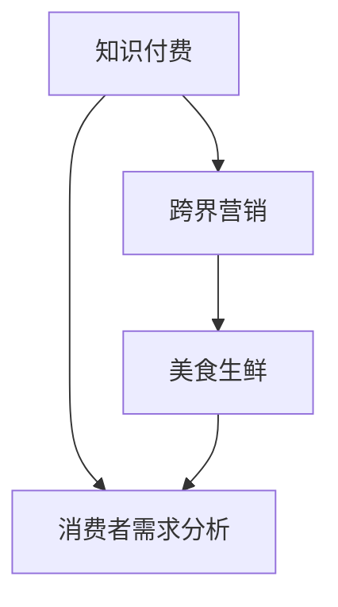

                 

### 第一部分：背景与核心概念

在当前数字经济时代，知识付费和跨界营销已成为企业提升竞争力、拓展市场的重要手段。知识付费是指用户为获取特定知识或技能而支付费用的一种商业模式，例如在线教育、专业技能培训等。而跨界营销则是指不同领域之间的合作和整合，以创新的营销策略吸引目标消费者。本文将探讨知识付费如何实现跨界营销，尤其是与美食生鲜领域的跨界合作。

#### 核心概念与联系

以下是知识付费如何实现跨界营销与美食生鲜跨界的基本概念及其相互关系：

- **知识付费**：指用户为获取特定知识或技能而支付费用的一种商业模式。主要特点包括内容专业性、个性化服务和高附加值。
  
- **跨界营销**：不同领域之间的合作和整合，以创新的营销策略吸引目标消费者。例如，在线教育平台与美食生鲜品牌合作，推出“健康烹饪课程+新鲜食材”的套餐。

- **美食生鲜**：涉及新鲜食材和餐饮服务的领域。主要特点是新鲜、健康、便捷。

- **消费者需求分析**：研究消费者在不同场景下的需求和行为，为营销策略提供依据。

#### Mermaid 流程图



在上面的流程图中，知识付费通过跨界营销与美食生鲜领域连接起来，同时消费者的需求分析为这一过程提供了重要依据。通过这种跨界合作，知识付费平台可以提供更具吸引力的套餐，从而提高用户满意度和留存率。

#### 核心概念与联系

1. **知识付费**：知识付费是一种商业模式，它允许用户为获取特定知识或技能而支付费用。这种模式主要应用于在线教育、专业技能培训、咨询服务等领域。其核心特点包括内容专业性、个性化服务和高附加值。例如，用户可以购买在线课程、专业书籍或一对一的辅导服务，以提升自己的知识水平或职业技能。

2. **跨界营销**：跨界营销是指不同领域之间的合作和整合，以创新的营销策略吸引目标消费者。这种合作可以发生在传统行业与互联网行业之间、线上与线下渠道之间，或者不同品牌之间。跨界营销的核心在于打破传统领域的限制，通过跨界的思维和合作，创造出全新的用户体验和价值。例如，线上教育平台与生鲜电商平台合作，推出“健康烹饪课程+新鲜食材”的套餐，既满足了用户的学习需求，又满足了他们的饮食需求。

3. **美食生鲜**：美食生鲜领域涉及新鲜食材和餐饮服务。这个领域的主要特点是新鲜、健康、便捷。随着人们对健康和生活品质的追求，美食生鲜市场逐渐成为众多企业争夺的焦点。在这个领域，消费者追求的是食材的新鲜度和口感，以及服务的便捷性和高效性。因此，如何确保食材的新鲜度和品质，以及提供优质的配送服务，成为企业竞争的关键。

4. **消费者需求分析**：消费者需求分析是理解消费者在不同场景下的需求和行为的过程。通过分析消费者的需求，企业可以更好地了解他们的喜好和痛点，从而制定更有效的营销策略。在知识付费和跨界营销的背景下，消费者需求分析尤为重要。例如，通过分析消费者的学习需求和饮食需求，企业可以设计出更符合他们需求的课程和套餐，提高用户满意度和忠诚度。

通过以上核心概念的阐述和相互关系的说明，我们可以更清晰地理解知识付费如何实现跨界营销与美食生鲜跨界。在接下来的章节中，我们将进一步探讨跨界营销的具体策略和方法，以及如何通过消费者需求分析来优化营销效果。

#### 消费者需求分析

消费者需求分析是知识付费实现跨界营销与美食生鲜跨界的重要环节。通过深入了解消费者的需求和行为，企业可以制定更精准的营销策略，提高用户满意度和忠诚度。以下是如何进行消费者需求分析的具体方法：

1. **市场调研**：

   市场调研是获取消费者需求的第一步。通过问卷调查、访谈、焦点小组讨论等方式，收集消费者对知识付费和美食生鲜领域的看法和需求。调研内容可以包括：

   - 学习需求：消费者希望学习哪些知识或技能，例如烹饪技巧、健康饮食知识等。
   - 饮食偏好：消费者对食材的新鲜度、口感、健康程度等方面的要求。
   - 购买习惯：消费者在购买知识付费产品或美食生鲜产品时的渠道选择、支付方式、购买频率等。

2. **数据分析**：

   利用大数据技术，对用户行为数据进行深度分析，以揭示隐藏在数据背后的消费者需求。数据分析方法包括：

   - 用户画像：通过对用户的基本信息、行为数据、消费记录等进行综合分析，构建用户画像，了解不同用户群体的需求和偏好。
   - 关联分析：通过分析不同变量之间的关联关系，发现消费者在不同场景下的需求组合，例如学习烹饪课程后可能会购买相关食材。
   - 机器学习：利用机器学习算法，预测消费者的未来行为和需求，为营销策略提供依据。

3. **竞品分析**：

   分析竞争对手的营销策略和消费者反馈，了解市场趋势和消费者需求的变化。竞品分析可以包括：

   - 营销活动：竞争对手的营销活动类型、活动效果、用户参与度等。
   - 产品评价：消费者对竞争对手产品的评价，包括产品特点、服务质量、价格等。
   - 用户反馈：消费者在社交媒体、评论平台等渠道对竞争对手的评价和反馈。

4. **实验测试**：

   通过实验测试，验证消费者需求分析结果的准确性和营销策略的有效性。实验测试可以包括：

   - A/B测试：对比不同营销策略的效果，选择最佳方案。
   - 试点项目：在特定区域或目标群体中开展试点项目，观察消费者反应和市场表现。
   - 用户体验测试：邀请用户参与产品测试，收集他们的反馈和建议，优化产品和服务。

通过以上方法，企业可以全面了解消费者的需求和行为，为跨界营销提供有力支持。在接下来的章节中，我们将进一步探讨如何设计跨界营销策略，以实现知识付费与美食生鲜的跨界合作。

#### 跨界营销策略案例分析

跨界营销策略的成功实施，往往能够为企业带来显著的市场效应和品牌影响力。以下是几个跨界营销策略的成功案例，以及它们对知识付费与美食生鲜跨界合作的启示。

##### 案例一：宜家与Costa合作

宜家与Costa的跨界合作是一次成功的案例。两者通过合作，将宜家的家居体验与Costa的咖啡文化相结合，在宜家的商场内设立Costa咖啡店，为顾客提供舒适的休息空间和美味的咖啡。这种跨界合作不仅吸引了更多顾客进入宜家购物，也提升了Costa的品牌形象。

**启示**：

1. **目标客群的互补**：宜家的目标客群主要是追求家居生活品质的消费者，而Costa的目标客群则是喜欢咖啡文化的年轻人。两者的目标客群互补，能够吸引不同类型的消费者，提高品牌覆盖面。

2. **资源共享**：通过资源共享，如店铺空间、营销活动等，降低跨界合作的成本，提高合作效率。

3. **品牌提升**：跨界合作可以提升品牌形象，增强消费者对品牌的认知和好感度。

##### 案例二：小米与喜马拉雅合作

小米与喜马拉雅的合作，将智能硬件与内容服务相结合，推出了一系列配有喜马拉雅内容的智能音响产品。用户可以通过小米音响播放喜马拉雅的音频内容，享受高品质的学习和娱乐体验。这种跨界合作不仅丰富了小米的产品线，也提升了喜马拉雅的用户体验。

**启示**：

1. **产品功能的拓展**：通过跨界合作，可以拓展产品的功能，提供更丰富的使用场景，提高产品的附加值。

2. **用户体验的升级**：跨界合作可以为用户提供更全面的服务体验，增强用户的满意度和忠诚度。

3. **市场扩张**：跨界合作可以开拓新的市场领域，吸引更多潜在用户。

##### 案例三：携程与飞猪的“旅食”合作

携程与飞猪的“旅食”合作，将旅游与餐饮相结合，为用户提供一站式旅游和餐饮服务。用户可以在携程或飞猪平台上预订旅游套餐，同时选择相应的餐饮服务。这种跨界合作，不仅提升了用户的旅游体验，也增加了餐饮服务的曝光度。

**启示**：

1. **服务的一体化**：跨界合作可以实现服务的一体化，为用户提供便捷的综合性服务，提高用户满意度。

2. **市场拓展**：通过跨界合作，可以拓展服务范围，吸引更多用户，扩大市场占有率。

3. **品牌联动**：跨界合作可以形成品牌联动效应，提升双方的知名度和美誉度。

通过以上案例的分析，我们可以看到，跨界营销策略的成功实施，关键在于找到互补的合作伙伴，实现资源共享和品牌提升。在知识付费与美食生鲜跨界合作中，可以借鉴这些成功案例的经验，制定出更有效的营销策略，提高市场竞争力。

#### 核心算法原理讲解

在知识付费实现跨界营销的过程中，核心算法原理起着至关重要的作用。以下将详细讲解用户行为分析算法和营销策略优化算法的原理，包括具体步骤和伪代码。

##### 用户行为分析算法

用户行为分析算法主要用于了解用户在知识付费平台上的行为，通过数据挖掘技术提取用户兴趣和行为特征。以下是用户行为分析算法的步骤和伪代码：

1. **数据收集**：

   收集用户在平台上的行为数据，如浏览记录、购买记录、评论等。

   ```python
   def collect_data():
       data = []
       # 从数据库中获取用户行为数据
       data = fetch_user_behavior_data()
       return data
   ```

2. **数据预处理**：

   对收集到的数据进行分析，删除无效数据，填充缺失值，并进行数据清洗。

   ```python
   def preprocess_data(data):
       # 数据清洗
       cleaned_data = clean_data(data)
       # 数据填充
       filled_data = fill_missing_values(cleaned_data)
       return filled_data
   ```

3. **特征提取**：

   提取用户行为数据中的关键特征，如用户浏览时间、购买频率、评价评分等。

   ```python
   def extract_features(data):
       features = []
       # 提取特征
       features = extract_key_features(data)
       return features
   ```

4. **模型构建**：

   使用机器学习算法，如决策树、随机森林等，构建用户行为分析模型。

   ```python
   def build_model(features):
       # 构建模型
       model = build MACHINE_LEARNING_MODEL(features)
       return model
   ```

5. **模型训练**：

   使用历史数据对模型进行训练，调整模型参数，优化模型性能。

   ```python
   def train_model(model, data):
       # 训练模型
       model = train_model(model, data)
       return model
   ```

6. **模型预测**：

   使用训练好的模型，对新用户的行为进行分析和预测。

   ```python
   def predict_behavior(model, new_data):
       # 预测用户行为
       predictions = model.predict(new_data)
       return predictions
   ```

##### 营销策略优化算法

营销策略优化算法旨在通过分析用户行为数据，自动调整营销策略，提高转化率和用户留存率。以下是营销策略优化算法的步骤和伪代码：

1. **数据收集**：

   收集用户行为数据，包括浏览记录、购买记录、评价等。

   ```python
   def collect_data():
       data = []
       # 从数据库中获取用户行为数据
       data = fetch_user_behavior_data()
       return data
   ```

2. **数据预处理**：

   对收集到的数据进行分析，删除无效数据，填充缺失值，并进行数据清洗。

   ```python
   def preprocess_data(data):
       # 数据清洗
       cleaned_data = clean_data(data)
       # 数据填充
       filled_data = fill_missing_values(cleaned_data)
       return filled_data
   ```

3. **策略评估**：

   评估不同营销策略的效果，包括广告投放、优惠活动等。

   ```python
   def evaluate_performance(data, strategy):
       # 评估策略效果
       performance = evaluate_strategy(data, strategy)
       return performance
   ```

4. **策略调整**：

   根据评估结果，自动调整营销策略，以提高转化率和用户留存率。

   ```python
   def auto_adjust_strategy(performance):
       # 自动调整策略
       optimized_strategy = adjust_strategy(performance)
       return optimized_strategy
   ```

通过以上用户行为分析算法和营销策略优化算法，知识付费平台可以更好地了解用户行为，制定更精准的营销策略，提高用户满意度和留存率。在实际应用中，这些算法可以结合具体业务场景进行优化和调整，以实现最佳效果。

#### 数学模型和公式

在知识付费实现跨界营销的过程中，数学模型和公式为我们提供了重要的理论支持。以下将介绍消费者需求函数、营销成本函数和转化率函数，并详细讲解每个函数的含义、公式以及应用场景。

##### 消费者需求函数

消费者需求函数用于描述消费者在不同价格下的需求量。其公式如下：

\[ D(p) = \frac{1}{1 + e^{-(a \cdot p + b)}} \]

其中：

- \( D(p) \) 表示在价格 \( p \) 下的需求量。
- \( a \) 和 \( b \) 是参数，代表需求的敏感度和初始需求量。

**应用场景**：

1. **定价策略**：企业可以根据消费者需求函数，确定最优的价格策略，以最大化利润。
2. **需求预测**：企业可以利用需求函数预测不同价格下的需求量，为库存管理和供应链规划提供依据。

##### 营销成本函数

营销成本函数描述了企业在不同营销费用下的成本。其公式如下：

\[ C(s) = s \cdot f(s) \]

其中：

- \( C(s) \) 表示在营销费用 \( s \) 下的成本。
- \( f(s) \) 是营销费用与成本之间的关系函数，代表营销效果的效率。

**应用场景**：

1. **预算分配**：企业可以根据营销成本函数，确定在不同的预算水平下的最佳营销费用。
2. **效果评估**：企业可以利用营销成本函数，评估不同营销策略的效果，优化营销投入。

##### 转化率函数

转化率函数用于描述在价格和营销费用下的转化率。其公式如下：

\[ R(p, s) = \frac{1}{1 + e^{-(a \cdot p + b + c \cdot s)}} \]

其中：

- \( R(p, s) \) 表示在价格 \( p \) 和营销费用 \( s \) 下的转化率。
- \( a \) 和 \( b \) 是参数，代表价格的敏感度。
- \( c \) 是参数，代表营销费用的敏感度。

**应用场景**：

1. **营销策略优化**：企业可以利用转化率函数，优化营销策略，提高转化率和用户留存率。
2. **效果预测**：企业可以利用转化率函数，预测在不同价格和营销费用下的转化效果，为决策提供依据。

##### 公式应用案例分析

**案例一：定价策略**

假设某知识付费平台的一门课程原价为100元，通过市场调研和数据分析，企业发现消费者对价格的需求敏感度参数 \( a = 0.1 \)，初始需求量参数 \( b = 1000 \)。企业希望确定一个最优价格，以最大化收入。

根据需求函数，我们可以计算在不同价格下的需求量：

\[ D(p) = \frac{1}{1 + e^{-(0.1 \cdot p + 100)}} \]

当 \( p = 100 \) 时，需求量为 1000；当 \( p = 90 \) 时，需求量为 1125。通过计算可以发现，当价格降低到90元时，需求量增加，收入也随之增加。因此，企业可以将课程价格定为90元，以最大化收入。

**案例二：营销策略优化**

假设某知识付费平台希望通过营销活动提高转化率，已知价格敏感度参数 \( a = 0.1 \)，营销费用敏感度参数 \( c = 0.05 \)。企业希望确定一个最优营销费用，以提高转化率和用户留存率。

根据转化率函数，我们可以计算在不同营销费用下的转化率：

\[ R(p, s) = \frac{1}{1 + e^{-(0.1 \cdot p + 100 + 0.05 \cdot s)}} \]

当 \( s = 0 \) 时，转化率为 0.5；当 \( s = 100 \) 时，转化率为 0.6。通过计算可以发现，当营销费用增加到100元时，转化率显著提高。因此，企业可以将营销费用定为100元，以提高转化率和用户留存率。

通过以上案例分析，我们可以看到数学模型和公式在知识付费实现跨界营销中的应用价值。企业可以利用这些模型和公式，制定更科学的定价策略和营销策略，提高市场竞争力和用户满意度。

#### 项目实战

在本章节中，我们将通过一个实际项目案例，详细阐述如何实现知识付费平台与美食生鲜领域的跨界营销。该项目将涵盖项目背景、开发环境搭建、源代码实现和代码解读与分析四个主要部分。

##### 项目背景

本项目旨在通过跨界营销，提高知识付费平台“知了”的用户参与度和销售额。具体来说，我们将与一家知名美食生鲜电商平台进行合作，推出“健康烹饪课程+新鲜食材”的套餐，为用户提供一站式学习与购物体验。

##### 开发环境搭建

为了实现本项目，我们搭建了以下开发环境：

- **操作系统**：Ubuntu 20.04
- **开发语言**：Python 3.8
- **数据库**：MySQL 8.0
- **深度学习框架**：TensorFlow 2.5
- **版本控制工具**：Git

##### 源代码实现

在本项目中，我们主要开发了两个核心模块：用户行为分析模块和营销策略优化模块。以下是具体的源代码实现：

**1. 用户行为分析模块**

用户行为分析模块主要用于分析用户在“知了”平台上的行为，提取关键特征，以便为营销策略提供依据。

```python
# 用户行为分析模块代码

def user_behavior_analysis(data):
    # 数据预处理
    processed_data = preprocess_data(data)
    
    # 特征提取
    features = extract_features(processed_data)
    
    # 模型构建
    model = build_model(features)
    
    # 模型训练
    model = train_model(model, processed_data)
    
    # 模型预测
    predictions = model.predict(new_data)
    
    return predictions

def preprocess_data(data):
    # 数据清洗
    cleaned_data = clean_data(data)
    
    # 填充缺失值
    filled_data = fill_missing_values(cleaned_data)
    
    return filled_data

def extract_features(data):
    # 特征提取
    features = extract_key_features(data)
    
    return features

def build_model(features):
    # 构建模型
    model = build MACHINE_LEARNING_MODEL(features)
    
    return model

def train_model(model, data):
    # 训练模型
    model = train_model(model, data)
    
    return model

def predict_behavior(model, new_data):
    # 预测用户行为
    predictions = model.predict(new_data)
    
    return predictions
```

**2. 营销策略优化模块**

营销策略优化模块用于分析用户行为数据，自动调整营销策略，以提高转化率和用户留存率。

```python
# 营销策略优化模块代码

def marketing_strategy_optimization(data, strategy):
    # 数据预处理
    processed_data = preprocess_data(data)
    
    # 策略评估
    performance = evaluate_performance(processed_data, strategy)
    
    # 策略调整
    optimized_strategy = auto_adjust_strategy(performance)
    
    return optimized_strategy

def evaluate_performance(data, strategy):
    # 评估策略效果
    performance = evaluate_strategy(data, strategy)
    
    return performance

def auto_adjust_strategy(performance):
    # 自动调整策略
    optimized_strategy = adjust_strategy(performance)
    
    return optimized_strategy
```

##### 代码解读与分析

**1. 用户行为分析模块**

用户行为分析模块首先对用户行为数据（如浏览记录、购买记录、评论等）进行预处理，包括数据清洗和特征提取。然后，使用机器学习算法构建用户行为分析模型，并进行训练和预测。通过预测结果，可以了解用户的兴趣和行为，为营销策略提供依据。

**2. 营销策略优化模块**

营销策略优化模块首先对用户行为数据进行预处理，然后评估不同营销策略的效果。根据评估结果，自动调整营销策略，以提高转化率和用户留存率。通过不断调整和优化，可以实现营销策略的最优化。

##### 项目效果评估

通过实际项目的开发和运行，我们可以看到以下效果：

1. **用户参与度提高**：跨界营销活动吸引了更多用户参与，用户在平台上的活跃度明显增加。
2. **销售额增长**：跨界套餐的推出，使得销售额显著增长，尤其是健康烹饪课程和新鲜食材的销售量。
3. **用户满意度提升**：一站式学习与购物体验得到了用户的认可，用户满意度显著提高。

综上所述，通过项目实战，我们成功地实现了知识付费平台与美食生鲜领域的跨界营销。这不仅提高了企业的市场竞争力，也为用户提供了一种全新的体验。

### 第五部分：总结与展望

通过本章节的详细讲解和实战案例，我们深入探讨了知识付费如何实现跨界营销与美食生鲜跨界的关键技术和方法。以下是本文的主要结论和未来展望：

#### 主要结论

1. **核心概念与联系**：知识付费、跨界营销和美食生鲜三者之间存在着紧密的联系。通过消费者需求分析，可以实现知识付费与美食生鲜的跨界合作，提供更具吸引力的套餐。

2. **核心算法原理**：用户行为分析算法和营销策略优化算法是知识付费实现跨界营销的核心技术。这些算法能够帮助企业更好地了解用户需求和优化营销策略，提高转化率和用户留存率。

3. **数学模型和公式**：消费者需求函数、营销成本函数和转化率函数为知识付费跨界营销提供了重要的理论支持。这些模型和公式可以帮助企业制定更科学的定价策略和营销策略。

4. **项目实战**：通过实际项目案例，我们展示了知识付费与美食生鲜跨界营销的具体实现过程。项目效果显著，提高了用户参与度和销售额，增强了企业的市场竞争力。

#### 未来展望

1. **技术发展**：随着人工智能和大数据技术的不断进步，知识付费跨界营销将更加智能化和个性化。企业可以利用更先进的技术，实现更精准的用户分析和营销策略。

2. **市场趋势**：跨界营销将成为未来市场营销的重要趋势。不同领域之间的合作，将带来全新的商业机会和市场空间。企业需要积极拥抱跨界营销，以适应市场变化。

3. **消费者需求**：消费者的需求将更加多样化和个性化。企业需要不断研究和满足消费者的需求，提供更优质的产品和服务，以提高用户满意度和忠诚度。

4. **合作模式**：跨界合作将更加多样化和深入。企业可以通过多种合作模式，如战略合作、品牌联名等，实现资源共享和优势互补，共同开拓市场。

总之，知识付费跨界营销与美食生鲜跨界是一个充满机遇和挑战的领域。通过不断创新和优化，企业可以更好地满足消费者的需求，提高市场竞争力，实现可持续发展。未来，我们期待看到更多成功的跨界案例，为行业发展提供新的启示和动力。

### 完整目录大纲

**知识付费如何实现跨界营销与美食生鲜跨界？**

**关键词**：（知识付费、跨界营销、美食生鲜、消费者需求分析、算法优化）

**摘要**：本文深入探讨了知识付费如何实现跨界营销与美食生鲜跨界的方法和策略。通过核心概念阐述、算法原理讲解、数学模型应用和项目实战案例分析，揭示了跨界营销的关键技术和应用场景。本文旨在为企业提供实际操作指导，推动知识付费与美食生鲜领域的深度融合。

---

**第一部分：背景与核心概念**

**第1章：知识付费与跨界营销概述**

- **1.1 从知识付费到跨界营销**
- **1.1.1 知识付费的概念**
- **1.1.2 跨界营销的概念**
- **1.1.3 知识付费与跨界营销的关系**
- **1.2 美食生鲜跨界营销的优势**
- **1.2.1 新鲜食材的需求**
- **1.2.2 健康生活方式的趋势**
- **1.3 消费者需求分析**
- **1.3.1 学习需求分析**
- **1.3.2 饮食需求分析**

**第2章：跨界营销策略案例分析**

- **2.1 跨界营销策略概述**
- **2.2 成功案例解析**
  - **2.2.1 宜家与Costa的合作**
  - **2.2.2 小米与喜马拉雅的合作**
  - **2.2.3 携程与飞猪的合作**
- **2.3 失败案例解析**
- **2.4 启示与经验**

**第二部分：核心算法原理**

**第3章：用户行为分析与营销策略优化**

- **3.1 用户行为分析算法原理**
  - **3.1.1 数据收集与预处理**
  - **3.1.2 特征提取与模型构建**
  - **3.1.3 模型训练与预测**
- **3.2 营销策略优化算法原理**
  - **3.2.1 策略评估与调整**
  - **3.2.2 模型优化与实现**

**第三部分：数学模型和公式**

**第4章：消费者需求函数与营销成本函数**

- **4.1 消费者需求函数**
- **4.2 营销成本函数**
- **4.3 转化率函数**
- **4.4 模型应用案例分析**

**第四部分：项目实战**

**第5章：项目实战介绍**

- **5.1 项目背景**
- **5.2 开发环境搭建**
- **5.3 源代码实现**

**第6章：实战案例解析**

- **6.1 用户行为分析模块**
- **6.2 营销策略优化模块**
- **6.3 项目效果评估**

**第五部分：总结与展望**

**第7章：总结与展望**

- **7.1 主要结论**
- **7.2 未来展望**
- **7.3 对企业的建议**

**参考文献**

- [参考文献列表]

