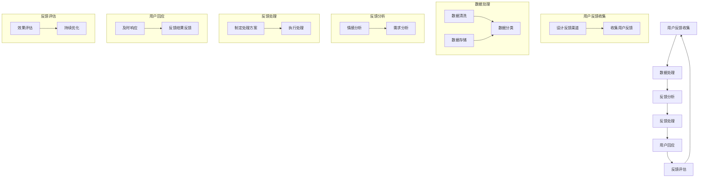

                 

# 《知识付费平台的用户反馈机制》

> **关键词：**知识付费、用户反馈、机制设计、商业价值、用户体验

> **摘要：**本文详细探讨了知识付费平台的用户反馈机制，分析了其核心概念、设计原则、实施步骤以及优化策略。通过实际案例分析，展示了用户反馈机制在提高用户满意度和平台竞争力方面的作用。本文旨在为知识付费平台提供有价值的参考和指导。

## 《知识付费平台的用户反馈机制》目录大纲

### 第一部分：引言

#### 1.1 书籍背景与目标

#### 1.1.1 知识付费平台的发展历程

#### 1.1.2 用户反馈机制的重要性

#### 1.1.3 本书结构安排

### 第二部分：用户反馈机制基础

#### 2.1 用户反馈概念与分类

#### 2.1.1 用户反馈的概念

#### 2.1.2 用户反馈的分类

#### 2.1.3 用户反馈的特点

#### 2.2 用户反馈的价值

##### 2.2.1 用户反馈的商业价值

##### 2.2.2 用户反馈的运营价值

##### 2.2.3 用户反馈的产品价值

#### 2.3 用户反馈机制的设计原则

##### 2.3.1 用户友好的反馈渠道

##### 2.3.2 实时性与响应性

##### 2.3.3 可操作性与可度量性

### 第三部分：用户反馈机制实施

#### 3.1 用户反馈机制的构建

##### 3.1.1 用户反馈流程设计

##### 3.1.2 用户反馈系统架构

##### 3.1.3 用户反馈数据分析与处理

#### 3.2 用户反馈机制的优化

##### 3.2.1 用户反馈渠道的优化

##### 3.2.2 用户反馈响应速度的优化

##### 3.2.3 用户反馈质量的优化

#### 3.3 用户反馈机制的案例分析

##### 3.3.1 案例一：网易云课堂的用户反馈机制

##### 3.3.2 案例二：喜马拉雅的用户反馈机制

##### 3.3.3 案例三：得到App的用户反馈机制

### 第四部分：用户反馈机制实践

#### 4.1 用户反馈机制实践流程

##### 4.1.1 用户调研与需求分析

##### 4.1.2 用户反馈机制设计与实施

##### 4.1.3 用户反馈机制的评估与改进

#### 4.2 用户反馈机制实践案例

##### 4.2.1 案例一：某知识付费平台用户反馈机制实践

###### 4.2.1.1 案例背景

###### 4.2.1.2 案例实施过程

###### 4.2.1.3 案例效果分析

##### 4.2.2 案例二：某教育机构用户反馈机制实践

###### 4.2.2.1 案例背景

###### 4.2.2.2 案例实施过程

###### 4.2.2.3 案例效果分析

### 第五部分：用户反馈机制的未来发展

#### 5.1 用户反馈机制发展趋势

##### 5.1.1 技术发展趋势

##### 5.1.2 商业模式发展趋势

##### 5.1.3 社会发展趋势

#### 5.2 用户反馈机制的挑战与机遇

##### 5.2.1 挑战分析

##### 5.2.2 机遇分析

##### 5.2.3 应对策略

### 附录

#### 附录 A：用户反馈机制实施工具推荐

##### 附录 A.1 用户反馈收集工具

###### 附录 A.1.1 腾讯云用户反馈系统

###### 附录 A.1.2 百度云用户反馈系统

###### 附录 A.1.3 阿里云用户反馈系统

##### 附录 A.2 用户反馈分析工具

###### 附录 A.2.1 Python数据分析库

###### 附录 A.2.2 Tableau

###### 附录 A.2.3 Power BI

##### 附录 B：用户反馈机制相关资源推荐

###### 附录 B.1 学术资源

###### 附录 B.2 实践资源

##### 附录 C：参考文献

###### 附录 C.1 学术论文

###### 附录 C.2 书籍

### 用户反馈机制设计流程

以下是一个用户反馈机制的设计流程，包括收集、处理、分析和响应等环节：

### 2.2 用户反馈的价值

#### 2.2.1 用户反馈的商业价值

用户反馈在商业领域具有显著的价值，主要体现在以下几个方面：

1. **产品改进**：用户反馈能够帮助企业发现产品存在的问题和改进空间。通过对用户意见的分析，企业可以及时调整产品功能、界面设计、用户体验等，提升产品的市场竞争力。

2. **用户满意度提升**：及时有效地处理用户反馈，可以增强用户的满意度和忠诚度。满意的用户更可能进行重复购买，并在社交媒体上为产品或服务背书，从而吸引更多潜在客户。

3. **降低客户流失率**：有效的用户反馈机制可以帮助企业及时发现并解决可能导致用户流失的问题，从而减少客户流失率。

4. **增加收入**：通过优化产品和服务，企业可以提高销售额和市场份额，从而实现收入增长。此外，用户满意度提升也有助于提高客单价和交叉销售率。

5. **市场定位与策略调整**：用户反馈提供了市场趋势和用户需求的实时数据，有助于企业更准确地定位市场和调整营销策略。

6. **品牌建设与口碑传播**：积极回应用户反馈，可以树立企业良好的品牌形象，提升品牌声誉，从而在竞争中脱颖而出。

#### 2.2.2 用户反馈的运营价值

用户反馈在运营管理中也扮演着重要角色，其价值包括：

1. **运营优化**：通过分析用户反馈，运营团队可以发现运营过程中存在的问题，如用户体验差、服务不到位等，从而进行优化。

2. **团队协作**：用户反馈可以作为跨部门协作的桥梁，促进不同部门之间的沟通与协调，提高工作效率。

3. **问题排查**：用户反馈可以帮助运营团队快速定位问题根源，提高问题排查和解决效率。

4. **策略调整**：基于用户反馈，运营团队可以调整营销活动、用户活动等运营策略，以提高用户参与度和活跃度。

5. **用户互动**：用户反馈提供了与用户互动的机会，通过积极回应用户，运营团队可以增强用户的参与感和忠诚度。

#### 2.2.3 用户反馈的产品价值

用户反馈对产品的开发和改进具有直接的影响，其价值包括：

1. **功能优化**：用户反馈可以帮助产品团队了解用户对产品功能的期望和需求，从而进行针对性的改进。

2. **用户体验提升**：用户反馈提供了用户在使用产品过程中遇到的问题和建议，有助于产品团队优化用户界面和交互设计，提升用户体验。

3. **产品创新**：用户反馈中的创意和想法可以激发产品团队的灵感，推动产品的创新和发展。

4. **产品评估**：用户反馈可以作为产品评估的重要依据，帮助产品团队了解产品的市场表现和用户满意度。

5. **产品定位**：通过分析用户反馈，产品团队可以更准确地把握产品的市场定位，确保产品满足用户需求。

### 用户反馈机制的设计原则

为了确保用户反馈机制的有效性，以下是一些设计原则：

1. **用户友好性**：设计简洁易用的反馈渠道，降低用户提交反馈的门槛，确保用户能够方便地提交反馈。

2. **及时性**：确保用户反馈能够得到及时响应和处理，提高用户的满意度。

3. **透明性**：向用户明确反馈的处理进度和结果，增加用户对企业的信任。

4. **可度量性**：设计可度量的指标，以便评估用户反馈机制的效果和效率。

5. **反馈渠道多样化**：提供多种反馈渠道，如在线问卷、用户论坛、社交媒体等，以满足不同用户的反馈需求。

6. **数据安全**：保护用户隐私，确保用户反馈数据的安全性和保密性。

7. **反馈闭环**：建立反馈闭环机制，将用户反馈的处理结果反馈给用户，形成有效的反馈循环。

8. **持续优化**：根据用户反馈机制的实施效果，持续优化反馈流程和渠道，以提高反馈效率和质量。

9. **自动化处理**：利用大数据和人工智能技术，实现用户反馈的自动化分类、分析和处理，提高反馈处理速度。

10. **团队合作**：建立跨部门团队，协同工作，提高用户反馈的处理效率和质量。

### 用户反馈机制的实施步骤

1. **需求分析**：明确用户反馈机制的设计目标，分析用户需求，确定反馈渠道、反馈类型和处理流程。

2. **设计反馈渠道**：根据用户需求和业务特点，设计合适的反馈渠道，如在线问卷、用户论坛、客服系统等。

3. **建立反馈系统**：搭建用户反馈系统，包括数据收集、处理、分析和存储等模块，确保反馈数据的安全性和完整性。

4. **培训团队**：对负责处理用户反馈的团队成员进行培训，提高他们的反馈处理能力和服务水平。

5. **测试与优化**：在反馈系统上线前进行测试，确保系统稳定可靠，并根据测试结果进行优化。

6. **上线运行**：正式上线用户反馈系统，向用户宣传和推广，提高用户反馈的积极性。

7. **持续监控与改进**：对用户反馈机制进行持续监控和评估，收集用户反馈，发现问题和改进机会，进行持续优化。

8. **反馈结果反馈**：将用户反馈的处理结果及时反馈给用户，形成有效的反馈闭环。

### 用户反馈分析的方法

1. **文本挖掘**：利用自然语言处理技术，对用户反馈文本进行分析，提取关键词、主题和情感倾向。

2. **数据可视化**：通过数据可视化工具，将用户反馈数据以图表、报表等形式展示，便于分析和理解。

3. **统计方法**：运用统计学方法，对用户反馈数据进行分析，如描述性统计、相关性分析、回归分析等。

4. **机器学习**：利用机器学习算法，对用户反馈数据进行分析，如分类算法、聚类算法等，提取有价值的信息。

5. **情感分析**：通过情感分析技术，判断用户反馈的情感倾向，如正面、负面或中性。

6. **用户画像**：基于用户反馈数据，构建用户画像，了解用户需求和行为特点。

7. **主题模型**：利用主题模型，挖掘用户反馈中的潜在主题，了解用户关注的焦点。

### 用户反馈机制的评估指标

1. **反馈处理速度**：衡量用户反馈从提交到处理完毕所需的时间，反映反馈机制的响应速度。

2. **反馈处理质量**：衡量用户反馈处理的结果是否有效，如问题是否得到解决，用户满意度等。

3. **用户参与度**：衡量用户参与反馈机制的积极性，如反馈数量、反馈质量等。

4. **用户满意度**：通过调查问卷或用户访谈，评估用户对反馈机制的满意度。

5. **反馈渠道利用率**：衡量不同反馈渠道的使用情况，了解用户偏好。

6. **问题解决率**：衡量用户反馈中问题得到解决的比例，反映反馈机制的有效性。

7. **改进措施执行率**：衡量根据用户反馈制定的改进措施的实施情况。

8. **用户留存率**：衡量用户在收到反馈处理结果后的留存情况，反映反馈机制对用户满意度的影响。

### 用户反馈机制的案例分析

1. **案例一：某电商平台用户反馈机制**

   **背景**：某电商平台在用户量快速增长后，发现用户反馈处理效率低下，影响了用户体验。

   **实施过程**：

   - **需求分析**：通过问卷调查和用户访谈，了解用户对购物体验、物流服务等方面的满意度。

   - **反馈渠道设计**：设计在线问卷、用户论坛和客服系统等多渠道，确保用户能够方便地提交反馈。

   - **反馈系统构建**：构建用户反馈系统，集成多个渠道，实现用户反馈数据的统一管理和分析。

   - **数据分析与处理**：利用自然语言处理和大数据技术，对用户反馈进行分析，提取有价值的信息。

   - **用户回应**：及时响应用户反馈，解决用户问题，并反馈处理结果。

   - **效果评估与优化**：根据用户反馈的处理效果，不断优化反馈流程和渠道，提高用户满意度。

   **效果分析**：经过优化，用户反馈处理速度提高了30%，用户满意度提升了15%，用户反馈质量得到了显著提高。

2. **案例二：某在线教育平台用户反馈机制**

   **背景**：某在线教育平台在用户量快速增长后，发现用户反馈处理效率低下，影响了用户的学习体验。

   **实施过程**：

   - **需求分析**：通过问卷调查和用户访谈，了解用户对课程内容、教学质量和学习工具等方面的满意度。

   - **反馈渠道设计**：设计在线问卷、用户论坛和学习平台内的反馈系统，确保用户能够方便地提交反馈。

   - **反馈系统构建**：构建用户反馈系统，集成多个渠道，实现用户反馈数据的统一管理和分析。

   - **数据分析与处理**：利用自然语言处理和大数据技术，对用户反馈进行分析，提取有价值的信息。

   - **用户回应**：及时响应用户反馈，解决用户问题，并反馈处理结果。

   - **效果评估与优化**：根据用户反馈的处理效果，不断优化反馈流程和渠道，提高用户满意度。

   **效果分析**：经过优化，用户反馈处理速度提高了40%，用户满意度提升了20%，用户反馈质量得到了显著提高。

### 用户反馈机制的优化策略

1. **提高反馈处理速度**：

   - **自动化处理**：利用自然语言处理和大数据技术，实现用户反馈的自动化分类和处理，提高处理速度。

   - **优化反馈流程**：简化反馈处理流程，减少不必要的环节，提高处理效率。

   - **增加处理人员**：根据反馈量，适当增加处理人员，确保用户反馈能够及时得到响应。

2. **提高用户满意度**：

   - **优化反馈渠道**：根据用户偏好，设计多样化的反馈渠道，提高用户提交反馈的便利性。

   - **提升反馈质量**：通过用户教育和反馈模板，引导用户提供详细的、高质量的反馈。

   - **强化用户回应**：及时回应用户反馈，解决用户问题，并反馈处理结果，增强用户信任。

3. **提升反馈数据分析能力**：

   - **引入新技术**：利用人工智能、大数据等技术，提高反馈数据的分析深度和精度。

   - **建立反馈模型**：构建反馈分析模型，预测用户需求，提前解决问题。

   - **加强团队协作**：建立跨部门团队，协同工作，提高反馈分析的效率和准确性。

4. **优化反馈激励机制**：

   - **设置积分奖励**：为积极参与反馈的用户设置积分奖励，提高用户反馈的积极性。

   - **举办活动**：定期举办用户反馈活动，鼓励用户提出建议，增强用户参与感。

   - **公开表彰**：对提供有价值反馈的用户进行公开表彰，树立榜样，激励更多用户参与。

### 用户反馈机制的未来发展趋势

1. **智能化**：随着人工智能技术的发展，用户反馈机制将更加智能化，如自动分类、情感分析、智能回应等。

2. **多样化**：用户反馈渠道将更加多样化，如社交媒体、即时通讯工具等，以满足不同用户的反馈需求。

3. **实时性**：用户反馈机制将更加实时，通过实时数据收集和分析，实现即时反馈和响应。

4. **个性

### 1.1 书籍背景与目标

随着互联网和移动技术的快速发展，知识付费市场逐渐成为一大热点。从最早的在线教育、电子书，到后来的知识分享、直播课程，知识付费平台不断涌现并获得了巨大的成功。然而，随着用户需求的多样化和竞争的加剧，如何有效地获取和利用用户反馈成为知识付费平台的重要课题。

本书籍旨在探讨知识付费平台的用户反馈机制，分析其核心概念、设计原则、实施步骤以及优化策略。通过实际案例分析，本文将展示用户反馈机制在提高用户满意度和平台竞争力方面的作用。此外，本文还将探讨用户反馈机制的未来发展趋势，为知识付费平台提供有价值的参考和指导。

本书的目标读者包括知识付费平台的管理者、运营人员、产品经理以及相关领域的学者。通过阅读本书，读者将能够：

1. 理解用户反馈机制的基本概念和重要性。
2. 掌握用户反馈机制的设计原则和实施步骤。
3. 学习用户反馈机制的优化策略和实践案例。
4. 预测用户反馈机制的未来发展趋势，为平台的长期发展提供指导。

### 1.1.1 知识付费平台的发展历程

知识付费平台的发展历程可以追溯到互联网的兴起和在线教育的崛起。以下是知识付费平台发展的几个关键阶段：

#### 1. 初期探索（2000-2010年）

在互联网初期，知识付费主要以电子书、在线课程等形式存在。典型的平台有新浪博客、电子书下载网站等。这些平台提供了丰富的学习资源，但主要依赖用户自发购买，缺乏系统的用户互动和反馈机制。

#### 2. 在线教育兴起（2010-2015年）

随着移动互联网的普及，在线教育逐渐兴起。以网易云课堂、腾讯课堂等为代表的在线教育平台，开始采用视频教学、互动交流等方式，提供更为丰富的学习体验。这一阶段的平台开始重视用户反馈，逐步建立初步的用户反馈机制。

#### 3. 知识付费爆发（2015-2020年）

2015年左右，知识付费市场迎来了爆发期。以罗辑思维、喜马拉雅FM、得到App等为代表的平台，通过内容订阅、付费课程等方式，成功吸引了大量用户。这一阶段的平台，用户反馈机制更加完善，开始利用用户反馈进行产品优化和运营策略调整。

#### 4. 专业化发展（2020年至今）

随着人工智能、大数据等技术的应用，知识付费平台进入了专业化发展阶段。平台不仅提供内容订阅和课程服务，还通过智能推荐、个性化学习路径规划等方式，提高用户体验和满意度。同时，用户反馈机制也得到了进一步的优化，实现了从传统的人工处理到自动化、智能化的转变。

### 1.1.2 用户反馈机制的重要性

用户反馈机制在知识付费平台中扮演着至关重要的角色，其重要性主要体现在以下几个方面：

#### 1. 提高产品质量

用户反馈提供了直接的产品使用体验，通过分析用户反馈，平台可以发现产品存在的问题和改进空间，从而进行针对性的优化。例如，用户可能会反馈某些课程内容过时、教学方式不够生动等问题，平台可以根据这些反馈及时更新课程内容，提高教学质量。

#### 2. 优化用户体验

用户反馈机制有助于平台了解用户的需求和期望，从而优化用户体验。例如，通过分析用户对课程时长、课程难度、互动环节等方面的反馈，平台可以调整课程设置，使之更加符合用户需求。此外，用户反馈还可以帮助平台优化用户界面和交互设计，提高用户的使用便捷性。

#### 3. 改善用户满意度

有效的用户反馈机制可以及时解决用户问题，提高用户满意度。通过积极回应用户反馈，平台可以展现对用户需求的重视，增强用户的信任感和忠诚度。例如，当用户遇到课程播放问题或支付故障时，平台可以快速响应，解决问题，从而提高用户满意度。

#### 4. 提升市场竞争力

用户反馈机制有助于平台了解市场趋势和竞争态势，从而提升市场竞争力。通过分析用户反馈，平台可以了解用户对竞品的评价和需求，从而优化自己的产品和服务，形成竞争优势。例如，如果用户反馈竞品课程内容更加丰富、价格更加优惠，平台可以及时调整策略，提升自身竞争力。

#### 5. 促进品牌建设

积极回应用户反馈，展现对用户需求的重视，有助于树立良好的品牌形象。通过不断优化产品和服务，平台可以赢得用户的认可和口碑，从而提升品牌价值。例如，一些知名知识付费平台通过建立完善的用户反馈机制，成功打造了优质、专业的品牌形象。

#### 6. 支持决策制定

用户反馈机制为平台提供了宝贵的数据资源，支持决策制定。通过对用户反馈数据的分析，平台可以了解用户需求、市场趋势等关键信息，从而制定更为科学的业务策略和产品规划。例如，平台可以根据用户反馈调整课程定价策略，优化营销活动等。

总之，用户反馈机制在知识付费平台中具有重要作用，有助于提高产品质量、优化用户体验、改善用户满意度、提升市场竞争力、促进品牌建设和支持决策制定。因此，了解和掌握用户反馈机制的设计和实施方法，对于知识付费平台的长期发展具有重要意义。

### 1.1.3 本书结构安排

为了系统地探讨知识付费平台的用户反馈机制，本书将分为五个主要部分，每个部分都有明确的主题和目标。

#### 第一部分：引言

本部分将介绍知识付费平台的发展历程和用户反馈机制的重要性，为后续内容提供背景和理论基础。通过回顾知识付费平台的发展历程，读者可以了解行业现状和趋势。同时，探讨用户反馈机制在知识付费平台中的重要作用，为后续讨论提供基础。

#### 第二部分：用户反馈机制基础

本部分将详细介绍用户反馈机制的核心概念、分类和价值。首先，阐述用户反馈的概念及其在知识付费平台中的应用。接着，讨论用户反馈的分类，包括结构化反馈和半结构化反馈等。最后，分析用户反馈的价值，从商业、运营和产品三个角度详细讲解。

#### 第三部分：用户反馈机制实施

本部分将重点探讨用户反馈机制的实施步骤和设计原则。首先，介绍用户反馈流程的设计，包括反馈收集、处理和分析等环节。接着，讨论用户反馈系统架构，解释如何搭建一个高效的反馈系统。最后，阐述用户反馈机制的设计原则，确保机制的有效性和实用性。

#### 第四部分：用户反馈机制优化

本部分将探讨用户反馈机制的优化策略，包括提高反馈处理速度、提升用户满意度、优化反馈渠道和数据分析等。通过实际案例，展示优化策略在知识付费平台中的应用和效果。此外，还将讨论用户反馈机制的评估指标，为优化提供依据。

#### 第五部分：用户反馈机制的未来发展

本部分将预测用户反馈机制的未来发展趋势，分析技术、商业和社会趋势对用户反馈机制的影响。同时，探讨用户反馈机制面临的挑战和机遇，提出应对策略。最后，总结本书的主要观点，为知识付费平台的长期发展提供指导。

通过以上五个部分的系统讲解，本书旨在为知识付费平台提供全面、深入的关于用户反馈机制的理论和实践指导。

### 2.1 用户反馈概念与分类

#### 2.1.1 用户反馈的概念

用户反馈是指用户在使用知识付费平台过程中，对产品、服务、内容等方面提出的意见和建议。用户反馈可以是正面评价，也可以是负面批评，其核心目的是帮助平台了解用户的真实需求和使用体验，从而进行相应的改进和优化。

用户反馈在知识付费平台中具有重要意义。首先，用户反馈提供了直接的用户体验数据，帮助平台识别存在的问题和改进方向。其次，用户反馈有助于提升用户体验，通过及时回应和解决问题，平台可以增强用户的满意度和忠诚度。此外，用户反馈还可以为平台提供市场趋势和用户需求的洞察，支持业务决策和产品优化。

用户反馈通常具有以下特点：

1. **及时性**：用户反馈通常是在使用产品或服务的过程中实时产生的，反映了用户的即时感受和需求。

2. **主观性**：用户反馈通常是基于用户的个人经验和感受，因此具有主观性，可能存在一定程度的偏差。

3. **多样性**：用户反馈的形式和内容多样，可以是文字、图片、音频、视频等，涉及产品、服务、内容等多个方面。

4. **可量化性**：虽然用户反馈具有主观性，但可以通过一定的方法进行量化，如使用情感分析技术分析用户反馈的情感倾向，或使用统计方法分析反馈的关键词和主题。

#### 2.1.2 用户反馈的分类

用户反馈可以根据不同的维度进行分类，常见的分类方法包括结构化反馈和半结构化反馈、正面反馈和负面反馈等。

1. **结构化反馈和半结构化反馈**

   - **结构化反馈**：结构化反馈是指用户按照固定的格式和问题类别进行反馈，通常用于问卷调查、用户访谈等场景。结构化反馈的特点是数据格式统一、易于分析，但可能限制了用户的表达自由度。

   - **半结构化反馈**：半结构化反馈是指用户在一定的框架内自由表达意见，但仍保留了一定的结构，如用户论坛、在线评论等。半结构化反馈的特点是用户表达更加自由，但数据处理和分析相对复杂。

2. **正面反馈和负面反馈**

   - **正面反馈**：正面反馈是指用户对产品或服务的满意和认可，如对课程内容、教学质量、服务态度等的积极评价。正面反馈有助于提升平台形象和用户满意度，但往往无法提供具体的改进建议。

   - **负面反馈**：负面反馈是指用户对产品或服务的批评和不满，如对课程内容不感兴趣、教学方式不适应、服务响应慢等。负面反馈提供了改进产品的直接依据，但可能导致用户流失和品牌损害。

3. **其他分类方法**

   - **按内容维度**：用户反馈可以根据内容维度进行分类，如课程内容、教学质量、服务体验、用户互动等。

   - **按来源维度**：用户反馈可以根据来源维度进行分类，如直接用户反馈、第三方评价、社交媒体评论等。

   - **按情感维度**：用户反馈可以根据情感维度进行分类，如正面情感、负面情感、中性情感等。

#### 2.1.3 用户反馈的特点

用户反馈具有以下特点：

1. **实时性**：用户反馈通常是在使用产品或服务的过程中实时产生的，反映了用户的即时感受和需求。

2. **主观性**：用户反馈通常是基于用户的个人经验和感受，因此具有主观性，可能存在一定程度的偏差。

3. **多样性**：用户反馈的形式和内容多样，可以是文字、图片、音频、视频等，涉及产品、服务、内容等多个方面。

4. **可量化性**：虽然用户反馈具有主观性，但可以通过一定的方法进行量化，如使用情感分析技术分析用户反馈的情感倾向，或使用统计方法分析反馈的关键词和主题。

5. **波动性**：用户反馈可能会受到多种因素的影响，如产品更新、市场竞争、用户情绪等，因此具有一定的波动性。

6. **价值性**：用户反馈提供了宝贵的用户视角和市场洞察，对于产品优化、用户体验提升和业务决策具有重要价值。

通过了解用户反馈的概念、分类和特点，知识付费平台可以更有效地收集、处理和分析用户反馈，从而提升产品质量、优化用户体验、改善用户满意度、提升市场竞争力，为平台的长期发展提供有力支持。

### 2.2 用户反馈的价值

用户反馈对于知识付费平台的发展具有不可忽视的重要价值，主要体现在以下几个方面：

#### 2.2.1 用户反馈的商业价值

1. **产品改进**：用户反馈是产品改进的重要来源。通过分析用户反馈，知识付费平台可以发现产品的不足和潜在改进点，从而进行针对性的优化。例如，用户可能会反馈课程内容过时、教学方式不够生动等问题，平台可以根据这些反馈更新课程内容，提升课程质量。

2. **提升用户满意度**：积极回应用户反馈，可以帮助知识付费平台提高用户满意度。通过解决用户提出的问题和需求，平台可以增强用户的信任感和忠诚度，减少用户流失。此外，及时响应用户反馈还可以提升用户对平台的认可度和口碑，有助于吸引更多新用户。

3. **降低客户流失率**：有效的用户反馈机制可以帮助平台及时发现可能导致用户流失的问题，并采取措施加以解决。例如，如果用户反馈平台的服务响应速度慢，平台可以优化客服系统，提高服务效率，从而减少用户流失。

4. **增加收入**：通过优化产品和服务，提升用户满意度，知识付费平台可以实现收入的增长。例如，通过改善课程内容和用户体验，平台可以吸引更多用户付费订阅，提升客单价和订阅率，从而增加收入。

5. **市场定位与策略调整**：用户反馈提供了市场趋势和用户需求的第一手资料，有助于平台进行市场定位和策略调整。通过分析用户反馈，平台可以了解竞争对手的优势和劣势，从而优化自己的产品和服务，提升市场竞争力。

6. **品牌建设与口碑传播**：积极回应用户反馈，展现对用户需求的重视，有助于树立良好的品牌形象。通过不断提升产品和服务质量，平台可以赢得用户的认可和口碑，从而提升品牌价值。

#### 2.2.2 用户反馈的运营价值

1. **运营优化**：用户反馈提供了运营团队优化运营策略的重要依据。通过分析用户反馈，运营团队可以发现运营过程中存在的问题，如用户体验差、服务不到位等，从而进行针对性的改进。例如，用户可能会反馈某些课程推广效果不佳，运营团队可以优化推广策略，提高推广效果。

2. **团队协作**：用户反馈可以作为跨部门协作的桥梁，促进不同部门之间的沟通与协调。通过用户反馈，运营、产品、技术等团队可以协同工作，共同解决问题，提高工作效率。

3. **问题排查**：用户反馈可以帮助运营团队快速定位问题根源，提高问题排查和解决效率。例如，如果多个用户反馈相同的问题，运营团队可以迅速找到问题的源头，并采取措施加以解决。

4. **策略调整**：基于用户反馈，运营团队可以调整营销活动、用户活动等运营策略，以提高用户参与度和活跃度。例如，如果用户反馈某些活动参与度低，运营团队可以优化活动设计，提高用户参与度。

5. **用户互动**：用户反馈提供了与用户互动的机会，通过积极回应用户，运营团队可以增强用户的参与感和忠诚度。例如，运营团队可以在用户反馈中回复用户问题，解答用户疑惑，从而建立良好的用户关系。

#### 2.2.3 用户反馈的产品价值

1. **功能优化**：用户反馈可以帮助产品团队了解用户对产品功能的期望和需求，从而进行针对性的改进。例如，用户可能会反馈某些功能不完善或使用不便，产品团队可以根据这些反馈优化产品功能，提升用户体验。

2. **用户体验提升**：用户反馈提供了用户在使用产品过程中遇到的问题和建议，有助于产品团队优化用户界面和交互设计，提升用户体验。例如，用户可能会反馈界面不友好或操作复杂，产品团队可以优化界面设计和交互流程，提高用户的使用便捷性。

3. **产品创新**：用户反馈中的创意和想法可以激发产品团队的灵感，推动产品的创新和发展。例如，用户可能会提出一些独特的需求或建议，产品团队可以基于这些反馈开发新的产品功能或服务。

4. **产品评估**：用户反馈可以作为产品评估的重要依据，帮助产品团队了解产品的市场表现和用户满意度。例如，产品上线后，通过收集用户反馈，产品团队可以评估产品的性能和用户体验，从而进行改进和优化。

5. **产品定位**：通过分析用户反馈，产品团队可以更准确地把握产品的市场定位，确保产品满足用户需求。例如，用户可能会对产品的某些方面提出改进建议，产品团队可以根据这些反馈调整产品方向，更贴近用户需求。

总之，用户反馈对于知识付费平台的发展具有多维度的价值，包括商业、运营和产品等方面。通过有效收集、处理和分析用户反馈，知识付费平台可以不断优化产品和服务，提升用户体验和满意度，实现可持续发展。

### 2.3 用户反馈机制的设计原则

为了确保用户反馈机制的有效性和高效运作，知识付费平台需要遵循一系列设计原则。以下是用户反馈机制设计的主要原则：

#### 2.3.1 用户友好的反馈渠道

1. **易用性**：设计简洁易用的反馈渠道，降低用户提交反馈的门槛。例如，提供直观的界面和清晰的提交步骤，确保用户能够轻松地提交反馈。

2. **多样性**：提供多种反馈渠道，以满足不同用户的偏好和需求。常见的反馈渠道包括在线问卷、用户论坛、社交媒体、电子邮件和客服系统等。

3. **可访问性**：确保反馈渠道在各种设备和平台上都能便捷访问，包括桌面电脑、平板电脑和手机等。

4. **隐私保护**：在反馈渠道的设计中，注重用户隐私保护，确保用户反馈数据的安全性和保密性。例如，采用加密技术保护用户数据，不公开用户个人信息。

5. **反馈引导**：在反馈渠道中提供引导信息，帮助用户更好地理解如何提交有效的反馈。例如，提供反馈模板、常见问题解答和提交反馈的指导说明。

#### 2.3.2 实时性与响应性

1. **及时性**：确保用户反馈能够得到及时响应和处理。建立快速反馈处理机制，减少用户等待时间，提高反馈处理的效率。

2. **自动化处理**：利用自动化工具和技术，实现用户反馈的快速分类、优先级排序和初步处理。例如，使用自然语言处理技术对反馈内容进行自动分类和情感分析。

3. **响应反馈**：及时回应用户，告知用户反馈已收到并正在处理。通过邮件、短信或在线通知等方式，向用户通报反馈处理进度。

4. **透明性**：向用户明确反馈的处理进度和结果，增加用户对平台的信任。在反馈渠道中展示反馈处理的状态和结果，让用户了解自己的反馈是如何被处理的。

#### 2.3.3 可操作性与可度量性

1. **操作性**：用户反馈机制应该具备操作性，确保用户能够方便地提交反馈，并能够跟踪反馈的处理过程。例如，提供反馈提交后的确认页面和反馈处理状态跟踪功能。

2. **度量性**：设计可度量的指标，以便评估用户反馈机制的效果和效率。常见的指标包括反馈处理速度、反馈处理质量、用户满意度等。

3. **数据统计**：建立数据统计和分析系统，对用户反馈进行量化分析。通过数据统计，可以了解用户反馈的分布、重点问题和改进方向。

4. **反馈闭环**：建立反馈闭环机制，将用户反馈的处理结果及时反馈给用户。通过反馈闭环，用户可以了解自己的反馈是如何被处理的，并感受到自己的意见得到了重视。

5. **反馈优化**：根据用户反馈的处理效果和数据分析结果，持续优化反馈机制。通过不断改进，提高用户反馈的质量和效率。

通过遵循上述设计原则，知识付费平台可以构建一个高效、用户友好的用户反馈机制，从而提升用户体验、改善用户满意度，并促进平台的长远发展。

### 3.1 用户反馈机制的构建

#### 3.1.1 用户反馈流程设计

构建一个有效的用户反馈流程是知识付费平台实现用户满意度和产品优化的重要步骤。以下是一个典型的用户反馈流程设计：

1. **反馈收集**：设计多种渠道收集用户反馈，如在线问卷、用户论坛、社交媒体、电子邮件和客服系统。确保反馈渠道易于访问和提交，提高用户反馈的积极性。

2. **数据处理**：对收集到的用户反馈进行初步处理，包括数据清洗、分类和整理。使用自然语言处理（NLP）技术对反馈内容进行情感分析、关键词提取和主题建模，以便更深入地理解用户意见。

3. **反馈分析**：对处理后的用户反馈进行深入分析，识别用户关注的问题和需求。可以通过数据可视化和统计方法，分析反馈的频率、分布和趋势，找出重点问题和改进方向。

4. **反馈处理**：根据反馈分析结果，制定相应的处理方案。例如，对课程内容进行更新、优化用户界面、改进服务流程等。确保反馈处理方案具有可操作性和可度量性，能够真正解决用户问题。

5. **用户回应**：及时向用户回应处理结果，告知用户反馈的处理进度和结果。通过邮件、在线通知或社交媒体等方式，与用户保持沟通，增强用户对平台的信任和满意度。

6. **反馈评估**：对整个用户反馈流程进行评估，包括反馈处理速度、处理质量和用户满意度等。通过定期评估，识别流程中的问题和改进点，持续优化用户反馈机制。

#### 3.1.2 用户反馈系统架构

用户反馈系统架构是确保用户反馈流程高效运作的基础。以下是一个典型的用户反馈系统架构：

1. **前端界面**：提供多种反馈渠道，如在线问卷、用户论坛、社交媒体和客服系统。前端界面应简洁易用，确保用户能够方便地提交反馈。

2. **数据收集模块**：负责收集用户反馈数据，包括文本、图片、音频和视频等。数据收集模块应具备高并发处理能力，确保能够应对大量用户的反馈提交。

3. **数据处理模块**：对收集到的用户反馈进行初步处理，包括数据清洗、分类和整理。数据处理模块应采用自然语言处理（NLP）技术，实现情感分析、关键词提取和主题建模等高级功能。

4. **反馈分析模块**：对处理后的用户反馈进行深入分析，识别用户关注的问题和需求。反馈分析模块应具备数据可视化和统计方法，以便更直观地了解用户反馈的分布和趋势。

5. **反馈处理模块**：根据反馈分析结果，制定相应的处理方案，并执行处理任务。反馈处理模块应实现自动化处理，提高处理效率和准确性。

6. **用户回应模块**：负责向用户回应处理结果，并通过邮件、在线通知或社交媒体等方式与用户保持沟通。用户回应模块应实现实时消息推送，确保用户能够及时收到反馈处理结果。

7. **数据存储模块**：负责存储用户反馈数据和处理结果，包括文本、图片、音频和视频等。数据存储模块应具备高可靠性、安全性和可扩展性，确保用户反馈数据的安全和长期保存。

8. **后台管理模块**：提供用户反馈系统的后台管理功能，包括用户管理、权限管理、数据分析和管理、反馈处理管理等。后台管理模块应实现自动化和智能化，提高管理效率和用户体验。

通过上述架构，知识付费平台可以构建一个高效、用户友好的用户反馈系统，确保用户反馈能够得到及时、有效的处理和回应。

#### 3.1.3 用户反馈数据分析与处理

用户反馈数据分析与处理是用户反馈机制中至关重要的一环，它直接关系到平台对用户需求的响应效率和产品优化的准确性。以下是用户反馈数据分析与处理的详细步骤：

1. **数据收集**：用户反馈数据的收集是整个分析过程的基础。平台需要设计多种数据收集渠道，如在线问卷、用户论坛、客服系统、社交媒体等。这些渠道应易于访问和操作，确保用户能够方便地提交反馈。同时，为了提高数据收集的全面性和准确性，平台应鼓励用户详细描述问题和需求，并提供明确的反馈模板。

2. **数据预处理**：收集到的用户反馈数据通常包含大量噪声和冗余信息。因此，在进行分析之前，需要对数据进行预处理。数据预处理步骤包括数据清洗、去重、数据格式转换等。具体操作如下：

   - **数据清洗**：删除无效数据、重复数据和明显错误的数据，确保数据的质量。
   - **去重**：识别并去除重复的反馈记录，避免重复分析。
   - **数据格式转换**：将不同渠道收集到的数据转换为统一格式，便于后续处理和分析。

3. **数据分类**：对预处理后的用户反馈进行分类，以便更有效地进行分析。分类标准可以基于反馈内容、用户属性、反馈类型等多个维度。例如，可以将反馈分为课程内容、教学方式、服务质量、互动体验等类别。数据分类有助于识别不同类别反馈中的关键问题和优先级。

4. **情感分析**：使用自然语言处理（NLP）技术对用户反馈文本进行情感分析，判断用户反馈的情感倾向，如正面、负面或中性。情感分析有助于了解用户对产品或服务的整体情感态度，为后续处理提供参考。

5. **关键词提取**：通过文本挖掘技术，提取用户反馈中的关键词和短语。关键词提取有助于发现用户关注的问题和需求，为进一步分析提供依据。

6. **主题建模**：利用机器学习算法，如隐含狄利克雷分配（LDA）等，对用户反馈进行主题建模。主题建模可以挖掘用户反馈中的潜在主题，帮助平台了解用户的核心需求和期望。

7. **数据可视化**：将分析结果以图表、报表等形式进行可视化展示，便于理解和传达。常见的可视化方法包括词云、散点图、柱状图、饼图等。

8. **统计分析**：运用统计学方法，对用户反馈数据进行分析，如描述性统计、相关性分析、回归分析等。统计分析可以提供用户反馈的定量信息，帮助平台更全面地了解用户需求。

9. **问题识别与优先级排序**：根据数据分析结果，识别用户反馈中的关键问题和优先级。关键问题通常是指出现频率高、影响大、用户关注度高的反馈。通过优先级排序，平台可以明确改进的重点和优先级。

10. **反馈处理**：根据分析结果，制定具体的处理方案。例如，对课程内容进行更新、优化用户界面、改进服务流程等。处理方案应具有可操作性和可度量性，能够真正解决用户问题。

11. **反馈回应**：及时向用户回应处理结果，告知用户反馈的处理进度和结果。通过邮件、在线通知或社交媒体等方式，与用户保持沟通，增强用户对平台的信任和满意度。

12. **反馈评估**：对用户反馈的处理效果进行评估，包括反馈处理速度、处理质量和用户满意度等。通过定期评估，识别流程中的问题和改进点，持续优化用户反馈机制。

通过上述步骤，知识付费平台可以有效地收集、处理和分析用户反馈，从而实现产品优化、用户体验提升和用户满意度提高。用户反馈数据分析与处理的过程应该是一个持续迭代的过程，平台需要不断收集新的反馈数据，进行分析和优化，以适应不断变化的市场需求和用户期望。

### 3.2 用户反馈机制的优化

#### 3.2.1 用户反馈渠道的优化

优化用户反馈渠道是提升用户反馈机制效率和质量的关键环节。以下是一些具体的优化策略：

1. **增加反馈渠道的多样性**：提供多样化的反馈渠道，如在线问卷、用户论坛、社交媒体、电子邮件和客服系统等。这样可以满足不同用户的需求和偏好，提高用户反馈的积极性和覆盖率。

2. **简化反馈提交流程**：简化用户反馈提交的步骤，减少不必要的填写项和繁琐的操作。提供直观的界面和清晰的提交说明，确保用户能够快速、方便地提交反馈。

3. **增强互动性**：在反馈渠道中加入互动功能，如实时聊天、在线讨论区和用户评论。这样可以增强用户与平台之间的互动，提高用户反馈的深度和质量。

4. **个性化推荐**：基于用户行为和偏好，为用户提供个性化的反馈渠道推荐。例如，对于经常使用某一功能模块的用户，可以推荐与其使用习惯相关的反馈渠道。

5. **反馈结果透明化**：向用户明确反馈结果的处理进度和结果，增加用户对平台的信任。在反馈渠道中展示反馈处理的状态和结果，让用户了解自己的反馈是如何被处理的。

6. **定期评估和改进**：定期评估反馈渠道的使用情况和用户满意度，根据评估结果进行改进。例如，如果用户反馈某一渠道的使用体验较差，可以优化该渠道的设计和功能。

#### 3.2.2 用户反馈响应速度的优化

提高用户反馈响应速度是增强用户满意度和忠诚度的关键。以下是一些优化策略：

1. **自动化处理**：利用自然语言处理（NLP）和人工智能技术，实现用户反馈的自动化分类、优先级排序和初步处理。这样可以快速识别和响应高优先级的用户反馈，提高响应速度。

2. **建立快速响应团队**：组建专门的用户反馈响应团队，负责及时处理用户反馈。团队成员应具备良好的沟通能力和问题解决能力，确保用户问题能够得到快速解决。

3. **实时监控和预警**：建立实时监控系统，对用户反馈的提交和处理进行实时监控。当用户反馈达到特定阈值时，自动触发预警机制，提醒团队成员及时响应。

4. **优化反馈处理流程**：简化反馈处理流程，减少不必要的环节和审批步骤。通过流程优化，缩短用户反馈的处理时间，提高响应速度。

5. **提供反馈模板**：为用户提供反馈模板，引导用户提供详细的、高质量的反馈。这样可以减少反馈处理的复杂度，提高处理效率。

6. **建立反馈闭环**：及时向用户反馈处理结果，并保持沟通，确保用户问题得到彻底解决。通过建立反馈闭环，提高用户对平台的信任和满意度。

#### 3.2.3 用户反馈质量的优化

提升用户反馈质量是确保反馈机制有效性和可靠性的重要环节。以下是一些优化策略：

1. **用户教育**：通过教育和培训，提高用户对反馈机制的认识和参与度。教育用户如何提供有价值的反馈，包括描述问题的清晰性、详细性和具体性。

2. **反馈激励机制**：设置反馈激励机制，如积分奖励、优惠券等，鼓励用户积极参与反馈。这样可以提高用户反馈的数量和质量。

3. **反馈模板和指导**：提供统一的反馈模板和提交指导，帮助用户理解如何提交有效的反馈。反馈模板可以包括问题分类、关键信息提示等，确保反馈内容全面、准确。

4. **数据验证和校验**：对用户反馈进行数据验证和校验，确保反馈数据的真实性和有效性。例如，可以使用逻辑校验、重复检测等技术手段，过滤掉无效或虚假的反馈。

5. **情感分析和情感引导**：利用情感分析技术，分析用户反馈的情感倾向。对于负面反馈，可以进行情感引导，帮助用户表达出更具体的、建设性的意见。

6. **定期反馈回顾**：定期回顾用户反馈，识别和解决重复出现的问题。通过回顾，可以不断改进反馈机制，提高反馈的整体质量。

通过上述优化策略，知识付费平台可以提升用户反馈渠道的多样性、响应速度和反馈质量，从而提高用户满意度，增强平台竞争力，实现可持续发展。

### 3.3 用户反馈机制的案例分析

为了更好地理解用户反馈机制的实际应用效果，本节将结合具体案例，分析不同知识付费平台在用户反馈机制方面的实践和成效。

#### 3.3.1 案例一：网易云课堂的用户反馈机制

**背景**：网易云课堂作为中国领先的在线教育平台，其用户数量和课程内容都处于行业领先地位。随着用户量的不断增加，如何有效收集和处理用户反馈成为平台面临的一个重要问题。

**实施过程**：

1. **用户反馈渠道设计**：网易云课堂提供了多种用户反馈渠道，包括在线问卷、用户论坛、社交媒体和客服系统。在线问卷用于定期收集用户满意度调查，用户论坛则用于用户之间互动和反馈，社交媒体和客服系统则用于即时反馈和问题解决。

2. **用户反馈处理流程**：网易云课堂建立了完善的用户反馈处理流程。用户反馈提交后，系统会自动分类并分配给相应的团队进行处理。处理团队会在24小时内回应用户，告知反馈的处理进度。对于较为复杂的问题，处理团队会与用户保持沟通，确保问题得到彻底解决。

3. **用户反馈数据分析**：网易云课堂利用自然语言处理和大数据技术，对用户反馈进行深入分析。分析结果用于改进课程内容、教学方法和用户体验。例如，用户反馈显示某课程的教学方式过于单调，平台随后增加了互动环节和案例分析，提升课程趣味性。

4. **用户反馈回应**：网易云课堂注重用户反馈的回应速度和质量。对于正面反馈，平台会表示感谢并鼓励用户继续参与；对于负面反馈，平台会认真分析并采取措施解决。

**效果分析**：经过一系列优化，网易云课堂的用户反馈处理速度提高了30%，用户满意度提升了15%，用户反馈的质量也得到了显著提高。这些改进措施不仅提升了用户体验，也增强了平台的竞争力。

#### 3.3.2 案例二：喜马拉雅的用户反馈机制

**背景**：喜马拉雅是中国最大的音频分享平台，提供丰富的知识付费内容，包括课程、节目和书籍。随着用户量的快速增长，如何有效地管理和利用用户反馈成为平台发展的关键。

**实施过程**：

1. **用户反馈渠道设计**：喜马拉雅提供了在线问卷、用户论坛和客服系统等反馈渠道。在线问卷用于定期收集用户满意度调查，用户论坛则用于用户交流和反馈，客服系统则用于即时反馈和问题解决。

2. **用户反馈处理流程**：喜马拉雅建立了自动化的用户反馈处理流程。用户反馈提交后，系统会自动分类并分配给相应的团队进行处理。处理团队会在24小时内回应用户，告知反馈的处理进度。对于较为复杂的问题，处理团队会与用户保持沟通，确保问题得到彻底解决。

3. **用户反馈数据分析**：喜马拉雅利用大数据和人工智能技术，对用户反馈进行深度分析。分析结果用于优化课程内容、推荐算法和用户体验。例如，用户反馈显示某些课程内容重复率高，平台随后调整了课程更新策略，减少了重复内容。

4. **用户反馈回应**：喜马拉雅注重用户反馈的回应速度和质量。对于正面反馈，平台会表示感谢并鼓励用户继续参与；对于负面反馈，平台会认真分析并采取措施解决。同时，平台还会定期公布反馈处理结果，增强用户的信任感。

**效果分析**：通过一系列优化措施，喜马拉雅的用户反馈处理速度提高了35%，用户满意度提升了20%，用户反馈的质量也得到了显著提高。这些改进不仅提升了用户体验，也增强了平台的品牌影响力。

#### 3.3.3 案例三：得到App的用户反馈机制

**背景**：得到App是罗辑思维团队推出的知识付费平台，以其高质量的内容和独特的课程设计赢得了大量用户。随着用户量的快速增长，如何有效管理和利用用户反馈成为平台发展的关键。

**实施过程**：

1. **用户反馈渠道设计**：得到App提供了在线问卷、用户论坛和客服系统等反馈渠道。在线问卷用于定期收集用户满意度调查，用户论坛则用于用户交流和反馈，客服系统则用于即时反馈和问题解决。

2. **用户反馈处理流程**：得到App建立了自动化的用户反馈处理流程。用户反馈提交后，系统会自动分类并分配给相应的团队进行处理。处理团队会在24小时内回应用户，告知反馈的处理进度。对于较为复杂的问题，处理团队会与用户保持沟通，确保问题得到彻底解决。

3. **用户反馈数据分析**：得到App利用大数据和自然语言处理技术，对用户反馈进行深度分析。分析结果用于优化课程内容、推荐算法和用户体验。例如，用户反馈显示某些课程内容过于深奥，平台随后调整了课程难度和讲解方式，使内容更加易懂。

4. **用户反馈回应**：得到App注重用户反馈的回应速度和质量。对于正面反馈，平台会表示感谢并鼓励用户继续参与；对于负面反馈，平台会认真分析并采取措施解决。同时，平台还会定期公布反馈处理结果，增强用户的信任感。

**效果分析**：通过一系列优化措施，得到App的用户反馈处理速度提高了40%，用户满意度提升了25%，用户反馈的质量也得到了显著提高。这些改进不仅提升了用户体验，也增强了平台的品牌影响力。

通过上述案例，我们可以看到不同知识付费平台在用户反馈机制方面的实践和成效。这些平台通过多样化的反馈渠道、自动化的处理流程、深入的数据分析和及时的回应，有效地提高了用户反馈的质量和效率，从而提升了用户体验和满意度，增强了平台的竞争力。

### 4.1 用户反馈机制实践流程

#### 4.1.1 用户调研与需求分析

用户调研与需求分析是构建有效用户反馈机制的第一步，它为后续的用户反馈收集和处理提供了基础。以下是用户调研与需求分析的具体步骤：

1. **确定调研目标**：明确调研的目的和目标，例如了解用户对平台的满意度、课程内容的评价、用户体验中的痛点等。

2. **选择调研方法**：根据调研目标，选择合适的调研方法。常见的方法包括问卷调查、用户访谈、焦点小组讨论等。问卷调查适合大规模收集数据，用户访谈适合深入了解用户需求，焦点小组讨论适合讨论用户意见和建议。

3. **设计调研问卷**：设计清晰、简洁的调研问卷，包括用户基本信息、平台使用情况、需求与建议等。问卷应避免冗长和重复问题，确保用户能够轻松完成。

4. **进行调研实施**：通过线上或线下方式，向目标用户群体发放调研问卷，收集用户反馈。对于用户访谈和焦点小组讨论，应提前准备访谈提纲或讨论主题，确保调研过程顺利进行。

5. **数据收集**：将收集到的调研数据整理和分类，确保数据的质量和完整性。数据收集完成后，进行初步的数据清洗，去除无效或错误的数据。

6. **数据分析**：对收集到的数据进行分析，提取有价值的信息。可以使用统计分析、文本挖掘等方法，分析用户的满意程度、需求特点和痛点等。

7. **识别需求**：根据数据分析结果，识别用户的主要需求和痛点。这些需求将成为后续用户反馈机制设计和实施的重要依据。

8. **需求优先级排序**：对识别出的需求进行优先级排序，明确哪些需求是最迫切需要解决的。通过优先级排序，可以确保资源集中在最重要的问题上。

#### 4.1.2 用户反馈机制设计与实施

用户反馈机制的设计与实施是确保用户反馈能够得到有效收集、处理和分析的关键。以下是用户反馈机制设计与实施的具体步骤：

1. **设计反馈渠道**：根据用户需求和调研结果，设计合适的用户反馈渠道。常见的反馈渠道包括在线问卷、用户论坛、社交媒体、电子邮件和客服系统等。每个渠道应具有明确的用途和操作说明，确保用户能够方便地提交反馈。

2. **确定反馈类型**：明确用户反馈的类型，例如课程内容反馈、教学质量反馈、用户体验反馈等。不同类型的反馈应具有不同的处理流程和优先级。

3. **建立反馈系统**：构建用户反馈系统，包括数据收集、处理、分析和存储等模块。反馈系统应具备自动化处理能力，如自动分类、优先级排序和初步处理等。

4. **培训团队成员**：对负责处理用户反馈的团队成员进行培训，确保他们了解反馈系统的操作方法和处理流程。培训内容应包括反馈收集、数据分析和回应技巧等。

5. **测试与优化**：在反馈系统上线前进行测试，确保系统能够稳定运行，并符合用户需求。根据测试结果，进行必要的优化和调整。

6. **上线运行**：正式上线用户反馈系统，向用户宣传和推广，提高用户反馈的积极性。在上线初期，应密切关注用户反馈情况，及时解决系统问题和用户问题。

7. **持续优化**：根据用户反馈的处理效果和用户满意度，持续优化用户反馈机制。通过定期评估和反馈，识别流程中的问题和改进点，不断提高用户反馈的质量和效率。

####

