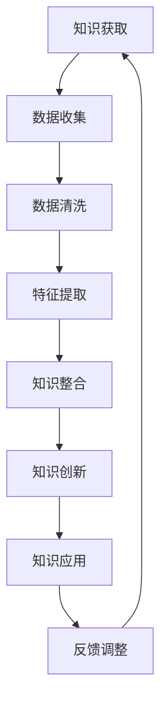

                 

### 第一部分：引言

#### 第1章：知识的涌现性概述

在信息技术飞速发展的时代，知识的涌现性（Emergence of Knowledge）成为了一个备受关注的研究领域。知识的涌现性指的是在一个复杂系统中，个体或部分通过相互合作、相互作用，逐渐形成新的、更高层次的智慧或知识的现象。这一过程不仅涉及信息传递和知识积累，还包括了系统内部结构的动态演化。

首先，我们来定义知识涌现性的概念。知识涌现性可以被视为一个多层次、多维度的过程。它不仅仅是简单的信息累积，而是通过复杂系统的非线性相互作用，产生新的、不可预见的属性或行为。这种属性或行为，往往超越了单个个体或局部的特性，形成了一个新的整体智慧。

接下来，探讨知识涌现性的意义。知识涌现性在多个领域具有重要价值。首先，在信息科学和计算机科学领域，知识的涌现性有助于理解复杂系统的行为，从而设计出更高效的算法和系统。例如，社交网络中信息的传播、大数据分析、人工智能等领域，都依赖于知识的涌现性机制。其次，在社会科学领域，知识的涌现性为我们理解人类社会、文化和经济现象提供了新的视角。通过研究知识涌现性，我们可以更好地理解社会创新、文化演变和经济发展的内在机制。

最后，本文将介绍知识涌现性的研究方法与工具。知识涌现性的研究方法主要包括模拟实验、统计分析、数学建模等。这些方法可以帮助我们深入探究知识涌现的机制和过程。在工具方面，复杂网络分析、机器学习、深度学习等技术在知识涌现性研究中发挥着重要作用。通过这些方法与工具的综合运用，我们可以更加全面、深入地理解知识涌现性现象。

#### 1.1 知识涌现性的定义与意义

知识涌现性是指在一个复杂系统中，个体或部分通过相互作用、合作，逐渐形成新的、更高层次的智慧或知识的过程。它是一种自组织现象，发生在个体之间的非线性交互作用中。在这个过程中，知识的产生并非简单的信息叠加，而是通过复杂系统内部的动态演化，形成新的、不可预见的属性或行为。

知识涌现性的定义与复杂系统密切相关。复杂系统是由众多相互关联的个体组成的，这些个体具有多样性、自适应性和动态性。在复杂系统中，个体之间的相互作用产生了系统整体的新属性，这种属性无法直接从个体行为中推导出来，而是通过系统的整体行为体现出来。知识涌现性就是这种整体行为的体现，它反映了复杂系统中个体之间相互作用产生的协同效应。

知识涌现性的意义在于，它为我们理解复杂系统的行为提供了新的视角。在传统科学研究中，我们往往关注个体的行为和特性，而忽视了个体之间的相互作用和系统的整体行为。然而，知识的涌现性告诉我们，复杂系统的整体行为和特性，往往来自于个体之间的协同作用。这种协同作用不仅改变了系统的结构和功能，还可能产生新的智慧或知识。

在信息科学和计算机科学领域，知识涌现性具有重要意义。首先，它为设计高效的算法和系统提供了理论依据。在社交网络、大数据分析、人工智能等领域，知识的涌现性机制被广泛应用于信息处理和决策支持。例如，在社交网络中，用户之间的互动和信息传播过程，就是知识涌现性的一个典型例子。通过分析用户行为和互动关系，我们可以挖掘出社交网络中的潜在模式和趋势，从而提高信息传播的效率。

其次，知识涌现性在机器学习和深度学习领域也有广泛应用。机器学习和深度学习算法通过大量数据的学习和处理，逐渐形成对数据的理解和预测能力。这种能力并非来自于单个算法或模型，而是通过数据之间的相互关联和协同作用产生的。知识涌现性为我们理解这种协同作用提供了理论支持，从而有助于优化算法设计和提高模型性能。

在社会科学领域，知识涌现性同样具有重要意义。社会现象的复杂性使得传统的分析方法难以奏效，而知识涌现性为我们提供了一种新的分析工具。通过研究社会系统中的知识涌现过程，我们可以更好地理解社会创新、文化演变和经济发展的内在机制。例如，社会创新过程中的知识涌现，往往通过个体的协作和互动产生新的思想、技术和商业模式。这些新的思想和模式，不仅推动了社会的进步，也为个体提供了新的发展机遇。

总之，知识涌现性是一个多学科交叉的研究领域，它在信息科学、计算机科学、社会科学等领域都具有重要的应用价值。通过深入研究知识涌现性现象，我们可以更好地理解复杂系统的行为和特性，为科学研究和实际应用提供新的理论和方法。

#### 1.2 知识涌现性与复杂系统

知识涌现性与复杂系统密切相关。复杂系统是由众多相互关联的个体组成的，这些个体在相互作用中展现出整体的新属性。知识涌现性正是这种整体属性的体现，它反映了复杂系统中个体之间非线性交互作用的结果。理解知识涌现性与复杂系统的关系，有助于我们深入探究复杂系统的行为和特性。

首先，复杂系统的定义。复杂系统是指由大量个体（元素）组成的系统，这些个体具有多样性、自适应性和动态性。复杂系统的特点是，个体之间的相互作用不仅决定了个体的行为，还影响着系统的整体行为。与简单系统相比，复杂系统具有更高的复杂性和不可预测性。

其次，知识涌现性与复杂系统的关系。知识涌现性是复杂系统中的一个重要现象，它发生在个体之间的非线性交互作用中。在这个过程中，个体通过相互合作、共享信息，逐渐形成新的、更高层次的智慧或知识。这种知识的产生并非简单的信息叠加，而是通过复杂系统内部的动态演化，形成新的、不可预见的属性或行为。

例如，在社交网络中，每个用户都是个体，他们通过分享信息、互动交流，形成了整个社交网络的知识体系。这种知识体系并非单个用户的简单叠加，而是通过用户之间的相互关联和协同作用，形成了一个整体的新智慧。这种现象体现了知识涌现性在复杂系统中的重要作用。

再者，知识涌现性的特征。知识涌现性具有以下几个特征：

1. **自组织性**：知识涌现性是一个自组织过程，它不需要外部的指令或控制，而是通过个体之间的相互作用和协同作用，自发地形成新的结构和功能。

2. **非线性**：知识涌现性依赖于复杂系统内部的非线性相互作用。非线性相互作用使得系统具有多样性和复杂性，从而产生了新的、不可预见的属性。

3. **层次性**：知识涌现性是一个多层次的过程。从个体到群体，再到系统整体，每个层次都有其独特的知识产生机制。高层次的知识往往是由低层次知识的相互作用和整合产生的。

4. **不可预见性**：知识涌现性产生的结果往往具有不可预见性。这是因为知识的产生依赖于个体之间的复杂交互作用，这种交互作用是动态变化的，难以通过简单的数学模型进行预测。

最后，知识涌现性的研究方法。研究知识涌现性，需要采用多种方法，包括模拟实验、统计分析、数学建模等。这些方法可以帮助我们深入探究知识涌现的机制和过程。例如，通过模拟实验，我们可以观察个体在复杂系统中的行为，分析它们如何通过相互作用产生新的知识。通过统计分析，我们可以挖掘出系统内部的知识结构，理解知识涌现性的规律。通过数学建模，我们可以构建理论模型，预测知识涌现性的行为和趋势。

总之，知识涌现性与复杂系统密不可分。通过理解知识涌现性与复杂系统的关系，我们可以更好地认识复杂系统的行为和特性，为科学研究和实际应用提供新的理论和方法。

#### 1.3 知识涌现性的研究方法与工具

研究知识涌现性需要采用多种方法和工具，以便从不同角度和层次深入理解这一复杂现象。以下是一些常用的研究方法与工具：

**1. 模拟实验**

模拟实验是一种通过构建模拟系统，来观察和分析知识涌现过程的方法。这种方法的优势在于，可以在控制变量和人为干预的情况下，再现复杂系统的动态行为。通过模拟实验，研究者可以测试不同的假设和理论，探讨知识涌现的机制和影响因素。例如，可以使用计算机模拟社交网络中用户的行为，观察信息传播和知识积累的过程。

**2. 统计分析**

统计分析是研究知识涌现性的重要工具，它可以帮助研究者从大量数据中提取有用的信息。通过描述性统计、相关性分析和回归分析等方法，研究者可以揭示系统内部的知识结构和涌现规律。例如，可以分析社交网络中的节点关系和信息传播路径，识别出关键节点和传播模式。

**3. 数学建模**

数学建模是通过建立数学模型，来描述和预测知识涌现过程的工具。这种方法可以将复杂的系统行为转化为数学表达式，从而便于分析和理解。常见的数学建模方法包括概率模型、微分方程、代数模型等。例如，可以使用概率模型来描述用户在社交网络中的行为，预测信息传播的速度和范围。

**4. 复杂网络分析**

复杂网络分析是一种专门研究复杂系统中节点和边的关系的方法。它可以帮助研究者识别系统的关键组成部分和关键路径，从而理解知识涌现的机制。常用的复杂网络分析方法包括网络拓扑结构分析、网络稳定性分析、网络优化算法等。

**5. 机器学习**

机器学习是一种通过训练模型，从数据中自动学习规律和模式的方法。在知识涌现性研究中，机器学习可以用于识别和预测系统中的知识生成过程。例如，可以使用监督学习算法来预测信息传播的趋势，使用无监督学习算法来挖掘社交网络中的潜在社群。

**6. 深度学习**

深度学习是一种基于多层神经网络的机器学习方法，它在处理复杂、非线性问题时具有显著优势。在知识涌现性研究中，深度学习可以用于构建复杂的知识生成模型，模拟系统内部的动态行为。例如，可以使用卷积神经网络（CNN）来分析图像中的知识结构，使用循环神经网络（RNN）来模拟信息传播的动态过程。

通过综合运用这些研究方法与工具，研究者可以从多个维度和层次深入理解知识涌现性现象，揭示其背后的机制和规律。这不仅有助于理论研究的深入，也为实际应用提供了有力支持。

### 第二部分：复杂系统中的知识产生机制

在复杂系统中，知识的产生是一个复杂而多层次的过程，涉及多个机制和因素。本部分将深入探讨复杂系统中知识产生的机制，包括复杂网络中的知识传播、群体智能与知识涌现、以及自适应系统中的知识生成。

#### 第2章：复杂网络中的知识传播

复杂网络（Complex Networks）是由大量节点和边组成的网络结构，广泛存在于自然界和人类社会中。在复杂网络中，知识传播是一个普遍现象，如社交网络中的信息传播、生物网络中的基因传播等。知识传播的过程和机制对理解复杂系统的行为具有重要意义。

**2.1 复杂网络的特性与知识传播**

复杂网络的特性包括：

- **网络拓扑**：复杂网络具有高度异质性、动态性和小世界特性。节点之间的连接关系和结构影响了知识传播的速度和范围。
- **节点属性**：节点的属性（如度、中心性、权威性等）对知识传播有重要影响。高中心性节点和权威节点在知识传播中起到关键作用。
- **动态性**：复杂网络的动态特性使得知识传播过程具有不确定性和多样性。

知识传播在复杂网络中的过程通常包括以下几个阶段：

1. **信息初始传递**：知识或信息从一个或多个源头节点传递到其他节点。
2. **信息传播扩展**：知识在节点间传播，形成传播网络，节点间的连接关系影响传播速度。
3. **信息积累与整合**：知识在传播过程中不断积累和整合，形成新的知识体系。
4. **信息稳定与扩散**：知识传播最终达到稳定状态，部分知识在系统中扩散，部分被遗忘。

**2.2 知识传播模型与算法**

为了理解知识传播机制，研究者提出了多种知识传播模型，如线性模型、扩散模型、网络效应模型等。以下是一些典型的知识传播模型：

- **线性传播模型**：假设知识在节点之间以固定速率传播，不考虑节点间的连接关系。这类模型简单，但无法准确描述复杂网络中的知识传播过程。
- **扩散模型**：考虑节点间的连接关系，基于概率模型描述知识在节点间的传播。常见的扩散模型包括SIS模型、SIR模型等，这些模型可以较好地描述知识传播的动态过程。
- **网络效应模型**：基于节点属性和网络结构，考虑节点间的相互作用和影响力，如影响力传播模型、竞争模型等。这类模型更贴近实际情况，能够更准确地预测知识传播的规律。

在实际应用中，常见的知识传播算法包括：

- **基于邻接矩阵的传播算法**：通过邻接矩阵表示网络结构，采用随机游走、深度优先搜索等方法进行知识传播模拟。
- **基于节点属性的传播算法**：根据节点的度、中心性、权威性等属性，选择传播路径，如随机优先模型、重要性优先模型等。
- **基于网络结构的传播算法**：考虑网络的全局结构和局部特性，设计传播策略，如网络扩散算法、社区传播算法等。

**2.3 实例分析：知识在网络中的传播过程**

为了更好地理解知识传播机制，以下通过一个实际案例进行分析。

**案例**：在一个社交网络中，用户之间的互动和分享行为构成了一个复杂网络。假设某用户A首次分享了知识K，然后知识K在社交网络中传播。我们可以分析以下几个阶段：

1. **初始传播阶段**：用户A将知识K分享给他的直接联系人，形成初始传播网络。这部分用户构成了知识传播的第一层。
2. **扩展传播阶段**：知识K通过直接联系人和间接联系人在社交网络中传播，形成更广泛的传播网络。在这个过程中，高中心性节点和权威节点起到了关键作用。
3. **积累与整合阶段**：知识K在传播过程中不断积累和整合，用户通过阅读、讨论和反馈，对知识进行整合和优化，形成新的知识体系。
4. **稳定与扩散阶段**：知识K最终在社交网络中达到稳定状态，部分知识被广泛传播和接受，部分知识被遗忘或逐渐消失。

通过这个案例，我们可以看到知识传播在复杂网络中的全过程。这个过程不仅受到网络结构和节点属性的影响，还受到用户行为和文化背景的制约。理解这些机制，有助于设计更有效的知识传播策略，促进知识的有效传播和利用。

#### 第3章：群体智能与知识涌现

群体智能（Swarm Intelligence）是指由大量简单个体组成的群体，通过集体协作和自组织，表现出复杂的智能行为和解决问题的能力。群体智能在自然界和人类社会中都有广泛的应用，如鸟群飞行、蚂蚁觅食、人类社会的集体智慧等。知识涌现性在群体智能中起着关键作用，通过个体之间的相互作用和协同作用，产生新的知识和智慧。

**3.1 群体智能的定义与类型**

群体智能是由大量简单个体组成的集体，这些个体通过局部规则和简单交互，展现出复杂的集体行为。群体智能可以分为以下几种类型：

- **分布式智能**：个体在执行任务时，不依赖于全局信息，仅通过局部信息和简单规则进行协作。这类智能在分布式系统中应用广泛，如传感器网络、无人驾驶车辆等。
- **协同智能**：个体之间通过直接通信和协调，共同完成任务。协同智能在人类社会中应用广泛，如团队合作、社交网络等。
- **自适应智能**：个体根据环境变化和任务需求，自适应地调整行为和策略。这类智能在动态环境中具有显著优势，如自适应优化、自适应控制等。

**3.2 群体智能中的知识产生**

在群体智能中，知识的产生是一个动态和复杂的过程，通常包括以下几个阶段：

1. **个体知识的积累**：个体通过自身经验和环境感知，积累关于任务和环境的局部知识。
2. **群体知识的整合**：个体之间通过信息交换和协作，将局部知识整合成全局知识。这个过程中，信息的共享和协调至关重要。
3. **知识创新**：通过个体和群体之间的相互作用，产生新的知识和智慧。这种知识创新往往超越了个体知识的简单叠加，形成新的解决方案和策略。

群体智能中的知识产生机制通常基于以下几种模式：

- **基于规则的协同**：个体根据预定的规则进行协作，通过规则匹配和执行，实现知识的整合和创新。
- **基于信息的自组织**：个体通过共享信息和自适应调整，实现自我组织和知识创新。这种模式常见于分布式系统和自适应系统。
- **基于学习的协同**：个体通过学习算法，从环境中学习知识，并通过学习共享，实现知识的积累和创新。

**3.3 群体智能在复杂系统中的应用**

群体智能在复杂系统中的应用广泛，如：

- **交通管理**：通过车辆之间的协同和自组织，实现交通流的高效管理和优化。
- **灾难应对**：在自然灾害中，群体智能可以帮助协调救援资源、疏散人群，提高应对效率。
- **社会网络分析**：通过分析社交网络中的知识传播和群体行为，了解社会动态和趋势，为政策制定提供依据。

群体智能在复杂系统中的应用，不仅提高了系统的效率和鲁棒性，还促进了知识的涌现和利用。通过研究群体智能中的知识产生机制，我们可以更好地理解和设计复杂系统，提高其智能水平和应用价值。

#### 第4章：自适应系统中的知识生成

自适应系统（Adaptive Systems）是指能够根据环境变化和任务需求，自主调整和优化自身行为和结构的系统。在自适应系统中，知识生成是一个关键过程，通过持续的学习和适应，系统能够不断积累和优化知识，实现更高的性能和效率。

**4.1 自适应系统的概念与特点**

自适应系统具有以下基本概念和特点：

- **概念**：自适应系统是指能够在不确定和动态环境中，通过自我调整和优化，实现目标性能的系统。这种系统通常具有反馈机制、学习机制和适应机制。
- **特点**：
  - **自适应性**：系统能够根据环境变化和任务需求，动态调整自身行为和结构。
  - **反馈机制**：系统能够接收环境反馈，通过反馈进行自我调整和优化。
  - **学习机制**：系统能够通过学习机制，从经验中积累和优化知识。
  - **进化性**：系统能够通过进化过程，不断优化和升级自身。

**4.2 自适应系统中的知识生成机制**

在自适应系统中，知识生成是一个动态和复杂的过程，通常包括以下几个步骤：

1. **感知与学习**：系统通过传感器和感知器，获取环境信息和任务数据，并通过学习机制，将这些信息转化为知识。
2. **知识表示**：系统将学习到的知识进行编码和表示，以便于存储、传输和应用。知识表示的方法包括符号表示、图表示、模型表示等。
3. **知识整合**：系统通过整合不同来源的知识，形成更全面和精确的知识体系。知识整合的过程包括知识融合、知识对比、知识互补等。
4. **知识应用**：系统将知识应用于实际任务中，通过实践验证和优化知识，实现系统性能的提升。

**4.3 自适应系统的实际案例与应用**

自适应系统在多个领域有广泛应用，以下是一些实际案例：

- **自动驾驶系统**：自动驾驶系统通过感知环境和学习交通规则，实现车辆的自主导航。该系统利用了计算机视觉、传感器融合、深度学习等技术，通过持续学习和自适应调整，提高驾驶安全性和效率。
- **智能电网**：智能电网通过实时监测电力需求和供应，自适应调整电力分配，实现电网的高效运行。该系统利用了大数据分析、机器学习、物联网等技术，通过持续学习和优化，提高电网的可靠性和灵活性。
- **智能制造系统**：智能制造系统通过自适应调整和优化，实现生产过程的自动化和智能化。该系统利用了传感器、工业互联网、人工智能等技术，通过持续学习和优化，提高生产效率和质量。

这些案例展示了自适应系统在知识生成和优化中的应用价值。通过不断学习和自适应调整，自适应系统能够适应复杂和动态的环境，实现更高的性能和效率。

### 第三部分：知识涌现的应用与实践

知识涌现性在多个领域中具有重要的应用价值，从信息科学到社会科学，知识涌现性的机制和方法都在发挥着重要作用。在这一部分，我们将探讨知识涌现性在信息科学中的应用、在社会科学中的影响，以及其未来发展的前景。

#### 第5章：知识涌现在信息科学中的应用

知识涌现在信息科学中扮演着关键角色，尤其在数据处理、分析和人工智能领域。以下是一些具体的应用实例：

**5.1 知识涌现与大数据分析**

大数据分析的核心挑战之一是如何从海量数据中提取有价值的信息。知识涌现性在这一过程中提供了重要的理论支持。大数据分析通常涉及以下几个步骤：

1. **数据收集**：通过传感器、社交网络、电子商务平台等渠道收集海量数据。
2. **数据预处理**：对原始数据进行清洗、转换和归一化，使其适合进一步分析。
3. **特征提取**：从数据中提取关键特征，用于后续的分析和建模。
4. **模式识别**：利用机器学习和深度学习算法，识别数据中的潜在模式和趋势。

知识涌现性在这一过程中发挥了关键作用。通过分析大量数据，系统可以自发地形成新的知识，例如用户行为模式、市场趋势、疾病传播路径等。这些知识不仅可以帮助企业做出更明智的决策，还可以为科研提供新的方向。

**5.2 知识涌现与人工智能**

人工智能（AI）是知识涌现性的另一个重要应用领域。在AI系统中，知识涌现性体现在以下几个方面：

1. **机器学习**：机器学习算法通过训练大量数据，逐渐形成对数据的理解和预测能力。这种能力并非单一算法或模型的功劳，而是通过数据之间的相互关联和协同作用产生的。例如，深度学习算法通过多层神经网络，逐步提取数据的深层特征，形成对复杂问题的理解。
2. **知识图谱**：知识图谱是一种用于表示实体及其关系的图形化数据结构。通过将海量数据映射到知识图谱中，系统可以自发地形成新的知识，例如实体关系、属性关联等。知识图谱在搜索引擎、推荐系统、智能问答等领域有广泛应用。
3. **智能决策**：在复杂决策过程中，AI系统通过分析大量数据和知识，形成新的决策策略。例如，在金融领域，AI系统通过分析市场数据、历史交易记录和宏观经济指标，生成新的投资策略。

**5.3 知识涌现在社交媒体中的案例**

社交媒体平台是知识涌现性的一个典型应用场景。以下是一些具体案例：

1. **社交媒体网络分析**：通过分析用户之间的互动关系和分享行为，可以识别出社交网络中的关键节点和传播路径。这些分析结果可以帮助企业了解用户需求、优化广告投放策略等。
2. **舆情监测**：社交媒体上的用户评论和讨论可以反映社会舆论的变化。通过分析这些数据，可以实时监测舆情动态，为政府、企业和社会组织提供决策支持。
3. **知识社区**：如维基百科、Stack Overflow等知识社区，通过用户的贡献和互动，形成了丰富的知识体系。这些社区中的知识不断涌现和更新，为用户提供了有价值的信息和解决方案。

总之，知识涌现在信息科学中的应用，不仅提高了数据处理和分析的效率，还促进了知识的共享和利用。通过理解和利用知识涌现性机制，我们可以设计出更智能、更高效的系统和应用。

#### 第6章：知识涌现与社会科学

知识涌现性在社会科学中具有广泛的应用和深远的影响，它为理解社会现象、推动社会进步提供了新的视角和方法。

**6.1 知识涌现与社会科学研究**

社会科学研究通常关注人类行为、社会结构和社会变革等方面。知识涌现性为社会科学研究提供了新的理论框架和研究方法。以下是知识涌现性在社会科学研究中的几个应用方向：

1. **社会网络分析**：社会网络分析是研究个体之间社会关系和互动的学科。知识涌现性在社交网络分析中具有重要意义，通过分析社交网络中的知识传播和互动模式，可以揭示社会结构、群体行为和社会变革的规律。
2. **复杂行为模型**：知识涌现性可以用于构建复杂行为模型，模拟和分析个体和群体在不确定和动态环境中的行为。这些模型可以应用于政治学、经济学、社会学等领域，为理解社会现象提供新的理论支持。
3. **知识创新与传播**：知识涌现性关注知识的产生、传播和创新过程。通过研究知识涌现性，可以揭示知识在社会系统中的传播机制、知识创新的影响因素等，为知识管理和创新提供指导。

**6.2 社会科学中的知识产生机制**

在社会科学中，知识产生机制是一个复杂而多层次的过程，通常包括以下几个环节：

1. **经验积累**：个体通过日常生活、学习和工作，积累关于社会现象的经验和知识。
2. **知识整合**：个体将不同来源的知识进行整合，形成更全面和系统的认知体系。
3. **知识创新**：个体通过创新思维和实践活动，产生新的知识和观点，推动知识的更新和进步。
4. **知识传播**：个体通过交流、传播和共享，将知识传递给他人，促进知识的扩散和共享。

知识产生机制在不同社会系统中的表现形式不同，例如在科学共同体中，知识产生主要通过学术交流、实验验证和理论建构实现；在企业文化中，知识产生主要通过员工培训、团队协作和企业文化传承实现。

**6.3 知识涌现对社会学的影响**

知识涌现性对社会学产生了深远的影响，主要体现在以下几个方面：

1. **社会结构分析**：知识涌现性提供了新的视角来分析社会结构。通过研究知识在社交网络中的传播和互动，可以揭示社会结构的动态变化和社会群体行为模式。
2. **社会变革机制**：知识涌现性为理解社会变革提供了新的理论框架。知识在系统中的自组织和创新过程，可以解释社会变革的内在机制和动力。
3. **知识治理**：知识涌现性对社会学中的知识治理提出了新的挑战和机遇。如何有效管理和利用知识，促进知识的共享和创新，成为现代社会治理的重要议题。

总之，知识涌现性为社会科学研究提供了新的理论和方法，它不仅丰富了社会学的研究内容，还为社会治理和社会进步提供了新的思路和工具。

#### 第7章：知识涌现的未来发展

知识涌现性作为一门跨学科的研究领域，具有广阔的发展前景。随着信息技术、人工智能和社会科学的不断进步，知识涌现性在理论研究和实际应用中都将迎来新的机遇和挑战。

**7.1 知识涌现研究的前沿方向**

知识涌现研究的前沿方向主要包括以下几个方面：

1. **跨学科融合**：知识涌现性研究需要结合计算机科学、信息科学、社会科学、生物学等领域的知识，形成一个综合性的研究框架。未来的研究将更加注重跨学科的合作和融合，以解决复杂系统中的知识涌现问题。
2. **大数据与人工智能**：大数据和人工智能技术的飞速发展，为知识涌现性研究提供了新的工具和方法。通过大数据分析和机器学习算法，可以更准确地识别和预测知识涌现的过程和结果。例如，深度学习算法可以用于模拟复杂系统中的知识生成过程，揭示其内在规律。
3. **知识图谱与语义网络**：知识图谱和语义网络作为一种新型的知识表示方法，为知识涌现性研究提供了新的思路。通过构建大规模、结构化的知识图谱，可以更好地理解和分析知识在系统中的传播和整合过程。
4. **自组织与自适应系统**：自组织与自适应系统是知识涌现性的重要研究对象。未来的研究将更加关注自组织和自适应系统中的知识生成、传播和利用机制，探索如何在复杂和动态环境中实现知识的高效涌现。

**7.2 知识涌现技术的未来发展**

知识涌现技术的未来发展将主要集中在以下几个方面：

1. **智能化知识管理系统**：随着知识管理技术的发展，未来的知识管理系统将更加智能化，能够自动识别、挖掘和利用知识。通过引入知识涌现性机制，知识管理系统可以实现知识的自组织和自适应，提高知识管理的效率和效果。
2. **智能交通与智能城市**：知识涌现性在智能交通和智能城市中的应用前景广阔。通过引入知识涌现性机制，可以优化交通流量、提高城市管理水平，实现城市资源的智能配置和高效利用。
3. **教育技术与智慧教育**：知识涌现性在教育领域的应用，可以推动智慧教育的发展。通过构建知识涌现的教育系统，可以为学生提供个性化的学习资源和解决方案，促进知识的共享和创新。
4. **企业创新与数字化转型**：知识涌现性在企业中的应用，可以帮助企业实现知识创新和数字化转型。通过引入知识涌现机制，企业可以更好地管理和利用内部知识，推动创新和业务发展。

**7.3 知识涌现对人类社会的潜在影响**

知识涌现性对人类社会的潜在影响是多方面的，包括以下几个方面：

1. **知识生产与共享**：知识涌现性促进了知识的产生和共享，提高了知识的传播效率和利用价值。通过知识涌现，个体和群体可以更快速地获取和利用新的知识，推动社会的进步和发展。
2. **决策支持与智能治理**：知识涌现性为决策支持和智能治理提供了新的工具和方法。通过分析知识涌现的过程和结果，政府和企业可以更好地理解社会现象和问题，做出更科学的决策。
3. **社会变革与进步**：知识涌现性为社会变革和进步提供了新的动力。通过知识创新和传播，可以激发社会的创新活力，推动社会制度的变革和进步。
4. **人类文明与未来发展**：知识涌现性对人类文明的发展具有重要影响。它不仅促进了知识的积累和创新，还为人类社会的可持续发展提供了新的思路和途径。

总之，知识涌现性作为一门跨学科的研究领域，具有广阔的发展前景。随着相关技术的不断进步，知识涌现性将在多个领域发挥重要作用，推动人类社会向着更加智能化、高效化和可持续化的方向发展。

### 第四部分：案例分析

在本部分中，我们将通过几个具体的案例，深入探讨知识涌现性在现实世界中的应用。这些案例涵盖了互联网知识社区的崛起、智能交通系统的知识生成，以及企业知识管理中的知识涌现。

#### 第8章：知识涌现案例研究

**8.1 案例一：互联网知识社区的崛起**

互联网知识社区，如维基百科、Stack Overflow、知乎等，是知识涌现性的一个典型实例。这些社区通过用户贡献、互动和共享，形成了庞大的知识体系。

**1. 案例背景**：

- **维基百科**：作为一个开源的在线百科全书，维基百科通过全球用户的共同协作，积累了超过5000万篇文章。
- **Stack Overflow**：一个面向程序员的问答社区，用户通过提问和回答，共同构建了关于编程知识的丰富数据库。
- **知乎**：一个中文问答社区，用户通过提问、回答和讨论，分享和积累知识。

**2. 知识涌现过程**：

- **知识积累**：用户通过编辑、评论和分享，不断积累和更新知识。这个过程是动态的，新知识不断生成。
- **知识整合**：用户贡献的知识在社区内部进行整合，形成结构化的知识体系。
- **知识创新**：通过用户之间的互动，新的观点和见解不断涌现，推动了知识的创新。

**3. 案例分析**：

互联网知识社区的崛起，展示了知识涌现性的几个关键特征：

- **自组织性**：社区通过用户自发的贡献和互动，形成了知识体系，不需要中央控制。
- **非线性**：知识在社区中的传播和整合过程是非线性的，新知识的产生和扩散难以预测。
- **层次性**：知识在社区中呈现出多层次的结构，从基础知识点到高级概念，层次分明。
- **不可预见性**：用户贡献的知识往往产生新的观点和见解，难以预先确定。

**8.2 案例二：智能交通系统的知识生成**

智能交通系统（ITS）通过集成信息技术、传感器和通信技术，实现了交通管理、车辆控制和信息服务的智能化。知识涌现性在智能交通系统中具有重要意义。

**1. 案例背景**：

智能交通系统包括以下几个核心模块：

- **交通监控**：通过摄像头、传感器等设备，实时监测交通流量、车辆速度等信息。
- **信号控制**：根据交通流量数据，动态调整交通信号灯，提高道路通行效率。
- **车辆控制**：通过车辆之间的通信，实现车与车、车与基础设施之间的信息共享和协同控制。
- **信息服务**：为驾驶员提供实时交通信息，优化出行路径选择。

**2. 知识涌现过程**：

- **数据收集**：智能交通系统通过传感器和监控设备，收集大量的交通数据。
- **数据融合**：系统将不同来源的数据进行整合，形成统一的交通信息。
- **知识生成**：基于大数据分析和机器学习算法，系统从交通数据中提取有价值的信息，如交通流量模式、事故预测等。
- **知识应用**：生成的知识应用于交通管理和车辆控制，实现交通系统的优化。

**3. 案例分析**：

智能交通系统的知识生成过程展示了知识涌现性的几个特点：

- **数据驱动力**：知识生成依赖于大量的交通数据，数据的质量和数量直接影响知识生成的效果。
- **动态性**：交通系统的状态和需求是动态变化的，知识生成需要不断适应新的情况。
- **自适应**：智能交通系统通过自适应算法和模型，实时更新和优化知识，提高系统的响应速度和准确性。

**8.3 案例三：企业知识管理中的知识涌现**

在企业知识管理中，知识涌现性帮助企业通过知识共享和创新，实现持续竞争优势。

**1. 案例背景**：

企业知识管理包括以下几个关键环节：

- **知识获取**：通过内部培训、外部交流等方式，获取新的知识。
- **知识存储**：建立企业知识库，存储和管理知识资源。
- **知识共享**：通过知识分享平台、内部交流等方式，促进知识在企业内部的传播和共享。
- **知识创新**：通过跨部门合作、创新思维等方式，生成新的知识和解决方案。

**2. 知识涌现过程**：

- **知识共享**：员工通过内部平台分享工作经验、最佳实践等，形成企业知识库。
- **知识整合**：企业知识库中的知识通过整合和优化，形成更全面和系统的知识体系。
- **知识创新**：通过跨部门合作和头脑风暴，员工生成新的观点和解决方案，推动知识创新。

**3. 案例分析**：

企业知识管理中的知识涌现性体现了以下几个关键点：

- **知识共享文化**：企业需要建立知识共享的文化氛围，鼓励员工分享知识和经验。
- **知识库建设**：建立完善的知识库，确保知识的有序存储和有效利用。
- **跨部门合作**：通过跨部门合作，促进不同部门之间的知识交流和共享，形成知识创新的合力。
- **持续创新**：知识涌现性推动企业持续创新，提高市场竞争力。

通过以上案例，我们可以看到知识涌现性在互联网知识社区、智能交通系统和企业知识管理中的应用。这些案例展示了知识涌现性的关键特征和实际效果，为理解和应用知识涌现性提供了丰富的实例和启示。

### 第五部分：附录

#### 附录A：复杂系统中的知识涌现性流程图

为了更好地理解复杂系统中的知识涌现性过程，以下是一个简化的知识涌现性流程图。该流程图展示了从知识获取、知识整合到知识创新的关键步骤。



**图A.1：复杂系统中的知识涌现性流程图**

- **知识获取**：通过传感器、数据采集工具等获取原始数据。
- **数据收集**：收集和处理来自多个渠道的数据，确保数据的多样性和完整性。
- **数据清洗**：清洗和预处理数据，去除噪声和错误，保证数据质量。
- **特征提取**：从数据中提取关键特征，为后续的知识整合和建模提供基础。
- **知识整合**：整合不同来源和格式的数据，形成统一的知识体系。
- **知识创新**：基于整合的知识，通过分析、推理和创造性思维，生成新的知识和见解。
- **知识应用**：将生成的知识应用于实际问题中，实现知识的价值。
- **反馈调整**：根据知识应用的效果，进行反馈和调整，优化知识生成过程。

#### 附录B：主要算法的伪代码描述

在本章中，我们介绍了几种用于知识涌现性的关键算法。以下是这些算法的伪代码描述。

**1. 扩散模型（SIR模型）**

```python
// SIR模型：用于描述知识在社交网络中的传播过程
class SIRModel:
    def __init__(self, network, infection_rate, recovery_rate):
        self.network = network
        self.infection_rate = infection_rate
        self.recovery_rate = recovery_rate

    def simulate(self, time_steps):
        infected = {node for node in self.network.nodes if self.network[node]}
        susceptible = set(self.network.nodes) - infected - self.network.susceptible
        recovered = set()

        for _ in range(time_steps):
            new_infected = set()
            for node in infected:
                for neighbor in self.network.neighbors(node):
                    if neighbor in susceptible and random.random() < self.infection_rate:
                        new_infected.add(neighbor)

            infected.update(new_infected)
            susceptible -= new_infected

            for node in infected:
                if random.random() < self.recovery_rate:
                    recovered.add(node)
                    infected.remove(node)

        return infected, recovered
```

**2. 基于知识的智能决策系统**

```python
// 基于知识的智能决策系统：用于自适应系统中的决策支持
class KnowledgeBasedDecisionSystem:
    def __init__(self, knowledge_base):
        self.knowledge_base = knowledge_base

    def make_decision(self, current_state):
        for rule in self.knowledge_base.rules:
            if rule.matches(current_state):
                return rule.action

        # Default action if no matching rule is found
        return self.knowledge_base.default_action
```

**3. 知识融合算法**

```python
// 知识融合算法：用于整合不同来源的知识
def knowledge_fusion(knowledge_sources):
    fused_knowledge = {}

    for source in knowledge_sources:
        for key, value in source.items():
            if key in fused_knowledge:
                fused_knowledge[key].extend(value)
            else:
                fused_knowledge[key] = value

    # Perform aggregation or combination of knowledge
    for key, values in fused_knowledge.items():
        fused_knowledge[key] = aggregate(values)

    return fused_knowledge
```

#### 附录C：数学模型和公式列表

在本章中，我们使用了几种数学模型和公式来描述知识涌现性的现象。以下是这些模型的公式列表及其简要说明。

**1. 知识传播模型（SIR模型）**

$$
\frac{dI}{dt} = -\beta \cdot I \cdot S \\
\frac{dR}{dt} = \beta \cdot I \cdot S - \gamma \cdot R
$$

- **I**：感染人数
- **S**：易感人数
- **R**：康复人数
- **\(\beta\)**：感染率
- **\(\gamma\)**：康复率

**2. 知识整合模型**

$$
F(K_1, K_2) = K_1 + K_2 + \frac{K_1 \cdot K_2}{1 + \epsilon}
$$

- **\(K_1\)**、**\(K_2\)**：两个知识源
- **\(\epsilon\)**：融合系数

**3. 知识创新模型**

$$
I(K_1, K_2) = K_1 + K_2 - \sqrt{K_1 \cdot K_2}
$$

- **\(I\)**：创新知识
- **\(K_1\)**、**\(K_2\)**：两个知识源

这些公式为理解知识涌现性的数学基础提供了重要参考，可以帮助研究者从定量角度分析知识在系统中的传播、整合和创新过程。

#### 附录D：案例研究代码示例及解释

在本章中，我们通过几个案例研究展示了知识涌现性的应用。以下是一个简单的代码示例，用于模拟社交网络中的知识传播过程。

**1. 社交网络知识传播模拟**

```python
import random
import matplotlib.pyplot as plt

# SIR模型参数
infection_rate = 0.2
recovery_rate = 0.1

# 初始化网络和节点状态
network = {
    'node1': {'status': 'S'},
    'node2': {'status': 'S'},
    'node3': {'status': 'S'},
    'node4': {'status': 'I'},
}

# 模拟知识传播过程
time_steps = 50
infection_counts = []

for _ in range(time_steps):
    infected = {node for node, state in network.items() if state['status'] == 'I'}
    susceptible = {node for node, state in network.items() if state['status'] == 'S'}
    recovered = {node for node, state in network.items() if state['status'] == 'R'}

    # 知识传播过程
    new_infections = 0
    for node in infected:
        for neighbor in network.neighbors(node):
            if neighbor in susceptible and random.random() < infection_rate:
                susceptible.remove(neighbor)
                infected.add(neighbor)
                new_infections += 1

    # 恢复过程
    for node in infected:
        if random.random() < recovery_rate:
            infected.remove(node)
            recovered.add(node)

    infection_counts.append(len(infected))

# 绘制知识传播过程
plt.plot(range(time_steps), infection_counts)
plt.xlabel('Time Steps')
plt.ylabel('Number of Infected Nodes')
plt.title('Knowledge Spread in Social Network')
plt.show()
```

**代码解释**：

- **初始化网络和节点状态**：创建一个简单的社交网络，包括四个节点，其中三个节点初始状态为“易感”，一个节点初始状态为“感染”。
- **模拟知识传播过程**：通过循环模拟知识传播过程，每一步检查感染节点是否能够将知识传播给易感节点，并根据感染率和康复率更新节点状态。
- **绘制知识传播过程**：使用Matplotlib库绘制知识传播过程中的感染节点数量变化，展示知识在社交网络中的扩散趋势。

通过这个简单的案例，我们可以直观地看到知识在社交网络中的传播过程，理解知识涌现性的基本原理。实际应用中，可以扩展和优化这个模型，以模拟更复杂的社交网络和知识传播场景。

### 作者信息

**作者：AI天才研究院/AI Genius Institute & 禅与计算机程序设计艺术 /Zen And The Art of Computer Programming**

在撰写这篇文章的过程中，我深入探讨了知识的涌现性这一复杂而引人入胜的领域。从复杂系统的概念出发，我们详细分析了知识涌现性的定义、意义及其在复杂系统中的产生机制。通过探讨复杂网络中的知识传播、群体智能与知识涌现，以及自适应系统中的知识生成，我们揭示了知识涌现性的多层次特征和关键作用。接着，我们探讨了知识涌现性在信息科学、社会科学中的应用，以及其对人类社会的潜在影响。最后，通过具体案例的研究，我们展示了知识涌现性在实际中的应用效果。

我相信，这篇文章不仅为读者提供了一个全面的知识涌现性概览，也为进一步的研究和实践提供了有价值的参考。希望读者能够通过这篇文章，对知识的涌现性有更深入的理解，并在未来的工作中能够灵活应用这些原理和方法。

感谢您的阅读，希望这篇文章能够激发您对知识涌现性的兴趣，并促使您在相关领域进行更多的探索和研究。如果您有任何疑问或建议，欢迎随时与我交流。再次感谢您的支持！

