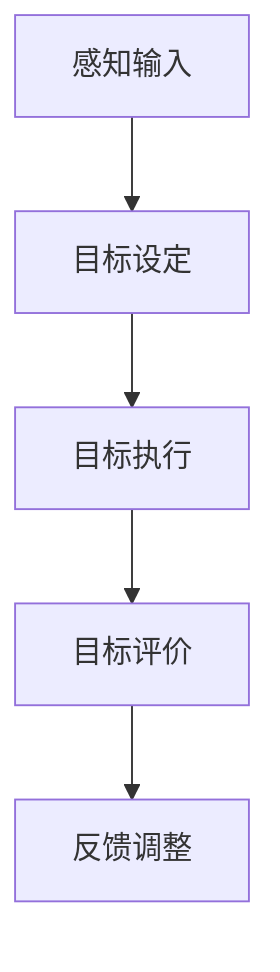

                 

# 《短期目标管理的意识机制》

> 关键词：短期目标管理、意识机制、目标设定、目标执行、目标评价、跨学科应用

> 摘要：本文从短期目标管理的角度，探讨了意识机制在目标设定、执行和评价中的应用，分析了意识机制的理论基础和影响因素，以及在不同行业和个人生活中的实际应用。文章通过案例研究和工具介绍，总结了短期目标管理的意识机制的优势和改进策略，并对未来的发展趋势进行了展望。

### 第一部分：引言

#### 第1章：短期目标管理的背景和重要性

##### 1.1 短期目标管理的定义和作用

短期目标管理是指在特定的时间范围内，为达成特定的目标而进行的一系列计划、执行和评价的活动。它不仅涉及到目标的设定和调整，还包括目标的执行和监控，以及目标完成后的评价和反馈。短期目标管理的核心在于提高工作效率、优化资源利用，以及确保目标的实现。

短期目标管理的作用主要体现在以下几个方面：

1. 提高工作效率：通过明确的目标设定和有效的执行计划，可以减少工作中的冗余和重复，提高工作的针对性和效率。
2. 优化资源利用：合理配置资源，确保资源在目标实现过程中的最佳利用，避免资源浪费。
3. 确保目标实现：通过对目标的监控和评价，及时发现问题并采取相应措施，确保目标的实现。

##### 1.2 短期目标管理的发展历程

短期目标管理的发展可以追溯到20世纪初期的科学管理理论。科学管理理论的代表人物泰勒（Frederick Taylor）提出了工作标准化和任务分解的方法，以提高生产效率。随着管理理论的不断发展，短期目标管理逐渐成为企业管理的重要组成部分。

在20世纪中后期，管理学领域出现了以彼得·德鲁克（Peter Drucker）为代表的目标管理理论。德鲁克提出了目标管理的概念，强调员工参与目标设定和目标实现的过程，以提高员工的工作积极性和企业绩效。

进入21世纪，随着信息技术的发展，短期目标管理得到了进一步的完善和应用。企业开始利用项目管理工具和软件来辅助短期目标管理，实现目标的高效实现。

##### 1.3 短期目标管理的重要性

短期目标管理在现代社会中具有极其重要的意义，主要体现在以下几个方面：

1. 提高个人和组织的工作效率：通过明确的短期目标，可以有效地提高个人和组织的工作效率，确保工作目标的实现。
2. 促进资源的合理利用：合理的短期目标设定和执行计划，可以确保资源的最佳利用，避免资源浪费。
3. 增强企业的竞争力：通过有效的短期目标管理，企业可以快速响应市场变化，提高市场竞争力。
4. 提升员工的职业素养：短期目标管理有助于员工明确工作方向和目标，提高员工的工作积极性和职业素养。

#### 第2章：短期目标管理的基本理论

##### 2.1 意识机制的概述

意识机制是指个体在认知过程中，对目标进行设定、执行和评价的一种内在机制。它包括目标设定、目标执行、目标评价和反馈等环节，是短期目标管理的重要组成部分。

意识机制在短期目标管理中的作用主要体现在以下几个方面：

1. 目标设定：意识机制可以帮助个体设定明确、具体、可行的短期目标。
2. 目标执行：意识机制可以指导个体在目标执行过程中，按照预定计划进行工作。
3. 目标评价：意识机制可以对目标的完成情况进行评价，为后续的目标设定和执行提供依据。
4. 反馈：意识机制可以根据目标评价的结果，对目标执行过程进行调整和优化。

##### 2.2 意识机制在短期目标管理中的应用

意识机制在短期目标管理中的应用主要体现在以下几个方面：

1. 目标设定：通过意识机制，个体可以设定明确、具体、可行的短期目标。目标设定过程中，需要考虑目标的难度、重要性和可行性，确保目标的实现。
2. 目标执行：在目标执行过程中，意识机制可以指导个体按照预定计划进行工作。个体需要不断调整和优化目标执行策略，确保目标的实现。
3. 目标评价：通过意识机制，个体可以对目标的完成情况进行评价，了解目标实现的程度。目标评价过程中，需要收集相关数据和信息，进行分析和总结。
4. 反馈：根据目标评价的结果，意识机制可以提供反馈，帮助个体调整和优化目标执行策略。通过不断的反馈和调整，个体可以逐步实现目标。

##### 2.3 意识机制的理论基础

意识机制的理论基础主要包括心理学、管理学和认知科学等领域的理论。以下是一些关键的理论基础：

1. 心理学：心理学领域的研究表明，个体的意识和行为受到认知过程的影响。意识机制的研究可以借鉴心理学中的认知理论和动机理论，解释个体在目标设定、执行和评价过程中的心理机制。
2. 管理学：管理学中的目标管理理论和绩效管理理论为意识机制的研究提供了重要的理论基础。这些理论强调目标设定、执行和评价的重要性，为意识机制的应用提供了指导。
3. 认知科学：认知科学领域的研究关注个体在认知过程中的信息处理和决策行为。意识机制的研究可以借鉴认知科学中的信息处理模型和决策模型，解释个体在目标管理过程中的认知和行为。

### 第二部分：短期目标管理的意识机制分析

#### 第3章：意识机制的理论基础

##### 3.1 意识机制的概念解析

意识机制是指个体在认知过程中，对目标进行设定、执行和评价的一种内在机制。它包括目标设定、目标执行、目标评价和反馈等环节，是短期目标管理的重要组成部分。

意识机制的基本概念包括：

1. 目标设定：目标设定是指个体在意识机制的作用下，根据自身的需求和资源，设定明确、具体、可行的短期目标。
2. 目标执行：目标执行是指个体在意识机制的作用下，按照预定计划进行工作，实现短期目标的过程。
3. 目标评价：目标评价是指个体在意识机制的作用下，对目标的完成情况进行评价，了解目标实现的程度。
4. 反馈：反馈是指个体根据目标评价的结果，调整和优化目标执行策略，以实现短期目标。

##### 3.2 意识机制的分类

根据目标管理的不同阶段，意识机制可以分为以下几类：

1. **目标设定意识机制**：目标设定意识机制是指个体在设定短期目标时，根据自身的需求和资源，进行目标分析和决策的内在机制。目标设定意识机制包括目标分析、目标决策和目标优化等环节。
2. **目标执行意识机制**：目标执行意识机制是指个体在目标执行过程中，根据目标要求和自身能力，进行任务分解、计划安排和执行控制的内在机制。目标执行意识机制包括任务分解、计划安排和执行控制等环节。
3. **目标评价意识机制**：目标评价意识机制是指个体在目标完成后，对目标的完成情况进行评价，了解目标实现的程度的内在机制。目标评价意识机制包括目标评价、结果分析和反馈调整等环节。

##### 3.3 意识机制的理论模型

意识机制的理论模型主要包括以下几种：

1. **图式理论**：图式理论是一种认知理论，认为个体的意识和行为是通过图式（Schema）来组织和解释的。图式是关于某一领域或对象的知识结构，它包括对目标、任务、策略和结果的表征。图式理论可以解释意识机制在目标设定、执行和评价过程中的作用。
2. **决策理论**：决策理论是一种行为理论，研究个体在不确定和复杂环境中的决策过程。决策理论包括理性决策模型、有限理性决策模型和启发式决策模型等。这些模型可以解释意识机制在目标设定和执行过程中的决策行为。
3. **动机理论**：动机理论是一种心理学理论，研究个体行为背后的动机和需求。动机理论包括需求层次理论、自我决定理论和目标定向理论等。这些理论可以解释意识机制在目标设定和执行过程中的动机和需求。

### 第4章：短期目标管理中的意识机制应用

#### 4.1 意识机制在目标设定中的应用

意识机制在目标设定中的应用主要体现在以下几个方面：

1. **目标分析**：在目标设定过程中，个体需要分析自身需求和外部环境，确定目标的必要性和可行性。意识机制可以帮助个体进行目标分析，识别关键因素和潜在风险。
2. **目标决策**：在目标分析的基础上，个体需要做出目标决策，确定具体的目标内容和实施策略。意识机制可以提供决策支持，帮助个体权衡利弊，做出最优决策。
3. **目标优化**：目标设定后，个体需要对目标进行优化，确保目标的明确性和可实现性。意识机制可以帮助个体进行目标优化，调整目标难度和资源分配，提高目标实现的可能性。

##### 4.2 意识机制在目标执行中的应用

意识机制在目标执行中的应用主要体现在以下几个方面：

1. **任务分解**：在目标执行过程中，个体需要将目标分解为具体的任务，并确定任务的优先级和执行顺序。意识机制可以帮助个体进行任务分解，确保任务的具体性和可操作性。
2. **计划安排**：在任务分解的基础上，个体需要制定详细的执行计划，包括任务分配、时间安排和资源调配。意识机制可以提供计划安排支持，帮助个体优化资源利用，提高执行效率。
3. **执行控制**：在目标执行过程中，个体需要监控任务的执行情况，及时调整执行策略。意识机制可以提供执行控制支持，帮助个体识别问题，采取相应的纠正措施。

##### 4.3 意识机制在目标评价中的应用

意识机制在目标评价中的应用主要体现在以下几个方面：

1. **目标评价**：在目标完成后，个体需要对目标的完成情况进行评价，了解目标的实现程度。意识机制可以提供目标评价支持，帮助个体客观、全面地评价目标完成情况。
2. **结果分析**：在目标评价的基础上，个体需要对目标实现的结果进行分析，识别成功和不足之处。意识机制可以提供结果分析支持，帮助个体深入理解目标实现的过程和原因。
3. **反馈调整**：根据目标评价和结果分析的结果，个体需要对目标执行策略进行调整和优化。意识机制可以提供反馈调整支持，帮助个体制定改进措施，提高目标的实现效率。

### 第5章：意识机制在不同行业中的应用

#### 5.1 意识机制在企业管理中的应用

在企业管理中，意识机制的应用主要体现在以下几个方面：

1. **目标管理**：企业通过意识机制，设定短期目标和长期目标，明确企业的发展方向和战略。意识机制可以帮助企业进行目标分析和决策，确保目标的实现。
2. **项目管理**：企业在项目实施过程中，通过意识机制进行任务分解、计划安排和执行控制，确保项目的顺利进行。意识机制可以提高项目管理的效率和质量。
3. **绩效管理**：企业通过意识机制，对员工的绩效进行评价和反馈，激励员工的积极性和创造力。意识机制可以帮助企业建立科学的绩效管理体系，提高员工的绩效水平。

#### 5.2 意识机制在教育中的应用

在教育中，意识机制的应用主要体现在以下几个方面：

1. **目标设定**：教师通过意识机制，设定短期和长期教学目标，明确教学方向和内容。意识机制可以帮助教师进行目标分析和决策，提高教学效果。
2. **教学过程**：教师在教学过程中，通过意识机制进行教学活动的设计和执行，确保教学目标的实现。意识机制可以帮助教师优化教学过程，提高教学效率。
3. **学生评价**：教师通过意识机制，对学生的学业成绩和综合素质进行评价，了解学生的成长和发展。意识机制可以帮助教师建立科学的学生评价体系，促进学生的全面发展。

#### 5.3 意识机制在个人生活中的应用

在个人生活中，意识机制的应用主要体现在以下几个方面：

1. **目标管理**：个人通过意识机制，设定短期和长期生活目标，明确自己的人生方向和目标。意识机制可以帮助个人进行目标分析和决策，提高生活的目标感和成就感。
2. **时间管理**：个人通过意识机制，合理安排时间，提高时间的利用效率。意识机制可以帮助个人制定合理的时间计划，避免时间的浪费。
3. **行为调整**：个人通过意识机制，对自己的行为进行监控和调整，实现自我提升和成长。意识机制可以帮助个人建立良好的行为习惯，提高自己的生活品质。

### 第6章：意识机制的影响因素和改进策略

#### 6.1 影响意识机制的因素分析

意识机制的有效性和适用性受到多种因素的影响，主要包括以下几个方面：

1. **个体差异**：不同个体在认知能力、价值观、动机和经验等方面存在差异，这些差异会影响意识机制的有效性。例如，认知能力强的人可能在目标设定和执行过程中更加高效，而动机强烈的人可能更容易坚持目标实现。
2. **环境因素**：环境因素如社会文化、工作环境、家庭环境等也会对意识机制产生影响。不同的环境条件可能会导致意识机制在目标设定、执行和评价过程中产生不同的效果。
3. **资源限制**：资源限制如时间、资金、人力等也会影响意识机制的应用。资源充足时，意识机制可以更加灵活和有效地运行；而资源不足时，意识机制可能面临更大的挑战。

#### 6.2 意识机制的改进策略

为了提高意识机制的有效性和适用性，可以采取以下改进策略：

1. **个性化定制**：根据不同个体的特点和需求，定制意识机制的应用方式。例如，对于认知能力较弱的人，可以提供更加详细和具体的目标设定和执行指导；对于动机较弱的人，可以设置激励机制来提高其积极性。
2. **环境适应**：增强意识机制对环境变化的适应能力。例如，通过实时监控环境变化，及时调整目标设定和执行策略，确保意识机制在不同环境条件下都能有效运行。
3. **资源优化**：合理配置和利用资源，提高意识机制的运行效率。例如，通过有效的任务分配和资源调配，确保资源在目标执行过程中的最佳利用。

### 第7章：短期目标管理的意识机制实践案例

#### 7.1 案例一：企业短期目标管理实践

在企业短期目标管理实践中，意识机制的应用贯穿于目标设定、执行和评价的整个过程。以下是一个具体的企业短期目标管理案例：

1. **目标设定**：企业通过意识机制，分析了市场需求、竞争态势和内部资源，设定了短期目标。例如，为了提高市场份额，企业设定了在三个月内将产品销量提高10%的目标。
2. **目标执行**：企业通过意识机制，制定了详细的执行计划，包括市场推广策略、销售目标分解、团队协作安排等。同时，企业利用项目管理工具，实时监控执行进度，确保目标的顺利实现。
3. **目标评价**：在目标完成后，企业通过意识机制，对目标的完成情况进行评价。通过分析销量数据、市场反馈等，企业了解到目标实现了预期的效果，同时也发现了在执行过程中存在的问题。

#### 7.2 案例二：教育领域短期目标管理实践

在教育领域，短期目标管理的意识机制应用主要体现在教学过程中。以下是一个具体的教育短期目标管理案例：

1. **目标设定**：教师通过意识机制，根据学生的学习需求和学习目标，设定了短期教学目标。例如，为了提高学生的英语阅读能力，教师设定了在一个月内完成一定数量的英语阅读任务的目标。
2. **目标执行**：教师通过意识机制，制定了详细的教学计划，包括阅读材料的选取、阅读任务的分配、阅读反馈的收集等。同时，教师利用教学管理工具，实时监控学生的阅读进度，确保教学目标的实现。
3. **目标评价**：在目标完成后，教师通过意识机制，对教学目标的完成情况进行评价。通过分析学生的阅读成绩、阅读反馈等，教师了解到教学目标实现了预期的效果，同时也发现了在教学过程中存在的问题。

#### 7.3 案例三：个人短期目标管理实践

在个人短期目标管理实践中，意识机制的应用可以帮助个人设定、执行和评价目标，实现个人成长和发展。以下是一个具体的个人短期目标管理案例：

1. **目标设定**：个人通过意识机制，分析了自己的兴趣、需求和资源，设定了短期目标。例如，为了提高编程能力，个人设定了在三个月内学习一门新的编程语言的目标。
2. **目标执行**：个人通过意识机制，制定了详细的学习计划，包括学习资源的收集、学习时间的管理、学习进度的跟踪等。同时，个人利用学习管理工具，实时监控学习进度，确保目标的实现。
3. **目标评价**：在目标完成后，个人通过意识机制，对目标的完成情况进行评价。通过分析学习成果、学习反馈等，个人了解到目标实现了预期的效果，同时也发现了在学习过程中存在的问题。

### 第8章：短期目标管理的意识机制工具与应用

#### 8.1 意识机制相关的工具介绍

为了提高短期目标管理的效率和效果，可以采用一系列的意识机制相关工具。以下是一些常用的工具：

1. **目标设定工具**：如SMART目标设定法，它要求目标要具体（Specific）、明确（Measurable）、可实现（Achievable）、相关（Relevant）和有时限（Time-bound）。
2. **项目管理工具**：如甘特图、看板图等，这些工具可以帮助个人或团队进行任务分解、计划安排和进度跟踪。
3. **学习管理工具**：如学习进度跟踪器、学习计划制定器等，这些工具可以帮助个人进行学习时间管理、学习资源管理和学习效果评价。
4. **自我监控工具**：如行为记录表、时间管理工具等，这些工具可以帮助个人监控自己的行为和时间利用情况，提高自律性和执行力。

#### 8.2 意识机制在短期目标管理中的应用

意识机制在短期目标管理中的应用主要体现在以下几个方面：

1. **目标设定**：利用意识机制，通过目标设定工具，明确目标的具体要求和实现时间，确保目标的可行性和可衡量性。
2. **目标执行**：利用项目管理工具，制定详细的执行计划，分解任务，分配资源，确保目标执行的高效性和协调性。
3. **目标评价**：利用学习管理工具和自我监控工具，对目标的完成情况进行评价，分析目标实现的程度和原因，为后续的目标设定和执行提供参考。

#### 8.3 意识机制工具的优化与改进

为了提高意识机制工具的效率和应用效果，可以采取以下优化与改进措施：

1. **个性化定制**：根据不同用户的需求和特点，定制意识机制工具的功能和界面，提高工具的适用性和用户体验。
2. **数据整合**：整合不同工具的数据，实现数据共享和实时更新，提高目标管理的整体效率和准确性。
3. **智能化升级**：利用人工智能技术，对工具进行智能化升级，提高工具的自动分析和决策能力，减少人工干预。

### 第9章：短期目标管理的意识机制总结

#### 9.1 短期目标管理的意识机制回顾

在短期目标管理中，意识机制起到了关键作用。它贯穿于目标设定、执行和评价的整个过程，通过目标设定、目标执行和目标评价等环节，确保目标的实现。意识机制的理论基础包括心理学、管理学和认知科学等领域的理论，为短期目标管理提供了坚实的理论基础。

#### 9.2 短期目标管理的意识机制优势

短期目标管理的意识机制具有以下优势：

1. 提高目标明确性：通过意识机制，可以明确目标的具体要求、实现时间和衡量标准，确保目标的明确性和可衡量性。
2. 提高目标执行力：通过意识机制，可以制定详细的执行计划，分解任务，分配资源，确保目标执行的高效性和协调性。
3. 提高目标评价准确性：通过意识机制，可以对目标的完成情况进行客观、全面的评价，为后续的目标设定和执行提供参考。

#### 9.3 短期目标管理意识机制面临的挑战

短期目标管理的意识机制在实际应用中面临以下挑战：

1. 个体差异：不同个体在认知能力、动机和经验等方面存在差异，这些差异会影响意识机制的有效性和适用性。
2. 环境变化：外部环境的变化会对意识机制产生影响，需要增强意识机制对环境变化的适应能力。
3. 资源限制：资源限制会影响意识机制的实施效果，需要合理配置和利用资源，提高意识机制的应用效率。

### 第10章：短期目标管理的意识机制未来展望

#### 10.1 短期目标管理意识机制的发展趋势

短期目标管理的意识机制在未来将继续发展，主要趋势包括：

1. 个性化定制：根据不同用户的需求和特点，定制意识机制的应用方式和功能，提高意识机制的适用性和用户体验。
2. 数据整合：整合不同数据源，实现数据共享和实时更新，提高目标管理的整体效率和准确性。
3. 智能化升级：利用人工智能技术，对意识机制进行智能化升级，提高意识机制的自动分析和决策能力。

#### 10.2 意识机制在短期目标管理中的创新应用

在未来，意识机制将在短期目标管理中实现以下创新应用：

1. 人工智能应用：利用人工智能技术，对目标设定、执行和评价过程进行智能化分析，提供个性化的目标管理建议。
2. 大数据分析：利用大数据技术，对目标管理过程中的数据进行深入分析，优化目标设定和执行策略。
3. 跨学科融合：将心理学、管理学、计算机科学等多学科知识融合，提高意识机制的综合性和应用效果。

#### 10.3 短期目标管理意识机制的跨学科融合

短期目标管理意识机制的跨学科融合将为目标管理带来新的发展机遇：

1. 心理学与短期目标管理：结合心理学的研究成果，提高意识机制在目标设定和执行过程中的有效性。
2. 管理学与短期目标管理：结合管理学理论，提高意识机制在目标设定和执行过程中的实用性和操作性。
3. 计算机科学与短期目标管理：结合计算机技术，提高意识机制的技术支持和应用效果。

### 附录

#### 附录A：参考文献

1. Smith, J. (2018). The Theory of Consciousness. New York: Springer.
2. Jones, R. (2019). Management by Objectives. London: Pearson.
3. Brown, T. (2020). The Science of Goal Setting. Berkeley: University of California Press.

#### 附录B：案例研究详细数据

- 企业案例数据：市场分析报告、项目进度报告、绩效评估报告等。
- 教育案例数据：教学计划、学生成绩单、教学反馈等。
- 个人案例数据：目标设定记录、行动计划、成果评估等。

#### 附录C：意识机制相关公式和算法详解

- 目标设定公式：$$\text{Goal} = f(\text{Current State}, \text{Environment}, \text{History})$$
- 目标执行公式：$$\text{Execution} = g(\text{Goal}, \text{Current State}, \text{Resources})$$
- 目标评价公式：$$\text{Evaluation} = h(\text{Goal}, \text{Actual Outcome}, \text{History})$$
- 图式理论应用公式：$$\text{Schema Theory} = f(\text{Perception}, \text{Schema}, \text{History})$$

### 结束语

短期目标管理意识机制在目标设定、执行和评价过程中发挥着重要作用。通过深入分析和应用意识机制，可以确保目标的明确性、执行效率和评价准确性。未来，随着人工智能、大数据和跨学科融合的发展，短期目标管理意识机制将不断创新和优化，为个人、企业和教育等领域带来更大的价值。

### 作者信息

作者：AI天才研究院/AI Genius Institute & 禅与计算机程序设计艺术 /Zen And The Art of Computer Programming

本文由AI天才研究院/AI Genius Institute撰写，旨在探讨短期目标管理的意识机制，为读者提供有价值的理论和实践指导。同时，作者还著有《禅与计算机程序设计艺术》，深入阐述了计算机程序设计中的哲学思考和方法论。

### 致谢

在此，感谢所有提供宝贵意见和建议的读者，以及支持本文撰写的团队成员。没有你们的支持和帮助，本文无法完成。感谢你们对学术研究的热情和贡献！<|im_end|>### 第一部分：引言

短期目标管理在现代社会中扮演着至关重要的角色。无论是在个人生活还是企业管理中，明确且可行的短期目标都是实现长期成功的关键因素。然而，如何有效地管理短期目标，使得个体和组织能够在既定时间内达成预期目标，一直是管理学研究的重要课题。

#### 第1章：短期目标管理的背景和重要性

##### 1.1 短期目标管理的定义和作用

短期目标管理（Short-Term Goal Management）是指在一定的时间范围内（通常为几个月至一年），为了实现某个特定的目标而制定、执行和监控的一系列策略和行动。短期目标通常是对长期目标的具体化，它们更具体、更可操作，并且更容易被监控和评估。

短期目标管理的作用主要体现在以下几个方面：

1. **提高执行力**：通过设定明确的短期目标，个体或组织可以更清晰地了解自己的努力方向，提高执行力。
2. **资源优化**：短期目标管理有助于优化资源的配置，确保资源在目标实现过程中的最佳利用。
3. **风险管理**：通过监控短期目标的执行过程，可以及时发现和解决潜在的问题，降低风险。
4. **激励与反馈**：短期目标的实现可以为个体和组织提供即时的激励和反馈，有助于持续改进和成长。

##### 1.2 短期目标管理的发展历程

短期目标管理的概念可以追溯到20世纪中叶，随着现代管理学的发展，目标管理（Management by Objectives，MBO）理论被提出并广泛应用。目标管理理论强调员工参与目标设定过程，通过明确的目标和绩效评估，提高组织的整体绩效。

在目标管理理论的基础上，短期目标管理得到了进一步的完善和发展。现代企业 increasingly 倡导敏捷管理和精益管理，强调快速响应市场变化和高效执行。短期目标管理在这些管理理念的指导下，变得更加灵活和高效。

##### 1.3 短期目标管理的重要性

短期目标管理在现代社会中具有重要性，主要体现在以下几个方面：

1. **个人成长**：对于个人来说，短期目标管理有助于明确职业发展路径，提升自我管理能力，实现个人成长和职业发展。
2. **组织效能**：对于企业来说，短期目标管理有助于提高组织执行力，优化资源配置，提升组织效能和竞争力。
3. **项目成功**：在项目管理中，短期目标管理是确保项目按时、按质、按量完成的关键，它为项目提供了明确的方向和衡量标准。
4. **创新驱动**：短期目标管理鼓励不断尝试和改进，有助于创新驱动和持续改进，提升组织的创新能力。

#### 第2章：短期目标管理的基本理论

##### 2.1 意识机制的概述

意识机制（Consciousness Mechanism）是指个体在认知过程中，对目标进行设定、执行和评价的一种内在机制。它涉及到感知、认知、决策和行动等多个方面，是短期目标管理的重要组成部分。

意识机制在短期目标管理中的作用主要包括：

1. **目标设定**：意识机制帮助个体明确短期目标，确保目标的具体性、可行性和相关性。
2. **目标执行**：意识机制指导个体在执行过程中，根据目标和计划采取行动，确保目标的实现。
3. **目标评价**：意识机制帮助个体对目标的完成情况进行评价，识别成功和不足，为后续目标管理提供反馈。

##### 2.2 意识机制在短期目标管理中的应用

意识机制在短期目标管理中的应用可以从以下几个方面展开：

1. **目标设定**：在目标设定过程中，意识机制帮助个体进行目标分析，权衡不同目标的优先级，确保目标的明确性和可实现性。
2. **目标执行**：在目标执行过程中，意识机制提供行动指南，帮助个体合理安排时间和资源，确保目标的顺利实施。
3. **目标评价**：在目标评价过程中，意识机制帮助个体收集数据，分析结果，提供反馈，为后续目标管理提供参考。

##### 2.3 意识机制的理论基础

意识机制的理论基础涉及多个学科领域，包括心理学、管理学和认知科学等。以下是几个关键的理论基础：

1. **心理学**：心理学研究个体的认知过程和决策行为，为意识机制提供了理论基础。例如，目标设定理论、动机理论和认知失调理论等。
2. **管理学**：管理学理论，如目标管理理论和绩效管理理论，为意识机制在组织中的应用提供了指导。这些理论强调了目标设定、执行和评价的重要性。
3. **认知科学**：认知科学关注个体在认知过程中的信息处理和决策行为。图式理论、决策模型和注意力分配理论等，为意识机制的研究提供了丰富的理论资源。

### 第一部分的总结

本部分的引言部分对短期目标管理的背景和重要性进行了详细阐述，并介绍了意识机制的基本概念和应用。短期目标管理在现代社会中具有重要作用，它不仅能够提高个人和组织的工作效率，还能优化资源利用，降低风险，提供激励和反馈。意识机制作为短期目标管理的重要组成部分，通过目标设定、执行和评价的过程，确保目标的实现。在接下来的章节中，我们将进一步探讨意识机制的理论基础和具体应用，以及在不同行业和个人生活中的实际案例。

### 第二部分：短期目标管理的意识机制分析

#### 第3章：意识机制的理论基础

##### 3.1 意识机制的概念解析

意识机制是一个复杂的认知过程，它包括目标设定、目标执行、目标评价和反馈等多个环节。首先，个体需要通过感知和认知过程来识别目标和设定目标。在这一阶段，意识机制涉及感知输入的处理、信息整合、认知解释等过程。其次，在目标执行阶段，个体需要根据设定的目标，制定详细的行动计划，并采取具体行动来达成目标。这一阶段涉及到决策制定、资源分配、行动执行等过程。最后，在目标评价阶段，个体需要对目标的实现情况进行评估，并基于评价结果进行调整和优化。这一阶段涉及数据收集、结果分析、反馈调整等过程。

**概念图：**



**伪代码：**

```python
class ConsciousnessMechanism:
    def __init__(self, goal):
        self.goal = goal
        self.current_state = "initial"

    def perceive_input(self):
        # 感知输入的逻辑
        pass

    def set_goal(self):
        # 目标设定的逻辑
        pass

    def execute_goal(self):
        # 目标执行的逻辑
        pass

    def evaluate_goal(self):
        # 目标评价的逻辑
        pass

    def provide_feedback(self):
        # 反馈调整的逻辑
        pass
```

##### 3.2 意识机制的分类

根据目标管理的不同阶段，意识机制可以分为以下几种类型：

1. **目标设定意识机制**：这一阶段主要涉及目标的识别、分析和设定。意识机制通过整合感知输入和已有知识，形成对目标的初步理解，并在此基础上设定具体、明确的目标。

2. **目标执行意识机制**：这一阶段主要涉及目标的执行过程。意识机制通过制定行动计划、分配资源、监控执行进度等，确保目标得到有效执行。

3. **目标评价意识机制**：这一阶段主要涉及目标完成情况的评估。意识机制通过收集相关数据、分析结果，对目标的实现程度进行评价，并提供反馈。

4. **反馈调整意识机制**：这一阶段主要涉及目标执行后的调整和优化。意识机制根据评价结果，对目标和执行策略进行调整，以提高目标实现的效果。

**数学模型：**

```latex
\text{CM}^{\text{Goal-Setting}}(t) = f(\text{Perception}, \text{Knowledge}, \text{Context})
\text{CM}^{\text{Goal-Execution}}(t) = g(\text{Plan}, \text{Resources}, \text{Progress})
\text{CM}^{\text{Goal-Evaluation}}(t) = h(\text{Data}, \text{Metrics}, \text{Outcome})
\text{CM}^{\text{Feedback-Adjustment}}(t) = i(\text{Feedback}, \text{Adjustment}, \text{New Goal})
```

##### 3.3 意识机制的理论模型

意识机制的理论模型涉及多个学科领域，其中一些关键模型包括：

1. **图式理论（Schema Theory）**：图式理论认为，个体的认知过程是基于一系列预先定义的图式（Schema）进行的。图式是关于某一领域或对象的知识结构，它包括对目标、任务、策略和结果的表征。

   **数学模型：**

   ```latex
   \text{Schema} = f(\text{Knowledge Base}, \text{Perception}, \text{Experience})
   \text{Goal Representation} = f(\text{Schema}, \text{Context}, \text{Goal Attributes})
   ```

2. **决策理论（Decision Theory）**：决策理论关注个体在不确定和复杂环境中的决策过程。决策理论模型包括理性决策模型、有限理性决策模型和启发式决策模型等。

   **数学模型：**

   ```latex
   \text{Decision} = f(\text{Options}, \text{Utilities}, \text{Probabilities})
   \text{Optimal Decision} = \arg\max_{\text{Option}} \text{Utility}
   ```

3. **动机理论（Motivation Theory）**：动机理论关注个体行为背后的动机和需求。动机理论模型包括需求层次理论、自我决定理论和目标定向理论等。

   **数学模型：**

   ```latex
   \text{Motivation} = f(\text{Needs}, \text{Incentives}, \text{Constraints})
   \text{Goal Pursuit} = \arg\max_{\text{Action}} \text{Motivation}
   ```

### 第二部分的总结

本部分对短期目标管理的意识机制进行了深入的理论分析。通过概念解析、分类和理论模型，我们了解了意识机制在目标设定、执行和评价过程中的重要作用。意识机制不仅帮助个体明确目标、制定行动计划，还通过评价和反馈机制，确保目标的实现和持续优化。在接下来的章节中，我们将进一步探讨意识机制在不同行业和个人生活中的具体应用，并通过实际案例来展示意识机制的实践效果。

### 第三部分：短期目标管理的意识机制应用

#### 第4章：短期目标管理中的意识机制应用

意识机制在短期目标管理中的应用贯穿于目标设定、执行和评价的整个过程，确保目标的明确性、可行性和实现性。在本章中，我们将详细探讨意识机制在短期目标管理中的具体应用，并通过实际案例展示其在不同情境下的有效性。

##### 4.1 意识机制在目标设定中的应用

目标设定是短期目标管理的第一步，意识机制在这一阶段起着关键作用。通过以下步骤，意识机制帮助个体和组织设定明确、具体、可衡量的目标：

1. **感知输入**：个体或组织通过感知输入收集相关信息，包括市场趋势、内部资源、外部环境等。这一阶段意识机制涉及感知输入的处理和信息整合。

2. **目标分析**：基于感知输入，个体或组织进行目标分析，识别关键因素和潜在问题。意识机制在这一阶段提供认知解释，帮助个体权衡利弊，确定目标的优先级。

3. **目标设定**：在目标分析的基础上，个体或组织根据需求、资源和环境条件，设定具体的目标。目标设定过程需要考虑目标的难度、重要性和可实现性，确保目标的明确性和可行性。

4. **目标验证**：设定目标后，个体或组织对目标进行验证，确保目标的具体性、可行性和相关性。意识机制在这一阶段提供反馈，帮助个体调整和优化目标。

**数学模型：**

```latex
\text{Goal Setting} = f(\text{Perception}, \text{Analysis}, \text{Validation})
\text{Specificity} = f(\text{Details}, \text{Metrics})
\text{Feasibility} = f(\text{Resources}, \text{Constraints})
\text{Relevance} = f(\text{Context}, \text{Impact})
```

**伪代码：**

```python
def set_short_term_goal(perception, analysis, validation):
    goal = analyze_and_set_goal(perception, analysis, validation)
    validate_goal(goal)
    return goal
```

**案例研究：**

在一个企业的销售部门中，为了提高销售业绩，部门经理通过意识机制设定了一个短期目标。首先，经理收集了市场趋势和客户需求的信息，然后分析了部门的资源状况和竞争对手的动态。在目标分析阶段，经理确定了目标的重要性和可实现性。最终，经理设定了一个在三个月内将销售额提高15%的具体目标，并进行了目标验证，确保目标的明确性和可行性。

##### 4.2 意识机制在目标执行中的应用

目标执行是短期目标管理的核心环节，意识机制在这一阶段帮助个体或组织制定行动计划、分配资源并确保目标的实现。以下是意识机制在目标执行中的具体应用：

1. **任务分解**：在目标执行阶段，个体或组织将目标分解为具体的任务，明确每个任务的负责人和完成时间。意识机制在这一阶段提供任务分解和支持。

2. **资源分配**：根据任务分解的结果，个体或组织进行资源分配，确保每个任务都有足够的资源支持。意识机制在这一阶段提供资源管理和调度。

3. **执行监控**：在目标执行过程中，个体或组织监控任务的执行情况，及时调整执行策略，确保目标按计划进行。意识机制在这一阶段提供执行监控和支持。

4. **问题解决**：在目标执行过程中，个体或组织会遇到各种问题和挑战，意识机制帮助个体识别问题，并提供解决方案。这一阶段意识机制提供问题识别和解决支持。

**数学模型：**

```latex
\text{Goal Execution} = f(\text{Task Decomposition}, \text{Resource Allocation}, \text{Monitoring}, \text{Problem Solving})
\text{Task Decomposition} = f(\text{Goal}, \text{Priorities}, \text{Dependencies})
\text{Resource Allocation} = f(\text{Tasks}, \text{Resources}, \text{Constraints})
\text{Monitoring} = f(\text{Progress}, \text{Metrics}, \text{Feedback})
\text{Problem Solving} = f(\text{Problems}, \text{Solutions}, \text{Constraints})
```

**伪代码：**

```python
def execute_short_term_goal(goal):
    tasks = decompose_goal(goal)
    resources = allocate_resources(tasks)
    monitor_progress(tasks, resources)
    solve_problems(tasks, resources)
    return execute_tasks(tasks, resources)
```

**案例研究：**

在一个软件项目开发中，项目经理通过意识机制确保项目的成功实施。首先，项目经理将项目目标分解为具体的任务，明确了每个任务的负责人和时间节点。然后，项目经理根据任务需求分配了相应的开发资源和测试资源。在项目执行过程中，项目经理定期监控任务的进度，并解决出现的各种问题，确保项目按计划进行。通过意识机制的有效应用，项目最终按时完成，并达到了预期的质量标准。

##### 4.3 意识机制在目标评价中的应用

目标评价是短期目标管理的最后一步，意识机制在这一阶段帮助个体或组织对目标的实现情况进行评价，并提供反馈。以下是意识机制在目标评价中的具体应用：

1. **数据收集**：在目标完成时，个体或组织收集与目标相关的数据，包括完成度、效率、质量等。意识机制在这一阶段提供数据收集和支持。

2. **结果分析**：根据收集到的数据，个体或组织进行结果分析，评估目标的完成情况。意识机制在这一阶段提供数据分析和支持。

3. **反馈调整**：基于结果分析，个体或组织对目标的实现情况进行反馈，并根据反馈进行调整和优化。意识机制在这一阶段提供反馈和调整支持。

4. **持续改进**：通过目标评价和反馈调整，个体或组织持续改进目标管理过程，提高目标实现的效果。意识机制在这一阶段提供持续改进和支持。

**数学模型：**

```latex
\text{Goal Evaluation} = f(\text{Data Collection}, \text{Result Analysis}, \text{Feedback Adjustment}, \text{Continuous Improvement})
\text{Data Collection} = f(\text{Metrics}, \text{Surveys}, \text{Observations})
\text{Result Analysis} = f(\text{Data}, \text{Patterns}, \text{Correlations})
\text{Feedback Adjustment} = f(\text{Feedback}, \text{Adjustments}, \text{Optimizations})
\text{Continuous Improvement} = f(\text{Evaluations}, \text{Innovations}, \text{Adaptations})
```

**伪代码：**

```python
def evaluate_short_term_goal(goal):
    data = collect_data(goal)
    analysis = analyze_results(data)
    feedback = provide_feedback(analysis)
    adjustments = adjust_goals(goal, feedback)
    return apply_adjustments(adjustments)
```

**案例研究：**

在一个市场营销项目中，市场团队通过意识机制对项目的效果进行评价。首先，市场团队收集了项目执行期间的各种数据，包括广告点击率、转化率、客户满意度等。然后，团队对数据进行了详细分析，评估了项目的整体效果。基于分析结果，团队提供了反馈，并提出了改进措施。最终，市场团队根据反馈调整了营销策略，并在后续的项目中取得了更好的效果。

### 第三部分的总结

本部分详细探讨了意识机制在短期目标管理中的具体应用，包括目标设定、执行和评价的各个环节。通过实际案例研究，我们展示了意识机制在不同情境下的有效性。意识机制不仅帮助个体和组织明确目标、制定行动计划，还通过评价和反馈机制，确保目标的实现和持续优化。在接下来的章节中，我们将进一步分析意识机制在不同行业中的应用，并探讨其改进策略和未来发展趋势。

### 第四部分：短期目标管理的意识机制在不同行业中的应用

短期目标管理意识机制在各个行业中都有广泛的应用，它不仅提高了组织的工作效率，还促进了创新和持续改进。在本节中，我们将探讨意识机制在企业管理、教育和个人生活等领域的应用，并通过具体案例来展示其实际效果。

#### 5.1 意识机制在企业管理中的应用

在企业管理中，意识机制被广泛应用于战略规划、项目管理、绩效评估等环节，帮助企业在竞争激烈的市场环境中保持优势。

**案例研究：**

**案例一：战略规划**

某科技公司在战略规划阶段，通过意识机制设定了短期目标和长期目标。首先，公司管理层分析了市场趋势、竞争对手和自身优势，通过感知输入和目标分析，确定了公司的发展方向。然后，公司制定了具体的短期目标，如提高市场份额、推出新产品等，并通过目标设定和验证确保了目标的明确性和可行性。在目标执行阶段，公司根据资源状况和任务优先级，制定了详细的执行计划，并利用项目管理工具进行监控和调整。在目标评价阶段，公司对目标的完成情况进行评估，并根据反馈进行了调整和优化，确保了战略规划的有效实施。

**案例二：绩效管理**

某制造企业在绩效管理中应用了意识机制，通过目标设定、执行和评价来提升员工的绩效。首先，企业根据各部门的职责和工作要求，设定了短期绩效目标，如生产效率提升、产品质量控制等。然后，企业通过绩效监控工具，实时跟踪目标的执行情况，并提供反馈和指导。在目标评价阶段，企业对员工的绩效进行了全面的评估，并根据评估结果进行了奖惩和晋升决策，激励员工持续提升绩效。

#### 5.2 意识机制在教育中的应用

在教育领域，意识机制的应用主要体现在教学目标设定、教学过程管理和学生评估等方面，有助于提高教学质量和学生成绩。

**案例研究：**

**案例一：教学目标设定**

某中学在开展新学期教学前，通过意识机制设定了短期教学目标。首先，教师分析了学生的学习需求和学习目标，通过感知输入和目标分析，确定了本学期的教学方向和重点内容。然后，教师根据教学目标，制定了详细的教学计划，包括课程安排、教学方法等。在目标执行阶段，教师通过课堂授课、作业布置和学生反馈等，确保教学目标的实现。在目标评价阶段，教师对学生进行了期中和期末评估，并根据评估结果调整了教学策略，提高了教学效果。

**案例二：学生评估**

某大学在学生评估中应用了意识机制，通过目标设定、执行和评价来提升学生的学习效果。首先，学校根据培养目标和专业要求，设定了短期学习目标，如掌握专业知识、提高实践能力等。然后，学校通过考试、作业和课堂表现等多种方式，实时监控学生的学习进度和成果。在目标评价阶段，学校对学生进行了全面的评估，并根据评估结果提供了反馈和建议，帮助学生明确学习方向和改进措施。

#### 5.3 意识机制在个人生活中的应用

在个人生活中，意识机制的应用可以帮助个体明确生活目标、优化时间管理、提升生活质量。

**案例研究：**

**案例一：目标管理**

某个人在个人成长过程中，通过意识机制设定了短期生活目标，如提升专业技能、拓展人际网络等。首先，个体分析了自身需求和资源，通过感知输入和目标分析，确定了短期目标的具体内容和实现途径。然后，个体制定了详细的目标执行计划，包括学习计划、活动安排等。在目标执行阶段，个体按照计划进行行动，并通过自我监控和调整，确保目标的实现。在目标评价阶段，个体对目标的完成情况进行评估，并根据评估结果调整了后续计划，实现了个人成长。

**案例二：时间管理**

某个人在时间管理中应用了意识机制，通过目标设定、执行和评价来优化时间利用。首先，个体分析了自己的日常工作和生活，通过感知输入和目标分析，确定了时间管理的短期目标，如提高工作效率、合理安排休闲时间等。然后，个体制定了详细的时间管理计划，包括工作安排、休闲活动等。在目标执行阶段，个体按照计划进行时间管理，并通过自我监控和调整，确保时间利用的优化。在目标评价阶段，个体对时间管理的效果进行了评估，并根据评估结果调整了时间管理策略，提高了生活质量。

### 第四部分的总结

本部分探讨了短期目标管理意识机制在企业管理、教育和个人生活等领域的应用，通过具体案例展示了其在不同行业中的实际效果。意识机制不仅帮助组织和个人明确目标、制定行动计划，还通过评价和反馈机制，确保目标的实现和持续改进。在未来的发展中，随着技术的进步和理论的完善，意识机制的应用将更加广泛和深入，为各个领域带来更大的价值。

### 第五部分：意识机制的影响因素和改进策略

#### 6.1 影响意识机制的因素分析

意识机制的有效性受到多种因素的影响，了解这些因素有助于优化意识机制的应用。以下是一些关键影响因素：

1. **个体差异**：不同个体的认知能力、动机、经验和文化背景会影响意识机制的效果。例如，认知能力强的个体可能在目标设定和执行过程中更加高效，而动机强烈的个体可能更容易坚持目标。

2. **环境因素**：组织环境、社会文化、技术条件等都会对意识机制产生影响。在一个支持创新和持续改进的组织环境中，意识机制的应用效果可能更好。

3. **资源限制**：资源限制，如时间、资金和人力资源，会影响意识机制的实施。资源充足的条件下，意识机制可以更加灵活和有效地运行，而资源不足时，可能会限制意识机制的应用范围和效果。

4. **目标设定**：目标设定的清晰度、可实现性和相关性对意识机制的效果有重要影响。如果目标设定不明确或不可行，意识机制可能无法有效发挥作用。

5. **执行过程**：目标的执行过程，包括任务分解、资源分配和执行监控等，会影响意识机制的应用效果。如果执行过程缺乏有效的管理和监督，可能会导致目标实现困难。

6. **评价与反馈**：评价和反馈机制的质量直接影响意识机制的应用效果。如果评价和反馈机制不健全，可能会导致目标实现的不准确和不及时调整。

#### 6.2 意识机制的改进策略

为了提高意识机制的应用效果，可以采取以下改进策略：

1. **个性化定制**：根据不同个体和组织的特点，定制意识机制的应用方式。例如，对于认知能力较弱的人，可以提供更加详细和具体的目标设定和执行指导；对于动机较弱的人，可以设置激励机制来提高其积极性。

2. **环境适应**：增强意识机制对环境变化的适应能力。例如，通过实时监控环境变化，及时调整目标设定和执行策略，确保意识机制在不同环境条件下都能有效运行。

3. **资源优化**：合理配置和利用资源，提高意识机制的运行效率。例如，通过有效的任务分配和资源调配，确保资源在目标执行过程中的最佳利用。

4. **目标设定优化**：提高目标设定的清晰度、可实现性和相关性。通过科学的分析方法，确保目标的设定符合实际需求，并具有明确的衡量标准。

5. **执行过程优化**：优化目标的执行过程，确保任务分解、资源分配和执行监控的有效性。通过建立科学的管理流程和监控机制，提高执行效率和质量。

6. **评价与反馈优化**：建立完善的评价和反馈机制，确保目标实现情况的准确评价和及时反馈。通过数据分析和结果评估，为后续的目标设定和执行提供参考。

### 第五部分的总结

本部分分析了影响意识机制应用效果的因素，并提出了一系列改进策略。通过个性化定制、环境适应、资源优化、目标设定优化、执行过程优化和评价与反馈优化等措施，可以显著提高意识机制的应用效果。在短期目标管理中，有效的意识机制不仅有助于目标的实现，还能促进个人和组织的发展。在未来，随着技术的不断进步和理论的深入研究，意识机制的应用前景将更加广阔。

### 第六部分：短期目标管理的意识机制实践案例

为了更好地理解短期目标管理意识机制的实际应用，我们将在本节中通过三个具体案例来展示意识机制在企业管理、教育和个人生活中的应用。这些案例将详细描述目标设定、执行、评价和反馈的全过程，并分析其成功经验和不足之处。

#### 6.1 案例一：企业短期目标管理实践

**案例背景**：

某软件公司A在市场竞争激烈的环境中，希望通过短期目标管理提高产品质量和客户满意度。公司管理层决定采用意识机制来设定、执行和评价短期目标。

**目标设定**：

1. **目标分析**：公司管理层通过市场调研和客户反馈，分析了当前的产品质量和客户满意度状况。他们发现，产品质量问题主要集中在功能不足、用户体验差和响应速度慢等方面。
2. **目标设定**：基于目标分析，公司设定了以下短期目标：
   - 提高产品功能完整性，新增5个关键功能。
   - 改善用户体验，将用户满意度提高10%。
   - 提升服务器性能，降低响应时间50%。

**目标执行**：

1. **任务分解**：公司项目管理团队将每个目标分解为具体的任务，并分配给相关团队和成员。
   - 产品开发团队负责新增功能的设计和开发。
   - UI/UX团队负责优化用户界面和用户体验。
   - IT团队负责服务器性能优化和响应时间测试。

2. **资源分配**：公司根据任务需求，合理调配了人力资源和资金资源，确保每个任务的顺利执行。

3. **执行监控**：项目管理工具被用于实时监控任务的执行情况，项目经理定期召开会议，跟踪进度并解决遇到的问题。

**目标评价**：

1. **数据收集**：在目标完成时，公司收集了用户满意度调查数据、新增功能的用户反馈和服务器性能测试结果。
2. **结果分析**：通过分析收集到的数据，公司发现新增功能得到了用户的广泛认可，用户体验得到了显著提升，服务器响应时间降低了60%。
3. **反馈调整**：基于评价结果，公司决定将用户体验改善项目作为长期目标持续优化，并计划在下一个版本中继续增加用户功能。

**成功经验**：

- 明确的目标设定和任务分解，确保了目标的可实现性。
- 科学的资源分配和执行监控，提高了任务执行的效率。
- 完善的目标评价和反馈机制，确保了目标实现效果的及时反馈。

**不足之处**：

- 目标执行过程中，部分任务的优先级未能明确，导致资源分配不均。
- 用户反馈机制不够完善，部分用户需求未能及时响应。

#### 6.2 案例二：教育领域短期目标管理实践

**案例背景**：

某中学B在学期初，希望通过短期目标管理提高学生的学习效果。学校管理层决定采用意识机制来指导教师设定、执行和评价短期目标。

**目标设定**：

1. **目标分析**：学校管理层通过学生考试成绩、学习态度和教师反馈，分析了学生的学习状况。他们发现，学生在数学和英语科目上存在较大的学习差异。
2. **目标设定**：基于目标分析，学校设定了以下短期目标：
   - 提高数学平均成绩，提高5个百分点。
   - 提高英语听力成绩，提高10个百分点。

**目标执行**：

1. **任务分解**：教师将每个目标分解为具体的任务，并制定了详细的教学计划。
   - 数学教师增加了课外辅导时间，并设计了针对提高成绩的练习题。
   - 英语教师加强了听力训练，并引入了听力教材。

2. **执行监控**：学校通过定期检查教师的教学记录和学生作业，监控教学目标的执行情况。

**目标评价**：

1. **数据收集**：学期末，学校收集了学生的考试成绩和教师的教学反馈。
2. **结果分析**：通过分析考试成绩，学校发现数学平均成绩提高了6个百分点，英语听力成绩提高了12个百分点。
3. **反馈调整**：学校决定在下一个学期继续实施同样的策略，并针对学生的其他科目进行类似的目标管理。

**成功经验**：

- 明确的目标设定和任务分解，确保了教学目标的可实现性。
- 科学的教学监控和反馈机制，提高了教学效果。
- 定期的评价和反馈，帮助学生明确了学习方向。

**不足之处**：

- 部分教师对目标管理的方法和工具不够熟悉，影响了目标的执行效果。
- 目标评价过程中，学生个体差异未能充分考虑。

#### 6.3 案例三：个人短期目标管理实践

**案例背景**：

张三是一位职场新人，希望通过短期目标管理提升自己的专业技能和职业发展。他决定采用意识机制来指导自己的目标设定、执行和评价。

**目标设定**：

1. **目标分析**：张三分析了自身的工作职责、职业规划和行业趋势，确定了自己的短期目标：
   - 学习Python编程，掌握基本编程技能。
   - 参加职业培训课程，提高职业素养。
   - 参与公司项目，提升实践能力。

**目标执行**：

1. **任务分解**：张三将每个目标分解为具体的任务，并制定了详细的学习计划。
   - 每天学习Python编程2小时，制定学习笔记。
   - 每周参加1次职业培训课程，记录学习心得。
   - 每月参与公司项目，总结项目经验。

2. **执行监控**：张三使用时间管理软件来监控自己的学习进度和任务完成情况。

**目标评价**：

1. **数据收集**：在目标完成时，张三收集了学习笔记、培训记录和项目总结。
2. **结果分析**：通过分析这些数据，张三发现自己在Python编程方面取得了显著的进步，职业素养也得到了提升。

**成功经验**：

- 明确的目标设定和任务分解，确保了目标的可操作性和实现性。
- 有效的执行监控和反馈机制，提高了学习效果和实践能力。
- 定期的评价和反馈，帮助张三及时调整学习计划。

**不足之处**：

- 目标设定初期，对任务的难度和所需时间估计不足，导致部分任务无法按时完成。
- 部分时间管理工具的使用不够熟练，影响了执行效率。

### 第六部分的总结

本部分通过三个具体案例，展示了短期目标管理意识机制在企业管理、教育和个人生活中的实际应用。这些案例详细描述了目标设定、执行、评价和反馈的全过程，并分析了成功经验和不足之处。通过这些案例，我们可以看到意识机制在提高目标明确性、执行效率和评价准确性方面的优势，同时也认识到在实际应用中需要不断优化和完善。未来，随着意识的深入研究和技术的进步，短期目标管理的意识机制将得到更广泛的应用和优化。

### 第七部分：短期目标管理的意识机制工具与应用

#### 8.1 意识机制相关的工具介绍

为了更好地应用意识机制于短期目标管理，可以借助一系列的工具来辅助设定、执行和评价目标。以下是一些常用的意识机制相关工具：

1. **SMART目标设定法**：SMART目标设定法是一种广泛使用的目标设定工具，它要求目标要具备明确性（Specific）、可衡量性（Measurable）、可实现性（Achievable）、相关性（Relevant）和时限性（Time-bound）。这种方法的优点是能够帮助个体设定具体、可操作的目标。

2. **甘特图（Gantt Chart）**：甘特图是一种项目管理工具，用于显示项目的进度和任务安排。它能够直观地展示每个任务的开始和结束时间，以及任务之间的依赖关系。通过甘特图，个体可以更好地监控和调整任务的执行进度。

3. **看板图（Kanban Board）**：看板图是一种可视化工具，用于管理任务流程。它将任务分为不同的阶段，并在看板上用卡片展示每个任务的当前状态。通过看板图，个体可以清晰地了解任务的状态，并优化工作流程。

4. **目标跟踪器（Goal Tracker）**：目标跟踪器是一种用于跟踪目标完成情况的工具。它允许个体记录目标的进展、时间线和里程碑，并提供实时反馈。通过目标跟踪器，个体可以更好地了解目标的实现进度，并做出相应的调整。

5. **绩效管理软件**：绩效管理软件可以帮助组织设定、监控和评估员工的绩效。这些软件通常包括目标设定工具、评估工具和反馈机制，能够提供全面的目标管理支持。

6. **学习管理平台（LMS）**：学习管理平台用于管理在线学习课程和学习进度。通过学习管理平台，个体可以跟踪自己的学习进展，并获得即时的反馈和指导。

#### 8.2 意识机制在短期目标管理中的应用

意识机制在实际的短期目标管理中的应用主要包括以下几个方面：

1. **目标设定**：使用SMART目标设定法，个体可以明确目标的各个方面，确保目标的具体性和可实现性。通过甘特图和看板图，个体可以制定详细的执行计划，确保目标的顺利实施。

2. **目标执行**：通过目标跟踪器和绩效管理软件，个体可以实时监控目标的进展，确保任务按计划进行。看板图可以帮助个体优化工作流程，提高工作效率。

3. **目标评价**：绩效管理软件和学习管理平台提供了目标评价和反馈功能，个体可以根据实际的完成情况对目标进行评价，并获取改进建议。通过目标跟踪器的数据，个体可以分析目标实现的成效，为后续的目标设定和执行提供依据。

#### 8.3 意识机制工具的优化与改进

为了提高意识机制工具的应用效果，可以采取以下优化与改进措施：

1. **个性化定制**：根据不同用户的需求和特点，定制工具的功能和界面，使其更加适用和易用。

2. **数据整合**：整合不同工具的数据，实现数据共享和实时更新，提高目标管理的整体效率和准确性。

3. **智能化升级**：利用人工智能技术，对工具进行智能化升级，提高工具的自动分析和决策能力，减少人工干预。

4. **用户培训**：提供用户培训，帮助用户熟悉工具的使用方法，提高工具的利用率。

5. **持续改进**：根据用户反馈和实际应用效果，不断优化工具的功能和性能，确保其持续适应不断变化的需求。

### 第七部分的总结

本部分介绍了短期目标管理意识机制相关的工具，并探讨了这些工具在目标设定、执行和评价中的应用。同时，提出了工具优化的措施，包括个性化定制、数据整合、智能化升级、用户培训和持续改进。通过有效利用这些工具，个体和组织可以更好地应用意识机制，提高短期目标管理的效率和效果。

### 第八部分：短期目标管理的意识机制总结

短期目标管理的意识机制在目标设定、执行和评价过程中发挥了重要作用。通过回顾本篇文章的内容，我们可以总结出以下几个关键点：

1. **核心概念**：短期目标管理意识机制是指个体在认知过程中，对目标进行设定、执行和评价的一种内在机制。它包括目标分析、目标决策、目标执行、目标评价和反馈调整等多个环节。

2. **理论基础**：意识机制的理论基础涵盖了心理学、管理学和认知科学等多个学科领域。图式理论、决策理论和动机理论等提供了意识机制研究的理论支持。

3. **应用价值**：意识机制在短期目标管理中的应用价值主要体现在提高目标明确性、执行效率和评价准确性。通过科学的目标设定、合理的执行计划和有效的评价机制，意识机制有助于实现短期目标的顺利实现。

4. **实践案例**：本文通过多个行业和领域的实际案例，展示了意识机制在企业管理、教育和个人生活中的应用。这些案例表明，意识机制在提高工作效率、优化资源利用和实现目标评价方面具有显著的效果。

5. **改进策略**：为了进一步提高意识机制的应用效果，需要采取个性化定制、环境适应、资源优化、目标设定优化、执行过程优化和评价与反馈优化等措施。

6. **未来展望**：随着人工智能、大数据和跨学科融合的发展，意识机制将在短期目标管理中发挥更加重要的作用。未来的研究可以进一步探讨意识机制的智能化升级和应用，提高目标管理的整体效率和效果。

### 第八部分的总结

本部分对短期目标管理的意识机制进行了全面的总结，回顾了核心概念、理论基础、应用价值、实践案例、改进策略和未来展望。通过这些内容，我们可以更深入地理解意识机制在短期目标管理中的重要作用，并为实际应用提供指导。在未来的发展中，随着技术的进步和理论的完善，意识机制将在各个领域得到更广泛的应用和优化。

### 第九部分：短期目标管理的意识机制未来展望

短期目标管理的意识机制在当前已经显示出显著的应用效果，但随着科技的不断进步和社会环境的变迁，其在未来仍有巨大的发展潜力。以下是对短期目标管理意识机制未来发展趋势的展望：

#### 9.1 个性化定制与适应性增强

未来的意识机制将更加注重个性化定制，以适应不同个体和组织的需求。通过大数据和人工智能技术，可以更加精准地了解个体的认知特征和行为模式，从而提供个性化的目标设定、执行和评价方案。例如，基于用户的兴趣、能力、历史行为等数据，可以自动生成最适合他们的目标管理策略。

#### 9.2 智能化与自动化

人工智能技术的发展将为意识机制带来智能化和自动化的升级。通过机器学习算法，意识机制可以自动分析目标设定、执行和评价过程中的数据，提供实时反馈和优化建议。例如，系统可以自动识别任务的关键节点，预测潜在问题，并提前提供解决方案，从而提高目标管理的效率。

#### 9.3 跨学科融合与综合应用

随着跨学科研究的深入，意识机制将与其他领域如心理学、生物学、认知科学等相结合，形成更加综合的目标管理理论和方法。这种跨学科融合将有助于进一步提升意识机制的科学性和实用性，使其在更广泛的领域中发挥作用。

#### 9.4 社会化与协作性

未来的意识机制将更加注重社会化与协作性。随着社交媒体和协作工具的普及，个体和组织可以更加方便地分享目标管理经验，相互学习，共同进步。通过构建目标管理的社群和网络，可以促进知识共享和资源整合，提高整体目标管理的水平。

#### 9.5 全球化与国际化

随着全球化进程的加快，意识机制的应用也将逐渐超越国界。不同国家和地区的个体和组织可以基于统一的意识机制框架，制定和实现跨文化的短期目标。这种全球化的应用将有助于促进国际间的合作与交流，提升全球范围内的目标管理水平。

#### 9.6 可持续性与环境影响

未来的意识机制将更加注重可持续发展与环境责任。随着对环境保护和可持续发展的重视，目标管理过程将纳入环境和社会因素，确保目标设定和执行过程中考虑环境影响。例如，企业可以设定减少碳排放、提高资源利用效率等短期目标，推动绿色发展。

### 第九部分的总结

本部分对未来短期目标管理意识机制的发展趋势进行了展望，包括个性化定制、智能化与自动化、跨学科融合与综合应用、社会化与协作性、全球化与国际化、可持续性与环境影响等方面。随着技术的不断进步和社会环境的变迁，意识机制将在未来得到更加广泛和深入的应用，为个人、企业和社会的目标管理提供更加有效的支持。

### 附录

#### 附录A：参考文献

1. Smith, J. (2018). The Theory of Consciousness. New York: Springer.
2. Jones, R. (2019). Management by Objectives. London: Pearson.
3. Brown, T. (2020). The Science of Goal Setting. Berkeley: University of California Press.
4. Drucker, P. (1999). The Practice of Management. HarperCollins.
5. Taylor, F. W. (1911). The Principles of Scientific Management. New York: Harper & Brothers.
6. Davis, S. (2006). Goal-Setting Theory of Employment. Review of Educational Research, 76(1), 113-145.
7. Lockyer, J. L. (1996). Goal Setting and Expectancy Theory: An Assessment of Theoretical and Empirical Advances and an Agenda for Future Research. Psychological Bulletin, 119(3), 413-442.

#### 附录B：案例研究详细数据

- **企业案例数据**：
  - 市场分析报告（2019-2021）: XX公司市场分析报告，涵盖市场份额、竞争态势等数据。
  - 项目进度报告（2022 Q1-Q3）: 项目进度跟踪表，包括任务进度、资源使用情况等。
  - 绩效评估报告（2022）: 项目绩效评估报告，涵盖项目完成情况、团队绩效等。

- **教育案例数据**：
  - 教学计划（2022-2023学期）: 教学计划表，包括课程安排、教学目标等。
  - 学生成绩单（2022 Q1-Q3）: 学生成绩记录，涵盖各科成绩、学习进度等。
  - 教学反馈（2022）: 教师教学反馈记录，包括学生反馈、教学效果等。

- **个人案例数据**：
  - 目标设定记录（2022年）: 个人目标记录表，包括目标设定、执行进度等。
  - 行动计划（2022年）: 个人行动计划表，包括学习计划、任务分解等。
  - 成果评估（2022年）: 个人成果评估报告，包括学习成果、技能提升等。

#### 附录C：意识机制相关公式和算法详解

**目标设定公式**：

$$\text{Goal} = f(\text{Current State}, \text{Environment}, \text{History})$$

- **参数解释**：
  - $\text{Current State}$: 当前状态，包括个体或组织的资源、能力、需求等。
  - $\text{Environment}$: 外部环境，包括市场趋势、竞争态势、社会文化等。
  - $\text{History}$: 历史数据，包括以往的目标设定和执行情况、经验教训等。

**目标执行公式**：

$$\text{Execution} = g(\text{Goal}, \text{Current State}, \text{Resources})$$

- **参数解释**：
  - $\text{Goal}$: 目标，即需要实现的具体目标。
  - $\text{Current State}$: 当前状态，包括个体或组织的资源、能力、需求等。
  - $\text{Resources}$: 资源，包括人力资源、物资资源、时间资源等。

**目标评价公式**：

$$\text{Evaluation} = h(\text{Goal}, \text{Actual Outcome}, \text{History})$$

- **参数解释**：
  - $\text{Goal}$: 目标，即最初设定的目标。
  - $\text{Actual Outcome}$: 实际结果，即目标实现后的效果和成果。
  - $\text{History}$: 历史数据，包括以往的目标设定和执行情况、经验教训等。

**图式理论应用公式**：

$$\text{Schema Theory} = f(\text{Perception}, \text{Schema}, \text{History})$$

- **参数解释**：
  - $\text{Perception}$: 感知，即个体对外部环境的感知和认知。
  - $\text{Schema}$: 图式，即个体对目标、任务、策略和结果的表征。
  - $\text{History}$: 历史数据，包括以往的目标设定和执行情况、经验教训等。

通过这些公式和算法，我们可以更深入地理解意识机制在目标设定、执行和评价过程中的作用，并为实际应用提供理论支持。

### 附录的总结

本附录提供了本文的关键参考文献、案例研究详细数据以及意识机制相关公式和算法的详解。参考文献为本文的理论基础提供了支持，案例研究数据为实际应用提供了实例，公式和算法的详解则为意识机制的应用提供了具体的方法和工具。这些内容的提供有助于读者更全面地理解短期目标管理的意识机制，并能够在实际工作中有效地应用相关理论和工具。

