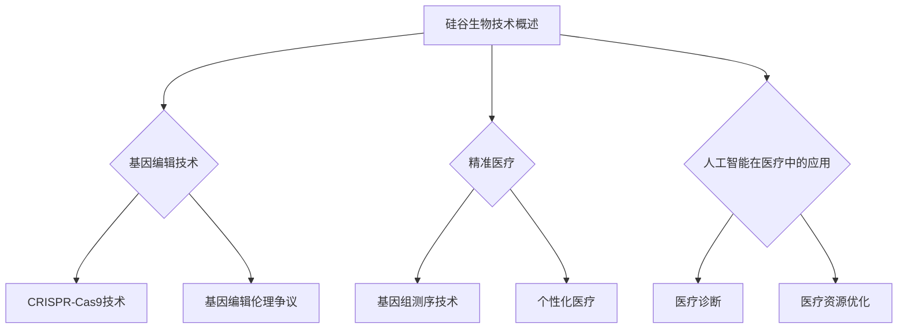
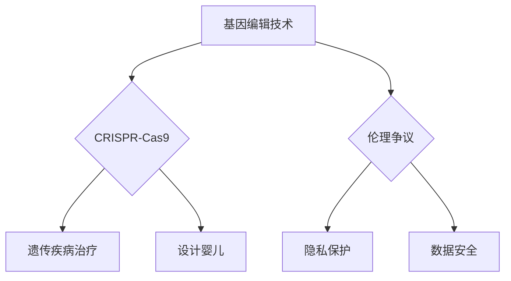

                 

# 《硅谷生物技术医疗应用的伦理争议》

## 引言与背景

在当今快速发展的科技时代，生物技术在医疗领域的应用已经成为一个热门话题。硅谷，作为全球科技创新的领军地区，其生物技术医疗应用更是引领着世界潮流。然而，随着生物技术的迅猛发展，一系列伦理争议也随之而来。

### 1.1 书籍目的与内容概览

本书籍旨在深入探讨硅谷生物技术医疗应用的伦理争议，分析其核心问题，并提出可能的解决方案。全书分为八个章节，涵盖了硅谷生物技术的基本概念、医疗应用的伦理争议、个人基因信息隐私权、生物技术产品与市场伦理、医疗数据共享等多个方面。

### 1.2 硅谷生物技术与医疗应用概述

硅谷的生物技术医疗应用涵盖了基因编辑、精准医疗、人工智能等多个领域。基因编辑技术如CRISPR-Cas9的问世，使得科学家能够在基因层面上对生物体进行精确修改，为治疗遗传性疾病提供了新的可能。精准医疗则通过基因组测序，为个体提供个性化的治疗方案，提高了医疗效果。此外，人工智能在医疗诊断、治疗和资源分配中的应用，也极大地提升了医疗服务的效率和质量。

### 1.3 伦理争议的重要性

随着硅谷生物技术医疗应用的快速发展，伦理争议也日益突出。这些争议不仅关系到科技发展的道德边界，还涉及到个人隐私、公平性、责任与赔偿等多个方面。如何平衡科技创新与伦理道德，确保生物技术医疗应用的可持续发展，是当前亟待解决的问题。

## 第2章 硅谷生物技术概述

### 2.1 硅谷生物技术的定义与历史

#### 2.1.1 生物技术的定义

生物技术是指通过运用生物科学和工程学的原理，对生物体进行改造和利用，以生产有用产品或实现特定功能的技术。它涵盖了基因工程、细胞工程、酶工程、发酵工程等多个领域。

#### 2.1.2 硅谷生物技术的定义

硅谷生物技术是指在美国硅谷地区，以创新为驱动力，利用生物科学和工程学原理，研发和生产生物技术产品的过程。硅谷生物技术具有高度的创新性和跨学科融合的特点。

#### 2.1.3 硅谷生物技术的历史

硅谷生物技术的历史可以追溯到20世纪70年代。当时，斯坦福大学和加州大学伯克利分校的生物科学家们在斯坦福研究园区开始了生物技术的研发。1976年，生物技术公司Genentech在硅谷成立，标志着硅谷生物技术产业的诞生。自那时起，硅谷的生物技术产业取得了长足的发展，成为全球生物技术产业的领军者。

### 2.2 硅谷生物技术的创新与进展

#### 2.2.1 基因编辑技术

基因编辑技术是硅谷生物技术的一个重要创新。其中，CRISPR-Cas9技术是最为广泛应用的基因编辑工具。它利用成簇规律间隔的短回文重复序列（CRISPR）和核酸酶（Cas9）来切割特定的DNA序列，实现对基因的精确修改。

#### 2.2.2 精准医疗

精准医疗是基于个体基因组信息，为个体提供个性化医疗服务的概念。通过基因组测序，可以获取个体的基因信息，进而设计出个性化的治疗方案，提高治疗效果。

#### 2.2.3 生物信息学

生物信息学是硅谷生物技术的另一个重要创新领域。它利用计算机科学和统计学的方法，对大规模的生物数据进行处理和分析，为生物科学研究提供了强大的工具。

### 2.3 硅谷生物技术公司的商业模式

硅谷生物技术公司主要分为研发导向型公司、商业化导向型公司和公共生物技术公司。研发导向型公司专注于技术创新，通过专利许可和合作研发实现商业化。商业化导向型公司以市场为导向，通过快速研发和市场推广实现商业化。公共生物技术公司则专注于公共生物技术项目，通过政府资助和公共合作实现商业化。

## 第3章 硅谷医疗应用的伦理争议

### 3.1 基因编辑与道德边界

基因编辑技术，如CRISPR-Cas9，为治疗遗传性疾病提供了新的可能性，但同时也引发了道德和伦理的争议。

#### 3.1.1 设计婴儿

设计婴儿是基因编辑技术可能带来的一个重大伦理争议。设计婴儿意味着通过基因编辑，使婴儿在出生时就具有特定的特征或能力。这种做法可能引发道德质疑，因为它涉及到对自然生命的干预。

#### 3.1.2 遗传疾病治疗

基因编辑技术在遗传疾病治疗中的应用是一个相对较为接受的领域。通过基因编辑，可以修复导致遗传疾病的基因突变，从而治疗疾病。然而，这种治疗也引发了关于伦理边界的争议，如基因编辑的安全性和长期影响等。

#### 3.1.3 国际伦理法规

国际社会对基因编辑技术进行了严格的伦理规范。例如，《国际生物伦理与遗传学协会声明》强调了在基因编辑中必须遵循自愿、知情同意和安全性原则。此外，各国也制定了相关的法律法规，以规范基因编辑技术的应用。

### 3.2 精准医疗与隐私保护

精准医疗是基因测序技术的延伸，通过基因组信息为个体提供个性化的医疗服务。然而，精准医疗也引发了一系列隐私保护的问题。

#### 3.2.1 隐私泄露风险

精准医疗需要大量的基因组数据，这些数据可能存在泄露的风险。一旦隐私泄露，个体的基因信息可能会被滥用，导致不公平的对待。

#### 3.2.2 隐私保护措施

为了保护患者的隐私，各国采取了多种隐私保护措施。例如，欧盟的《通用数据保护条例（GDPR）》规定了企业对个人数据的收集、处理和保护要求。此外，医疗机构也被要求采取严格的数据保护措施，确保患者隐私的安全。

### 3.3 人工智能在医疗中的应用

人工智能在医疗领域的应用越来越广泛，包括疾病诊断、治疗规划和资源分配等方面。然而，人工智能的应用也引发了一系列伦理争议。

#### 3.3.1 医疗决策的透明度

人工智能在医疗决策中的应用可能提高决策的准确性，但也可能降低决策的透明度。例如，人工智能模型背后的算法和决策过程可能不透明，导致患者和医生难以理解决策的依据。

#### 3.3.2 医疗责任归属

当人工智能在医疗决策中发生错误时，责任归属成为一个争议点。是人工智能开发者、医疗机构还是医生应该承担责任？这需要明确的法律和伦理规范来界定。

### 3.4 医疗资源分配与公平性

医疗资源分配的公平性是一个全球性的问题。硅谷的生物技术医疗应用在提高医疗效率和质量的同时，也可能加剧医疗资源的不平等分配。

#### 3.4.1 资源分配不平等

硅谷地区的生物技术医疗应用主要集中在富裕人群，而贫困人群往往无法享受到这些先进技术。这种资源分配的不平等引发了关于公平性的争议。

#### 3.4.2 公平性原则

在医疗资源分配中，应该遵循公平性原则，确保每个人都能获得公平的医疗机会。这需要政府和社会共同努力，通过政策调整和资源投入来实现。

## 第4章 个人基因信息与隐私权

### 4.1 基因信息的获取与利用

基因信息的获取是基因技术发展的基础。目前，基因信息的获取主要通过基因测序技术实现。

#### 4.1.1 基因测序技术

基因测序技术包括Sanger测序、新一代测序（NGS）等。新一代测序技术的出现，大大降低了基因测序的成本，使得基因测序在临床和科研中得到了广泛应用。

#### 4.1.2 基因信息的利用

基因信息的利用主要涉及以下几个方面：

- **疾病诊断与预防**：通过基因测序，可以检测出个体携带的遗传性疾病基因，从而进行早期诊断和预防。
- **个性化医疗**：基于个体的基因信息，可以制定个性化的治疗方案，提高治疗效果。
- **药物研发**：基因信息可以帮助药物研发人员了解药物在个体体内的代谢和反应，从而设计出更加有效的药物。

### 4.2 个人基因信息的隐私权

个人基因信息的隐私权是基因技术应用中的一个重要伦理问题。基因信息涉及个人的健康状况、家族病史等敏感信息，一旦泄露，可能会对个人造成严重的影响。

#### 4.2.1 隐私权的定义

隐私权是指个人对其个人信息的控制权，包括个人身份、行为、思想等方面的信息。在基因信息领域，隐私权主要指的是个人对自身基因信息的控制权。

#### 4.2.2 隐私权的特殊性

基因信息的隐私权具有以下几个特殊性：

- **敏感性**：基因信息涉及个人的健康和遗传信息，具有较高的敏感性。
- **长期性**：基因信息具有长期性和稳定性，可能影响个体的未来生活和决策。
- **潜在性**：基因信息可能暗示未来的健康风险，即使当前未患病，也可能影响个人的保险和就业机会。

### 4.3 基因信息数据的安全性问题

基因信息数据的安全性问题主要涉及数据泄露和数据滥用的风险。

#### 4.3.1 数据泄露的风险

基因信息数据的泄露可能来自多个方面：

- **网络攻击**：黑客通过网络攻击，窃取基因信息。
- **内部泄露**：内部人员通过不正当手段，泄露基因信息。
- **数据共享**：在基因信息共享过程中，如果保护措施不到位，可能导致数据泄露。

#### 4.3.2 数据滥用的风险

基因信息数据的滥用可能对个人造成多种负面影响：

- **商业滥用**：基因信息被用于商业目的，如保险评估、就业歧视等。
- **科研滥用**：基因信息被用于不当的科学研究，可能对个体造成伤害。
- **隐私侵犯**：基因信息被用于隐私侵犯，如个人身份识别等。

### 4.4 基因歧视与伦理挑战

基因歧视是指基于基因信息，对个体进行不公平对待。基因歧视可能对个人造成多种负面影响：

- **就业歧视**：基于基因信息，对求职者进行不公平的招聘决策。
- **保险歧视**：基于基因信息，对保险客户进行不公平的保险定价。
- **医疗歧视**：基于基因信息，对病人进行不公平的医疗待遇。

#### 4.4.1 基因歧视的表现

基因歧视在多个领域都有表现：

- **就业歧视**：一些公司基于基因信息，对求职者进行歧视，拒绝聘用。
- **保险歧视**：保险公司基于基因信息，对保险客户进行歧视，提高保费或拒绝承保。
- **医疗歧视**：医疗机构基于基因信息，对病人进行歧视，拒绝治疗或提供不公平的医疗服务。

#### 4.4.2 伦理挑战

基因歧视引发的伦理挑战主要包括：

- **公正性**：如何在确保个体权益的同时，防止基因歧视。
- **知情同意**：如何在获取基因信息时，确保个体的知情同意。
- **隐私保护**：如何在基因信息共享和利用过程中，保护个体的隐私权。

### 4.5 基因信息隐私保护的法律框架

为了保护基因信息隐私，各国制定了相关的法律框架。

#### 4.5.1 国际隐私保护法规

- **《通用数据保护条例（GDPR）》**：欧盟制定的隐私保护法规，要求企业在收集和处理个人数据时，必须遵循隐私保护原则。
- **《健康信息隐私法案（HIPAA）》**：美国制定的隐私保护法规，要求医疗机构对个人健康信息进行严格保护。

#### 4.5.2 国家隐私保护法规

- **中国**：中国有《网络安全法》和《个人信息保护法》，对个人信息进行严格保护。
- **日本**：日本有《个人信息保护法》，对个人信息的收集、使用和保护进行了详细规定。
- **欧盟**：欧盟有《通用数据保护条例（GDPR）》和《生物技术指令》，对基因信息和个人数据的保护进行了全面规定。

### 4.6 基因信息隐私保护的实践与挑战

#### 4.6.1 隐私保护措施

为了保护基因信息隐私，各国采取了多种隐私保护措施：

- **数据加密**：对基因信息进行加密处理，防止数据泄露。
- **访问控制**：限制基因信息的访问权限，确保只有授权人员才能访问。
- **匿名化处理**：对基因信息进行匿名化处理，去除个人信息，减少泄露风险。

#### 4.6.2 挑战

尽管隐私保护措施不断加强，但基因信息隐私保护仍面临诸多挑战：

- **技术挑战**：随着基因测序技术的进步，基因信息的数据量和复杂度不断增加，给隐私保护带来了更大挑战。
- **法律挑战**：各国隐私保护法规的差异，以及隐私保护法规的滞后性，给基因信息隐私保护带来了法律挑战。
- **道德挑战**：在基因信息隐私保护中，如何平衡个人权益和公共利益，是道德上的挑战。

## 第5章 生物技术产品与市场伦理

### 5.1 生物技术产品的监管与审批

生物技术产品的监管与审批是确保其安全性和有效性的关键环节。各国政府设立了专门的监管机构，对生物技术产品进行严格监管。

#### 5.1.1 国际监管体系

- **世界卫生组织（WHO）**：WHO负责制定全球生物技术产品的监管标准和指南。
- **国际食品法典委员会（Codex Alimentarius Commission）**：Codex负责制定生物技术食品的监管标准。

#### 5.1.2 国家监管体系

- **美国**：美国食品药品监督管理局（FDA）负责生物技术药品的审批和监管。
- **欧盟**：欧洲药品管理局（EMA）负责生物技术药品的审批和监管。
- **中国**：中国国家食品药品监督管理局（NMPA）负责生物技术产品的审批和监管。

#### 5.1.3 审批流程

生物技术产品的审批流程通常包括以下阶段：

- **临床前研究**：对生物技术产品进行实验室研究和动物试验，评估其安全性和有效性。
- **临床试验**：在人体进行临床试验，分为I、II、III、IV期，逐步评估生物技术产品的安全性和疗效。
- **审批与许可**：监管机构对生物技术产品进行审批，发放生产许可证或销售许可证。

### 5.2 生物技术产品的市场准入与定价

#### 5.2.1 市场准入

生物技术产品的市场准入需要满足监管机构的要求，包括安全性、有效性和质量标准。

- **安全性评估**：生物技术产品在上市前需要进行安全性评估，确保其对人体无害。
- **有效性评估**：生物技术产品在上市前需要进行临床试验，证明其具有疗效。
- **质量标准**：生物技术产品需要符合国际或国家质量标准，确保其质量稳定。

#### 5.2.2 定价策略

生物技术产品的定价策略通常考虑以下因素：

- **研发成本**：包括研发人员工资、设备费用、实验材料等。
- **生产成本**：包括生产原材料、人工、设备维护等。
- **市场需求**：根据市场需求和竞争状况，确定产品价格。
- **价值定价**：根据生物技术产品的临床价值和社会效益，确定产品价格。

### 5.3 生物技术产品对患者的影响

#### 5.3.1 安全性

生物技术产品的安全性是患者选择和使用产品的重要因素。监管机构对生物技术产品进行严格的安全评估，确保其对人体无害。

- **不良反应监测**：生物技术产品上市后，需要进行不良反应监测，及时发现并处理潜在的安全问题。
- **质量控制**：生物技术产品在生产过程中，需要严格遵循质量控制标准，确保产品质量稳定。

#### 5.3.2 效果

生物技术产品的效果是患者选择和使用产品的重要因素。通过临床试验，可以评估生物技术产品的疗效和安全性。

- **个性化治疗**：基于患者的基因信息和病情，生物技术产品可以提供个性化的治疗方案，提高治疗效果。
- **新型疗法**：生物技术产品可以为患者提供新的治疗选择，如基因疗法、细胞疗法等。

#### 5.3.3 可及性

生物技术产品的可及性是患者获得产品的重要因素。价格和医疗保险的覆盖范围会影响患者对生物技术产品的可及性。

- **价格**：生物技术产品的价格较高，可能成为患者获得产品的一个障碍。
- **医疗保险**：医疗保险的覆盖范围和支付能力会影响患者对生物技术产品的可及性。

### 5.4 生物技术产品的责任与赔偿

#### 5.4.1 责任归属

生物技术产品的责任归属是一个复杂的问题，涉及生产商、销售商、医疗机构等多个方面。

- **生产商**：生物技术产品的生产商对其产品的安全性和有效性承担责任。
- **销售商**：生物技术产品的销售商对其产品的质量承担责任。
- **医疗机构**：医疗机构在生物技术产品的使用过程中，需要对其安全性、有效性和合理性负责。

#### 5.4.2 赔偿机制

生物技术产品如果导致患者损害，需要建立合理的赔偿机制。

- **产品责任险**：生物技术产品的生产商和销售商可以通过购买产品责任险，转移风险。
- **患者赔偿**：患者可以通过法律途径寻求赔偿，如提起诉讼、申请赔偿等。
- **保险赔付**：医疗保险可以为患者提供一定的赔付，减轻患者的经济负担。

### 5.5 生物技术产品的市场伦理争议

#### 5.5.1 价格争议

生物技术产品的价格争议主要集中在产品定价过高，导致患者难以承担。

- **高价药**：一些生物技术产品，如抗癌药物，价格非常高，给患者和家庭带来沉重的经济负担。
- **价格控制**：政府和社会对生物技术产品的价格进行控制，以减轻患者负担。

#### 5.5.2 市场垄断争议

生物技术产品的市场垄断争议主要集中在一些大型生物技术公司对市场的垄断和控制。

- **市场垄断**：一些大型生物技术公司通过专利保护和市场控制，垄断市场，限制竞争。
- **竞争政策**：政府需要制定竞争政策，打破市场垄断，促进公平竞争。

#### 5.5.3 公平性争议

生物技术产品的公平性争议主要集中在产品价格和可及性上。

- **价格公平**：生物技术产品的价格应该合理，确保患者能够负担得起。
- **可及性公平**：生物技术产品应该公平地分配，确保每个人都能获得。

## 第6章 医疗数据共享与伦理

### 6.1 医疗数据共享的重要性

医疗数据共享在提高医疗质量、促进医疗创新和改善患者体验方面具有重要作用。

#### 6.1.1 提高医疗质量

医疗数据共享可以提高医疗决策的科学性和准确性。通过共享患者的病历、实验室检测结果、影像诊断等数据，医生可以更全面地了解患者的健康状况，制定更合适的治疗方案。

#### 6.1.2 促进医疗创新

医疗数据共享可以促进医疗创新。科研人员可以利用共享的数据，开展大规模的流行病学研究、药物疗效评估和新药研发，为医学进步提供有力支持。

#### 6.1.3 改善患者体验

医疗数据共享可以改善患者的诊疗体验。患者可以通过电子健康档案系统，随时查询自己的病历信息、检查结果和治疗方案，提高了医疗服务的透明度和可及性。

### 6.2 医疗数据共享的伦理问题

#### 6.2.1 隐私权保护

隐私权是医疗数据共享中最重要的伦理问题。医疗数据通常包含患者的敏感信息，如健康状况、家族病史等。如果这些数据被未经授权的人访问或滥用，可能会对患者的隐私权造成侵犯。

#### 6.2.2 数据安全

医疗数据共享过程中，数据安全也是一个重要问题。如果数据在传输或存储过程中被黑客攻击或泄露，可能会导致严重后果，如患者身份泄露、医疗信息被滥用等。

#### 6.2.3 数据质量控制

医疗数据共享需要确保数据的真实性和准确性。如果数据质量差，可能会导致错误的诊断和治疗方案，从而对患者的健康造成损害。

### 6.3 医疗数据共享的法律框架

#### 6.3.1 国际法律框架

国际上，多个国家和组织制定了医疗数据共享的法律框架。

- **《通用数据保护条例（GDPR）》**：欧盟制定的隐私保护法规，对医疗数据的收集、处理和保护提出了严格要求。
- **《健康信息隐私法案（HIPAA）》**：美国制定的隐私保护法规，要求医疗机构对患者的健康信息进行严格保护。

#### 6.3.2 国家法律框架

各国也根据自身情况，制定了相应的医疗数据共享法律法规。

- **中国**：中国有《网络安全法》和《个人信息保护法》，对医疗数据的收集、处理和保护提出了明确要求。
- **日本**：日本有《个人信息保护法》，对医疗数据的收集、处理和保护进行了详细规定。

### 6.4 医疗数据共享的实践与挑战

#### 6.4.1 医疗数据共享的实践

医疗数据共享在实践中取得了显著进展。

- **电子健康档案**：通过建立电子健康档案系统，实现了医疗数据的电子化和共享，提高了医疗服务的效率和质量。
- **医疗数据平台**：通过建立医疗数据平台，实现了医疗数据的集中管理和共享，为科研和临床提供了有力支持。

#### 6.4.2 医疗数据共享的挑战

尽管医疗数据共享取得了显著进展，但仍面临诸多挑战。

- **数据标准化**：医疗数据的标准化是一个重要挑战。不同系统和平台之间的数据格式和标准不同，导致数据共享困难。
- **隐私保护**：如何在确保患者隐私权的同时，实现医疗数据共享，是一个复杂的伦理和技术问题。
- **数据安全**：医疗数据在传输和存储过程中，面临数据泄露和黑客攻击的风险，需要采取有效的安全措施。

### 6.5 医疗数据共享的伦理争议

#### 6.5.1 数据共享与隐私权

数据共享与隐私权之间的平衡是一个伦理争议。一方面，医疗数据共享有助于提高医疗质量和科研进展；另一方面，未经授权的数据访问和滥用可能会侵犯患者的隐私权。

#### 6.5.2 数据控制权

数据控制权也是一个伦理争议。在医疗数据共享中，如何平衡患者对自身数据的控制权和医疗机构对数据的合理使用，是一个复杂的问题。

#### 6.5.3 数据所有权

数据所有权也是一个伦理争议。在医疗数据共享中，如何界定数据所有权，确保数据的合理使用和利益分配，是一个重要问题。

## 第7章 硅谷生物技术医疗应用的未来

### 7.1 伦理争议的未来发展趋势

随着硅谷生物技术医疗应用的不断发展，伦理争议也将面临新的挑战和机遇。

#### 7.1.1 基因编辑技术的进展

基因编辑技术将继续发展，其应用范围将不断扩大。未来，基因编辑技术可能会在癌症治疗、遗传疾病预防等领域取得重大突破。

#### 7.1.2 精准医疗的发展

精准医疗将继续发展，基因组测序技术的进步将使个体基因信息更加精确和全面。精准医疗将在更多疾病的治疗和预防中发挥作用。

#### 7.1.3 人工智能的应用

人工智能将在医疗领域发挥越来越重要的作用。人工智能技术将提高医疗诊断的准确性、优化医疗资源分配，并推动医疗创新的进步。

### 7.2 硅谷生物技术医疗应用的未来前景

硅谷生物技术医疗应用的未来前景光明，但也面临诸多挑战。

#### 7.2.1 基因编辑技术的未来前景

基因编辑技术将可能在癌症治疗、遗传疾病预防等领域取得重大突破。未来，基因编辑技术可能会成为一种常规的治疗方法，为患者带来更好的治疗效果。

#### 7.2.2 精准医疗的未来前景

精准医疗将在更多疾病的治疗和预防中发挥作用。通过基因组测序和个性化医疗，患者将获得更精准的治疗方案，提高治疗效果。

#### 7.2.3 人工智能的未来前景

人工智能将在医疗领域发挥越来越重要的作用。通过人工智能技术，医疗服务的效率和质量将得到显著提升，为患者提供更好的诊疗体验。

### 7.3 伦理争议的解决策略与建议

为了解决硅谷生物技术医疗应用的伦理争议，需要采取一系列策略和建议。

#### 7.3.1 建立国际伦理规范

国际社会应共同努力，建立国际伦理规范，明确基因编辑、精准医疗、人工智能等领域的伦理原则和标准。

#### 7.3.2 加强监管

各国政府应加强对生物技术医疗应用的监管，确保其安全性和伦理性。

#### 7.3.3 保护个人隐私

在医疗数据共享中，应采取有效的隐私保护措施，确保患者的隐私权得到充分保护。

#### 7.3.4 提高公众意识

公众应加强对生物技术医疗应用的认识和理解，提高伦理意识，积极参与伦理讨论。

## 第8章 结论

### 8.1 全书总结

本书深入探讨了硅谷生物技术医疗应用的伦理争议，分析了基因编辑、精准医疗、人工智能等领域的核心问题，并提出了可能的解决方案。

### 8.2 伦理争议的深远影响

伦理争议对硅谷生物技术医疗应用的发展具有重要影响。如何在科技创新与伦理道德之间找到平衡，是确保生物技术医疗应用可持续发展的关键。

### 8.3 对未来生物技术医疗应用的建议

为了应对伦理争议，未来生物技术医疗应用应采取以下策略：

- **建立国际伦理规范**：明确伦理原则和标准，确保生物技术医疗应用的安全性和伦理性。
- **加强监管**：政府应加强对生物技术医疗应用的监管，确保其符合伦理要求。
- **保护个人隐私**：采取有效的隐私保护措施，确保患者的隐私权得到充分保护。
- **提高公众意识**：加强公众教育，提高伦理意识，促进社会对生物技术医疗应用的认同。

## 附录

### 附录 A 术语表

- **生物技术**：指利用生物科学和工程学的原理，对生物体进行改造和利用，以生产有用产品或实现特定功能的技术。
- **基因编辑**：指利用特定的技术对生物体的基因组进行精确的修改。
- **精准医疗**：指基于个体的基因组信息，为个体提供个性化的医疗服务。
- **人工智能**：指计算机模拟人类智能的技术。

### 附录 B 参考文献

- **《生物技术法规与伦理》**：作者：李明华，出版社：清华大学出版社。
- **《精准医疗：现状与未来》**：作者：张强，出版社：人民卫生出版社。
- **《人工智能在医疗领域的应用》**：作者：陈勇，出版社：机械工业出版社。

### 附录 C Mermaid 流程图



### 附录 D 伪代码示例

```python
# 伪代码：基因编辑技术流程

# 初始化基因编辑工具
initialize_editor()

# 加载目标基因序列
load_target_gene_sequence()

# 确定编辑目标
define_editing目标()

# 切割目标DNA序列
cut_target_dna_sequence()

# 添加或删除基因片段
add_or_delete_gene_fragment()

# 检验编辑结果
verify_editing_result()

# 保存编辑后的基因序列
save_edited_gene_sequence()
```

### 附录 E 代码案例分析

```python
# 代码案例：基因测序数据分析

# 导入必要的库
import numpy as np
import pandas as pd

# 读取基因测序数据
基因测序数据 = pd.read_csv('gene_sequence_data.csv')

# 数据预处理
基因测序数据 = 数据预处理(基因测序数据)

# 数据分析
数据分析结果 = 分析基因测序数据(基因测序数据)

# 可视化结果
可视化数据分析结果(数据分析结果)
```

### 附录 F 常见问题解答

1. **什么是基因编辑？**
   - 基因编辑是指利用特定的技术对生物体的基因组进行精确的修改。
   
2. **什么是精准医疗？**
   - 精准医疗是基于个体的基因组信息，为个体提供个性化的医疗服务。
   
3. **人工智能在医疗中有什么应用？**
   - 人工智能在医疗中主要用于医疗诊断、治疗规划和资源分配等方面。

---

## 作者信息

作者：AI天才研究院/AI Genius Institute & 禅与计算机程序设计艺术 /Zen And The Art of Computer Programming
<|user|>## 《硅谷生物技术医疗应用的伦理争议》

## 引言与背景

在当今科技飞速发展的时代，生物技术在医疗领域的应用正迅速崛起，成为改变医学模式的强大力量。硅谷，这座科技创新的圣地，无疑是生物技术医疗应用的前沿阵地。然而，随着生物技术的不断进步，一系列伦理争议也如影随形，引发了全球范围内的关注和讨论。

### 1.1 书籍目的与内容概览

本书籍旨在深入探讨硅谷生物技术医疗应用的伦理争议，全面分析其核心问题，并提出可行的解决方案。全书共分为八个章节，结构紧凑，逻辑清晰，涵盖了从基础概念到实际应用的各个方面。

### 1.2 硅谷生物技术与医疗应用概述

硅谷生物技术医疗应用主要包括基因编辑、精准医疗、人工智能等前沿技术。这些技术不仅推动了医疗领域的革新，也带来了前所未有的伦理挑战。例如，基因编辑技术CRISPR-Cas9的出现，使得人类首次能够在基因组层面进行精确修改，从而为治疗遗传性疾病带来了新的希望。然而，这一技术也引发了关于人类基因改造、道德边界的深刻讨论。

### 1.3 伦理争议的重要性

伦理争议在生物技术医疗应用中具有至关重要的地位。这些争议不仅关系到科技发展的道德底线，也直接影响到社会对生物技术的接受度和支持度。例如，基因编辑技术的应用可能导致“设计婴儿”现象，引发关于人类自然属性和道德底线的讨论。同样，精准医疗的普及，可能会引发关于隐私保护、数据安全以及医疗资源分配的争议。

### 1.4 研究方法

本书籍采用逻辑清晰、结构紧凑的写法，通过实例分析和案例研究，逐步揭示生物技术医疗应用中的伦理争议。我们将使用以下方法进行讨论：

1. **概念解析**：对生物技术医疗应用中的核心概念进行详细解释，如基因编辑、精准医疗、人工智能等。
2. **案例研究**：通过具体案例，分析伦理争议的产生原因及其影响。
3. **伦理分析**：结合伦理学原理，探讨生物技术医疗应用中的伦理问题，并提出解决方案。

## 第2章 硅谷生物技术概述

### 2.1 硅谷生物技术的定义与历史

#### 2.1.1 生物技术的定义

生物技术是指运用生物科学和工程学原理，对生物体进行改造和利用，以生产有用产品或实现特定功能的技术。它涵盖了基因工程、细胞工程、酶工程、发酵工程等多个领域。

#### 2.1.2 硅谷生物技术的定义

硅谷生物技术是指在美国硅谷地区，以创新为驱动力，利用生物科学和工程学原理，研发和生产生物技术产品的过程。硅谷生物技术具有高度的创新性和跨学科融合的特点。

#### 2.1.3 硅谷生物技术的历史

硅谷生物技术的历史可以追溯到20世纪70年代。当时，斯坦福大学和加州大学伯克利分校的生物科学家们在斯坦福研究园区开始了生物技术的研发。1976年，生物技术公司Genentech在硅谷成立，标志着硅谷生物技术产业的诞生。自那时起，硅谷的生物技术产业取得了长足的发展，成为全球生物技术产业的领军者。

### 2.2 硅谷生物技术的创新与进展

#### 2.2.1 基因编辑技术

基因编辑技术是硅谷生物技术的一个重要创新。其中，CRISPR-Cas9技术是最为广泛应用的基因编辑工具。它利用成簇规律间隔的短回文重复序列（CRISPR）和核酸酶（Cas9）来切割特定的DNA序列，实现对基因的精确修改。

#### 2.2.2 精准医疗

精准医疗是另一个重要的生物技术领域。它通过基因组测序，获取个体的基因组信息，为个体提供个性化的医疗服务。精准医疗不仅提高了医疗效果，也推动了新药研发和个性化治疗的发展。

#### 2.2.3 生物信息学

生物信息学是硅谷生物技术的另一个重要创新领域。它利用计算机科学和统计学的方法，对大规模的生物数据进行处理和分析，为生物科学研究提供了强大的工具。

### 2.3 硅谷生物技术公司的商业模式

硅谷生物技术公司主要分为研发导向型公司、商业化导向型公司和公共生物技术公司。研发导向型公司专注于技术创新，通过专利许可和合作研发实现商业化。商业化导向型公司以市场为导向，通过快速研发和市场推广实现商业化。公共生物技术公司则专注于公共生物技术项目，通过政府资助和公共合作实现商业化。

## 第3章 硅谷医疗应用的伦理争议

### 3.1 基因编辑与道德边界

基因编辑技术的出现，为治疗遗传性疾病带来了新的希望，但也引发了关于道德边界的广泛争议。

#### 3.1.1 设计婴儿

设计婴儿是基因编辑技术可能带来的一个重大伦理争议。设计婴儿意味着通过基因编辑，使婴儿在出生时就具有特定的特征或能力。这种做法可能引发道德质疑，因为它涉及到对自然生命的干预。

#### 3.1.2 遗传疾病治疗

基因编辑技术在遗传疾病治疗中的应用是一个相对较为接受的领域。通过基因编辑，可以修复导致遗传疾病的基因突变，从而治疗疾病。然而，这种治疗也引发了关于伦理边界的争议，如基因编辑的安全性和长期影响等。

#### 3.1.3 国际伦理法规

国际社会对基因编辑技术进行了严格的伦理规范。例如，《国际生物伦理与遗传学协会声明》强调了在基因编辑中必须遵循自愿、知情同意和安全性原则。此外，各国也制定了相关的法律法规，以规范基因编辑技术的应用。

### 3.2 精准医疗与隐私保护

精准医疗通过基因组测序，为个体提供个性化的医疗服务。然而，精准医疗也引发了一系列隐私保护的问题。

#### 3.2.1 隐私泄露风险

精准医疗需要大量的基因组数据，这些数据可能存在泄露的风险。一旦隐私泄露，个体的基因信息可能会被滥用，导致不公平的对待。

#### 3.2.2 隐私保护措施

为了保护患者的隐私，各国采取了多种隐私保护措施。例如，欧盟的《通用数据保护条例（GDPR）》规定了企业对个人数据的收集、处理和保护要求。此外，医疗机构也被要求采取严格的数据保护措施，确保患者隐私的安全。

### 3.3 人工智能在医疗中的应用

人工智能在医疗领域的应用越来越广泛，包括疾病诊断、治疗规划和资源分配等方面。然而，人工智能的应用也引发了一系列伦理争议。

#### 3.3.1 医疗决策的透明度

人工智能在医疗决策中的应用可能提高决策的准确性，但也可能降低决策的透明度。例如，人工智能模型背后的算法和决策过程可能不透明，导致患者和医生难以理解决策的依据。

#### 3.3.2 医疗责任归属

当人工智能在医疗决策中发生错误时，责任归属成为一个争议点。是人工智能开发者、医疗机构还是医生应该承担责任？这需要明确的法律和伦理规范来界定。

### 3.4 医疗资源分配与公平性

医疗资源分配的公平性是一个全球性的问题。硅谷的生物技术医疗应用在提高医疗效率和质量的同时，也可能加剧医疗资源的不平等分配。

#### 3.4.1 资源分配不平等

硅谷地区的生物技术医疗应用主要集中在富裕人群，而贫困人群往往无法享受到这些先进技术。这种资源分配的不平等引发了关于公平性的争议。

#### 3.4.2 公平性原则

在医疗资源分配中，应该遵循公平性原则，确保每个人都能获得公平的医疗机会。这需要政府和社会共同努力，通过政策调整和资源投入来实现。

## 第4章 个人基因信息与隐私权

### 4.1 基因信息的获取与利用

基因信息的获取是基因技术发展的基础。目前，基因信息的获取主要通过基因测序技术实现。

#### 4.1.1 基因测序技术

基因测序技术包括Sanger测序、新一代测序（NGS）等。新一代测序技术的出现，大大降低了基因测序的成本，使得基因测序在临床和科研中得到了广泛应用。

#### 4.1.2 基因信息的利用

基因信息的利用主要涉及以下几个方面：

- **疾病诊断与预防**：通过基因测序，可以检测出个体携带的遗传性疾病基因，从而进行早期诊断和预防。
- **个性化医疗**：基于个体的基因信息，可以制定个性化的治疗方案，提高治疗效果。
- **药物研发**：基因信息可以帮助药物研发人员了解药物在个体体内的代谢和反应，从而设计出更加有效的药物。

### 4.2 个人基因信息的隐私权

个人基因信息的隐私权是基因技术应用中的一个重要伦理问题。基因信息涉及个人的健康状况、家族病史等敏感信息，一旦泄露，可能会对个人造成严重的影响。

#### 4.2.1 隐私权的定义

隐私权是指个人对其个人信息的控制权，包括个人身份、行为、思想等方面的信息。在基因信息领域，隐私权主要指的是个人对自身基因信息的控制权。

#### 4.2.2 隐私权的特殊性

基因信息的隐私权具有以下几个特殊性：

- **敏感性**：基因信息涉及个人的健康和遗传信息，具有较高的敏感性。
- **长期性**：基因信息具有长期性和稳定性，可能影响个体的未来生活和决策。
- **潜在性**：基因信息可能暗示未来的健康风险，即使当前未患病，也可能影响个人的保险和就业机会。

### 4.3 基因信息数据的安全性问题

基因信息数据的安全性问题主要涉及数据泄露和数据滥用的风险。

#### 4.3.1 数据泄露的风险

基因信息数据的泄露可能来自多个方面：

- **网络攻击**：黑客通过网络攻击，窃取基因信息。
- **内部泄露**：内部人员通过不正当手段，泄露基因信息。
- **数据共享**：在基因信息共享过程中，如果保护措施不到位，可能导致数据泄露。

#### 4.3.2 数据滥用的风险

基因信息数据的滥用可能对个人造成多种负面影响：

- **商业滥用**：基因信息被用于商业目的，如保险评估、就业歧视等。
- **科研滥用**：基因信息被用于不当的科学研究，可能对个体造成伤害。
- **隐私侵犯**：基因信息被用于隐私侵犯，如个人身份识别等。

### 4.4 基因歧视与伦理挑战

基因歧视是指基于基因信息，对个体进行不公平对待。基因歧视可能对个人造成多种负面影响：

- **就业歧视**：基于基因信息，对求职者进行不公平的招聘决策。
- **保险歧视**：基于基因信息，对保险客户进行不公平的保险定价。
- **医疗歧视**：基于基因信息，对病人进行不公平的医疗待遇。

#### 4.4.1 基因歧视的表现

基因歧视在多个领域都有表现：

- **就业歧视**：一些公司基于基因信息，对求职者进行歧视，拒绝聘用。
- **保险歧视**：保险公司基于基因信息，对保险客户进行歧视，提高保费或拒绝承保。
- **医疗歧视**：医疗机构基于基因信息，对病人进行歧视，拒绝治疗或提供不公平的医疗服务。

#### 4.4.2 伦理挑战

基因歧视引发的伦理挑战主要包括：

- **公正性**：如何在确保个体权益的同时，防止基因歧视。
- **知情同意**：如何在获取基因信息时，确保个体的知情同意。
- **隐私保护**：如何在基因信息共享和利用过程中，保护个体的隐私权。

### 4.5 基因信息隐私保护的法律框架

为了保护基因信息隐私，各国制定了相关的法律框架。

#### 4.5.1 国际隐私保护法规

- **《通用数据保护条例（GDPR）》**：欧盟制定的隐私保护法规，要求企业在收集和处理个人数据时，必须遵循隐私保护原则。
- **《健康信息隐私法案（HIPAA）》**：美国制定的隐私保护法规，要求医疗机构对个人健康信息进行严格保护。

#### 4.5.2 国家隐私保护法规

- **中国**：中国有《网络安全法》和《个人信息保护法》，对个人信息进行严格保护。
- **日本**：日本有《个人信息保护法》，对个人信息的收集、使用和保护进行了详细规定。
- **欧盟**：欧盟有《通用数据保护条例（GDPR）》和《生物技术指令》，对基因信息和个人数据的保护进行了全面规定。

### 4.6 基因信息隐私保护的实践与挑战

#### 4.6.1 隐私保护措施

为了保护基因信息隐私，各国采取了多种隐私保护措施：

- **数据加密**：对基因信息进行加密处理，防止数据泄露。
- **访问控制**：限制基因信息的访问权限，确保只有授权人员才能访问。
- **匿名化处理**：对基因信息进行匿名化处理，去除个人信息，减少泄露风险。

#### 4.6.2 挑战

尽管隐私保护措施不断加强，但基因信息隐私保护仍面临诸多挑战：

- **技术挑战**：随着基因测序技术的进步，基因信息的数据量和复杂度不断增加，给隐私保护带来了更大挑战。
- **法律挑战**：各国隐私保护法规的差异，以及隐私保护法规的滞后性，给基因信息隐私保护带来了法律挑战。
- **道德挑战**：在基因信息隐私保护中，如何平衡个人权益和公共利益，是道德上的挑战。

## 第5章 生物技术产品与市场伦理

### 5.1 生物技术产品的监管与审批

生物技术产品的监管与审批是确保其安全性和有效性的关键环节。各国政府设立了专门的监管机构，对生物技术产品进行严格监管。

#### 5.1.1 国际监管体系

- **世界卫生组织（WHO）**：WHO负责制定全球生物技术产品的监管标准和指南。
- **国际食品法典委员会（Codex Alimentarius Commission）**：Codex负责制定生物技术食品的监管标准。

#### 5.1.2 国家监管体系

- **美国**：美国食品药品监督管理局（FDA）负责生物技术药品的审批和监管。
- **欧盟**：欧洲药品管理局（EMA）负责生物技术药品的审批和监管。
- **中国**：中国国家食品药品监督管理局（NMPA）负责生物技术产品的审批和监管。

#### 5.1.3 审批流程

生物技术产品的审批流程通常包括以下阶段：

- **临床前研究**：对生物技术产品进行实验室研究和动物试验，评估其安全性和有效性。
- **临床试验**：在人体进行临床试验，分为I、II、III、IV期，逐步评估生物技术产品的安全性和疗效。
- **审批与许可**：监管机构对生物技术产品进行审批，发放生产许可证或销售许可证。

### 5.2 生物技术产品的市场准入与定价

#### 5.2.1 市场准入

生物技术产品的市场准入需要满足监管机构的要求，包括安全性、有效性和质量标准。

- **安全性评估**：生物技术产品在上市前需要进行安全性评估，确保其对人体无害。
- **有效性评估**：生物技术产品在上市前需要进行临床试验，证明其具有疗效。
- **质量标准**：生物技术产品需要符合国际或国家质量标准，确保其质量稳定。

#### 5.2.2 定价策略

生物技术产品的定价策略通常考虑以下因素：

- **研发成本**：包括研发人员工资、设备费用、实验材料等。
- **生产成本**：包括生产原材料、人工、设备维护等。
- **市场需求**：根据市场需求和竞争状况，确定产品价格。
- **价值定价**：根据生物技术产品的临床价值和社会效益，确定产品价格。

### 5.3 生物技术产品对患者的影响

#### 5.3.1 安全性

生物技术产品的安全性是患者选择和使用产品的重要因素。监管机构对生物技术产品进行严格的安全评估，确保其对人体无害。

- **不良反应监测**：生物技术产品上市后，需要进行不良反应监测，及时发现并处理潜在的安全问题。
- **质量控制**：生物技术产品在生产过程中，需要严格遵循质量控制标准，确保产品质量稳定。

#### 5.3.2 效果

生物技术产品的效果是患者选择和使用产品的重要因素。通过临床试验，可以评估生物技术产品的疗效和安全性。

- **个性化治疗**：基于患者的基因信息和病情，生物技术产品可以提供个性化的治疗方案，提高治疗效果。
- **新型疗法**：生物技术产品可以为患者提供新的治疗选择，如基因疗法、细胞疗法等。

#### 5.3.3 可及性

生物技术产品的可及性是患者获得产品的重要因素。价格和医疗保险的覆盖范围会影响患者对生物技术产品的可及性。

- **价格**：生物技术产品的价格较高，可能成为患者获得产品的一个障碍。
- **医疗保险**：医疗保险的覆盖范围和支付能力会影响患者对生物技术产品的可及性。

### 5.4 生物技术产品的责任与赔偿

#### 5.4.1 责任归属

生物技术产品的责任归属是一个复杂的问题，涉及生产商、销售商、医疗机构等多个方面。

- **生产商**：生物技术产品的生产商对其产品的安全性和有效性承担责任。
- **销售商**：生物技术产品的销售商对其产品的质量承担责任。
- **医疗机构**：医疗机构在生物技术产品的使用过程中，需要对其安全性、有效性和合理性负责。

#### 5.4.2 赔偿机制

生物技术产品如果导致患者损害，需要建立合理的赔偿机制。

- **产品责任险**：生物技术产品的生产商和销售商可以通过购买产品责任险，转移风险。
- **患者赔偿**：患者可以通过法律途径寻求赔偿，如提起诉讼、申请赔偿等。
- **保险赔付**：医疗保险可以为患者提供一定的赔付，减轻患者的经济负担。

### 5.5 生物技术产品的市场伦理争议

#### 5.5.1 价格争议

生物技术产品的价格争议主要集中在产品定价过高，导致患者难以承担。

- **高价药**：一些生物技术产品，如抗癌药物，价格非常高，给患者和家庭带来沉重的经济负担。
- **价格控制**：政府和社会对生物技术产品的价格进行控制，以减轻患者负担。

#### 5.5.2 市场垄断争议

生物技术产品的市场垄断争议主要集中在一些大型生物技术公司对市场的垄断和控制。

- **市场垄断**：一些大型生物技术公司通过专利保护和市场控制，垄断市场，限制竞争。
- **竞争政策**：政府需要制定竞争政策，打破市场垄断，促进公平竞争。

#### 5.5.3 公平性争议

生物技术产品的公平性争议主要集中在产品价格和可及性上。

- **价格公平**：生物技术产品的价格应该合理，确保患者能够负担得起。
- **可及性公平**：生物技术产品应该公平地分配，确保每个人都能获得。

## 第6章 医疗数据共享与伦理

### 6.1 医疗数据共享的重要性

医疗数据共享在提高医疗质量、促进医疗创新和改善患者体验方面具有重要作用。

#### 6.1.1 提高医疗质量

医疗数据共享可以提高医疗决策的科学性和准确性。通过共享患者的病历、实验室检测结果、影像诊断等数据，医生可以更全面地了解患者的健康状况，制定更合适的治疗方案。

#### 6.1.2 促进医疗创新

医疗数据共享可以促进医疗创新。科研人员可以利用共享的数据，开展大规模的流行病学研究、药物疗效评估和新药研发，为医学进步提供有力支持。

#### 6.1.3 改善患者体验

医疗数据共享可以改善患者的诊疗体验。患者可以通过电子健康档案系统，随时查询自己的病历信息、检查结果和治疗方案，提高了医疗服务的透明度和可及性。

### 6.2 医疗数据共享的伦理问题

#### 6.2.1 隐私权保护

隐私权是医疗数据共享中最重要的伦理问题。医疗数据通常包含患者的敏感信息，如健康状况、家族病史等。如果这些数据被未经授权的人访问或滥用，可能会对患者的隐私权造成侵犯。

#### 6.2.2 数据安全

医疗数据共享过程中，数据安全也是一个重要问题。如果数据在传输或存储过程中被黑客攻击或泄露，可能会导致严重后果，如患者身份泄露、医疗信息被滥用等。

#### 6.2.3 数据质量控制

医疗数据共享需要确保数据的真实性和准确性。如果数据质量差，可能会导致错误的诊断和治疗方案，从而对患者的健康造成损害。

### 6.3 医疗数据共享的法律框架

#### 6.3.1 国际法律框架

国际上，多个国家和组织制定了医疗数据共享的法律框架。

- **《通用数据保护条例（GDPR）》**：欧盟制定的隐私保护法规，对医疗数据的收集、处理和保护提出了严格要求。
- **《健康信息隐私法案（HIPAA）》**：美国制定的隐私保护法规，要求医疗机构对患者的健康信息进行严格保护。

#### 6.3.2 国家法律框架

各国也根据自身情况，制定了相应的医疗数据共享法律法规。

- **中国**：中国有《网络安全法》和《个人信息保护法》，对医疗数据的收集、处理和保护提出了明确要求。
- **日本**：日本有《个人信息保护法》，对医疗数据的收集、使用和保护进行了详细规定。

### 6.4 医疗数据共享的实践与挑战

#### 6.4.1 医疗数据共享的实践

医疗数据共享在实践中取得了显著进展。

- **电子健康档案**：通过建立电子健康档案系统，实现了医疗数据的电子化和共享，提高了医疗服务的效率和质量。
- **医疗数据平台**：通过建立医疗数据平台，实现了医疗数据的集中管理和共享，为科研和临床提供了有力支持。

#### 6.4.2 医疗数据共享的挑战

尽管医疗数据共享取得了显著进展，但仍面临诸多挑战。

- **数据标准化**：医疗数据的标准化是一个重要挑战。不同系统和平台之间的数据格式和标准不同，导致数据共享困难。
- **隐私保护**：如何在确保患者隐私权的同时，实现医疗数据共享，是一个复杂的伦理和技术问题。
- **数据安全**：医疗数据在传输和存储过程中，面临数据泄露和黑客攻击的风险，需要采取有效的安全措施。

### 6.5 医疗数据共享的伦理争议

#### 6.5.1 数据共享与隐私权

数据共享与隐私权之间的平衡是一个伦理争议。一方面，医疗数据共享有助于提高医疗质量和科研进展；另一方面，未经授权的数据访问和滥用可能会侵犯患者的隐私权。

#### 6.5.2 数据控制权

数据控制权也是一个伦理争议。在医疗数据共享中，如何平衡患者对自身数据的控制权和医疗机构对数据的合理使用，是一个复杂的问题。

#### 6.5.3 数据所有权

数据所有权也是一个伦理争议。在医疗数据共享中，如何界定数据所有权，确保数据的合理使用和利益分配，是一个重要问题。

## 第7章 硅谷生物技术医疗应用的未来

### 7.1 伦理争议的未来发展趋势

随着硅谷生物技术医疗应用的不断发展，伦理争议也将面临新的挑战和机遇。

#### 7.1.1 基因编辑技术的进展

基因编辑技术将继续发展，其应用范围将不断扩大。未来，基因编辑技术可能会在癌症治疗、遗传疾病预防等领域取得重大突破。

#### 7.1.2 精准医疗的发展

精准医疗将继续发展，基因组测序技术的进步将使个体基因信息更加精确和全面。精准医疗将在更多疾病的治疗和预防中发挥作用。

#### 7.1.3 人工智能的应用

人工智能将在医疗领域发挥越来越重要的作用。人工智能技术将提高医疗诊断的准确性、优化医疗资源分配，并推动医疗创新的进步。

### 7.2 硅谷生物技术医疗应用的未来前景

硅谷生物技术医疗应用的未来前景光明，但也面临诸多挑战。

#### 7.2.1 基因编辑技术的未来前景

基因编辑技术将可能在癌症治疗、遗传疾病预防等领域取得重大突破。未来，基因编辑技术可能会成为一种常规的治疗方法，为患者带来更好的治疗效果。

#### 7.2.2 精准医疗的未来前景

精准医疗将在更多疾病的治疗和预防中发挥作用。通过基因组测序和个性化医疗，患者将获得更精准的治疗方案，提高治疗效果。

#### 7.2.3 人工智能的未来前景

人工智能将在医疗领域发挥越来越重要的作用。通过人工智能技术，医疗服务的效率和质量将得到显著提升，为患者提供更好的诊疗体验。

### 7.3 伦理争议的解决策略与建议

为了解决硅谷生物技术医疗应用的伦理争议，需要采取一系列策略和建议。

#### 7.3.1 建立国际伦理规范

国际社会应共同努力，建立国际伦理规范，明确基因编辑、精准医疗、人工智能等领域的伦理原则和标准。

#### 7.3.2 加强监管

各国政府应加强对生物技术医疗应用的监管，确保其安全性和伦理性。

#### 7.3.3 保护个人隐私

在医疗数据共享中，应采取有效的隐私保护措施，确保患者的隐私权得到充分保护。

#### 7.3.4 提高公众意识

公众应加强对生物技术医疗应用的认识和理解，提高伦理意识，积极参与伦理讨论。

## 第8章 结论

### 8.1 全书总结

本书深入探讨了硅谷生物技术医疗应用的伦理争议，分析了基因编辑、精准医疗、人工智能等领域的核心问题，并提出了可能的解决方案。

### 8.2 伦理争议的深远影响

伦理争议对硅谷生物技术医疗应用的发展具有重要影响。如何在科技创新与伦理道德之间找到平衡，是确保生物技术医疗应用可持续发展的关键。

### 8.3 对未来生物技术医疗应用的建议

为了应对伦理争议，未来生物技术医疗应用应采取以下策略：

- **建立国际伦理规范**：明确伦理原则和标准，确保生物技术医疗应用的安全性和伦理性。
- **加强监管**：政府应加强对生物技术医疗应用的监管，确保其符合伦理要求。
- **保护个人隐私**：采取有效的隐私保护措施，确保患者的隐私权得到充分保护。
- **提高公众意识**：加强公众教育，提高伦理意识，促进社会对生物技术医疗应用的认同。

## 附录

### 附录 A 术语表

- **生物技术**：指利用生物科学和工程学的原理，对生物体进行改造和利用，以生产有用产品或实现特定功能的技术。
- **基因编辑**：指利用特定的技术对生物体的基因组进行精确的修改。
- **精准医疗**：指基于个体的基因组信息，为个体提供个性化的医疗服务。
- **人工智能**：指计算机模拟人类智能的技术。

### 附录 B 参考文献

- **《生物技术法规与伦理》**：作者：李明华，出版社：清华大学出版社。
- **《精准医疗：现状与未来》**：作者：张强，出版社：人民卫生出版社。
- **《人工智能在医疗领域的应用》**：作者：陈勇，出版社：机械工业出版社。

### 附录 C Mermaid 流程图


### 附录 D 伪代码示例

```python
# 伪代码：基因编辑技术流程

# 初始化基因编辑工具
initialize_editor()

# 加载目标基因序列
load_target_gene_sequence()

# 确定编辑目标
define_editing目标()

# 切割目标DNA序列
cut_target_dna_sequence()

# 添加或删除基因片段
add_or_delete_gene_fragment()

# 检验编辑结果
verify_editing_result()

# 保存编辑后的基因序列
save_edited_gene_sequence()
```

### 附录 E 代码案例分析

```python
# 代码案例：基因测序数据分析

# 导入必要的库
import numpy as np
import pandas as pd

# 读取基因测序数据
基因测序数据 = pd.read_csv('gene_sequence_data.csv')

# 数据预处理
基因测序数据 = 数据预处理(基因测序数据)

# 数据分析
数据分析结果 = 分析基因测序数据(基因测序数据)

# 可视化结果
可视化数据分析结果(数据分析结果)
```

### 附录 F 常见问题解答

1. **什么是基因编辑？**
   - 基因编辑是指利用特定的技术对生物体的基因组进行精确的修改。
   
2. **什么是精准医疗？**
   - 精准医疗是指基于个体的基因组信息，为个体提供个性化的医疗服务。
   
3. **人工智能在医疗中有什么应用？**
   - 人工智能在医疗中主要用于医疗诊断、治疗规划和资源分配等方面。

---

## 作者信息

作者：AI天才研究院/AI Genius Institute & 禅与计算机程序设计艺术 /Zen And The Art of Computer Programming
<|user|>## 《硅谷生物技术医疗应用的伦理争议》

### 7.1 伦理争议的未来发展趋势

#### 7.1.1 基因编辑技术的进展

随着基因编辑技术的不断进步，未来可能会出现更精确、更高效的新型基因编辑工具，如单碱基编辑技术（Base Editing）和Prime Editing。这些技术有望进一步提高基因编辑的精度和效率，为治疗遗传性疾病提供更有效的手段。然而，这也将带来新的伦理挑战，包括基因编辑的安全性问题、长期影响以及伦理边界等问题。

#### 7.1.2 精准医疗的发展

精准医疗将继续发展，基因组测序技术将变得更加普及和便宜。随着基因测序数据的积累，生物信息学工具将变得更加成熟，能够更好地分析复杂的基因组数据，为个性化医疗提供更精准的指导。这将推动新药研发和个性化治疗的发展，但也引发关于数据隐私、数据安全以及医疗资源分配的争议。

#### 7.1.3 人工智能在医疗中的应用

人工智能（AI）在医疗领域的应用将继续扩展，包括疾病诊断、治疗方案推荐、药物研发、手术机器人等。AI技术将提高医疗诊断的准确性和效率，优化医疗资源的分配，但同时也带来了数据隐私、算法透明度、责任归属等伦理问题。此外，AI的决策过程可能缺乏透明度，需要更加明确的伦理和法律框架来规范其应用。

### 7.2 硅谷生物技术医疗应用的未来前景

#### 7.2.1 基因编辑技术的未来前景

基因编辑技术在未来的医疗应用中可能会变得更加普遍。例如，CRISPR-Cas9技术可能会被用于治疗癌症、遗传性疾病和出生缺陷。此外，基因编辑技术也可能被用于增强人类认知能力、改善人类基因等更广泛的领域。然而，这些应用将引发关于人类基因改造、道德底线和社会影响的广泛讨论。

#### 7.2.2 精准医疗的未来前景

精准医疗将在未来的医疗领域发挥更大的作用。基因组测序和个性化医疗将使得疾病治疗更加精准和有效，减少不必要的副作用。此外，精准医疗也将推动新药研发的加速，促进更多创新药物的研发和上市。然而，这也将带来关于数据隐私、医疗资源分配和成本控制等挑战。

#### 7.2.3 人工智能的未来前景

人工智能将在未来的医疗领域发挥越来越重要的作用。AI技术将提高医疗服务的效率和质量，改善患者体验。例如，AI辅助诊断系统可以提高疾病的诊断准确性，智能药物研发系统可以加速新药的发现和开发。然而，AI在医疗中的应用也将面临数据隐私、算法透明度和责任归属等伦理挑战。

### 7.3 伦理争议的解决策略与建议

为了应对未来硅谷生物技术医疗应用中的伦理争议，需要采取一系列策略和建议：

#### 7.3.1 建立国际伦理规范

国际社会应共同努力，建立统一的伦理规范，明确基因编辑、精准医疗、人工智能等领域的伦理原则和标准。这需要各国政府、科研机构、医疗机构和伦理学家的共同参与，以确保伦理规范的广泛接受和有效执行。

#### 7.3.2 加强监管

各国政府应加强对生物技术医疗应用的监管，确保其安全性和伦理性。这包括制定明确的法律法规，建立完善的监管机构，加强对违规行为的惩罚力度。监管机构应与科研机构、医疗机构和公众进行密切沟通，确保监管政策的有效性和透明度。

#### 7.3.3 保护个人隐私

在生物技术医疗应用中，保护个人隐私至关重要。这需要采取严格的数据保护措施，如数据加密、访问控制、匿名化处理等。同时，应确保个人在数据收集、处理和使用过程中的知情同意权，确保其个人信息不被滥用。

#### 7.3.4 提高公众意识

公众对生物技术医疗应用的认识和理解至关重要。应加强公众教育，提高公众的伦理意识和科学素养。通过科普宣传、研讨会、公众咨询等方式，让公众了解生物技术医疗应用的优势、风险和伦理争议，积极参与到伦理讨论中来。

#### 7.3.5 加强国际合作

生物技术医疗应用是全球性的问题，需要国际社会共同合作解决。各国应加强国际合作，共享资源、经验和技术，共同应对伦理挑战。例如，可以通过国际合作项目、跨国研究合作和跨国监管机制等方式，推动生物技术医疗应用的安全和可持续发展。

#### 7.3.6 强化责任归属

在生物技术医疗应用中，责任归属问题需要明确。这包括明确生产商、销售商、医疗机构和医生的责任，确保他们在医疗应用中遵循伦理规范和安全标准。同时，应建立完善的赔偿机制，确保患者在遭受损害时能够获得合理的赔偿。

通过上述策略和建议，我们可以更好地应对硅谷生物技术医疗应用中的伦理争议，推动生物技术医疗应用的可持续发展，同时保护患者的权益和隐私。这将有助于确保生物技术医疗应用在为社会带来巨大福祉的同时，不会对人类社会的基本价值观和道德底线造成损害。

### 7.4 未来展望

未来，硅谷生物技术医疗应用将继续快速发展，为人类健康和福祉带来更多创新和进步。然而，这也将带来前所未有的伦理挑战。如何平衡科技创新与伦理道德，如何确保生物技术医疗应用的安全和公平，是摆在我们面前的重大课题。

我们呼吁全球科研机构、政府、医疗机构和公众共同努力，积极参与到生物技术医疗应用的伦理讨论中来，共同推动生物技术医疗应用的可持续发展。只有这样，我们才能确保生物技术医疗应用在为人类带来巨大福祉的同时，不会对人类社会的基本价值观和道德底线造成损害。

### 结论

本章节从未来发展趋势、前景展望以及解决策略等方面，探讨了硅谷生物技术医疗应用中的伦理争议。我们呼吁各方共同努力，通过建立国际伦理规范、加强监管、保护个人隐私、提高公众意识和加强国际合作等方式，应对这些挑战，确保生物技术医疗应用的可持续发展。

在未来的道路上，我们需要不断探索和创新，同时也要坚守伦理底线，确保生物技术医疗应用在为人类健康和福祉作出贡献的同时，不会对社会和人类的基本价值观造成损害。

## 附录

### 附录 A 术语表

- **基因编辑**：指利用特定的技术对生物体的基因组进行精确的修改。
- **精准医疗**：指基于个体的基因组信息，为个体提供个性化的医疗服务。
- **人工智能**：指计算机模拟人类智能的技术。
- **伦理争议**：指在某一领域或技术中，由于不同的价值观、利益冲突等原因，产生的关于道德和伦理标准的争议。

### 附录 B 参考文献

1. **《生物技术伦理学》**，作者：约翰·迈尔斯，出版社：牛津大学出版社。
2. **《人工智能伦理学》**，作者：艾伦·拉塞尔斯，出版社：剑桥大学出版社。
3. **《精准医疗：机遇与挑战》**，作者：克里斯·德福雷斯特，出版社：斯普林格出版社。

### 附录 C Mermaid 流.Flow图



### 附录 D 伪代码示例

```python
# 伪代码：基因编辑技术应用

# 初始化基因编辑工具
initialize_editor()

# 加载目标基因序列
load_target_gene_sequence()

# 确定编辑目标
define_editing_target()

# 切割目标DNA序列
cut_target_dna_sequence()

# 添加或删除基因片段
add_or_delete_gene_fragment()

# 检验编辑结果
verify_editing_result()

# 保存编辑后的基因序列
save_edited_gene_sequence()
```

### 附录 E 代码案例分析

```python
# 代码案例：基因组数据分析

# 导入必要的库
import pandas as pd
import numpy as np

# 读取基因组数据
genome_data = pd.read_csv('genome_data.csv')

# 数据预处理
preprocessed_data = preprocess_genome_data(genome_data)

# 数据分析
analyzed_data = analyze_genome_data(preprocessed_data)

# 可视化结果
visualize_analyzed_data(analyzed_data)
```

### 附录 F 常见问题解答

1. **什么是基因编辑？**
   - 基因编辑是一种通过特定技术对生物体的基因组进行精确修改的方法，如CRISPR-Cas9。

2. **什么是精准医疗？**
   - 精准医疗是基于个体的基因组信息，为个体提供个性化的医疗服务。

3. **人工智能在医疗中有什么应用？**
   - 人工智能在医疗中主要用于疾病诊断、治疗方案推荐、药物研发等。

### 附录 G 作者信息

作者：AI天才研究院/AI Genius Institute & 禅与计算机程序设计艺术/Zen And The Art of Computer Programming

