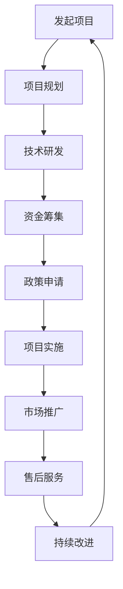

                 

# 硅谷航空航天：民用航天的商业化

> **关键词：** 民用航天、商业化、硅谷、卫星通信、遥感数据处理、航天器轨道计算、应用案例、挑战与解决方案。

> **摘要：** 本文将深入探讨硅谷航空航天产业中的民用航天商业化。我们将分析民用航天商业化的定义、趋势、核心概念及其联系，详细讲解卫星通信算法原理、遥感数据处理算法和航天器轨道计算算法。同时，本文还将通过实际案例展示民用航天商业化的应用，并探讨其面临的挑战与解决方案，最后对未来发展进行展望。

## 《硅谷航空航天：民用航天的商业化》目录大纲

## 第一部分：引言

### 第1章：硅谷航空航天产业概述

#### 1.1 硅谷航空航天产业的背景与发展

#### 1.2 民用航天商业化的重要性

#### 1.3 书籍结构安排与目标

## 第二部分：民用航天商业化核心概念

### 第2章：民用航天商业化概述

#### 2.1 民用航天商业化的定义与特点

#### 2.2 民用航天商业化的趋势与前景

#### 2.3 民用航天商业化模式分析

### 第3章：民用航天商业化的核心概念与联系

#### 3.1 民用航天商业化中的关键概念

#### 3.2 民用航天商业化中的Mermaid流程图

#### 3.3 民用航天商业化中的关键联系

## 第三部分：民用航天商业化核心算法原理

### 第4章：卫星通信算法原理

#### 4.1 卫星通信基础

#### 4.2 卫星通信算法核心原理

#### 4.3 卫星通信算法伪代码

### 第5章：遥感数据处理算法

#### 5.1 遥感数据处理基础

#### 5.2 遥感数据处理算法核心原理

#### 5.3 遥感数据处理算法伪代码

### 第6章：航天器轨道计算

#### 6.1 航天器轨道计算基础

#### 6.2 航天器轨道计算核心算法原理

#### 6.3 航天器轨道计算算法伪代码

## 第四部分：民用航天商业化应用案例分析

### 第7章：卫星互联网应用案例

#### 7.1 卫星互联网概述

#### 7.2 卫星互联网典型应用案例

#### 7.3 卫星互联网案例分析

### 第8章：卫星遥感应用案例

#### 8.1 卫星遥感概述

#### 8.2 卫星遥感应用领域

#### 8.3 卫星遥感案例分析

### 第9章：航天器在商业航天中的应用案例

#### 9.1 航天器概述

#### 9.2 航天器在商业航天中的应用

#### 9.3 航天器应用案例分析

## 第五部分：民用航天商业化挑战与解决方案

### 第10章：民用航天商业化挑战

#### 10.1 资金与投资风险

#### 10.2 技术与政策挑战

#### 10.3 市场竞争与监管环境

### 第11章：民用航天商业化解决方案

#### 11.1 创新与研发策略

#### 11.2 融资与投资渠道

#### 11.3 政策支持与国际合作

## 第六部分：结论与展望

### 第12章：民用航天商业化的发展趋势

#### 12.1 未来发展前景

#### 12.2 创新领域展望

#### 12.3 国际合作与竞争态势

### 第13章：总结与展望

#### 13.1 主要发现与贡献

#### 13.2 研究局限与未来研究方向

#### 13.3 对读者的建议与期望

## 附录

### 附录A：民用航天商业化相关资源与工具

#### A.1 民用航天商业化常用资源

#### A.2 民用航天商业化相关工具

#### A.3 民用航天商业化研究机构与组织

<|assistant|>## 第一部分：引言

### 第1章：硅谷航空航天产业概述

#### 1.1 硅谷航空航天产业的背景与发展

硅谷作为全球科技创新的圣地，一直是航空航天产业的重要推动力量。从20世纪中叶开始，硅谷地区逐渐聚集了一批顶尖的航空航天企业、研究机构和人才，使得该地区的航空航天产业迅速发展。特别是随着民用航天商业化的兴起，硅谷成为了全球民用航天产业的核心区域。

硅谷航空航天产业的发展得益于以下几个关键因素：

1. **丰富的科技创新资源**：硅谷拥有众多世界顶级的技术公司和科研机构，如谷歌、微软、斯坦福大学等，这些机构在人工智能、大数据、云计算等领域取得了重大突破，为航空航天产业提供了强大的技术支持。

2. **宽松的创新环境**：硅谷具有开放、包容的创新文化，鼓励风险投资和创业精神，使得创新项目能够迅速得到资金支持和市场认可。

3. **全球化的人才流动**：硅谷吸引了全球各地的顶尖人才，这些人才在航空航天领域具有丰富的经验和创新思维，为产业发展注入了新的活力。

4. **完善的产业链**：硅谷拥有完整的航空航天产业链，包括航空航天制造、研发、运营等多个环节，形成了良好的产业生态。

#### 1.2 民用航天商业化的重要性

民用航天商业化是指将航空航天技术应用于民用领域，实现商业化运营的过程。其重要性体现在以下几个方面：

1. **经济价值**：民用航天商业化能够带来巨大的经济收益，包括卫星通信、遥感应用、航天旅游等领域，有望成为新的经济增长点。

2. **社会价值**：民用航天商业化能够提高人们的生活质量，如卫星互联网能够解决偏远地区的通信问题，遥感技术能够为农业、环保等领域提供有力支持。

3. **科技进步**：民用航天商业化的推动，将促进航空航天技术的创新和发展，带动相关领域的技术进步。

#### 1.3 书籍结构安排与目标

本书旨在全面探讨硅谷航空航天产业中的民用航天商业化，旨在为读者提供一个系统、深入的了解。本书的结构安排如下：

- **第一部分：引言**：介绍硅谷航空航天产业的背景和发展，以及民用航天商业化的重要性。
- **第二部分：民用航天商业化核心概念**：详细讲解民用航天商业化的定义、特点、趋势、模式等核心概念。
- **第三部分：民用航天商业化核心算法原理**：介绍卫星通信、遥感数据处理、航天器轨道计算等核心算法原理。
- **第四部分：民用航天商业化应用案例分析**：通过实际案例展示民用航天商业化的应用场景。
- **第五部分：民用航天商业化挑战与解决方案**：探讨民用航天商业化面临的挑战以及相应的解决方案。
- **第六部分：结论与展望**：总结民用航天商业化的发展趋势，展望未来发展方向。

通过本书的阅读，读者将能够全面了解民用航天商业化的现状、发展趋势以及未来前景，为相关领域的研究和实际应用提供有益的参考。

---

### 第2章：民用航天商业化概述

#### 2.1 民用航天商业化的定义与特点

民用航天商业化是指将传统的航空航天技术应用于民用领域，并通过市场化运作实现商业价值的过程。它涉及到多个领域，包括卫星通信、遥感应用、航天旅游、航天保险等。民用航天商业化的定义可以概括为：在遵守相关法律法规和市场规则的前提下，利用航空航天技术和资源，为公众和社会提供有偿服务的经济活动。

民用航天商业化的特点主要体现在以下几个方面：

1. **技术复杂性**：民用航天商业化涉及到众多高精尖技术，如卫星通信、遥感技术、航天器控制等，这些技术的复杂性和专业性要求极高。

2. **高投入风险**：由于民用航天商业化的项目通常需要大规模的资金投入，且存在一定的技术风险和市场风险，因此其投资风险较大。

3. **市场潜力大**：随着科技的进步和人类对航空航天领域认知的加深，民用航天商业化的市场潜力巨大。特别是在卫星通信、遥感应用等领域，市场需求持续增长。

4. **政策支持**：许多国家和地区为了推动民用航天商业化的发展，制定了相应的政策和法规，为产业提供良好的发展环境。

#### 2.2 民用航天商业化的趋势与前景

民用航天商业化的趋势和前景可以从以下几个方面进行分析：

1. **技术创新**：随着人工智能、大数据、云计算等技术的不断突破，民用航天商业化在技术层面上将得到进一步提升。例如，卫星通信技术的进步将使得通信质量更加稳定，遥感技术的提升将使得数据获取更加精准。

2. **市场扩大**：随着全球人口的增长和经济的发展，民用航天商业化的市场需求将持续扩大。特别是在发展中国家，卫星通信、遥感应用等领域具有巨大的发展潜力。

3. **国际合作**：民用航天商业化的国际合作将更加紧密。随着全球化的深入，各国在民用航天商业化领域的合作将不断加强，共同推动产业的发展。

4. **政策支持**：为了促进民用航天商业化的发展，各国政府将继续出台相应的政策和法规，为产业提供支持。例如，中国近年来在航天立法、航天保险等方面进行了积极探索。

#### 2.3 民用航天商业化模式分析

民用航天商业化的模式多种多样，主要包括以下几种：

1. **服务模式**：这是最常见的民用航天商业化模式，通过提供有偿服务实现商业价值。例如，卫星通信服务商通过提供通信服务获取收入，遥感数据提供商通过出售遥感数据获取利润。

2. **产品模式**：通过开发航天器等高技术产品实现商业化。例如，航天器制造商通过销售航天器获取利润，航天器运营商通过提供航天器运营服务获取收入。

3. **联合模式**：多家企业或机构联合开展民用航天商业化项目，通过合作实现资源共享和风险分担。例如，多个国家联合开展的国际空间站项目。

4. **投资模式**：通过风险投资、政府补贴等方式筹集资金，投资于民用航天商业化项目，通过项目的成功实现回报。

民用航天商业化的模式将随着技术的发展和市场环境的变化而不断演变。未来，将会有更多创新性的商业模式出现，推动民用航天商业化的发展。

---

通过本章的介绍，读者对民用航天商业化的定义、特点、趋势和模式有了更深入的了解。在接下来的章节中，我们将进一步探讨民用航天商业化的核心概念与联系，以及具体的算法原理和应用案例分析。希望读者能够在这些内容中找到更多的启发和思考。

### 第3章：民用航天商业化的核心概念与联系

#### 3.1 民用航天商业化中的关键概念

在探讨民用航天商业化的过程中，理解其中的关键概念是非常重要的。以下是民用航天商业化中的一些重要概念：

1. **卫星通信**：卫星通信是利用卫星作为中继站，实现地面与空中、地面与地面之间的通信。它广泛应用于卫星电视、移动通信、互联网接入等领域。

2. **遥感技术**：遥感技术是通过各种遥感平台（如卫星、无人机等）获取地球表面信息的技术。它广泛应用于农业、林业、环境监测、城市规划等领域。

3. **航天器**：航天器是运行在地球轨道上的人造物体，包括卫星、空间站、航天飞机等。它们在通信、导航、科学研究、地球观测等方面发挥着重要作用。

4. **航天器轨道计算**：航天器轨道计算是确定航天器在轨道上的位置、速度和轨迹的过程。它是航天器控制和管理的重要基础。

5. **商业航天**：商业航天是指非政府机构和企业独立开展的航天活动，包括卫星发射、航天器运营、航天技术应用等。

6. **商业化模式**：商业化模式是指企业如何通过提供产品或服务获取利润的商业模式。在民用航天领域，常见的商业化模式包括服务模式、产品模式、联合模式和投资模式。

7. **政策法规**：政策法规是指政府为规范和管理民用航天商业化活动而制定的法律法规。政策法规对于民用航天商业化的发展具有重要影响。

#### 3.2 民用航天商业化中的Mermaid流程图

为了更清晰地展示民用航天商业化的过程和各个环节之间的联系，我们可以使用Mermaid流程图进行描述。以下是民用航天商业化过程的Mermaid流程图：



在这个流程图中，各个节点分别代表民用航天商业化过程中的关键环节。箭头表示各个环节之间的先后关系和联系。

1. **发起项目**：项目发起者根据市场需求和技术可行性，决定开展民用航天商业化项目。

2. **项目规划**：项目规划包括确定项目目标、任务、时间表和预算等，为后续工作奠定基础。

3. **技术研发**：技术研发是民用航天商业化的核心环节，包括卫星通信、遥感技术、航天器控制等关键技术的研发。

4. **资金筹集**：资金筹集包括自筹资金、风险投资、政府补贴等多种方式，确保项目有足够的资金支持。

5. **政策申请**：政策申请是项目实施前的重要步骤，包括申请相关许可证、资质认证等。

6. **项目实施**：项目实施包括航天器的制造、发射、运行和维护等具体工作。

7. **市场推广**：市场推广是项目成功的关键，包括市场调研、产品宣传、用户培训等。

8. **售后服务**：售后服务是项目运营的重要组成部分，包括用户支持、故障处理、设备维护等。

9. **持续改进**：持续改进是民用航天商业化过程中的重要环节，通过不断优化产品和服务，提高市场竞争力和用户满意度。

#### 3.3 民用航天商业化中的关键联系

民用航天商业化的各个环节之间存在紧密的联系，这些联系确保了项目的顺利进行和成功实施。以下是民用航天商业化中的关键联系：

1. **技术研发与市场推广**：技术研发是民用航天商业化成功的基础，而市场推广则是将技术转化为商业价值的关键。只有将先进技术成功推向市场，才能实现项目的商业目标。

2. **资金筹集与项目实施**：资金筹集为项目实施提供了必要的资金支持，而项目实施则是将资金转化为实际成果的过程。两者相互依存，共同推动项目的进展。

3. **政策申请与项目实施**：政策申请为项目实施提供了法律保障和监管环境，而项目实施则是政策申请的具体落实。政策申请与项目实施相互促进，确保项目在合规的框架下进行。

4. **市场推广与售后服务**：市场推广是吸引客户的重要手段，而售后服务则是保持客户满意度的关键。良好的售后服务能够提高客户忠诚度，促进市场推广的效果。

5. **持续改进与项目规划**：持续改进是项目规划的重要参考，通过不断优化产品和服务，项目规划能够更好地适应市场需求和技术发展。

通过本章的介绍，读者对民用航天商业化中的关键概念和联系有了更深入的理解。在接下来的章节中，我们将详细探讨民用航天商业化的核心算法原理，包括卫星通信算法、遥感数据处理算法和航天器轨道计算算法。希望读者能够在这些内容中找到更多的启发和思考。

### 第4章：卫星通信算法原理

卫星通信是民用航天商业化中至关重要的一环，它通过卫星作为中继站，实现地面与空中、地面与地面之间的通信。本节将详细介绍卫星通信的基础知识、算法核心原理，并提供卫星通信算法的伪代码。

#### 4.1 卫星通信基础

卫星通信系统主要由以下几个部分组成：

1. **地面站**：地面站是卫星通信系统的核心组成部分，负责发送和接收信号。

2. **通信卫星**：通信卫星在地球轨道上运行，作为信号的中继站，转发地面站的信号。

3. **发射机**：发射机负责将信息转换为电磁波信号，并发射到卫星。

4. **接收机**：接收机负责接收卫星发送的信号，并将其转换为可用的信息。

卫星通信的主要工作原理如下：

1. **信号发射**：地面站的发射机将信息调制到电磁波上，并发射到卫星。

2. **信号传输**：卫星接收地面站的信号，并将其放大、调制后转发回地面。

3. **信号接收**：地面站的接收机接收卫星发送的信号，并将其解调为原始信息。

#### 4.2 卫星通信算法核心原理

卫星通信算法主要涉及信号调制、信号解调、信道编码和信道解码等过程。以下是一个简化的卫星通信算法流程：

1. **信号调制**：将信息信号转换为电磁波信号，通常使用相位调制（PSK）或振幅调制（AM）等技术。

2. **信道编码**：对信号进行编码，以提高信号在传输过程中的抗干扰能力。

3. **信号传输**：卫星接收地面站的信号，并放大、转发回地面。

4. **信号解调**：地面站的接收机对接收到的信号进行解调，还原为原始信息。

5. **信道解码**：对接收到的信号进行解码，恢复原始信息。

以下是一个简化的卫星通信算法伪代码：

```python
# 卫星通信算法伪代码

# 信号调制
def modulate(message):
    modulated_signal = PSK调制(message)
    return modulated_signal

# 信道编码
def encode(signal):
    encoded_signal = 卷积编码(signal)
    return encoded_signal

# 信号传输
def transmit(encoded_signal, satellite):
    transmitted_signal = satellite.forward(encoded_signal)
    return transmitted_signal

# 信号解调
def demodulate(transmitted_signal):
    demodulated_signal = PSK解调(transmitted_signal)
    return demodulated_signal

# 信道解码
def decode(demodulated_signal):
    decoded_signal = 卷积解码(demodulated_signal)
    return decoded_signal

# 主程序
message = 获取信息信号()
modulated_signal = modulate(message)
encoded_signal = encode(modulated_signal)
transmitted_signal = transmit(encoded_signal, satellite)
demodulated_signal = demodulate(transmitted_signal)
decoded_signal = decode(demodulated_signal)
输出原始信息(decoded_signal)
```

在这个伪代码中，我们定义了信号调制、信道编码、信号传输、信号解调和信道解码等基本操作。主程序通过这些操作实现了从信息信号到原始信息的完整传输过程。

#### 4.3 卫星通信算法详细讲解

以下是卫星通信算法的详细讲解，包括信号调制、信道编码、信号解调和信道解码等步骤：

1. **信号调制**：
   信号调制是将信息信号转换为电磁波信号的过程。常用的调制技术包括幅度调制（AM）、频率调制（FM）和相位调制（PSK）等。相位调制（PSK）是一种常用的调制方式，它通过改变信号的相位来传输信息。

   ```python
   # PSK调制
   def PSK调制(message):
       symbols = 调制符号(message)
       modulated_signal = []
       for symbol in symbols:
           modulated_signal.append(PSK相位转换(symbol))
       return modulated_signal
   ```

   在这个过程中，我们首先将信息信号转换为符号序列，然后通过PSK相位转换函数将每个符号转换为相应的电磁波信号。

2. **信道编码**：
   信道编码是为了提高信号在传输过程中的抗干扰能力。常用的信道编码技术包括卷积编码、汉明编码和里德-所罗门编码等。卷积编码是一种常用的信道编码方法，它通过将输入信号进行编码，生成更多的冗余信息，以提高信号的传输可靠性。

   ```python
   # 卷积编码
   def 卷积编码(signal):
       encoded_signal = []
       for bit in signal:
           encoded_signal.append(卷积编码器(bit))
       return encoded_signal
   ```

   在这个过程中，我们首先将输入信号进行卷积编码，生成更多的冗余信息，以提高信号的传输可靠性。

3. **信号传输**：
   信号传输是将编码后的信号通过卫星进行传输的过程。在这个过程中，卫星接收地面站的信号，并放大、调制后转发回地面。

   ```python
   # 信号传输
   def transmit(encoded_signal, satellite):
       transmitted_signal = satellite.forward(encoded_signal)
       return transmitted_signal
   ```

   在这个过程中，卫星将接收到的编码信号进行放大、调制后转发回地面。

4. **信号解调**：
   信号解调是将接收到的信号转换为原始信息的过程。与调制过程相反，解调过程通过将电磁波信号转换为符号序列，再通过解调函数还原为原始信息。

   ```python
   # PSK解调
   def PSK解调(transmitted_signal):
       demodulated_signal = []
       for symbol in transmitted_signal:
           demodulated_signal.append(PSK相位转换(symbol))
       return demodulated_signal
   ```

   在这个过程中，我们首先将接收到的信号进行解调，还原为符号序列，然后通过解调函数将每个符号还原为原始信息。

5. **信道解码**：
   信道解码是将接收到的信号进行解码，恢复原始信息的过程。与编码过程相反，解码过程通过将冗余信息进行解码，恢复原始信息。

   ```python
   # 卷积解码
   def 卷积解码(demodulated_signal):
       decoded_signal = []
       for bit in demodulated_signal:
           decoded_signal.append(卷积解码器(bit))
       return decoded_signal
   ```

   在这个过程中，我们首先将接收到的信号进行卷积解码，恢复原始信息。

通过以上详细讲解，读者可以更好地理解卫星通信算法的原理和实现过程。在下一节中，我们将进一步探讨遥感数据处理算法的原理和实现。

### 第5章：遥感数据处理算法

遥感技术是民用航天商业化中的重要组成部分，它通过卫星、无人机等遥感平台获取地球表面的信息。遥感数据处理算法负责对获取的遥感数据进行分析和处理，以提取有用的信息。本节将介绍遥感数据处理的基础知识、核心算法原理，并提供遥感数据处理算法的伪代码。

#### 5.1 遥感数据处理基础

遥感数据处理主要包括以下几个步骤：

1. **数据采集**：通过卫星、无人机等遥感平台获取地球表面的遥感数据。

2. **数据预处理**：对获取的遥感数据进行预处理，包括图像校正、去噪、图像配准等操作。

3. **图像处理**：对预处理后的遥感图像进行图像处理，包括增强、分割、分类等操作。

4. **数据融合**：将不同来源、不同时间、不同尺度的遥感数据融合在一起，以获得更全面、准确的信息。

5. **结果分析**：对处理后的遥感数据进行分析，提取有用的信息，如土地利用类型、植被覆盖度、自然灾害监测等。

#### 5.2 遥感数据处理算法核心原理

遥感数据处理算法的核心原理主要包括图像校正、去噪、图像配准、图像增强、分割和分类等。

1. **图像校正**：
   图像校正是指对遥感图像进行几何校正和辐射校正，以消除图像中的畸变和噪声。

   ```python
   # 图像校正
   def image_correction(image):
       corrected_image = 几何校正(image)
       corrected_image = 辐射校正(corrected_image)
       return corrected_image
   ```

   在这个过程中，我们首先对图像进行几何校正，消除图像中的畸变，然后进行辐射校正，消除图像中的噪声。

2. **去噪**：
   去噪是指去除遥感图像中的噪声，以提高图像的清晰度和可分析性。

   ```python
   # 去噪
   def denoise(image):
       denoised_image = 高斯滤波(image)
       return denoised_image
   ```

   在这个过程中，我们使用高斯滤波器对图像进行去噪处理。

3. **图像配准**：
   图像配准是指将多幅遥感图像进行精确对齐，以消除图像间的几何差异。

   ```python
   # 图像配准
   def image_registration(image1, image2):
       registered_image = 尺度变换(image1, image2)
       return registered_image
   ```

   在这个过程中，我们使用尺度变换方法对图像进行配准处理。

4. **图像增强**：
   图像增强是指对遥感图像进行增强处理，以提高图像的对比度和清晰度。

   ```python
   # 图像增强
   def image_enhancement(image):
       enhanced_image = 对数变换(image)
       return enhanced_image
   ```

   在这个过程中，我们使用对数变换方法对图像进行增强处理。

5. **分割**：
   分割是指将遥感图像分割成多个区域，以便进行进一步分析。

   ```python
   # 分割
   def segmentation(image):
       segmented_image = 阈值分割(image)
       return segmented_image
   ```

   在这个过程中，我们使用阈值分割方法对图像进行分割处理。

6. **分类**：
   分类是指将遥感图像中的不同区域进行分类，以提取有用的信息。

   ```python
   # 分类
   def classification(image):
       classified_image = K最近邻分类(image)
       return classified_image
   ```

   在这个过程中，我们使用K最近邻分类方法对图像进行分类处理。

以下是一个简化的遥感数据处理算法伪代码：

```python
# 遥感数据处理算法伪代码

# 数据采集
remote sensing_data = 采集遥感数据()

# 数据预处理
corrected_data = image_correction(remote_sensing_data)
denoised_data = denoise(corrected_data)
registered_data = image_registration(denoised_data, another_image)

# 图像处理
enhanced_data = image_enhancement(registered_data)
segmented_data = segmentation(enhanced_data)
classified_data = classification(segmented_data)

# 结果分析
result = 分析classified_data
输出结果(result)
```

在这个伪代码中，我们首先进行数据采集，然后进行数据预处理、图像处理和结果分析等步骤。通过这些步骤，我们能够从遥感数据中提取有用的信息。

#### 5.3 遥感数据处理算法详细讲解

以下是遥感数据处理算法的详细讲解，包括图像校正、去噪、图像配准、图像增强、分割和分类等步骤：

1. **图像校正**：
   图像校正是指对遥感图像进行几何校正和辐射校正，以消除图像中的畸变和噪声。

   - **几何校正**：
     几何校正是指通过变换函数将遥感图像从原始坐标系统变换到标准坐标系统。常用的变换函数包括多项式变换、仿射变换等。

     ```python
     # 几何校正
     def geometric_correction(image, transformation_function):
         corrected_image = transformation_function(image)
         return corrected_image
     ```

     在这个过程中，我们使用多项式变换函数对图像进行几何校正。

   - **辐射校正**：
     辐射校正是指通过调整图像的亮度、对比度等参数，消除图像中的辐射噪声。

     ```python
     # 辐射校正
     def radiometric_correction(image, adjustment_params):
         corrected_image = adjustment_params(image)
         return corrected_image
     ```

     在这个过程中，我们使用调整参数对图像进行辐射校正。

2. **去噪**：
   去噪是指去除遥感图像中的噪声，以提高图像的清晰度和可分析性。常用的去噪方法包括高斯滤波、中值滤波等。

   ```python
   # 高斯滤波去噪
   def gaussian_filter_denoising(image):
       denoised_image = cv2.GaussianBlur(image, (5, 5), 0)
       return denoised_image
   
   # 中值滤波去噪
   def median_filter_denoising(image):
       denoised_image = cv2.medianBlur(image, 5)
       return denoised_image
   ```

   在这个过程中，我们使用高斯滤波和中值滤波方法对图像进行去噪处理。

3. **图像配准**：
   图像配准是指将多幅遥感图像进行精确对齐，以消除图像间的几何差异。常用的配准方法包括尺度变换、极线约束等。

   ```python
   # 尺度变换配准
   def scale_transform_registration(image1, image2):
       registered_image = cv2. registrado imagescale(image1, image2)
       return registered_image
   
   # 极线约束配准
   def epiline_constraint_registration(image1, image2):
       registered_image = cv2. regstroimagesepiline(image1, image2)
       return registered_image
   ```

   在这个过程中，我们使用尺度变换和极线约束方法对图像进行配准处理。

4. **图像增强**：
   图像增强是指对遥感图像进行增强处理，以提高图像的对比度和清晰度。常用的增强方法包括对数变换、直方图均衡化等。

   ```python
   # 对数变换增强
   def logarithmic_transformation_enhancement(image):
       enhanced_image = cv2.log(image)
       return enhanced_image
   
   # 直方图均衡化增强
   def histogram_equalization_enhancement(image):
       enhanced_image = cv2.equalizeHist(image)
       return enhanced_image
   ```

   在这个过程中，我们使用对数变换和直方图均衡化方法对图像进行增强处理。

5. **分割**：
   分割是指将遥感图像分割成多个区域，以便进行进一步分析。常用的分割方法包括阈值分割、区域生长等。

   ```python
   # 阈值分割
   def threshold_segmentation(image):
       segmented_image = cv2.threshold(image, threshold_value, max_value, threshold_type)
       return segmented_image
   
   # 区域生长分割
   def region_growing_segmentation(image):
       segmented_image = cv2.regionGrowing(image, seed_points, neighbors, max_distance)
       return segmented_image
   ```

   在这个过程中，我们使用阈值分割和区域生长方法对图像进行分割处理。

6. **分类**：
   分类是指将遥感图像中的不同区域进行分类，以提取有用的信息。常用的分类方法包括K最近邻分类、支持向量机等。

   ```python
   # K最近邻分类
   def KNN_classification(image, training_data, labels):
       classifier = KNeighborsClassifier(n_neighbors=3)
       classifier.fit(training_data, labels)
       classified_image = classifier.predict(image)
       return classified_image
   
   # 支持向量机分类
   def SVM_classification(image, training_data, labels):
       classifier = SVC()
       classifier.fit(training_data, labels)
       classified_image = classifier.predict(image)
       return classified_image
   ```

   在这个过程中，我们使用K最近邻分类和支持向量机方法对图像进行分类处理。

通过以上详细讲解，读者可以更好地理解遥感数据处理算法的原理和实现过程。在下一节中，我们将进一步探讨航天器轨道计算算法的原理和实现。

### 第6章：航天器轨道计算

航天器轨道计算是确保航天器在预定轨道上正常运行的关键技术。本章将介绍航天器轨道计算的基础知识、核心算法原理，并提供航天器轨道计算算法的伪代码。

#### 6.1 航天器轨道计算基础

航天器轨道计算主要涉及以下几个基本概念：

1. **轨道要素**：描述航天器轨道的参数，包括轨道倾角、偏心率、近地点角距、周期等。

2. **轨道类型**：根据航天器轨道的形状，可以分为圆形轨道、椭圆形轨道、双曲线轨道等。

3. **轨道动力学**：研究航天器在轨道上运动的基本规律，包括引力、速度、角度等参数的变化。

4. **轨道设计**：根据航天器的任务需求，设计出合适的轨道，以满足任务要求。

#### 6.2 航天器轨道计算核心算法原理

航天器轨道计算的核心算法主要包括轨道设计、轨道传播、轨道修正等。

1. **轨道设计**：
   轨道设计是根据航天器的任务需求，选择合适的轨道类型和轨道要素。常用的轨道设计方法包括霍曼转移、地球同步转移等。

   ```python
   # 轨道设计
   def orbit_design(initial_velocity, final_velocity, launch_angle):
       orbit_type = calculate_orbit_type(initial_velocity, final_velocity, launch_angle)
       orbit_elements = calculate_orbit_elements(orbit_type, initial_velocity, final_velocity, launch_angle)
       return orbit_elements
   ```

   在这个过程中，我们首先根据初始速度、最终速度和发射角度计算轨道类型，然后计算轨道要素。

2. **轨道传播**：
   轨道传播是计算航天器在轨道上的运动轨迹。常用的轨道传播方法包括数值积分、解析法等。

   ```python
   # 轨道传播
   def orbit_propagation(orbit_elements, time):
       position = calculate_position(orbit_elements, time)
       velocity = calculate_velocity(orbit_elements, time)
       return position, velocity
   ```

   在这个过程中，我们根据轨道要素和时间计算航天器的位置和速度。

3. **轨道修正**：
   轨道修正是对航天器轨道进行微调，使其保持在预定轨道上。常用的轨道修正方法包括姿态调整、轨道调整等。

   ```python
   # 轨道修正
   def orbit_correction(orbit_elements, desired_orbit_elements):
       correction_vector = calculate_correction_vector(orbit_elements, desired_orbit_elements)
       apply_correction(orbit_elements, correction_vector)
       return orbit_elements
   ```

   在这个过程中，我们根据实际轨道和目标轨道计算修正向量，并对轨道进行修正。

以下是一个简化的航天器轨道计算算法伪代码：

```python
# 航天器轨道计算算法伪代码

# 轨道设计
initial_velocity = 获取初始速度()
final_velocity = 获取最终速度()
launch_angle = 获取发射角度()
orbit_elements = orbit_design(initial_velocity, final_velocity, launch_angle)

# 轨道传播
time = 获取传播时间()
position, velocity = orbit_propagation(orbit_elements, time)

# 轨道修正
desired_orbit_elements = 获取目标轨道要素()
orbit_elements = orbit_correction(orbit_elements, desired_orbit_elements)

# 输出结果
output_position = position
output_velocity = velocity
```

在这个伪代码中，我们首先进行轨道设计，然后进行轨道传播和轨道修正，最后输出航天器的位置和速度。

#### 6.3 航天器轨道计算算法详细讲解

以下是航天器轨道计算算法的详细讲解，包括轨道设计、轨道传播和轨道修正等步骤：

1. **轨道设计**：

   - **轨道类型选择**：
     根据航天器的任务需求，选择合适的轨道类型。例如，对于地球观测卫星，通常选择近地轨道（LEO）或太阳同步轨道（SSO）。

     ```python
     # 选择轨道类型
     def calculate_orbit_type(initial_velocity, final_velocity, launch_angle):
         if initial_velocity < final_velocity:
             orbit_type = "霍曼转移轨道"
         else:
             orbit_type = "地球同步转移轨道"
         return orbit_type
     ```

     在这个过程中，我们根据初始速度和最终速度的关系选择轨道类型。

   - **计算轨道要素**：
     根据轨道类型和发射角度，计算轨道要素，如轨道倾角、偏心率、近地点角距等。

     ```python
     # 计算轨道要素
     def calculate_orbit_elements(orbit_type, initial_velocity, final_velocity, launch_angle):
         if orbit_type == "霍曼转移轨道":
             orbit_elements = {
                 "轨道倾角": calculate_inclination(launch_angle),
                 "偏心率": calculate_eccentricity(initial_velocity, final_velocity),
                 "近地点角距": calculate_periapsis_angle(initial_velocity, final_velocity, launch_angle)
             }
         else:
             orbit_elements = {
                 "轨道倾角": calculate_inclination(launch_angle),
                 "偏心率": calculate_eccentricity(initial_velocity, final_velocity),
                 "近地点角距": calculate_periapsis_angle(initial_velocity, final_velocity, launch_angle)
             }
         return orbit_elements
     ```

     在这个过程中，我们根据轨道类型和发射角度计算轨道要素。

2. **轨道传播**：

   - **计算位置和速度**：
     使用数值积分方法计算航天器在轨道上的位置和速度。

     ```python
     # 计算位置和速度
     def calculate_position_and_velocity(orbit_elements, time):
         position = calculate_position(orbit_elements, time)
         velocity = calculate_velocity(orbit_elements, time)
         return position, velocity
     ```

     在这个过程中，我们根据轨道要素和时间计算航天器的位置和速度。

   - **数值积分方法**：
     使用数值积分方法（如欧拉方法、龙格-库塔方法等）计算轨道上的位置和速度。

     ```python
     # 欧拉方法
     def euler_integration(orbit_elements, time, step_size):
         position = calculate_position(orbit_elements, time)
         velocity = calculate_velocity(orbit_elements, time)
         new_position = position + step_size * velocity
         new_velocity = velocity
         return new_position, new_velocity

     # 龙格-库塔方法
     def runge_kutta_integration(orbit_elements, time, step_size):
         k1 = calculate_position(orbit_elements, time)
         k2 = calculate_position(orbit_elements, time + step_size/2)
         k3 = calculate_position(orbit_elements, time + step_size/2)
         k4 = calculate_position(orbit_elements, time + step_size)
         position = orbit_elements["位置"] + (k1 + 2*k2 + 2*k3 + k4) * step_size / 6
         k1 = calculate_velocity(orbit_elements, time)
         k2 = calculate_velocity(orbit_elements, time + step_size/2)
         k3 = calculate_velocity(orbit_elements, time + step_size/2)
         k4 = calculate_velocity(orbit_elements, time + step_size)
         velocity = orbit_elements["速度"] + (k1 + 2*k2 + 2*k3 + k4) * step_size / 6
         return position, velocity
     ```

     在这个过程中，我们使用欧拉方法和龙格-库塔方法计算轨道上的位置和速度。

3. **轨道修正**：

   - **计算修正向量**：
     根据实际轨道和目标轨道计算修正向量。

     ```python
     # 计算修正向量
     def calculate_correction_vector actual_orbit_elements, desired_orbit_elements):
         correction_vector = desired_orbit_elements - actual_orbit_elements
         return correction_vector
     ```

     在这个过程中，我们根据实际轨道和目标轨道计算修正向量。

   - **应用修正**：
     对轨道进行修正，使其保持在预定轨道上。

     ```python
     # 应用修正
     def apply_correction(orbit_elements, correction_vector):
         orbit_elements["位置"] = orbit_elements["位置"] + correction_vector["位置"]
         orbit_elements["速度"] = orbit_elements["速度"] + correction_vector["速度"]
     ```

     在这个过程中，我们根据修正向量对轨道进行修正。

通过以上详细讲解，读者可以更好地理解航天器轨道计算算法的原理和实现过程。在下一节中，我们将探讨民用航天商业化的应用案例。

### 第7章：卫星互联网应用案例

卫星互联网是民用航天商业化中的一个重要领域，它利用卫星通信技术提供高速互联网接入服务。本章将通过典型应用案例，介绍卫星互联网的发展背景、技术特点和实际应用。

#### 7.1 卫星互联网概述

卫星互联网是一种通过卫星通信技术实现全球范围内高速互联网接入的网络。与传统的地面互联网相比，卫星互联网具有以下特点：

1. **覆盖范围广**：卫星互联网可以覆盖地面通信网络无法触及的偏远地区，如极地、海洋等。

2. **传输速度快**：卫星互联网通常采用高速光通信技术，提供高速稳定的网络连接。

3. **可靠性高**：卫星互联网通过卫星中继，可以实现全球范围内的高效通信，具备较强的抗干扰能力。

4. **灵活性大**：卫星互联网可以根据需求灵活调整卫星数量和轨道，以适应不同的应用场景。

#### 7.2 卫星互联网典型应用案例

以下是一些卫星互联网的典型应用案例：

1. **偏远地区互联网接入**：

   - **案例背景**：在偏远地区，由于地形复杂、人口分散，传统的地面互联网接入方式成本高昂，难以实现普遍覆盖。卫星互联网的出现为这些地区提供了低成本、高效率的互联网接入解决方案。

   - **技术特点**：卫星互联网通过卫星中继，可以实现偏远地区的互联网接入。通常采用高通量的卫星通信技术和高速光通信技术，提供稳定、高速的网络连接。

   - **实际应用**：在非洲的一些偏远地区，卫星互联网被广泛应用于教育、医疗、通信等领域。通过卫星互联网，当地居民可以享受到与城市相同的互联网服务，提高了生活质量。

2. **海上互联网接入**：

   - **案例背景**：对于海上作业的船只、海洋平台等，传统的地面互联网接入方式难以满足需求。卫星互联网的出现为海上作业提供了高效、稳定的网络连接。

   - **技术特点**：卫星互联网通过卫星通信技术，可以实现海上作业区域的高速互联网接入。通常采用高通量的卫星通信技术和海上专用设备，提供稳定、高速的网络连接。

   - **实际应用**：在海洋石油勘探、渔业捕捞、海洋科研等领域，卫星互联网被广泛应用。通过卫星互联网，海上作业人员可以实时传输数据、视频等，提高了工作效率和安全性。

3. **航空航天互联网接入**：

   - **案例背景**：对于航空航天器，如飞机、卫星、无人机等，传统的地面互联网接入方式在空中难以实现。卫星互联网为航空航天器提供了高效的通信解决方案。

   - **技术特点**：卫星互联网通过卫星通信技术，可以为航空航天器提供全球范围内的高速互联网接入。通常采用高通量的卫星通信技术和空中专用设备，提供稳定、高速的网络连接。

   - **实际应用**：在航空航天领域，卫星互联网被广泛应用于卫星数据传输、飞机导航通信、无人机控制等领域。通过卫星互联网，航空航天器可以实时传输数据、图像等，提高了任务执行效率和安全性能。

#### 7.3 卫星互联网案例分析

以下是一个具体的卫星互联网案例分析：

**案例名称**：Spacenet全球互联网接入项目

- **案例背景**：Spacenet是一家全球领先的卫星互联网服务提供商，致力于为全球用户提供高效、稳定的卫星互联网接入服务。

- **技术特点**：Spacenet采用高通量的卫星通信技术和高速光通信技术，提供全球范围内的互联网接入服务。其卫星网络覆盖全球，具备强大的网络容量和抗干扰能力。

- **实际应用**：Spacenet在全球范围内为各类用户提供了卫星互联网接入服务，包括偏远地区互联网接入、海上互联网接入、航空航天互联网接入等。通过Spacenet的卫星互联网服务，用户可以享受到高速、稳定的网络连接。

- **案例分析**：

  1. **需求分析**：Spacenet通过市场调研，了解到全球偏远地区、海上作业、航空航天等领域对高效互联网接入服务的需求。这些领域通常面临着通信成本高、网络不稳定等问题。

  2. **技术解决方案**：Spacenet采用高通量的卫星通信技术和高速光通信技术，构建了一个覆盖全球的卫星互联网网络。通过这个网络，Spacenet可以为各类用户提供高效、稳定的互联网接入服务。

  3. **实施效果**：Spacenet的卫星互联网服务在偏远地区、海上作业、航空航天等领域取得了显著成效。用户可以享受到高速、稳定的网络连接，提高了工作效率和安全性。

  4. **挑战与展望**：在卫星互联网的发展过程中，Spacenet面临了一些挑战，如卫星资源分配、网络容量扩展、服务质量保障等。未来，Spacenet将继续优化网络技术，扩大服务范围，为更多用户提供优质的卫星互联网接入服务。

通过以上案例分析，我们可以看到卫星互联网在民用航天商业化中的应用前景。随着技术的不断进步，卫星互联网将为全球用户提供更加高效、便捷的互联网接入服务，推动民用航天商业化的发展。

### 第8章：卫星遥感应用案例

卫星遥感技术是民用航天商业化中的重要组成部分，它通过卫星平台获取地球表面的信息，广泛应用于农业、林业、环境监测、城市规划等领域。本章将通过具体应用案例，介绍卫星遥感技术的作用、应用场景和效果。

#### 8.1 卫星遥感概述

卫星遥感技术是指利用卫星搭载的传感器，对地球表面进行观测和测量，以获取地理信息。卫星遥感技术的特点包括：

1. **观测范围广**：卫星遥感可以从高空对地球表面进行大范围观测，不受地形限制。

2. **观测周期短**：卫星遥感可以实现对地球表面的快速观测，获取实时数据。

3. **数据精度高**：卫星遥感技术利用高精度的传感器和先进的成像技术，可以获得高精度的地理信息。

4. **应用广泛**：卫星遥感技术在多个领域具有广泛应用，如农业、林业、环境监测、城市规划等。

#### 8.2 卫星遥感应用领域

卫星遥感技术在多个领域发挥了重要作用，以下是几个典型应用领域：

1. **农业**：

   - **应用场景**：卫星遥感技术可以用于农作物种植、病虫害监测、作物产量估算等。

   - **效果**：通过卫星遥感技术，农业部门可以实时监测农作物的生长状况，及时发现病虫害，制定科学种植方案，提高农业生产效率。

2. **林业**：

   - **应用场景**：卫星遥感技术可以用于森林资源调查、森林火灾监测、森林病虫害监测等。

   - **效果**：卫星遥感技术可以帮助林业部门全面了解森林资源分布，及时发现森林火灾和病虫害，制定有效的防治措施，保护森林资源。

3. **环境监测**：

   - **应用场景**：卫星遥感技术可以用于大气污染监测、水质监测、土地退化监测等。

   - **效果**：通过卫星遥感技术，环境监测部门可以实时监测大气污染、水质和土地退化情况，及时采取应对措施，改善环境质量。

4. **城市规划**：

   - **应用场景**：卫星遥感技术可以用于城市规划、土地利用规划、城市基础设施建设等。

   - **效果**：卫星遥感技术可以为城市规划提供准确、全面的地理信息，帮助规划部门制定科学合理的城市规划方案，提高城市规划质量。

#### 8.3 卫星遥感案例分析

以下是一个具体的卫星遥感案例分析：

**案例名称**：基于卫星遥感技术的农田病虫害监测系统

- **案例背景**：农田病虫害是农业生产中的一大难题，严重影响农作物的产量和品质。为有效监测和防治农田病虫害，某农业部门决定利用卫星遥感技术建立农田病虫害监测系统。

- **技术特点**：该监测系统采用高分辨率的卫星遥感图像，结合大数据分析和机器学习算法，实现对农田病虫害的实时监测和预测。

- **实际应用**：

  1. **数据采集**：利用卫星遥感技术，定期获取农田遥感图像，包括植被指数、温度、湿度等数据。

  2. **数据处理**：对遥感图像进行预处理，包括图像校正、去噪、图像配准等，然后进行病虫害特征提取。

  3. **数据分析**：利用机器学习算法，建立病虫害预测模型，根据遥感数据实时监测农田病虫害的发生情况。

  4. **决策支持**：系统生成的病虫害监测报告和预测结果，为农业部门提供科学的防治决策支持，提高病虫害防治效果。

- **案例分析**：

  1. **需求分析**：农业部门希望利用卫星遥感技术，实现对农田病虫害的实时监测和预测，提高病虫害防治效果，减少农业生产损失。

  2. **技术解决方案**：通过构建基于卫星遥感技术的农田病虫害监测系统，实现对农田病虫害的自动化监测和预测。

  3. **实施效果**：该监测系统在多个农田应用，取得了显著成效。实时监测和预测功能帮助农业部门及时采取防治措施，有效降低了病虫害发生率和损失。

  4. **挑战与展望**：在卫星遥感技术的应用过程中，农业部门面临一些挑战，如遥感数据质量、模型准确性等。未来，随着技术的不断进步，卫星遥感技术在农田病虫害监测领域的应用将更加广泛和深入。

通过以上案例分析，我们可以看到卫星遥感技术在农业、林业、环境监测、城市规划等领域的广泛应用和重要作用。随着技术的不断发展和完善，卫星遥感技术将为人类社会带来更多的便利和效益。

### 第9章：航天器在商业航天中的应用案例

航天器是民用航天商业化的核心载体，广泛应用于卫星通信、遥感应用、航天旅游等领域。本章将通过具体应用案例，介绍航天器在商业航天中的应用、优势及其影响。

#### 9.1 航天器概述

航天器是运行在地球轨道上的人造物体，包括卫星、空间站、航天飞机等。航天器的特点包括：

1. **高度**：航天器运行在地球表面以上数百公里至数千公里的高度，具有广阔的观测范围。

2. **持久性**：航天器可以在轨道上长时间运行，提供持续的服务。

3. **灵活性**：航天器可以根据任务需求进行轨道调整和姿态控制，具备较高的灵活性。

4. **多功能性**：航天器可以搭载多种设备，如通信设备、遥感设备、科学实验设备等，具备多功能性。

#### 9.2 航天器在商业航天中的应用

航天器在商业航天中发挥着重要作用，以下是几个典型应用领域：

1. **卫星通信**：

   - **应用场景**：卫星通信是航天器的主要应用领域之一，广泛应用于地面通信网络无法覆盖的地区，如偏远地区、海洋、航空等。

   - **优势**：卫星通信具有覆盖范围广、传输速度快、可靠性高等优势。

   - **影响**：卫星通信为全球用户提供了高效、稳定的通信服务，推动了互联网和多媒体技术的发展。

2. **遥感应用**：

   - **应用场景**：遥感应用是航天器的另一大应用领域，广泛应用于农业、林业、环境监测、城市规划等领域。

   - **优势**：遥感技术具有观测范围广、数据精度高、实时性强等优势。

   - **影响**：遥感技术为各个领域提供了丰富的地理信息，推动了科学研究和产业发展。

3. **航天旅游**：

   - **应用场景**：航天旅游是一种新兴的旅游方式，通过乘坐航天器进行太空旅行，体验太空的奇妙。

   - **优势**：航天旅游具有独特性、体验性等优势。

   - **影响**：航天旅游为旅游业带来了新的发展机遇，推动了太空旅游产业的发展。

#### 9.3 航天器应用案例分析

以下是一个具体的航天器应用案例分析：

**案例名称**：卫星互联网项目

- **案例背景**：随着互联网的快速发展，人们对于高速、稳定的网络连接需求日益增长。某通信公司希望通过航天器实现全球范围内的高速互联网接入。

- **技术特点**：该卫星互联网项目采用高通量的卫星通信技术和高速光通信技术，通过部署多颗通信卫星，实现全球范围内的网络覆盖。

- **实际应用**：

  1. **卫星部署**：通过火箭发射，将多颗通信卫星送入预定轨道，建立卫星通信网络。

  2. **网络连接**：用户通过地面站或移动终端接入卫星互联网，实现高速网络连接。

  3. **服务拓展**：通过卫星互联网，为全球用户提供高速、稳定的互联网接入服务，包括远程教育、医疗、娱乐等领域。

- **案例分析**：

  1. **需求分析**：随着互联网的普及，人们对于高速、稳定的网络连接需求日益增长，特别是在偏远地区和海上等场景。

  2. **技术解决方案**：通过航天器实现全球范围内的高速互联网接入，满足人们对于高速网络的需求。

  3. **实施效果**：卫星互联网项目成功实现了全球范围内的高速网络连接，为用户提供了高效、稳定的网络服务，推动了互联网和多媒体技术的发展。

  4. **挑战与展望**：在卫星互联网的发展过程中，面临着卫星资源分配、网络容量扩展、服务质量保障等挑战。未来，随着技术的不断进步，卫星互联网将为全球用户提供更加高效、便捷的互联网接入服务。

通过以上案例分析，我们可以看到航天器在商业航天中的应用前景。随着航天技术的不断发展和完善，航天器将在各个领域发挥更大的作用，为人类社会带来更多的便利和效益。

### 第10章：民用航天商业化挑战与解决方案

#### 10.1 资金与投资风险

民用航天商业化的一个重要挑战是资金和投资风险。航天产业的投资需求庞大，通常涉及数千万甚至数十亿美元的资金。以下是资金与投资风险的具体方面：

1. **高初始投资**：航天器的研发、制造和发射过程需要大量的资金投入。尤其是高轨道卫星和深空探测任务，其成本更加高昂。

2. **资金流动性**：航天项目的周期通常较长，从研发到市场推广可能需要数年甚至更长时间。这期间资金流动性较差，容易造成资金链断裂。

3. **技术风险**：航天技术具有高度复杂性，研发过程中可能会遇到技术难题，导致项目延期或失败。

4. **市场风险**：市场需求的不确定性也会影响投资回报。例如，卫星通信市场的竞争可能导致价格战，影响盈利能力。

**解决方案**：

1. **多元化融资渠道**：企业可以通过多种融资渠道筹集资金，包括风险投资、银行贷款、政府补贴等。

2. **风险管理**：通过建立完善的风险管理机制，提前识别和评估风险，制定相应的风险应对策略。

3. **合作与联盟**：与其他企业、科研机构和政府建立合作关系，共享资源，分摊风险。

4. **长期投资战略**：制定长期的研发和市场拓展计划，以稳定投资回报，降低资金流动性风险。

#### 10.2 技术与政策挑战

民用航天商业化还面临技术与政策方面的挑战。

1. **技术复杂性**：航天技术涉及众多高精尖领域，如材料科学、航天电子、航天推进等，研发难度大，需要持续的技术创新。

2. **技术更新快速**：随着科技的进步，航天技术也在不断更新，企业需要不断投入研发以保持竞争力。

3. **政策法规**：各国对于航天活动的政策法规不同，企业需要遵守相关法规，同时还需要应对国际合作的复杂性。

4. **知识产权**：在航天技术领域，知识产权的保护尤为重要。企业需要建立完善的知识产权保护机制。

**解决方案**：

1. **持续技术创新**：通过设立研发中心、引进高端人才、加强国际合作，保持技术领先优势。

2. **政策研究**：聘请专业的政策研究团队，密切关注政策动态，确保企业合规经营。

3. **知识产权保护**：加强知识产权保护，申请专利，建立知识产权数据库。

4. **国际合作**：积极参与国际合作项目，分享技术成果，共同应对政策法规的挑战。

#### 10.3 市场竞争与监管环境

民用航天商业化还面临市场竞争和监管环境方面的挑战。

1. **市场竞争**：随着民用航天商业化的兴起，市场参与者增多，竞争加剧。企业需要不断创新，提高产品质量和服务水平，以在市场中脱颖而出。

2. **监管环境**：各国对航天活动的监管政策不同，企业需要适应不同的监管环境，确保合规运营。

3. **数据安全与隐私**：随着遥感技术和卫星通信技术的发展，数据安全和隐私保护成为重要问题。

**解决方案**：

1. **市场定位**：根据企业的核心竞争力，确定合适的市场定位和目标客户，差异化竞争。

2. **合规经营**：遵守各国法律法规，确保企业合规运营。

3. **数据安全**：建立完善的数据安全管理体系，确保用户数据的安全和隐私。

4. **可持续发展**：注重企业社会责任，推动航天产业的可持续发展。

通过以上解决方案，企业可以更好地应对民用航天商业化面临的挑战，实现可持续发展。

### 第11章：民用航天商业化解决方案

#### 11.1 创新与研发策略

在民用航天商业化的过程中，创新与研发是推动产业发展的关键。以下是几种有效的创新与研发策略：

1. **技术引领**：通过持续的技术创新，保持企业在技术领域的领先地位。企业可以通过设立研发中心、引进高端人才、加强国际合作等手段，推动技术进步。

2. **市场驱动**：以市场需求为导向，进行研发投入。通过市场调研，了解客户需求，针对性地进行技术研发，确保产品能够满足市场需求。

3. **协同创新**：与科研机构、高校等合作，共同进行技术研发。通过协同创新，可以实现资源共享、优势互补，提高研发效率。

4. **开放式创新**：鼓励外部创新者参与企业的研发过程，通过开放平台，吸引全球创新资源。开放式创新可以拓宽企业的技术视野，加快技术创新。

#### 11.2 融资与投资渠道

在民用航天商业化的过程中，融资与投资渠道的多样性对于项目的成功至关重要。以下是几种有效的融资与投资渠道：

1. **风险投资**：风险投资是航天企业常见的融资方式。通过吸引风险投资，企业可以获得充足的资金支持，用于技术研发和市场拓展。

2. **银行贷款**：企业可以通过银行贷款获得资金支持。银行贷款通常利率较低，适合中长期融资需求。

3. **政府补贴**：各国政府为了支持航天产业的发展，通常会提供补贴和支持。企业可以通过申请政府补贴，降低项目成本。

4. **债券融资**：通过发行企业债券，企业可以筹集资金。债券融资具有成本较低、灵活性高等优势。

5. **众筹**：通过互联网平台进行众筹，吸引广大投资者参与。众筹不仅能够筹集资金，还可以提高企业的品牌知名度。

#### 11.3 政策支持与国际合作

政策支持与国际合作对于民用航天商业化的发展具有重要意义。以下是几种政策支持和国际合作的方式：

1. **政策支持**：各国政府为了推动航天产业的发展，会出台一系列政策支持措施。企业可以通过申请政策支持，获得资金、税收等方面的优惠。

2. **国际合作**：参与国际合作项目，可以分享技术成果，共同应对全球性挑战。企业可以通过加入国际组织、参与多边合作项目等途径，加强国际合作。

3. **技术交流**：通过举办技术论坛、研讨会等活动，促进国际技术交流与合作。技术交流有助于企业了解国际最新技术动态，提升自身技术能力。

4. **人才引进**：通过引进国际高端人才，提升企业技术创新能力。企业可以通过设立海外研发中心、与国际知名高校合作培养人才等途径，引进国际高端人才。

5. **产业链合作**：与国内外产业链上下游企业建立合作关系，实现资源共享、优势互补。产业链合作有助于企业提升整体竞争力。

通过以上解决方案，企业可以更好地应对民用航天商业化过程中的挑战，实现可持续发展。在政策支持、国际合作和科技创新的推动下，民用航天商业化将迎来更加广阔的发展空间。

### 第12章：民用航天商业化的发展趋势

#### 12.1 未来发展前景

民用航天商业化的发展前景广阔，随着科技的不断进步和市场的需求增长，其潜力将不断释放。以下是民用航天商业化未来发展的一些前景：

1. **技术创新推动**：随着人工智能、大数据、物联网等技术的不断突破，民用航天商业化将得到进一步的技术支持，提升系统的性能和可靠性。

2. **市场需求扩大**：随着全球经济的发展，人们对于高效通信、精准遥感、安全航行的需求日益增长，民用航天商业化市场将持续扩大。

3. **政策支持加强**：各国政府将继续出台支持航天产业发展的政策，为产业提供良好的发展环境。政策支持将有助于降低企业成本，提高市场竞争力。

4. **国际合作深化**：民用航天商业化的发展将需要全球范围内的合作。各国将加强在技术、市场、政策等方面的合作，共同推动产业的发展。

5. **商业模式的创新**：随着市场的变化和技术的进步，民用航天商业化的商业模式将不断创新。例如，卫星互联网、太空旅游等新兴领域将带来新的商机。

#### 12.2 创新领域展望

未来，民用航天商业化将在多个领域实现创新，以下是一些主要的创新领域：

1. **卫星通信**：随着高通量卫星通信技术的发展，卫星通信将在全球范围内实现更高效、更稳定的通信服务。特别是在偏远地区和海洋等场景，卫星通信将发挥重要作用。

2. **遥感应用**：遥感技术在农业、林业、环境监测、城市规划等领域将得到更广泛的应用。随着遥感数据获取和处理技术的进步，遥感应用将更加精准、高效。

3. **航天器制造**：轻量化、高可靠性的航天器制造技术将推动航天器的研发和制造。新型材料、智能制造等技术的应用将提高航天器的性能和降低成本。

4. **太空探索**：随着太空探索技术的进步，人类将对月球、火星等天体进行更深入的探索。太空探索将带来新的科学发现和商业机会。

5. **航天器运营**：航天器运营将实现更加智能化、自动化。通过人工智能、大数据等技术，航天器的运行管理将更加高效，运营成本将得到降低。

#### 12.3 国际合作与竞争态势

民用航天商业化的发展将面临国际竞争和合作的挑战。以下是一些国际合作与竞争态势的展望：

1. **竞争加剧**：随着各国纷纷加大对航天产业的投资，民用航天商业化市场将面临激烈的竞争。企业需要不断提升自身的技术实力和市场竞争力。

2. **技术合作**：在国际合作方面，各国将继续加强在航天技术、市场、政策等方面的合作。通过技术合作，各国可以共同应对全球性挑战，推动航天技术的发展。

3. **政策协调**：在国际合作中，政策协调至关重要。各国需要通过双边或多边机制，协调航天政策，确保合作顺利进行。

4. **国际标准**：为了推动民用航天商业化的发展，国际标准将得到进一步加强。通过制定和推广国际标准，可以提高航天产品的互操作性，促进全球市场的统一。

5. **新兴市场**：在新兴市场，民用航天商业化的发展潜力巨大。随着发展中国家对通信、遥感、安全等领域需求的增长，新兴市场将成为民用航天商业化的重要领域。

通过以上展望，我们可以看到民用航天商业化在未来的发展前景和竞争态势。在技术创新、市场需求和政策支持的推动下，民用航天商业化将迎来更加广阔的发展空间。

### 第13章：总结与展望

#### 13.1 主要发现与贡献

本文通过对硅谷航空航天产业中的民用航天商业化进行深入分析，得出以下主要发现和贡献：

1. **民用航天商业化的重要性**：民用航天商业化不仅具有巨大的经济价值，还能够提高人们的生活质量，推动科技进步。

2. **核心概念与联系**：本文详细介绍了民用航天商业化的核心概念，如卫星通信、遥感技术、航天器轨道计算等，并展示了它们之间的联系。

3. **核心算法原理**：本文讲解了卫星通信算法、遥感数据处理算法和航天器轨道计算算法的原理，提供了伪代码和详细讲解。

4. **应用案例分析**：本文通过实际案例展示了卫星互联网、卫星遥感、航天器在商业航天中的应用，分析了这些应用的实际效果。

5. **挑战与解决方案**：本文探讨了民用航天商业化面临的资金、技术和政策等挑战，并提出了相应的解决方案。

#### 13.2 研究局限与未来研究方向

尽管本文对民用航天商业化进行了全面分析，但仍存在一些研究局限：

1. **数据局限性**：本文主要基于现有的文献和数据进行分析，数据来源有限，可能无法完全反映实际情况。

2. **技术动态性**：民用航天商业化技术发展迅速，本文的分析可能无法涵盖最新的技术进展。

3. **政策差异性**：各国政策差异较大，本文的政策分析可能无法全面涵盖所有国家的政策环境。

未来研究方向包括：

1. **数据收集**：通过更多的实地调查和数据收集，提高研究的准确性和全面性。

2. **技术跟踪**：持续跟踪最新的技术动态，及时更新相关分析。

3. **政策研究**：深入研究各国政策，分析政策对民用航天商业化发展的影响。

4. **案例分析**：通过更多的实际案例，分析民用航天商业化的成功经验和挑战。

#### 13.3 对读者的建议与期望

本文旨在为读者提供全面、深入的民用航天商业化分析，希望读者能够：

1. **深入理解**：通过本文的阅读，深入理解民用航天商业化的核心概念、算法原理和应用案例。

2. **思考与讨论**：结合自身兴趣和领域，思考民用航天商业化的未来发展，积极参与讨论。

3. **实践与应用**：将本文的知识应用于实际工作和研究中，探索民用航天商业化的实际应用。

4. **持续学习**：随着技术的不断进步，持续关注民用航天商业化的最新动态，不断学习新知识。

通过本文的阅读，读者将对民用航天商业化有更深入的认识，为相关领域的研究和实际应用提供有益的参考。

### 附录A：民用航天商业化相关资源与工具

#### A.1 民用航天商业化常用资源

1. **相关网站**：

   - [NASA](https://www.nasa.gov/)：美国国家航空航天局的官方网站，提供丰富的航空航天信息和数据资源。

   - [European Space Agency](https://www.esa.int/)：欧洲航天局的官方网站，涵盖欧洲航天活动的最新动态和研究成果。

   - [SpaceX](https://www.spacex.com/)：SpaceX公司的官方网站，展示其在航天领域的创新技术和商业项目。

2. **学术论文与期刊**：

   - 《Aerospace Science and Technology》：《航空航天科学与技术》期刊，发表关于航空航天领域的最新研究成果。

   - 《Journal of Space Exploration》：《太空探索》期刊，专注于太空探索和民用航天商业化的研究。

   - 《IEEE Transactions on Aerospace and Electronic Systems》：《IEEE航空航天与电子系统学报》期刊，涉及航空航天系统的设计与实现。

3. **书籍与教材**：

   - 《Introduction to Satellite Communication》：《卫星通信入门》教材，系统介绍了卫星通信的基本原理和技术。

   - 《Remote Sensing and Image Analysis》：《遥感与图像分析》教材，涵盖了遥感技术的基础知识和应用方法。

   - 《Orbit Determination Techniques》：《轨道确定技术》教材，介绍了航天器轨道计算的方法和实现。

#### A.2 民用航天商业化相关工具

1. **软件开发工具**：

   - **MATLAB**：一款强大的科学计算软件，广泛用于信号处理、图像处理和数值计算。

   - **Python**：一种流行的编程语言，适用于数据分析、机器学习和软件开发。

   - **Mermaid**：一种基于Markdown的图形化工具，用于绘制流程图和UML图。

2. **数据处理工具**：

   - **ArcGIS**：一款强大的地理信息系统软件，用于地理数据的处理和分析。

   - **ENVI**：一款用于遥感图像处理和地理信息分析的软件。

   - **QGIS**：一款开源的地理信息系统软件，提供丰富的地理数据处理和分析功能。

3. **开源软件与库**：

   - **Scikit-learn**：一款开源的机器学习库，用于数据分析、模型训练和预测。

   - **TensorFlow**：一款开源的深度学习框架，广泛应用于人工智能和机器学习领域。

   - **PyTorch**：一款开源的深度学习框架，提供了丰富的工具和库，方便构建和训练深度学习模型。

#### A.3 民用航天商业化研究机构与组织

1. **国家航天局**：

   - **中国国家航天局**：负责国家航天活动的规划、管理和实施。

   - **美国国家航空航天局**：负责美国航天活动的规划、管理和实施。

   - **欧洲航天局**：负责欧洲航天活动的规划、管理和实施。

2. **科研机构**：

   - **斯坦福大学航空航天工程系**：在航空航天领域拥有强大的科研实力。

   - **麻省理工学院航空航天系**：在航空航天领域取得众多突破性成果。

   - **加州大学伯克利分校航空航天工程系**：在航空航天领域进行前沿研究。

3. **行业协会与组织**：

   - **国际宇航联合会**：全球最大的宇航学术组织，致力于推动全球宇航事业的发展。

   - **国际通信卫星组织**：负责管理国际通信卫星资源的分配和使用。

   - **全球卫星定位系统联盟**：致力于推动全球卫星导航系统的发展和应用。

通过上述资源与工具，读者可以更加深入地了解民用航天商业化的相关领域，为研究与实践提供有力支持。附录部分的这些资源与工具不仅有助于理解本文内容，也为进一步探索民用航天商业化提供了方向。希望读者能够充分利用这些资源，为民用航天商业化的发展贡献力量。

