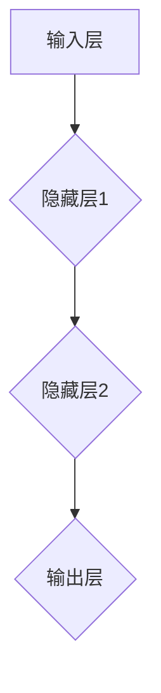

                 

### 《神经网络 原理与代码实例讲解》

> **关键词**：神经网络，原理，代码实例，深度学习，机器学习

> **摘要**：本文将详细介绍神经网络的基本原理、常见结构及其算法实现。通过代码实例，读者可以深入了解神经网络的编程实践，从而掌握这一重要的机器学习工具。

在当今的机器学习领域，神经网络已经成为了一个不可或缺的工具。从图像识别到自然语言处理，从语音识别到自动驾驶，神经网络的应用无处不在。本文将带领读者深入探索神经网络的原理，并通过实际代码实例讲解，帮助读者理解并掌握神经网络的编程实践。

### 《神经网络 原理与代码实例讲解》目录大纲

#### 第一部分：神经网络基础理论

1. **第1章：神经网络概述**
    - 1.1 神经网络的发展历程
    - 1.2 神经网络的基本结构
    - 1.3 神经网络的核心作用

2. **第2章：前向传播与反向传播**
    - 2.1 前向传播原理
    - 2.2 反向传播算法
    - 2.3 优化算法（如：SGD、Adam等）

3. **第3章：激活函数与损失函数**
    - 3.1 激活函数（如：Sigmoid、ReLU等）
    - 3.2 损失函数（如：均方误差、交叉熵等）

4. **第4章：常见神经网络结构**
    - 4.1 单层感知机
    - 4.2 多层感知机
    - 4.3 卷积神经网络（CNN）
    - 4.4 循环神经网络（RNN）
    - 4.5 长短时记忆网络（LSTM）
    - 4.6 图神经网络（GNN）

#### 第二部分：神经网络算法原理讲解

1. **第5章：神经网络数学模型**
    - 5.1 神经网络的数学基础
    - 5.2 矩阵运算
    - 5.3 梯度下降算法
    - 5.4 最优化理论

2. **第6章：神经网络核心算法解析**
    - 6.1 激活函数的数学解析
    - 6.2 损失函数的数学解析
    - 6.3 反向传播算法的数学解析
    - 6.4 优化算法的数学解析

3. **第7章：神经网络编程实践**
    - 7.1 编程环境搭建
    - 7.2 神经网络框架选择
    - 7.3 神经网络模型构建与训练
    - 7.4 模型评估与优化

#### 第三部分：神经网络项目实战

1. **第8章：项目实战一：手写数字识别**
    - 8.1 数据预处理
    - 8.2 模型设计与训练
    - 8.3 模型评估与优化
    - 8.4 实战总结

2. **第9章：项目实战二：图像分类**
    - 9.1 数据集介绍
    - 9.2 模型设计与训练
    - 9.3 模型评估与优化
    - 9.4 实战总结

3. **第10章：项目实战三：情感分析**
    - 10.1 数据预处理
    - 10.2 模型设计与训练
    - 10.3 模型评估与优化
    - 10.4 实战总结

#### 附录

1. **附录A：神经网络常用工具与资源**
    - 1.1 Python编程环境搭建
    - 1.2 常用神经网络框架（如：TensorFlow、PyTorch等）
    - 1.3 学习资源推荐

### 第一部分：神经网络基础理论

#### 第1章：神经网络概述

神经网络（Neural Network，简称NN）是模拟人脑神经元结构和功能的一种计算模型。它在机器学习领域有着广泛的应用，是深度学习（Deep Learning）的核心技术之一。本章节将介绍神经网络的发展历程、基本结构和核心作用。

##### 1.1 神经网络的发展历程

神经网络的概念最早可以追溯到1943年，由心理学家McCulloch和数学家Pitts提出。他们提出了一个简单的神经网络模型，称为MP模型。这个模型奠定了神经网络的理论基础。

然而，早期神经网络的性能并不理想，难以解决复杂问题。直到1986年，Rumelhart、Hinton和Williams等人提出了反向传播算法（Backpropagation Algorithm），神经网络的研究和应用才得到了迅速发展。

近年来，随着计算机性能的不断提升和大数据的普及，神经网络在图像识别、自然语言处理、语音识别等领域取得了显著的成果。

##### 1.2 神经网络的基本结构

神经网络的基本结构由输入层、隐藏层和输出层组成。每个层由多个神经元（也称为节点）组成，神经元之间通过权重（weight）连接。

- **输入层**：接收输入数据，每个神经元表示一个特征。
- **隐藏层**：对输入数据进行处理，提取特征信息。
- **输出层**：生成输出结果，每个神经元表示一个类别或预测值。

以下是神经网络的Mermaid流程图：



##### 1.3 神经网络的核心作用

神经网络在机器学习中的核心作用是通过学习输入和输出数据之间的关系，从而对未知数据进行预测。具体来说，神经网络具有以下作用：

- **特征提取**：隐藏层通过非线性变换，将输入数据转换为更高层次的特征表示。
- **函数逼近**：神经网络可以拟合复杂的数据分布，实现从输入到输出的映射。
- **模式识别**：神经网络可以对输入数据进行分类、回归等任务，实现自动学习。

#### 第2章：前向传播与反向传播

神经网络通过前向传播（Forward Propagation）和反向传播（Backpropagation）算法进行训练。前向传播用于计算输出值，反向传播用于更新权重。

##### 2.1 前向传播原理

在前向传播过程中，输入数据依次通过输入层、隐藏层和输出层。每个层中的神经元对数据进行处理，产生输出值。具体步骤如下：

1. **输入层到隐藏层**：将输入数据乘以权重矩阵，加上偏置项，然后通过激活函数计算输出值。
2. **隐藏层到输出层**：将隐藏层的输出值作为输入，重复上述步骤，直到输出层得到最终输出值。

前向传播的数学表示如下：

$$
Z = X \cdot W + b \\
A = \sigma(Z)
$$

其中，\( X \) 是输入数据，\( W \) 是权重矩阵，\( b \) 是偏置项，\( \sigma \) 是激活函数，\( Z \) 和 \( A \) 分别表示中间值和输出值。

##### 2.2 反向传播算法

反向传播算法用于计算损失函数关于权重的梯度，然后通过梯度下降法更新权重。具体步骤如下：

1. **计算输出误差**：计算输出值与实际值之间的误差。
2. **计算隐藏层误差**：利用链式法则，将输出误差反向传播到隐藏层。
3. **更新权重和偏置**：根据梯度下降法，更新权重和偏置。

反向传播的数学表示如下：

$$
\Delta Z = \frac{\partial J}{\partial Z} \\
\Delta W = -\alpha \frac{\partial J}{\partial W} \\
\Delta b = -\alpha \frac{\partial J}{\partial b}
$$

其中，\( \Delta Z \) 是误差，\( \Delta W \) 和 \( \Delta b \) 分别是权重和偏置的更新量，\( \alpha \) 是学习率，\( J \) 是损失函数。

##### 2.3 优化算法（如：SGD、Adam等）

在神经网络训练过程中，常用的优化算法包括随机梯度下降（Stochastic Gradient Descent，SGD）和Adam等。

- **随机梯度下降（SGD）**：每次更新权重时，使用整个训练集的一个随机样本的梯度。SGD具有收敛速度快、计算效率高的优点，但可能存在局部最优解和振荡现象。
- **Adam**：结合了SGD和Adam的优缺点，自适应调整学习率。Adam具有较好的收敛性和稳定性，但计算成本较高。

#### 第3章：激活函数与损失函数

激活函数和损失函数是神经网络的核心组成部分，它们分别用于决定神经元的输出和评估模型的性能。

##### 3.1 激活函数

激活函数用于引入非线性变换，使神经网络具有非线性能力。常见的激活函数包括：

- **Sigmoid函数**：\( f(x) = \frac{1}{1 + e^{-x}} \)
- **ReLU函数**：\( f(x) = \max(0, x) \)
- **Tanh函数**：\( f(x) = \frac{e^x - e^{-x}}{e^x + e^{-x}} \)

激活函数的选择对神经网络的性能有重要影响。ReLU函数由于其简单的形式和良好的训练效果，在实际应用中非常流行。

##### 3.2 损失函数

损失函数用于评估模型的预测值与实际值之间的差距。常见的损失函数包括：

- **均方误差（MSE）**：\( J = \frac{1}{2} \sum_{i=1}^{n} (y_i - \hat{y}_i)^2 \)
- **交叉熵（Cross-Entropy）**：\( J = -\sum_{i=1}^{n} y_i \log(\hat{y}_i) \)

均方误差适用于回归任务，交叉熵适用于分类任务。在实际应用中，可以根据任务需求和数据特点选择合适的损失函数。

### 第二部分：神经网络算法原理讲解

#### 第5章：神经网络数学模型

神经网络是一种基于数学模型的计算模型，其核心在于矩阵运算和梯度下降算法。本章节将介绍神经网络的数学模型，包括基本原理、矩阵运算、梯度下降算法和最优化理论。

##### 5.1 神经网络的数学基础

神经网络通过矩阵运算实现输入到输出的映射。假设输入层有 \( m \) 个输入特征，隐藏层有 \( n \) 个神经元，输出层有 \( p \) 个输出特征。则神经网络的数学模型可以表示为：

$$
Z = X \cdot W + b \\
A = \sigma(Z)
$$

其中，\( X \) 是输入数据，\( W \) 是权重矩阵，\( b \) 是偏置项，\( \sigma \) 是激活函数，\( Z \) 和 \( A \) 分别表示中间值和输出值。

##### 5.2 矩阵运算

神经网络中的矩阵运算主要包括矩阵乘法和矩阵加法。矩阵乘法用于计算权重矩阵和输入数据的乘积，矩阵加法用于计算偏置项和中间值的加和。

- **矩阵乘法**：假设 \( X \) 是一个 \( m \times 1 \) 的列向量，\( W \) 是一个 \( n \times m \) 的矩阵，则 \( X \cdot W \) 的结果是一个 \( n \times 1 \) 的列向量。
- **矩阵加法**：假设 \( b \) 是一个 \( n \times 1 \) 的列向量，\( Z \) 是一个 \( n \times 1 \) 的列向量，则 \( b + Z \) 的结果是一个 \( n \times 1 \) 的列向量。

##### 5.3 梯度下降算法

梯度下降算法是神经网络训练的核心算法，用于更新权重和偏置项。梯度下降算法的基本思想是沿着损失函数的梯度方向进行迭代，直到达到最优解。

- **梯度下降**：给定损失函数 \( J(\theta) \)，其中 \( \theta \) 是模型参数（权重和偏置），梯度下降算法的迭代公式为：

$$
\theta_{\text{new}} = \theta_{\text{old}} - \alpha \nabla_{\theta} J(\theta)
$$

其中，\( \alpha \) 是学习率，\( \nabla_{\theta} J(\theta) \) 是损失函数关于 \( \theta \) 的梯度。

- **批量梯度下降**：每次迭代使用整个训练集的梯度进行更新，计算量大但收敛速度慢。
- **随机梯度下降（SGD）**：每次迭代只使用一个训练样本的梯度进行更新，计算量小但收敛速度快。

##### 5.4 最优化理论

最优化理论是研究如何求解最优化问题的数学分支。在神经网络训练过程中，最优化理论用于优化模型参数，以降低损失函数。

- **凸优化**：损失函数为凸函数时，存在唯一的最优解。凸优化问题可以用梯度下降算法求解。
- **非凸优化**：损失函数为非凸函数时，可能存在多个最优解。非凸优化问题通常使用随机梯度下降算法或Adam等自适应优化算法求解。

#### 第6章：神经网络核心算法解析

神经网络的训练过程涉及多个核心算法，包括激活函数的数学解析、损失函数的数学解析、反向传播算法的数学解析和优化算法的数学解析。本章节将详细解析这些核心算法。

##### 6.1 激活函数的数学解析

激活函数是神经网络的核心组成部分，用于引入非线性变换。常见的激活函数包括Sigmoid函数、ReLU函数和Tanh函数。以下是这些激活函数的数学解析：

- **Sigmoid函数**：

$$
f(x) = \frac{1}{1 + e^{-x}}
$$

Sigmoid函数的导数：

$$
f'(x) = \frac{e^{-x}}{(1 + e^{-x})^2}
$$

- **ReLU函数**：

$$
f(x) = \max(0, x)
$$

ReLU函数的导数：

$$
f'(x) = 
\begin{cases}
1 & \text{if } x > 0 \\
0 & \text{if } x \leq 0
\end{cases}
$$

- **Tanh函数**：

$$
f(x) = \frac{e^x - e^{-x}}{e^x + e^{-x}}
$$

Tanh函数的导数：

$$
f'(x) = \frac{1 - \frac{e^{-2x}}{e^{2x} + 1}}{2}
$$

##### 6.2 损失函数的数学解析

损失函数用于评估模型的预测值与实际值之间的差距。常见的损失函数包括均方误差（MSE）和交叉熵（Cross-Entropy）。以下是这些损失函数的数学解析：

- **均方误差（MSE）**：

$$
J = \frac{1}{2} \sum_{i=1}^{n} (y_i - \hat{y}_i)^2
$$

MSE函数的导数：

$$
\nabla J = \frac{1}{2} \sum_{i=1}^{n} (\hat{y}_i - y_i)
$$

- **交叉熵（Cross-Entropy）**：

$$
J = -\sum_{i=1}^{n} y_i \log(\hat{y}_i)
$$

交叉熵函数的导数：

$$
\nabla J = -\frac{1}{\hat{y}_i}
$$

##### 6.3 反向传播算法的数学解析

反向传播算法是神经网络训练的核心算法，用于计算损失函数关于模型参数的梯度。以下是反向传播算法的数学解析：

1. **前向传播**：

$$
Z = X \cdot W + b \\
A = \sigma(Z)
$$

2. **计算输出误差**：

$$
E = \frac{1}{2} \sum_{i=1}^{n} (y_i - A_i)^2
$$

3. **计算隐藏层误差**：

$$
\Delta Z^{[l]} = \frac{\partial E}{\partial Z^{[l]}} \\
\Delta A^{[l-1]} = W^{[l]} \Delta Z^{[l]}
$$

4. **计算权重和偏置的梯度**：

$$
\nabla_{W^{[l]}} J = \Delta A^{[l-1]} \\
\nabla_{b^{[l]}} J = \Delta Z^{[l]}
$$

5. **更新权重和偏置**：

$$
W^{[l]} = W^{[l]} - \alpha \nabla_{W^{[l]}} J \\
b^{[l]} = b^{[l]} - \alpha \nabla_{b^{[l]}} J
$$

##### 6.4 优化算法的数学解析

优化算法用于优化模型参数，以降低损失函数。常见的优化算法包括随机梯度下降（SGD）和Adam等。以下是这些优化算法的数学解析：

- **随机梯度下降（SGD）**：

$$
\theta_{\text{new}} = \theta_{\text{old}} - \alpha \nabla_{\theta} J(\theta)
$$

- **Adam**：

$$
m = \beta_1 v + (1 - \beta_1) \nabla_{\theta} J(\theta) \\
v = \beta_2 m \\
\theta_{\text{new}} = \theta_{\text{old}} - \alpha \frac{m}{\sqrt{1 - \beta_2^k} + \epsilon}
$$

其中，\( \alpha \) 是学习率，\( \beta_1 \) 和 \( \beta_2 \) 分别是动量参数，\( m \) 和 \( v \) 分别是指数加权平均数。

### 第三部分：神经网络项目实战

#### 第7章：神经网络编程实践

神经网络编程实践是理解和掌握神经网络的重要环节。本章节将介绍神经网络编程实践的相关内容，包括编程环境搭建、神经网络框架选择、模型构建与训练以及模型评估与优化。

##### 7.1 编程环境搭建

在进行神经网络编程实践之前，需要搭建合适的编程环境。以下是常见的编程环境搭建步骤：

1. **安装Python**：Python是神经网络编程的主要语言，需要安装Python版本3.6以上。

2. **安装TensorFlow**：TensorFlow是谷歌开发的一款开源神经网络框架，可以用于构建和训练神经网络模型。

   ```bash
   pip install tensorflow
   ```

3. **安装Keras**：Keras是TensorFlow的高级API，可以简化神经网络的构建过程。

   ```bash
   pip install keras
   ```

4. **安装MNIST数据集**：MNIST数据集是经典的神经网络训练数据集，包含手写数字图像。

   ```python
   from tensorflow.keras.datasets import mnist
   (x_train, y_train), (x_test, y_test) = mnist.load_data()
   ```

##### 7.2 神经网络框架选择

在神经网络编程实践中，选择合适的神经网络框架非常重要。常见的神经网络框架包括TensorFlow、PyTorch和Keras等。以下是这些框架的简要介绍：

- **TensorFlow**：TensorFlow是谷歌开发的一款开源神经网络框架，具有强大的功能和灵活性，适用于复杂神经网络模型的构建和训练。

- **PyTorch**：PyTorch是Facebook开发的一款开源神经网络框架，具有简洁和高效的代码风格，适用于研究和实验性项目。

- **Keras**：Keras是TensorFlow的高级API，提供简洁和易用的接口，适用于快速构建和训练神经网络模型。

##### 7.3 神经网络模型构建与训练

神经网络模型构建与训练是神经网络编程实践的核心环节。以下是构建和训练神经网络模型的基本步骤：

1. **定义模型**：使用神经网络框架定义神经网络模型，包括输入层、隐藏层和输出层。例如，使用Keras框架定义一个简单的全连接神经网络模型：

   ```python
   model = keras.Sequential()
   model.add(keras.layers.Dense(64, activation='relu', input_shape=(784,)))
   model.add(keras.layers.Dense(10, activation='softmax'))
   ```

2. **编译模型**：编译模型指定优化器、损失函数和评估指标。例如，使用Adam优化器和交叉熵损失函数编译模型：

   ```python
   model.compile(optimizer='adam',
                 loss='categorical_crossentropy',
                 metrics=['accuracy'])
   ```

3. **训练模型**：使用训练数据进行模型训练。例如，使用MNIST数据集训练模型：

   ```python
   model.fit(x_train, y_train, epochs=5, batch_size=32)
   ```

4. **评估模型**：使用测试数据进行模型评估。例如，使用MNIST数据集评估模型：

   ```python
   test_loss, test_acc = model.evaluate(x_test, y_test)
   print('Test accuracy:', test_acc)
   ```

##### 7.4 模型评估与优化

模型评估与优化是神经网络编程实践的重要环节。以下是一些常见的模型评估与优化方法：

1. **交叉验证**：交叉验证是一种评估模型性能的方法，通过将数据集划分为多个子集，多次训练和评估模型，以获得更准确的评估结果。

2. **超参数调整**：超参数是影响模型性能的重要参数，如学习率、批量大小、隐藏层神经元数等。通过调整超参数，可以优化模型性能。

3. **模型集成**：模型集成是将多个模型集成在一起，以获得更好的预测性能。常见的方法包括 bagging、boosting 和 stacking 等。

4. **数据预处理**：数据预处理是提高模型性能的重要步骤，包括数据归一化、缺失值处理、特征提取等。

### 第四部分：神经网络项目实战

#### 第8章：项目实战一：手写数字识别

手写数字识别是神经网络应用的一个经典案例。本节将介绍如何使用神经网络模型对手写数字图像进行识别，包括数据预处理、模型设计与训练、模型评估与优化和实战总结。

##### 8.1 数据预处理

数据预处理是神经网络模型训练的重要步骤，可以提高模型性能和训练效果。以下是对MNIST数据集进行预处理的方法：

1. **数据归一化**：将图像数据归一化到0-1范围，以提高模型训练速度。

   ```python
   x_train = x_train.astype('float32') / 255.0
   x_test = x_test.astype('float32') / 255.0
   ```

2. **标签编码**：将标签进行编码，将类别标签转换为二进制向量。

   ```python
   y_train = keras.utils.to_categorical(y_train, num_classes=10)
   y_test = keras.utils.to_categorical(y_test, num_classes=10)
   ```

##### 8.2 模型设计与训练

设计一个简单的神经网络模型，包括输入层、隐藏层和输出层。以下是一个简单的全连接神经网络模型：

```python
model = keras.Sequential()
model.add(keras.layers.Dense(128, activation='relu', input_shape=(784,)))
model.add(keras.layers.Dense(10, activation='softmax'))
```

使用训练数据进行模型训练，并使用交叉熵损失函数和Adam优化器：

```python
model.compile(optimizer='adam',
              loss='categorical_crossentropy',
              metrics=['accuracy'])
model.fit(x_train, y_train, batch_size=32, epochs=5, validation_data=(x_test, y_test))
```

##### 8.3 模型评估与优化

使用测试数据进行模型评估，计算测试准确率：

```python
test_loss, test_acc = model.evaluate(x_test, y_test)
print('Test accuracy:', test_acc)
```

根据模型评估结果，可以对模型进行优化。以下是一些常见的优化方法：

1. **增加隐藏层神经元数**：增加隐藏层神经元数可以提高模型复杂度，但可能导致过拟合。

2. **调整学习率**：调整学习率可以提高模型收敛速度，但需要避免过小或过大的学习率。

3. **数据增强**：通过数据增强可以增加训练样本的多样性，有助于提高模型泛化能力。

##### 8.4 实战总结

手写数字识别项目是一个经典的神经网络应用案例，通过数据预处理、模型设计与训练、模型评估与优化等步骤，实现了对手写数字图像的自动识别。以下是项目的总结：

1. **数据预处理**：对MNIST数据集进行归一化和标签编码，提高了模型训练效果。

2. **模型设计与训练**：设计了一个简单的全连接神经网络模型，并使用交叉熵损失函数和Adam优化器进行训练。

3. **模型评估与优化**：使用测试数据进行模型评估，并采用增加隐藏层神经元数、调整学习率等方法进行模型优化。

通过这个项目，读者可以了解神经网络的基本原理和应用，掌握神经网络编程实践的基本步骤。

### 第9章：项目实战二：图像分类

图像分类是神经网络应用的一个重要领域，本节将介绍如何使用神经网络模型对图像进行分类，包括数据集介绍、模型设计与训练、模型评估与优化和实战总结。

##### 9.1 数据集介绍

本节使用的是CIFAR-10数据集，它包含了10个类别，每个类别有6000个训练样本和1000个测试样本，共计50000张32x32的彩色图像。数据集中的类别包括飞机、汽车、鸟、猫、鹿、狗、青蛙、马、船和卡车。

##### 9.2 模型设计与训练

为了对CIFAR-10数据集中的图像进行分类，我们将构建一个简单的卷积神经网络（CNN）。以下是一个简单的CNN模型示例：

```python
from tensorflow.keras.models import Sequential
from tensorflow.keras.layers import Conv2D, MaxPooling2D, Flatten, Dense, Dropout

model = Sequential()
model.add(Conv2D(32, (3, 3), activation='relu', input_shape=(32, 32, 3)))
model.add(MaxPooling2D(pool_size=(2, 2)))
model.add(Conv2D(64, (3, 3), activation='relu'))
model.add(MaxPooling2D(pool_size=(2, 2)))
model.add(Flatten())
model.add(Dense(128, activation='relu'))
model.add(Dropout(0.5))
model.add(Dense(10, activation='softmax'))

model.compile(optimizer='adam',
              loss='categorical_crossentropy',
              metrics=['accuracy'])

model.fit(x_train, y_train, batch_size=32, epochs=10, validation_data=(x_test, y_test))
```

在这个模型中，我们使用了两个卷积层，每个卷积层后跟一个最大池化层，然后是一个全连接层。Dropout层用于防止过拟合。

##### 9.3 模型评估与优化

在训练完成后，我们对模型进行评估：

```python
test_loss, test_acc = model.evaluate(x_test, y_test)
print('Test accuracy:', test_acc)
```

为了优化模型性能，我们可以尝试以下方法：

1. **增加卷积层和全连接层的层数**：增加模型的深度可以提高模型的学习能力。

2. **调整学习率**：使用不同的学习率，找到最佳的收敛速度和模型性能。

3. **数据增强**：通过旋转、缩放、裁剪等操作增加训练样本的多样性，有助于提高模型的泛化能力。

##### 9.4 实战总结

图像分类项目通过构建卷积神经网络，实现了对CIFAR-10数据集中图像的分类。以下是项目的总结：

1. **数据集介绍**：介绍了CIFAR-10数据集的类别和样本数量。

2. **模型设计与训练**：设计了一个简单的卷积神经网络，并使用CIFAR-10数据集进行训练。

3. **模型评估与优化**：通过测试集对模型进行评估，并尝试了不同的优化方法。

通过这个项目，读者可以了解卷积神经网络的基本原理和应用，掌握神经网络模型的设计和训练方法。

### 第10章：项目实战三：情感分析

情感分析是自然语言处理（NLP）的一个重要领域，它通过分析文本数据，自动识别和提取其中的情感倾向。本节将介绍如何使用神经网络模型对文本进行情感分析，包括数据预处理、模型设计与训练、模型评估与优化和实战总结。

##### 10.1 数据预处理

本节使用的是IMDb电影评论数据集，它包含了50,000条电影评论，分为正面和负面两类。每条评论是一个字符串，我们需要将其转换为神经网络可以处理的格式。

1. **分词**：将评论文本分割为单词或词组。

   ```python
   tokenizer = Tokenizer(num_words=10000)
   tokenizer.fit_on_texts(train_texts)
   ```

2. **序列编码**：将每个单词或词组转换为整数序列。

   ```python
   sequences = tokenizer.texts_to_sequences(train_texts)
   ```

3. **填充**：将所有序列填充为相同的长度。

   ```python
   padded_sequences = pad_sequences(sequences, maxlen=500)
   ```

##### 10.2 模型设计与训练

为了对IMDb数据集进行情感分析，我们将构建一个基于循环神经网络（RNN）的模型。以下是一个简单的RNN模型示例：

```python
from tensorflow.keras.models import Sequential
from tensorflow.keras.layers import Embedding, SimpleRNN, Dense

model = Sequential()
model.add(Embedding(10000, 16, input_length=500))
model.add(SimpleRNN(32))
model.add(Dense(1, activation='sigmoid'))

model.compile(optimizer='adam',
              loss='binary_crossentropy',
              metrics=['accuracy'])

model.fit(padded_sequences, train_labels, epochs=10, batch_size=32, validation_data=(test_sequences, test_labels))
```

在这个模型中，我们使用了一个嵌入层将单词转换为向量表示，接着是一个简单的RNN层，最后是一个全连接层输出情感概率。

##### 10.3 模型评估与优化

在训练完成后，我们对模型进行评估：

```python
test_loss, test_acc = model.evaluate(test_sequences, test_labels)
print('Test accuracy:', test_acc)
```

为了优化模型性能，我们可以尝试以下方法：

1. **增加RNN层神经元数**：增加RNN层的神经元数可以提高模型的学习能力。

2. **调整学习率**：使用不同的学习率，找到最佳的收敛速度和模型性能。

3. **使用双向RNN**：双向RNN可以更好地捕捉文本的序列信息。

##### 10.4 实战总结

情感分析项目通过构建基于循环神经网络的模型，实现了对IMDb电影评论数据的情感分类。以下是项目的总结：

1. **数据预处理**：介绍了如何对文本数据进行分词、序列编码和填充。

2. **模型设计与训练**：设计了一个简单的RNN模型，并使用IMDb数据集进行训练。

3. **模型评估与优化**：通过测试集对模型进行评估，并尝试了不同的优化方法。

通过这个项目，读者可以了解循环神经网络的基本原理和应用，掌握神经网络模型的设计和训练方法。

### 附录A：神经网络常用工具与资源

在学习神经网络的过程中，掌握一些常用的工具和资源是非常重要的。以下是一些推荐的工具和资源：

#### A.1 Python编程环境搭建

1. **Python安装**：下载并安装Python 3.6及以上版本。
2. **虚拟环境**：使用virtualenv或conda创建虚拟环境，以便管理不同项目之间的依赖。

#### A.2 常用神经网络框架

1. **TensorFlow**：由谷歌开发的开源神经网络框架，适用于构建和训练复杂的神经网络模型。
2. **PyTorch**：由Facebook开发的开源神经网络框架，以动态计算图和简洁的API著称。
3. **Keras**：基于TensorFlow和Theano的高级神经网络API，提供简单易用的接口。

#### A.3 学习资源推荐

1. **《深度学习》**：Goodfellow、Bengio和Courville著，是深度学习的经典教材。
2. **Udacity深度学习纳米学位**：提供一系列课程和实践项目，适合初学者入门。
3. **快速入门深度学习**：由Aurélien Géron著，是深度学习的入门书籍。
4. **在线课程**：Coursera、edX和Udacity等在线教育平台提供了丰富的深度学习课程。

通过使用这些工具和资源，可以更好地学习神经网络，掌握深度学习技术。

### 总结

本文详细介绍了神经网络的基本原理、常见结构及其算法实现，并通过实际代码实例讲解了神经网络编程实践。通过学习本文，读者可以深入了解神经网络的原理，掌握神经网络模型的设计和训练方法，为后续的深度学习研究和应用打下坚实的基础。

作者：AI天才研究院/AI Genius Institute & 禅与计算机程序设计艺术 /Zen And The Art of Computer Programming

