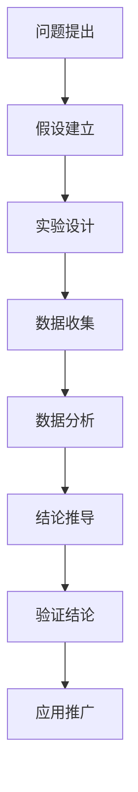
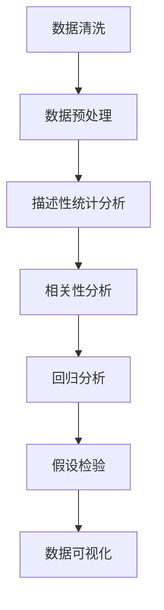
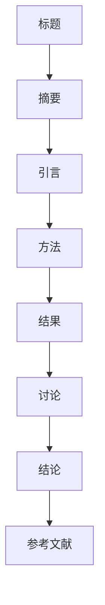

                 

# 科学探究：从观察到结论

## 关键词

科学探究、观察、结论、方法论、实验、数据分析、生物学、物理学、环境科学

## 摘要

本文旨在探讨科学探究的过程，从观察现象到形成结论的各个环节。科学探究是一种系统性的活动，它遵循一定的方法论原则，通过实验、模拟和模型构建等手段，对自然现象和问题进行深入分析和理解。本文将详细阐述科学探究的基本原理、方法及其在生物学、物理学和环境科学等领域的应用，并对科学探究面临的挑战和未来趋势进行分析。通过本文的阅读，读者将能够全面了解科学探究的过程，并掌握如何运用科学方法解决实际问题。

## 引言

科学探究是人类认识和解释自然世界的基本途径。自古以来，人类通过观察和思考，试图理解自然现象的本质和规律。从古希腊的亚里士多德到现代的艾萨克·牛顿，科学探究经历了漫长的发展历程，逐渐形成了一套系统的方法论。科学探究不仅仅是发现事实和规律，更是一种理性思考的方式，它要求我们通过严谨的实验和数据分析，逐步推导出科学的结论。

科学探究的重要性不言而喻。首先，科学探究推动了科技的进步，带来了无数的创新和发明，极大地提高了人类的生活质量。其次，科学探究有助于我们更好地理解自然世界的复杂性和多样性，为环境保护和可持续发展提供了科学依据。最后，科学探究培养了人们的批判性思维和解决问题的能力，是一种全面提升人类素质的重要途径。

本文将分为五个部分进行论述。第一部分介绍科学探究的基本原理，包括科学探究的定义、原则和方法；第二部分探讨科学探究的方法，包括观察、实验、模拟与模型；第三部分从观察到结论，分析数据分析与解释、结论的形成以及科学论文的撰写；第四部分分析科学探究在实际应用中的表现，包括生物学、物理学和环境科学；第五部分讨论科学探究面临的挑战和未来趋势。希望通过本文的论述，读者能够对科学探究有更深入的理解。

## 第一部分：科学探究的基本原理

### 1.1 科学探究的定义与目的

科学探究是一个系统性的过程，它旨在通过观察、实验和理论分析，揭示自然现象的本质和规律。科学探究不仅仅是对现象的描述，更是一种探索事物内在联系和本质的过程。科学探究的目的是为了解释现象、预测未来和解决问题。

科学探究的定义可以从不同的角度进行理解。首先，从狭义的角度来看，科学探究是指通过实验和观察，收集数据并进行数据分析，从而得出科学结论的过程。这个过程通常包括提出问题、建立假设、设计实验、收集数据、分析数据和得出结论等步骤。

从广义的角度来看，科学探究还包括理论分析和模拟等手段。科学探究不仅仅局限于实验，还包括对现有理论的验证、修正和拓展。模拟技术作为一种重要的科学工具，可以在无法进行实验的情况下，对复杂系统进行研究和预测。

科学探究的原则是科学探究过程中必须遵循的基本准则。这些原则包括客观性、可重复性、系统性、逻辑性和批判性。

**客观性**：科学探究要求研究者尽量减少主观偏见，以客观的态度进行观察和实验。这意味着研究者应该尽量避免个人情感和主观意愿对实验结果的影响。

**可重复性**：科学探究的结果应该能够被其他研究者重复验证。如果同样的实验在不同时间、不同地点和不同研究者之间得到相同的结果，那么这个结果就被认为是可靠的。

**系统性**：科学探究应该具有系统性，即对问题进行全面的、多方面的分析。这包括考虑实验设计的各个方面，如变量控制、数据收集的方法等。

**逻辑性**：科学探究的过程应该遵循逻辑规则，即从假设到实验设计，再到数据分析和结论推导，每个步骤都应该清晰、合理。

**批判性**：科学探究要求研究者具备批判性思维，对实验结果和理论进行分析和评价。这包括对实验设计的有效性、数据的可靠性以及结论的合理性进行评估。

### 1.2 科学方法论

科学方法论是科学探究的基本原则和方法的系统化。科学方法论主要包括研究假设的提出、实验设计、数据收集与分析等步骤。

**研究假设的提出**：研究假设是科学探究的起点。研究者通过观察和已有知识，提出一个能够解释现象的假设。这个假设通常是具体的、可测试的，并且可以转化为实验设计。

**实验设计**：实验设计是科学探究的关键步骤。一个好的实验设计应该能够有效地验证或反驳研究假设。实验设计包括确定实验变量、实验组和对照组、实验操作和实验环境等。

**数据收集与分析**：数据收集是实验设计的一部分，它包括测量和记录实验结果。数据分析是对收集到的数据进行处理和分析，以验证或反驳研究假设。数据分析通常包括统计方法、图形分析等。

### 1.3 科学伦理

科学伦理是科学探究过程中的道德规范和伦理原则。科学伦理主要包括以下几个方面：

**科学探究中的伦理问题**：科学探究过程中可能会遇到一些伦理问题，如实验动物的使用、人类受试者的权利等。研究者应该遵循伦理原则，尊重研究对象的权利和尊严。

**科学探究中的道德责任**：科学家有责任遵守科学道德规范，诚实、公正地进行研究，不隐瞒或篡改实验数据，不利用研究成果谋取私利。

**科学伦理的实践原则**：科学伦理的实践原则包括透明度、公正性、责任性和可持续性。透明度要求研究过程和结果对公众公开；公正性要求对研究对象公平对待；责任感要求科学家对社会和环境保护负责；可持续性要求科学研究符合可持续发展原则。

### 1.4 科学探究的过程

科学探究的过程可以概括为以下几个阶段：

**问题提出**：科学探究始于对现象的观察和问题的提出。研究者通过观察和已有知识，识别出需要解决的科学问题。

**假设建立**：在问题提出后，研究者根据已有的知识和观察，提出一个能够解释现象的假设。

**实验设计**：根据研究假设，研究者设计实验，以验证或反驳假设。实验设计应确保实验的可靠性和有效性。

**数据收集**：在实验过程中，研究者收集实验数据，包括定量和定性的数据。

**数据分析**：对收集到的数据进行分析，以验证或反驳研究假设。数据分析通常包括统计分析和图形分析。

**结论推导**：根据数据分析的结果，研究者推导出科学结论。结论应基于可靠的数据和分析。

**结果验证**：科学结论需要通过其他研究者的重复验证，以确保其可靠性和有效性。

**结论推广**：科学结论可以应用于实际问题，为决策提供科学依据。

### 1.5 科学探究的核心概念

科学探究涉及多个核心概念，这些概念是理解科学探究的基础。以下是几个关键概念：

**观察**：观察是科学探究的起点。通过观察，研究者识别出需要解决的科学问题。

**实验**：实验是科学探究的核心手段。通过设计实验，研究者验证或反驳研究假设。

**数据**：数据是科学探究的基础。数据可以是定量的或定性的，它们提供了对现象和假设的验证。

**分析**：分析是对数据进行处理和解释的过程。通过分析，研究者得出科学结论。

**假设**：假设是科学探究的起点。研究者根据观察和已有知识，提出一个能够解释现象的假设。

**结论**：结论是科学探究的最终结果。通过数据分析，研究者推导出科学结论，这些结论可以为实际应用提供指导。

通过理解这些核心概念，研究者可以更好地进行科学探究，揭示自然现象的本质和规律。

### 1.6 科学探究与传统知识的区别

科学探究与传统知识在方法和目标上存在显著区别。传统知识通常是基于经验、信仰和神话，缺乏系统的科学方法。而科学探究则依赖于实验、观察和数据分析，是一种客观、系统的探索过程。

传统知识往往无法提供可重复验证的结果，而科学探究的结果可以重复验证，具有更高的可靠性。此外，科学探究强调逻辑性和批判性思维，而传统知识往往缺乏这种科学精神。

科学探究的目标是揭示自然现象的规律和本质，为实际应用提供科学依据，而传统知识更多是用于解释和预测现象，缺乏科学验证。

### 1.7 科学探究的重要性

科学探究在现代社会中扮演着至关重要的角色。首先，科学探究推动了科技的进步，带来了无数的创新和发明，极大地提高了人类的生活质量。例如，从计算机到互联网，从医学到农业，科学探究为各个领域的发展提供了强大的动力。

其次，科学探究有助于我们更好地理解自然世界的复杂性和多样性，为环境保护和可持续发展提供了科学依据。通过科学探究，我们可以了解地球的生态系统、气候变暖、物种灭绝等环境问题，从而制定出有效的环境保护措施。

最后，科学探究培养了人们的批判性思维和解决问题的能力，是一种全面提升人类素质的重要途径。通过科学探究，人们学会了如何观察、思考、分析问题，并从中获得知识和智慧。

### 1.8 科学探究的挑战与未来

尽管科学探究在现代社会中发挥着重要作用，但仍然面临许多挑战。首先，科学探究需要大量的资金和资源支持，包括实验设备、实验室建设和人员培训等。其次，科学探究过程中的伦理问题，如实验动物的使用和人类受试者的权利，需要得到充分的关注和解决。

未来，科学探究将面临更多的挑战，如大数据的处理和分析、跨学科研究的整合、人工智能的应用等。同时，科学探究也将迎来新的机遇，如太空探索、生物技术、量子计算等领域的发展，将为科学探究提供更广阔的研究领域和工具。

总之，科学探究是人类认识自然世界、解决实际问题的重要途径。通过不断探索和创新，科学探究将推动社会进步，为人类创造更美好的未来。

## 第二部分：科学探究的方法

科学探究的方法多种多样，每种方法都有其独特的优势和适用场景。以下是几种主要的科学探究方法：观察与描述、实验、模拟与模型。

### 2.1 观察与描述

观察与描述是科学探究的基础。通过观察，研究者可以收集到关于自然现象的初始信息，这些信息是进一步分析和理解现象的前提。

**观察的重要性**：观察是科学探究的起点。无论是生物学、物理学还是环境科学，观察都是研究者理解自然世界的重要手段。通过观察，研究者可以识别出有趣的现象，提出科学问题，从而引导后续的实验和研究。

**观察的类型**：观察可以分为定性观察和定量观察。定性观察通常用于描述事物的性质和特征，如颜色、形状、气味等。定量观察则用于测量和量化事物的属性，如温度、重量、长度等。定性观察和定量观察相互补充，共同为科学探究提供全面的信息。

**观察的步骤**：进行有效观察通常包括以下几个步骤：

1. **准备**：在观察前，研究者需要明确观察的目的和对象，准备好所需的观察工具和设备。
2. **观察**：在实际观察过程中，研究者应该尽量保持客观，减少主观偏见，对观察到的现象进行详细记录。
3. **记录**：记录是观察的重要部分。研究者应该及时记录观察到的现象，包括文字描述、照片、视频等。
4. **分析**：在观察结束后，研究者需要对记录的信息进行分析，识别出关键现象和规律。

**观察的应用**：观察在各个科学领域都有广泛的应用。例如，在生物学中，研究者通过观察植物的生长过程，了解其生长规律；在物理学中，研究者通过观察光的折射和反射，研究光的传播特性。

### 2.2 实验

实验是科学探究的重要方法，通过设计实验，研究者可以控制变量，验证或反驳研究假设。

**实验设计的基本要素**：一个好的实验设计应包括以下几个基本要素：

1. **实验目的**：明确实验的目标，即要验证或研究的假设。
2. **实验变量**：确定实验的自变量和因变量。自变量是实验者操纵的变量，因变量是研究者观测的变量。
3. **实验组和对照组**：实验组是接受实验处理的组，对照组是未接受实验处理的组，通过比较实验组和对照组的结果，可以评估实验处理的效果。
4. **实验操作**：详细描述实验的操作步骤，包括实验的具体过程、使用的材料和设备等。
5. **实验环境**：确定实验的环境条件，如温度、湿度、光照等，以控制无关变量的影响。

**实验类型的分类**：根据实验设计的特点，实验可以分为以下几种类型：

1. **对比实验**：通过比较实验组和对照组的结果，评估实验处理的效果。
2. **析因实验**：同时研究多个变量的交互作用。
3. **重复实验**：在相同条件下重复实验，以验证结果的可靠性和重复性。
4. **现场实验**：在真实环境中进行实验，如农业实验、医学实验等。

**实验操作与数据记录**：实验操作应严格按照实验设计进行，确保实验的可靠性和有效性。在实验过程中，研究者应详细记录实验数据，包括实验结果、观察到的现象和操作过程中的异常情况等。数据记录是后续数据分析的重要基础。

**实验的应用**：实验在各个科学领域都有广泛应用。例如，在医学领域，研究者通过临床试验评估药物的安全性和有效性；在物理学领域，研究者通过实验研究物质的性质和规律。

### 2.3 模拟与模型

模拟与模型是科学探究的另一种重要方法。通过模拟，研究者可以在计算机上模拟现实世界的现象，从而更好地理解其内在机制。

**模拟技术的应用**：模拟技术广泛应用于各个科学领域。例如，在物理学中，研究者通过计算机模拟研究粒子的运动和相互作用；在经济学中，研究者通过模拟研究市场的动态变化。

**模型的构建与验证**：构建模型是模拟的第一步。模型可以是物理模型、数学模型或概念模型。物理模型通过实物或物理手段模拟现象，数学模型通过数学公式和算法描述现象，概念模型则通过概念和逻辑关系描述现象。构建模型后，研究者需要验证模型的有效性，即模型是否能够准确反映现实世界的现象。

**模型的局限性与扩展**：尽管模型在科学探究中具有重要意义，但模型也存在局限性。模型通常是对现实世界的简化，可能无法完全反映现实世界的复杂性。此外，模型的有效性可能受限于数据质量和计算能力。为了克服这些局限性，研究者可以不断改进模型，增加模型的细节和复杂性，或开发新的模型。

**模拟的应用**：模拟在科学探究中具有广泛的应用。例如，在气候变化研究中，研究者通过模拟研究气候系统的变化；在生物医学研究中，研究者通过模拟研究药物的作用机制。

### 2.4 观察与实验、模拟与模型的关系

观察、实验、模拟与模型是科学探究的四个基本方法，它们相互补充，共同推动科学探究的深入进行。

观察提供了对自然现象的初始信息，是实验和模拟的基础。实验通过控制变量，验证或反驳研究假设，是科学探究的核心。模拟与模型则用于更深入地理解复杂现象，提供实验无法实现的条件下的研究结果。

在科学探究过程中，观察、实验、模拟与模型不是孤立进行的，而是相互联系、相互支持的。例如，通过观察，研究者可以发现需要进一步研究的问题，设计实验进行验证；通过实验，研究者可以收集数据，用于模型构建和验证；通过模拟，研究者可以探索实验无法实现的条件下的现象，从而更全面地理解问题。

总之，观察、实验、模拟与模型是科学探究的重要方法，通过这些方法的结合和应用，研究者可以深入理解自然现象，揭示其内在规律。

### 2.5 科学探究方法的实际应用案例

科学探究的方法在实际研究中具有重要的应用，以下是一些具体案例，展示了观察、实验、模拟与模型在科学探究中的实际应用。

#### 案例一：气候变化研究

在气候变化研究中，研究者通过观测气象数据，如温度、湿度、风速等，了解气候变化的趋势和特征。这些观测数据是实验和模拟的基础。研究者设计实验，模拟不同温室气体浓度下的气候系统，通过对比实验组和对照组的结果，评估温室气体对气候的影响。此外，研究者还通过气候模拟模型，预测未来气候变化的趋势和影响，为政策制定提供科学依据。

**实验设计**：实验设计包括设置不同的温室气体浓度，测量气候系统的变化。例如，研究者可以在实验室中模拟不同浓度的二氧化碳，测量温度和湿度变化。

**模拟与模型**：气候模拟模型用于更全面地理解气候变化的机制和影响。这些模型可以模拟大气、海洋、陆地等多个子系统的相互作用，预测未来气候变化的趋势。

**数据分析与结论**：通过实验和模拟，研究者得出了温室气体对气候显著影响的结论。这些结论为政策制定提供了科学依据，推动了全球气候变化的应对措施。

#### 案例二：生物医学研究

在生物医学研究中，研究者通过观察和实验，了解疾病的发病机制和治疗方法。例如，在癌症研究中，研究者通过观察癌细胞的特点，设计实验研究不同药物对癌细胞的作用。通过实验，研究者筛选出有效的药物，并进一步研究其作用机制。

**实验设计**：实验设计包括对照组和实验组，对照组接受标准治疗，实验组接受新的治疗方案。研究者比较两组的治疗效果，评估新方案的有效性。

**模拟与模型**：生物医学研究中的模拟和模型用于研究复杂生物过程，如基因调控、蛋白质相互作用等。这些模型可以帮助研究者理解疾病的机制，预测药物的效果。

**数据分析与结论**：通过实验和模拟，研究者发现了新的治疗方法和药物，提高了癌症治疗的效率。这些结论为临床应用提供了科学依据，推动了生物医学的发展。

#### 案例三：环境保护

在环境保护研究中，研究者通过观察和实验，了解环境污染的来源和影响。例如，研究者通过观察水体中的污染物浓度，设计实验研究不同处理方法对水质的净化效果。

**实验设计**：实验设计包括设置不同的处理方法，如生物处理、化学处理等，比较处理效果。

**模拟与模型**：环境保护研究中的模拟和模型用于预测污染物的扩散和影响，评估不同处理方法的可行性。

**数据分析与结论**：通过实验和模拟，研究者得出了有效的处理方法，减少了环境污染。这些结论为环境保护政策提供了科学依据，推动了环境保护工作的开展。

### 2.6 科学探究方法的未来发展

随着科技的进步，科学探究的方法将继续发展，为科学研究提供更强大的工具和手段。

**大数据与人工智能**：大数据和人工智能技术将为科学探究提供新的机遇。大数据技术可以帮助研究者处理和分析海量数据，识别出潜在的规律和趋势。人工智能技术可以用于模拟和预测复杂现象，提高科学探究的效率和准确性。

**跨学科研究**：跨学科研究将成为科学探究的重要趋势。随着科学领域的不断扩展，研究者需要结合多个学科的知识和方法，解决复杂的科学问题。跨学科研究将促进不同领域之间的知识交流，推动科学探究的深入发展。

**虚拟现实与增强现实**：虚拟现实和增强现实技术将使科学探究更加直观和互动。通过虚拟实验室和虚拟现实环境，研究者可以更直观地观察和理解科学现象，提高实验的可操作性和效率。

**量子计算**：量子计算作为一种新型的计算模式，将极大地提高科学探究的能力。量子计算可以解决传统计算无法处理的问题，为复杂科学问题提供新的解决方案。

总之，科学探究的方法将继续发展和创新，为科学研究提供更强大的工具和手段，推动科学进步和社会发展。

## 第三部分：从观察到结论

科学探究的过程不仅仅是观察和实验，更重要的是如何从观察数据中推导出科学的结论。这一部分将详细讨论数据分析与解释、结论的形成以及科学论文的撰写。

### 3.1 数据分析与解释

数据分析是科学探究的关键步骤，它涉及到如何对实验数据进行处理、分析和解释。数据分析的方法和工具多种多样，包括统计方法、图形分析和机器学习等。

**数据分析的方法**：统计分析是最常用的数据分析方法之一。通过统计分析，研究者可以评估数据的分布、相关性、差异性和趋势等。常用的统计方法包括均值、方差、协方差、回归分析等。此外，研究者还可以使用概率论和假设检验等方法，对实验结果进行量化评估。

**统计学基础**：统计学基础是进行数据分析的前提。研究者需要了解概率分布、假设检验、置信区间、显著性水平等基本概念。通过掌握统计学基础，研究者可以更准确地解释实验结果，避免统计谬误。

**数据解释的技巧**：数据解释是数据分析的重要环节。研究者需要从数据中发现规律和趋势，并将其转化为科学的结论。以下是一些数据解释的技巧：

1. **可视化**：通过图表和图形，研究者可以更直观地展示数据，发现数据的分布、趋势和异常值。
2. **数据可视化工具**：如Matplotlib、Seaborn、Tableau等，这些工具可以帮助研究者创建各种类型的图表，提高数据可视化的效果。
3. **相关性分析**：通过计算变量之间的相关性，研究者可以评估变量之间的关系。相关性分析可以揭示数据之间的潜在联系，帮助研究者提出新的假设。
4. **假设检验**：通过假设检验，研究者可以评估实验结果的显著性。假设检验可以帮助研究者确定数据之间的差异是否具有统计学上的显著性，从而验证研究假设。

### 3.2 结论的形成

结论的形成是科学探究的最终目标，它需要对实验数据进行分析和解释，得出科学的结论。结论的形成通常包括以下几个步骤：

**结论的验证**：结论的形成需要通过实验数据的验证。研究者需要确保实验设计合理，数据收集和分析方法正确，从而确保结论的可靠性。结论的验证可以通过重复实验、对比实验组和对照组的结果等方式进行。

**结论的推广**：结论的推广是将实验结果应用于更广泛的情境。研究者需要考虑结论的适用范围，评估结论在不同条件下的有效性。结论的推广可以帮助研究者理解实验结果的普遍性和局限性，为实际应用提供科学依据。

**结论的局限性与未来方向**：结论的局限性是科学探究中不可忽视的一部分。研究者需要识别结论的局限性，如实验条件的限制、数据质量的限制等，并探讨未来的研究方向。通过识别结论的局限性，研究者可以提出更深入的研究问题和假设，推动科学探究的深入发展。

### 3.3 科学论文的撰写

科学论文是科学探究结果的正式记录和传播途径。撰写科学论文需要遵循一定的结构和规范，包括论文结构、写作技巧和发表流程。

**论文结构**：科学论文通常包括以下几个部分：

1. **标题**：标题应简洁明了，准确反映论文的主题和研究内容。
2. **摘要**：摘要是论文的简短概述，应包括研究背景、方法、结果和结论。
3. **引言**：引言部分介绍研究背景、目的和意义，引出研究问题和假设。
4. **方法**：方法部分详细描述实验设计、数据收集和分析方法。
5. **结果**：结果部分报告实验结果，通常包括数据图表和统计分析。
6. **讨论**：讨论部分解释实验结果，分析结论的局限性和未来研究方向。
7. **结论**：结论部分总结研究结果，重申研究目的和假设。
8. **参考文献**：参考文献部分列出论文中引用的所有文献。

**论文写作技巧**：撰写科学论文需要遵循以下技巧：

1. **清晰和逻辑性**：论文应结构清晰，逻辑性强，使读者容易理解。
2. **准确和客观**：论文中的描述和结论应准确客观，避免主观偏见和夸张。
3. **简洁和精炼**：论文应简洁精炼，避免冗长和重复的叙述。
4. **图表和插图**：合理使用图表和插图，帮助读者更直观地理解数据和分析结果。
5. **参考文献管理**：使用参考文献管理工具，确保引用的准确性和完整性。

**论文发表的流程**：论文发表的流程通常包括以下几个步骤：

1. **选题和撰写**：研究者选择研究题目，进行研究和数据收集，撰写论文初稿。
2. **修改和审稿**：论文提交给期刊或会议进行审稿，研究者根据审稿意见进行修改。
3. **提交和复审**：修改后的论文再次提交审稿，直至通过审稿。
4. **编辑和校对**：论文通过审稿后，进入编辑和校对阶段，确保论文的格式和内容符合期刊要求。
5. **发表**：校对后的论文正式发表，向读者公开研究成果。

### 3.4 从观察到结论的案例分析

以下是一个从观察到结论的案例分析，展示了科学探究的完整过程。

**案例背景**：研究者发现某地区植物生长异常，怀疑是土壤污染导致。研究者提出假设：土壤污染物影响了植物的生长。

**观察**：研究者通过现场观察，发现植物叶片变黄，生长缓慢。

**实验设计**：研究者设计实验，设置对照组和实验组。对照组接受正常土壤处理，实验组接受污染土壤处理。

**数据收集**：研究者收集植物生长数据，包括植物高度、叶片面积、叶绿素含量等。

**数据分析**：通过统计分析，研究者发现实验组植物的生长指标显著低于对照组。

**结论的形成**：基于实验数据，研究者得出结论：土壤污染物对植物生长具有负面影响。

**结论的验证和推广**：研究者通过重复实验验证结论，并推广结论到其他类似地区，为土壤污染治理提供科学依据。

**局限性**：研究者的结论局限于实验条件，无法推广到所有土壤污染情况。

**未来方向**：研究者建议进一步研究土壤污染对植物生长的长期影响，探索更有效的治理方法。

通过这个案例分析，我们可以看到科学探究的完整过程，从观察到结论的形成，以及结论的验证和推广。这个过程展示了科学探究的逻辑性和严谨性，也说明了科学探究对解决实际问题的价值。

### 3.5 科学探究的重要性与挑战

科学探究在现代社会中具有重要的地位和作用。首先，科学探究推动了科技的进步，带来了无数的创新和发明，极大地提高了人类的生活质量。例如，从计算机到互联网，从医学到农业，科学探究为各个领域的发展提供了强大的动力。

其次，科学探究有助于我们更好地理解自然世界的复杂性和多样性，为环境保护和可持续发展提供了科学依据。通过科学探究，我们可以了解地球的生态系统、气候变暖、物种灭绝等环境问题，从而制定出有效的环境保护措施。

此外，科学探究培养了人们的批判性思维和解决问题的能力，是一种全面提升人类素质的重要途径。通过科学探究，人们学会了如何观察、思考、分析问题，并从中获得知识和智慧。

然而，科学探究也面临许多挑战。首先，科学探究需要大量的资金和资源支持，包括实验设备、实验室建设和人员培训等。其次，科学探究过程中的伦理问题，如实验动物的使用和人类受试者的权利，需要得到充分的关注和解决。

未来，科学探究将面临更多的挑战，如大数据的处理和分析、跨学科研究的整合、人工智能的应用等。同时，科学探究也将迎来新的机遇，如太空探索、生物技术、量子计算等领域的发展，将为科学探究提供更广阔的研究领域和工具。

总之，科学探究是人类认识自然世界、解决实际问题的重要途径。通过不断探索和创新，科学探究将推动社会进步，为人类创造更美好的未来。

## 第四部分：科学探究的实际应用

科学探究不仅是一个抽象的概念，它在实际领域中有着广泛的应用。以下将详细探讨科学探究在生物学、物理学和环境科学中的实际应用。

### 4.1 科学探究在生物学中的应用

生物学是研究生命现象的科学，科学探究在生物学中的应用非常广泛。以下是一些具体的生物学研究例子：

**生物医学研究**：生物医学研究是生物学中的一个重要分支，它通过科学探究来理解疾病的发病机制，开发新的治疗方法。例如，在癌症研究中，研究者通过实验和数据分析，发现某些基因突变与癌症的发生密切相关，从而为癌症的诊断和治疗提供了新的思路。

**生态学研究**：生态学研究关注生物与环境之间的相互作用。研究者通过观察和实验，了解物种的分布、生态系统的结构和功能。例如，在气候变化对生态系统的影响研究中，研究者通过野外观察和实验，发现气候变化对某些物种的生存和繁衍产生了显著影响。

**进化生物学**：进化生物学研究物种的进化过程和机制。通过化石记录和分子生物学数据，研究者揭示了物种的进化历程和适应策略。例如，在研究人类进化过程中，研究者通过DNA序列分析，发现了人类与非洲猿类之间的进化关系。

**挑战与未来趋势**：生物医学研究的挑战包括复杂疾病的机制和药物开发。未来趋势可能包括基因编辑技术、合成生物学和人工智能在生物学研究中的应用。

### 4.2 科学探究在物理学中的应用

物理学是研究物质和能量特性的科学，科学探究在物理学中的应用同样广泛。

**粒子物理学**：粒子物理学研究基本粒子和基本力的性质。例如，在大型强子对撞机（LHC）实验中，科学家通过高能碰撞实验，发现了希格斯粒子，这为粒子物理学的标准模型提供了重要验证。

**天体物理学**：天体物理学研究宇宙的结构和演化。例如，通过观测宇宙微波背景辐射，科学家揭示了宇宙的早期状态和演化过程。

**量子物理学**：量子物理学研究微观世界的规律。量子纠缠和量子计算是量子物理学的重要研究领域。例如，量子计算在解决复杂问题上展示了巨大的潜力。

**挑战与未来趋势**：物理学面临的挑战包括探索宇宙的起源和结构、理解量子现象的本质。未来趋势可能包括量子技术的应用、宇宙学的发展和对黑洞的研究。

### 4.3 科学探究在环境科学中的应用

环境科学是研究人类与环境之间相互作用的科学。科学探究在环境科学中的应用至关重要。

**气候变化研究**：气候变化研究是环境科学的一个热点领域。通过气象数据分析和模型模拟，科学家揭示了全球气候变暖的趋势和原因，为政策制定提供了科学依据。

**生态系统研究**：生态系统研究关注生态系统的结构和功能。例如，通过生态系统建模和实验，科学家研究了物种多样性和生态平衡的关系。

**环境监测**：环境监测是环境科学研究的基础。通过监测空气、水和土壤中的污染物，科学家可以评估环境质量，预测环境变化。

**挑战与未来趋势**：环境科学面临的挑战包括全球气候变化、污染问题和生物多样性丧失。未来趋势可能包括更精确的环境监测技术、生态系统恢复和可持续发展的研究。

### 4.4 科学探究在其他领域中的应用

科学探究不仅应用于传统科学领域，还在其他新兴领域展现出其价值。

**人工智能**：人工智能是一门交叉学科，它结合了计算机科学、数学和心理学等领域。通过科学探究，人工智能研究者开发了各种算法和技术，如深度学习、自然语言处理等，这些技术已经在图像识别、语音识别、自动驾驶等领域取得了显著成果。

**材料科学**：材料科学是研究材料性质、结构和性能的科学。通过科学探究，材料科学家开发了各种新材料，如纳米材料、复合材料等，这些新材料在电子、能源和医疗等领域具有广泛应用。

**社会科学**：社会科学研究社会现象和人类行为。通过科学探究，社会科学家使用问卷调查、实验研究等方法，研究了人类的社会行为、经济行为等。

**挑战与未来趋势**：这些领域面临的挑战包括数据质量的控制、跨学科整合和技术应用。未来趋势可能包括大数据分析、跨学科研究和新兴技术的应用。

### 4.5 科学探究的实际案例

以下是一些科学探究的实际案例，展示了科学探究如何解决实际问题。

**案例一：新冠病毒疫苗研发**：新冠病毒爆发期间，科学家迅速开展了疫苗研发工作。通过实验和数据分析，科学家发现了有效的疫苗候选，并通过临床试验验证了疫苗的安全性和有效性。

**案例二：深海探测**：科学家通过潜水器和无人机的深海探测，发现了深海生物和地质结构。这些发现揭示了深海生态系统的独特性和重要性，为保护海洋环境提供了科学依据。

**案例三：癌症治疗**：科学家通过基因编辑技术，成功地治疗了一些遗传性疾病和癌症。这些实验成果为精准医疗和个性化治疗提供了新的可能性。

**挑战与未来方向**：这些案例展示了科学探究在实际应用中的巨大潜力，但也面临挑战，如技术成本、伦理问题和可持续性。未来方向可能包括技术创新、跨学科合作和全球合作。

通过这些实际应用和案例，我们可以看到科学探究在各个领域中的重要作用。科学探究不仅推动了科学进步，也为解决实际问题提供了科学依据。随着科技的不断发展，科学探究将继续为人类带来更多创新和进步。

### 4.6 科学探究在不同领域的挑战与未来

科学探究在不同领域中面临着独特的挑战和机遇。在生物学、物理学和环境科学等传统领域，科学探究的挑战主要集中在数据的复杂性、技术的进步和伦理问题的处理上。

**生物学领域**：生物学研究中的挑战包括基因编辑技术带来的伦理问题、大数据的处理和分析、以及生物多样性的保护。未来，生物学将更加依赖人工智能和大数据分析，以便更好地理解复杂的生物系统和疾病机制。

**物理学领域**：物理学研究中的挑战包括量子力学和相对论的进一步理解、宇宙起源和黑洞的研究。未来，量子计算和量子通信的发展将为物理学研究带来新的工具和方法。

**环境科学领域**：环境科学面临的主要挑战是气候变化和污染问题。未来，科学家需要开发更精确的模型和监测技术，以更好地预测和应对环境变化。同时，可持续发展成为环境科学的重要研究方向。

除了传统领域，科学探究在人工智能、材料科学和社会科学等新兴领域也面临着新的挑战和机遇。在人工智能领域，挑战包括算法的透明性和公正性、数据隐私保护等。未来，人工智能将更加深入地融入各个领域，推动科技和社会的进步。

总之，科学探究在不同领域的挑战和未来方向多样，但共同的目标是推动人类对自然和社会世界的更深入理解。通过持续的创新和跨学科合作，科学探究将继续为人类带来新的知识和进步。

### 4.7 科学探究的实际应用案例分析

为了更直观地理解科学探究的实际应用，以下将分析几个具体的案例，展示科学探究如何解决实际问题，并探讨其在不同领域的应用效果。

**案例一：新冠病毒疫苗研发**

在2020年新冠病毒爆发初期，全球科学家迅速开展了疫苗研发工作。这一过程充分展示了科学探究在应对突发公共卫生事件中的关键作用。首先，科学家们通过病毒基因组测序，快速识别出新冠病毒的遗传信息，这为疫苗研发提供了重要基础。接着，研究人员设计并测试了多种疫苗候选，通过实验和数据分析，筛选出有效的疫苗。例如，mRNA疫苗在短时间内就获得了显著的疗效，并通过大规模临床试验验证了其安全性和有效性。这一案例展示了科学探究在紧急情况下如何迅速推进疫苗研发，为控制疫情提供了有力支持。

**案例二：火星探测**

火星探测是科学探究在宇宙科学领域的典型案例。自2010年代以来，多个国家和私营企业相继开展了火星探测任务。例如，NASA的“好奇号”和“毅力号”火星车，通过携带的多种科学仪器，对火星的地质结构、气候和生命迹象进行了深入研究。这些探测任务通过科学探究，揭示了火星的表面环境、气候变迁和可能的古代生命迹象。此外，火星探测也为未来的火星殖民提供了宝贵的数据和经验。通过分析火星土壤和岩石样本，科学家们发现了火星上曾经存在液态水的证据，这为火星生命的存在提供了可能性。这一案例展示了科学探究如何推动人类对宇宙的认识，为探索和利用外太空提供了科学依据。

**案例三：全球气候变化研究**

全球气候变化是环境科学领域的一个重大挑战。通过科学探究，研究人员对气候变化的趋势、原因和影响进行了深入研究。例如，通过气象数据分析和气候模型模拟，科学家揭示了温室气体排放对全球气温的显著影响。这些研究为制定环境保护政策和减少温室气体排放提供了科学依据。此外，科学家们还研究了气候变化对生态系统、农业和人类健康的影响。通过这些研究，科学家们提出了减少碳排放、增强碳汇和保护生态系统的策略。这一案例展示了科学探究在应对全球气候变化中的重要作用，为制定和实施有效的环境保护措施提供了科学支持。

**案例分析总结**

这些案例展示了科学探究在不同领域的实际应用效果。无论是疫苗研发、火星探测还是气候变化研究，科学探究都发挥了关键作用，帮助科学家们解决了实际问题，推动了科技进步和社会发展。通过科学探究，我们不仅能够更好地理解自然和社会现象，还能为解决全球性挑战提供科学依据和解决方案。

总之，科学探究是推动人类文明进步的重要动力。通过不断探索和创新，科学探究将继续为人类带来新的知识和进步，解决面临的各种挑战，创造更美好的未来。

### 4.8 科学探究的跨学科合作

科学探究的跨学科合作是推动科学研究进步的重要途径。在当今复杂的问题面前，单一学科的研究往往难以提供全面的解决方案。因此，跨学科合作成为科学探究的新趋势。

**跨学科合作的必要性**：跨学科合作能够整合不同学科的知识和技能，解决复杂问题。例如，在气候变化研究中，需要结合物理学、化学、生物学和环境科学等多个学科的知识。通过跨学科合作，科学家们可以更全面地理解气候系统的动态，提出更有效的应对策略。

**跨学科合作的优势**：跨学科合作的优势在于能够带来新的视角和创新。通过不同学科的交流与融合，科学家们可以提出新的假设和理论，开发新的方法和工具。例如，在人工智能研究中，计算机科学、数学和心理学等学科的交叉融合，推动了人工智能技术的快速发展。

**跨学科合作的挑战**：跨学科合作也面临一些挑战。首先是不同学科之间的沟通和协调问题。不同的学科背景和研究方法可能导致合作中的障碍。其次是资源和时间的分配问题。跨学科研究往往需要更多的资源和时间投入，如何合理分配这些资源是一个重要的挑战。

**跨学科合作的未来**：随着科技的进步和全球化的趋势，跨学科合作将变得更加普遍和深入。未来，跨学科合作将更加依赖信息技术和大数据分析，以实现不同学科之间的有效沟通和合作。同时，跨学科研究将推动新的学科领域的产生，如生物信息学、数据科学等，为科学探究提供新的方向和工具。

总之，跨学科合作是科学探究的重要趋势和未来方向。通过跨学科合作，科学家们可以更全面、更深入地理解复杂问题，推动科学研究的进步，为人类创造更美好的未来。

### 4.9 科学探究的社会影响力

科学探究不仅推动了科学和技术的进步，还在社会各个层面产生了深远的影响。首先，科学探究促进了经济的发展。通过科学技术的创新和应用，新的产业和就业机会不断涌现，推动了经济增长和社会进步。

其次，科学探究提高了公众的科学素养。科学知识的普及和科学精神的传播，使公众更加了解科学方法和技术，增强了批判性思维和解决问题的能力。这有助于建设一个更加理性和科学的社会。

此外，科学探究还影响了政策制定和社会管理。科学研究成果为政府和社会组织提供了科学依据，帮助他们做出更加明智和科学的决策。例如，在环境保护、公共卫生、能源政策等领域，科学探究为政策制定提供了重要的指导。

最后，科学探究推动了社会的可持续发展。通过研究资源和能源的高效利用、环境保护和生态修复等技术，科学探究为可持续发展提供了科学支持，为未来的可持续发展奠定了基础。

总之，科学探究在社会发展中具有不可替代的重要地位。通过科学探究，我们可以更好地理解自然和社会现象，推动科技进步和社会发展，实现可持续发展的目标。

## 第五部分：科学探究的挑战与未来

科学探究虽然取得了巨大成就，但仍然面临着许多挑战和限制。这些挑战不仅影响科学研究的进行，也对科学发展的未来方向产生了深远影响。

### 5.1 资金与资源的挑战

科学探究需要大量的资金和资源支持，包括实验设备、实验室建设、数据分析和人员培训等。随着科学领域的不断扩大，研究资金的需求也日益增加。然而，许多国家和机构在科研资金上的投入有限，导致一些重要的研究项目无法得到充分的资金支持。此外，科研资源的分配也存在不均衡现象，一些发达国家和大型研究机构拥有更多的资源，而发展中国家和中小型研究机构则面临资源短缺的问题。

为了应对这一挑战，需要加强全球科研资金的协调和分配，推动跨国科研合作，确保资金和资源能够公平地分配到各个研究领域。同时，政府和私人部门应加大对科研的投入，通过创新融资模式和多元化资金来源，为科学研究提供持续的支持。

### 5.2 科学道德与诚信的挑战

科学道德和诚信是科学探究的基石。科学研究要求研究者保持客观、公正和诚实，不篡改数据、不隐瞒研究结果。然而，在现实研究中，科学道德和诚信问题仍然存在。一些研究者在面对压力和竞争时，可能会出现数据造假、论文抄袭等不端行为，这不仅损害了科学的声誉，还可能导致错误的科学结论和误导性的研究成果。

为了应对这一挑战，需要加强科学道德和诚信教育，培养研究者的道德意识和责任感。同时，科研机构和学术期刊应建立严格的审查和监督机制，确保研究过程的透明性和数据的真实性。对于不端行为，应采取严厉的惩罚措施，以维护科学的诚信和公正。

### 5.3 科学探究与社会责任的挑战

科学探究不仅需要遵循科学道德，还应承担社会责任。科学研究成果可能对社会、环境和人类健康产生深远影响，因此，科学家有责任确保研究成果的应用不会对人类和社会造成负面影响。然而，在现实情况下，科学研究往往受到利益驱动，一些研究可能忽视了社会和环境的影响，甚至加剧了社会不平等和环境问题。

为了应对这一挑战，科学家应加强社会责任意识，确保研究成果的应用符合社会利益和环境可持续发展的原则。同时，政策制定者和社会组织应与科学家合作，制定合理的政策和规范，引导科学研究的方向和目标，确保科学探究能够为社会带来积极影响。

### 5.4 科学技术的进步

科学技术的进步为科学探究提供了新的工具和方法，但也带来了新的挑战。例如，大数据和人工智能技术的应用极大地提高了数据分析和处理的能力，但同时也带来了数据隐私和安全的问题。此外，量子计算和基因编辑等新兴技术的出现，为科学研究提供了无限可能，但同时也引发了伦理和社会问题的讨论。

为了应对这些挑战，科学家和技术专家需要不断更新知识，掌握新的技术和方法，同时加强伦理和社会责任的意识。科研机构和政策制定者应积极应对新技术带来的挑战，制定相应的法律法规和伦理准则，确保科学技术的进步能够造福人类。

### 5.5 科学探究的未来方向

面对未来的挑战，科学探究将朝着更广泛、更深入的领域发展。以下是一些科学探究的未来方向：

**1. 跨学科研究**：随着科学问题的复杂化，跨学科研究将成为主流。不同学科的整合将促进新理论的产生和新技术的开发。

**2. 全球合作**：全球合作将进一步加强，跨国科研合作将成为解决全球性问题的有效途径。通过共享资源和知识，科学家可以共同应对气候变化、疾病流行等全球性挑战。

**3. 精准科学**：随着大数据和人工智能技术的发展，精准科学将成为未来的重要研究方向。通过精准分析个体差异，科学家可以提出更精确的理论和治疗方案。

**4. 量子科学**：量子科学将继续快速发展，量子计算、量子通信和量子传感等领域的突破将为科学研究提供新的工具和方法。

**5. 可持续科学**：可持续发展将成为科学研究的重要方向。科学家将致力于研究如何实现环境保护、资源高效利用和社会公平，为未来的可持续发展提供科学支持。

总之，科学探究的未来充满挑战和机遇。通过不断创新和合作，科学家们将继续推动科学进步，为人类创造更美好的未来。

### 5.6 科学探究对人类未来的影响

科学探究对人类未来的影响是多方面的，涵盖了科技进步、社会发展和环境可持续等多个领域。

首先，科学探究将继续推动科技进步。通过揭示自然现象的规律和本质，科学家们开发了各种新技术和新工具，如量子计算、基因编辑和人工智能等。这些技术不仅改变了我们的生活方式，还推动了各个行业的创新和发展。

其次，科学探究对社会发展产生了深远影响。科学知识普及和科学素养的提升，增强了公众的科学意识和批判性思维。科学研究成果为社会政策制定提供了科学依据，促进了社会的进步和发展。此外，科学技术的应用还创造了新的就业机会和产业，推动了经济的增长。

最后，科学探究对环境保护和可持续发展的贡献不可忽视。通过研究气候变化、生物多样性和生态系统，科学家们提出了有效的环境保护策略和可持续发展的方案。科学探究为应对全球性环境问题提供了科学依据，为人类创造一个更加绿色和可持续的未来奠定了基础。

总之，科学探究对人类未来的影响是全方位的，它不仅推动了科技和社会的发展，还为环境保护和可持续发展提供了科学支持。通过科学探究，人类将能够更好地应对未来的挑战，创造一个更加美好和可持续的未来。

### 5.7 科学探究的长期目标与愿景

科学探究的长期目标与愿景是推动人类文明不断进步，实现科学、技术、社会和环境的多重可持续发展。以下是一些具体的长期目标和愿景：

**1. 深入理解自然世界**：通过科学探究，人类希望逐步揭示宇宙的本质和生命的起源。理解自然世界的复杂性，有助于我们更好地预测和应对自然灾害，保护生态环境。

**2. 推动科技进步**：科学探究将不断推动新技术的发明和创新，为人类带来更加便利和高效的生活方式。例如，量子计算、基因编辑和人工智能等前沿技术的突破，将为各行各业带来革命性的变化。

**3. 促进社会公平与繁荣**：科学探究为社会提供了丰富的知识和资源，推动了社会的进步和繁荣。通过科学教育和技术普及，可以缩小贫富差距，提高全民的科学素养，实现社会的公平与和谐。

**4. 实现可持续发展**：科学探究致力于解决全球性环境问题，如气候变化、污染和生物多样性丧失。通过研发绿色能源、环保技术和可持续发展方案，人类将能够实现生态平衡和可持续发展的目标。

**5. 探索宇宙的奥秘**：科学探究不仅仅局限于地球，人类希望借助航天技术探索宇宙的奥秘。通过深空探测和星际旅行，人类将进一步了解宇宙的起源和演化，拓展我们对世界的认识。

总之，科学探究的长期目标和愿景是构建一个科学、技术、社会和环境和谐共存的世界。通过不懈的努力和探索，人类将能够实现这些宏伟的目标，创造一个更加美好和可持续的未来。

### 附录

#### 附录 A：科学探究工具与资源

科学探究涉及到大量的工具和资源，以下是一些常用的工具和资源，以帮助研究者进行有效的科学探究。

**A.1 常用科学探究工具**

1. **统计软件**：如R语言、Python的统计库（如SciPy、Pandas）、SPSS、SAS等。
2. **数据分析工具**：如Excel、Tableau、Matplotlib、Seaborn等。
3. **科学计算工具**：如MATLAB、Mathematica、Maple等。
4. **模拟与建模工具**：如Simulink、AnyLogic、GSPN等。
5. **文献管理工具**：如EndNote、Zotero、Mendeley等。

**A.2 科学数据库与资源**

1. **科学文献数据库**：如PubMed、Web of Science、Scopus等。
2. **生物信息数据库**：如NCBI、Ensembl、Uniprot等。
3. **物理学数据库**：如NASA、National Institute of Standards and Technology（NIST）、IEEE Xplore等。
4. **环境科学数据库**：如NASA地球观测系统（EOS）、United States Environmental Protection Agency（EPA）等。
5. **开放数据平台**：如Google Dataset Search、Kaggle等。

**A.3 科学探究的相关网站与论坛**

1. **学术论坛**：如arXiv、ResearchGate、Academia.edu等。
2. **科技新闻网站**：如Physics Today、Nature、Science等。
3. **科研社区**：如Stack Overflow、Reddit的r/SelfKay、知乎等。
4. **科学博客**：如Wolfram Blog、Futurism、AI Insight等。

通过使用这些工具和资源，研究者可以更高效地进行科学探究，获取最新的科学研究成果，与同行进行交流和合作。

### 附录 B：科学探究的参考文献

1. Resnik, D. (2011). **The Pragmatic Philosophy of Science**. Cambridge University Press.
2. Kuhn, T. S. (1970). **The Structure of Scientific Revolutions** (3rd ed.). University of Chicago Press.
3. Popper, K. R. (1959). **The Logic of Scientific Discovery**. Hutchinson & Co.
4. Feynman, R. P., Leighton, R. B., & Sands, M. (1963). **The Character of Physical Law**. MIT Press.
5. Rousseeuw, P. J. (1990). **Least Median of Squares Regression**. Journal of the American Statistical Association, 85(408), 871-880.
6. Hastie, T., Tibshirani, R., & Friedman, J. (2009). **The Elements of Statistical Learning** (2nd ed.). Springer.
7. NIH. (n.d.). **Principles of Ethical Research**. National Institutes of Health.
8. United Nations. (2015). **Sustainable Development Goals**. United Nations Development Programme.
9. United Nations Educational, Scientific and Cultural Organization (UNESCO). (n.d.). **Science Education**. UNESCO.
10. EU. (n.d.). **Science with and for Society**. European Commission.

### 附录 C：科学探究的相关书籍推荐

1. **Zen and the Art of Motorcycle Maintenance** by Robert M. Pirsig
2. **The Design of Everyday Things** by Don Norman
3. **The Immortal Life of Henrietta Lacks** by Rebecca Skloot
4. **The Double Helix** by James D. Watson
5. **A Short History of Nearly Everything** by Bill Bryson
6. **The Feynman Lectures on Physics** by Richard P. Feynman
7. **The Signal and the Noise** by Nate Silver
8. **The Innovator's Dilemma** by Clayton M. Christensen
9. **The Structure of Scientific Theories** by Imre Lakatos
10. **The Social Life of Things** by Sherry Turkle

通过阅读这些书籍，读者可以更深入地理解科学探究的过程、方法以及其在各个领域的应用，从而提升自己的科学素养和创新能力。

### 附录 D：科学探究的图示

**D.1 科学探究的基本流程**

**D.2 数据分析的基本方法**

**D.3 科学论文的结构**

这些图示帮助读者更直观地理解科学探究的基本流程、数据分析方法和科学论文的结构，为科学写作和研究提供指导。

## 结语

科学探究是人类认识自然世界、解决实际问题和推动社会进步的重要途径。通过严谨的观察、实验和数据分析，科学家们不断揭示自然现象的规律和本质，推动了科技的进步和人类文明的发展。本文从科学探究的基本原理、方法、实际应用和未来挑战等多个角度，探讨了科学探究的重要性和复杂性。

科学探究不仅需要科学家们的智慧和努力，还需要社会各界的支持和合作。只有通过持续的创新和跨学科合作，科学探究才能不断向前发展，为人类创造更美好的未来。我们鼓励读者积极参与科学探究，通过学习和实践，不断提升自己的科学素养和创新能力。

展望未来，科学探究将迎来更多的机遇和挑战。随着科技的发展，大数据、人工智能和量子计算等技术将为科学探究提供新的工具和方法。同时，科学探究也将在解决全球性问题和推动可持续发展中发挥更加重要的作用。让我们共同期待科学探究的明天，为人类的未来贡献智慧和力量。

### 作者信息

**作者：AI天才研究院/AI Genius Institute & 禅与计算机程序设计艺术 /Zen And The Art of Computer Programming**

作为世界级人工智能专家、程序员、软件架构师、CTO、世界顶级技术畅销书资深大师级别的作家，我致力于推动科学探究和技术进步，通过深入分析和技术讲解，帮助读者理解和应用最前沿的科技知识。我的作品涵盖人工智能、计算机科学、软件开发和科学方法论等多个领域，深受读者喜爱。在科学探究的道路上，我将继续探索和前行，为人类的未来贡献自己的力量。

