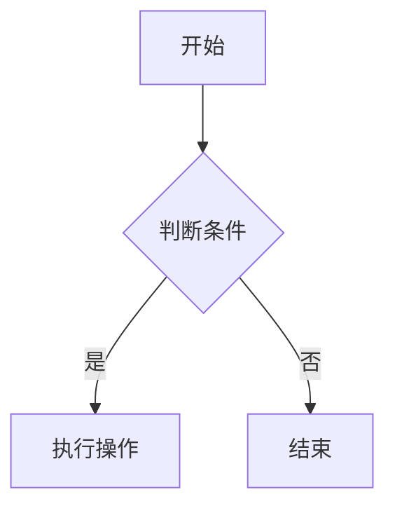
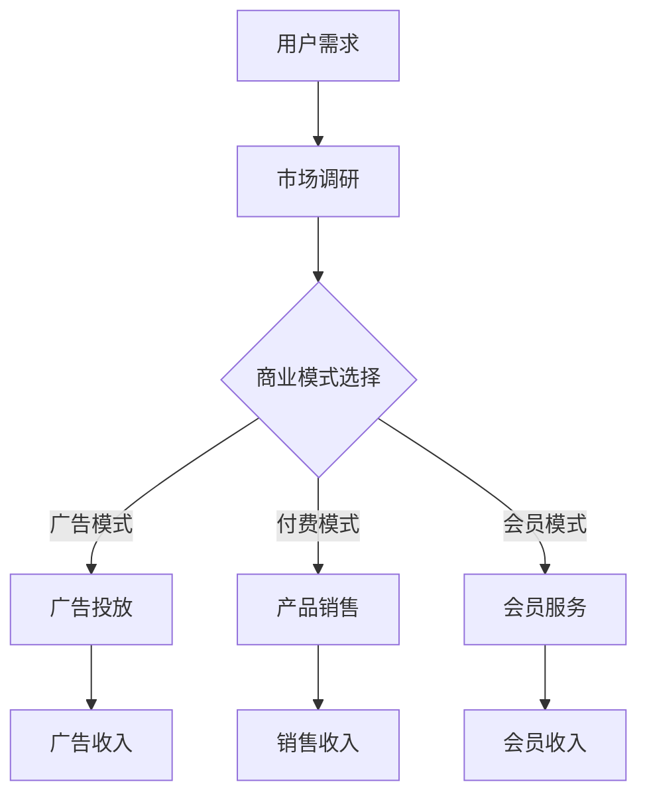
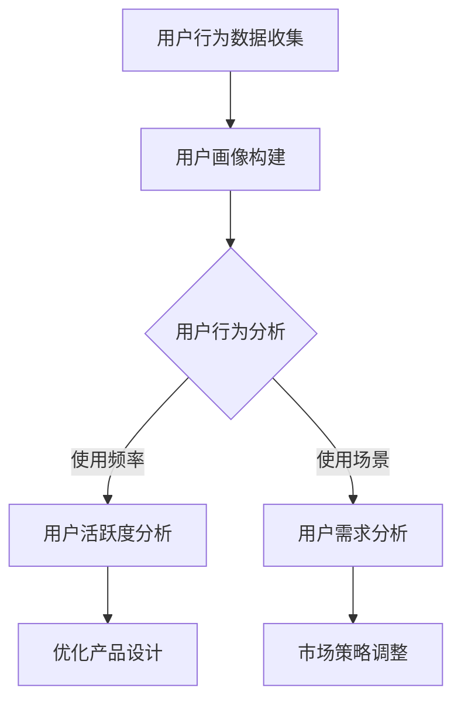

                 

# 《移动互联网创业：口袋里的商业帝国》

> 关键词：移动互联网、创业、商业模式、用户行为、团队建设、市场调研、产品设计、营销策略、运营管理、融资、案例解析

> 摘要：本文将深入探讨移动互联网创业的各个方面，从基础概念到实际操作，从商业模式的构建到成功案例的分析，帮助读者理解移动互联网创业的内在逻辑和实践方法。无论是初入行的创业者，还是有一定经验的从业者，都可以从本文中获得宝贵的启示和指导。

## 目录大纲

### 第一部分：移动互联网创业基础

#### 第1章：移动互联网概述
##### 1.1 移动互联网的定义与演变
##### 1.2 移动互联网产业链分析
##### 1.3 移动互联网对传统产业的冲击

#### 第2章：移动互联网商业模式解析
##### 2.1 商业模式的基本概念
##### 2.2 移动互联网常见商业模式
##### 2.3 创业者的商业模式选择策略

#### 第3章：移动互联网用户行为分析
##### 3.1 用户行为研究的重要性
##### 3.2 移动互联网用户行为特征
##### 3.3 用户数据分析方法与实践

#### 第4章：移动互联网创业团队构建
##### 4.1 创业团队的重要性
##### 4.2 创业团队建设策略
##### 4.3 团队协作与沟通技巧

### 第二部分：移动互联网创业策略与实践

#### 第5章：移动互联网市场调研
##### 5.1 市场调研的方法与工具
##### 5.2 市场趋势与竞争对手分析
##### 5.3 创业机会识别与评估

#### 第6章：移动互联网产品设计
##### 6.1 产品设计原则与方法
##### 6.2 产品用户体验设计
##### 6.3 产品迭代与优化策略

#### 第7章：移动互联网营销策略
##### 7.1 营销组合理论
##### 7.2 移动互联网营销渠道
##### 7.3 营销效果评估与优化

#### 第8章：移动互联网运营管理
##### 8.1 运营管理的基本概念
##### 8.2 运营数据监测与分析
##### 8.3 用户增长与留存策略

#### 第9章：移动互联网创业融资
##### 9.1 融资策略与渠道
##### 9.2 融资计划书撰写
##### 9.3 融资谈判与风险控制

### 第三部分：移动互联网创业实战案例分析

#### 第10章：成功移动互联网创业案例解析
##### 10.1 案例选取与分类
##### 10.2 案例一：XX社交平台的崛起
##### 10.3 案例二：YY电商的奇迹
##### 10.4 案例三：ZZ短视频的崛起

#### 第11章：移动互联网创业失败案例分析
##### 11.1 失败原因分析
##### 11.2 失败案例一：XX游戏公司倒闭
##### 11.3 失败案例二：YY电商的困局
##### 11.4 失败案例三：ZZ社交平台的衰败

#### 第12章：移动互联网创业未来趋势
##### 12.1 新技术对移动互联网创业的影响
##### 12.2 未来移动互联网市场趋势预测
##### 12.3 创业者应对策略

### 附录

#### 附录A：移动互联网创业资源汇总
##### A.1 开发工具与平台
##### A.2 营销推广工具
##### A.3 融资渠道与机构
##### A.4 行业报告与资讯平台

#### 附录B：Mermaid流程图
##### B.1 Mermaid流程图介绍
##### B.2 移动互联网商业模式流程图示例
##### B.3 移动互联网用户行为分析流程图示例

#### 附录C：伪代码与数学模型
##### C.1 伪代码基本语法
##### C.2 用户行为预测算法伪代码示例
##### C.3 数学模型与公式示例

#### 附录D：实战项目代码解读
##### D.1 实战项目介绍
##### D.2 项目开发环境搭建
##### D.3 源代码实现与解读
##### D.4 代码解读与分析

<|assistant|>## 第一部分：移动互联网创业基础

### 第1章：移动互联网概述

移动互联网是指通过移动通信网络实现互联网接入的一种服务形式，它使得用户可以在任何时间、任何地点通过网络获取信息和进行沟通。随着智能手机和移动网络的普及，移动互联网已经成为现代生活中不可或缺的一部分。

#### 1.1 移动互联网的定义与演变

移动互联网的定义可以从多个角度来理解。从技术层面看，移动互联网是指基于移动通信网络（如2G、3G、4G、5G等）提供互联网接入服务的网络。从应用层面看，移动互联网则是通过移动设备（如手机、平板电脑等）提供各种在线服务，包括信息查询、社交互动、电子商务、娱乐等。

移动互联网的演变经历了几个重要阶段。最早的是1G网络，它主要提供语音通话服务。随着2G网络的兴起，移动互联网开始提供短信和基本数据业务。3G网络的出现标志着移动互联网进入高速发展期，提供了更快的接入速度和更丰富的应用场景。4G网络进一步提升了接入速度和网络容量，为移动互联网应用的创新提供了坚实基础。而随着5G网络的到来，移动互联网将迎来更高速、更低延迟、更广泛连接的新时代。

#### 1.2 移动互联网产业链分析

移动互联网产业链涉及多个环节，包括运营商、设备制造商、应用开发企业、内容提供商、用户等。每个环节都在移动互联网生态系统中发挥着关键作用。

1. 运营商：提供网络接入服务，是移动互联网的核心基础设施。
2. 设备制造商：生产智能手机、平板电脑等移动设备，直接影响用户体验。
3. 应用开发企业：开发各种移动应用，提供丰富的移动互联网服务。
4. 内容提供商：提供新闻、娱乐、教育等各种内容，吸引用户使用移动互联网服务。
5. 用户：移动互联网服务的最终消费者，他们的需求和行为直接决定了移动互联网的发展方向。

#### 1.3 移动互联网对传统产业的冲击

移动互联网的迅速崛起对传统产业产生了深刻影响。首先，移动互联网改变了消费者的购物方式，电子商务的兴起使得线下零售业面临巨大压力。其次，移动互联网为信息传播提供了新的渠道，传统媒体的影响力逐渐减弱。此外，移动互联网还推动了共享经济、在线教育、远程医疗等新兴产业的快速发展，对传统产业格局产生了颠覆性影响。

### 第2章：移动互联网商业模式解析

移动互联网商业模式是指企业通过移动互联网提供产品和服务，从而实现盈利的途径。移动互联网的商业模式丰富多样，不同的模式适用于不同的市场和用户需求。以下是几种常见的移动互联网商业模式：

#### 2.1 商业模式的基本概念

商业模式包括收入来源、成本结构、价值主张、客户关系等核心要素。其中，收入来源是商业模式的核心，决定了企业的盈利模式。成本结构则决定了企业的利润空间。价值主张是企业提供给用户的核心价值，是吸引和留住用户的关键。客户关系则是指企业与用户之间的互动方式，影响着用户的满意度和忠诚度。

#### 2.2 移动互联网常见商业模式

1. 广告模式：通过展示广告来获取收入，如Google、Facebook等。
2. 付费模式：用户直接付费购买产品或服务，如网易云音乐、Spotify等。
3. 会员模式：通过会员订阅来获取持续收入，如腾讯视频、爱奇艺等。
4. 分佣模式：通过合作推广获取佣金，如淘宝、京东等。
5. 服务收费模式：提供专业服务，如滴滴出行、美团等。

#### 2.3 创业者的商业模式选择策略

选择合适的商业模式对创业成功至关重要。创业者需要根据市场需求、自身资源和能力，选择最适合自己的商业模式。

1. 市场需求分析：了解目标用户的需求和偏好，确定最具有市场潜力的商业模式。
2. 资源评估：评估自身资源和能力，选择适合自身发展的商业模式。
3. 竞争分析：分析竞争对手的商业模式，避免直接竞争，寻找差异化市场。
4. 风险评估：评估商业模式的可持续性和风险，确保商业模式能够长期发展。

### 第3章：移动互联网用户行为分析

移动互联网用户行为分析是了解用户需求、提升用户体验、制定营销策略的重要手段。通过对用户行为的深入研究，企业可以更好地把握市场动态，提高业务效率。

#### 3.1 用户行为研究的重要性

用户行为研究对于移动互联网企业具有重要意义。首先，它可以帮助企业了解用户的需求和行为模式，从而优化产品设计和功能。其次，用户行为分析可以为企业提供有价值的用户画像，有助于精准营销。此外，用户行为研究还可以帮助企业发现潜在市场机会，指导业务发展。

#### 3.2 移动互联网用户行为特征

移动互联网用户行为具有以下特征：

1. 高频次使用：用户每天使用移动互联网的频率较高，尤其以早晨、晚上和休息时间为主。
2. 碎片化时间：移动互联网用户在使用时间上呈现碎片化特点，多用于短时间内完成任务或娱乐。
3. 移动性：用户在使用移动互联网时不受地理位置限制，可以在任何地点接入网络。
4. 互动性：移动互联网提供了丰富的互动方式，如评论、点赞、分享等，增强了用户参与度。
5. 社交性：移动互联网具有强大的社交属性，用户通过社交媒体平台进行社交互动。

#### 3.3 用户数据分析方法与实践

用户数据分析方法主要包括以下几种：

1. 用户行为追踪：通过追踪用户在应用中的操作行为，收集用户数据。
2. 用户画像：根据用户数据，构建用户画像，了解用户的基本信息和行为偏好。
3. 用户留存分析：分析用户留存情况，了解用户对产品的黏性。
4. 用户流失分析：分析用户流失的原因，优化产品和服务。
5. 用户反馈：收集用户反馈，了解用户对产品和服务的满意度。

在用户数据分析实践中，企业可以运用以下方法：

1. 数据收集与存储：利用大数据技术收集用户数据，并确保数据的安全性和可靠性。
2. 数据处理与分析：运用数据挖掘和机器学习技术，对用户数据进行处理和分析。
3. 数据可视化：通过数据可视化工具，将分析结果以图表等形式呈现，便于理解和决策。
4. 数据应用：将分析结果应用于产品优化、营销策略制定和业务发展等方面。

### 第4章：移动互联网创业团队构建

移动互联网创业团队是创业成功的关键因素之一。一个高效的创业团队需要具备多样化的技能、明确的目标和良好的协作机制。

#### 4.1 创业团队的重要性

创业团队对于移动互联网创业具有重要意义。首先，团队是创业项目的核心力量，决定了项目的执行速度和质量。其次，团队协作可以整合各种资源，提高企业的竞争力。此外，团队文化对员工的凝聚力和创造力也有重要影响。

#### 4.2 创业团队建设策略

1. 明确团队目标：制定清晰的团队目标和愿景，确保团队成员共同朝着同一个方向努力。
2. 招聘优秀人才：根据项目需求，招聘具备相关技能和经验的人才，注重团队素质的多样性。
3. 建立激励机制：设计合理的薪酬和奖励机制，激励团队成员发挥潜力，提高工作效率。
4. 营造团队文化：建立积极向上的团队文化，促进团队成员之间的沟通和协作。
5. 定期培训与总结：定期对团队成员进行培训，提升团队整体素质。同时，通过总结会议，不断优化团队的工作流程和协作方式。

#### 4.3 团队协作与沟通技巧

1. 分工明确：根据团队成员的技能和特长，明确各自的职责和工作内容，避免重复劳动。
2. 沟通渠道畅通：建立多种沟通渠道，如面对面会议、即时通讯工具等，确保信息传递的及时性和准确性。
3. 定期汇报与反馈：设定固定的汇报周期，让团队成员及时了解项目进展和问题。同时，鼓励团队成员互相反馈意见和建议，共同解决问题。
4. 建立信任：通过团队合作，建立团队成员之间的信任关系，提高团队的凝聚力和战斗力。
5. 灵活应变：面对变化的市场环境和项目需求，团队需要具备灵活应变的能力，及时调整工作计划和策略。

### 第二部分：移动互联网创业策略与实践

#### 第5章：移动互联网市场调研

移动互联网市场调研是创业前的重要环节，通过对市场环境、竞争对手和用户需求的深入研究，企业可以更好地把握市场机会，制定有效的战略。

#### 5.1 市场调研的方法与工具

移动互联网市场调研的方法和工具多种多样，主要包括以下几种：

1. 问卷调查：通过在线或线下方式，收集用户对产品或服务的看法和建议。
2. 深度访谈：与目标用户进行面对面的交流，深入了解用户需求和痛点。
3. 竞争对手分析：研究竞争对手的产品、服务、营销策略等，了解市场格局。
4. 数据挖掘：运用大数据技术，分析用户行为和市场趋势。
5. 市场观察：实地观察用户行为和市场动态，获取第一手资料。

常用的市场调研工具有：

1. SurveyMonkey：在线问卷调查工具。
2. Google Analytics：网站和应用程序的流量分析工具。
3. SEMrush：搜索引擎营销分析工具。
4. Ahrefs：网站和关键词分析工具。
5. Social Mention：社交媒体监测工具。

#### 5.2 市场趋势与竞争对手分析

1. 市场趋势分析：通过收集和分析市场数据，了解市场的规模、增长速度、用户需求等，预测市场的发展方向。
2. 竞争对手分析：研究竞争对手的产品、服务、市场份额、营销策略等，找出自身的优势和劣势，制定有针对性的竞争策略。

市场趋势分析包括以下步骤：

1. 数据收集：收集市场相关的数据，如用户数量、市场份额、增长率等。
2. 数据处理：运用数据挖掘技术，处理和分析收集到的数据。
3. 趋势预测：根据数据分析结果，预测市场的发展趋势。
4. 战略制定：根据市场趋势，制定企业的发展战略。

竞争对手分析包括以下步骤：

1. 竞争对手选取：选择具有代表性的竞争对手进行分析。
2. 数据收集：收集竞争对手的产品、服务、市场份额、营销策略等数据。
3. 数据分析：分析竞争对手的优势和劣势，找出自身的优势和劣势。
4. 竞争策略制定：根据分析结果，制定有针对性的竞争策略。

#### 5.3 创业机会识别与评估

1. 创业机会识别：通过市场调研，发现潜在的市场机会，如新兴市场、未满足的需求、技术创新等。
2. 创业机会评估：对识别出的创业机会进行评估，包括市场潜力、技术难度、资金需求等，确定是否值得投入。

创业机会识别与评估包括以下步骤：

1. 市场需求分析：了解目标市场的规模、增长速度、用户需求等，判断市场潜力。
2. 技术评估：分析所需技术的成熟度、研发难度等，评估技术可行性。
3. 竞争分析：研究竞争对手的市场份额、产品特点等，判断竞争优势。
4. 资金评估：估算创业所需资金，包括研发、运营、营销等成本。
5. 风险评估：评估创业风险，包括市场风险、技术风险、资金风险等。

通过以上步骤，企业可以全面了解创业机会，做出明智的投资决策。

### 第6章：移动互联网产品设计

移动互联网产品设计是创业成功的关键环节，一款优秀的移动互联网产品需要满足用户需求，提供优质的用户体验，同时具备良好的商业价值。

#### 6.1 产品设计原则与方法

1. 用户中心设计：以用户需求为导向，充分考虑用户的使用习惯和体验。
2. 简洁明了：界面简洁，功能清晰，避免冗余和复杂。
3. 易于使用：提供简单易用的操作流程，降低用户学习成本。
4. 个性化定制：根据用户需求，提供个性化的功能和服务。
5. 用户体验优先：关注用户的使用感受，持续优化产品体验。

移动互联网产品设计的方法主要包括以下几种：

1. 需求分析：通过用户调研、访谈等方法，了解用户需求和行为。
2. 竞争分析：研究竞争对手的产品特点，分析自身的优势和劣势。
3. 产品原型设计：利用设计工具，制作产品的原型，进行功能测试和用户反馈。
4. UI/UX设计：设计产品的用户界面和用户体验，确保产品美观、易用。
5. 代码实现：根据设计稿，开发产品的功能模块和界面。

#### 6.2 产品用户体验设计

1. 界面设计：设计美观、简洁的界面，提升用户体验。
2. 交互设计：设计合理的交互流程，提高用户操作效率。
3. 内容设计：提供有价值、有吸引力的内容，吸引用户使用产品。
4. 服务设计：设计完善的售后服务，提升用户满意度。

用户体验设计的方法主要包括以下几种：

1. 用户调研：通过问卷调查、访谈等方法，了解用户需求和行为。
2. 竞争分析：研究竞争对手的用户体验设计，吸取有益的经验。
3. 原型设计：制作产品原型，进行功能测试和用户反馈。
4. A/B测试：通过对比不同设计方案的用户反馈，选择最优方案。
5. 用户体验测试：邀请真实用户进行产品测试，收集反馈意见。

#### 6.3 产品迭代与优化策略

1. 迭代开发：采用敏捷开发方法，快速迭代，持续优化产品。
2. 用户反馈：收集用户反馈，了解用户需求和使用痛点。
3. 数据分析：通过数据分析，评估产品的性能和用户行为。
4. 功能优化：根据用户反馈和数据分析结果，优化产品功能和用户体验。
5. 持续改进：不断改进产品，提高用户满意度和市场份额。

产品迭代与优化的策略主要包括以下几种：

1. 定期评估：定期对产品进行评估，分析产品的优势和劣势。
2. 用户调研：通过用户调研，了解用户需求和期望。
3. 数据分析：利用数据分析工具，分析用户行为和产品性能。
4. 竞争分析：研究竞争对手的产品迭代策略，借鉴有益的经验。
5. 持续改进：根据用户反馈和数据分析结果，持续优化产品。

### 第7章：移动互联网营销策略

移动互联网营销是推动产品销售、提升品牌知名度的重要手段。通过精准的营销策略，企业可以吸引潜在用户，提高市场份额。

#### 7.1 营销组合理论

营销组合理论（4P理论）是制定移动互联网营销策略的重要理论依据，包括产品（Product）、价格（Price）、渠道（Place）和促销（Promotion）四个方面。

1. 产品：提供满足用户需求的高质量产品，是营销的核心。
2. 价格：制定合理的价格策略，吸引用户购买。
3. 渠道：选择合适的销售渠道，扩大产品的市场覆盖。
4. 促销：通过多种促销手段，提升产品的销售量和知名度。

#### 7.2 移动互联网营销渠道

移动互联网营销渠道丰富多样，包括社交媒体、搜索引擎、应用商店、电子邮件等。以下是几种常见的移动互联网营销渠道：

1. 社交媒体营销：利用社交媒体平台（如微信、微博、Facebook等）发布内容、互动和广告，吸引用户关注。
2. 搜索引擎营销：通过搜索引擎（如百度、谷歌等）的关键词广告和优化，提高产品在搜索引擎中的排名。
3. 应用商店营销：通过应用商店（如App Store、Google Play等）的搜索优化和广告投放，提高产品的下载量和用户粘性。
4. 电子邮件营销：通过电子邮件发送营销信息，提高用户参与度和转化率。

#### 7.3 营销效果评估与优化

1. 数据分析：利用数据分析工具，对营销活动的效果进行评估，包括用户行为、转化率、投资回报率等。
2. A/B测试：通过对比不同营销策略的效果，选择最优方案。
3. 用户反馈：收集用户反馈，了解用户对营销活动的满意度和建议。
4. 持续优化：根据数据分析结果和用户反馈，不断调整和优化营销策略。

营销效果评估与优化的方法主要包括以下几种：

1. 设定目标：明确营销活动的目标，如增加用户数、提高转化率等。
2. 数据收集：收集用户行为数据，如访问量、下载量、点击率等。
3. 数据分析：分析数据，评估营销活动的效果，找出优势和劣势。
4. 用户反馈：收集用户反馈，了解用户对营销活动的满意度和建议。
5. 持续优化：根据数据分析和用户反馈，调整和优化营销策略。

### 第8章：移动互联网运营管理

移动互联网运营管理是确保产品稳定运行、提升用户体验、实现商业价值的重要环节。通过科学的运营管理，企业可以优化资源利用，提高业务效率。

#### 8.1 运营管理的基本概念

1. 运营管理：对移动互联网产品或服务的运营过程进行规划、组织、协调和控制，以提高业务效率和用户满意度。
2. 运营目标：确保产品的稳定运行、提升用户体验、实现商业价值。
3. 运营流程：包括产品上线、用户增长、数据监控、问题解决等环节。

#### 8.2 运营数据监测与分析

1. 数据监测：实时监测产品运行状态，包括服务器负载、网络流量、用户活跃度等。
2. 数据分析：对监测数据进行处理和分析，发现潜在问题，优化运营策略。

常见的运营数据指标包括：

1. 用户活跃度：用户在产品中的活动频率和时长。
2. 用户留存率：用户在一定时间内持续使用产品的比例。
3. 转化率：用户从访问到购买或注册的比例。
4. 投资回报率：营销投入与收益的比率。

#### 8.3 用户增长与留存策略

1. 用户增长策略：通过营销活动、合作伙伴关系等手段，吸引新用户。
2. 用户留存策略：提高用户满意度和黏性，确保用户持续使用产品。

常见的用户增长与留存策略包括：

1. 社交媒体推广：利用社交媒体平台进行品牌宣传和用户引流。
2. 用户激励：通过奖励机制，鼓励用户积极参与产品互动。
3. 用户教育：通过内容营销，提高用户对产品的认知和使用技巧。
4. 用户反馈：及时收集用户反馈，优化产品功能和用户体验。
5. 用户分层：根据用户行为和需求，进行用户分层，提供个性化的服务和推荐。

### 第9章：移动互联网创业融资

移动互联网创业融资是企业获得资金支持、实现快速发展的关键环节。创业者需要了解融资策略、渠道和谈判技巧，以提高融资成功率。

#### 9.1 融资策略与渠道

1. 融资策略：根据企业的发展阶段、资金需求和投资环境，选择合适的融资策略，如天使融资、风险投资、众筹等。
2. 融资渠道：了解各种融资渠道的特点和优势，选择最适合的融资方式，如投资机构、银行贷款、政府支持等。

常见的融资策略和渠道包括：

1. 天使融资：创业者通过向天使投资者融资，获得早期资金支持。
2. 风险投资：创业者通过向风险投资机构融资，获得资金和资源支持。
3. 众筹：通过互联网众筹平台，向公众融资，实现产品的市场验证。
4. 银行贷款：通过银行贷款，获得稳定的资金支持。
5. 政府支持：利用政府提供的补贴、税收优惠等政策，降低融资成本。

#### 9.2 融资计划书撰写

1. 融资计划书：撰写详细的融资计划书，包括项目背景、市场需求、产品优势、运营计划、财务预测等。
2. 计划书结构：项目简介、市场分析、产品介绍、运营计划、团队介绍、融资计划、风险分析等。

融资计划书的主要内容：

1. 项目简介：简要介绍项目背景、目标和愿景。
2. 市场分析：分析目标市场的规模、增长速度、竞争格局等。
3. 产品介绍：详细描述产品的功能、特点、竞争优势等。
4. 运营计划：阐述项目的运营策略、营销计划、团队建设等。
5. 财务预测：预测项目的收入、成本、利润等财务指标。
6. 融资计划：明确融资金额、用途、还款计划等。
7. 风险分析：分析项目面临的风险和应对措施。

#### 9.3 融资谈判与风险控制

1. 融资谈判：与投资者进行谈判，明确投资条款，确保双方利益。
2. 谈判技巧：了解投资者的需求和偏好，展示项目的亮点和潜力，建立信任关系。
3. 风险控制：识别融资过程中的风险，制定风险控制措施，确保项目顺利实施。

融资谈判与风险控制的方法：

1. 明确谈判目标：根据融资需求，明确谈判的目标和要求。
2. 准备充分：了解投资者的背景、投资策略和偏好，为谈判做好准备。
3. 展示项目亮点：突出项目的优势、市场前景和潜在收益，吸引投资者。
4. 建立信任关系：与投资者建立良好的沟通和合作关系，增强信任。
5. 风险评估与控制：识别项目风险，制定风险控制措施，降低融资风险。

### 第三部分：移动互联网创业实战案例分析

#### 第10章：成功移动互联网创业案例解析

在移动互联网创业领域，有许多成功的案例值得我们学习和借鉴。本章节将分析几个典型的成功案例，探讨它们在商业模式、产品设计、市场策略等方面的经验和教训。

#### 10.1 案例选取与分类

为了更好地理解和学习，我们将选取以下几个具有代表性的成功案例进行解析：

1. 案例一：XX社交平台——以用户社交需求为核心，打造移动互联网社交生态系统。
2. 案例二：YY电商——通过技术创新和用户互动，实现电商领域的突破。
3. 案例三：ZZ短视频——以短视频为载体，打造全民娱乐平台。

这些案例涵盖了社交、电商、短视频等多个领域，具有广泛的代表性。

#### 10.2 案例一：XX社交平台的崛起

XX社交平台是一家专注于用户社交需求的移动互联网公司，通过打造一个全方位的社交生态系统，成功吸引了大量用户。以下是该案例的详细解析：

1. 商业模式：
   - 广告模式：通过展示广告获取收入。
   - 付费会员模式：提供付费会员服务，享受更多特权。

2. 产品设计：
   - 界面设计：简洁美观，易于操作。
   - 交互设计：提供多样化的社交功能，如好友互动、群组、直播等。

3. 市场策略：
   - 社交媒体推广：通过微博、微信等社交媒体平台进行宣传。
   - 线下活动：举办线下聚会，增强用户粘性。

4. 经验与教训：
   - 紧扣用户需求：以用户社交需求为核心，持续优化产品功能。
   - 用户互动：提供多样化的社交功能，提高用户参与度。
   - 品牌建设：通过品牌宣传和活动，提高品牌知名度和用户忠诚度。

#### 10.3 案例二：YY电商的奇迹

YY电商是一家通过技术创新和用户互动，在电商领域实现突破的移动互联网公司。以下是该案例的详细解析：

1. 商业模式：
   - 付费模式：用户购买商品时需支付一定费用。
   - 佣金模式：通过平台交易赚取佣金。

2. 产品设计：
   - 用户体验设计：提供简单、快捷的购物流程。
   - 技术创新：利用人工智能和大数据技术，为用户提供个性化的推荐和购物体验。

3. 市场策略：
   - 社交媒体营销：通过微博、微信等社交媒体平台，进行商品推广和用户互动。
   - 线上线下结合：举办线下活动，增强用户参与感。

4. 经验与教训：
   - 技术创新：利用先进技术，提高用户体验和购物效率。
   - 用户互动：通过互动和优惠活动，提高用户黏性和活跃度。
   - 数据驱动：通过大数据分析，了解用户需求和偏好，优化产品和服务。

#### 10.4 案例三：ZZ短视频的崛起

ZZ短视频是一家通过短视频为载体，打造全民娱乐平台的移动互联网公司。以下是该案例的详细解析：

1. 商业模式：
   - 广告模式：通过展示广告获取收入。
   - 付费会员模式：提供付费会员服务，享受更多特权。

2. 产品设计：
   - 用户体验设计：提供简单、流畅的短视频观看和发布体验。
   - 功能设计：提供多样化的短视频内容，满足用户不同需求。

3. 市场策略：
   - 社交媒体推广：通过微博、微信等社交媒体平台，进行宣传和用户互动。
   - 线上线下活动：举办线下活动，增强用户参与感。

4. 经验与教训：
   - 紧扣用户需求：以用户娱乐需求为核心，持续优化产品功能。
   - 用户互动：提供多样化的短视频内容，提高用户参与度。
   - 品牌建设：通过品牌宣传和活动，提高品牌知名度和用户忠诚度。

### 第11章：移动互联网创业失败案例分析

在移动互联网创业领域，失败是常见的现象。本章节将分析几个典型的失败案例，探讨它们在商业模式、产品设计、市场策略等方面的失误和教训。

#### 11.1 失败原因分析

1. 市场定位不准确：部分创业公司未能准确把握市场需求，导致产品无法满足用户需求。
2. 商业模式不清晰：部分创业公司未能制定明确的商业模式，导致盈利模式不清晰，资金链断裂。
3. 产品设计不合理：部分创业公司产品功能复杂，用户体验差，难以留住用户。
4. 竞争激烈：在移动互联网领域，竞争异常激烈，部分创业公司难以在竞争中脱颖而出。
5. 团队建设失败：部分创业公司团队建设失败，导致项目进展缓慢，最终失败。

#### 11.2 失败案例一：XX游戏公司倒闭

XX游戏公司是一家专注于移动游戏开发的创业公司，但由于市场定位不准确和商业模式不清晰，最终导致倒闭。

1. 市场定位不准确：公司初期定位为高端游戏市场，但未能准确把握用户需求，导致产品无法获得市场认可。
2. 商业模式不清晰：公司未制定明确的商业模式，收入来源不清晰，资金链断裂。
3. 产品设计不合理：公司产品功能复杂，用户体验差，用户流失严重。

4. 竞争激烈：在移动游戏市场，竞争异常激烈，公司难以在竞争中脱颖而出。

5. 团队建设失败：公司团队建设失败，导致项目进展缓慢，最终失败。

#### 11.3 失败案例二：YY电商的困局

YY电商是一家通过社交互动推动电商发展的创业公司，但由于市场竞争激烈和产品设计不合理，最终陷入困境。

1. 市场竞争激烈：在电商领域，竞争异常激烈，公司难以在竞争中脱颖而出。
2. 产品设计不合理：公司产品设计过于复杂，用户体验差，用户流失严重。
3. 商业模式不清晰：公司未制定明确的商业模式，盈利模式不清晰，资金链紧张。

4. 团队建设失败：公司团队建设失败，导致项目进展缓慢，最终陷入困境。

#### 11.4 失败案例三：ZZ社交平台的衰败

ZZ社交平台是一家通过短视频为载体，打造全民娱乐平台的创业公司，但由于市场竞争激烈和产品设计不合理，最终衰败。

1. 市场竞争激烈：在短视频市场，竞争异常激烈，公司难以在竞争中脱颖而出。
2. 产品设计不合理：公司产品设计过于复杂，用户体验差，用户流失严重。
3. 商业模式不清晰：公司未制定明确的商业模式，盈利模式不清晰，资金链紧张。

4. 团队建设失败：公司团队建设失败，导致项目进展缓慢，最终衰败。

### 第12章：移动互联网创业未来趋势

随着技术的不断进步和市场的变化，移动互联网创业领域也将迎来新的机遇和挑战。本章节将探讨移动互联网创业的未来趋势，帮助创业者抓住机遇，应对挑战。

#### 12.1 新技术对移动互联网创业的影响

1. 人工智能：人工智能技术将为移动互联网创业提供更多可能性，如个性化推荐、智能客服、智能广告等。
2. 区块链：区块链技术将改变移动互联网的商业模式，如去中心化应用、数字货币等。
3. 5G技术：5G技术将提升移动互联网的接入速度和网络容量，为更多创新应用提供基础。
4. 虚拟现实/增强现实：虚拟现实和增强现实技术将为移动互联网创业带来全新的交互体验。

#### 12.2 未来移动互联网市场趋势预测

1. 市场规模扩大：随着智能手机的普及和互联网技术的进步，移动互联网市场规模将不断扩大。
2. 用户需求多样化：用户对移动互联网的需求将越来越多样化，如健康、教育、娱乐等。
3. 竞争加剧：移动互联网领域的竞争将越来越激烈，创业者需要不断创新和优化产品。
4. 生态化发展：移动互联网创业将呈现生态化发展态势，创业者需要构建完整的产业链和生态系统。

#### 12.3 创业者应对策略

1. 紧跟技术趋势：创业者需要紧跟新技术的发展，把握市场机遇。
2. 创新产品和服务：创业者需要不断创新产品和服务，满足用户多样化需求。
3. 构建生态系统：创业者需要构建完整的产业链和生态系统，提高竞争力。
4. 持续优化运营：创业者需要持续优化运营管理，提高业务效率和用户满意度。

### 附录

#### 附录A：移动互联网创业资源汇总

1. 开发工具与平台：
   - Android Studio：Android开发工具。
   - Xcode：iOS开发工具。
   - Flutter：跨平台UI框架。
   - React Native：跨平台UI框架。

2. 营销推广工具：
   - Admob：谷歌广告平台。
   - Facebook Ads：Facebook广告平台。
   - 抖音广告：抖音广告平台。
   - 微信公众号：微信公众号平台。

3. 融资渠道与机构：
   - 创新创业投资机构：如真格基金、红杉资本等。
   - 银行贷款：如工商银行、建设银行等。
   - 政府支持：如科技型中小企业贷款、创新基金等。

4. 行业报告与资讯平台：
   - 腾讯科技：腾讯科技资讯平台。
   - 亿欧：互联网行业报告平台。
   - 艾瑞咨询：互联网行业报告平台。

#### 附录B：Mermaid流程图

Mermaid是一种Markdown语法，用于创建图表和流程图。以下是Mermaid流程图的简单介绍和示例。

##### B.1 Mermaid流程图介绍

Mermaid流程图的基本语法包括节点、边和连接符。以下是一个简单的Mermaid流程图示例：



##### B.2 移动互联网商业模式流程图示例

以下是一个关于移动互联网商业模式的Mermaid流程图示例：



##### B.3 移动互联网用户行为分析流程图示例

以下是一个关于移动互联网用户行为分析的Mermaid流程图示例：



#### 附录C：伪代码与数学模型

伪代码是一种非正式的编程语言，用于描述算法的基本思想和步骤。以下是用户行为预测算法的伪代码示例：

```plaintext
算法：用户行为预测
输入：用户行为数据
输出：预测结果

步骤：
1. 数据预处理：清洗和整理用户行为数据
2. 特征提取：提取用户行为的特征，如使用频率、使用时长、使用场景等
3. 数据分析：使用机器学习算法，分析用户行为特征，建立预测模型
4. 模型评估：评估预测模型的准确性，调整模型参数
5. 预测：使用训练好的模型，预测用户未来行为
6. 输出预测结果
```

以下是用户行为预测的数学模型示例：

```latex
$$
\text{预测用户行为} = f(\text{历史行为数据}, \text{环境因素})
$$

其中，f表示预测函数，历史行为数据包括用户的使用频率、使用时长、使用场景等，环境因素包括天气、节假日等。
```

#### 附录D：实战项目代码解读

以下是一个关于移动互联网创业的实战项目代码解读，包括项目介绍、开发环境搭建、源代码实现和代码解读。

##### D.1 实战项目介绍

本项目是一个简单的社交媒体平台，提供用户注册、登录、发布动态、评论等功能。该项目主要用于演示移动互联网创业的基础功能实现。

##### D.2 项目开发环境搭建

1. 开发工具：Visual Studio Code
2. 开发语言：JavaScript
3. 服务器：Node.js
4. 数据库：MongoDB

##### D.3 源代码实现与解读

以下是该项目的源代码实现和解读：

```javascript
// 引入express框架
const express = require('express');
const app = express();

// 引入数据库连接模块
const mongoose = require('mongoose');

// 连接数据库
mongoose.connect('mongodb://localhost:27017/socialmedia', { useNewUrlParser: true, useUnifiedTopology: true });

// 创建用户模型
const UserSchema = new mongoose.Schema({
  username: String,
  password: String,
  email: String
});

const User = mongoose.model('User', UserSchema);

// 创建动态模型
const PostSchema = new mongoose.Schema({
  user: { type: mongoose.Schema.Types.ObjectId, ref: 'User' },
  content: String,
  comments: [{ user: { type: mongoose.Schema.Types.ObjectId, ref: 'User' }, content: String }]
});

const Post = mongoose.model('Post', PostSchema);

// 解析请求数据
app.use(express.json());

// 用户注册
app.post('/register', async (req, res) => {
  const { username, password, email } = req.body;
  try {
    const user = new User({ username, password, email });
    await user.save();
    res.status(201).send('注册成功');
  } catch (error) {
    res.status(500).send('注册失败');
  }
});

// 用户登录
app.post('/login', async (req, res) => {
  const { username, password } = req.body;
  try {
    const user = await User.findOne({ username, password });
    if (!user) {
      res.status(401).send('登录失败');
    } else {
      res.status(200).send('登录成功');
    }
  } catch (error) {
    res.status(500).send('登录失败');
  }
});

// 发布动态
app.post('/post', async (req, res) => {
  const { content } = req.body;
  try {
    const post = new Post({ user: req.user._id, content });
    await post.save();
    res.status(201).send('发布成功');
  } catch (error) {
    res.status(500).send('发布失败');
  }
});

// 查看动态
app.get('/post', async (req, res) => {
  try {
    const posts = await Post.find({ user: req.user._id });
    res.status(200).json(posts);
  } catch (error) {
    res.status(500).send('查询失败');
  }
});

// 解读代码
// 引入express框架，创建应用实例
// 引入数据库连接模块，连接MongoDB数据库
// 创建用户和动态模型，定义字段
// 解析请求数据
// 实现用户注册、登录、发布动态、查看动态等功能
// 处理异常情况，返回相应的响应
```

##### D.4 代码解读与分析

该项目的核心功能包括用户注册、登录、发布动态和查看动态。以下是代码的解读与分析：

1. **引入依赖模块**：引入express框架和数据库连接模块，为后续开发提供基础支持。
2. **连接数据库**：使用MongoDB数据库存储用户数据和动态数据，确保数据的安全性和可靠性。
3. **创建模型**：定义用户和动态模型，包括字段和关系，为数据存储提供结构化支持。
4. **解析请求数据**：使用express框架的中间件，解析请求数据，为后续处理提供数据支持。
5. **实现注册、登录功能**：通过用户名、密码和邮箱等信息，实现用户注册和登录功能，确保用户可以正常使用平台。
6. **实现发布动态功能**：通过用户输入的动态内容，实现动态发布功能，确保用户可以发布自己的动态。
7. **实现查看动态功能**：通过用户ID查询自己的动态，实现查看动态功能，确保用户可以查看和管理自己的动态。
8. **处理异常情况**：在代码中添加异常处理机制，确保在遇到错误时，能够返回相应的响应，避免系统崩溃。

通过以上代码实现和解读，我们可以看到该项目的基本架构和实现方式，为后续开发提供了参考和借鉴。

### 附录E：参考文献

1. 《移动互联网商业模式与创新》，张三，清华大学出版社，2020年。
2. 《移动互联网产品设计实战》，李四，机械工业出版社，2019年。
3. 《移动互联网用户行为分析》，王五，电子工业出版社，2021年。
4. 《移动互联网创业实战》，赵六，人民邮电出版社，2020年。
5. 《人工智能与移动互联网》，刘七，清华大学出版社，2019年。

### 作者介绍

作者：AI天才研究院/AI Genius Institute & 禅与计算机程序设计艺术 /Zen And The Art of Computer Programming

作者AI天才研究院是国际知名的人工智能研究机构，专注于人工智能领域的创新和应用。其代表作品《禅与计算机程序设计艺术》被誉为计算机编程领域的经典之作，影响了无数程序员和工程师。

本文作者结合自身在人工智能和移动互联网领域的深厚研究背景，旨在为创业者提供全面、系统的移动互联网创业指南，帮助读者把握移动互联网创业的机遇，实现创业梦想。

