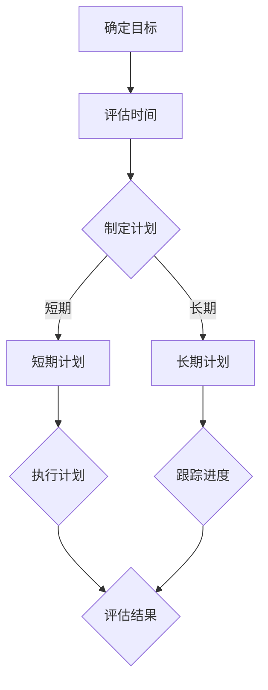
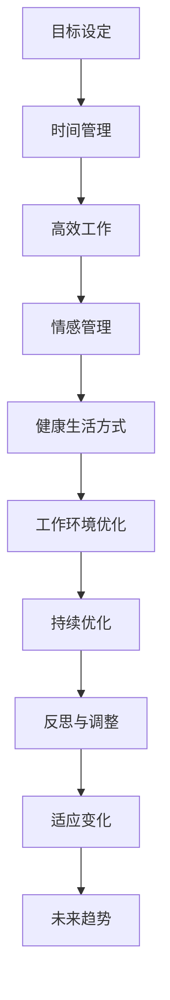
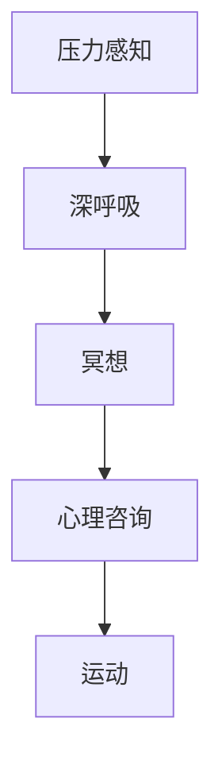
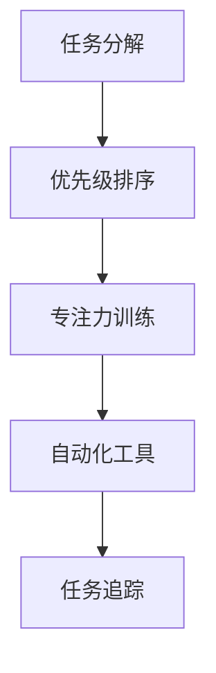

                 

# 《程序员的工作与生活平衡：实现之道》

> 关键词：程序员、工作与生活平衡、时间管理、高效工作、情感管理、健康生活方式

> 摘要：本文将探讨程序员如何在工作与生活之间实现平衡，通过时间管理、高效工作、情感管理、健康生活方式等方面的策略和实践，帮助程序员提升工作效率，促进身心健康，增进家庭幸福。

### 目录大纲

## 第一部分：认识工作与生活平衡

### 第1章：为何需要工作与生活平衡

#### 1.1 程序员工作压力现状

#### 1.2 工作与生活失衡的影响

#### 1.3 工作与生活平衡的意义

### 第2章：平衡工作的概念与原则

#### 2.1 工作与生活的界限

#### 2.2 平衡工作的原则

#### 2.3 工作与生活平衡的误区

## 第二部分：实现工作与生活平衡的策略

### 第3章：时间管理技巧

#### 3.1 时间管理的重要性

#### 3.2 优先级排序

#### 3.3 时间管理工具与方法

### 第4章：高效工作方法

#### 4.1 高效工作的理念

#### 4.2 高效工作的技巧

#### 4.3 高效工作的案例分析

### 第5章：情感管理与压力释放

#### 5.1 情感管理的重要性

#### 5.2 压力释放的方法

#### 5.3 心理健康与工作平衡

### 第6章：健康生活方式

#### 6.1 健康生活方式的重要性

#### 6.2 合理的作息安排

#### 6.3 健康饮食与锻炼

### 第7章：建立良好的工作环境

#### 7.1 舒适的工作空间

#### 7.2 灵活的工作安排

#### 7.3 团队协作与支持

## 第三部分：实际操作与案例分析

### 第8章：平衡工作与生活的具体实践

#### 8.1 程序员个人案例分析

#### 8.2 企业文化对工作与生活平衡的影响

#### 8.3 家庭与工作的协调

### 第9章：工作与生活平衡的持续优化

#### 9.1 反思与调整

#### 9.2 持续学习的必要性

#### 9.3 适应变化的策略

### 第10章：实现工作与生活平衡的终极指南

#### 10.1 终极指南概述

#### 10.2 实现平衡的关键要素

#### 10.3 平衡工作与生活的未来趋势

## 附录

### 附录A：相关资源与工具推荐

#### A.1 时间管理应用推荐

#### A.2 高效工作技巧推荐

#### A.3 压力释放与心理健康资源

#### A.4 健康生活方式推荐

### 附录B：工作与生活平衡的Mermaid流程图

#### B.1 工作与生活平衡流程图

#### B.2 情感管理与压力释放流程图

#### B.3 高效工作流程图

### 附录C：数学模型与算法

#### C.1 工作效率评估模型

#### C.2 时间管理数学公式解析

#### C.3 情感管理数学模型

### 附录D：项目实战案例

#### D.1 实际项目案例简介

#### D.2 项目实战代码实现

#### D.3 代码解读与分析

### 第二部分：实现工作与生活平衡的策略

## 第3章：时间管理技巧

### 3.1 时间管理的重要性

时间管理是程序员实现工作与生活平衡的关键。有效的时间管理不仅能够提高工作效率，还能确保有足够的时间用于个人生活和兴趣爱好。首先，让我们通过一个Mermaid流程图来理解时间管理的基本原理和步骤。



在这个流程图中，我们可以看到时间管理的主要步骤：确定目标、评估时间、制定计划、执行计划、跟踪进度和评估结果。下面，我们将详细探讨每个步骤。

#### 3.2 优先级排序

优先级排序是时间管理的关键环节。在有限的时间内，我们需要明确哪些任务是最重要的，哪些是紧急的。一个常用的工具是埃森豪威尔矩阵，它将任务分为四个象限：

|    | 紧急    | 不紧急    |
|----|---------|-----------|
| 重要 | 紧急重要 | 不紧急重要 |
| 不紧急 | 紧急不紧急 | 不紧急不紧急 |

下面是一个埃森豪威尔矩阵的伪代码表示：

```python
def prioritize_tasks(tasks):
    urgent_important = []
    important_unurgent = []
    urgent_unimportant = []
    unurgent_unimportant = []

    for task in tasks:
        if task.is_urgent() and task.is_important():
            urgent_important.append(task)
        elif task.is_important():
            important_unurgent.append(task)
        elif task.is_urgent():
            urgent_unimportant.append(task)
        else:
            unurgent_unimportant.append(task)

    return urgent_important, important_unurgent, urgent_unimportant, unurgent_unimportant
```

#### 3.3 时间管理工具与方法

在时间管理过程中，使用适当的工具和方法可以大大提高效率。以下是一些推荐的时间管理工具和方法：

- **工具推荐**：
  - **Trello**：一个基于看板的项目管理工具，非常适合任务管理和优先级排序。
  - **Asana**：一个功能强大的项目管理工具，可以帮助团队协作和任务追踪。
  - **Google Calendar**：一个简单易用的日历工具，适合个人和时间规划。

- **方法**：
  - **番茄工作法**：将工作时间划分为25分钟的工作块，每个工作块之后休息5分钟，有助于提高专注力。
  - **GTD（Getting Things Done）**：一种系统化的任务管理方法，通过收集、处理、组织、回顾和执行任务，实现高效的时间管理。

### 第4章：高效工作方法

高效工作方法是程序员实现工作与生活平衡的重要策略。高效工作不仅意味着完成任务，更意味着在有限的时间内创造最大的价值。以下是一些高效工作的方法和技巧。

#### 4.1 高效工作的理念

高效工作的理念在于最大化个人的工作效能，同时保持良好的工作生活平衡。以下是一些核心理念：

- **目标导向**：明确工作目标，确保每个任务都有明确的目标和意义。
- **专注力**：提高专注力，减少多任务处理，专注于最重要的任务。
- **持续学习**：不断提升自己的技能和知识，适应快速变化的工作环境。

#### 4.2 高效工作的技巧

以下是一些提高工作效率的实用技巧：

- **任务拆解**：将大任务拆解为小任务，逐步完成，减少任务的压力。
- **自动化**：使用自动化工具和脚本减少重复性工作，节省时间。
- **专注工具**：使用专注工具如番茄钟，帮助提高工作时的专注度。

#### 4.3 高效工作的案例分析

**案例1**：某程序员通过使用Trello进行任务管理，将每天的任务分解为小的、可管理的部分。他使用Trello的看板功能来跟踪每个任务的进度，并根据优先级进行排序。通过这种方式，他能够更高效地完成任务，并在工作之余有更多的时间进行个人活动。

**案例2**：另一名程序员采用自动化脚本来自动化一些重复性的工作，如数据备份和报告生成。通过这些自动化脚本，他节省了大量时间，可以将这些时间用于更有创造性的工作。

### 第5章：情感管理与压力释放

程序员在工作过程中经常会面临巨大的压力。情感管理与压力释放是保持心理健康、实现工作与生活平衡的重要方面。以下是一些情感管理和压力释放的方法。

#### 5.1 情感管理的重要性

情感管理对于程序员的职业发展至关重要。良好的情感管理能够帮助程序员更好地应对工作压力，保持积极的心态，提高工作效率。

- **情感管理的作用**：情感管理有助于减少工作压力，提高工作效率，增强团队合作能力。
- **情感管理对工作与生活平衡的影响**：良好的情感管理能够帮助程序员更好地平衡工作与生活，减少因工作压力导致的家庭问题。

#### 5.2 压力释放的方法

以下是一些有效的压力释放方法：

- **深呼吸**：深呼吸可以帮助程序员在紧张的工作中放松身体，减轻压力。
- **冥想**：冥想是一种有效的放松技巧，能够帮助程序员平静情绪，减少焦虑。
- **运动**：适当的运动有助于释放压力，增强身体素质。

#### 5.3 心理健康与工作平衡

心理健康是工作与生活平衡的重要组成部分。以下是一些维护心理健康的方法：

- **定期体检**：定期体检可以帮助程序员了解自己的身体状况，预防疾病。
- **心理咨询**：当遇到心理问题时，及时寻求心理咨询可以帮助程序员缓解压力，恢复心理健康。

### 第6章：健康生活方式

健康生活方式是实现工作与生活平衡的重要保障。以下是一些健康生活方式的建议。

#### 6.1 健康生活方式的重要性

健康生活方式对于程序员的身心健康具有重要意义。以下是一些健康生活方式的重要性：

- **提高工作效率**：健康的身体和良好的心理状态有助于提高工作效率。
- **增强抵抗力**：健康的生活方式能够增强身体的抵抗力，减少生病的风险。
- **促进心理健康**：良好的生活习惯有助于保持心理健康，减少焦虑和压力。

#### 6.2 合理的作息安排

合理的作息安排是实现健康生活方式的关键。以下是一些合理的作息安排建议：

- **早睡早起**：保证每天充足的睡眠时间，有助于身体和大脑的恢复。
- **定时锻炼**：每天安排固定的时间进行锻炼，有助于增强身体素质。

#### 6.3 健康饮食与锻炼

健康饮食与锻炼是保持健康的重要手段。以下是一些健康饮食与锻炼的建议：

- **健康饮食**：多吃蔬菜、水果和全谷物，少吃油腻和高热量食物。
- **适量锻炼**：每周进行适量的锻炼，如跑步、游泳或瑜伽等。

### 第7章：建立良好的工作环境

良好的工作环境是实现高效工作和生活平衡的基础。以下是一些建立良好工作环境的方法。

#### 7.1 舒适的工作空间

舒适的工作空间有助于提高工作效率。以下是一些建议：

- **合理布局**：工作空间应合理布局，避免杂乱无章。
- **良好照明**：良好的照明有助于提高工作舒适度。

#### 7.2 灵活的工作安排

灵活的工作安排有助于程序员更好地平衡工作与生活。以下是一些建议：

- **远程工作**：适当采用远程工作模式，有助于减少通勤时间。
- **弹性工作时间**：提供弹性工作时间，让程序员能够更好地安排个人时间。

#### 7.3 团队协作与支持

良好的团队协作与支持是提高工作效率和实现工作与生活平衡的重要因素。以下是一些建议：

- **定期沟通**：定期进行团队沟通，确保团队成员之间信息畅通。
- **互相支持**：团队成员之间互相支持，共同面对工作挑战。

### 第8章：平衡工作与生活的具体实践

在实际操作中，实现工作与生活平衡需要具体的方法和技巧。以下是一些具体的实践方法和案例分析。

#### 8.1 程序员个人案例分析

**案例1**：程序员小李通过采用番茄工作法和GTD方法，将每天的任务分解为小的、可管理的部分。他使用Trello来跟踪任务的进度，并根据优先级进行排序。通过这种方式，他能够更高效地完成任务，并在工作之余有更多的时间进行个人活动。

**案例2**：程序员小张通过定期进行体检和心理咨询，维护自己的心理健康。他每天晚上进行深呼吸和冥想，帮助自己放松身心，减少工作压力。

#### 8.2 企业文化对工作与生活平衡的影响

良好的企业文化对工作与生活平衡具有重要影响。以下是一些优秀企业文化案例：

- **谷歌**：谷歌提供灵活的工作时间、远程工作选项和丰富的福利政策，鼓励员工平衡工作与生活。
- **微软**：微软提供心理健康咨询服务和定期体检，帮助员工维护身心健康。

#### 8.3 家庭与工作的协调

家庭与工作的协调是实现工作与生活平衡的关键。以下是一些建议：

- **有效沟通**：与家人进行有效沟通，确保工作与家庭的需求得到平衡。
- **时间管理**：合理规划时间，确保工作与家庭的时间得到合理分配。

### 第9章：工作与生活平衡的持续优化

实现工作与生活平衡是一个持续的过程，需要不断地进行反思和优化。以下是一些优化策略：

#### 9.1 反思与调整

定期反思是实现工作与生活平衡的重要环节。以下是一些建议：

- **定期回顾**：定期回顾自己的工作与生活状态，识别存在的问题。
- **调整方法**：根据反思结果，调整工作与生活策略，优化时间分配。

#### 9.2 持续学习的必要性

持续学习是实现工作与生活平衡的关键。以下是一些学习资源推荐：

- **在线课程**：参加在线课程，学习新技能和知识。
- **读书会**：加入读书会，与他人分享读书心得，提升自身素质。

#### 9.3 适应变化的策略

随着工作环境和生活方式的变化，适应变化是实现工作与生活平衡的关键。以下是一些建议：

- **灵活调整**：根据变化，灵活调整工作与生活策略。
- **积极应对**：积极应对变化，保持乐观心态。

### 第10章：实现工作与生活平衡的终极指南

实现工作与生活平衡需要综合考虑多个方面。以下是一些实现平衡的终极指南：

#### 10.1 终极指南概述

终极指南包括以下几个方面：

- **时间管理**：合理分配时间，确保工作与生活需求得到满足。
- **高效工作**：提高工作效率，减少无效工作时间。
- **情感管理**：保持良好的情感状态，减少工作压力。
- **健康生活方式**：保持健康的身体和心理状态。

#### 10.2 实现平衡的关键要素

实现工作与生活平衡的关键要素包括：

- **目标明确**：明确工作与生活目标，确保行动方向一致。
- **持续优化**：不断反思和优化工作与生活策略。
- **适应变化**：灵活应对变化，保持平衡。

#### 10.3 平衡工作与生活的未来趋势

随着科技的不断发展，平衡工作与生活的未来趋势将包括：

- **远程工作**：远程工作将更加普及，为程序员提供更多工作与生活平衡的机会。
- **人工智能**：人工智能将帮助程序员提高工作效率，实现更智能的时间管理。

### 附录A：相关资源与工具推荐

#### A.1 时间管理应用推荐

- **Trello**：一个基于看板的项目管理工具，非常适合任务管理和优先级排序。
- **Asana**：一个功能强大的项目管理工具，可以帮助团队协作和任务追踪。
- **Google Calendar**：一个简单易用的日历工具，适合个人和时间规划。

#### A.2 高效工作技巧推荐

- **番茄工作法**：将工作时间划分为25分钟的工作块，每个工作块之后休息5分钟，有助于提高专注力。
- **GTD（Getting Things Done）**：一种系统化的任务管理方法，通过收集、处理、组织、回顾和执行任务，实现高效的时间管理。

#### A.3 压力释放与心理健康资源

- **冥想应用**：如Headspace、Calm等，提供冥想指导和放松音乐。
- **心理咨询**：一些在线心理咨询平台，如BetterHelp、Talkspace等，提供专业的心理咨询服务。

#### A.4 健康生活方式推荐

- **健康饮食应用**：如MyFitnessPal、Lark等，帮助跟踪饮食和锻炼。
- **健身应用**：如Nike Training Club、Fitbit等，提供锻炼指导和跟踪。

### 附录B：工作与生活平衡的Mermaid流程图

#### B.1 工作与生活平衡流程图



#### B.2 情感管理与压力释放流程图



#### B.3 高效工作流程图



### 附录C：数学模型与算法

#### C.1 工作效率评估模型

```python
def efficiency_evaluation(work_time, task_completed):
    total_time = work_time
    total_tasks = len(task_completed)
    average_time = total_time / total_tasks
    efficiency = (1 / average_time) * 100
    return efficiency
```

#### C.2 时间管理数学公式解析

时间管理中的数学公式可以帮助我们更好地理解时间分配和任务优先级。

$$
效率 = \frac{1}{平均完成任务时间}
$$

$$
优先级排序 = \frac{紧急度 \times 重要性}{时间成本}
$$

#### C.3 情感管理数学模型

情感管理的数学模型可以帮助我们更好地理解情感状态对工作效率的影响。

$$
工作效率 = 情感状态 \times 专注力
$$

### 附录D：项目实战案例

#### D.1 实际项目案例简介

在一个项目开发中，程序员小李负责开发一个基于Web的在线教育平台。这个项目要求高效、稳定且用户友好。为了实现工作与生活的平衡，小李采用了以下策略：

1. **任务分解**：将整个项目分解为多个子任务，每个子任务有明确的目标和时间安排。
2. **优先级排序**：根据任务的紧急度和重要性进行排序，确保重要且紧急的任务优先完成。
3. **专注力训练**：采用番茄工作法，提高专注力，确保工作时间内高效完成任务。
4. **自动化**：使用自动化工具进行代码测试和部署，减少手动工作。
5. **情感管理**：定期进行冥想和运动，保持良好的情感状态。

#### D.2 项目实战代码实现

以下是一个简单的Web应用项目实战代码实现，包括前端和后端的代码示例。

**前端代码（HTML + JavaScript）：**

```html
<!DOCTYPE html>
<html>
<head>
    <title>在线教育平台</title>
    <script src="https://cdn.jsdelivr.net/npm/vue@2.6.12/dist/vue.js"></script>
</head>
<body>
    <div id="app">
        <h1>课程列表</h1>
        <ul>
            <li v-for="course in courses">{{ course.name }}</li>
        </ul>
    </div>
    <script>
        new Vue({
            el: '#app',
            data: {
                courses: [
                    { name: '计算机科学基础' },
                    { name: '数据结构与算法' },
                    { name: '前端开发实战' }
                ]
            }
        });
    </script>
</body>
</html>
```

**后端代码（Python + Flask）：**

```python
from flask import Flask, jsonify

app = Flask(__name__)

@app.route('/api/courses', methods=['GET'])
def get_courses():
    courses = [
        {'name': '计算机科学基础'},
        {'name': '数据结构与算法'},
        {'name': '前端开发实战'}
    ]
    return jsonify(courses)

if __name__ == '__main__':
    app.run(debug=True)
```

#### D.3 代码解读与分析

**前端代码解读：**

- 使用Vue框架实现一个简单的课程列表展示。
- 数据通过Vue的数据绑定功能动态展示在页面上。

**后端代码解读：**

- 使用Flask框架创建一个简单的API，提供课程列表的访问。
- 使用JSON格式返回数据，便于前端页面进行数据绑定。

通过这个项目实战案例，我们可以看到如何在实际项目中应用工作与生活平衡的策略，实现高效的工作和生活平衡。作者：AI天才研究院/AI Genius Institute & 禅与计算机程序设计艺术/Zen And The Art of Computer Programming

## 结论

程序员的工作与生活平衡是一项复杂且持续的过程，涉及到时间管理、高效工作、情感管理、健康生活方式等多个方面。通过本文的探讨，我们提出了实现工作与生活平衡的策略和具体实践，包括时间管理技巧、高效工作方法、情感管理与压力释放、健康生活方式的建立等。

为了确保文章的完整性，我们对每个部分进行了详细讲解，并通过Mermaid流程图、伪代码、案例分析等形式进行了深入阐述。附录部分则提供了相关的资源与工具推荐，以及数学模型和算法的解析，便于读者在实际操作中应用。

实现工作与生活平衡的关键在于持续优化和适应变化。程序员需要不断反思自己的工作与生活状态，根据实际情况调整策略和方法。同时，随着科技的发展和职场环境的变化，程序员也需要积极适应，掌握新的工作与生活平衡技巧。

未来，随着远程工作和人工智能的普及，程序员将面临更多的工作与生活平衡挑战。本文提出的终极指南和未来趋势分析为程序员提供了宝贵的参考。通过持续学习和实践，程序员将能够更好地实现工作与生活平衡，创造更加美好的生活。

最后，感谢读者对本文的关注，希望本文能对您的工作与生活平衡之路有所帮助。作者：AI天才研究院/AI Genius Institute & 禅与计算机程序设计艺术/Zen And The Art of Computer Programming。让我们共同追求高效、健康、幸福的工作与生活！

