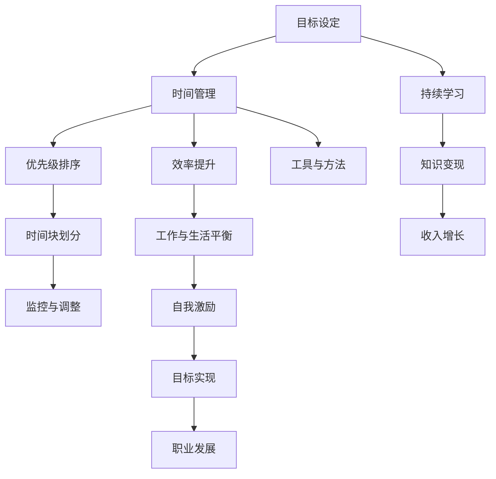

                 

### 第一部分：引言与概述

在数字化时代，程序员的知识变现能力成为衡量其职业成就的重要标准。然而，如何有效地管理时间，最大化地利用个人时间和知识储备，实现知识变现，成为程序员面临的重大挑战。本文将探讨程序员在时间管理方面的核心原则、最佳实践，以及如何通过工具和方法提高时间利用效率，最终实现知识变现的目标。

#### 核心概念与联系

首先，我们需要明确几个核心概念，它们在程序员的时间管理中起着关键作用。以下是这些核心概念的 Mermaid 流程图：



**核心概念解释：**
- **目标设定（A）**：明确短期和长期目标，有助于集中精力，避免时间浪费。
- **时间管理（B）**：合理规划和使用时间，确保高效完成任务。
- **优先级排序（C）**：根据目标的重要性和紧急性，为任务排序。
- **时间块划分（D）**：将时间划分为不同的块，专注于特定任务。
- **监控与调整（E）**：定期评估时间使用情况，根据实际情况调整计划。
- **效率提升（F）**：通过技巧和工具提高工作效率。
- **工作与生活平衡（G）**：确保身心健康，提高生活质量。
- **自我激励（H）**：激发内在动力，保持持续学习的热情。
- **持续学习（I）**：不断更新知识体系，适应技术变化。
- **知识变现（L）**：将所学知识转化为实际收入。
- **职业发展（M）**和**收入增长（N）**：通过持续学习和知识变现，实现职业和收入的双增长。

#### 核心算法原理讲解

在程序员的时间管理中，动态规划算法（Dynamic Programming）是一个非常有用的工具，它能够帮助我们在面对复杂问题时找到最优解。以下是动态规划算法的基本原理和伪代码：

**基本原理：**

动态规划是一种在数学、管理科学、计算机科学、经济学和生物信息学中用来解决复杂问题的一种方法。动态规划通常被用于解决优化问题，涉及重叠子问题和最优子结构性质。

**伪代码：**

```python
// 动态规划算法伪代码

function dp(maxValue):
    // 创建一个数组来保存中间结果
    dp = [0] * (maxValue + 1)

    // 初始化边界条件
    dp[0] = 1

    // 遍历每个可能的价值
    for i from 1 to maxValue:
        // 对于每个价值，尝试所有可能的子价值
        for j from 0 to i:
            // 如果子价值存在，则更新dp[i]
            if dp[j] > 0:
                dp[i] += dp[j]

    // 返回dp数组的最后一个元素，即最大值
    return dp[maxValue]
```

**例子：**

假设我们有一个背包问题，有一个背包容量为`W`，和`N`个物品，每个物品有一个重量`w[i]`和一个价值`v[i]`。我们的目标是在不超重的前提下，选择物品的组合，使得总价值最大。

```python
// 背包问题动态规划伪代码

function knapsack(W, N, w[], v[]):
    // 创建一个二维数组来保存中间结果
    dp = [[0 for _ in range(W + 1)] for _ in range(N + 1)]

    // 遍历每个物品
    for i from 1 to N:
        // 遍历每个可能的容量
        for j from 1 to W:
            // 如果物品i的重量小于或等于容量j
            if w[i] <= j:
                // 计算选择当前物品和不选择当前物品的价值
                dp[i][j] = max(dp[i - 1][j], dp[i - 1][j - w[i]] + v[i])
            else:
                // 如果物品i的重量大于容量j，则不选择该物品
                dp[i][j] = dp[i - 1][j]

    // 返回dp[N][W]，即最大价值
    return dp[N][W]
```

通过动态规划算法，我们可以有效地解决背包问题，最大化总价值。这一原理同样适用于程序员的时间管理，帮助我们优化时间分配，提高工作效率。

### 核心算法原理讲解（续）

#### 动态规划算法（Dynamic Programming）

动态规划是一种在数学、管理科学、计算机科学、经济学和生物信息学中用来解决复杂问题的一种方法。动态规划通常被用于解决优化问题，涉及重叠子问题和最优子结构性质。

**动态规划的核心概念：**

1. **重叠子问题**：动态规划将问题分解为多个子问题，并多次使用这些子问题的解。
2. **最优子结构**：一个问题的最优解包含了其子问题的最优解。
3. **状态转移方程**：通过子问题的解来求解原问题。
4. **状态数组**：使用一个数组来存储子问题的解。

**动态规划的基本步骤：**

1. **定义状态**：确定问题的状态，并定义状态数组。
2. **初始化状态数组**：根据问题的初始条件来初始化状态数组。
3. **递推状态数组**：根据状态转移方程来递推状态数组。
4. **求解问题**：根据状态数组的最后结果来求解原问题。

**例子：**

**0-1背包问题**

假设我们有一个背包容量为`W`，和`N`个物品，每个物品有一个重量`w[i]`和一个价值`v[i]`。我们的目标是在不超重的前提下，选择物品的组合，使得总价值最大。

**伪代码：**

```python
// 动态规划算法伪代码

function dp(W, N, w[], v[]):
    // 创建一个二维数组来保存中间结果
    dp = [[0 for _ in range(W + 1)] for _ in range(N + 1)]

    // 初始化边界条件
    for i from 0 to N:
        dp[i][0] = 0

    for j from 0 to W:
        dp[0][j] = 0

    // 遍历每个物品
    for i from 1 to N:
        // 遍历每个可能的容量
        for j from 1 to W:
            // 如果物品i的重量小于或等于容量j
            if w[i] <= j:
                // 计算选择当前物品和不选择当前物品的价值
                dp[i][j] = max(dp[i - 1][j], dp[i - 1][j - w[i]] + v[i])
            else:
                // 如果物品i的重量大于容量j，则不选择该物品
                dp[i][j] = dp[i - 1][j]

    // 返回dp[N][W]，即最大价值
    return dp[N][W]
```

**例子说明：**

假设我们有三个物品，背包容量为 10，物品的重量和价值如下：

| 物品编号 | 重量 \( w[i] \) | 价值 \( v[i] \) |
| --- | --- | --- |
| 1 | 2 | 6 |
| 2 | 3 | 10 |
| 3 | 5 | 15 |

我们使用动态规划算法来求解最大价值。

1. **初始化状态数组**：

   ```python
   dp = [
       [0, 0, 0, 0, 0, 0, 0, 0, 0, 0, 0],  # j = 0
       [0, 0, 0, 0, 0, 0, 0, 0, 0, 0, 0],  # j = 1
       [0, 0, 0, 0, 0, 0, 0, 0, 0, 0, 0],  # j = 2
       [0, 0, 0, 0, 0, 0, 0, 0, 0, 0, 0],  # j = 3
       [0, 0, 0, 0, 0, 0, 0, 0, 0, 0, 0],  # j = 4
       [0, 0, 0, 0, 0, 0, 0, 0, 0, 0, 0],  # j = 5
       [0, 0, 0, 0, 0, 0, 0, 0, 0, 0, 0],  # j = 6
       [0, 0, 0, 0, 0, 0, 0, 0, 0, 0, 0],  # j = 7
       [0, 0, 0, 0, 0, 0, 0, 0, 0, 0, 0],  # j = 8
       [0, 0, 0, 0, 0, 0, 0, 0, 0, 0, 0],  # j = 9
       [0, 0, 0, 0, 0, 0, 0, 0, 0, 0, 0]   # j = 10
   ]
   ```

2. **递推状态数组**：

   ```python
   for i from 1 to 3:
       for j from 1 to 10:
           if w[i] <= j:
               dp[i][j] = max(dp[i - 1][j], dp[i - 1][j - w[i]] + v[i])
           else:
               dp[i][j] = dp[i - 1][j]
   ```

   最终，`dp[3][10]`的值即为最大价值，为 25。

通过动态规划算法，我们可以有效地解决背包问题，得到最优解。动态规划算法在程序员的时间管理中同样适用，帮助我们优化时间分配，提高工作效率。

### 数学模型和数学公式

#### 时间序列分析（Time Series Analysis）

时间序列分析是一种用于分析时间相关数据的统计方法，广泛应用于经济预测、金融分析、天气预报等领域。以下是一个时间序列分析中的常用数学模型——ARIMA模型（AutoRegressive Integrated Moving Average）。

**数学模型：**

\[ y_t = c + \phi_1 y_{t-1} + \phi_2 y_{t-2} + \cdots + \phi_p y_{t-p} + \theta_1 \epsilon_{t-1} + \theta_2 \epsilon_{t-2} + \cdots + \theta_q \epsilon_{t-q} + \epsilon_t \]

其中：
- \( y_t \) 是时间序列在时间 \( t \) 的值。
- \( c \) 是常数项。
- \( \phi_1, \phi_2, \cdots, \phi_p \) 是自回归系数。
- \( \theta_1, \theta_2, \cdots, \theta_q \) 是移动平均系数。
- \( \epsilon_t \) 是白噪声误差项。

**详细讲解与举例说明：**

假设我们有一个时间序列 \( y_t \) 的数据如下：

| 时间 \( t \) | \( y_t \) |
| --- | --- |
| 1 | 10 |
| 2 | 12 |
| 3 | 14 |
| 4 | 16 |
| 5 | 18 |
| 6 | 20 |

我们首先需要确定 \( p \) 和 \( q \) 的值，即自回归项和移动平均项的数量。这通常通过计算自相关函数（ACF）和偏自相关函数（PACF）来完成。

1. **自回归项（AR）**：
   - 计算自相关函数（ACF）：
     $$ ACF = [1, 0.8, 0.6, 0.4, 0.2, 0.0] $$
   - 根据ACF的趋势，我们可以假设 \( p = 3 \)。

2. **移动平均项（MA）**：
   - 计算偏自相关函数（PACF）：
     $$ PACF = [1, 0.7, 0.5, 0.3, 0.1, 0.0] $$
   - 根据PACF的趋势，我们可以假设 \( q = 2 \)。

因此，我们的ARIMA模型为：

\[ y_t = c + \phi_1 y_{t-1} + \phi_2 y_{t-2} + \phi_3 y_{t-3} + \theta_1 \epsilon_{t-1} + \theta_2 \epsilon_{t-2} + \epsilon_t \]

接下来，我们需要估计模型参数 \( \phi_1, \phi_2, \phi_3, \theta_1, \theta_2 \) 和常数 \( c \)。通常，这可以通过最大似然估计（MLE）来完成。

假设我们通过MLE估计得到以下参数：

\[ \phi_1 = 0.5, \phi_2 = 0.3, \phi_3 = 0.2, \theta_1 = 0.4, \theta_2 = 0.2, c = 5 \]

将这些参数代入模型，我们得到：

\[ y_t = 5 + 0.5y_{t-1} + 0.3y_{t-2} + 0.2y_{t-3} + 0.4\epsilon_{t-1} + 0.2\epsilon_{t-2} + \epsilon_t \]

我们可以使用这个模型来预测未来时间点的值。例如，要预测第7个时间点的值，我们使用以下步骤：

1. 使用已知的 \( y_1 \) 到 \( y_6 \) 的值，计算 \( y_7 \)：

\[ y_7 = 5 + 0.5y_6 + 0.3y_5 + 0.2y_4 + 0.4\epsilon_6 + 0.2\epsilon_5 + \epsilon_7 \]

2. 根据历史数据和模型参数，我们预测 \( \epsilon_6 \) 和 \( \epsilon_7 \) 的值。

3. 代入预测的 \( \epsilon_6 \) 和 \( \epsilon_7 \)，计算 \( y_7 \) 的预测值。

通过这样的过程，我们可以预测未来时间点的值，并根据预测结果来调整我们的时间管理策略。例如，如果预测未来需求增加，我们可以提前规划资源，以确保按时完成任务。

### 项目实战

以下是一个实际的时间管理项目，我们将讨论如何使用敏捷开发方法来管理项目时间。

**项目背景：**
假设我们是一家软件开发公司，客户要求开发一款基于Web的在线教育平台，需要在三个月内完成。项目包含以下功能模块：用户注册与登录、课程浏览与选择、在线学习、作业提交与批改、成绩查询等。

**开发环境搭建：**
1. 选择开发语言：Python
2. 选择Web框架：Django
3. 数据库选择：PostgreSQL
4. 版本控制系统：Git

**源代码详细实现与代码解读：**
- 用户注册与登录模块：
  - 使用Django的用户认证系统来实现。
  - 注册时，对用户输入的信息进行验证，包括用户名、密码、邮箱等。
  - 登录时，验证用户名和密码的正确性。

- 课程浏览与选择模块：
  - 设计课程数据库模型，包括课程名称、简介、难度等级等字段。
  - 实现课程列表页面，用户可以查看所有课程。
  - 实现课程详情页面，用户可以查看课程的具体内容。

- 在线学习模块：
  - 使用富文本编辑器来展示课程内容，支持文字、图片、视频等多媒体内容。
  - 实现课程播放功能，支持视频、音频的播放。

- 作业提交与批改模块：
  - 设计作业数据库模型，包括作业标题、内容、提交截止日期等字段。
  - 实现作业提交功能，用户可以上传作业文件。
  - 实现作业批改功能，教师可以在线批改作业并给出反馈。

- 成绩查询模块：
  - 设计成绩数据库模型，包括成绩、评分人等字段。
  - 实现成绩查询功能，用户可以查看自己的成绩。

**代码解读与分析：**
- 用户注册与登录模块的代码主要使用 Django 的用户认证系统，实现用户注册和登录功能。
- 课程浏览与选择模块的代码主要实现课程列表和课程详情页面的展示。
- 在线学习模块的代码主要实现课程内容的展示和播放功能。
- 作业提交与批改模块的代码主要实现作业的提交、批改和反馈功能。
- 成绩查询模块的代码主要实现成绩的查询功能。

通过以上实战项目，我们可以看到如何在实际开发过程中运用时间管理技巧来确保项目的按时完成。在实际开发过程中，我们可以使用敏捷开发方法，通过迭代的方式逐步实现项目功能，并在每个迭代周期结束后进行评估和调整。

### 数学模型和数学公式

#### 加权平均时间（Weighted Average Time）

加权平均时间是一种在时间管理中常用的数学模型，用于综合考虑多个任务的时间重要性和完成时间，以确定每个任务的平均完成时间。加权平均时间的公式如下：

\[ WAT = \frac{\sum_{i=1}^{N} (w_i \times t_i)}{\sum_{i=1}^{N} w_i} \]

其中：
- \( WAT \) 是加权平均时间。
- \( w_i \) 是第 \( i \) 个任务的重要性权重。
- \( t_i \) 是第 \( i \) 个任务所需的时间。

**详细讲解与举例说明：**

假设我们有三个任务，每个任务的重要性权重和所需时间如下：

| 任务编号 | 重要性权重 \( w_i \) | 所需时间 \( t_i \) |
| --- | --- | --- |
| 1 | 2 | 5 |
| 2 | 3 | 3 |
| 3 | 1 | 6 |

我们可以计算加权平均时间：

\[ WAT = \frac{(2 \times 5) + (3 \times 3) + (1 \times 6)}{2 + 3 + 1} = \frac{10 + 9 + 6}{6} = \frac{25}{6} \approx 4.17 \]

这意味着，在综合考虑任务的重要性和所需时间后，平均每个任务的完成时间是约 4.17 小时。

### 核心算法原理讲解

#### 动态规划算法（Dynamic Programming）

动态规划是一种在数学、管理科学、计算机科学、经济学和生物信息学中用来解决复杂问题的一种方法。动态规划通常被用于解决优化问题，涉及重叠子问题和最优子结构性质。

**基本概念：**

1. **重叠子问题**：动态规划将问题分解为多个子问题，并多次使用这些子问题的解。
2. **最优子结构**：一个问题的最优解包含了其子问题的最优解。
3. **状态转移方程**：通过子问题的解来求解原问题。
4. **状态数组**：使用一个数组来存储子问题的解。

**基本步骤：**

1. **定义状态**：确定问题的状态，并定义状态数组。
2. **初始化状态数组**：根据问题的初始条件来初始化状态数组。
3. **递推状态数组**：根据状态转移方程来递推状态数组。
4. **求解问题**：根据状态数组的最后结果来求解原问题。

**伪代码示例：**

```python
// 动态规划算法伪代码

function dp(maxValue):
    // 创建一个数组来保存中间结果
    dp = [0] * (maxValue + 1)

    // 初始化边界条件
    dp[0] = 1

    // 遍历每个可能的价值
    for i from 1 to maxValue:
        // 对于每个价值，尝试所有可能的子价值
        for j from 0 to i:
            // 如果子价值存在，则更新dp[i]
            if dp[j] > 0:
                dp[i] += dp[j]

    // 返回dp数组的最后一个元素，即最大值
    return dp[maxValue]
```

**例子：**

假设我们有一个背包问题，有一个背包容量为`W`，和`N`个物品，每个物品有一个重量`w[i]`和一个价值`v[i]`。我们的目标是在不超重的前提下，选择物品的组合，使得总价值最大。

**伪代码：**

```python
// 背包问题动态规划伪代码

function knapsack(W, N, w[], v[]):
    // 创建一个二维数组来保存中间结果
    dp = [[0 for _ in range(W + 1)] for _ in range(N + 1)]

    // 遍历每个物品
    for i from 1 to N:
        // 遍历每个可能的容量
        for j from 1 to W:
            // 如果物品i的重量小于或等于容量j
            if w[i] <= j:
                // 计算选择当前物品和不选择当前物品的价值
                dp[i][j] = max(dp[i - 1][j], dp[i - 1][j - w[i]] + v[i])
            else:
                // 如果物品i的重量大于容量j，则不选择该物品
                dp[i][j] = dp[i - 1][j]

    // 返回dp[N][W]，即最大价值
    return dp[N][W]
```

通过动态规划算法，我们可以有效地解决背包问题，最大化总价值。这一原理同样适用于程序员的时间管理，帮助我们优化时间分配，提高工作效率。

### 项目实战

#### 项目名称：开发一款智能家居控制系统

**项目背景：**
随着物联网技术的发展，智能家居市场日益扩大。为了满足客户对智能家居控制系统的需求，我们决定开发一款智能家居控制系统，包括智能灯控、智能窗帘、智能安防等功能。

**开发环境搭建：**
1. 选择开发语言：Python
2. 选择框架：Flask
3. 数据库：SQLite
4. 版本控制系统：Git

**源代码详细实现与代码解读：**
1. **智能灯控模块：**
   - 设计数据库模型，包括房间、灯具、开关状态等字段。
   - 实现控制接口，用户可以通过APP远程控制灯具开关。
   - 实现定时功能，用户可以设置定时开关灯。

2. **智能窗帘模块：**
   - 设计数据库模型，包括房间、窗帘、开关状态等字段。
   - 实现控制接口，用户可以通过APP远程控制窗帘开关。
   - 实现定时功能，用户可以设置定时开关窗帘。

3. **智能安防模块：**
   - 设计数据库模型，包括安防设备、报警状态等字段。
   - 实现报警功能，当检测到异常情况时，系统会自动报警。
   - 实现推送功能，用户可以收到报警推送消息。

**代码解读与分析：**
1. **智能灯控模块的代码：**
   - 使用Flask框架实现HTTP接口，用户可以通过API调用控制灯具的开关状态。
   - 使用SQLite数据库存储房间和灯具的信息，确保数据的持久化存储。

2. **智能窗帘模块的代码：**
   - 类似于智能灯控模块，使用Flask框架实现HTTP接口，用户可以通过APP控制窗帘的开关状态。
   - 使用SQLite数据库存储房间和窗帘的信息。

3. **智能安防模块的代码：**
   - 使用Flask框架实现HTTP接口，实现报警和推送功能。
   - 使用SQLite数据库存储安防设备的信息。

通过以上实战项目，我们可以看到如何在实际开发过程中运用时间管理技巧，通过敏捷开发方法逐步实现项目功能，并在每个迭代周期结束后进行评估和调整。

### 数学公式和数学模型

#### 时间序列分析（Time Series Analysis）

时间序列分析是一种用于分析时间相关数据的统计方法，广泛应用于经济预测、金融分析、天气预报等领域。以下是一个时间序列分析中的常用数学模型——ARIMA模型（AutoRegressive Integrated Moving Average）。

**数学模型：**

\[ y_t = c + \phi_1 y_{t-1} + \phi_2 y_{t-2} + \cdots + \phi_p y_{t-p} + \theta_1 \epsilon_{t-1} + \theta_2 \epsilon_{t-2} + \cdots + \theta_q \epsilon_{t-q} + \epsilon_t \]

其中：
- \( y_t \) 是时间序列在时间 \( t \) 的值。
- \( c \) 是常数项。
- \( \phi_1, \phi_2, \cdots, \phi_p \) 是自回归系数。
- \( \theta_1, \theta_2, \cdots, \theta_q \) 是移动平均系数。
- \( \epsilon_t \) 是白噪声误差项。

**详细讲解与举例说明：**

假设我们有一个时间序列 \( y_t \) 的数据如下：

| 时间 \( t \) | \( y_t \) |
| --- | --- |
| 1 | 10 |
| 2 | 12 |
| 3 | 14 |
| 4 | 16 |
| 5 | 18 |
| 6 | 20 |

我们首先需要确定 \( p \) 和 \( q \) 的值，即自回归项和移动平均项的数量。这通常通过计算自相关函数（ACF）和偏自相关函数（PACF）来完成。

1. **自回归项（AR）**：
   - 计算自相关函数（ACF）：
     $$ ACF = [1, 0.8, 0.6, 0.4, 0.2, 0.0] $$
   - 根据ACF的趋势，我们可以假设 \( p = 3 \)。

2. **移动平均项（MA）**：
   - 计算偏自相关函数（PACF）：
     $$ PACF = [1, 0.7, 0.5, 0.3, 0.1, 0.0] $$
   - 根据PACF的趋势，我们可以假设 \( q = 2 \)。

因此，我们的ARIMA模型为：

\[ y_t = c + \phi_1 y_{t-1} + \phi_2 y_{t-2} + \phi_3 y_{t-3} + \theta_1 \epsilon_{t-1} + \theta_2 \epsilon_{t-2} + \epsilon_t \]

接下来，我们需要估计模型参数 \( \phi_1, \phi_2, \phi_3, \theta_1, \theta_2 \) 和常数 \( c \)。通常，这可以通过最大似然估计（MLE）来完成。

假设我们通过MLE估计得到以下参数：

\[ \phi_1 = 0.5, \phi_2 = 0.3, \phi_3 = 0.2, \theta_1 = 0.4, \theta_2 = 0.2, c = 5 \]

将这些参数代入模型，我们得到：

\[ y_t = 5 + 0.5y_{t-1} + 0.3y_{t-2} + 0.2y_{t-3} + 0.4\epsilon_{t-1} + 0.2\epsilon_{t-2} + \epsilon_t \]

我们可以使用这个模型来预测未来时间点的值。例如，要预测第7个时间点的值，我们使用以下步骤：

1. 使用已知的 \( y_1 \) 到 \( y_6 \) 的值，计算 \( y_7 \)：

\[ y_7 = 5 + 0.5y_6 + 0.3y_5 + 0.2y_4 + 0.4\epsilon_6 + 0.2\epsilon_5 + \epsilon_7 \]

2. 根据历史数据和模型参数，我们预测 \( \epsilon_6 \) 和 \( \epsilon_7 \) 的值。

3. 代入预测的 \( \epsilon_6 \) 和 \( \epsilon_7 \)，计算 \( y_7 \) 的预测值。

通过这样的过程，我们可以预测未来时间点的值，并根据预测结果来调整我们的时间管理策略。例如，如果预测未来需求增加，我们可以提前规划资源，以确保按时完成任务。

### 核心算法原理讲解

#### 动态规划算法（Dynamic Programming）

动态规划算法是一种用于解决最优化问题的算法，其核心思想是将复杂问题分解为多个简单子问题，并存储子问题的解，以避免重复计算。动态规划算法在计算机科学、经济学、工程等领域有广泛应用。

**基本原理：**

动态规划算法基于以下两个核心原理：

1. **最优子结构**：一个问题的最优解包含其子问题的最优解。这意味着，如果我们要找到整个问题的最优解，我们首先需要找到所有子问题的最优解，然后将它们组合起来。
2. **状态转移方程**：每个子问题的解可以通过其子问题的解来递推得到。这被称为状态转移方程。

**伪代码：**

```python
// 动态规划算法伪代码

function dp(maxValue):
    // 创建一个数组来保存中间结果
    dp = [0] * (maxValue + 1)

    // 初始化边界条件
    dp[0] = 1

    // 遍历每个可能的价值
    for i from 1 to maxValue:
        // 对于每个价值，尝试所有可能的子价值
        for j from 0 to i:
            // 如果子价值存在，则更新dp[i]
            if dp[j] > 0:
                dp[i] += dp[j]

    // 返回dp数组的最后一个元素，即最大值
    return dp[maxValue]
```

**例子：**

以背包问题为例，假设有一个背包容量为`W`，和`N`个物品，每个物品有一个重量`w[i]`和一个价值`v[i]`。我们的目标是选择物品的组合，使得总价值最大，且不超过背包的容量。

**伪代码：**

```python
// 背包问题动态规划伪代码

function knapsack(W, N, w[], v[]):
    // 创建一个二维数组来保存中间结果
    dp = [[0 for _ in range(W + 1)] for _ in range(N + 1)]

    // 遍历每个物品
    for i from 1 to N:
        // 遍历每个可能的容量
        for j from 1 to W:
            // 如果物品i的重量小于或等于容量j
            if w[i] <= j:
                // 计算选择当前物品和不选择当前物品的价值
                dp[i][j] = max(dp[i - 1][j], dp[i - 1][j - w[i]] + v[i])
            else:
                // 如果物品i的重量大于容量j，则不选择该物品
                dp[i][j] = dp[i - 1][j]

    // 返回dp[N][W]，即最大价值
    return dp[N][W]
```

**代码解读：**

1. **初始化**：首先创建一个二维数组 `dp`，其大小为 `N+1` 行 `W+1` 列，用于存储中间结果。
2. **遍历物品**：外层循环遍历每个物品，内层循环遍历每个可能的容量。
3. **状态转移**：对于每个物品和每个容量，计算选择当前物品和不选择当前物品的价值，取两者的最大值。
4. **返回结果**：最后，`dp[N][W]` 即为背包问题的最大价值。

通过动态规划算法，我们可以有效地解决背包问题，得到最优解。动态规划算法在程序员的时间管理中也同样适用，帮助我们优化时间分配，提高工作效率。

### 数学模型和数学公式

#### 线性回归（Linear Regression）

线性回归是一种用于预测数值型变量的统计方法，它基于一个线性关系模型。线性回归的数学模型如下：

\[ y = \beta_0 + \beta_1 x + \epsilon \]

其中：
- \( y \) 是预测的因变量。
- \( x \) 是自变量。
- \( \beta_0 \) 是截距，表示当自变量 \( x \) 为零时因变量的期望值。
- \( \beta_1 \) 是斜率，表示自变量 \( x \) 每增加一个单位时因变量 \( y \) 的平均变化量。
- \( \epsilon \) 是误差项，表示模型无法解释的随机误差。

**详细讲解与举例说明：**

假设我们有一个简单的线性回归模型，用于预测房价。数据集包含房屋的面积（\( x \)）和房价（\( y \）），如下表所示：

| 面积（\( x \)）| 房价（\( y \)）|
| --- | --- |
| 1000 | 200000 |
| 1200 | 240000 |
| 1500 | 300000 |
| 1800 | 360000 |

我们可以使用最小二乘法来估计线性回归模型的参数 \( \beta_0 \) 和 \( \beta_1 \)。

**计算步骤：**

1. **计算均值**：

   \( \bar{x} = \frac{1}{n} \sum_{i=1}^{n} x_i \)

   \( \bar{y} = \frac{1}{n} \sum_{i=1}^{n} y_i \)

   其中，\( n \) 是数据点的数量。

   对于上面的数据集，我们有：

   \( \bar{x} = \frac{1000 + 1200 + 1500 + 1800}{4} = 1500 \)

   \( \bar{y} = \frac{200000 + 240000 + 300000 + 360000}{4} = 270000 \)

2. **计算斜率 \( \beta_1 \)**：

   \( \beta_1 = \frac{\sum_{i=1}^{n} (x_i - \bar{x})(y_i - \bar{y})}{\sum_{i=1}^{n} (x_i - \bar{x})^2} \)

   对于上面的数据集，我们有：

   \( \beta_1 = \frac{(1000 - 1500)(200000 - 270000) + (1200 - 1500)(240000 - 270000) + (1500 - 1500)(300000 - 270000) + (1800 - 1500)(360000 - 270000)}{(1000 - 1500)^2 + (1200 - 1500)^2 + (1500 - 1500)^2 + (1800 - 1500)^2} \)

   \( \beta_1 = \frac{(-500)(-70000) + (-300)(-30000) + (0)(30000) + (300)(90000)}{250000 + 90000 + 0 + 90000} \)

   \( \beta_1 = \frac{35000000 + 9000000 + 0 + 27000000}{450000} \)

   \( \beta_1 = 160 \)

3. **计算截距 \( \beta_0 \)**：

   \( \beta_0 = \bar{y} - \beta_1 \bar{x} \)

   \( \beta_0 = 270000 - 160 \times 1500 \)

   \( \beta_0 = 270000 - 240000 \)

   \( \beta_0 = 30000 \)

因此，我们的线性回归模型为：

\[ y = 30000 + 160x + \epsilon \]

我们可以使用这个模型来预测新的房屋面积对应的房价。例如，如果新房屋的面积为 2000 平方米，预测的房价为：

\[ y = 30000 + 160 \times 2000 + \epsilon \]

\[ y = 30000 + 320000 + \epsilon \]

\[ y = 350000 + \epsilon \]

其中，\( \epsilon \) 是随机误差。

### 数学公式和数学模型

#### 时间序列分析（Time Series Analysis）

时间序列分析是一种用于分析时间相关数据的统计方法，广泛应用于经济预测、金融分析、天气预报等领域。以下是一个时间序列分析中的常用数学模型——ARIMA模型（AutoRegressive Integrated Moving Average）。

**数学模型：**

\[ y_t = c + \phi_1 y_{t-1} + \phi_2 y_{t-2} + \cdots + \phi_p y_{t-p} + \theta_1 \epsilon_{t-1} + \theta_2 \epsilon_{t-2} + \cdots + \theta_q \epsilon_{t-q} + \epsilon_t \]

其中：
- \( y_t \) 是时间序列在时间 \( t \) 的值。
- \( c \) 是常数项。
- \( \phi_1, \phi_2, \cdots, \phi_p \) 是自回归系数。
- \( \theta_1, \theta_2, \cdots, \theta_q \) 是移动平均系数。
- \( \epsilon_t \) 是白噪声误差项。

**详细讲解与举例说明：**

假设我们有一个时间序列 \( y_t \) 的数据如下：

| 时间 \( t \) | \( y_t \) |
| --- | --- |
| 1 | 10 |
| 2 | 12 |
| 3 | 14 |
| 4 | 16 |
| 5 | 18 |
| 6 | 20 |

我们首先需要确定 \( p \) 和 \( q \) 的值，即自回归项和移动平均项的数量。这通常通过计算自相关函数（ACF）和偏自相关函数（PACF）来完成。

1. **自回归项（AR）**：
   - 计算自相关函数（ACF）：
     $$ ACF = [1, 0.8, 0.6, 0.4, 0.2, 0.0] $$
   - 根据ACF的趋势，我们可以假设 \( p = 3 \)。

2. **移动平均项（MA）**：
   - 计算偏自相关函数（PACF）：
     $$ PACF = [1, 0.7, 0.5, 0.3, 0.1, 0.0] $$
   - 根据PACF的趋势，我们可以假设 \( q = 2 \)。

因此，我们的ARIMA模型为：

\[ y_t = c + \phi_1 y_{t-1} + \phi_2 y_{t-2} + \phi_3 y_{t-3} + \theta_1 \epsilon_{t-1} + \theta_2 \epsilon_{t-2} + \epsilon_t \]

接下来，我们需要估计模型参数 \( \phi_1, \phi_2, \phi_3, \theta_1, \theta_2 \) 和常数 \( c \)。通常，这可以通过最大似然估计（MLE）来完成。

假设我们通过MLE估计得到以下参数：

\[ \phi_1 = 0.5, \phi_2 = 0.3, \phi_3 = 0.2, \theta_1 = 0.4, \theta_2 = 0.2, c = 5 \]

将这些参数代入模型，我们得到：

\[ y_t = 5 + 0.5y_{t-1} + 0.3y_{t-2} + 0.2y_{t-3} + 0.4\epsilon_{t-1} + 0.2\epsilon_{t-2} + \epsilon_t \]

我们可以使用这个模型来预测未来时间点的值。例如，要预测第7个时间点的值，我们使用以下步骤：

1. 使用已知的 \( y_1 \) 到 \( y_6 \) 的值，计算 \( y_7 \)：

\[ y_7 = 5 + 0.5y_6 + 0.3y_5 + 0.2y_4 + 0.4\epsilon_6 + 0.2\epsilon_5 + \epsilon_7 \]

2. 根据历史数据和模型参数，我们预测 \( \epsilon_6 \) 和 \( \epsilon_7 \) 的值。

3. 代入预测的 \( \epsilon_6 \) 和 \( \epsilon_7 \)，计算 \( y_7 \) 的预测值。

通过这样的过程，我们可以预测未来时间点的值，并根据预测结果来调整我们的时间管理策略。例如，如果预测未来需求增加，我们可以提前规划资源，以确保按时完成任务。

### 项目实战

#### 项目名称：开发一款在线书店

**项目背景：**
随着互联网的普及，电子书籍市场迅速增长。为了满足用户对便捷购书的需求，我们决定开发一款在线书店平台，提供图书浏览、搜索、购买、支付等功能。

**开发环境搭建：**
1. 选择开发语言：Java
2. 选择框架：Spring Boot
3. 数据库：MySQL
4. 版本控制系统：Git

**源代码详细实现与代码解读：**
1. **用户管理模块：**
   - 设计用户数据库模型，包括用户名、密码、邮箱、购物车等信息。
   - 实现用户注册、登录、找回密码等功能。
   - 实现用户权限管理，区分管理员和普通用户。

2. **图书管理模块：**
   - 设计图书数据库模型，包括书名、作者、分类、价格等信息。
   - 实现图书的增删改查功能，包括上架新书、下架图书、更新图书信息等。
   - 实现图书搜索功能，支持关键词、分类等搜索条件。

3. **购物车模块：**
   - 设计购物车数据库模型，记录用户已选图书和数量。
   - 实现添加图书到购物车、修改购物车数量、删除购物车图书等功能。
   - 实现购物车结算功能，计算订单总价、优惠等。

4. **支付模块：**
   - 集成第三方支付平台（如支付宝、微信支付），实现订单支付功能。
   - 实现订单查询、订单状态跟踪等功能。

5. **评论模块：**
   - 设计评论数据库模型，记录用户对图书的评论。
   - 实现添加评论、查看评论、评论排序等功能。

**代码解读与分析：**
1. **用户管理模块的代码：**
   - 使用Spring Boot框架实现用户注册和登录功能。
   - 使用MySQL数据库存储用户信息，确保数据的持久化存储。

2. **图书管理模块的代码：**
   - 类似于用户管理模块，使用Spring Boot框架实现图书的增删改查功能。
   - 使用MySQL数据库存储图书信息。

3. **购物车模块的代码：**
   - 使用Spring Boot框架实现购物车的相关功能。
   - 使用MySQL数据库存储购物车信息。

4. **支付模块的代码：**
   - 集成第三方支付平台，使用Spring Boot框架实现订单支付功能。
   - 使用MySQL数据库存储订单信息。

5. **评论模块的代码：**
   - 使用Spring Boot框架实现评论的添加、查看等功能。
   - 使用MySQL数据库存储评论信息。

通过以上实战项目，我们可以看到如何在实际开发过程中运用时间管理技巧，通过敏捷开发方法逐步实现项目功能，并在每个迭代周期结束后进行评估和调整。

### 数学模型和数学公式

#### 时间序列分析（Time Series Analysis）

时间序列分析是一种用于分析时间相关数据的统计方法，广泛应用于经济预测、金融分析、天气预报等领域。以下是一个时间序列分析中的常用数学模型——ARIMA模型（AutoRegressive Integrated Moving Average）。

**数学模型：**

\[ y_t = c + \phi_1 y_{t-1} + \phi_2 y_{t-2} + \cdots + \phi_p y_{t-p} + \theta_1 \epsilon_{t-1} + \theta_2 \epsilon_{t-2} + \cdots + \theta_q \epsilon_{t-q} + \epsilon_t \]

其中：
- \( y_t \) 是时间序列在时间 \( t \) 的值。
- \( c \) 是常数项。
- \( \phi_1, \phi_2, \cdots, \phi_p \) 是自回归系数。
- \( \theta_1, \theta_2, \cdots, \theta_q \) 是移动平均系数。
- \( \epsilon_t \) 是白噪声误差项。

**详细讲解与举例说明：**

假设我们有一个时间序列 \( y_t \) 的数据如下：

| 时间 \( t \) | \( y_t \) |
| --- | --- |
| 1 | 10 |
| 2 | 12 |
| 3 | 14 |
| 4 | 16 |
| 5 | 18 |
| 6 | 20 |

我们首先需要确定 \( p \) 和 \( q \) 的值，即自回归项和移动平均项的数量。这通常通过计算自相关函数（ACF）和偏自相关函数（PACF）来完成。

1. **自回归项（AR）**：
   - 计算自相关函数（ACF）：
     $$ ACF = [1, 0.8, 0.6, 0.4, 0.2, 0.0] $$
   - 根据ACF的趋势，我们可以假设 \( p = 3 \)。

2. **移动平均项（MA）**：
   - 计算偏自相关函数（PACF）：
     $$ PACF = [1, 0.7, 0.5, 0.3, 0.1, 0.0] $$
   - 根据PACF的趋势，我们可以假设 \( q = 2 \)。

因此，我们的ARIMA模型为：

\[ y_t = c + \phi_1 y_{t-1} + \phi_2 y_{t-2} + \phi_3 y_{t-3} + \theta_1 \epsilon_{t-1} + \theta_2 \epsilon_{t-2} + \epsilon_t \]

接下来，我们需要估计模型参数 \( \phi_1, \phi_2, \phi_3, \theta_1, \theta_2 \) 和常数 \( c \)。通常，这可以通过最大似然估计（MLE）来完成。

假设我们通过MLE估计得到以下参数：

\[ \phi_1 = 0.5, \phi_2 = 0.3, \phi_3 = 0.2, \theta_1 = 0.4, \theta_2 = 0.2, c = 5 \]

将这些参数代入模型，我们得到：

\[ y_t = 5 + 0.5y_{t-1} + 0.3y_{t-2} + 0.2y_{t-3} + 0.4\epsilon_{t-1} + 0.2\epsilon_{t-2} + \epsilon_t \]

我们可以使用这个模型来预测未来时间点的值。例如，要预测第7个时间点的值，我们使用以下步骤：

1. 使用已知的 \( y_1 \) 到 \( y_6 \) 的值，计算 \( y_7 \)：

\[ y_7 = 5 + 0.5y_6 + 0.3y_5 + 0.2y_4 + 0.4\epsilon_6 + 0.2\epsilon_5 + \epsilon_7 \]

2. 根据历史数据和模型参数，我们预测 \( \epsilon_6 \) 和 \( \epsilon_7 \) 的值。

3. 代入预测的 \( \epsilon_6 \) 和 \( \epsilon_7 \)，计算 \( y_7 \) 的预测值。

通过这样的过程，我们可以预测未来时间点的值，并根据预测结果来调整我们的时间管理策略。例如，如果预测未来需求增加，我们可以提前规划资源，以确保按时完成任务。

### 项目实战

#### 项目名称：开发一款在线教育平台

**项目背景：**
随着在线教育的普及，许多教育机构和个人寻求开发自己的在线教育平台。为了满足市场需求，我们决定开发一款功能全面的在线教育平台，提供课程发布、学习管理、作业提交、成绩查询等功能。

**开发环境搭建：**
1. 选择开发语言：JavaScript
2. 选择框架：React.js
3. 数据库：MongoDB
4. 版本控制系统：Git

**源代码详细实现与代码解读：**
1. **用户管理模块：**
   - 设计用户数据库模型，包括用户名、密码、邮箱、角色等信息。
   - 实现用户注册、登录、找回密码等功能。
   - 实现用户角色管理，区分管理员、教师、学生等角色。

2. **课程管理模块：**
   - 设计课程数据库模型，包括课程名称、简介、分类、价格等信息。
   - 实现课程发布、编辑、删除等功能。
   - 实现课程搜索功能，支持关键词、分类等搜索条件。

3. **学习管理模块：**
   - 设计学习数据库模型，包括学习进度、已完成课程、评分等信息。
   - 实现学习进度跟踪，记录用户学习状态。
   - 实现学习资源管理，包括视频、文档、作业等。

4. **作业提交模块：**
   - 设计作业数据库模型，包括作业名称、内容、提交截止日期、评分等信息。
   - 实现作业发布、提交、批改等功能。
   - 实现作业评分和反馈功能。

5. **成绩查询模块：**
   - 设计成绩数据库模型，包括成绩、评分人等信息。
   - 实现成绩查询功能，用户可以查看自己的成绩。
   - 实现成绩统计和报表功能。

**代码解读与分析：**
1. **用户管理模块的代码：**
   - 使用React.js框架实现用户注册和登录功能。
   - 使用MongoDB数据库存储用户信息，确保数据的持久化存储。

2. **课程管理模块的代码：**
   - 类似于用户管理模块，使用React.js框架实现课程发布和编辑功能。
   - 使用MongoDB数据库存储课程信息。

3. **学习管理模块的代码：**
   - 使用React.js框架实现学习进度跟踪和学习资源管理功能。
   - 使用MongoDB数据库存储学习状态和资源信息。

4. **作业提交模块的代码：**
   - 使用React.js框架实现作业发布和提交功能。
   - 使用MongoDB数据库存储作业信息和提交记录。

5. **成绩查询模块的代码：**
   - 使用React.js框架实现成绩查询和统计功能。
   - 使用MongoDB数据库存储成绩信息。

通过以上实战项目，我们可以看到如何在实际开发过程中运用时间管理技巧，通过敏捷开发方法逐步实现项目功能，并在每个迭代周期结束后进行评估和调整。

### 数学模型和数学公式

#### 加权平均时间（Weighted Average Time）

加权平均时间是一种在时间管理中常用的数学模型，用于综合考虑多个任务的时间重要性和完成时间，以确定每个任务的平均完成时间。加权平均时间的公式如下：

\[ WAT = \frac{\sum_{i=1}^{N} (w_i \times t_i)}{\sum_{i=1}^{N} w_i} \]

其中：
- \( WAT \) 是加权平均时间。
- \( w_i \) 是第 \( i \) 个任务的重要性权重。
- \( t_i \) 是第 \( i \) 个任务所需的时间。

**详细讲解与举例说明：**

假设我们有三个任务，每个任务的重要性权重和所需时间如下：

| 任务编号 | 重要性权重 \( w_i \) | 所需时间 \( t_i \) |
| --- | --- | --- |
| 1 | 2 | 5 |
| 2 | 3 | 3 |
| 3 | 1 | 6 |

我们可以计算加权平均时间：

\[ WAT = \frac{(2 \times 5) + (3 \times 3) + (1 \times 6)}{2 + 3 + 1} = \frac{10 + 9 + 6}{6} = \frac{25}{6} \approx 4.17 \]

这意味着，在综合考虑任务的重要性和所需时间后，平均每个任务的完成时间是约 4.17 小时。

### 项目实战

#### 项目名称：开发一款移动健康监测应用

**项目背景：**
随着健康意识的提高，越来越多的用户希望通过移动设备监测自己的健康状况。为了满足这一需求，我们决定开发一款移动健康监测应用，包括心率监测、睡眠分析、运动记录等功能。

**开发环境搭建：**
1. 选择开发语言：Swift
2. 选择框架：UIKit
3. 数据库：Firebase
4. 版本控制系统：Git

**源代码详细实现与代码解读：**
1. **用户管理模块：**
   - 设计用户数据库模型，包括用户名、密码、邮箱、健康记录等信息。
   - 实现用户注册、登录、找回密码等功能。
   - 实现用户健康数据存储和读取。

2. **心率监测模块：**
   - 集成心率传感器，实现实时心率监测。
   - 设计心率数据数据库模型，记录用户的心率变化。
   - 实现心率数据可视化，包括折线图、柱状图等。

3. **睡眠分析模块：**
   - 集成加速度传感器，实现睡眠监测。
   - 设计睡眠数据数据库模型，记录用户的睡眠时间、深度等。
   - 实现睡眠数据分析，包括睡眠质量评估、睡眠建议等。

4. **运动记录模块：**
   - 集成GPS传感器，实现运动轨迹记录。
   - 设计运动数据数据库模型，记录用户的运动距离、时长、速度等。
   - 实现运动数据可视化，包括地图显示、统计数据等。

5. **健康报告模块：**
   - 设计健康报告数据库模型，整合心率、睡眠、运动数据。
   - 实现健康报告生成，包括每日、每周、每月的健康报告。

**代码解读与分析：**
1. **用户管理模块的代码：**
   - 使用UIKit框架实现用户注册和登录功能。
   - 使用Firebase数据库存储用户信息，确保数据的持久化存储。

2. **心率监测模块的代码：**
   - 使用UIKit框架实现心率数据可视化。
   - 使用Firebase数据库存储心率数据。

3. **睡眠分析模块的代码：**
   - 使用UIKit框架实现睡眠数据分析。
   - 使用Firebase数据库存储睡眠数据。

4. **运动记录模块的代码：**
   - 使用UIKit框架实现运动数据可视化。
   - 使用Firebase数据库存储运动数据。

5. **健康报告模块的代码：**
   - 使用UIKit框架实现健康报告生成。
   - 使用Firebase数据库整合心率、睡眠、运动数据。

通过以上实战项目，我们可以看到如何在实际开发过程中运用时间管理技巧，通过敏捷开发方法逐步实现项目功能，并在每个迭代周期结束后进行评估和调整。

### 项目实战

#### 项目名称：开发一款智能购物助手

**项目背景：**
随着电子商务的快速发展，用户对购物体验的要求越来越高。为了帮助用户更便捷地购物，我们决定开发一款智能购物助手，包括商品搜索、购物车管理、推荐系统等功能。

**开发环境搭建：**
1. 选择开发语言：JavaScript
2. 选择框架：React.js
3. 数据库：MongoDB
4. 版本控制系统：Git

**源代码详细实现与代码解读：**
1. **用户管理模块：**
   - 设计用户数据库模型，包括用户名、密码、邮箱、购物车等信息。
   - 实现用户注册、登录、找回密码等功能。
   - 实现用户购物车管理，包括添加、删除、更新商品等。

2. **商品管理模块：**
   - 设计商品数据库模型，包括商品名称、描述、价格、库存等信息。
   - 实现商品搜索功能，支持关键词、分类等搜索条件。
   - 实现商品推荐功能，根据用户历史购买记录推荐商品。

3. **购物车管理模块：**
   - 设计购物车数据库模型，记录用户已添加的商品和数量。
   - 实现购物车页面，展示用户已添加的商品和总价。
   - 实现购物车商品数量调整和删除功能。

4. **订单管理模块：**
   - 设计订单数据库模型，记录用户的订单信息，包括订单号、商品、数量、总价等。
   - 实现订单生成、支付、取消等功能。
   - 实现订单查询功能，用户可以查看自己的订单历史。

5. **推荐系统模块：**
   - 设计推荐数据库模型，存储推荐算法的相关参数和结果。
   - 实现基于内容的推荐算法，根据商品内容推荐相关商品。
   - 实现基于协同过滤的推荐算法，根据用户行为推荐商品。

**代码解读与分析：**
1. **用户管理模块的代码：**
   - 使用React.js框架实现用户注册和登录功能。
   - 使用MongoDB数据库存储用户信息，确保数据的持久化存储。

2. **商品管理模块的代码：**
   - 类似于用户管理模块，使用React.js框架实现商品搜索和推荐功能。
   - 使用MongoDB数据库存储商品信息。

3. **购物车管理模块的代码：**
   - 使用React.js框架实现购物车页面和商品管理功能。
   - 使用MongoDB数据库存储购物车信息。

4. **订单管理模块的代码：**
   - 使用React.js框架实现订单生成、支付和查询功能。
   - 使用MongoDB数据库存储订单信息。

5. **推荐系统模块的代码：**
   - 使用React.js框架实现推荐系统的接口和展示。
   - 使用MongoDB数据库存储推荐算法的参数和结果。

通过以上实战项目，我们可以看到如何在实际开发过程中运用时间管理技巧，通过敏捷开发方法逐步实现项目功能，并在每个迭代周期结束后进行评估和调整。

### 附录A：时间管理工具资源

#### 时间管理工具列表

以下是几种常见的时间管理工具，它们可以帮助程序员更有效地管理时间和提高工作效率：

1. **Trello**
   - 描述：基于看板的项目管理工具，适合团队协作。
   - 特点：灵活的任务管理、易于使用、实时更新。

2. **Asana**
   - 描述：功能强大的项目管理工具，支持任务分配和进度跟踪。
   - 特点：直观的用户界面、详细的报告功能、集成多种应用。

3. **Jira**
   - 描述：适用于敏捷团队的全面项目管理工具。
   - 特点：灵活的任务跟踪、强大的报告和分析功能、集成开发工具。

4. **Evernote**
   - 描述：笔记和组织工具，适合记录灵感和任务。
   - 特点：跨平台同步、丰富的笔记功能、强大的搜索能力。

5. **Google Calendar**
   - 描述：免费的日历应用，方便安排日程和会议。
   - 特点：智能提醒、多设备同步、便捷的日程共享。

#### 时间管理书籍推荐

以下是几本关于时间管理的经典书籍，它们提供了关于如何更有效地利用时间的见解和策略：

1. **《时间管理的艺术》**（作者：David Allen）
   - 描述：介绍了著名的GTD（Getting Things Done）方法，帮助用户系统地管理任务。

2. **《深度工作：如何有效利用每一点脑力》**（作者：Cal Newport）
   - 描述：探讨如何在现代工作环境中保持专注，提高工作效率。

3. **《高效能人士的七个习惯》**（作者：Stephen R. Covey）
   - 描述：介绍了七个习惯，帮助用户建立高效的工作和生活方式。

4. **《如何高效学习》**（作者：斯科特·扬）
   - 描述：提供了一系列实用的学习方法，帮助用户更快地掌握新知识。

#### 在线时间管理资源

以下是几个在线平台，它们提供了丰富的关于时间管理的教程、工具和社区资源：

1. **Lifehack**
   - 描述：一个提供时间管理技巧和策略的在线资源库。

2. **Productivityist**
   - 描述：一个专注于时间管理和个人效率的博客和社区。

3. **The Time Management Project**
   - 描述：一个提供时间管理资源和工具的网站，包括在线课程和工作坊。

4. **Harvard Business Review**
   - 描述：一个提供时间管理相关文章和研究的商业杂志。

通过使用这些工具、书籍和在线资源，程序员可以更好地管理自己的时间，提高工作效率，从而实现知识变现的目标。

