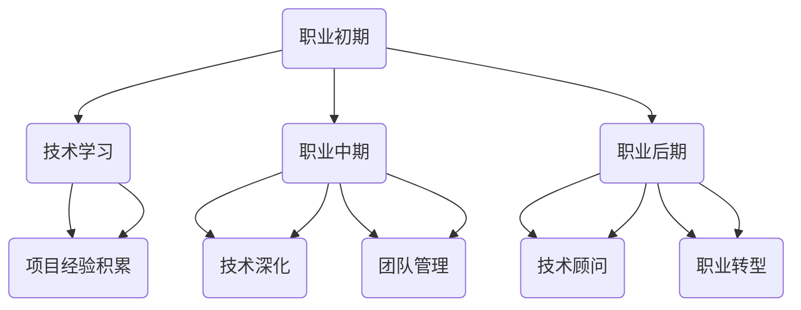
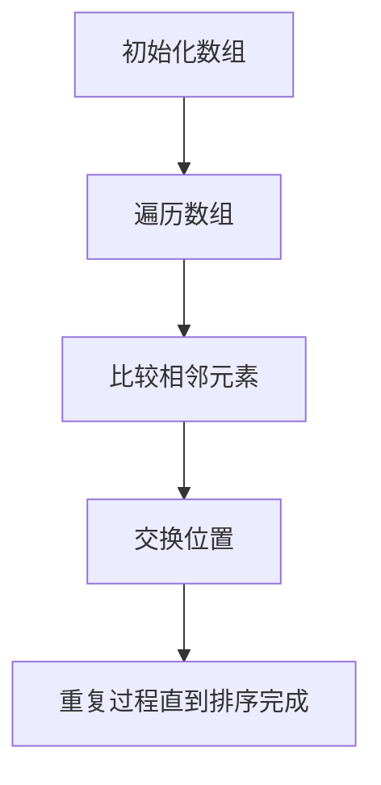
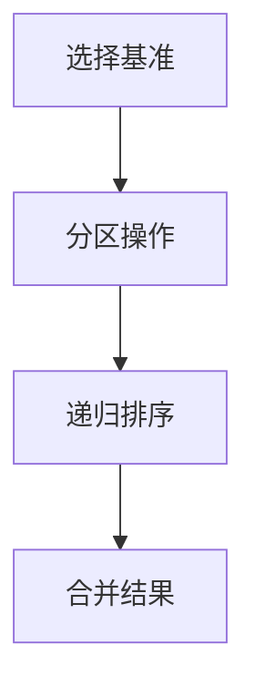
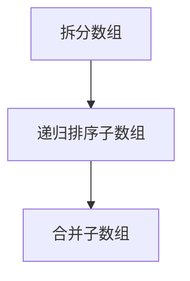
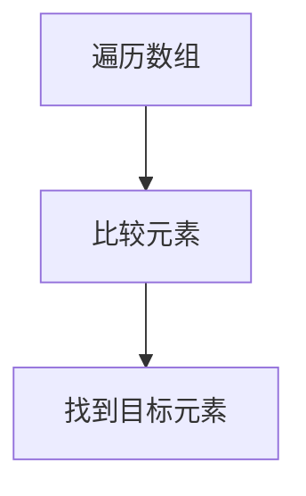
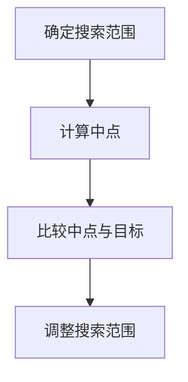
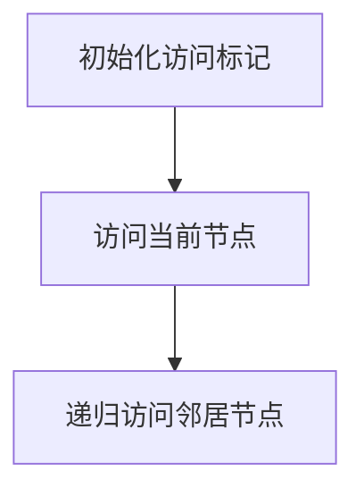
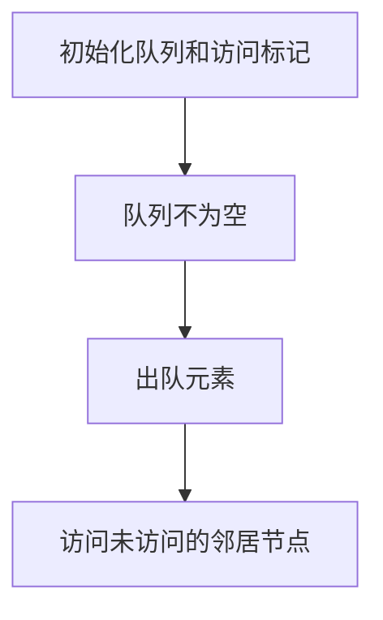

                 

# 《程序员的职业生涯规划：30年路线图》

## 关键词
- 职业生涯规划
- 程序员成长
- 技术学习
- 项目经验
- 职业转型

## 摘要
本文旨在为程序员提供一份30年的职业生涯规划路线图，从入门到专家，覆盖了技术学习、项目实践、职业转型等多个阶段。通过深入剖析核心算法原理、数学模型，以及具体项目实战，本文帮助程序员明确职业发展方向，提升专业技能，实现个人与职业的全面发展。

## 第一部分：核心概念与联系

在程序员的职业生涯中，规划是一个至关重要的环节。一个清晰的规划可以帮助程序员更好地理解自己的发展方向，合理分配时间和精力，从而在职业生涯中获得更大的成功。本文将围绕这一核心概念，探讨程序员的成长路径和职业发展策略。

### 1.1 程序员职业生涯概述

程序员的职业生涯可以大致分为三个阶段：职业初期、职业中期和职业后期。每个阶段都有其独特的目标和任务。

**职业初期**：这个阶段通常是从入门到中级水平的过程。程序员需要掌握基础编程技能，熟悉常用的编程语言和开发工具。同时，积累项目经验是至关重要的，通过实际项目的实践，可以提高编程能力和解决问题的能力。

**职业中期**：随着经验的积累，程序员开始进入职业中期。这个阶段的目标是成为技术专家，深入掌握某一领域的专业知识，同时开始承担团队管理职责。在这个阶段，程序员需要提高自己的领导能力和沟通能力，以更好地带领团队完成项目。

**职业后期**：职业后期是程序员职业生涯的成熟阶段。在这个阶段，程序员可以选择继续深化技术领域，成为领域专家或技术顾问，或者转向其他领域，如产品管理、业务分析等。这个阶段的程序员不仅需要深厚的专业技能，还需要具备战略思考和业务洞察力。

下面，我们使用Mermaid图表来展示程序员职业生涯的三个阶段及其关系：



### 1.2 职业规划的核心原则

在程序员的职业生涯规划中，有几个核心原则是必须遵循的：

**持续学习**：技术更新迅速，程序员需要不断学习新技能以保持竞争力。这不仅包括编程语言和开发工具的更新，还包括算法、数据结构、设计模式等基础知识的深化。

**职业成长**：从技术专家到管理岗位，再到战略咨询，每个阶段都有不同的成长路径。程序员需要明确自己的职业目标，并为之努力。

**职业平衡**：工作和生活要达到平衡，以保持长期的职业活力和健康状态。这包括合理安排工作时间，培养兴趣爱好，保持身心健康等。

### 第二部分：核心算法原理讲解

在程序员的职业生涯中，掌握核心算法原理是提升编程能力的关键。本部分将详细介绍排序算法、搜索算法和图算法，并使用伪代码展示其基本原理。

#### 2.1 排序算法

排序算法是数据处理中的基本操作，常见的排序算法有冒泡排序、快速排序和归并排序等。

**冒泡排序**



**快速排序**



**归并排序**



#### 2.2 搜索算法

搜索算法用于在数据集合中查找特定元素。常见的搜索算法有线性搜索和二分搜索。

**线性搜索**



**二分搜索**



#### 2.3 图算法

图算法广泛应用于社交网络、路由算法等领域。常见的图算法有深度优先搜索（DFS）和广度优先搜索（BFS）。

**深度优先搜索（DFS）**



**广度优先搜索（BFS）**



### 第三部分：数学模型和数学公式

数学模型和数学公式是程序员解决复杂问题的有力工具。本部分将介绍概率论和线性代数的基本概念和公式。

#### 3.1 概率论

概率论是数据分析和决策的重要基础。以下是几个基本概率公式：

**概率公式**

$$
P(A \cap B) = P(A) \cdot P(B|A)
$$

**条件概率**

$$
P(B|A) = \frac{P(A \cap B)}{P(A)}
$$

**独立事件**

$$
P(A \cap B) = P(A) \cdot P(B)
$$

**全概率公式**

$$
P(A) = \sum_{i=1}^{n} P(A|B_i) \cdot P(B_i)
$$

**贝叶斯定理**

$$
P(A|B) = \frac{P(B|A) \cdot P(A)}{P(B)}
$$

#### 3.2 线性代数

线性代数在数据结构和算法优化中扮演重要角色。以下是几个关键公式：

**矩阵乘法**

$$
C_{ij} = \sum_{k=1}^{n} A_{ik} \cdot B_{kj}
$$

**矩阵求逆**

$$
A^{-1} = \frac{1}{\det(A)} \cdot \text{adj}(A)
$$

**矩阵的特征值和特征向量**

$$
\text{det}(\lambda I - A) = 0
$$

$$
A \vec{v} = \lambda \vec{v}
$$

### 第四部分：项目实战

通过具体项目实战，程序员可以巩固所学的知识和技能。本部分将介绍两个项目：数据结构项目和算法项目。

#### 4.1 数据结构项目

**项目目标**：实现一个基本的链表数据结构，支持插入、删除、查找等基本操作。

**源代码**

```python
class Node:
    def __init__(self, data):
        self.data = data
        self.next = None

class LinkedList:
    def __init__(self):
        self.head = None

    def append(self, data):
        new_node = Node(data)
        if not self.head:
            self.head = new_node
        else:
            current = self.head
            while current.next:
                current = current.next
            current.next = new_node

    def delete(self, data):
        current = self.head
        if current and current.data == data:
            self.head = current.next
            current = None
            return
        prev = None
        while current and current.data != data:
            prev = current
            current = current.next
        if current is None:
            return
        prev.next = current.next
        current = None

    def search(self, data):
        current = self.head
        while current:
            if current.data == data:
                return True
            current = current.next
        return False
```

**项目解释**：

- `Node` 类定义了链表的节点，包含数据域和指向下一个节点的指针。
- `LinkedList` 类定义了链表的操作，包括链表的初始化、节点的添加、节点的删除和节点的查找。

#### 4.2 算法项目

**项目目标**：使用快速排序算法对一组数据进行排序。

**源代码**

```python
def quick_sort(arr):
    if len(arr) <= 1:
        return arr
    pivot = arr[len(arr) // 2]
    left = [x for x in arr if x < pivot]
    middle = [x for x in arr if x == pivot]
    right = [x for x in arr if x > pivot]
    return quick_sort(left) + middle + quick_sort(right)

arr = [3, 6, 8, 10, 1, 2, 1]
sorted_arr = quick_sort(arr)
print(sorted_arr)
```

**项目解释**：

- `quick_sort` 函数实现了快速排序算法。如果数组长度小于等于1，则返回原数组。否则，选择中间元素作为基准（pivot），将数组划分为小于、等于和大于基准的三个子数组，然后递归地对子数组进行排序并合并。

### 第五部分：开发环境搭建

开发环境的搭建是程序员进行项目开发的基础。本部分将介绍如何搭建本地和云端开发环境。

#### 5.1 本地开发环境

**目标**：在本地计算机上配置一个高效的Python开发环境。

**步骤**：

1. **安装Python**：从 [Python官网](https://www.python.org/downloads/) 下载并安装Python。
2. **安装IDE**：安装PyCharm或其他Python集成开发环境。
3. **安装依赖包**：使用pip命令安装常用依赖包。

```bash
pip install numpy pandas matplotlib
```

**环境配置**：

- 在PyCharm中创建一个新的Python项目，并在项目中配置Python解释器和相关依赖。

#### 5.2 云端开发环境

**目标**：在云端搭建一个Docker容器化的Python开发环境。

**步骤**：

1. **安装Docker**：在云端服务器上安装Docker。
2. **创建Dockerfile**：编写Dockerfile文件定义Python环境。

```Dockerfile
FROM python:3.9

WORKDIR /app

COPY requirements.txt .

RUN pip install -r requirements.txt

COPY . .

CMD ["python", "main.py"]
```

3. **构建和运行Docker镜像**：

```bash
docker build -t python-dev:1.0 .
docker run -it --rm python-dev:1.0
```

**环境配置**：

- 在容器内启动Python解释器，并配置相关依赖。

### 第六部分：源代码实现与代码解读

在第六部分，我们将详细解读一些核心源代码，并分析其关键部分。

#### 6.1 链表数据结构

**源代码**

```python
class Node:
    def __init__(self, data):
        self.data = data
        self.next = None

class LinkedList:
    def __init__(self):
        self.head = None

    def append(self, data):
        new_node = Node(data)
        if not self.head:
            self.head = new_node
        else:
            current = self.head
            while current.next:
                current = current.next
            current.next = new_node

    def delete(self, data):
        current = self.head
        if current and current.data == data:
            self.head = current.next
            current = None
            return
        prev = None
        while current and current.data != data:
            prev = current
            current = current.next
        if current is None:
            return
        prev.next = current.next
        current = None

    def search(self, data):
        current = self.head
        while current:
            if current.data == data:
                return True
            current = current.next
        return False
```

**代码解读**

- `Node` 类：定义链表的节点，包含数据域和指向下一个节点的指针。
- `LinkedList` 类：定义链表的操作，包括链表的初始化、节点的添加、节点的删除和节点的查找。

#### 6.2 快速排序算法

**源代码**

```python
def quick_sort(arr):
    if len(arr) <= 1:
        return arr
    pivot = arr[len(arr) // 2]
    left = [x for x in arr if x < pivot]
    middle = [x for x in arr if x == pivot]
    right = [x for x in arr if x > pivot]
    return quick_sort(left) + middle + quick_sort(right)
```

**代码解读**

- `quick_sort` 函数：实现快速排序算法。如果数组长度小于等于1，则返回原数组。否则，选择中间元素作为基准（pivot），将数组划分为小于、等于和大于基准的三个子数组，然后递归地对子数组进行排序并合并。

### 第七部分：代码解读与分析

在第七部分，我们将深入分析一些关键代码段，并解释其工作原理和性能影响。

#### 7.1 链表数据结构性能分析

**性能分析**

- **插入操作**：平均时间复杂度为O(n)，最坏情况下为O(n)，因为需要遍历链表以找到末尾节点。
- **删除操作**：平均时间复杂度为O(n)，最坏情况下为O(n)，因为可能需要遍历整个链表以找到待删除节点。
- **查找操作**：平均时间复杂度为O(n)，最坏情况下为O(n)，因为可能需要遍历整个链表以找到特定节点。

**优化建议**

- 对于频繁查找的场景，可以考虑使用哈希表或平衡树等更高效的数据结构。

#### 7.2 快速排序算法性能分析

**性能分析**

- **平均时间复杂度**：O(n log n)，因为每次划分都能大致平衡子数组大小。
- **最坏时间复杂度**：O(n^2)，当输入数组已经是有序或逆序时，快速排序的性能会下降到线性对数级别。
- **空间复杂度**：O(log n)，因为递归调用需要使用栈空间。

**优化建议**

- **随机化选择基准**：避免最坏情况的发生，提高算法的平均性能。
- **三向切分**：对于重复元素较多的数组，使用三向切分可以进一步优化性能。

### 第八部分：总结与展望

在第八部分，我们将对本文的内容进行总结，并对程序员的未来发展趋势进行展望。

#### 8.1 总结

本文从程序员职业生涯规划、核心算法原理、数学模型、项目实战、开发环境搭建等多个角度，详细介绍了程序员的职业发展路径。通过本文，程序员可以明确自己的职业目标，掌握关键技能，提升自身竞争力。

#### 8.2 展望

随着技术的不断进步，程序员面临着前所未有的机遇和挑战。未来的发展趋势包括：

- **持续学习**：技术更新迅速，程序员需要不断学习新技能以保持竞争力。
- **多元化发展**：程序员不仅可以在技术领域深化，还可以向管理、咨询等领域拓展。
- **新兴领域**：人工智能、大数据、云计算等新兴技术将为程序员提供更多机会。

《程序员的职业生涯规划：30年路线图》旨在帮助程序员规划职业生涯，提升专业技能，实现个人与职业的全面发展。在未来的发展中，程序员将继续扮演技术变革的推动者和创新者角色，为社会创造更多价值。

## 作者

作者：AI天才研究院/AI Genius Institute & 禅与计算机程序设计艺术 /Zen And The Art of Computer Programming

