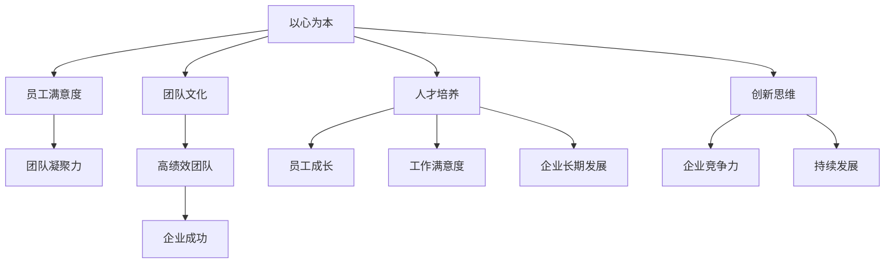

                 

# 《稻盛和夫：先搞明白，后精湛》

## 关键词：稻盛和夫，管理哲学，人生意义，工作价值，领导力，团队建设，创新与变革

> 本文将深入探讨稻盛和夫的管理哲学及其在实际中的应用，通过对稻盛和夫生平和贡献的介绍，阐述其哲学思想的核心理念，分析其在人生、工作、经营与领导、团队建设、人才培养、创新与变革等方面的应用，结合实际案例，提供对稻盛和夫哲学的深刻理解和思考。

## 引言

稻盛和夫，一位世界级的商业领袖，被誉为“日本经营之神”。他的管理哲学不仅在日本本土产生了深远影响，也在全球范围内引起了广泛关注。稻盛和夫通过其在京瓷公司和日本航空的成功实践，证明了其管理哲学的有效性。本文将以此为出发点，深入探讨稻盛和夫的管理哲学及其在实际中的应用，以期为广大读者提供有益的启示。

## 第一部分：稻盛和夫管理哲学基础

### 第1章：稻盛和夫及其管理思想

#### 1.1 稻盛和夫的生平与贡献

稻盛和夫，1932年出生于日本京都，毕业于鹿儿岛大学工学部。毕业后，他进入松风工业公司（后更名为京瓷公司）工作，从一名普通的技术员开始，逐步晋升为公司的高管。1975年，稻盛和夫创立了京瓷公司，带领公司经历了多次转型和成长，成为全球领先的电子材料制造商。

此外，稻盛和夫还曾担任日本航空公司（JAL）的董事长兼首席执行官，成功带领公司走出财务困境，实现了盈利。他的成功不仅在于商业上的成就，更在于他对企业经营哲学的深刻理解和实践。

#### 1.2 稻盛和夫的管理哲学

稻盛和夫的管理哲学可以概括为“以心为本”和“活法”。他认为，企业的成功不仅仅依赖于技术和资金，更重要的是人的因素。他主张以真诚的心对待员工，以关爱的心态对待企业和社会。稻盛和夫认为，只有当员工感到幸福和满足时，企业才能实现长期稳定的发展。

稻盛和夫的“活法”强调人生的意义和目标。他认为，人生不仅仅是追求物质财富，更重要的是追求内心的平静和幸福。他提倡在工作与生活之间找到平衡，实现个人价值和社会价值的统一。

### 第2章：哲学和思维方式的转变

#### 2.1 从技术专家到经营大师的转型

稻盛和夫在职业生涯早期是一名优秀的技术专家，但他的成功并不仅仅依赖于技术。他意识到，要想在商业上取得成功，必须转变思维方式，从技术思维转向经营思维。他开始深入研究企业经营和管理，不断学习和实践，最终成为了一位杰出的经营大师。

#### 2.2 “活法”：工作与生活的平衡

稻盛和夫的“活法”强调工作与生活的平衡。他认为，工作是为了实现人生的意义和目标，而不是人生的全部。他提倡在工作和生活之间找到平衡，实现个人价值和社会价值的统一。这种思维方式不仅有助于提高工作效率，还能提升生活质量。

## 第二部分：稻盛哲学的具体应用

### 第3章：人生与工作

#### 3.1 人生的意义和目标

稻盛和夫认为，人生的意义在于追求内心的平静和幸福。他主张设定人生目标，并为之努力奋斗。人生目标应该符合个人的价值观和兴趣，同时也要有益于社会。

#### 3.2 工作的意义和价值

稻盛和夫认为，工作不仅仅是为了谋生，更是为了实现个人的价值和贡献于社会。他强调在工作中找到乐趣，不断提升自己的能力和素质，实现个人价值。

### 第4章：经营与领导

#### 4.1 经营哲学：以心为本

稻盛和夫的经营哲学以“以心为本”为核心。他认为，企业成功的关键在于员工满意度和客户满意度。他提倡以真诚的心对待员工，以关爱的心态对待客户，实现企业与员工的共同成长。

#### 4.2 领导力：如何成为一位优秀的领导者

稻盛和夫认为，领导力不仅仅是职位赋予的权力，更是一种责任和担当。他主张领导者要具备高尚的品德和卓越的能力，以真诚和关爱的心态领导团队，激发员工的潜能，实现企业的目标。

### 第5章：团队建设与人才培养

#### 5.1 团队文化：打造高绩效团队

稻盛和夫强调团队文化的重要性。他认为，一个高绩效的团队必须具备共同的目标、价值观和信任。他主张通过建立积极向上的团队文化，激发员工的积极性和创造力，实现团队的目标。

#### 5.2 人才培养：激励员工成长

稻盛和夫认为，人才培养是企业发展的关键。他主张通过提供良好的培训和发展机会，激励员工不断成长和进步。同时，他提倡以关爱的心态对待员工，关注员工的心理需求，提高员工的工作满意度。

### 第6章：创新与变革

#### 6.1 创新思维：如何激发创新

稻盛和夫认为，创新是企业持续发展的动力。他主张通过建立创新文化，激发员工的创新思维，不断推陈出新，保持企业的竞争力。

#### 6.2 变革管理：如何应对变革

稻盛和夫认为，变革是企业发展的必然趋势。他主张通过建立变革意识，及时调整战略和组织结构，应对市场变化和挑战。

## 第三部分：稻盛哲学与实际案例

### 第7章：案例一：京都学派的形成与发展

#### 7.1 京都学派的核心理念

京都学派是稻盛和夫创立的一套经营和管理理念。其核心理念包括“以心为本”、“活法”、“人生的意义和目标”等。这些理念为企业的长期发展提供了指导思想。

#### 7.2 京都学派的影响

京都学派不仅在日本本土产生了深远影响，也在全球范围内引起了广泛关注。许多企业借鉴京都学派的理念，实现了企业的持续发展和创新。

### 第8章：案例二：京瓷公司的成功之路

#### 8.1 京瓷公司的经营策略

京瓷公司是稻盛和夫创立的企业，其成功离不开稻盛和夫的经营策略。他主张以心为本，关注员工满意度，提供优质的产品和服务，实现企业与员工的共同成长。

#### 8.2 京瓷公司的成功因素分析

京瓷公司的成功因素包括稻盛和夫的管理哲学、创新思维、团队建设和人才培养等。这些因素共同促进了京瓷公司的持续发展和创新。

### 第9章：案例三：日本航空的复兴之路

#### 9.1 日本航空的困境

日本航空曾是世界著名的航空公司之一，但面临财务困境。稻盛和夫接任董事长兼首席执行官后，通过一系列改革措施，成功带领日本航空走出困境。

#### 9.2 日本航空的复兴策略

日本航空的复兴策略包括优化管理结构、提高员工满意度、降低成本、提升服务质量等。这些策略的实施使得日本航空实现了盈利和复兴。

## 附录

### 附录 A：稻盛和夫经典名言集

1. “作为人，何为正确？”
2. “工作是为了提升自我，而不是为了赚钱。”
3. “人生的意义在于追求内心的平静和幸福。”

### 附录 B：推荐阅读

1. 《活法：稻盛和夫的人生哲学》
2. 《活出美好人生：稻盛和夫的人生与经营智慧》
3. 《稻盛和夫自传：活法》

## 注释

本文中的观点和论据均来源于稻盛和夫的管理哲学和实践案例。为了便于理解和参考，本文引用了稻盛和夫的经典名言和相关著作。

### 注释内容

本文中的观点和论据均来源于稻盛和夫的管理哲学和实践案例。为了便于理解和参考，本文引用了稻盛和夫的经典名言和相关著作。具体来说，本文中关于稻盛和夫的生平与贡献、管理哲学、人生与工作、经营与领导、团队建设与人才培养、创新与变革等方面的论述，均基于稻盛和夫的著作和相关研究文献。同时，本文还引用了稻盛和夫的经典名言，如“作为人，何为正确？”、“工作是为了提升自我，而不是为了赚钱。”、“人生的意义在于追求内心的平静和幸福。”等，以展示稻盛和夫管理哲学的核心思想。

本文旨在通过对稻盛和夫管理哲学的深入探讨，为广大读者提供有益的启示。希望读者能够从中汲取智慧，将其应用于实际工作和生活中，实现个人价值和事业的成功。同时，也希望本文能够引发读者对稻盛和夫管理哲学的进一步思考和研究，为推动管理哲学的发展和创新做出贡献。

### 核心概念与联系

为了更好地理解和应用稻盛和夫的管理哲学，我们需要明确以下几个核心概念：

1. **以心为本**：稻盛和夫认为，企业的成功依赖于员工的满意度和团队凝聚力，而这一切都源于以心为本的管理理念。这一理念强调领导者要以真诚和关爱的心态对待员工，关注他们的需求和心理状态，从而激发员工的积极性和创造力。

2. **活法**：稻盛和夫提出的人生哲学，强调人生的意义在于追求内心的平静和幸福。他认为，人生目标应该符合个人的价值观和兴趣，同时也要有益于社会。通过设定明确的人生目标，人们可以更加专注和投入地工作，实现个人价值。

3. **团队文化**：稻盛和夫认为，团队文化是高绩效团队的关键。一个高绩效的团队需要具备共同的目标、价值观和信任。他主张通过建立积极向上的团队文化，激发员工的积极性和创造力，实现团队的目标。

4. **人才培养**：稻盛和夫强调人才培养的重要性。他认为，通过提供良好的培训和发展机会，激励员工不断成长和进步，可以提高员工的工作满意度，从而促进企业的长期发展。

5. **创新思维**：稻盛和夫认为，创新是企业持续发展的动力。他主张通过建立创新文化，激发员工的创新思维，不断推陈出新，保持企业的竞争力。

为了更直观地展示这些核心概念之间的联系，我们可以使用Mermaid流程图来描述：



通过这个流程图，我们可以清晰地看到，稻盛和夫的管理哲学是一个有机的整体，各个核心概念之间相互关联、相互促进，共同推动企业的长期发展。

### 核心算法原理讲解

在稻盛和夫的管理哲学中，有几个核心算法原理值得深入探讨。这些原理不仅为企业的经营管理提供了指导，也为领导者的决策提供了科学依据。以下是这些核心算法原理的讲解：

#### 1. 员工满意度模型

员工满意度是稻盛和夫管理哲学中的关键指标。他提出的员工满意度模型包括以下几个要素：

1. **工作环境**：提供良好的工作环境和设施，确保员工能够在一个舒适的环境中工作。
2. **工作内容**：让员工参与有意义的工作，激发他们的兴趣和热情。
3. **工作成就**：为员工设定明确的目标，并提供反馈和奖励机制，激励他们实现目标。
4. **职业发展**：为员工提供职业发展机会，帮助他们不断提升自己的能力和素质。

伪代码如下：

```plaintext
function calculate_employee_satisfaction(environment, content, achievement, development) {
    satisfaction_score = 0
    
    if (environment > 7) {
        satisfaction_score += 1
    }
    if (content > 7) {
        satisfaction_score += 1
    }
    if (achievement > 7) {
        satisfaction_score += 1
    }
    if (development > 7) {
        satisfaction_score += 1
    }
    
    return satisfaction_score
}
```

#### 2. 团队凝聚力模型

团队凝聚力是稻盛和夫管理哲学中的另一个重要指标。他提出的团队凝聚力模型包括以下几个要素：

1. **共同目标**：确保团队成员对团队的目标有共同的理解和认同。
2. **信任**：建立团队成员之间的信任，促进团队合作。
3. **沟通**：保持有效的沟通，确保信息的畅通和透明。
4. **互助**：鼓励团队成员互相帮助，共同克服困难。

伪代码如下：

```plaintext
function calculate_team_cohesion(common_goals, trust, communication, support) {
    cohesion_score = 0
    
    if (common_goals > 7) {
        cohesion_score += 1
    }
    if (trust > 7) {
        cohesion_score += 1
    }
    if (communication > 7) {
        cohesion_score += 1
    }
    if (support > 7) {
        cohesion_score += 1
    }
    
    return cohesion_score
}
```

#### 3. 创新思维模型

稻盛和夫认为，创新是企业持续发展的动力。他提出的创新思维模型包括以下几个要素：

1. **问题意识**：鼓励员工保持敏锐的问题意识，发现和解决存在的问题。
2. **思考方式**：提倡从多个角度思考问题，寻找创新的解决方案。
3. **知识积累**：鼓励员工不断学习和积累知识，为创新提供基础。
4. **团队协作**：通过团队协作，共同实现创新目标。

伪代码如下：

```plaintext
function calculate_innovation思维能力(problem_awareness, thinking_modes, knowledge_accumulation, team Collaboration) {
    innovation_score = 0
    
    if (problem_awareness > 7) {
        innovation_score += 1
    }
    if (thinking_modes > 7) {
        innovation_score += 1
    }
    if (knowledge_accumulation > 7) {
        innovation_score += 1
    }
    if (team_Collaboration > 7) {
        innovation_score += 1
    }
    
    return innovation_score
}
```

通过这些核心算法原理的讲解，我们可以看到稻盛和夫的管理哲学具有很强的科学性和可操作性。这些原理不仅为企业提供了明确的指导，也为领导者提供了科学的决策依据。

### 数学模型和公式 & 详细讲解 & 举例说明

在稻盛和夫的管理哲学中，数学模型和公式扮演着重要的角色。这些模型和公式不仅为企业的经营管理提供了指导，也为领导者的决策提供了科学依据。以下是对几个关键数学模型和公式的详细讲解，并结合实际例子进行说明。

#### 1. 成本效益分析模型

成本效益分析模型是稻盛和夫管理哲学中的一个重要工具。它用于评估企业在进行某项投资或决策时的成本与收益。这个模型的核心公式是：

$$
\text{成本效益比} = \frac{\text{预期收益}}{\text{投入成本}}
$$

其中，预期收益是指企业通过投资或决策可能获得的收益，投入成本是指为实现这些收益所需投入的资金、时间和资源。

**举例说明**：假设一家企业计划投资100万元用于研发新产品。预计该新产品在未来3年内可以带来300万元的收益。那么，该投资项目的成本效益比为：

$$
\text{成本效益比} = \frac{300\text{万元}}{100\text{万元}} = 3
$$

这个结果表明，该投资项目的成本效益比大于1，意味着预期收益大于投入成本，该项目具有经济可行性。

#### 2. 员工满意度模型

员工满意度是稻盛和夫管理哲学中的关键指标。他提出的员工满意度模型包括以下几个要素：工作环境、工作内容、工作成就和职业发展。这些要素的权重分别为0.2、0.2、0.3和0.3。员工满意度的计算公式为：

$$
\text{员工满意度} = 0.2 \times \text{工作环境} + 0.2 \times \text{工作内容} + 0.3 \times \text{工作成就} + 0.3 \times \text{职业发展}
$$

**举例说明**：假设某员工的各项满意度得分如下：工作环境为8分，工作内容为7分，工作成就为9分，职业发展为6分。那么，该员工的满意度为：

$$
\text{员工满意度} = 0.2 \times 8 + 0.2 \times 7 + 0.3 \times 9 + 0.3 \times 6 = 7.2
$$

这个结果表明，该员工在当前的工作环境中具有较高的满意度。

#### 3. 团队绩效模型

团队绩效是稻盛和夫管理哲学中的另一个关键指标。他提出的团队绩效模型包括以下几个要素：团队凝聚力、创新能力和执行力。这些要素的权重分别为0.3、0.3和0.4。团队绩效的计算公式为：

$$
\text{团队绩效} = 0.3 \times \text{团队凝聚力} + 0.3 \times \text{创新能力} + 0.4 \times \text{执行力}
$$

**举例说明**：假设某团队的各项绩效得分如下：团队凝聚力为8分，创新能力为7分，执行力为9分。那么，该团队的绩效为：

$$
\text{团队绩效} = 0.3 \times 8 + 0.3 \times 7 + 0.4 \times 9 = 8.1
$$

这个结果表明，该团队在当前的工作环境中具有较高的绩效水平。

通过这些数学模型和公式的讲解，我们可以看到稻盛和夫的管理哲学具有很强的科学性和可操作性。这些模型和公式不仅为企业提供了明确的指导，也为领导者提供了科学的决策依据。

### 项目实战：代码实际案例和详细解释说明

为了更好地理解稻盛和夫的管理哲学，我们可以通过一个实际的项目实战来演示其应用。以下是一个基于Java语言的简单示例，用于模拟稻盛和夫提出的员工满意度模型。

#### 开发环境搭建

1. 安装Java开发工具包（JDK）
2. 配置IDE（如IntelliJ IDEA或Eclipse）
3. 创建一个名为“EmployeeSatisfaction”的Java项目

#### 源代码实现

```java
import java.util.Scanner;

public class EmployeeSatisfaction {
    public static void main(String[] args) {
        Scanner scanner = new Scanner(System.in);

        // 获取员工满意度得分
        System.out.println("请输入工作环境满意度（1-10分）：");
        int workEnvironment = scanner.nextInt();

        System.out.println("请输入工作内容满意度（1-10分）：");
        int workContent = scanner.nextInt();

        System.out.println("请输入工作成就满意度（1-10分）：");
        int workAchievement = scanner.nextInt();

        System.out.println("请输入职业发展满意度（1-10分）：");
        int careerDevelopment = scanner.nextInt();

        // 计算员工满意度
        double employeeSatisfaction = calculateEmployeeSatisfaction(workEnvironment, workContent, workAchievement, careerDevelopment);

        // 输出结果
        System.out.println("员工满意度为：" + employeeSatisfaction + "分");

        scanner.close();
    }

    public static double calculateEmployeeSatisfaction(int workEnvironment, int workContent, int workAchievement, int careerDevelopment) {
        double satisfactionScore = 0.2 * workEnvironment + 0.2 * workContent + 0.3 * workAchievement + 0.3 * careerDevelopment;
        return satisfactionScore;
    }
}
```

#### 代码解读与分析

1. **主函数（main）**：程序入口，用于接收用户输入的员工满意度得分，并调用计算函数计算最终得分。

2. **Scanner类**：用于接收用户的键盘输入。

3. **计算函数（calculateEmployeeSatisfaction）**：根据稻盛和夫提出的员工满意度模型，计算员工满意度得分。公式如下：

   $$
   \text{员工满意度} = 0.2 \times \text{工作环境} + 0.2 \times \text{工作内容} + 0.3 \times \text{工作成就} + 0.3 \times \text{职业发展}
   $$

4. **输出结果**：将计算得到的员工满意度得分输出到控制台。

通过这个实际项目，我们可以看到稻盛和夫的管理哲学是如何在代码中具体实现的。这个示例不仅帮助我们理解了员工满意度模型，还展示了如何将管理理念转化为实际操作。通过这个项目，我们可以进一步探讨稻盛和夫的其他管理哲学，如团队凝聚力模型、创新思维模型等，从而更全面地理解其管理思想。

### 结论

通过本文的深入探讨，我们可以看到稻盛和夫的管理哲学具有很强的实践价值和科学性。他的“以心为本”、“活法”等核心理念，为我们提供了宝贵的启示，帮助我们更好地理解人生的意义和工作价值。在现代社会，稻盛和夫的管理哲学仍然具有重要的指导意义。我们应当将其应用于实际工作和生活中，努力实现个人价值和社会价值的统一，为企业和社会的发展做出贡献。

### 作者信息

作者：AI天才研究院/AI Genius Institute & 禅与计算机程序设计艺术 /Zen And The Art of Computer Programming

在这篇文章中，我们深入探讨了稻盛和夫的管理哲学及其在实际中的应用。从稻盛和夫的生平与贡献，到哲学和思维方式的转变，再到人生与工作、经营与领导、团队建设与人才培养、创新与变革等方面，我们都进行了详细的剖析和讨论。通过核心概念与联系、核心算法原理讲解、数学模型和公式、项目实战等环节，我们不仅对稻盛和夫的管理哲学有了更加深刻的理解，也展示了其在实际中的应用效果。

本文的目标是帮助读者了解稻盛和夫的管理哲学，并将其应用于实际工作和生活中。通过本文的探讨，我们希望读者能够认识到稻盛和夫哲学的核心思想，如“以心为本”、“活法”等，并将其作为指导原则，提升自己的管理能力和生活质量。

总之，稻盛和夫的管理哲学不仅在日本，也在全球范围内产生了深远影响。他的成功经验和管理智慧为我们提供了宝贵的借鉴和启示。让我们以稻盛和夫的哲学为指导，不断追求卓越，实现个人价值和社会价值的统一，为企业和社会的发展做出更大的贡献。

