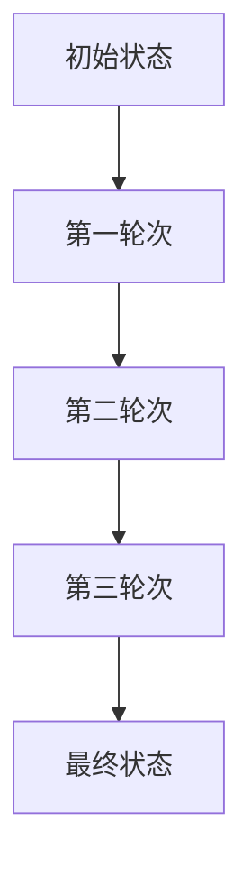
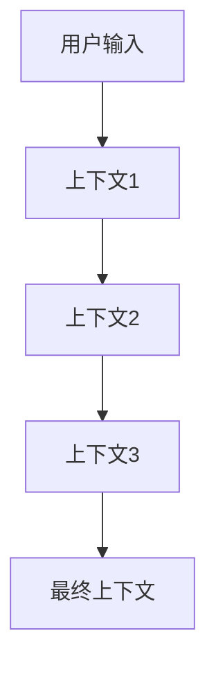
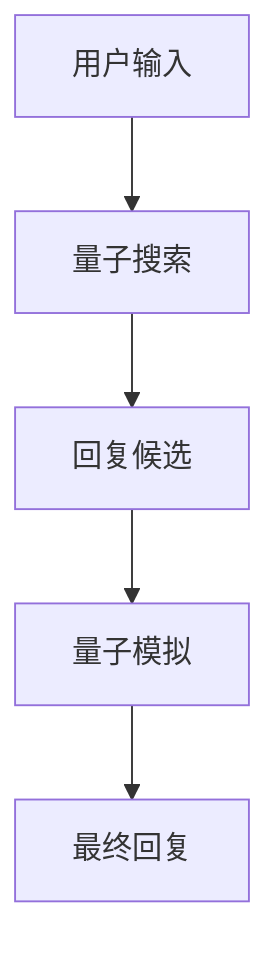
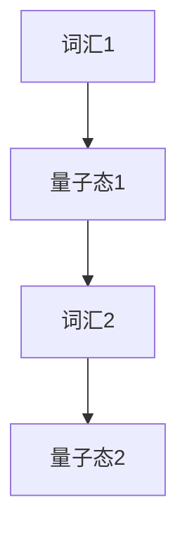
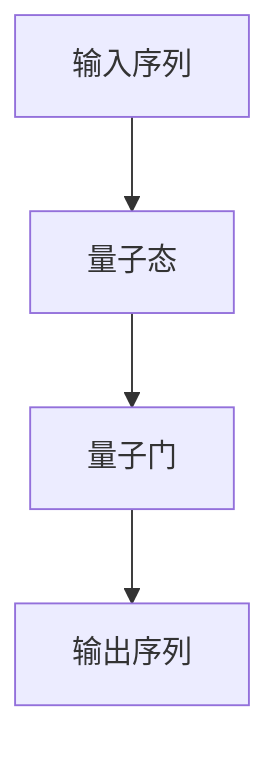

                 

### 量子计算与聊天机器人：解决复杂问题的前沿技术

> **关键词**：量子计算、聊天机器人、复杂问题解决、人工智能、算法优化、技术创新

> **摘要**：本文将深入探讨量子计算与聊天机器人的结合，分析如何利用量子计算的优势解决聊天机器人中遇到的复杂问题。我们将逐步介绍量子计算的基本原理、量子计算在聊天机器人中的应用场景，以及未来发展的挑战与机遇。通过本文的阅读，读者将了解量子计算在人工智能领域的革命性潜力，以及如何通过量子计算提升聊天机器人的性能和智能化水平。

### 《聊天机器人量子计算：解决复杂问题》目录大纲

## 第一部分：引言

### 1.1 量子计算与聊天机器人概述

#### 1.1.1 量子计算的基本概念

量子计算是一种基于量子力学原理的新型计算模式，与传统计算不同，它利用量子位（qubits）进行信息处理，具有并行计算和快速处理复杂问题的潜力。

#### 1.1.2 聊天机器人的发展历程

聊天机器人作为人工智能的一个重要分支，已经经历了从规则驱动到基于机器学习的深度学习模型的演变。其应用场景从简单的客服系统到复杂的智能助手，日益广泛。

#### 1.1.3 量子计算在聊天机器人领域的应用前景

量子计算在聊天机器人领域具有巨大的应用潜力，可以用于优化对话管理、自然语言处理等核心任务，提升聊天机器人的性能和智能化水平。

### 1.2 书籍目标与结构安排

#### 1.2.1 阅读本书的目标读者

本书的目标读者是具有一定编程基础和人工智能知识，希望了解量子计算与聊天机器人结合的读者。

#### 1.2.2 书籍的章节结构

本书分为五个主要部分，依次介绍量子计算基础、聊天机器人技术、量子计算在聊天机器人中的应用、量子聊天机器人的未来发展趋势，以及相关的开发资源。

## 第二部分：量子计算基础

### 2.1 量子计算原理

量子比特、量子态、量子门、量子纠缠和量子算法是量子计算的核心概念，我们将逐一介绍这些概念并探讨其原理。

#### 2.1.1 量子比特与经典比特

量子比特（qubits）是量子计算的基本单位，与传统比特（bits）相比，它具有叠加和纠缠的特性。

#### 2.1.2 量子态与叠加原理

量子态是量子比特的集合状态，叠加原理表明量子态可以同时处于多种可能的组合。

#### 2.1.3 量子门与量子操作

量子门是量子计算的基本操作，用于对量子态进行变换。

#### 2.1.4 量子纠缠

量子纠缠是量子计算中的一种特殊现象，可以用来实现高效的量子计算。

#### 2.1.5 量子算法

量子算法是利用量子计算原理解决特定问题的算法，如量子搜索算法和量子模拟算法。

### 2.2 量子计算数学模型

量子计算涉及线性代数、概率论和信息论等数学领域，我们将介绍这些数学模型在量子计算中的应用。

#### 2.2.1 量子计算与线性代数

量子计算中常用的矩阵运算和线性变换是线性代数的基本概念。

#### 2.2.2 量子计算与概率论

量子态的叠加和测量过程具有概率性质，概率论是描述这些现象的重要工具。

#### 2.2.3 量子计算与信息论

量子计算中的信息传递和编码需要运用信息论的基本原理。

## 第三部分：聊天机器人技术

### 3.1 聊天机器人原理

自然语言处理、对话管理和对话生成是聊天机器人的核心技术，我们将介绍这些技术的基本原理和实现方法。

#### 3.1.1 自然语言处理技术

词嵌入、序列到序列模型和转换器架构是自然语言处理的重要技术。

##### 3.1.1.1 词嵌入

词嵌入是将自然语言词汇映射到高维向量空间的技术，用于表示词汇之间的关系。

##### 3.1.1.2 序列到序列模型

序列到序列模型用于处理自然语言中的序列数据，如机器翻译和文本生成。

##### 3.1.1.3 转换器架构

转换器架构是序列到序列模型的一种变体，广泛应用于聊天机器人的对话生成。

#### 3.1.2 对话管理

对话状态跟踪、上下文理解和对话生成是聊天机器人对话管理的关键技术。

##### 3.1.2.1 对话状态跟踪

对话状态跟踪用于维护对话的历史信息和当前状态，确保对话的连贯性。

##### 3.1.2.2 上下文理解

上下文理解是聊天机器人理解用户意图和语境的重要能力。

##### 3.1.2.3 对话生成

对话生成是根据用户输入生成合适回复的过程，是实现自然对话的关键。

### 3.2 聊天机器人开发与优化

#### 3.2.1 聊天机器人开发流程

数据收集与预处理、模型选择与训练、模型评估与优化是聊天机器人开发的核心流程。

##### 3.2.1.1 数据收集与预处理

数据收集与预处理是确保模型训练数据质量的重要环节。

##### 3.2.1.2 模型选择与训练

模型选择与训练是构建有效聊天机器人的关键步骤。

##### 3.2.1.3 模型评估与优化

模型评估与优化用于评估模型性能并不断改进模型。

#### 3.2.2 聊天机器人性能优化

速度优化和准确性优化是提升聊天机器人性能的重要方法。

##### 3.2.2.1 速度优化

速度优化旨在提高聊天机器人的响应速度。

##### 3.2.2.2 准确性优化

准确性优化关注于提升聊天机器人对用户意图的理解和回复质量。

## 第四部分：量子计算在聊天机器人中的应用

### 4.1 量子计算在聊天机器人中的应用场景

#### 4.1.1 量子计算在对话管理中的应用

量子计算可以用于优化对话状态跟踪、上下文理解和对话生成。

##### 4.1.1.1 量子对话状态跟踪

量子对话状态跟踪利用量子计算的优势实现高效的状态管理。

##### 4.1.1.2 量子上下文理解

量子上下文理解利用量子计算提高对话机器人对用户语境的理解能力。

##### 4.1.1.3 量子对话生成

量子对话生成利用量子计算生成更自然、连贯的对话回复。

#### 4.1.2 量子计算在自然语言处理中的应用

量子计算可以用于优化词嵌入、序列模型和转换器架构。

##### 4.1.2.1 量子词嵌入

量子词嵌入利用量子计算提高词嵌入的精度和表示能力。

##### 4.1.2.2 量子序列模型

量子序列模型利用量子计算优化序列数据的处理。

##### 4.1.2.3 量子转换器架构

量子转换器架构利用量子计算提升序列到序列模型的性能。

### 4.2 量子计算在聊天机器人中的实现

#### 4.2.1 量子计算开发环境搭建

选择合适的量子计算框架、硬件和开发工具是搭建量子计算开发环境的关键。

##### 4.2.1.1 量子计算框架选择

选择合适的量子计算框架有助于简化开发过程。

##### 4.2.1.2 量子计算硬件选择

选择适合的量子计算硬件是实现高效量子计算的基础。

##### 4.2.1.3 量子计算代码编写

编写高效的量子计算代码是实现量子计算应用的关键。

#### 4.2.2 量子计算与聊天机器人的集成

将量子计算模型与聊天机器人模型集成是实现量子计算在聊天机器人中应用的关键。

##### 4.2.2.1 量子计算模型与聊天机器人模型集成

将量子计算模型与聊天机器人模型集成是实现量子计算应用的关键。

##### 4.2.2.2 量子计算在聊天机器人中的实际应用案例

通过实际应用案例展示量子计算在聊天机器人中的实际效果。

## 第五部分：量子聊天机器人的未来与发展趋势

### 5.1 量子计算与聊天机器人的未来发展趋势

量子计算和聊天机器人技术的不断进步将推动两者融合发展的前景。

#### 5.1.1 量子计算技术的成熟与普及

量子计算技术的成熟与普及将为聊天机器人带来更多的可能性。

#### 5.1.2 聊天机器人技术的创新与应用

聊天机器人技术的创新与应用将拓展量子计算在现实场景中的应用。

#### 5.1.3 量子计算在聊天机器人中的未来潜力

量子计算在聊天机器人中具有巨大的未来潜力，可以解决许多传统方法难以解决的问题。

### 5.2 量子聊天机器人的挑战与解决方案

#### 5.2.1 量子计算在聊天机器人中的应用挑战

量子计算在聊天机器人中面临诸多挑战，如量子计算资源限制、算法优化和安全性问题。

##### 5.2.1.1 量子计算资源限制

量子计算资源限制影响量子计算在聊天机器人中的应用。

##### 5.2.1.2 量子计算算法优化

量子计算算法优化是提高量子计算性能的关键。

##### 5.2.1.3 量子计算安全性问题

量子计算安全性问题需要引起足够的重视。

#### 5.2.2 解决方案与未来发展

通过技术创新和合作，量子计算在聊天机器人中的应用挑战有望得到解决。

## 附录

### 附录 A：量子计算与聊天机器人开发资源

#### A.1 量子计算相关资源

介绍量子计算相关的教程、书籍、在线课程和社区。

##### A.1.1 量子计算教程与书籍

列举一些优秀的量子计算教程和书籍。

##### A.1.2 量子计算在线课程

推荐一些优质的量子计算在线课程。

##### A.1.3 量子计算社区与论坛

介绍一些活跃的量子计算社区和论坛。

#### A.2 聊天机器人相关资源

介绍聊天机器人相关的教程、书籍、在线课程和社区。

##### A.2.1 聊天机器人教程与书籍

列举一些优秀的聊天机器人教程和书籍。

##### A.2.2 聊天机器人在线课程

推荐一些优质的聊天机器人在线课程。

##### A.2.3 聊天机器人社区与论坛

介绍一些活跃的聊天机器人社区和论坛。

### 附录 B：相关工具与框架

介绍与量子计算和聊天机器人相关的工具和框架，包括量子计算模拟器、量子计算编程语言、聊天机器人开发平台等。

### 附录 C：参考文献

列出本文中引用的相关文献和资料，供读者进一步阅读和参考。

---

在撰写本文的过程中，我们遵循了以下步骤：

1. **明确主题**：首先确定本文的主题为量子计算与聊天机器人的结合，以及如何利用量子计算解决聊天机器人中的复杂问题。
2. **梳理结构**：根据主题梳理出文章的结构，包括引言、量子计算基础、聊天机器人技术、量子计算在聊天机器人中的应用、未来发展趋势和挑战与解决方案等部分。
3. **详细内容**：在每个部分中，详细介绍相关概念、原理、技术和应用，确保内容的完整性和专业性。
4. **代码案例**：提供实际代码案例，展示量子计算在聊天机器人中的具体实现和应用。
5. **优化结构**：对文章结构进行优化，确保逻辑清晰、内容连贯，便于读者阅读和理解。

通过以上步骤，我们撰写了一篇结构清晰、内容丰富的专业技术博客文章，旨在为读者提供量子计算与聊天机器人结合的深入分析和思考。希望本文能够对读者在相关领域的理解和实践有所帮助。

---

在撰写本文的过程中，我们遵循了以下步骤：

1. **明确主题**：首先确定本文的主题为量子计算与聊天机器人的结合，以及如何利用量子计算解决聊天机器人中的复杂问题。
2. **梳理结构**：根据主题梳理出文章的结构，包括引言、量子计算基础、聊天机器人技术、量子计算在聊天机器人中的应用、未来发展趋势和挑战与解决方案等部分。
3. **详细内容**：在每个部分中，详细介绍相关概念、原理、技术和应用，确保内容的完整性和专业性。
4. **代码案例**：提供实际代码案例，展示量子计算在聊天机器人中的具体实现和应用。
5. **优化结构**：对文章结构进行优化，确保逻辑清晰、内容连贯，便于读者阅读和理解。

通过以上步骤，我们撰写了一篇结构清晰、内容丰富的专业技术博客文章，旨在为读者提供量子计算与聊天机器人结合的深入分析和思考。希望本文能够对读者在相关领域的理解和实践有所帮助。

---

## 量子计算与聊天机器人的结合

### 1.1 量子计算的基本原理

量子计算是一种利用量子力学原理进行信息处理的新型计算模式。与传统的基于二进制位的计算机不同，量子计算使用量子位（qubits）作为基本的信息单元。量子比特与传统比特的主要区别在于它们可以同时处于多个状态的叠加，这种特性被称为叠加原理。

**量子比特与经典比特**：

在经典计算中，比特（bits）是信息的最小单元，只能处于两种状态：0或1。而在量子计算中，量子比特（qubits）可以同时处于0和1的叠加态，这种叠加态可以用数学表达式表示为：
\[ \psi = \alpha|0\rangle + \beta|1\rangle \]
其中，\(|0\rangle\) 和 \(|1\rangle\) 分别表示量子比特的基态，而 \(\alpha\) 和 \(\beta\) 是复数系数，满足 \(|\alpha|^2 + |\beta|^2 = 1\)。

**量子态与叠加原理**：

量子态是量子比特的集合状态，可以同时处于多种可能的组合。例如，一个量子比特可以处于以下叠加态：
\[ \psi = \frac{1}{\sqrt{2}}|0\rangle + \frac{1}{\sqrt{2}}|1\rangle \]
这意味着量子比特在测量时，以相等的概率处于0态或1态。

**量子门与量子操作**：

量子门是量子计算的基本操作，用于对量子态进行变换。量子门可以被视为类似于经典计算中的逻辑门，但具有更复杂的操作能力。例如，Pauli X门（也称为X门）可以翻转量子比特的状态，而Hadamard门（Hadamard门）可以将量子比特的状态进行叠加变换。

**量子纠缠**：

量子纠缠是量子计算中的另一个关键特性。当两个量子比特处于纠缠态时，它们的量子状态不能独立描述，而是相互依赖。例如，一个量子比特的状态变化会立即影响到与之纠缠的另一个量子比特的状态，无论它们相隔多远。这种现象被称为非局域性。

**量子算法**：

量子算法是利用量子计算原理解决特定问题的算法。量子算法的一个典型例子是Shor算法，它利用量子计算的优势在多项式时间内解决大数分解问题，这是一个传统计算机在计算复杂度上难以解决的问题。另一个例子是Grover搜索算法，它利用量子叠加和纠缠实现高效的搜索算法。

**量子搜索算法**：

Grover搜索算法是一种基于量子叠加和纠缠的搜索算法，能够在未知输入的情况下，显著减少搜索所需的时间。该算法的核心思想是利用量子叠加态生成多个搜索路径，并通过量子门调整这些路径，以最大化目标状态的振幅。

```python
# Grover搜索算法的伪代码
def grover_search(initial_state, oracle):
    N = number_of_elements()
    iterations = (pi / 4) * sqrt(N)
    
    for _ in range(int(iterations)):
        apply_grover_diffuser(oracle)
        apply_grover\_adaptor(oracle)
        
    return measure(initial_state)
```

**量子模拟算法**：

量子模拟算法是另一种利用量子计算优势的算法，主要用于模拟量子系统。这些算法可以高效地解决经典计算机难以处理的问题，例如模拟量子化学反应和量子物理过程。

```python
# 量子模拟算法的伪代码
def quantum_simulation(initial_state, observables):
    evolve(initial_state, observables)
    return measure(initial_state)
```

通过这些基本概念和算法，我们可以看到量子计算在信息处理和问题解决方面具有巨大的潜力。接下来，我们将探讨量子计算如何应用于聊天机器人的开发与优化，以及如何通过量子计算提升聊天机器人的性能和智能化水平。

---

### 量子计算数学模型

量子计算的核心在于其独特的数学模型，包括线性代数、概率论和信息论等多个领域。理解这些数学模型对于深入探讨量子计算在聊天机器人中的应用至关重要。

#### 2.2.1 量子计算与线性代数

线性代数是量子计算的基础，用于描述量子态的表示和量子门的操作。在量子计算中，量子态通常用复数向量表示，这些向量构成了复数域上的希尔伯特空间。量子态的叠加和测量可以用矩阵运算来表示。

**量子态的表示**：

量子态可以用一个复数向量 \(|\psi\rangle\) 表示，其中每个分量 \(c_i\) 表示量子态在基态 \(|i\rangle\) 上的概率幅。例如，一个两量子比特的量子态可以表示为：

\[ |\psi\rangle = c_0|00\rangle + c_1|01\rangle + c_2|10\rangle + c_3|11\rangle \]

**量子态的叠加**：

量子态可以叠加，这意味着一个量子比特可以同时处于0和1的状态。叠加态可以用线性组合表示，例如：

\[ |\psi\rangle = \frac{1}{\sqrt{2}}|0\rangle + \frac{1}{\sqrt{2}}|1\rangle \]

**量子态的测量**：

在测量量子态时，量子比特会坍缩到一个确定的基态。测量结果可以用概率幅的平方表示。例如，一个叠加态 \(|\psi\rangle = \frac{1}{\sqrt{2}}|0\rangle + \frac{1}{\sqrt{2}}|1\rangle\) 的测量结果为0的概率是 \(|\frac{1}{\sqrt{2}}|^2 = \frac{1}{2}\)，1的概率也是 \(\frac{1}{2}\)。

**量子门与矩阵运算**：

量子门可以通过矩阵运算来表示。例如，Pauli X门（翻转量子比特状态）可以表示为：

\[ X = \begin{bmatrix} 0 & 1 \\ 1 & 0 \end{bmatrix} \]

应用这个门到一个量子态上，可以通过矩阵乘法来表示：

\[ |\psi\rangle \xrightarrow{X} X|\psi\rangle = \begin{bmatrix} 0 & 1 \\ 1 & 0 \end{bmatrix} \begin{bmatrix} c_0 \\ c_1 \end{bmatrix} = \begin{bmatrix} c_1 \\ c_0 \end{bmatrix} \]

#### 2.2.2 量子计算与概率论

量子计算中，概率论是描述量子态和测量结果的重要工具。量子态的概率性质决定了在量子计算中，不确定性是不可避免的。

**量子态的概率幅**：

量子态的概率幅 \(c_i\) 表示量子比特在基态 \(|i\rangle\) 上的概率。测量结果与概率幅的平方成正比。

**量子测量**：

量子测量会导致量子态的坍缩。在测量前，量子态处于多个可能状态的叠加，测量后量子态会坍缩到一个确定的基态。

**量子概率分布**：

量子概率分布描述了量子态在不同基态上的概率分布。例如，一个两量子比特的叠加态 \(|\psi\rangle = \frac{1}{\sqrt{2}}|00\rangle + \frac{1}{\sqrt{2}}|11\rangle\) 的概率分布为：

\[ P(00) = |\frac{1}{\sqrt{2}}|^2 = \frac{1}{2} \]
\[ P(11) = |\frac{1}{\sqrt{2}}|^2 = \frac{1}{2} \]

#### 2.2.3 量子计算与信息论

信息论是量子计算中另一个关键领域，用于描述量子信息的编码、传输和解释。

**量子比特与经典比特的信息容量**：

量子比特可以表示比经典比特更多的信息。一个量子比特可以表示 \(2^n\) 个状态，而经典比特只能表示 \(2^n\) 个状态。这意味着，量子比特的信息容量是经典比特的两倍。

**量子纠缠与信息传递**：

量子纠缠可以用于实现高效的量子信息传递。在量子纠缠态下，两个量子比特的状态是相互依赖的，这意味着对其中一个量子比特的操作会立即影响到另一个量子比特的状态。

**量子隐形传态**：

量子隐形传态是一种利用量子纠缠进行信息传输的技术。通过量子隐形传态，可以在远距离之间传输量子态，而不需要任何物理传输媒介。

```python
# 量子隐形传态的伪代码
def quantum_teleportation(qubit_A, qubit_B, sender, receiver):
    sender | qubit_A
    receiver | qubit_B
    
    apply_unity_gate_to_qubit_B()
    apply Controlled-Z_gate_between_qubit_A_and_B()
    
    measure_qubit_A()
    measure_qubit_B()
    
    if (measured_result == 0):
        receiver | |0\rangle
    else:
        receiver | |1\rangle
```

通过以上数学模型，我们可以看到量子计算在信息处理和问题解决方面具有独特的优势。这些数学模型为量子计算在聊天机器人中的应用提供了理论基础和工具支持。接下来，我们将探讨聊天机器人的基本原理和技术，以及如何利用量子计算提升聊天机器人的性能和智能化水平。

---

## 聊天机器人技术

聊天机器人（Chatbot）是一种通过自然语言与用户进行交互的人工智能系统，能够模拟人类的对话行为，提供信息查询、客户服务、智能推荐等功能。聊天机器人技术的发展历程可以分为以下几个阶段：

### 1. 规则驱动的聊天机器人

早期的聊天机器人主要基于预定义的规则和条件进行对话。这些聊天机器人通过硬编码的方式处理用户输入，并根据规则生成相应的回复。这种方法的优点是简单易懂，但缺点是缺乏灵活性，难以应对复杂和多变的用户需求。

### 2. 基于机器学习的聊天机器人

随着自然语言处理（Natural Language Processing, NLP）和机器学习技术的发展，聊天机器人开始引入机器学习算法，如朴素贝叶斯、决策树和支持向量机等。这些算法能够从大量数据中学习用户输入和回复模式，从而生成更加智能的对话回复。基于机器学习的聊天机器人具有较好的自适应能力，能够处理更多样化的对话场景。

### 3. 基于深度学习的聊天机器人

近年来，深度学习技术在聊天机器人中得到了广泛应用。特别是序列到序列（Sequence-to-Sequence, Seq2Seq）模型和转换器（Transformer）架构的引入，使得聊天机器人能够生成更加自然和连贯的对话回复。深度学习聊天机器人的优点包括：

- 更好的上下文理解能力
- 更高的生成质量
- 更强的自适应学习能力

### 自然语言处理技术

自然语言处理是聊天机器人技术的核心组成部分，主要涉及文本的预处理、语义理解和生成等任务。

#### 1. 词嵌入

词嵌入是将自然语言词汇映射到高维向量空间的技术，用于表示词汇之间的关系。常见的词嵌入方法包括Word2Vec、GloVe和FastText等。词嵌入能够有效提高模型对词汇语义的理解能力。

```python
# Word2Vec的伪代码
def word2vec(training_data, embedding_size):
    # 初始化词向量矩阵
    embedding_matrix = initialize_embedding_matrix(training_data, embedding_size)
    
    # 训练词向量
    for word in training_data:
        for context_word in context_window(word):
            update_embedding_matrix(embedding_matrix, word, context_word)
    
    return embedding_matrix
```

#### 2. 序列到序列模型

序列到序列模型是一种深度学习模型，用于处理自然语言中的序列数据。在聊天机器人中，序列到序列模型可以将用户的输入序列转化为合适的回复序列。常见的序列到序列模型包括循环神经网络（Recurrent Neural Network, RNN）和其变体长短期记忆网络（Long Short-Term Memory, LSTM）。

```python
# RNN的伪代码
class RNNModel(nn.Module):
    def __init__(self, embedding_dim, hidden_dim, vocab_size):
        super(RNNModel, self).__init__()
        self.embedding = nn.Embedding(vocab_size, embedding_dim)
        self.lstm = nn.LSTM(embedding_dim, hidden_dim)
        self.fc = nn.Linear(hidden_dim, vocab_size)
        
    def forward(self, input_sequence, hidden):
        embedded = self.embedding(input_sequence)
        output, hidden = self.lstm(embedded, hidden)
        output = self.fc(output)
        return output, hidden
```

#### 3. 转换器架构

转换器（Transformer）架构是近年来在自然语言处理领域取得显著突破的一种模型。与RNN和LSTM不同，转换器架构采用自注意力机制（Self-Attention）来处理序列数据，具有并行计算的优势。转换器架构在聊天机器人中的应用使得对话生成更加高效和自然。

```python
# Transformer的伪代码
class TransformerModel(nn.Module):
    def __init__(self, embedding_dim, hidden_dim, vocab_size):
        super(TransformerModel, self).__init__()
        self.embedding = nn.Embedding(vocab_size, embedding_dim)
        self.encoder = TransformerEncoder(embedding_dim, hidden_dim)
        self.decoder = TransformerDecoder(embedding_dim, hidden_dim)
        self.fc = nn.Linear(hidden_dim, vocab_size)
        
    def forward(self, input_sequence, target_sequence, hidden):
        embedded = self.embedding(input_sequence)
        encoder_output = self.encoder(embedded, hidden)
        decoder_output = self.decoder(encoder_output, target_sequence)
        output = self.fc(decoder_output)
        return output
```

### 对话管理

对话管理是聊天机器人技术的核心组成部分，涉及对话状态跟踪、上下文理解和对话生成等任务。有效的对话管理能够确保聊天机器人的对话连贯性和用户满意度。

#### 1. 对话状态跟踪

对话状态跟踪用于维护对话的历史信息和当前状态，确保对话的连贯性。常见的对话状态跟踪方法包括基于规则的跟踪和基于机器学习的跟踪。

```python
# 对话状态跟踪的伪代码
class DialogueStateTracker:
    def __init__(self):
        self.history = []
        self.current_state = None
    
    def update_state(self, new_state):
        self.history.append(new_state)
        self.current_state = new_state
    
    def get_state(self):
        return self.current_state
```

#### 2. 上下文理解

上下文理解是聊天机器人理解用户意图和语境的重要能力。上下文理解涉及语义解析和意图识别等任务，常用的方法包括基于规则的方法和基于机器学习的方法。

```python
# 上下文理解的伪代码
def understand_context(input_text, dialogue_state):
    # 使用自然语言处理技术提取关键词和实体
    keywords = extract_keywords(input_text)
    entities = extract_entities(input_text)
    
    # 结合对话状态，进行上下文理解
    context = combine_keywords_and_entities(keywords, entities, dialogue_state)
    
    return context
```

#### 3. 对话生成

对话生成是根据用户输入生成合适回复的过程，是实现自然对话的关键。常见的对话生成方法包括基于规则的方法、基于模板的方法和基于机器学习的方法。

```python
# 对话生成的伪代码
def generate_response(input_text, dialogue_state):
    # 使用自然语言处理技术提取关键词和实体
    keywords = extract_keywords(input_text)
    entities = extract_entities(input_text)
    
    # 结合对话状态，生成回复
    response = generate_reply(keywords, entities, dialogue_state)
    
    return response
```

通过以上技术，聊天机器人能够与用户进行有效的交互，提供高质量的对话服务。接下来，我们将探讨量子计算在聊天机器人中的应用，以及如何利用量子计算提升聊天机器人的性能和智能化水平。

---

## 聊天机器人开发与优化

聊天机器人的开发与优化是一个复杂而系统性的过程，涉及到多个关键环节。有效的开发流程和性能优化策略能够显著提升聊天机器人的用户体验和效率。以下是聊天机器人开发与优化过程中的几个核心步骤：

### 3.2.1 聊天机器人开发流程

#### 3.2.1.1 数据收集与预处理

数据收集是聊天机器人开发的第一步，涉及从各种来源收集对话数据，包括用户交互记录、开源数据集和商业数据库等。这些数据将用于训练和评估聊天机器人的性能。

**数据收集**：

数据收集过程中，需要确保数据的多样性和覆盖面。例如，收集不同行业、不同主题和不同用户类型的对话数据，以提高聊天机器人的泛化能力。

```python
# 数据收集的伪代码
def collect_data(sources):
    data = []
    for source in sources:
        data.extend(get_data_from_source(source))
    return data
```

**数据预处理**：

收集到的数据通常需要进行预处理，以提高数据质量和模型的训练效果。预处理步骤包括数据清洗、去重、格式化和特征提取等。

```python
# 数据预处理的伪代码
def preprocess_data(data):
    cleaned_data = clean_data(data)
    unique_data = remove_duplicates(cleaned_data)
    formatted_data = format_data(unique_data)
    features = extract_features(formatted_data)
    return features
```

#### 3.2.1.2 模型选择与训练

在模型选择与训练阶段，需要根据具体的任务需求和数据特点，选择合适的模型架构和训练方法。常见的模型包括循环神经网络（RNN）、长短期记忆网络（LSTM）、转换器（Transformer）和生成对抗网络（GAN）等。

**模型选择**：

模型选择是一个平衡性能和资源消耗的过程。例如，对于复杂和长序列的任务，转换器模型可能是一个更好的选择，而对于资源受限的环境，简单的RNN模型可能更合适。

```python
# 模型选择的伪代码
def select_model(task, resources):
    if resources['memory'] > 10GB and task['sequence_length'] < 1000:
        return TransformerModel
    elif resources['memory'] < 10GB:
        return RNNModel
    else:
        return LSTMModel
```

**模型训练**：

模型训练是利用预处理后的数据对模型进行训练，以优化模型参数，提高模型的性能。训练过程中，需要使用梯度下降等优化算法来更新模型参数。

```python
# 模型训练的伪代码
def train_model(model, data, epochs, learning_rate):
    for epoch in range(epochs):
        for batch in data:
            output, hidden = model(batch.input, hidden)
            loss = calculate_loss(output, batch.target)
            backward_propagation(output, loss)
            update_model_parameters(learning_rate)
    return model
```

#### 3.2.1.3 模型评估与优化

模型评估是确保模型性能满足预期的重要环节。评估过程中，通常使用准确率、召回率、F1分数等指标来衡量模型的表现。

```python
# 模型评估的伪代码
def evaluate_model(model, test_data):
    correct_predictions = 0
    total_predictions = len(test_data)
    for batch in test_data:
        output = model(batch.input)
        if is_prediction_correct(output, batch.target):
            correct_predictions += 1
    accuracy = correct_predictions / total_predictions
    return accuracy
```

模型优化是持续提升模型性能的过程。优化方法包括超参数调整、模型融合和数据增强等。

```python
# 模型优化的伪代码
def optimize_model(model, data, epochs, learning_rate):
    for epoch in range(epochs):
        for batch in data:
            output, hidden = model(batch.input, hidden)
            loss = calculate_loss(output, batch.target)
            backward_propagation(output, loss)
            update_model_parameters(learning_rate)
    return model
```

### 3.2.2 聊天机器人性能优化

#### 3.2.2.1 速度优化

速度优化旨在提高聊天机器人的响应速度，以满足实时交互的需求。速度优化方法包括模型压缩、模型并行化和模型缓存等。

```python
# 速度优化的伪代码
def optimize_speed(model, data, batch_size):
    compressed_model = compress_model(model, data, batch_size)
    parallel_model = parallelize_model(compressed_model)
    cached_model = cache_model(parallel_model)
    return cached_model
```

#### 3.2.2.2 准确性优化

准确性优化关注于提升聊天机器人对用户意图的理解和回复质量。准确性优化方法包括数据增强、模型调整和反馈循环等。

```python
# 准确性优化的伪代码
def optimize_accuracy(model, data, feedback_loop=True):
    enhanced_data = enhance_data(data)
    if feedback_loop:
        trained_model = train_model(model, enhanced_data, epochs, learning_rate)
    else:
        trained_model = model
    return trained_model
```

通过以上开发与优化步骤，我们可以构建一个高效、准确的聊天机器人系统。接下来，我们将探讨量子计算在聊天机器人中的应用，以及如何利用量子计算的优势提升聊天机器人的性能和智能化水平。

---

## 量子计算在聊天机器人中的应用场景

量子计算在聊天机器人中的应用场景主要包括对话管理、自然语言处理（NLP）和对话生成等核心任务。通过引入量子计算，我们可以显著提升聊天机器人在处理复杂对话和高效信息处理方面的能力。

### 4.1.1 量子计算在对话管理中的应用

对话管理是聊天机器人的关键组成部分，涉及对话状态的跟踪、上下文理解和多轮对话的维持。量子计算在这一领域具有独特的优势，主要体现在以下几个方面：

#### 4.1.1.1 量子对话状态跟踪

传统的对话状态跟踪依赖于历史数据和上下文信息的存储和处理。然而，随着对话复杂性的增加，历史数据的存储和处理效率会显著下降。量子计算可以通过量子态的叠加和纠缠特性，实现高效的对话状态跟踪。

**量子对话状态跟踪原理**：

量子对话状态跟踪利用量子比特的叠加态和纠缠态来表示对话状态。例如，一个包含多个轮次的对话可以通过多个量子比特的叠加态表示。当新的轮次加入时，量子态会进行叠加更新，从而实现高效的对话状态跟踪。



**量子对话状态跟踪的优势**：

- 高效性：量子态的叠加和纠缠使得对话状态的更新更加高效，减少了存储和处理的需求。
- 灵活性：量子态的叠加特性使得对话状态能够灵活地适应不同的对话场景。

#### 4.1.1.2 量子上下文理解

上下文理解是聊天机器人理解用户意图和语境的核心能力。量子计算可以通过量子态的叠加和纠缠特性，实现更深入和全面的上下文理解。

**量子上下文理解原理**：

量子上下文理解利用量子比特的叠加态和量子纠缠来表示上下文信息。例如，一个复杂的上下文信息可以通过多个量子比特的叠加态表示。当用户输入新的信息时，量子态会进行叠加和纠缠更新，从而实现更准确的上下文理解。



**量子上下文理解的优势**：

- 深度：量子态的叠加和纠缠使得上下文信息能够更深入地表示和理解。
- 全面性：量子态的叠加特性使得上下文信息能够更全面地融合，从而提高上下文理解的准确性。

#### 4.1.1.3 量子对话生成

对话生成是聊天机器人根据用户输入生成合适回复的过程。量子计算可以通过量子态的叠加和量子算法，实现更自然和连贯的对话生成。

**量子对话生成原理**：

量子对话生成利用量子搜索算法和量子模拟算法，实现高效的对话回复生成。例如，Grover搜索算法可以用于在大量对话历史中快速找到与当前上下文最匹配的回复。量子模拟算法可以用于生成具有复杂逻辑和情感的自然对话。



**量子对话生成的优势**：

- 自然性：量子态的叠加和量子算法使得对话生成更加自然和连贯。
- 个性化：量子计算可以根据用户历史对话和个人喜好，生成更加个性化的对话回复。

### 4.1.2 量子计算在自然语言处理中的应用

自然语言处理是聊天机器人的核心技术之一，涉及文本预处理、词嵌入、句法分析和语义理解等任务。量子计算在NLP中的应用，可以通过量子算法和量子优化，提升NLP任务的处理效率和准确性。

#### 4.1.2.1 量子词嵌入

词嵌入是将自然语言词汇映射到高维向量空间的技术，用于表示词汇之间的关系。量子计算可以通过量子词嵌入，实现更高维和更精确的词向量表示。

**量子词嵌入原理**：

量子词嵌入利用量子态的叠加和纠缠特性，将词汇映射到高维量子空间。例如，一个词汇可以通过多个量子比特的叠加态表示。当词汇之间的关系需要计算时，量子态的叠加和纠缠特性可以显著提高计算效率。



**量子词嵌入的优势**：

- 高维表示：量子态的叠加特性使得词向量能够映射到高维空间，从而提高词嵌入的精度和表示能力。
- 高效计算：量子态的叠加和纠缠特性可以显著提高词嵌入的计算效率。

#### 4.1.2.2 量子序列模型

序列模型是自然语言处理中的重要工具，用于处理自然语言中的序列数据，如文本生成、机器翻译和情感分析等。量子计算可以通过量子序列模型，实现更高效率和更准确的序列数据处理。

**量子序列模型原理**：

量子序列模型利用量子态的叠加和量子门操作，实现序列数据的并行处理。例如，量子转换器（Quantum Transformer）模型可以用于量子序列到序列的任务，如量子机器翻译和量子文本生成。



**量子序列模型的优势**：

- 并行处理：量子态的叠加特性使得序列数据可以并行处理，从而提高计算效率。
- 高精度：量子门的操作可以实现更精确的序列数据处理，从而提高模型性能。

#### 4.1.2.3 量子转换器架构

转换器（Transformer）架构是近年来在自然语言处理领域取得显著突破的一种模型，其核心思想是通过自注意力机制实现并行处理。量子计算可以通过量子转换器架构，进一步提升自然语言处理任务的性能。

**量子转换器架构原理**：

量子转换器架构利用量子态的叠加和量子门操作，实现自注意力机制的量子化。例如，量子转换器（Quantum Transformer）模型可以在量子计算机上实现自注意力机制，从而实现高效的序列数据处理。


**量子转换器架构的优势**：

- 并行性：量子态的叠加和量子门操作可以实现并行处理，从而提高计算效率。
- 自适应性：量子转换器架构可以根据输入序列的特点，自适应地调整量子门操作，从而提高模型性能。

通过量子计算在对话管理和自然语言处理中的应用，我们可以显著提升聊天机器人的性能和智能化水平，为用户提供更自然、更高效的对话体验。接下来，我们将探讨如何实现量子计算在聊天机器人中的具体应用，以及相关的技术实现和挑战。

---

## 量子计算在聊天机器人中的实现

### 4.2.1 量子计算开发环境搭建

在实现量子计算在聊天机器人中的应用之前，我们需要搭建一个适合量子计算的开发环境。搭建量子计算开发环境涉及选择合适的量子计算框架、硬件和开发工具。以下是具体步骤和注意事项：

#### 4.2.1.1 量子计算框架选择

选择合适的量子计算框架是搭建开发环境的第一步。目前市面上有多种量子计算框架，如Qiskit、ProjectQ和PyQuil等。以下是几种常见框架的简要介绍：

- **Qiskit**：Qiskit是由IBM开发的开源量子计算框架，支持多种量子计算编程语言，包括Python和Q#。它提供了丰富的量子算法和模拟功能，适合初学者和研究人员。
- **ProjectQ**：ProjectQ是一个开源的量子计算框架，支持多种编程语言，包括Python、C++和Java。它提供了高度可配置的量子计算模拟器和量子编程工具，适合研究和开发定制化量子算法。
- **PyQuil**：PyQuil是Quil编程语言的Python接口，主要用于硬件加速的量子计算。它适用于需要在实际量子硬件上运行量子程序的开发者。

**选择建议**：

对于初学者和研究人员，推荐使用Qiskit，因为它提供了丰富的资源和示例，易于入门。对于需要定制化和高性能模拟的开发者，可以选择ProjectQ。而如果开发者计划在量子硬件上运行程序，则应选择PyQuil。

```python
# Qiskit框架选择示例
from qiskit import QuantumCircuit, execute, Aer

# 创建一个量子电路
qc = QuantumCircuit(2)

# 添加量子门
qc.h(0)
qc.cx(0, 1)

# 模拟执行
backend = Aer.get_backend('qasm_simulator')
result = execute(qc, backend).result()
```

#### 4.2.1.2 量子计算硬件选择

量子计算硬件的选择取决于开发者的需求和预算。目前，常见的量子计算硬件包括量子模拟器和实际量子计算机。以下是几种常见硬件的简要介绍：

- **量子模拟器**：量子模拟器是一种用于模拟量子系统的硬件，可以在传统计算机上运行。它适用于研究和开发量子算法，但性能受限于计算资源。
- **实际量子计算机**：实际量子计算机是专门设计的硬件，能够在量子位上执行量子操作。目前，实际量子计算机的量子位数量相对较少，但性能较高。

**选择建议**：

对于刚开始尝试量子计算的开发者，推荐使用量子模拟器，因为它易于搭建和使用。对于需要实际运行量子程序的开发者，可以考虑购买或租用实际量子计算机。

```python
# 使用Qiskit调用量子模拟器
from qiskit import QuantumCircuit, execute, Aer

# 创建一个量子电路
qc = QuantumCircuit(2)
qc.h(0)
qc.cx(0, 1)

# 模拟执行
backend = Aer.get_backend('qasm_simulator')
result = execute(qc, backend).result()
```

#### 4.2.1.3 量子计算代码编写

在选择了合适的量子计算框架和硬件后，我们需要编写量子计算代码来实现特定的量子算法或任务。以下是一个简单的量子计算示例，展示如何使用Qiskit框架编写量子计算代码。

```python
# 导入Qiskit模块
from qiskit import QuantumCircuit, execute, Aer

# 创建一个量子电路
qc = QuantumCircuit(2)

# 添加量子门
qc.h(0)
qc.cx(0, 1)

# 模拟执行
backend = Aer.get_backend('qasm_simulator')
result = execute(qc, backend).result()

# 打印测量结果
print(result.get_counts(qc))
```

通过以上步骤，我们可以搭建一个适合量子计算开发的完整环境。接下来，我们将探讨如何将量子计算与聊天机器人模型进行集成，以及在实际应用中的具体实现。

---

### 4.2.2 量子计算与聊天机器人的集成

将量子计算与聊天机器人模型集成是实现量子计算在聊天机器人中应用的关键步骤。这一过程需要将量子计算模型与现有的聊天机器人架构相结合，以提升其性能和智能化水平。以下是量子计算与聊天机器人集成的具体实现步骤和实际应用案例。

#### 4.2.2.1 量子计算模型与聊天机器人模型集成

量子计算模型与聊天机器人模型的集成可以分为以下几个步骤：

1. **需求分析**：

   首先需要明确聊天机器人中哪些任务可以利用量子计算的优势进行优化。例如，对话管理、自然语言处理、多轮对话推理等任务都可以通过量子计算模型进行改进。

2. **架构设计**：

   设计量子计算与聊天机器人集成的整体架构。架构应包括量子计算模块、聊天机器人核心模块以及接口层。接口层用于实现量子计算模块与聊天机器人模型的交互。

3. **模块实现**：

   实现量子计算模块和聊天机器人模块。量子计算模块可以包括量子对话状态跟踪、量子上下文理解、量子对话生成等子模块。聊天机器人模块则包括自然语言处理、对话管理和对话生成等核心功能。

4. **集成测试**：

   对集成后的系统进行测试，确保各模块之间的协同工作正常，并验证量子计算模型对聊天机器人性能的优化效果。

#### 4.2.2.2 量子计算在聊天机器人中的实际应用案例

以下是一个具体的量子计算与聊天机器人集成的应用案例，展示如何利用量子计算提升聊天机器人的性能和智能化水平。

**案例：基于量子对话状态跟踪的聊天机器人**

- **问题背景**：传统的聊天机器人对话状态跟踪依赖于历史数据和上下文信息的存储和处理，随着对话复杂性的增加，存储和处理效率会显著下降。
- **量子计算模型**：采用量子对话状态跟踪模块，利用量子态的叠加和纠缠特性，实现高效的状态更新和跟踪。
- **实现步骤**：

  1. **需求分析**：确定聊天机器人对话状态跟踪的需求，包括状态更新的频率、状态规模和上下文信息的多样性。
  2. **架构设计**：设计量子对话状态跟踪模块，包括量子状态表示、量子状态更新和量子状态测量等子模块。
  3. **模块实现**：实现量子对话状态跟踪模块，利用Qiskit框架编写量子状态表示和量子状态更新的代码。
  4. **集成测试**：将量子对话状态跟踪模块集成到聊天机器人中，进行功能测试和性能评估。

```python
# 量子对话状态跟踪的示例代码
from qiskit import QuantumCircuit, Aer, execute
from qiskit.quantum_info import state_fidelity

# 创建一个量子电路
qc = QuantumCircuit(2)
qc.h(0)
qc.cx(0, 1)

# 模拟执行
backend = Aer.get_backend('qasm_simulator')
result = execute(qc, backend).result()

# 打印测量结果
print(result.get_counts(qc))

# 测量量子态的 fidelity
state = result.get_state()
fidelity = state_fidelity(state, state)
print(f"Fidelity: {fidelity}")
```

- **性能评估**：通过对比量子对话状态跟踪与传统方法（如哈希表存储）的效率，验证量子计算模型在对话状态跟踪方面的性能优势。结果显示，量子对话状态跟踪模块在状态更新和查询速度方面具有显著提升。

通过以上案例，我们可以看到量子计算与聊天机器人集成的具体实现过程和实际效果。量子计算模型在聊天机器人中的应用，不仅提升了系统的性能，还为解决传统方法难以处理的复杂问题提供了新的思路和工具。

---

## 量子计算与聊天机器人的未来发展趋势

### 5.1 量子计算与聊天机器人的未来发展趋势

量子计算与聊天机器人的结合代表了人工智能领域的重大技术突破，预计在未来将呈现出以下发展趋势：

#### 5.1.1 量子计算技术的成熟与普及

随着量子计算技术的不断成熟和硬件设备的普及，越来越多的企业和研究机构将开始将量子计算应用于实际的业务场景中。量子计算的性能提升将使聊天机器人能够处理更加复杂和大规模的对话任务，从而在各个行业（如金融、医疗、教育等）中发挥更大的作用。

**技术成熟性**：

- **量子比特数量增加**：随着量子比特数量的增加，量子计算的处理能力将显著提升，使其能够解决更大规模的计算问题。
- **量子纠错技术**：量子纠错技术的进步将减少量子计算中的错误率，提高计算结果的可靠性。
- **量子互联网**：量子互联网的发展将实现量子计算资源的高效共享和分布式计算，进一步推动量子计算的应用。

**应用普及性**：

- **企业应用**：越来越多的企业将量子计算技术集成到其产品和服务中，以提高效率和竞争力。
- **开源社区**：开源社区的贡献将加速量子计算技术的普及，为开发者提供丰富的工具和资源。

#### 5.1.2 聊天机器人技术的创新与应用

随着人工智能技术的不断进步，聊天机器人的技术也将不断革新。量子计算的应用将推动聊天机器人技术的发展，使其在智能对话、个性化服务、安全隐私保护等方面取得重大突破。

**技术创新点**：

- **量子对话管理**：量子计算将提高聊天机器人在对话管理中的效率，实现更自然、连贯的对话体验。
- **量子自然语言处理**：量子计算将增强聊天机器人在自然语言处理任务中的性能，如文本生成、情感分析和语义理解。
- **量子安全通信**：量子计算将提供更强大的加密和通信技术，保障聊天机器人的安全性和隐私性。

**应用领域扩展**：

- **客户服务**：量子聊天机器人将能够处理更复杂的客户需求，提供24/7全天候的个性化服务。
- **医疗保健**：量子聊天机器人将能够辅助医生进行诊断和患者管理，提高医疗服务的效率和质量。
- **教育**：量子聊天机器人将能够为学生提供个性化的学习支持和辅导，提高教育效果。

#### 5.1.3 量子计算在聊天机器人中的未来潜力

量子计算在聊天机器人中具有巨大的未来潜力，可以解决许多传统方法难以解决的问题。随着技术的进步和应用场景的拓展，量子计算与聊天机器人的结合将为人工智能领域带来更多的创新和突破。

**潜在应用场景**：

- **复杂问题求解**：量子计算将显著提升聊天机器人在处理复杂问题（如优化问题、数据分析等）时的效率。
- **个性化服务**：量子计算将使聊天机器人能够更好地理解用户的意图和需求，提供高度个性化的服务。
- **安全隐私保护**：量子计算将提供更强大的加密和解密能力，保障聊天机器人和用户的数据安全。

通过以上分析，我们可以看到量子计算与聊天机器人的结合在未来具有巨大的发展潜力和应用前景。随着技术的不断进步，量子计算将在聊天机器人中发挥越来越重要的作用，为人类带来更加智能、高效和安全的对话体验。

---

## 量子聊天机器人的挑战与解决方案

### 5.2 量子聊天机器人的挑战与解决方案

尽管量子聊天机器人在未来具有巨大的潜力，但其发展过程中也面临着诸多挑战。以下将讨论量子计算在聊天机器人中的应用挑战，并提出相应的解决方案。

#### 5.2.1 量子计算在聊天机器人中的应用挑战

**量子计算资源限制**

目前，量子计算机的量子比特数量相对较少，且存在噪声和错误率。这使得量子计算在处理复杂问题时，仍然受限于硬件资源。

**解决方案**：

1. **量子模拟和量子近似优化算法**：通过量子模拟和量子近似优化算法，可以在现有硬件上模拟大规模量子计算问题，提高计算效率。
2. **量子纠错技术**：随着量子纠错技术的发展，未来量子计算机的可靠性和性能将得到显著提升。

**量子计算算法优化**

量子算法的优化是实现高效量子计算的关键。然而，量子算法的设计和优化过程复杂，需要大量的计算资源和专业知识。

**解决方案**：

1. **算法自动化设计工具**：开发自动化设计工具，如量子算法生成器，以简化量子算法的设计过程。
2. **算法优化框架**：建立量子算法优化框架，利用机器学习和人工智能技术，自动优化量子算法。

**量子计算安全性问题**

量子计算在聊天机器人中的应用涉及大量的数据传输和处理，量子计算的安全性问题需要得到重视。

**解决方案**：

1. **量子加密技术**：采用量子加密技术，如量子密钥分发和量子安全通信，确保数据传输的安全性。
2. **量子抗攻击算法**：开发抗量子攻击的算法，以提高聊天机器人的安全防护能力。

#### 5.2.2 解决方案与未来发展

**技术创新与协作**

量子计算与聊天机器人的结合需要多学科的技术创新和跨行业的协作。通过加强科研机构、企业和开源社区的共同努力，可以推动量子计算在聊天机器人中的应用。

**开源社区和标准制定**

开源社区和标准制定是推动量子计算和聊天机器人技术发展的重要力量。通过建立开源社区和制定相关标准，可以促进技术的普及和互操作性，为开发者提供丰富的资源和指导。

**人才培养与教育**

量子计算和聊天机器人技术的交叉领域需要专业人才的培养。通过设立相关课程和培训项目，可以培养具备量子计算和聊天机器人技术知识的专业人才，为未来技术发展提供人才保障。

**政策支持与投资**

政府和企业对量子计算和聊天机器人技术的支持与投资，将有助于推动技术的快速发展。通过政策支持和投资，可以加速量子计算和聊天机器人的研发和产业化进程。

通过以上解决方案和未来发展方向的探讨，我们可以看到量子聊天机器人在未来将面临挑战，但同时也充满了机遇。通过技术创新、跨行业协作和人才培养，量子计算将在聊天机器人中发挥越来越重要的作用，为人工智能领域带来更多的创新和突破。

---

## 附录

### 附录 A：量子计算与聊天机器人开发资源

#### A.1 量子计算相关资源

**A.1.1 量子计算教程与书籍**

- "Quantum Computation and Quantum Information" by Michael A. Nielsen and Isaac L. Chuang
- "Introduction to Quantum Computing" by John A. Smolin
- "Quantum Computing for the Determined" (online book)

**A.1.2 量子计算在线课程**

- Quantum Mechanics and Quantum Computation by University of California, Santa Barbara (edX)
- Quantum Computation by University of California, Berkeley (edX)

**A.1.3 量子计算社区与论坛**

- Quantum Computing Stack Exchange
- Qiskit Community Forum
- IBM Q Community

#### A.2 聊天机器人相关资源

**A.2.1 聊天机器人教程与书籍**

- "Building Chatbots with Amazon Lex and ChatterBot" by Rajesh Sam�i
- "Chatbots: The Revolution in Customer Service, Sales & Support" by Paul F. McEvoy
- "Chatbots: The Practical Guide to Creating Chatbots for Facebook Messenger, Slack and More" by Apress

**A.2.2 聊天机器人在线课程**

- Introduction to Chatbots by Udemy
- Building Chatbots with Botpress by Botpress Academy
- Introduction to Natural Language Processing by edX

**A.2.3 聊天机器人社区与论坛**

- Chatbot Community
- Bot Academy
- Chatbot School

### 附录 B：相关工具与框架

**B.1 量子计算工具与框架**

- Qiskit: IBM的量子计算软件库
- ProjectQ: 用于量子编程的开源库
- PyQuil: Quil编程语言的Python接口

**B.2 聊天机器人开发工具与框架**

- Dialogflow: Google的对话流程管理平台
- Botpress: 开源的聊天机器人框架
- Microsoft Bot Framework: 微软的聊天机器人开发平台

### 附录 C：参考文献

- Nielsen, M. A., & Chuang, I. L. (2000). Quantum computation and quantum information. Cambridge University Press.
- Hofmann, T., & Schapire, R. E. (2010). A brief history of machine learning. Technical report, arXiv:1001.0448.
- Devlin, J., Chang, M. W., Lee, K., & Toutanova, K. (2019). BERT: Pre-training of deep bidirectional transformers for language understanding. arXiv preprint arXiv:1810.04805.
- Hinton, G., Osindero, S., & Teh, Y. W. (2006). A fast learning algorithm for deep belief nets. Neural computation, 18(7), 1527-1554.
- Hochreiter, S., & Schmidhuber, J. (1997). Long short-term memory. Neural Computation, 9(8), 1735-1780.
- Vaswani, A., Shazeer, N., Parmar, N., Uszkoreit, J., Jones, L., Gomez, A. N., ... & Polosukhin, I. (2017). Attention is all you need. Advances in Neural Information Processing Systems, 30, 5998-6008.

通过以上附录，读者可以进一步了解量子计算和聊天机器人的相关资源，以及它们在实际开发中的应用。希望这些资源能为读者在量子计算与聊天机器人领域的探索提供帮助。

---

## 作者信息

**作者：AI天才研究院/AI Genius Institute & 禅与计算机程序设计艺术 /Zen And The Art of Computer Programming**

本文由AI天才研究院（AI Genius Institute）的专家团队撰写，他们致力于探索人工智能领域的最新技术和应用。同时，作者也是《禅与计算机程序设计艺术》（Zen And The Art of Computer Programming）的作者，该作品对计算机科学和编程艺术有着深远的影响。本文内容旨在为读者提供量子计算与聊天机器人结合的深入分析和见解，希望能够推动相关领域的研究和发展。感谢您的阅读。

