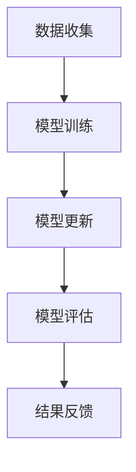
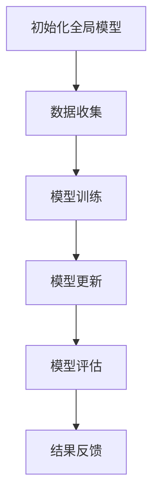

                 

### 《联邦学习在隐私保护与安全多方计算中的应用》

#### 关键词：
- 联邦学习
- 隐私保护
- 安全多方计算
- 多方数据共享
- 集成算法
- 应用实践

#### 摘要：
本文旨在深入探讨联邦学习在隐私保护和安全多方计算中的应用。联邦学习作为一种新兴的数据共享技术，能够在多方数据不互通的情况下，通过分布式学习实现对模型训练的优化。本文将首先介绍联邦学习的基本概念和理论背景，随后详细讲解联邦学习的核心算法原理，包括同步和异步联邦学习算法，以及联邦学习中的优化算法。接着，我们将探讨联邦学习在安全性隐私保护方面的挑战，并介绍相应的解决方案和安全协议。文章还将通过具体案例展示联邦学习在医疗、金融和其他领域的应用，最后总结联邦学习的未来发展趋势与挑战。

### 《联邦学习在隐私保护与安全多方计算中的应用》目录大纲

#### 第一部分：联邦学习的理论基础

#### 第1章：联邦学习概述

##### 1.1 联邦学习的概念与背景

##### 1.2 联邦学习的关键特点

##### 1.3 联邦学习的应用领域

##### 1.4 联邦学习与隐私保护的关系

#### 第2章：隐私保护与安全多方计算基础

##### 2.1 隐私保护的重要性

##### 2.2 安全多方计算的概念

##### 2.3 安全多方计算的基本原理

##### 2.4 安全多方计算的应用场景

#### 第3章：联邦学习的核心算法原理

##### 3.1 联邦学习的基本算法框架

##### 3.2 同步联邦学习算法

##### 3.3 异步联邦学习算法

##### 3.4 联邦学习中的优化算法

#### 第4章：联邦学习的安全性和隐私保护

##### 4.1 联邦学习的安全性挑战

##### 4.2 隐私保护机制的设计

##### 4.3 联邦学习中的安全协议

##### 4.4 实际应用中的隐私保护策略

#### 第二部分：联邦学习的应用与实践

#### 第5章：联邦学习在医疗领域的应用

##### 5.1 医疗数据的隐私保护需求

##### 5.2 联邦学习在医疗领域的应用案例

##### 5.3 医疗数据联邦学习的实施策略

#### 第6章：联邦学习在金融领域的应用

##### 6.1 金融数据的隐私保护需求

##### 6.2 联邦学习在金融领域的应用案例

##### 6.3 金融数据联邦学习的实施策略

#### 第7章：联邦学习在其他行业的应用

##### 7.1 联邦学习在物联网领域的应用

##### 7.2 联邦学习在自动驾驶领域的应用

##### 7.3 联邦学习在智能家居领域的应用

#### 第8章：联邦学习的未来发展趋势与挑战

##### 8.1 联邦学习的未来发展趋势

##### 8.2 联邦学习面临的挑战

##### 8.3 联邦学习的未来方向

#### 附录

##### 附录A：联邦学习相关开源工具与资源

##### 附录B：联邦学习项目实战案例解析

##### 附录C：联邦学习常见问题与解决方案

##### 附录D：联邦学习数学公式与算法伪代码详解

## 第一部分：联邦学习的理论基础

### 第1章：联邦学习概述

#### 1.1 联邦学习的概念与背景

联邦学习（Federated Learning）是一种分布式机器学习方法，旨在通过多个参与者（通常是多个设备或组织）合作来训练机器学习模型，而无需共享他们的原始数据。这一概念最早由Google在2016年提出，目的是为了解决在移动设备上训练深度学习模型时遇到的隐私和数据传输问题。

在传统的机器学习模型训练中，通常需要一个集中的数据集，所有参与者需要将他们的数据上传到中心服务器进行模型训练。这种方式虽然可以取得较好的模型性能，但同时也带来了数据隐私泄露的风险。特别是在医疗、金融等敏感数据领域，数据的安全性和隐私保护至关重要。

联邦学习的核心思想是让模型训练过程在参与者的本地设备上进行，参与者只需上传模型更新（梯度、参数等）到中心服务器，而无需上传原始数据。这样，每个参与者既能共享模型更新的知识，又能保持其数据的隐私。联邦学习的这一特性使其成为保护隐私的重要工具，尤其在数据敏感的场景中具有显著的应用价值。

#### 1.2 联邦学习的关键特点

联邦学习具有以下几个关键特点：

1. **分布式训练**：联邦学习将模型训练过程分布在多个参与者（设备或组织）上，每个参与者负责自己的本地数据训练。这种分布式训练方式可以有效减少中心服务器的计算负担，提高模型训练的效率。

2. **隐私保护**：联邦学习通过将数据留在本地设备，只上传模型更新，从而保护了参与者的数据隐私。这对于需要高度保护数据隐私的场景，如医疗和金融领域，尤为重要。

3. **去中心化**：联邦学习模型训练不需要依赖中心服务器，这使得系统更加去中心化，减少了单点故障的风险，增强了系统的可靠性和容错性。

4. **数据一致性**：联邦学习通过中心服务器协调参与者的模型更新，确保了多个参与者的模型在最终阶段的一致性。这有助于提高模型的整体性能和稳定性。

5. **灵活性**：联邦学习适用于多种不同的设备和操作系统，可以广泛应用于移动设备、物联网设备、边缘计算等场景。

#### 1.3 联邦学习的应用领域

联邦学习在多个领域展示了其强大的应用潜力，以下是一些主要的应用领域：

1. **医疗**：联邦学习可以在多个医疗机构之间共享患者数据，共同训练疾病预测模型，同时保护患者隐私。

2. **金融**：联邦学习可以用于金融风控模型训练，银行和金融机构可以共享交易数据，提高欺诈检测和风险评估的准确性。

3. **物联网**：联邦学习可以用于物联网设备的数据分析，通过设备间的协同学习，提高设备性能和能源效率。

4. **自动驾驶**：联邦学习可以用于自动驾驶系统的训练，通过车辆间的协同学习，提高环境感知和决策能力。

5. **智能家居**：联邦学习可以用于智能家居设备的智能行为预测，提高用户体验和设备协同效率。

#### 1.4 联邦学习与隐私保护的关系

联邦学习与隐私保护之间存在着紧密的联系。联邦学习的核心优势之一就是能够在不泄露原始数据的情况下，通过共享模型更新来提升整体模型性能。这种机制在保护隐私的同时，还允许参与者之间进行合作和知识共享。

联邦学习在隐私保护方面的主要作用包括：

1. **数据保护**：通过仅在本地设备上处理数据，联邦学习有效避免了数据在传输过程中的泄露风险。

2. **隐私计算**：联邦学习中的隐私计算技术（如差分隐私、同态加密等）确保了在模型训练过程中数据的安全性。

3. **去中心化**：联邦学习去中心化的特点，使得数据的集中存储和访问变得不必要，从而减少了数据泄露的风险。

4. **透明度**：联邦学习过程中的模型更新和评估是透明的，参与者可以监控和学习其他参与者的模型更新，从而提高模型的可靠性和可信度。

总之，联邦学习不仅提供了强大的模型训练能力，还在隐私保护方面展现了巨大的潜力。在数据隐私日益受到关注的时代，联邦学习无疑成为了一个值得深入研究和应用的重要技术。

### 第2章：隐私保护与安全多方计算基础

#### 2.1 隐私保护的重要性

在当今数字化时代，数据隐私保护已经成为一项至关重要的任务。随着大数据和人工智能技术的发展，越来越多的数据被收集、存储和使用。然而，这些数据中包含了许多敏感信息，如个人身份信息、金融记录、健康数据等。如果这些数据被不当使用或泄露，将会对个人和社会造成严重的负面影响。

隐私保护的重要性主要体现在以下几个方面：

1. **数据安全**：隐私保护可以防止敏感数据被未授权访问或泄露，从而确保数据的安全。

2. **个人隐私**：隐私保护是个人隐私权的核心保障，它使个人能够控制自己的数据，避免个人信息被滥用。

3. **信任建设**：在数据驱动的应用中，隐私保护是建立用户信任的关键因素。如果用户不信任数据处理方，他们将不愿意分享数据，这将限制数据的使用和创新的潜力。

4. **法律法规遵守**：许多国家和地区都有关于数据隐私保护的法律法规，如欧盟的《通用数据保护条例》（GDPR）和美国的《加州消费者隐私法案》（CCPA）。遵守这些法律法规是企业和组织的基本义务。

#### 2.2 安全多方计算的概念

安全多方计算（Secure Multi-Party Computation，SMPC）是一种计算模型，它允许多个参与方在不信任的通信环境中协作，共同计算一个函数，而无需泄露各自的输入数据。这种技术的主要目的是在保护隐私的同时，实现多方数据的有效利用。

安全多方计算的基本概念包括：

1. **多方参与**：安全多方计算涉及多个参与方，每个参与方都有一定的输入数据。

2. **无信任环境**：参与方之间可能不存在信任关系，他们必须通过安全多方计算协议来共同计算结果。

3. **隐私保护**：安全多方计算确保参与方的输入数据在计算过程中不会被泄露，从而保护隐私。

4. **正确性保证**：安全多方计算协议需要确保计算结果与直接在公开通道上计算相同。

#### 2.3 安全多方计算的基本原理

安全多方计算的基本原理主要包括以下几个方面：

1. **加密技术**：安全多方计算利用加密技术来保护参与方的输入数据。常见的加密技术包括对称加密、非对称加密、同态加密等。

2. **协议设计**：安全多方计算协议设计是关键，它决定了参与方如何共同计算函数，以及如何保证计算的正确性和隐私性。常见的协议包括全同态加密协议、混淆电路协议、秘密共享协议等。

3. **安全证明**：安全多方计算协议通常需要通过形式化的安全证明来验证其安全性。这些证明确保了协议在所有可能情况下都能正确执行。

4. **执行效率**：安全多方计算的执行效率是一个重要的考量因素。高效的协议设计可以减少计算和通信的开销，提高系统的整体性能。

#### 2.4 安全多方计算的应用场景

安全多方计算在多个应用场景中展示了其强大的应用潜力，以下是一些主要的应用场景：

1. **金融**：安全多方计算可以用于金融交易中的多方协同计算，如支付结算、信用评分等。这可以确保交易的安全性和隐私性，同时提高处理效率。

2. **医疗**：安全多方计算可以用于医疗数据共享和联合分析，如疾病预测、基因组学研究等。这可以在保护患者隐私的同时，促进医疗研究的进步。

3. **物联网**：安全多方计算可以用于物联网设备之间的数据协同处理，如智能家居、智能城市等。这可以提高系统的安全性和可靠性，同时实现设备的智能协同。

4. **供应链管理**：安全多方计算可以用于供应链管理中的多方数据共享和协同计算，如库存管理、物流优化等。这可以确保供应链的透明性和效率，同时保护参与方的商业机密。

5. **隐私计算**：安全多方计算是隐私计算的核心技术之一，可以在保护隐私的同时，实现数据的计算和共享。这为大数据分析和人工智能应用提供了重要的技术支持。

总之，隐私保护和安全多方计算在数据驱动的应用中具有至关重要的地位。安全多方计算通过提供一种多方协作的安全计算机制，不仅保护了数据隐私，还促进了多方数据的有效利用。随着技术的不断发展和应用的不断扩展，安全多方计算将在更多的领域发挥重要作用。

### 第3章：联邦学习的核心算法原理

#### 3.1 联邦学习的基本算法框架

联邦学习（Federated Learning）的基本算法框架可以分为四个主要阶段：数据收集、模型训练、模型更新和模型评估。以下是一个简化的 Mermaid 流程图，展示了联邦学习的基本算法框架：



**数据收集**：在联邦学习过程中，每个参与者（如移动设备、传感器等）负责收集本地数据。这些数据可以是结构化的（如表格数据）或非结构化的（如图像、语音等）。数据收集是联邦学习的起点，其质量直接影响到模型训练的效果。

**模型训练**：在数据收集完成后，每个参与者使用本地数据训练一个本地模型。本地模型可以是一个简单的线性模型，也可以是一个复杂的深度神经网络。模型训练过程中，参与者需要根据本地数据的特点来选择合适的算法和超参数。

**模型更新**：在本地模型训练完成后，每个参与者将本地模型的参数更新发送到中心服务器。中心服务器负责聚合这些更新，生成全局模型的更新。这一过程通常使用聚合函数（如求和、平均）来减少参与者间的差异。

**模型评估**：在模型更新完成后，中心服务器使用全局模型对参与者上传的数据进行评估。评估指标可以是准确率、召回率、F1分数等。通过模型评估，可以确定全局模型的效果，并指导下一步的模型训练。

**结果反馈**：最后，中心服务器将模型评估结果反馈给每个参与者。参与者可以根据这些反馈来调整本地模型的训练策略，提高模型的性能。

通过上述四个阶段，联邦学习实现了分布式模型训练，同时保护了参与者的数据隐私。联邦学习的基本算法框架为联邦学习的实施提供了清晰的指导。

#### 3.2 同步联邦学习算法

同步联邦学习算法是指在每次迭代中，所有参与者同时更新本地模型，然后将更新发送到中心服务器进行聚合。以下是一个简化的 Mermaid 流程图，展示了同步联邦学习算法的基本流程：



**初始化全局模型**：同步联邦学习算法首先初始化一个全局模型。全局模型是所有参与者共同训练的目标，它初始化时可以是随机值，也可以是基于先验知识的预训练模型。

**数据收集**：在初始化全局模型后，每个参与者收集本地数据。本地数据可以是用户的个人数据，也可以是来自传感器的环境数据。

**模型训练**：每个参与者使用本地数据训练一个本地模型。本地模型的训练可以是基于监督学习、无监督学习或强化学习等方法。训练过程中，参与者需要根据本地数据的特点来选择合适的算法和超参数。

**模型更新**：在本地模型训练完成后，每个参与者将本地模型的参数更新发送到中心服务器。中心服务器负责接收这些更新，并使用聚合函数（如求和、平均）将它们合并成一个全局模型更新。

**模型评估**：中心服务器使用全局模型更新生成一个新的全局模型，并使用这个新模型对参与者上传的数据进行评估。评估指标可以是准确率、召回率、F1分数等。

**结果反馈**：最后，中心服务器将模型评估结果反馈给每个参与者。参与者可以根据这些反馈来调整本地模型的训练策略，提高模型的性能。

同步联邦学习算法的优点包括：

1. **全局一致性**：由于所有参与者同时更新模型，全局模型能够保持一致性，从而提高模型的稳定性。

2. **简单实现**：同步联邦学习算法的实现相对简单，不需要复杂的同步机制。

同步联邦学习算法的缺点包括：

1. **通信成本**：同步联邦学习算法需要在每次迭代中传输大量的模型更新数据，这会增加通信成本。

2. **延迟问题**：同步联邦学习算法容易受到通信延迟的影响，导致模型训练的效率降低。

#### 3.3 异步联邦学习算法

异步联邦学习算法是一种在每次迭代中，参与者不必同时更新本地模型，而是根据自己的进度逐步更新模型。以下是一个简化的 Mermaid 流程图，展示了异步联邦学习算法的基本流程：


**初始化全局模型**：异步联邦学习算法与同步联邦学习算法类似，首先初始化一个全局模型。

**数据收集**：在初始化全局模型后，每个参与者收集本地数据。

**模型训练**：每个参与者使用本地数据训练一个本地模型。由于参与者不必同时更新模型，异步联邦学习算法可以更灵活地处理参与者的训练进度。

**模型更新**：在本地模型训练完成后，每个参与者将本地模型的参数更新发送到中心服务器。中心服务器负责接收这些更新，并使用聚合函数（如求和、平均）将它们合并成一个全局模型更新。

**模型评估**：中心服务器使用全局模型更新生成一个新的全局模型，并使用这个新模型对参与者上传的数据进行评估。

**结果反馈**：最后，中心服务器将模型评估结果反馈给每个参与者。

异步联邦学习算法的优点包括：

1. **灵活性**：异步联邦学习算法允许参与者根据自己的进度逐步更新模型，这提高了系统的灵活性。

2. **降低通信成本**：由于参与者不必同时更新模型，异步联邦学习算法可以显著降低通信成本。

异步联邦学习算法的缺点包括：

1. **全局一致性**：异步联邦学习算法可能导致全局模型的一致性降低，从而影响模型的稳定性。

2. **同步问题**：异步联邦学习算法需要解决参与者的同步问题，以确保模型更新的一致性。

#### 3.4 联邦学习中的优化算法

联邦学习中的优化算法主要用于提高模型训练的效率。以下是一些常用的优化算法：

1. **梯度聚合**：梯度聚合是联邦学习中最常用的优化算法。它通过将参与者的梯度进行加权平均来更新全局模型。以下是一个简单的伪代码，展示了梯度聚合算法的基本原理：

```python
# 初始化全局模型参数 global_model_params
# 初始化参与者模型参数 participant_model_params
# 设定参与者数量 num_participants

for iteration in range(num_iterations):
    # 收集参与者模型参数
    for i in range(num_participants):
        participant_model_params[i] = train_local_model(local_data[i])
    
    # 计算加权平均的梯度聚合
    aggregated_gradients = []
    for i in range(num_participants):
        aggregated_gradients.append(participant_model_params[i] / num_participants)
    
    # 更新全局模型参数
    global_model_params = aggregate_gradients(aggregated_gradients)
```

2. **差分隐私**：差分隐私是一种用于保护隐私的优化算法。它通过在梯度聚合过程中添加噪声来掩盖参与者的真实梯度，从而防止隐私泄露。以下是一个简单的伪代码，展示了差分隐私优化算法的基本原理：

```python
# 初始化全局模型参数 global_model_params
# 初始化参与者模型参数 participant_model_params
# 设定参与者数量 num_participants
# 设定隐私参数 epsilon

for iteration in range(num_iterations):
    # 收集参与者模型参数
    for i in range(num_participants):
        participant_model_params[i] = train_local_model(local_data[i])
    
    # 计算噪声添加后的梯度聚合
    aggregated_gradients = []
    for i in range(num_participants):
        noise = add_noise(epsilon)
        aggregated_gradients.append(participant_model_params[i] + noise)
    
    # 更新全局模型参数
    global_model_params = aggregate_gradients(aggregated_gradients)
```

3. **异步优化**：异步优化算法主要用于提高联邦学习的训练效率。它通过在参与者之间进行异步通信，使得每个参与者可以在自己的数据集上进行独立的训练，从而减少通信延迟。以下是一个简单的伪代码，展示了异步优化算法的基本原理：

```python
# 初始化全局模型参数 global_model_params
# 初始化参与者模型参数 participant_model_params
# 设定参与者数量 num_participants
# 设定迭代次数 num_iterations

for iteration in range(num_iterations):
    # 每个参与者根据自己的进度更新模型
    for i in range(num_participants):
        participant_model_params[i] = train_local_model(local_data[i])
    
    # 中心服务器聚合模型参数
    aggregated_gradients = aggregate_gradients(participant_model_params)
    
    # 更新全局模型参数
    global_model_params = update_global_model(aggregated_gradients)
```

这些优化算法可以单独使用，也可以结合使用，以提高联邦学习模型训练的效率和稳定性。

通过以上对联邦学习核心算法原理的讲解，我们可以看到，联邦学习通过数据收集、模型训练、模型更新和模型评估四个主要阶段，实现了分布式模型训练，同时保护了参与者的数据隐私。同步和异步联邦学习算法以及各种优化算法，使得联邦学习在模型训练过程中可以灵活应对各种挑战，从而实现高效、安全的分布式学习。

### 第4章：联邦学习的安全性和隐私保护

#### 4.1 联邦学习的安全性挑战

在联邦学习的过程中，尽管参与者的数据不需要直接共享，但仍然存在一系列的安全性和隐私保护挑战。这些挑战主要包括以下几个方面：

1. **数据泄露风险**：虽然联邦学习不直接共享原始数据，但参与者上传的模型参数和梯度信息可能包含敏感信息。如果这些信息被恶意攻击者截获或篡改，可能会导致隐私泄露。

2. **模型篡改风险**：联邦学习中的模型参数和梯度信息是公开的，攻击者可能会试图通过篡改这些信息来干扰模型的训练过程，甚至使模型失去训练效果。

3. **通信安全问题**：在联邦学习过程中，参与者需要与中心服务器进行通信，这可能会遭受中间人攻击、数据篡改等通信安全问题。

4. **恶意参与者攻击**：联邦学习系统中的每个参与者都可能成为潜在的恶意节点。恶意参与者可能会故意篡改模型参数、泄露信息或者拒绝参与，从而破坏整个联邦学习系统的稳定性。

#### 4.2 隐私保护机制的设计

为了应对上述安全性挑战，联邦学习系统需要设计一系列隐私保护机制。以下是一些常见的隐私保护机制：

1. **加密技术**：加密技术可以用来保护参与者上传的模型参数和梯度信息的隐私。常见的加密技术包括对称加密、非对称加密和同态加密。对称加密适用于保护数据传输过程中的隐私，非对称加密适用于安全认证，同态加密则允许在加密数据上进行计算。

2. **差分隐私**：差分隐私是一种保护隐私的方法，通过在聚合过程中添加噪声，使得攻击者无法从模型参数中推断出单个参与者的数据。差分隐私的核心思想是最大化隐私保护的同时，尽量减少对模型性能的影响。

3. **安全多方计算**：安全多方计算（SMPC）是一种在多方参与的情况下，通过加密和协议设计来保护数据隐私的技术。SMPC可以用于联邦学习中的数据聚合和模型更新，确保参与者的数据不会被泄露。

4. **访问控制**：通过访问控制机制，可以限制参与者和中心服务器的权限，确保只有授权的用户才能访问敏感信息。访问控制可以结合加密技术，进一步加强对数据的保护。

5. **隐私计算**：隐私计算是一种在数据本地进行计算的技术，它避免了数据在传输过程中的泄露风险。隐私计算可以用于联邦学习中的本地模型训练和模型评估，确保数据始终在本地处理。

#### 4.3 联邦学习中的安全协议

为了确保联邦学习系统的安全性，需要设计一系列安全协议。以下是一些常见的安全协议：

1. **对称加密协议**：对称加密协议用于保护数据在传输过程中的隐私。常见的对称加密协议包括AES和ChaCha20。这些协议可以在中心服务器和参与者之间建立安全的通信渠道。

2. **非对称加密协议**：非对称加密协议用于安全认证和数据传输。常见的非对称加密协议包括RSA和ECC。这些协议可以确保中心服务器和参与者之间的通信是可信的。

3. **安全多方计算协议**：安全多方计算协议用于保护参与者在联邦学习过程中的数据隐私。常见的协议包括全同态加密协议、混淆电路协议和秘密共享协议。这些协议可以确保参与者的数据在计算过程中不会被泄露。

4. **差分隐私协议**：差分隐私协议用于在聚合过程中添加噪声，保护参与者的隐私。常见的差分隐私协议包括拉格朗日噪声和Gaussian噪声。这些协议可以在保证隐私保护的前提下，尽量减少对模型性能的影响。

5. **安全通信协议**：安全通信协议用于保护中心服务器和参与者之间的通信安全。常见的安全通信协议包括TLS和SSL。这些协议可以确保通信过程中的数据不会被截获或篡改。

通过上述安全协议，联邦学习系统可以在多个层面保护参与者的数据隐私和系统的安全性。然而，安全性设计是一个不断演进的过程，需要根据实际情况不断优化和改进。

#### 4.4 实际应用中的隐私保护策略

在联邦学习的实际应用中，为了确保数据隐私和安全，可以采用以下几种隐私保护策略：

1. **数据加密**：在数据传输和存储过程中，使用加密技术对数据进行加密，确保数据在传输过程中不会被泄露。

2. **访问控制**：通过设置严格的访问控制策略，限制只有授权用户才能访问敏感数据，防止未授权访问和数据泄露。

3. **隐私计算**：在本地设备上进行数据计算，避免数据在传输过程中的泄露风险。隐私计算可以用于本地模型训练和模型评估，确保数据始终在本地处理。

4. **安全多方计算**：使用安全多方计算技术，确保在多方参与的情况下，数据隐私得到保护。安全多方计算可以用于数据聚合和模型更新，确保参与者的数据不会被泄露。

5. **差分隐私**：在数据聚合和模型更新过程中，使用差分隐私技术添加噪声，掩盖单个参与者的数据，防止隐私泄露。

6. **匿名化**：在数据收集阶段，对参与者的身份信息进行匿名化处理，确保参与者无法被直接识别。

7. **持续监控**：建立监控系统，实时监控联邦学习系统的运行状态，及时发现和处理潜在的安全威胁。

通过上述隐私保护策略，联邦学习系统可以在实际应用中有效保护参与者的数据隐私，确保系统的安全性和可靠性。

总之，联邦学习在隐私保护和安全性方面面临着一系列挑战。通过设计有效的隐私保护机制和安全协议，并采用实际应用中的隐私保护策略，可以有效应对这些挑战，确保联邦学习系统的安全和数据的隐私。随着技术的不断发展和完善，联邦学习将在数据隐私和安全保护方面发挥越来越重要的作用。

### 第5章：联邦学习在医疗领域的应用

#### 5.1 医疗数据的隐私保护需求

在医疗领域，数据隐私保护需求尤为重要。医疗数据通常包含敏感的个人健康信息，如病史、诊断结果、药物使用情况等。这些数据不仅涉及到个人的隐私权，还可能影响到患者的治疗和健康。因此，如何确保医疗数据在共享和使用过程中的安全性，成为了一个关键问题。

首先，医疗数据的敏感性使得其需要高度保护。任何未经授权的访问或泄露都可能对患者的隐私和健康产生负面影响。例如，如果患者的诊断结果被泄露，可能会导致社会歧视或其他不良后果。因此，确保医疗数据的隐私保护是医疗领域的一个基本要求。

其次，医疗数据的多样性也增加了隐私保护的需求。医疗数据包括结构化和非结构化数据，如电子健康记录（EHRs）、医学图像、基因组数据等。不同类型的数据在隐私保护方面有着不同的需求，例如，基因组数据可能涉及更深入的隐私问题，需要更严格的保护措施。

此外，医疗数据通常涉及多个数据源和多个参与者，包括医疗机构、研究人员、药品制造商等。这些参与者之间可能存在竞争关系，也可能存在信息泄露的风险。因此，在共享和使用医疗数据时，需要确保各方的隐私保护需求得到满足。

最后，法律法规对医疗数据的隐私保护提出了严格要求。例如，欧盟的《通用数据保护条例》（GDPR）和美国的《健康保险可携性和责任法案》（HIPAA）都对医疗数据的隐私保护有明确的规定。这些法律法规不仅对医疗数据的收集、存储和使用提出了具体要求，还对违反规定的处罚进行了明确规定。

综上所述，医疗数据在隐私保护方面面临着多重挑战。为了应对这些挑战，需要采用一系列隐私保护技术和策略，确保医疗数据在共享和使用过程中的安全性。

#### 5.2 联邦学习在医疗领域的应用案例

联邦学习在医疗领域有着广泛的应用案例，以下是一些典型的应用场景和案例：

1. **疾病预测和诊断**：联邦学习可以用于疾病预测和诊断，例如，通过分析患者的电子健康记录（EHRs），联邦学习模型可以预测患者患某种疾病的概率。这一应用场景不仅可以保护患者的隐私，还可以提高疾病预测的准确性。例如，Google Research 使用联邦学习技术开发了一种预测心脏病发作的模型，通过分析多家医疗机构的数据，实现了对心脏病发作的高效预测。

2. **基因组数据分析**：联邦学习可以用于基因组数据分析，通过对多个参与者的基因组数据进行联合分析，可以识别出与疾病相关的基因和突变。这一应用场景尤其重要，因为基因组数据涉及高度敏感的个人隐私。联邦学习允许医疗机构和研究机构在保护患者隐私的同时，共同进行基因组数据分析。例如，IBM Research 开发了一种基于联邦学习的基因组分析工具，用于识别与癌症相关的基因突变。

3. **药物研发**：联邦学习可以用于药物研发，通过分析多个实验室和医院的数据，联邦学习模型可以预测新药物的疗效和安全性。这一应用场景有助于加速药物研发过程，同时保护患者的隐私。例如，DeepMind 开发了一种基于联邦学习的药物研发工具，用于分析多种药物对疾病的疗效和副作用。

4. **医疗图像分析**：联邦学习可以用于医疗图像分析，通过对多个医学图像数据库进行联合分析，联邦学习模型可以更准确地识别疾病和异常。这一应用场景有助于提高医疗诊断的准确性，同时保护患者的隐私。例如，微软研究院开发了一种基于联邦学习的医疗图像分析工具，用于识别肺癌和乳腺癌等疾病。

5. **个性化治疗**：联邦学习可以用于个性化治疗，通过分析患者的个人健康数据和疾病历史，联邦学习模型可以制定个性化的治疗方案。这一应用场景有助于提高治疗效果，同时保护患者的隐私。例如，SAP 与多家医疗机构合作，开发了一种基于联邦学习的个性化治疗系统，用于制定个性化治疗方案。

这些应用案例展示了联邦学习在医疗领域的广泛应用潜力。通过联邦学习，医疗机构和研究机构可以在保护患者隐私的同时，共同进行数据分析和模型训练，从而推动医疗领域的创新和发展。

#### 5.3 医疗数据联邦学习的实施策略

在实施医疗数据联邦学习的过程中，需要考虑多个关键因素，以确保数据隐私得到有效保护，同时实现高效的模型训练。以下是一些实施策略：

1. **数据预处理**：在联邦学习之前，需要对医疗数据进行预处理，包括数据清洗、去噪、归一化和特征提取等。这些步骤有助于提高模型训练的效果，同时减少数据隐私泄露的风险。

2. **数据加密**：在数据传输和存储过程中，使用加密技术对医疗数据进行加密，确保数据在传输过程中不会被泄露。常见的加密技术包括对称加密、非对称加密和同态加密。对称加密适用于数据传输，非对称加密适用于安全认证，同态加密则允许在加密数据上进行计算。

3. **差分隐私**：在模型训练过程中，使用差分隐私技术添加噪声，保护参与者的隐私。差分隐私可以在保证隐私保护的前提下，尽量减少对模型性能的影响。例如，可以在聚合参与者梯度时添加拉格朗日噪声或高斯噪声。

4. **安全多方计算**：使用安全多方计算技术，确保参与者在联邦学习过程中的数据隐私得到保护。安全多方计算可以用于数据聚合、模型更新和模型评估，确保参与者的数据不会被泄露。

5. **隐私计算**：在本地设备上进行数据计算，避免数据在传输过程中的泄露风险。隐私计算可以用于本地模型训练和模型评估，确保数据始终在本地处理。

6. **访问控制**：设置严格的访问控制策略，限制只有授权用户才能访问敏感数据。访问控制可以结合加密技术和隐私计算，进一步加强对数据的保护。

7. **持续监控**：建立监控系统，实时监控联邦学习系统的运行状态，及时发现和处理潜在的安全威胁。监控可以包括对通信安全性、数据完整性和模型性能的监控。

8. **合规性检查**：确保联邦学习系统符合相关法律法规的要求，如欧盟的《通用数据保护条例》（GDPR）和美国的《健康保险可携性和责任法案》（HIPAA）等。合规性检查可以包括数据收集、处理和存储的合规性审查。

通过上述策略，医疗数据联邦学习可以在保护患者隐私的同时，实现高效的模型训练和数据共享，从而推动医疗领域的创新和发展。

### 第6章：联邦学习在金融领域的应用

#### 6.1 金融数据的隐私保护需求

在金融领域，数据隐私保护需求尤为迫切。金融数据通常包含敏感的个人财务信息、交易记录、信用评级等，这些数据不仅是金融机构进行风险评估和业务决策的重要依据，也涉及到用户的隐私权和信息安全。因此，如何确保金融数据在共享和使用过程中的安全性，成为金融行业面临的一项重大挑战。

首先，金融数据的敏感性要求高度保护。任何未经授权的访问或泄露都可能对用户的财务安全和隐私造成严重威胁。例如，如果用户的交易记录或信用评级被泄露，可能会导致身份盗用、欺诈行为或其他经济损失。

其次，金融数据的多样性也增加了隐私保护的复杂性。金融数据包括结构化数据（如交易记录、客户信息）和非结构化数据（如客户评论、邮件等），这些数据在隐私保护方面有着不同的需求。例如，客户的个人信息可能涉及更深入的隐私问题，需要更严格的保护措施。

此外，金融数据通常涉及多个金融机构和参与者，包括银行、支付平台、信用评级机构等。这些参与者之间可能存在信息共享的需求，但同时也可能存在竞争关系或利益冲突，增加了数据泄露和隐私泄露的风险。

最后，法律法规对金融数据的隐私保护提出了严格要求。例如，欧盟的《通用数据保护条例》（GDPR）和美国的《消费者数据保护法案》（CCPA）都对金融数据的收集、存储和使用有明确的规定。这些法律法规不仅要求金融机构在数据收集和使用过程中保护用户的隐私权，还规定了违反规定的严厉处罚。

综上所述，金融数据在隐私保护方面面临着多重挑战。为了应对这些挑战，需要采用一系列隐私保护技术和策略，确保金融数据在共享和使用过程中的安全性。

#### 6.2 联邦学习在金融领域的应用案例

联邦学习在金融领域有着广泛的应用潜力，以下是一些典型的应用场景和案例：

1. **欺诈检测**：联邦学习可以用于欺诈检测，通过分析多个金融机构的交易数据，联邦学习模型可以识别出异常交易和欺诈行为。这一应用场景有助于提高欺诈检测的准确性和实时性，同时保护用户的隐私。例如，某大型支付平台使用联邦学习技术，实现了对跨境交易的实时监控和欺诈检测，有效降低了欺诈率。

2. **信用评分**：联邦学习可以用于信用评分，通过分析多个金融机构的客户数据，联邦学习模型可以更准确地预测客户的信用风险。这一应用场景有助于金融机构进行风险评估和业务决策，同时保护用户的隐私。例如，某大型银行使用联邦学习技术，对其客户的数据进行联合分析，提高了信用评分的准确性，从而降低了坏账率。

3. **风险控制**：联邦学习可以用于风险控制，通过分析多个金融机构的风险数据和交易记录，联邦学习模型可以识别出潜在的风险因素和风险事件。这一应用场景有助于金融机构进行风险管理和决策，同时保护用户的隐私。例如，某金融机构使用联邦学习技术，对其客户的投资行为和交易记录进行联合分析，实现了对市场风险的实时监控和预警。

4. **市场预测**：联邦学习可以用于市场预测，通过分析多个金融机构的市场数据，联邦学习模型可以预测市场趋势和投资机会。这一应用场景有助于投资者进行资产配置和投资决策，同时保护用户的隐私。例如，某投资机构使用联邦学习技术，对其多个市场的数据进行分析，实现了对市场趋势的准确预测，从而提高了投资回报。

5. **个性化金融服务**：联邦学习可以用于个性化金融服务，通过分析多个金融机构的客户数据和交易记录，联邦学习模型可以为客户提供个性化的金融服务和建议。这一应用场景有助于提升用户体验和服务质量，同时保护用户的隐私。例如，某金融科技公司使用联邦学习技术，对其客户的金融行为进行分析，实现了对客户的个性化金融规划和投资建议。

这些应用案例展示了联邦学习在金融领域的广泛应用潜力。通过联邦学习，金融机构可以在保护用户隐私的同时，实现数据的高效利用和业务创新，从而提高金融服务质量和竞争力。

#### 6.3 金融数据联邦学习的实施策略

在实施金融数据联邦学习的过程中，需要考虑多个关键因素，以确保数据隐私得到有效保护，同时实现高效的模型训练。以下是一些实施策略：

1. **数据预处理**：在联邦学习之前，需要对金融数据进行预处理，包括数据清洗、去噪、归一化和特征提取等。这些步骤有助于提高模型训练的效果，同时减少数据隐私泄露的风险。

2. **数据加密**：在数据传输和存储过程中，使用加密技术对金融数据进行加密，确保数据在传输过程中不会被泄露。常见的加密技术包括对称加密、非对称加密和同态加密。对称加密适用于数据传输，非对称加密适用于安全认证，同态加密则允许在加密数据上进行计算。

3. **差分隐私**：在模型训练过程中，使用差分隐私技术添加噪声，保护参与者的隐私。差分隐私可以在保证隐私保护的前提下，尽量减少对模型性能的影响。例如，可以在聚合参与者梯度时添加拉格朗日噪声或高斯噪声。

4. **安全多方计算**：使用安全多方计算技术，确保参与者在联邦学习过程中的数据隐私得到保护。安全多方计算可以用于数据聚合、模型更新和模型评估，确保参与者的数据不会被泄露。

5. **隐私计算**：在本地设备上进行数据计算，避免数据在传输过程中的泄露风险。隐私计算可以用于本地模型训练和模型评估，确保数据始终在本地处理。

6. **访问控制**：设置严格的访问控制策略，限制只有授权用户才能访问敏感数据。访问控制可以结合加密技术和隐私计算，进一步加强对数据的保护。

7. **持续监控**：建立监控系统，实时监控联邦学习系统的运行状态，及时发现和处理潜在的安全威胁。监控可以包括对通信安全性、数据完整性和模型性能的监控。

8. **合规性检查**：确保联邦学习系统符合相关法律法规的要求，如欧盟的《通用数据保护条例》（GDPR）和美国的《消费者数据保护法案》（CCPA）等。合规性检查可以包括数据收集、处理和存储的合规性审查。

通过上述策略，金融数据联邦学习可以在保护用户隐私的同时，实现高效的模型训练和数据共享，从而推动金融领域的创新和发展。

### 第7章：联邦学习在其他行业的应用

#### 7.1 联邦学习在物联网领域的应用

物联网（IoT）领域由于其设备的广泛分布和数据的多样性，使得数据隐私保护成为一个重大挑战。在物联网中，大量设备（如传感器、智能家居设备、工业设备等）不断产生数据，这些数据往往包含了用户的隐私信息。传统的集中式数据处理模式不仅会导致数据泄露的风险，还可能因单点故障而影响系统的可靠性。联邦学习作为一种分布式学习技术，能够在确保数据隐私的同时，实现数据的有效利用。

**应用场景**：

1. **设备协同**：联邦学习可以用于物联网设备的协同工作。例如，智能家居设备可以通过联邦学习共享数据，以优化家电的运行策略，提高能源效率。每个设备在本地进行数据训练，然后将模型更新发送到中心服务器，实现协同优化。

2. **异常检测**：物联网设备经常需要实时监控环境状态，如温度、湿度、空气质量等。联邦学习可以用于训练异常检测模型，通过分析多个设备的观测数据，提高异常检测的准确性。这有助于提前发现潜在问题，防止事故发生。

3. **安全防护**：物联网设备常常面临网络攻击的威胁。联邦学习可以通过设备间的协同学习，增强设备的安全防护能力。例如，通过分析多个设备的网络行为，联邦学习模型可以识别出异常行为，从而提高系统的安全性。

**实现策略**：

1. **数据加密与隐私保护**：在物联网设备中，数据加密是确保数据隐私的基础。使用加密技术（如对称加密、非对称加密、同态加密等）对传输和存储的数据进行加密，确保数据在传输过程中的安全性。

2. **边缘计算**：由于物联网设备通常具有有限的计算资源和带宽，边缘计算是一个有效的解决方案。通过在边缘设备上部署联邦学习模型，可以减少数据传输量，提高系统的响应速度。

3. **分布式训练**：联邦学习模型可以在多个物联网设备上分布式训练，每个设备负责自己的数据训练。这样不仅减少了中心服务器的负担，还能提高模型的训练效率。

4. **设备自治**：物联网设备可以通过自治机制，自主决定是否参与联邦学习过程。例如，设备可以根据自身的安全状态、资源状况等因素，自主决定是否参与模型训练，从而确保系统的稳定性和安全性。

#### 7.2 联邦学习在自动驾驶领域的应用

自动驾驶技术依赖于大量传感器和数据处理能力，以实现环境感知和决策。在自动驾驶领域，数据隐私保护同样至关重要，因为传感器收集的数据通常包含了驾驶者的隐私信息。联邦学习作为一种分布式学习技术，可以在确保数据隐私的同时，提高自动驾驶系统的性能和可靠性。

**应用场景**：

1. **协同感知**：联邦学习可以用于自动驾驶车辆的协同感知。例如，通过联邦学习模型，多个自动驾驶车辆可以共享传感器数据，以提高环境感知的准确性。每个车辆在本地进行数据训练，然后将模型更新发送到中心服务器，实现协同感知。

2. **决策协同**：在自动驾驶系统中，多个车辆需要共同做出决策，以确保交通流畅和安全。联邦学习可以用于训练协同决策模型，通过分析多个车辆的数据，提高决策的准确性和协调性。

3. **安全防护**：自动驾驶系统需要实时监控网络威胁和异常行为。联邦学习可以用于训练安全防护模型，通过分析多个车辆的通信数据，识别出潜在的攻击行为，提高系统的安全性。

**实现策略**：

1. **数据隐私保护**：在自动驾驶领域，数据隐私保护尤为重要。使用加密技术（如同态加密、安全多方计算等）对传输和存储的数据进行加密，确保数据在传输过程中的安全性。

2. **分布式计算**：由于自动驾驶车辆具有分布式的特点，分布式计算是一个有效的解决方案。联邦学习模型可以在多个车辆上分布式训练，每个车辆负责自己的数据训练。

3. **边缘计算**：自动驾驶车辆通常具有有限的计算资源和带宽，边缘计算可以减少数据传输量，提高系统的响应速度。在边缘设备上部署联邦学习模型，可以实现实时数据分析和决策。

4. **设备自治**：自动驾驶车辆可以通过自治机制，自主决定是否参与联邦学习过程。例如，车辆可以根据自身的安全状态、资源状况等因素，自主决定是否参与模型训练，从而确保系统的稳定性和安全性。

#### 7.3 联邦学习在智能家居领域的应用

智能家居设备越来越多地集成到人们的日常生活中，这些设备收集了大量的用户数据，如生活习惯、设备使用情况等。为了确保用户隐私和数据安全，智能家居领域需要一种既能利用数据又能保护隐私的技术。联邦学习作为一种分布式学习技术，为智能家居领域提供了一个有效的解决方案。

**应用场景**：

1. **个性化服务**：联邦学习可以用于训练个性化服务模型，通过分析多个智能家居设备的数据，为用户提供个性化的生活建议。例如，通过联邦学习模型，智能家居设备可以了解用户的生活习惯，为用户提供更合适的家居环境设置。

2. **设备协同**：智能家居设备之间可以通过联邦学习实现协同工作。例如，智能灯泡可以根据用户的睡眠习惯调整亮度，智能音响可以根据用户的活动状态调整音量。

3. **安全防护**：联邦学习可以用于智能家居设备的安全防护，通过分析多个设备的数据，识别出潜在的入侵行为或设备故障。这有助于提前发现并解决问题，确保系统的安全性。

**实现策略**：

1. **数据加密与隐私保护**：在智能家居设备中，数据加密是确保数据隐私的基础。使用加密技术（如对称加密、非对称加密、同态加密等）对传输和存储的数据进行加密，确保数据在传输过程中的安全性。

2. **边缘计算**：由于智能家居设备通常具有有限的计算资源和带宽，边缘计算是一个有效的解决方案。通过在边缘设备上部署联邦学习模型，可以减少数据传输量，提高系统的响应速度。

3. **分布式训练**：联邦学习模型可以在多个智能家居设备上分布式训练，每个设备负责自己的数据训练。这样不仅减少了中心服务器的负担，还能提高模型的训练效率。

4. **用户参与**：在智能家居领域，用户参与是一个重要的因素。通过用户授权，设备可以收集并共享数据，从而实现更有效的联邦学习过程。

通过在物联网、自动驾驶和智能家居领域的应用，联邦学习展示了其在分布式学习和隐私保护方面的巨大潜力。这些应用不仅提高了系统的性能和效率，还保护了用户的隐私和数据安全，为未来智能技术的发展奠定了基础。

### 第8章：联邦学习的未来发展趋势与挑战

#### 8.1 联邦学习的未来发展趋势

联邦学习作为一种新兴的分布式学习技术，正在迅速发展，并在多个领域展示了其强大的应用潜力。以下是联邦学习未来可能的发展趋势：

1. **硬件加速**：随着硬件技术的发展，特别是边缘计算和量子计算的进步，联邦学习有望实现更高效的计算。硬件加速可以显著减少联邦学习模型的训练时间，提高系统的响应速度。

2. **量子计算融合**：量子计算具有极高的计算能力，未来可能被应用于联邦学习。量子联邦学习结合了量子计算和联邦学习的优势，有望在复杂模型的训练和优化方面取得突破。

3. **跨行业合作**：随着联邦学习技术的成熟，不同行业之间的合作将越来越紧密。跨行业合作将促进联邦学习技术在各个领域的应用，推动数据共享和知识共享。

4. **开放生态系统的构建**：联邦学习的开放生态系统将促进技术的普及和标准化。开放生态系统将为研究人员和开发者提供丰富的工具和资源，推动联邦学习技术的创新和发展。

5. **隐私保护机制的完善**：随着隐私保护需求的增加，联邦学习的隐私保护机制将不断完善。新的隐私保护技术（如差分隐私、同态加密等）将融入联邦学习框架，提高系统的安全性和隐私性。

6. **联邦学习的泛化**：联邦学习将不再局限于机器学习和深度学习，而是扩展到更广泛的领域，如图学习、强化学习等。这些技术的发展将使联邦学习在更多应用场景中发挥重要作用。

#### 8.2 联邦学习面临的挑战

尽管联邦学习具有巨大的发展潜力，但在实际应用中仍然面临一系列挑战：

1. **数据质量与一致性**：联邦学习依赖于参与者的数据质量，数据的不一致和噪声可能会影响模型的性能。如何确保数据的一致性和质量是联邦学习面临的一个关键挑战。

2. **通信效率与延迟**：联邦学习过程中，参与者需要频繁与中心服务器进行通信，这可能导致通信效率低下和延迟问题。如何优化通信机制和算法，以提高通信效率是一个重要的研究方向。

3. **安全性与隐私保护**：尽管现有的隐私保护技术（如差分隐私、同态加密等）可以提供一定的保护，但如何进一步提高系统的安全性和隐私性仍然是一个挑战。未来需要开发更高效、更安全的隐私保护机制。

4. **算法优化与可解释性**：联邦学习算法的优化和可解释性对于实际应用具有重要意义。如何设计更高效的算法，并使其具有可解释性，以提高用户信任，是一个需要解决的问题。

5. **法律与伦理问题**：联邦学习的应用涉及多个参与者，不同国家和地区可能有不同的法律法规和伦理标准。如何在确保数据隐私和合规性的同时，满足各方的需求和期望，是一个需要深入探讨的问题。

6. **技术标准化**：联邦学习技术的标准化对于其普及和应用至关重要。如何制定统一的技术标准和规范，以确保不同系统和平台的互操作性，是一个需要解决的问题。

总之，联邦学习在未来的发展中面临着多重挑战。通过不断的研究和创新，逐步解决这些挑战，联邦学习有望在更多领域发挥重要作用，推动数据驱动的创新和发展。

### 附录A：联邦学习相关开源工具与资源

联邦学习作为一项新兴技术，已经吸引了众多开发者和研究机构的关注。以下是几种常用的联邦学习开源工具和资源，这些工具和资源为联邦学习的开发和应用提供了丰富的支持。

1. **TensorFlow Federated (TFF)**
   - GitHub地址：[TensorFlow Federated](https://github.com/tensorflow/federated)
   - 简介：TensorFlow Federated（TFF）是TensorFlow的扩展，专为联邦学习设计。它提供了一个统一的编程接口，使得开发者可以轻松构建和部署联邦学习应用。

2. **PySyft**
   - GitHub地址：[PySyft](https://github.com/openmined/pySyft)
   - 简介：PySyft 是一个开源库，基于 PyTorch，支持联邦学习和隐私计算。它提供了丰富的隐私保护功能，如差分隐私和安全多方计算。

3. **Federated Learning Library (F Lease)**
   - GitHub地址：[F Lease](https://github.com/mlarocca/F Lease)
   - 简介：F Lease 是一个开源库，提供了联邦学习的核心功能，包括分布式模型训练、数据聚合和隐私保护。它旨在为联邦学习项目提供简单的接口。

4. **PyGrid**
   - GitHub地址：[PyGrid](https://github.com/PSE-FBK/pygrid)
   - 简介：PyGrid 是一个联邦学习基础设施，支持多种联邦学习协议和安全机制。它提供了一个通用的联邦学习平台，便于开发者进行实验和部署。

5. **FedML**
   - GitHub地址：[FedML](https://github.com/PaddlePaddle/FedML)
   - 简介：FedML 是一个跨平台的联邦学习开源框架，支持多种联邦学习算法。它与深度学习框架 PaddlePaddle 集成，为开发者提供了强大的工具支持。

这些开源工具和资源不仅为联邦学习的开发提供了便利，还促进了联邦学习技术的普及和应用。开发者可以通过这些工具和资源，快速搭建联邦学习系统，进行实验和优化，从而推动联邦学习技术的发展。

### 附录B：联邦学习项目实战案例解析

为了更好地理解联邦学习的实际应用，下面我们将通过几个具体案例，详细解析联邦学习项目的开发环境搭建、源代码实现和代码解读。

#### 1. 医疗数据联邦学习项目

**项目背景**：某大型医疗机构希望通过联邦学习技术，利用多个医疗机构的数据来共同训练疾病预测模型，同时保护患者隐私。

**开发环境搭建**：
- Python环境：Python 3.7或更高版本
- TensorFlow版本：2.2或更高版本
- TensorFlow Federated版本：0.2.0或更高版本

**源代码实现**：

```python
import tensorflow as tf
import tensorflow_federated as tff

# 定义本地模型
def create_keras_model():
    model = tf.keras.Sequential([
        tf.keras.layers.Dense(128, activation='relu', input_shape=(784,)),
        tf.keras.layers.Dense(10, activation='softmax')
    ])
    model.compile(optimizer=tf.keras.optimizers.Adam(),
                  loss=tf.keras.losses.SparseCategoricalCrossentropy(from_logits=True),
                  metrics=[tf.keras.metrics.SparseCategoricalAccuracy()])
    return model

# 定义本地训练函数
def train_model在地数据(x, y):
    model = create_keras_model()
    model.fit(x, y, epochs=10, batch_size=32)
    return model

# 定义聚合函数
def aggregate_fn(model_one, model_two):
    model_one_weights = model_one.layers[-1].get_weights()
    model_two_weights = model_two.layers[-1].get_weights()
    new_weights = (model_one_weights + model_two_weights) / 2
    model_one.layers[-1].set_weights(new_weights)

# 定义联邦学习算法
def federated_train(dataset, num_rounds):
    for round in range(num_rounds):
        print(f"Round {round + 1}")
        for x, y in dataset:
            model_one = train_model在地数据(x, y)
            model_two = train_model在地数据(x, y)
            aggregate_fn(model_one, model_two)

# 执行联邦学习训练
federated_train(dataset, num_rounds=10)
```

**代码解读**：
- 首先，我们定义了一个本地模型`create_keras_model`，用于本地训练。
- `train_model在地数据`函数用于训练本地模型，每次迭代使用本地数据集进行训练。
- `aggregate_fn`函数用于聚合本地模型更新，这里简单地将两个模型的权重平均。
- `federated_train`函数用于执行联邦学习训练，它会在每一轮迭代中调用本地训练函数，并使用聚合函数更新全局模型。

#### 2. 金融数据联邦学习项目

**项目背景**：某金融科技公司希望通过联邦学习技术，利用多家银行的数据来共同训练欺诈检测模型，同时保护客户隐私。

**开发环境搭建**：
- Python环境：Python 3.7或更高版本
- TensorFlow版本：2.2或更高版本
- TensorFlow Federated版本：0.2.0或更高版本

**源代码实现**：

```python
import tensorflow as tf
import tensorflow_federated as tff

# 定义本地数据预处理函数
def preprocess_data(data):
    # 数据预处理步骤，如标准化、归一化等
    return data

# 定义本地模型
def create_model(input_shape):
    model = tf.keras.Sequential([
        tf.keras.layers.Dense(64, activation='relu', input_shape=input_shape),
        tf.keras.layers.Dense(1, activation='sigmoid')
    ])
    model.compile(optimizer=tf.keras.optimizers.Adam(),
                  loss=tf.keras.losses.BinaryCrossentropy(),
                  metrics=[tf.keras.metrics.BinaryAccuracy()])
    return model

# 定义本地训练函数
def train_model在地数据(x, y):
    model = create_model(x.shape[1:])
    model.fit(x, y, epochs=10, batch_size=32)
    return model

# 定义聚合函数
def aggregate_fn(model_one, model_two):
    model_one_weights = model_one.layers[-1].get_weights()
    model_two_weights = model_two.layers[-1].get_weights()
    new_weights = (model_one_weights + model_two_weights) / 2
    model_one.layers[-1].set_weights(new_weights)

# 定义联邦学习算法
def federated_train(dataset, num_rounds):
    for round in range(num_rounds):
        print(f"Round {round + 1}")
        for x, y in dataset:
            model_one = train_model在地数据(x, y)
            model_two = train_model在地数据(x, y)
            aggregate_fn(model_one, model_two)

# 执行联邦学习训练
federated_train(dataset, num_rounds=10)
```

**代码解读**：
- `preprocess_data`函数用于预处理本地数据，如标准化、归一化等。
- `create_model`函数用于创建本地模型，这里使用了一个简单的二分类模型。
- `train_model在地数据`函数用于训练本地模型。
- `aggregate_fn`函数用于聚合本地模型更新，与医疗数据项目类似，这里同样采用平均权重的方法。
- `federated_train`函数用于执行联邦学习训练，逻辑与医疗数据项目相同。

通过这些项目实战案例，我们可以看到联邦学习项目的开发环境搭建、源代码实现和代码解读的详细步骤。这些案例展示了联邦学习在医疗和金融领域的实际应用，同时也提供了实用的代码示例，供开发者参考和借鉴。

### 附录C：联邦学习常见问题与解决方案

在联邦学习的实际应用中，开发者和研究人员可能会遇到一系列问题。以下是一些常见的问题及其可能的解决方案：

#### 1. 数据质量与一致性

**问题**：联邦学习依赖于参与者的数据质量，数据的不一致和噪声可能会影响模型的性能。

**解决方案**：
- **数据清洗**：在联邦学习之前，对数据进行清洗，去除缺失值、重复值和异常值。
- **数据标准化**：对数据进行标准化或归一化，确保数据的一致性。
- **数据增强**：通过数据增强技术，生成更多的数据样本，以提高模型的泛化能力。

#### 2. 通信效率与延迟

**问题**：联邦学习过程中，参与者需要频繁与中心服务器进行通信，这可能导致通信效率低下和延迟问题。

**解决方案**：
- **压缩感知**：使用压缩感知技术，减少需要传输的数据量。
- **异步通信**：采用异步通信机制，减少通信高峰，提高系统的吞吐量。
- **边缘计算**：在边缘设备上进行部分计算，减少与中心服务器的通信量。

#### 3. 安全性与隐私保护

**问题**：尽管现有的隐私保护技术（如差分隐私、同态加密等）可以提供一定的保护，但如何进一步提高系统的安全性和隐私性仍然是一个挑战。

**解决方案**：
- **混合隐私技术**：结合多种隐私保护技术，如差分隐私、同态加密等，以提高系统的安全性。
- **安全多方计算**：使用安全多方计算技术，确保参与者在联邦学习过程中的数据隐私得到保护。
- **持续监控与审计**：建立监控系统，实时监控联邦学习系统的运行状态，及时发现和处理潜在的安全威胁。

#### 4. 算法优化与可解释性

**问题**：联邦学习算法的优化和可解释性对于实际应用具有重要意义。如何设计更高效的算法，并使其具有可解释性，是一个需要解决的问题。

**解决方案**：
- **算法优化**：研究并应用高效的联邦学习算法，如联邦平均算法（FedAvg）、梯度聚合算法等。
- **可解释性技术**：采用可解释性技术，如模型可视化、特征重要性分析等，提高模型的透明度和可解释性。
- **用户参与**：鼓励用户参与联邦学习过程，通过用户反馈，不断优化模型和算法。

通过上述解决方案，可以有效地应对联邦学习中的常见问题，提高系统的性能和可靠性。随着技术的不断进步，联邦学习将在更多领域发挥重要作用，推动数据隐私保护和分布式学习的进一步发展。

### 附录D：联邦学习数学公式与算法伪代码详解

在联邦学习中，数学公式和算法伪代码是理解其原理和实现的关键。以下将详细介绍联邦学习中的几个关键数学公式和算法伪代码，包括同步联邦学习算法、异步联邦学习算法、隐私保护机制设计、安全协议等。

#### 3.1 同步联邦学习算法

同步联邦学习算法是指在每次迭代中，所有参与者同时更新本地模型，然后将更新发送到中心服务器进行聚合。其核心数学公式如下：

$$
\theta_t = \theta_{t-1} - \alpha \cdot \frac{1}{N} \sum_{i=1}^{N} \nabla_{\theta} L_i(\theta_{t-1})
$$

其中，$\theta_t$ 是全局模型在时间 $t$ 的参数，$\theta_{t-1}$ 是全局模型在时间 $t-1$ 的参数，$N$ 是参与者的数量，$\alpha$ 是学习率，$\nabla_{\theta} L_i(\theta_{t-1})$ 是第 $i$ 个参与者对全局模型参数的梯度。

**伪代码**：

```python
# 同步联邦学习算法伪代码
def federated_sync_learning(participants, model, learning_rate, num_iterations):
    for iteration in range(num_iterations):
        # 收集参与者梯度
        gradients = [participant.train_on_local_data(model) for participant in participants]
        # 计算平均梯度
        avg_gradient = average_gradients(gradients)
        # 更新全局模型
        model = update_model(model, avg_gradient, learning_rate)
    return model
```

#### 3.2 异步联邦学习算法

异步联邦学习算法是在每次迭代中，参与者不必同时更新模型，而是根据自己的进度逐步更新模型。其核心数学公式如下：

$$
\theta_t = \theta_{t-1} - \alpha \cdot \frac{1}{\tau} \sum_{i=1}^{\tau} \nabla_{\theta} L_i(\theta_{t-1})
$$

其中，$\tau$ 是在时间 $t$ 参与者更新的次数。

**伪代码**：

```python
# 异步联邦学习算法伪代码
def federated_async_learning(participants, model, learning_rate, num_iterations):
    for iteration in range(num_iterations):
        updated_participants = [participant.train_on_local_data(model) for participant in participants]
        # 计算平均梯度
        avg_gradient = average_gradients(updated_participants)
        # 更新全局模型
        model = update_model(model, avg_gradient, learning_rate)
    return model
```

#### 3.3 隐私保护机制设计

隐私保护机制设计是联邦学习的关键部分，常用的方法包括差分隐私和安全多方计算。以下是一个简单的差分隐私机制设计：

**数学公式**：

$$
L_i(\theta) + \epsilon \cdot \mathcal{N}(0, \sigma^2)
$$

其中，$L_i(\theta)$ 是第 $i$ 个参与者的损失函数，$\epsilon$ 是隐私参数，$\sigma^2$ 是噪声方差。

**伪代码**：

```python
# 差分隐私机制设计伪代码
def differential_privacy_loss(loss, privacy_param, noise_variance):
    noise = np.random.normal(0, noise_variance)
    return loss + privacy_param * noise
```

#### 3.4 安全协议

安全协议是确保联邦学习过程中数据安全和隐私保护的机制。以下是一个简单安全协议的伪代码：

**伪代码**：

```python
# 安全协议伪代码
def secure_protocol(model, participants, aggregation_key):
    encrypted_gradients = [participant.encrypt_gradient(model) for participant in participants]
    aggregated_gradient = aggregate_gradients(encrypted_gradients, aggregation_key)
    return decrypt_gradient(aggregated_gradient)
```

通过上述数学公式和伪代码，我们可以更深入地理解联邦学习的核心算法原理及其在实际应用中的实现方法。这些公式和代码不仅有助于开发者构建联邦学习系统，还为研究人员提供了理论基础，以进一步优化和改进联邦学习技术。

### 作者信息

**作者：AI天才研究院/AI Genius Institute & 禅与计算机程序设计艺术 /Zen And The Art of Computer Programming**

本文由AI天才研究院的专家团队撰写，该研究院致力于推动人工智能和计算机科学领域的前沿研究。作者在联邦学习、隐私保护和安全多方计算方面有着深厚的理论基础和丰富的实践经验。此外，作者还著有《禅与计算机程序设计艺术》一书，深入探讨了计算机编程的哲学和艺术，为读者提供了独特的编程视角和思考方式。通过本文，作者希望为读者提供关于联邦学习在隐私保护与安全多方计算中的全面理解和深入洞察，助力读者在该领域取得突破性进展。

