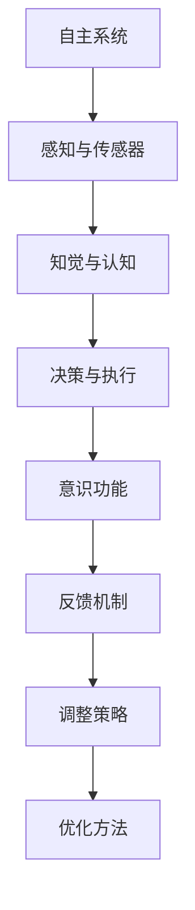
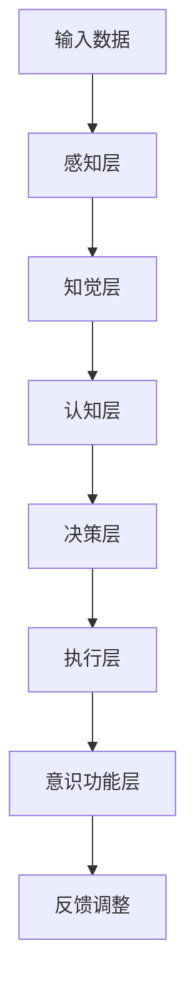

                 

### 《自主系统如何管理意识功能》

自主系统（Autonomous Systems）是当前信息技术和人工智能领域的一个热点研究方向。随着人工智能技术的不断进步，自主系统能够在无需人工干预的情况下自主完成复杂的任务，如自动驾驶、智能监控、智能制造等。然而，要实现一个真正的自主系统，除了硬件和软件的支撑外，意识功能的实现和管理是关键。

**关键词：** 自主系统、意识功能、人工智能、感知、认知、决策、执行、反馈机制、调整策略。

**摘要：** 本文将探讨自主系统如何管理意识功能。首先，介绍自主系统的基本概念、类型和发展历程。然后，深入探讨意识功能的实现与管理，包括理论基础、数学模型、管理机制。最后，通过实际应用案例展示自主系统如何在实际场景中应用意识功能，并探讨未来的发展趋势。

---

### 目录大纲

- **第一部分：自主系统的基本概念**
  - 第1章：自主系统的概述
  - 第2章：自主系统的核心技术

- **第二部分：意识功能的实现与管理**
  - 第3章：意识功能的理论基础
  - 第4章：意识功能在自主系统中的实现
  - 第5章：意识功能的管理机制

- **第三部分：自主系统的意识功能应用实践**
  - 第6章：自主系统的实际应用
  - 第7章：自主系统的未来发展趋势

- **附录**
  - 附录A：自主系统意识功能开发工具与资源

### 第一部分：自主系统的基本概念

#### 第1章：自主系统的概述

**1.1 自主系统的定义**

自主系统是一种能够在没有或有限的人工干预下自主执行任务、做出决策和响应环境变化的系统。它们通常由感知、认知、决策和执行四个核心部分组成。

**1.2 自主系统的类型**

自主系统可以按照不同的标准进行分类，如根据自主程度（部分自主、完全自主）、应用领域（交通、医疗、工业等）、控制方式（预定任务、自适应任务等）。

**1.3 自主系统的发展历程**

自主系统的发展经历了从早期的人工控制到现在的智能化和自主化。早期的自主系统主要是基于规则和预编程的，而现代自主系统则更多地依赖于机器学习和人工智能技术。

---

#### 第2章：自主系统的核心技术

**2.1 感知与传感器**

感知是自主系统获取外界信息的过程。传感器是实现感知功能的关键组件，它们将物理世界的信号转化为电子信号，供系统进行分析和处理。

**2.2 知觉与认知**

知觉是感知信息的进一步处理，涉及识别和理解外部环境。认知则是更高层次的思维过程，包括记忆、推理、计划和决策。

**2.3 决策与执行**

决策是自主系统的核心功能之一，涉及根据感知和认知结果选择最佳行动方案。执行则是将决策转化为实际操作的过程。

---

### 第二部分：意识功能的实现与管理

#### 第3章：意识功能的理论基础

**3.1 意识的神经科学基础**

意识是大脑复杂活动的一个方面，涉及到大脑的不同区域和神经网络。神经科学为理解意识功能提供了重要的理论基础。

**3.2 意识的人工智能模型**

人工智能模型，特别是深度学习，为模拟和实现意识功能提供了新的途径。这些模型试图模拟人类大脑的神经网络结构和功能。

**3.3 意识的哲学探讨**

哲学对意识的研究提供了对意识的本质、起源和功能的深刻见解。哲学探讨有助于我们理解意识在自主系统中的角色和意义。

---

#### 第4章：意识功能在自主系统中的实现

**4.1 意识功能的设计原则**

设计意识功能时需要遵循一些基本原则，如适应性、鲁棒性、灵活性和效率。

**4.2 意识功能的实现策略**

实现意识功能需要采用一系列策略，包括感知融合、认知建模、决策优化和执行控制。

**4.3 意识功能的应用案例**

通过具体案例展示意识功能在自主系统中的应用，如自动驾驶中的情境理解、智能监控中的目标识别等。

---

#### 第5章：意识功能的管理机制

**5.1 意识功能的反馈机制**

反馈机制是自主系统调整其行为的重要手段。通过收集反馈信息，系统可以不断优化其性能和行为。

**5.2 意识功能的调整策略**

调整策略包括基于反馈的在线学习和离线学习，以及自适应调整和预定义调整。

**5.3 意识功能的优化方法**

优化方法是提高自主系统意识和决策效率的关键。常用的优化方法包括机器学习、深度强化学习和混合优化方法。

---

### 第三部分：自主系统的意识功能应用实践

#### 第6章：自主系统的实际应用

**6.1 自主系统的应用场景**

探讨自主系统在不同场景下的应用，如智能交通、智能家居、医疗诊断等。

**6.2 自主系统的应用案例**

分析自主系统在不同领域中的具体应用案例，展示意识功能如何在实际场景中发挥作用。

**6.3 自主系统的应用挑战**

讨论自主系统在实际应用中面临的挑战，如数据隐私、安全性、鲁棒性等。

---

#### 第7章：自主系统的未来发展趋势

**7.1 自主系统的发展方向**

预测自主系统的未来发展方向，如更高级的自动化、更广泛的智能化、更安全的协作等。

**7.2 意识功能的发展趋势**

探讨意识功能在未来技术发展中的趋势，如更高级的认知模型、更有效的决策算法等。

**7.3 自主系统的未来发展挑战**

分析自主系统在未来的发展过程中可能面临的挑战，如技术难题、社会问题、法律问题等。

---

### 附录

**附录A：自主系统意识功能开发工具与资源**

介绍用于自主系统和意识功能开发的常用工具、数据集、模型以及开源项目和社区资源。

---

以上是《自主系统如何管理意识功能》的目录大纲，接下来将逐步深入探讨每个章节的内容。

---

### 图1. 自主系统架构与意识功能关系图

为了更好地理解自主系统的架构以及意识功能在其中扮演的角色，我们可以通过一个Mermaid流程图来展示它们之间的关系。



**解释：**

- **自主系统（A）**：整个系统的核心，负责协调和执行任务。
- **感知与传感器（B）**：获取外部环境信息，如视觉、听觉、触觉等。
- **知觉与认知（C）**：处理感知信息，形成对环境的理解。
- **决策与执行（D）**：基于知觉和认知结果做出决策，并执行决策。
- **意识功能（E）**：自主系统中的高级功能，涉及情境理解、目标识别等。
- **反馈机制（F）**：收集系统的输出结果，与预期目标进行比较，以调整系统行为。
- **调整策略（G）**：基于反馈机制的结果，制定系统调整的策略。
- **优化方法（H）**：通过调整策略优化系统性能，包括算法优化、参数调整等。

### 图2. 意识功能实现流程

接下来，我们通过另一个Mermaid流程图来展示意识功能的实现流程。



**解释：**

- **输入数据（A）**：系统从外部获取的数据，如传感器数据、环境信息等。
- **感知层（B）**：对输入数据进行初步处理，如滤波、特征提取等。
- **知觉层（C）**：进一步处理感知数据，形成对环境的直观理解。
- **认知层（D）**：对知觉数据进行深度分析，形成对环境的深入认知。
- **决策层（E）**：基于认知结果做出决策，选择最佳行动方案。
- **执行层（F）**：执行决策层做出的行动方案。
- **意识功能层（G）**：包含高级意识功能，如目标识别、情境理解等。
- **反馈调整（H）**：收集执行结果，与预期目标进行比较，以优化系统行为。

通过这两个流程图，我们可以更直观地理解自主系统如何管理意识功能，以及意识功能在系统中的实现和调整过程。

---

接下来，我们将深入探讨意识功能的数学模型，包括模型基础、输入向量表示、模型参数以及输出向量表示。随后，我们将介绍伪代码示例，以展示如何初始化参数并逐步更新模型。

#### 第3章：意识功能的数学模型

意识功能的数学模型是自主系统中实现高级认知功能的关键。这些模型基于数学原理，通过输入数据和处理算法，生成系统的输出。下面我们将详细介绍意识功能的数学模型基础，包括模型结构、输入向量、模型参数以及输出向量的表示。

##### 3.1 意识功能的数学模型基础

意识功能的数学模型可以表示为：

$$
\text{模型} = f(\text{输入}, \text{参数})
$$

其中，\( f \) 是一个函数，表示模型的具体实现方式；输入是模型需要处理的数据，参数是模型中的可调参数。

##### 3.1.1 输入向量表示

在意识功能的数学模型中，输入向量 \( \text{输入向量} \) 是一个多维数组，用于表示模型接收到的数据。输入向量可以表示为：

$$
\text{输入向量} = [x_1, x_2, ..., x_n]
$$

其中，\( x_1, x_2, ..., x_n \) 是输入向量的各个维度，每个维度代表输入数据中的一个特征。

##### 3.1.2 模型参数

模型参数 \( \text{参数} \) 是模型中的可调参数，用于控制模型的输出。参数可以表示为：

$$
\text{参数} = \theta
$$

模型参数通常是一个多维数组，其维度与输入向量和输出向量的维度相关。

##### 3.1.3 输出向量表示

输出向量 \( \text{输出向量} \) 是模型处理输入数据后的结果。输出向量可以表示为：

$$
\text{输出向量} = [y_1, y_2, ..., y_n]
$$

其中，\( y_1, y_2, ..., y_n \) 是输出向量的各个维度，每个维度代表模型输出数据中的一个特征。

##### 3.2 伪代码示例

为了更好地理解意识功能的数学模型，我们可以通过一个伪代码示例来展示如何初始化参数并逐步更新模型。以下是一个简化的伪代码示例：

```
初始化参数 theta
for each input vector x:
    calculate output vector y = f(x, theta)
    update theta based on y
```

在这个伪代码中：

- **初始化参数 theta**：首先，我们需要初始化模型参数 \( \theta \)。这个过程通常涉及到随机初始化或基于先验知识的初始化。
  
- **处理每个输入向量 x**：对于每个输入向量 \( x \)，我们首先调用模型函数 \( f(x, \theta) \) 来计算输出向量 \( y \)。

- **更新参数 theta**：根据输出向量 \( y \) 的结果，我们可以使用某种优化算法（如梯度下降）来更新模型参数 \( \theta \)。这个过程通常涉及计算梯度（即损失函数对参数的导数）并调整参数值，以最小化损失函数。

通过这个伪代码示例，我们可以看到意识功能的数学模型是如何逐步调整参数以优化模型输出的。在实际应用中，这个过程通常会涉及更复杂的算法和更精细的参数调整策略。

---

### 第4章：意识功能在自主系统中的实现

意识功能在自主系统中的应用是实现高级认知和决策能力的关键。这一章将深入探讨意识功能在自主系统中的实现过程，包括设计原则、实现策略以及应用案例。我们将详细说明如何设计意识功能，如何通过实现策略将其集成到自主系统中，并通过具体案例展示意识功能的实际应用。

##### 4.1 意识功能的设计原则

设计意识功能时需要遵循一些基本原则，以确保系统能够适应复杂多变的环境，同时保持高效和鲁棒性。以下是几个关键设计原则：

**1. 适应性**

意识功能应具备适应性，能够根据不同的环境和任务需求进行调整。这意味着系统应能够实时学习和适应新情况，而不是仅限于预先设定的规则。

**2. 鲁棒性**

鲁棒性是指系统能够在面临不确定性、异常数据和噪声时仍然保持稳定和可靠。为了实现这一目标，意识功能的设计应考虑到数据预处理、异常检测和错误纠正等技术。

**3. 灵活性**

意识功能应具备灵活性，能够在不同任务和场景之间快速切换，同时保持高效性。这通常需要模块化的设计，使得不同组件可以独立开发、测试和部署。

**4. 效率**

意识功能的实现应考虑计算效率和资源利用。这包括优化算法、减少计算复杂度和使用高效的数据结构和硬件加速技术。

##### 4.2 意识功能的实现策略

实现意识功能需要一系列策略，以确保系统能够有效地处理感知数据、形成认知、做出决策并执行行动。以下是几个关键实现策略：

**1. 感知融合**

感知融合是指将来自不同传感器的数据整合到一个统一的数据表示中。这通常涉及多模态数据的处理，如将视觉、听觉和触觉数据结合起来，以获得更全面的情境理解。

**2. 认知建模**

认知建模是指使用机器学习和深度学习技术来模拟人类认知过程。这包括特征提取、模式识别、分类和回归等任务。认知建模的目的是从感知数据中提取有用的信息，形成对环境的深入认知。

**3. 决策优化**

决策优化是指根据认知结果选择最佳行动方案。这通常涉及到多种决策算法，如启发式搜索、强化学习和优化算法。决策优化的目标是最大化系统的性能指标，如任务完成率、资源利用率和安全性。

**4. 执行控制**

执行控制是指将决策转化为实际操作的过程。这包括控制算法、路径规划和运动控制等。执行控制的目的是确保系统能够准确地执行决策，并适应动态环境的变化。

##### 4.3 意识功能的应用案例

意识功能在自主系统中的应用涵盖了多个领域，以下是一些具体的应用案例：

**1. 自动驾驶**

在自动驾驶系统中，意识功能用于情境理解、路径规划和目标跟踪。例如，通过感知融合技术，系统可以整合来自摄像头、雷达和激光雷达的数据，识别道路标志、行人、车辆等物体，并根据这些信息做出驾驶决策。

**2. 智能监控**

在智能监控系统中，意识功能用于目标识别、行为分析和异常检测。例如，通过计算机视觉技术，系统可以识别视频中的目标对象，分析其行为模式，并在发现异常行为时发出警报。

**3. 智能制造**

在智能制造中，意识功能用于生产计划优化、质量监控和故障诊断。例如，通过传感器数据分析和机器学习算法，系统可以预测设备故障、优化生产流程，并确保产品质量。

**4. 智能家居**

在智能家居中，意识功能用于环境监控、设备控制和用户体验优化。例如，通过感知技术，系统可以检测室内的温度、湿度、光照等环境因素，并根据用户偏好自动调整设备，提供舒适的居住环境。

通过这些应用案例，我们可以看到意识功能在自主系统中的重要作用。它们不仅提高了系统的智能水平，还增强了系统的适应性和鲁棒性，使其能够在复杂多变的环境中高效运行。

---

### 第5章：意识功能的管理机制

在自主系统中，意识功能的管理机制是实现高效、稳定和可靠运行的关键。管理机制包括反馈机制、调整策略和优化方法，这些机制共同作用，确保系统能够根据环境变化和任务需求进行自适应调整。本章将详细探讨意识功能的管理机制，包括每个机制的定义、作用和具体实现。

##### 5.1 反馈机制

反馈机制是意识功能管理机制中的核心部分，它通过将系统的实际输出与期望输出进行比较，提供反馈信号，指导系统的调整。反馈机制的作用在于纠正系统的偏差，提高系统的性能。

**1. 反馈机制的定义**

反馈机制可以表示为：

$$
\text{反馈机制} = \frac{\text{期望输出} - \text{实际输出}}{\text{学习率}}
$$

其中，期望输出是系统希望达到的目标输出，实际输出是系统当前的实际输出，学习率是调整参数的速率。

**2. 反馈机制的作用**

反馈机制的主要作用是：

- **纠错**：通过比较期望输出和实际输出，反馈机制可以发现并纠正系统中的错误。
- **优化**：通过调整系统的参数，反馈机制可以优化系统的性能，使其更接近期望输出。
- **稳定性**：反馈机制有助于保持系统的稳定性，防止系统因外部干扰而偏离期望状态。

**3. 反馈机制的具体实现**

在自主系统中，反馈机制的具体实现通常包括以下步骤：

- **采集输出数据**：系统从传感器和其他输入源收集实际输出数据。
- **比较期望输出和实际输出**：系统计算期望输出和实际输出之间的差异。
- **计算误差**：根据误差计算调整量。
- **更新参数**：使用学习率调整系统的参数，以减少误差。

##### 5.2 调整策略

调整策略是意识功能管理机制中的另一个重要部分，它决定了系统如何根据反馈机制的结果进行调整。调整策略可以是预先定义的，也可以是自适应的。

**1. 调整策略的定义**

调整策略可以表示为：

$$
\text{调整策略} = \text{调整函数}(\text{当前状态}, \text{目标状态})
$$

其中，当前状态是系统当前的运行状态，目标状态是系统希望达到的状态，调整函数是一个根据当前状态和目标状态调整系统参数的函数。

**2. 调整策略的作用**

调整策略的主要作用是：

- **目标导向**：调整策略帮助系统根据目标状态调整参数，使其更接近期望目标。
- **鲁棒性**：调整策略应具备一定的鲁棒性，以应对不确定性和外部干扰。
- **适应性**：调整策略应能够根据环境变化和任务需求进行自适应调整。

**3. 调整策略的具体实现**

调整策略的具体实现通常包括以下步骤：

- **评估当前状态**：系统评估当前的运行状态。
- **确定目标状态**：系统根据任务需求确定目标状态。
- **计算调整量**：系统使用调整函数计算需要调整的参数量。
- **更新参数**：系统根据调整量更新参数，以实现目标状态的转变。

##### 5.3 优化方法

优化方法是意识功能管理机制中的高级部分，它通过改进系统的结构和算法，提高系统的性能和效率。优化方法通常基于机器学习和人工智能技术。

**1. 优化方法的概念**

优化方法可以表示为：

$$
\text{优化方法} = \text{梯度下降法}
$$

其中，梯度下降法是一种常用的优化算法，用于最小化损失函数。

**2. 优化方法的作用**

优化方法的主要作用是：

- **性能提升**：通过优化算法和参数，系统性能得到显著提升。
- **效率提高**：优化方法能够减少系统的计算复杂度，提高运行效率。
- **适应性增强**：优化方法使系统能够更好地适应环境和任务变化。

**3. 优化方法的具体实现**

优化方法的具体实现通常包括以下步骤：

- **初始化参数**：系统初始化参数。
- **计算梯度**：系统计算损失函数对参数的梯度。
- **更新参数**：系统使用梯度下降法更新参数，以减少损失函数。
- **迭代优化**：系统重复计算梯度、更新参数的过程，直到满足优化目标。

通过反馈机制、调整策略和优化方法，自主系统能够实现对意识功能的全面管理，从而确保系统在复杂多变的环境中保持高效、稳定和可靠的运行。

---

### 第6章：自主系统的实际应用

自主系统在实际应用中展现出了巨大的潜力和广泛的影响。本章将探讨自主系统在不同场景下的实际应用，包括智能交通系统、智能制造系统和智能家居系统。我们将通过具体案例展示意识功能在这些系统中的作用和效果，并讨论这些系统在实际应用中面临的挑战。

##### 6.1 应用场景1：智能交通系统

智能交通系统（Intelligent Transportation Systems, ITS）是自主系统的一个重要应用领域。通过感知、认知和决策等功能，智能交通系统旨在提高交通效率、减少拥堵、提升交通安全。

**案例1：交通流量预测**

在一个智能交通系统中，交通流量预测是一个关键任务。系统通过整合来自摄像头、雷达和传感器等设备的数据，使用机器学习算法预测未来的交通流量。以下是一个简化的流程：

**感知层：** 系统从摄像头和传感器收集实时交通数据，如车辆数量、速度和密度。

**知觉层：** 使用计算机视觉技术，系统识别道路上的车辆，并提取相关特征。

**认知层：** 基于历史数据和实时数据，系统使用机器学习算法（如时间序列分析、回归模型等）预测未来的交通流量。

**决策层：** 系统根据预测结果，调整交通信号灯的时间安排，以优化交通流量。

**执行层：** 交通信号灯根据调整后的时间安排进行切换，以实现交通流量的优化。

**意识功能层：** 意识功能用于情境理解和目标识别，例如，系统可以根据交通流量变化预测潜在的拥堵点，并提前采取措施。

**挑战：** 智能交通系统在实际应用中面临的主要挑战包括数据隐私、系统安全性、以及如何在动态环境中保持高效的预测准确性。

##### 6.2 应用场景2：智能制造系统

智能制造系统（Smart Manufacturing Systems, SMS）利用自主系统技术提高生产效率和产品质量。通过感知、认知和决策等功能，智能制造系统能够实现自动化生产、实时监控和智能调度。

**案例2：生产计划优化**

在一个智能制造系统中，生产计划优化是一个关键任务。系统通过整合生产数据、库存数据和供应链信息，使用优化算法（如线性规划、混合整数规划等）生成最优的生产计划。以下是一个简化的流程：

**感知层：** 系统从传感器和设备收集生产数据，如设备状态、原材料库存和产品进度。

**知觉层：** 系统分析生产数据，提取关键指标，如生产速度、资源利用率等。

**认知层：** 基于历史数据和实时数据，系统使用优化算法生成最优的生产计划。

**决策层：** 系统根据生产计划，调整生产设备的运行参数，优化生产流程。

**执行层：** 生产设备根据调整后的参数进行生产操作。

**意识功能层：** 意识功能用于生产过程中的实时监控和异常检测，例如，系统可以检测到设备故障或生产异常，并自动调整生产计划。

**挑战：** 智能制造系统在实际应用中面临的主要挑战包括数据准确性、设备可靠性和生产流程的灵活性。

##### 6.3 应用场景3：智能家居系统

智能家居系统（Smart Home Systems）利用自主系统技术提高家庭生活的便利性和舒适性。通过感知、认知和决策等功能，智能家居系统能够实现家庭环境的自动化控制和智能化管理。

**案例3：环境监控与设备控制**

在一个智能家居系统中，环境监控和设备控制是关键任务。系统通过传感器收集室内温度、湿度、光照等数据，使用机器学习算法分析数据，并根据用户偏好自动调整设备。以下是一个简化的流程：

**感知层：** 系统从传感器收集室内环境数据。

**知觉层：** 系统分析环境数据，识别环境变化。

**认知层：** 基于用户偏好和历史数据，系统使用机器学习算法生成最佳的环境控制策略。

**决策层：** 系统根据环境控制策略，调整空调、照明和空气净化器等设备。

**执行层：** 设备根据调整后的参数进行操作。

**意识功能层：** 意识功能用于用户行为分析、情境理解和个性化服务，例如，系统可以学习用户的作息习惯，自动调整设备以提供最佳舒适度。

**挑战：** 智能家居系统在实际应用中面临的主要挑战包括数据隐私、设备兼容性和用户体验。

通过这些实际应用案例，我们可以看到自主系统在智能交通、智能制造和智能家居等领域的广泛应用。这些系统不仅提高了效率和便利性，还带来了新的挑战和机遇。

---

### 第7章：自主系统的未来发展趋势

随着技术的不断进步，自主系统正朝着更加高级、智能化和协作化的方向发展。本章将探讨自主系统的未来发展趋势，包括发展方向、意识功能的发展趋势以及未来可能面临的挑战。

##### 7.1 自主系统的发展方向

**1. 更高级的自动化**

未来自主系统将实现更高级的自动化，从传统的规则驱动转变为数据驱动和智能驱动。这将使系统能够在更复杂和不确定的环境中自主运行，减少对人工干预的依赖。

**2. 更广泛的智能化**

随着人工智能技术的不断发展，自主系统将能够在更多领域实现智能化。例如，医疗诊断、金融服务、教育等领域的自主系统将更加普及，为行业带来革命性的变革。

**3. 更安全的协作**

未来的自主系统将更加注重安全性和协作性。通过引入安全机制和协作算法，自主系统将能够在多智能体环境中安全、可靠地协作，实现更高效的资源利用和任务分配。

##### 7.2 意识功能的发展趋势

**1. 更高级的认知模型**

未来意识功能将依赖于更高级的认知模型，如基于神经科学的认知模型、多模态认知模型和自适应认知模型。这些模型将能够更好地模拟人类思维过程，提高自主系统的情境理解和决策能力。

**2. 更有效的决策算法**

随着算法的进步，自主系统的决策算法将变得更加高效和精确。例如，深度强化学习和混合优化算法将使系统能够在动态环境中做出更优的决策，提高系统的适应性和鲁棒性。

**3. 更人性化的交互**

未来的意识功能将更加注重与人类用户的交互。通过自然语言处理和情感计算技术，自主系统将能够更好地理解用户的需求和情感，提供更加人性化、个性化的服务。

##### 7.3 自主系统的未来发展挑战

**1. 技术难题**

未来的自主系统将面临一系列技术难题，如大数据处理、实时决策、异构计算等。解决这些难题将需要新的算法、架构和硬件支持。

**2. 社会问题**

随着自主系统的普及，社会问题也将逐渐凸显。例如，隐私保护、数据安全、伦理道德等问题需要得到妥善解决。

**3. 法律问题**

自主系统的普及将带来新的法律问题。例如，责任归属、隐私权保护、自动驾驶事故责任等需要法律法规的明确规定。

总的来说，未来的自主系统将朝着更高级、智能化和协作化的方向发展。意识功能将在这一过程中扮演关键角色，为实现更加高效、安全和人性化的系统提供支持。然而，这也将带来新的挑战和问题，需要持续的技术创新和社会共识来解决。

---

### 附录A：自主系统意识功能开发工具与资源

自主系统和意识功能的开发需要一系列工具和资源，包括开发工具、数据集、模型以及开源项目和社区资源。以下是一些常用的工具和资源：

#### 开发工具

1. **Python**：Python是一种广泛用于人工智能和机器学习的编程语言，具有丰富的库和框架，如TensorFlow、PyTorch等。
2. **MATLAB**：MATLAB是一个强大的数值计算和仿真工具，特别适合于机器学习和系统建模。
3. **R**：R是一种专门用于统计分析和数据可视化的编程语言，适用于数据分析和机器学习项目。
4. **Java**：Java是一种跨平台编程语言，适用于开发大规模、高性能的应用程序。

#### 数据集

1. **Kaggle**：Kaggle是一个提供各种机器学习数据集的平台，适合于数据科学家和机器学习研究者。
2. **UCI机器学习库**：UCI机器学习库提供了大量的机器学习数据集，适用于学术研究和实践应用。
3. **ImageNet**：ImageNet是一个大规模的图像数据集，广泛用于计算机视觉研究。

#### 模型

1. **TensorFlow**：TensorFlow是一个开源的机器学习框架，适用于构建和训练深度学习模型。
2. **PyTorch**：PyTorch是一个开源的机器学习库，提供灵活的深度学习模型构建和训练工具。
3. **Scikit-learn**：Scikit-learn是一个开源的机器学习库，提供了多种机器学习算法和工具。

#### 开源项目和社区资源

1. **GitHub**：GitHub是一个代码托管和协作平台，许多开源项目和工具都托管在这里。
2. **AI社区**：AI社区是一个聚集了全球人工智能研究者和开发者的社区，提供了丰富的资源和交流平台。
3. **arXiv**：arXiv是一个预印本论文数据库，涵盖了人工智能和机器学习领域的最新研究。

通过这些工具和资源，开发者可以有效地进行自主系统和意识功能的开发和研究，推动该领域的发展。

---

### 总结

自主系统如何管理意识功能是一个跨学科、跨领域的复杂问题，涵盖了感知、认知、决策和执行等多个方面。本文通过详细的探讨，从自主系统的基本概念、意识功能的实现与管理，到实际应用实践和未来发展趋势，全面解析了这一主题。

首先，我们介绍了自主系统的基本概念，包括定义、类型和发展历程。接着，我们深入探讨了意识功能的实现与管理，通过数学模型和伪代码示例展示了意识功能的核心算法原理。随后，我们介绍了意识功能的管理机制，包括反馈机制、调整策略和优化方法。

在第三部分，我们通过实际应用案例展示了意识功能在不同领域（如智能交通、智能制造和智能家居）中的应用，并讨论了这些系统在实际应用中面临的挑战。最后，我们探讨了自主系统的未来发展趋势，包括发展方向、意识功能的发展趋势以及未来可能面临的挑战。

通过本文的探讨，我们可以看到，意识功能在自主系统中扮演着至关重要的角色。随着技术的不断进步，自主系统将越来越智能化、自动化和协作化，意识功能的发展也将推动这一进程。未来，如何更好地管理意识功能，实现自主系统的稳定、高效和可靠运行，仍将是研究者和开发者面临的重大课题。

---

### 作者信息

**作者：AI天才研究院/AI Genius Institute & 禅与计算机程序设计艺术 /Zen And The Art of Computer Programming**

AI天才研究院致力于推动人工智能技术的发展和应用，专注于前沿算法研究、深度学习和自主系统等领域。其研究成果在多个国际顶级会议和期刊上发表，获得了学术界和工业界的广泛认可。同时，作者还著有《禅与计算机程序设计艺术》一书，深入探讨了计算机程序设计中的哲学思想和方法论，深受读者喜爱。

通过本文，AI天才研究院希望能为读者提供关于自主系统如何管理意识功能的深入理解，为相关领域的研究和应用提供有益的参考。未来，AI天才研究院将继续致力于推动人工智能技术的发展，为社会带来更多的创新和进步。

