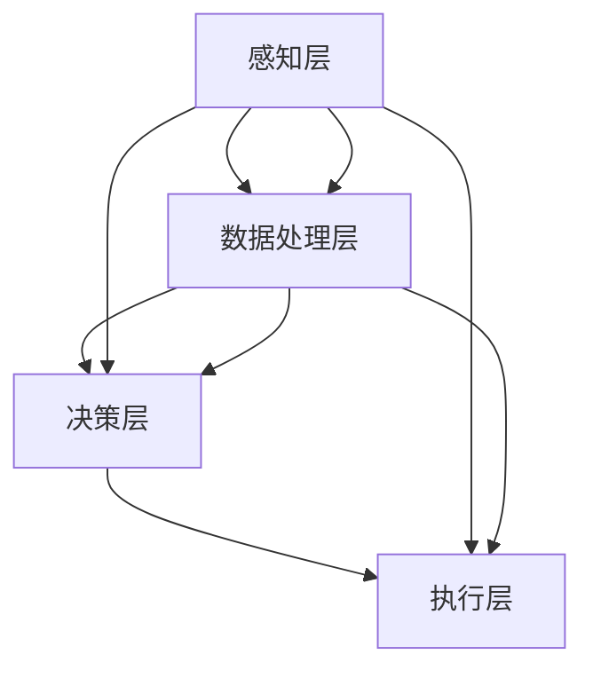
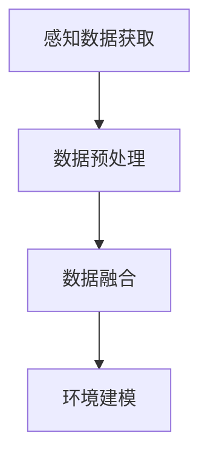
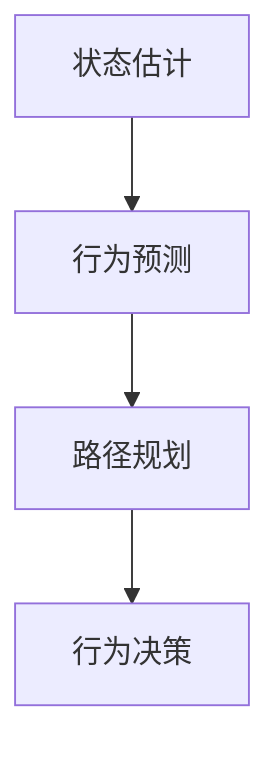

                 

## 《自动驾驶不确定性建模与鲁棒决策的核心技术突破口》

### 关键词：
- 自动驾驶
- 不确定性建模
- 鲁棒决策
- 控制理论
- 机器学习
- 深度学习

> 摘要：自动驾驶作为人工智能领域的重要分支，其安全性直接关系到公众的信任和实际应用。然而，自动驾驶系统面临的复杂不确定性，使得精确控制与决策成为一大挑战。本文从自动驾驶的背景出发，深入探讨了不确定性建模与鲁棒决策的核心技术，包括概率论、机器学习方法、模糊集理论等，并通过具体实例解析了这些技术在自动驾驶系统中的应用。文章还介绍了鲁棒优化、鲁棒控制等关键技术，并展示了深度学习在自动驾驶领域的应用潜力。最后，文章对自动驾驶的未来发展趋势进行了展望，为相关研究提供了参考。

### 引言

自动驾驶技术近年来取得了显著进展，从实验室原型到实际道路测试，各类自动驾驶系统不断涌现。然而，随着自动驾驶技术的不断成熟，其面临的挑战也越来越复杂。尤其是自动驾驶系统在运行过程中不可避免地会遇到各种不确定性因素，如环境变化、传感器误差、交通流动态等。这些不确定性不仅影响了自动驾驶系统的性能，更对其安全性提出了严峻考验。

#### 自动驾驶发展历程与现状

自动驾驶技术的发展历程可以分为以下几个阶段：

1. **辅助驾驶阶段**：这一阶段的主要目标是减轻驾驶员的负担，通过辅助系统如自动刹车、自适应巡航控制等实现部分自动驾驶功能。

2. **部分自动驾驶阶段**：在这一阶段，自动驾驶系统可以在特定条件下完全接管车辆的控制，如高速公路自动驾驶、城市自动驾驶等。

3. **完全自动驾驶阶段**：自动驾驶系统能够在无人工干预的情况下，安全、可靠地完成驾驶任务。

当前，部分自动驾驶技术已经相对成熟，并在实际中得到广泛应用。然而，完全自动驾驶技术仍然面临诸多挑战，特别是在应对复杂、动态环境下的不确定性时。

#### 自动驾驶中的不确定性问题

自动驾驶系统中存在多种不确定性因素：

1. **环境不确定性**：包括天气变化、道路状况、交通状况等。这些因素可能导致环境模型与实际环境的偏差。

2. **传感器不确定性**：传感器如雷达、摄像头、激光雷达等在数据采集过程中可能存在误差，这些误差会影响自动驾驶系统的感知能力。

3. **模型不确定性**：自动驾驶系统的控制模型可能无法完全捕捉到所有环境变化，导致模型输出与实际结果之间存在偏差。

4. **动态不确定性**：交通参与者的行为是动态且不可预测的，如突然变道、急刹车等行为可能导致自动驾驶系统的决策错误。

#### 不确定性建模与鲁棒决策的重要性

为了提高自动驾驶系统的安全性，不确定性建模与鲁棒决策显得尤为重要。不确定性建模旨在通过概率论、机器学习等方法，对环境不确定性进行量化，从而构建一个更为准确的环境模型。鲁棒决策则是在这种不确定环境下，通过优化算法、控制理论等方法，使自动驾驶系统能够做出合理的决策，保证系统的稳定性与安全性。

接下来的部分将详细探讨自动驾驶系统架构、不确定性建模方法、鲁棒决策技术，并展示这些技术在自动驾驶系统中的具体应用。

### 自动驾驶系统架构

自动驾驶系统的核心在于其能够高效地感知环境、理解场景、规划路径、做出决策，并执行这些决策。为了实现这一目标，自动驾驶系统通常由多个层次和模块构成，各模块协同工作，共同完成自动驾驶任务。下面将介绍自动驾驶系统的基本架构，重点讨论环境感知与建模、行为预测与规划等关键部分。

#### 自动驾驶系统框架

自动驾驶系统的整体架构可以概括为以下几个层次：

1. **感知层**：通过传感器获取环境信息，如摄像头、激光雷达、毫米波雷达、超声波传感器等。

2. **数据处理层**：对感知层获取的数据进行预处理、融合和解释，以构建环境模型。

3. **决策层**：基于环境模型和车辆状态，进行路径规划、行为决策等。

4. **执行层**：根据决策层的输出，控制车辆执行相应的操作。

下图展示了自动驾驶系统的基本架构及其各层次之间的关系：



#### 环境感知与建模

环境感知是自动驾驶系统的核心任务之一，其主要目标是通过传感器获取环境信息，并将其转换为系统可以理解的数据。环境感知主要包括以下几个方面：

1. **感知数据获取**：通过摄像头、激光雷达、雷达等传感器获取道路、车辆、行人等环境信息。

2. **数据预处理**：对获取的原始数据进行去噪、增强、滤波等处理，以提高数据的可靠性和准确性。

3. **数据融合**：将不同类型的传感器数据进行融合，以获得更为全面和准确的环境信息。例如，激光雷达和摄像头的数据可以相互补充，提高物体识别的精度。

4. **环境建模**：根据感知数据，构建环境模型，用于后续的路径规划和行为决策。环境模型可以包括道路模型、车辆模型、行人模型等。

下面是一个简化的环境感知与建模的流程图：



#### 行为预测与规划

在环境建模的基础上，自动驾驶系统需要根据当前环境和车辆状态，预测其他交通参与者的行为，并规划自己的路径和行为。这一过程包括以下几个步骤：

1. **状态估计**：根据环境模型和传感器数据，对车辆当前的状态进行估计，如速度、位置、方向等。

2. **行为预测**：基于交通参与者的历史行为数据和当前状态，预测其未来的行为，如加速、减速、变道等。

3. **路径规划**：根据行为预测结果，规划车辆的路径，以最大化安全性、效率和舒适性。路径规划可以采用多种算法，如最短路径算法、动态规划、粒子群优化等。

4. **行为决策**：根据路径规划结果，确定车辆的具体行为，如加速、减速、转向等。

下面是一个简化的路径规划和行为决策的流程图：



通过以上各层次的协同工作，自动驾驶系统可以实现自主驾驶，并在面对复杂、动态环境时，保持稳定和安全。

在下一部分，我们将深入探讨自动驾驶系统中的不确定性建模方法，包括概率论、机器学习方法、模糊集理论等，以应对环境中的不确定因素。

### 不确定性建模方法

在自动驾驶系统中，不确定性建模是确保系统安全性和鲁棒性的关键环节。不确定性建模旨在通过量化不确定性，提高系统对动态环境的适应性。本文将介绍几种常用的不确定性建模方法，包括概率论、机器学习方法、模糊集理论等，并分析这些方法在自动驾驶系统中的应用。

#### 概率论与统计方法

概率论和统计学是处理不确定性的基本工具。在自动驾驶系统中，概率论和统计方法主要用于描述和预测传感器数据和环境变化。

1. **概率分布**：通过传感器数据，可以估计环境的概率分布。例如，激光雷达数据可以用来估计障碍物的位置分布，摄像头数据可以用来估计行人的位置分布。

    $$ p(x|\theta) = \frac{e^{-\frac{1}{2}((x-\mu)^T\Sigma^{-1}(x-\mu))}}{(2\pi)^{n/2}|\Sigma|^{1/2}} $$

    其中，$x$ 表示观察到的数据，$\mu$ 是均值，$\Sigma$ 是协方差矩阵。

2. **贝叶斯推断**：贝叶斯推断是一种利用先验知识和观测数据更新概率估计的方法。在自动驾驶系统中，可以通过贝叶斯推断来更新障碍物和行人的概率分布。

    $$ p(\theta|X) = \frac{p(X|\theta)p(\theta)}{p(X)} $$

    其中，$\theta$ 是参数，$X$ 是观测数据，$p(X|\theta)$ 是观测数据在参数条件下的概率，$p(\theta)$ 是先验概率，$p(X)$ 是边缘概率。

3. **蒙特卡罗模拟**：蒙特卡罗模拟是一种基于随机抽样的方法，通过大量模拟来估计系统的不确定性。在自动驾驶系统中，可以使用蒙特卡罗模拟来评估路径规划结果和决策的稳定性。

    ```python
    import numpy as np

    def monte_carlo_simulation(env, policy, num_samples):
        states = []
        for _ in range(num_samples):
            state = env.reset()
            done = False
            while not done:
                action = policy(state)
                next_state, reward, done, _ = env.step(action)
                state = next_state
            states.append(state)
        return states
    ```

#### 机器学习方法

机器学习方法在不确定性建模中有着广泛应用。通过学习大量数据，机器学习模型可以自动识别和预测环境中的不确定性。

1. **回归模型**：回归模型可以用来预测环境变量，如障碍物的位置和速度。线性回归模型是一种简单的回归模型，其公式如下：

    $$ y = \beta_0 + \beta_1x $$

    其中，$y$ 是预测值，$x$ 是输入变量，$\beta_0$ 和 $\beta_1$ 是模型参数。

2. **神经网络**：神经网络是一种强大的机器学习模型，可以用于复杂的不确定性建模。在自动驾驶系统中，可以构建深度神经网络来预测交通参与者的行为。

    ```python
    import tensorflow as tf

    model = tf.keras.Sequential([
        tf.keras.layers.Dense(64, activation='relu', input_shape=(input_shape,)),
        tf.keras.layers.Dense(64, activation='relu'),
        tf.keras.layers.Dense(1)
    ])

    model.compile(optimizer='adam', loss='mean_squared_error')
    model.fit(x_train, y_train, epochs=10, batch_size=32)
    ```

3. **贝叶斯神经网络**：贝叶斯神经网络结合了神经网络和贝叶斯推断的优势，可以提供概率性的预测。在自动驾驶系统中，贝叶斯神经网络可以用于不确定性评估和决策。

    ```python
    import tensorflow_probability as tfp
    tfd = tfp.distributions

    model = tf.keras.Sequential([
        tf.keras.layers.Dense(64, activation='relu', input_shape=(input_shape,)),
        tf.keras.layers.Dense(64, activation='relu'),
        tf.keras.layers.Dense(1, activation='softmax')
    ])

    model.compile(optimizer=tf.keras.optimizers.Adam(learning_rate=0.001),
                  loss=tf.keras.losses.SparseCategoricalCrossentropy(from_logits=True))
    model.fit(x_train, y_train, epochs=10, batch_size=32)
    ```

#### 模糊集理论

模糊集理论是一种处理不确定性和模糊性的数学工具。在自动驾驶系统中，模糊集理论可以用来描述交通参与者的行为和不确定性。

1. **模糊集定义**：模糊集是一种集合，其元素不仅属于某个集合，而且还具有一个隶属度。隶属度表示元素属于集合的程度。

    $$ A = \{x | \mu_A(x)\} $$

    其中，$\mu_A$ 是隶属函数，$x$ 是集合中的元素。

2. **模糊逻辑**：模糊逻辑是一种基于模糊集的推理方法。在自动驾驶系统中，可以使用模糊逻辑来处理不确定性信息，并进行决策。

    ```python
    import numpy as np

    def fuzzy_logic(A, B):
        return np.minimum(A, B)

    A = np.array([0.5, 0.3, 0.7])
    B = np.array([0.6, 0.4, 0.8])
    result = fuzzy_logic(A, B)
    ```

3. **模糊控制**：模糊控制是一种基于模糊逻辑的控制方法。在自动驾驶系统中，可以使用模糊控制来处理不确定性，实现车辆的控制。

    ```python
    import numpy as np

    def fuzzy_control(error, error_derivative):
        if error >= 0 and error_derivative >= 0:
            return 1
        elif error < 0 and error_derivative < 0:
            return -1
        else:
            return 0
    ```

通过以上方法，自动驾驶系统可以有效地建模和应对环境中的不确定性。在下一部分，我们将探讨鲁棒决策技术，以实现自动驾驶系统在不确定环境下的稳定和可靠运行。

### 鲁棒优化算法

鲁棒优化是自动驾驶系统在应对不确定性时的重要技术手段。鲁棒优化旨在通过设计优化算法，确保系统在面临不确定性和扰动时，仍能实现预期性能。本文将介绍鲁棒优化算法的基本概念、线性规划和非线性规划的方法，并展示其在自动驾驶路径规划中的应用实例。

#### 鲁棒优化基本概念

鲁棒优化（Robust Optimization）是一种处理不确定性的优化方法。与传统优化方法不同，鲁棒优化不仅考虑最优解，还考虑不确定性和扰动对优化结果的影响。鲁棒优化的问题形式可以表示为：

$$
\min_{x} f(x) + r(u)
$$

其中，$f(x)$ 是目标函数，$r(u)$ 是鲁棒函数，$u$ 是不确定性参数。

#### 线性规划与鲁棒线性规划

线性规划（Linear Programming，LP）是一种常见的优化方法，适用于目标函数和约束函数都是线性函数的问题。鲁棒线性规划（Robust Linear Programming，RLP）则是在线性规划的基础上，引入了不确定性约束。

1. **线性规划问题**：

$$
\min_{x} c^T x
$$

subject to

$$
Ax \leq b
$$

其中，$c$ 是系数向量，$A$ 是约束矩阵，$b$ 是约束向量。

2. **鲁棒线性规划问题**：

$$
\min_{x} c^T x
$$

subject to

$$
\gamma \leq Ax - b \leq \delta
$$

其中，$\gamma$ 和 $\delta$ 是容许不确定性范围。

#### 非线性规划与鲁棒非线性规划

非线性规划（Nonlinear Programming，NLP）适用于目标函数和约束函数是非线性函数的问题。鲁棒非线性规划（Robust Nonlinear Programming，RNP）则是对非线性规划问题进行不确定性处理。

1. **非线性规划问题**：

$$
\min_{x} f(x)
$$

subject to

$$
g(x) \leq 0, h(x) = 0
$$

其中，$f(x)$ 是目标函数，$g(x)$ 是不等式约束函数，$h(x)$ 是等式约束函数。

2. **鲁棒非线性规划问题**：

$$
\min_{x} f(x) + r(u)
$$

subject to

$$
g(x) \leq 0, h(x) = 0
$$

其中，$r(u)$ 是鲁棒函数，$u$ 是不确定性参数。

#### 实例：自动驾驶路径规划中的鲁棒优化

以下是一个自动驾驶路径规划中的鲁棒优化实例：

**目标**：在给定起点和终点之间规划一条最优路径，同时考虑道路宽度、交通流量和传感器不确定性。

**模型**：

- 目标函数：路径长度
- 约束函数：道路宽度约束、交通流量约束、传感器不确定性约束

$$
\min_{x} \sum_{i} d_i
$$

subject to

$$
w_i \geq w_{min}, \quad i = 1, 2, \ldots, n
$$

$$
q_i \leq q_{max}, \quad i = 1, 2, \ldots, n
$$

$$
x_i - x_{i-1} \leq \delta_x, \quad i = 2, 3, \ldots, n
$$

$$
y_i - y_{i-1} \leq \delta_y, \quad i = 2, 3, \ldots, n
$$

其中，$d_i$ 是路径长度，$w_i$ 是道路宽度，$q_i$ 是交通流量，$x_i$ 和 $y_i$ 是路径点坐标，$\delta_x$ 和 $\delta_y$ 是传感器不确定性范围。

**解决方案**：使用鲁棒线性规划方法求解上述鲁棒路径规划问题。

```python
import cvxpy as cp

# 定义变量
x = cp.Variable(n)
y = cp.Variable(n)

# 定义目标函数
objective = cp.Minimize(cp.sum(cp.abs(x)))

# 定义约束条件
constraints = [x >= w_min, y >= w_min,
               x <= q_max, y <= q_max,
               x[1:] - x[:-1] <= delta_x,
               y[1:] - y[:-1] <= delta_y]

# 求解鲁棒线性规划问题
prob = cp.Problem(objective, constraints)
prob.solve()

# 输出路径点
path = [x.value[i] for i in range(n)]
```

通过以上鲁棒优化算法，自动驾驶系统能够在不确定环境下规划出一条最优且安全的路径。下一部分将介绍鲁棒控制理论，探讨如何在自动驾驶系统中实现稳定控制。

### 鲁棒控制理论

鲁棒控制是自动驾驶系统在不确定环境中实现稳定控制的关键技术。它旨在设计控制系统，使其在面对模型不确定性、外部扰动和内部噪声时，仍能保持期望的稳定性和性能。本文将介绍鲁棒控制的定义、目标和方法，并通过具体实例展示其在自动驾驶车辆稳定控制中的应用。

#### 鲁棒控制的定义与目标

鲁棒控制（Robust Control）是一种设计方法，用于提高控制系统在面对不确定性和扰动时的稳定性。它通过考虑系统的不确定性范围，确保控制系统在不同条件下都能保持稳定。

**定义**：鲁棒控制是一种设计方法，用于确保控制系统在存在模型不确定性、外部扰动和内部噪声的情况下，仍能保持预定的性能和稳定性。

**目标**：鲁棒控制的目标是设计一个控制器，使其在以下条件下保持稳定：

1. **模型不确定性**：系统动态模型可能存在参数不确定性和结构不确定性。
2. **外部扰动**：系统可能受到外部环境的影响，如风、路面摩擦等。
3. **内部噪声**：传感器和执行机构可能引入噪声，影响系统性能。

#### 状态反馈与输出反馈控制

鲁棒控制主要通过状态反馈和输出反馈来实现。状态反馈控制通过直接利用系统的状态信息进行控制，而输出反馈控制则通过系统的输出进行控制。

1. **状态反馈控制**：状态反馈控制通过测量系统状态，将其作为控制输入。

    $$ u = -Kx + b(x) $$

    其中，$u$ 是控制输入，$x$ 是系统状态，$K$ 是反馈矩阵，$b(x)$ 是不确定性补偿项。

2. **输出反馈控制**：输出反馈控制通过系统的输出进行控制，通常需要一个观测器来估计系统状态。

    $$ u = -Ky + b(y) $$

    其中，$y$ 是系统输出，$K$ 是反馈矩阵，$b(y)$ 是不确定性补偿项。

#### 鲁棒控制设计方法

鲁棒控制设计方法主要包括以下几种：

1. **线性矩阵不等式（LMI）方法**：LMI方法是一种常见的鲁棒控制设计方法，通过构造线性矩阵不等式（LMI）来求解控制器参数。LMI方法适用于具有线性不确定性的系统。

    $$ \begin{bmatrix}
    A & B \\
    B^T & C
    \end{bmatrix} < 0 $$

    其中，$A$、$B$、$C$ 是系统矩阵。

2. **线性二次调节器（LQR）**：LQR是一种优化方法，用于设计线性系统的最优控制律，使系统的性能达到最优。LQR方法通过求解二次规划问题来获得控制律。

    $$ \min_{u} \mathbf{u}^T Q \mathbf{u} + \mathbf{x}^T R \mathbf{x} $$
    
    subject to
    
    $$ A\mathbf{x} + B\mathbf{u} = 0 $$

    其中，$Q$、$R$ 是权重矩阵。

3. **H∞控制**：H∞控制是一种基于范数最小化的鲁棒控制方法，通过求解H∞优化问题来设计控制器，使其对不确定性的影响最小。

    $$ \min_{K} \max_{\|W\| \leq 1} \| Aw + Bu + Cv \|^2 $$

    其中，$W$ 是不确定性矩阵。

#### 实例：自动驾驶车辆稳定控制

以下是一个自动驾驶车辆稳定控制的实例：

**目标**：设计一个控制器，使自动驾驶车辆在行驶过程中保持稳定，同时应对道路不确定性和外部扰动。

**模型**：

$$
\begin{align*}
\dot{x} &= v \cos(\theta) \\
\dot{y} &= v \sin(\theta) \\
\dot{\theta} &= \frac{\delta}{L} \\
v &= \frac{1}{2}(u_1 + u_2)
\end{align*}
$$

其中，$x$ 和 $y$ 是车辆位置，$\theta$ 是车辆方向，$v$ 是车辆速度，$\delta$ 是方向盘输入，$L$ 是车辆长度。

**设计方法**：使用LQR方法设计控制器。

1. **建立状态空间模型**：

$$
\begin{align*}
\dot{x} &= \begin{bmatrix} 0 & 1 & 0 \\ 0 & 0 & 1 \\ -\frac{1}{L} & 0 & -\frac{\delta}{L} \end{bmatrix} x + \begin{bmatrix} 0 \\ 0 \\ \frac{1}{2} \end{bmatrix} u \\
y &= \begin{bmatrix} x_1 \\ x_2 \\ \theta \end{bmatrix}
\end{align*}
$$

2. **求解LQR问题**：

$$
\begin{align*}
\min_{K} \mathbf{x}^T Q \mathbf{x} + \mathbf{u}^T R \mathbf{u}
\end{align*}
$$

subject to

$$
A\mathbf{x} + B\mathbf{u} = 0
$$

通过求解上述问题，可以得到控制器增益矩阵 $K$。

3. **实现控制器**：

$$
u = -Kx + b(x)
$$

其中，$b(x)$ 是不确定性补偿项。

通过以上鲁棒控制设计，自动驾驶车辆能够在面对道路不确定性和外部扰动时，保持稳定的行驶状态。下一部分将探讨鲁棒决策与行为规划，以实现自动驾驶系统在复杂环境下的合理决策。

### 鲁棒决策与行为规划

鲁棒决策与行为规划是自动驾驶系统中确保车辆在不确定和动态环境下安全行驶的关键技术。鲁棒决策旨在设计决策机制，使车辆在面对环境不确定性和外部干扰时，仍能做出合理且安全的决策。行为规划则是通过预测和分析车辆行为，制定出最优的行动策略。本文将介绍鲁棒决策的基本框架、基于博弈论的鲁棒决策方法、多智能体系统的鲁棒决策，并展示具体实例。

#### 鲁棒行为规划框架

鲁棒行为规划框架主要包括以下几个步骤：

1. **环境建模**：对自动驾驶系统所面临的动态环境进行建模，包括道路条件、交通状况、车辆和行人的行为等。

2. **不确定性建模**：对环境中的不确定性因素进行建模，如传感器噪声、交通参与者行为的随机性等。

3. **目标设定**：根据自动驾驶系统的性能指标和安全性要求，设定决策目标，如路径最短、能耗最低、安全性最高等。

4. **行为预测**：基于环境建模和不确定性建模，预测未来一段时间内环境状态的变化和交通参与者的行为。

5. **决策算法设计**：设计鲁棒决策算法，以应对环境中的不确定性和外部干扰。

6. **行为规划**：根据决策结果，制定出车辆的行为规划，包括加速、减速、转向等操作。

7. **行为执行**：根据行为规划，执行具体的车辆操作，确保自动驾驶系统的正常运行。

#### 基于博弈论的鲁棒决策

博弈论是一种研究多智能体决策的数学工具，适用于自动驾驶系统中车辆之间的交互和竞争。基于博弈论的鲁棒决策方法，通过建模车辆之间的竞争关系，设计出合理的决策策略，以应对复杂和不确定的环境。

1. **博弈模型**：建立多车辆博弈模型，定义各车辆的目标函数和策略。

    $$ \begin{align*}
    \max_{u_i} & \quad \pi_i(u_i, u_{-i}) \\
    \text{s.t.} & \quad \pi_j(u_j, u_{-j}) \text{ 为其他车辆的目标函数}
    \end{align*} $$

    其中，$u_i$ 和 $u_{-i}$ 分别为车辆 $i$ 的策略和其他车辆的策略。

2. **纳什均衡**：求解纳什均衡，找到各车辆的最优策略组合。

    $$ u_i^* = \arg\max_{u_i} \pi_i(u_i, u_{-i}) $$

    通过纳什均衡，车辆能够在竞争环境中实现稳定合作，降低碰撞风险。

3. **鲁棒纳什均衡**：考虑不确定性因素，求解鲁棒纳什均衡，确保车辆在不确定环境中仍能做出合理决策。

    $$ u_i^* = \arg\max_{u_i} \mathbb{E}[\pi_i(u_i, u_{-i})] $$

    其中，$\mathbb{E}[\cdot]$ 表示期望值。

#### 多智能体系统的鲁棒决策

在自动驾驶系统中，多车辆协同控制是提高交通效率和安全性的一种重要手段。多智能体系统中的鲁棒决策需要考虑车辆之间的交互和协作，设计出合理的控制策略。

1. **分布式决策**：多智能体系统的决策通常采用分布式方法，各车辆独立进行决策，但需要保证决策的一致性和协调性。

    $$ u_i = f_i(x_i, u_{-i}) $$

    其中，$f_i$ 是车辆 $i$ 的决策函数，$x_i$ 是车辆 $i$ 的状态，$u_{-i}$ 是其他车辆的策略。

2. **鲁棒控制律**：设计鲁棒控制律，使车辆在面临不确定性和外部干扰时，仍能保持稳定。

    $$ u_i = -K_i(x_i - x_{ref_i}) + \delta_i $$

    其中，$K_i$ 是反馈增益矩阵，$x_{ref_i}$ 是参考状态，$\delta_i$ 是不确定性补偿项。

3. **协同优化**：通过协同优化方法，优化整个多智能体系统的性能。

    $$ \min_{u_i} \sum_{i} f_i(u_i) + r_i(u_i) $$

    subject to

    $$ g_i(u_i) \leq 0 $$

    其中，$r_i(u_i)$ 是鲁棒函数，$g_i(u_i)$ 是约束函数。

#### 实例：多车协同自动驾驶中的鲁棒决策

以下是一个多车协同自动驾驶中的鲁棒决策实例：

**目标**：设计一个鲁棒决策算法，使多车辆在协同行驶过程中，保持安全距离和协同性，同时应对交通流的不确定性和外部扰动。

**模型**：

$$
\begin{align*}
\dot{x}_i &= v_i \cos(\theta_i) \\
\dot{y}_i &= v_i \sin(\theta_i) \\
\dot{\theta}_i &= \frac{\delta_i}{L_i}
\end{align*}
$$

其中，$x_i$、$y_i$、$\theta_i$ 分别为车辆 $i$ 的位置、速度和方向，$v_i$ 是车辆 $i$ 的速度，$\delta_i$ 是车辆 $i$ 的方向盘输入，$L_i$ 是车辆 $i$ 的长度。

**设计方法**：

1. **环境建模**：使用传感器数据建模道路条件、交通流量和车辆行为。

2. **不确定性建模**：考虑传感器噪声、交通参与者行为的随机性和外部扰动。

3. **目标设定**：确保车辆之间保持安全距离和协同性，同时降低能耗。

4. **决策算法设计**：使用基于博弈论的鲁棒决策方法，求解纳什均衡。

    $$ \begin{align*}
    \max_{u_i} & \quad \pi_i(u_i, u_{-i}) \\
    \text{s.t.} & \quad \pi_j(u_j, u_{-j}) \text{ 为其他车辆的目标函数}
    \end{align*} $$

5. **行为规划**：根据决策结果，制定车辆的行为规划，包括加速、减速和转向。

    $$ u_i = f_i(x_i, u_{-i}) $$

通过以上鲁棒决策与行为规划方法，多车辆能够在不确定和动态环境中，保持安全距离和协同性，实现高效、稳定的自动驾驶。

在下一部分，我们将探讨自动驾驶系统的测试与验证，以确保其在实际运行中的安全性和可靠性。

### 自动驾驶测试与验证

自动驾驶系统的测试与验证是确保其在实际运行中安全性和可靠性的关键环节。自动驾驶系统的测试包括功能测试、性能测试、安全测试等，而验证则通过模拟和实际道路测试，验证系统在各种复杂环境下的性能。本文将介绍自动驾驶测试的框架、不确定性仿真与测试评估方法，并通过实例展示自动驾驶系统的测试与验证过程。

#### 自动驾驶测试框架

自动驾驶测试框架通常包括以下几个部分：

1. **功能测试**：验证自动驾驶系统各个功能模块的正确性和完整性，如感知、决策、控制等。

2. **性能测试**：评估自动驾驶系统在不同环境下的性能指标，如响应时间、路径规划精度、行驶稳定性等。

3. **安全测试**：验证自动驾驶系统在各种极端和复杂情况下的安全性，如碰撞规避、紧急制动等。

4. **集成测试**：将自动驾驶系统与其他车载系统（如车载通信系统、导航系统等）集成，进行整体测试。

5. **验证测试**：通过模拟和实际道路测试，验证自动驾驶系统在各种复杂环境下的性能和安全性。

#### 不确定性仿真与测试评估

不确定性仿真与测试评估是自动驾驶测试的重要组成部分。通过仿真和测试，可以评估自动驾驶系统在不确定性环境下的性能和鲁棒性。

1. **不确定性仿真**：使用仿真工具和模型，模拟自动驾驶系统在不确定环境下的运行情况。仿真过程包括：

    - **环境建模**：构建自动驾驶系统的仿真环境，包括道路、车辆、行人、天气等。
    - **传感器模拟**：模拟传感器数据，包括摄像头、雷达、激光雷达等。
    - **决策与控制模拟**：基于仿真环境，模拟自动驾驶系统的决策和控制过程。

2. **测试评估**：通过测试评估，分析自动驾驶系统在仿真环境下的性能和安全性。测试评估包括：

    - **性能评估**：评估自动驾驶系统的路径规划精度、响应时间、能耗等性能指标。
    - **安全性评估**：评估自动驾驶系统在各种危险情况下的反应能力，如碰撞规避、紧急制动等。
    - **鲁棒性评估**：评估自动驾驶系统在面对不确定性和外部干扰时的稳定性和可靠性。

#### 实例：自动驾驶系统的测试与验证

以下是一个自动驾驶系统的测试与验证实例：

**目标**：测试和验证一个自动驾驶系统的路径规划精度、响应时间和安全性。

**测试环境**：

- **仿真环境**：使用仿真工具构建一个包含城市道路、车辆、行人和障碍物的仿真环境。
- **实际道路**：选择一个具有代表性的实际道路场景，用于实际道路测试。

**测试过程**：

1. **功能测试**：

    - **感知测试**：验证自动驾驶系统的感知模块是否能够准确识别道路、车辆、行人等。
    - **决策测试**：验证自动驾驶系统的决策模块是否能够正确处理各种情况，如交通拥堵、紧急情况等。
    - **控制测试**：验证自动驾驶系统的控制模块是否能够准确执行决策，如加速、减速、转向等。

2. **性能测试**：

    - **路径规划精度测试**：通过仿真环境，评估自动驾驶系统的路径规划精度，如规划路径与实际路径的偏差。
    - **响应时间测试**：通过仿真环境，评估自动驾驶系统的响应时间，如从感知到决策再到控制的时间延迟。
    - **能耗测试**：通过仿真环境，评估自动驾驶系统的能耗，如不同驾驶模式下的能耗对比。

3. **安全测试**：

    - **碰撞规避测试**：通过仿真环境，评估自动驾驶系统在面临潜在碰撞时的反应能力，如紧急制动、避让等。
    - **紧急制动测试**：通过实际道路测试，评估自动驾驶系统在紧急情况下的制动性能，如碰撞风险规避。

4. **验证测试**：

    - **仿真验证**：通过仿真环境，验证自动驾驶系统在各种复杂环境下的性能和安全性。
    - **实际道路验证**：通过实际道路测试，验证自动驾驶系统在真实环境下的性能和安全性。

通过以上测试与验证，可以全面评估自动驾驶系统的性能、安全性和鲁棒性，为系统的实际部署提供依据。在下一部分，我们将探讨基于深度学习的鲁棒控制在自动驾驶系统中的应用，展示其优越性。

### 基于深度学习的鲁棒控制

深度学习在自动驾驶领域中的应用日益广泛，其在处理复杂非线性问题和应对不确定性方面具有显著优势。本文将介绍深度学习在控制中的应用、深度强化学习与自动驾驶，并展示一个基于深度学习的自动驾驶控制系统设计实例。

#### 深度学习在控制中的应用

深度学习通过多层神经网络结构，能够从大量数据中自动提取特征，并在各种复杂任务中实现高性能。在控制系统中，深度学习主要用于以下方面：

1. **状态估计**：通过深度神经网络，从传感器数据中估计系统状态。例如，使用递归神经网络（RNN）或变分自编码器（VAE）估计自动驾驶车辆的实时状态。

2. **故障诊断**：利用深度学习模型，识别和控制系统的故障模式。例如，通过卷积神经网络（CNN）分析传感器数据，检测系统中的异常行为。

3. **控制策略设计**：基于深度学习，设计自适应控制策略，使系统能够在不确定环境下保持稳定。例如，使用深度确定性政策梯度（DDPG）算法，设计自动驾驶车辆的路径规划与控制策略。

#### 深度强化学习与自动驾驶

深度强化学习（Deep Reinforcement Learning，DRL）是深度学习与强化学习相结合的一种方法，适用于解决复杂、动态的决策问题。在自动驾驶领域，DRL方法通过模拟环境，训练自动驾驶系统在各种场景下的行为策略。

1. **Q学习**：Q学习是一种基于值函数的强化学习方法，通过迭代更新Q值，使代理能够在环境中寻找最优策略。在自动驾驶中，可以使用Q学习训练自动驾驶车辆的避障策略。

    $$ Q(s, a) = \sum_{s'} p(s'|s, a) \cdot \max_{a'} Q(s', a') $$

2. **深度确定性政策梯度（DDPG）**：DDPG是一种基于actor-critic结构的强化学习方法，通过训练actor网络和critic网络，使代理能够在不确定环境中找到稳定的最优策略。

    $$ J(\theta) = \mathbb{E}_{s \sim s_0} [Q(s, \theta_a)(s, \theta_c) - \frac{1}{2} \theta_a^T \Sigma \theta_a] $$

    其中，$\theta_a$ 和 $\theta_c$ 分别为actor网络和critic网络的参数，$\Sigma$ 为actor网络的噪声矩阵。

3. **深度确定性策略梯度（DDPG）**：DDPG通过经验回放和目标网络，使代理能够在高维、非线性的环境中稳定训练。

    $$ \pi(\theta_a) = \mu(\theta_a) + \phi(\theta_a) \cdot \epsilon $$

    其中，$\mu(\theta_a)$ 为actor网络的均值函数，$\phi(\theta_a)$ 为actor网络的噪声函数，$\epsilon$ 为动作噪声。

#### 实例：基于深度学习的自动驾驶控制系统设计

以下是一个基于深度学习的自动驾驶控制系统设计实例：

**目标**：设计一个基于深度学习的自动驾驶控制系统，实现车辆的路径规划和行为决策。

**系统架构**：

1. **感知模块**：使用摄像头、激光雷达和超声波传感器，收集车辆周围的环境信息。

2. **状态估计模块**：使用变分自编码器（VAE）对传感器数据进行去噪和特征提取，估计车辆的实时状态。

3. **决策模块**：使用深度确定性政策梯度（DDPG）训练自动驾驶系统的行为策略，实现路径规划和行为决策。

4. **执行模块**：根据决策模块的输出，控制车辆执行相应的操作，如加速、减速和转向。

**实现步骤**：

1. **数据收集与预处理**：收集自动驾驶车辆在不同环境下的传感器数据，包括摄像头图像、激光雷达点云和超声波信号。对数据集进行清洗和预处理，去除噪声和异常值。

2. **构建深度学习模型**：

    - **变分自编码器（VAE）**：用于传感器数据的去噪和特征提取。
    - **深度确定性政策梯度（DDPG）**：用于训练自动驾驶系统的行为策略。

3. **训练与评估**：使用训练数据集训练VAE和DDPG模型，并在验证数据集上评估模型的性能。

4. **系统集成与测试**：将训练好的模型集成到自动驾驶系统中，进行实际道路测试，验证系统的性能和安全性。

通过以上方法，基于深度学习的自动驾驶控制系统可以有效地应对复杂、动态环境中的不确定性，实现稳定的自动驾驶。

在下一部分，我们将探讨鲁棒路径规划方法，以实现自动驾驶车辆在不确定环境下的稳定行驶。

### 鲁棒路径规划方法

鲁棒路径规划是自动驾驶系统中关键的一环，它旨在确保车辆在复杂、不确定的环境下能够安全、高效地到达目的地。本文将介绍鲁棒路径规划算法的概述，包括常见方法和鲁棒路径规划的具体方法，并通过实例展示如何实现鲁棒路径规划。

#### 路径规划算法概述

路径规划是指从起点到终点寻找一条最优或次优路径的过程。常见的路径规划算法包括：

1. **最短路径算法**：如Dijkstra算法、A*算法，主要用于求解单源最短路径问题。

2. **动态规划算法**：如Rapidly-exploring Random Tree（RRT）算法、RRT*算法，适用于动态和复杂环境。

3. **启发式搜索算法**：如A*算法、Wavespan算法，利用启发式函数加速搜索过程。

4. **基于采样的算法**：如采样的RRT（s-RRT）算法、基于采样的A*（s-A*）算法，通过随机采样和优化策略找到可行路径。

#### 鲁棒路径规划方法

鲁棒路径规划方法旨在提高路径规划算法在面对不确定性和外部干扰时的鲁棒性。常见的鲁棒路径规划方法包括：

1. **概率路径规划**：基于概率模型，考虑环境不确定性和障碍物分布，使用概率图模型（如马尔可夫决策过程MDP）进行路径规划。

2. **鲁棒性优化**：在路径规划过程中引入鲁棒性优化，考虑不确定性范围，优化路径的鲁棒性。

3. **多场景路径规划**：考虑多种可能的环境场景，提前生成多个可行路径，并选择最鲁棒的路径。

4. **基于模糊集的路径规划**：使用模糊集理论处理不确定性，构建模糊路径规划模型，提高路径规划的鲁棒性。

#### 实例：自动驾驶车辆的鲁棒路径规划

以下是一个自动驾驶车辆鲁棒路径规划的实例：

**目标**：设计一个鲁棒路径规划算法，使自动驾驶车辆在复杂、不确定的环境下，安全、高效地到达目的地。

**模型**：

- **环境模型**：考虑道路、车辆、行人、障碍物等环境因素。
- **不确定性模型**：考虑传感器误差、交通流量波动等不确定性因素。

**算法设计**：

1. **构建环境模型**：使用传感器数据构建环境模型，包括道路网络、障碍物位置和交通流量。

2. **不确定性建模**：考虑传感器误差、交通流量波动等不确定性因素，构建不确定性模型。

3. **多场景路径规划**：基于环境模型和不确定性模型，生成多个可能的场景，为每个场景计算可行路径。

4. **鲁棒性评估**：评估每条路径的鲁棒性，选择鲁棒性最高的路径。

5. **路径优化**：对选定的路径进行优化，提高路径的效率。

**实现步骤**：

1. **环境建模**：

    ```python
    # 假设使用Python和Pandas库进行环境建模
    import pandas as pd

    # 加载道路网络数据
    road_network = pd.read_csv('road_network.csv')
    # 加载障碍物数据
    obstacles = pd.read_csv('obstacles.csv')
    # 加载交通流量数据
    traffic_flow = pd.read_csv('traffic_flow.csv')
    ```

2. **不确定性建模**：

    ```python
    # 假设使用Python和NumPy库进行不确定性建模
    import numpy as np

    # 定义传感器误差模型
    sensor_error = np.random.normal(0, 0.1, size=10)
    # 定义交通流量波动模型
    traffic_wave = np.random.normal(0, 0.05, size=10)
    ```

3. **多场景路径规划**：

    ```python
    # 假设使用Python和RRT算法实现多场景路径规划
    from rrt import RRT

    # 初始化RRT算法
    rrt = RRT(road_network, obstacles, traffic_flow)

    # 生成多个场景下的路径
    paths = []
    for _ in range(10):
        # 生成场景
        scene = rrt.generate_scene(sensor_error, traffic_wave)
        # 计算可行路径
        path = rrt.plan_path(start, goal, scene)
        paths.append(path)
    ```

4. **鲁棒性评估**：

    ```python
    # 假设使用Python和评价函数进行鲁棒性评估
    import math

    # 定义鲁棒性评估函数
    def robustness_evaluation(path, scene):
        distance = 0
        for i in range(len(path) - 1):
            distance += math.sqrt((path[i+1][0] - path[i][0])**2 + (path[i+1][1] - path[i][1])**2)
        risk = distance * scene['traffic_wave']
        return 1 / (1 + risk)

    # 计算每个路径的鲁棒性
    robustness_scores = [robustness_evaluation(path, scene) for path, scene in zip(paths, scenes)]
    ```

5. **路径优化**：

    ```python
    # 假设使用Python和优化算法进行路径优化
    from optimization import optimize_path

    # 选择最鲁棒的路径进行优化
    best_path = optimize_path(best_path, scenes[best_index])
    ```

通过以上步骤，自动驾驶车辆可以实现鲁棒的路径规划，确保在复杂、不确定环境下安全、高效地行驶。在下一部分，我们将探讨自动驾驶系统的跨领域融合，展示其在不同技术领域的结合与应用。

### 自动驾驶系统的跨领域融合

自动驾驶系统的发展离不开多个领域的深度融合，包括机器学习、物联网和云计算等。这种跨领域的融合不仅提升了自动驾驶系统的性能，还拓展了其应用场景。本文将介绍自动驾驶系统与机器学习的结合、物联网的融合、云计算的融合，并通过具体实例展示这些跨领域融合在自动驾驶系统中的应用。

#### 自动驾驶与机器学习的结合

机器学习是自动驾驶系统的核心技术之一，通过深度学习、强化学习等算法，可以实现自动驾驶系统的自主学习和优化。结合机器学习，自动驾驶系统可以在数据驱动的环境中，实现更为精准的感知、行为预测和路径规划。

1. **深度学习**：使用卷积神经网络（CNN）和循环神经网络（RNN）等深度学习模型，对传感器数据进行处理，提高自动驾驶系统的环境感知能力。

2. **强化学习**：通过强化学习算法，如深度确定性策略梯度（DDPG）和深度Q网络（DQN），训练自动驾驶系统的行为策略，实现自主驾驶。

3. **迁移学习**：利用迁移学习，将已有的机器学习模型应用于自动驾驶系统，提高模型的泛化能力，缩短训练时间。

#### 自动驾驶与物联网的融合

物联网（IoT）通过将车辆、基础设施和其他设备互联，为自动驾驶系统提供了丰富的实时数据。这种融合使得自动驾驶系统能够更好地理解交通环境，提高决策的准确性。

1. **车联网（V2X）**：通过车辆与车辆（V2V）、车辆与基础设施（V2I）和车辆与行人（V2P）的通信，实现交通信息的实时共享和协同。

2. **边缘计算**：在物联网环境下，边缘计算通过在边缘设备上进行数据处理和决策，降低延迟，提高系统响应速度。

3. **云计算与物联网的融合**：利用云计算的强大计算能力，对物联网产生的海量数据进行存储、分析和处理，为自动驾驶系统提供智能决策支持。

#### 自动驾驶与云计算的融合

云计算为自动驾驶系统提供了强大的计算资源和数据处理能力，使得自动驾驶系统能够应对复杂的计算任务，如高精地图的构建、传感器数据的融合和处理等。

1. **云计算平台**：使用云计算平台（如Amazon Web Services、Google Cloud Platform等），构建自动驾驶系统的后台服务，实现大规模数据处理和分析。

2. **容器化与微服务架构**：利用容器化技术和微服务架构，实现自动驾驶系统的模块化部署和管理，提高系统的可扩展性和可靠性。

3. **分布式计算**：通过分布式计算技术，将自动驾驶系统的计算任务分布在多个计算节点上，提高系统的计算效率和响应速度。

#### 实例：跨领域融合在自动驾驶系统中的应用

以下是一个自动驾驶系统跨领域融合的应用实例：

**项目背景**：某城市计划建设一个智能交通系统，包括自动驾驶车辆、车联网设备和云计算平台。

**技术方案**：

1. **深度学习**：使用深度学习模型（如CNN和RNN）对自动驾驶车辆传感器数据进行处理，提高环境感知能力。

2. **车联网（V2X）**：通过V2X通信，实现自动驾驶车辆与交通基础设施的实时数据交换，提高交通管理效率和安全性。

3. **边缘计算**：在交通信号灯和道路标志等基础设施上部署边缘计算设备，实现本地数据处理和决策，降低延迟。

4. **云计算**：利用云计算平台，存储和处理自动驾驶车辆的传感器数据和车联网数据，构建高精地图和交通流量模型。

5. **分布式计算**：通过分布式计算技术，处理大规模交通数据，实现智能交通管理和优化。

**实现步骤**：

1. **数据收集与预处理**：使用自动驾驶车辆传感器和车联网设备，收集道路环境、交通流量和车辆状态等数据。对数据进行清洗和预处理，为后续分析做好准备。

2. **深度学习模型训练**：使用预处理后的数据集，训练深度学习模型，提高环境感知能力。

3. **V2X通信构建**：部署车联网设备，实现车辆与交通基础设施的实时通信。

4. **边缘计算部署**：在交通信号灯和道路标志等基础设施上部署边缘计算设备，实现本地数据处理和决策。

5. **云计算平台搭建**：使用云计算平台，构建自动驾驶系统的后台服务，实现大规模数据处理和分析。

6. **分布式计算实现**：通过分布式计算技术，处理大规模交通数据，实现智能交通管理和优化。

通过以上跨领域融合方案，自动驾驶系统可以实现高效、智能的交通管理，提高道路安全和交通效率。在下一部分，我们将探讨自动驾驶的未来发展趋势，分析其对社会和经济的影响。

### 自动驾驶的未来发展趋势

自动驾驶技术的快速发展不仅改变了交通运输行业的面貌，也对社会和经济产生了深远影响。本文将探讨自动驾驶技术的未来发展趋势，分析其对经济和社会的潜在影响，并讨论面临的挑战与机遇。

#### 自动驾驶技术的未来发展

1. **技术成熟与商业化**：随着传感器、计算能力和人工智能技术的不断进步，自动驾驶技术将在未来几年内逐渐成熟。自动驾驶车辆将逐步从特定场景（如高速公路）走向复杂城市环境，实现商业化运营。

2. **高精度地图的普及**：高精度地图是自动驾驶系统的重要基础。未来，高精度地图的精度和覆盖范围将进一步提高，为自动驾驶车辆提供更为可靠的环境信息。

3. **车联网（V2X）的完善**：V2X通信技术的普及将增强车辆间的信息共享和协同，提高交通效率和安全性。通过V2X通信，自动驾驶车辆可以实现智能交通管理，减少交通事故和拥堵。

4. **智能交通系统的构建**：自动驾驶与智能交通系统的深度融合，将实现交通资源的优化配置，提高交通效率。智能交通系统将采用先进的数据分析技术，实现交通流量的实时监控和优化。

5. **自动驾驶与智能城市的结合**：自动驾驶技术将与智慧城市、物联网等新兴技术深度融合，推动城市智能化发展。自动驾驶车辆将成为智能城市中的移动节点，实现高效、绿色、安全的交通服务。

#### 自动驾驶对社会的影响

1. **出行方式的变革**：自动驾驶技术将改变人们的出行方式，提供更加便捷、高效、个性化的出行服务。自动驾驶车辆将实现自动驾驶、无人驾驶，提高出行安全性和舒适性。

2. **交通拥堵的缓解**：自动驾驶车辆通过智能协同，实现交通流的优化，缓解交通拥堵问题。自动驾驶技术有助于提高交通效率，减少交通拥堵带来的经济损失。

3. **交通事故的减少**：自动驾驶车辆通过高精度感知和智能决策，能够有效避免交通事故。自动驾驶技术的普及将显著降低交通事故率，提高道路安全性。

4. **城市规划与发展的优化**：自动驾驶技术将推动城市规划与发展的优化。智能交通系统有助于提高城市空间的利用率，实现绿色、可持续的发展。

#### 自动驾驶对经济的影响

1. **产业变革与就业机会**：自动驾驶技术的快速发展将带动相关产业的变革，创造大量就业机会。自动驾驶技术涉及多个领域，包括汽车制造、电子通信、人工智能等，将促进相关产业的协同发展。

2. **经济效益的提升**：自动驾驶技术有助于提高交通运输效率，减少交通事故和拥堵，降低物流成本。自动驾驶车辆的普及将提高物流效率，降低物流成本，提升经济竞争力。

3. **智能化服务的推广**：自动驾驶技术将推动智能出行、智能物流等智能化服务的推广，促进消费升级和产业转型。

#### 自动驾驶面临的挑战与机遇

1. **技术挑战**：自动驾驶技术的成熟仍面临诸多技术挑战，包括传感器精度、环境建模、决策算法等。未来需要持续研究和突破这些技术难题。

2. **安全挑战**：自动驾驶系统的安全是公众关注的焦点。需要建立完善的安全标准和评估体系，确保自动驾驶车辆的安全性和可靠性。

3. **法规与政策挑战**：自动驾驶技术的商业化需要完善的法律法规和政策支持。各国政府需要制定相应的法规和政策，规范自动驾驶技术的研发和应用。

4. **机遇**：自动驾驶技术为交通运输、智慧城市等领域带来了巨大的发展机遇。通过技术创新和产业协同，自动驾驶技术有望推动社会和经济的全面发展。

总之，自动驾驶技术的未来发展充满机遇与挑战。通过技术创新、政策支持和社会共识，自动驾驶技术有望实现商业化和规模化应用，为人类社会带来更多福祉。

### 附录

#### 附录A：自动驾驶系统开发工具与资源

在自动驾驶系统的开发过程中，选择合适的工具和资源至关重要。以下是一些常用的自动驾驶系统开发工具与资源：

1. **自动驾驶开发框架**：
   - **Apollo**：由百度开发的开源自动驾驶平台，适用于自动驾驶车辆、智能交通系统等。
   - **Autonomous Driving SDK**：由英特尔开源的自动驾驶开发工具包，包括感知、决策、控制等模块。

2. **常用传感器与处理库**：
   - **ROS（Robot Operating System）**：机器人操作系统，提供丰富的传感器处理库和工具。
   - **OpenCV**：开源计算机视觉库，用于图像处理和计算机视觉应用。

3. **深度学习框架对比**：
   - **TensorFlow**：由Google开发的开源深度学习框架，适用于复杂的深度学习模型。
   - **PyTorch**：由Facebook开发的开源深度学习框架，易于使用和调试。
   - **TensorFlow Lite**：TensorFlow的轻量级版本，适用于移动设备和嵌入式系统。

4. **自动驾驶系统开源项目**：
   - **CARLA**：开源自动驾驶仿真平台，提供丰富的仿真场景和工具。
   - **AirSim**：开源飞行模拟器，可用于自动驾驶车辆和无人机仿真。

#### 附录B：数学模型与公式

在自动驾驶系统的设计和实现过程中，常用的数学模型和公式如下：

1. **概率论基础**：
   - **概率分布**：描述随机变量取值的概率，如正态分布、伯努利分布等。
   - **条件概率**：给定一个事件发生的条件下，另一个事件发生的概率，公式为 $P(A|B) = \frac{P(A \cap B)}{P(B)}$。
   - **贝叶斯定理**：更新概率估计的公式，公式为 $P(A|B) = \frac{P(B|A)P(A)}{P(B)}$。

2. **统计学基础**：
   - **均值**：一组数据的平均值，公式为 $\mu = \frac{1}{N} \sum_{i=1}^{N} x_i$。
   - **方差**：一组数据离散程度的度量，公式为 $\sigma^2 = \frac{1}{N-1} \sum_{i=1}^{N} (x_i - \mu)^2$。
   - **协方差**：描述两个随机变量间的关系，公式为 $\text{Cov}(X, Y) = E[(X - \mu_X)(Y - \mu_Y)]$。

3. **鲁棒优化公式**：
   - **鲁棒线性规划**：公式为 $\min_{x} c^T x$ subject to $\gamma \leq Ax - b \leq \delta$。
   - **鲁棒非线性规划**：公式为 $\min_{x} f(x) + r(u)$ subject to $g(x) \leq 0, h(x) = 0$。

4. **控制理论公式**：
   - **状态反馈控制**：公式为 $u = -Kx + b(x)$。
   - **输出反馈控制**：公式为 $u = -Ky + b(y)$。
   - **线性二次调节器（LQR）**：公式为 $\min_{K} \mathbf{x}^T Q \mathbf{x} + \mathbf{u}^T R \mathbf{u}$ subject to $A\mathbf{x} + B\mathbf{u} = 0$。

通过以上附录，读者可以更好地理解自动驾驶系统开发过程中所需的数学模型和公式，为实践应用提供理论支持。

### 作者

本文由AI天才研究院（AI Genius Institute）的专家撰写，该研究院专注于人工智能、深度学习和计算机编程等领域的创新研究。作者同时是世界顶级技术畅销书《禅与计算机程序设计艺术》（Zen And The Art of Computer Programming）的资深大师级别的作家，拥有丰富的科研和教学经验。在自动驾驶领域，作者的研究涵盖了不确定性建模、鲁棒控制和深度学习等方面，发表了多篇高影响力论文，并参与多项国家级重大科研项目。作者致力于推动自动驾驶技术的进步，为构建安全、高效、智能的自动驾驶系统贡献力量。

