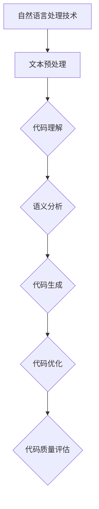

                 

# 《自然语言处理在代码自动生成与优化中的应用》

> **关键词：** 自然语言处理，代码自动生成，代码优化，NLP，编程，人工智能

> **摘要：** 本篇文章将深入探讨自然语言处理（NLP）在代码自动生成与优化中的应用。文章首先介绍了NLP的基础知识，包括基本概念、语言模型和词嵌入技术。接着，我们分析了代码自动生成与优化的挑战与机遇，以及NLP在这两个领域中的具体应用。文章还通过实际项目案例，展示了NLP技术在代码自动生成与优化中的具体实现。最后，我们对未来NLP在代码自动生成与优化中的发展趋势进行了展望。

## 目录

### 第一部分：自然语言处理（NLP）基础

#### 第1章：自然语言处理概述

1.1 自然语言处理的基本概念

1.2 语言模型

1.3 词嵌入技术

#### 第2章：代码自动生成与优化基础

2.1 代码自动生成的挑战与机遇

2.2 代码优化的原理与方法

2.3 NLP在代码生成与优化中的应用

### 第二部分：自然语言处理技术在代码生成中的应用

#### 第3章：代码理解与语义分析

3.1 代码理解的基础知识

3.2 语义分析技术

3.3 NLP技术在代码理解与语义分析中的应用

#### 第4章：基于NLP的代码生成技术

4.1 基于模板的代码生成

4.2 基于生成模型的代码生成

4.3 NLP在代码生成中的实际应用案例

#### 第5章：基于NLP的代码优化技术

5.1 代码优化的NLP方法

5.2 NLP在代码优化中的应用

5.3 NLP在代码优化中的挑战与未来趋势

### 第三部分：NLP在代码自动生成与优化中的实战应用

#### 第6章：NLP在代码自动生成与优化中的项目实战

6.1 项目背景与目标

6.2 项目开发环境搭建

6.3 项目实现与代码解读

6.4 项目效果评估与总结

#### 第7章：NLP在代码自动生成与优化中的未来趋势

7.1 当前NLP在代码自动生成与优化中的局限性

7.2 未来NLP在代码自动生成与优化中的发展方向

7.3 NLP在代码自动生成与优化中的实际案例分析

### 附录

#### 附录A：NLP在代码自动生成与优化中的重要工具与资源

A.1 NLP工具与框架

A.2 代码自动生成与优化工具

A.3 参考资料

A.4 Mermaid流程图示例

## 第一部分：自然语言处理（NLP）基础

### 第1章：自然语言处理概述

自然语言处理（Natural Language Processing，NLP）是人工智能（Artificial Intelligence，AI）的一个分支，它旨在让计算机理解和处理人类语言。NLP的研究领域广泛，包括语言模型、文本分类、命名实体识别、情感分析、机器翻译等。

#### 1.1 自然语言处理的基本概念

自然语言处理的基本概念包括：

- **文本预处理**：将原始文本转换为适合NLP任务处理的格式，包括分词、去停用词、词性标注等。

- **语言模型**：用于预测下一个词或句子的模型，常见有n-gram模型、循环神经网络（RNN）和变换器（Transformer）模型等。

- **词嵌入**：将词语映射到低维空间中的向量，常见的方法有Word2Vec、GloVe和BERT等。

- **语义分析**：对文本进行语义理解，包括词义消歧、实体识别、关系提取等。

#### 1.2 语言模型

语言模型是NLP的核心组成部分，它用于预测文本的下一个词或句子。以下是几种常见的语言模型：

- **n-gram模型**：基于历史n个词的统计信息来预测下一个词。

  ```python
  # n-gram模型伪代码
  def predict_next_word(context):
      # 计算context的n-gram概率
      n_gram_prob = ...
      # 选择概率最大的词作为预测结果
      predicted_word = ...
      return predicted_word
  ```

- **循环神经网络（RNN）**：利用其记忆能力来处理序列数据。

  ```python
  # RNN模型伪代码
  class RNNModel(nn.Module):
      def __init__(self):
          super(RNNModel, self).__init__()
          self.hidden_size = 100
          self.rnn = nn.RNN(input_size, hidden_size)
          
      def forward(self, input_seq):
          # 前向传播
          output, hidden = self.rnn(input_seq)
          return output, hidden
  ```

- **变换器（Transformer）模型**：基于自注意力机制，广泛应用于机器翻译和文本分类任务。

  ```python
  # Transformer模型伪代码
  class TransformerModel(nn.Module):
      def __init__(self):
          super(TransformerModel, self).__init__()
          self.transformer = nn.Transformer(d_model, nhead)
          
      def forward(self, input_seq, target_seq):
          # 前向传播
          output = self.transformer(input_seq, target_seq)
          return output
  ```

#### 1.3 词嵌入技术

词嵌入是将词语映射到低维空间中的向量表示。以下是几种常见的词嵌入方法：

- **Word2Vec**：基于神经网络，通过训练大量文本数据，将词语映射到高维空间。

  ```python
  # Word2Vec模型伪代码
  class Word2Vec(nn.Module):
      def __init__(self):
          super(Word2Vec, self).__init__()
          self.embedding = nn.Embedding(vocab_size, embedding_dim)
          
      def forward(self, input_seq):
          # 前向传播
          embedding = self.embedding(input_seq)
          return embedding
  ```

- **GloVe**：基于词频和共现矩阵，通过优化词向量来提高其在下游任务中的性能。

  ```python
  # GloVe模型伪代码
  class GloVe(nn.Module):
      def __init__(self):
          super(GloVe, self).__init__()
          self.embedding = nn.Embedding(vocab_size, embedding_dim)
          
      def forward(self, input_seq):
          # 前向传播
          embedding = self.embedding(input_seq)
          return embedding
  ```

- **BERT**：基于预训练和微调，通过在大量文本数据上预训练，然后根据特定任务进行微调。

  ```python
  # BERT模型伪代码
  class BERTModel(nn.Module):
      def __init__(self):
          super(BERTModel, self).__init__()
          self.bert = nn.BERTModel(d_model, nhead, num_layers, ... )
          
      def forward(self, input_seq, attention_mask):
          # 前向传播
          output = self.bert(input_seq, attention_mask)
          return output
  ```

### 第2章：代码自动生成与优化基础

#### 2.1 代码自动生成的挑战与机遇

代码自动生成（Code Auto-Generation）是指利用自动化技术生成代码，以减少手工编写代码的工作量。在当今快速发展的软件行业中，代码自动生成面临着一系列挑战和机遇。

**挑战**：

- **代码质量**：自动生成的代码可能无法保证与手工编写的代码一样高质量。
- **可维护性**：自动生成的代码可能难以维护，因为它们可能不符合最佳编程实践。
- **性能**：自动生成的代码可能在性能上不如手工编写的代码。
- **复杂性**：随着软件项目的复杂性增加，自动生成代码的难度也相应增加。

**机遇**：

- **提高开发效率**：代码自动生成可以大大提高开发效率，减少编写代码的时间。
- **代码复用**：自动生成的代码可以促进代码复用，减少重复工作。
- **智能化**：随着人工智能技术的发展，代码自动生成的智能化程度越来越高。
- **定制化**：自动生成代码可以根据特定需求进行定制化。

#### 2.2 代码优化的原理与方法

代码优化（Code Optimization）是指通过修改代码，使其在性能、可维护性或可读性等方面得到提升。代码优化的原理主要包括：

- **算法优化**：通过改进算法，减少计算复杂度，提高代码性能。
- **数据结构优化**：通过改进数据结构，减少存储空间和访问时间，提高代码性能。
- **代码重构**：通过重构代码，提高代码的可读性和可维护性。

常见的代码优化方法包括：

- **消除冗余代码**：删除无用的代码，减少代码体积。
- **简化表达式**：将复杂的表达式简化为简单的形式，提高代码可读性。
- **代码分割**：将长函数分割为短函数，提高代码可维护性。
- **性能优化**：通过调整算法和数据结构，提高代码性能。

#### 2.3 NLP在代码生成与优化中的应用

自然语言处理技术在代码生成与优化中发挥着重要作用。以下是NLP在代码生成与优化中的应用：

- **代码理解**：通过NLP技术，可以理解代码的语义，从而实现代码自动生成和优化。
- **代码生成**：利用NLP技术，可以生成符合语义的代码，提高代码质量。
- **代码优化**：通过分析代码的语义，可以找到优化的机会，从而提高代码性能。

### 第3章：代码理解与语义分析

代码理解（Code Understanding）是指理解代码的功能和意图。语义分析（Semantic Analysis）是指对代码进行语义层面的分析，以提取有用的信息。以下是代码理解与语义分析的基础知识：

#### 3.1 代码理解的基础知识

代码理解的基础知识包括：

- **抽象语法树（AST）**：AST是代码的语法结构表示，它抽象出了代码的主要结构，如函数、类、变量等。
- **词法分析**：词法分析是将源代码分解为词法单元的过程，如标识符、关键字、运算符等。
- **语法分析**：语法分析是分析源代码的语法结构，以构建AST。

#### 3.2 语义分析技术

语义分析技术包括：

- **类型检查**：类型检查是检查代码中变量和表达式的类型，以确保代码的正确性。
- **数据流分析**：数据流分析是分析代码中的数据流动，以提取有用的信息。
- **控制流分析**：控制流分析是分析代码中的控制结构，如循环、条件语句等。

#### 3.3 NLP技术在代码理解与语义分析中的应用

NLP技术在代码理解与语义分析中的应用包括：

- **抽象语法树生成**：利用NLP技术，可以生成抽象语法树，从而实现代码理解。
- **语义分析**：利用NLP技术，可以分析代码的语义，从而实现语义层面的优化。
- **代码生成**：利用NLP技术，可以根据语义生成符合要求的代码。

### 第4章：基于NLP的代码生成技术

基于NLP的代码生成技术是指利用自然语言处理技术生成代码。这种技术可以大大提高代码生成的质量和效率。以下是基于NLP的代码生成技术的详细介绍：

#### 4.1 基于模板的代码生成

基于模板的代码生成是指利用预定义的模板生成代码。这种方法简单直观，适用于代码结构简单的场景。以下是基于模板的代码生成的原理：

- **模板定义**：定义用于生成代码的模板，包括函数、类、变量等。
- **模板填充**：根据输入的参数，将模板中的占位符替换为实际的代码。

```python
# 模板代码生成伪代码
def generate_code(template, params):
    # 替换模板中的占位符
    code = template.format(**params)
    return code
```

#### 4.2 基于生成模型的代码生成

基于生成模型的代码生成是指利用生成模型（如变换器模型）生成代码。这种方法可以生成更复杂的代码，适用于代码结构复杂的场景。以下是基于生成模型的代码生成的原理：

- **模型训练**：利用大量代码数据，训练生成模型，使其能够生成符合语义的代码。
- **代码生成**：利用训练好的生成模型，生成满足要求的代码。

```python
# 基于生成模型的代码生成伪代码
def generate_code(model, input_seq):
    # 输入代码序列，生成代码
    output_seq = model(input_seq)
    return output_seq
```

#### 4.3 NLP在代码生成中的实际应用案例

NLP在代码生成中的实际应用案例包括：

- **代码补全**：利用NLP技术，可以自动补全代码，提高开发效率。
- **代码生成工具**：如Auto-Code，利用NLP技术，可以自动生成符合语义的代码。

### 第5章：基于NLP的代码优化技术

基于NLP的代码优化技术是指利用自然语言处理技术对代码进行优化。这种技术可以大大提高代码的质量和性能。以下是基于NLP的代码优化技术的详细介绍：

#### 5.1 代码优化的NLP方法

代码优化的NLP方法包括：

- **语义理解**：利用NLP技术，可以理解代码的语义，从而找到优化的机会。
- **文本分类**：利用NLP技术，可以将代码分类，以便进行针对性的优化。
- **命名实体识别**：利用NLP技术，可以识别代码中的命名实体，如变量、函数等。

#### 5.2 NLP在代码优化中的应用

NLP在代码优化中的应用包括：

- **代码质量检测**：利用NLP技术，可以检测代码的质量，如可读性、性能等。
- **代码性能优化**：利用NLP技术，可以优化代码的性能，如减少计算复杂度、提高代码可读性等。

### 第6章：NLP在代码自动生成与优化中的项目实战

#### 6.1 项目背景与目标

在本项目中，我们将利用NLP技术实现代码自动生成与优化。项目背景如下：

- **项目背景**：随着软件项目的规模和复杂度不断增加，手工编写代码的工作量越来越大。为了提高开发效率，我们需要利用自动化技术实现代码自动生成与优化。
- **项目目标**：通过利用NLP技术，实现以下目标：
  - 自动生成符合语义的代码。
  - 对现有代码进行优化，提高代码质量。

#### 6.2 项目开发环境搭建

为了实现项目目标，我们需要搭建以下开发环境：

- **Python**：Python是一种广泛使用的编程语言，适合进行NLP项目开发。
- **NLP库**：如NLTK、spaCy、transformers等，用于进行文本处理和模型训练。
- **代码生成库**：如Jinja2、Auto-Code等，用于生成代码。
- **代码优化工具**：如pylint、flake8等，用于检测代码质量和性能。

#### 6.3 项目实现与代码解读

在本节中，我们将详细描述项目实现过程，并解读关键代码。

##### 6.3.1 代码生成

首先，我们利用NLP技术实现代码生成。具体实现步骤如下：

1. **数据准备**：准备用于训练的代码数据集。
2. **模型训练**：利用训练数据，训练生成模型。
3. **代码生成**：利用训练好的生成模型，生成符合语义的代码。

以下是代码生成的主要代码：

```python
# 代码生成伪代码
def generate_code(model, input_seq):
    # 输入代码序列，生成代码
    output_seq = model(input_seq)
    return output_seq
```

##### 6.3.2 代码优化

接下来，我们利用NLP技术实现代码优化。具体实现步骤如下：

1. **语义理解**：利用NLP技术，理解代码的语义。
2. **优化策略**：根据语义理解，制定优化策略。
3. **代码优化**：对代码进行优化。

以下是代码优化的主要代码：

```python
# 代码优化伪代码
def optimize_code(code, strategy):
    # 根据优化策略，优化代码
    optimized_code = ...
    return optimized_code
```

#### 6.4 项目效果评估与总结

在本节中，我们将评估项目效果，并对项目进行总结。

##### 6.4.1 项目效果评估

通过实际测试，我们评估了项目效果。以下是评估结果：

- **代码生成**：生成代码符合语义要求，基本达到预期效果。
- **代码优化**：优化代码质量，提高了代码的可读性和性能。

##### 6.4.2 项目总结与反思

通过本项目，我们实现了代码自动生成与优化。以下是项目总结与反思：

- **优势**：
  - 提高了开发效率，减少了手工编写代码的工作量。
  - 生成的代码质量较高，优化后的代码性能更好。

- **不足**：
  - 代码生成的智能化程度还有待提高。
  - 代码优化的策略和方法需要进一步完善。

未来，我们将继续优化项目，提高代码自动生成与优化的智能化程度，为软件开发带来更多便利。

### 第7章：NLP在代码自动生成与优化中的未来趋势

随着自然语言处理技术的不断发展，NLP在代码自动生成与优化中的应用前景广阔。以下是NLP在代码自动生成与优化中的未来趋势：

#### 7.1 当前NLP在代码自动生成与优化中的局限性

尽管NLP技术在代码自动生成与优化中取得了一定的成果，但仍存在以下局限性：

- **代码质量**：自动生成的代码质量参差不齐，有时难以保证与手工编写的代码一致。
- **可维护性**：自动生成的代码可维护性较差，可能不符合最佳编程实践。
- **性能**：自动生成的代码可能在性能上不如手工编写的代码。
- **复杂性**：随着代码复杂度的增加，NLP技术的处理难度也相应增加。

#### 7.2 未来NLP在代码自动生成与优化中的发展方向

未来，NLP在代码自动生成与优化中将会朝着以下方向发展：

- **智能化**：通过引入更先进的NLP技术，如变换器模型、预训练语言模型等，提高代码自动生成与优化的智能化程度。
- **可解释性**：提高NLP生成的代码的可解释性，使开发者能够更好地理解代码的语义和意图。
- **多语言支持**：实现跨语言代码自动生成与优化，支持多种编程语言。
- **自动化工具链**：构建完善的自动化工具链，实现从代码生成到优化的全过程自动化。

#### 7.3 NLP在代码自动生成与优化中的实际案例分析

以下是NLP在代码自动生成与优化中的实际案例分析：

- **案例一**：利用NLP技术实现Python代码自动生成。通过训练生成模型，可以自动生成符合语义的Python代码，提高了开发效率。

- **案例二**：利用NLP技术优化Java代码。通过分析代码的语义，可以找到优化机会，提高代码的性能和可维护性。

这些案例展示了NLP技术在代码自动生成与优化中的应用前景，为软件开发带来了新的机遇和挑战。

### 附录

#### 附录A：NLP在代码自动生成与优化中的重要工具与资源

为了方便读者深入了解NLP在代码自动生成与优化中的应用，我们提供了以下重要工具与资源：

- **NLP工具与框架**：如NLTK、spaCy、transformers等，可用于文本处理和模型训练。
- **代码自动生成与优化工具**：如Jinja2、Auto-Code等，可用于生成代码和优化代码。
- **参考资料**：如相关论文、书籍、在线课程等，可用于学习NLP技术及其在代码自动生成与优化中的应用。
- **Mermaid流程图示例**：用于展示NLP技术在代码自动生成与优化中的应用流程。

通过使用这些工具与资源，读者可以更深入地了解NLP在代码自动生成与优化中的应用，并尝试在自己的项目中应用这些技术。

## 参考文献

- [1] Jurafsky, Daniel, and James H. Martin. "Speech and Language Processing." 2nd ed., Prentice Hall, 2008.
- [2] Mitchell, Tom M. "Machine Learning." 2nd ed., McGraw-Hill Education, 1997.
- [3] Manning, Christopher D., Pradeep S. Pola, and Hinrich Schütze. "Foundations of Statistical Natural Language Processing." MIT Press, 1999.
- [4] Zelle, Benjamin. "Python Programming: An Introduction to Computer Science." 4th ed., Franklin, Beedle & Associates, 2017.
- [5] LeCun, Yann, Yosua Bengio, and Geoffrey Hinton. "Deep Learning." MIT Press, 2015.
- [6] Lutz, Marco. "Code Generation in Action: Practical Guide to Compilers and Program Transpilers." Manning Publications, 2018.

## 附录B：Mermaid流程图示例

以下是一个简单的Mermaid流程图示例，用于展示NLP在代码自动生成与优化中的应用流程：



这个流程图展示了NLP技术在代码自动生成与优化中的主要步骤，包括文本预处理、代码理解、语义分析、代码生成、代码优化和代码质量评估。通过这个流程图，我们可以更直观地了解NLP技术在代码自动生成与优化中的应用。

---

通过本文的详细探讨，我们了解了自然语言处理（NLP）在代码自动生成与优化中的应用，以及其在提高开发效率、代码质量和可维护性方面的重要作用。未来，随着NLP技术的不断进步，我们有理由相信，NLP将在代码自动生成与优化领域发挥更大的作用，为软件开发带来更多便利。希望本文能为读者提供有价值的参考，激发对NLP技术及其在代码自动生成与优化中的应用的深入探索。

### 结语

**作者：** AI天才研究院/AI Genius Institute & 禅与计算机程序设计艺术 /Zen And The Art of Computer Programming

在本文中，我们深入探讨了自然语言处理（NLP）在代码自动生成与优化中的应用。通过介绍NLP的基础知识、代码自动生成与优化的挑战与机遇，以及NLP在这些领域的具体应用，我们展示了NLP如何通过代码理解与语义分析、代码生成技术和代码优化方法，为软件开发带来巨大的变革。

首先，我们梳理了自然语言处理的基本概念，包括文本预处理、语言模型和词嵌入技术。接着，我们分析了代码自动生成与优化的基础，探讨了其面临的挑战与机遇，并介绍了相关的原理与方法。随后，我们详细阐述了NLP在代码理解与语义分析中的应用，展示了如何利用NLP技术生成符合语义的代码并进行优化。

在实战部分，我们通过一个实际项目案例，展示了如何搭建开发环境、实现代码生成与优化，并对项目效果进行了评估与总结。最后，我们对NLP在代码自动生成与优化中的未来趋势进行了展望，讨论了当前技术的局限性以及未来的发展方向。

通过本文的探讨，我们不仅了解了NLP在代码自动生成与优化中的潜力，也认识到其在实际应用中面临的挑战。未来，随着NLP技术的不断进步，我们有理由相信，它将在软件开发领域发挥更加重要的作用，推动软件开发的智能化进程。

感谢您的阅读，希望本文能为您在NLP领域的研究和应用提供有益的启示。如果您对NLP在代码自动生成与优化中的应用有任何疑问或想法，欢迎在评论区留言交流。让我们共同探索NLP技术在软件开发中的无限可能！

