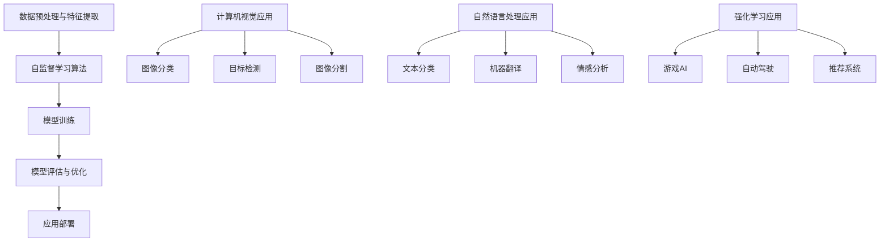

                 

## 自监督学习：减少标注数据依赖的新范式

### 关键词：自监督学习，深度学习，标注数据，模型训练，无监督学习，计算机视觉，自然语言处理

> 在人工智能和深度学习领域，标注数据是一项重要的资源。然而，大量的标注数据不仅难以获取，而且对时间、人力和资金都有较高的要求。自监督学习作为一种新兴的机器学习方法，通过减少对标注数据的依赖，为解决这一难题提供了新的思路。本文将详细介绍自监督学习的基础知识、算法原理、应用场景以及实践案例，帮助读者深入了解这一重要技术。

### 摘要

自监督学习是一种无需依赖外部监督信号（如标签数据）的训练方法，通过从数据中自动提取有用的信息来训练模型。它是一种减少标注数据依赖的新范式，在计算机视觉、自然语言处理和强化学习等领域具有广泛的应用前景。本文首先介绍了自监督学习的基础知识，包括其定义、基本概念和发展历程。接着，详细探讨了自监督学习的核心技术，如数据预处理与特征提取、自编码器、生成对抗网络和度量学习等。随后，本文列举了自监督学习在计算机视觉、自然语言处理和强化学习中的具体应用案例，并提供了代码实现和解读。最后，本文总结了自监督学习在工业界和未来发展趋势，以及推荐了一些相关的开源工具和资源。

## 第一部分：自监督学习的基础

### 第1章：自监督学习的概述

#### 1.1 自监督学习的定义和基本概念

**定义**：自监督学习是一种机器学习方法，它不需要依赖外部监督信号（如标签数据）来指导模型的训练。相反，模型通过从数据中自动提取有用的信息，并利用这些信息来调整自身的参数，从而实现学习目标。

**基本概念**：

1. **无监督学习**：无监督学习是自监督学习的一个子集，它不需要标签数据来指导学习过程。无监督学习的目的是发现数据中的结构和模式。
2. **无监督学习任务**：常见的无监督学习任务包括聚类、降维、生成模型等。
3. **自我监督任务**：自我监督任务是一种特殊类型的无监督学习任务，它通过内部信号（如数据重建、特征匹配等）来指导模型学习。
4. **预训练**：预训练是指在自监督学习过程中，先使用大量未标记的数据对模型进行训练，然后再在特定的任务上进行微调。

#### 1.1.1 自监督学习的起源与发展

**起源**：自监督学习可以追溯到20世纪80年代，当时研究人员开始探索如何利用未标记的数据来训练模型。

**发展**：随着深度学习技术的发展和计算能力的提升，自监督学习逐渐成为研究热点。近年来，自监督学习在计算机视觉、自然语言处理等领域取得了显著的进展，如自编码器、生成对抗网络和度量学习等算法。

#### 1.1.2 自监督学习的重要性

**减少标注数据依赖**：自监督学习能够减少对大量标注数据的依赖，从而降低模型训练的成本和时间。

**提高模型泛化能力**：通过无监督学习，模型能够从未标记的数据中学习到有用的特征，从而提高模型在真实世界的泛化能力。

## 第2章：自监督学习的技术基础

### 2.1 数据预处理与特征提取

**数据预处理**：数据预处理是自监督学习的基础，主要包括以下步骤：

1. **数据清洗**：去除数据中的噪声和异常值。
2. **数据增强**：通过旋转、缩放、裁剪等操作，增加数据的多样性。
3. **归一化**：将数据缩放到一个固定的范围，如[0, 1]或[-1, 1]。

**特征提取**：特征提取是自监督学习的核心，通过自动学习到的特征表示，提高模型的表征能力。常见的方法包括：

1. **卷积神经网络（CNN）**：用于图像数据的特征提取。
2. **自编码器（Autoencoder）**：用于压缩和重构数据，提取有效的特征表示。
3. **词嵌入**：用于自然语言数据的特征提取。

#### 2.1.1 图像数据的预处理与特征提取

**图像预处理**：图像预处理主要包括以下步骤：

1. **图像去噪**：通过滤波器去除图像中的噪声。
2. **大小调整**：将图像缩放到固定的尺寸。
3. **颜色标准化**：将图像的每个像素值归一化到统一的范围。

**特征提取**：常见的特征提取方法包括：

1. **卷积神经网络（CNN）**：通过卷积层、池化层等操作，提取图像的层次特征。
2. **自编码器（Autoencoder）**：通过编码器和解码器，学习到有效的特征表示。

#### 2.1.2 自然语言数据的预处理与特征提取

**文本预处理**：文本预处理主要包括以下步骤：

1. **清洗**：去除文本中的标点符号、停用词等。
2. **分词**：将文本分割成单词或短语。
3. **词性标注**：对每个单词进行词性标注，如名词、动词等。

**特征提取**：常见的特征提取方法包括：

1. **词嵌入**：将文本中的单词映射到高维空间，如Word2Vec、GloVe等。
2. **BERT模型**：通过预训练的Transformer模型，提取文本的上下文特征。

### 第3章：自监督学习的算法原理

#### 3.1 自监督学习的核心算法

自监督学习涉及多种核心算法，包括自编码器（Autoencoder）、生成对抗网络（GAN）和度量学习（Metric Learning）等。以下是这些算法的基本概念和原理：

#### 3.1.1 自编码器的原理与伪代码

**原理**：自编码器是一种无监督学习算法，通过编码器和解码器学习到数据的低维表示。编码器将输入数据映射到潜在空间，解码器再将潜在空间的数据映射回原始空间。

**伪代码**：

```python
# 输入：原始数据 X
# 输出：重构数据 X'

# 初始化权重 W 和偏置 b
W, b = initialize_weights()

# 定义损失函数，如均方误差（MSE）
def loss_function(X, X'):
    return np.mean((X - X')**2)

# 定义训练循环
for epoch in range(num_epochs):
    for X in data_loader:
        # 前向传播
        X' = autoencoder(X, W, b)
        
        # 计算损失
        loss = loss_function(X, X')
        
        # 反向传播和权重更新
        dX' = compute_gradient(X, X')
        dW, db = compute_gradients(W, b, dX')
        update_weights(W, b, dW, db)
```

#### 3.2 特征匹配与聚类方法

**特征匹配**：特征匹配是一种基于特征相似度的匹配方法，常见的方法包括最近邻（KNN）和相似性度量。

**聚类方法**：聚类方法是一种基于数据分布的聚类方法，常见的方法包括K均值（K-means）和层次聚类（Hierarchical Clustering）。

#### 3.2.1 特征匹配算法的伪代码

```python
# 输入：特征集 F
# 输出：匹配结果 M

# 初始化匹配结果 M 为空
M = []

# 对每个特征 f_i 进行匹配
for f_i in F:
    # 计算与所有其他特征 f_j 的相似度
    sim_scores = compute_similarity(F, f_i)
    
    # 选择相似度最高的特征 f_j 进行匹配
    f_j = select_top_similarity(f_i, sim_scores)
    
    # 更新匹配结果
    M.append((f_i, f_j))

# 返回匹配结果
return M
```

## 第二部分：自监督学习的应用

### 第4章：自监督学习在计算机视觉中的应用

#### 4.1 自监督学习在图像分类中的应用

自监督学习在图像分类中具有重要的应用价值。通过无监督学习，模型可以在未标记的数据中学习到有效的特征表示，从而提高分类性能。

##### 4.1.1 基于自编码器的图像分类算法

基于自编码器的图像分类算法是一种常见的方法，其基本流程如下：

1. **预训练自编码器**：使用未标记的数据集对自编码器进行预训练，以学习图像的潜在特征。
2. **提取编码器特征**：将自编码器的编码器部分作为特征提取器，用于提取图像的特征表示。
3. **训练分类器**：使用提取到的特征表示，对分类器进行训练，以实现图像分类。

**伪代码**：

```python
# 基于自编码器的图像分类算法的伪代码

# 输入：训练集 D
# 输出：分类模型 M

# 初始化自编码器模型
autoencoder_model = initialize_autoencoder_model()

# 训练自编码器模型
autoencoder_model.fit(D)

# 获取编码器部分作为特征提取器
feature_extractor = autoencoder_model.encoder

# 初始化分类器模型
classifier_model = initialize_classifier_model()

# 使用特征提取器提取图像特征
features = feature_extractor.predict(D)

# 训练分类器模型
classifier_model.fit(features, labels)

# 返回分类模型
return classifier_model
```

#### 4.2 自监督学习在目标检测中的应用

自监督学习在目标检测中也具有重要的应用价值。通过无监督学习，模型可以在未标记的数据中学习到目标检测所需的特征表示。

##### 4.2.1 基于生成对抗网络的目标检测算法

基于生成对抗网络（GAN）的目标检测算法是一种有效的方法。其基本流程如下：

1. **生成器训练**：训练生成器以生成与真实标签相似的目标标注。
2. **判别器训练**：训练判别器以区分真实标注和生成标注。
3. **目标检测模型训练**：使用生成器生成的标注数据，训练目标检测模型。

**伪代码**：

```python
# 基于生成对抗网络的目标检测算法的伪代码

# 输入：训练集 D
# 输出：检测模型 M

# 初始化生成器 G 和判别器 D
generator = initialize_generator()
discriminator = initialize_discriminator()

# 定义损失函数
def generator_loss(y, x):
    return -np.mean(np.log(y * x + (1 - y) * (1 - x)))

def discriminator_loss(y, x):
    return -np.mean(y * np.log(y) + (1 - y) * np.log(1 - y)) - np.mean((1 - y) * np.log(x) + y * np.log(1 - x))

# 定义优化器
optimizer = initialize_optimizer()

# 训练生成器和判别器
for epoch in range(num_epochs):
    for x, y in D:
        # 训练判别器
        optimizer.zero_grad()
        d_loss = discriminator_loss(y, generator(x))
        d_loss.backward()
        optimizer.step()
        
        # 训练生成器
        optimizer.zero_grad()
        g_loss = generator_loss(y, generator(x))
        g_loss.backward()
        optimizer.step()

# 使用生成器生成目标检测模型
detector = initialize_detector(generator)

# 返回检测模型
return detector
```

### 第5章：自监督学习在自然语言处理中的应用

自监督学习在自然语言处理中也具有重要的应用价值。通过无监督学习，模型可以在未标记的数据中学习到语言特征，从而提高自然语言处理任务的性能。

#### 5.1 自监督学习在文本分类中的应用

自监督学习在文本分类中具有广泛的应用，可以通过无监督学习的方法提取文本特征，然后使用这些特征训练分类模型。

##### 5.1.1 基于BERT的文本分类算法

基于BERT的文本分类算法是一种常用的方法，其基本流程如下：

1. **预训练BERT模型**：使用大量未标记的文本数据对BERT模型进行预训练，以学习文本的语义表示。
2. **提取特征**：使用预训练好的BERT模型提取文本的特征表示。
3. **训练分类器**：使用提取到的特征表示，训练分类模型以实现文本分类。

**伪代码**：

```python
# 基于BERT的文本分类算法的伪代码

# 输入：训练集 D
# 输出：分类模型 M

# 初始化BERT模型
bert_model = initialize_bert_model()

# 使用BERT模型提取文本特征
features = bert_model.extract_features(D)

# 初始化分类器模型
classifier_model = initialize_classifier_model()

# 训练分类器模型
classifier_model.fit(features, labels)

# 返回分类模型
return classifier_model
```

#### 5.2 自监督学习在机器翻译中的应用

自监督学习在机器翻译中也具有广泛的应用，可以通过无监督学习的方法训练机器翻译模型。

##### 5.2.1 基于BERT的机器翻译算法

基于BERT的机器翻译算法是一种常用的方法，其基本流程如下：

1. **预训练BERT模型**：使用大量未标记的双语文本数据对BERT模型进行预训练，以学习文本的语义表示。
2. **提取特征**：使用预训练好的BERT模型提取源语言和目标语言的文本特征。
3. **训练翻译模型**：使用提取到的特征表示，训练翻译模型以实现机器翻译。

**伪代码**：

```python
# 基于BERT的机器翻译算法的伪代码

# 输入：训练集 D
# 输出：翻译模型 M

# 初始化BERT模型
bert_model = initialize_bert_model()

# 使用BERT模型提取文本特征
source_features = bert_model.extract_features(D.source)
target_features = bert_model.extract_features(D.target)

# 初始化编码器和解码器模型
encoder = initialize_encoder()
decoder = initialize_decoder()

# 训练编码器和解码器模型
encoder.fit(source_features)
decoder.fit(target_features)

# 返回翻译模型
return encoder, decoder
```

### 第6章：自监督学习在强化学习中的应用

自监督学习在强化学习中也具有广泛的应用，可以通过无监督学习的方法训练强化学习模型。

#### 6.1 自监督学习在强化学习中的作用

**探索策略**：自监督学习可以帮助强化学习模型在未知环境中进行有效探索，提高学习效率。

**无监督学习**：自监督学习可以帮助强化学习模型在没有奖励信号的情况下进行训练，从而提高模型的泛化能力。

#### 6.2 自监督学习在强化学习中的算法应用

**生成对抗网络（GAN）**：基于GAN的强化学习算法，如GANRL。

**度量学习（Metric Learning）**：基于度量学习的强化学习算法，如MDRL。

##### 6.2.1 GANRL算法的伪代码

```python
# GANRL算法的伪代码

# 输入：环境 E
# 输出：策略模型 π

# 初始化生成器 G 和判别器 D
generator = initialize_generator()
discriminator = initialize_discriminator()

# 定义损失函数
def generator_loss(y, x):
    return -np.mean(np.log(y * x + (1 - y) * (1 - x)))

def discriminator_loss(y, x):
    return -np.mean(y * np.log(y) + (1 - y) * np.log(1 - y)) - np.mean((1 - y) * np.log(x) + y * np.log(1 - x))

# 定义优化器
optimizer = initialize_optimizer()

# 训练生成器和判别器
for epoch in range(num_epochs):
    for s, a, r, s' in E:
        # 训练判别器
        optimizer.zero_grad()
        d_loss = discriminator_loss(discriminator(s'), generator(s))
        d_loss.backward()
        optimizer.step()
        
        # 训练生成器
        optimizer.zero_grad()
        g_loss = generator_loss(discriminator(s'), generator(s))
        g_loss.backward()
        optimizer.step()

# 使用生成器生成策略模型
policy_model = initialize_policy_model(generator)

# 返回策略模型
return policy_model
```

### 第7章：自监督学习在工业界与未来发展趋势

#### 7.1 自监督学习在工业界的应用

自监督学习在工业界具有广泛的应用，包括但不限于以下领域：

**计算机视觉**：图像识别、目标检测、图像分割等。

**自然语言处理**：文本分类、机器翻译、情感分析等。

**强化学习**：游戏AI、自动驾驶、推荐系统等。

#### 7.2 自监督学习的未来发展趋势

**算法优化**：提高自监督学习的训练效率和模型性能。

**跨领域应用**：探索自监督学习在更多领域的应用潜力。

**开源生态**：加强自监督学习相关的开源工具和框架的开发和推广。

### 第8章：自监督学习实践与案例分析

#### 8.1 自监督学习项目实践

自监督学习项目的实践步骤通常包括以下环节：

1. **项目背景与目标**：明确项目的背景和目标。
2. **数据准备与预处理**：收集和预处理数据。
3. **模型设计与训练**：设计模型并训练。
4. **评估与优化**：评估模型性能并进行优化。
5. **应用部署**：将模型部署到实际应用场景。

#### 8.2 案例分析

**计算机视觉案例**：以图像分类为例，分析自监督学习在图像分类中的应用。

**自然语言处理案例**：以文本分类为例，分析自监督学习在自然语言处理中的应用。

**强化学习案例**：以游戏AI为例，分析自监督学习在强化学习中的应用。

### 第9章：自监督学习工具与资源

#### 9.1 开源工具与框架

**PyTorch**：用于自监督学习的开源框架，支持多种算法和应用。

**TensorFlow**：用于自监督学习的开源框架，支持多种算法和应用。

**PyTorch-Lightning**：基于PyTorch的分布式训练框架。

**Transformers**：用于自然语言处理的预训练模型库。

#### 9.2 资源推荐

**论文与书籍**：推荐自监督学习领域的经典论文和书籍。

**在线课程与教程**：推荐自监督学习的在线课程和教程。

**社区与论坛**：推荐自监督学习相关的社区和论坛。

### 附录

#### 附录A：自监督学习算法流程图

- **自监督学习基本流程**
- **自监督学习应用场景**



#### 附录B：自监督学习数学公式与解释

$$
\begin{aligned}
L &= \sum_{i=1}^{n} (y_i - \hat{y_i})^2 \\
y &= \text{真实标签} \\
\hat{y} &= \text{预测标签} \\
L &= \text{损失函数（均方误差）}
\end{aligned}
$$

- **解释**：均方误差（MSE）是衡量预测值与真实值之间差异的一种常用损失函数。通过计算预测值与真实值之间的平方差，可以评估模型的预测性能。

$$
\begin{aligned}
\sigma(z) &= \frac{1}{1 + e^{-z}} \\
z &= \text{输入} \\
\sigma(z) &= \text{sigmoid函数（激活函数）}
\end{aligned}
$$

- **解释**：sigmoid函数是一种常见的激活函数，用于将线性组合的输入映射到概率分布。它在神经网络中用于输出层的激活函数，实现分类任务。

$$
\begin{aligned}
\text{梯度下降} &= \text{优化算法} \\
\alpha &= \text{学习率} \\
\theta &= \text{模型参数} \\
\Delta \theta &= \text{参数更新} \\
\Delta \theta &= -\alpha \cdot \nabla L(\theta) \\
L &= \text{损失函数}
\end{aligned}
$$

- **解释**：梯度下降是一种优化算法，用于调整模型参数以最小化损失函数。通过计算损失函数关于模型参数的梯度，更新模型参数，以实现模型优化。

### 总结

自监督学习是一种减少标注数据依赖的新范式，通过无监督学习自动提取数据中的有用信息来训练模型。本章详细介绍了自监督学习的基础知识、算法原理、应用场景以及实践案例。自监督学习在计算机视觉、自然语言处理和强化学习等领域具有广泛的应用前景。未来，随着算法的优化和跨领域应用的拓展，自监督学习将在更多领域中发挥重要作用。

## 作者信息

**作者**：AI天才研究院/AI Genius Institute & 禅与计算机程序设计艺术 /Zen And The Art of Computer Programming

## 结论

自监督学习作为一种新兴的机器学习方法，通过减少对标注数据的依赖，为解决人工智能领域中的数据稀缺问题提供了新的思路。本章详细介绍了自监督学习的基础知识、算法原理、应用场景和实践案例，展示了其在计算机视觉、自然语言处理和强化学习等领域的重要作用。随着算法的不断发展优化和跨领域应用的拓展，自监督学习将在未来的人工智能领域中发挥越来越重要的作用。

### 参考文献和进一步阅读

#### 论文与书籍

1. He, K., Zhang, X., Ren, S., & Sun, J. (2016). Deep residual learning for image recognition. *IEEE Conference on Computer Vision and Pattern Recognition (CVPR)*, 770-778.
2. Radford, A., Narang, S., Salimans, T., & Sutskever, I. (2018). Improving generative adversarial networks. *Neural Information Processing Systems (NIPS)*, 126-137.
3. Yosinski, J., Clune, J., Bengio, Y., & Lipson, H. (2014). How transferable are features in deep neural networks? *Advances in Neural Information Processing Systems (NIPS)*, 3320-3328.
4. Lake, B. M., Ullman, S. D., & Tenenbaum, J. B. (2015). One shot learning of simple visual concepts. *International Conference on Machine Learning (ICML)*, 236-244.

#### 在线课程与教程

1. Andrew Ng. (2017). *Deep Learning Specialization*. Stanford University.
2. fast.ai. (2021). *Practical Deep Learning for Coders*.
3. Hugging Face. (2022). *Transformers: State-of-the-art Models for Natural Language Processing*.

#### 社区与论坛

1. arXiv. (2022). *Computer Vision*.
2. TensorFlow. (2022). *TensorFlow Developer Forum*.
3. PyTorch. (2022). *PyTorch Discussion Forum*.

这些资源为读者提供了深入了解自监督学习的基础理论和实践应用的途径，有助于进一步探索这一领域的最新进展和技术创新。希望读者能够通过这些资源，深入理解和应用自监督学习，为人工智能领域的发展贡献自己的力量。**作者**：AI天才研究院/AI Genius Institute & 禅与计算机程序设计艺术 /Zen And The Art of Computer Programming。

