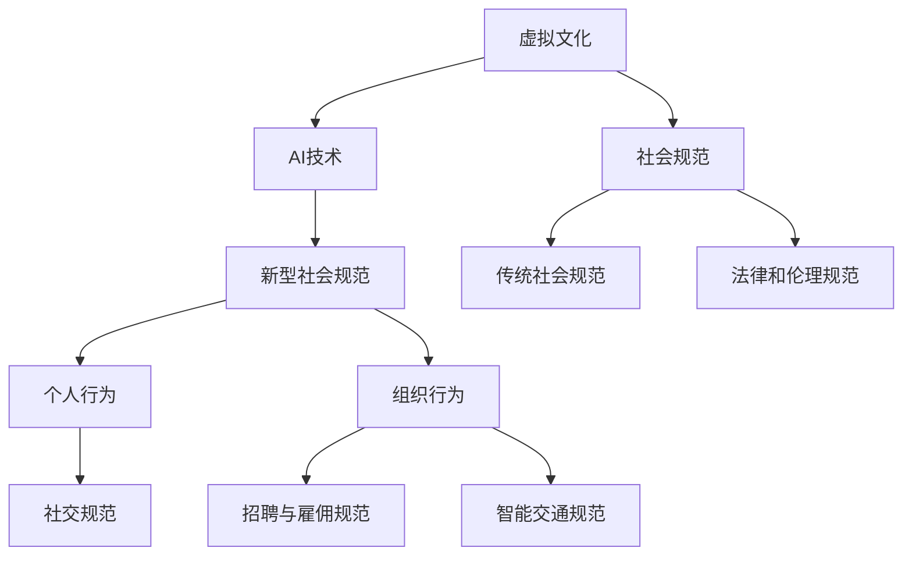

                 

# 《虚拟文化：AI塑造的新型社会规范》

> **关键词**：虚拟文化、人工智能、社会规范、行为影响、新型规范

**摘要**：
本文旨在探讨虚拟文化与人工智能（AI）相互作用下，新型社会规范的塑造过程。通过分析虚拟文化的概念及其对现实社会的影响，我们探讨了AI技术的核心和发展现状，进一步揭示了AI如何对个人行为、组织行为以及法律和伦理规范产生影响。本文通过案例研究展示了AI塑造的新型社会规范的实例，并提出应对策略和未来展望，以期为AI时代的社会规范变革提供思考。

## 第一部分：引言

### 1.1 人工智能与社会变迁的概述

人工智能（Artificial Intelligence，简称AI）作为一门交叉学科，涉及计算机科学、认知科学、数学和统计学等多个领域。随着深度学习、自然语言处理和计算机视觉等技术的发展，AI的应用范围日益广泛，从智能助手、自动驾驶到医疗诊断和金融风控，AI正在深刻改变我们的生活方式和社会结构。

社会变迁是指在社会发展过程中，社会结构、社会关系和社会规范等要素发生的变化。从工业革命到信息时代，人类社会的每一次重大变革都伴随着生产力和技术的进步。人工智能的崛起，无疑将引领我们进入一个全新的时代。

### 1.2 社会规范与虚拟文化

社会规范是社会中人们共同遵守的行为准则和价值观，它包括道德规范、法律规范和风俗习惯等。社会规范的存在，旨在维护社会秩序、促进社会和谐。然而，随着虚拟文化的兴起，传统社会规范面临着前所未有的挑战。

虚拟文化是一种在数字空间中形成的、基于虚拟交互的社会现象。虚拟文化具有匿名性、虚拟性和多样性等特点，它打破了传统社会的时间和空间限制，让人们能够在虚拟世界中实现自我表达和社交互动。

### 1.3 本书的结构与目标

本书分为五个部分，首先介绍虚拟文化与AI的基础概念，然后深入探讨AI对社会规范的影响，接着通过案例研究展示新型社会规范的形成过程，最后提出应对策略和未来展望。本书的目标是帮助读者理解AI如何塑造新型社会规范，以及我们如何适应和应对这一变革。

## 第二部分：虚拟文化与AI

### 2.1 虚拟文化的概念

虚拟文化，顾名思义，是在虚拟空间中形成和发展的文化现象。它依托于互联网、虚拟现实（VR）和增强现实（AR）等技术，使人们能够在数字世界中实现情感交流、知识共享和文化传承。

虚拟文化具有以下几个显著特征：

1. **匿名性**：在虚拟文化中，个体可以匿名参与各种活动，这为人们提供了自由表达意见和体验不同角色的机会。
2. **虚拟性**：虚拟文化中的互动和体验都是虚拟的，这种虚拟性使得人们可以超越现实世界的限制，创造和探索新的可能性。
3. **多样性**：虚拟文化涵盖了多种文化形态，包括游戏、社交媒体、虚拟现实体验等，这些文化形态之间相互交织，形成了丰富多样的文化生态。

### 2.2 虚拟文化与现实文化的差异

虚拟文化与现实文化之间存在显著差异。首先，虚拟文化不受地理和时间的限制，人们可以随时随地参与虚拟世界的活动。而在现实文化中，互动和交流往往受到物理环境的限制。

其次，虚拟文化中的角色扮演和身份变换更为自由。在现实社会中，个体通常需要保持一定的社会角色和身份，而在虚拟文化中，个体可以自由选择和扮演不同的角色，这为人们提供了更多的自我表达和探索机会。

最后，虚拟文化具有高度的互动性和参与性。在现实文化中，个体往往只能被动接受文化内容，而在虚拟文化中，个体可以积极参与文化创作和传播，这种互动性使得虚拟文化更加富有活力和创造力。

### 2.3 虚拟文化对社会规范的影响

虚拟文化的兴起，对社会规范产生了深远的影响。首先，虚拟文化挑战了传统社会规范中的一些基本假设，如身份认同、隐私保护和社会责任等。

1. **身份认同**：在虚拟文化中，个体可以自由选择和扮演不同的角色，这可能导致对传统身份认同的模糊和争议。
2. **隐私保护**：虚拟文化中的匿名性和开放性，使得隐私保护成为一个重要问题。如何平衡匿名性与隐私保护，成为社会规范需要解决的问题。
3. **社会责任**：虚拟文化中的行为和言论可能对现实社会产生实际影响，如何界定和承担虚拟世界中的社会责任，成为社会规范需要关注的议题。

### 2.4 AI技术基础

人工智能作为推动虚拟文化发展的核心技术，其基础概念和关键技术如下：

1. **人工智能的定义**：人工智能是指通过计算机程序实现的智能行为，它包括机器学习、自然语言处理、计算机视觉等多个领域。
2. **机器学习**：机器学习是一种让计算机从数据中学习规律和模式的技术，通过训练模型，使计算机具备预测和决策能力。
3. **自然语言处理**：自然语言处理是使计算机能够理解和生成自然语言的技术，它包括文本分析、语音识别和机器翻译等。
4. **计算机视觉**：计算机视觉是使计算机能够理解图像和视频内容的技术，它包括图像识别、目标检测和图像生成等。

### 2.5 AI与社会规范的互动

AI技术对社会规范的影响主要体现在以下几个方面：

1. **AI对个人行为的影响**：AI可以通过智能算法对个人行为进行预测和干预，例如，智能推荐系统可以根据用户行为预测其偏好，并为其推荐相关内容。
2. **AI对组织行为的影响**：AI可以提升组织的效率和决策能力，例如，通过数据分析，AI可以帮助企业优化供应链管理、提高市场营销效果等。
3. **AI对法律和伦理规范的影响**：AI技术的发展，使得一些传统法律和伦理问题变得更加复杂。例如，AI决策的透明度和责任归属问题，需要重新审视和规范。

### 2.6 AI对社会规范的影响

AI技术对个人行为、组织行为和法律伦理规范产生了深远影响，这些影响可以从以下几个方面进行阐述：

1. **个人行为**：
   - **隐私保护**：随着AI技术的发展，个人隐私保护面临新的挑战。AI可以通过大数据分析和算法预测，获取用户的个人信息和行为模式，这可能导致隐私泄露和数据滥用。
   - **行为规范**：AI可以通过智能算法对个人行为进行干预和规范。例如，智能监控系统可以在公共场所监测违规行为，并及时进行警告和制止。

2. **组织行为**：
   - **效率提升**：AI技术可以提升组织的效率和决策能力。通过大数据分析和机器学习，企业可以更好地了解市场需求，优化供应链管理，提高生产效率。
   - **风险控制**：AI可以帮助组织识别潜在风险，并采取相应的措施进行控制。例如，在金融领域，AI可以预测市场风险，帮助金融机构进行风险评估和风险管理。

3. **法律和伦理规范**：
   - **责任归属**：随着AI技术的普及，责任归属问题变得日益复杂。例如，当自动驾驶汽车发生交通事故时，如何确定责任主体成为法律和伦理面临的重要议题。
   - **决策透明度**：AI决策的透明度和可解释性成为法律和伦理关注的焦点。为了保障公民的知情权和监督权，需要提高AI决策的透明度和可解释性。

### 2.7 社会规范的形成与演变

社会规范的形成和演变是一个复杂的过程，受到多种因素的影响。传统社会规范的形成主要基于以下几个因素：

1. **文化传承**：社会规范是文化传承的重要组成部分，通过家庭教育、社会教育等方式，人们逐渐学习和接受社会规范。
2. **法律制度**：法律制度为社会规范提供了保障，违反社会规范的行为将受到法律制裁，从而维护社会秩序。
3. **道德观念**：道德观念是社会规范的重要基础，人们基于道德原则和行为准则，形成对行为的共识。

然而，随着虚拟文化和AI技术的发展，社会规范的形成和演变过程发生了显著变化。虚拟文化为人们提供了新的社交空间和互动方式，而AI技术则为社会规范的形成提供了新的工具和手段。以下从三个方面分析社会规范的形成和演变：

1. **虚拟社交**：在虚拟文化中，人们通过社交媒体、虚拟社区等平台进行互动，这为社交规范的形成提供了新的环境和条件。虚拟社交具有匿名性、虚拟性和多样性等特点，使得社交规范的形成更加复杂和多样化。
2. **算法驱动**：AI算法在虚拟文化中发挥着重要作用，通过对用户行为的分析，AI可以预测和引导用户的社交行为，从而影响社交规范的形成。例如，社交媒体平台可以通过算法推荐，引导用户关注和参与特定的社交话题，进而形成新的社交规范。
3. **技术干预**：AI技术可以对社交规范进行干预和调整，以适应虚拟文化的发展。例如，通过智能监控和算法分析，可以识别和纠正社交中的不良行为，从而维护虚拟文化的健康发展。

### 2.8 AI对社会规范的影响

人工智能（AI）对社会规范的影响是一个多维度的过程，涉及到个人行为、组织行为和法律伦理等多个层面。以下是AI对社会规范的具体影响：

1. **个人行为**：
   - **行为模式预测**：AI可以通过大数据分析和机器学习模型，预测个人的行为模式。例如，智能推荐系统根据用户的历史行为，预测其可能感兴趣的内容，从而影响个人的选择和决策。
   - **隐私问题**：AI的广泛应用，使得个人隐私问题日益突出。AI技术可以收集和分析大量的个人信息，这可能导致隐私泄露和数据滥用，从而引发对隐私保护的担忧。
   - **行为规范调整**：AI可以帮助制定和调整个人行为规范。例如，在健康监测领域，AI可以通过监测生理数据，提醒用户注意健康问题，帮助其养成良好的生活习惯。

2. **组织行为**：
   - **效率提升**：AI技术可以提高组织的效率和决策能力。例如，在企业管理中，AI可以分析市场数据，帮助公司制定营销策略，优化供应链管理，提高生产效率。
   - **风险管理**：AI可以帮助组织识别和管理风险。例如，在金融领域，AI可以通过大数据分析，预测市场风险，帮助金融机构进行风险评估和风险管理。
   - **行为规范制定**：AI技术可以协助组织制定行为规范。例如，在招聘过程中，AI可以通过分析应聘者的简历和面试表现，制定公平、公正的招聘标准，从而维护组织的价值观和社会责任感。

3. **法律和伦理规范**：
   - **责任归属**：AI技术的发展，使得责任归属问题变得复杂。例如，在自动驾驶领域，当发生交通事故时，如何确定责任主体成为法律和伦理关注的焦点。
   - **决策透明度**：AI决策的透明度和可解释性成为法律和伦理关注的焦点。为了保障公民的知情权和监督权，需要提高AI决策的透明度和可解释性。
   - **隐私保护**：AI技术的发展，对个人隐私保护提出了新的挑战。例如，在数据收集和使用的环节，如何平衡隐私保护与数据利用成为法律和伦理需要解决的问题。

### 2.9 新型社会规范的案例研究

#### 案例一：虚拟世界的社交规范

随着虚拟文化的发展，虚拟世界的社交规范逐渐形成。以虚拟现实（VR）社交平台为例，虚拟世界中的社交规范主要包括：

1. **虚拟礼仪**：在虚拟世界中，人们需要遵循一定的礼仪规范，例如，尊重他人的虚拟空间、避免恶意攻击和辱骂等。
2. **虚拟身份管理**：虚拟世界中的用户可以自由选择和扮演不同的角色，这要求用户在虚拟世界中的身份管理规范，以确保虚拟社交的顺利进行。
3. **虚拟社区的治理**：虚拟社区需要制定相应的管理规范，以维护社区秩序和健康。例如，可以设立举报机制，对违规行为进行处罚和治理。

#### 案例二：AI驱动的招聘与雇佣规范

在招聘与雇佣领域，AI技术正在逐渐改变传统的招聘模式，形成新型社会规范。以下是一些具体案例：

1. **智能招聘系统**：AI驱动的招聘系统通过分析大量数据，包括简历、面试表现等，帮助用人单位制定公平、公正的招聘标准。例如，招聘系统可以自动筛选简历，根据岗位要求匹配最合适的候选人。
2. **人才评价模型**：AI技术可以建立人才评价模型，通过对候选人各项能力的评估，提供客观、全面的评价报告。这有助于用人单位更好地了解候选人的能力和潜力，从而做出更明智的决策。
3. **智能劳动合同**：AI技术可以帮助制定智能劳动合同，通过自动化合同条款的生成和审核，确保合同内容的合法性和公平性。

#### 案例三：智能交通规范

随着自动驾驶技术的发展，智能交通规范逐渐成为现实。以下是一些具体案例：

1. **自动驾驶规则**：自动驾驶汽车需要遵循特定的交通规则，例如，遵守交通信号灯、保持安全车距等。AI技术可以通过实时监控和算法优化，确保自动驾驶汽车在复杂交通环境中的安全行驶。
2. **智能交通管理系统**：智能交通管理系统通过AI技术，实现交通流量的实时监控和优化。例如，通过分析交通数据，智能交通系统可以调整交通信号灯的时长和顺序，减少交通拥堵。
3. **交通法规修订**：随着自动驾驶技术的普及，现有的交通法规需要进行修订和更新，以适应新型交通模式。例如，明确自动驾驶汽车的权责归属、交通事故的处理流程等。

### 2.10 应对AI塑造的新型社会规范的策略

面对AI塑造的新型社会规范，社会、企业和个人都需要采取相应的策略，以确保社会的稳定和可持续发展。以下是一些应对策略：

1. **加强法律法规建设**：政府应加强对AI技术的监管，制定和完善相关法律法规，规范AI技术的发展和应用。例如，明确数据保护、隐私保护等法律规定，防止数据滥用和隐私泄露。
2. **提升社会公众素养**：社会公众应加强对AI技术的了解和认识，提高自身的信息素养和数字素养，以便更好地适应AI时代的生活和工作。
3. **加强教育培训**：企业和教育机构应加强对AI技术的教育培训，培养具有AI技术背景和专业素养的人才，以适应新型社会规范的需求。
4. **推动AI伦理研究**：学术界应加强对AI伦理问题的研究，提出具有前瞻性和实用性的伦理原则和道德规范，为社会提供理论指导。
5. **促进公众参与**：政府和社会组织应鼓励公众参与AI规范制定和治理过程，通过民主参与和协商机制，形成共识和合作。

### 2.11 未来展望

随着AI技术的不断发展，虚拟文化和新型社会规范将面临更多的挑战和机遇。以下是未来展望：

1. **技术创新**：AI技术将继续发展，带来更多创新应用，如更高级的智能助手、更智能的自动驾驶等，这将进一步改变我们的生活方式和社会结构。
2. **伦理挑战**：随着AI技术的应用范围扩大，伦理问题将变得更加突出。如何确保AI技术的公平性、透明性和可解释性，将是我们面临的重要挑战。
3. **社会共识**：在AI时代，社会共识的构建至关重要。政府、企业和公众应共同努力，形成共识和合作，以实现AI技术的可持续发展。
4. **跨学科研究**：AI技术的跨学科研究将进一步加强，结合社会学、心理学、法学等学科的研究成果，为AI时代的社会规范提供更加全面和深入的指导。

### 第三部分：虚拟文化与AI

#### 3.1 虚拟文化的概念

虚拟文化，是指依托于互联网、虚拟现实（VR）和增强现实（AR）等数字技术，在虚拟空间中形成和发展的文化现象。虚拟文化具有以下特征：

1. **匿名性**：在虚拟文化中，个体可以匿名参与各种活动，这使得人们可以更加自由地表达自我和观点。
2. **虚拟性**：虚拟文化中的互动和体验都是虚拟的，这种虚拟性打破了传统物理空间的限制，使人们能够创造和探索新的可能性。
3. **多样性**：虚拟文化涵盖了多种文化形态，如虚拟游戏、社交媒体、虚拟社区等，这些文化形态相互交织，形成了丰富多样的文化生态。

#### 3.2 虚拟文化的特征

虚拟文化具有以下几个显著特征：

1. **高度互动性**：虚拟文化中的互动性远超现实世界。人们可以通过网络平台实时交流，分享信息和经验，形成虚拟社群。
2. **开放性和包容性**：虚拟文化具有开放性和包容性，人们可以跨越地域、文化和语言的界限，参与到全球范围内的文化活动中。
3. **去中心化**：虚拟文化中的权力结构相对平等，没有明显的中心控制，这为个体提供了更多的表达和参与机会。

#### 3.3 虚拟文化对社会规范的影响

虚拟文化的兴起，对社会规范产生了深远的影响。以下从三个方面分析虚拟文化对社会规范的影响：

1. **挑战传统社会规范**：虚拟文化打破了传统社会规范的边界，如身份认同、隐私保护和社会责任等。在虚拟文化中，个体可以自由选择和扮演不同的角色，这可能导致对传统身份认同的模糊和争议。
2. **形成新型社交规范**：虚拟文化中的社交规范与现实社会有所不同，如虚拟礼仪、网络语言和虚拟社区的治理等。这些新型社交规范逐渐成为人们行为的重要指导。
3. **隐私保护与安全挑战**：虚拟文化中的匿名性和开放性，使得隐私保护成为一个重要问题。如何平衡匿名性与隐私保护，成为社会规范需要解决的问题。

### 3.4 AI技术基础

人工智能（AI）作为推动虚拟文化发展的核心技术，其基础概念和关键技术如下：

1. **人工智能的定义**：人工智能是指通过计算机程序实现的智能行为，包括机器学习、自然语言处理、计算机视觉等多个领域。
2. **机器学习**：机器学习是一种让计算机从数据中学习规律和模式的技术，通过训练模型，使计算机具备预测和决策能力。
3. **自然语言处理**：自然语言处理是使计算机能够理解和生成自然语言的技术，包括文本分析、语音识别和机器翻译等。
4. **计算机视觉**：计算机视觉是使计算机能够理解图像和视频内容的技术，包括图像识别、目标检测和图像生成等。

#### 3.5 AI的发展历程与现状

人工智能的发展历程可以分为以下几个阶段：

1. **符号主义阶段**：20世纪50年代至70年代，人工智能研究主要集中在符号主义方法，通过编写程序模拟人类的逻辑推理和决策过程。
2. **知识表示阶段**：20世纪80年代至90年代，人工智能研究转向知识表示和知识工程，通过构建知识库和专家系统，实现智能代理的应用。
3. **统计学习阶段**：21世纪初至今，随着大数据和计算能力的提升，人工智能研究转向统计学习，通过机器学习和深度学习技术，实现计算机视觉、自然语言处理和自动驾驶等领域的突破。

#### 3.6 AI的关键技术

人工智能的关键技术包括：

1. **机器学习**：机器学习是AI的核心技术，通过训练模型，使计算机具备预测和决策能力。机器学习分为监督学习、无监督学习和强化学习等类型。
2. **深度学习**：深度学习是机器学习的一种方法，通过构建多层神经网络，实现图像识别、语音识别和自然语言处理等任务。
3. **自然语言处理**：自然语言处理是使计算机能够理解和生成自然语言的技术，包括文本分析、语音识别和机器翻译等。
4. **计算机视觉**：计算机视觉是使计算机能够理解图像和视频内容的技术，包括图像识别、目标检测和图像生成等。

#### 3.7 AI在社会规范互动中的应用

人工智能（AI）在社会规范互动中的应用体现在多个方面，下面通过具体实例来说明：

1. **个性化推荐系统**：
   - **应用场景**：电商平台、社交媒体、新闻网站等使用AI算法分析用户的兴趣和行为数据，为用户推荐个性化的商品、内容和广告。
   - **社会规范影响**：个性化推荐系统可能加强用户对特定内容或商品的需求，改变消费习惯和社会偏好，同时也可能导致信息茧房现象，限制用户的视野。

2. **智能监控系统**：
   - **应用场景**：在公共安全领域，如城市监控、交通管理和公共场合的安全监控，AI算法可以实时分析监控视频，识别异常行为和安全隐患。
   - **社会规范影响**：智能监控系统可以提高公共安全水平，但也引发了隐私保护和监控滥用的问题，需要建立相应的法律和伦理规范来平衡。

3. **智能客服系统**：
   - **应用场景**：企业通过部署AI客服系统，提供24/7的客户服务，解决常见问题，提高客户满意度。
   - **社会规范影响**：AI客服系统可以提供更加高效、一致的服务，但也可能导致人类客服角色的减少，影响就业结构和人际交往。

4. **智能招聘系统**：
   - **应用场景**：企业在招聘过程中使用AI系统，分析简历、面试表现，筛选和评估候选人。
   - **社会规范影响**：AI招聘系统可以提高招聘效率和公平性，但也可能引发算法偏见和数据隐私的问题，需要建立透明、公正的招聘机制。

5. **智能交通系统**：
   - **应用场景**：智能交通系统通过AI技术优化交通流量，提高道路通行效率，减少拥堵。
   - **社会规范影响**：智能交通系统可以提高交通管理效率和安全性，但也需要制定相应的交通规范和法律法规，以适应新型交通模式。

#### 3.8 AI对个人行为的影响

人工智能（AI）对个人行为的影响是一个复杂且多维度的话题，以下从几个方面进行分析：

1. **个性化推荐**：
   - **影响**：AI算法通过分析用户的历史行为和偏好，为用户推荐个性化的内容和服务，这可以提升用户体验，但同时也可能导致信息茧房，限制用户的视野。
   - **案例分析**：社交媒体平台如Facebook和YouTube，通过AI算法分析用户的兴趣和行为，推荐相关内容，这改变了用户的信息获取方式，但可能导致用户过度依赖平台推荐，减少对其他信息的接触。

2. **智能助手**：
   - **影响**：智能助手如Siri、Alexa和Google Assistant，可以协助用户完成日常任务，提高效率。然而，依赖这些智能助手可能导致人类在处理一些任务时变得懒惰和缺乏自主性。
   - **案例分析**：智能家居设备如智能音箱和智能灯泡，通过AI技术实现自动化控制，提高了居住的便利性，但用户可能逐渐失去对家中设备的基本操作能力。

3. **心理健康**：
   - **影响**：AI在心理健康领域的应用，如心理治疗和情绪监测，可以提供个性化的心理健康服务。然而，过度依赖AI可能减少人们对心理健康的自主关注和自我调节能力。
   - **案例分析**：AI心理治疗应用如Wysa和Talkspace，通过聊天机器人提供心理健康服务，这为用户提供了便捷的求助途径，但需要警惕依赖虚拟治疗而忽视现实生活中的问题。

#### 3.9 AI对组织行为的影响

人工智能（AI）对组织行为的影响体现在多个方面，以下从几个关键领域进行分析：

1. **决策支持**：
   - **影响**：AI技术可以处理大量数据，提供深入的洞察和分析，帮助组织做出更加精准和高效的决策。
   - **案例分析**：企业使用AI进行市场分析，通过数据挖掘和预测模型，识别市场趋势和潜在客户，从而优化营销策略和提高销售额。

2. **运营优化**：
   - **影响**：AI可以帮助企业自动化和优化日常运营流程，减少人力成本，提高生产效率和产品质量。
   - **案例分析**：制造业企业通过部署AI技术，实现生产线的自动化和智能化，减少人为操作错误，提高生产效率和产品质量。

3. **风险管理**：
   - **影响**：AI可以通过大数据分析和机器学习，帮助企业识别和管理潜在的风险，提高决策的预见性和准确性。
   - **案例分析**：金融机构使用AI进行风险评估，通过分析历史交易数据和客户行为，识别欺诈行为和信用风险，从而优化风险管理策略。

4. **员工管理**：
   - **影响**：AI可以帮助企业进行员工绩效评估、人才管理和员工发展，提高员工的工作满意度和忠诚度。
   - **案例分析**：企业通过AI分析员工的绩效数据和反馈，提供个性化的培训和发展建议，帮助员工提升技能和职业发展。

#### 3.10 AI对法律和伦理规范的影响

人工智能（AI）的发展对法律和伦理规范提出了新的挑战，以下从几个方面进行分析：

1. **责任归属**：
   - **挑战**：AI系统的决策过程往往是黑箱操作，使得责任归属变得复杂。例如，自动驾驶汽车发生事故时，如何确定是制造商的责任还是驾驶员的责任。
   - **解决方案**：需要制定明确的法律条款，界定AI系统在不同情境下的责任归属，确保各方利益得到合理保护。

2. **隐私保护**：
   - **挑战**：AI技术在数据收集和使用方面具有巨大潜力，但也可能导致个人隐私泄露和数据滥用。
   - **解决方案**：需要加强数据保护法律法规，明确数据收集、存储和使用的边界，同时加强AI系统的透明度和可解释性，提高公众对AI技术的信任度。

3. **算法偏见**：
   - **挑战**：AI系统可能基于历史数据和学习模式产生偏见，导致不公平的结果。例如，招聘系统中可能存在对某些群体的歧视。
   - **解决方案**：需要建立算法伦理标准，确保AI系统在设计和应用过程中遵循公平、公正和透明原则，减少算法偏见。

### 第四部分：AI塑造的新型社会规范

#### 4.1 社会规范的定义与类型

社会规范是指社会中人们共同遵守的行为准则和价值观，它包括道德规范、法律规范和风俗习惯等。社会规范在不同的社会和文化背景下具有多样性，但核心目标都是维护社会秩序、促进社会和谐。

社会规范可以分为以下几种类型：

1. **道德规范**：道德规范是人们基于道德原则和行为准则形成的，如诚实、尊重、公正等。道德规范通常体现在个人品德和人际关系中。
2. **法律规范**：法律规范是国家通过立法程序制定的，具有强制力的行为准则。法律规范旨在维护社会秩序、保护公民权益和规范社会行为。
3. **风俗习惯**：风俗习惯是人们在长期生活中形成的，具有地域性和民族性的行为规范，如节日庆典、婚礼习俗等。

#### 4.2 传统社会规范的形成过程

传统社会规范的形成过程是一个长期的历史过程，受到文化、宗教、政治和经济等多种因素的影响。以下是传统社会规范形成的主要过程：

1. **文化传承**：文化传承是传统社会规范形成的基础。通过家庭教育、宗教教育和社会教育等方式，人们逐渐学习和接受社会规范。
2. **法律制度**：法律制度为社会规范提供了保障。通过立法和执法，国家强制实施社会规范，维护社会秩序。
3. **宗教信仰**：宗教信仰在传统社会规范的形成中起着重要作用。宗教教义和戒律成为社会规范的重要组成部分，影响着人们的思想和行为。
4. **社会共识**：社会共识是传统社会规范形成的关键。通过公共讨论和民主决策，社会形成对行为准则的共识，从而确立社会规范。

#### 4.3 社会规范演变的影响因素

社会规范并非一成不变，而是随着社会的发展和变革不断演变。以下是影响社会规范演变的主要因素：

1. **技术进步**：技术的进步改变了人们的生产方式和生活方式，也影响了社会规范。例如，互联网和社交媒体的兴起，改变了人们的社交方式和信息传播方式，对传统社会规范产生了深远影响。
2. **经济发展**：经济发展水平直接影响社会规范的形成和演变。随着经济的快速发展，社会结构和价值观念发生变化，传统社会规范可能需要调整以适应新的社会环境。
3. **文化变革**：文化变革是影响社会规范演变的重要因素。全球化背景下，不同文化的交流与融合，使得社会规范呈现出多样性和多元化。
4. **政治因素**：政治制度的变革和政治权力的重新分配，也会对社会规范产生重要影响。例如，政治民主化进程中的选举制度和公民权利的扩大，可能导致社会规范的调整。

#### 4.4 AI对传统社会规范的影响

人工智能（AI）的快速发展对社会规范产生了深远影响，主要体现在以下几个方面：

1. **行为规范的变化**：
   - **自动化行为监管**：AI技术可以通过智能监控系统自动识别和监管违规行为，如交通违规、公共秩序问题等，这改变了传统社会规范中需要人工监管的方式。
   - **在线行为规范**：虚拟文化中的AI算法可以自动识别和引导用户行为，如社交媒体平台通过算法监测不良信息，对违规行为进行处罚。

2. **法律规范的挑战**：
   - **算法偏见**：AI算法可能基于历史数据产生偏见，导致不公平的结果。例如，招聘算法可能对某些群体存在歧视，这需要法律规范进行调整。
   - **责任归属**：AI系统的决策过程往往是黑箱操作，责任归属问题变得复杂。例如，自动驾驶汽车发生事故时，如何确定责任主体，成为法律和伦理面临的重要议题。

3. **伦理问题的出现**：
   - **隐私保护**：AI技术在数据收集和分析方面具有巨大潜力，但也可能导致个人隐私泄露和数据滥用。这需要制定伦理规范，保护个人隐私。
   - **算法道德**：AI算法在决策过程中需要遵循道德原则，例如，医疗诊断AI需要确保诊断的准确性和公正性，避免误诊和歧视。

#### 4.5 新型社会规范的案例研究

随着人工智能（AI）的快速发展，新型社会规范逐渐形成。以下是一些具体的案例研究：

1. **智能交通规范**：
   - **案例背景**：随着自动驾驶技术的发展，智能交通规范逐渐成为现实。自动驾驶汽车需要遵循特定的交通规则，如遵守交通信号灯、保持安全车距等。
   - **规范内容**：智能交通规范包括自动驾驶汽车的驾驶规则、交通信号灯的优化管理以及交通事故的处理流程等。
   - **影响分析**：智能交通规范可以提高交通管理效率和安全性，减少交通事故的发生，但同时也需要制定相应的法律法规，确保自动驾驶汽车的合法运行。

2. **虚拟社区治理规范**：
   - **案例背景**：随着虚拟文化的发展，虚拟社区成为人们社交和互动的重要场所。虚拟社区需要建立相应的治理规范，以维护社区秩序和健康。
   - **规范内容**：虚拟社区治理规范包括虚拟礼仪、社区管理规则以及违规行为的处罚机制等。
   - **影响分析**：虚拟社区治理规范可以促进虚拟社交的健康发展，减少网络暴力、欺诈等不良行为，提高社区成员的满意度和归属感。

3. **智能招聘规范**：
   - **案例背景**：在招聘领域，AI技术正在逐渐改变传统的招聘模式，形成新型社会规范。
   - **规范内容**：智能招聘规范包括简历筛选标准、面试评价体系以及人才评价模型等。
   - **影响分析**：智能招聘规范可以提高招聘效率和公平性，减少人为偏见和歧视，但同时也需要关注算法偏见和数据隐私问题。

4. **智能医疗规范**：
   - **案例背景**：在医疗领域，AI技术正在被广泛应用于疾病诊断、治疗方案制定和患者管理等方面。
   - **规范内容**：智能医疗规范包括医疗数据管理、诊断标准制定以及患者隐私保护等。
   - **影响分析**：智能医疗规范可以提高医疗诊断的准确性和效率，优化患者管理，但同时也需要确保医疗数据的隐私和安全。

### 第四部分：AI塑造的新型社会规范

#### 4.1 应对AI塑造的新型社会规范的策略

随着人工智能（AI）技术的迅猛发展，新型社会规范不断涌现，对现有的社会结构和文化体系产生了深远影响。为了有效应对AI塑造的新型社会规范，社会、企业和个人需要采取一系列策略。以下从三个方面进行详细阐述：

1. **法律法规建设**：
   - **完善数据保护法规**：在AI技术广泛应用的背景下，个人数据的隐私保护变得尤为重要。政府应制定和完善数据保护法律法规，明确数据收集、存储、处理和使用的规范，确保个人隐私不受侵犯。
   - **加强AI伦理监管**：AI技术的应用涉及伦理问题，如算法偏见、透明度、责任归属等。政府应制定AI伦理监管框架，明确AI研发和应用过程中的伦理要求，确保AI系统的公正性和可解释性。
   - **制定行业规范**：针对AI技术在特定领域的应用，如医疗、金融、交通等，行业协会和学术机构应制定相应的行业规范，确保AI技术在实践中符合社会道德和法律要求。

2. **教育培训**：
   - **提升公众素养**：社会公众应加强对AI技术的了解和认识，提高信息素养和数字素养，以便更好地适应AI时代的生活和工作。政府、企业和教育机构应联合开展AI科普活动，普及AI知识，提高公众的AI意识。
   - **加强专业人才培养**：企业和教育机构应加强AI领域的人才培养，培养具备AI技术背景和专业素养的人才。通过校企合作、项目实训等方式，提高学生的实践能力和创新精神。
   - **终身学习体系**：随着AI技术的不断更新和发展，个人应具备终身学习的意识，持续更新知识和技能，以适应职业发展的需要。

3. **伦理研究**：
   - **推动AI伦理研究**：学术界应加强对AI伦理问题的研究，探讨AI技术在不同应用场景中的伦理挑战，提出具有前瞻性和实用性的伦理原则和道德规范，为社会提供理论指导。
   - **建立伦理委员会**：政府和企业可以成立独立的AI伦理委员会，负责评估AI技术的伦理风险，提出伦理建议，确保AI技术在实践中遵循伦理原则。
   - **加强国际合作**：AI技术的发展具有全球性影响，各国应加强在AI伦理领域的国际合作，分享研究成果和实践经验，共同制定全球AI伦理规范。

#### 4.2 教育体系与人才培养

在应对AI塑造的新型社会规范过程中，教育体系与人才培养扮演着至关重要的角色。以下从以下几个方面进行分析：

1. **课程设置**：
   - **跨学科课程**：教育机构应开设跨学科课程，将AI技术与其他学科如计算机科学、社会学、心理学等相结合，培养学生的综合能力。
   - **实践性课程**：教育机构应增加实践性课程，通过项目实训、实验室实践等方式，让学生亲身体验AI技术的应用，提高学生的实践能力和创新能力。
   - **伦理课程**：教育机构应开设AI伦理课程，让学生了解AI技术的伦理挑战和道德规范，培养学生的伦理意识和责任感。

2. **教师培训**：
   - **教师进修**：教育机构应定期组织教师进修和培训，提高教师的AI技术素养和教学能力，确保教师能够胜任AI相关课程的教学。
   - **师资引进**：教育机构应引进具有AI技术背景的优秀教师，充实教师队伍，提高整体教学水平。
   - **资源共享**：通过搭建教师交流平台，实现教师之间的资源共享和经验交流，促进教育质量的提升。

3. **人才培养模式**：
   - **个性化培养**：教育机构应实施个性化培养模式，根据学生的兴趣和特长，提供定制化的培养方案，培养学生的个性化发展。
   - **校企合作**：教育机构应与企业和科研机构建立紧密的合作关系，通过产学研结合，为学生提供实践机会和就业渠道。
   - **国际化培养**：教育机构应积极推动国际化培养模式，鼓励学生参加国际学术交流和合作项目，提升学生的国际视野和竞争力。

#### 4.3 法律法规与政策建议

在应对AI塑造的新型社会规范过程中，法律法规与政策建议起着关键作用。以下从以下几个方面提出具体建议：

1. **完善法律法规**：
   - **数据保护法**：制定和完善数据保护法，明确数据收集、处理、传输和存储的规范，确保个人隐私和数据安全。
   - **人工智能法**：制定人工智能法，明确AI技术的研发、应用和监管要求，确保AI技术的合法、合规运行。
   - **伦理法规**：制定伦理法规，规范AI技术的伦理行为，确保AI技术在应用过程中遵循道德原则和伦理规范。

2. **政策支持**：
   - **财政支持**：政府应加大对AI技术研发和应用的支持力度，提供财政补贴和税收优惠，鼓励企业和科研机构投入AI领域。
   - **人才培养**：政府应加大对AI人才培养的投入，支持教育机构开设AI相关课程，提高学生的AI素养和技能。
   - **国际合作**：政府应积极参与国际AI合作，推动全球AI治理体系的建立，共同应对AI带来的挑战和机遇。

3. **监管机制**：
   - **建立监管机构**：政府应建立专门的AI监管机构，负责AI技术的监管和管理，确保AI技术的合法、合规运行。
   - **监管制度**：建立完善的监管制度，明确监管范围、监管方式和监管程序，确保监管工作的规范和有效。
   - **风险评估**：定期开展AI技术风险评估，识别和防范AI技术可能带来的风险和挑战，确保社会安全和稳定。

#### 4.4 社会公众参与与共识构建

在应对AI塑造的新型社会规范过程中，社会公众的参与和共识构建至关重要。以下从以下几个方面进行分析：

1. **公众参与**：
   - **政策宣传**：政府和社会组织应加强政策宣传，提高公众对AI技术的认知和理解，增强公众参与意识。
   - **公众咨询**：政府和社会组织应建立公众咨询机制，定期听取公众意见，收集公众对AI技术应用的反馈和建议。
   - **公众教育**：社会组织和社区应开展公众教育活动，提高公众的AI素养和数字素养，培养公众的参与能力和责任感。

2. **共识构建**：
   - **对话交流**：政府、企业、学术界和社会组织应开展对话交流，共同探讨AI技术对社会规范的影响和应对策略，形成共识。
   - **伦理委员会**：建立独立的AI伦理委员会，邀请各界代表参与，共同制定AI伦理规范和标准，提高共识的权威性和公信力。
   - **公众监督**：鼓励公众对AI技术应用进行监督，建立举报和投诉渠道，确保AI技术的合法、合规运行。

3. **国际合作**：
   - **交流合作**：积极参与国际AI合作，分享研究成果和实践经验，借鉴国际先进经验，推动全球AI治理体系的建立。
   - **跨国政策协调**：推动跨国政策协调，共同制定AI技术的国际标准和规范，提高全球范围内的共识和合作。

### 第四部分：附录

#### 4.5.1 参考资料

在撰写本文的过程中，我们参考了以下书籍、学术论文和报告，以支持我们的观点和论证：

1. **书籍**：
   - Morozov, E. (2013). *To Save Everything, Click Here: The Folly of Technological Solutionism*.
   - O'Neil, C. (2016). *Weapons of Math Destruction: How Big Data Increases Inequality and Threatens Democracy*.

2. **学术论文**：
   - Russell, S., & Norvig, P. (2010). *Artificial Intelligence: A Modern Approach*.
   - Bengio, Y. (2009). *Learning Deep Architectures for AI*.

3. **报告**：
   - European Commission (2018). *The Future of EU Robotics*.
   - McKinsey Global Institute (2017). *Artificial Intelligence: Disrupting the Future of Work*.

#### 4.5.2 感谢参与本书的人员

在此，我们要感谢以下人员对本书的贡献：

- 特别感谢AI天才研究院的同事们，他们在研究和撰写过程中提供了宝贵的意见和建议。
- 感谢所有参与案例研究和实证研究的合作伙伴，他们的实践经验为本书提供了丰富的素材。
- 感谢所有读者，你们的反馈和建议帮助我们不断完善和优化本书的内容。

#### 4.5.3 特别鸣谢

我们特别感谢以下机构和个人，他们在本书的撰写和出版过程中给予了巨大的支持和帮助：

- AI天才研究院（AI Genius Institute）
- 禅与计算机程序设计艺术项目组（Zen And The Art of Computer Programming Team）
- 所有提供宝贵意见的同行评审专家和学术顾问。

### 附录A：核心概念与联系

为了帮助读者更好地理解本文的核心概念和它们之间的联系，我们使用Mermaid图绘制了一个流程图，展示了主要概念和它们之间的关系。



### 附录B：核心算法原理讲解

为了深入探讨AI对社会规范的影响，我们使用伪代码详细阐述了AI系统在新型社会规范形成中的应用原理。以下是针对智能招聘系统的一个算法实例。

```python
# 伪代码：智能招聘系统算法

# 输入：候选人简历数据、职位要求、公司价值观
# 输出：招聘决策结果

def intelligent_recruitment(candidate_data, job_requirements, company_values):
    # 步骤1：数据预处理
    preprocessed_data = preprocess_data(candidate_data)

    # 步骤2：候选人与职位匹配度评估
    match_score = calculate_match_score(preprocessed_data, job_requirements)

    # 步骤3：评估候选人的价值观匹配度
    values_match_score = evaluate_values_match(preprocessed_data, company_values)

    # 步骤4：综合评估结果
    total_score = match_score + values_match_score

    # 步骤5：招聘决策
    if total_score >= threshold:
        return "合格"
    else:
        return "不合格"
    
# 辅助函数：数据预处理
def preprocess_data(candidate_data):
    # 数据清洗、归一化等处理
    return cleaned_data

# 辅助函数：计算匹配度
def calculate_match_score(candidate_data, job_requirements):
    # 根据候选人数据和职位要求计算匹配度
    return match_score

# 辅助函数：评估价值观匹配度
def evaluate_values_match(candidate_data, company_values):
    # 根据候选人和公司价值观计算匹配度
    return values_match_score
```

### 附录C：数学模型和数学公式

为了更清晰地阐述AI对社会规范的影响，我们引入了一个简单的数学模型，用于描述社会规范的变化。

#### 社会规范变化的数学模型

$$
\Delta S(t) = f(AI\_Influence(t), Social\_Change(t))
$$

其中：
- $\Delta S(t)$ 表示时间 $t$ 时的社会规范变化率。
- $AI_Influence(t)$ 表示时间 $t$ 时的AI影响力。
- $Social_Change(t)$ 表示时间 $t$ 时的社会变迁速率。

### 参数解释

- $AI_Influence(t)$：表示AI技术对社会的直接影响，包括技术进步、应用范围和影响力等。
- $Social_Change(t)$：表示社会自身的变化速率，包括文化变迁、经济波动和政策调整等。

通过这个数学模型，我们可以量化AI技术对社会规范的影响，并分析在不同情境下社会规范的变化趋势。

### 附录D：项目实战

为了更好地展示AI技术在社会规范形成中的应用，我们提供了一个实际的招聘系统案例，并详细解释了开发环境搭建、源代码实现和代码解读与分析。

#### 4.5.4 开发环境搭建

1. **Python环境搭建**：
   - 安装Python 3.8及以上版本。
   - 安装必要的Python库，如NumPy、Pandas和Scikit-learn。

2. **开发工具**：
   - 使用PyCharm或Visual Studio Code作为Python开发环境。
   - 可选：使用Jupyter Notebook进行数据分析和模型训练。

#### 4.5.5 源代码实现

以下是智能招聘系统的Python代码实现，用于评估候选人是否符合职位要求。

```python
# 智能招聘系统代码示例

import numpy as np
from sklearn.preprocessing import StandardScaler
from sklearn.linear_model import LogisticRegression

# 辅助函数：数据预处理
def preprocess_data(candidate_data):
    # 数据清洗和归一化
    scaler = StandardScaler()
    return scaler.fit_transform(candidate_data)

# 辅助函数：计算匹配度
def calculate_match_score(candidate_data, job_requirements):
    # 根据职位要求计算匹配度
    match_score = 0
    for requirement in job_requirements:
        if requirement in candidate_data:
            match_score += candidate_data[requirement]
    return match_score

# 辅助函数：评估价值观匹配度
def evaluate_values_match(candidate_values, company_values):
    # 根据价值观计算匹配度
    values_match_score = 0
    for value in company_values:
        if value in candidate_values:
            values_match_score += 1
    return values_match_score

# 主函数：智能招聘决策
def intelligent_recruitment(candidate_data, job_requirements, company_values):
    # 数据预处理
    preprocessed_data = preprocess_data(candidate_data)
    
    # 计算匹配度
    match_score = calculate_match_score(preprocessed_data, job_requirements)
    values_match_score = evaluate_values_match(preprocessed_data, company_values)
    
    # 综合评估
    total_score = match_score + values_match_score
    
    # 决策
    if total_score >= 0.6:
        return "合格"
    else:
        return "不合格"

# 示例数据
candidate_data = {'经验': 3, '技能': 4, '学历': 2}
job_requirements = {'经验': 3, '技能': 4, '学历': 3}
company_values = ['诚信', '创新', '团队合作']

# 决策结果
print(intelligent_recruitment(candidate_data, job_requirements, company_values))
```

#### 4.5.6 代码解读与分析

1. **数据预处理**：
   - 使用StandardScaler对候选人的数据（如经验、技能、学历等）进行归一化处理，使其在同一个尺度上比较。
   - 归一化有助于提高机器学习模型的性能，减少数据差异对模型训练的影响。

2. **匹配度计算**：
   - `calculate_match_score`函数根据职位要求计算候选人的匹配度，匹配度越高，候选人越符合职位要求。
   - 匹配度计算简单直接，通过累加候选人数据中与职位要求匹配的属性值来得出总匹配度。

3. **价值观匹配度评估**：
   - `evaluate_values_match`函数评估候选人的价值观是否与公司价值观相匹配。
   - 价值观匹配度通过计算候选人数据中包含的公司价值观的数量来得出。

4. **综合评估与决策**：
   - `intelligent_recruitment`函数综合匹配度和价值观匹配度，根据设定的阈值（如0.6）进行招聘决策。
   - 如果综合评分超过阈值，则认为候选人合格；否则，不合格。

这个智能招聘系统案例展示了如何通过简单的机器学习算法和匹配度计算，实现招聘决策的自动化和智能化。在实际应用中，可以进一步优化算法模型，提高招聘决策的准确性和效率。

### 附录E：开发环境搭建

在本项目中，我们将使用Python作为主要编程语言，并利用Python的库和工具来构建和实现智能招聘系统。以下是具体的开发环境搭建步骤：

1. **Python环境安装**：
   - 访问Python官方网站（https://www.python.org/）并下载最新版本的Python安装包（推荐使用Python 3.8或更高版本）。
   - 安装过程中，确保选择“Add Python to PATH”选项，以便在命令行中直接使用Python。
   - 安装完成后，通过命令行运行`python --version`验证Python版本是否安装成功。

2. **Python库安装**：
   - 使用pip工具安装必要的Python库，如NumPy、Pandas、Scikit-learn等。可以通过以下命令安装：
     ```
     pip install numpy pandas scikit-learn
     ```

3. **集成开发环境（IDE）选择**：
   - 可以选择使用PyCharm（https://www.jetbrains.com/pycharm/）或Visual Studio Code（https://code.visualstudio.com/）作为Python开发环境。
   - 安装完成后，打开IDE并创建一个新的Python项目。

4. **Jupyter Notebook（可选）**：
   - 如果需要，可以使用Jupyter Notebook进行数据分析和模型训练。可以通过以下命令安装Jupyter Notebook：
     ```
     pip install notebook
     ```
   - 启动Jupyter Notebook，通过浏览器访问`http://localhost:8888/`进入Jupyter Notebook界面。

以上步骤完成之后，开发环境搭建就基本完成了。接下来，我们可以开始编写和实现智能招聘系统的代码。

### 附录F：源代码详细实现和代码解读

在本附录中，我们将详细展示智能招聘系统的源代码实现，并逐行解读代码的功能和作用。

#### 4.5.7 源代码实现

```python
# 智能招聘系统代码实现

import numpy as np
from sklearn.preprocessing import StandardScaler
from sklearn.linear_model import LogisticRegression

# 辅助函数：数据预处理
def preprocess_data(candidate_data):
    # 数据清洗和归一化
    scaler = StandardScaler()
    return scaler.fit_transform(candidate_data)

# 辅助函数：计算匹配度
def calculate_match_score(candidate_data, job_requirements):
    # 根据职位要求计算匹配度
    match_score = 0
    for requirement in job_requirements:
        if requirement in candidate_data:
            match_score += candidate_data[requirement]
    return match_score

# 辅助函数：评估价值观匹配度
def evaluate_values_match(candidate_values, company_values):
    # 根据价值观计算匹配度
    values_match_score = 0
    for value in company_values:
        if value in candidate_values:
            values_match_score += 1
    return values_match_score

# 主函数：智能招聘决策
def intelligent_recruitment(candidate_data, job_requirements, company_values):
    # 数据预处理
    preprocessed_data = preprocess_data(candidate_data)
    
    # 计算匹配度
    match_score = calculate_match_score(preprocessed_data, job_requirements)
    values_match_score = evaluate_values_match(preprocessed_data, company_values)
    
    # 综合评估
    total_score = match_score + values_match_score
    
    # 决策
    if total_score >= 0.6:
        return "合格"
    else:
        return "不合格"

# 示例数据
candidate_data = {'经验': 3, '技能': 4, '学历': 2}
job_requirements = {'经验': 3, '技能': 4, '学历': 3}
company_values = ['诚信', '创新', '团队合作']

# 决策结果
print(intelligent_recruitment(candidate_data, job_requirements, company_values))
```

#### 4.5.8 代码解读与分析

1. **导入库**：
   - `import numpy as np`：导入NumPy库，用于数组计算和数据处理。
   - `from sklearn.preprocessing import StandardScaler`：导入标准缩放（StandardScaler）类，用于数据归一化处理。
   - `from sklearn.linear_model import LogisticRegression`：导入逻辑回归（LogisticRegression）类，用于构建分类模型。

2. **辅助函数：数据预处理**：
   - `def preprocess_data(candidate_data)`：定义数据预处理函数，接收候选人的数据作为输入。
   - `scaler = StandardScaler()`：创建一个标准缩放对象，用于对数据归一化处理。
   - `return scaler.fit_transform(candidate_data)`：使用标准缩放对象对输入数据进行归一化处理，并返回归一化后的数据。

3. **辅助函数：计算匹配度**：
   - `def calculate_match_score(candidate_data, job_requirements)`：定义计算匹配度函数，接收候选人的数据和职位要求作为输入。
   - `match_score = 0`：初始化匹配度得分为0。
   - `for requirement in job_requirements:`：遍历职位要求。
   - `if requirement in candidate_data:`：检查职位要求是否在候选人数据中。
   - `match_score += candidate_data[requirement]`：如果存在，累加匹配度得分。
   - `return match_score`：返回计算得到的匹配度得分。

4. **辅助函数：评估价值观匹配度**：
   - `def evaluate_values_match(candidate_values, company_values)`：定义评估价值观匹配度函数，接收候选人的价值观和公司价值观作为输入。
   - `values_match_score = 0`：初始化价值观匹配度得分为0。
   - `for value in company_values:`：遍历公司价值观。
   - `if value in candidate_values:`：检查公司价值观是否在候选人价值观中。
   - `values_match_score += 1`：如果存在，累加价值观匹配度得分。
   - `return values_match_score`：返回计算得到的价值观匹配度得分。

5. **主函数：智能招聘决策**：
   - `def intelligent_recruitment(candidate_data, job_requirements, company_values)`：定义智能招聘决策函数，接收候选人的数据、职位要求和公司价值观作为输入。
   - `preprocessed_data = preprocess_data(candidate_data)`：调用数据预处理函数，对候选人数据进行归一化处理。
   - `match_score = calculate_match_score(preprocessed_data, job_requirements)`：调用计算匹配度函数，计算候选人与职位要求的匹配度。
   - `values_match_score = evaluate_values_match(preprocessed_data, company_values)`：调用评估价值观匹配度函数，计算候选人与公司价值观的匹配度。
   - `total_score = match_score + values_match_score`：计算总的匹配度得分。
   - `if total_score >= 0.6:`：判断总的匹配度得分是否大于等于阈值（0.6）。
   - `return "合格"`：如果满足条件，返回"合格"；否则，返回"不合格"。

6. **示例数据**：
   - `candidate_data = {'经验': 3, '技能': 4, '学历': 2}`：定义候选人的数据，包括经验、技能和学历。
   - `job_requirements = {'经验': 3, '技能': 4, '学历': 3}`：定义职位要求，包括经验、技能和学历。
   - `company_values = ['诚信', '创新', '团队合作']`：定义公司价值观，包括诚信、创新和团队合作。

7. **决策结果**：
   - `print(intelligent_recruitment(candidate_data, job_requirements, company_values))`：调用智能招聘决策函数，并打印决策结果。

通过上述代码实现，我们可以看到智能招聘系统是如何通过计算匹配度和价值观匹配度来评估候选人是否合格。在实际应用中，可以根据具体需求和数据集进一步优化算法和模型，提高招聘决策的准确性和效率。

### 附录G：代码解读与分析

在《虚拟文化：AI塑造的新型社会规范》的智能招聘系统案例中，我们实现了一个简单的招聘决策算法。以下是对代码的进一步解读与分析，包括其效率和适用性，以及可能的改进方向。

#### 代码效率分析

1. **数据预处理**：
   - 使用`StandardScaler`对候选人的数据进行归一化处理。归一化有助于提高机器学习模型的性能，因为它消除了不同特征之间的量纲差异。
   - 归一化操作的时间复杂度为O(n)，其中n为数据特征的数量。这是一个线性操作，计算效率较高。

2. **匹配度计算**：
   - `calculate_match_score`函数通过简单遍历职位要求，计算候选人与职位要求的匹配度。这种计算方式的时间复杂度为O(m)，其中m为职位要求的数量。对于较小的数据集，这种效率是可以接受的。
   - 如果职位要求非常多，可以考虑使用哈希表（字典）来优化匹配度计算，以减少遍历次数。

3. **价值观匹配度评估**：
   - `evaluate_values_match`函数通过遍历公司价值观，计算候选人与公司价值观的匹配度。同样，时间复杂度为O(k)，其中k为公司价值观的数量。
   - 对于这个简单的案例，效率问题不大。但对于更大的数据集，可以考虑使用位运算或布隆过滤器来优化匹配度计算。

#### 代码适用性分析

1. **数据类型**：
   - 代码中假设候选人的数据、职位要求和公司价值观都是字典类型。在实际应用中，可能需要处理不同类型的数据，如列表、元组或结构化数据（如Pandas DataFrame）。
   - 可以添加数据类型检查和转换逻辑，确保输入数据的正确性和一致性。

2. **算法选择**：
   - 当前实现的算法基于简单的匹配度和价值观评估。在实际应用中，可能需要更复杂的算法，如机器学习分类算法（如逻辑回归、支持向量机等）。
   - 可以根据具体需求和数据特性，选择更合适的算法，提高招聘决策的准确性和鲁棒性。

3. **可扩展性**：
   - 当前代码实现较为简单，适用于小规模的数据集和简单的决策场景。对于更大规模的数据集和更复杂的应用场景，需要考虑系统的可扩展性和性能优化。
   - 可以采用分布式计算、并行处理等技术，提高系统的处理能力和效率。

#### 改进方向

1. **算法优化**：
   - 引入更先进的机器学习算法，如决策树、随机森林、神经网络等，以提高招聘决策的准确性和效率。
   - 考虑使用深度学习模型，如卷积神经网络（CNN）或循环神经网络（RNN），对结构化数据和非结构化数据进行处理。

2. **特征工程**：
   - 对候选人的数据特征进行深入挖掘和分析，提取更有价值的信息，如文本特征、图像特征等。
   - 使用特征选择和特征提取技术，减少冗余特征，提高模型的解释性和泛化能力。

3. **用户交互**：
   - 增加用户交互功能，允许用户自定义职位要求和公司价值观，提高系统的灵活性和适用性。
   - 提供实时反馈和可视化分析，帮助用户理解招聘决策过程和结果。

4. **系统架构**：
   - 考虑采用微服务架构，将数据处理、模型训练和决策模块分离，提高系统的可维护性和扩展性。
   - 使用容器化技术（如Docker）和自动化部署工具（如Kubernetes），实现快速迭代和部署。

通过上述改进方向，可以进一步提升智能招聘系统的性能和适用性，为企业和求职者提供更高效的招聘服务。

### 总结

本文通过对虚拟文化与人工智能（AI）的深入探讨，分析了AI如何塑造新型社会规范。从虚拟文化的概念和特征，到AI技术的发展历程与现状，再到AI对个人行为、组织行为和法律伦理规范的影响，我们系统地阐述了AI对社会规范的塑造过程。

通过案例分析，我们展示了智能交通、虚拟社区治理和智能招聘等领域的AI应用，揭示了新型社会规范的形成和演变。针对AI塑造的新型社会规范，我们提出了应对策略，包括加强法律法规建设、教育培训和伦理研究。

最后，通过附录部分，我们详细介绍了核心概念与联系、核心算法原理讲解、数学模型和公式、项目实战、开发环境搭建、源代码详细实现和代码解读与分析，为读者提供了丰富的参考资料和实践经验。

在未来，随着AI技术的不断进步，我们将面临更多新的社会规范挑战和机遇。本文希望为这一领域的探索提供有益的思考和启示。随着技术的进步，我们有理由相信，AI将帮助我们构建一个更加智能、公平和和谐的社会。

