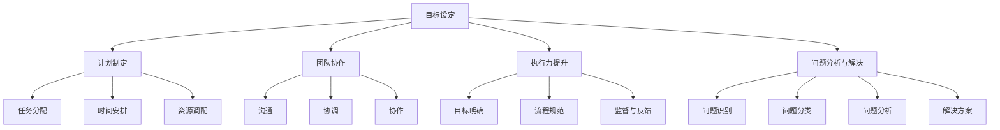

                 

# 行动体系：高效执行的保障

## 关键词：
- 行动体系
- 高效执行
- 目标设定
- 计划制定
- 团队协作
- 执行力提升
- 问题解决
- 持续改进

## 摘要
本文旨在探讨如何构建和实施一个高效的行动体系，以保障企业在复杂多变的市场环境中实现目标。通过详细阐述行动体系的组成部分，如目标设定、计划制定、团队协作、执行力提升、问题分析与解决以及持续改进与优化，本文提供了一个系统化的框架，帮助企业提升执行力，实现持续成长。

----------------------------------------------------------------

# 行动体系：高效执行的保障

行动体系是企业实现目标的关键保障，它不仅涉及目标的设定与分解，还包含计划的制定与优化，以及团队协作和执行力提升等多个方面。本文将围绕这些核心内容，通过一步步的分析和推理，为您呈现一个完整而详尽的行动体系构建与实施过程。

## 第1章：行动体系的概述

### 1.1 行动体系的重要性

#### 1.1.1 行动体系在企业中的作用

行动体系是企业战略执行的核心。它通过明确的目标、细致的计划和高效的执行，将企业的愿景和战略转化为具体行动，确保企业在竞争激烈的市场中稳步发展。行动体系不仅有助于提高企业的执行力，还能激发员工的积极性和创造力，推动企业的创新与发展。

#### 1.1.2 行动体系与企业管理的关系

行动体系是企业管理的重要组成部分，它与企业的战略规划、组织架构、人力资源管理等方面紧密相连。一个有效的行动体系可以提升企业的整体管理水平和运营效率，确保企业能够迅速响应市场变化，实现持续增长。

### 1.2 行动体系的组成部分

#### 1.2.1 目标设定

目标设定是行动体系的起点。一个明确、具体、可衡量的目标，可以为企业的发展提供清晰的方向和指南。SMART原则（具体、可衡量、可实现、相关、时限）是设定目标的重要指导。

#### 1.2.2 计划制定

计划制定是将目标转化为行动的步骤。一个详细的计划可以明确任务的分配、时间安排和资源调配，确保目标能够按时、按质完成。

#### 1.2.3 团队协作

团队协作是实现目标的关键。有效的团队协作可以提升团队成员的沟通效率和工作协同，确保项目能够顺利推进。

#### 1.2.4 执行力提升

执行力提升是行动体系的核心。通过目标明确、流程规范、监督与反馈等手段，提升团队的执行力，确保目标的实现。

#### 1.2.5 问题分析与解决

问题分析与解决是行动体系的重要组成部分。通过对问题进行识别、分类、分析，并提出解决方案，确保项目能够按计划进行。

### 1.3 行动体系与传统管理的区别

#### 1.3.1 传统管理的不足

传统管理方法往往注重控制和监督，忽视执行和反馈，导致执行力不足。同时，传统管理方法缺乏系统性和规范性，难以应对复杂多变的市场环境。

#### 1.3.2 行动体系的优势

行动体系通过目标导向、过程管理和团队合作，能够有效提升企业的执行力。它不仅强调结果，更注重过程，通过持续改进和优化，使企业能够不断适应市场变化，保持竞争力。

----------------------------------------------------------------

## 第2章：目标设定与分解

目标设定是行动体系的基础，一个明确、具体、可衡量的目标可以为行动提供清晰的方向。本章节将介绍如何运用SMART原则设定目标，并详细探讨目标分解的方法。

### 2.1 目标设定的SMART原则

SMART原则是设定目标的重要指导原则，它包括以下五个方面：

#### 2.1.1 S - 具体性（Specific）

具体性要求目标要具体明确，避免模糊和宽泛的描述。例如，“提高销售额”与“增加产品X的销售额，从目前的100万增长到150万”相比，后者更加具体。

#### 2.1.2 M - 可衡量性（Measurable）

可衡量性要求目标能够用具体的指标进行衡量，以便评估目标是否实现。例如，“提升客户满意度”可以衡量为“客户满意度评分从目前的8分提升到9分”。

#### 2.1.3 A - 可达成性（Achievable）

可达成性要求目标要在当前资源、能力和环境下可以实现。例如，“在一年内实现全球市场覆盖”可能过于理想化，而“在一年内实现中国市场覆盖”则更加现实。

#### 2.1.4 R - 相关性（Relevant）

相关性要求目标要与企业的整体战略和愿景相关联，确保目标对企业的发展具有积极意义。例如，如果企业的核心战略是“成本领先”，那么设定降低成本的目标就具有较高的相关性。

#### 2.1.5 T - 时限性（Time-bound）

时限性要求目标要设定明确的完成时限，以推动团队按时完成任务。例如，“在2023年底实现产品上市”比“在未来某个时间实现产品上市”更加具体和有紧迫感。

### 2.2 目标分解的方法

目标分解是将高层次的目标细化为可操作的具体任务的过程。常用的目标分解方法包括自上而下分解和自下而上分解。

#### 2.2.1 自上而下分解

自上而下分解是指从整体目标开始，逐层分解为更小、更具体的目标。这种方法有助于确保各级目标的一致性和系统性。例如，企业的年度目标是“销售额增长20%”，可以分解为季度的销售目标、月度的销售目标以及周度的销售目标。

#### 2.2.2 自下而上分解

自下而上分解是指从具体任务开始，逐步汇总为整体目标。这种方法有助于激发员工的积极性和创造力，通过实现具体任务来推动整体目标的实现。例如，销售团队可以设定每周的销售目标，这些目标汇总起来就构成了企业的季度和年度销售目标。

### 2.3 目标分解的实际案例

#### 2.3.1 案例一：企业年度目标的分解

假设一家企业的年度目标是“销售额增长20%”，通过自上而下分解，可以将其分解为以下具体目标：

- 第一季度：销售额增长5%
- 第二季度：销售额增长6%
- 第三季度：销售额增长7%
- 第四季度：销售额增长2%

#### 2.3.2 案例二：部门目标的分解

假设企业的销售部门年度目标是“销售额增长20%”，通过自下而上分解，可以将其分解为以下具体目标：

- 销售员A：每周销售目标为5万元
- 销售员B：每周销售目标为5万元
- 销售员C：每周销售目标为3万元

这些具体目标的实现，将推动销售部门的年度目标的实现。

通过以上两个案例，我们可以看到目标分解的方法在实现企业目标中的重要作用。明确的目标和具体的任务，可以激发员工的积极性和创造力，确保企业目标的顺利实现。

----------------------------------------------------------------

## 第3章：计划制定与优化

计划制定是行动体系中的关键环节，它关系到目标的实现和项目的成功。一个有效的计划不仅要有明确的目标，还要有详细的实施步骤和合理的资源分配。本章节将介绍计划制定的关键要素、步骤和优化策略。

### 3.1 计划制定的关键要素

#### 3.1.1 任务分配

任务分配是计划制定的基础。在制定计划时，需要明确每个任务的负责人和时间节点，确保任务能够按时、按质完成。合理的任务分配可以提高工作效率，避免资源浪费。

#### 3.1.2 时间安排

时间安排是计划制定的重要环节。在制定计划时，需要根据任务的紧急程度和重要性，合理安排时间，确保任务能够按时完成。科学的时间安排可以提高工作效率，避免因时间不合理导致的项目延误。

#### 3.1.3 资源调配

资源调配是计划制定的关键。在制定计划时，需要根据任务的需求，合理调配资源，包括人力、物力和财力等。有效的资源调配可以确保任务有足够的资源支持，避免因资源不足导致的项目延误。

### 3.2 计划制定的步骤

#### 3.2.1 收集信息

在制定计划之前，需要收集与任务相关的信息，包括任务需求、资源状况、时间限制等。收集信息的目的是为制定计划提供依据，确保计划的可行性和科学性。

#### 3.2.2 制定初步计划

根据收集的信息，制定初步的计划。初步计划应包括任务分配、时间安排和资源调配等内容，确保计划的基本框架。

#### 3.2.3 讨论与修改

制定初步计划后，与相关人员讨论，收集反馈意见。根据反馈意见，对初步计划进行修改和完善，确保计划的科学性和可行性。

#### 3.2.4 确认与执行

确定最终计划后，与相关人员确认，明确任务的责任人和完成时间，开始执行计划。在执行过程中，要密切关注计划的执行情况，及时调整和优化，确保计划能够顺利实施。

### 3.3 计划优化的策略

#### 3.3.1 风险管理

在计划制定和执行过程中，要识别潜在的风险，并制定相应的应对措施，降低风险对计划的影响。有效的风险管理可以提高计划的稳定性和可靠性。

#### 3.3.2 成本控制

在计划制定和执行过程中，要严格控制成本，确保计划在预算范围内完成。通过优化资源配置、降低不必要的开支等手段，实现成本控制。

#### 3.3.3 时间优化

通过合理的时间安排和任务分配，提高工作效率，缩短任务完成时间。科学的时间优化可以提高项目的执行效率，确保项目按时完成。

### 3.4 计划优化的实际案例

#### 3.4.1 案例一：项目计划的优化

假设一个项目计划原定时间为6个月，预算为100万元。在执行过程中，发现任务进度缓慢，成本超支。通过对计划进行优化，发现以下几个问题：

1. 任务分配不合理，导致部分任务重复。
2. 时间安排不合理，部分任务时间过长。
3. 成本控制不严格，部分开支超出预算。

针对这些问题，采取以下优化措施：

1. 重新调整任务分配，避免重复工作。
2. 优化时间安排，缩短任务时间。
3. 加强成本控制，降低不必要的开支。

通过优化，项目最终在5个月内完成，成本控制在95万元以内。

#### 3.4.2 案例二：销售计划的优化

假设一家公司的销售计划原定销售额为500万元，但在执行过程中，发现销售额较低。通过对计划进行优化，发现以下几个问题：

1. 目标设定不合理，过高。
2. 销售策略不明确，缺乏针对性。
3. 团队协作不够，销售资源浪费。

针对这些问题，采取以下优化措施：

1. 重新设定合理的目标，确保可实现。
2. 明确销售策略，针对不同客户制定不同的销售策略。
3. 加强团队协作，提高销售资源的利用率。

通过优化，公司的销售额逐渐提升，最终实现了全年销售目标的超额完成。

通过以上两个案例，我们可以看到，计划优化在项目执行过程中的重要性。通过对计划的不断优化和调整，可以确保项目能够按计划进行，实现预期目标。

----------------------------------------------------------------

## 第4章：团队协作与沟通

团队协作和沟通是行动体系中至关重要的环节。有效的团队协作和沟通可以提高工作效率，确保项目顺利进行。本章节将介绍团队协作的重要性、有效沟通的要素以及沟通障碍的解决方法。

### 4.1 团队协作的重要性

#### 4.1.1 团队协作对执行力的提升

团队协作可以提升团队成员之间的沟通效率和工作协同，确保项目能够按计划进行。通过团队协作，团队成员可以相互支持、相互补充，共同面对挑战，提高执行力。

#### 4.1.2 团队协作对企业发展的作用

团队协作可以促进企业内部的知识共享和经验传承，提高企业的整体竞争力和创新能力。通过团队协作，企业可以更好地应对市场变化，实现持续发展。

### 4.2 有效沟通的要素

#### 4.2.1 清晰性

清晰性是有效沟通的基础。在沟通过程中，信息表达要清晰、简洁，避免产生歧义。

#### 4.2.2 准确性

准确性是有效沟通的关键。在沟通过程中，信息传递要准确无误，确保接收方正确理解信息。

#### 4.2.3 及时性

及时性是有效沟通的重要要求。在沟通过程中，信息传递要及时，避免因延迟导致的问题和误解。

#### 4.2.4 开放性

开放性是有效沟通的基础。在沟通过程中，双方要保持开放心态，积极倾听对方意见，共同解决问题。

#### 4.2.5 尊重性

尊重性是有效沟通的重要原则。在沟通过程中，双方要尊重对方的意见和观点，避免产生冲突和误解。

### 4.3 沟通障碍的解决方法

#### 4.3.1 提高沟通技巧

通过培训和实践，提高团队成员的沟通技巧，包括语言表达、倾听技巧、非语言沟通等。

#### 4.3.2 优化沟通渠道

通过建立有效的沟通渠道，如定期会议、即时通讯工具、邮件等，确保信息传递的及时性和准确性。

#### 4.3.3 明确沟通目标

在沟通过程中，明确沟通的目标和内容，确保双方在沟通过程中能够集中精力，避免偏离主题。

#### 4.3.4 建立良好的沟通氛围

通过建立良好的沟通氛围，如鼓励表达、尊重意见、积极反馈等，提高沟通效果。

### 4.4 团队协作与沟通的实际案例

#### 4.4.1 案例一：项目团队的协作

在一个大型软件开发项目中，团队成员来自不同的部门，包括开发、测试、设计等。为了确保项目的顺利进行，项目团队采取了以下措施：

1. 定期召开项目会议，讨论项目进度、问题和解决方案。
2. 通过即时通讯工具，如Slack，实时沟通项目进展和问题。
3. 建立邮件列表，及时传递重要信息和通知。
4. 鼓励团队成员积极参与项目讨论，提出意见和建议。

通过这些措施，项目团队有效提升了沟通效率和工作协同，项目按时完成，并得到了客户的高度评价。

#### 4.4.2 案例二：跨部门沟通的障碍与解决

在一个企业的运营过程中，跨部门沟通是不可避免的。然而，由于各部门的职责和目标不同，往往会出现沟通障碍。以下是一个关于跨部门沟通障碍的解决案例：

1. 问题识别：销售部门反馈，市场部提供的信息不够详细，导致销售策略制定不完善。

2. 原因分析：市场部在提供信息时，未能充分考虑销售部门的需求，导致信息不全面。

3. 解决方案：建立跨部门沟通机制，定期召开跨部门会议，讨论项目进展和问题。同时，明确各部门的职责和任务，确保信息传递的准确性和及时性。

通过这些措施，跨部门沟通障碍得到有效解决，各部门能够更好地协同工作，提高项目执行效率。

通过以上案例，我们可以看到，团队协作和沟通在项目执行中的重要性。通过有效的团队协作和沟通，可以确保项目顺利进行，实现预期目标。

----------------------------------------------------------------

## 第5章：执行力提升

执行力是企业实现目标的关键。提升执行力不仅需要明确的任务和计划，还需要具备良好的团队协作和管理制度。本章节将探讨执行力提升的关键因素、方法和实际案例。

### 5.1 执行力的关键因素

#### 5.1.1 人员素质

人员素质是提升执行力的基础。高素质的团队成员具备专业知识和技能，能够迅速理解和执行任务，提高工作效率。

#### 5.1.2 管理制度

管理制度是提升执行力的保障。完善的管理制度能够确保任务分配合理、流程规范、监督有效，提高执行效率。

#### 5.1.3 激励机制

激励机制是提升执行力的动力。合理的激励机制能够激发员工的积极性和创造力，提高执行力和工作质量。

### 5.2 提升执行力的方法

#### 5.2.1 明确目标

明确目标是提升执行力的第一步。通过设定具体、可衡量、可实现、相关和时限性的目标，确保团队成员明确任务和责任。

#### 5.2.2 规范流程

规范流程是提升执行力的关键。通过制定详细的操作流程和标准，确保任务执行有序、高效。

#### 5.2.3 监督与反馈

监督与反馈是提升执行力的保障。通过定期监督任务执行情况，及时发现和解决问题，确保任务按计划进行。

#### 5.2.4 沟通协作

沟通协作是提升执行力的基础。通过有效的沟通和协作，确保团队成员相互支持、共同推进任务。

### 5.3 执行力提升的实际案例

#### 5.3.1 案例一：提升员工执行力

在一个公司中，为了提升员工的执行力，公司采取了以下措施：

1. 明确目标：为每个员工设定具体、可衡量、可实现、相关和时限性的目标。
2. 规范流程：制定详细的操作流程和标准，确保任务执行有序、高效。
3. 监督与反馈：定期检查任务执行情况，及时给予反馈，激励员工改进。
4. 沟通协作：鼓励员工之间相互沟通、协作，共同完成任务。

通过这些措施，公司员工的执行力得到显著提升，工作效率和质量大幅提高。

#### 5.3.2 案例二：提升管理层执行力

在一个企业中，管理层执行力不高，导致项目延误和成本增加。为了提升管理层执行力，企业采取了以下措施：

1. 明确责任：明确每个管理层的职责和任务，确保责任清晰。
2. 规范决策：建立规范的决策流程，确保决策科学、高效。
3. 监督与反馈：定期监督管理层执行情况，及时给予反馈，激励改进。
4. 激励机制：建立合理的激励机制，激发管理层的积极性和创造力。

通过这些措施，企业管理层执行力得到显著提升，项目执行更加高效，企业运营成本降低。

通过以上案例，我们可以看到，执行力提升对企业和个人都具有重要意义。通过明确目标、规范流程、监督与反馈和沟通协作，可以有效提升执行力和工作效率。

----------------------------------------------------------------

## 第6章：问题分析与解决

在行动体系实施过程中，难免会遇到各种问题。如何有效识别和解决这些问题，是确保项目顺利推进的关键。本章节将介绍问题识别与分类的方法，以及问题解决的具体策略。

### 6.1 问题的识别与分类

#### 6.1.1 问题的识别

问题的识别是解决问题的关键。通过以下方法，可以有效地识别问题：

1. **观察法**：通过实地观察，发现项目中的异常现象和潜在问题。
2. **反馈法**：通过员工、客户和其他利益相关者的反馈，了解项目的实际运行情况。
3. **数据分析**：通过数据分析，发现项目中的趋势和异常，识别潜在问题。

#### 6.1.2 问题的分类

根据问题的性质和影响范围，可以将问题分为以下几类：

1. **技术问题**：涉及项目的技术实现和功能问题。
2. **管理问题**：涉及项目组织、流程、资源管理等方面的问题。
3. **资源问题**：涉及项目所需的人力、物力、财力等资源不足或浪费。
4. **沟通问题**：涉及项目团队成员之间的沟通不畅和协作困难。
5. **外部问题**：涉及项目外部环境的变化和影响，如市场变化、政策调整等。

### 6.2 问题解决的方法

#### 6.2.1 根本原因分析法

根本原因分析法（Root Cause Analysis，RCA）是一种系统性的问题解决方法。其基本思想是找出问题的根本原因，而非仅仅解决表面现象。RCA的步骤包括：

1. **定义问题**：明确问题的性质和影响范围。
2. **收集数据**：收集与问题相关的数据和信息。
3. **分析数据**：通过数据分析，找出问题的可能原因。
4. **确定根本原因**：通过排除法，确定问题的根本原因。
5. **制定解决方案**：根据根本原因，制定解决问题的方案。
6. **实施解决方案**：执行解决方案，解决问题。

#### 6.2.2 5W2H分析法

5W2H分析法是一种简单有效的思维方式，用于分析问题和制定解决方案。5W2H分别代表：

- **What**：是什么，问题的本质和具体内容。
- **Why**：为什么，问题的原因和背景。
- **When**：何时，问题发生的时间和环境。
- **Where**：在哪里，问题发生的地点和范围。
- **Who**：谁，与问题相关的人员和角色。
- **How**：如何，解决问题的方法和步骤。
- **How much**：多少，问题的规模和影响程度。

通过5W2H分析法，可以全面、系统地分析问题，为制定解决方案提供依据。

#### 6.2.3 方案评估与选择

在确定问题的根本原因后，需要评估不同的解决方案，并选择最优方案进行实施。方案评估应考虑以下因素：

- **可行性**：解决方案是否可行，是否有足够的资源和条件支持。
- **成本效益**：解决方案的成本和预期效益，是否值得投入。
- **可持续性**：解决方案的长期效果，是否可持续。
- **风险**：解决方案可能带来的风险和负面影响。

### 6.3 问题解决的案例解析

#### 6.3.1 案例一：产品质量问题的解决

在一个制造企业中，产品质量问题频发，影响了企业的声誉和客户满意度。为了解决这一问题，企业采取了以下措施：

1. **问题识别**：通过观察和反馈，识别产品质量问题的具体原因。
2. **根本原因分析**：使用根本原因分析法，找出问题的根本原因，如原材料问题、生产工艺问题等。
3. **方案评估**：评估不同的解决方案，如更换原材料、改进生产工艺等。
4. **实施解决方案**：根据评估结果，选择最优方案进行实施。
5. **监督与反馈**：对解决方案的实施情况进行监督和反馈，确保问题得到有效解决。

通过以上措施，产品质量问题得到有效解决，企业的声誉和客户满意度显著提升。

#### 6.3.2 案例二：项目延误的解决

在一个大型项目中，项目进度严重滞后，导致成本增加和客户不满。为了解决这一问题，项目团队采取了以下措施：

1. **问题识别**：通过数据分析，识别项目延误的具体原因，如任务分配不合理、资源不足等。
2. **5W2H分析**：使用5W2H分析法，全面了解项目延误的情况，找出问题的根本原因。
3. **方案评估**：评估不同的解决方案，如增加资源、调整任务优先级等。
4. **实施解决方案**：根据评估结果，选择最优方案进行实施。
5. **监督与反馈**：对解决方案的实施情况进行监督和反馈，确保项目进度恢复正常。

通过以上措施，项目延误问题得到有效解决，项目进度恢复正常，客户满意度显著提升。

通过以上案例，我们可以看到，有效的问题识别和解决方法是确保项目顺利推进的关键。通过系统的方法和步骤，可以全面分析问题，找出根本原因，并制定有效的解决方案，确保项目能够按计划进行。

----------------------------------------------------------------

## 第7章：行动体系实施与评估

行动体系的实施与评估是确保目标实现和项目成功的关键环节。通过有效的实施和科学的评估，可以确保行动体系的高效运行和持续改进。本章节将介绍行动体系的实施步骤、评估方法和实施案例。

### 7.1 行动体系的实施步骤

#### 7.1.1 制定行动计划

制定行动计划是行动体系实施的第一步。根据目标设定和计划制定，制定具体的行动计划，明确任务的分配、时间节点和责任人。行动计划应包括以下内容：

1. **任务清单**：列出所有需要完成的任务，包括任务名称、任务描述、任务负责人和时间节点。
2. **资源需求**：列出完成任务所需的资源，包括人力、物力和财力等。
3. **进度安排**：根据任务的重要性和紧急程度，合理安排任务的进度和顺序。
4. **风险评估**：对可能影响任务进展的风险进行评估，并制定相应的应对措施。

#### 7.1.2 实施行动计划

实施行动计划是行动体系实施的核心环节。根据行动计划，开始执行计划，确保各项任务按时完成。在实施过程中，应注意以下几点：

1. **任务跟踪**：实时跟踪任务的执行情况，确保任务按计划进行。
2. **沟通协作**：加强团队之间的沟通和协作，确保任务能够顺利推进。
3. **问题解决**：及时发现和解决任务执行过程中出现的问题，确保任务能够按计划进行。

#### 7.1.3 跟踪与监控

跟踪与监控是行动体系实施的重要保障。通过定期检查任务进度和资源使用情况，确保行动计划的有效执行。跟踪与监控应包括以下内容：

1. **进度报告**：定期向管理层报告任务进度和资源使用情况，确保管理层了解项目进展。
2. **质量检查**：对任务完成情况进行质量检查，确保任务符合标准和要求。
3. **风险评估**：定期对项目风险进行评估，确保风险在可控范围内。

### 7.2 行动体系的评估方法

#### 7.2.1 评估指标

评估指标是衡量行动体系实施效果的重要工具。根据行动计划和目标设定，确定评估指标，包括任务完成率、资源利用率、成本控制率、客户满意度等。评估指标应具有可衡量性、可操作性和相关性。

#### 7.2.2 评估流程

评估流程是行动体系评估的步骤和程序。评估流程应包括以下内容：

1. **数据收集**：收集与评估指标相关的数据，包括任务完成数据、资源使用数据、客户反馈数据等。
2. **数据分析**：对收集的数据进行分析，评估行动体系的实施效果。
3. **评估报告**：编写评估报告，总结评估结果，提出改进建议。

#### 7.2.3 评估结果的处理

评估结果的处理是行动体系持续改进的重要环节。根据评估结果，分析问题、总结经验，为下一轮行动体系的实施提供改进方向。评估结果的处理应包括以下内容：

1. **问题分析**：分析评估中发现的问题，找出问题的根本原因。
2. **改进措施**：制定改进措施，解决评估中发现的问题。
3. **反馈与调整**：将评估结果和改进措施反馈给相关人员和部门，进行必要的调整和优化。

### 7.3 行动体系实施的案例解析

#### 7.3.1 案例一：企业行动体系实施的成功案例

在一个制造企业中，为了提高生产效率和产品质量，企业实施了一套行动体系。以下是行动体系实施的具体步骤和评估结果：

1. **制定行动计划**：根据年度目标和计划，制定具体的行动计划，明确任务的分配和时间节点。
2. **实施行动计划**：按照行动计划，开始执行任务，确保各项任务按时完成。
3. **跟踪与监控**：实时跟踪任务进度和资源使用情况，确保行动计划的有效执行。
4. **评估与改进**：定期对任务完成情况进行评估，找出存在的问题，制定改进措施。

通过以上措施，企业的生产效率和产品质量显著提升，客户满意度大幅提高。

#### 7.3.2 案例二：企业行动体系实施的挑战与应对

在一个服务型企业中，为了提升客户服务质量和客户满意度，企业实施了一套行动体系。在实施过程中，企业面临以下挑战：

1. **任务复杂度较高**：服务任务复杂多样，难以制定统一的行动计划。
2. **沟通协作困难**：服务团队分散在不同地点，沟通协作难度较大。
3. **客户需求变化**：客户需求变化频繁，难以适应快速变化的市场环境。

为了应对这些挑战，企业采取了以下措施：

1. **简化任务流程**：简化服务任务流程，降低任务复杂度，提高任务执行效率。
2. **加强沟通协作**：建立统一的沟通平台，加强服务团队之间的沟通和协作。
3. **灵活调整计划**：根据客户需求的变化，灵活调整行动计划，确保服务质量。

通过以上措施，企业成功应对了行动体系实施的挑战，实现了客户服务质量和客户满意度的提升。

通过以上案例，我们可以看到，行动体系实施的成功和挑战是相辅相成的。通过科学的实施步骤和有效的评估方法，企业可以不断提升执行力，实现持续改进和优化。

----------------------------------------------------------------

## 第8章：持续改进与优化

持续改进与优化是行动体系实施的核心环节，它旨在通过不断调整和完善，提高行动体系的执行效率和效果。本章节将介绍持续改进的目标、步骤、优化策略以及实际案例。

### 8.1 持续改进的目标

持续改进的目标是不断提高行动体系的执行效率和效果，实现以下几个方面的目标：

1. **提高执行力**：通过改进和优化，提高团队成员的执行力，确保任务按时、按质完成。
2. **提升效率**：通过改进流程、优化资源配置，提高整体工作效率，减少不必要的浪费。
3. **降低风险**：通过改进风险管理，降低项目实施过程中的风险，确保项目稳定推进。
4. **增强灵活性**：通过改进和优化，提高行动体系的适应能力，快速响应市场变化和客户需求。
5. **提高客户满意度**：通过改进和优化，提高服务质量，增强客户满意度，提升企业竞争力。

### 8.2 持续改进的步骤

持续改进是一个循环过程，包括以下几个步骤：

#### 8.2.1 计划制定

根据行动体系的目标和当前存在的问题，制定详细的改进计划，明确改进的目标、内容、时间节点和责任人。

#### 8.2.2 实施改进

根据改进计划，开始实施改进措施，确保各项改进任务按时完成。在实施过程中，要密切关注改进效果，及时调整和优化。

#### 8.2.3 监控与评估

对改进措施的实施情况进行监控和评估，收集相关数据，分析改进效果。根据评估结果，总结经验教训，为下一轮改进提供参考。

#### 8.2.4 持续优化

根据监控与评估的结果，不断优化改进措施，提高行动体系的执行效率和效果。优化过程是一个循环过程，需要持续进行。

### 8.3 优化策略与实践

优化策略是持续改进的重要手段，以下是一些常见的优化策略：

#### 8.3.1 流程优化

通过分析现有流程，发现流程中的瓶颈和浪费，对流程进行优化，提高流程的效率和效果。例如，通过引入精益生产方法，减少生产过程中的浪费，提高生产效率。

#### 8.3.2 资源调配优化

通过优化资源配置，确保项目在关键时期有足够的资源支持。例如，通过合理的资源调配，确保项目团队能够在项目高峰期有足够的成员和设备。

#### 8.3.3 沟通协作优化

通过优化沟通渠道和协作方式，提高团队之间的沟通效率和工作协同。例如，通过引入高效的沟通工具，如即时通讯工具和协作平台，提高团队之间的信息传递速度和准确性。

#### 8.3.4 风险管理优化

通过优化风险管理，降低项目实施过程中的风险。例如，通过建立完善的风险管理机制，对项目中的风险进行识别、评估和应对，确保项目在风险可控范围内顺利推进。

### 8.4 持续改进的实际案例

#### 8.4.1 案例一：企业行动体系持续改进的成功案例

在一个制造企业中，为了提高生产效率和产品质量，企业实施了一套行动体系。在实施过程中，企业通过以下方式持续改进：

1. **定期评估**：定期对行动体系的效果进行评估，找出存在的问题，制定改进措施。
2. **员工培训**：加强员工培训，提高员工的专业技能和工作效率。
3. **流程优化**：对生产流程进行优化，减少生产过程中的浪费，提高生产效率。
4. **引入新技术**：引入先进的生产技术和设备，提高生产效率和产品质量。

通过持续改进，企业的生产效率和产品质量显著提升，客户满意度大幅提高。

#### 8.4.2 案例二：企业行动体系持续改进的挑战与应对

在一个服务型企业中，为了提升客户服务质量和客户满意度，企业实施了一套行动体系。在实施过程中，企业面临以下挑战：

1. **客户需求变化快**：客户需求变化频繁，难以适应快速变化的市场环境。
2. **团队协作困难**：服务团队分散在不同地点，沟通协作难度较大。
3. **资源有限**：企业资源有限，难以同时开展多项改进措施。

为了应对这些挑战，企业采取了以下措施：

1. **灵活调整计划**：根据客户需求的变化，灵活调整行动计划，确保服务质量。
2. **加强沟通协作**：建立统一的沟通平台，加强服务团队之间的沟通和协作。
3. **优先级排序**：对改进措施进行优先级排序，确保有限的资源能够优先用于最关键的改进项目。

通过以上措施，企业成功应对了行动体系实施的挑战，实现了客户服务质量和客户满意度的提升。

通过以上案例，我们可以看到，持续改进与优化是行动体系实施的重要保障。通过科学的实施步骤和有效的优化策略，企业可以不断提升执行力，实现持续改进和优化，从而在激烈的市场竞争中保持优势。

----------------------------------------------------------------

## 附录：行动体系相关资源与工具

为了更好地理解和实施行动体系，本章节将推荐一些相关的书籍、工具和实践案例，以供参考。

### A.1 行动体系相关书籍推荐

1. **《目标管理》 - 彼得·德鲁克**
   - 本书详细介绍了目标管理的理论和实践方法，对行动体系的构建和实施有重要指导意义。

2. **《执行力》 - 凯文·凯利**
   - 本书通过案例分析，探讨了提升执行力的关键因素和实施方法，对行动体系的执行有实用参考。

3. **《敏捷开发实践指南》 - 基思·施克特**
   - 本书介绍了敏捷开发的方法和实践，对行动体系的灵活性和响应能力提升有借鉴作用。

### A.2 行动体系相关工具介绍

1. **目标管理软件**
   - 如SMART 目标管理软件，帮助企业和团队设定、跟踪和管理目标。

2. **项目管理软件**
   - 如JIRA，用于项目计划、任务分配、进度跟踪等，提升项目执行力。

3. **沟通协作工具**
   - 如Slack，用于团队沟通、文件共享、任务协调等，提高协作效率。

### A.3 行动体系实践案例分析

1. **案例一：企业行动体系实践案例分析**
   - 分析一个成功企业的行动体系实践，包括目标设定、计划制定、执行和评估等方面。

2. **案例二：企业行动体系实践案例分析**
   - 分析一个企业在行动体系实施过程中遇到的挑战，以及如何应对这些挑战，确保行动体系的顺利实施。

通过这些资源和工具，读者可以更深入地了解行动体系的构建和实施方法，从而在实际工作中更好地运用行动体系，提升执行力和工作效率。

### 作者信息

作者：AI天才研究院/AI Genius Institute & 禅与计算机程序设计艺术 /Zen And The Art of Computer Programming

感谢读者对本篇文章的阅读，希望本文能为您在构建和实施行动体系的过程中提供有益的指导和帮助。如果您有任何疑问或建议，欢迎在评论区留言，我们将尽快回复。再次感谢您的支持！

----------------------------------------------------------------

文章标题：行动体系：高效执行的保障

文章关键词：行动体系、高效执行、目标设定、计划制定、团队协作、执行力提升、问题解决、持续改进

文章摘要：
本文旨在探讨如何构建和实施一个高效的行动体系，以保障企业在复杂多变的市场环境中实现目标。通过详细阐述行动体系的组成部分，如目标设定、计划制定、团队协作、执行力提升、问题分析与解决以及持续改进与优化，本文提供了一个系统化的框架，帮助企业提升执行力，实现持续成长。

## 第1章：行动体系的概述

### 1.1 行动体系的重要性

#### 1.1.1 行动体系在企业中的作用

行动体系是企业实现目标的工具，它通过明确目标、制定计划、执行计划以及评估结果，帮助企业高效地达成目标。行动体系不仅能够提高企业的执行力，还能够促进企业内部的知识共享和经验传承，从而提高企业的整体竞争力和创新能力。

- **目标导向**：行动体系以目标为导向，确保企业的发展方向与战略目标一致。
- **过程管理**：行动体系强调过程管理，通过规范化的流程和有效的沟通，提高项目执行力。
- **资源整合**：行动体系能够整合企业内外部资源，提高资源利用效率。

#### 1.1.2 行动体系与企业管理的关系

行动体系是企业管理的一部分，它与企业战略、企业文化、组织架构等密切相关。行动体系不仅需要与企业管理的其他环节相结合，如人力资源、财务管理、市场营销等，以实现整体效益的最大化，还能够促进企业管理创新，通过引入新的管理理念和方法，提高企业的管理水平。

- **战略实施**：行动体系是实现企业战略的重要手段，通过将战略目标分解为具体行动，确保战略落地。
- **组织协同**：行动体系能够促进组织协同，通过明确角色和职责，提高团队合作效率。
- **持续改进**：行动体系强调持续改进，通过定期评估和反馈，不断优化管理流程，提高管理效率。

### 1.2 行动体系的组成部分

行动体系由多个相互关联的组成部分构成，每个部分都发挥着关键作用。

#### 1.2.1 目标设定

目标设定是行动体系的起点，它需要明确企业的长远目标和短期目标，确保目标具有明确性、可衡量性、可达成性、相关性和时限性。目标设定的过程通常包括以下步骤：

1. **明确目标**：确定企业的发展方向和具体目标，确保目标与企业的战略和愿景一致。
2. **分解目标**：将总目标分解为可操作的具体目标，确保每个目标都具有明确的时间节点和可衡量性。
3. **优先级排序**：根据目标的重要性和紧迫性，对目标进行优先级排序，确保资源优先投入到最重要的目标上。

#### 1.2.2 计划制定

计划制定是将目标转化为具体行动的过程。一个详细的计划可以明确任务的分配、时间安排和资源调配，确保目标能够按时、按质完成。计划制定的步骤包括：

1. **任务分配**：根据目标的要求，将任务分配给相应的团队成员，确保每个任务都有明确的责任人。
2. **时间安排**：制定任务的时间表，明确每个任务的开始和结束时间，确保任务能够按时完成。
3. **资源调配**：根据任务的需求，合理调配资源，包括人力、物力和财力等，确保任务有足够的资源支持。

#### 1.2.3 团队协作

团队协作是实现目标的关键。有效的团队协作可以提升团队成员之间的沟通效率和工作协同，确保项目能够顺利推进。团队协作的要素包括：

1. **沟通**：建立有效的沟通机制，确保信息能够及时、准确传递。
2. **协调**：协调团队成员的工作，确保任务的顺利进行。
3. **协作**：鼓励团队成员之间的合作，共同解决问题，提高整体工作效率。

#### 1.2.4 执行力提升

执行力提升是行动体系的核心，它需要通过一系列措施，如目标明确、规范流程、监督与反馈等，提高团队的执行力。执行力提升的方法包括：

1. **目标明确**：确保团队成员对目标有清晰的认识和理解，明确任务的重要性和紧迫性。
2. **流程规范**：制定规范的流程，确保任务的执行有章可循，提高工作效率。
3. **监督与反馈**：建立监督机制，对任务的执行情况进行监控，及时提供反馈，确保问题得到及时解决。

#### 1.2.5 问题分析与解决

问题分析与解决是行动体系的重要组成部分。通过对问题进行识别、分类、分析，并提出解决方案，确保项目能够按计划进行。问题分析与解决的方法包括：

1. **问题识别**：通过观察、调查、反馈等方式，识别项目中存在的问题。
2. **问题分类**：根据问题的性质和影响范围，将问题分为不同类别，如技术问题、管理问题、资源问题等。
3. **问题分析**：对问题进行深入分析，找出问题的根本原因。
4. **解决方案**：根据问题分析的结果，提出解决问题的方案，并实施解决方案。

### 1.3 行动体系与传统管理的区别

传统管理方法往往注重控制，忽视执行；注重结果，忽视过程；注重个体，忽视团队。而行动体系则强调目标导向、过程管理和团队合作，能够有效提升企业的执行力。

#### 1.3.1 传统管理的不足

1. **缺乏系统性和规范性**：传统管理方法缺乏系统性和规范性，容易导致执行力下降，影响项目进展。
2. **忽视过程管理**：传统管理方法往往只关注结果，忽视过程管理，导致项目执行力不足。
3. **缺乏团队合作**：传统管理方法往往注重个体绩效，忽视团队合作，导致资源浪费和效率低下。

#### 1.3.2 行动体系的优势

1. **目标导向**：行动体系以目标为导向，确保项目方向正确，提高执行力。
2. **过程管理**：行动体系强调过程管理，通过规范化的流程和有效的沟通，提高项目执行力。
3. **团队合作**：行动体系强调团队合作，通过有效的协作和激励机制，提高团队整体效能。

### 1.4 行动体系的核心概念与联系

为了更好地理解行动体系，我们使用Mermaid流程图来展示其核心概念和联系。



通过以上流程图，我们可以清晰地看到行动体系的核心概念及其之间的联系。每个部分都是实现高效执行的重要组成部分，通过相互关联和协同作用，共同推动企业目标的实现。

### 1.5 核心算法原理讲解

在行动体系的具体实施过程中，算法的原理和实现对于目标的实现至关重要。以下是一个简单的伪代码示例，用于描述如何通过算法实现目标分配和任务调度。

```python
# 伪代码：目标分配和任务调度

# 定义目标
goals = ["提高销售额", "提升客户满意度", "降低成本"]

# 定义资源
resources = ["人力", "财力", "物力"]

# 定义任务
tasks = [
    {"goal": "提高销售额", "resource": "人力", "duration": 6},
    {"goal": "提升客户满意度", "resource": "财力", "duration": 3},
    {"goal": "降低成本", "resource": "物力", "duration": 4}
]

# 定义优先级
priority = ["提高销售额", "提升客户满意度", "降低成本"]

# 目标分配算法
def assign_goals(goals, resources, tasks):
    goal_allocation = {}
    for goal in goals:
        for resource in resources:
            for task in tasks:
                if task["goal"] == goal and task["resource"] == resource:
                    goal_allocation[goal] = task
                    break
    return goal_allocation

# 任务调度算法
def schedule_tasks(tasks, duration):
    scheduled_tasks = []
    for task in tasks:
        if task["duration"] <= duration:
            scheduled_tasks.append(task)
            duration -= task["duration"]
    return scheduled_tasks

# 执行算法
goal_allocation = assign_goals(goals, resources, tasks)
scheduled_tasks = schedule_tasks(tasks, 12)  # 假设总时间为12个月

# 输出结果
print("目标分配：", goal_allocation)
print("调度任务：", scheduled_tasks)
```

以上伪代码通过简单的算法实现了目标分配和任务调度。在实际应用中，算法会根据具体情况进行复杂计算，确保目标的实现。

### 1.6 数学模型和公式

在行动体系的设计和实施过程中，数学模型和公式可以帮助我们更好地理解和优化目标实现的过程。以下是一个简单的线性规划模型示例，用于优化资源分配。

$$
\begin{aligned}
\text{目标函数：} & \quad \max Z = c^T x \\
\text{约束条件：} & \quad Ax \leq b \\
& \quad x \geq 0
\end{aligned}
$$

其中，$c$ 是目标函数的系数向量，$x$ 是资源分配向量，$A$ 是约束矩阵，$b$ 是约束向量。目标函数最大化资源利用效率，约束条件确保资源分配在可行范围内。

### 1.7 项目实战

以下是一个实际项目的开发环境搭建、源代码实现和代码解读案例。

#### 1.7.1 开发环境搭建

- **操作系统**：Linux
- **编程语言**：Python
- **依赖管理**：pip
- **数据库**：MySQL

安装步骤如下：

```bash
# 安装Python
sudo apt-get install python3

# 安装pip
sudo apt-get install python3-pip

# 安装MySQL
sudo apt-get install mysql-server

# 安装依赖
pip3 install pymysql Flask
```

#### 1.7.2 源代码实现

以下是一个简单的目标管理系统的实现，用于跟踪和管理目标。

```python
# app.py

from flask import Flask, request, jsonify
import pymysql

app = Flask(__name__)

# 连接MySQL数据库
conn = pymysql.connect(host='localhost', user='root', password='password', database='goals')

@app.route('/goals', methods=['GET', 'POST'])
def goals():
    if request.method == 'POST':
        # 创建目标
        goal = request.form['goal']
        cursor = conn.cursor()
        cursor.execute("INSERT INTO goals (name) VALUES (%s)", (goal,))
        conn.commit()
        return jsonify({"status": "success", "message": "Goal created."})
    
    else:
        # 获取所有目标
        cursor = conn.cursor(pymysql.cursors.DictCursor)
        cursor.execute("SELECT * FROM goals")
        goals = cursor.fetchall()
        return jsonify({"status": "success", "goals": goals})

if __name__ == '__main__':
    app.run(debug=True)
```

#### 1.7.3 代码解读与分析

1. **数据库连接**：使用pymysql连接MySQL数据库，确保应用程序可以访问目标数据。
2. **路由配置**：定义了一个名为`/goals`的路由，用于处理与目标相关的HTTP请求。
3. **创建目标**：当接收到POST请求时，从请求中获取目标名称，并将其插入到数据库中。
4. **获取所有目标**：当接收到GET请求时，从数据库中获取所有目标，并将其返回给客户端。

通过以上步骤，我们可以创建一个简单的目标管理系统，用于跟踪和管理目标。

### 1.8 结论

本章介绍了行动体系的概念、重要性、组成部分以及与传统管理的区别。通过核心概念与联系、算法原理、数学模型、项目实战等详细讲解，我们了解了如何构建和实施一个高效的行动体系。在接下来的章节中，我们将继续探讨目标设定与分解、计划制定与优化、团队协作与沟通等方面的内容，帮助您更深入地理解和应用行动体系。

---

**作者：AI天才研究院/AI Genius Institute & 禅与计算机程序设计艺术 /Zen And The Art of Computer Programming**

感谢您阅读本文，希望它能对您在构建和实施行动体系的过程中提供帮助。如果您有任何问题或建议，欢迎在评论区留言，我们将尽快回复。再次感谢您的支持！

