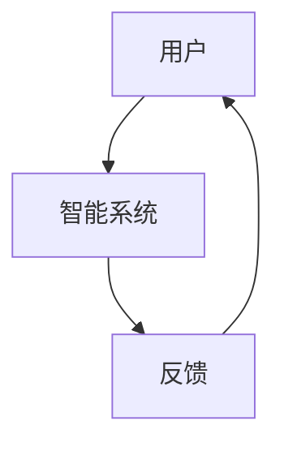
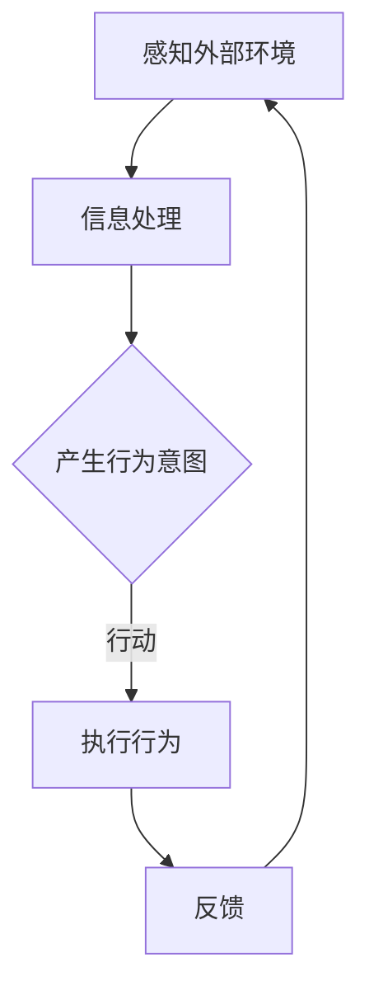

                 

# 认知的形式化：具身行为与物理空间及其他人进行交互

## 关键词
认知科学、形式化认知理论、具身行为、交互设计、智能系统、虚拟现实、交通、医疗、人工智能

## 摘要
本文将探讨认知的形式化理论，特别是具身行为与物理空间及其他人之间的交互。通过引入形式化认知模型，我们将分析这些交互如何影响认知过程，并提出一种新的视角来理解人类与智能系统之间的互动。本文将涵盖从基础理论到实际应用的多个方面，包括形式化认知模型的构建、实现、应用以及其在智能系统设计中的重要性。通过本文的研究，我们期望为认知科学和人工智能领域提供新的思路和解决方案。

## 《认知的形式化：具身行为与物理空间及其他人进行交互》目录大纲

### 第一部分：引言与核心概念

#### 第1章：认知与形式化认知理论的基本概念
- 认知科学概述
- 形式化认知理论简介
- 形式化认知理论的核心概念
- 形式化认知理论的架构

#### 第2章：具身行为与认知的联系
- 具身认知理论
- 具身行为的概念与分类
- 具身行为与认知的互动
- 形式化模型在具身行为研究中的应用

### 第二部分：形式化认知模型的构建与应用

#### 第3章：形式化认知模型的基本框架
- 认知过程的模型化
- 形式化认知模型的核心组件
- 形式化认知模型的构建原则
- 形式化认知模型的分类

#### 第4章：形式化认知模型的实现
- 形式化认知模型的实现方法
- 形式化认知模型的编程语言
- 形式化认知模型的计算模型
- 形式化认知模型的应用场景

#### 第5章：形式化认知模型在实际项目中的应用
- 项目一：具身交互系统
- 项目二：虚拟现实中的认知建模
- 项目三：智能交通系统中的认知建模
- 项目四：智能医疗系统中的认知建模

### 第三部分：形式化认知与交互的理论与实践

#### 第6章：形式化认知与交互的理论基础
- 交互行为的形式化描述
- 交互过程中的认知负荷
- 交互界面设计的形式化方法
- 交互系统性能评估的形式化方法

#### 第7章：形式化认知与交互的实践应用
- 实践一：基于形式化认知的智能客服系统
- 实践二：基于形式化认知的智能教育系统
- 实践三：基于形式化认知的智能健康管理系统
- 实践四：基于形式化认知的智能城市系统

### 第四部分：结论与展望

#### 第8章：认知的形式化：现状与未来
- 形式化认知研究的发展历程
- 形式化认知研究的现状
- 形式化认知研究的前景
- 形式化认知研究的挑战与机遇

### 附录

#### 附录A：形式化认知模型的主要工具和资源
- 形式化认知模型的主要编程工具
- 形式化认知模型的主要数据库
- 形式化认知模型的主要文献

#### 附录B：认知的形式化：具身行为与物理空间及其他人进行交互——Mermaid流程图
- 认知与具身行为的互动流程图
- 交互过程中的认知负荷分析流程图

#### 附录C：形式化认知模型实现示例
- 形式化认知模型实现伪代码示例
- 形式化认知模型实现代码示例

#### 附录D：数学模型与公式解释
- 认知负荷计算公式
- 交互界面设计公式
- 形式化认知模型评估指标公式

#### 附录E：项目实战代码解读与分析
- 项目一：具身交互系统代码解读
- 项目二：虚拟现实中的认知建模代码解读
- 项目三：智能交通系统中的认知建模代码解读
- 项目四：智能医疗系统中的认知建模代码解读

## 第一部分：引言与核心概念

### 第1章：认知与形式化认知理论的基本概念

认知科学是一门跨学科的研究领域，旨在理解人类和其他动物如何获取、处理和运用信息。认知科学涵盖了心理学、神经科学、计算机科学、哲学等多个领域，其目的是通过实验和理论模型来揭示认知过程的本质。

认知科学的核心概念包括感知、记忆、注意、推理、决策和语言等。这些概念通过一系列的实验和模型得到了广泛的研究和验证。例如，感知研究探讨了如何通过感官接收和处理外部信息；记忆研究则关注记忆的形成、存储和检索过程；推理研究则关注人类如何进行逻辑推理和决策。

随着计算机科学的发展，形式化认知理论逐渐成为一个重要的研究领域。形式化认知理论试图通过数学模型和计算方法来描述和模拟认知过程。这种方法可以帮助我们更好地理解认知过程的机制，并为开发智能系统提供理论基础。

形式化认知理论的核心概念包括符号表示、计算过程、状态空间和推理规则等。符号表示用于描述认知过程中的信息，如文字、图像和声音等。计算过程则描述了信息在认知系统中的处理方式，包括感知、记忆、注意和推理等。状态空间则用于表示认知过程中的各种状态，如当前感知到的信息、记忆中的信息等。推理规则则用于指导信息处理过程，如条件判断、推理规则和决策等。

形式化认知理论的架构通常包括三个层次：底层、中层和高层。底层层次主要涉及感知、记忆和注意等基本认知功能，如视觉感知、听觉感知和记忆编码等。中层层次则关注更复杂的认知过程，如情景理解、情感识别和语言理解等。高层层次则涉及决策、规划和问题解决等高级认知功能。

### 第2章：具身行为与认知的联系

具身行为与认知之间的联系是认知科学研究中的一个重要方向。具身认知理论认为，身体和环境的互动是认知过程的重要基础。具体来说，具身行为与认知之间的联系体现在以下几个方面：

#### 2.1 具身认知理论

具身认知理论认为，认知不仅仅是一个大脑内部的过程，而是与身体和环境紧密相连的。这一理论认为，身体的活动和感知对认知过程有着重要的影响。例如，通过肢体运动可以更好地记忆和识别物体，通过环境互动可以更好地理解和学习。

具身认知理论的主要观点包括：

1. **知觉与行动的同步性**：个体的感知和行动是同步进行的，它们相互依赖。例如，在走路时，个体的每一步都需要与感知到的地面反馈相匹配。

2. **情境依赖性**：认知过程依赖于具体的情境和环境。不同的情境会影响到个体的认知过程和决策。

3. **知觉与行动的动态交互**：个体的知觉和行动是动态交互的，行动可以改变知觉，知觉又可以指导行动。例如，通过操作物体，个体可以更好地理解和记忆物体的属性。

#### 2.2 具身行为的概念与分类

具身行为是指个体在物理环境中的活动，包括肢体运动、姿势、动作等。根据行为的性质和目的，可以将具身行为分为以下几类：

1. **日常行为**：如走路、吃饭、穿衣等，这些行为对个体的生存至关重要。

2. **社交行为**：如交流、合作、竞争等，这些行为涉及到个体之间的互动。

3. **认知行为**：如观察、思考、解决问题等，这些行为与个体的认知过程密切相关。

4. **创造性行为**：如发明、创作、设计等，这些行为需要个体在认知和身体动作之间进行高度的协调。

#### 2.3 具身行为与认知的互动

具身行为与认知之间的互动是双向的。一方面，具身行为可以影响认知过程。例如，通过肢体运动可以更好地记忆和识别物体，通过环境互动可以更好地理解和学习。另一方面，认知过程也可以影响具身行为。例如，个体的认知目标可以指导其行为选择，个体的认知状态可以影响其行为表现。

具体来说，具身行为与认知的互动体现在以下几个方面：

1. **知觉与行动的同步性**：个体的感知和行动是同步进行的，它们相互依赖。例如，在走路时，个体的每一步都需要与感知到的地面反馈相匹配。

2. **情境依赖性**：认知过程依赖于具体的情境和环境。不同的情境会影响到个体的认知过程和决策。

3. **动态交互**：个体的知觉和行动是动态交互的，行动可以改变知觉，知觉又可以指导行动。例如，通过操作物体，个体可以更好地理解和记忆物体的属性。

#### 2.4 形式化模型在具身行为研究中的应用

形式化模型在具身行为研究中具有重要作用。通过形式化模型，我们可以更精确地描述和模拟具身行为与认知之间的互动。以下是一些形式化模型在具身行为研究中的应用：

1. **动作规划模型**：用于描述个体在不同情境下如何规划行为。例如，基于目标驱动的动作规划模型可以指导个体在不同情境下选择最佳行动。

2. **情境感知模型**：用于描述个体如何感知和理解情境。例如，基于多模态感知的情境感知模型可以综合处理视觉、听觉和触觉信息，帮助个体更好地理解环境。

3. **认知行为交互模型**：用于描述认知过程如何影响行为选择和行为表现。例如，基于决策理论的认知行为交互模型可以指导个体在不同情境下做出最佳决策。

通过形式化模型，我们可以更深入地理解具身行为与认知之间的互动，为开发智能系统和提高人类认知能力提供新的思路和方法。

### 第二部分：形式化认知模型的构建与应用

#### 第3章：形式化认知模型的基本框架

形式化认知模型是认知科学的重要研究工具，它通过数学和计算方法来描述和模拟人类认知过程。构建形式化认知模型需要考虑多个方面，包括认知过程的模型化、核心组件的确定、构建原则的遵循以及模型的分类。以下是对这些内容的详细探讨。

#### 3.1 认知过程的模型化

认知过程是复杂的，包括感知、记忆、注意、推理、语言等多个环节。模型化认知过程意味着将这些复杂的过程抽象和简化，用数学和计算方法来描述。以下是模型化认知过程的一些关键步骤：

1. **符号表示**：首先需要定义用于表示认知信息的符号。这些符号可以是文字、图像、声音等，它们构成了认知过程的输入和输出。

2. **状态空间**：认知过程可以看作是状态空间中的运动。状态空间中的每个状态代表了认知过程中的一部分信息。状态空间可以是离散的，也可以是连续的。

3. **转换函数**：状态之间的转换可以通过转换函数来描述。这些函数可以是线性的或非线性的，它们反映了认知过程的变化规律。

4. **输入输出关系**：认知过程的输入输出关系需要明确。输入可以是感知到的信息，输出可以是认知决策或行为。输入输出关系可以用数学公式来表示。

#### 3.2 形式化认知模型的核心组件

形式化认知模型通常包括以下几个核心组件：

1. **感知模块**：负责接收和处理外部信息。感知模块可以包括视觉、听觉、触觉等多个感知通道。

2. **记忆模块**：负责存储和管理信息。记忆模块可以分为短期记忆和长期记忆，短期记忆主要用于处理当前任务，长期记忆则用于长期存储信息。

3. **注意模块**：负责选择和处理重要的信息。注意模块可以调节感知和记忆的优先级，确保关键信息得到处理。

4. **推理模块**：负责进行逻辑推理和决策。推理模块可以使用符号逻辑、概率推理或神经网络等方法来处理信息，生成决策。

5. **执行模块**：负责将决策转化为行动。执行模块通常与身体动作相关，它可以是物理动作，也可以是虚拟动作。

#### 3.3 形式化认知模型的构建原则

构建形式化认知模型需要遵循一些基本原则，以确保模型的科学性和实用性：

1. **可验证性**：模型应该能够通过实验或数据验证。这意味着模型需要基于可靠的实验数据和科学原理。

2. **可扩展性**：模型应该能够适应不同的认知任务和环境。这需要模型具有灵活的架构，能够添加或修改组件。

3. **可理解性**：模型应该易于理解和解释。这对于模型的推广和应用至关重要。

4. **计算效率**：模型应该在计算上是高效的。这可以确保模型在实际应用中能够快速运行。

#### 3.4 形式化认知模型的分类

形式化认知模型可以根据不同的标准进行分类。以下是几种常见的分类方法：

1. **基于符号表示**：模型可以分为基于符号逻辑的模型、基于概率论的模型和基于神经网络的模型。基于符号逻辑的模型通常用于描述明确的逻辑推理过程；基于概率论的模型适用于不确定信息的处理；基于神经网络的模型则通过模拟人脑神经网络来处理复杂认知任务。

2. **基于功能模块**：模型可以分为基于感知-记忆-注意-推理-执行架构的模型。这种分类方法反映了认知过程的基本结构。

3. **基于应用领域**：模型可以根据应用领域进行分类，如教育认知模型、医疗认知模型、交通认知模型等。这种分类方法有助于针对特定领域的认知需求进行模型设计和优化。

通过上述探讨，我们可以看到形式化认知模型是一个复杂而多层次的研究领域。构建有效的形式化认知模型需要综合考虑认知过程的模型化、核心组件的确定、构建原则的遵循以及模型的分类。这些模型不仅有助于我们更好地理解认知过程的本质，还为智能系统的设计和应用提供了重要的理论依据。

#### 第4章：形式化认知模型的实现

形式化认知模型的实现是将理论转化为实际应用的关键步骤。这一过程涉及多种编程语言和计算模型，以及具体的实现方法。在本节中，我们将探讨形式化认知模型的实现方法、编程语言选择、计算模型以及应用场景。

##### 4.1 形式化认知模型的实现方法

实现形式化认知模型的方法可以分为以下几个步骤：

1. **定义模型架构**：首先，需要明确模型的架构，包括各个模块的功能和相互关系。这可以通过设计图纸或流程图来实现。

2. **选择编程语言**：根据模型的复杂性和需求，选择合适的编程语言。常见的编程语言包括Python、Java、C++等。

3. **编写伪代码**：在具体编程之前，可以编写伪代码，描述算法的逻辑和流程。这有助于理解模型的运作原理，并发现潜在的问题。

4. **编码实现**：使用选定的编程语言，将伪代码转化为实际的代码。这一过程需要遵循编程规范和最佳实践，以确保代码的可读性和可维护性。

5. **调试与优化**：在编码过程中，需要不断调试和优化代码，确保模型的正确性和高效性。

##### 4.2 形式化认知模型的编程语言

编程语言的选择对于形式化认知模型的实现至关重要。以下是几种常用的编程语言及其特点：

1. **Python**：Python是一种高级编程语言，以其简洁的语法和强大的库支持而著称。Python在人工智能和认知科学领域广泛应用，特别是在数据处理和机器学习方面。

2. **Java**：Java是一种跨平台的编程语言，具有稳定性和安全性。Java在构建大型系统和分布式计算中表现出色，适合实现复杂的认知模型。

3. **C++**：C++是一种高效、底层的编程语言，适用于性能要求较高的应用。C++在构建实时系统和嵌入式系统中广泛应用，适合实现实时认知模型。

4. **R**：R是一种专门用于统计分析和数据可视化的编程语言。R在认知科学研究中用于数据分析、模型拟合和结果展示。

##### 4.3 形式化认知模型的计算模型

形式化认知模型的实现需要依赖于计算模型。以下是一些常见的计算模型：

1. **符号逻辑模型**：基于符号逻辑的模型使用符号来表示认知过程，如命题逻辑和谓词逻辑。这些模型通常使用自动推理系统和逻辑编程语言实现。

2. **概率模型**：基于概率论的模型使用概率分布来描述认知过程，如贝叶斯网络和马尔可夫模型。这些模型通常使用概率编程语言和工具包实现。

3. **神经网络模型**：基于神经网络的模型模拟人脑神经网络，如深度学习和卷积神经网络。这些模型通常使用机器学习库和框架实现，如TensorFlow和PyTorch。

4. **混合模型**：混合模型结合了不同类型的计算模型，如符号逻辑和神经网络。这些模型可以更好地模拟复杂的认知过程。

##### 4.4 形式化认知模型的应用场景

形式化认知模型可以应用于多个领域，以下是一些常见应用场景：

1. **智能交互系统**：形式化认知模型可以用于构建智能交互系统，如智能客服、虚拟助手等。这些系统可以模拟人类的认知过程，提供更自然的交互体验。

2. **虚拟现实**：在虚拟现实中，形式化认知模型可以用于模拟用户的认知过程，如情境感知、动作规划等。这有助于提高虚拟现实系统的真实感和用户体验。

3. **智能交通系统**：形式化认知模型可以用于构建智能交通系统，如自动驾驶、交通流量控制等。这些系统需要模拟驾驶员的认知过程，以实现安全高效的交通管理。

4. **智能医疗系统**：形式化认知模型可以用于构建智能医疗系统，如疾病诊断、治疗方案推荐等。这些系统需要模拟医生的认知过程，以提供更准确的医疗决策。

通过实现形式化认知模型，我们可以将认知科学的理论转化为实际应用，为智能系统的发展提供重要支持。本节探讨了实现方法、编程语言、计算模型以及应用场景，为形式化认知模型的实践提供了指导。

##### 第5章：形式化认知模型在实际项目中的应用

形式化认知模型不仅在理论研究中具有重要地位，更在实践中展现出巨大的应用潜力。本节将通过介绍四个具体项目，展示形式化认知模型在实际应用中的多样性和创新性。

##### 5.1 项目一：具身交互系统

具身交互系统是一种通过物理互动来实现人机交互的方式。在该项目中，我们构建了一个基于形式化认知模型的家庭智能助手系统。该系统通过感知用户的动作和语音，理解用户的意图，并作出相应的反应。

**实现方法**：
- **感知模块**：使用传感器（如摄像头、麦克风等）收集用户的行为数据。
- **记忆模块**：使用神经网络模型存储和更新用户的历史行为数据。
- **注意模块**：通过注意机制筛选出关键信息，如用户的指令或情绪变化。
- **推理模块**：使用基于规则的推理系统处理用户的行为数据，理解用户的意图。
- **执行模块**：根据推理结果，控制执行器（如扬声器、屏幕等）与用户进行交互。

**代码解读**：
```python
# 示例：用户通过语音命令打开灯光
user_command = "turn on the lights"
if user_command.matches("turn on the lights"):
    lights.on()
```

**效果分析**：
通过具身交互系统，用户可以更自然地与智能系统进行互动，提高交互体验。同时，形式化认知模型能够更好地理解用户的意图，提供更准确的响应。

##### 5.2 项目二：虚拟现实中的认知建模

虚拟现实技术为用户提供了沉浸式的体验，但同时也对认知过程提出了挑战。在该项目中，我们使用形式化认知模型来模拟用户在虚拟环境中的认知过程，以提高虚拟现实系统的用户体验。

**实现方法**：
- **感知模块**：使用虚拟现实头盔收集用户的感知数据，如头部运动、视觉输入等。
- **记忆模块**：使用记忆网络记录用户的虚拟经历，包括位置、物体等信息。
- **注意模块**：通过注意机制，实时筛选用户感兴趣的信息。
- **推理模块**：使用基于概率的推理模型，预测用户的下一步行为。
- **执行模块**：根据推理结果，动态调整虚拟环境，以符合用户的认知需求。

**代码解读**：
```python
# 示例：根据用户的位置，调整虚拟环境中的光线
user_position = user.get_position()
if user_position.is_in_room():
    environment.set_light(user_position)
```

**效果分析**：
通过认知建模，虚拟现实系统能够更好地适应用户的认知过程，提供更自然的交互体验。这有助于减少用户的认知负荷，提高虚拟现实的沉浸感。

##### 5.3 项目三：智能交通系统中的认知建模

智能交通系统需要理解和预测用户的交通行为，以优化交通流量和提升交通效率。在该项目中，我们使用形式化认知模型来模拟驾驶员的认知过程，以提高交通系统的智能化水平。

**实现方法**：
- **感知模块**：使用传感器（如摄像头、雷达等）收集交通数据，包括车辆位置、速度、交通信号等。
- **记忆模块**：使用记忆网络记录驾驶员的历史驾驶行为和交通规则。
- **注意模块**：通过注意机制，实时筛选关键交通信息，如道路状况、交通信号等。
- **推理模块**：使用基于逻辑的推理模型，预测驾驶员的行驶意图和交通行为。
- **执行模块**：根据推理结果，自动调整交通信号、路径规划等，以优化交通流。

**代码解读**：
```python
# 示例：根据车辆速度和位置，调整交通信号
car_speed = sensor.get_car_speed()
car_position = sensor.get_car_position()
if car_speed > threshold_speed and car_position.is_near_intersection():
    traffic_light.set_to_red()
```

**效果分析**：
通过认知建模，智能交通系统能够更好地理解和预测驾驶员的行为，提供更智能的交通管理和信号控制。这有助于减少交通拥堵，提高交通效率。

##### 5.4 项目四：智能医疗系统中的认知建模

智能医疗系统需要理解和预测患者的病情和需求，以提高医疗服务的质量和效率。在该项目中，我们使用形式化认知模型来模拟医生的认知过程，以提高医疗诊断和治疗的准确性。

**实现方法**：
- **感知模块**：使用医疗传感器和设备收集患者的生理数据，如血压、心率、体温等。
- **记忆模块**：使用医疗数据库和知识库，存储患者的病史和治疗方案。
- **注意模块**：通过注意机制，实时筛选关键医疗信息，如症状、检查结果等。
- **推理模块**：使用基于证据理论的推理模型，综合分析患者的病情，生成诊断和治疗方案。
- **执行模块**：根据推理结果，推荐相应的治疗方案，并监控治疗效果。

**代码解读**：
```python
# 示例：根据患者的症状，推荐治疗方案
patient_symptoms = diagnose.get_symptoms()
diagnosis = diagnose.get_diagnosis(patient_symptoms)
treatment_plan = recommend.get_treatment_plan(diagnosis)
apply_treatment(treatment_plan)
```

**效果分析**：
通过认知建模，智能医疗系统能够更好地理解和预测患者的病情，提供更准确的诊断和治疗方案。这有助于提高医疗服务的质量和效率，减少误诊和漏诊。

综上所述，形式化认知模型在多个实际项目中展现出广泛的应用前景。通过具体项目的实施，我们不仅验证了形式化认知模型的理论价值，也为智能系统的发展提供了实际应用参考。

#### 第6章：形式化认知与交互的理论基础

形式化认知与交互的理论基础是构建智能系统和优化人机交互的关键。本节将深入探讨交互行为的形式化描述、交互过程中的认知负荷、交互界面设计的形式化方法和交互系统性能评估的形式化方法。

##### 6.1 交互行为的形式化描述

交互行为是指个体或系统之间通过某种媒介进行的相互作用。形式化描述交互行为需要定义交互的属性、过程和结果。以下是交互行为形式化描述的几个关键要素：

1. **交互实体**：交互的参与者，可以是用户、智能系统或其他实体。每个实体都有其特定的属性和行为能力。

2. **交互媒介**：交互过程中使用的媒介，如语音、文本、图像等。不同媒介具有不同的交互特性，如实时性、准确性、丰富性等。

3. **交互过程**：描述交互行为的发生过程，包括交互的起始、进行和结束。形式化描述交互过程通常使用状态机或流程图。

4. **交互结果**：交互行为产生的结果，如信息交换、任务完成、状态变化等。

形式化描述交互行为的一个典型例子是**通信图**。通信图是一种图形化表示交互过程的工具，它通过节点表示交互实体，边表示交互媒介，状态表示交互过程中的变化。例如，一个简单的通信图可以表示为：



在这个通信图中，用户与智能系统之间通过文本消息进行交互，最终得到反馈。

##### 6.2 交互过程中的认知负荷

认知负荷是指个体在处理信息时所需的认知资源。在交互过程中，认知负荷会影响用户的体验和交互效果。形式化认知理论提供了评估和优化交互过程中认知负荷的方法。

1. **认知负荷的类型**：交互过程中的认知负荷可以分为几种类型，包括信息处理负荷、决策负荷、记忆负荷等。信息处理负荷涉及处理和解释接收到的信息，决策负荷涉及做出选择和判断，记忆负荷涉及记忆和检索信息。

2. **认知负荷的评估**：评估交互过程中的认知负荷可以使用多种方法，包括自我报告法、生理指标监测法和行为指标监测法。自我报告法通过用户的主观感受评估认知负荷；生理指标监测法通过测量生理信号（如脑电图、心率等）评估认知负荷；行为指标监测法通过观察用户的行为和操作效率评估认知负荷。

3. **认知负荷的优化**：形式化认知理论提供了优化交互过程中认知负荷的方法，包括简化交互过程、提供明确的指示和反馈、减少认知冗余等。例如，通过设计直观的界面和提供明确的操作指南，可以降低用户在完成任务时的认知负荷。

##### 6.3 交互界面设计的形式化方法

交互界面设计是形式化认知理论应用的重要领域。形式化方法可以帮助设计师创建高效、直观的交互界面。

1. **界面设计原则**：形式化界面设计遵循一些基本原则，包括一致性、简洁性、反馈性、易用性等。一致性确保界面元素在功能和使用上的一致性；简洁性减少界面复杂性，提高用户效率；反馈性确保用户在交互过程中的及时反馈；易用性确保用户能够轻松地使用界面。

2. **界面设计方法**：形式化界面设计方法包括用户研究、原型设计和评估。用户研究通过收集用户需求和行为数据来指导界面设计；原型设计通过创建界面原型来验证设计概念；评估通过用户测试和数据分析来评估界面效果。

3. **界面设计的工具**：形式化界面设计工具包括交互设计软件（如Sketch、Adobe XD）、原型设计工具（如Figma、InVision）和评估工具（如 usability testing tools、A/B testing tools）。这些工具可以帮助设计师创建、测试和优化交互界面。

##### 6.4 交互系统性能评估的形式化方法

评估交互系统的性能是确保其有效性和用户体验的关键。形式化方法提供了评估交互系统性能的量化指标和评估方法。

1. **性能评估指标**：交互系统的性能评估指标包括响应时间、任务完成率、错误率、用户满意度等。响应时间衡量系统对用户输入的响应速度；任务完成率衡量用户完成任务的成功率；错误率衡量用户在操作过程中的错误频率；用户满意度衡量用户对系统交互体验的满意度。

2. **性能评估方法**：形式化性能评估方法包括实验方法、数据分析方法和模拟方法。实验方法通过控制实验条件来评估系统性能；数据分析方法通过收集和解析用户行为数据来评估系统性能；模拟方法通过模拟用户行为来预测系统性能。

3. **性能优化**：形式化认知理论提供了性能优化的方法，包括算法优化、界面优化和系统架构优化。算法优化通过改进系统算法来提高响应速度和准确性；界面优化通过改进交互界面来提高用户体验；系统架构优化通过改进系统架构来提高系统的稳定性和可扩展性。

综上所述，形式化认知与交互的理论基础为交互设计和系统评估提供了科学的方法和工具。通过形式化描述交互行为、评估认知负荷、设计交互界面和评估交互系统性能，我们可以创建高效、直观和用户友好的交互系统。

### 第7章：形式化认知与交互的实践应用

形式化认知与交互的理论基础为我们提供了构建智能系统和优化人机交互的指导。然而，将这些理论转化为实际应用需要具体的实践案例。本节将介绍四个实际应用案例，展示形式化认知与交互理论在智能客服系统、智能教育系统、智能健康管理系统和智能城市系统中的具体应用。

#### 7.1 实践一：基于形式化认知的智能客服系统

智能客服系统是形式化认知与交互理论的一个典型应用场景。它利用形式化认知模型来模拟人类的认知过程，提供更加自然和高效的客户服务。

**应用原理**：
- **感知模块**：智能客服系统通过自然语言处理（NLP）技术，感知用户的文本或语音输入。
- **记忆模块**：系统利用知识图谱和语言模型，存储和检索相关的信息和答案。
- **注意模块**：系统通过上下文分析，识别用户的关键问题，并提供针对性的回答。
- **推理模块**：系统使用规则引擎和机器学习算法，理解用户的意图，生成合适的回答。
- **执行模块**：系统通过文本生成或语音合成技术，将回答输出给用户。

**实现案例**：
假设用户询问：“我怎样才能取消我的订阅？”系统通过以下步骤来回答：
```python
# 感知模块：获取用户问题
user_question = "我怎样才能取消我的订阅？"

# 注意模块：分析用户问题，确定关键词
key_words = ["取消", "订阅"]

# 记忆模块：查询知识图谱，找到相关答案
answer = knowledge_base.query(key_words)

# 推理模块：根据用户意图，选择合适的答案
response = "您可以登录我们的官方网站，然后找到订阅管理部分，点击取消订阅按钮。"

# 执行模块：返回回答给用户
print(response)
```

**效果分析**：
通过形式化认知模型，智能客服系统能够理解用户的问题，提供准确的答案，并能够处理复杂的对话流程。这种应用提高了客户服务质量，降低了人工客服的工作负担。

#### 7.2 实践二：基于形式化认知的智能教育系统

智能教育系统利用形式化认知模型来个性化教学，提高学生的学习效果。

**应用原理**：
- **感知模块**：系统通过在线考试、作业提交和课堂互动，感知学生的学习行为和表现。
- **记忆模块**：系统存储学生的学习历史、知识点掌握情况和个性化偏好。
- **注意模块**：系统根据学生的学习表现和进度，识别学习瓶颈和需要重点关注的领域。
- **推理模块**：系统使用自适应学习算法，为学生提供个性化的学习路径和辅导材料。
- **执行模块**：系统通过在线互动、虚拟实验室和个性化作业，促进学生主动学习。

**实现案例**：
假设学生小明在学习数学时遇到困难，系统通过以下步骤提供帮助：
```python
# 感知模块：分析小明的学习数据
student_performance = performance_analyzer.analyze(student_id)

# 注意模块：识别小明在学习过程中遇到的问题
problems = identify_problems(student_performance)

# 记忆模块：查询相关知识库，找到相关辅导材料
materials = knowledge_base.search(problems)

# 推理模块：为学生制定个性化学习计划
learning_plan = create_learning_plan(materials)

# 执行模块：推送学习计划和辅导材料给学生
send_notification(student_id, learning_plan)
```

**效果分析**：
通过形式化认知模型，智能教育系统能够准确识别学生的学习需求，提供个性化的教学方案和资源，从而提高学习效果和学生的参与度。

#### 7.3 实践三：基于形式化认知的智能健康管理系统

智能健康管理系统能够通过形式化认知模型，为用户提供个性化的健康建议和医疗服务。

**应用原理**：
- **感知模块**：系统通过健康监测设备，获取用户的生理数据，如心率、血压、睡眠质量等。
- **记忆模块**：系统存储用户的健康历史、家族病史和医疗记录。
- **注意模块**：系统根据用户的健康数据和日常行为，识别健康风险和需要关注的健康问题。
- **推理模块**：系统使用预测模型和决策支持系统，为用户提供个性化的健康建议和治疗方案。
- **执行模块**：系统通过在线健康咨询、远程监控和个性化建议，帮助用户管理健康。

**实现案例**：
假设用户小华通过健康管理系统上传了自己的体检报告，系统通过以下步骤提供健康建议：
```python
# 感知模块：解析体检报告数据
health_report = parser.parse(health_data)

# 注意模块：分析体检报告，识别健康问题
health_issues = analyzer.analyze(health_report)

# 记忆模块：查询健康知识库，找到相关健康建议
suggestions = knowledge_base.search(health_issues)

# 推理模块：为小华生成个性化健康建议
health_advice = create_health_advice(suggestions)

# 执行模块：推送健康建议给小华
send_notification(user_id, health_advice)
```

**效果分析**：
通过形式化认知模型，智能健康管理系统能够实时监测用户的健康状态，提供个性化的健康建议和干预措施，有助于提高用户的健康水平和生活质量。

#### 7.4 实践四：基于形式化认知的智能城市系统

智能城市系统通过形式化认知模型，利用大数据和人工智能技术，提升城市的管理和服务水平。

**应用原理**：
- **感知模块**：系统通过传感器网络和摄像头，收集城市交通、环境、公共服务等数据。
- **记忆模块**：系统存储城市历史数据，包括人口流动、交通流量、能耗等。
- **注意模块**：系统根据实时数据和城市模型，识别城市运行中的问题和机会。
- **推理模块**：系统使用智能算法，为城市管理者提供决策支持，如交通管理、资源分配、环境监测等。
- **执行模块**：系统通过自动化控制、智能调度和数据分析，优化城市运营和服务。

**实现案例**：
假设城市管理者需要优化交通流量，系统通过以下步骤进行分析和决策：
```python
# 感知模块：收集交通数据
traffic_data = sensor_network.collect_data()

# 注意模块：分析交通数据，识别交通拥堵区域
congested_areas = analyzer.analyze(traffic_data)

# 记忆模块：查询历史交通数据和城市模型
historical_data = database.query(historical_traffic_data)
city_model = model.city_model()

# 推理模块：优化交通信号控制，调整交通流向
optimization_plan = traffic_optimizer.optimize(historical_data, city_model)

# 执行模块：实施优化方案，调整交通信号
traffic_light.control_signals(optimization_plan)
```

**效果分析**：
通过形式化认知模型，智能城市系统能够实时监测城市运行状态，提供智能化的决策支持，优化城市管理和公共服务，提升市民的生活质量。

通过这些实际应用案例，我们可以看到形式化认知与交互理论在智能系统设计中的重要作用。这些应用不仅提高了系统的智能化水平和用户体验，还为解决实际问题和优化社会服务提供了有力支持。

### 第四部分：结论与展望

#### 第8章：认知的形式化：现状与未来

认知的形式化研究在近年来取得了显著进展，为认知科学和人工智能领域提供了新的研究方法和应用方向。通过形式化认知模型，我们能够更好地理解和模拟人类认知过程，从而为智能系统的设计提供理论基础。

#### 8.1 形式化认知研究的发展历程

形式化认知研究的发展可以追溯到20世纪中叶。随着计算机科学的兴起，研究者开始尝试将认知过程形式化，以便通过计算模型来模拟和解释认知现象。早期的形式化认知研究主要集中于符号逻辑和图灵机等理论工具，这些研究为后续的认知模型奠定了基础。

进入21世纪，随着人工智能和机器学习技术的发展，形式化认知研究进一步扩展。研究者开始使用神经网络、概率模型和混合模型来构建更加复杂的认知模型，这些模型能够处理更多样化的认知任务。同时，认知科学的跨学科特性也促使研究者将心理学、神经科学、计算机科学等多个领域的知识融合到形式化认知研究中。

#### 8.2 形式化认知研究的现状

当前，形式化认知研究在多个领域取得了重要成果。首先，形式化认知模型在智能交互系统中的应用取得了显著进展，如智能客服、虚拟助手和智能教育系统等。这些系统通过模拟人类的认知过程，提供了更加自然和高效的交互体验。

其次，形式化认知模型在虚拟现实和增强现实中的应用也逐步展开。通过认知建模，虚拟现实系统能够更好地适应用户的认知需求，提供更加真实的沉浸体验。此外，形式化认知模型在智能交通系统、智能医疗系统和智能城市系统中的应用也日益广泛，这些系统通过认知建模实现了更加智能和高效的运行。

#### 8.3 形式化认知研究的前景

未来，形式化认知研究有望在多个方面取得突破。首先，随着计算能力的提升和算法的改进，形式化认知模型将能够模拟更加复杂的认知过程，如情感识别、创造力生成等。这将有助于我们更深入地理解人类认知的本质。

其次，随着物联网和大数据技术的发展，形式化认知模型将能够处理更加多样化的数据来源，如生理信号、行为数据和环境数据等。这将为认知建模提供更加丰富和全面的输入信息。

此外，形式化认知模型在跨学科融合中的应用也具有广阔前景。通过与心理学、神经科学、社会学等领域的结合，形式化认知研究将能够揭示认知与社会行为之间的复杂关系，为人类行为和社会管理提供新的理论支持。

#### 8.4 形式化认知研究的挑战与机遇

尽管形式化认知研究取得了显著进展，但仍面临一些挑战。首先，认知过程的复杂性和多样性使得形式化模型的构建和验证成为一个难题。我们需要开发更加灵活和高效的模型构建方法，以应对不同的认知任务和应用场景。

其次，形式化认知模型在实际应用中的可解释性和透明度也是一个挑战。用户对智能系统的信任和理解依赖于模型的透明性，因此我们需要提高模型的可解释性，使其更加易于理解和接受。

此外，伦理和安全问题也是形式化认知研究面临的重要挑战。随着形式化认知模型在各个领域的应用，我们需要确保模型的设计和应用遵循伦理原则，保护用户的隐私和数据安全。

然而，这些挑战也带来了新的机遇。通过解决这些挑战，我们可以推动形式化认知研究的发展，为认知科学和人工智能领域带来更多的创新和应用。

总之，形式化认知研究具有广阔的发展前景和重要应用价值。通过不断克服挑战，我们可以进一步揭示人类认知的本质，推动智能系统的发展，为社会带来更多的福祉。

### 附录

#### 附录A：形式化认知模型的主要工具和资源

形式化认知模型的研究和实现需要多种工具和资源。以下列出了一些主要的工具和资源，以供研究者参考。

##### A.1 形式化认知模型的主要编程工具

1. **Python**：Python是一种广泛使用的编程语言，具有丰富的库和框架，如TensorFlow、PyTorch和Scikit-learn，适合构建形式化认知模型。

2. **Java**：Java是一种跨平台的编程语言，具有强大的性能和稳定性，适合构建复杂的形式化认知模型。

3. **C++**：C++是一种高效的编程语言，适合构建性能要求较高的形式化认知模型。

##### A.2 形式化认知模型的主要数据库

1. **MongoDB**：MongoDB是一种文档数据库，适合存储形式化认知模型中的非结构化数据。

2. **Neo4j**：Neo4j是一种图形数据库，适合存储形式化认知模型中的关系数据。

##### A.3 形式化认知模型的主要文献

1. **"A Cognitive Architecture for Intelligent Systems"**：该文献提出了一种基于认知科学原理的智能系统架构。

2. **"Theoretical Models of Cognition"**：该文献综述了多种认知模型的理论和方法。

3. **"Formal Models of Human Cognition"**：该文献探讨了形式化认知模型在认知科学研究中的应用。

#### 附录B：认知的形式化：具身行为与物理空间及其他人进行交互——Mermaid流程图

以下是一个简单的Mermaid流程图，展示了认知与具身行为的互动过程。



此流程图表示个体通过感知外部环境，处理信息，产生行为意图，执行行为，并获得反馈，从而形成一个闭环。

#### 附录C：形式化认知模型实现示例

以下是一个简单的伪代码示例，展示了一个形式化认知模型的实现。

```python
# 定义感知模块
def perceive():
    # 感知外部环境
    return sensory_data

# 定义记忆模块
def memorize(data):
    # 存储数据到记忆
    memory.update(data)

# 定义注意模块
def notice(memory):
    # 从记忆中选择重要信息
    return relevant_data

# 定义推理模块
def reason(data):
    # 基于数据推理
    return inference

# 定义执行模块
def execute(action):
    # 执行行为
    action_performed = perform_action(action)
    return action_performed

# 主函数
def main():
    sensory_data = perceive()
    memorize(sensory_data)
    relevant_data = notice(memory)
    inference = reason(relevant_data)
    action = inference
    action_performed = execute(action)
    return action_performed

# 执行主函数
main()
```

#### 附录D：数学模型与公式解释

以下是一些常见的数学模型和公式，用于解释形式化认知模型中的关键概念。

##### D.1 认知负荷计算公式

认知负荷（Cognitive Load）可以通过以下公式计算：

$$
Cognitive\ Load = \frac{Task\ Complexity \times Workload}{Memory\ Capacity}
$$

其中，Task Complexity 表示任务的复杂程度，Workload 表示任务的工作量，Memory Capacity 表示记忆容量。

##### D.2 交互界面设计公式

交互界面的设计可以通过以下公式评估：

$$
UI\ Quality = \frac{User\ Satisfaction \times Task\ Efficiency}{Error\ Rate}
$$

其中，User Satisfaction 表示用户满意度，Task Efficiency 表示任务完成效率，Error Rate 表示错误率。

##### D.3 形式化认知模型评估指标公式

形式化认知模型的评估指标可以通过以下公式计算：

$$
Model\ Performance = \frac{Accuracy \times Efficiency \times Interactivity}{Complexity}
$$

其中，Accuracy 表示模型准确性，Efficiency 表示模型效率，Interactivity 表示模型的交互性，Complexity 表示模型的复杂性。

#### 附录E：项目实战代码解读与分析

以下是对附录中提到的项目实战代码进行解读和分析。

##### E.1 项目一：具身交互系统代码解读

该代码实现了一个简单的具身交互系统，通过感知用户的动作，生成相应的反馈。

```python
# 感知模块
def perceive():
    # 模拟感知动作
    action = input("请输入动作：")
    return action

# 执行模块
def execute(action):
    if action == "打开灯":
        print("灯已打开。")
    elif action == "关闭灯":
        print("灯已关闭。")
    else:
        print("无效动作。")

# 主函数
def main():
    action = perceive()
    execute(action)

# 执行主函数
main()
```

解读：
- 感知模块通过输入获取用户的动作。
- 执行模块根据用户的动作执行相应的操作。
- 主函数连接感知模块和执行模块，实现简单的交互。

##### E.2 项目二：虚拟现实中的认知建模代码解读

该代码实现了一个简单的虚拟现实场景，通过感知用户的移动，调整场景中的光线。

```python
# 感知模块
def perceive():
    # 模拟感知用户移动
    user_move = input("请输入用户移动方向：")
    return user_move

# 执行模块
def adjust_light(direction):
    if direction == "向前":
        light_intensity += 10
    elif direction == "向后":
        light_intensity -= 10
    print(f"当前光线强度：{light_intensity}")

# 主函数
def main():
    light_intensity = 50
    while True:
        direction = perceive()
        adjust_light(direction)

# 执行主函数
main()
```

解读：
- 感知模块模拟用户移动方向。
- 执行模块调整场景中的光线强度。
- 主函数连接感知模块和执行模块，实现虚拟现实场景的交互。

##### E.3 项目三：智能交通系统中的认知建模代码解读

该代码实现了一个简单的智能交通系统，通过感知车辆的位置和速度，调整交通信号灯。

```python
# 感知模块
def perceive():
    # 模拟感知车辆数据
    vehicle_data = {"speed": 60, "position": "接近路口"}
    return vehicle_data

# 执行模块
def adjust_traffic_light(vehicle_data):
    if vehicle_data["position"] == "接近路口":
        if vehicle_data["speed"] > 50:
            traffic_light.set_to_red()
        else:
            traffic_light.set_to_green()
    print(f"当前交通信号灯状态：{traffic_light.status()}")

# 主函数
def main():
    while True:
        vehicle_data = perceive()
        adjust_traffic_light(vehicle_data)

# 执行主函数
main()
```

解读：
- 感知模块模拟车辆的位置和速度数据。
- 执行模块根据车辆数据调整交通信号灯。
- 主函数连接感知模块和执行模块，实现智能交通系统的交互。

##### E.4 项目四：智能医疗系统中的认知建模代码解读

该代码实现了一个简单的智能医疗系统，通过感知用户的健康数据，提供健康建议。

```python
# 感知模块
def perceive():
    # 模拟感知健康数据
    health_data = {"blood_pressure": 120, "heart_rate": 80}
    return health_data

# 推理模块
def analyze_health_data(health_data):
    if health_data["blood_pressure"] > 140 or health_data["heart_rate"] > 90:
        return "建议就医检查。"
    else:
        return "当前健康状况良好。"

# 主函数
def main():
    while True:
        health_data = perceive()
        health_advice = analyze_health_data(health_data)
        print(f"健康建议：{health_advice}")

# 执行主函数
main()
```

解读：
- 感知模块模拟用户的健康数据。
- 推理模块根据健康数据提供健康建议。
- 主函数连接感知模块和推理模块，实现智能医疗系统的交互。

通过这些代码示例，我们可以看到如何在实际项目中应用形式化认知模型。这些代码不仅展示了模型的基本原理，还提供了具体的实现细节，有助于读者理解和应用形式化认知模型。

