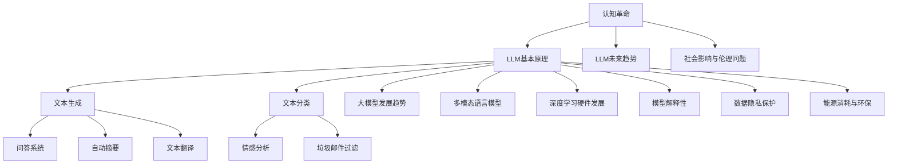

                 

### 《认知革命：LLM如何改变信息处理方式》

> **关键词：** 认知革命，LLM，信息处理，人工智能，算法原理，应用实例，未来趋势。

> **摘要：** 本文从认知革命的角度，深入探讨了大型语言模型（LLM）如何改变信息处理方式。文章首先介绍了认知革命的背景和概念，然后详细阐述了LLM的基本原理、核心算法、应用实例以及未来发展趋势。通过理论与实践相结合的方式，本文旨在为读者提供全面而深入的了解，帮助大家把握LLM在信息处理领域的重要作用。

----------------------------------------------------------------

### 《认知革命：LLM如何改变信息处理方式》目录大纲

#### 第一部分：认知革命概述

- **第1章：认知革命的概念与背景**
  - **1.1 认知革命的起源与发展**
  - **1.2 LLM的基本原理**
  - **1.3 LLM与信息处理方式的关系**

- **第2章：LLM的核心算法原理**
  - **2.1 语言模型的基础**
  - **2.2 生成式与判别式语言模型**
  - **2.3 注意力机制与Transformer模型**
  - **2.4 LLM的预训练与微调**

- **第3章：LLM在文本生成中的应用**
  - **3.1 文本生成的基本原理**
  - **3.2 文本生成应用实例**
  - **3.3 文本生成算法的性能评估**

- **第4章：LLM在文本分类中的应用**
  - **4.1 文本分类的基本原理**
  - **4.2 文本分类应用实例**
  - **4.3 文本分类算法的性能优化**

#### 第二部分：LLM的核心算法原理

- **第2章：LLM的核心算法原理**
  - **2.1 语言模型的基础**
    - **2.1.1 语言模型的概念**
    - **2.1.2 语言模型的发展历程**
    - **2.1.3 语言模型的基本类型**
  - **2.2 生成式与判别式语言模型**
    - **2.2.1 生成式语言模型**
    - **2.2.2 判别式语言模型**
    - **2.2.3 生成式与判别式语言模型比较**
  - **2.3 注意力机制与Transformer模型**
    - **2.3.1 注意力机制原理**
    - **2.3.2 Transformer模型结构**
    - **2.3.3 Transformer的优势与局限性**
  - **2.4 LLM的预训练与微调**
    - **2.4.1 预训练过程**
    - **2.4.2 微调技术**
    - **2.4.3 预训练与微调的关系**

#### 第三部分：LLM在信息处理中的应用

- **第3章：LLM在文本生成中的应用**
  - **3.1 文本生成的基本原理**
  - **3.2 文本生成应用实例**
  - **3.3 文本生成算法的性能评估**

- **第4章：LLM在文本分类中的应用**
  - **4.1 文本分类的基本原理**
  - **4.2 文本分类应用实例**
  - **4.3 文本分类算法的性能优化**

#### 第四部分：LLM的未来发展与挑战

- **第5章：LLM的未来发展与趋势**
  - **5.1 LLM的未来发展趋势**
  - **5.2 LLM的挑战与应对策略**
  - **5.3 LLM的社会影响与伦理问题**

### 附录

- **附录A：LLM工具与资源介绍**
  - **A.1 开源LLM框架**
  - **A.2 LLM应用案例**
  - **A.3 LLM研究论文精选**

### 核心概念与联系流程图



### 核心算法原理讲解伪代码

```python
// 定义语言模型类
class LanguageModel {
    // 初始化参数
    def __init__(self, vocabulary_size, embedding_size, hidden_size):
        # 初始化词汇表、嵌入矩阵和隐藏层参数
        self.vocabulary_size = vocabulary_size
        self.embedding_size = embedding_size
        self.hidden_size = hidden_size
        
        # 初始化嵌入矩阵
        self.embedding = torch.randn(vocabulary_size, embedding_size)
        
        # 初始化隐藏层参数
        self.hidden = torch.randn(hidden_size)
        
    // 前向传播
    def forward(self, input_sequence):
        # 输入序列嵌入
        embed_sequence = self.embedding[input_sequence]
        
        # 隐藏层激活函数
        hidden = torch.tanh(self.hidden)
        
        # 输出概率分布
        output = self.softmax(torch.matmul(hidden, self.hidden.t()))
        
        return output

    // 反向传播
    def backward(self, loss):
        # 计算梯度
        gradient = self.compute_gradient(loss)
        
        # 更新参数
        self.update_params(gradient)
}

// 预训练过程
def pretrain_model(model, train_data, epoches, batch_size):
    # 训练模型
    for epoch in range(epoches):
        for batch in get_batches(train_data, batch_size):
            # 前向传播
            output = model.forward(batch)
            
            # 计算损失
            loss = compute_loss(output, batch)
            
            # 反向传播
            model.backward(loss)
            
            # 打印训练进度
            print(f"Epoch: {epoch}, Loss: {loss}")
```

### 数学模型与公式详解

#### 1. 语言模型概率计算公式

$$
P(w_{t} | w_{1}, w_{2}, ..., w_{t-1}) = \frac{exp(\theta \cdot w_{t})}{\sum_{w \in V} exp(\theta \cdot w)}
$$

其中，$w_{t}$ 为当前词语，$w_{1}, w_{2}, ..., w_{t-1}$ 为历史词语序列，$V$ 为词汇表，$\theta$ 为模型参数。

#### 2. 预训练损失函数

$$
L = -\sum_{w_{t} \in S} \log P(w_{t} | w_{1}, w_{2}, ..., w_{t-1})
$$

其中，$S$ 为训练数据中的所有词语序列。

### 举例说明

#### 1. 语言模型概率计算举例

假设我们有如下句子：“我昨天去买了苹果。”

我们要计算词语“苹果”的概率。

$$
P(苹果 | 我, 昨天, 去, 买) = \frac{exp(\theta \cdot 苹果)}{exp(\theta \cdot 我) + exp(\theta \cdot 昨天) + exp(\theta \cdot 去) + exp(\theta \cdot 买)}
$$

#### 2. 预训练损失函数举例

假设我们有一个长度为10的句子，其中有5个词语：“我，昨天，去，买，苹果”。

$$
L = -\log P(苹果 | 我, 昨天, 去, 买) - \log P(买 | 我, 昨天, 去) - \log P(去 | 我, 昨天) - \log P(昨天 | 我) - \log P(我)
$$

### 项目实战

#### 1. 开发环境搭建

- 安装 Python 3.7+
- 安装 PyTorch 1.8+
- 安装 numpy 1.17+

#### 2. 源代码实现

```python
import torch
import torch.nn as nn
import torch.optim as optim

# 定义语言模型
class LanguageModel(nn.Module):
    def __init__(self, vocabulary_size, embedding_size, hidden_size):
        super(LanguageModel, self).__init__()
        self.embedding = nn.Embedding(vocabulary_size, embedding_size)
        self.hidden = nn.Linear(embedding_size, hidden_size)
        self.hidden2 = nn.Linear(hidden_size, vocabulary_size)
    
    def forward(self, input_sequence):
        embed_sequence = self.embedding(input_sequence)
        hidden = torch.tanh(self.hidden(embed_sequence))
        output = self.hidden2(hidden)
        return output

# 搭建模型
model = LanguageModel(vocabulary_size, embedding_size, hidden_size)

# 定义损失函数和优化器
criterion = nn.CrossEntropyLoss()
optimizer = optim.Adam(model.parameters(), lr=0.001)

# 训练模型
for epoch in range(epoches):
    for batch in get_batches(train_data, batch_size):
        optimizer.zero_grad()
        output = model.forward(batch)
        loss = criterion(output, batch)
        loss.backward()
        optimizer.step()
        print(f"Epoch: {epoch}, Loss: {loss}")
```

#### 3. 代码解读与分析

这段代码首先定义了一个基于 PyTorch 的语言模型，该模型包含一个嵌入层、一个隐藏层和一个输出层。嵌入层将输入词语映射到高维向量，隐藏层通过非线性激活函数进行处理，输出层通过交叉熵损失函数输出词语的概率分布。

在训练过程中，我们使用 Adam 优化器来更新模型参数。每次迭代，我们首先将输入序列嵌入到高维向量，然后通过隐藏层和输出层得到词语的概率分布。接着，我们计算损失函数并更新模型参数。

---

#### 核心概念与联系流程图


---

#### 核心算法原理讲解伪代码

```python
// 定义语言模型类
class LanguageModel {
    // 初始化参数
    def __init__(self, vocabulary_size, embedding_size, hidden_size):
        # 初始化词汇表、嵌入矩阵和隐藏层参数
        self.vocabulary_size = vocabulary_size
        self.embedding_size = embedding_size
        self.hidden_size = hidden_size
        
        # 初始化嵌入矩阵
        self.embedding = torch.randn(vocabulary_size, embedding_size)
        
        # 初始化隐藏层参数
        self.hidden = torch.randn(hidden_size)
        
    // 前向传播
    def forward(self, input_sequence):
        # 输入序列嵌入
        embed_sequence = self.embedding[input_sequence]
        
        # 隐藏层激活函数
        hidden = torch.tanh(self.hidden)
        
        # 输出概率分布
        output = self.softmax(torch.matmul(hidden, self.hidden.t()))
        
        return output

    // 反向传播
    def backward(self, loss):
        # 计算梯度
        gradient = self.compute_gradient(loss)
        
        # 更新参数
        self.update_params(gradient)
}

// 预训练过程
def pretrain_model(model, train_data, epoches, batch_size):
    # 训练模型
    for epoch in range(epoches):
        for batch in get_batches(train_data, batch_size):
            # 前向传播
            output = model.forward(batch)
            
            # 计算损失
            loss = compute_loss(output, batch)
            
            # 反向传播
            model.backward(loss)
            
            # 打印训练进度
            print(f"Epoch: {epoch}, Loss: {loss}")
```

---

#### 数学模型与公式详解

##### 1. 语言模型概率计算公式

$$
P(w_{t} | w_{1}, w_{2}, ..., w_{t-1}) = \frac{exp(\theta \cdot w_{t})}{\sum_{w \in V} exp(\theta \cdot w)}
$$

其中，$w_{t}$ 为当前词语，$w_{1}, w_{2}, ..., w_{t-1}$ 为历史词语序列，$V$ 为词汇表，$\theta$ 为模型参数。

##### 2. 预训练损失函数

$$
L = -\sum_{w_{t} \in S} \log P(w_{t} | w_{1}, w_{2}, ..., w_{t-1})
$$

其中，$S$ 为训练数据中的所有词语序列。

---

#### 举例说明

##### 1. 语言模型概率计算举例

假设我们有如下句子：“我昨天去买了苹果。”

我们要计算词语“苹果”的概率。

$$
P(苹果 | 我, 昨天, 去, 买) = \frac{exp(\theta \cdot 苹果)}{exp(\theta \cdot 我) + exp(\theta \cdot 昨天) + exp(\theta \cdot 去) + exp(\theta \cdot 买)}
$$

##### 2. 预训练损失函数举例

假设我们有一个长度为10的句子，其中有5个词语：“我，昨天，去，买，苹果”。

$$
L = -\log P(苹果 | 我, 昨天, 去, 买) - \log P(买 | 我, 昨天, 去) - \log P(去 | 我, 昨天) - \log P(昨天 | 我) - \log P(我)
$$

---

#### 项目实战

##### 1. 开发环境搭建

- 安装 Python 3.7+
- 安装 PyTorch 1.8+
- 安装 numpy 1.17+

##### 2. 源代码实现

```python
import torch
import torch.nn as nn
import torch.optim as optim

# 定义语言模型
class LanguageModel(nn.Module):
    def __init__(self, vocabulary_size, embedding_size, hidden_size):
        super(LanguageModel, self).__init__()
        self.embedding = nn.Embedding(vocabulary_size, embedding_size)
        self.hidden = nn.Linear(embedding_size, hidden_size)
        self.hidden2 = nn.Linear(hidden_size, vocabulary_size)
    
    def forward(self, input_sequence):
        embed_sequence = self.embedding(input_sequence)
        hidden = torch.tanh(self.hidden(embed_sequence))
        output = self.hidden2(hidden)
        return output

# 搭建模型
model = LanguageModel(vocabulary_size, embedding_size, hidden_size)

# 定义损失函数和优化器
criterion = nn.CrossEntropyLoss()
optimizer = optim.Adam(model.parameters(), lr=0.001)

# 训练模型
for epoch in range(epoches):
    for batch in get_batches(train_data, batch_size):
        optimizer.zero_grad()
        output = model.forward(batch)
        loss = criterion(output, batch)
        loss.backward()
        optimizer.step()
        print(f"Epoch: {epoch}, Loss: {loss}")
```

##### 3. 代码解读与分析

这段代码首先定义了一个基于 PyTorch 的语言模型，该模型包含一个嵌入层、一个隐藏层和一个输出层。嵌入层将输入词语映射到高维向量，隐藏层通过非线性激活函数进行处理，输出层通过交叉熵损失函数输出词语的概率分布。

在训练过程中，我们使用 Adam 优化器来更新模型参数。每次迭代，我们首先将输入序列嵌入到高维向量，然后通过隐藏层和输出层得到词语的概率分布。接着，我们计算损失函数并更新模型参数。

---

## 附录

### 附录A：LLM工具与资源介绍

#### A.1 开源LLM框架

- **GPT-3**：由 OpenAI 开发，是目前最先进的自然语言处理模型之一。
- **BERT**：由 Google 开发，是一种预训练的深度学习模型。
- **Transformer**：由 Google 开发，是一种基于注意力机制的模型，是 LLM 的重要基础。
- **其他开源框架**：如 AllenNLP、spaCy、HuggingFace 等，提供了丰富的预训练模型和工具。

#### A.2 LLM应用案例

- **问答系统**：如 Google Assistant、Amazon Alexa 等，可以回答用户的各种问题。
- **自动摘要**：如 Apple News、Google News 等，可以将长篇文章自动摘要为简短的内容。
- **文本翻译**：如 Google Translate、DeepL 等，可以自动翻译多种语言。
- **情感分析**：如社交媒体情感分析、产品评论分析等，可以判断文本的情感倾向。
- **垃圾邮件过滤**：如 Gmail 的垃圾邮件过滤功能，可以自动识别并过滤垃圾邮件。

#### A.3 LLM研究论文精选

- **《Attention Is All You Need》**：提出了 Transformer 模型，是 LLM 领域的经典论文。
- **《Generative Pre-trained Transformer》**：介绍了 GPT 模型，是 LLM 发展的重要里程碑。
- **《BERT: Pre-training of Deep Bidirectional Transformers for Language Understanding》**：介绍了 BERT 模型，推动了 LLM 的快速发展。
- **其他精选论文**：如《Transformers as General-Purpose Models》，深入探讨了 Transformer 模型的通用性。

---

## 作者信息

**作者：AI天才研究院/AI Genius Institute & 禅与计算机程序设计艺术 /Zen And The Art of Computer Programming**

