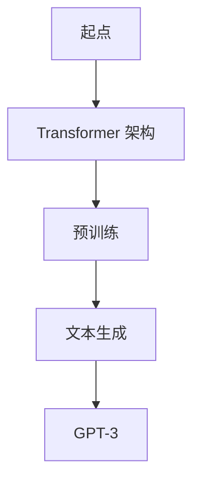
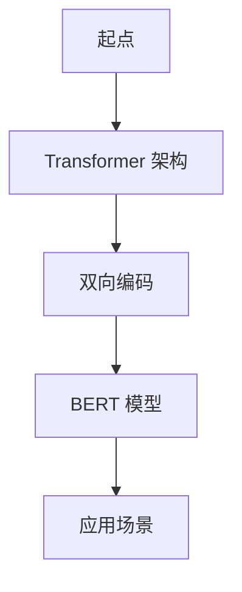
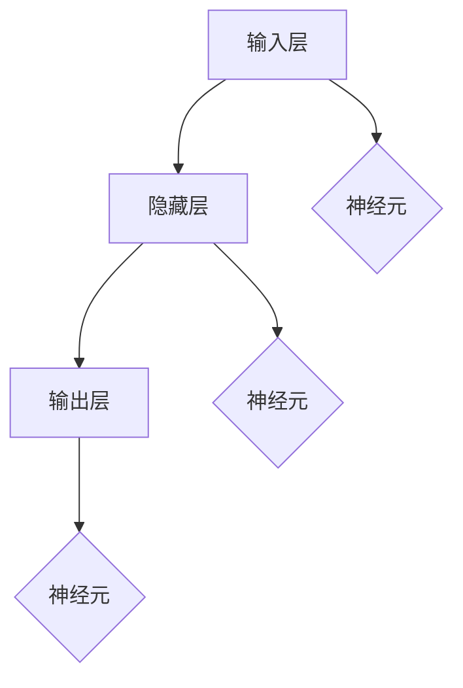

                 

# 《软件 2.0 的应用领域：图像识别、语音识别》

> **关键词：软件 2.0，图像识别，语音识别，AI 大模型，深度学习，技术应用**

> **摘要：本文深入探讨软件 2.0 时代下图像识别和语音识别的应用领域，分析 AI 大模型在这些领域的核心作用，以及其面临的挑战和机遇。文章将基于逻辑清晰、结构紧凑、简单易懂的论述方式，为读者提供关于这两个领域的全面解读。**

---

## 《软件 2.0 的应用领域：图像识别、语音识别》目录大纲

## 第一部分：软件 2.0 与 AI 大模型基础

### 第1章：软件 2.0 与 AI 大模型概述

### 第2章：AI 大模型技术基础

## 第二部分：图像识别应用领域

### 第3章：图像识别基础理论

### 第4章：图像识别应用实例

### 第5章：图像识别系统开发实战

## 第三部分：语音识别应用领域

### 第6章：语音识别基础理论

### 第7章：语音识别应用实例

### 第8章：语音识别系统开发实战

## 第四部分：综合应用

### 第9章：跨领域 AI 大模型应用

### 第10章：未来展望

## 附录

### 附录 A：常用工具与资源

---

## 第一部分：软件 2.0 与 AI 大模型基础

### 第1章：软件 2.0 与 AI 大模型概述

#### 1.1 软件 2.0 时代的到来

##### 1.1.1 从软件 1.0 到软件 2.0 的演进

在计算机发展的历程中，软件经历了从 1.0 到 2.0 的演变。软件 1.0 时代主要集中在桌面应用程序和操作系统层面，软件的交互方式主要是命令行和图形用户界面（GUI）。而随着互联网的兴起，软件 2.0 应运而生，这一时代的软件更加注重用户交互和数据共享，云计算和移动计算成为主流。

软件 2.0 的关键特征在于其高度的网络化和智能化。传统软件通常是以提供功能为中心，而软件 2.0 则更强调用户体验和服务。例如，电子邮件、社交媒体、电子商务等都是软件 2.0 的典型应用场景。这些应用不仅提供了丰富的功能，还能够根据用户的行为数据提供个性化的服务。

##### 1.1.2 大模型在软件 2.0 中的核心地位

在软件 2.0 时代，AI 大模型成为了推动软件创新的核心力量。AI 大模型，如 GPT、BERT 等，具有强大的数据分析和处理能力，能够处理大量复杂的数据，并从中提取有价值的信息。这使得软件能够更加智能化，提供更加精准的服务。

大模型在软件 2.0 中的应用主要体现在以下几个方面：

1. **自然语言处理**：大模型在文本生成、翻译、情感分析等方面有着广泛的应用。例如，GPT-3 可以生成高质量的文章，BERT 在搜索引擎中用于理解用户查询的语义。

2. **图像识别**：大模型通过深度学习技术，能够实现对图像的精准识别，例如人脸识别、车辆识别等。这为安防、交通、医疗等多个领域提供了强大的技术支持。

3. **语音识别**：大模型能够实现对语音信号的精准识别，并理解其语义，这对于智能助手、语音翻译等应用具有重要意义。

##### 1.1.3 企业级应用开发的新范式

在软件 2.0 时代，企业级应用开发也呈现出新的范式。传统的软件开发往往以功能为核心，而软件 2.0 则更加注重用户体验和服务。企业级应用开发需要更加灵活和快速，以满足不断变化的市场需求。

AI 大模型为企业级应用开发带来了以下变革：

1. **敏捷开发**：大模型可以快速构建原型，并通过不断优化来提升模型的性能。这使得企业能够更加敏捷地响应市场变化。

2. **数据驱动**：大模型能够处理和分析大量数据，帮助企业从数据中挖掘有价值的信息，从而做出更加明智的决策。

3. **智能化服务**：大模型能够提供个性化的服务，提高用户体验。例如，智能客服系统可以自动回答客户的问题，提高客服效率。

#### 1.2 AI 大模型的定义与特点

##### 1.2.1 AI 大模型的定义

AI 大模型是指具有亿级参数规模，能够处理大规模数据并进行复杂任务的人工智能模型。这些模型通常基于深度学习技术，通过大规模数据训练得到，具有强大的数据分析和处理能力。

##### 1.2.2 AI 大模型的核心特点

1. **规模巨大**：AI 大模型具有数十亿甚至千亿级参数规模，这使得它们能够处理复杂的任务。

2. **数据驱动**：AI 大模型的性能依赖于大量高质量的数据，通过数据驱动的方式进行优化和改进。

3. **通用性强**：AI 大模型具有较强的通用性，可以应用于多个领域，如自然语言处理、图像识别、语音识别等。

##### 1.2.3 AI 大模型与传统 AI 的区别

传统 AI 模型通常具有较小的参数规模，针对特定任务进行设计。而 AI 大模型则具有更大的参数规模，能够处理更复杂的任务。此外，传统 AI 模型通常需要大量手动特征工程，而 AI 大模型则能够自动从数据中提取特征。

#### 1.3 主流 AI 大模型简介

##### 1.3.1 GPT 系列模型

GPT（Generative Pre-trained Transformer）系列模型是由 OpenAI 开发的自然语言处理模型。GPT-3 是目前最大的自然语言处理模型，具有 1750 亿个参数。GPT-3 在文本生成、翻译、问答等方面表现出色。

##### 1.3.2 BERT 及其变体

BERT（Bidirectional Encoder Representations from Transformers）是由 Google 开发的自然语言处理模型。BERT 通过双向 Transformer 架构，对文本进行编码，从而实现对文本语义的理解。BERT 在搜索引擎、问答系统、文本分类等方面有广泛应用。

##### 1.3.3 其他知名大模型介绍

除了 GPT 和 BERT，还有许多其他知名的大模型，如：

- T5（Text-to-Text Transfer Transformer）：T5 是一个通用目的的文本处理模型，旨在通过文本到文本的格式实现各种 NLP 任务。

- RoBERTa（A Robustly Optimized BERT Pretraining Approach）：RoBERTa 是对 BERT 模型的改进版本，通过调整训练策略，提高了模型的性能。

- ViT（Vision Transformer）：ViT 是一个用于图像分类的 Transformer 模型，它通过将图像分成多个区域，然后将这些区域作为输入，进行分类。

#### 1.4 AI 大模型在企业中的应用前景

##### 1.4.1 AI 大模型的潜在应用领域

AI 大模型在企业中的应用前景广阔，主要涵盖以下领域：

1. **客户服务**：AI 大模型可以用于智能客服系统，自动处理客户咨询，提高客户满意度。

2. **金融风控**：AI 大模型可以用于风险预测和欺诈检测，提高金融服务的安全性。

3. **医疗诊断**：AI 大模型可以用于医学图像分析，辅助医生进行疾病诊断。

4. **智能制造**：AI 大模型可以用于质量控制、设备故障预测等，提高生产效率。

##### 1.4.2 企业采用 AI 大模型的优势

企业采用 AI 大模型具有以下优势：

1. **提高效率**：AI 大模型能够快速处理大量数据，提高业务流程的效率。

2. **降低成本**：AI 大模型可以自动化许多重复性工作，减少人力成本。

3. **提升竞争力**：AI 大模型可以帮助企业快速响应市场变化，提高竞争力。

##### 1.4.3 AI 大模型应用的挑战与机遇

尽管 AI 大模型在企业中具有广泛的应用前景，但同时也面临着一些挑战和机遇：

1. **数据隐私**：大模型需要大量数据来训练，这可能涉及用户隐私问题。

2. **计算资源**：大模型训练需要大量的计算资源，这可能会增加企业的成本。

3. **模型解释性**：大模型的决策过程往往缺乏透明度，这可能会影响其在某些领域的应用。

4. **技术突破**：随着技术的不断发展，大模型将面临更多的技术挑战和机遇。

### 第2章：AI 大模型技术基础

#### 2.1 深度学习与神经网络基础

##### 2.1.1 神经网络的基本结构

神经网络是深度学习的基础，由多个层组成，包括输入层、隐藏层和输出层。每个层由多个神经元组成，神经元之间通过权重进行连接。

##### 2.1.2 常见的深度学习架构

深度学习架构包括卷积神经网络（CNN）、循环神经网络（RNN）和 Transformer 架构等。

- **卷积神经网络（CNN）**：主要用于图像识别任务，通过卷积层、池化层和全连接层进行特征提取。

- **循环神经网络（RNN）**：主要用于序列数据处理，如自然语言处理和语音识别，通过隐藏状态进行序列建模。

- **Transformer 架构**：用于自然语言处理和机器翻译等任务，通过自注意力机制实现序列建模。

##### 2.1.3 深度学习优化算法

深度学习优化算法包括随机梯度下降（SGD）、Adam 和 Adagrad 等。

- **随机梯度下降（SGD）**：是最基本的优化算法，通过随机梯度更新模型参数。

- **Adam**：是 SGD 的改进版本，通过自适应学习率进行优化。

- **Adagrad**：通过累积梯度进行优化，适用于稀疏数据。

#### 2.2 自然语言处理技术概览

##### 2.2.1 词嵌入技术

词嵌入是将词汇映射到向量空间的技术，如 Word2Vec、GloVe 等。

- **Word2Vec**：通过负采样训练词向量，实现词汇向量化表示。

- **GloVe**：通过共现矩阵训练词向量，具有更好的语义表示能力。

##### 2.2.2 序列模型与注意力机制

序列模型用于处理序列数据，如 RNN 和 Transformer。

- **RNN**：通过隐藏状态进行序列建模，适用于自然语言处理和语音识别等任务。

- **Transformer**：通过自注意力机制实现序列建模，具有更好的并行化性能。

##### 2.2.3 转换器架构详解

转换器架构是自然语言处理领域的一种先进模型，通过编码器和解码器进行序列转换。

- **编码器**：将输入序列编码为固定长度的向量。

- **解码器**：将编码器输出的向量解码为输出序列。

- **自注意力机制**：使模型能够关注输入序列中的重要信息，提高模型性能。

#### 2.3 大规模预训练模型原理

##### 2.3.1 预训练的概念与意义

预训练是指在大规模数据集上对模型进行训练，使其具有通用特征。预训练的意义在于：

- **提高模型性能**：预训练模型在大规模数据集上学习到丰富的特征，从而提高模型性能。

- **减少标注数据需求**：预训练模型可以通过无监督学习从大规模数据中学习特征，从而减少对标注数据的依赖。

##### 2.3.2 自监督学习方法

自监督学习是一种无需人工标注数据，通过对输入数据进行自动标注进行训练的方法。自监督学习方法包括：

- **预测目标**：通过预测输入序列中的某些元素，如 Word2Vec 中的目标词预测。

- **预测位置**：通过预测输入序列中某个词的位置，如 BERT 中的 masked 语言模型。

##### 2.3.3 迁移学习与微调技术

迁移学习是指将预训练模型在不同任务上进行微调，以提高模型在新任务上的性能。微调技术包括：

- **从头开始训练**：在新的数据集上从头开始训练模型。

- **微调**：在预训练模型的基础上，针对新任务进行少量训练。

#### 2.4 AI 大模型在企业中的应用前景

##### 2.4.1 AI 大模型的潜在应用领域

AI 大模型在企业中的应用前景广阔，主要涵盖以下领域：

1. **客户服务**：AI 大模型可以用于智能客服系统，自动处理客户咨询，提高客户满意度。

2. **金融风控**：AI 大模型可以用于风险预测和欺诈检测，提高金融服务的安全性。

3. **医疗诊断**：AI 大模型可以用于医学图像分析，辅助医生进行疾病诊断。

4. **智能制造**：AI 大模型可以用于质量控制、设备故障预测等，提高生产效率。

##### 2.4.2 企业采用 AI 大模型的优势

企业采用 AI 大模型具有以下优势：

1. **提高效率**：AI 大模型能够快速处理大量数据，提高业务流程的效率。

2. **降低成本**：AI 大模型可以自动化许多重复性工作，减少人力成本。

3. **提升竞争力**：AI 大模型可以帮助企业快速响应市场变化，提高竞争力。

##### 2.4.3 AI 大模型应用的挑战与机遇

尽管 AI 大模型在企业中具有广泛的应用前景，但同时也面临着一些挑战和机遇：

1. **数据隐私**：大模型需要大量数据来训练，这可能涉及用户隐私问题。

2. **计算资源**：大模型训练需要大量的计算资源，这可能会增加企业的成本。

3. **模型解释性**：大模型的决策过程往往缺乏透明度，这可能会影响其在某些领域的应用。

4. **技术突破**：随着技术的不断发展，大模型将面临更多的技术挑战和机遇。

### 第3章：图像识别基础理论

#### 3.1 图像识别的概念与分类

##### 3.1.1 图像识别的定义

图像识别是指通过计算机对图像进行分析和处理，从而识别出图像中的物体、场景或特征。图像识别是计算机视觉领域的一个重要分支，广泛应用于安防监控、医疗诊断、自动驾驶、工业自动化等多个领域。

##### 3.1.2 图像识别的分类

图像识别可以根据不同的标准进行分类，以下是几种常见的分类方法：

1. **按任务类型分类**：

   - **目标检测**：在图像中识别并定位多个目标对象，如人脸检测、车辆检测等。

   - **图像分类**：将图像分类到预定义的类别中，如图像识别系统中的猫狗分类。

   - **目标跟踪**：在视频序列中跟踪运动目标，如行人跟踪、车辆跟踪等。

2. **按算法类型分类**：

   - **传统图像识别**：基于传统图像处理技术，如边缘检测、特征匹配等。

   - **深度学习图像识别**：基于深度学习算法，如卷积神经网络（CNN）等。

#### 3.2 图像特征提取技术

##### 3.2.1 传统图像特征提取方法

传统图像特征提取方法主要包括：

- **边缘检测**：用于检测图像中的边缘，如 Canny 边缘检测。

- **角点检测**：用于检测图像中的角点，如 Shi-Tomasi 角点检测。

- **纹理特征提取**：用于提取图像中的纹理特征，如 Haralick 纹理特征。

##### 3.2.2 深度学习特征提取方法

深度学习特征提取方法主要基于卷积神经网络（CNN），通过多层卷积和池化操作提取图像的特征。以下是几种常用的深度学习特征提取方法：

- **VGGNet**：是一种较浅的卷积神经网络，通过多个卷积层和池化层提取图像特征。

- **ResNet**：是一种深层卷积神经网络，通过引入残差连接来解决深层网络训练困难的问题。

- **InceptionNet**：是一种基于 inception 模块的卷积神经网络，通过不同尺寸的卷积核组合提取图像特征。

#### 3.3 基于卷积神经网络的图像识别

##### 3.3.1 卷积神经网络的基本原理

卷积神经网络（CNN）是一种深度学习模型，主要用于图像识别任务。CNN 由多个卷积层、池化层和全连接层组成，通过卷积操作提取图像特征，并通过全连接层进行分类。

- **卷积层**：通过卷积操作提取图像的特征，如边缘、纹理等。

- **池化层**：用于降低图像分辨率，减少计算量。

- **全连接层**：用于对提取的特征进行分类。

##### 3.3.2 卷积神经网络在图像识别中的应用

卷积神经网络在图像识别中的应用广泛，以下是一些典型的应用场景：

- **人脸识别**：通过卷积神经网络提取人脸特征，实现人脸识别。

- **车辆识别**：通过卷积神经网络提取车辆特征，实现车辆识别。

- **图像分类**：通过卷积神经网络对图像进行分类，如猫狗分类。

#### 3.4 图像识别算法性能评估

##### 3.4.1 准确率、召回率与 F1 值

图像识别算法的性能评估通常使用准确率、召回率与 F1 值等指标。

- **准确率**：正确识别的图像数量与总图像数量的比值，用于评估分类器的整体性能。

- **召回率**：正确识别的图像数量与实际包含目标图像数量的比值，用于评估分类器对正样本的识别能力。

- **F1 值**：准确率和召回率的调和平均值，用于综合考虑分类器的性能。

##### 3.4.2 交叉验证与测试集划分

交叉验证和测试集划分是图像识别算法性能评估的重要方法。

- **交叉验证**：通过将数据集划分为多个子集，对每个子集进行训练和验证，以评估模型的泛化能力。

- **测试集划分**：将数据集划分为训练集和测试集，用于评估模型的最终性能。

### 第4章：图像识别应用实例

#### 4.1 人脸识别

##### 4.1.1 人脸检测

人脸检测是图像识别中的一个重要任务，其目的是在图像中定位和检测人脸。人脸检测通常基于深度学习模型，如 YOLO、SSD 等。

- **YOLO**：YOLO（You Only Look Once）是一种基于卷积神经网络的实时目标检测算法，具有高效的检测性能。

- **SSD**：SSD（Single Shot MultiBox Detector）是一种单阶段的目标检测算法，通过不同尺度的卷积层提取特征，实现快速、准确的人脸检测。

##### 4.1.2 人脸特征提取

人脸特征提取是图像识别中的关键步骤，其目的是从人脸图像中提取具有区分度的特征。人脸特征提取通常基于深度学习模型，如 FaceNet、VGGFace 等。

- **FaceNet**：FaceNet 是一种基于深度学习的面部识别算法，通过训练一个共享层的神经网络来学习人脸特征，实现人脸匹配和识别。

- **VGGFace**：VGGFace 是基于 VGG 网络的人脸识别模型，通过多个卷积层和池化层提取人脸特征，实现人脸识别。

##### 4.1.3 人脸识别算法

人脸识别算法是指通过比较人脸特征向量来判定两个人脸是否相同。人脸识别算法通常包括特征提取、特征匹配和分类等步骤。

- **特征提取**：通过深度学习模型提取人脸特征向量。

- **特征匹配**：计算人脸特征向量之间的相似度，通常使用欧氏距离或余弦相似度。

- **分类**：根据特征匹配结果对两个人脸进行分类。

#### 4.2 车辆识别

##### 4.2.1 车辆检测

车辆检测是图像识别中的一个重要任务，其目的是在图像中定位和检测车辆。车辆检测通常基于深度学习模型，如 YOLO、Faster R-CNN 等。

- **YOLO**：YOLO 是一种基于卷积神经网络的实时目标检测算法，适用于车辆检测。

- **Faster R-CNN**：Faster R-CNN 是一种基于区域建议的网络，通过区域建议网络（RPN）和分类网络（ROI 分类器）实现车辆检测。

##### 4.2.2 车辆特征提取

车辆特征提取是图像识别中的关键步骤，其目的是从车辆图像中提取具有区分度的特征。车辆特征提取通常基于深度学习模型，如 VGGNet、ResNet 等。

- **VGGNet**：VGGNet 是一种基于卷积神经网络的图像识别模型，通过多层卷积和池化层提取车辆特征。

- **ResNet**：ResNet 是一种基于残差连接的深层卷积神经网络，通过解决深层网络训练困难的问题，提高车辆特征提取的性能。

##### 4.2.3 车辆识别算法

车辆识别算法是指通过比较车辆特征向量来判定两个车辆是否相同。车辆识别算法通常包括特征提取、特征匹配和分类等步骤。

- **特征提取**：通过深度学习模型提取车辆特征向量。

- **特征匹配**：计算车辆特征向量之间的相似度，通常使用欧氏距离或余弦相似度。

- **分类**：根据特征匹配结果对两个车辆进行分类。

### 第5章：图像识别系统开发实战

#### 5.1 图像识别系统架构设计

##### 5.1.1 系统需求分析

在进行图像识别系统开发之前，首先需要进行系统需求分析。系统需求分析包括以下几个方面：

- **功能需求**：确定系统需要实现的功能，如人脸检测、车辆检测、图像分类等。

- **性能需求**：确定系统需要满足的性能指标，如响应时间、准确率等。

- **可靠性需求**：确定系统需要达到的可靠性要求，如故障率、容错能力等。

- **安全性需求**：确定系统需要满足的安全要求，如数据加密、访问控制等。

##### 5.1.2 系统功能模块设计

图像识别系统通常包括以下几个功能模块：

- **数据采集模块**：用于采集图像数据，可以是实时采集或批量导入。

- **数据预处理模块**：用于对图像数据进行预处理，如尺寸调整、数据增强等。

- **模型训练模块**：用于训练图像识别模型，可以是基于深度学习框架的训练。

- **模型评估模块**：用于评估模型性能，如准确率、召回率等。

- **模型部署模块**：用于将训练好的模型部署到生产环境中，提供图像识别服务。

#### 5.2 开发环境搭建与配置

在进行图像识别系统开发时，需要搭建合适的开发环境。以下是一个典型的开发环境搭建步骤：

- **操作系统**：选择合适的操作系统，如 Ubuntu 18.04。

- **深度学习框架**：安装常用的深度学习框架，如 TensorFlow、PyTorch 等。

- **编程语言**：选择合适的编程语言，如 Python。

- **依赖库**：安装必要的依赖库，如 NumPy、Pandas、Matplotlib 等。

#### 5.3 图像识别模型训练与调优

##### 5.3.1 数据预处理

在进行图像识别模型训练之前，需要对图像数据进行分析和预处理。以下是一些常用的数据预处理方法：

- **数据清洗**：去除图像中的噪声、异常值等。

- **数据增强**：通过旋转、翻转、缩放等操作增加数据多样性。

- **数据归一化**：将图像数据归一化到 [0, 1] 范围内，方便模型训练。

##### 5.3.2 模型选择与训练

选择合适的图像识别模型进行训练，如卷积神经网络（CNN）、循环神经网络（RNN）等。以下是一个简单的训练流程：

1. **模型定义**：定义神经网络模型的结构，包括输入层、隐藏层和输出层。

2. **模型编译**：配置模型的训练参数，如优化器、损失函数等。

3. **模型训练**：使用训练数据对模型进行训练，通过反向传播算法更新模型参数。

4. **模型评估**：使用验证数据对模型性能进行评估，调整模型参数。

##### 5.3.3 模型调优与评估

在训练过程中，需要对模型进行调优，以获得更好的性能。以下是一些常见的调优方法：

- **调整学习率**：通过调整学习率，优化模型训练过程。

- **添加正则化**：通过添加正则化项，防止模型过拟合。

- **数据增强**：通过增加数据增强操作，提高模型泛化能力。

- **模型融合**：通过融合多个模型，提高模型性能。

通过以上步骤，可以开发出一个性能优异的图像识别系统。

### 第6章：语音识别基础理论

#### 6.1 语音识别的概念与分类

##### 6.1.1 语音识别的定义

语音识别是指利用计算机技术，将人类的语音信号转换为相应的文本或命令。语音识别系统通常由声学模型、语言模型和声学-语言模型三个部分组成，通过协同工作实现语音到文本的转换。

##### 6.1.2 语音识别的分类

语音识别可以根据不同的分类标准进行分类，以下是几种常见的分类方法：

1. **按语音类型分类**：

   - **孤立词语音识别**：每个单词独立发音，没有连续性。

   - **连续语音识别**：单词之间具有连续性，如日常对话。

2. **按应用领域分类**：

   - **电话语音识别**：在电话环境下进行语音识别，对实时性要求较高。

   - **听写语音识别**：在安静环境下进行语音识别，对准确性要求较高。

3. **按识别方式分类**：

   - **基于模板匹配的方法**：通过模板匹配实现语音识别，如动态时间规整（DTW）。

   - **基于统计模型的方法**：通过统计模型实现语音识别，如高斯混合模型（GMM）。

#### 6.2 语音信号处理技术

##### 6.2.1 语音信号采样与量化

语音信号处理的第一步是对语音信号进行采样和量化。采样是指将连续的语音信号转换为离散的样本值，通常使用固定的采样率（如 16kHz）。量化是指将连续的样本值转换为有限位的数字表示，通常使用固定的量化位数（如 16 位）。

##### 6.2.2 语音信号增强与去噪

语音信号增强与去噪是语音识别中的关键步骤，其目的是提高语音信号的质量，降低噪声对识别结果的影响。常用的语音增强方法包括：

- **谱减法**：通过谱减法去除语音信号中的背景噪声。

- **维纳滤波**：通过维纳滤波器对语音信号进行滤波，以降低噪声的影响。

- **自适应滤波**：通过自适应滤波器对语音信号进行滤波，以适应不同的噪声环境。

#### 6.3 声学模型与语言模型

##### 6.3.1 声学模型

声学模型是语音识别系统中的核心组成部分，用于对语音信号进行建模。声学模型通常采用统计模型，如高斯混合模型（GMM）或深度神经网络（DNN）。声学模型通过学习语音信号的特征参数，实现对语音信号的建模。

- **高斯混合模型（GMM）**：GMM 是一种基于统计的声学模型，通过高斯分布对语音信号进行建模。

- **深度神经网络（DNN）**：DNN 是一种基于神经网络的声学模型，通过多层神经网络对语音信号进行建模。

##### 6.3.2 语言模型

语言模型是语音识别系统中的另一个重要组成部分，用于对语音信号中的语言结构进行建模。语言模型通常采用统计模型，如 N-gram 模型或循环神经网络（RNN）。语言模型通过学习语言的使用规则，实现对语音信号中语言结构的建模。

- **N-gram 模型**：N-gram 模型是一种基于统计的语言模型，通过 N 个连续单词的概率分布对语言进行建模。

- **循环神经网络（RNN）**：RNN 是一种基于神经网络的深度语言模型，通过循环结构对语言序列进行建模。

##### 6.3.3 声学模型与语言模型的融合

声学模型和语言模型在语音识别中协同工作，以提高识别的准确率。声学模型负责对语音信号进行特征提取，而语言模型负责对提取的特征进行解释。常见的声学模型与语言模型融合方法包括：

- **三叉树模型**：三叉树模型将声学模型和语言模型组合在一起，通过共同优化提高识别性能。

- **CTC（Connectionist Temporal Classification）**：CTC 是一种用于语音识别的深度学习框架，通过将声学模型和语言模型融合，实现对语音信号的高效识别。

#### 6.4 基于深度学习的语音识别模型

深度学习在语音识别领域取得了显著的成果，基于深度学习的语音识别模型成为研究的热点。以下是一些常见的基于深度学习的语音识别模型：

- **DNN-HMM**：DNN-HMM 结合了深度神经网络和隐马尔可夫模型，通过深度神经网络对语音信号进行特征提取，再结合隐马尔可夫模型进行语音识别。

- **CTC**：CTC 是一种基于深度学习的语音识别框架，通过将声学模型和语言模型融合，实现对语音信号的高效识别。

- **BERT**：BERT 是一种基于 Transformer 架构的深度学习模型，通过自注意力机制对语音信号进行建模，具有强大的语音识别能力。

### 第7章：语音识别应用实例

#### 7.1 语音助手

##### 7.1.1 语音识别与语义理解

语音助手是语音识别技术的典型应用之一，通过语音识别将用户的语音指令转换为文本，然后通过语义理解实现相应的功能。语音助手的基本流程包括以下几个步骤：

1. **语音识别**：使用语音识别模型对用户输入的语音进行识别，转换为文本。

2. **语义理解**：使用自然语言处理（NLP）技术对识别出的文本进行分析，理解用户的意图。

3. **执行操作**：根据语义理解的结果，执行相应的操作，如查询天气、发送消息等。

##### 7.1.2 语音助手功能实现

语音助手的功能实现主要包括以下几个方面：

1. **语音识别**：使用深度学习模型进行语音识别，将用户的语音转换为文本。

2. **语义理解**：使用自然语言处理（NLP）技术，如词向量、句法分析等，对识别出的文本进行分析，理解用户的意图。

3. **任务执行**：根据语义理解的结果，调用相应的API或执行具体的任务，如查询天气、发送消息等。

#### 7.2 语音翻译

##### 7.2.1 双语语音信号的预处理

语音翻译是指将一种语言的语音转换为另一种语言的语音。语音翻译的基本流程包括以下几个步骤：

1. **语音信号预处理**：对双语语音信号进行预处理，如降噪、增强等。

2. **语音识别**：使用语音识别模型对双语语音信号进行识别，转换为文本。

3. **语义理解**：使用自然语言处理（NLP）技术，对识别出的文本进行分析，理解用户的意图。

4. **语音合成**：使用语音合成模型将翻译后的文本转换为语音。

5. **语音输出**：将合成的语音输出到扬声器或语音输出设备。

##### 7.2.2 基于神经网络的语音翻译模型

基于神经网络的语音翻译模型是语音翻译技术的一种先进方法。该模型通常包括以下几个步骤：

1. **语音识别**：使用深度学习模型对双语语音信号进行识别，转换为文本。

2. **文本翻译**：使用神经网络翻译模型，如 Seq2Seq 模型、Transformer 模型等，对识别出的文本进行翻译。

3. **语音合成**：使用语音合成模型将翻译后的文本转换为语音。

4. **语音输出**：将合成的语音输出到扬声器或语音输出设备。

##### 7.2.3 语音翻译系统的实现

语音翻译系统的实现通常包括以下几个方面：

1. **数据收集与预处理**：收集双语语音数据，并进行预处理，如降噪、增强、分割等。

2. **模型训练**：使用预处理后的数据训练语音识别、文本翻译和语音合成模型。

3. **模型集成**：将训练好的模型集成到语音翻译系统中，实现语音翻译功能。

4. **系统部署**：将语音翻译系统部署到服务器或移动设备上，供用户使用。

### 第8章：语音识别系统开发实战

#### 8.1 语音识别系统架构设计

##### 8.1.1 系统需求分析

在进行语音识别系统开发之前，首先需要进行系统需求分析。系统需求分析包括以下几个方面：

1. **功能需求**：确定系统需要实现的功能，如语音识别、语义理解、语音合成等。

2. **性能需求**：确定系统需要满足的性能指标，如识别准确率、响应时间等。

3. **可靠性需求**：确定系统需要达到的可靠性要求，如故障率、容错能力等。

4. **安全性需求**：确定系统需要满足的安全要求，如数据加密、访问控制等。

##### 8.1.2 系统功能模块设计

语音识别系统通常包括以下几个功能模块：

1. **语音信号处理模块**：用于对语音信号进行预处理，如降噪、增强等。

2. **语音识别模块**：用于对预处理后的语音信号进行识别，转换为文本。

3. **语义理解模块**：用于对识别出的文本进行分析，理解用户的意图。

4. **语音合成模块**：用于将语义理解的结果转换为语音，输出到扬声器或语音输出设备。

#### 8.2 开发环境搭建与配置

在进行语音识别系统开发时，需要搭建合适的开发环境。以下是一个典型的开发环境搭建步骤：

1. **操作系统**：选择合适的操作系统，如 Ubuntu 18.04。

2. **深度学习框架**：安装常用的深度学习框架，如 TensorFlow、PyTorch 等。

3. **编程语言**：选择合适的编程语言，如 Python。

4. **依赖库**：安装必要的依赖库，如 NumPy、Pandas、Matplotlib 等。

#### 8.3 语音识别模型训练与调优

##### 8.3.1 数据预处理

在进行语音识别模型训练之前，需要对语音数据进行分析和预处理。以下是一些常用的数据预处理方法：

1. **语音信号预处理**：对语音信号进行降噪、增强等处理，提高语音信号的质量。

2. **音频分割**：将语音信号分割成短时帧，以便于模型训练。

3. **特征提取**：对短时帧进行特征提取，如 MFCC（梅尔频率倒谱系数）等。

##### 8.3.2 模型选择与训练

选择合适的语音识别模型进行训练，如深度神经网络（DNN）、循环神经网络（RNN）等。以下是一个简单的训练流程：

1. **模型定义**：定义神经网络模型的结构，包括输入层、隐藏层和输出层。

2. **模型编译**：配置模型的训练参数，如优化器、损失函数等。

3. **模型训练**：使用训练数据对模型进行训练，通过反向传播算法更新模型参数。

4. **模型评估**：使用验证数据对模型性能进行评估，调整模型参数。

##### 8.3.3 模型调优与评估

在训练过程中，需要对模型进行调优，以获得更好的性能。以下是一些常见的调优方法：

1. **调整学习率**：通过调整学习率，优化模型训练过程。

2. **添加正则化**：通过添加正则化项，防止模型过拟合。

3. **数据增强**：通过增加数据增强操作，提高模型泛化能力。

4. **模型融合**：通过融合多个模型，提高模型性能。

通过以上步骤，可以开发出一个性能优异的语音识别系统。

### 第9章：跨领域 AI 大模型应用

#### 9.1 跨领域大模型的优势与挑战

##### 9.1.1 跨领域大模型的优势

跨领域大模型在 AI 领域具有以下优势：

1. **资源整合**：跨领域大模型可以整合多个领域的知识和数据，提高模型的泛化能力。

2. **知识共享**：跨领域大模型可以共享不同领域的知识和经验，实现知识的互补和协同。

3. **通用性强**：跨领域大模型具有较强的通用性，可以应用于多个领域，提高研发效率。

##### 9.1.2 跨领域大模型的挑战

跨领域大模型在 AI 领域也面临着以下挑战：

1. **数据融合**：不同领域的数据格式、标注方式和质量可能不同，如何有效地融合这些数据是跨领域大模型面临的主要挑战。

2. **领域差异**：不同领域之间的差异可能导致模型在不同领域上的表现不一致，如何平衡不同领域的表现是跨领域大模型需要解决的问题。

3. **计算资源**：跨领域大模型通常需要大量的计算资源，如何高效地利用计算资源是跨领域大模型面临的一个挑战。

#### 9.2 图像识别与语音识别融合应用

##### 9.2.1 融合应用的场景与需求

图像识别与语音识别融合应用在多个领域具有广泛的应用前景，以下是几个典型的场景和需求：

1. **智能监控**：通过图像识别和语音识别融合，可以实现实时监控和智能报警功能。

2. **智能助手**：通过图像识别和语音识别融合，可以实现语音指令和图像交互，提高智能助手的交互能力。

3. **虚拟现实**：通过图像识别和语音识别融合，可以实现虚拟现实场景中的语音指令和图像交互，提高虚拟现实的沉浸感。

##### 9.2.2 图像识别与语音识别的融合模型

图像识别与语音识别的融合模型通常采用以下几种方式：

1. **多模态融合模型**：将图像识别和语音识别模型融合在一起，共同处理多模态数据。

2. **多任务学习模型**：将图像识别和语音识别任务视为多任务学习问题，通过共享网络结构提高模型的性能。

3. **自注意力机制**：通过自注意力机制，使模型能够同时关注图像和语音信息，提高融合效果。

##### 9.2.3 融合应用的实现与优化

图像识别与语音识别融合应用的实现与优化主要包括以下几个方面：

1. **数据预处理**：对图像和语音数据进行预处理，如图像增强、语音降噪等，以提高数据质量。

2. **模型训练**：使用预处理的图像和语音数据训练融合模型，通过多任务学习或多模态融合策略提高模型性能。

3. **模型评估**：使用验证集和测试集对融合模型进行评估，调整模型参数以优化性能。

4. **应用部署**：将训练好的融合模型部署到实际应用中，如智能监控、智能助手等。

### 第10章：未来展望

#### 10.1 AI 大模型应用发展趋势

##### 10.1.1 AI 大模型技术的发展趋势

随着计算能力和数据量的不断增长，AI 大模型技术将呈现以下发展趋势：

1. **模型规模增大**：AI 大模型将朝着千亿级、万亿级参数规模发展，以应对更复杂的任务。

2. **自监督学习**：自监督学习技术将不断发展，降低对标注数据的依赖，提高训练效率。

3. **多模态融合**：AI 大模型将实现多模态数据的融合，提高模型的泛化能力和应用范围。

##### 10.1.2 AI 大模型在企业中的应用前景

AI 大模型在企业中的应用前景广阔，以下是一些主要的应用领域：

1. **客户服务**：通过 AI 大模型实现智能客服系统，提高客户满意度和企业竞争力。

2. **医疗诊断**：通过 AI 大模型实现医学图像分析和诊断，辅助医生提高诊断准确率。

3. **智能制造**：通过 AI 大模型实现生产过程优化、设备故障预测等，提高生产效率和质量。

##### 10.1.3 AI 大模型在图像识别与语音识别领域的未来发展

在图像识别与语音识别领域，AI 大模型将呈现出以下发展趋势：

1. **更高精度**：随着 AI 大模型技术的发展，图像识别和语音识别的精度将不断提高，为更广泛的应用场景提供支持。

2. **实时性**：图像识别和语音识别将朝着实时性方向发展，提高系统的响应速度和用户体验。

3. **多模态融合**：图像识别和语音识别将实现多模态数据的融合，提高系统的综合性能。

### 附录 A：常用工具与资源

##### A.1 深度学习框架与库

1. **TensorFlow**：由 Google 开发的一个开源深度学习框架，支持多种深度学习模型和算法。

2. **PyTorch**：由 Facebook 开发的一个开源深度学习框架，具有动态计算图和灵活的模型构建能力。

3. **Keras**：一个基于 TensorFlow 和 Theano 的深度学习框架，提供简洁的 API 和易于使用的接口。

##### A.2 语音识别工具与库

1. **SRILM**：由 Stephen Grigg 等人开发的一个开源工具集，用于构建和维护语言模型。

2. **ESPnet**：由 ESPnet 开发团队开发的一个开源语音识别框架，支持多说话人、多语言语音识别。

3. **PyAudio**：一个 Python 库，用于处理音频信号，支持音频录制、播放等操作。

##### A.3 图像识别工具与库

1. **OpenCV**：一个开源计算机视觉库，提供丰富的图像处理和计算机视觉算法。

2. **Scikit-image**：一个开源图像处理库，提供简单的接口和高效的图像处理算法。

3. **TensorFlow Object Detection API**：由 Google 开发的一个用于对象检测的 TensorFlow API，支持多种对象检测算法。

##### A.4 其他相关工具与资源

1. **AI 天才研究院（AI Genius Institute）**：一个专注于 AI 技术研究和应用的学术机构，提供丰富的 AI 技术资源和研究成果。

2. **禅与计算机程序设计艺术（Zen And The Art of Computer Programming）**：一本经典的计算机科学著作，介绍了计算机程序设计的哲学和技巧，对 AI 技术发展具有重要影响。

---

## 作者

**作者：AI 天才研究院/AI Genius Institute & 禅与计算机程序设计艺术 /Zen And The Art of Computer Programming**

本文深入探讨了软件 2.0 时代下图像识别和语音识别的应用领域，分析了 AI 大模型在这些领域的核心作用，以及其面临的挑战和机遇。文章结构紧凑、逻辑清晰，旨在为读者提供关于这两个领域的全面解读。通过本文，读者可以了解到 AI 大模型技术的最新进展和应用场景，为未来的研究和实践提供指导。

