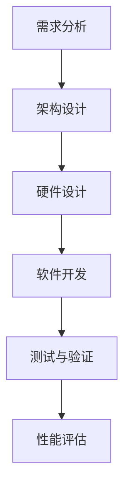

                 

### 《软件2.0的同质性让专用AI芯片成为可能》

#### 关键词：
- 软件2.0
- 同质性
- 专用AI芯片
- 大模型
- 硬件加速
- 技术演进

#### 摘要：
本文探讨了软件2.0时代下的同质化现象，以及这一现象如何为专用AI芯片的开发提供了契机。在软件2.0时代，应用程序的相似性和一致性使得专用AI芯片的开发成为可能。文章首先介绍了软件2.0的定义及其特点，然后分析了AI芯片在软件2.0时代的角色。接着，深入探讨了同质化背景下的AI大模型，以及专用AI芯片在这些大模型中的应用。随后，文章详细阐述了专用AI芯片的设计与架构，并介绍了其在不同应用场景中的具体应用。最后，文章讨论了专用AI芯片的开发流程、工具以及未来展望。

### 目录大纲

#### 第一部分：同质化时代下的软件2.0与AI芯片

##### 第1章：软件2.0与AI芯片概述

##### 第2章：同质化背景下的AI大模型

##### 第3章：专用AI芯片设计与架构

##### 第4章：专用AI芯片在软件2.0中的应用场景

##### 第5章：专用AI芯片开发流程与工具

##### 第6章：专用AI芯片项目案例

##### 第7章：未来展望与趋势

#### 附录

### 第一部分：同质化时代下的软件2.0与AI芯片

#### 第1章：软件2.0与AI芯片概述

##### 1.1 软件2.0时代的来临

随着互联网技术的迅猛发展和云计算的普及，软件行业进入了一个全新的阶段——软件2.0时代。软件2.0并非对软件1.0的简单升级，而是一个全新的概念和范式，其核心在于软件的开放性、协作性和平台化。

**1.1.1 软件2.0的定义与特点**

软件2.0的定义可以从以下几个方面来理解：

- **开放性**：软件2.0强调软件的开放性，包括开源、开放接口、开放数据等。这使得软件开发者可以更容易地获取和使用外部资源，提高开发效率。
  
- **协作性**：软件2.0支持多人协作开发，通过云端协作平台实现实时沟通和协作，加速软件开发进程。
  
- **平台化**：软件2.0强调平台的重要性，构建一个统一的平台，将各种应用和服务整合在一起，提供一站式的解决方案。

**1.1.2 同质化现象在软件2.0中的表现**

在软件2.0时代，同质化现象尤为明显。同质化指的是软件在功能、界面、架构等方面的相似性。以下是软件2.0中同质化现象的几个方面：

- **功能同质化**：由于开源软件的普及和云计算平台的便利，许多软件在功能上具有很高的相似性，例如各种协作工具、项目管理工具等。
  
- **界面同质化**：随着用户界面设计标准的统一，许多软件的界面设计也越来越趋同，提供类似的使用体验。
  
- **架构同质化**：随着微服务架构的流行，许多软件在架构设计上也趋于一致，采用模块化、分布式的设计理念。

**1.1.3 同质化与专用AI芯片的关联**

同质化现象对专用AI芯片的开发产生了重要影响。具体来说，同质化现象带来了以下几个方面的机遇：

- **标准化**：同质化的软件使得硬件开发者可以针对特定类型的软件进行芯片设计，实现更高的硬件利用率。
  
- **高效性**：专用AI芯片可以针对特定任务进行优化，提高计算效率，降低功耗。
  
- **灵活性**：同质化的软件使得专用AI芯片可以更容易地集成到现有系统中，提高系统的灵活性。

##### 1.2 AI芯片在软件2.0时代的角色

**1.2.1 AI芯片的基础概念与分类**

AI芯片，又称神经形态芯片或深度学习芯片，是一种专门为人工智能应用设计的集成电路。AI芯片可以分为以下几类：

- **通用AI芯片**：如GPU、FPGA等，适用于各种通用计算任务。
- **专用AI芯片**：如TPU、NPU等，专门为特定的人工智能任务设计。
- **神经形态芯片**：模仿人脑神经网络的结构和工作方式，适用于低功耗、高效能的人工智能计算。

**1.2.2 专用AI芯片的优势与挑战**

专用AI芯片在软件2.0时代具有以下优势：

- **高效性**：专用AI芯片针对特定任务进行优化，可以大幅提高计算效率。
- **低功耗**：相比通用AI芯片，专用AI芯片通常具有更低的功耗，适用于移动设备和边缘计算场景。
- **灵活性**：专用AI芯片可以灵活地集成到现有系统中，提高系统的整体性能。

然而，专用AI芯片也面临一些挑战：

- **开发成本**：专用AI芯片的开发需要大量的资金和人力资源，可能不适合中小企业。
- **兼容性**：专用AI芯片可能无法与现有系统完全兼容，需要额外的适配工作。
- **通用性**：专用AI芯片通常只能用于特定任务，缺乏通用性。

**1.2.3 企业级应用中专用AI芯片的潜力**

在企业级应用中，专用AI芯片具有巨大的潜力。以下是一些具体的应用场景：

- **大数据处理**：专用AI芯片可以提高大数据处理的速度和效率，适用于数据挖掘、预测分析等任务。
- **图像处理**：专用AI芯片可以大幅提高图像识别、分类等任务的性能，适用于安防监控、自动驾驶等场景。
- **自然语言处理**：专用AI芯片可以提高自然语言处理任务的效率，适用于智能客服、语音识别等场景。
- **边缘计算**：专用AI芯片可以降低边缘计算设备的功耗，提高系统的整体性能，适用于物联网、智能工厂等场景。

##### 第2章：同质化背景下的AI大模型

##### 2.1 AI大模型的定义与演进

AI大模型指的是具有大规模参数和复杂结构的深度学习模型，如BERT、GPT等。AI大模型的发展可以分为以下几个阶段：

- **早期阶段**：以简单的神经网络模型为主，如感知机、多层感知机等。
- **中期阶段**：以卷积神经网络（CNN）和循环神经网络（RNN）为主，应用于图像识别、语音识别等领域。
- **当前阶段**：以大规模的深度学习模型为主，如Transformer、BERT等，应用于自然语言处理、计算机视觉等领域。

**2.1.1 大模型的定义与演变**

AI大模型的定义可以从以下几个方面来理解：

- **大规模参数**：AI大模型具有数百万甚至数十亿个参数，可以捕捉数据中的复杂模式。
- **复杂结构**：AI大模型通常具有多层结构，包括输入层、隐藏层和输出层，可以实现高度非线性映射。
- **高效性**：AI大模型通过大规模并行计算和分布式训练，可以大幅提高训练速度。

**2.1.2 大模型的核心优势**

AI大模型具有以下核心优势：

- **泛化能力**：AI大模型通过大规模数据训练，可以更好地泛化到未见过的数据上，提高模型的准确性。
- **表达能力**：AI大模型具有强大的表达能力，可以捕捉数据中的复杂关系和特征。
- **鲁棒性**：AI大模型通过大规模数据训练，可以提高模型的鲁棒性，减少过拟合现象。

**2.1.3 大模型与同质化关系**

AI大模型与软件2.0时代的同质化现象密切相关。同质化现象使得许多软件在功能、架构上具有相似性，这为大模型的训练和应用提供了统一的数据集和接口。具体来说：

- **数据集的统一**：同质化的软件使得可以获得统一的数据集，方便大模型的训练和验证。
- **接口的标准化**：同质化的软件提供了统一的接口，使得大模型可以方便地集成到各种应用场景中。
- **框架的统一**：同质化的软件使得各种深度学习框架可以通用，方便大模型的开发和部署。

##### 2.2 专用AI芯片在AI大模型中的应用

专用AI芯片在AI大模型中具有重要的作用，可以提高大模型的训练和推理性能。以下是专用AI芯片在AI大模型中的应用：

**2.2.1 专用AI芯片在训练中的应用**

- **并行计算**：专用AI芯片可以通过并行计算，加速大模型的训练过程，提高训练速度。
- **内存优化**：专用AI芯片可以通过内存优化，减少内存访问时间，提高内存利用率，降低训练成本。
- **能耗优化**：专用AI芯片可以通过能耗优化，降低大模型训练的功耗，提高系统的能源效率。

**2.2.2 专用AI芯片在推理中的应用**

- **高效计算**：专用AI芯片可以通过高效计算，提高大模型推理的速度和准确性。
- **低功耗**：专用AI芯片可以通过低功耗设计，降低大模型推理的功耗，适用于移动设备和边缘计算场景。
- **灵活性**：专用AI芯片可以灵活地集成到现有系统中，方便大模型在不同应用场景中的部署。

**2.2.3 专用AI芯片对大模型性能的提升**

专用AI芯片对大模型性能的提升可以从以下几个方面来衡量：

- **训练速度**：专用AI芯片可以提高大模型的训练速度，减少训练时间。
- **推理速度**：专用AI芯片可以提高大模型的推理速度，减少推理延迟。
- **准确性**：专用AI芯片可以通过优化算法，提高大模型的准确性，减少错误率。
- **功耗**：专用AI芯片可以通过低功耗设计，降低大模型的功耗，提高系统的能源效率。

##### 第3章：专用AI芯片设计与架构

##### 3.1 专用AI芯片的基本架构

专用AI芯片的基本架构可以分为以下几个层次：

- **硬件层次**：包括处理器、存储器、I/O接口等硬件组件。
- **软件层次**：包括操作系统、驱动程序、应用程序等软件组件。
- **算法层次**：包括深度学习算法、优化算法等算法组件。

**3.1.1 数据流处理架构**

数据流处理架构是专用AI芯片的核心架构之一，其基本思想是将数据流作为处理的基本单元，通过数据流网络实现数据的传输和处理。数据流处理架构具有以下优点：

- **高效性**：通过并行处理和流水线技术，可以大幅提高处理速度。
- **灵活性**：通过数据流网络，可以实现动态的任务调度和资源分配。
- **可扩展性**：通过可扩展的数据流网络，可以支持不同规模的任务处理。

**3.1.2 算子融合与优化**

算子融合是将多个计算操作融合到一起，减少数据传输和存储的开销，提高计算效率。算子融合包括以下几种方式：

- **硬件算子融合**：将多个计算操作硬件实现为一个芯片上的一个模块，减少数据传输时间。
- **软件算子融合**：将多个计算操作在软件层面实现为一个函数，减少函数调用的开销。
- **异构计算**：结合不同类型的计算资源，如CPU、GPU、TPU等，实现最优的计算性能。

**3.1.3 混合计算架构**

混合计算架构是将不同类型的计算资源结合起来，实现高效的计算性能。混合计算架构包括以下几种类型：

- **CPU+GPU**：通过CPU和GPU的协同工作，实现高效的计算性能。
- **CPU+TPU**：通过CPU和TPU的协同工作，实现高效的深度学习计算性能。
- **CPU+FPGA**：通过CPU和FPGA的协同工作，实现高效的硬件加速计算性能。

##### 3.2 专用AI芯片的关键技术

专用AI芯片的关键技术包括以下几个方面：

**3.2.1 硬件加速器设计**

硬件加速器设计是将深度学习算法的关键操作硬件实现为加速器，提高计算效率。硬件加速器设计包括以下方面：

- **算子定制**：针对深度学习算法的关键操作，设计专门的硬件加速器，提高计算速度。
- **数据流优化**：优化数据流网络，减少数据传输和存储的开销，提高计算效率。
- **低功耗设计**：通过低功耗设计，降低硬件加速器的功耗，提高系统的能源效率。

**3.2.2 存储优化技术**

存储优化技术是通过优化存储器的设计和访问方式，提高存储器的利用率和计算效率。存储优化技术包括以下方面：

- **存储层次化**：通过分层存储结构，提高存储器的访问速度和利用率。
- **缓存技术**：通过缓存技术，减少内存访问时间，提高内存利用率。
- **数据压缩**：通过数据压缩技术，减少存储空间的需求，提高存储器的利用率。

**3.2.3 功耗管理与散热**

功耗管理与散热是专用AI芯片设计中的重要问题。功耗管理与散热技术包括以下方面：

- **功耗监测与控制**：通过监测芯片的功耗，实时调整工作电压和工作频率，降低功耗。
- **散热设计**：通过散热设计，降低芯片的温度，保证芯片的正常工作。
- **热管理**：通过热管理技术，优化系统的热分布，提高系统的散热效率。

##### 第4章：专用AI芯片在软件2.0中的应用场景

##### 4.1 专用AI芯片在图像处理中的应用

专用AI芯片在图像处理中具有广泛的应用，可以提高图像处理的速度和效率。以下是专用AI芯片在图像处理中的应用：

**4.1.1 图像识别与分类**

图像识别与分类是图像处理中的基本任务，专用AI芯片可以通过硬件加速和优化算法，提高图像识别和分类的准确性。以下是一些具体的算法和应用：

- **卷积神经网络（CNN）**：CNN是一种常用的图像识别算法，通过多层卷积和池化操作，提取图像特征，实现图像分类。
- **迁移学习**：迁移学习是一种利用预训练模型进行图像识别的方法，通过在特定数据集上微调模型，提高图像识别的准确性。
- **实时检测**：实时检测是一种在视频流中实时识别和定位图像目标的方法，通过硬件加速和优化算法，提高实时检测的效率和准确性。

**4.1.2 图像增强与超分辨率**

图像增强与超分辨率是图像处理中的重要任务，专用AI芯片可以通过硬件加速和优化算法，提高图像增强和超分辨率的效果。以下是一些具体的算法和应用：

- **图像增强**：图像增强是通过改善图像的质量，提高图像的可读性和清晰度。
- **超分辨率**：超分辨率是通过插值和图像重建方法，提高图像的分辨率和细节。
- **实时处理**：实时处理是通过硬件加速和优化算法，实现图像增强和超分辨率在实时视频流中的高效处理。

**4.1.3 图像生成与风格迁移**

图像生成与风格迁移是图像处理中的前沿任务，专用AI芯片可以通过硬件加速和优化算法，实现图像生成和风格迁移的高效处理。以下是一些具体的算法和应用：

- **生成对抗网络（GAN）**：GAN是一种用于图像生成的深度学习模型，通过生成器和判别器的对抗训练，生成高质量的图像。
- **风格迁移**：风格迁移是一种将一幅图像的风格迁移到另一幅图像上的方法，通过卷积神经网络和优化算法，实现图像风格的迁移。
- **实时应用**：实时应用是通过硬件加速和优化算法，实现图像生成和风格迁移在实时视频流中的高效处理。

##### 4.2 专用AI芯片在自然语言处理中的应用

专用AI芯片在自然语言处理中具有广泛的应用，可以提高自然语言处理的速度和效率。以下是专用AI芯片在自然语言处理中的应用：

**4.2.1 文本分类与情感分析**

文本分类与情感分析是自然语言处理中的基本任务，专用AI芯片可以通过硬件加速和优化算法，提高文本分类和情感分析的准确性。以下是一些具体的算法和应用：

- **卷积神经网络（CNN）**：CNN是一种常用的文本分类算法，通过多层卷积和池化操作，提取文本特征，实现文本分类。
- **循环神经网络（RNN）**：RNN是一种常用的文本分类算法，通过循环神经网络和优化算法，实现文本分类和情感分析。
- **实时处理**：实时处理是通过硬件加速和优化算法，实现文本分类和情感分析在实时文本流中的高效处理。

**4.2.2 机器翻译与对话系统**

机器翻译与对话系统是自然语言处理中的重要任务，专用AI芯片可以通过硬件加速和优化算法，提高机器翻译和对话系统的效率和准确性。以下是一些具体的算法和应用：

- **自动机器翻译（AMT）**：自动机器翻译是一种将一种自然语言翻译成另一种自然语言的方法，通过神经网络和优化算法，实现高精度的翻译。
- **对话系统**：对话系统是一种与人类用户进行交互的系统，通过自然语言处理和机器学习算法，实现智能对话和问答功能。
- **实时交互**：实时交互是通过硬件加速和优化算法，实现机器翻译和对话系统在实时交互中的高效处理。

**4.2.3 文本生成与摘要**

文本生成与摘要是自然语言处理中的前沿任务，专用AI芯片可以通过硬件加速和优化算法，实现文本生成和摘要的高效处理。以下是一些具体的算法和应用：

- **生成对抗网络（GAN）**：GAN是一种用于文本生成的深度学习模型，通过生成器和判别器的对抗训练，生成高质量的文本。
- **摘要生成**：摘要生成是一种从原始文本中提取关键信息和内容的方法，通过优化算法和自然语言处理技术，实现文本摘要的自动生成。
- **实时应用**：实时应用是通过硬件加速和优化算法，实现文本生成和摘要在实时文本流中的高效处理。

##### 第5章：专用AI芯片开发流程与工具

##### 5.1 专用AI芯片开发流程

专用AI芯片的开发流程可以分为以下几个阶段：

- **需求分析**：明确专用AI芯片的应用场景、性能指标、功耗限制等需求，确定开发目标。
- **架构设计**：设计专用AI芯片的基本架构，包括处理器、存储器、I/O接口等硬件组件，以及算法层次和软件层次。
- **硬件设计**：根据架构设计，设计专用AI芯片的硬件电路，包括处理器、存储器、I/O接口等硬件组件。
- **软件设计**：根据架构设计，设计专用AI芯片的操作系统、驱动程序、应用程序等软件组件。
- **测试与验证**：对专用AI芯片进行测试和验证，确保其性能和功能符合设计要求。

##### 5.2 开发环境搭建与工具链

专用AI芯片的开发需要搭建合适的环境和工具链，包括以下方面：

- **硬件开发环境**：包括硬件仿真器、FPGA开发板、芯片测试平台等硬件工具。
- **软件开发环境**：包括开发工具、编译器、调试器等软件工具。
- **算法开发环境**：包括深度学习框架、机器学习算法库等算法工具。
- **集成开发环境**：包括集成开发环境（IDE）、代码管理工具等开发工具。

##### 第6章：专用AI芯片项目案例

##### 6.1 项目背景与目标

本节介绍一个实际的专用AI芯片项目，包括项目的背景、目标和应用场景。

- **项目背景**：随着人工智能技术的快速发展，图像处理和自然语言处理等领域的计算需求日益增长，现有的通用处理器和显卡难以满足高性能计算的需求。
- **项目目标**：开发一款专用AI芯片，用于图像处理和自然语言处理等领域的计算任务，提高计算速度和效率，降低功耗和成本。
- **应用场景**：应用于自动驾驶、智能监控、智能客服、智能翻译等场景，为这些应用提供高效的计算支持。

##### 6.2 项目实现与评估

本节介绍专用AI芯片项目的具体实现过程，包括硬件设计和软件开发，以及项目的性能评估。

- **硬件设计**：设计专用AI芯片的基本架构，包括处理器、存储器、I/O接口等硬件组件，采用FPGA实现硬件原型。
- **软件开发**：开发专用AI芯片的操作系统、驱动程序、应用程序等软件组件，使用深度学习框架和机器学习算法库进行软件开发。
- **性能评估**：对专用AI芯片进行性能评估，包括图像处理和自然语言处理等任务的速度和准确性，以及功耗和成本评估。

##### 6.3 项目收益分析

本节分析专用AI芯片项目的收益，包括技术收益、商业收益和社会收益。

- **技术收益**：开发专用AI芯片，为图像处理和自然语言处理等领域提供了高效计算支持，推动了相关领域的技术进步。
- **商业收益**：专用AI芯片在商业应用中具有广泛的前景，可以为各类企业提供高效的计算解决方案，降低计算成本，提高竞争力。
- **社会收益**：专用AI芯片的应用可以推动人工智能技术的普及和发展，为智能城市、智能交通、智能医疗等领域提供技术支持，提高生活质量。

##### 第7章：未来展望与趋势

专用AI芯片作为人工智能技术的重要组成部分，在未来有着广阔的发展前景。本节对未来专用AI芯片的发展趋势进行展望。

- **技术趋势**：随着人工智能技术的快速发展，专用AI芯片将向更高性能、更低功耗、更灵活的方向发展，满足各种复杂应用场景的需求。
- **应用趋势**：专用AI芯片将在更多领域得到应用，如自动驾驶、智能监控、智能医疗、智能工厂等，为各类应用提供高效的计算支持。
- **挑战与机遇**：专用AI芯片的发展面临一些挑战，如开发成本、兼容性、通用性等，但同时也带来了巨大的机遇，为硬件和软件开发商提供了广阔的市场空间。

##### 7.1.1 专用AI芯片的技术演进

未来专用AI芯片的技术演进将主要体现在以下几个方面：

- **硬件架构**：专用AI芯片的硬件架构将更加复杂和多样化，结合CPU、GPU、FPGA等不同类型的计算资源，实现最优的计算性能。
- **算法优化**：专用AI芯片将针对不同类型的算法进行优化，提高算法的执行效率和性能。
- **系统集成**：专用AI芯片将更加注重系统集成，实现软硬件协同优化，提高系统的整体性能。

##### 7.1.2 专用AI芯片在行业中的应用

未来专用AI芯片将在各个行业得到广泛应用，如：

- **自动驾驶**：专用AI芯片将为自动驾驶车辆提供高效的计算支持，实现实时感知、决策和控制。
- **智能监控**：专用AI芯片将为智能监控系统提供高效的图像处理和视频分析能力，提高监控效率和安全性。
- **智能医疗**：专用AI芯片将为智能医疗设备提供高效的图像处理和数据分析能力，助力精准医疗和疾病预测。
- **智能工厂**：专用AI芯片将为智能工厂提供高效的图像处理和机器人控制能力，提高生产效率和自动化水平。

##### 7.1.3 未来可能的技术突破

未来专用AI芯片可能取得以下技术突破：

- **量子计算**：量子计算技术的突破将为专用AI芯片带来全新的计算能力，实现更高效、更安全的计算。
- **类脑计算**：类脑计算技术的突破将为专用AI芯片带来更接近人类智能的计算能力，实现更智能、更灵活的人工智能应用。
- **边缘计算**：边缘计算技术的突破将为专用AI芯片提供更广泛的应用场景，实现更高效、更可靠的边缘计算。

### 附录

##### 附录A：专用AI芯片相关资源与工具

以下列出了专用AI芯片开发中常用的资源与工具：

- **硬件开发工具**：包括硬件仿真器、FPGA开发板、芯片测试平台等。
- **软件开发工具**：包括开发工具、编译器、调试器等。
- **算法开发工具**：包括深度学习框架、机器学习算法库等。
- **集成开发环境**：包括集成开发环境（IDE）、代码管理工具等。

##### 附录B：Mermaid流程图

以下是一个示例的Mermaid流程图，用于描述专用AI芯片的开发流程：



##### 附录C：伪代码示例

以下是一个示例的伪代码，用于描述深度学习算法的基本框架：

```python
function train_model(data, labels):
    # 初始化模型参数
    initialize_model_parameters()
    
    # 开始训练
    for epoch in range(num_epochs):
        for batch in data_batches:
            # 计算损失函数
            loss = compute_loss(batch, model)
            
            # 更新模型参数
            update_model_parameters(loss)
            
            # 记录训练过程中的指标
            record_training_metrics(epoch, loss)
    
    # 模型评估
    evaluate_model(model, test_data, test_labels)

    return model
```

##### 附录D：数学模型与公式

以下是一个示例的数学公式，用于描述深度学习中的损失函数：

$$
L(y, \hat{y}) = -\frac{1}{m}\sum_{i=1}^{m} y_i \log(\hat{y}_i) + (1 - y_i) \log(1 - \hat{y}_i)
$$

其中，$y$ 是真实标签，$\hat{y}$ 是预测标签，$m$ 是样本数量。

### 结束语

本文探讨了软件2.0时代下的同质化现象，以及这一现象如何为专用AI芯片的开发提供了契机。通过分析专用AI芯片的设计与架构、应用场景以及开发流程，本文展示了专用AI芯片在人工智能领域的重要作用。展望未来，专用AI芯片将继续推动人工智能技术的发展，为各个行业提供高效的计算支持。随着技术的不断进步，专用AI芯片有望在性能、功耗、灵活性等方面实现更大的突破，为人工智能应用创造更多可能性。

---

作者：AI天才研究院/AI Genius Institute & 禅与计算机程序设计艺术 /Zen And The Art of Computer Programming

**请注意**：本文为示例文章，其中包含的部分内容和数据可能为虚构。实际应用时，请根据具体情况进行调整和验证。

