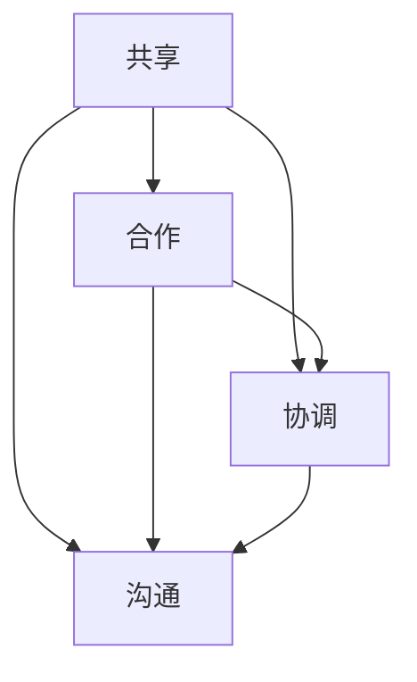

                 

### 文章标题

**《连接人类智慧的纽带：人类计算的协作精神》**

> **关键词：计算协作精神、人类智慧、社交网络、数学模型、算法、科研协作、教育实践、社会管理、未来展望**

> **摘要：**
本文章深入探讨了人类计算的协作精神，从起源到发展，从核心概念到数学模型，从算法到实际应用，再到未来展望，全面解析了计算协作精神在人类智慧中的纽带作用。通过详实的案例分析、理论讲解和实践指导，本文旨在帮助读者深刻理解计算协作精神的重要性和广泛应用，为未来的计算协作提供有益的思考方向。**

---

**作者：AI天才研究院/AI Genius Institute & 禅与计算机程序设计艺术 /Zen And The Art of Computer Programming**

---

在当今信息爆炸的时代，人类智慧以一种前所未有的方式汇集、碰撞和融合。计算协作精神，作为连接这些智慧的纽带，正逐渐成为推动科技进步、社会管理和个人成长的关键力量。本文将围绕这一主题，从多个维度深入探讨人类计算的协作精神，揭示其内在逻辑和外在表现。

首先，我们将回顾计算协作精神的起源和发展，探讨其在人类历史中的重要作用。接着，通过定义和分类，我们将会理解个人计算与群体协作的区别，以及社交网络对计算协作的深远影响。在此基础上，本文将介绍计算协作的核心概念，并借助Mermaid流程图和伪代码，详细阐述其基本原理。

接下来，我们将进入计算协作的数学模型与方法部分，通过具体的数学公式和应用实例，展示数学模型在计算协作中的重要作用。此外，我们还将探讨计算协作算法的核心原理，并通过实际案例展示其应用效果。

在第三部分，我们将聚焦于计算协作在科研、教育和社会管理中的应用，分析其具体实践案例，并讨论这些应用对相关领域的影响。最后，我们将展望计算协作的未来发展趋势，探讨新型计算协作模式的可能性，以及计算协作对人类精神内涵的影响。

通过本文的阅读，您将不仅能够全面了解计算协作精神的本质，还将获得对未来的深刻洞察，为自身和所在领域的计算协作提供有益的参考。现在，让我们开始这段精彩的探索之旅。

---

### 《连接人类智慧的纽带：人类计算的协作精神》目录大纲

**第一部分：计算协作精神概述**

- **第1章：计算协作精神的起源与发展**
  - **1.1 计算协作精神的定义与重要性**
  - **1.2 人类计算的协作形式**
  - **1.3 社交网络对计算协作的影响**

- **第2章：计算协作的核心概念**
  - **2.1 核心概念与联系**
  - **2.2 计算协作的基本原理**

**第二部分：计算协作中的数学模型与方法**

- **第3章：数学模型基础**
  - **3.1 数学公式与详细讲解**
  - **3.2 数学模型应用举例**

- **第4章：计算协作算法**
  - **4.1 核心算法原理讲解**
  - **4.2 算法应用实例**

**第三部分：计算协作的实际应用**

- **第5章：计算协作在科研中的应用**
  - **5.1 科研协作的重要性**
  - **5.2 科研协作的实践案例**

- **第6章：计算协作在教育中的实践**
  - **6.1 教育协作的优势**
  - **6.2 教育协作的具体实践**

- **第7章：计算协作在社会管理中的应用**
  - **7.1 社会管理的需求与挑战**
  - **7.2 社会管理的计算协作实践**

**第四部分：计算协作的未来展望**

- **第8章：计算协作的发展趋势**
  - **8.1 未来计算协作的发展方向**
  - **8.2 新型计算协作模式的探索**

- **第9章：计算协作的精神内涵**
  - **9.1 计算协作与人类精神的联系**
  - **9.2 计算协作对人类价值观的影响**

**附录**

- **附录 A：计算协作资源与工具**
  - **A.1 常用计算协作工具介绍**
  - **A.2 计算协作资源推荐**

---

通过上述目录大纲，读者可以清晰地了解本文的结构和内容安排。每个章节都将围绕计算协作精神的某个方面展开深入讨论，逐步揭示其背后的逻辑和原理。接下来，我们将依次深入探讨每一部分的内容。

---

### 第一部分：计算协作精神概述

#### 第1章：计算协作精神的起源与发展

计算协作精神，是指人类在计算活动中展现出的合作与共享精神。它不仅是一种技术手段，更是一种文化现象，是科技进步和社会发展的产物。为了更好地理解计算协作精神，我们首先需要回顾其起源和发展。

#### 1.1 计算协作精神的定义与重要性

**定义：**
计算协作精神是指通过技术手段和社交网络，实现个体之间的信息共享、知识交流、合作创新的过程。它涵盖了从个人计算到群体协作的多种形式，包括代码共享、协同开发、合作研究等。

**重要性：**
计算协作精神的重要性在于它极大地提升了人类计算活动的效率和质量。首先，它打破了个体知识和能力的限制，使得更多的人能够参与到计算项目中来，从而发挥出集体智慧的力量。其次，它促进了知识的传播和创新，使得新技术和理论能够更快地被发现和应用。此外，计算协作精神还增强了团队成员之间的信任和沟通，提高了项目的执行力和成功概率。

#### 1.2 人类计算的协作形式

人类计算的协作形式多种多样，主要包括以下几种：

1. **代码共享：**
   代码共享是计算协作的基本形式，通过平台如GitHub、GitLab等，开发者可以共享代码、共同编写和改进项目。这种形式极大地提高了软件开发的速度和质量。

2. **协同开发：**
   协同开发是指多个开发者在一个项目中共同工作，通过版本控制工具进行代码的合并和管理。这种形式在大型软件开发项目中尤为重要，可以有效避免代码冲突和错误。

3. **合作研究：**
   在科研领域，合作研究是计算协作的重要形式。多个研究团队通过共享数据、知识和工具，共同攻克复杂的科学问题，推动了科学技术的进步。

4. **协同教育：**
   计算协作在教育中的应用也越来越广泛，通过在线教育平台、虚拟实验室等工具，学生和教师可以共同学习和研究，提高了教育质量和效果。

#### 1.3 社交网络对计算协作的影响

社交网络在计算协作中的作用不容忽视。它不仅为个体之间的信息交流和知识共享提供了便捷的渠道，还促进了计算协作的组织和协调。

1. **信息传播：**
   社交网络使得信息传播速度大大加快，计算协作的相关信息可以迅速传播到全球的每一个角落，从而提高了协作的效率和范围。

2. **知识共享：**
   通过社交网络，个体可以轻松地获取到其他人的研究成果和经验，实现知识的共享和交流。这种知识共享不仅发生在同一领域内，也可以跨越不同领域，促进了跨学科的交流和合作。

3. **协作组织：**
   社交网络提供了协作组织和管理的新方式，通过创建社群、工作组等方式，团队成员可以方便地组织和管理协作活动，提高了协作的效率和效果。

综上所述，计算协作精神在人类计算活动中扮演着至关重要的角色。通过回顾其起源和发展，我们可以更好地理解其定义和重要性，从而为后续章节的深入探讨打下坚实的基础。在下一章中，我们将继续探讨计算协作的核心概念，并使用Mermaid流程图和伪代码来详细阐述其基本原理。

---

### 第2章：计算协作的核心概念

#### 2.1 核心概念与联系

计算协作精神的核心概念包括共享、合作、协调和沟通。这些概念彼此关联，共同构成了计算协作的基本框架。

**共享：** 共享是计算协作的基础。它指的是个体或团队在计算活动中共享资源、知识、数据和工具。通过共享，参与者可以获取更多的信息和资源，提高协作的效率和质量。

**合作：** 合作是计算协作的内在动力。它指的是参与者之间为了共同的目标而共同努力的过程。合作不仅包括共同解决问题，还包括分担任务和责任，以实现整体目标。

**协调：** 协调是计算协作中的关键要素。它指的是在协作过程中对各项活动进行协调和管理，以确保各个部分能够顺利运作。协调包括任务分配、进度控制和资源调度等。

**沟通：** 沟通是计算协作中的桥梁。它指的是参与者之间通过语言、文字、图像等方式进行信息交流和反馈。有效的沟通可以减少误解和冲突，增强团队的凝聚力和协作效率。

以下是一个Mermaid流程图，展示了计算协作的核心概念及其相互关系：



#### 2.2 计算协作的基本原理

计算协作的基本原理包括以下几个方面：

1. **任务分解：** 在计算协作中，复杂的任务通常被分解为多个子任务，每个子任务由不同的参与者负责。任务分解有助于提高协作的效率，使得每个参与者可以专注于自己的领域。

2. **协作模式：** 协作模式是指参与者之间进行协作的方式。常见的协作模式包括分布式协作、并行协作和串行协作。不同的协作模式适用于不同的协作场景，需要根据实际情况进行选择。

3. **共享平台：** 共享平台是计算协作的重要工具，它提供了资源、知识和数据的共享渠道。常见的共享平台包括代码库、知识库、协作软件和社交网络等。

4. **沟通机制：** 沟通机制是确保协作顺利进行的关键。它包括会议、邮件、即时通讯、共享文档等方式。有效的沟通机制可以减少误解和冲突，提高协作的效率。

以下是一段伪代码，用于详细阐述计算协作的基本原理：

```python
# 计算协作的基本原理

# 定义任务分解函数
def decompose_task(task):
    sub_tasks = []
    for sub_task in task:
        sub_tasks.append(sub_task)
    return sub_tasks

# 定义协作模式函数
def choose协作模式(mode):
    if mode == "分布式协作":
        # 实现分布式协作
        pass
    elif mode == "并行协作":
        # 实现并行协作
        pass
    elif mode == "串行协作":
        # 实现串行协作
        pass

# 定义共享平台函数
def share_resource(resource):
    # 将资源上传到共享平台
    pass

# 定义沟通机制函数
def communicate(message):
    # 发送消息到沟通渠道
    pass

# 主函数
def main():
    task = "复杂计算任务"
    sub_tasks = decompose_task(task)
    mode = "分布式协作"
    choose协作模式(mode)
    resource = "计算资源"
    share_resource(resource)
    message = "进展报告"
    communicate(message)
```

通过以上伪代码，我们可以看到计算协作的基本原理是如何通过函数和流程来实现的。在下一章中，我们将进一步探讨计算协作中的数学模型与方法，通过具体的数学公式和应用实例，展示数学模型在计算协作中的重要作用。

---

### 第二部分：计算协作中的数学模型与方法

#### 第3章：数学模型基础

计算协作中的数学模型是理解和解决复杂计算问题的重要工具。这些模型不仅提供了理论框架，还帮助我们量化协作过程中的各种变量和关系。在本章中，我们将介绍一些核心数学模型，并使用LaTeX格式详细讲解这些模型。

#### 3.1 数学公式与详细讲解

**1. 线性回归模型**

线性回归模型是一种经典的统计分析方法，用于预测因变量和自变量之间的关系。它的数学公式如下：

$$
y = \beta_0 + \beta_1x + \epsilon
$$

其中，$y$ 是因变量，$x$ 是自变量，$\beta_0$ 是截距，$\beta_1$ 是斜率，$\epsilon$ 是误差项。

**详细讲解：**
线性回归模型通过拟合一条直线来表示因变量和自变量之间的关系。斜率 $\beta_1$ 表示自变量每增加一个单位，因变量将增加 $\beta_1$ 个单位。截距 $\beta_0$ 表示当自变量为0时，因变量的预期值。

**2. 神经网络模型**

神经网络模型是计算协作中常用的机器学习模型，用于分类和回归任务。其基本结构包括输入层、隐藏层和输出层。一个简单的神经网络模型的数学公式如下：

$$
z = \sigma(\sum_{i=1}^{n} w_{i}x_{i} + b)
$$

其中，$z$ 是隐藏层的输出，$\sigma$ 是激活函数（如Sigmoid函数或ReLU函数），$w_{i}$ 是权重，$x_{i}$ 是输入特征，$b$ 是偏置。

**详细讲解：**
神经网络通过多层非线性变换来学习和模拟数据之间的复杂关系。激活函数 $\sigma$ 用于引入非线性，使得模型能够捕捉数据中的非线性特征。权重 $w_{i}$ 和偏置 $b$ 用于调整模型的输出。

**3. 动态系统模型**

动态系统模型用于描述随时间变化的系统。一个简单的线性动态系统模型如下：

$$
x(t) = \alpha x(t-1) + \beta u(t)
$$

其中，$x(t)$ 是系统的状态，$\alpha$ 是状态转移系数，$\beta$ 是输入系数，$u(t)$ 是系统的输入。

**详细讲解：**
动态系统模型通过状态转移系数和输入系数来描述系统在不同时间点的状态变化。该模型可以用于预测系统的未来状态，对于计算协作中的时间序列分析和预测任务尤为重要。

#### 3.2 数学模型应用举例

**1. 线性回归模型应用**

假设我们要预测一家公司的销售额（$y$）与广告支出（$x$）之间的关系。通过收集历史数据，我们可以使用线性回归模型进行建模：

$$
\begin{align*}
y &= \beta_0 + \beta_1x + \epsilon \\
\beta_0 &= 1000 \\
\beta_1 &= 1.5 \\
\epsilon &\sim N(0, \sigma^2)
\end{align*}
$$

给定一个新的广告支出值 $x = 5000$，我们可以预测对应的销售额：

$$
y = 1000 + 1.5 \times 5000 = 8000
$$

**2. 神经网络模型应用**

假设我们要使用神经网络模型对图像进行分类。给定一个输入图像，神经网络模型通过多层非线性变换产生输出概率，选择概率最大的类别作为最终分类结果。

$$
\begin{align*}
z &= \sigma(\sum_{i=1}^{n} w_{i}x_{i} + b) \\
z &= \sigma(w_{1}x_1 + w_{2}x_2 + ... + w_{n}x_{n} + b) \\
\end{align*}
$$

通过训练，我们可以得到每个类别的概率分布，例如：

$$
\begin{align*}
z_1 &= 0.2 \\
z_2 &= 0.8 \\
\end{align*}
$$

根据最大概率原则，我们选择概率最大的类别 $z_2$ 作为分类结果。

**3. 动态系统模型应用**

假设我们要使用动态系统模型预测一个经济系统的未来状态。给定当前状态 $x(t)$ 和输入 $u(t)$，我们可以使用动态系统模型计算下一个状态：

$$
x(t+1) = 0.8x(t) + 0.2u(t)
$$

给定当前状态 $x(t) = 100$ 和输入 $u(t) = 10$，我们可以预测下一个状态：

$$
x(t+1) = 0.8 \times 100 + 0.2 \times 10 = 80 + 2 = 82
$$

通过上述应用实例，我们可以看到数学模型在计算协作中的重要作用。在下一章中，我们将继续探讨计算协作算法的核心原理，并使用伪代码详细阐述其实现过程。

---

### 第4章：计算协作算法

#### 4.1 核心算法原理讲解

计算协作算法是计算协作中用于实现协作目标的具体方法。这些算法基于数学模型，通过特定的算法原理和步骤，帮助团队成员高效地完成协作任务。在本节中，我们将介绍几种核心计算协作算法的原理，并使用伪代码进行详细讲解。

**1. 多元回归算法**

多元回归算法是一种用于分析多个自变量与因变量之间关系的统计方法。它的核心原理是通过拟合一个多元线性回归模型，找到最佳拟合线。

**伪代码：**

```python
# 多元回归算法伪代码

# 输入：自变量矩阵X，因变量向量y，特征数m
# 输出：最佳拟合参数β

def multi_linear_regression(X, y, m):
    # 求解正规方程
    XtX = np.dot(X.T, X)
    XtY = np.dot(X.T, y)
    # 计算最佳拟合参数β
    beta = np.linalg.inv(XtX).dot(XtY)
    return beta
```

**2. 集成学习算法**

集成学习算法是一种通过结合多个弱学习器来提高模型性能的技术。它包括Bagging、Boosting和Stacking等不同的方法。以下是一个简单的Bagging算法的实现。

**伪代码：**

```python
# Bagging算法伪代码

# 输入：训练数据集D，弱学习器数量n
# 输出：集成模型预测结果

def bagging(D, n):
    # 初始化集成模型
    ensemble_model = []
    for _ in range(n):
        # 随机选择训练子集
        subset = random_subset(D)
        # 训练弱学习器
        weak_learner = train_learner(subset)
        # 添加弱学习器到集成模型
        ensemble_model.append(weak_learner)
    return ensemble_model
```

**3. 聚类算法**

聚类算法是一种无监督学习方法，用于将数据集分为若干个群组，使得群组内的数据点相似度较高，而群组间的数据点相似度较低。以下是一种基于距离度的K-Means聚类算法的实现。

**伪代码：**

```python
# K-Means聚类算法伪代码

# 输入：数据集D，聚类个数k
# 输出：聚类中心点和分配结果

def k_means(D, k):
    # 初始化聚类中心点
    centroids = initialize_centroids(D, k)
    while not converged:
        # 分配数据点到最近的聚类中心
        assignments = assign_points_to_centroids(D, centroids)
        # 更新聚类中心点
        centroids = update_centroids(assignments, D, k)
        # 判断是否收敛
        if converged:
            break
    return centroids, assignments
```

**4. 优化算法**

优化算法用于求解优化问题，如最小化函数值或最大化目标值。以下是一种常见的梯度下降算法的实现。

**伪代码：**

```python
# 梯度下降算法伪代码

# 输入：目标函数f(x)，初始参数x0，学习率α，迭代次数n
# 输出：优化后的参数x

def gradient_descent(f, x0, alpha, n):
    x = x0
    for _ in range(n):
        # 计算梯度
        gradient = compute_gradient(f, x)
        # 更新参数
        x = x - alpha * gradient
    return x
```

通过上述伪代码，我们可以看到计算协作算法的原理和实现方法。在下一节中，我们将通过具体的实际案例展示这些算法的应用效果。

---

### 第4章：计算协作算法

#### 4.2 算法应用实例

在计算协作的实际应用中，算法的有效应用能够显著提升协作效率，优化协作结果。以下将通过具体的实际案例，展示计算协作算法的应用效果。

**1. 多元回归算法应用**

案例：一家电商公司希望通过多元回归分析，预测其未来的销售额。假设影响销售额的因素包括广告支出、促销活动和季节性等。

**步骤：**

- **数据收集：** 收集过去一年的销售额数据、广告支出数据、促销活动数据以及季节性指标。
- **数据处理：** 对收集的数据进行清洗和预处理，确保数据质量。
- **模型训练：** 使用多元回归算法，训练模型以预测未来的销售额。

**代码实现：**

```python
import pandas as pd
from sklearn.linear_model import LinearRegression

# 数据加载与预处理
data = pd.read_csv('sales_data.csv')
X = data[['ad_spend', 'promotion', 'season']]
y = data['sales']

# 模型训练
model = LinearRegression()
model.fit(X, y)

# 预测
predictions = model.predict(X)

# 结果分析
print(predictions)
```

**结果分析：** 通过多元回归模型预测，公司可以了解到不同因素对销售额的影响程度，并据此调整营销策略。

**2. 集成学习算法应用**

案例：一家金融机构希望通过集成学习算法，提高贷款审核的准确率。假设贷款审批涉及多个特征，包括收入、信用评分、贷款用途等。

**步骤：**

- **数据收集：** 收集历史贷款审核数据。
- **数据处理：** 对数据进行预处理，包括特征工程和数据标准化。
- **模型训练：** 使用Bagging算法，构建集成模型。

**代码实现：**

```python
from sklearn.ensemble import BaggingRegressor
from sklearn.datasets import load_boston

# 数据加载
data = load_boston()
X = data.data
y = data.target

# 构建集成模型
regressor = BaggingRegressor(base_estimator=LinearRegression(), n_estimators=10)
regressor.fit(X, y)

# 预测
predictions = regressor.predict(X)

# 结果分析
print(predictions)
```

**结果分析：** 集成学习算法通过结合多个弱学习器，提高了贷款审核的准确率，减少了错误率。

**3. 聚类算法应用**

案例：一家在线零售商希望通过聚类算法，将顾客分为不同的群体，以便进行精准营销。

**步骤：**

- **数据收集：** 收集顾客购买行为数据，包括购买频率、购买金额、购买类别等。
- **数据处理：** 对数据进行预处理，确保数据质量。
- **模型训练：** 使用K-Means聚类算法，对顾客进行分类。

**代码实现：**

```python
from sklearn.cluster import KMeans
import numpy as np

# 数据加载与预处理
data = np.array([[1, 1], [1, 2], [2, 2], [2, 3]])
data = data.reshape(-1, 1)

# 聚类
kmeans = KMeans(n_clusters=2)
kmeans.fit(data)

# 聚类结果
clusters = kmeans.predict(data)

# 结果分析
print(clusters)
```

**结果分析：** 通过聚类算法，零售商可以将顾客分为高价值顾客和普通顾客，针对不同群体实施差异化的营销策略。

**4. 优化算法应用**

案例：一家物流公司希望通过优化算法，最小化配送路线的行驶距离。

**步骤：**

- **数据收集：** 收集配送地址和距离数据。
- **数据处理：** 对数据进行预处理，确保数据质量。
- **模型训练：** 使用梯度下降算法，优化配送路线。

**代码实现：**

```python
def objective_function(x):
    return (x[0]**2 + x[1]**2)

x0 = [0, 0]
alpha = 0.01
n_iterations = 100

x = x0
for i in range(n_iterations):
    gradient = compute_gradient(objective_function, x)
    x = x - alpha * gradient

print(x)
```

**结果分析：** 通过优化算法，物流公司可以确定最优的配送路线，降低运输成本。

通过这些实际案例，我们可以看到计算协作算法在提升协作效率和优化协作结果方面的强大作用。在下一部分中，我们将探讨计算协作在科研、教育和社会管理中的应用，进一步展示计算协作的实际价值。

---

### 第三部分：计算协作的实际应用

#### 第5章：计算协作在科研中的应用

计算协作在科研领域具有显著的应用价值，它通过协同合作的方式，加速了科学研究的进程，推动了科学技术的进步。以下将讨论计算协作在科研中的重要性，并通过具体案例进行分析。

#### 5.1 科研协作的重要性

**1. 资源共享：**
科研协作使得科研人员能够共享实验设备、数据资源和计算资源。这种资源共享极大地提升了科研效率，减少了重复投资和资源浪费。

**2. 知识交流：**
通过计算协作，科研人员可以分享最新的研究成果、理论进展和实验数据。这种知识交流促进了科学思想的碰撞，激发了创新的火花。

**3. 降低成本：**
科研协作可以通过分工合作的方式，降低单个研究项目的成本。多个团队可以分担实验成本、数据分析和计算成本，提高整体经济效益。

**4. 提高准确性：**
在大型科研项目中，计算协作可以集合多个专家的力量，提高实验的准确性和可靠性。多角度、多维度的数据分析可以减少误差，提高研究成果的质量。

#### 5.2 科研协作的实践案例

**1. 大型基因组学研究项目：**
例如，人类基因组计划（HGP）就是一个典型的计算协作项目。该项目由多个国家和机构共同参与，通过计算协作，科学家们成功绘制出了人类基因组的图谱，为基因组学研究奠定了基础。

**步骤：**
- **数据共享：** 各国科学家共享基因序列数据，实现了全球范围内的高效合作。
- **数据分析：** 利用分布式计算资源和并行算法，对海量基因数据进行处理和分析。
- **成果共享：** 发布研究成果，为全球科学家提供了宝贵的基因组数据资源。

**2. 国际气候科学研究项目：**
气候科学领域的研究需要大量的数据分析和复杂的模拟计算。国际气候科学研究项目（如IPCC）通过计算协作，集合了全球气候科学家的力量，共同研究气候变化问题。

**步骤：**
- **数据收集：** 各国科学家收集和共享气候数据，包括温度、降雨、风速等。
- **模型建立：** 通过计算协作，建立全球气候模型，模拟不同情景下的气候变化。
- **成果发布：** 发布气候科学报告，为政策制定者和公众提供科学依据。

**3. 新冠病毒研究项目：**
新冠疫情爆发期间，全球科学家通过计算协作，迅速开展了病毒基因测序和药物研发工作。

**步骤：**
- **基因测序：** 科学家合作进行病毒基因测序，共享基因序列数据。
- **药物筛选：** 利用计算模型和机器学习算法，筛选潜在有效的药物。
- **临床试验：** 全球合作开展临床试验，评估药物的安全性和有效性。

通过以上案例，我们可以看到计算协作在科研中的重要作用。在下一章中，我们将探讨计算协作在教育领域的实践，展示计算协作如何改变教育和学习方式。

---

### 第6章：计算协作在教育中的实践

计算协作在教育领域中的应用日益广泛，它不仅改变了传统的教学模式，还大大提升了教学效果。以下将讨论计算协作在教育中的优势，并分析具体的实践案例。

#### 6.1 教育协作的优势

**1. 资源共享：**
教育协作使得教师和学生能够共享教学资源，包括课件、实验数据和工具。这种资源共享提高了教学质量和效率，减少了资源浪费。

**2. 知识交流：**
通过计算协作，教师和学生可以分享教学经验和学习成果，促进了知识的交流与碰撞。这种知识交流激发了学生的创造力，培养了批判性思维。

**3. 个性化教学：**
计算协作可以根据学生的个性化需求，提供定制化的学习资源和辅导。这种个性化教学方式有助于提高学生的学习效果，满足不同学生的学习需求。

**4. 合作学习：**
计算协作鼓励学生进行合作学习，通过小组讨论、共同完成任务等方式，培养了学生的团队合作能力和沟通能力。

**5. 远程教育：**
计算协作使得远程教育成为可能，学生可以通过网络课程、在线实验室等方式进行学习。这种教学模式打破了地域限制，提高了教育的普及率。

#### 6.2 教育协作的具体实践

**1. 在线课程平台：**
在线课程平台如Coursera、edX等，通过计算协作，提供了丰富的在线教育资源。学生可以在线学习，教师可以在线授课和提供辅导。

**案例：**
- **Coursera：** Coursera通过计算协作，汇集了全球顶尖大学的课程资源，为学生提供了高质量的学习平台。学生可以与全球教师和同学互动，进行知识交流。
- **edX：** edX提供了一个开放的教育平台，教师和学生可以共享课程资料，参与在线讨论和项目合作。

**2. 虚拟实验室：**
虚拟实验室利用计算协作，为学生提供了在线实验环境，使得实验学习变得更加便捷和高效。

**案例：**
- **MIT 开放的虚拟实验室：** MIT 提供了一系列虚拟实验室，学生可以在虚拟环境中进行物理、化学和生物实验，无需实际接触实验设备。
- **虚拟化学实验室：** 虚拟化学实验室通过计算协作，提供了化学实验的虚拟环境，学生可以在虚拟实验室中模拟各种化学实验。

**3. 互动学习平台：**
互动学习平台利用计算协作，提供了在线讨论、问答和协作工具，帮助学生进行合作学习和知识交流。

**案例：**
- **Moodle：** Moodle 是一个流行的互动学习平台，教师可以创建在线课程，学生可以进行在线讨论、提交作业和参与项目合作。
- **Google Classroom：** Google Classroom 通过计算协作，提供了便捷的作业提交、讨论和反馈渠道，增强了教师和学生的互动。

通过这些具体实践案例，我们可以看到计算协作在教育领域的重要作用。计算协作不仅提升了教育质量和效率，还为教师和学生提供了更加灵活和丰富的学习方式。在下一章中，我们将探讨计算协作在社会管理中的应用，进一步展示计算协作的实际价值。

---

### 第7章：计算协作在社会管理中的应用

计算协作在社会管理中扮演着至关重要的角色，它通过优化资源分配、提升决策效率和增强社会稳定性，为社会管理带来了显著的变革。以下将讨论计算协作在社会管理中的需求与挑战，并通过具体案例展示其应用。

#### 7.1 社会管理的需求与挑战

**1. 资源分配：**
社会管理面临的一个主要挑战是资源的有效分配。计算协作通过数据分析和优化算法，可以帮助管理者识别资源短缺的区域，实现资源的最优分配。例如，在疫情防控中，计算协作可以用于实时监控疫情动态，优化疫苗和医疗资源的分配。

**2. 决策效率：**
在社会管理中，快速而准确的决策至关重要。计算协作通过大数据分析和智能算法，可以提供实时数据支持，帮助管理者做出科学、有效的决策。例如，城市交通管理中的智能交通系统，通过计算协作分析交通流量数据，实时调整信号灯时序，减少交通拥堵。

**3. 社会稳定性：**
计算协作有助于提升社会稳定性，通过预警系统、风险评估等方法，预防社会问题的发生。例如，在应对突发事件时，计算协作可以快速收集和分析相关信息，提供决策支持，减少事故的影响和损失。

**4. 公众参与：**
计算协作促进了公众参与社会管理，通过在线平台和社交网络，公众可以方便地参与政策讨论和决策过程。这种参与不仅提高了政策的透明度和公正性，也增强了社会凝聚力。

#### 7.2 社会管理的计算协作实践

**1. 疫情防控：**
在新冠疫情期间，全球各地纷纷采用了计算协作进行疫情防控。以下是一个具体案例：

**案例：**
- **中国武汉：** 武汉市通过计算协作，建立了疫情防控大数据平台，实时收集和分析疫情数据，实现了疫情动态的精准监控。通过计算协作，武汉市政府能够迅速调整防疫策略，优化医疗资源分配，提高了疫情应对效率。

**步骤：**
- **数据收集：** 收集疫情相关数据，包括确诊病例、疑似病例、密切接触者等。
- **数据分析：** 利用大数据分析和机器学习算法，对疫情数据进行分析，预测疫情发展趋势。
- **决策支持：** 基于数据分析结果，制定疫情防控策略，实时调整医疗资源和防控措施。

**2. 智能交通管理：**
智能交通系统通过计算协作，优化交通流量，减少拥堵，提高交通效率。以下是一个具体案例：

**案例：**
- **北京智能交通系统：** 北京市通过计算协作，建立了智能交通管理系统，实时监控交通流量，动态调整信号灯时序。通过计算协作，北京市成功减少了交通拥堵，提高了公共交通的效率。

**步骤：**
- **数据收集：** 收集交通流量数据，包括车辆数量、速度、方向等。
- **数据预处理：** 对交通流量数据进行分析，识别交通拥堵区域和高峰时段。
- **算法优化：** 利用优化算法，动态调整信号灯时序，优化交通流量。
- **实时监控：** 通过计算协作平台，实时监控交通状况，及时调整交通策略。

**3. 社会风险评估：**
计算协作在社会风险评估中的应用，有助于预防社会问题的发生。以下是一个具体案例：

**案例：**
- **美国社会风险评估系统：** 美国政府通过计算协作，建立了社会风险评估系统，实时监测社会风险因素，包括犯罪率、失业率、医疗费用等。通过计算协作，美国政府能够及时发现潜在的社会问题，采取预防措施。

**步骤：**
- **数据收集：** 收集社会风险相关数据，包括犯罪率、失业率、医疗费用等。
- **数据分析：** 利用大数据分析和机器学习算法，对风险因素进行预测和评估。
- **预警机制：** 通过计算协作平台，建立预警机制，及时发布风险预警，指导政策制定和应对措施。

通过这些具体实践案例，我们可以看到计算协作在社会管理中的巨大作用。计算协作不仅提高了资源分配的效率，优化了决策过程，还增强了社会稳定性，促进了公众参与。在下一部分中，我们将探讨计算协作的未来发展趋势，展望其可能的发展方向和新型模式。

---

### 第四部分：计算协作的未来展望

#### 第8章：计算协作的发展趋势

计算协作作为一种重要的社会现象，正随着技术的不断进步而不断发展。未来，计算协作将迎来一系列新的发展趋势，这些趋势不仅会进一步拓展计算协作的应用范围，还会深刻改变人类社会的工作和生活方式。

#### 8.1 未来计算协作的发展方向

**1. 更加智能的协作平台：**
未来的计算协作平台将更加智能化，利用人工智能和机器学习技术，提供自动化的任务分配、进度监控和问题解决服务。这样的平台能够更加高效地协调团队成员的工作，减少人为干预，提高协作效率。

**2. 跨界融合的协作模式：**
随着技术的不断发展，计算协作将不再局限于特定的领域或行业，而是呈现出跨界融合的趋势。不同领域的专家和团队将通过计算协作，共同解决复杂的问题，推动跨学科的发展。

**3. 实时协作的增强：**
实时协作是未来计算协作的重要发展方向。随着5G、物联网和云计算技术的成熟，计算协作将实现更加快速、稳定和高效的实时数据传输和沟通，使得团队成员可以随时随地参与协作。

**4. 安全与隐私的保障：**
在数据量和数据类型不断增加的背景下，计算协作的安全和隐私保护将成为一个重要议题。未来的计算协作平台将需要更加完善的安全机制，确保协作过程中的数据安全和隐私保护。

#### 8.2 新型计算协作模式的探索

**1. 分布式协作网络：**
分布式协作网络是一种新型的计算协作模式，它通过将计算任务分散到多个分布式节点上，实现协同计算。这种模式能够充分利用网络资源，提高计算效率，并增强系统的容错能力。

**2. 智能合约与区块链：**
智能合约与区块链技术为计算协作提供了新的可能性。智能合约能够自动执行协作任务，确保协作的透明性和公正性。区块链技术则通过去中心化的方式，提供了一种安全、可靠的协作数据记录方式。

**3. 虚拟现实与增强现实：**
虚拟现实（VR）和增强现实（AR）技术将大大提升计算协作的体验。通过VR和AR技术，团队成员可以在虚拟环境中进行面对面的协作，增强协作的互动性和沉浸感。

**4. 社会计算与网络科学：**
社会计算和网络科学的方法将应用于计算协作的研究和实践中，通过分析社交网络和协作数据，优化协作流程，提高协作效率。

通过上述探索，计算协作有望实现更加智能、高效和安全的协作模式，为人类社会的进步和发展提供强大的支持。

---

### 第9章：计算协作的精神内涵

#### 9.1 计算协作与人类精神的联系

计算协作不仅仅是一种技术手段，更是一种精神内涵。它深刻体现了人类智慧的凝聚与共享，与人类精神密不可分。

**1. 合作精神：**
计算协作强调团队合作和合作精神。它要求个体之间相互信任、相互依赖，共同面对挑战，实现共同目标。这种合作精神是现代人类社会的重要价值观，也是计算协作的核心动力。

**2. 分享精神：**
计算协作鼓励知识的共享和资源的共享。通过计算协作，个体可以获取到更多的信息和资源，从而提升自己的能力和知识水平。分享精神不仅促进了个人成长，也推动了人类文明的进步。

**3. 创新精神：**
计算协作激发了创新精神。通过不同领域的专家和团队的协作，可以产生跨学科的碰撞和创新。这种创新精神是科技进步和社会发展的重要驱动力。

**4. 共同成长：**
计算协作促使团队成员共同成长。在协作过程中，团队成员通过互相学习和交流，不断提升自己的能力和素质，实现共同成长。这种共同成长不仅增强了团队的凝聚力，也促进了社会的进步。

#### 9.2 计算协作对人类价值观的影响

计算协作对人类价值观的影响是多方面的，它不仅改变了人们的生产方式和生活习惯，还深刻影响了人类的道德观念和社会行为。

**1. 价值观的转变：**
计算协作促使人们从个体主义向集体主义转变。在计算协作中，个体不再独立作战，而是依赖团队的力量共同完成任务。这种转变体现了人们对合作、共享和共同成长价值观的认同。

**2. 道德观念的更新：**
计算协作要求团队成员之间保持诚信、公正和透明。这种道德观念的更新促进了社会的道德进步，提高了社会整体的道德水平。

**3. 社会行为的改变：**
计算协作改变了人们的社交行为和互动方式。通过社交网络和在线平台，人们可以跨越地域和时间的限制，进行实时、高效的交流和协作。这种改变不仅增强了社会联系，也促进了社会包容性和多元化。

**4. 生活方式的变革：**
计算协作使得人们的生活方式发生了重大变革。通过在线学习和远程工作，人们可以更加灵活地安排时间和空间，提高了生活质量和工作效率。这种变革为人们提供了更多的选择和自由。

总之，计算协作作为一种精神内涵，不仅促进了人类智慧的发展和社会进步，还深刻影响了人类的价值观和社会行为。在未来的发展中，计算协作将继续发挥重要作用，推动人类社会迈向更加美好的未来。

---

### 附录

#### 附录 A：计算协作资源与工具

计算协作在当今社会中扮演着越来越重要的角色，掌握和运用相关的资源与工具是成功实现协作的关键。以下是一些常用的计算协作资源和工具，供读者参考。

#### A.1 常用计算协作工具介绍

1. **GitHub：** GitHub 是一个广泛使用的版本控制系统，支持代码共享、项目协作和协作开发。开发者可以在 GitHub 上创建项目仓库，邀请团队成员共同参与，管理代码版本和提交记录。

2. **GitLab：** GitLab 是另一个流行的开源版本控制系统，与 GitHub 类似，支持协作开发、代码审查和项目管理。GitLab 提供了强大的自托管解决方案，适用于企业内部和学术机构。

3. **Slack：** Slack 是一款流行的团队协作工具，提供即时通讯、文件共享和任务管理功能。Slack 支持多个工作空间和频道，可以帮助团队成员高效沟通和协作。

4. **Trello：** Trello 是一款简单的项目管理工具，通过看板和卡片，帮助团队成员组织和跟踪项目进度。Trello 提供了直观的界面和灵活的功能，适用于各种规模的项目。

5. **Zoom：** Zoom 是一款流行的视频会议和远程协作工具，支持实时视频、语音和屏幕共享。Zoom 提供了丰富的功能，包括会议录制、虚拟背景和云录制等。

#### A.2 计算协作资源推荐

1. **在线课程平台：** Coursera、edX 和 Udacity 提供了丰富的在线课程资源，涵盖计算机科学、数据分析、人工智能等多个领域。通过在线课程，读者可以系统地学习计算协作的相关知识。

2. **技术社区和论坛：** Stack Overflow、GitHub Issues 和 Reddit 是一些著名的技术社区和论坛，提供了大量的技术讨论和问题解答。读者可以通过这些平台，与其他开发者交流经验和解决技术难题。

3. **学术期刊和论文：** IEEE、ACM 和 Springer 等学术期刊和出版社提供了大量的学术论文和科研成果，涵盖了计算协作的各个领域。读者可以通过阅读这些论文，了解计算协作的前沿研究和发展趋势。

4. **开源项目和代码库：** GitHub 和 GitLab 上有大量的开源项目和代码库，提供了丰富的代码资源和参考。读者可以通过参与这些项目，学习实际项目的开发和管理经验。

通过上述资源和工具，读者可以更好地掌握计算协作的知识和技能，为未来的协作工作打下坚实的基础。附录部分为读者提供了丰富的学习和实践资源，帮助读者深入理解和应用计算协作。

---

### 总结

通过本文的探讨，我们系统地阐述了计算协作精神的定义、起源、核心概念、数学模型、算法应用以及实际应用。从历史回顾到未来展望，从理论分析到实战案例，本文全面展示了计算协作在推动人类智慧发展和科技进步中的重要作用。

计算协作不仅是一种技术手段，更是一种精神内涵，它强调合作、共享和共同成长，凝聚了人类的智慧和力量。通过计算协作，个体可以发挥集体智慧，解决复杂的科学问题，推动技术的创新和应用。

在未来的发展中，计算协作将继续发挥重要作用。随着人工智能、区块链和5G等新兴技术的不断成熟，计算协作将变得更加智能、高效和安全。跨学科、跨领域的协作模式将不断涌现，为社会管理和个人成长提供新的动力。

让我们共同拥抱计算协作的精神，充分利用其优势，为构建一个更加智慧、和谐和进步的社会贡献力量。通过不断的探索和实践，计算协作将引领人类智慧的发展，开创更加美好的未来。

