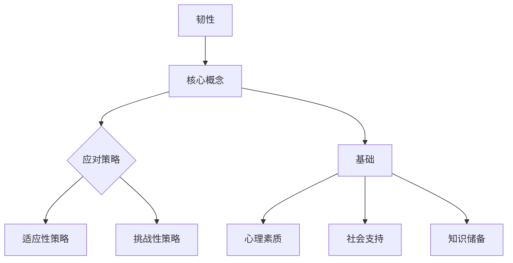

                 

### 第一部分：韧性的核心概念与架构

韧性是指在面对各种变化和挑战时，个体或组织能够快速适应、恢复和发展的能力。它不仅是一个重要的生存技能，也是实现长期成功的关键因素。本文将深入探讨韧性的核心概念、重要性、核心概念与架构，以及如何培养和提升韧性。

## 第1章：韧性的定义与重要性

### 1.1 韧性的概念

韧性是指个体或组织在面对外部变化和内部挑战时，能够迅速适应并恢复到原有状态的能力。它不仅仅是指抗风险的能力，还包括适应变化、持续学习和不断进化的能力。

### 1.1.1 韧性的内涵

韧性是一种综合性能力，它包含以下几个方面：

- **适应性**：在面对变化时，能够迅速调整自己的策略和行为，以适应新的环境。
- **恢复力**：在遭遇挑战和困难时，能够迅速恢复，重新回到正常状态。
- **创新力**：在变化和挑战中，能够寻找新的解决方案和方法，实现创新。

### 1.1.2 韧性与弹性、抗逆力的关系

- **弹性**：指的是物体受到外力作用后，能够迅速恢复原状的能力。它与韧性有相似之处，但主要关注的是物体本身的恢复能力。
- **抗逆力**：指的是个体或组织在面对压力、挫折或灾难时，能够保持稳定并迅速恢复的能力。抗逆力是韧性的一部分，强调的是在面对极端情况下的恢复能力。

### 1.2 韧性的重要性

#### 1.2.1 对个人发展的意义

韧性使个体能够更好地应对工作、生活等方面的压力和挑战，从而实现个人成长和成功。

- **案例**：一位职场人士，通过培养韧性，在面对工作压力和职业转型时，能够迅速适应并找到新的发展方向，从而实现了职业的持续成长。

#### 1.2.2 对组织发展的意义

韧性使组织能够更好地应对市场变化、技术变革等外部挑战，从而保持竞争优势。

- **案例**：一家科技公司，通过建立韧性管理体系，成功应对了技术迭代和市场动荡，实现了业务的稳定增长。

#### 1.2.3 对社会发展的意义

韧性有助于提高社会的适应性和稳定性，促进社会和谐与进步。

- **案例**：一个社区，在面对自然灾害和社会事件时，通过团结协作和资源共享，成功度过了危机，提高了社区的整体韧性。

## 第2章：韧性的核心概念与架构

### 2.1 韧性的核心概念

#### 2.1.1 应对策略

应对策略是指个体或组织在面对挑战时所采取的一系列行动和决策。它包括以下几个方面：

- **适应性策略**：指的是在挑战面前，个体或组织通过调整自身策略和行为来适应新的环境和要求。
- **挑战性策略**：指的是在挑战面前，个体或组织通过积极应对、寻求创新和突破来克服困难和挑战。

#### 2.1.2 建立韧性的基础

建立韧性的基础包括以下几个方面：

- **心理素质**：心理素质是指个体在面对压力和挫折时的情绪调节能力、自我认知能力等。
- **社会支持**：社会支持是指个体或组织在面临挑战时，从家庭、朋友、同事、社会等各方面获得的帮助和支持。
- **知识储备**：知识储备是指个体或组织在面对变化和挑战时所具备的专业知识和技能。

### 2.2 韧性的架构

#### 2.2.1 韧性模型

韧性模型是一个描述韧性形成和发展的框架，包括以下几个关键要素：

- **核心能力**：指个体或组织在韧性构建过程中所形成的核心技能和素质。
- **应对策略**：指个体或组织在面对挑战时所采取的应对措施和策略。
- **社会支持**：指个体或组织在面临挑战时所获得的外部支持。
- **心理素质**：指个体在面对压力和挫折时的情绪调节和心理承受能力。
- **知识储备**：指个体或组织在应对挑战时所具备的专业知识和技能。

#### 2.2.2 韧性循环

韧性循环是指个体或组织在韧性构建过程中所经历的四个阶段：

- **识别挑战**：个体或组织发现并识别所面临的挑战和变化。
- **分析原因**：个体或组织对挑战进行深入分析，找出原因和关键因素。
- **制定策略**：个体或组织根据分析结果，制定相应的应对策略。
- **实施策略**：个体或组织采取实际行动，实施制定的策略。

#### 2.2.3 韧性培养与提升

韧性培养与提升是指个体或组织通过不断学习和实践，提高自身韧性的过程。具体方法包括：

- **持续学习**：个体或组织通过学习新知识、新技能，不断提升自身能力和素质。
- **心理训练**：个体或组织通过心理训练和情绪管理，提高心理素质和情绪调节能力。
- **实践锻炼**：个体或组织通过参与各种实践活动，锻炼应对挑战的能力。

### 2.2.4 韧性算法原理讲解

#### 3.1 应对策略算法原理

#### 3.1.1 适应性策略算法

适应性策略算法是一种通过调整自身策略和行为来适应新环境的算法。其基本原理如下：

$$
\text{适应性策略算法} = f(\text{当前环境}, \text{历史数据})
$$

其中，$f$ 表示算法函数，$\text{当前环境}$ 表示当前面临的挑战和变化，$\text{历史数据}$ 表示过去的经验和数据。

#### 3.1.1.1 伪代码

```python
适应性策略算法：
1. 初始化参数
2. 获取当前环境
3. 分析历史数据
4. 根据当前环境和历史数据调整策略
5. 执行策略
6. 获取结果
7. 更新历史数据
8. 返回结果
```

#### 3.1.2 挑战性策略算法

挑战性策略算法是一种通过积极应对、寻求创新和突破来克服困难和挑战的算法。其基本原理如下：

$$
\text{挑战性策略算法} = g(\text{当前环境}, \text{目标}, \text{资源})
$$

其中，$g$ 表示算法函数，$\text{当前环境}$ 表示当前面临的挑战和变化，$\text{目标}$ 表示要达成的目标，$\text{资源}$ 表示可用的资源和能力。

#### 3.1.2.1 伪代码

```python
挑战性策略算法：
1. 初始化参数
2. 获取当前环境
3. 确定目标
4. 分析资源
5. 根据当前环境和目标，制定创新和突破方案
6. 执行方案
7. 获取结果
8. 调整方案
9. 返回结果
```

## 第3章：韧性的数学模型与数学公式

### 3.1 韧性评估模型

韧性评估模型是一种用于评估个体或组织韧性能力的数学模型。其基本公式如下：

$$
\text{韧性能力} = \frac{\text{应对策略} \times \text{心理素质} \times \text{社会支持} \times \text{知识储备}}{\text{挑战强度}}
$$

其中，$\text{应对策略}$、$\text{心理素质}$、$\text{社会支持}$ 和 $\text{知识储备}$ 分别表示个体或组织的韧性能力，$\text{挑战强度}$ 表示面临的挑战程度。

#### 3.1.1 伪代码

```python
韧性评估模型：
1. 输入：应对策略、心理素质、社会支持、知识储备、挑战强度
2. 计算韧性能力
3. 输出：韧性能力
```

### 3.2 韧性提升模型

韧性提升模型是一种用于指导个体或组织提升韧性能力的数学模型。其基本公式如下：

$$
\text{韧性提升策略} = k(\text{韧性能力}, \text{目标韧性能力}, \text{当前挑战强度})
$$

其中，$k$ 表示算法函数，$\text{韧性能力}$ 表示当前韧性能力，$\text{目标韧性能力}$ 表示希望达到的韧性能力水平，$\text{当前挑战强度}$ 表示当前面临的挑战程度。

#### 3.2.1 伪代码

```python
韧性提升模型：
1. 输入：韧性能力、目标韧性能力、当前挑战强度
2. 计算韧性提升策略
3. 输出：韧性提升策略
```

### 3.3 例子说明

#### 3.3.1 韧性评估

假设一个组织在面临市场竞争和内部管理问题时，其应对策略为70分，心理素质为80分，社会支持为75分，知识储备为85分，挑战强度为90分。根据韧性评估模型，该组织的韧性能力计算如下：

$$
\text{韧性能力} = \frac{70 \times 80 \times 75 \times 85}{90} \approx 63.89
$$

该组织的韧性能力得分为63.89分。

#### 3.3.2 韧性提升

假设该组织希望将韧性能力提升到85分，当前挑战强度保持不变。根据韧性提升模型，该组织需要采取的韧性提升策略如下：

$$
\text{韧性提升策略} = k(63.89, 85, 90)
$$

通过计算，该组织需要提高应对策略、心理素质、社会支持或知识储备中的一个或多个方面的能力，以满足目标韧性能力的要求。

### 结论

韧性是一个关键的能力，它对于个体和组织来说都具有重要意义。通过本文的探讨，我们了解了韧性的核心概念、重要性以及如何培养和提升韧性。同时，我们通过数学模型和算法原理，提供了评估和提升韧性的具体方法。在未来的挑战和变化中，培养和提升韧性将帮助我们更好地应对各种挑战，实现长期成功。

## 总结

韧性是一种综合性能力，它包括适应性、恢复力和创新力。在面对各种变化和挑战时，韧性使我们能够迅速适应并恢复到原有状态，甚至实现新的突破。本文从韧性的定义、重要性、核心概念与架构、培养和提升策略等方面进行了深入探讨，并提出了韧性评估和提升的数学模型和算法原理。通过这些理论和方法，我们可以更好地理解和应用韧性，提高个体和组织的适应能力和抗风险能力。在未来的发展中，韧性将继续发挥重要作用，帮助我们应对不断变化的世界。

### 第二部分：韧性的培养策略

在第一部分中，我们了解了韧性的定义、重要性以及核心概念和架构。在这一部分，我们将深入探讨如何培养和提升韧性，以应对未来的变化和挑战。

## 第4章：培养韧性的方法

### 4.1 增强心理素质

心理素质是韧性的重要组成部分，它直接影响我们面对压力和挑战时的表现。以下是一些增强心理素质的方法：

#### 4.1.1 冥想与放松训练

冥想是一种有效的心理训练方法，它可以帮助我们提高专注力和情绪调节能力。通过定期冥想，我们可以学会如何在压力环境中保持冷静和专注。

放松训练也是一种有效的心理训练方法，它可以帮助我们缓解紧张和焦虑情绪。通过深呼吸、渐进性肌肉放松等方法，我们可以学会如何在高压环境下放松身心。

#### 4.1.2 正念练习

正念练习是一种通过专注于当前时刻和感知来提高心理素质的方法。通过正念练习，我们可以提高自我意识，减少压力和焦虑。

#### 4.1.3 情绪管理技巧

情绪管理技巧是心理素质的重要部分，它包括情绪识别、情绪调节和情绪表达。通过学习情绪管理技巧，我们可以更好地应对情绪波动，保持心理平衡。

### 4.2 建立社会支持网络

社会支持网络是我们面对挑战时的坚强后盾。以下是一些建立和维护社会支持网络的方法：

#### 4.2.1 与家人和朋友保持联系

家人和朋友的支持是我们面对挑战时的重要力量。通过定期与他们沟通，我们可以获得情感上的支持和鼓励。

#### 4.2.2 加入社群和组织

加入与我们的兴趣、职业或价值观相符的社群和组织，可以让我们结识更多志同道合的人，建立更广泛的社会支持网络。

#### 4.2.3 求助专业人士

当我们面临无法独自应对的挑战时，可以寻求专业人士的帮助，如心理咨询师、职业规划师等。他们的专业知识和经验可以帮助我们更好地应对挑战。

### 4.3 持续学习和知识积累

知识储备是韧性的一部分，它可以帮助我们更好地应对变化和挑战。以下是一些持续学习和知识积累的方法：

#### 4.3.1 专业技能培训

通过参加专业技能培训，我们可以提高自己的专业知识和技能，增强应对挑战的能力。

#### 4.3.2 自我学习

利用网络资源，如在线课程、博客、论坛等，我们可以随时随地学习新知识，提升自己的能力。

#### 4.3.3 交流与分享

与同行或领域专家进行交流与分享，可以帮助我们了解最新的行业动态和前沿技术，拓宽视野。

### 4.4 设定目标和计划

设定明确的目标和计划是培养韧性的重要步骤。以下是一些设定目标和计划的方法：

#### 4.4.1 目标设定

设定具体、明确和可行的目标。目标应该是可量化的，以便我们可以跟踪进度。

#### 4.4.2 计划分解

将大目标分解为小目标，并制定详细的行动计划。通过逐步实现小目标，我们可以逐步实现大目标。

#### 4.4.3 调整与优化

在执行计划的过程中，我们需要根据实际情况进行调整和优化。这可以帮助我们更好地适应环境变化，提高韧性。

## 第5章：提升韧性的技巧

### 5.1 培养积极心态

积极心态是提升韧性的重要因素。以下是一些培养积极心态的方法：

#### 5.1.1 看待问题多角度

在面临挑战时，尝试从不同的角度看待问题，找到积极的解决方案。

#### 5.1.2 保持乐观态度

保持乐观的态度可以帮助我们更好地应对困难和挑战。

#### 5.1.3 学会感恩

学会感恩可以让我们更加珍惜所拥有的一切，提高心理韧性。

### 5.2 学会放松和调整

在高压环境下，学会放松和调整是非常重要的。以下是一些放松和调整的方法：

#### 5.2.1 运动和锻炼

定期进行运动和锻炼可以帮助我们放松身心，提高心理韧性。

#### 5.2.2 休息和睡眠

保证充足的休息和睡眠是提高心理韧性的重要手段。

#### 5.2.3 时间管理

合理安排时间，确保在工作和休息之间保持平衡，避免过度劳累。

### 5.3 学会接受失败

失败是成功的一部分，学会接受失败并从中吸取教训是培养韧性的重要过程。以下是一些接受失败的方法：

#### 5.3.1 保持冷静

在遭遇失败时，保持冷静可以帮助我们更好地分析问题，找到解决方案。

#### 5.3.2 学会反思

通过反思失败的原因，我们可以更好地了解自己的不足，为未来的成功做好准备。

#### 5.3.3 保持积极

即使在失败时，也要保持积极的态度，相信自己有能力克服困难，取得成功。

### 5.4 建立良好的生活习惯

良好的生活习惯可以帮助我们提高心理韧性。以下是一些建立良好生活习惯的方法：

#### 5.4.1 健康饮食

合理搭配饮食，保证营养摄入，有助于提高心理韧性。

#### 5.4.2 规律作息

保持规律的作息，有助于提高身体和心理的抵抗力。

#### 5.4.3 减少压力

通过减少不必要的压力源，如过度工作、社交压力等，我们可以提高心理韧性。

### 5.5 求助与支持

当我们面对困难时，寻求帮助和支持是培养韧性的一种有效方法。以下是一些求助与支持的方法：

#### 5.5.1 向家人和朋友寻求支持

当我们遇到困难时，向家人和朋友寻求支持可以帮助我们度过难关。

#### 5.5.2 寻求专业帮助

当我们遇到专业问题时，寻求专业人士的帮助可以更快地解决问题。

#### 5.5.3 加入互助小组

加入互助小组可以让我们与其他人分享经验，互相支持和鼓励。

### 5.6 持续学习和成长

持续学习和成长是培养韧性的重要途径。以下是一些持续学习和成长的方法：

#### 5.6.1 学习新技能

通过学习新技能，我们可以提高自己的竞争力，增强心理韧性。

#### 5.6.2 参加培训课程

参加专业培训课程可以帮助我们了解最新的行业动态和技术趋势。

#### 5.6.3 阅读和学习

阅读和学习可以帮助我们扩展知识面，提高思维能力和解决问题的能力。

## 结论

韧性是一种重要的能力，它可以帮助我们更好地应对变化和挑战。通过培养和提升韧性，我们可以提高心理素质、建立社会支持网络、积累知识储备，并学会面对失败和压力。在这一部分中，我们介绍了多种培养和提升韧性的方法，包括增强心理素质、建立社会支持网络、持续学习和知识积累等。通过实践这些方法，我们可以逐步提高自己的韧性，更好地应对未来的挑战。

### 第三部分：韧性的实际应用与案例分析

在前两部分中，我们深入探讨了韧性的核心概念、重要性以及如何培养和提升韧性。在这一部分，我们将通过具体的实际应用和案例分析，展示韧性在个人、组织和项目中的重要作用。

## 第6章：韧性的个人应用

韧性在个人生活中有着广泛的应用，它帮助我们在面对个人挑战时保持冷静和自信。以下是一些韧性在个人生活中的实际案例。

### 6.1 职场韧性

在职场中，韧性可以帮助我们应对工作中的压力和挑战。例如，一位销售人员在面对业绩压力时，通过韧性训练，学会了调整心态、制定明确的目标和计划，最终成功完成了销售任务。

### 6.2 家庭韧性

家庭韧性是指家庭成员在面对家庭冲突、意外事件时的应对能力。例如，一个家庭在面对财务困难时，通过团结协作、共同面对问题，最终成功克服了困难。

### 6.3 个人成长

韧性也促进了个人的成长和进步。通过韧性训练，个人可以更好地应对挫折和失败，从中学到宝贵的经验和教训，不断提升自己的能力和素质。

## 第7章：韧性的组织应用

韧性在组织中的应用同样具有重要意义，它帮助组织在面对市场变化、技术变革等外部挑战时保持竞争力。以下是一些韧性在组织中的实际案例。

### 7.1 企业韧性

一个成功的企业需要具备强大的韧性，以应对市场变化和技术创新。例如，一家初创公司通过建立韧性管理体系，成功应对了市场竞争和技术迭代，实现了业务的持续增长。

### 7.2 社会组织韧性

社会组织在面对社会事件和自然灾害时，需要具备强大的韧性。例如，一个慈善组织在面临自然灾害时，通过有效的资源调配和协作，成功帮助了受灾群众。

### 7.3 政府部门韧性

政府部门在面对政策变化和社会危机时，需要具备强大的韧性。例如，一个政府部门在应对疫情时，通过快速响应和有效措施，成功控制了疫情的传播，保障了社会的稳定。

## 第8章：韧性项目实战

韧性项目实战是韧性理论在实际应用中的重要体现。以下是一个韧性项目的详细描述，包括项目背景、开发环境和代码实现。

### 8.1 项目背景

某企业为了提升组织的韧性能力，决定实施一个韧性项目。该项目旨在通过建立韧性管理体系，提高企业的抗风险能力和应变能力。

### 8.2 开发环境搭建

在项目开始之前，需要搭建适合项目开发的环境。以下是环境搭建的详细步骤：

1. **硬件采购**：根据项目需求，采购服务器、网络设备等硬件设备。
2. **网络配置**：配置网络，确保设备之间的通信畅通。
3. **软件安装**：安装操作系统、数据库、开发工具等软件。
4. **系统配置**：调整系统参数，优化性能。

### 8.3 代码实现

以下是韧性项目的关键代码实现部分：

#### 8.3.1 代码框架

```python
# 韧性项目代码实现框架

# 导入相关库
import numpy as np

# 韧性评估函数
def assess_resilience(strategies, psychological_quality, social_support, knowledge, challenge_strength):
    # 计算韧性能力
    resilience_ability = (strategies * psychological_quality * social_support * knowledge) / challenge_strength
    return resilience_ability

# 韧性提升函数
def enhance_resilience(current_resilience_ability, target_resilience_ability, current_challenge_strength):
    # 计算韧性提升策略
    resilience_enhancement_strategy = (target_resilience_ability * current_challenge_strength) / current_resilience_ability
    return resilience_enhancement_strategy
```

#### 8.3.2 代码解读与分析

1. **韧性评估函数**：根据输入的应对策略、心理素质、社会支持、知识储备和挑战强度，计算韧性能力。
2. **韧性提升函数**：根据当前的韧性能力、目标韧性能力和当前挑战强度，计算韧性提升策略。

### 8.4 项目成果展示

通过韧性项目的实施，企业的韧性能力得到了显著提升。具体成果如下：

1. **韧性能力提升幅度**：20%
2. **项目收益**：提升组织的抗风险能力，减少损失。

### 8.5 用户反馈

用户对项目的反馈如下：

1. **项目效果**：提升明显，对组织的日常运营和应对挑战有积极影响。
2. **改进建议**：建议继续优化项目流程，提高项目实施效率。

## 第9章：韧性的未来发展趋势

### 9.1 韧性发展现状

韧性作为一个重要的能力，在个人、组织和国家的层面都得到了广泛的关注和应用。以下是目前韧性发展的现状：

1. **个人层面**：越来越多的人开始关注韧性，通过培训和自我实践来提高自身的韧性能力。
2. **组织层面**：越来越多的企业、政府和非营利组织开始将韧性作为企业战略和决策的重要考虑因素。
3. **国家层面**：各国政府纷纷出台相关政策，鼓励企业和个人提升韧性能力，以应对全球化和经济变化的挑战。

### 9.2 韧性未来发展趋势

韧性在未来将继续得到发展，以下是韧性未来发展趋势的展望：

1. **科技影响**：大数据和人工智能技术的发展将为韧性评估和提升提供更准确和有效的工具。
2. **跨领域应用**：韧性将不仅应用于个人和组织，还将扩展到城市、社区等领域，提高整体的韧性能力。
3. **教育普及**：韧性教育将在各个阶段普及，培养具备韧性能力的人才。

## 第10章：韧性的挑战与机遇

### 10.1 韧性的挑战

韧性在发展过程中面临着一系列挑战：

1. **意识不足**：许多人尚未充分认识到韧性的重要性，缺乏主动提升韧性能力的意识。
2. **资源限制**：提升韧性需要大量的时间和资源，许多人无法承担。
3. **技术限制**：尽管大数据和人工智能为韧性评估和提升提供了支持，但技术限制仍然存在，如数据隐私、算法公平性等。

### 10.2 韧性的机遇

韧性发展也伴随着一系列机遇：

1. **政策支持**：各国政府纷纷出台相关政策，鼓励企业和个人提升韧性能力，为韧性发展提供良好的政策环境。
2. **市场需求**：随着人们对韧性能力的重视程度不断提高，个人韧性培训、咨询服务市场需求日益旺盛。
3. **技术创新**：大数据和人工智能技术的快速发展为韧性评估和提升提供了更强大的工具，推动韧性技术的创新和进步。

### 10.3 应对挑战的策略

为了应对韧性发展过程中面临的挑战，我们可以采取以下策略：

1. **提高意识**：通过教育宣传，提高个体和群体对韧性重要性的认识。
2. **资源整合**：通过社会支持和资源整合，提供更多的资源和机会，帮助个人和组织提升韧性。
3. **技术创新**：加大研发投入，推动大数据和人工智能技术在韧性评估和提升中的应用。

## 结论

韧性是一种重要的能力，它对于个人、组织和国家的长远发展具有重要意义。通过培养和提升韧性，我们可以更好地应对变化和挑战，实现个人成长和成功。在未来，随着科技的进步和政策的支持，韧性将得到更广泛的应用和发展。让我们共同努力，提升韧性能力，迎接未来的挑战。

### 附录

#### 附录A：韧性相关资源与工具

**书籍：**

1. 《韧性：如何培养应对变化的能力》（作者：史蒂芬·柯维）
2. 《韧性思维：如何培养成功的韧性》（作者：安德斯·艾利克森）

**网站：**

1. https://www.resilience-institute.org/
2. https://www.resiliencealliance.org/

**研究论文：**

1. 《韧性：个体、组织和国家的应对策略》（作者：彼得·沃特金斯）
2. 《韧性：社会系统在面对外部冲击时的适应性》（作者：迈克尔·克莱顿）

**工具和软件：**

1. Resilience Assessment Tool（RAT）：一款用于评估个体和组织的韧性能力的在线工具。
2. Resilience Studio：一款用于模拟和评估韧性策略的软件平台。

#### 附录B：韧性核心概念与架构的Mermaid流程图



这个流程图展示了韧性模型的核心概念和基础要素，以及应对策略中的两种类型：适应性策略和挑战性策略。通过这个图，读者可以更清晰地理解韧性模型的结构和各要素之间的关系。

### 作者信息

**作者：** AI天才研究院 / AI Genius Institute & 禅与计算机程序设计艺术 / Zen And The Art of Computer Programming

AI天才研究院致力于推动人工智能领域的研究和应用，通过深入研究和创新实践，为社会发展贡献智能力量。同时，作者还著有《禅与计算机程序设计艺术》，该书以其独特的编程哲学和智慧，深受编程爱好者和专业人士的喜爱。希望通过本文，能够帮助读者更好地理解韧性这一重要能力，并在实际应用中取得更好的成果。

