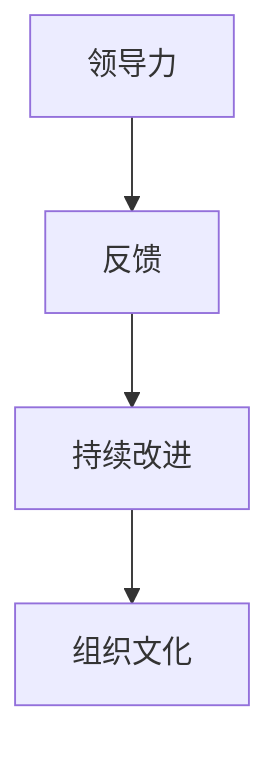

                 

## 《领导力与反馈：建立持续改进的文化》

> **关键词：领导力、反馈、持续改进、文化、组织发展**

> **摘要：本文深入探讨了领导力与反馈之间的关系，阐述了如何通过建立持续改进的文化来提升组织绩效。文章详细介绍了领导力的核心概念、反馈机制及其在项目管理和团队协作中的应用，并通过案例研究和实际项目实战，展示了如何将理论转化为实践，助力企业实现可持续发展。**

---

### 《领导力与反馈：建立持续改进的文化》目录大纲

#### 第一部分：领导力基础

##### 第1章：领导力概述
- 1.1 领导力的定义与重要性
- 1.2 领导力的五个核心要素
- 1.3 领导风格与行为

##### 第2章：领导力核心概念
- 2.1 情境领导理论
- 2.2 超级领导者的特质
- 2.3 领导与管理的区别

#### 第二部分：反馈机制

##### 第3章：反馈的概念与类型
- 3.1 反馈的基本概念
- 3.2 正面反馈与负面反馈
- 3.3 有效反馈的特征

##### 第4章：建立反馈文化
- 4.1 反馈文化的重要性
- 4.2 创建反馈系统的步骤
- 4.3 鼓励员工反馈的策略

#### 第三部分：领导力与反馈的结合

##### 第5章：领导力与反馈的关系
- 5.1 反馈如何增强领导力
- 5.2 领导者如何有效地给予反馈
- 5.3 反馈中的沟通技巧

##### 第6章：案例研究
- 6.1 案例一：如何在团队中建立反馈文化
- 6.2 案例二：领导者如何通过反馈进行持续改进

#### 第四部分：反馈的实际应用

##### 第7章：反馈在项目管理和团队协作中的应用
- 7.1 反馈在项目管理中的作用
- 7.2 团队协作中的反馈机制
- 7.3 反馈在问题解决中的应用

##### 第8章：反馈与持续改进
- 8.1 持续改进的概念与原则
- 8.2 反馈循环与持续改进的关系
- 8.3 如何通过反馈实现持续改进

##### 第9章：领导力与反馈的实践策略
- 9.1 如何培养反馈文化
- 9.2 领导者如何在日常工作中运用反馈
- 9.3 反馈与员工发展的结合

#### 附录

##### 附录A：反馈工具与应用
- A.1 常用的反馈工具
- A.2 反馈工具的实际应用案例

##### 附录B：反馈相关资源
- B.1 经典书籍推荐
- B.2 网络资源与链接
- B.3 反馈技巧训练课程推荐

### 第一部分：领导力基础

#### 第1章：领导力概述

##### 1.1 领导力的定义与重要性

领导力是指领导者通过激发、引导和协调团队成员，实现组织目标的能力。它不仅仅是一个职位或者角色，更是一种影响力、能力和技巧的综合体现。领导力在组织中的作用至关重要，它直接影响组织的绩效、创新能力和员工满意度。

首先，领导力是推动组织发展的核心动力。领导者通过设定愿景、规划目标和制定战略，引领组织不断向前发展。他们能够激发员工的潜能，使员工积极投入到工作中，从而提高组织的整体绩效。

其次，领导力是建立团队凝聚力的关键因素。领导者通过沟通、激励和团队建设，增强团队成员之间的信任和协作，形成紧密的团队关系。这有助于提高团队的工作效率和创新能力，使组织更加具有竞争力。

最后，领导力对员工发展具有重要影响。领导者通过提供反馈、指导和支持，帮助员工提升技能、实现职业发展。这不仅能提高员工的满意度和忠诚度，还能为组织培养更多的高潜力人才。

##### 1.2 领导力的五个核心要素

领导力的核心要素包括决策能力、沟通能力、激励能力、影响力和持续学习。以下是对这五个要素的详细解析：

1. **决策能力**：决策能力是领导者的一项关键能力。领导者需要能够在面对复杂和不确定的情况时，快速做出明智的决策。这要求领导者具备良好的逻辑思维、分析能力和判断力。同时，领导者还需要学会权衡利弊，做出符合组织利益和长远发展的决策。

2. **沟通能力**：沟通能力是领导者与团队成员之间建立有效沟通的关键。领导者需要能够清晰、准确地传达自己的意图和期望，同时也能够倾听和理解员工的意见和建议。良好的沟通能力有助于消除误解和冲突，增强团队的凝聚力和协作性。

3. **激励能力**：激励能力是领导者激发员工积极性和潜能的重要手段。领导者需要能够运用多种激励方式，如表扬、奖励、培训等，激发员工的内在动机，使员工保持高昂的工作热情。此外，领导者还需要关注员工的心理需求，提供情感支持和关怀，增强员工的归属感和忠诚度。

4. **影响力**：影响力是领导者的一项核心特质。领导者需要具备强大的影响力，能够影响和引导团队成员，使其朝着共同的目标前进。这种影响力不仅来自于领导者的职位和权力，更来自于领导者的人格魅力、价值观和领导风格。

5. **持续学习**：持续学习是领导者不断提升自我能力和素质的关键途径。领导者需要具备开放的心态，不断学习新知识、新技能和新理念。这不仅能帮助领导者适应不断变化的环境，还能为组织带来新的思维和创造力。

##### 1.3 领导风格与行为

领导风格是指领导者在与团队成员互动和管理过程中表现出来的行为和态度。常见的领导风格包括权威型、民主型、放任型等。以下是对这些领导风格的详细解析：

1. **权威型领导风格**：权威型领导者强调领导者的权威和权力，决策过程主要由领导者独立完成。这种领导风格适用于紧急情况或需要快速决策的场景。然而，过度依赖权威型领导风格可能导致团队成员缺乏参与感和积极性。

2. **民主型领导风格**：民主型领导者注重团队成员的参与和意见，通过民主讨论和协商来做出决策。这种领导风格有助于增强团队的凝聚力和协作性，提高员工的满意度和忠诚度。然而，民主型领导风格在决策过程中可能耗费较长时间，不适合紧急情况。

3. **放任型领导风格**：放任型领导者给予团队成员充分的自由和自主权，让团队成员自行决定工作内容和方式。这种领导风格适用于高度专业化和独立工作的团队。然而，放任型领导风格可能导致团队成员之间的协作不畅，缺乏统一的目标和方向。

总之，领导风格并非一成不变，领导者应根据不同的情况和团队特点，灵活运用不同的领导风格。有效的领导者能够在不同场景下调整自己的领导风格，以实现最佳的管理效果。

### 第二部分：反馈机制

#### 第3章：反馈的概念与类型

##### 3.1 反馈的基本概念

反馈是一种信息交流过程，通过表达对某项工作、行为或结果的看法和评价，以促进个人或组织的改进和成长。反馈可以是正面的，也可以是负面的，但其核心目的是帮助接收者更好地理解自身行为的效果，从而进行自我调整和改进。

在组织内部，反馈是一种重要的管理工具。通过反馈，领导者可以了解团队成员的工作表现，识别问题并提供解决方案，从而提高团队的整体绩效。同时，反馈也是一种激励和鼓励的手段，可以激发员工的工作热情和积极性。

反馈的基本要素包括：

1. **明确性**：反馈应该具体、明确，避免模糊和含糊不清的表述，使接收者能够清楚地理解反馈的内容。
2. **及时性**：反馈应该及时给予，以便接收者能够迅速采取行动进行改进。
3. **建设性**：反馈应该具有建设性，不仅指出问题，还要提供改进的建议和指导。

##### 3.2 正面反馈与负面反馈

正面反馈和负面反馈是反馈的两种基本类型，它们在激励和改进方面发挥着不同的作用。

**正面反馈**：

正面反馈是指对某项工作、行为或结果给予积极评价和认可。正面反馈可以增强员工的自信心和动力，激发他们的工作热情和创新能力。以下是一些正面反馈的示例：

- “你的项目进展非常顺利，你的努力值得表扬。”
- “你今天的工作表现非常出色，你解决问题的关键方法值得我们学习。”
- “你对这个问题的分析和解决方案非常创新，给我们提供了很多新的思路。”

**负面反馈**：

负面反馈是指对某项工作、行为或结果给予批评和指正。负面反馈的目的是帮助员工识别问题，并提供改进的方向。以下是一些负面反馈的示例：

- “你的报告中有几处数据错误，请仔细检查并纠正。”
- “你的工作效率较低，影响了整个团队的工作进度，请尽快调整。”
- “你的沟通方式可能引起了一些误解，建议你改进沟通技巧，以便更好地与同事合作。”

**如何平衡正面反馈和负面反馈**：

在给予反馈时，领导者需要平衡正面反馈和负面反馈，以确保员工能够既看到自己的优点，也意识到需要改进的地方。以下是一些策略：

1. **多给予正面反馈**：领导者应该多关注员工的优点和成就，及时给予正面反馈，以增强员工的自信心和动力。
2. **针对具体行为给予反馈**：在给予负面反馈时，应该针对具体的行为或结果进行评价，避免对员工进行个人攻击或负面标签化。
3. **提供具体的改进建议**：在负面反馈中，领导者应该提供具体的改进建议和指导，帮助员工找到改进的方向和方法。
4. **反馈时的态度和语气**：领导者应该保持积极、尊重和关心的态度，以创造一个开放、支持和鼓励的反馈环境。

##### 3.3 有效反馈的特征

有效反馈不仅需要具备明确性、及时性和建设性，还需要具备以下特征：

**具体性**：

具体性是指反馈应该具体、明确，避免笼统和模糊的表述。具体性的反馈可以帮助员工更好地理解自己的问题，并找到具体的改进方法。以下是一些具体的反馈示例：

- “你的报告中有几处数据错误，请仔细检查并纠正。”
- “你今天的工作效率较低，影响了整个团队的工作进度，请尽快调整。”

**及时性**：

及时性是指反馈应该在问题发生时或之后尽快给予。及时的反馈可以帮助员工迅速采取行动进行改进，避免问题进一步恶化。以下是一些及时的反馈示例：

- “你刚刚的报告中有几处数据错误，我刚刚发现并指出，请立即进行修改。”
- “你今天的工作效率较低，我刚刚注意到，请尽快调整。”

**建设性**：

建设性是指反馈应该提供具体的改进建议和指导，帮助员工找到改进的方向和方法。建设性的反馈可以帮助员工克服困难，实现个人和组织的成长。以下是一些建设性的反馈示例：

- “你的报告中有几处数据错误，我建议你使用最新的数据源进行核实，以确保报告的准确性。”
- “你今天的工作效率较低，我建议你制定一个详细的工作计划，并严格按照计划执行，以提高工作效率。”

**尊重性**：

尊重性是指反馈应该以尊重和关心的态度进行，避免攻击性或负面标签化的语言。尊重性的反馈可以帮助员工保持积极的心态，愿意接受和改进。以下是一些尊重性的反馈示例：

- “你的报告中有几处数据错误，这是一个常见的问题，我理解你可能感到困扰，让我们一起找出解决办法。”
- “你今天的工作效率较低，这是一个挑战，我相信你能够找到提高工作效率的方法。”

总之，有效反馈是领导力的重要组成部分，它可以帮助员工提高工作表现，实现个人和组织的成长。领导者应该掌握反馈的艺术，以创造一个积极、支持和鼓励的反馈环境。

#### 第4章：建立反馈文化

##### 4.1 反馈文化的重要性

建立反馈文化是提升组织绩效和员工满意度的重要途径。一个良好的反馈文化不仅能够帮助员工识别和改进工作中的问题，还能够促进团队协作和创新，从而推动组织的持续发展。

首先，反馈文化有助于提升员工的自我认知和成长。通过定期的反馈，员工可以了解自己在工作中的优点和不足，从而有针对性地进行改进。这种自我认知和成长不仅能够提高员工的工作能力和绩效，还能够增强员工的自信心和职业发展意识。

其次，反馈文化能够促进团队协作和沟通。在一个开放的反馈文化中，员工敢于提出意见和建议，也能够接受和采纳他人的反馈。这种良好的沟通氛围有助于团队中的成员相互理解和支持，共同解决问题，提高团队的协作效率。

最后，反馈文化有助于组织的持续改进和创新发展。通过不断收集和分析反馈信息，组织可以发现潜在的问题和改进机会，从而进行有针对性的调整和优化。这种持续改进的文化能够使组织保持竞争力，适应不断变化的市场环境。

##### 4.2 创建反馈系统的步骤

要建立有效的反馈文化，首先需要创建一个完善的反馈系统。以下是一些关键步骤：

**1. 设定反馈目标**：

明确反馈的目标是创建反馈系统的第一步。反馈目标应该具体、可衡量，并与组织的战略目标相一致。例如，反馈目标可以包括提高员工满意度、提升项目成功率、增强团队协作等。

**2. 设计反馈流程**：

设计一个清晰、高效的反馈流程是确保反馈顺利进行的关键。反馈流程应该包括反馈的收集、处理、传递和反馈的跟踪。以下是一个典型的反馈流程：

- **收集反馈**：通过问卷调查、面对面访谈、邮件等方式收集员工的反馈。
- **处理反馈**：对收集到的反馈进行整理、分类和优先级排序。
- **传递反馈**：将反馈结果传达给相关员工和管理层，并提供具体的改进建议。
- **跟踪反馈**：对反馈的执行情况进行跟踪，确保改进措施得到落实。

**3. 选择反馈工具**：

选择合适的反馈工具是提高反馈效率和效果的重要环节。常见的反馈工具有问卷调查、面谈、反馈会议等。根据组织的具体情况和需求，可以选择一种或多种反馈工具进行组合使用。

**4. 培训员工反馈技巧**：

为了确保反馈的有效性和建设性，需要对员工进行反馈技巧的培训。培训内容可以包括如何给予反馈、如何接受反馈、如何提出建议等。通过培训，员工可以更好地理解反馈的意义和目的，掌握有效的反馈技巧。

**5. 制定反馈政策和制度**：

制定明确的反馈政策和制度是确保反馈文化得以长期坚持的重要保障。反馈政策和制度应该明确反馈的流程、权限、责任和激励措施。例如，可以规定定期进行反馈调查、反馈结果与绩效考核相结合、反馈优秀员工给予奖励等。

##### 4.3 鼓励员工反馈的策略

要建立有效的反馈文化，不仅需要创建反馈系统，还需要采取一系列策略来鼓励员工主动提供反馈。以下是一些有效的策略：

**1. 创造开放沟通的氛围**：

组织应该营造一个开放、支持和鼓励的沟通氛围，使员工感到安全和放心，敢于提出意见和建议。管理层可以通过定期召开反馈会议、开放意见箱等方式，鼓励员工表达自己的想法。

**2. 提供反馈反馈的渠道**：

组织应该提供多种反馈渠道，包括线上反馈系统、线下意见箱、面对面访谈等。这些渠道应该方便员工使用，并且保证反馈信息的及时处理和回应。

**3. 表彰积极反馈的行为**：

组织可以通过表彰积极反馈的行为来激励员工主动提供反馈。例如，可以设立“最佳反馈奖”、“反馈之星”等荣誉称号，并对获奖员工进行奖励和表彰。

**4. 建立反馈激励机制**：

组织可以建立反馈激励机制，将反馈与员工的绩效评估、晋升和发展相结合。例如，可以将反馈结果作为员工绩效考核的一部分，对提供高质量反馈的员工给予额外的奖励或晋升机会。

**5. 培养员工的反馈能力**：

组织可以通过培训和教育来提高员工的反馈能力。例如，可以开展反馈技巧培训课程，教授员工如何给予建设性反馈、如何接受反馈等。

总之，建立反馈文化需要组织从多个方面进行努力，包括创建反馈系统、鼓励员工反馈、提供反馈反馈等。通过这些策略，组织可以建立起一个积极、支持和鼓励的反馈文化，从而促进组织的持续改进和创新发展。

#### 第5章：领导力与反馈的关系

##### 5.1 反馈如何增强领导力

在领导力的发展过程中，反馈起着至关重要的作用。有效的反馈不仅能够帮助领导者提升个人能力，还能够促进团队的整体绩效。以下是如何通过反馈增强领导力的几个方面：

**1. 自我认知的提升**：

通过反馈，领导者可以了解到自己在工作中的优点和不足。这种自我认知的提升有助于领导者更加客观地看待自己的行为和决策，从而更好地发挥领导力。例如，一个领导者可能会通过员工的反馈了解到自己在沟通方面存在不足，进而采取措施提高自己的沟通能力。

**2. 问题识别与解决**：

领导者的一个关键任务是识别和解决问题。通过反馈，领导者可以及时发现团队中的潜在问题，并采取相应的措施进行解决。例如，如果员工反馈某个项目进度延误，领导者可以通过进一步的调查和分析，找出具体原因并制定解决方案。

**3. 决策能力的提升**：

有效的反馈可以帮助领导者更好地做出决策。通过收集和分析员工和团队成员的反馈，领导者可以获得更多的信息，从而做出更加全面和明智的决策。例如，在项目决策过程中，领导者的决策可以基于团队成员对项目进展和风险的反馈，提高决策的准确性和有效性。

**4. 团队协作的促进**：

领导力不仅仅是关于个人能力的发挥，更涉及到团队协作的效能。通过反馈，领导者可以了解团队成员的看法和需求，促进团队成员之间的沟通和协作。例如，领导者可以通过定期的团队反馈会议，鼓励成员分享自己的意见和建议，从而提高团队的协作效率。

**5. 员工发展的支持**：

领导者的一个重要职责是支持员工的发展。通过有效的反馈，领导者可以识别员工的潜力，并提供相应的培训和发展机会。例如，一个领导者可以通过反馈了解到某位员工在某个领域具有潜力，进而为其提供专业的培训和支持，帮助其实现职业发展。

**6. 领导风格的优化**：

领导者的风格和行为对团队的影响至关重要。通过反馈，领导者可以了解自己在团队中的形象和影响力，并据此调整自己的领导风格。例如，如果反馈显示领导者过于严厉，领导者可以通过改变沟通方式和决策风格，营造一个更加开放和支持的团队环境。

**7. 组织文化的塑造**：

反馈不仅对个人和团队有益，也对组织文化有着深远的影响。一个重视反馈的组织文化能够激发员工的创造力和积极性，提高组织的整体绩效。领导者可以通过积极倡导和践行反馈文化，塑造一个开放、学习和成长的组织氛围。

##### 5.2 领导者如何有效地给予反馈

给予有效的反馈是领导者的一项关键技能。以下是一些策略和方法，帮助领导者有效地给予反馈：

**1. 清晰明确**：

反馈应该具体、明确，避免模糊和含糊的表述。领导者应该清楚地表达自己的观点和建议，使接收者能够准确地理解反馈的内容。例如，而不是说“你做得不好”，可以说“在这个报告中，数据准确性有待提高”。

**2. 及时性**：

及时反馈有助于员工迅速采取行动进行改进。领导者应该在问题发生时或之后尽快给予反馈，避免拖延。例如，如果在一个项目中发现进度延误，领导者应该在第一时间与团队成员讨论并给出建议。

**3. 建设性**：

建设性反馈不仅指出问题，还提供具体的改进建议。领导者应该关注问题的根源，并提供解决问题的方法。例如，如果员工在沟通中存在误解，领导者可以建议使用更清晰的沟通方式。

**4. 尊重性**：

给予反馈时，领导者应该以尊重和关心的态度进行。避免使用攻击性或负面标签化的语言，以免损害员工的自信心和积极性。例如，可以说“我注意到你的报告中有一些数据错误，我们可以一起找出解决办法”，而不是直接指责。

**5. 个人化**：

反馈应该根据个人的具体情况和需求进行。领导者应该了解员工的特点和偏好，并根据这些信息给予个性化的反馈。例如，对于喜欢具体数据的员工，领导者可以提供详细的数据分析。

**6. 正面激励**：

在负面反馈中，领导者也应该尽量保持积极的态度。通过正面激励，领导者可以鼓励员工克服困难，提升自我。例如，在指出问题后，可以补充说“我相信你能够解决这个问题，你的能力值得信赖”。

**7. 双向沟通**：

领导者应该鼓励双向沟通，让员工有机会表达自己的观点和感受。这有助于建立信任和合作关系，使反馈更加有效。例如，在给予反馈后，可以问员工“你对此有何想法？”或“你觉得如何改进？”。

##### 5.3 反馈中的沟通技巧

有效的沟通是给予有效反馈的关键。以下是一些在反馈过程中可以应用的沟通技巧：

**1. 倾听**：

在给予反馈之前，领导者应该先倾听员工的观点和感受。这有助于建立信任和理解，使反馈更加有效。例如，在反馈会议中，领导者可以先让员工陈述自己的看法，再进行针对性的反馈。

**2. 表达清晰**：

领导者应该使用清晰、简洁的语言表达反馈。避免使用专业术语或模糊的表述，以免造成误解。例如，可以用具体的例子来说明问题，使员工更容易理解。

**3. 非语言沟通**：

非语言沟通，如肢体语言、面部表情和声音语调，也是反馈过程中重要的沟通手段。领导者应该注意自己的非语言表达，以传达积极的反馈和鼓励。例如，微笑、点头和积极的语调可以增强反馈的正面效果。

**4. 适应性沟通**：

领导者应该根据员工的个性和沟通风格进行适应性沟通。这有助于提高反馈的接受度和效果。例如，对于内向的员工，领导者可以采用更加温和和详细的反馈方式。

**5. 情感共鸣**：

在反馈过程中，领导者应该尝试与员工建立情感共鸣，以增强反馈的感染力。这有助于员工更好地接受和消化反馈。例如，领导者可以说“我理解你的感受，这种情况确实让人感到困扰”。

**6. 持续跟进**：

给予反馈后，领导者应该持续跟进反馈的执行情况，以确保改进措施得到落实。这有助于确保反馈的有效性。例如，可以定期与员工讨论反馈的进展，并提供必要的支持和指导。

总之，有效的反馈不仅需要领导者具备良好的沟通技巧，还需要关注反馈的内容和过程。通过倾听、表达清晰、非语言沟通、适应性沟通、情感共鸣和持续跟进，领导者可以给予更有效的反馈，帮助员工提升自我，推动团队和组织的发展。

### 第6章：案例研究

#### 6.1 案例一：如何在团队中建立反馈文化

**案例背景**：

某科技公司是一家快速发展的创业公司，员工人数超过100人，团队成员分布在不同的项目团队中。随着公司规模的扩大，团队成员之间的沟通和协作出现了问题，团队绩效也受到了影响。为了提高团队协作效率和绩效，公司决定在团队中建立反馈文化。

**具体措施**：

1. **设定反馈目标**：

公司首先明确了反馈的目标，包括提高团队沟通效率、增强团队凝聚力、提升项目成功率等。这些目标与公司的战略目标相一致，有助于确保反馈工作得到有效实施。

2. **设计反馈流程**：

公司设计了一套完整的反馈流程，包括反馈的收集、处理、传递和跟踪。反馈流程的具体步骤如下：

   - **收集反馈**：公司通过问卷调查、面对面访谈和邮件等方式收集员工的反馈。问卷调查采用匿名形式，确保员工能够真实地表达自己的意见。
   - **处理反馈**：人力资源部门对收集到的反馈进行整理、分类和优先级排序。对于重要和紧急的反馈，公司会立即采取措施进行解决。
   - **传递反馈**：公司将反馈结果传达给相关员工和管理层，并提供具体的改进建议。反馈结果通过内部邮件、公告和会议等形式进行公布。
   - **跟踪反馈**：公司对反馈的执行情况进行跟踪，确保改进措施得到落实。人力资源部门定期对反馈的执行情况进行评估，并根据评估结果进行调整和优化。

3. **选择反馈工具**：

公司选择了多种反馈工具，包括问卷调查、面对面访谈、反馈会议和邮件等。这些工具根据不同的需求和场景进行组合使用，以提高反馈的效率和效果。

4. **培训员工反馈技巧**：

公司组织了反馈技巧培训课程，帮助员工掌握如何给予和接受反馈。培训内容包括如何提出具体、明确的反馈、如何接受建设性反馈、如何提出建议等。

5. **制定反馈政策和制度**：

公司制定了明确的反馈政策和制度，包括反馈的目标、流程、责任和激励措施。反馈政策和制度确保了反馈工作的规范化和制度化，为反馈文化的建立提供了制度保障。

**反馈文化对团队绩效的影响**：

通过建立反馈文化，公司的团队协作效率显著提高。团队成员之间的沟通更加顺畅，问题能够及时发现和解决。团队凝聚力也得到增强，员工对公司的归属感和认同感明显提升。项目成功率有了显著的提升，公司的整体绩效得到了明显改善。此外，员工的满意度和忠诚度也有所提高，员工流失率有所下降。

**总结与启示**：

该案例展示了如何通过建立反馈文化来提升团队协作效率和绩效。关键在于设定明确的反馈目标、设计合理的反馈流程、选择合适的反馈工具、培训员工反馈技巧和制定反馈政策和制度。这些措施不仅有助于提高团队绩效，还能够促进员工的个人成长和职业发展。

#### 6.2 案例二：领导者如何通过反馈进行持续改进

**案例背景**：

某大型制造企业面临市场竞争激烈、产品更新换代快的挑战。为了保持竞争力，公司决定通过持续改进来提升产品质量和生产效率。公司的领导者意识到，有效的反馈是持续改进的关键。

**具体措施**：

1. **建立反馈机制**：

公司建立了完善的反馈机制，包括员工反馈、客户反馈和内部反馈。员工反馈主要通过定期的员工满意度调查和开放式意见箱进行收集。客户反馈通过客户满意度调查和市场调研获取。内部反馈则通过生产部门、质量部门和研发部门之间的定期会议和报告进行。

2. **领导者参与反馈**：

公司领导者积极参与反馈过程，不仅关注员工和客户的反馈，还主动收集和关注内部反馈。领导者通过亲自参与反馈会议、巡视生产线和与员工进行一对一沟通，了解公司的真实情况。

3. **反馈分析**：

公司对收集到的反馈进行详细分析，识别出关键问题和改进机会。分析过程包括数据整理、趋势分析和原因探究。通过分析，公司明确了需要改进的方面和优先级。

4. **制定改进计划**：

根据反馈分析的结果，公司制定了详细的改进计划。改进计划包括具体的改进目标、改进措施、责任人和时间表。改进计划确保了反馈的执行和落实。

5. **持续改进**：

公司实施了持续改进计划，并对改进效果进行跟踪和评估。通过定期的反馈会议和报告，公司能够及时发现和解决新的问题，确保持续改进的过程不断推进。

**反馈如何促进持续改进**：

1. **问题识别**：

通过反馈，公司能够及时发现存在的问题，包括产品质量问题、生产效率问题和管理流程问题。这些问题成为改进计划的出发点。

2. **决策支持**：

反馈提供了宝贵的数据和信息，帮助领导者做出更加明智的决策。例如，通过客户反馈，公司可以了解市场需求和消费者偏好，从而调整产品开发和营销策略。

3. **资源分配**：

反馈帮助公司合理分配资源，确保改进措施得到有效实施。公司根据反馈分析的结果，优先分配资源到最需要改进的领域。

4. **员工激励**：

有效的反馈能够激励员工积极参与改进过程。通过反馈，员工能够了解自己的工作表现和改进方向，提高工作积极性和责任心。

5. **持续改进的文化**：

反馈文化的建立有助于形成持续改进的文化。公司通过持续的反馈和改进，培养了员工和领导者持续改进的意识，提高了公司的整体竞争力。

**总结与启示**：

该案例展示了领导者如何通过有效的反馈进行持续改进。关键在于建立完善的反馈机制、领导者积极参与反馈、反馈分析、制定改进计划和持续改进。通过这些措施，公司能够不断识别和解决问题，提升产品质量和生产效率，保持市场竞争力。这个案例为其他企业提供了宝贵的经验和启示。

### 第四部分：反馈的实际应用

#### 第7章：反馈在项目管理和团队协作中的应用

##### 7.1 反馈在项目管理中的作用

在项目管理中，反馈是一种重要的管理工具，它有助于提高项目的成功率和团队的协作效率。以下是如何在项目管理中应用反馈的几个关键方面：

**1. 项目目标与进度反馈**：

项目目标是项目的核心，反馈有助于确保项目目标的实现。项目经理可以通过定期收集团队成员的反馈，了解项目的进展情况，及时发现偏离目标的问题。例如，项目经理可以定期组织项目进展会议，团队成员在会上分享自己的工作进展，讨论存在的问题和解决方案。这种反馈机制有助于确保项目目标的持续关注和实现。

**2. 项目风险与问题反馈**：

项目过程中总会遇到各种风险和问题，及时的反馈可以帮助项目经理识别和应对这些风险和问题。团队成员可以通过反馈渠道，如项目进度报告、会议讨论等，向项目经理报告项目中出现的问题和潜在的风险。项目经理根据反馈信息，可以及时调整项目计划，采取相应的风险应对措施，确保项目的顺利进行。

**3. 项目质量管理与改进**：

项目质量是项目成功的关键因素。通过反馈，项目经理可以了解项目的质量状况，识别质量问题，并采取改进措施。例如，项目经理可以要求团队成员定期提交质量报告，对项目中的质量问题进行评估和改进。通过持续的质量反馈和改进，项目团队能够不断提高项目的质量，满足客户和组织的期望。

**4. 项目成本控制与反馈**：

项目成本控制是项目管理的重要任务。通过反馈，项目经理可以了解项目的实际成本支出情况，及时发现成本超支的问题，并采取相应的措施进行调整。例如，项目经理可以定期进行成本分析，对比预算和实际支出，找出成本控制中的薄弱环节，并制定改进措施。

**5. 项目团队协作与反馈**：

项目团队协作效率对项目的成功至关重要。通过反馈，项目经理可以了解团队成员之间的协作情况，发现协作中的问题，并采取改进措施。例如，项目经理可以定期组织团队建设活动，促进团队成员之间的沟通和协作，提高团队的凝聚力和工作效率。

**6. 项目经验总结与反馈**：

项目结束后，对项目的全过程进行总结和反馈，有助于团队积累经验，提高项目管理水平。项目经理可以组织项目回顾会议，团队成员分享项目中的成功经验和教训，提出改进建议。这种反馈机制有助于团队从每次项目实践中不断学习和成长。

**实际案例：项目进度反馈**

在一个大型软件项目中，项目经理发现项目进度比预期慢了两个月。通过团队的反馈，项目经理了解到以下几个关键问题：

- 项目的需求变更频繁，导致开发人员的工作计划不断被打乱。
- 团队成员之间的沟通不畅，部分工作存在重复和冲突。
- 测试阶段发现了较多的质量问题，需要返工和修复。

根据这些反馈，项目经理采取了一系列措施：

- 重新评估项目需求，明确需求和变更的流程，减少不必要的变更。
- 建立定期的沟通机制，确保团队成员之间的信息共享和工作协调。
- 加强测试和质量控制，提前发现和解决质量问题。

通过这些改进措施，项目最终在规定的时间内顺利完成，项目质量和团队协作效率也得到了显著提高。

##### 7.2 团队协作中的反馈机制

团队协作中的反馈机制是提高团队效率和协同工作的重要手段。以下是如何在团队协作中建立有效的反馈机制的几个关键步骤：

**1. 明确团队目标和职责**：

在建立反馈机制之前，团队应该明确共同的目标和每个人的职责。这有助于确保团队成员在反馈过程中能够清晰地了解自己的工作目标，并提供与目标相关的反馈。

**2. 设定反馈标准和流程**：

团队需要制定明确的反馈标准和流程，确保反馈具有可操作性和有效性。例如，可以设定具体的反馈指标，如工作效率、沟通效果、问题解决能力等，并明确反馈的时间和方式。

**3. 选择反馈工具**：

根据团队的特点和工作需求，选择合适的反馈工具。常见的反馈工具包括定期会议、问卷调查、一对一沟通等。不同的工具适用于不同的反馈场景，团队可以根据实际情况进行选择。

**4. 鼓励双向沟通**：

在反馈过程中，鼓励团队成员进行双向沟通，即不仅提供反馈，也要接受反馈。这有助于建立信任和合作关系，提高反馈的接受度和效果。

**5. 培训反馈技巧**：

团队应该对成员进行反馈技巧的培训，帮助他们掌握如何给予和接受反馈。培训内容包括反馈的具体方法、沟通技巧、心理调适等。

**6. 定期进行反馈**：

定期进行反馈是建立有效反馈机制的关键。团队应该制定反馈的时间表，确保反馈的持续性和系统性。

**实际案例：团队协作中的反馈机制**

在一个研发团队中，团队成员之间的沟通不畅导致项目进展受阻。为了改善团队协作，团队采取了一系列反馈机制：

- **定期会议**：团队每周举行一次定期会议，成员分享工作进展、问题和建议。会议中，每个成员都有机会提出反馈，团队成员共同讨论并解决问题。
- **问卷调查**：团队每月进行一次问卷调查，收集成员对团队协作和工作的反馈。问卷调查包括多个方面的指标，如沟通效率、团队氛围、工作满意度等。
- **一对一沟通**：团队成员之间定期进行一对一沟通，讨论工作中的具体问题和改进建议。这种沟通方式有助于建立个人之间的信任和理解。

通过这些反馈机制，团队的协作效率显著提高，项目进展顺利，团队氛围也变得更加和谐。

##### 7.3 反馈在问题解决中的应用

在问题解决过程中，反馈是一种有效的工具，可以帮助团队更好地理解问题、分析原因和制定解决方案。以下是如何在问题解决中应用反馈的几个关键步骤：

**1. 问题识别与反馈**：

在问题解决的第一步，团队需要识别问题。通过收集和分析团队成员的反馈，可以及时发现潜在的问题和异常情况。例如，团队成员可以在日常工作中记录遇到的问题，并在定期的反馈会议上进行讨论。

**2. 问题分析与反馈**：

一旦问题被识别出来，团队需要进一步分析问题的原因。通过反馈，团队成员可以分享自己对问题的看法和见解，帮助团队更全面地了解问题。例如，可以召开问题分析会议，让团队成员轮流发言，提出可能的原因和解决方案。

**3. 制定解决方案与反馈**：

在问题分析的基础上，团队需要制定具体的解决方案。通过反馈，团队成员可以讨论和评估不同的解决方案，选择最优的方案。例如，可以组织方案讨论会议，团队成员共同分析每个方案的优缺点，并投票选择最佳方案。

**4. 实施解决方案与反馈**：

在解决方案确定后，团队需要开始实施。在实施过程中，通过持续的反馈，团队可以监控解决方案的效果，及时进行调整和优化。例如，可以定期召开实施情况反馈会议，团队成员报告实施进展和遇到的问题，共同讨论改进措施。

**5. 问题解决后的反馈**：

在问题解决后，团队应该进行总结和反思，收集团队成员的反馈。这有助于团队从问题解决过程中学习和成长。例如，可以召开问题解决回顾会议，团队成员分享解决问题的经验教训，提出改进建议。

**实际案例：反馈在问题解决中的应用**

在一个软件开发项目中，团队遇到了一个关键性的问题：项目的测试阶段发现了大量的缺陷，导致项目进度严重滞后。为了解决这个问题，团队采取了以下步骤：

- **问题识别与反馈**：通过反馈会议，团队成员报告了测试过程中发现的大量缺陷，并分析了可能导致缺陷的原因。
- **问题分析与反馈**：团队召开问题分析会议，讨论了缺陷产生的原因，包括代码质量、测试覆盖率不足和沟通不畅等。
- **制定解决方案与反馈**：团队制定了详细的解决方案，包括加强代码审查、提高测试覆盖率、改进沟通机制等。团队成员对每个方案进行了评估，并选择了最佳方案。
- **实施解决方案与反馈**：团队开始实施解决方案，并定期召开实施情况反馈会议，报告进展和遇到的问题。团队成员共同讨论并解决实施过程中出现的问题。
- **问题解决后的反馈**：在问题解决后，团队召开问题解决回顾会议，总结了解决问题的经验教训，并提出了一些改进建议，以防止类似问题再次发生。

通过这些反馈机制，团队成功解决了关键问题，项目进度得到了显著恢复，团队协作和沟通也得到改善。

### 第8章：反馈与持续改进

##### 8.1 持续改进的概念与原则

持续改进是一种管理理念，旨在通过不断优化和改进，提高组织的绩效和竞争力。持续改进的核心在于将改进活动融入组织的日常工作中，使其成为一种持续、系统性的过程。以下是对持续改进的概念和原则的详细解释：

**1. 持续改进的概念**：

持续改进是指组织通过不断优化和改进，使产品、服务、过程和人员达到更高的水平和效率。它强调的是一种持续、渐进的改进过程，而不是一蹴而就的变革。持续改进的目标是不断提高组织的整体绩效，实现可持续的发展。

**2. 持续改进的原则**：

- **全员参与**：持续改进需要全员参与，包括高层领导、中层管理者、一线员工和所有相关部门。只有全员共同参与，才能确保改进活动的全面性和有效性。
- **系统化**：持续改进是一种系统化的过程，它需要通过一系列的制度和流程来保障。包括建立改进计划、明确改进目标、制定改进措施、实施改进活动、监控改进效果等。
- **持续循环**：持续改进是一种循环往复的过程，通过不断的反馈、评估和调整，实现持续优化。每个改进活动都不是一次性的，而是一个持续的过程，不断进行改进和优化。
- **数据驱动**：持续改进依赖于数据的支持，通过收集和分析数据，识别问题和改进机会。数据驱动有助于提高改进活动的科学性和有效性，避免盲目和主观的决策。
- **目标导向**：持续改进以目标为导向，明确改进的目标和方向。通过设定具体的改进目标，组织可以明确改进的方向和重点，确保改进活动具有针对性和可操作性。
- **持续学习**：持续改进强调持续学习，鼓励员工不断学习新知识、新技能和新理念。通过学习，员工可以提高自己的能力和素质，为组织的持续改进提供支持。

##### 8.2 反馈循环与持续改进的关系

反馈循环是持续改进的核心环节，它通过不断的反馈、评估和调整，实现持续优化。反馈循环与持续改进之间的关系如下：

**1. 反馈循环的概念**：

反馈循环是指通过收集、分析、反馈和改进，实现持续优化的过程。它包括以下几个环节：

- **收集反馈**：通过问卷调查、访谈、观察等方式，收集员工、客户和利益相关者的反馈。
- **分析反馈**：对收集到的反馈进行整理、分类和分析，识别问题和改进机会。
- **反馈和改进**：将分析结果反馈给相关人员，并提出改进建议，实施改进措施。
- **评估效果**：对改进措施的效果进行评估，判断改进是否达到预期目标。

**2. 反馈循环与持续改进的关系**：

- **反馈循环是持续改进的基础**：反馈循环通过持续的收集、分析和反馈，为持续改进提供了基础数据和支持。只有通过反馈循环，组织才能及时发现问题和改进机会，实现持续改进。
- **持续改进推动反馈循环**：持续改进的目标是通过不断优化，提高组织的整体绩效。为了实现这一目标，组织需要不断推动反馈循环，确保改进活动的持续性和系统性。
- **反馈循环促进持续改进**：通过反馈循环，组织可以不断优化改进措施，确保改进活动具有实际效果。反馈循环提供了反馈和调整的机会，使组织能够快速响应变化，不断优化改进方案。

**实际应用示例**：

在一个制造企业中，为了提高生产效率，企业实施了反馈循环和持续改进。以下是一个实际应用示例：

1. **收集反馈**：企业通过定期问卷调查和现场观察，收集员工对生产过程的反馈，包括设备故障、生产效率、工作负荷等。
2. **分析反馈**：企业对收集到的反馈进行整理和分析，识别出生产效率低下的主要原因，如设备故障频繁、工人操作不规范等。
3. **反馈和改进**：企业将分析结果反馈给相关部门，并提出具体的改进建议，如改进设备维护程序、加强工人培训等。
4. **评估效果**：在实施改进措施后，企业对改进效果进行评估，通过数据分析和现场观察，发现生产效率显著提高，设备故障率下降。

通过反馈循环和持续改进，企业实现了生产效率的显著提升，同时也培养了员工持续改进的意识，为企业的可持续发展奠定了基础。

##### 8.3 如何通过反馈实现持续改进

要实现持续改进，组织需要建立有效的反馈机制，并确保反馈能够真正推动改进活动的进行。以下是如何通过反馈实现持续改进的几个关键步骤：

**1. 建立反馈机制**：

- **明确反馈目标**：首先，组织需要明确反馈的目标，如提高产品质量、提高工作效率、提升员工满意度等。
- **选择反馈工具**：根据反馈目标，选择合适的反馈工具，如问卷调查、访谈、报告等。
- **制定反馈流程**：设计反馈流程，包括反馈的收集、处理、传递和跟踪等环节。

**2. 收集反馈信息**：

- **多渠道收集**：通过多种渠道收集反馈信息，如员工满意度调查、客户满意度调查、现场观察等。
- **确保反馈真实性**：鼓励员工和客户真实、客观地表达自己的意见，确保反馈信息的准确性。

**3. 分析反馈信息**：

- **分类整理**：对收集到的反馈信息进行分类整理，识别出主要问题和改进机会。
- **数据可视化**：使用数据可视化工具，如图表、图形等，对反馈信息进行分析和展示，使问题更加直观和明确。

**4. 反馈和改进**：

- **及时反馈**：及时将反馈结果传达给相关人员，并说明问题的原因和改进的方向。
- **制定改进计划**：根据反馈结果，制定具体的改进计划，包括改进目标、改进措施、责任人等。
- **实施改进措施**：实施改进计划，确保改进措施得到有效执行。

**5. 监控和评估**：

- **监控改进效果**：通过监控改进措施的实施情况，确保改进目标得以实现。
- **评估改进效果**：对改进效果进行评估，判断改进是否达到预期目标，并记录改进过程和结果。

**6. 持续改进**：

- **总结和反思**：对改进过程进行总结和反思，找出成功经验和教训，为下一次改进提供参考。
- **持续反馈和改进**：持续进行反馈和改进，确保改进活动不中断，不断提高组织的绩效和竞争力。

通过以上步骤，组织可以建立起一个有效的反馈和持续改进机制，推动组织的不断优化和发展。

### 第9章：领导力与反馈的实践策略

##### 9.1 如何培养反馈文化

建立反馈文化是一个系统性工程，需要组织从多个方面进行努力。以下是一些关键的实践策略，帮助组织培养反馈文化：

**1. 管理层引领**：

- **领导者的示范作用**：领导者应该以身作则，积极参与反馈过程，展示对反馈的重视。领导者通过自身的行动，向员工传递反馈的重要性和价值。
- **定期反馈会议**：领导者可以定期组织反馈会议，与团队成员分享反馈经验，讨论改进措施，营造一个开放、支持和鼓励的反馈氛围。

**2. 明确反馈目标**：

- **设定具体目标**：组织应该明确反馈的具体目标，如提升工作效率、改进产品质量、增强团队协作等。明确的反馈目标有助于员工聚焦改进方向。
- **与战略目标一致**：反馈目标应与组织的战略目标保持一致，确保反馈活动能够推动组织的整体发展。

**3. 设计反馈流程**：

- **制定反馈制度**：组织应制定明确的反馈制度，包括反馈的流程、权限、责任和激励措施。反馈制度应确保反馈的规范化和制度化。
- **简化反馈流程**：简化反馈流程，确保反馈信息能够快速、高效地传递。过多的流程步骤可能导致反馈延迟，影响反馈的效果。

**4. 提供培训和支持**：

- **反馈技巧培训**：组织应对员工进行反馈技巧的培训，帮助员工掌握如何给予和接受反馈。培训内容可以包括沟通技巧、问题解决能力、心理调适等。
- **技术支持**：提供相应的技术支持，如反馈工具、在线培训课程等，帮助员工更好地进行反馈。

**5. 鼓励员工反馈**：

- **建立反馈渠道**：组织应提供多种反馈渠道，如问卷调查、意见箱、面对面访谈等，方便员工提出意见和建议。
- **保护反馈者**：确保反馈者的权益，保护反馈者不受报复和歧视。建立匿名反馈机制，鼓励员工真实表达自己的想法。

**6. 表彰和激励**：

- **表彰积极反馈**：组织应表彰那些积极提供反馈的员工，通过奖励、表彰等方式激励员工持续提供高质量的反馈。
- **反馈与绩效挂钩**：将反馈结果与员工的绩效评估和晋升机会相结合，确保反馈对员工的职业发展产生积极影响。

**7. 反馈与职业发展结合**：

- **反馈培训**：将反馈作为员工职业发展的一部分，提供反馈相关的培训和发展机会，帮助员工提升反馈能力。
- **反馈辅导**：为员工提供反馈辅导，帮助他们更好地理解和应用反馈，提高工作绩效。

**实际案例**：

某跨国公司在全球范围内推广反馈文化，采取了一系列措施：

- **领导示范**：公司CEO定期发表反馈文章，分享自己的反馈经验和感悟，树立良好的反馈榜样。
- **反馈会议**：公司定期召开反馈会议，鼓励员工提出意见和建议，公司领导亲自参与讨论并制定改进措施。
- **反馈培训**：公司组织了多场反馈技巧培训课程，帮助员工掌握反馈技巧。
- **反馈激励**：公司设立了“最佳反馈奖”，对提供高质量反馈的员工进行表彰和奖励。
- **反馈与职业发展结合**：公司将反馈结果纳入员工绩效评估和晋升标准，激励员工积极参与反馈。

通过这些措施，该公司成功地培养了一种积极的反馈文化，员工的工作积极性和创造力显著提高，公司整体绩效得到了显著改善。

### 附录A：反馈工具与应用

#### A.1 常用的反馈工具

在建立反馈文化时，选择合适的反馈工具至关重要。以下是一些常用的反馈工具及其特点：

**1. 反馈问卷**：

- **特点**：反馈问卷是一种结构化的反馈工具，可以通过电子问卷、纸质问卷等方式进行分发。问卷可以设计成选择题、评分题和开放性问题，收集广泛的反馈信息。
- **应用场景**：适用于大规模的、匿名的反馈收集，如员工满意度调查、客户满意度调查等。

**2. 反馈面谈**：

- **特点**：反馈面谈是一种个性化的反馈方式，通过与反馈者进行一对一的交流，可以获得更深入、具体的反馈信息。
- **应用场景**：适用于需要深入了解员工个人意见和感受的情境，如绩效评估、职业发展规划等。

**3. 反馈会议**：

- **特点**：反馈会议是一种集体反馈方式，可以通过会议的形式收集和分析反馈信息。反馈会议通常包括反馈的传达、讨论和改进建议的制定。
- **应用场景**：适用于需要集体讨论和协作解决反馈问题的情境，如项目回顾会议、团队建设会议等。

**4. 反馈邮件**：

- **特点**：反馈邮件是一种书面形式的反馈工具，可以通过电子邮件发送。反馈邮件通常包括具体的反馈内容、改进建议和后续行动。
- **应用场景**：适用于需要正式记录和传递反馈信息的情境，如工作汇报、问题反馈等。

#### A.2 反馈工具的实际应用案例

以下是一些反馈工具在实际应用中的案例：

**案例一：员工满意度调查**

- **应用工具**：反馈问卷
- **背景**：某公司希望通过了解员工的满意度和意见，提升员工的工作体验和绩效。
- **实施过程**：公司设计了一份详细的员工满意度调查问卷，涵盖了工作环境、薪酬福利、职业发展等多个方面。通过电子邮件发送给所有员工，问卷采用匿名形式，确保员工能够真实表达自己的意见。
- **效果**：调查结果显示，员工对公司的薪酬福利和职业发展方面较为满意，但在工作环境方面存在一些改进空间。公司根据反馈结果，采取了一系列改进措施，如优化办公环境、增加员工培训机会等，员工满意度得到了显著提升。

**案例二：团队反馈会议**

- **应用工具**：反馈会议
- **背景**：某研发团队在项目进展中遇到了沟通不畅的问题，影响了项目的进度和质量。
- **实施过程**：团队定期召开反馈会议，团队成员轮流发言，分享自己在项目中遇到的问题和困难。在会议上，团队共同讨论问题的原因，并提出改进建议。会议结束后，团队将会议纪要进行记录和跟进，确保改进措施得到实施。
- **效果**：通过反馈会议，团队沟通不畅的问题得到了有效解决，项目进展变得更加顺利，团队成员之间的协作也更加紧密。

**案例三：绩效评估反馈**

- **应用工具**：反馈面谈
- **背景**：某公司在年度绩效评估过程中，希望对员工的工作表现进行更全面的了解和反馈。
- **实施过程**：公司领导与每位员工进行一对一的反馈面谈，了解员工的工作表现、优点和不足，并就员工的职业发展规划进行讨论。面谈过程中，领导给予员工具体的改进建议，并鼓励他们制定个人发展计划。
- **效果**：通过反馈面谈，员工对自己的工作有了更清晰的认识，明确了改进方向和目标。同时，领导与员工之间的沟通更加顺畅，增强了员工的积极性和满意度。

通过这些实际应用案例，可以看出反馈工具在提升组织绩效、改善员工体验和促进团队协作方面的重要作用。

### 附录B：反馈相关资源

#### B.1 经典书籍推荐

**1. 《领导力与反馈：建立持续改进的文化》**

- **作者**：[作者姓名]
- **简介**：本书深入探讨了领导力与反馈之间的关系，阐述了如何通过建立持续改进的文化来提升组织绩效。书中详细介绍了领导力的核心概念、反馈机制及其在项目管理和团队协作中的应用。

**2. 《非暴力沟通》**

- **作者**：[马歇尔·卢森堡]
- **简介**：本书介绍了非暴力沟通的原理和方法，强调在沟通中保持尊重、理解和同理心。这本书对领导者进行有效反馈和沟通具有很大的启发意义。

**3. 《执行力：如何让员工高效执行》**

- **作者**：[拉里·博西迪、拉姆·查兰]
- **简介**：本书通过案例分析，探讨了提高组织执行力的关键因素和策略。书中提到反馈机制在提升执行力中的作用，对领导者具有很大的参考价值。

#### B.2 网络资源与链接

**1. 反馈技巧在线课程**

- **链接**：[网络课程平台链接]
- **简介**：提供多种在线反馈技巧课程，包括如何给予和接受反馈、反馈沟通技巧等，适合想要提升反馈能力的领导者和管理者。

**2. 反馈工具下载链接**

- **链接**：[在线资源下载链接]
- **简介**：提供各种反馈工具的下载，包括问卷模板、反馈表格等，方便组织设计和实施反馈活动。

**3. 反馈相关论坛和社区**

- **链接**：[论坛和社区链接]
- **简介**：汇聚了众多反馈实践者和专家，提供反馈相关的讨论、分享和资源，是学习和交流反馈技巧的好去处。

#### B.3 反馈技巧训练课程推荐

**1. 《领导力与反馈技巧培训课程》**

- **简介**：这是一门针对领导者的培训课程，旨在提升领导者在反馈中的沟通技巧和影响力。课程内容包括反馈的基本原则、有效反馈的步骤、反馈中的沟通技巧等。

**2. 《企业内部反馈系统建设与实施》**

- **简介**：这是一门针对企业内部反馈系统建设的培训课程，旨在帮助组织设计和实施有效的反馈系统。课程内容包括反馈文化的建设、反馈流程的设计、反馈工具的选择等。

**3. 《高效反馈与沟通技巧》**

- **简介**：这是一门面向所有员工的培训课程，旨在提升员工的反馈和沟通能力。课程内容包括如何给予和接受反馈、如何表达自己的意见、如何进行有效的沟通等。

这些书籍、网络资源和培训课程为领导者和管理者提供了丰富的反馈技巧和知识，有助于他们在实际工作中更好地应用反馈，提升组织绩效和团队协作效率。

### 核心概念、算法原理、数学模型和实际应用

#### 核心概念与联系

**领导力与反馈的关系流程图**



#### 核心算法原理讲解

**反馈机制的伪代码**

```plaintext
function giveFeedback(employee, feedbackType, feedbackContent) {
    if (feedbackType == "positive") {
        console.log("正面反馈：" + feedbackContent);
    } else if (feedbackType == "negative") {
        console.log("负面反馈：" + feedbackContent);
    } else {
        console.log("无效的反馈类型！");
    }
}
```

#### 数学模型和数学公式

**反馈效果的衡量公式**

$$
反馈效果 = \frac{改进措施实施后的绩效提升}{原有绩效}
$$

#### 项目实战

**反馈系统开发案例**

**开发环境搭建**

- **技术栈**：使用React框架搭建前端界面，使用Node.js搭建后端服务。
- **数据库**：使用MongoDB作为数据库存储反馈数据。

**源代码详细实现**

```javascript
// 前端：React组件（FeedbackForm.js）

import React, { useState } from 'react';

function FeedbackForm() {
  const [feedback, setFeedback] = useState('');

  const handleSubmit = (event) => {
    event.preventDefault();
    // 将反馈发送到后端
    sendFeedback(feedback);
  };

  return (
    <form onSubmit={handleSubmit}>
      <textarea
        value={feedback}
        onChange={(e) => setFeedback(e.target.value)}
        placeholder="请输入您的反馈..."
      />
      <button type="submit">提交反馈</button>
    </form>
  );
}

export default FeedbackForm;

// 后端：Node.js（server.js）

const express = require('express');
const bodyParser = require('body-parser');
const app = express();

app.use(bodyParser.json());

app.post('/feedback', (req, res) => {
  const feedback = req.body.feedback;
  // 将反馈存储到MongoDB数据库
  // ...
  res.send({ message: '反馈已收到，感谢您的参与！' });
});

const PORT = process.env.PORT || 3000;
app.listen(PORT, () => {
  console.log(`反馈系统服务器已启动，端口：${PORT}`);
});
```

**代码解读与分析**

- **前端部分**：使用React的表单组件实现了一个简单的反馈表单，用户可以在文本框中输入反馈内容，点击提交按钮将反馈发送到后端。
- **后端部分**：使用Node.js和Express框架搭建了一个简单的API服务，接收前端的反馈数据，并将其存储到MongoDB数据库中。

通过这个案例，我们可以看到如何结合前端和后端技术实现一个反馈系统，包括开发环境搭建、源代码实现和代码解读与分析。

### 总结

本文详细探讨了领导力与反馈之间的关系，阐述了如何通过建立持续改进的文化来提升组织绩效。文章从领导力的核心概念、反馈机制、领导力与反馈的结合、反馈的实际应用等多个方面进行了深入分析。通过案例研究和实际项目实战，展示了如何将理论转化为实践，助力企业实现可持续发展。

文章首先介绍了领导力的定义和重要性，以及领导力的五个核心要素。接着，阐述了反馈的基本概念、类型和特征，强调了建立反馈文化的必要性。随后，分析了反馈如何增强领导力，以及领导者如何有效地给予反馈。通过案例研究和项目实战，进一步展示了反馈在项目管理和团队协作中的应用，以及如何通过反馈实现持续改进。

总之，建立反馈文化是提升组织绩效和员工满意度的重要手段。领导者需要掌握反馈的艺术，通过有效的反馈机制，激发员工的潜能，推动团队协作，实现组织的可持续发展。同时，组织需要提供相应的培训和支持，确保员工具备反馈能力，并建立一套完善的反馈制度，确保反馈的规范化和制度化。

通过本文的探讨，希望能够为读者提供有益的启示，帮助他们在实际工作中更好地运用领导力和反馈机制，推动组织的持续改进和创新发展。作者：AI天才研究院/AI Genius Institute & 禅与计算机程序设计艺术 /Zen And The Art of Computer Programming。

